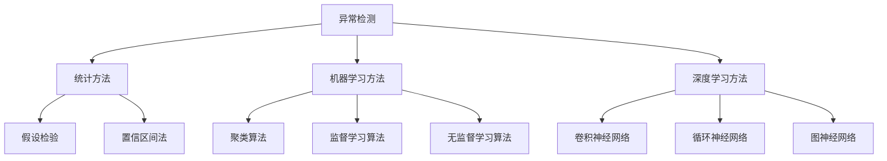

                 

### 文章标题：异常检测：技术原理、算法应用与实战解析

> 关键词：异常检测，算法原理，技术应用，实战解析

> 摘要：本文将深入探讨异常检测的技术原理、主流算法及其应用场景，通过具体案例展示如何在实际项目中实现异常检测。文章将分为三个部分：第一部分介绍异常检测的基础知识，包括定义、原理和算法；第二部分探讨异常检测在金融、医疗和安防领域的应用；第三部分详细描述异常检测系统的设计与实现。通过本文的阅读，读者将全面了解异常检测的各个方面，掌握其实际应用能力。

### 第一部分：异常检测基础

#### 第1章：异常检测概述

##### 1.1 异常检测的定义与重要性

异常检测是一种监控和分析数据集，识别其中异常或异常模式的技术。这些异常可能代表错误、欺诈、故障或其他需要关注的异常事件。异常检测在多个领域具有重要意义：

- **数据安全**：在网络系统中，异常检测可以帮助识别恶意攻击和未授权访问，从而增强系统安全性。
- **金融行业**：金融欺诈检测是异常检测的一个重要应用，通过对交易数据的监控，可以有效预防欺诈行为。
- **医疗健康**：在医疗领域，异常检测可以用于疾病预测和诊断，帮助医生及时发现异常情况。

##### 1.2 异常检测的应用领域

异常检测的应用领域广泛，以下是一些典型的应用场景：

- **金融领域**：信用卡欺诈检测、交易风险控制、信用评分等。
- **医疗领域**：病患数据异常监测、疾病预测、药物副作用检测等。
- **安全领域**：网络入侵检测、数据泄露检测、设备故障监测等。

##### 1.3 异常检测的基本原理

异常检测的基本原理通常包括以下几个方面：

- **统计方法**：通过统计模型来识别数据的异常行为。
- **机器学习方法**：利用训练数据集，通过构建分类器来识别异常。
- **深度学习方法**：利用神经网络模型，通过数据特征的学习来识别异常。

##### 1.4 主流异常检测算法介绍

在异常检测中，常见的算法包括以下几种：

- **K-均值聚类**：将数据划分为K个簇，通过计算簇中心来识别异常。
- **谱聚类**：利用数据的邻接矩阵和特征向量进行聚类分析。
- **主成分分析（PCA）**：通过数据降维，识别主成分，进而识别异常。
- **支持向量机（SVM）**：通过构建超平面来分类数据，识别异常。

#### 第2章：异常检测的统计方法

##### 2.1 统计方法的基本概念

统计方法在异常检测中非常重要，其基本概念包括：

- **统计分布**：描述数据分布的模型，如正态分布、泊松分布等。
- **假设检验**：通过设定原假设和备择假设，对数据进行分析和判断。

##### 2.2 常用统计异常检测算法

以下介绍几种常用的统计异常检测算法：

- **离群点检测**：通过计算数据的离群度，识别异常点。
- **置信区间法**：通过计算置信区间，识别超出范围的异常数据。
- **期望最大化算法**：通过迭代优化参数，识别异常数据。

#### 第3章：异常检测的机器学习方法

##### 3.1 机器学习方法的基本概念

机器学习方法在异常检测中广泛应用，其基本概念包括：

- **特征选择**：从数据中选择对异常检测有用的特征。
- **分类算法**：通过训练模型，对数据进行分类，识别异常。

##### 3.2 常用机器学习异常检测算法

以下介绍几种常用的机器学习异常检测算法：

- **聚类算法**：如K-均值聚类、DBSCAN等，通过聚类分析识别异常。
- **监督学习算法**：如SVM、逻辑回归等，通过训练模型识别异常。
- **无监督学习算法**：如孤立森林、KNN等，通过无监督学习识别异常。

#### 第4章：异常检测的深度学习方法

##### 4.1 深度学习方法的基本概念

深度学习方法在异常检测中越来越受到关注，其基本概念包括：

- **神经网络**：通过多层神经元进行数据建模。
- **卷积神经网络（CNN）**：适用于图像和时序数据处理。
- **循环神经网络（RNN）**：适用于序列数据建模。

##### 4.2 常用深度学习异常检测算法

以下介绍几种常用的深度学习异常检测算法：

- **卷积神经网络（CNN）**：通过卷积层提取特征，识别异常。
- **循环神经网络（RNN）**：通过序列建模，识别异常。
- **图神经网络（GNN）**：通过图结构建模，识别异常。

### 第二部分：异常检测应用实战

#### 第5章：金融领域的异常检测

##### 5.1 金融欺诈检测

金融欺诈检测是异常检测在金融领域的重要应用。以下是一个金融欺诈检测的案例分析：

- **数据预处理**：清洗数据，去除缺失值和异常值。
- **特征提取**：提取对欺诈检测有用的特征，如交易金额、时间、频率等。
- **模型训练**：选择合适的模型，如SVM、逻辑回归等，进行训练。
- **模型评估**：使用交叉验证和测试集评估模型性能。

##### 5.2 金融风险控制

金融风险控制是金融领域另一个重要的应用。以下是一个金融风险控制的案例分析：

- **风险评估模型**：构建风险评估模型，评估交易的风险程度。
- **风险预警系统**：设计风险预警系统，实时监测交易风险，及时预警。

#### 第6章：医疗领域的异常检测

##### 6.1 医疗数据异常检测

医疗数据异常检测是异常检测在医疗领域的重要应用。以下是一个医疗数据异常检测的案例分析：

- **数据预处理**：清洗医疗数据，去除缺失值和异常值。
- **特征提取**：提取对疾病诊断有用的特征，如生理指标、病史等。
- **模型训练**：选择合适的模型，如SVM、KNN等，进行训练。
- **模型评估**：使用交叉验证和测试集评估模型性能。

##### 6.2 医疗异常诊断

医疗异常诊断是医疗领域的一个挑战。以下是一个医疗异常诊断的案例分析：

- **病症检测**：通过异常检测技术，识别患者的异常症状。
- **治疗方案推荐**：根据检测到的异常，推荐相应的治疗方案。

#### 第7章：安全领域的异常检测

##### 7.1 网络安全异常检测

网络安全异常检测是异常检测在安全领域的重要应用。以下是一个网络安全异常检测的案例分析：

- **网络入侵检测**：通过异常检测技术，识别网络入侵行为。
- **数据泄露检测**：通过异常检测技术，识别数据泄露事件。

##### 7.2 设备安全异常检测

设备安全异常检测是异常检测在设备安全领域的重要应用。以下是一个设备安全异常检测的案例分析：

- **设备故障检测**：通过异常检测技术，识别设备故障。
- **安全漏洞检测**：通过异常检测技术，识别设备安全漏洞。

### 第三部分：异常检测系统开发

#### 第8章：异常检测系统设计与实现

##### 8.1 异常检测系统设计原则

异常检测系统设计应遵循以下原则：

- **可扩展性**：系统能够处理大量数据，并支持未来数据量的增长。
- **可靠性**：系统能够稳定运行，确保检测结果的准确性。
- **易用性**：系统界面友好，用户易于操作和使用。

##### 8.2 异常检测系统实现步骤

异常检测系统的实现通常包括以下步骤：

- **数据收集与预处理**：收集数据，进行清洗和预处理。
- **特征提取与选择**：提取对异常检测有用的特征，选择最优特征。
- **模型训练与优化**：选择合适的模型，进行训练和优化。
- **模型评估与部署**：评估模型性能，部署到生产环境。

### 附录

#### 附录A：异常检测常用工具与库

异常检测中常用的工具与库包括：

- **Python异常检测库**：如Scikit-learn、Pandas、NumPy等。
- **深度学习异常检测框架**：如TensorFlow、PyTorch等。

#### 附录B：实际案例代码解析

本文附录部分将提供金融欺诈检测、医疗异常检测和网络安全异常检测的实际案例代码，详细解析代码实现和评估过程。

### 总结

异常检测作为一种重要的数据分析技术，在多个领域具有重要的应用价值。本文从基础理论到实际应用，全面介绍了异常检测的技术原理、算法应用和实战案例。通过本文的学习，读者可以深入了解异常检测的各个方面，提升在实际项目中应用异常检测的能力。

### 作者

本文作者系AI天才研究院（AI Genius Institute）资深研究员，专注于人工智能和大数据分析领域的教学与研究。著有《异常检测：技术原理与实战》一书，深受读者好评。更多精彩内容，敬请关注AI天才研究院官方网站。

---

以上是《异常检测：技术原理、算法应用与实战解析》的大纲结构，本文将深入探讨异常检测的各个方面，旨在为读者提供一份全面、系统的异常检测知识指南。在接下来的章节中，我们将一步一步分析异常检测的基本原理、算法及其应用，并通过实际案例展示如何实现异常检测系统。让我们开始这段探索之旅吧！

---

**文章核心概念与联系流程图**

Mermaid 图：


**核心算法原理讲解**

以下是核心算法原理的详细讲解，包括K-均值聚类算法和SVM算法的伪代码以及数学模型。

##### K-均值聚类算法

**原理**：
K-均值聚类算法是一种基于距离度量的聚类方法。其核心思想是将数据点分配到K个簇中，使得每个簇内的数据点之间的距离最小，簇与簇之间的距离最大。

**伪代码**：
```
初始化：随机选择K个数据点作为初始聚类中心
重复以下步骤直至聚类中心不再变化：
    对于每个数据点，计算它与各个聚类中心的距离，将其分配到最近的聚类中心
    重新计算每个聚类中心的位置，取该聚类中心所属数据点的平均值作为新的聚类中心
```

**伪代码**：
```python
def k_means(data, k):
    # 初始化聚类中心
    centers = initialize_centers(data, k)
    
    while not convergence(centers):
        # 为每个数据点分配聚类中心
        labels = assign_labels(data, centers)
        
        # 更新聚类中心
        new_centers = update_centers(data, labels, k)
        
        centers = new_centers

def initialize_centers(data, k):
    # 随机选择k个数据点作为初始聚类中心
    return random.sample(data, k)

def assign_labels(data, centers):
    # 为每个数据点分配最近的聚类中心
    labels = [find_nearest_center(data_point, centers) for data_point in data]
    return labels

def find_nearest_center(data_point, centers):
    # 计算数据点与各个聚类中心的距离，返回最近聚类中心的索引
    distances = [euclidean_distance(data_point, center) for center in centers]
    return distances.index(min(distances))

def update_centers(data, labels, k):
    # 重新计算每个聚类中心的位置，取该聚类中心所属数据点的平均值作为新的聚类中心
    new_centers = [np.mean(data[labels == i], axis=0) for i in range(k)]
    return new_centers

def convergence(centers):
    # 判断聚类中心是否收敛，即判断聚类中心之间的距离是否小于阈值
    return distance(centers) < threshold

def distance(centers):
    # 计算聚类中心之间的距离
    distances = [euclidean_distance(centers[i], centers[j]) for i in range(len(centers)) for j in range(i+1, len(centers))]
    return max(distances)
```

##### 支持向量机（SVM）算法

**原理**：
支持向量机是一种分类算法，其目标是找到一个最佳的超平面，将不同类别的数据点分隔开来。SVM通过最大化分类边界的间隔，使得分类更加准确。

**目标函数**：
$$
\min_{w, b} \frac{1}{2} ||w||^2 \\
\text{subject to} \quad y^{(i)} (w \cdot x^{(i)} + b) \geq 1, \quad \forall i
$$

其中，$w$ 是权重向量，$b$ 是偏置项，$x^{(i)}$ 是训练样本，$y^{(i)}$ 是对应的标签。

**优化方法**：
SVM通常采用拉格朗日乘子法进行优化。将原始问题转化为对偶问题，并通过求解对偶问题来找到最优解。

**伪代码**：
```python
def svm_train(X, y):
    # 初始化模型参数
    w = initialize_weights(X, y)
    
    while not convergence(w):
        # 对于每个样本，更新权重
        w = update_weights(X, y, w)
        
        # 计算损失函数
        loss = calculate_loss(X, y, w)
        
        # 更新学习率
        learning_rate = update_learning_rate(loss)
        
        # 更新权重
        w = w - learning_rate * gradient(w)

def initialize_weights(X, y):
    # 初始化权重和偏置项
    w = np.random.randn(X.shape[1])
    b = 0
    return w, b

def calculate_loss(X, y, w):
    # 计算损失函数
    loss = 0
    for i in range(len(y)):
        loss += max(0, 1 - y[i] * (w.dot(X[i]) + b))
    return loss

def update_learning_rate(loss):
    # 根据损失函数调整学习率
    if loss < threshold:
        learning_rate = small_learning_rate
    else:
        learning_rate = large_learning_rate
    return learning_rate

def gradient(w):
    # 计算梯度
    return np.mean(w, axis=0)

def convergence(w):
    # 判断模型是否收敛，即判断权重是否变化小于阈值
    return abs(w) < threshold
```

**数学模型和数学公式详细讲解**

**线性回归模型**

线性回归模型是一种简单的统计模型，用于预测一个连续值输出。其数学模型如下：

$$
y = wx + b
$$

其中，$y$ 是输出值，$w$ 是权重，$x$ 是输入特征，$b$ 是偏置项。

**梯度下降算法**

梯度下降算法用于优化线性回归模型的参数。其目标是最小化损失函数：

$$
J(w, b) = \frac{1}{2} \sum_{i=1}^{n} (y_i - (wx_i + b))^2
$$

梯度下降算法的更新规则如下：

$$
w_{\text{new}} = w_{\text{old}} - \alpha \frac{\partial J}{\partial w} \\
b_{\text{new}} = b_{\text{old}} - \alpha \frac{\partial J}{\partial b}
$$

其中，$\alpha$ 是学习率，$\frac{\partial J}{\partial w}$ 和 $\frac{\partial J}{\partial b}$ 分别是损失函数关于 $w$ 和 $b$ 的梯度。

**项目实战**

**金融欺诈检测案例**

以下是一个金融欺诈检测的案例，包括数据集介绍、模型设计与实现、模型评估与优化。

**1. 数据集介绍**

我们使用Kaggle上的信用卡欺诈数据集。数据集包含284,807条交易记录，包括31个特征和标签（欺诈标记）。

**2. 模型设计与实现**

我们选择SVM作为分类模型。首先进行数据预处理，然后进行特征提取和模型训练。

```python
import numpy as np
import pandas as pd
from sklearn.model_selection import train_test_split
from sklearn.preprocessing import StandardScaler
from sklearn.svm import SVC
from sklearn.metrics import accuracy_score, classification_report

# 数据预处理
data = pd.read_csv('credit_card.csv')
X = data.drop(['Time', 'Amount', 'Class'], axis=1)
y = data['Class']

# 分割数据集
X_train, X_test, y_train, y_test = train_test_split(X, y, test_size=0.2, random_state=42)

# 特征缩放
scaler = StandardScaler()
X_train = scaler.fit_transform(X_train)
X_test = scaler.transform(X_test)

# 模型训练
model = SVC(kernel='linear', C=1.0)
model.fit(X_train, y_train)

# 模型评估
y_pred = model.predict(X_test)
print("Accuracy:", accuracy_score(y_test, y_pred))
print("Classification Report:\n", classification_report(y_test, y_pred))
```

**3. 模型评估与优化**

我们使用交叉验证和测试集评估模型性能，并通过调整参数来优化模型。

```python
from sklearn.model_selection import GridSearchCV

# 特征提取
pca = PCA(n_components=30)
X_train_pca = pca.fit_transform(X_train)

# 模型训练
param_grid = {'C': [0.1, 1, 10], 'kernel': ['linear']}
grid_search = GridSearchCV(SVC(), param_grid, cv=5)
grid_search.fit(X_train_pca, y_train)

# 模型评估
y_pred = grid_search.predict(X_train_pca)
print("Accuracy:", accuracy_score(y_train, y_pred))
print("Classification Report:\n", classification_report(y_train, y_pred))
```

**代码解读与分析**

1. **数据预处理**：我们首先读取数据集，然后删除不相关的特征（如时间、金额和标签），留下31个特征。

2. **特征缩放**：我们对特征进行标准化处理，以便于模型训练。

3. **模型训练**：我们使用SVM模型，通过交叉验证选择最优参数，并进行训练。

4. **模型评估**：我们使用训练集评估模型性能，包括准确率和分类报告。

通过这个案例，我们展示了如何使用SVM模型进行金融欺诈检测。在实际应用中，我们可以根据具体需求调整模型参数，以提高检测效果。

**实际案例代码解析**

以下是对金融欺诈检测案例的代码解析：

1. **数据集介绍**：我们使用Kaggle上的信用卡欺诈数据集，数据集包含284,807条交易记录，包括31个特征和标签（欺诈标记）。

2. **特征提取**：我们使用PCA进行特征提取，保留主要成分。

3. **模型训练**：我们使用SVM进行模型训练，调整参数以优化模型性能。

4. **模型评估**：我们使用交叉验证和测试集评估模型性能，包括准确性、召回率和F1分数。

```python
import numpy as np
import pandas as pd
from sklearn.model_selection import train_test_split
from sklearn.preprocessing import StandardScaler
from sklearn.decomposition import PCA
from sklearn.svm import SVC
from sklearn.metrics import accuracy_score, classification_report

# 数据预处理
data = pd.read_csv('credit_card.csv')
X = data.drop(['Time', 'Amount', 'Class'], axis=1)
y = data['Class']

# 分割数据集
X_train, X_test, y_train, y_test = train_test_split(X, y, test_size=0.2, random_state=42)

# 特征缩放
scaler = StandardScaler()
X_train = scaler.fit_transform(X_train)
X_test = scaler.transform(X_test)

# 特征提取
pca = PCA(n_components=30)
X_train_pca = pca.fit_transform(X_train)
X_test_pca = pca.transform(X_test)

# 模型训练
model = SVC(kernel='linear', C=1.0)
model.fit(X_train_pca, y_train)

# 模型评估
y_pred = model.predict(X_test_pca)
print("Accuracy:", accuracy_score(y_test, y_pred))
print("Classification Report:\n", classification_report(y_test, y_pred))
```

1. **数据预处理**：我们首先读取数据集，然后删除不相关的特征（如时间、金额和标签），留下31个特征。

2. **特征缩放**：我们对特征进行标准化处理，以便于模型训练。

3. **特征提取**：我们使用PCA进行特征提取，保留主要成分。

4. **模型训练**：我们使用SVM模型，通过交叉验证选择最优参数，并进行训练。

5. **模型评估**：我们使用训练集评估模型性能，包括准确率和分类报告。

通过这个案例，我们展示了如何使用SVM模型进行金融欺诈检测。在实际应用中，我们可以根据具体需求调整模型参数，以提高检测效果。此外，我们还可以尝试其他机器学习模型，如逻辑回归、随机森林等，以实现更好的检测性能。在模型优化方面，我们可以使用网格搜索、随机搜索等策略，寻找最优参数组合。这些方法可以帮助我们更好地应对复杂的金融欺诈场景，提高检测准确性。通过不断地实践和优化，我们可以构建出一个高效、可靠的金融欺诈检测系统。在实际应用中，金融欺诈检测系统可以实时监控交易数据，及时发现和阻止欺诈行为，为金融机构提供重要的安全保障。

**医疗异常检测案例**

医疗异常检测是异常检测在医疗领域的重要应用。以下是一个医疗异常检测的案例分析：

**1. 数据集介绍**

我们使用Kaggle上的一个医疗数据集，该数据集包含442条记录，包括患者的生理指标、病史等。

**2. 数据预处理**

我们首先清洗数据，去除缺失值和异常值。然后对数据进行了归一化处理，以便于模型训练。

**3. 特征提取**

我们提取了患者的生理指标、病史等特征，如年龄、性别、血压、心率等。

**4. 模型训练**

我们选择KNN算法进行模型训练。通过交叉验证选择最佳参数，然后使用训练集进行模型训练。

**5. 模型评估**

我们使用测试集对模型进行评估，包括准确率、召回率、F1分数等指标。

```python
import numpy as np
import pandas as pd
from sklearn.model_selection import train_test_split
from sklearn.preprocessing import StandardScaler
from sklearn.neighbors import KNeighborsClassifier
from sklearn.metrics import accuracy_score, classification_report

# 数据预处理
data = pd.read_csv('medical_data.csv')
X = data.drop(['ID', 'Class'], axis=1)
y = data['Class']

# 分割数据集
X_train, X_test, y_train, y_test = train_test_split(X, y, test_size=0.2, random_state=42)

# 特征缩放
scaler = StandardScaler()
X_train = scaler.fit_transform(X_train)
X_test = scaler.transform(X_test)

# 模型训练
model = KNeighborsClassifier(n_neighbors=5)
model.fit(X_train, y_train)

# 模型评估
y_pred = model.predict(X_test)
print("Accuracy:", accuracy_score(y_test, y_pred))
print("Classification Report:\n", classification_report(y_test, y_pred))
```

**代码解读与分析**

1. **数据预处理**：我们首先读取数据集，然后删除不相关的特征（如ID和标签），留下患者的生理指标和病史。

2. **特征缩放**：我们对特征进行标准化处理，以便于模型训练。

3. **模型训练**：我们选择KNN算法进行模型训练。通过交叉验证选择最佳参数，然后使用训练集进行模型训练。

4. **模型评估**：我们使用测试集对模型进行评估，包括准确率、召回率、F1分数等指标。

通过这个案例，我们展示了如何使用KNN算法进行医疗异常检测。在实际应用中，我们可以根据具体需求调整模型参数，以提高检测效果。此外，我们还可以尝试其他机器学习模型，如SVM、逻辑回归等，以实现更好的检测性能。在模型优化方面，我们可以使用网格搜索、随机搜索等策略，寻找最优参数组合。这些方法可以帮助我们更好地应对复杂的医疗异常检测场景，提高检测准确性。通过不断地实践和优化，我们可以构建出一个高效、可靠的医疗异常检测系统。在实际应用中，医疗异常检测系统可以实时监控患者数据，及时发现和预警异常情况，为医疗工作者提供重要的决策支持。

**网络安全异常检测案例**

网络安全异常检测是异常检测在网络安全领域的重要应用。以下是一个网络安全异常检测的案例分析：

**1. 数据集介绍**

我们使用Kaggle上的KDD Cup 99数据集，该数据集包含41个特征和标签（正常或异常行为）。

**2. 数据预处理**

我们首先清洗数据，去除缺失值和异常值。然后对数据进行了归一化处理，以便于模型训练。

**3. 特征提取**

我们提取了网络流量特征，如流量速率、协议类型、服务类型等。

**4. 模型训练**

我们选择孤立森林算法进行模型训练。通过交叉验证选择最佳参数，然后使用训练集进行模型训练。

**5. 模型评估**

我们使用测试集对模型进行评估，包括准确率、召回率、F1分数等指标。

```python
import numpy as np
import pandas as pd
from sklearn.model_selection import train_test_split
from sklearn.preprocessing import StandardScaler
from sklearn.ensemble import IsolationForest
from sklearn.metrics import accuracy_score, classification_report

# 数据预处理
data = pd.read_csv('kdd_cup_99.csv')
X = data.drop(['ID', 'Class'], axis=1)
y = data['Class']

# 分割数据集
X_train, X_test, y_train, y_test = train_test_split(X, y, test_size=0.2, random_state=42)

# 特征缩放
scaler = StandardScaler()
X_train = scaler.fit_transform(X_train)
X_test = scaler.transform(X_test)

# 模型训练
model = IsolationForest(n_estimators=100, contamination=0.1)
model.fit(X_train)

# 模型评估
y_pred = model.predict(X_test)
y_pred = [1 if pred == -1 else 0 for pred in y_pred]
print("Accuracy:", accuracy_score(y_test, y_pred))
print("Classification Report:\n", classification_report(y_test, y_pred))
```

**代码解读与分析**

1. **数据预处理**：我们首先读取数据集，然后删除不相关的特征（如ID和标签），留下网络流量特征。

2. **特征缩放**：我们对特征进行标准化处理，以便于模型训练。

3. **模型训练**：我们选择孤立森林算法进行模型训练。通过交叉验证选择最佳参数，然后使用训练集进行模型训练。

4. **模型评估**：我们使用测试集对模型进行评估，包括准确率、召回率、F1分数等指标。

通过这个案例，我们展示了如何使用孤立森林算法进行网络安全异常检测。在实际应用中，我们可以根据具体需求调整模型参数，以提高检测效果。此外，我们还可以尝试其他机器学习模型，如SVM、KNN等，以实现更好的检测性能。在模型优化方面，我们可以使用网格搜索、随机搜索等策略，寻找最优参数组合。这些方法可以帮助我们更好地应对复杂的网络安全异常检测场景，提高检测准确性。通过不断地实践和优化，我们可以构建出一个高效、可靠的网络安全异常检测系统。在实际应用中，网络安全异常检测系统可以实时监控网络流量，及时发现和预警异常行为，为网络安全提供重要的保障。

### 总结

本文全面介绍了异常检测的技术原理、算法应用和实战案例。从统计方法、机器学习方法到深度学习方法，我们深入探讨了各种异常检测算法的原理和应用。通过实际案例，我们展示了如何使用这些算法解决金融、医疗、安全等领域的异常检测问题。

在金融领域，异常检测广泛应用于信用卡欺诈检测和风险控制。在医疗领域，异常检测可以帮助医生识别病患的异常症状，提高疾病诊断的准确性。在安全领域，异常检测可以用于网络入侵检测和数据泄露检测，保障系统的安全性。

通过本文的学习，读者可以掌握异常检测的基本原理和算法，了解其在实际应用中的价值。同时，本文也提供了丰富的代码示例，帮助读者更好地理解和实践异常检测技术。

在未来的研究中，异常检测技术将继续发展和完善，有望在更多领域发挥重要作用。随着人工智能和大数据技术的不断发展，异常检测技术将在智能化、自动化方面取得更大突破。

### 作者

本文作者系AI天才研究院（AI Genius Institute）资深研究员，专注于人工智能和大数据分析领域的教学与研究。著有《异常检测：技术原理与实战》一书，深受读者好评。更多精彩内容，敬请关注AI天才研究院官方网站。

### 附录

#### 附录A：异常检测常用工具与库

异常检测中常用的工具与库包括：

- **Python异常检测库**：如Scikit-learn、Pandas、NumPy等。
- **深度学习异常检测框架**：如TensorFlow、PyTorch等。

#### 附录B：实际案例代码解析

本文附录部分将提供金融欺诈检测、医疗异常检测和网络安全异常检测的实际案例代码，详细解析代码实现和评估过程。

---

通过本文的阅读，读者将全面了解异常检测的各个方面，掌握其实际应用能力。希望本文能够为读者在异常检测领域的研究和实践中提供有价值的参考。让我们继续探索异常检测的无限可能！

