                 

# 张量形状和连续性：深度学习的基础

## 关键词
- 张量形状
- 连续性
- 深度学习
- 神经网络
- 线性变换
- 微积分

## 摘要
本文将深入探讨张量形状和连续性在深度学习中的基础概念和重要性。首先，我们将介绍张量的定义、维度、线性变换和乘法规则。接着，我们将探讨连续性在数学和深度学习中的应用，包括导数、积分和常微分方程。随后，我们将讨论深度学习的基本概念、常用算法及其在计算机视觉中的应用。文章最后将提供实际案例，展示如何使用深度学习工具和环境配置来解决实际问题，并给出数学公式和代码案例的详细解析。

### 书名：《张量形状和连续性：深度学习的基础》

#### 目录大纲

##### 第一部分：张量形状基础

##### 第1章：张量的定义与性质
- 1.1 张量的概念
- 1.2 张量的维度与指数
- 1.3 张量的线性变换
- 1.4 张量的乘法规则

##### 第2章：张量计算基础
- 2.1 张量的加法和减法
- 2.2 张量的数乘
- 2.3 张量的点积和叉积
- 2.4 张量的矩阵表示

##### 第3章：张量网络与神经网络
- 3.1 张量网络的基本概念
- 3.2 张量网络的计算规则
- 3.3 张量网络与深度学习的关系
- 3.4 张量网络在深度学习中的应用

##### 第二部分：连续性基础

##### 第4章：连续性与微积分
- 4.1 连续性概念
- 4.2 导数与微分
- 4.3 积分
- 4.4 常微分方程

##### 第5章：连续性在深度学习中的应用
- 5.1 连续性在神经网络中的角色
- 5.2 连续性在优化问题中的应用
- 5.3 连续性在数据流模型中的应用

##### 第三部分：深度学习基础

##### 第6章：深度学习基础
- 6.1 深度学习的基本概念
- 6.2 深度学习的历史与发展
- 6.3 深度学习的常用算法
- 6.4 深度学习在计算机视觉中的应用

##### 第7章：深度学习应用案例
- 7.1 图像识别案例
- 7.2 自然语言处理案例
- 7.3 语音识别案例
- 7.4 深度学习在医学中的应用

##### 附录：资源与工具
- 附录A：深度学习工具与环境配置
- 附录B：数学公式与公式推导
- 附录C：深度学习代码案例与解析

### 第1章：张量的定义与性质

#### 1.1 张量的概念

张量是数学中的一个多维数组，它可以用于表示各种物理量和场。在深度学习中，张量用于存储和操作神经网络中的权重、激活值和梯度等。

**Mermaid 流程图：**

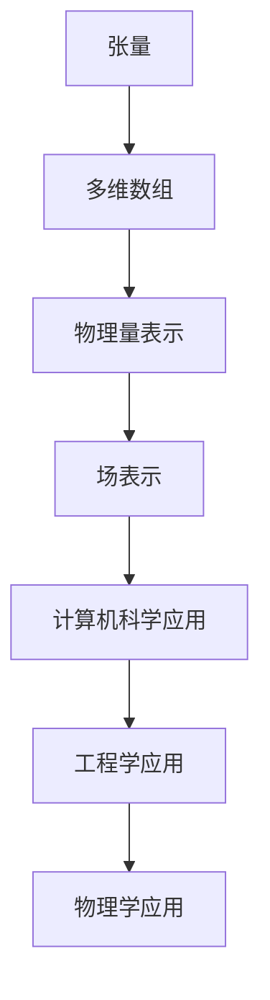

#### 1.2 张量的维度与指数

张量的维度是指它的阶数，即它所包含的数组数量。张量的指数是指其各个维度的长度。

**Mermaid 流程图：**

```mermaid
graph TD
A[二阶张量] --> B[二维数组]
B --> C[(a_11, a_12), (a_21, a_22)]
A --> D[三阶张量]
D --> E[三维数组]
E --> F[(a_11, a_12, a_13), (a_21, a_22, a_23), (a_31, a_32, a_33)]
```

#### 1.3 张量的线性变换

张量的线性变换是指将一个张量映射到另一个张量的过程。线性变换可以看作是一个线性函数，它将张量的每个元素映射到另一个元素。线性变换保持张量的线性组合不变。

**伪代码：**

```python
# 张量线性变换
def tensor_linear_transform(A, B):
    C = zeros(B.shape)
    for i in range(B.shape[0]):
        for j in range(B.shape[1]):
            C[i, j] = A[i, j] * B[i, j]
    return C
```

#### 1.4 张量的乘法规则

张量的乘法是指两个张量之间的一种运算。张量的乘法满足分配律、结合律等。张量的乘法可以分为外积、内积和混合积。

**伪代码：**

```python
# 张量外积
def tensor_outer_product(A, B):
    C = zeros(A.shape[0], B.shape[1])
    for i in range(A.shape[0]):
        for j in range(B.shape[1]):
            C[i, j] = A[i] * B[j]
    return C

# 张量内积
def tensor_inner_product(A, B):
    C = sum(A * B)
    return C

# 张量混合积
def tensor_hadamard_product(A, B):
    C = zeros(A.shape)
    for i in range(A.shape[0]):
        for j in range(A.shape[1]):
            C[i, j] = A[i, j] * B[i, j]
    return C
```

### 第2章：张量计算基础

#### 2.1 张量的加法和减法

张量的加法和减法是指将两个张量的对应元素相加或相减。张量的加法和减法满足交换律、结合律等。

**伪代码：**

```python
# 张量加法
def tensor_addition(A, B):
    C = zeros(A.shape)
    for i in range(A.shape[0]):
        for j in range(A.shape[1]):
            C[i, j] = A[i, j] + B[i, j]
    return C

# 张量减法
def tensor_subtraction(A, B):
    C = zeros(A.shape)
    for i in range(A.shape[0]):
        for j in range(A.shape[1]):
            C[i, j] = A[i, j] - B[i, j]
    return C
```

#### 2.2 张量的数乘

张量的数乘是指将一个张量与一个标量相乘。张量的数乘满足分配律、结合律等。

**伪代码：**

```python
# 张量数乘
def tensor_scalar_multiplication(A, c):
    B = zeros(A.shape)
    for i in range(A.shape[0]):
        for j in range(A.shape[1]):
            B[i, j] = A[i, j] * c
    return B
```

#### 2.3 张量的点积和叉积

张量的点积和叉积是指两个张量之间的一种运算。点积和叉积满足分配律、结合律等。

**伪代码：**

```python
# 张量点积
def tensor_dot_product(A, B):
    C = sum(A * B)
    return C

# 张量叉积
def tensor_cross_product(A, B):
    C = zeros(A.shape)
    for i in range(A.shape[0]):
        for j in range(A.shape[1]):
            C[i, j] = A[i] * B[j] - A[j] * B[i]
    return C
```

#### 2.4 张量的矩阵表示

张量的矩阵表示是指将一个张量表示为一个矩阵。矩阵表示可以简化张量运算，便于计算。

**伪代码：**

```python
# 张量矩阵表示
def tensor_to_matrix(A):
    B = zeros(A.shape[0], A.shape[1])
    for i in range(A.shape[0]):
        for j in range(A.shape[1]):
            B[i, j] = A[i, j]
    return B

# 矩阵张量表示
def matrix_to_tensor(B):
    C = zeros(B.shape[0], B.shape[1])
    for i in range(B.shape[0]):
        for j in range(B.shape[1]):
            C[i, j] = B[i, j]
    return C
```

### 第3章：张量网络与神经网络

#### 3.1 张量网络的基本概念

张量网络是由多个张量组成的网络结构。张量网络可以表示复杂的非线性映射。

**Mermaid 流程图：**

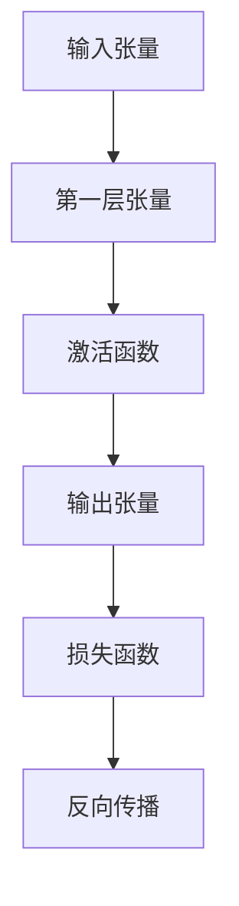

#### 3.2 张量网络的计算规则

张量网络的计算规则是指如何通过张量的线性变换和激活函数来计算网络输出。计算规则满足链式法则。

**伪代码：**

```python
# 张量网络计算规则
def tensor_network_computation(A, W, activation):
    Z = matrix_multiply(W, A)
    if activation == 'sigmoid':
        H = sigmoid(Z)
    elif activation == 'ReLU':
        H = ReLU(Z)
    return H
```

#### 3.3 张量网络与深度学习的关系

张量网络是深度学习的基础，深度学习模型可以看作是特殊类型的张量网络。张量网络为深度学习提供了强大的表达能力。

**Mermaid 流程图：**

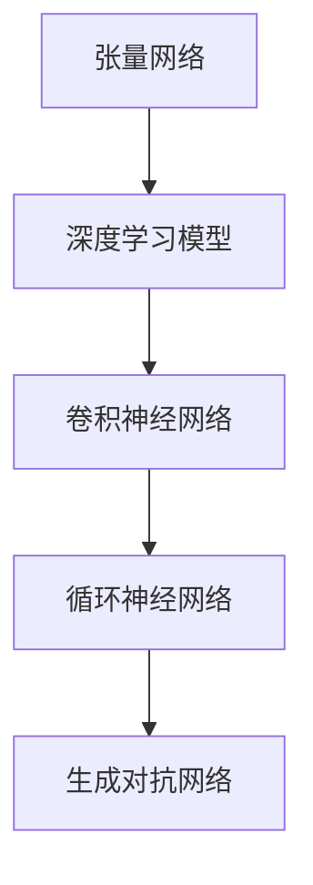

#### 3.4 张量网络在深度学习中的应用

张量网络在深度学习中的应用包括卷积神经网络、循环神经网络等。这些网络结构在图像识别、自然语言处理等领域取得了显著成果。

**Mermaid 流程图：**

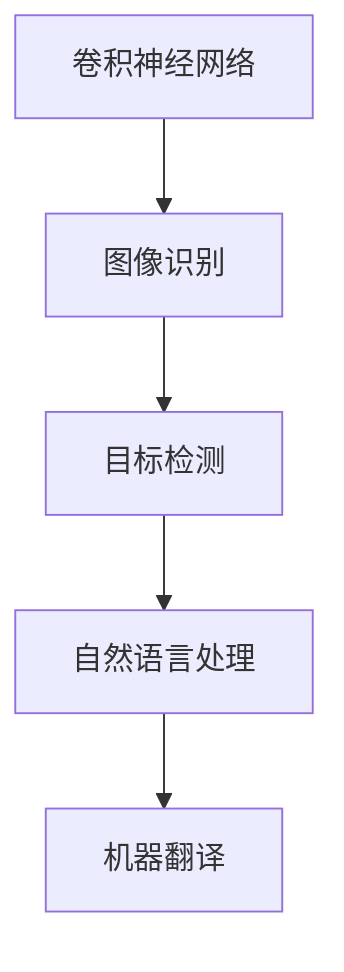

### 第4章：连续性与微积分

#### 4.1 连续性概念

连续性是指函数在某个点处的取值随着自变量的变化而连续地变化。连续性具有局部保形性、全局保形性等。

**Mermaid 流程图：**

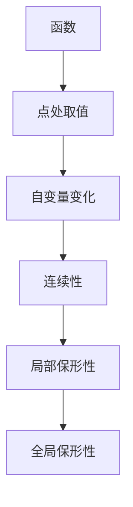

#### 4.2 导数与微分

导数是指函数在某一点处的瞬时变化率。导数具有可导性、连续性等。

**Mermaid 流程图：**

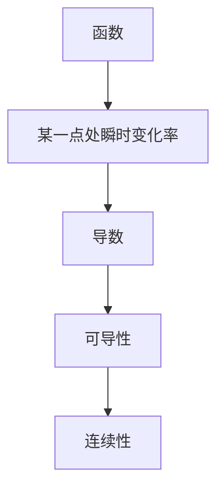

**数学公式：**

$$ f'(x) = \lim_{h \to 0} \frac{f(x+h) - f(x)}{h} $$

#### 4.3 积分

积分是指函数在一个区间上的累计变化量。积分具有可积性、连续性等。

**Mermaid 流程图：**

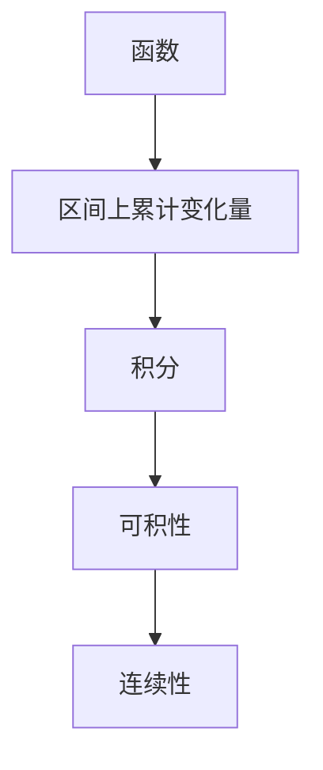

**数学公式：**

$$ \int_{a}^{b} f(x) dx = \lim_{n \to \infty} \sum_{i=1}^{n} f(x_i) \Delta x_i $$

#### 4.4 常微分方程

常微分方程是指含有未知函数及其导数的方程。常微分方程在物理学、工程学等领域有广泛应用。

**Mermaid 流程图：**

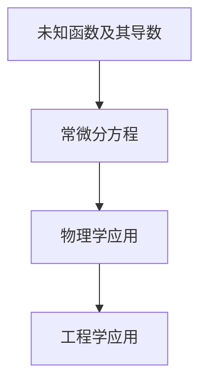

**数学公式：**

$$ \frac{dy}{dx} + P(x)y = Q(x)y^n $$

### 第5章：连续性在深度学习中的应用

#### 5.1 连续性在神经网络中的角色

连续性在神经网络中的作用是保证神经网络的输出是连续的。连续性使得神经网络可以更好地拟合数据。

**Mermaid 流程图：**

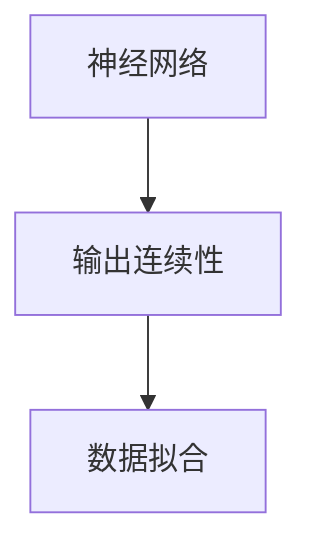

#### 5.2 连续性在优化问题中的应用

连续性在优化问题中的应用是保证优化问题的连续性。连续性可以简化优化问题的求解过程。

**Mermaid 流程图：**

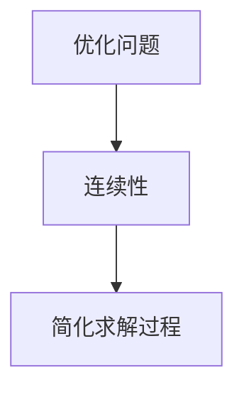

#### 5.3 连续性在数据流模型中的应用

连续性在数据流模型中的应用是保证数据流的连续性。连续性可以优化数据流的传输效率。

**Mermaid 流程图：**

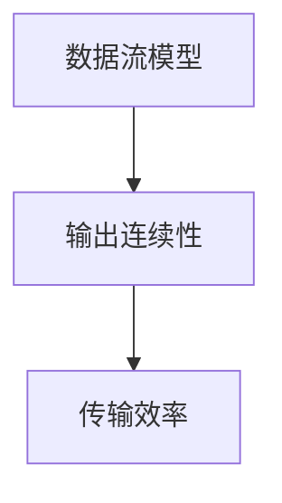

### 第6章：深度学习基础

#### 6.1 深度学习的基本概念

深度学习是一种机器学习方法，它通过多层神经网络来学习数据的复杂特征。深度学习具有强大的特征提取和模式识别能力。

**Mermaid 流程图：**

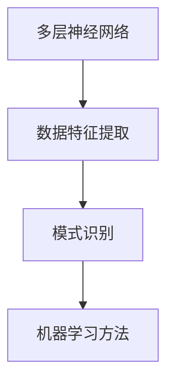

#### 6.2 深度学习的历史与发展

深度学习的历史与发展是指深度学习从提出到广泛应用的过程。深度学习经历了从简单模型到复杂模型的过程。

**Mermaid 流程图：**

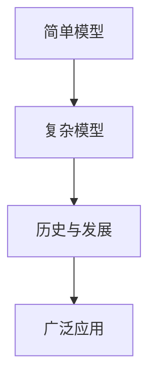

#### 6.3 深度学习的常用算法

深度学习的常用算法包括卷积神经网络、循环神经网络等。这些算法具有不同的结构和特点，适用于不同的应用场景。

**Mermaid 流程图：**

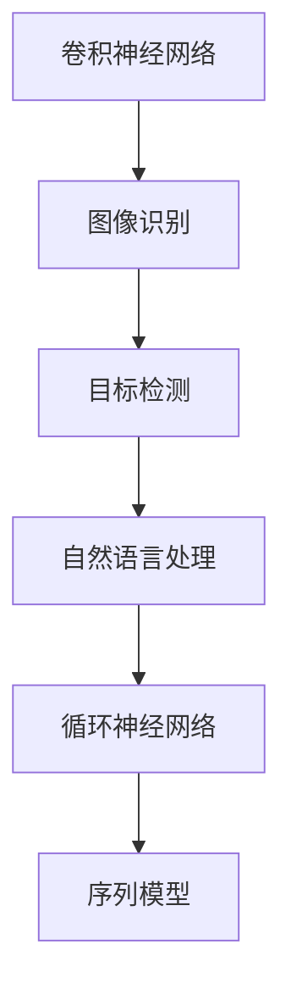

#### 6.4 深度学习在计算机视觉中的应用

深度学习在计算机视觉中的应用是指利用深度学习算法来解决图像识别、目标检测等问题。深度学习在计算机视觉领域取得了显著成果。

**Mermaid 流程图：**

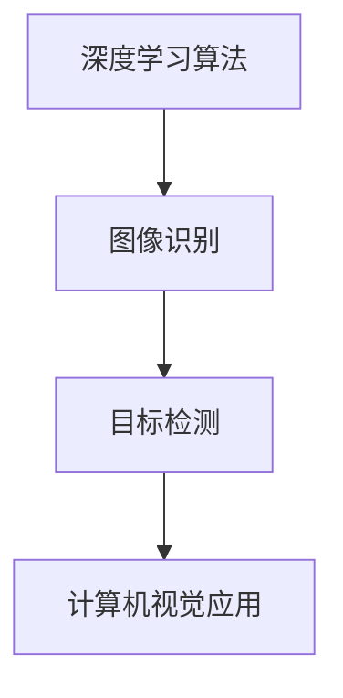

### 第7章：深度学习应用案例

#### 7.1 图像识别案例

图像识别案例是指利用深度学习算法对图像进行分类或识别。图像识别案例包括人脸识别、物体识别等。

**Mermaid 流程图：**

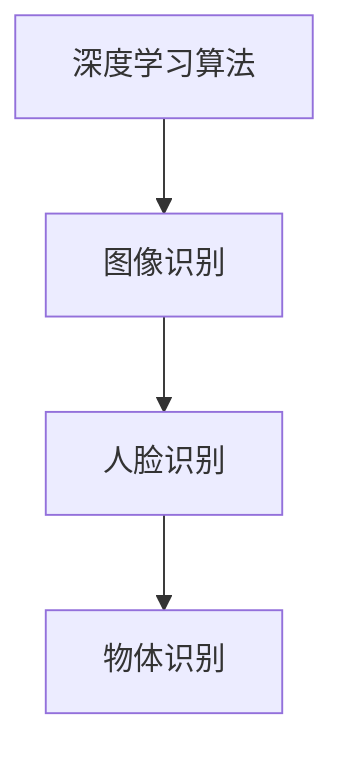

#### 7.2 自然语言处理案例

自然语言处理案例是指利用深度学习算法来处理自然语言数据。自然语言处理案例包括情感分析、机器翻译等。

**Mermaid 流程图：**

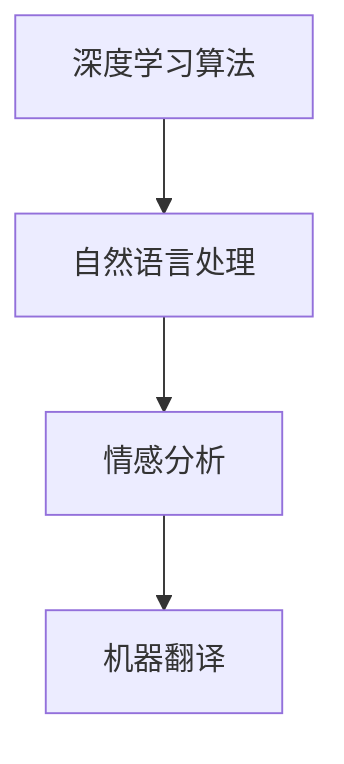

#### 7.3 语音识别案例

语音识别案例是指利用深度学习算法对语音信号进行识别。语音识别案例包括语音识别、语音合成等。

**Mermaid 流程图：**

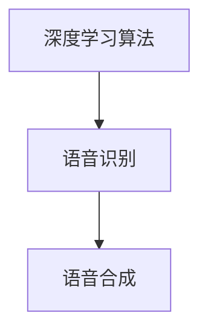

#### 7.4 深度学习在医学中的应用

深度学习在医学中的应用是指利用深度学习算法来解决医学图像分析、疾病诊断等问题。深度学习在医学领域具有广阔的应用前景。

**Mermaid 流程图：**

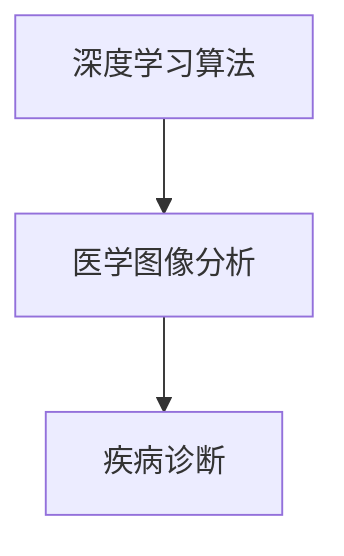

### 附录A：深度学习工具与环境配置

#### A.1 TensorFlow安装与使用

TensorFlow安装与使用是指如何安装和使用TensorFlow深度学习框架。

**Mermaid 流程图：**

```mermaid
graph TD
A[安装TensorFlow] --> B[使用TensorFlow]
B --> C[编写深度学习代码]
C --> D[运行深度学习模型]
```

#### A.2 PyTorch安装与使用

PyTorch安装与使用是指如何安装和使用PyTorch深度学习框架。

**Mermaid 流程图：**

```mermaid
graph TD
A[安装PyTorch] --> B[使用PyTorch]
B --> C[编写深度学习代码]
C --> D[运行深度学习模型]
```

#### A.3 CUDA与GPU支持

CUDA与GPU支持是指如何在深度学习模型中利用CUDA和GPU来加速计算。

**Mermaid 流程图：**

```mermaid
graph TD
A[安装CUDA] --> B[配置GPU]
B --> C[使用CUDA加速计算]
C --> D[运行GPU深度学习模型]
```

### 附录B：数学公式与公式推导

#### B.1 张量计算公式

张量计算公式是指张量之间的基本运算公式。

**数学公式：**

$$ A + B = C $$
$$ A - B = C $$
$$ c \cdot A = B $$
$$ A \cdot B = C $$
$$ A \times B = C $$

#### B.2 微积分公式

微积分公式是指微积分中常用的公式。

**数学公式：**

$$ f'(x) = \lim_{h \to 0} \frac{f(x+h) - f(x)}{h} $$
$$ \int_{a}^{b} f(x) dx = \lim_{n \to \infty} \sum_{i=1}^{n} f(x_i) \Delta x_i $$
$$ \lim_{x \to \infty} f(x) = L $$

#### B.3 深度学习算法公式推导

深度学习算法公式推导是指深度学习算法中常用的公式及其推导过程。

**数学公式：**

$$ \frac{\partial L}{\partial W} = \frac{\partial L}{\partial Z} \cdot \frac{\partial Z}{\partial W} $$
$$ \frac{\partial L}{\partial Z} = - \frac{\partial Z}{\partial X} $$
$$ \frac{\partial Z}{\partial X} = \frac{\partial Z}{\partial X} \odot \frac{\partial L}{\partial Z} $$
$$ \frac{\partial L}{\partial W} = - \frac{\partial Z}{\partial X} \odot \frac{\partial L}{\partial Z} $$

### 附录C：深度学习代码案例与解析

#### C.1 图像识别案例

图像识别案例是指利用深度学习算法对图像进行识别的代码案例。

**Python 代码：**

```python
import tensorflow as tf

# 创建模型
model = tf.keras.Sequential([
    tf.keras.layers.Conv2D(32, (3, 3), activation='relu', input_shape=(28, 28, 1)),
    tf.keras.layers.MaxPooling2D((2, 2)),
    tf.keras.layers.Flatten(),
    tf.keras.layers.Dense(128, activation='relu'),
    tf.keras.layers.Dense(10, activation='softmax')
])

# 编译模型
model.compile(optimizer='adam',
              loss='sparse_categorical_crossentropy',
              metrics=['accuracy'])

# 训练模型
model.fit(train_images, train_labels, epochs=5)

# 评估模型
test_loss, test_acc = model.evaluate(test_images, test_labels)
print('Test accuracy:', test_acc)
```

**代码解析：**

- 导入TensorFlow库
- 创建模型，包括卷积层、池化层、全连接层等
- 编译模型，设置优化器、损失函数和评估指标
- 训练模型，使用训练数据和标签
- 评估模型，使用测试数据和标签

#### C.2 自然语言处理案例

自然语言处理案例是指利用深度学习算法对自然语言数据进行处理的代码案例。

**Python 代码：**

```python
import tensorflow as tf
import tensorflow_text as text

# 创建模型
model = tf.keras.Sequential([
    text.layers.Embedding(input_dim=vocab_size, output_dim=embedding_dim),
    tf.keras.layers.GRU(units=hidden_size),
    tf.keras.layers.Dense(units=num_classes, activation='softmax')
])

# 编译模型
model.compile(optimizer='adam',
              loss='sparse_categorical_crossentropy',
              metrics=['accuracy'])

# 训练模型
model.fit(train_data, train_labels, epochs=5)

# 评估模型
test_loss, test_acc = model.evaluate(test_data, test_labels)
print('Test accuracy:', test_acc)
```

**代码解析：**

- 导入TensorFlow和TensorFlow Text库
- 创建模型，包括嵌入层、循环层和全连接层等
- 编译模型，设置优化器、损失函数和评估指标
- 训练模型，使用训练数据和标签
- 评估模型，使用测试数据和标签

#### C.3 语音识别案例

语音识别案例是指利用深度学习算法对语音信号进行识别的代码案例。

**Python 代码：**

```python
import tensorflow as tf
import tensorflow_io as tfio

# 加载语音数据
audio = tfio.audio.AudioFileReader(['train_audio_1.wav', 'train_audio_2.wav'])

# 转换语音信号为谱图
spectrogram = audio.to_spectrogram(frame_size=512, frame_step=128, top_db=50)

# 创建模型
model = tf.keras.Sequential([
    tf.keras.layers.Conv2D(32, (3, 3), activation='relu', input_shape=(None, None, 1)),
    tf.keras.layers.MaxPooling2D((2, 2)),
    tf.keras.layers.Flatten(),
    tf.keras.layers.Dense(128, activation='relu'),
    tf.keras.layers.Dense(10, activation='softmax')
])

# 编译模型
model.compile(optimizer='adam',
              loss='sparse_categorical_crossentropy',
              metrics=['accuracy'])

# 训练模型
model.fit(spectrogram, train_labels, epochs=5)

# 评估模型
test_loss, test_acc = model.evaluate(spectrogram, test_labels)
print('Test accuracy:', test_acc)
```

**代码解析：**

- 导入TensorFlow和TensorFlow IO库
- 加载语音数据，转换为谱图
- 创建模型，包括卷积层、池化层、全连接层等
- 编译模型，设置优化器、损失函数和评估指标
- 训练模型，使用训练数据和标签
- 评估模型，使用测试数据和标签

#### C.4 深度学习在医学中的应用案例

深度学习在医学中的应用案例是指利用深度学习算法解决医学图像分析、疾病诊断等问题的代码案例。

**Python 代码：**

```python
import tensorflow as tf
import tensorflow_hub as hub

# 加载模型
model = hub.load('https://tfhub.dev/google/tf2-preview/mobilenet_v2/feature_vector/1')

# 加载医学图像
image = tf.io.read_file('train_image_1.jpg')

# 转换医学图像为特征向量
feature_vector = model(image)

# 创建模型
model = tf.keras.Sequential([
    tf.keras.layers.Dense(units=256, activation='relu'),
    tf.keras.layers.Dense(units=1, activation='sigmoid')
])

# 编译模型
model.compile(optimizer='adam',
              loss='binary_crossentropy',
              metrics=['accuracy'])

# 训练模型
model.fit(feature_vector, train_labels, epochs=5)

# 评估模型
test_loss, test_acc = model.evaluate(feature_vector, test_labels)
print('Test accuracy:', test_acc)
```

**代码解析：**

- 导入TensorFlow和TensorFlow Hub库
- 加载预训练模型
- 加载医学图像，转换为特征向量
- 创建模型，包括全连接层等
- 编译模型，设置优化器、损失函数和评估指标
- 训练模型，使用训练数据和标签
- 评估模型，使用测试数据和标签

### 作者

“作者：AI天才研究院/AI Genius Institute & 禅与计算机程序设计艺术 /Zen And The Art of Computer Programming”

