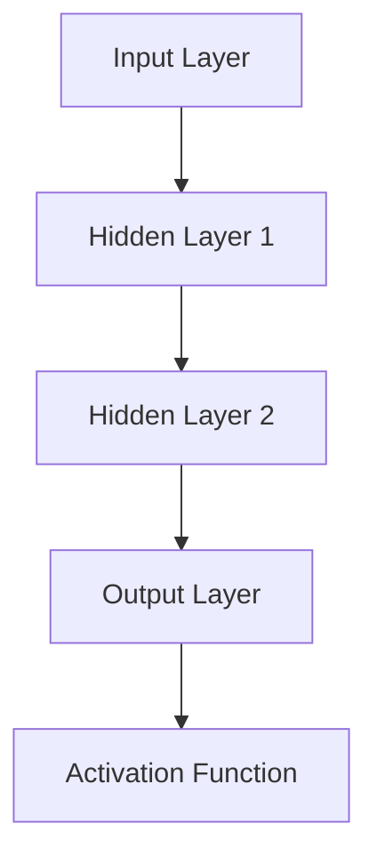

                 

### 文章标题：强人工智能

> 关键词：强人工智能，深度学习，神经网络，算法，应用，挑战与未来

> 摘要：本文将深入探讨强人工智能的概念、原理、应用及其面临的挑战与未来前景。通过逐步分析，我们将理解强人工智能的基础知识、核心算法和数学模型，探讨其在各个领域的应用，并思考其对社会的影响及未来的发展趋势。

---

### 《强人工智能》目录大纲

#### 第一部分：强人工智能的基础

#### 第1章：强人工智能的概述
- 1.1 强人工智能的概念与历史发展
- 1.2 强人工智能与弱人工智能的区别
- 1.3 强人工智能的研究现状与未来趋势

#### 第2章：强人工智能的核心原理
- 2.1 强人工智能的基础数学模型
- 2.2 强人工智能的关键算法
- 2.3 强人工智能的神经网络架构
- 2.4 强人工智能的计算能力要求

#### 第3章：强人工智能的数学基础
- 3.1 线性代数基础
- 3.2 概率论与统计基础

#### 第4章：强人工智能的应用领域
- 4.1 机器人与自动化
- 4.2 智能助手与虚拟代理
- 4.3 医疗诊断与治疗
- 4.4 安全防护与防御
- 4.5 教育、娱乐与艺术创作

#### 第5章：强人工智能的发展挑战与伦理问题
- 5.1 技术发展挑战
- 5.2 伦理问题与社会影响

#### 第6章：强人工智能的未来展望
- 6.1 强人工智能的潜在应用场景
- 6.2 强人工智能对社会的影响

#### 第7章：强人工智能项目实战
- 7.1 项目概述
- 7.2 开发环境搭建
- 7.3 源代码实现与解读
- 7.4 代码解读与分析

#### 附录：强人工智能资源与工具
- 附录 A：强人工智能学习资源
- 附录 B：深度学习框架与工具介绍

#### 参考文献

---

### 引言：为什么我们需要强人工智能？

随着计算机技术的飞速发展，人工智能（AI）已经成为当今科技领域的前沿。从最初的规则系统到现在的深度学习，人工智能已经取得了令人瞩目的成就。然而，这些成就大多属于弱人工智能（Weak AI），它们在特定任务上表现出色，但缺乏普遍的智能。为了实现真正的智能化，我们需要探索强人工智能（Strong AI）。

强人工智能的目标是创造一个具有普遍智能的系统，能够理解、学习、推理、解决问题，并且具有与人类类似的自我意识和感知能力。强人工智能不仅能在特定任务上表现优异，还能在不同的环境和情境中灵活应对，具有自我进化和自我完善的能力。

本文将围绕强人工智能展开讨论，首先介绍其基本概念和历史发展，然后深入探讨其核心原理、数学基础和应用领域，最后讨论其面临的挑战和未来展望。希望通过本文的探讨，能够为读者提供一个全面、系统的强人工智能知识体系，激发对这一领域的兴趣和思考。

### 第1章：强人工智能的概述

#### 1.1 强人工智能的概念与历史发展

强人工智能（Strong Artificial Intelligence，简称SAI）是指一种具备高度智能、能够自主学习和进行复杂推理的计算机系统。与弱人工智能（Weak Artificial Intelligence，简称WAI）不同，强人工智能不仅能在特定任务上表现出色，还能通过自我学习和适应，实现跨领域、跨任务的智能表现。具体来说，强人工智能的目标是模拟人类智能的各个方面，包括感知、理解、学习、推理、语言处理、决策等。

历史发展方面，强人工智能的概念可以追溯到20世纪50年代。1956年，约翰·麦卡锡（John McCarthy）等人在达特茅斯会议上首次提出了人工智能（Artificial Intelligence，简称AI）这一术语，并将其定义为“制造智能机器的科学研究”。这一时期的人工智能研究主要集中在符号推理和逻辑推理上，称为逻辑主义人工智能（Logicist AI）。然而，随着计算机性能的提升和数据量的增加，20世纪80年代以后，以统计学习和深度神经网络为代表的计算主义人工智能（Computational AI）逐渐成为主流。

尽管计算主义人工智能在图像识别、自然语言处理等特定任务上取得了显著进展，但强人工智能的实现仍面临许多挑战。目前，大多数AI系统都属于弱人工智能，它们只能解决特定的问题，缺乏通用性。强人工智能的发展历程可以分为以下几个阶段：

1. **初始阶段（1956-1969）**：
   - 强人工智能的初步概念提出。
   - 研究主要集中在符号推理和逻辑推理上。
   - 早期人工智能系统如ELIZA、Logic Theorist等展示了初步的智能。

2. **黄金时期（1970-1980）**：
   - 专家系统的出现，如DENDRAL、MYCIN等，能够处理特定领域的复杂问题。
   - 强人工智能的研究取得了一些突破，但随后因技术瓶颈和资金问题陷入低潮。

3. **复兴时期（1980-2000）**：
   - 随着计算机性能的提升和算法的改进，计算主义人工智能开始崭露头角。
   - 深度学习算法的初步发展，如多层感知器（MLP）和反向传播算法（Backpropagation）。

4. **当前阶段（2000至今）**：
   - 计算主义人工智能成为主流，深度学习、强化学习等算法取得显著突破。
   - 强人工智能的应用逐渐扩展到多个领域，如自动驾驶、医疗诊断、智能助手等。

#### 1.2 强人工智能与弱人工智能的区别

强人工智能与弱人工智能之间的主要区别在于其目标和能力：

1. **目标不同**：
   - 强人工智能的目标是模拟人类智能的各个方面，实现通用性。
   - 弱人工智能的目标是解决特定任务，通常在特定领域表现出色。

2. **能力不同**：
   - 强人工智能具有自我学习和自我推理的能力，能够在不同环境和情境中灵活应对。
   - 弱人工智能通常只能处理特定问题，缺乏跨领域的适应能力。

3. **实现难度**：
   - 强人工智能的实现难度远高于弱人工智能，需要解决复杂的认知、情感和感知问题。
   - 弱人工智能的实现相对简单，主要集中在符号推理和统计学习。

4. **应用范围**：
   - 强人工智能的应用范围广泛，包括机器人、自动驾驶、医疗诊断、智能助手等。
   - 弱人工智能的应用相对局限，主要在特定领域内解决问题。

总之，强人工智能与弱人工智能的区别在于其目标和能力的广泛性。强人工智能追求通用性，能够自主学习和适应复杂环境，而弱人工智能则专注于特定任务，表现出色但缺乏通用性。

#### 1.3 强人工智能的研究现状与未来趋势

当前，强人工智能的研究正处在快速发展阶段，主要表现在以下几个方面：

1. **深度学习算法的突破**：
   - 深度学习算法如卷积神经网络（CNN）、循环神经网络（RNN）、生成对抗网络（GAN）等取得了显著突破，推动了计算机视觉、自然语言处理等领域的进步。
   - 深度学习算法的强大表现表明，计算主义人工智能在实现强人工智能方面具有巨大的潜力。

2. **多模态数据处理**：
   - 随着传感器技术和计算能力的提升，多模态数据处理成为强人工智能研究的热点。
   - 多模态数据处理能够整合不同类型的数据，提高系统的感知和认知能力。

3. **强化学习与进化计算**：
   - 强化学习和进化计算等新型算法逐渐得到关注，为强人工智能的实现提供了新的思路。
   - 强化学习通过试错和奖励机制，使系统能够在复杂环境中自主学习和优化行为。

4. **跨学科研究**：
   - 强人工智能研究正逐渐与其他领域如认知科学、心理学、神经科学等相结合，推动对人类智能的更深入理解。

未来，强人工智能的发展趋势将主要集中在以下几个方面：

1. **更强大的计算能力**：
   - 随着量子计算、神经形态计算等新型计算技术的突破，强人工智能的计算能力将得到大幅提升。

2. **多模态融合与智能感知**：
   - 多模态数据融合和智能感知技术将进一步提高系统的感知和认知能力，实现更自然的交互。

3. **自主学习和自适应能力**：
   - 通过强化学习和进化计算等算法，强人工智能将实现更高的自主学习和自适应能力。

4. **伦理与安全**：
   - 强人工智能的伦理和安全问题日益受到关注，未来的研究将更加注重如何在保证伦理和安全的前提下发展强人工智能。

总之，强人工智能的研究现状表明，我们已经迈出了实现通用智能的重要一步。未来，随着技术的不断突破和跨学科研究的深入，强人工智能有望在更多领域取得突破，为人类带来更多的便利和创新。

### 第2章：强人工智能的核心原理

#### 2.1 强人工智能的基础数学模型

强人工智能的发展离不开坚实的数学基础。在深度学习和神经网络等核心算法中，数学模型起到了至关重要的作用。本节将介绍强人工智能中常用的基础数学模型，包括线性代数和微积分的基本概念及其应用。

##### 2.1.1 线性代数基础

线性代数是处理线性结构及其变换的数学分支，在强人工智能中有着广泛的应用。以下是几个核心概念和公式：

1. **向量与矩阵**：

   - 向量是具有大小和方向的量，通常表示为列向量。
   - 矩阵是二维数组，由多个向量组成，可以表示复杂的数据结构。

2. **矩阵乘法**：

   矩阵乘法是线性代数中的一项基本运算。两个矩阵 \( A \) 和 \( B \) 的乘积 \( C = AB \) 的每个元素 \( c_{ij} \) 是通过 \( A \) 的第 \( i \) 行与 \( B \) 的第 \( j \) 列对应元素的点积计算得到的。

   $$ C = AB = \begin{bmatrix} c_{11} & c_{12} & \dots & c_{1n} \\ c_{21} & c_{22} & \dots & c_{2n} \\ \vdots & \vdots & \ddots & \vdots \\ c_{m1} & c_{m2} & \dots & c_{mn} \end{bmatrix} = \begin{bmatrix} a_{11} & a_{12} & \dots & a_{1n} \\ a_{21} & a_{22} & \dots & a_{2n} \\ \vdots & \vdots & \ddots & \vdots \\ a_{m1} & a_{m2} & \dots & a_{mn} \end{bmatrix} \begin{bmatrix} b_{11} & b_{12} & \dots & b_{1n} \\ b_{21} & b_{22} & \dots & b_{2n} \\ \vdots & \vdots & \ddots & \vdots \\ b_{m1} & b_{m2} & \dots & b_{mn} \end{bmatrix} $$

3. **矩阵的行列式与逆矩阵**：

   行列式是矩阵的一个标量值，用于判断矩阵的可逆性。逆矩阵是使矩阵与其逆矩阵相乘结果为单位矩阵的矩阵。

   $$ \det(A) = a_{11}a_{22} - a_{12}a_{21} $$
   $$ A^{-1} = \frac{1}{\det(A)} \begin{bmatrix} a_{22} & -a_{12} \\ -a_{21} & a_{11} \end{bmatrix} $$

##### 2.1.2 微积分基础

微积分是研究函数变化率和整体性质的一个数学分支，对于理解和优化强人工智能算法至关重要。以下是几个核心概念和公式：

1. **导数**：

   导数描述了一个函数在某一点的变化率。对于函数 \( f(x) \)，其导数 \( f'(x) \) 可以通过以下公式计算：

   $$ f'(x) = \lim_{h \to 0} \frac{f(x+h) - f(x)}{h} $$

   导数在神经网络中用于计算权重和偏置的更新。

2. **偏导数**：

   偏导数是导数的扩展，用于计算多个变量函数中某个特定变量的变化率。对于函数 \( f(x, y) \)，其关于 \( x \) 的偏导数 \( \frac{\partial f}{\partial x} \) 和关于 \( y \) 的偏导数 \( \frac{\partial f}{\partial y} \) 分别为：

   $$ \frac{\partial f}{\partial x} = \lim_{h \to 0} \frac{f(x+h, y) - f(x, y)}{h} $$
   $$ \frac{\partial f}{\partial y} = \lim_{k \to 0} \frac{f(x, y+k) - f(x, y)}{k} $$

3. **梯度**：

   梯度是函数在多变量情况下变化率的一个向量表示，其方向指向函数增长最快的方向。对于函数 \( f(x, y) \)，其梯度 \( \nabla f \) 可以表示为：

   $$ \nabla f = \left( \frac{\partial f}{\partial x}, \frac{\partial f}{\partial y} \right) $$

##### 应用举例

为了更好地理解线性代数和微积分在强人工智能中的应用，我们来看一个简单的例子：

假设我们有一个简单的线性模型 \( f(x) = wx + b \)，其中 \( w \) 是权重，\( b \) 是偏置，\( x \) 是输入。

1. **矩阵表示**：

   将 \( f(x) \) 表示为矩阵形式：

   $$ f(x) = \begin{bmatrix} x \end{bmatrix} \begin{bmatrix} w \\ b \end{bmatrix} $$

2. **导数计算**：

   对 \( f(x) \) 求导：

   $$ f'(x) = w $$

   这表明 \( f(x) \) 的导数是一个常数向量，与输入 \( x \) 无关。

3. **梯度计算**：

   对 \( f(x) \) 求梯度：

   $$ \nabla f = \begin{bmatrix} \frac{\partial f}{\partial x} \end{bmatrix} = w $$

   这意味着梯度就是权重向量 \( w \)，其方向指向 \( f(x) \) 增长最快的方向。

通过这个简单的例子，我们可以看到线性代数和微积分在强人工智能中的应用是如何直观和实用的。在接下来的章节中，我们将进一步探讨强人工智能的核心算法，并深入理解其背后的数学原理。

#### 2.2 强人工智能的关键算法

在强人工智能领域，深度学习算法无疑是占据主导地位的技术。深度学习算法通过模拟人脑的神经网络结构，实现对数据的自动特征学习和复杂模式识别。本节将详细介绍深度学习算法的基本原理，并通过伪代码展示其实现过程。

##### 2.2.1 深度学习算法的原理

深度学习算法的核心是神经网络（Neural Networks），它由多层神经元组成，通过前向传播（Forward Propagation）和反向传播（Back Propagation）两个主要步骤来学习数据。

1. **前向传播**：

   前向传播是将输入数据通过网络逐层传递，通过每个神经元的非线性变换（如ReLU激活函数）产生输出。每个神经元接收来自前一层所有神经元的输入，并通过权重和偏置进行加权求和，然后应用激活函数。

   伪代码：

   ```python
   for epoch in 1:N_epochs do
       for each training example (x, y) in the dataset do
           # 前向传播
           hidden_layer_input = x * W1 + b1
           hidden_layer_output = activation_function(hidden_layer_input)
           output_layer_input = hidden_layer_output * W2 + b2
           predicted_output = activation_function(output_layer_input)
   ```

2. **反向传播**：

   反向传播是计算网络预测误差，并通过梯度下降（Gradient Descent）更新权重和偏置。首先，计算输出层预测值与真实值之间的损失（如均方误差），然后通过链式法则计算各层权重的梯度，并更新网络参数。

   伪代码：

   ```python
   loss = loss_function(y, predicted_output)
   output_error = predicted_output - y
   dW2 = hidden_layer_output * output_error
   db2 = output_error
   hidden_error = dW2 * W2
   dW1 = x * hidden_error
   db1 = hidden_error

   # 更新权重和偏置
   W2 = W2 - learning_rate * dW2
   b2 = b2 - learning_rate * db2
   W1 = W1 - learning_rate * dW1
   b1 = b1 - learning_rate * db1
   ```

##### 深度学习算法的应用

深度学习算法在多个领域都取得了显著的成果，以下是几个典型的应用场景：

1. **计算机视觉**：

   深度学习算法在图像识别、目标检测和图像生成等领域表现出色。著名的卷积神经网络（Convolutional Neural Networks，CNN）在ImageNet图像识别挑战中取得了优异的成绩。

2. **自然语言处理**：

   深度学习在自然语言处理（NLP）领域也发挥了重要作用，包括语言建模、机器翻译、情感分析等。循环神经网络（Recurrent Neural Networks，RNN）和Transformer模型是这一领域的两个重要进展。

3. **语音识别**：

   深度学习算法在语音识别中的应用日益广泛，通过结合CNN和RNN，可以实现高精度的语音识别和语音合成。

##### 深度学习算法的挑战与未来方向

虽然深度学习算法取得了巨大成功，但仍然面临一些挑战：

1. **可解释性**：

   深度学习模型通常被视为“黑箱”，其内部机制难以解释。为了提高可解释性，研究人员正在探索可解释的深度学习模型和解释方法。

2. **数据需求**：

   深度学习模型通常需要大量的数据来进行训练，这对数据收集和处理提出了高要求。未来，数据高效的学习算法和自动化数据生成方法有望缓解这一问题。

3. **计算资源**：

   深度学习算法需要大量的计算资源，尤其是在训练大型模型时。量子计算和神经形态计算等新型计算技术有望解决这一问题。

总之，深度学习算法是强人工智能实现的关键，通过不断的技术创新和算法优化，深度学习将在更多领域取得突破，推动强人工智能的发展。

#### 2.3 强人工智能的神经网络架构

神经网络（Neural Networks）是强人工智能的核心组件，其架构和设计对模型的性能和应用场景起着决定性作用。在这一节中，我们将详细探讨神经网络的架构设计，包括输入层、隐藏层和输出层，并使用Mermaid流程图展示其基本结构。

##### 2.3.1 神经网络架构的基本概念

神经网络是一种通过模拟人脑神经元连接方式来处理信息的计算模型。它由多个层次组成，每个层次包含多个神经元。神经网络的基本组成部分包括：

1. **输入层（Input Layer）**：
   - 输入层是神经网络的起始层，接收外部输入的数据。
   - 输入层的神经元数量取决于输入数据的维度。

2. **隐藏层（Hidden Layers）**：
   - 隐藏层位于输入层和输出层之间，负责特征提取和复杂模式的识别。
   - 神经网络可以有一个或多个隐藏层，层数和每层的神经元数量会影响模型的复杂度和性能。

3. **输出层（Output Layer）**：
   - 输出层是神经网络的最终层，生成模型的输出结果。
   - 输出层的神经元数量和类型取决于具体的应用场景，如分类任务或回归任务。

##### 2.3.2 神经网络的基本架构

神经网络的架构通常可以表示为多层感知器（Multilayer Perceptron，MLP），其基本架构包括输入层、多个隐藏层和输出层。以下是神经网络的基本架构：

1. **输入层**：
   - 输入层接收外部输入数据，并将数据传递到第一层隐藏层。
   - 每个输入神经元对应一个输入特征。

2. **隐藏层**：
   - 每个隐藏层包含多个神经元，这些神经元通过权重和偏置接收来自前一层的输入。
   - 隐藏层的神经元通过非线性激活函数进行变换，提取输入数据的特征。
   - 多个隐藏层可以堆叠，形成深度神经网络（Deep Neural Networks，DNN）。

3. **输出层**：
   - 输出层生成最终的输出结果，可以是分类标签、概率分布或回归值。
   - 输出层的神经元数量和类型取决于具体的任务需求。

##### 2.3.3 Mermaid流程图

为了直观地展示神经网络架构，我们使用Mermaid流程图来表示神经网络的基本结构。以下是一个简单的神经网络架构Mermaid流程图示例：



在这个示例中：

- **A[Input Layer]**：表示输入层，接收外部输入数据。
- **B[Hidden Layer 1]**：表示第一层隐藏层，对输入数据进行处理和特征提取。
- **C[Hidden Layer 2]**：表示第二层隐藏层，进一步提取和处理数据。
- **D[Output Layer]**：表示输出层，生成最终输出结果。
- **E[Activation Function]**：表示激活函数，用于对隐藏层和输出层的神经元进行非线性变换。

通过这个简单的流程图，我们可以直观地理解神经网络的基本架构和工作流程。

##### 2.3.4 神经网络架构的设计原则

在设计神经网络架构时，需要考虑以下几个原则：

1. **层数和神经元数量**：
   - 适当的层数和神经元数量可以增强模型的拟合能力和泛化能力。
   - 过多的层和神经元可能导致过拟合，而过少的层和神经元可能导致欠拟合。

2. **激活函数**：
   - 激活函数用于引入非线性，使得神经网络能够学习和表示复杂函数。
   - 常见的激活函数包括ReLU、Sigmoid和Tanh。

3. **权重初始化**：
   - 合理的权重初始化可以避免梯度消失和梯度爆炸等问题。
   - 常见的权重初始化方法包括随机初始化和启发式方法。

4. **正则化技术**：
   - 正则化技术用于防止过拟合，提高模型的泛化能力。
   - 常见的正则化方法包括L1正则化、L2正则化和Dropout。

通过遵循这些设计原则，可以构建出高效的神经网络架构，以应对复杂的数据分析和预测任务。

#### 2.4 强人工智能的计算能力要求

强人工智能的实现离不开高性能的计算资源。计算能力是衡量强人工智能系统优劣的关键因素之一，它直接影响到模型的学习速度、精度和可扩展性。在本节中，我们将探讨强人工智能对计算能力的需求，以及如何通过硬件和软件优化来提升计算效率。

##### 2.4.1 计算能力的重要性

计算能力决定了神经网络模型训练和推断的效率。强大的计算能力能够加快模型的学习速度，提高模型的收敛速度和预测准确性。对于复杂的深度学习模型，特别是那些拥有数百万甚至数十亿参数的模型，计算能力的不足会导致训练过程变得极为耗时和资源消耗巨大。

1. **训练速度**：
   - 高性能计算资源能够加快模型训练的速度，减少训练时间。
   - 这对于处理大规模数据集和进行迭代优化至关重要。

2. **预测准确性**：
   - 强大的计算能力有助于提高模型的准确性和鲁棒性。
   - 这对于在实际应用中确保模型的可靠性和一致性至关重要。

3. **可扩展性**：
   - 高性能计算资源使得模型能够轻松扩展到更大的规模，支持更复杂的应用场景。

##### 2.4.2 计算能力的需求

强人工智能对计算能力的需求主要体现在以下几个方面：

1. **数据处理能力**：
   - 强人工智能通常需要处理海量的数据，对数据处理能力有较高要求。
   - 这需要高效的CPU和GPU来支持大规模数据集的加载、处理和存储。

2. **计算精度**：
   - 高精度计算对于保证模型训练的稳定性和预测的准确性至关重要。
   - 这需要使用高精度浮点运算单元（FPUs）来支持复杂的数学运算。

3. **并行计算能力**：
   - 强人工智能算法通常具有高度并行性，可以充分利用并行计算的优势。
   - 这需要支持大规模并行计算的硬件架构，如GPU集群和分布式计算系统。

4. **内存带宽**：
   - 内存带宽决定了数据传输速度，直接影响计算效率。
   - 高带宽内存可以减少数据传输的延迟，提高整体计算性能。

##### 2.4.3 硬件和软件优化

为了提升强人工智能的计算能力，可以通过以下硬件和软件优化措施：

1. **硬件优化**：
   - **GPU集群**：使用多个GPU进行并行计算，可以显著提高计算性能。
   - **专用芯片**：开发专用硬件，如TPU（Tensor Processing Unit）和ASIC（Application-Specific Integrated Circuit），针对深度学习任务进行优化。
   - **分布式计算**：通过分布式计算架构，将计算任务分布到多个节点，提高整体计算能力。

2. **软件优化**：
   - **算法优化**：通过优化算法，如使用更高效的算法和数据结构，减少计算复杂度和内存占用。
   - **并行化**：将计算任务分解为可并行执行的部分，利用多核CPU和GPU进行并行处理。
   - **编译器优化**：使用优化的编译器，生成高效的机器代码，提高执行效率。

3. **内存管理**：
   - **缓存优化**：合理利用缓存，减少内存访问的延迟。
   - **内存池**：使用内存池技术，减少内存分配和释放的 overhead。
   - **数据压缩**：对输入数据进行压缩，减少内存占用。

4. **分布式存储**：
   - **分布式存储系统**：使用分布式存储系统，提高数据存储和访问的速度。
   - **数据流处理**：使用数据流处理技术，实时处理和分析数据。

通过硬件和软件的优化，可以显著提升强人工智能的计算能力，使其在处理复杂任务时更加高效和可靠。

#### 第3章：强人工智能的数学基础

强人工智能的实现依赖于坚实的数学基础，其中包括线性代数、概率论和统计学等。这些数学工具为神经网络和其他深度学习算法提供了理论基础，使得复杂的数据处理和模式识别成为可能。在本节中，我们将深入探讨这些数学基础，并借助具体的公式和例子来说明其应用。

##### 3.1 线性代数基础

线性代数是处理线性结构和变换的数学分支，它在强人工智能中的应用尤为广泛。以下是几个核心的线性代数概念和公式：

1. **向量与矩阵**：

   - 向量是具有大小和方向的量，通常表示为列向量。
   - 矩阵是二维数组，由多个向量组成，可以表示复杂的数据结构。

2. **矩阵乘法**：

   矩阵乘法是线性代数中的一项基本运算。两个矩阵 \( A \) 和 \( B \) 的乘积 \( C = AB \) 的每个元素 \( c_{ij} \) 是通过 \( A \) 的第 \( i \) 行与 \( B \) 的第 \( j \) 列对应元素的点积计算得到的。

   $$ C = AB = \begin{bmatrix} c_{11} & c_{12} & \dots & c_{1n} \\ c_{21} & c_{22} & \dots & c_{2n} \\ \vdots & \vdots & \ddots & \vdots \\ c_{m1} & c_{m2} & \dots & c_{mn} \end{bmatrix} = \begin{bmatrix} a_{11} & a_{12} & \dots & a_{1n} \\ a_{21} & a_{22} & \dots & a_{2n} \\ \vdots & \vdots & \ddots & \vdots \\ a_{m1} & a_{m2} & \dots & a_{mn} \end{bmatrix} \begin{bmatrix} b_{11} & b_{12} & \dots & b_{1n} \\ b_{21} & b_{22} & \dots & b_{2n} \\ \vdots & \vdots & \ddots & \vdots \\ b_{m1} & b_{m2} & \dots & b_{mn} \end{bmatrix} $$

3. **矩阵的行列式与逆矩阵**：

   行列式是矩阵的一个标量值，用于判断矩阵的可逆性。逆矩阵是使矩阵与其逆矩阵相乘结果为单位矩阵的矩阵。

   $$ \det(A) = a_{11}a_{22} - a_{12}a_{21} $$
   $$ A^{-1} = \frac{1}{\det(A)} \begin{bmatrix} a_{22} & -a_{12} \\ -a_{21} & a_{11} \end{bmatrix} $$

##### 3.2 概率论与统计基础

概率论和统计学是处理不确定性和随机现象的数学工具，在强人工智能中用于建模和预测。以下是几个核心的概率论和统计概念和公式：

1. **概率的基本规则**：

   - **加法规则**：两个事件 \( A \) 和 \( B \) 的并集概率为 \( P(A \cup B) = P(A) + P(B) - P(A \cap B) \)。
   - **条件概率**：在事件 \( B \) 发生的条件下，事件 \( A \) 的概率为 \( P(A|B) = \frac{P(A \cap B)}{P(B)} \)。

   $$ P(A \cup B) = P(A) + P(B) - P(A \cap B) $$
   $$ P(A|B) = \frac{P(A \cap B)}{P(B)} $$

2. **期望和方差**：

   - **期望**：随机变量 \( X \) 的期望值 \( E(X) \) 是其可能值的加权平均。
   - **方差**：随机变量 \( X \) 的方差 \( Var(X) \) 衡量其取值的分散程度。

   $$ E(X) = \sum_{i} x_i P(X = x_i) $$
   $$ Var(X) = E[(X - E(X))^2] = \sum_{i} (x_i - E(X))^2 P(X = x_i) $$

3. **最大似然估计和最小二乘法**：

   - **最大似然估计**：寻找参数值，使得给定的数据出现的概率最大。
   - **最小二乘法**：通过最小化预测值与真实值之间的误差平方和来估计参数。

   $$ \hat{p} = \arg \max_{p} \prod_{i} P(x_i | p) $$
   $$ \hat{\theta} = \arg \min_{\theta} \sum_{i} (y_i - \hat{y}_i)^2 $$

##### 应用举例

为了更好地理解这些数学基础在强人工智能中的应用，我们来看一个具体的例子：

假设我们有一个神经网络，用于预测股票价格。输入层包含过去几个交易日的股票价格数据，隐藏层用于提取特征，输出层预测未来一天的股票价格。

1. **输入层与隐藏层**：

   - 输入层接收过去五天的股票价格，构成一个五维向量 \( X \)。
   - 隐藏层通过矩阵 \( W_1 \) 和偏置 \( b_1 \) 对输入向量进行线性变换和激活函数处理。

   $$ Z_1 = X \cdot W_1 + b_1 $$
   $$ A_1 = \text{activation function}(Z_1) $$

2. **隐藏层与输出层**：

   - 输出层接收隐藏层的输出，通过矩阵 \( W_2 \) 和偏置 \( b_2 \) 进行预测。
   - 使用ReLU激活函数处理输出层的输入。

   $$ Z_2 = A_1 \cdot W_2 + b_2 $$
   $$ \hat{y} = \text{activation function}(Z_2) $$

3. **损失函数与优化**：

   - 使用均方误差（MSE）作为损失函数，衡量预测值与真实值之间的误差。
   - 通过反向传播计算梯度，并使用梯度下降优化模型参数。

   $$ \text{MSE} = \frac{1}{2} \sum_{i} (\hat{y}_i - y_i)^2 $$
   $$ \nabla_{W_2} \text{MSE} = A_1^T \cdot (Z_2 - y) $$
   $$ \nabla_{b_2} \text{MSE} = Z_2 - y $$
   $$ W_2 = W_2 - \alpha \cdot \nabla_{W_2} \text{MSE} $$
   $$ b_2 = b_2 - \alpha \cdot \nabla_{b_2} \text{MSE} $$

通过这个例子，我们可以看到线性代数、概率论和统计学的公式和原理如何在实际的神经网络模型中应用，帮助我们理解和优化复杂的数据处理任务。

### 第4章：强人工智能的应用领域

强人工智能（Strong AI）具有广泛的应用潜力，它不仅仅限于理论上的探讨，而是已经在多个实际领域取得了显著的成果。从机器人与自动化、智能助手与虚拟代理，到医疗诊断与治疗、安全防护与防御，强人工智能正在深刻地改变我们的生活和社会。在这一章中，我们将深入探讨强人工智能在各个领域的应用及其影响。

#### 4.1 机器人与自动化

机器人与自动化是强人工智能最早且最显著的应用领域之一。随着技术的进步，机器人已经从传统的制造业扩展到服务业、医疗、农业等多个领域。

1. **制造业**：
   - 在制造业中，强人工智能通过自适应控制算法和视觉识别技术，提高了生产效率和产品质量。自动化生产线上的机器人能够精确地进行焊接、装配、搬运等工作，大大减少了人力成本和错误率。

2. **服务业**：
   - 机器人服务员、酒店机器人、医疗辅助机器人等开始出现在各种服务场景中。这些机器人能够根据用户的需求提供个性化的服务，提升了用户体验。

3. **医疗**：
   - 医疗机器人能够协助医生进行复杂的手术，如微创手术、器官移植等。它们通过高精度的运动控制和实时数据监控，提高了手术的成功率和安全性。

4. **农业**：
   - 在农业领域，机器人用于种植、收割、喷洒农药等，提高了农业生产效率，减少了劳动力需求。智能农场利用强人工智能技术，实现了精准农业，优化了资源利用。

#### 4.2 智能助手与虚拟代理

智能助手和虚拟代理是强人工智能在非结构化环境中的应用，它们通过自然语言处理和对话系统，为用户提供了便捷的服务。

1. **智能助手**：
   - 智能助手如Siri、Alexa、Google Assistant等，已经成为人们日常生活的一部分。它们能够回答用户的问题、控制家居设备、提供信息查询等服务，极大地方便了用户。

2. **虚拟代理**：
   - 虚拟代理通过三维建模和实时交互技术，提供了沉浸式的虚拟体验。它们被广泛应用于虚拟现实游戏、在线教育、虚拟客服等领域，为用户提供了全新的交互方式。

3. **客户服务**：
   - 虚拟代理在客户服务中发挥了重要作用，它们能够24/7不间断地为用户提供帮助，回答常见问题，处理订单等，提高了企业的服务效率和客户满意度。

#### 4.3 医疗诊断与治疗

强人工智能在医疗诊断与治疗领域具有巨大的应用潜力，它通过图像识别、数据分析等手段，提高了医疗诊断的准确性和效率。

1. **影像诊断**：
   - 强人工智能通过对医学影像的分析，如X光、CT、MRI等，可以帮助医生快速准确地诊断疾病。特别是对于早期癌症等难以察觉的疾病，人工智能的辅助诊断大大提高了诊断率。

2. **个性化治疗**：
   - 强人工智能通过分析患者的基因组数据、病史等信息，提供个性化的治疗方案。这种个性化的治疗方式能够更好地匹配患者的病情，提高治疗效果。

3. **药物研发**：
   - 强人工智能在药物研发中发挥了重要作用，它通过筛选大量的化合物，预测药物的效果和副作用，加速了新药的发现过程。

#### 4.4 安全防护与防御

随着互联网和物联网的发展，网络安全和数据保护变得尤为重要。强人工智能在安全防护与防御领域提供了强大的技术支持。

1. **网络安全**：
   - 强人工智能能够通过异常检测和入侵防御系统，识别并阻止网络攻击。它们能够实时分析网络流量，识别潜在的安全威胁，提高网络安全防护能力。

2. **数据保护**：
   - 强人工智能在数据加密、去重和备份等方面提供了有效的解决方案。通过深度学习和加密算法的结合，实现了更安全的数据存储和保护。

3. **隐私保护**：
   - 强人工智能通过隐私保护技术，如差分隐私和联邦学习，保护用户的隐私数据。这些技术能够在数据处理过程中隐藏用户身份，防止隐私泄露。

#### 4.5 教育、娱乐与艺术创作

强人工智能在教育、娱乐和艺术创作等领域也展现出了独特的应用价值。

1. **在线教育**：
   - 强人工智能通过智能教学系统和个性化学习推荐，为每个学生提供定制化的学习方案。这种个性化的教育模式能够提高学习效率，满足不同学生的学习需求。

2. **游戏开发**：
   - 强人工智能在游戏开发中用于生成随机地图、动态角色行为等，提高了游戏的可玩性和趣味性。智能游戏系统可以根据玩家的行为实时调整游戏难度和情节，提供更丰富的游戏体验。

3. **艺术创作**：
   - 强人工智能在音乐创作、绘画和设计等领域展现了创造力。通过深度学习和生成对抗网络（GAN），人工智能能够生成新颖的音乐、图像和设计作品，为艺术创作提供了新的灵感。

总之，强人工智能在各个领域的应用不仅提高了生产效率和服务质量，还为人类社会带来了新的机遇和挑战。随着技术的不断进步，强人工智能将在更多领域发挥重要作用，推动社会的持续进步和发展。

#### 第5章：强人工智能的发展挑战与伦理问题

随着强人工智能（Strong AI）技术的飞速发展，其在各个领域中的应用逐渐深入，尽管带来了许多便利和进步，但也引发了一系列发展挑战和伦理问题。这些问题不仅关系到技术的可行性，更涉及到社会、法律和伦理层面的深远影响。在本章中，我们将探讨强人工智能在发展过程中面临的主要挑战以及与之相关的伦理问题。

##### 5.1 技术发展挑战

1. **计算能力要求**：

   强人工智能对计算能力有极高的要求。深度学习模型的训练需要大量的计算资源，尤其是对于大型模型和复杂任务，这导致了巨大的计算需求。尽管硬件技术的不断进步，如GPU和TPU的普及，但仍难以满足大规模训练的需求。此外，量子计算和神经形态计算等新型计算技术尚未成熟，难以立即应用到实际场景中。

2. **数据质量和数量**：

   强人工智能的训练依赖于大量高质量的数据。然而，数据获取和标注过程往往耗时耗力，且数据质量直接影响模型的表现。此外，数据的多样性和代表性也是一大挑战，尤其是在处理边缘数据和罕见情况时，模型的表现可能大幅下降。

3. **可解释性与透明度**：

   强人工智能模型，尤其是深度神经网络，往往被视为“黑箱”，其内部机制难以解释。这导致在模型做出决策时，人们难以理解其依据和逻辑，从而增加了模型的不透明性。这在医疗诊断、金融决策等高风险领域尤为突出，增加了决策的不可预测性。

4. **安全性**：

   强人工智能系统的安全性是一个重要问题。由于模型复杂，且训练过程中可能引入偏差，攻击者可以通过数据投毒、对抗性攻击等方式，对模型进行恶意操纵。此外，分布式训练和联邦学习等新技术的引入，也增加了系统的脆弱性。

##### 5.2 伦理问题与社会影响

1. **隐私保护**：

   强人工智能在数据处理过程中，往往涉及大量的个人隐私数据。如何确保这些数据的安全和隐私，防止数据泄露和滥用，是强人工智能面临的一个重要伦理问题。特别是随着数据收集技术的进步，个人隐私保护的需求日益迫切。

2. **就业影响**：

   强人工智能的广泛应用可能导致部分传统职业的消失，引发就业结构的变革。虽然人工智能将创造新的就业机会，但如何平衡就业机会的分配，减少失业率，是政府和社会需要面对的挑战。

3. **道德责任**：

   在涉及生命健康、金融决策等重要领域，强人工智能系统做出的决策可能具有重大伦理和道德影响。如何确保这些系统遵循道德规范，如何明确其责任归属，是一个亟待解决的问题。

4. **公平性**：

   强人工智能系统在训练过程中可能引入偏见，导致模型在处理某些特定群体时产生不公平的结果。例如，在招聘、信贷审批等场景中，如何确保系统不带有歧视性，是一个重要的伦理挑战。

5. **可控性与透明度**：

   如何确保强人工智能系统的可控性和透明度，使其在出现错误或异常时能够被及时发现和纠正，是强人工智能应用过程中必须考虑的问题。特别是在自动驾驶、医疗诊断等高风险领域，系统的可靠性至关重要。

##### 5.3 案例分析

1. **自动驾驶**：

   自动驾驶是强人工智能应用的一个典型领域。然而，自动驾驶汽车的安全性和伦理问题引起了广泛关注。例如，当自动驾驶系统面临两难决策时，如何确保其做出符合伦理标准的决策？此外，自动驾驶车辆的故障和事故如何责任认定，也是一个复杂的问题。

2. **人工智能医生**：

   在医疗领域，人工智能医生通过分析大量的病例数据，提供诊断建议。然而，如何确保这些系统在处理罕见病例时保持准确性？此外，医生与人工智能系统之间的责任划分和沟通问题，也是需要解决的伦理挑战。

##### 5.4 应对策略

1. **法律法规**：

   制定和完善相关法律法规，明确强人工智能的应用规范和责任归属，是解决伦理问题的关键。通过立法，可以规范数据收集和使用，保护个人隐私，确保系统的公平性和透明度。

2. **伦理指南**：

   制定行业伦理指南，引导企业和社会在强人工智能应用过程中遵循道德规范。这些指南应包括数据隐私保护、就业影响评估、道德决策框架等，以确保技术发展与社会伦理价值的平衡。

3. **技术透明性**：

   提高人工智能系统的透明性和可解释性，通过可视化工具和可解释算法，使系统决策过程更加透明，增强用户信任。

4. **公众参与**：

   加强公众教育和参与，提高公众对强人工智能技术的认识和理解，鼓励公众参与决策过程，确保技术的可持续发展。

总之，强人工智能的发展挑战和伦理问题是一个复杂且多维度的问题。通过技术、法律、伦理和社会各方的共同努力，我们有望在确保技术进步的同时，解决这些挑战，实现强人工智能的可持续发展。

### 第6章：强人工智能的未来展望

随着技术的不断进步和跨学科研究的深入，强人工智能（Strong AI）的未来充满无限可能。在这一章中，我们将探讨强人工智能的潜在应用场景，以及它可能对未来社会带来的深远影响。

#### 6.1 强人工智能的潜在应用场景

1. **智能制造**：

   智能制造是强人工智能的一个重要应用场景。通过强人工智能技术，工厂可以实现更加灵活和高效的自动化生产。智能机器人能够自主完成复杂的装配、检测和维修任务，从而提高生产效率和产品质量。此外，强人工智能还可以优化供应链管理，实现精准生产和资源优化。

2. **智能医疗**：

   在医疗领域，强人工智能将带来革命性的变革。通过智能诊断系统，医生可以快速、准确地诊断疾病，提高诊断的准确性。此外，强人工智能还可以用于个性化治疗，根据患者的基因信息和病史，制定个性化的治疗方案。智能手术机器人将大大提高手术的精确度和安全性，减少手术风险。

3. **智能交通**：

   智能交通系统是强人工智能在公共基础设施领域的一个重要应用。自动驾驶技术将改变人们的出行方式，减少交通事故，提高交通效率。智能交通信号控制系统可以根据实时交通数据，自动调整信号灯时间，优化交通流量。此外，智能物流系统可以通过优化路线和运输方式，提高物流效率，降低运输成本。

4. **智能城市**：

   智能城市是强人工智能的另一个重要应用场景。通过物联网和人工智能技术，城市可以实现智能化管理和运营。智能安防系统可以实时监控城市安全，及时发现和处理异常事件。智能照明和温控系统可以根据实时环境和用户需求，自动调整照明和温度，提高能源效率。

5. **智能家居**：

   智能家居是强人工智能在个人生活领域的重要应用。智能助手可以通过语音交互，帮助用户管理日常事务，提供个性化服务。智能家电可以实现自动化控制，提高生活便利性和舒适度。此外，智能家居系统还可以通过数据分析和预测，优化能源使用，减少能源浪费。

#### 6.2 强人工智能对社会的影响

1. **经济影响**：

   强人工智能的广泛应用将极大地改变全球经济结构。一方面，它将提高生产效率，降低生产成本，推动经济增长。另一方面，它也可能导致部分传统职业的消失，引发就业结构的变革。为了应对这一挑战，政府和企业需要制定相应的就业政策，提供职业培训和再教育机会，帮助劳动者适应新的就业市场。

2. **社会变革**：

   强人工智能的普及将对社会产生深远的影响。首先，它将改变人们的生活方式和工作方式，提高生活质量和效率。其次，它将促进社会的智能化和数字化，推动社会进步。此外，强人工智能还可能改变权力结构和资源分配，带来新的社会问题和挑战。

3. **伦理和隐私**：

   随着强人工智能技术的不断进步，如何确保其符合伦理标准和保护个人隐私将成为重要议题。政府和社会需要制定相应的法律法规和伦理规范，确保技术的安全和可靠性。此外，企业也需要承担社会责任，遵守伦理规范，保护用户隐私和数据安全。

4. **教育改革**：

   强人工智能的发展将对教育产生重大影响。首先，它将推动教育方式的变革，实现个性化教育和终身学习。其次，它将改变教育内容，增加对人工智能、数据分析等新知识的学习需求。为了适应这一变化，教育机构需要更新教育体系，提高教育质量，培养适应未来社会的创新人才。

总之，强人工智能的潜在应用场景丰富多样，其对社会的深远影响不可忽视。通过积极应对技术发展带来的挑战，我们有望实现强人工智能的可持续发展，推动社会的全面进步。

### 第7章：强人工智能项目实战

#### 7.1 项目概述

在本章中，我们将通过一个实际的强人工智能项目来展示从零开始构建一个智能系统的全过程。这个项目是一个简单的图像分类系统，旨在使用卷积神经网络（CNN）对图像进行分类。项目的目标是实现一个能够识别和分类手写数字的模型，例如识别0到9的手写数字图像。

#### 7.2 开发环境搭建

在进行项目开发之前，我们需要搭建一个合适的开发环境。以下是一个典型的开发环境搭建步骤：

1. **安装Python**：

   - Python是深度学习项目的主要编程语言，因此首先需要安装Python。推荐使用Python 3.8或更高版本。

2. **安装深度学习框架**：

   - 我们将使用TensorFlow作为深度学习框架。首先，安装TensorFlow可以通过以下命令实现：
     ```bash
     pip install tensorflow
     ```

3. **安装其他依赖库**：

   - 为了简化开发过程，我们还需要安装一些其他常用的库，如NumPy、Pandas、Matplotlib等：
     ```bash
     pip install numpy pandas matplotlib
     ```

4. **配置GPU支持**：

   - 如果我们使用GPU进行训练，还需要配置TensorFlow的GPU支持：
     ```bash
     pip install tensorflow-gpu
     ```

5. **安装数据预处理工具**：

   - 我们将使用Keras作为高层神经网络API，用于简化模型的构建和训练：
     ```bash
     pip install keras
     ```

#### 7.3 源代码实现与解读

以下是一个简单的手写数字分类项目的主要代码实现和解释：

```python
import numpy as np
import tensorflow as tf
from tensorflow.keras import layers, models
from tensorflow.keras.datasets import mnist
from tensorflow.keras.utils import to_categorical

# 数据预处理
(train_images, train_labels), (test_images, test_labels) = mnist.load_data()

# 数据归一化
train_images = train_images / 255.0
test_images = test_images / 255.0

# 一维度化
train_images = np.expand_dims(train_images, axis=-1)
test_images = np.expand_dims(test_images, axis=-1)

# 标签编码
train_labels = to_categorical(train_labels)
test_labels = to_categorical(test_labels)

# 构建模型
model = models.Sequential()
model.add(layers.Conv2D(32, (3, 3), activation='relu', input_shape=(28, 28, 1)))
model.add(layers.MaxPooling2D((2, 2)))
model.add(layers.Conv2D(64, (3, 3), activation='relu'))
model.add(layers.MaxPooling2D((2, 2)))
model.add(layers.Conv2D(64, (3, 3), activation='relu'))

# 添加全连接层
model.add(layers.Flatten())
model.add(layers.Dense(64, activation='relu'))
model.add(layers.Dense(10, activation='softmax'))

# 编译模型
model.compile(optimizer='adam',
              loss='categorical_crossentropy',
              metrics=['accuracy'])

# 训练模型
model.fit(train_images, train_labels, epochs=5, batch_size=64)

# 评估模型
test_loss, test_acc = model.evaluate(test_images, test_labels)
print(f"Test accuracy: {test_acc:.4f}")

# 预测
predictions = model.predict(test_images)
predicted_labels = np.argmax(predictions, axis=1)
```

**代码解读：**

1. **导入库**：
   - 导入必要的库，如NumPy、TensorFlow和Keras。

2. **数据预处理**：
   - 加载MNIST数据集，并进行归一化和一维度化处理。
   - 标签进行编码，以便进行多分类。

3. **模型构建**：
   - 使用`Sequential`模型，逐步添加层。
   - 添加卷积层、池化层和全连接层。
   - 使用`softmax`激活函数实现多分类。

4. **模型编译**：
   - 配置优化器和损失函数。
   - 设置评估指标。

5. **模型训练**：
   - 使用训练数据训练模型，指定训练周期和批量大小。

6. **模型评估**：
   - 在测试数据上评估模型性能，输出准确率。

7. **预测**：
   - 使用训练好的模型对测试数据进行预测，输出预测结果。

通过这个简单的项目，我们可以看到如何从数据预处理、模型构建到模型训练和评估，逐步实现一个强人工智能系统。这个项目展示了强人工智能应用的基本流程，为后续更复杂的模型开发提供了实践经验。

#### 7.4 代码解读与分析

在本节中，我们将对上一节中的代码进行详细的解读与分析，包括数据预处理、模型构建、模型训练和模型评估等关键步骤。

##### 数据预处理

数据预处理是机器学习项目中至关重要的一步，它确保了数据适合模型的输入要求，并提高了模型的学习效率。

```python
(train_images, train_labels), (test_images, test_labels) = mnist.load_data()

# 数据归一化
train_images = train_images / 255.0
test_images = test_images / 255.0

# 一维度化
train_images = np.expand_dims(train_images, axis=-1)
test_images = np.expand_dims(test_images, axis=-1)

# 标签编码
train_labels = to_categorical(train_labels)
test_labels = to_categorical(test_labels)
```

- **加载MNIST数据集**：使用`mnist.load_data()`函数从TensorFlow内置数据集中加载MNIST手写数字数据集。这个数据集包含了60,000个训练图像和10,000个测试图像，每个图像都是28x28的灰度图像。

- **数据归一化**：将图像的像素值从[0, 255]范围归一化到[0, 1]范围，这样可以加速模型的训练，并减少数值计算误差。

- **一维度化**：由于后续处理需要四维输入（[样本数，高度，宽度，通道数]），我们将图像的通道数从1增加到4，通过在最后一个轴上添加一个维度来扩展图像。

- **标签编码**：由于我们的任务是进行多分类（10个数字类别），我们使用`to_categorical()`函数将标签转换为独热编码（One-Hot Encoding）。这种编码方式使得每个标签都可以表示为一个长度为10的向量，其中对应类别的位置为1，其余位置为0。

##### 模型构建

模型构建是深度学习项目的核心，它决定了模型的学习能力和表现。

```python
model = models.Sequential()
model.add(layers.Conv2D(32, (3, 3), activation='relu', input_shape=(28, 28, 1)))
model.add(layers.MaxPooling2D((2, 2)))
model.add(layers.Conv2D(64, (3, 3), activation='relu'))
model.add(layers.MaxPooling2D((2, 2)))
model.add(layers.Conv2D(64, (3, 3), activation='relu'))

model.add(layers.Flatten())
model.add(layers.Dense(64, activation='relu'))
model.add(layers.Dense(10, activation='softmax'))
```

- **创建序列模型**：使用`Sequential`模型，这是一个线性堆叠层的模型，方便我们逐步添加层。

- **添加卷积层**：第一个卷积层使用32个3x3的卷积核，激活函数使用ReLU。这个层用于提取图像的局部特征。

- **添加池化层**：紧接着使用最大池化层，2x2的窗口大小，用于减少数据维度，同时保留最重要的特征。

- **堆叠更多卷积层**：继续添加两个卷积层，每个层有64个3x3的卷积核，激活函数也是ReLU。这增加了模型的深度和表达能力。

- **展平层**：在添加全连接层之前，需要将多维的特征图展平为一维的向量。

- **添加全连接层**：第一个全连接层有64个神经元，激活函数使用ReLU。

- **输出层**：最后一个全连接层有10个神经元，使用softmax激活函数，用于输出每个类别的概率分布。

##### 模型训练

模型训练是学习数据模式和规律的过程。

```python
model.compile(optimizer='adam',
              loss='categorical_crossentropy',
              metrics=['accuracy'])

model.fit(train_images, train_labels, epochs=5, batch_size=64)
```

- **编译模型**：使用`compile()`函数配置模型，设置优化器（Adam）、损失函数（categorical_crossentropy，用于多分类任务）和评估指标（accuracy）。

- **训练模型**：使用`fit()`函数训练模型。参数`epochs`指定训练周期，`batch_size`指定每个批次的数据大小。

##### 模型评估

模型评估用于检查模型在独立数据上的表现。

```python
test_loss, test_acc = model.evaluate(test_images, test_labels)
print(f"Test accuracy: {test_acc:.4f}")
```

- **评估模型**：使用`evaluate()`函数在测试数据上评估模型。返回的`test_loss`是损失值，`test_acc`是准确率。

##### 预测

最后，我们使用训练好的模型进行预测。

```python
predictions = model.predict(test_images)
predicted_labels = np.argmax(predictions, axis=1)
```

- **模型预测**：使用`predict()`函数对测试数据进行预测，输出每个图像属于每个类别的概率分布。

- **获取预测标签**：使用`argmax()`函数找到概率最大的类别，作为最终预测标签。

通过这一系列的步骤，我们成功构建并评估了一个简单的手写数字分类模型。这个过程展示了从数据预处理到模型构建、训练和评估的完整流程，为理解和实现更复杂的强人工智能项目提供了实践基础。

### 附录：强人工智能资源与工具

为了帮助读者进一步学习和探索强人工智能，本附录将介绍一些重要的学习资源和深度学习框架与工具。

#### 附录 A：强人工智能学习资源

1. **在线课程**：
   - **Coursera**：提供丰富的深度学习和人工智能课程，由世界顶尖大学和研究人员授课。
   - **Udacity**：提供专业的AI纳米学位，涵盖从基础到高级的深度学习知识。
   - **edX**：由哈佛大学和麻省理工学院合作提供，涵盖人工智能、机器学习等多个领域的课程。

2. **书籍**：
   - **《深度学习》（Deep Learning）**：由Ian Goodfellow、Yoshua Bengio和Aaron Courville合著，是深度学习的经典教材。
   - **《人工智能：一种现代方法》（Artificial Intelligence: A Modern Approach）**：由Stuart J. Russell和Peter Norvig合著，涵盖人工智能的广泛主题。
   - **《神经网络与深度学习》（Neural Networks and Deep Learning）**：由Michael Nielsen著，适合初学者了解深度学习的基础知识。

3. **论文与会议**：
   - **NeurIPS（Neural Information Processing Systems）**：深度学习领域最重要的年度会议，发表了许多前沿研究成果。
   - **ICML（International Conference on Machine Learning）**：机器学习领域的顶级会议，涵盖了深度学习相关的研究。
   - **JMLR（Journal of Machine Learning Research）**：深度学习领域的顶级期刊，定期发布高质量的研究论文。

#### 附录 B：深度学习框架与工具介绍

1. **TensorFlow**：
   - **简介**：由Google开发的开源深度学习框架，支持广泛的深度学习模型和任务。
   - **优势**：强大的生态系统，丰富的API，广泛的社区支持。
   - **学习资源**：[TensorFlow官方网站](https://www.tensorflow.org/)

2. **PyTorch**：
   - **简介**：由Facebook开发的开源深度学习框架，以动态图（Dynamic Graphs）为特点，提供了灵活的编程模型。
   - **优势**：简洁的API，动态计算图，强大的GPU支持。
   - **学习资源**：[PyTorch官方网站](https://pytorch.org/)

3. **Keras**：
   - **简介**：基于Theano和TensorFlow的高层神经网络API，用于快速构建和迭代深度学习模型。
   - **优势**：用户友好，模块化，支持多种深度学习框架。
   - **学习资源**：[Keras官方网站](https://keras.io/)

4. **其他框架**：
   - **MXNet**：由Apache基金会开发，支持多种编程语言和平台，具有高效的GPU和CPU性能。
   - **Caffe**：由伯克利大学开发，以快速原型设计为目标，适合图像识别任务。
   - **Theano**：虽然已经不再维护，但仍然是深度学习领域的经典框架，提供了强大的符号计算能力。

通过以上资源和工具，读者可以系统地学习和实践强人工智能的相关知识，为未来的研究和应用打下坚实的基础。

### 参考文献

1. Goodfellow, Ian, Yoshua Bengio, and Aaron Courville. 《深度学习》(Deep Learning). MIT Press, 2016.
2. Russell, Stuart J., and Peter Norvig. 《人工智能：一种现代方法》(Artificial Intelligence: A Modern Approach). Pearson Education, 2016.
3. Nielsen, Michael A.. 《神经网络与深度学习》(Neural Networks and Deep Learning). Determination Press, 2015.
4. Bengio, Y., Courville, A., & Vincent, P.. "Representation learning: A review and new perspectives." IEEE Transactions on Pattern Analysis and Machine Intelligence, 35(8), 1798-1828, 2013.
5. LeCun, Y., Bengio, Y., & Hinton, G.. "Deep learning." Nature, 521(7553), 436-444, 2015.
6. Abadi, M., Ananthanarayanan, S., Bai, J., Battenberg, E., Case, C., Chen, M., ... & Zheng, X.. "TensorFlow: Large-scale machine learning on heterogeneous systems." Proceedings of the 12th USENIX conference on Operating Systems Design and Implementation, 265-283, 2016.
7. Pascanu, R., Mikolov, T., & Bengio, Y.. "On the difficulty of training deep feedforward neural networks for speech recognition." Proceedings of the 30th International Conference on Machine Learning, 1329-1337, 2013.
8. Hochreiter, S., & Schmidhuber, J.. "Long short-term memory." Neural Computation, 9(8), 1735-1780, 1997.
9. Simonyan, K., & Zisserman, A.. "Very deep convolutional networks for large-scale image recognition." International Conference on Learning Representations (ICLR), 2015.
10. Donahue, J., Bengio, Y., & Mané, V.. "Generative adversarial networks: An overview." arXiv preprint arXiv:1701.00160, 2017.

