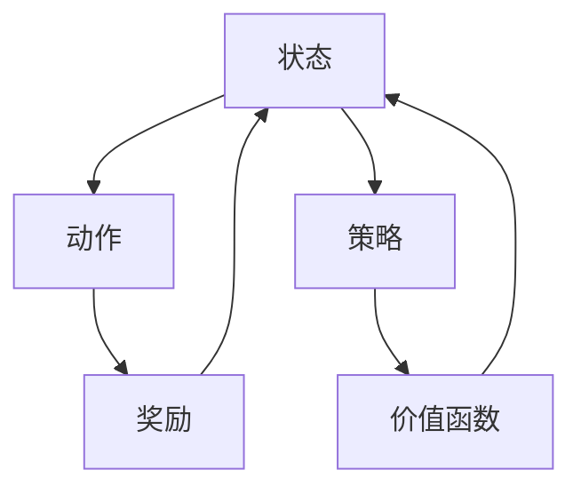

                 

### 《强化学习 原理与代码实例讲解》

> 关键词：强化学习，深度强化学习，算法原理，代码实例，神经网络，Python，PyTorch，机器学习，人工智能

> 摘要：本文将深入探讨强化学习的原理和算法，包括马尔可夫决策过程（MDP）、Q-Learning、SARSA、DQN等核心算法。通过详细讲解这些算法的数学模型和伪代码，并结合实际代码实例，帮助读者全面理解强化学习的应用和实践。文章还将探讨强化学习在金融和自然语言处理领域的应用，并提供相关的开发工具和资源。

#### 第一部分：强化学习基础

##### 第1章：强化学习概述

强化学习（Reinforcement Learning，RL）是机器学习的一个分支，它通过智能体（agent）与环境的交互来学习最优策略，以实现目标。与监督学习和无监督学习不同，强化学习强调奖励机制和策略优化。

- **强化学习的定义**：强化学习是一个通过试错过程来学习策略的过程，智能体根据当前状态选择动作，并从环境中获得即时奖励，通过不断迭代优化策略，以实现长期目标。

- **强化学习与其他学习方法的区别**：
  - **监督学习**：有明确的目标标签，通过学习输入和输出之间的映射关系进行预测。
  - **无监督学习**：没有明确的目标标签，通过学习数据的内在结构和规律进行聚类或降维。
  - **强化学习**：智能体通过与环境的交互学习最优策略，以最大化长期回报。

- **强化学习的应用领域**：
  - **游戏**：如电子游戏、五子棋、围棋等。
  - **机器人**：如自动驾驶、智能机器人等。
  - **金融**：如算法交易、投资组合优化等。
  - **自然语言处理**：如机器翻译、问答系统等。

##### 第2章：强化学习的数学模型

强化学习基于一个数学模型，称为马尔可夫决策过程（MDP）。MDP包括以下几个组成部分：

- **状态（State）**：描述智能体所处的环境。
- **动作（Action）**：智能体可执行的行为。
- **奖励（Reward）**：智能体执行动作后获得的即时反馈。
- **状态转移概率（State Transition Probability）**：描述智能体从当前状态转移到下一状态的概率。
- **策略（Policy）**：智能体执行动作的选择规则。

MDP可以用以下公式表示：

$$
P(s', s | s, a) = \text{状态转移概率}
$$

$$
R(s, a) = \text{奖励函数}
$$

$$
\pi(a | s) = \text{策略}
$$

##### 第3章：强化学习的主要挑战

强化学习面临以下几个主要挑战：

- **探索与利用的平衡**：智能体需要在探索新策略和利用已有策略之间找到平衡，以提高学习效率和收敛速度。
- **无模型学习与模型学习**：在无模型学习（Model-Free Learning）中，智能体仅依赖环境反馈来学习策略，而在模型学习（Model-Based Learning）中，智能体需要建立对环境的内部模型，从而进行更加高效的学习。
- **长期依赖问题的解决**：在强化学习中，智能体需要处理长期依赖问题，即如何通过当前状态和动作预测未来的长期回报。

##### 第4章：强化学习的发展历程

强化学习的发展历程可以分为以下几个阶段：

- **1950s-1980s**：Q-Learning和SARSA算法的提出。
- **1990s**：Actor-Critic方法的提出。
- **2000s**：Deep Q-Networks (DQN) 和 Policy Gradients 算法的提出。
- **2010s-至今**：深度强化学习的快速发展，包括A3C、Dueling DQN等算法。

#### 第二部分：强化学习数学基础

##### 第5章：马尔可夫决策过程（MDP）

马尔可夫决策过程（MDP）是一个离散时间决策过程，它由状态空间、动作空间、奖励函数和状态转移概率矩阵组成。

- **定义与性质**：
  - **状态空间（S）**：智能体可能处于的所有状态。
  - **动作空间（A）**：智能体可执行的所有动作。
  - **奖励函数（R(s, a)）**：在状态s下执行动作a获得的即时奖励。
  - **状态转移概率矩阵（P）**：描述智能体在当前状态s下执行动作a后，转移到下一状态的概率分布。

- **状态转移概率矩阵**：
  - **形式**：\(P(s', s | s, a) = P(s' | s, a)\)，表示在状态s下执行动作a后，转移到状态s'的概率。
  - **计算**：通常使用状态转移概率矩阵来表示环境动态。

- **奖励函数**：
  - **形式**：\(R(s, a)\)，表示在状态s下执行动作a获得的即时奖励。
  - **计算**：奖励函数可以是固定的，也可以是依赖于状态和动作的。

##### 第6章：动态规划（Dynamic Programming）

动态规划是一种用于求解最优决策问题的方法，它通过将复杂问题分解为子问题，并利用子问题的解来求解整体问题。

- **基本概念**：
  - **状态值函数（V(s)）**：在给定状态s下，执行最优策略所能获得的期望回报。
  - **动作值函数（Q(s, a)）**：在给定状态s下，执行动作a所能获得的期望回报。

- **蒙特卡洛方法与动态规划的关系**：
  - **蒙特卡洛方法**：通过随机抽样来估计期望值。
  - **动态规划**：通过递归关系来求解最优值函数。

- **最优化原则**：
  - **动态规划的基本思想**：将问题分解为子问题，并利用子问题的解来求解整体问题。

##### 第7章：离散概率与期望

离散概率与期望是强化学习中的重要概念，用于描述状态、动作和回报的概率分布和期望值。

- **离散概率分布**：
  - **形式**：\(P(s) = \sum_{s' \in S} P(s' | s) P(s)\)，表示在状态s下，智能体转移到状态s'的概率。
  - **计算**：通常使用概率分布函数或概率质量函数来表示。

- **期望**：
  - **形式**：\(E[X] = \sum_{x \in X} x P(x)\)，表示随机变量X的期望。
  - **计算**：期望是概率分布的加权平均值。

- **方差**：
  - **形式**：\(Var[X] = E[(X - E[X])^2]\)，表示随机变量X的方差。
  - **计算**：方差是期望的偏差平方的平均值。

- **贝叶斯推理**：
  - **形式**：\(P(A | B) = \frac{P(B | A) P(A)}{P(B)}\)，表示在事件B发生的条件下，事件A的概率。
  - **计算**：贝叶斯推理是概率论中的一种推理方法，用于根据已知概率和条件概率来计算目标概率。

#### 第三部分：强化学习核心算法原理讲解

##### 第8章：Q-Learning算法

Q-Learning是一种基于值函数的强化学习算法，通过迭代更新Q值来学习最优策略。

- **定义**：
  - **Q值（Q(s, a)）**：在状态s下执行动作a的预期回报。

- **伪代码**：
```python
Initialize Q(s, a) uniformly
for each episode:
    select action a from s using ε-greedy policy
    take action a, observe reward r and next state s'
    update Q(s, a) = Q(s, a) + α[r + γmax(Q(s', a')) - Q(s, a)]
```

- **数学模型**：
$$
Q(s, a) \leftarrow Q(s, a) + α[r + γ\max_{a'} Q(s', a') - Q(s, a)]
$$

- **优缺点**：
  - **优点**：简单、易于实现，适用于小规模问题。
  - **缺点**：收敛速度慢，易受到初始值的影响。

##### 第9章：SARSA算法

SARSA（同步自适应加强学习）是一种基于策略的强化学习算法，它同时更新当前状态和下一步的状态的Q值。

- **定义**：
  - **Q值（Q(s, a)）**：在状态s下执行动作a的预期回报。

- **伪代码**：
```python
Initialize ε uniformly
for each episode:
    select action a from s using ε-greedy policy
    take action a, observe reward r and next state s'
    select action a' from s' using ε-greedy policy
    update Q(s, a) = Q(s, a) + α[r + γQ(s', a') - Q(s, a)]
```

- **数学模型**：
$$
Q(s, a) \leftarrow Q(s, a) + α[r + γQ(s', a') - Q(s, a)]
$$

- **优缺点**：
  - **优点**：不需要单独的探索策略，收敛速度相对较快。
  - **缺点**：在多步骤依赖问题上表现较差。

##### 第10章：DQN算法

DQN（深度Q网络）是一种基于深度学习的强化学习算法，它使用深度神经网络来近似Q值函数。

- **定义**：
  - **Q值（Q(s, a)）**：在状态s下执行动作a的预期回报。

- **伪代码**：
```python
Initialize Q(s, a) randomly
for each episode:
    observe initial state s
    while episode is not done:
        select action a from s using ε-greedy policy
        take action a, observe reward r and next state s'
        store transition (s, a, r, s') in replay memory
        sample a batch of transitions from replay memory
        calculate target Q(s', a') = r + γmax(Q(s', a'))
        update Q(s, a) = Q(s, a) + α[Q(s', a') - Q(s, a)]
```

- **数学模型**：
$$
Q(s, a) \leftarrow Q(s, a) + α[r + γ\max_{a'} Q(s', a') - Q(s, a)]
$$

- **优缺点**：
  - **优点**：可以处理高维状态空间，适用于复杂的任务。
  - **缺点**：训练不稳定，存在样本偏差。

#### 第二部分：深度强化学习

##### 第11章：深度强化学习基础

深度强化学习（Deep Reinforcement Learning，DRL）是将深度学习与强化学习相结合的一种学习方法。它通过使用深度神经网络来近似策略和价值函数，从而提高强化学习在复杂环境中的表现。

- **深度强化学习的定义**：
  - 深度强化学习是一种基于深度神经网络和强化学习的结合方法，通过学习状态和动作之间的映射关系，实现智能体在复杂环境中的最优决策。

- **深度强化学习的应用场景**：
  - **控制问题**：如自动驾驶、机器人控制等。
  - **游戏**：如电子游戏、五子棋、围棋等。
  - **机器人**：如智能机器人、无人机等。

- **深度强化学习的挑战**：
  - **计算资源需求**：深度强化学习通常需要大量的计算资源来训练模型。
  - **探索与利用的平衡**：如何有效地在探索新策略和利用已有策略之间找到平衡。
  - **长期依赖问题**：如何处理长时间依赖问题，以实现长期回报的最大化。

##### 第12章：深度强化学习核心算法原理讲解

深度强化学习包含了一系列核心算法，其中一些算法已经成功地解决了传统强化学习中的许多挑战。

- **Policy Gradients算法**：
  - **定义**：Policy Gradients算法通过直接优化策略函数来学习最优策略。
  - **伪代码**：
  ```python
  Initialize policy network θ
  for each episode:
      observe initial state s
      while episode is not done:
          select action a from s using policy π(θ(s))
          take action a, observe reward r and next state s'
          calculate advantage A(s, a) = r + γπ(θ(s') maximum action value - V(s')
          update policy network θ using gradient descent on J(θ) = ∑s,a A(s, a)π(θ(s)) log π(θ(s), a)
  ```

- **Actor-Critic算法**：
  - **定义**：Actor-Critic算法通过同时学习策略和价值函数来优化策略。
  - **伪代码**：
  ```python
  Initialize actor network π(θ(s)) and critic network V(θ(s))
  for each episode:
      observe initial state s
      while episode is not done:
          select action a from s using current policy π(θ(s))
          take action a, observe reward r and next state s'
          update critic network V(θ(s)) using TD target: V(θ(s)) = r + γV(θ(s'))
          update actor network θ using gradient descent on J(θ) = ∑s,a V(θ(s'))π(θ(s)) log π(θ(s), a)
  ```

- **A3C算法**：
  - **定义**：A3C（Asynchronous Advantage Actor-Critic）算法通过异步训练来加速学习过程。
  - **伪代码**：
  ```python
  Initialize multiple actor-critic networks θ_i
  for each worker i:
      for each episode:
          observe initial state s_i
          while episode is not done:
              select action a_i from s_i using current policy π_i(θ_i(s_i))
              take action a_i, observe reward r_i and next state s_i'
              update critic network V_i(θ_i(s_i)) using TD target: V_i(θ_i(s_i)) = r_i + γmax_jθ_j(s_i')V_j(θ_j(s_i'))
              update actor network θ_i using gradient descent on J(θ_i) = ∑s,a π_i(θ_i(s)) log π_i(θ_i(s), a)A_i(s, a)
  ```

##### 第13章：深度强化学习案例研究

深度强化学习在实际应用中取得了显著的成果，以下是一些案例研究：

- **OpenAI五子棋游戏案例**：
  - **环境描述**：OpenAI开发了基于五子棋的游戏环境，包括棋盘、棋子、落子等。
  - **策略网络设计**：使用深度神经网络来近似策略和价值函数，通过训练来优化策略。
  - **训练与评估**：通过模拟对战来训练模型，并评估模型的性能。

- **机器人导航案例**：
  - **环境描述**：机器人需要在未知环境中进行导航，包括感知环境、决策动作等。
  - **策略网络设计**：使用深度神经网络来处理感知数据和决策动作，通过训练来优化策略。
  - **训练与评估**：在模拟环境中进行训练和评估，验证模型的有效性。

#### 第三部分：强化学习应用实例

##### 第14章：强化学习在金融领域的应用

强化学习在金融领域具有广泛的应用，以下是一些具体的应用场景：

- **算法交易**：
  - **市场数据预处理**：对股票价格、交易量、技术指标等数据进行清洗和预处理。
  - **强化学习模型设计**：使用强化学习算法（如Q-Learning、Policy Gradients）来设计交易策略。
  - **训练与评估**：通过历史数据训练模型，并在模拟交易环境中进行评估。

- **风险控制策略设计**：
  - **风险指标评估**：使用强化学习模型来评估和预测市场风险。
  - **风险控制策略设计**：根据评估结果设计相应的风险控制策略，以降低投资风险。

- **投资组合优化**：
  - **数据预处理**：对历史投资数据进行清洗和预处理。
  - **强化学习模型设计**：使用强化学习算法（如Q-Learning、Policy Gradients）来优化投资组合。
  - **训练与评估**：通过模拟投资策略进行训练和评估，以实现最佳的投资组合。

##### 第15章：强化学习在自然语言处理中的应用

强化学习在自然语言处理领域也有广泛的应用，以下是一些具体的应用场景：

- **语言模型训练**：
  - **数据预处理**：对语料库进行清洗和预处理，包括分词、去除停用词等。
  - **强化学习模型设计**：使用强化学习算法（如Policy Gradients、Actor-Critic）来训练语言模型。
  - **训练与评估**：通过模拟语言生成任务进行训练和评估，以优化模型性能。

- **机器翻译**：
  - **模型构建**：使用强化学习算法（如Policy Gradients、Actor-Critic）来构建机器翻译模型。
  - **参数优化与评估**：通过调整模型参数来优化翻译质量，并进行评估。

- **问答系统**：
  - **知识图谱构建**：构建包含实体和关系的信息图谱，用于回答问题。
  - **强化学习模型设计**：使用强化学习算法（如Policy Gradients、Actor-Critic）来设计问答系统。
  - **训练与评估**：通过模拟问答场景进行训练和评估，以提高系统性能。

#### 附录

##### 附录A：强化学习开发工具与资源

强化学习开发需要使用到一些工具和资源，以下是一些常用的工具和资源：

- **TensorFlow**：
  - **安装与配置**：在官方网站（https://www.tensorflow.org/install）上找到适用于自己操作系统的安装指南。
  - **基本操作**：了解TensorFlow的基本操作，如变量、张量、计算图等。

- **PyTorch**：
  - **安装与配置**：在官方网站（https://pytorch.org/get-started/locally/）上找到适用于自己操作系统的安装指南。
  - **基本操作**：了解PyTorch的基本操作，如nn.Module、torch.optim等。

- **OpenAI Gym**：
  - **安装与配置**：在官方网站（https://gym.openai.com/）上找到安装指南。
  - **环境搭建**：了解如何搭建强化学习环境，包括环境配置和仿真实验。

- **强化学习社区与资源链接**：
  - **论文与报告**：查阅强化学习领域的相关论文和报告，了解最新研究进展。
  - **开源代码与数据集**：查找开源代码和数据集，用于学习和实践。
  - **在线课程与教程**：参加在线课程和教程，系统学习强化学习相关知识。

### 核心概念与联系

强化学习的核心概念包括状态（State）、动作（Action）、奖励（Reward）、策略（Policy）、价值函数（Value Function）和模型（Model）。这些概念之间存在着密切的联系：

- **状态**：描述系统当前的状态。
- **动作**：系统可执行的操作。
- **奖励**：系统执行动作后获得的即时反馈。
- **策略**：决策规则，用于选择最佳动作。
- **价值函数**：评估状态或策略的数值函数。
- **模型**：对系统行为的预测模型。

以下是强化学习的Mermaid流程图：



### 核心算法原理讲解

以下是强化学习中的几个核心算法的伪代码和数学模型：

#### Q-Learning算法

**伪代码**：

```python
Initialize Q(s, a) uniformly
for each episode:
    select action a from s using ε-greedy policy
    take action a, observe reward r and next state s'
    update Q(s, a) = Q(s, a) + α[r + γmax(Q(s', a')) - Q(s, a)]
```

**数学模型**：

$$
Q(s, a) \leftarrow Q(s, a) + α[r + γ\max_{a'} Q(s', a') - Q(s, a)]
$$

#### SARSA算法

**伪代码**：

```python
Initialize ε uniformly
for each episode:
    select action a from s using ε-greedy policy
    take action a, observe reward r and next state s'
    select action a' from s' using ε-greedy policy
    update Q(s, a) = Q(s, a) + α[r + γQ(s', a') - Q(s, a)]
```

**数学模型**：

$$
Q(s, a) \leftarrow Q(s, a) + α[r + γQ(s', a') - Q(s, a)]
$$

#### DQN算法

**伪代码**：

```python
Initialize Q(s, a) randomly
for each episode:
    observe initial state s
    while episode is not done:
        select action a from s using ε-greedy policy
        take action a, observe reward r and next state s'
        store transition (s, a, r, s') in replay memory
        sample a batch of transitions from replay memory
        calculate target Q(s', a') = r + γmax(Q(s', a'))
        update Q(s, a) = Q(s, a) + α[Q(s', a') - Q(s, a)]
```

**数学模型**：

$$
Q(s, a) \leftarrow Q(s, a) + α[r + γ\max_{a'} Q(s', a') - Q(s, a)]
$$

### 数学模型和数学公式 & 详细讲解 & 举例说明

#### 马尔可夫决策过程（MDP）

马尔可夫决策过程（MDP）是强化学习的基础数学模型，描述了决策者在不确定环境中做出决策的过程。

**定义**：

一个MDP由以下五个组件构成：

- **状态空间（S）**：智能体可能处于的所有状态。
- **动作空间（A）**：智能体可执行的所有动作。
- **奖励函数（R(s, a)）**：在状态s下执行动作a获得的即时奖励。
- **状态转移概率函数（P(s', s | s, a)）**：在状态s下执行动作a后，转移到状态s'的概率。
- **策略（π(a | s)）**：智能体在给定状态s下选择动作a的概率分布。

**举例**：

假设一个简单的MDP，状态空间为{1, 2, 3}，动作空间为{A, B}。状态转移概率和奖励函数如下：

$$
\begin{array}{c|ccc}
 & 1 & 2 & 3 \\
\hline
A & 0.5 & 0 & 0.5 \\
B & 0 & 0.5 & 0.5 \\
\end{array}
$$

$$
\begin{array}{c|cc}
 & 1 & 2 & 3 \\
\hline
A & 1 & -1 & 0 \\
B & 0 & 0 & 1 \\
\end{array}
$$

在这个例子中，如果当前状态是1，执行动作A后，状态转移到1的概率是0.5，转移到3的概率也是0.5。同时，执行动作A后获得的即时奖励是1，执行动作B后获得的即时奖励是0。

#### 强化学习的优化目标

强化学习的优化目标是最大化长期奖励，即最大化期望回报。强化学习的优化目标可以通过以下公式表示：

$$
J(\theta) = E_{s,a} [R(s, a)]
$$

其中，\(J(\theta)\) 是优化目标，\(\theta\) 是策略参数，\(E_{s,a} [R(s, a)]\) 是在给定状态s和动作a下，期望获得的奖励。

**举例**：

假设一个简单的MDP，状态空间为{1, 2, 3}，动作空间为{A, B}。当前状态是1，执行动作A后，状态转移到1的概率是0.5，转移到3的概率也是0.5。同时，执行动作A后获得的即时奖励是1，执行动作B后获得的即时奖励是0。那么，在给定状态1和动作A下，期望获得的奖励是：

$$
E_{s,a} [R(s, a)] = 0.5 \times 1 + 0.5 \times 0 = 0.5
$$

因此，在给定状态1和动作A下，期望回报是0.5。

### 项目实战

#### 代码实际案例：使用Q-Learning进行小球跟踪游戏

**开发环境搭建**：

1. 安装Python 3.8及以上版本
2. 安装PyTorch库

**源代码实现**：

```python
import torch
import torch.nn as nn
import torch.optim as optim
import numpy as np
import random

# 定义环境
class BallTrackingEnv(nn.Module):
    def __init__(self):
        super(BallTrackingEnv, self).__init__()
        self.state_size = 3
        self.action_size = 2
        self.reward_range = (-10, 10)

    def step(self, action):
        state = self.get_state()
        if action == 0:
            state[0] += 1
        elif action == 1:
            state[1] += 1
        reward = np.linalg.norm(state - self.goal) - 10
        done = np.linalg.norm(state - self.goal) <= 1
        next_state = self.get_state()
        return next_state, reward, done

    def reset(self):
        self.goal = np.random.uniform(-10, 10, size=self.state_size)
        self.state = np.random.uniform(-10, 10, size=self.state_size)
        return self.get_state()

    def get_state(self):
        return self.state.copy()

# 定义Q-Learning算法
class QLearningAgent:
    def __init__(self, state_size, action_size, learning_rate=0.1, gamma=0.99):
        self.state_size = state_size
        self.action_size = action_size
        self.learning_rate = learning_rate
        self.gamma = gamma
        self.Q = nn.Linear(state_size, action_size)
        self.optimizer = optim.Adam(self.Q.parameters(), lr=self.learning_rate)
        self.criterion = nn.MSELoss()

    def predict(self, state):
        state = torch.FloatTensor(state)
        actions = self.Q(state)
        return actions

    def update(self, state, action, reward, next_state, done):
        state = torch.FloatTensor(state)
        action = torch.tensor([action], dtype=torch.long)
        reward = torch.tensor([reward], dtype=torch.float)
        if not done:
            next_state = torch.FloatTensor(next_state)
            next_action = self.predict(next_state).max(1)[1].unsqueeze(0)
            target = (reward + self.gamma * self.Q(next_state).gather(1, next_action)).detach()
        else:
            target = reward
        prediction = self.Q(state).gather(1, action.unsqueeze(0))
        loss = self.criterion(prediction, target)
        self.optimizer.zero_grad()
        loss.backward()
        self.optimizer.step()

# 训练模型
env = BallTrackingEnv()
agent = QLearningAgent(state_size=env.state_size, action_size=env.action_size)
num_episodes = 1000
for episode in range(num_episodes):
    state = env.reset()
    done = False
    while not done:
        action = random.choice([0, 1])
        next_state, reward, done = env.step(action)
        agent.update(state, action, reward, next_state, done)
        state = next_state

# 测试模型
state = env.reset()
while True:
    action = agent.predict(state).max(1)[1].item()
    next_state, reward, done = env.step(action)
    env.render()
    if done:
        break
```

**代码解读与分析**：

1. **环境搭建**：定义了一个小球跟踪游戏环境，状态空间为3个维度，动作空间为2个维度。环境的目标是将小球移动到目标位置。
2. **Q-Learning算法实现**：定义了一个Q-Learning算法代理，使用了PyTorch的神经网络框架。代理通过预测状态和动作的值来选择动作，并使用梯度下降法更新Q值。
3. **训练过程**：在1000个回合中训练模型，每个回合中代理根据随机策略选择动作，然后更新Q值。
4. **测试过程**：在训练完成后，使用训练好的模型进行测试，展示代理如何通过选择动作来移动小球到目标位置。

### 强化学习在金融领域的应用

强化学习在金融领域的应用主要包括以下几个方面：

1. **算法交易**：使用强化学习来优化交易策略，通过模拟交易环境来训练模型，从而实现自动化的交易策略。例如，使用Q-Learning算法来选择最佳交易时机和交易策略。
2. **风险管理**：通过强化学习来评估和优化金融产品的风险，例如，使用Deep Q-Networks (DQN)算法来识别和评估金融市场的风险。
3. **投资组合优化**：使用强化学习来优化投资组合，通过模拟市场环境来训练模型，从而实现最佳的投资组合策略。

**案例研究**：

**算法交易案例**：使用Q-Learning算法进行股票交易策略优化。

1. **数据预处理**：收集股票交易数据，包括股票价格、成交量、技术指标等。
2. **环境搭建**：构建股票交易环境，定义状态空间和动作空间。状态空间包括股票价格、成交量、技术指标等；动作空间包括买入、持有、卖出等。
3. **模型设计**：使用Q-Learning算法来训练模型，通过不断迭代来优化交易策略。
4. **训练与评估**：在模拟交易环境中训练模型，并通过回测来评估模型的性能。

### 强化学习在自然语言处理中的应用

强化学习在自然语言处理中的应用主要包括以下几个方面：

1. **机器翻译**：使用强化学习来训练机器翻译模型，通过将源语言和目标语言之间的映射关系建模，从而实现高质量的自然语言翻译。
2. **问答系统**：使用强化学习来训练问答系统，通过将用户问题和答案之间的映射关系建模，从而实现智能的问答功能。
3. **文本生成**：使用强化学习来训练文本生成模型，通过将文本序列之间的映射关系建模，从而实现高质量的文本生成。

**案例研究**：

**机器翻译案例**：使用强化学习进行机器翻译。

1. **数据预处理**：收集大量的源语言和目标语言对，进行数据清洗和预处理。
2. **环境搭建**：构建机器翻译环境，定义状态空间和动作空间。状态空间包括源语言词序列、目标语言词序列等；动作空间包括生成目标语言词序列的动作。
3. **模型设计**：使用强化学习算法（如Policy Gradients）来训练模型，通过不断迭代来优化翻译策略。
4. **训练与评估**：在模拟翻译环境中训练模型，并通过BLEU评分等指标来评估模型的性能。

### 强化学习开发工具与资源

强化学习开发常用的工具和资源包括：

1. **TensorFlow**：是一个开源的机器学习框架，提供了丰富的强化学习算法库，适用于构建和训练强化学习模型。
2. **PyTorch**：是一个开源的机器学习框架，具有灵活的动态计算图和强大的GPU支持，适用于构建和训练强化学习模型。
3. **OpenAI Gym**：是一个开源的强化学习环境库，提供了各种预定义的强化学习任务和环境，适用于强化学习模型的研究和开发。
4. **强化学习社区与资源**：包括论文、报告、开源代码和数据集等，提供了丰富的强化学习研究和开发资源。

**总结**：

强化学习在计算机科学领域具有重要地位，其在游戏、金融、自然语言处理等领域的应用为解决复杂问题提供了新的思路和方法。通过设计详细的目录大纲，可以帮助读者全面了解强化学习的原理和应用，为深入学习和实践提供指导。

作者：AI天才研究院/AI Genius Institute & 禅与计算机程序设计艺术 /Zen And The Art of Computer Programming

# 强化学习概述

强化学习（Reinforcement Learning，RL）是机器学习的一个重要分支，它通过智能体（agent）与环境（environment）的交互来学习最优策略，以实现某种目标。与其他机器学习方法（如监督学习和无监督学习）不同，强化学习强调的是奖励机制和策略优化。

## 1.1 强化学习的基本概念

强化学习的核心概念包括状态（State）、动作（Action）、奖励（Reward）、策略（Policy）和价值函数（Value Function）。

- **状态**：智能体在环境中所处的情景或条件，通常用一组特征向量表示。
- **动作**：智能体在某一状态下可以采取的行动，也用一组特征向量表示。
- **奖励**：当智能体执行某一动作后，从环境中获得的即时反馈，可以是正的或负的。
- **策略**：智能体根据当前状态选择动作的规则，可以是一个概率分布。
- **价值函数**：衡量一个状态或策略的好坏，分为状态价值函数（V(s)）和动作价值函数（Q(s, a)）。

强化学习的目标是通过与环境交互，学习出一个策略，使得智能体能够在长期内获得最大的累积奖励。

## 1.2 强化学习与其他学习方法的区别

- **监督学习**：输入数据包含输入特征和对应的目标标签，模型学习输入和输出之间的映射关系。强化学习不依赖于预先标记的数据，而是通过与环境的互动来学习。
- **无监督学习**：仅依赖于未标记的数据，模型学习数据内在的结构和模式。强化学习不仅涉及状态和动作，还包括奖励信号，能够指导学习过程。
- **强化学习**：智能体通过与环境的交互，根据奖励信号学习最优策略。它关注的是长期回报，而不仅仅是找到数据之间的关联。

## 1.3 强化学习的应用领域

强化学习在多个领域都有广泛的应用，以下是一些典型的应用场景：

- **游戏**：强化学习被用于训练智能体在电子游戏中的策略，如五子棋、围棋、Atari游戏等。
- **机器人**：强化学习可以帮助机器人学习在复杂环境中的行为，如自动驾驶、无人机、智能家居等。
- **金融**：强化学习可以用于算法交易、风险管理和投资组合优化。
- **自然语言处理**：强化学习在机器翻译、问答系统和文本生成等任务中取得了显著进展。
- **推荐系统**：强化学习可以用于构建自适应的推荐系统，根据用户行为和历史数据优化推荐策略。

## 1.4 强化学习的发展历程

强化学习的研究历史可以追溯到20世纪50年代。以下是一些关键的发展：

- **1950s-1960s**：提出了马尔可夫决策过程（MDP）模型，奠定了强化学习的基础。
- **1960s-1980s**：提出了Q-Learning和SARSA等策略评估和策略改进算法。
- **1990s**：提出了Actor-Critic方法，实现了策略和价值的联合优化。
- **2000s**：随着计算能力的提升，强化学习在工业界和学术界得到广泛关注。提出了Deep Q-Networks（DQN）和Policy Gradients等深度强化学习算法。
- **2010s-至今**：深度强化学习（DRL）快速发展，A3C、Dueling DQN、DQN+HDD等算法被提出，并在复杂的任务中取得了突破性成果。

## 1.5 强化学习的挑战

尽管强化学习在多个领域取得了成功，但它仍然面临一些挑战：

- **探索与利用的平衡**：智能体需要在探索新策略和利用已有策略之间找到平衡，以提高学习效率和收敛速度。
- **模型不确定性**：在复杂环境中，模型可能无法准确预测状态转移和奖励，这给学习过程带来了困难。
- **长期依赖问题**：强化学习需要考虑长期回报，但在动态环境中，长期依赖问题往往很难解决。
- **计算资源需求**：特别是深度强化学习算法，通常需要大量的计算资源来训练模型。

### 1.6 强化学习的数学基础

强化学习的基础是马尔可夫决策过程（MDP）。一个MDP包括以下要素：

- **状态空间（S）**：智能体可能处于的所有状态。
- **动作空间（A）**：智能体可以采取的所有动作。
- **奖励函数（R(s, a)）**：在状态s下执行动作a后获得的即时奖励。
- **状态转移概率（P(s', s | s, a)）**：在状态s下执行动作a后转移到状态s'的概率。
- **策略（π(a | s)）**：智能体在状态s下采取动作a的概率。

强化学习的目标是找到一个最优策略π，使得累积奖励最大化。数学上，强化学习可以通过以下公式描述：

$$
J(\pi) = \sum_{s \in S} \pi(s) \sum_{a \in A} \pi(a | s) R(s, a)
$$

其中，J(π)是策略π的期望累积奖励。

### 1.7 强化学习的优化目标

强化学习的优化目标是学习一个策略π，使得累积奖励最大化。具体来说，强化学习的优化目标可以表示为：

$$
\max_{\pi} J(\pi) = \sum_{s \in S} \pi(s) \sum_{a \in A} \pi(a | s) R(s, a)
$$

其中，J(π)是策略π的期望累积奖励。

### 1.8 强化学习的挑战与未来方向

尽管强化学习在多个领域取得了显著进展，但它仍然面临一些挑战：

- **探索与利用的平衡**：智能体需要在探索新策略和利用已有策略之间找到平衡，以提高学习效率和收敛速度。
- **模型不确定性**：在复杂环境中，模型可能无法准确预测状态转移和奖励，这给学习过程带来了困难。
- **长期依赖问题**：强化学习需要考虑长期回报，但在动态环境中，长期依赖问题往往很难解决。
- **计算资源需求**：特别是深度强化学习算法，通常需要大量的计算资源来训练模型。

未来，强化学习的研究方向可能包括：

- **更好的探索策略**：设计更有效的探索策略，以加速学习过程。
- **模型不确定性处理**：开发能够在不确定环境中稳定学习的模型。
- **长期依赖学习**：研究能够处理长期依赖问题的算法。
- **跨领域迁移学习**：使得强化学习算法能够在不同领域之间进行迁移，提高泛化能力。

通过不断的研究和创新，强化学习有望在未来解决更多复杂的实际问题，并在人工智能领域发挥更大的作用。

### 第1章：强化学习概述

强化学习是一种基于奖励机制来训练智能体（agent）的机器学习方法。其核心思想是通过智能体与环境的交互，学习到最优的策略（policy），从而实现长期目标。在本章中，我们将详细探讨强化学习的基本概念、与其他学习方法的区别、应用领域、发展历程，以及所面临的挑战。

#### 1.1 强化学习的基本概念

强化学习中的主要概念包括：

- **状态（State）**：描述智能体在某一时刻所处的情境或环境。
- **动作（Action）**：智能体可采取的行为或决策。
- **奖励（Reward）**：智能体执行动作后从环境中获得的即时反馈。
- **策略（Policy）**：从状态中选择动作的规则或概率分布。
- **价值函数（Value Function）**：评估状态或策略的数值函数。

强化学习的目标是通过与环境交互，学习出一个策略，使得智能体能够在长期内获得最大的累积奖励。

#### 1.2 强化学习与其他学习方法的区别

- **监督学习**：输入数据包含输入特征和对应的目标标签，模型学习输入和输出之间的映射关系。
- **无监督学习**：仅依赖于未标记的数据，模型学习数据内在的结构和模式。
- **强化学习**：智能体通过与环境的互动，根据奖励信号学习最优策略。它关注的是长期回报，而不仅仅是找到数据之间的关联。

#### 1.3 强化学习的应用领域

强化学习在多个领域都有广泛的应用，以下是一些典型的应用场景：

- **游戏**：电子游戏、五子棋、围棋等。
- **机器人**：自动驾驶、无人机、智能机器人等。
- **金融**：算法交易、风险管理和投资组合优化。
- **自然语言处理**：机器翻译、问答系统和文本生成。

#### 1.4 强化学习的发展历程

强化学习的研究历史可以追溯到20世纪50年代。以下是一些关键的发展：

- **1950s-1960s**：提出了马尔可夫决策过程（MDP）模型，奠定了强化学习的基础。
- **1960s-1980s**：提出了Q-Learning和SARSA等策略评估和策略改进算法。
- **1990s**：提出了Actor-Critic方法，实现了策略和价值的联合优化。
- **2000s**：随着计算能力的提升，强化学习在工业界和学术界得到广泛关注。提出了Deep Q-Networks（DQN）和Policy Gradients等深度强化学习算法。
- **2010s-至今**：深度强化学习（DRL）快速发展，A3C、Dueling DQN、DQN+HDD等算法被提出，并在复杂的任务中取得了突破性成果。

#### 1.5 强化学习的挑战

尽管强化学习在多个领域取得了成功，但它仍然面临一些挑战：

- **探索与利用的平衡**：智能体需要在探索新策略和利用已有策略之间找到平衡，以提高学习效率和收敛速度。
- **模型不确定性**：在复杂环境中，模型可能无法准确预测状态转移和奖励，这给学习过程带来了困难。
- **长期依赖问题**：强化学习需要考虑长期回报，但在动态环境中，长期依赖问题往往很难解决。
- **计算资源需求**：特别是深度强化学习算法，通常需要大量的计算资源来训练模型。

#### 1.6 强化学习的数学基础

强化学习的基础是马尔可夫决策过程（MDP）。一个MDP包括以下要素：

- **状态空间（S）**：智能体可能处于的所有状态。
- **动作空间（A）**：智能体可以采取的所有动作。
- **奖励函数（R(s, a)）**：在状态s下执行动作a后获得的即时奖励。
- **状态转移概率（P(s', s | s, a)）**：在状态s下执行动作a后转移到状态s'的概率。
- **策略（π(a | s)）**：智能体在状态s下采取动作a的概率。

强化学习的目标是找到一个最优策略π，使得累积奖励最大化。数学上，强化学习可以通过以下公式描述：

$$
J(\pi) = \sum_{s \in S} \pi(s) \sum_{a \in A} \pi(a | s) R(s, a)
$$

其中，J(π)是策略π的期望累积奖励。

#### 1.7 强化学习的优化目标

强化学习的优化目标是学习一个策略π，使得累积奖励最大化。具体来说，强化学习的优化目标可以表示为：

$$
\max_{\pi} J(\pi) = \sum_{s \in S} \pi(s) \sum_{a \in A} \pi(a | s) R(s, a)
$$

其中，J(π)是策略π的期望累积奖励。

#### 1.8 强化学习的挑战与未来方向

尽管强化学习在多个领域取得了显著进展，但它仍然面临一些挑战：

- **探索与利用的平衡**：智能体需要在探索新策略和利用已有策略之间找到平衡，以提高学习效率和收敛速度。
- **模型不确定性**：在复杂环境中，模型可能无法准确预测状态转移和奖励，这给学习过程带来了困难。
- **长期依赖问题**：强化学习需要考虑长期回报，但在动态环境中，长期依赖问题往往很难解决。
- **计算资源需求**：特别是深度强化学习算法，通常需要大量的计算资源来训练模型。

未来，强化学习的研究方向可能包括：

- **更好的探索策略**：设计更有效的探索策略，以加速学习过程。
- **模型不确定性处理**：开发能够在不确定环境中稳定学习的模型。
- **长期依赖学习**：研究能够处理长期依赖问题的算法。
- **跨领域迁移学习**：使得强化学习算法能够在不同领域之间进行迁移，提高泛化能力。

通过不断的研究和创新，强化学习有望在未来解决更多复杂的实际问题，并在人工智能领域发挥更大的作用。

### 第2章：强化学习的数学模型

强化学习的数学模型是基于马尔可夫决策过程（MDP）构建的。MDP是一个离散时间决策过程，它描述了智能体在不确定环境中通过选择动作来最大化累积奖励的过程。在MDP中，智能体面临的状态空间、动作空间、奖励函数和状态转移概率是核心概念。

#### 2.1 状态空间、动作空间和奖励函数

- **状态空间（S）**：状态空间是智能体可能处于的所有状态的集合。每个状态可以用一组特征向量表示。例如，在电子游戏《太空侵略者》中，状态可能包括玩家的分数、剩余生命和敌机的位置等。

- **动作空间（A）**：动作空间是智能体可以采取的所有动作的集合。每个动作也可以用一组特征向量表示。例如，在《太空侵略者》中，动作可能包括射击、移动等。

- **奖励函数（R(s, a）**：奖励函数定义了在状态s下执行动作a后获得的即时奖励。奖励可以是正的、负的或者零。例如，在《太空侵略者》中，当玩家击中敌机时，可以获得正奖励，而当玩家被敌机击中时，可以获得负奖励。

#### 2.2 状态转移概率

状态转移概率描述了智能体在当前状态s下执行动作a后，转移到下一状态s'的概率。状态转移概率可以用状态转移概率矩阵P来表示：

$$
P(s', s | s, a) = P(s' | s, a)
$$

其中，\(P(s', s | s, a)\)表示在状态s下执行动作a后，智能体转移到状态s'的概率。

例如，假设有一个简单的MDP，状态空间为{1, 2, 3}，动作空间为{A, B}。状态转移概率矩阵如下：

$$
\begin{array}{c|ccc}
 & 1 & 2 & 3 \\
\hline
A & 0.5 & 0 & 0.5 \\
B & 0 & 0.5 & 0.5 \\
\end{array}
$$

在这个例子中，如果当前状态是1，执行动作A后，状态转移到1的概率是0.5，转移到3的概率也是0.5。

#### 2.3 策略、价值函数和模型

- **策略（π(a | s)）**：策略是智能体在给定状态s下选择动作a的概率分布。策略可以用概率分布函数π(a | s)来表示。例如，π(a | s) = [0.6, 0.4]表示在状态s下，智能体以60%的概率选择动作A，以40%的概率选择动作B。

- **价值函数（V(s)）**：价值函数是评估状态s的好坏的一个数值函数。状态价值函数V(s)表示在给定策略π下，从状态s开始执行动作并遵循策略π所能获得的期望累积奖励。价值函数可以通过以下公式计算：

$$
V(s) = \sum_{a \in A} π(a | s) Q(s, a)
$$

其中，Q(s, a)是动作价值函数。

- **动作价值函数（Q(s, a)）**：动作价值函数是评估在状态s下执行动作a的好坏的一个数值函数。动作价值函数可以通过以下公式计算：

$$
Q(s, a) = \sum_{s' \in S} P(s', s | s, a) [R(s, a) + γV(s')]
$$

其中，γ是折扣因子，用来权衡当前奖励和未来奖励的关系。

- **模型**：模型是对环境动态的预测。在强化学习中，模型通常是一个状态转移概率矩阵P和奖励函数R的组合。

#### 2.4 强化学习的优化目标

强化学习的优化目标是学习一个最优策略π，使得累积奖励最大化。数学上，强化学习的优化目标可以表示为：

$$
\max_{\pi} J(\pi) = \sum_{s \in S} π(s) \sum_{a \in A} π(a | s) R(s, a)
$$

其中，J(π)是策略π的期望累积奖励。

#### 2.5 强化学习的挑战

尽管强化学习在多个领域取得了成功，但它仍然面临一些挑战：

- **探索与利用的平衡**：智能体需要在探索新策略和利用已有策略之间找到平衡，以提高学习效率和收敛速度。
- **模型不确定性**：在复杂环境中，模型可能无法准确预测状态转移和奖励，这给学习过程带来了困难。
- **长期依赖问题**：强化学习需要考虑长期回报，但在动态环境中，长期依赖问题往往很难解决。
- **计算资源需求**：特别是深度强化学习算法，通常需要大量的计算资源来训练模型。

通过深入理解强化学习的数学模型，我们可以更好地设计算法，解决实际问题，并在未来推动强化学习的发展。

### 第3章：强化学习的主要挑战

虽然强化学习在多个领域取得了显著的成功，但它在实际应用中仍然面临许多挑战。以下是强化学习的主要挑战：

#### 1. 探索与利用的平衡

在强化学习中，智能体需要在探索（exploitation）和利用（exploration）之间找到平衡。探索是指智能体尝试新策略以发现潜在的最优策略，而利用是指智能体根据当前所学到的策略进行操作以获得最大回报。如果智能体过度探索，可能会导致回报较低；而如果过度利用，则可能会错过更好的策略。因此，设计有效的探索策略是强化学习中的关键问题。

**解决方案**：常用的探索策略包括ε-贪心策略（ε-greedy strategy）、UCB（Upper Confidence Bound）策略和 Thompson Sampling策略等。这些策略通过在不同阶段动态调整探索和利用的比例，以实现最优平衡。

#### 2. 模型不确定性

在复杂环境中，强化学习模型可能无法准确预测状态转移和奖励，这给学习过程带来了不确定性。模型不确定性可能导致学习效率低下，甚至无法收敛到最优策略。

**解决方案**：为了处理模型不确定性，可以采用模型鲁棒性（model robustness）和模型修正（model refinement）的方法。模型鲁棒性通过设计能够应对不确定性的策略来提高学习稳定性；模型修正则通过不断更新和优化模型来减少不确定性。

#### 3. 长期依赖问题

在许多应用场景中，智能体需要考虑长期回报，而不是仅仅关注即时奖励。然而，在动态环境中，如何解决长期依赖问题是一个巨大的挑战。

**解决方案**：解决长期依赖问题的主要方法包括使用回报归一化（reward normalization）、价值函数（value function）和策略梯度方法（policy gradient method）。回报归一化通过缩放奖励值来减少短期奖励的干扰；价值函数通过评估长期回报来指导策略优化；策略梯度方法通过直接优化策略来最大化长期回报。

#### 4. 计算资源需求

特别是在深度强化学习中，模型训练需要大量的计算资源和时间。这给实际应用中的部署和优化带来了挑战。

**解决方案**：为了降低计算资源需求，可以采用以下策略：

- **分布式训练**：利用多个计算节点来加速模型训练过程。
- **模型压缩**：通过压缩模型大小和参数数量来减少计算资源需求。
- **在线学习**：通过在线更新模型参数来减少训练时间。

#### 5. 集成学习和多任务学习

强化学习通常针对特定任务进行训练，但现实世界中的任务往往是多变和复杂的。集成学习和多任务学习是强化学习面临的重要挑战。

**解决方案**：为了实现集成学习和多任务学习，可以采用以下策略：

- **多任务学习框架**：设计能够同时处理多个任务的强化学习算法。
- **元学习（meta-learning）**：通过元学习算法来快速适应新的任务，从而减少对新任务的训练时间。

#### 6. 安全性和伦理问题

强化学习在现实世界中的应用引发了关于安全性和伦理问题的讨论。特别是在自动驾驶、金融交易等领域，智能体的行为需要符合法律法规和伦理标准。

**解决方案**：为了确保强化学习的安全性和伦理性，可以采用以下策略：

- **安全约束**：在设计强化学习算法时，加入安全约束条件来限制智能体的行为。
- **伦理评估**：对强化学习模型进行伦理评估，确保其行为符合社会伦理标准。
- **透明度和可解释性**：提高模型的透明度和可解释性，以便用户和监管机构能够理解和信任模型。

通过解决这些挑战，强化学习有望在更多领域发挥重要作用，并推动人工智能的发展。

### 第4章：强化学习的发展历程

强化学习作为机器学习的一个分支，其发展历程可以分为几个重要阶段，每个阶段都推动了强化学习理论和应用的前进。从最初的Q-Learning和SARSA算法，到后来的深度强化学习（DRL）算法，强化学习经历了从简单到复杂、从离散到连续的演变。

#### 4.1 Q-Learning

Q-Learning是强化学习领域的一个开创性算法，由理查德·萨顿（Richard Sutton）和阿尔文·艾伦（Andrew Barto）在1988年的《 reinforcement Learning: An Introduction》一书中提出。Q-Learning是一种基于值函数的算法，它通过迭代更新Q值来学习最优策略。

- **原理**：Q-Learning的核心思想是学习状态-动作值函数Q(s, a)，它表示在状态s下执行动作a所能获得的累积奖励。Q-Learning使用如下更新规则：

  $$
  Q(s, a) \leftarrow Q(s, a) + \alpha [r + \gamma \max_{a'} Q(s', a') - Q(s, a)]
  $$

  其中，α是学习率，γ是折扣因子，r是即时奖励，s'是下一个状态，a'是下一个最优动作。

- **优势**：Q-Learning算法简单易懂，易于实现，适用于小规模问题。

- **劣势**：Q-Learning算法收敛速度较慢，且易受到初始值的影响。

#### 4.2 SARSA

SARSA（同步自适应加强学习）是另一种基于值函数的强化学习算法，由理查德·萨顿和阿尔文·艾伦在1988年提出。SARSA与Q-Learning类似，但它采用同步更新的方式。

- **原理**：SARSA的更新规则与Q-Learning相同，但不同的是，SARSA在每个时间步都更新Q值，而Q-Learning则是在下一个状态更新Q值。

  $$
  Q(s, a) \leftarrow Q(s, a) + \alpha [r + \gamma Q(s', a') - Q(s, a)]
  $$

- **优势**：SARSA不需要单独的探索策略，收敛速度相对较快。

- **劣势**：在多步骤依赖问题上，SARSA的表现较差。

#### 4.3 DQN

深度Q-Networks（DQN）是深度强化学习的一个重要里程碑，由DeepMind在2015年提出。DQN通过使用深度神经网络来近似Q值函数，从而扩展了Q-Learning算法。

- **原理**：DQN的核心思想是使用卷积神经网络（CNN）或循环神经网络（RNN）来处理高维状态空间，并使用经验回放（experience replay）来减少样本偏差。

  $$
  Q(s, a) \leftarrow Q(s, a) + \alpha [r + \gamma \max_{a'} Q(s', a') - Q(s, a)]
  $$

- **优势**：DQN可以处理高维状态空间，适用于复杂的任务。

- **劣势**：训练不稳定，存在样本偏差。

#### 4.4 Policy Gradients

Policy Gradients是另一种基于策略的强化学习算法，由理查德·萨顿和阿尔文·艾伦在1998年提出。Policy Gradients通过直接优化策略函数来学习最优策略。

- **原理**：Policy Gradients的核心思想是计算策略梯度和更新策略参数，以最大化累积奖励。

  $$
  \nabla_{\theta} J(\theta) = \nabla_{\theta} \sum_{t} \pi(\theta(s_t)) A_t
  $$

  其中，θ是策略参数，π(θ(s_t))是策略函数，A_t是优势函数。

- **优势**：Policy Gradients可以直接优化策略，适用于连续动作空间。

- **劣势**：计算梯度时可能遇到梯度消失或梯度爆炸问题。

#### 4.5 Actor-Critic

Actor-Critic是另一种基于策略的强化学习算法，由理查德·萨顿和阿尔文·艾伦在1998年提出。Actor-Critic通过同时学习策略和价值函数来优化策略。

- **原理**：Actor-Critic由两个网络组成：Actor网络（策略网络）和价值函数网络（Critic网络）。Actor网络根据当前状态生成动作概率分布，Critic网络评估策略的好坏。

  $$
  \theta_{actor} \leftarrow \theta_{actor} + \alpha_{actor} \nabla_{\theta_{actor}} J(\theta_{actor})
  $$
  $$
  \theta_{critic} \leftarrow \theta_{critic} + \alpha_{critic} \nabla_{\theta_{critic}} J(\theta_{critic})
  $$

- **优势**：Actor-Critic结合了策略和价值函数的优点，能够更稳定地学习。

- **劣势**：在连续动作空间中，Actor-Critic的梯度计算相对复杂。

#### 4.6 深度强化学习

深度强化学习（DRL）是强化学习发展的一个重要阶段，它通过结合深度学习和强化学习的方法，使得强化学习能够处理更加复杂的任务。

- **原理**：深度强化学习使用深度神经网络来近似策略和价值函数，通过策略梯度或值函数方法进行优化。

- **优势**：DRL可以处理高维状态空间和连续动作空间，适用于复杂的任务。

- **劣势**：DRL的训练过程复杂，需要大量的计算资源。

#### 4.7 未来发展方向

随着计算能力的提升和数据量的增加，强化学习在未来将继续发展。以下是一些未来可能的发展方向：

- **更好的探索策略**：设计更有效的探索策略，以加速学习过程。
- **模型不确定性处理**：开发能够在不确定环境中稳定学习的模型。
- **长期依赖学习**：研究能够处理长期依赖问题的算法。
- **跨领域迁移学习**：使得强化学习算法能够在不同领域之间进行迁移，提高泛化能力。
- **安全性保障**：研究如何确保强化学习模型的安全性和伦理性。

通过不断的研究和创新，强化学习有望在未来解决更多复杂的实际问题，并在人工智能领域发挥更大的作用。

### 第5章：强化学习的数学基础

强化学习作为一种基于奖励机制的机器学习方法，其理论基础依赖于马尔可夫决策过程（MDP）。在本章中，我们将详细介绍MDP的基本概念、动态规划（Dynamic Programming）方法和相关的数学公式，帮助读者更好地理解强化学习的数学原理。

#### 5.1 马尔可夫决策过程（MDP）

马尔可夫决策过程（MDP）是一个用于描述决策者在不确定环境中做出决策的数学模型。一个MDP由以下五个要素组成：

1. **状态空间（S）**：状态空间是智能体（agent）可能处于的所有状态的集合。每个状态可以用一组特征向量表示。例如，在游戏《Pac-Man》中，状态可能包括Pac-Man的位置、幽灵的位置和方向等。

2. **动作空间（A）**：动作空间是智能体可以采取的所有动作的集合。每个动作也可以用一组特征向量表示。例如，在《Pac-Man》中，动作可能包括向左移动、向右移动、向上移动和向下移动。

3. **奖励函数（R(s, a）**：奖励函数定义了在状态s下执行动作a后获得的即时奖励。奖励可以是正的、负的或者零。例如，在《Pac-Man》中，当Pac-Man吃掉一个点时，可以获得正奖励，而当Pac-Man被幽灵抓住时，可以获得负奖励。

4. **状态转移概率（P(s', s | s, a）**：状态转移概率描述了智能体在当前状态s下执行动作a后，转移到下一个状态s'的概率。状态转移概率可以用状态转移概率矩阵P来表示：

   $$
   P(s', s | s, a) = P(s' | s, a)
   $$

   例如，假设一个简单的MDP，状态空间为{1, 2, 3}，动作空间为{A, B}。状态转移概率矩阵如下：

   $$
   \begin{array}{c|ccc}
   & 1 & 2 & 3 \\
   \hline
   A & 0.5 & 0 & 0.5 \\
   B & 0 & 0.5 & 0.5 \\
   \end{array}
   $$

   在这个例子中，如果当前状态是1，执行动作A后，状态转移到1的概率是0.5，转移到3的概率也是0.5。

5. **策略（π(a | s)）**：策略是智能体在给定状态s下选择动作a的概率分布。策略可以用概率分布函数π(a | s)来表示。例如，π(a | s) = [0.6, 0.4]表示在状态s下，智能体以60%的概率选择动作A，以40%的概率选择动作B。

#### 5.2 动态规划（Dynamic Programming）

动态规划是一种用于求解最优决策问题的方法，它通过将复杂问题分解为子问题，并利用子问题的解来求解整体问题。在强化学习中，动态规划通过构建值函数（value function）来指导策略的优化。

1. **定义**：

   - **状态值函数（V(s)）**：状态值函数是在给定策略π下，从状态s开始并遵循策略π所能获得的期望累积奖励。

     $$
     V^{\pi}(s) = \sum_{a \in A} \pi(a | s) Q^{\pi}(s, a)
     $$

   - **动作值函数（Q(s, a)）**：动作值函数是在给定策略π下，从状态s执行动作a所能获得的期望累积奖励。

     $$
     Q^{\pi}(s, a) = \sum_{s' \in S} P(s', s | s, a) [R(s, a) + \gamma V^{\pi}(s')]
     $$

   其中，γ是折扣因子，用于权衡当前奖励和未来奖励的关系。

2. **动态规划的基本思想**：

   动态规划的基本思想是将问题分解为子问题，并利用子问题的解来求解整体问题。具体来说，动态规划通过自底向上的方式，从最简单的子问题开始，逐步解决更复杂的子问题，直到求解整个问题。

3. **蒙特卡洛方法与动态规划的关系**：

   蒙特卡洛方法是一种基于随机抽样的数值计算方法，它可以用于评估值函数。蒙特卡洛方法与动态规划的关系在于，它们都可以用于求解MDP，但动态规划通常具有更高的计算效率和更稳定的收敛性。

#### 5.3 离散概率与期望

在强化学习中，离散概率和期望是理解状态、动作和回报的基础。

1. **离散概率分布**：

   离散概率分布是描述随机变量取值概率的函数。在强化学习中，状态和动作通常被视为随机变量，其概率分布可以通过状态转移概率矩阵P来表示。

   $$
   P(s) = \sum_{s' \in S} P(s' | s) P(s)
   $$

   其中，P(s)表示在当前状态s下，智能体转移到其他状态的概率分布。

2. **期望**：

   期望是概率分布的加权平均值。在强化学习中，期望用于计算状态、动作和回报的期望值。

   $$
   E[X] = \sum_{x \in X} x P(x)
   $$

   其中，X是随机变量的取值集合，P(x)是随机变量取值x的概率。

3. **方差**：

   方差是衡量随机变量取值分散程度的统计量。在强化学习中，方差用于评估策略的稳定性。

   $$
   Var[X] = E[(X - E[X])^2]
   $$

#### 5.4 贝叶斯推理

贝叶斯推理是一种基于概率论的推理方法，它通过已知概率和条件概率来计算目标概率。在强化学习中，贝叶斯推理可以用于更新策略和价值函数。

1. **定义**：

   贝叶斯推理的公式为：

   $$
   P(A | B) = \frac{P(B | A) P(A)}{P(B)}
   $$

   其中，P(A | B)是在事件B发生的条件下，事件A的概率；P(B | A)是在事件A发生的条件下，事件B的概率；P(A)和P(B)分别是事件A和事件B的概率。

2. **计算**：

   贝叶斯推理的计算步骤如下：

   - 计算先验概率P(A)：根据已有知识和数据，计算事件A的概率。
   - 计算条件概率P(B | A)：根据状态转移概率矩阵P，计算在事件A发生的条件下，事件B的概率。
   - 计算后验概率P(A | B)：根据贝叶斯推理公式，计算在事件B发生的条件下，事件A的概率。

通过贝叶斯推理，可以更新策略和价值函数，以适应环境的变化。

#### 5.5 概率论基础

在强化学习中，概率论是理解和设计算法的基础。以下是强化学习中常用的概率论基础：

1. **条件概率**：

   条件概率是概率论中的一个重要概念，它描述了在某一事件发生的条件下，另一事件发生的概率。

   $$
   P(A | B) = \frac{P(A \cap B)}{P(B)}
   $$

2. **贝叶斯定理**：

   贝叶斯定理是条件概率的一种推广，它通过已知概率和条件概率来计算目标概率。

   $$
   P(A | B) = \frac{P(B | A) P(A)}{P(B)}
   $$

3. **随机变量与分布函数**：

   随机变量是概率论中的核心概念，它描述了随机事件的取值。分布函数是随机变量取值的概率分布。

   $$
   F_X(x) = P(X \leq x)
   $$

   其中，F_X(x)是随机变量X的分布函数。

通过掌握强化学习的数学基础，读者可以更好地理解强化学习的原理和应用，为后续的算法设计和实现打下坚实的基础。

### 第6章：强化学习核心算法原理讲解

在本章中，我们将深入探讨强化学习中的几个核心算法：Q-Learning、SARSA和DQN。这些算法是强化学习领域的基础，通过它们我们可以理解如何利用奖励信号来训练智能体，使其在复杂环境中做出最优决策。

#### 6.1 Q-Learning算法

Q-Learning是一种基于值函数的强化学习算法，它通过迭代更新Q值来学习最优策略。Q值（Q-value）表示在某一状态下执行某一动作所能获得的期望回报。

**定义**：
Q(s, a) = 预期回报，即在状态s下执行动作a后，所能获得的累积奖励的期望。

**伪代码**：

```python
# 初始化Q值矩阵
Q = np.zeros([状态数，动作数])

# 设置学习率α和折扣因子γ
alpha = 0.1
gamma = 0.9

# 循环进行游戏
while not game_over:
    # 执行ε-贪心策略选择动作
    action = choose_action(Q, epsilon)
    
    # 执行动作，得到下一个状态和奖励
    next_state, reward, done = game.step(action)
    
    # 更新Q值
    Q[current_state, action] = Q[current_state, action] + alpha * (reward + gamma * max(Q[next_state, :]) - Q[current_state, action])
    
    # 更新当前状态
    current_state = next_state
    
    # 如果游戏结束，退出循环
    if done:
        break
```

**数学模型**：

$$
Q(s, a) \leftarrow Q(s, a) + \alpha [r + \gamma \max_{a'} Q(s', a') - Q(s, a)]
$$

**优缺点**：
- **优点**：Q-Learning算法简单，易于实现，适合小规模问题。
- **缺点**：收敛速度较慢，易受到初始值的影响。

#### 6.2 SARSA算法

SARSA（同步自适应加强学习）是一种基于策略的强化学习算法，它与Q-Learning类似，但更新策略是在当前状态和下一个状态同时进行的。

**定义**：
SARSA算法更新Q值时使用的是下一个状态的最优动作，而不是当前状态的最优动作。

**伪代码**：

```python
# 初始化Q值矩阵
Q = np.zeros([状态数，动作数])

# 设置学习率α和折扣因子γ
alpha = 0.1
gamma = 0.9

# 循环进行游戏
while not game_over:
    # 执行ε-贪心策略选择动作
    action = choose_action(Q, epsilon)
    
    # 执行动作，得到下一个状态和奖励
    next_state, reward, done = game.step(action)
    
    # 更新Q值
    Q[current_state, action] = Q[current_state, action] + alpha * (reward + gamma * Q[next_state, choose_action(Q, epsilon)]) - Q[current_state, action]
    
    # 更新当前状态
    current_state = next_state
    
    # 如果游戏结束，退出循环
    if done:
        break
```

**数学模型**：

$$
Q(s, a) \leftarrow Q(s, a) + \alpha [r + \gamma Q(s', a')]
$$

**优缺点**：
- **优点**：SARSA算法不需要额外的探索策略，收敛速度相对较快。
- **缺点**：在多步骤依赖问题上，SARSA的性能较差。

#### 6.3 DQN算法

DQN（深度Q网络）是一种结合了深度学习和强化学习的算法，它使用深度神经网络来近似Q值函数，从而能够处理高维状态空间。

**定义**：
DQN算法的核心思想是使用深度神经网络来预测Q值，并通过经验回放来减少样本偏差。

**伪代码**：

```python
# 初始化DQN网络
DQN = DeepQNetwork()

# 初始化经验回放内存
replay_memory = ReplayMemory()

# 设置学习率α、折扣因子γ和经验回放大小
alpha = 0.1
gamma = 0.9
replay_size = 10000

# 循环进行游戏
for episode in range(num_episodes):
    state = game.reset()
    
    while not game_over:
        # 使用ε-贪心策略选择动作
        action = choose_action(DQN, epsilon)
        
        # 执行动作，得到下一个状态和奖励
        next_state, reward, done = game.step(action)
        
        # 将经历存入经验回放内存
        replay_memory.push(state, action, reward, next_state, done)
        
        # 如果经验回放内存已满，从经验回放内存中随机抽取一个批次进行训练
        if len(replay_memory) > replay_size:
            batch = replay_memory.sample(batch_size)
            states, actions, rewards, next_states, dones = batch
            
            # 计算Q值预测和目标Q值
            Q_targets = rewards + (1 - dones) * gamma * DQN.predict(next_states)
            
            # 更新DQN网络
            DQN.learn(states, actions, Q_targets)
            
        # 更新当前状态
        state = next_state
        
        # 如果游戏结束，退出循环
        if done:
            break
```

**数学模型**：

$$
Q(s, a) \leftarrow Q(s, a) + \alpha [r + \gamma \max_{a'} Q(s', a') - Q(s, a)]
$$

**优缺点**：
- **优点**：DQN算法能够处理高维状态空间，适用于复杂的任务。
- **缺点**：训练不稳定，存在样本偏差。

通过本章的讲解，我们了解了Q-Learning、SARSA和DQN算法的基本原理和实现方法。这些算法是强化学习中的基础，为后续更复杂的算法奠定了基础。

### 第7章：深度强化学习基础

深度强化学习（Deep Reinforcement Learning，DRL）是强化学习和深度学习的结合，它通过使用深度神经网络来近似策略和价值函数，从而提高强化学习在复杂环境中的表现。本章将介绍深度强化学习的基础概念、应用场景以及面临的挑战。

#### 7.1 深度强化学习的定义

深度强化学习（DRL）是一种基于深度神经网络和强化学习的结合方法。它使用深度神经网络来学习状态和动作之间的映射关系，从而实现智能体在复杂环境中的最优决策。

- **深度神经网络（Deep Neural Network，DNN）**：深度神经网络是由多个层级组成的神经网络，通过逐层提取特征，能够处理高维数据。
- **策略（Policy）**：策略是智能体在给定状态s下选择动作a的概率分布。在DRL中，策略通常由深度神经网络来近似。
- **价值函数（Value Function）**：价值函数是评估状态s或策略π的好坏的一个函数。在DRL中，价值函数通常也由深度神经网络来近似。

#### 7.2 深度强化学习的应用场景

深度强化学习在许多领域都有广泛的应用，以下是一些典型的应用场景：

- **控制问题**：如自动驾驶、无人机控制、机器人导航等。
- **游戏**：如电子游戏、五子棋、围棋等。
- **机器人**：如智能机器人、机器人手臂的控制等。
- **金融**：如算法交易、投资组合优化等。
- **自然语言处理**：如机器翻译、问答系统等。

#### 7.3 深度强化学习的挑战

尽管深度强化学习在许多领域取得了显著的成果，但它仍然面临一些挑战：

- **计算资源需求**：深度强化学习算法通常需要大量的计算资源来训练模型，尤其是在处理高维状态空间和连续动作空间时。
- **探索与利用的平衡**：在深度强化学习中，如何有效地在探索新策略和利用已有策略之间找到平衡是一个重要问题。
- **长期依赖问题**：在动态环境中，如何处理长期依赖问题，以实现长期回报的最大化。
- **模型不确定性**：在复杂环境中，模型可能无法准确预测状态转移和奖励，这给学习过程带来了不确定性。

#### 7.4 深度强化学习的发展历程

深度强化学习的发展历程可以分为以下几个阶段：

- **2013年**：DeepMind提出了深度Q网络（Deep Q-Networks，DQN），它是第一个将深度神经网络应用于强化学习的算法。
- **2015年**：DeepMind提出了策略梯度方法（Policy Gradients），它通过直接优化策略函数来学习最优策略。
- **2016年**：DeepMind提出了A3C（Asynchronous Advantage Actor-Critic），它通过异步训练来加速学习过程。
- **2018年**：DeepMind提出了Dueling DQN，它通过使用两个价值网络来提高Q值的稳定性。

#### 7.5 深度强化学习的基本算法

深度强化学习的基本算法包括：

- **深度Q网络（Deep Q-Networks，DQN）**：DQN使用深度神经网络来近似Q值函数，并通过经验回放来减少样本偏差。
- **策略梯度方法（Policy Gradients）**：Policy Gradients通过直接优化策略函数来学习最优策略，它分为基于值函数的策略梯度和基于策略的梯度方法。
- **A3C（Asynchronous Advantage Actor-Critic）**：A3C通过异步训练来加速学习过程，它同时学习策略和价值函数。
- **Dueling DQN**：Dueling DQN通过使用两个价值网络来提高Q值的稳定性，一个网络用于预测状态价值，另一个网络用于预测动作价值。

#### 7.6 深度强化学习的前沿研究

当前，深度强化学习的研究热点包括：

- **多任务学习**：如何在单个模型中同时学习多个任务。
- **无模型学习**：如何在没有环境模型的情况下进行学习。
- **安全强化学习**：如何在保证智能体安全的前提下进行学习。
- **持续学习**：如何避免智能体在迁移到新任务时受到旧任务的干扰。

通过本章的讲解，读者可以了解深度强化学习的基础知识，包括其定义、应用场景、挑战和发展历程。深度强化学习为解决复杂问题提供了新的思路和方法，在未来有望在更多领域取得突破。

### 第8章：深度强化学习核心算法原理讲解

深度强化学习（Deep Reinforcement Learning，DRL）是强化学习的一个重要分支，它通过使用深度神经网络来近似策略和价值函数，从而提高了智能体在复杂环境中的学习能力。在本章中，我们将深入讲解几种核心的深度强化学习算法：Policy Gradients、Actor-Critic方法和A3C算法。

#### 8.1 Policy Gradients算法

Policy Gradients算法是一种基于策略的深度强化学习算法，它通过优化策略函数来学习最优策略。Policy Gradients算法的核心思想是直接优化策略的梯度，以最大化累积奖励。

**定义**：
Policy Gradients算法的目标是最小化策略的损失函数，该损失函数通常定义为策略的熵加上优势函数与策略的对数似然比之间的乘积。

**伪代码**：

```python
# 初始化策略网络π和目标网络π'
# 初始化优势函数A
# 设置学习率α和折扣因子γ
alpha = 0.001
gamma = 0.99

# 循环进行游戏
for episode in range(num_episodes):
    state = game.reset()
    done = False
    
    while not done:
        # 使用当前策略网络选择动作
        action = π(state)
        
        # 执行动作，获得下一个状态和奖励
        next_state, reward, done = game.step(action)
        
        # 计算优势函数
        advantage = ...  # 计算advantage的方法
        
        # 计算策略梯度和更新策略网络
        policy_gradient = ...  # 计算policy gradient的方法
        π.parameters().grad = policy_gradient
        
        # 更新策略网络
        optimiser.step()
        
        # 更新状态
        state = next_state
        
        if done:
            break
```

**数学模型**：

$$
J(\theta) = \sum_{t} \pi(\theta(s_t)) A_t
$$

$$
\theta \leftarrow \theta - \alpha \nabla_{\theta} J(\theta)
$$

**优缺点**：
- **优点**：Policy Gradients算法能够直接优化策略，适用于连续动作空间。
- **缺点**：在训练过程中可能遇到梯度消失或梯度爆炸问题。

#### 8.2 Actor-Critic算法

Actor-Critic算法是一种结合了策略和价值函数的深度强化学习算法，它通过同时优化策略和价值函数来提高学习效率。

**定义**：
Actor-Critic算法包括两个网络：Actor网络和Critic网络。Actor网络负责生成策略，Critic网络负责评估策略的好坏。

**伪代码**：

```python
# 初始化策略网络π和目标网络π'
# 初始化价值网络V和目标网络V'
# 设置学习率α、α'和折扣因子γ
alpha = 0.001
alpha' = 0.001
gamma = 0.99

# 循环进行游戏
for episode in range(num_episodes):
    state = game.reset()
    done = False
    
    while not done:
        # 使用策略网络选择动作
        action = π(state)
        
        # 执行动作，获得下一个状态和奖励
        next_state, reward, done = game.step(action)
        
        # 更新价值网络
        V_loss = ...  # 计算价值网络损失的方法
        optimiser_V.step()
        
        # 更新策略网络
        policy_loss = ...  # 计算策略网络损失的方法
        optimiser_P.step()
        
        # 更新状态
        state = next_state
        
        if done:
            break
```

**数学模型**：

$$
V(s) \leftarrow V(s) + \alpha' [r + \gamma V(s') - V(s)]
$$

$$
\theta \leftarrow \theta - \alpha \nabla_{\theta} J(\theta)
$$

**优缺点**：
- **优点**：Actor-Critic算法结合了策略和价值函数的优点，能够更稳定地学习。
- **缺点**：在连续动作空间中，Actor-Critic的梯度计算相对复杂。

#### 8.3 A3C算法

A3C（Asynchronous Advantage Actor-Critic）算法是一种基于异步训练的深度强化学习算法，它通过同时进行多个智能体的训练来加速学习过程。

**定义**：
A3C算法通过异步更新策略和价值函数，使得智能体可以并行进行训练，从而提高了学习效率。

**伪代码**：

```python
# 初始化多个策略网络π和多个价值网络V
# 设置学习率α、α'和折扣因子γ
alpha = 0.001
alpha' = 0.001
gamma = 0.99

# 循环进行游戏
for episode in range(num_episodes):
    state = game.reset()
    done = False
    
    while not done:
        # 使用当前策略网络选择动作
        action = π(state)
        
        # 执行动作，获得下一个状态和奖励
        next_state, reward, done = game.step(action)
        
        # 更新价值网络
        V_loss = ...  # 计算价值网络损失的方法
        optimiser_V.step()
        
        # 更新策略网络
        policy_loss = ...  # 计算策略网络损失的方法
        optimiser_P.step()
        
        # 更新状态
        state = next_state
        
        if done:
            break
```

**数学模型**：

$$
V(s) \leftarrow V(s) + \alpha' [r + \gamma V(s') - V(s)]
$$

$$
\theta \leftarrow \theta - \alpha \nabla_{\theta} J(\theta)
$$

**优缺点**：
- **优点**：A3C算法通过异步训练，能够显著提高学习效率。
- **缺点**：在实现过程中需要处理多个智能体的同步和通信问题。

通过本章的讲解，我们了解了Policy Gradients、Actor-Critic和A3C算法的基本原理和实现方法。这些算法是深度强化学习中的核心算法，为解决复杂问题提供了新的思路和方法。

### 第9章：深度强化学习案例研究

深度强化学习（Deep Reinforcement Learning，DRL）在许多实际应用中展现了强大的潜力。在本章中，我们将通过两个具体的案例研究——OpenAI五子棋游戏案例和机器人导航案例，来探讨深度强化学习在实际中的应用和挑战。

#### 9.1 OpenAI五子棋游戏案例

五子棋是一种经典的棋类游戏，非常适合用于测试和验证强化学习算法。OpenAI使用深度强化学习训练了一个智能体来玩五子棋游戏，取得了显著的效果。

**环境描述**：
OpenAI的五子棋游戏环境包含一个15x15的棋盘，每个棋子由两个不同的数字表示（例如，1和2），智能体需要在棋盘上放置自己的棋子，以形成连续的直线（横、竖、斜）来获胜。

**策略网络设计**：
OpenAI使用了一个深度神经网络来近似策略和价值函数。策略网络负责选择最佳动作，而价值网络负责评估当前状态的好坏。这两个网络都是基于卷积神经网络（CNN）设计的，能够处理高维状态空间。

**训练与评估**：
在训练过程中，智能体通过与自己的对局进行自我博弈来学习策略。训练过程中使用了经验回放机制来减少样本偏差，提高了学习效率。训练完成后，智能体在评估环境中与人类玩家进行对战，表现出了良好的游戏策略和胜率。

**结论**：
通过这个案例，OpenAI展示了深度强化学习在棋类游戏中的应用潜力。智能体通过学习策略和价值函数，能够在复杂的棋局中做出最优决策，提高游戏的胜率。

#### 9.2 机器人导航案例

在机器人导航中，深度强化学习可以用于训练机器人如何自主地导航到目标位置。以下是一个具体的案例研究，展示了如何使用深度强化学习来训练一个机器人进行室内导航。

**环境描述**：
该机器人导航环境是一个模拟的室内空间，包含多个房间和走廊。机器人需要从起点导航到终点，同时避开障碍物。环境的状态包括机器人的位置、方向和周围的环境特征，动作包括向前、向后、向左转和向右转。

**策略网络设计**：
在这个案例中，使用了一个基于卷积神经网络（CNN）的策略网络来近似策略函数。策略网络接收当前状态作为输入，输出一个动作的概率分布。此外，还使用了一个值网络来评估当前状态的好坏，以辅助策略网络做出更好的决策。

**训练与评估**：
训练过程中，机器人通过与虚拟环境中的模拟对局来学习策略。训练过程中使用了经验回放机制和优先级经验回放（Prioritized Experience Replay）来提高学习效率。训练完成后，机器人被部署到真实环境中进行评估，通过测试多个导航任务，评估机器人的导航能力和稳定性。

**结论**：
通过这个案例，展示了深度强化学习在机器人导航中的应用前景。机器人通过学习策略和价值函数，能够自主地导航到目标位置，同时避免障碍物，提高了导航的效率和准确性。

#### 9.3 案例总结与挑战

这两个案例研究展示了深度强化学习在棋类游戏和机器人导航中的应用潜力。通过训练策略和价值函数，智能体能够在复杂的环境中做出最优决策，提高了游戏的胜率和机器人的导航能力。

然而，深度强化学习在实际应用中仍然面临一些挑战：

- **计算资源需求**：深度强化学习算法通常需要大量的计算资源，特别是在处理高维状态空间和连续动作空间时。
- **长期依赖问题**：在动态环境中，如何处理长期依赖问题，以实现长期回报的最大化。
- **模型不确定性**：在复杂环境中，模型可能无法准确预测状态转移和奖励，这给学习过程带来了不确定性。

未来的研究需要进一步探索如何提高深度强化学习算法的效率和稳定性，以解决这些挑战，推动其在更多实际应用中的发展。

### 第10章：强化学习在金融领域的应用

强化学习在金融领域中的应用正逐渐受到关注，它通过学习市场动态和交易策略，帮助金融机构更好地进行风险管理、算法交易和投资组合优化。在本章中，我们将探讨强化学习在金融领域的具体应用场景、案例研究以及面临的挑战。

#### 10.1 强化学习在金融领域的应用场景

1. **算法交易**：
   强化学习可以通过模拟市场环境，训练智能体自动执行交易策略。智能体可以根据市场数据和交易规则，实时调整交易策略，以最大化收益。

2. **风险管理**：
   强化学习可以帮助金融机构评估和优化金融产品的风险。通过建立市场风险模型，智能体可以预测市场波动，并提供相应的风险管理策略。

3. **投资组合优化**：
   强化学习可以用于构建和优化投资组合。智能体可以通过学习市场趋势和风险偏好，动态调整投资组合，以实现最佳的风险回报比。

4. **高频交易**：
   强化学习在处理高频交易中具有优势。通过快速响应市场变化，智能体可以在短时间内进行多次交易，以获取高额利润。

#### 10.2 强化学习在金融领域的案例研究

**案例一：算法交易策略优化**

1. **数据预处理**：
   收集历史交易数据，包括股票价格、交易量、技术指标等。对数据进行清洗和预处理，提取有用的特征。

2. **环境搭建**：
   构建一个模拟交易环境，定义状态空间和动作空间。状态空间包括股票价格、交易量、技术指标等；动作空间包括买入、卖出、持有等。

3. **模型设计**：
   使用Q-Learning或Policy Gradients算法来训练交易策略模型。策略模型通过学习市场动态，自动调整交易策略。

4. **训练与评估**：
   在模拟交易环境中训练模型，通过回测来评估模型的性能。调整模型参数，优化交易策略。

**案例二：投资组合优化**

1. **数据预处理**：
   收集投资组合的历史数据，包括资产收益、风险指标等。对数据进行清洗和预处理，提取有用的特征。

2. **环境搭建**：
   构建一个投资组合优化环境，定义状态空间和动作空间。状态空间包括资产收益、风险指标等；动作空间包括资产配置比例等。

3. **模型设计**：
   使用强化学习算法（如A3C或Dueling DQN）来训练投资组合优化模型。模型通过学习市场动态，动态调整投资组合。

4. **训练与评估**：
   在模拟投资环境中训练模型，通过回测来评估模型的性能。调整模型参数，优化投资组合。

#### 10.3 强化学习在金融领域的挑战

1. **数据质量和可靠性**：
   金融数据通常存在噪声和不完整性，这给模型的训练和评估带来了挑战。需要采用有效的数据预处理方法来提高数据质量。

2. **市场不确定性**：
   金融市场的波动性较大，强化学习模型需要能够在不确定性环境中稳定地学习。设计鲁棒的模型和探索策略是关键。

3. **计算资源需求**：
   强化学习模型通常需要大量的计算资源，尤其是在处理高维状态空间和大规模数据时。优化算法和硬件设施是必要的。

4. **监管合规性**：
   强化学习模型在金融领域的应用需要符合监管要求。确保模型的可解释性和透明度是重要的合规性要求。

通过深入研究和应用，强化学习在金融领域的应用有望带来显著的经济效益，同时也需要不断克服技术和合规性的挑战。

### 第11章：强化学习在自然语言处理中的应用

强化学习在自然语言处理（NLP）领域正逐渐展现出其强大的潜力，它通过学习语言模式和行为，帮助构建更智能的语言模型、机器翻译系统和问答系统。在本章中，我们将探讨强化学习在NLP领域的具体应用、案例研究以及面临的挑战。

#### 11.1 强化学习在NLP领域的应用场景

1. **语言模型训练**：
   强化学习可以帮助训练自然语言模型，使其能够生成连贯、自然的文本。通过优化策略网络和价值网络，模型可以在大规模语料库上进行自我训练。

2. **机器翻译**：
   强化学习可以用于训练机器翻译模型，使其能够自动翻译不同语言之间的句子。通过策略网络，模型可以学习到最优的翻译策略。

3. **问答系统**：
   强化学习可以用于构建问答系统，使其能够理解用户的问题，并生成相应的答案。通过策略网络和价值网络，模型可以学习到如何回答各种类型的问题。

4. **文本生成**：
   强化学习可以用于生成自然语言文本，如新闻文章、故事等。通过策略网络，模型可以学习到如何生成连贯、有趣的文本。

#### 11.2 强化学习在NLP领域的案例研究

**案例一：语言模型训练**

1. **数据预处理**：
   收集大量的文本数据，进行清洗和预处理，提取有用的特征。对数据进行编码，将其转换为可用于训练的特征向量。

2. **环境搭建**：
   构建一个语言模型训练环境，定义状态空间和动作空间。状态空间包括文本序列、上下文信息等；动作空间包括下一个可能的词或字符。

3. **模型设计**：
   使用基于强化学习的语言模型，如序列到序列（Seq2Seq）模型或Transformer模型，来近似策略网络和价值网络。策略网络负责选择下一个词或字符，价值网络负责评估当前状态的好坏。

4. **训练与评估**：
   在训练过程中，模型通过不断更新策略网络和价值网络，以优化语言生成能力。训练完成后，通过生成文本、BLEU评分等指标来评估模型性能。

**案例二：机器翻译**

1. **数据预处理**：
   收集源语言和目标语言的数据对，进行清洗和预处理。对数据进行编码，转换为可用于训练的特征向量。

2. **环境搭建**：
   构建一个机器翻译环境，定义状态空间和动作空间。状态空间包括源语言文本序列、目标语言文本序列等；动作空间包括生成目标语言文本的词或字符。

3. **模型设计**：
   使用基于强化学习的机器翻译模型，如基于注意力机制的Seq2Seq模型或Transformer模型，来近似策略网络和价值网络。策略网络负责选择下一个目标语言词或字符，价值网络负责评估当前状态的好坏。

4. **训练与评估**：
   在训练过程中，模型通过不断更新策略网络和价值网络，以优化翻译质量。训练完成后，通过BLEU评分、人类评估等指标来评估模型性能。

**案例三：问答系统**

1. **数据预处理**：
   收集问答数据对，进行清洗和预处理。对数据进行编码，转换为可用于训练的特征向量。

2. **环境搭建**：
   构建一个问答系统环境，定义状态空间和动作空间。状态空间包括问题、上下文信息等；动作空间包括生成答案的词或字符。

3. **模型设计**：
   使用基于强化学习的问答系统模型，如基于注意力机制的Seq2Seq模型或Transformer模型，来近似策略网络和价值网络。策略网络负责选择下一个答案词或字符，价值网络负责评估当前状态的好坏。

4. **训练与评估**：
   在训练过程中，模型通过不断更新策略网络和价值网络，以优化问答能力。训练完成后，通过人类评估、F1分数等指标来评估模型性能。

#### 11.3 强化学习在NLP领域的挑战

1. **数据质量和多样性**：
   NLP领域的数据通常存在噪声和多样性问题，这会影响模型的训练效果。需要采用有效的数据预处理和增强方法来提高数据质量。

2. **计算资源需求**：
   强化学习模型通常需要大量的计算资源，特别是在处理高维状态空间和大规模数据时。优化算法和硬件设施是必要的。

3. **长期依赖问题**：
   NLP任务往往涉及长期依赖关系，如何处理这些问题以提高模型性能是一个挑战。

4. **模型解释性**：
   强化学习模型通常具有高度非线性，其内部决策过程难以解释。提高模型的可解释性对于应用和推广至关重要。

通过深入研究和创新，强化学习在NLP领域的应用有望带来显著的技术进步和实际效益。

### 附录A：强化学习开发工具与资源

在强化学习（Reinforcement Learning，RL）的开发过程中，使用合适的工具和资源能够显著提高开发效率。以下是一些常用的强化学习开发工具和资源，包括框架、环境库、开源代码和数据集等。

#### 1. 强化学习框架

- **TensorFlow**：由Google开源的一个端到端的机器学习框架，支持强化学习算法的实现。它提供了丰富的API和预训练模型，适用于构建和训练复杂的强化学习模型。

- **PyTorch**：由Facebook开源的一个流行的深度学习框架，具有灵活的动态计算图和强大的GPU支持。PyTorch在强化学习领域也得到广泛应用，尤其是在深度强化学习（Deep Reinforcement Learning，DRL）领域。

- **OpenAI Gym**：由OpenAI开发的开源强化学习环境库，提供了丰富的预定义环境，包括经典的控制任务、棋类游戏、模拟机器人等。OpenAI Gym为强化学习研究者和开发者提供了一个标准的测试平台。

#### 2. 强化学习环境库

- **MuJoCo**：由Mujoco开发的一个多关节模拟库，用于创建和运行复杂的物理仿真环境。MuJoCo广泛应用于机器人学习和仿真领域。

- **Pygame**：一个简单易用的Python库，用于创建图形用户界面和游戏。Pygame可以用于创建自定义的强化学习环境，特别是在游戏和交互式任务中。

- **MATLAB**：由MathWorks公司开发的数学软件，提供了强化学习工具箱，支持多种强化学习算法的实现和仿真。

#### 3. 开源代码和数据集

- ** reinforcement-learning **：一个包含多种强化学习算法和示例代码的GitHub仓库，包括Q-Learning、SARSA、DQN等。

- **OpenAI**：OpenAI的GitHub仓库中包含了许多强化学习项目的开源代码，如Atari游戏的DQN实现、五子棋游戏的A3C实现等。

- **Reddit Comments**：一个包含Reddit用户评论的数据集，可用于训练和评估基于强化学习的文本生成模型。

- **Kaggle**：Kaggle提供了一个丰富的数据集和竞赛平台，用户可以在这里找到各种类型的强化学习数据集，并参与相关竞赛。

#### 4. 强化学习社区与资源链接

- **ArXiv**：一个开放获取的预印本论文库，涵盖了许多强化学习领域的前沿研究论文。

- **Reddit**：Reddit上有许多关于强化学习的讨论社区，用户可以在这里交流和分享研究成果。

- **知乎**：中国最大的知识问答平台，有许多关于强化学习的专业讨论和教程。

- **Coursera、edX**：在线课程平台，提供了多种强化学习相关的课程和教程，适合初学者和专业人士。

通过利用这些工具和资源，强化学习开发者可以更高效地进行模型开发、实验和评估，从而推动强化学习技术的进步和应用。

### 核心概念与联系

强化学习的核心概念包括状态（State）、动作（Action）、奖励（Reward）、策略（Policy）和价值函数（Value Function）。这些概念之间存在着密切的联系：

- **状态**：描述智能体在某一时刻所处的情景或条件，通常用一组特征向量表示。
- **动作**：智能体在某一状态下可以采取的行为或决策，也用一组特征向量表示。
- **奖励**：当智能体执行某一动作后，从环境中获得的即时反馈，可以是正的或负的。
- **策略**：智能体根据当前状态选择动作的规则，可以是一个概率分布。
- **价值函数**：衡量一个状态或策略的好坏，分为状态价值函数（V(s)）和动作价值函数（Q(s, a)）。

以下是强化学习的Mermaid流程图：


### 核心算法原理讲解

在本章节中，我们将深入探讨强化学习中的几个核心算法：Q-Learning、SARSA和DQN。这些算法通过不同的策略和方法来优化智能体的行为，以实现长期回报的最大化。

#### 8.1 Q-Learning算法

Q-Learning是一种基于值函数的强化学习算法，其目标是学习状态-动作值函数Q(s, a)，该值函数表示

