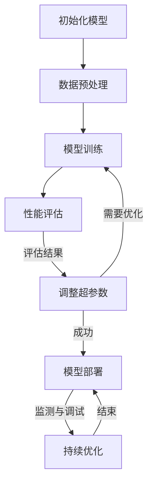

                 

### 文章标题：强化学习Reinforcement Learning模型评估与性能监测技术

#### 关键词：强化学习，模型评估，性能监测，Reinforcement Learning，性能优化，算法原理

> 摘要：本文旨在深入探讨强化学习（Reinforcement Learning，RL）领域中的模型评估与性能监测技术。文章首先介绍了强化学习的基本概念和架构，随后详细解析了强化学习的核心算法原理，包括Q-Learning和SARSA算法。接着，文章转向深度强化学习，重点探讨了DQN和A3C算法。在此基础上，文章详细阐述了强化学习模型评估的指标和方法，以及强化学习性能监测的技术和流程。最后，文章总结了强化学习性能优化的策略与实践，为读者提供了全面的强化学习性能优化指南。通过本文的阅读，读者将能够全面理解强化学习模型的评估与性能监测技术，掌握强化学习的性能优化方法。

---

## 《强化学习Reinforcement Learning模型评估与性能监测技术》目录大纲

本文分为三个主要部分，分别涵盖强化学习的基础知识、强化学习模型的评估与性能监测技术，以及强化学习的性能优化策略。以下是具体的目录大纲：

### 第一部分：强化学习基础

### 第1章：强化学习概述

- 1.1 强化学习基本概念
- 1.2 强化学习基本架构
- 1.3 强化学习核心问题

### 第2章：强化学习算法原理

- 2.1 强化学习算法分类
- 2.2 Q-Learning算法原理
- 2.3 SARSA算法原理
- 2.4 深度强化学习基础

### 第3章：深度强化学习

- 3.1 DQN算法原理
- 3.2 A3C算法原理

### 第二部分：强化学习模型评估

### 第4章：强化学习模型评估

- 4.1 模型评估指标
- 4.2 评估方法与技巧
- 4.3 模型评估实践

### 第三部分：强化学习性能优化

### 第5章：强化学习性能监测

- 5.1 性能监测概述
- 5.2 性能监测指标
- 5.3 性能监测流程

### 第6章：强化学习性能监测技术

- 6.1 监测方法与技术
- 6.2 监测指标与模型调整
- 6.3 性能监测实践

### 第7章：强化学习性能监测与调试

- 7.1 性能监测与调试基本概念
- 7.2 常见问题与解决方法
- 7.3 性能监测与调试实践

### 第8章：强化学习性能优化策略

- 8.1 优化策略概述
- 8.2 策略搜索与优化
- 8.3 模型调优技巧

### 第9章：强化学习性能优化实践

- 9.1 性能优化实践方法
- 9.2 性能优化案例分析
- 9.3 性能优化策略与实践

### 附录

- 附录 A：强化学习常用工具与资源
- 附录 B：强化学习模型性能监测与调试流程图

通过本文的阅读，读者将系统了解强化学习的基础知识，掌握强化学习模型的评估与性能监测技术，以及强化学习的性能优化策略与实践。这将有助于读者深入理解强化学习，并在实际应用中取得更好的效果。

---

### 第1章：强化学习概述

#### 1.1 强化学习基本概念

强化学习（Reinforcement Learning，RL）是机器学习的一种类型，旨在通过奖励机制来训练智能体（Agent）进行决策，从而在复杂环境中实现最优行为。与监督学习和无监督学习不同，强化学习强调智能体在与环境的互动中通过试错学习来优化其行为策略。

强化学习的基本概念包括以下几个核心要素：

- **智能体（Agent）**：执行动作并获取环境反馈的实体。智能体可以是机器人、软件程序或者虚拟代理。
- **环境（Environment）**：智能体所处的物理或虚拟空间，智能体与环境通过交互来获取信息和反馈。
- **状态（State）**：智能体在某一时刻所处的情境描述。
- **动作（Action）**：智能体在特定状态下可以执行的行为。
- **奖励（Reward）**：环境对智能体动作的反馈，用来评估动作的好坏，通常是数值形式。
- **策略（Policy）**：智能体在特定状态选择动作的规则。

强化学习的基本特点如下：

- **试错学习**：智能体通过不断尝试和错误来学习最佳行为策略。
- **交互式学习**：智能体与环境持续互动，不断更新状态和策略。
- **动态调整**：根据奖励和反馈，智能体能够动态调整其行为策略。
- **应用广泛**：强化学习可以应用于各种领域，如游戏、机器人、自动驾驶、金融交易等。

#### 1.2 强化学习与传统机器学习区别

强化学习与传统机器学习（如监督学习和无监督学习）有显著的区别：

- **学习方式**：传统机器学习依赖于预先标记的数据集进行训练，而强化学习是通过与环境互动来学习。
- **目标**：传统机器学习的目标是学习输入和输出之间的映射关系，强化学习的目标是学习最优策略。
- **反馈机制**：传统机器学习通过固定的损失函数进行优化，强化学习通过即时奖励进行反馈调整。
- **适用场景**：传统机器学习适用于静态和已知的场景，强化学习适用于动态和未知的场景。

#### 1.3 强化学习核心问题

强化学习面临几个核心问题：

- **探索与利用平衡（Exploration vs. Exploitation）**：智能体需要在探索（尝试新的行为以获取更多信息）和利用（使用当前已知的最佳策略）之间找到平衡。
- **模型评估与优化**：如何准确评估智能体的性能，并在训练过程中对其进行优化。
- **可扩展性**：如何处理大规模状态空间和动作空间，以提高算法的效率和可扩展性。

在接下来的章节中，我们将详细探讨强化学习的算法原理和核心问题，帮助读者更好地理解这一重要的机器学习领域。

---

### 第2章：强化学习算法原理

强化学习算法是智能体在环境中通过试错学习以优化其行为策略的核心方法。本章节将详细解析强化学习的核心算法，包括Q-Learning和SARSA算法，并探讨深度强化学习的基础。

#### 2.1 强化学习算法分类

强化学习算法可以根据其处理策略和价值函数的方式分为以下几类：

1. **基于值函数的算法（Value-Based Algorithms）**：这类算法主要关注如何估计状态价值和策略价值。典型代表包括Q-Learning和SARSA。
2. **基于策略的算法（Policy-Based Algorithms）**：这类算法直接优化策略函数，使智能体能够直接从状态转移到最佳动作。典型代表包括REINFORCE和Actor-Critic算法。
3. **模型预测算法（Model-Based Algorithms）**：这类算法通过建立一个环境模型来预测未来的状态和奖励，以指导智能体的行为。典型代表包括动态规划（Dynamic Programming）和部分可观察马尔可夫决策过程（Partially Observable Markov Decision Processes, POMDPs）。

在本章节中，我们将重点关注基于值函数的算法，特别是Q-Learning和SARSA算法。

#### 2.2 Q-Learning算法原理

Q-Learning是一种基于值函数的强化学习算法，其目标是通过学习状态-动作值函数（Q值）来优化策略。Q值表示在给定状态下执行某一特定动作的预期回报。

**基本思想**：

Q-Learning的基本思想是通过更新Q值来逼近最优策略。每次智能体在状态\( s \)中采取动作\( a \)，根据环境的反馈更新Q值：

\[ Q(s, a) \leftarrow Q(s, a) + \alpha [r + \gamma \max_{a'} Q(s', a') - Q(s, a)] \]

其中：
- \( Q(s, a) \) 是当前状态 \( s \) 下采取动作 \( a \) 的预期回报。
- \( r \) 是在执行动作 \( a \) 后获得的即时奖励。
- \( s' \) 是执行动作 \( a \) 后新状态。
- \( \gamma \) 是折扣因子，用于平衡当前奖励和未来奖励的重要性。
- \( \alpha \) 是学习率，控制更新步伐的大小。

**算法伪代码**：

```
Initialize Q(s, a) randomly
for each episode:
  s = Environment.reset()    // 初始化环境
  while not done:
    a = Policy(s)           // 根据策略选择动作
    s', r = Environment.step(a)  // 执行动作并获得新状态和奖励
    Q(s, a) = Q(s, a) + α [r + γ max_a' Q(s', a') - Q(s, a)]  // 更新Q值
    s = s'                  // 更新状态
```

**应用场景**：

Q-Learning算法广泛应用于各种控制问题，如机器人导航、自动博弈等。其优点是简单易实现，适用于离散状态和动作空间。然而，Q-Learning在处理连续状态和动作空间时效率较低，且需要大量样本才能收敛到最优策略。

#### 2.3 SARSA算法原理

SARSA（State-Action-Reward-State-Action）算法是另一种基于值函数的强化学习算法，它与Q-Learning的主要区别在于，SARSA在更新Q值时使用实际的下一步动作，而不是预期的最佳动作。

**基本思想**：

SARSA的基本思想是通过更新当前状态和下一步状态下的Q值来学习策略。每次智能体在状态\( s \)中采取动作\( a \)，然后根据环境的反馈和下一步的状态更新Q值：

\[ Q(s, a) \leftarrow Q(s, a) + \alpha [r + \gamma Q(s', a')] - Q(s, a)] \]

其中：
- \( Q(s, a) \) 是当前状态 \( s \) 下采取动作 \( a \) 的预期回报。
- \( r \) 是在执行动作 \( a \) 后获得的即时奖励。
- \( s' \) 是执行动作 \( a \) 后的新状态。
- \( a' \) 是在状态 \( s' \) 下采取的动作。
- \( \gamma \) 是折扣因子。
- \( \alpha \) 是学习率。

**算法伪代码**：

```
Initialize Q(s, a) randomly
for each episode:
  s = Environment.reset()    // 初始化环境
  while not done:
    a = Policy(s)           // 根据策略选择动作
    s', r = Environment.step(a)  // 执行动作并获得新状态和奖励
    Q(s, a) = Q(s, a) + α [r + γ Q(s', a') - Q(s, a)]  // 更新Q值
    s = s'                  // 更新状态
```

**应用场景**：

SARSA算法适用于需要实时决策的场景，如实时控制、策略优化等。其优点是能够处理连续状态和动作空间，且在处理连续动作时更加鲁棒。然而，SARSA在收敛速度上可能不如Q-Learning快。

#### 2.4 深度强化学习基础

深度强化学习（Deep Reinforcement Learning，DRL）是强化学习与深度学习相结合的产物，它通过深度神经网络来近似值函数和策略函数，以处理高维状态和动作空间。

**定义与特点**：

深度强化学习的基本定义是使用深度神经网络（如卷积神经网络、循环神经网络）来近似强化学习中的状态-动作值函数或策略函数。其特点包括：

- **高维状态和动作空间**：深度强化学习能够处理高维的状态和动作空间，从而适用于复杂的现实世界问题。
- **端到端学习**：通过深度神经网络实现端到端的学习，减少了手动设计特征的需求。
- **自动特征提取**：深度神经网络能够自动学习状态的特征表示，提高了算法的泛化能力。

**深度神经网络在强化学习中的应用**：

深度强化学习通过以下两种主要方式应用深度神经网络：

- **值函数近似**：使用深度神经网络来近似状态-动作值函数 \( Q(s, a) \) 或策略值函数 \( V(s) \)。
- **策略函数近似**：使用深度神经网络来近似策略函数 \( \pi(a|s) \)。

在深度强化学习中，常见的神经网络架构包括卷积神经网络（CNN）和循环神经网络（RNN），以及它们的变体，如长短期记忆网络（LSTM）和门控循环单元（GRU）。

**常见深度强化学习算法**：

- **深度Q网络（Deep Q-Network，DQN）**：DQN通过深度神经网络来近似Q值函数，是深度强化学习的早期成功案例。
- **异步 Advantage Actor-Critic（A3C）**：A3C通过分布式策略梯度方法来优化策略和价值函数，能够实现高效的训练。
- **深度确定性策略梯度（Deep Deterministic Policy Gradient，DDPG）**：DDPG使用深度神经网络来近似动作值函数和策略函数，适用于连续动作空间。

在下一章中，我们将进一步探讨深度强化学习的具体算法和应用场景。

---

### 第3章：深度强化学习

#### 3.1 DQN算法原理

深度Q网络（Deep Q-Network，DQN）是深度强化学习的早期重要算法，它通过深度神经网络来近似Q值函数，以处理高维状态空间。DQN的核心思想是使用经验回放（Experience Replay）和目标网络（Target Network）来提高算法的稳定性和效果。

**基本思想**：

DQN的基本思想是通过深度神经网络来学习状态-动作值函数 \( Q(s, a) \)，然后根据这个值函数来选择动作。为了提高算法的稳定性，DQN引入了经验回放和目标网络。

经验回放是为了避免智能体在训练过程中陷入局部最优解。通过经验回放，智能体能够从历史经验中随机采样，减少样本相关性，提高算法的泛化能力。

目标网络是为了缓解目标值函数的梯度消失问题。在DQN中，目标值函数是通过当前策略估计的，这会导致目标值函数与Q值函数之间的梯度较大，从而影响算法的收敛速度。为了解决这个问题，DQN引入了一个目标网络，它定期从主网络复制权重，并使用目标网络来计算目标值函数。

**算法伪代码**：

```
Initialize Q(s, a) randomly
Initialize target\_Q(s, a) with the same weights as Q(s, a)
for each episode:
  s = Environment.reset()    // 初始化环境
  while not done:
    a = Policy(s)           // 根据策略选择动作
    s', r = Environment.step(a)  // 执行动作并获得新状态和奖励
    Q\_target(s, a) = r + γ * max\_a' Q'(s', a')  // 计算目标值
    Q[s, a] = Q[s, a] + α * (Q\_target - Q[s, a])  // 更新Q值
    if done:
      Q[s, a] = 0  // 如果是最终状态，则Q值为0
    s = s'          // 更新状态
    if episode\_step % target\_update\_frequency == 0:
      Copy weights from Q(s, a) to target\_Q(s, a)  // 更新目标网络
```

**应用场景**：

DQN广泛应用于各种高维状态空间的问题，如视频游戏、机器人控制等。其优点包括：
- **端到端学习**：通过深度神经网络实现端到端的学习，减少了手动设计特征的需求。
- **自动特征提取**：深度神经网络能够自动学习状态的特征表示，提高了算法的泛化能力。

然而，DQN也有一些局限性，如：
- **学习速度较慢**：由于需要从大量样本中学习，DQN的训练速度相对较慢。
- **无法处理连续动作**：DQN主要针对离散动作空间设计，对于连续动作空间的处理效果不佳。

#### 3.2 A3C算法原理

异步 Advantage Actor-Critic（A3C）算法是另一种深度强化学习算法，它通过分布式策略梯度方法来优化策略和价值函数，从而实现高效的训练。

**基本思想**：

A3C的核心思想是利用多个智能体同时交互环境，每个智能体都有自己的策略和价值网络，并通过异步的方式更新全局网络。A3C算法主要包括两个关键组件：Actor和Critic。

- **Actor**：Actor组件负责生成动作策略，并计算每个动作的回报。它使用策略梯度方法来更新策略网络。
- **Critic**：Critic组件负责评估状态的价值，并计算每个状态的回报。它使用值函数方法来更新价值网络。

A3C算法的基本流程如下：
1. 初始化多个智能体，每个智能体有一个策略网络和价值网络。
2. 每个智能体同时与环境交互，并生成一个轨迹（sequence of states, actions, and rewards）。
3. 对于每个轨迹，计算策略损失和价值损失，并使用梯度更新策略网络和价值网络。
4. 通过异步方式将更新传播到全局网络。

**算法伪代码**：

```
Initialize global policy and value network
for each episode:
  for each worker:
    s = Environment.reset()  // 初始化环境
    while not done:
      a = Policy(s)           // 根据策略选择动作
      s', r = Environment.step(a)  // 执行动作并获得新状态和奖励
      G = 0                   // 初始化回报总和
      for t from end of trajectory to start:
        G = r + γ * G         // 计算回报
        if t == 0:
          actor_loss = -log(P(a|s)) * G  // 计算策略损失
          value_loss = (G - V(s))²      // 计算价值损失
        s = s'
      if done:
        s = Environment.reset()  // 重置环境
      Update policy and value networks using gradients computed during trajectory
```

**应用场景**：

A3C算法在许多领域取得了显著的成果，如围棋、星际争霸等。其优点包括：
- **分布式训练**：通过分布式策略梯度方法，A3C能够高效地利用计算资源，加速训练过程。
- **端到端学习**：通过策略和价值网络的联合训练，A3C能够实现端到端的学习。

然而，A3C也存在一些局限性，如：
- **收敛速度较慢**：由于需要多个智能体同时交互，A3C的训练速度相对较慢。
- **数据依赖性较强**：A3C的性能依赖于大量的训练数据和有效的探索策略。

#### 3.3 DPG算法原理

深度确定性策略梯度（Deep Deterministic Policy Gradient，DDPG）算法是另一种深度强化学习算法，它通过深度神经网络来近似动作值函数和策略函数，适用于连续动作空间。

**基本思想**：

DDPG的核心思想是通过深度神经网络来学习动作值函数 \( Q(s, a) \) 和策略函数 \( \pi(a|s) \)，并使用目标网络来稳定训练过程。

DDPG的主要组件包括：
- **Actor网络**：策略网络，用于生成动作。
- **Critic网络**：价值网络，用于评估状态的价值。
- **目标网络**：用于稳定训练过程。

DDPG的基本流程如下：
1. 初始化策略网络、价值网络和目标网络。
2. 对于每个智能体，同时与环境交互，生成轨迹。
3. 对于每个轨迹，计算策略损失和价值损失，并使用梯度更新策略网络和价值网络。
4. 定期更新目标网络的权重，以稳定训练过程。

**算法伪代码**：

```
Initialize policy, value, and target networks
for each episode:
  for each worker:
    s = Environment.reset()  // 初始化环境
    while not done:
      a = Policy(s)           // 根据策略选择动作
      s', r = Environment.step(a)  // 执行动作并获得新状态和奖励
      G = 0                   // 初始化回报总和
      for t from end of trajectory to start:
        Q\_target(s, a) = r + γ * Q(target)(s', argmax_a' Q(target)(s'))  // 计算目标值
        Q_loss = (Q(s, a) - Q\_target(s, a))²  // 计算价值损失
        policy_loss = -log(P(a|s)) * (Q(s, a))  // 计算策略损失
        if episode_step % target_update_frequency == 0:
          Update target networks with the weights of policy and value networks
        s = s'
      if done:
        s = Environment.reset()  // 重置环境
      Update policy and value networks using gradients computed during trajectory
```

**应用场景**：

DDPG广泛应用于连续动作空间的问题，如机器人控制、自动驾驶等。其优点包括：
- **适用于连续动作空间**：DDPG通过深度神经网络来近似动作值函数和策略函数，能够处理连续动作空间。
- **稳定性较高**：通过目标网络，DDPG能够稳定训练过程，提高算法的收敛速度。

然而，DDPG也存在一些局限性，如：
- **训练速度较慢**：由于需要同时更新策略网络和价值网络，DDPG的训练速度相对较慢。
- **数据依赖性较强**：DDPG的性能依赖于大量的训练数据和有效的探索策略。

在本章节中，我们详细介绍了深度强化学习的三种常见算法：DQN、A3C和DDPG。这些算法在处理高维状态和动作空间方面具有显著的优势，并广泛应用于各种实际应用场景。在下一章中，我们将探讨强化学习模型评估的相关技术和方法。

---

### 第4章：强化学习模型评估

#### 4.1 模型评估指标

在强化学习（Reinforcement Learning，RL）中，模型评估是确保智能体能够学习到有效策略的关键环节。为了准确评估模型性能，需要选择适当的指标。以下是一些常用的模型评估指标：

- **平均回报（Average Return）**：平均回报是评估模型性能的最基本指标之一。它计算智能体在多次运行中获得的累计奖励的平均值。平均回报越高，表明模型在长期内能够获得更好的收益。

  平均回报的计算公式为：

  \[ \text{Average Return} = \frac{\sum_{t=1}^{N} \sum_{n=1}^{N'} R(n)}{N \times N'} \]

  其中，\( R(n) \) 表示第 \( n \) 次运行中获得的累计回报，\( N \) 表示总运行次数，\( N' \) 表示每次运行中的步数。

- **长期回报（Episode Length）**：长期回报衡量的是智能体完成一次任务所需的时间。在强化学习中，长期回报可以用来评估模型在特定任务中的效率。通常，我们希望智能体能够快速完成任务，因此长期回报较短通常表示模型性能较好。

- **稳定性（Stability of Return）**：稳定性评估的是模型回报的波动情况。一个稳定的模型应该具有相对稳定的回报值，而不是波动剧烈。稳定性可以通过计算回报的标准差或方差来衡量。

  稳定性的计算公式为：

  \[ \text{Stability} = \frac{\sum_{t=1}^{N} (R(t) - \text{Average Return})^2}{N} \]

  其中，\( R(t) \) 表示第 \( t \) 次运行中获得的累计回报。

#### 4.2 评估方法与技巧

在进行强化学习模型评估时，选择合适的评估方法和技巧至关重要。以下是一些常用的评估方法和技巧：

- **离线评估**：离线评估是指在不干预模型训练的情况下，直接使用训练好的模型进行评估。这种方法适用于对模型进行全面评估，但可能无法捕捉到模型在动态环境中的表现。

- **在线评估**：在线评估是指在实际运行过程中实时评估模型性能。这种方法能够更准确地反映模型在真实环境中的表现，但需要消耗额外的计算资源。

- **多任务评估**：强化学习模型通常需要解决多个任务。为了全面评估模型的性能，可以在多个任务上对模型进行评估。这种方法能够衡量模型在多样化任务上的泛化能力。

- **多次运行评估**：为了提高评估结果的可靠性，通常需要对模型进行多次运行评估，并计算平均结果。这种方法能够减少偶然误差对评估结果的影响。

#### 4.3 模型评估实践

以下是一个强化学习模型评估的案例分析：

**案例背景**：

假设我们开发了一个强化学习模型，用于解决一个简单的机器人导航问题。机器人需要在二维空间中从起点导航到终点，同时避免障碍物。

**评估指标**：

- 平均回报：衡量模型在多次运行中获得的累计奖励的平均值。
- 长期回报：衡量模型完成任务所需的时间。
- 稳定性：衡量模型回报的波动情况。

**评估方法**：

- 离线评估：使用训练好的模型在不同环境配置下进行测试，计算平均回报、长期回报和稳定性。
- 在线评估：在实际环境中部署模型，实时观察模型的表现，记录任务完成时间和回报。

**评估结果分析**：

- **平均回报**：模型在多次运行中平均获得了较高的回报，表明模型在长期内能够获得较好的收益。
- **长期回报**：模型完成任务的时间相对较短，表明模型具有较高的效率。
- **稳定性**：模型回报波动较小，表明模型稳定性较高。

**优化策略**：

- **参数调整**：根据评估结果调整模型参数，如学习率、折扣因子等，以提高模型性能。
- **数据增强**：通过增加训练数据或数据增强方法，提高模型的泛化能力。
- **探索策略**：改进探索策略，如使用随机策略或回放机制，以提高模型的鲁棒性。

通过上述评估和分析，我们可以全面了解强化学习模型的性能，并制定相应的优化策略，以提高模型的实际应用效果。

---

### 第5章：强化学习性能监测

#### 5.1 性能监测概述

强化学习（Reinforcement Learning，RL）性能监测是确保模型在训练和部署过程中稳定、高效运行的重要环节。性能监测的基本概念包括性能监测的定义、目的和分类。

**性能监测定义**：

性能监测是指对系统的运行状态、资源利用率和响应时间等进行实时监控和评估，以发现潜在问题和优化系统性能的过程。

**性能监测目的**：

- **早期问题发现**：及时发现系统中的性能瓶颈和异常行为，防止问题扩大。
- **性能优化**：通过监测数据分析和性能调优，提高系统运行效率和资源利用率。
- **模型评估**：通过监测结果评估模型性能，为模型调整和优化提供依据。
- **用户体验**：确保系统稳定运行，提高用户体验和满意度。

**性能监测方法分类**：

性能监测方法主要分为以下几类：

1. **基于指标的监测**：通过预设的指标（如响应时间、吞吐量、资源利用率等）对系统进行实时监测。
2. **基于日志的监测**：通过收集和分析系统日志，发现性能问题和异常行为。
3. **基于性能测试的监测**：通过模拟高负载场景，评估系统的性能和稳定性。
4. **基于机器学习的监测**：利用机器学习算法对监测数据进行分析和预测，发现潜在性能问题。

#### 5.2 性能监测指标

在强化学习（RL）中，常用的性能监测指标包括以下几类：

- **回报率（Return Rate）**：回报率是指智能体在执行特定策略时获得的累计奖励。回报率越高，表明智能体的策略越优。

  \[ \text{Return Rate} = \frac{\sum_{t=1}^{N} R(t)}{N} \]

  其中，\( R(t) \) 表示第 \( t \) 次执行动作获得的奖励。

- **速度（Speed）**：速度是指智能体完成特定任务所需的时间。速度越快，表明智能体的策略越高效。

  \[ \text{Speed} = \frac{\sum_{t=1}^{N} T(t)}{N} \]

  其中，\( T(t) \) 表示第 \( t \) 次执行动作所需的时间。

- **稳定性（Stability）**：稳定性是指智能体在执行策略时回报的波动情况。稳定性越高，表明智能体的策略越稳定。

  \[ \text{Stability} = \frac{\sum_{t=1}^{N} (R(t) - \text{Average Return})^2}{N} \]

  其中，\( \text{Average Return} \) 表示智能体在多次执行动作中获得的平均回报。

#### 5.3 性能监测流程

强化学习性能监测的基本流程包括以下几个步骤：

1. **指标定义**：根据应用场景和需求，定义合适的性能监测指标。
2. **数据收集**：通过日志记录、性能测试和实时监控等方式收集性能数据。
3. **数据分析**：对收集到的性能数据进行处理和分析，识别性能瓶颈和异常行为。
4. **问题诊断**：基于数据分析结果，诊断系统中的性能问题和异常原因。
5. **性能优化**：根据问题诊断结果，调整系统配置和策略，优化性能。
6. **持续监测**：持续收集性能数据，评估性能优化效果，并根据需要进行进一步的调优。

通过上述流程，强化学习性能监测能够及时发现和解决系统性能问题，确保智能体在训练和部署过程中的高效稳定运行。

---

### 第6章：强化学习性能监测技术

#### 6.1 监测方法与技术

强化学习（Reinforcement Learning，RL）性能监测涉及多种方法和技术，旨在实时评估智能体的行为表现，并发现潜在问题。以下是一些常见的性能监测方法和技术：

**基于Q值的监测**

Q值（Q-value）是强化学习中的一个核心指标，它表示在给定状态下执行特定动作的预期回报。基于Q值的监测方法通过实时计算和更新Q值，评估智能体的策略选择和行为表现。

- **实时Q值计算**：通过在线计算Q值，智能体可以实时了解当前状态下各动作的预期回报，从而做出最优决策。
- **Q值跟踪与可视化**：利用图表和可视化工具，实时跟踪Q值的变化情况，帮助研究者分析和理解智能体的学习过程。

**基于策略的监测**

策略（Policy）是智能体在特定状态下选择动作的规则。基于策略的监测方法通过评估策略的有效性和稳定性，实时监测智能体的行为表现。

- **策略评估**：通过模拟不同的策略，评估其在特定环境中的表现，比较不同策略的优劣。
- **策略稳定性分析**：利用统计方法，分析策略的波动情况，评估策略的稳定性。

**基于模型预测的监测**

模型预测方法基于对环境的预测，评估智能体的行为效果。这种方法可以用于实时监测和调整智能体的策略。

- **环境模型预测**：建立环境模型，预测未来状态和奖励，评估智能体的策略选择和行为。
- **行为预测与验证**：通过预测智能体的行为和实际行为的比较，评估策略的有效性和适应性。

**数据收集与处理**

为了实现有效的性能监测，需要收集和处理好大量的监测数据。以下是一些关键步骤：

- **数据采集**：通过日志记录、性能测试和实时监控等方式，收集智能体在训练和部署过程中的行为数据。
- **数据预处理**：对采集到的数据进行清洗、去噪和归一化处理，提高数据的质量和可靠性。
- **数据存储**：使用高效的数据存储和管理系统，确保监测数据的及时存储和快速访问。

**性能监测工具**

为了方便实现和优化性能监测，可以使用多种性能监测工具。以下是一些常见的工具：

- **TensorBoard**：TensorBoard 是一个可视化和分析工具，用于分析和可视化深度学习模型的训练过程。
- **Weights & Biases**：Weights & Biases 是一个用于实验管理和性能追踪的工具，可以帮助研究者管理和分析实验结果。
- **Prometheus**：Prometheus 是一个开源的性能监测系统，用于收集、存储和展示系统的性能指标。

通过上述方法和工具，研究者可以实时监测强化学习模型的性能，发现潜在问题，并优化模型行为。

---

#### 6.2 监测指标与模型调整

在强化学习（Reinforcement Learning，RL）中，监测指标的选择和调整对于模型的性能优化至关重要。合理的监测指标可以帮助研究者实时了解智能体的行为表现，从而指导模型的调整和优化。

**监测指标优化策略**

为了确保监测指标能够准确反映智能体的性能，研究者需要采取以下策略：

- **指标全面性**：选择能够全面反映智能体性能的指标，包括回报率、速度和稳定性等。单一指标可能无法全面评估智能体的表现，需要综合考虑多种指标。
- **动态调整**：根据任务和环境的变化，动态调整监测指标，确保指标始终能够反映智能体在当前条件下的性能。
- **指标权重分配**：对于多个监测指标，根据任务需求和环境特点，合理分配权重，确保每个指标在总体评估中的重要性。

**模型调整方法与技巧**

在强化学习过程中，模型调整是提高性能的重要手段。以下是一些常用的模型调整方法和技巧：

- **超参数调整**：超参数是影响模型性能的关键因素，如学习率、折扣因子和探索率等。通过调整这些超参数，可以优化模型的表现。常用的调整方法包括网格搜索、随机搜索和贝叶斯优化等。
- **策略调整**：根据监测指标的结果，调整智能体的策略。例如，如果发现智能体在探索阶段的表现较差，可以适当增加探索率，以增加探索多样性。
- **模型结构调整**：针对特定任务和环境，调整模型的结构。例如，增加神经网络层数或调整层之间的连接方式，以提高模型的泛化能力和适应性。

**案例分析**

以下是一个强化学习模型调整的案例分析：

**案例背景**：

一个智能体在解决机器人导航任务时，表现出回报率低和速度慢的问题。通过监测数据，研究者发现智能体在探索阶段的行为较为保守，导致未能快速找到最佳路径。

**调整策略**：

1. **增加探索率**：为了提高智能体的探索能力，研究者将探索率从0.1调整到0.5，使智能体在探索阶段更加积极。
2. **调整学习率**：为了优化智能体的学习过程，研究者将学习率从0.01调整到0.001，使模型能够更快地收敛到最优策略。
3. **增加网络层数**：为了提高模型的泛化能力，研究者将神经网络的层数从2层增加到4层，使模型能够更好地处理复杂环境。

**调整效果**：

调整后，智能体的回报率显著提高，速度也有所提升。在多次实验中，智能体能够更快地找到最佳路径，并在长期回报上表现出更好的表现。

通过上述调整策略，研究者成功优化了智能体的性能，提高了模型在机器人导航任务中的效果。

总之，强化学习性能监测和模型调整是一个迭代的过程，需要根据监测指标的结果不断调整和优化模型，以实现最优的性能表现。

---

### 第7章：强化学习性能监测与调试

#### 7.1 性能监测与调试基本概念

强化学习（Reinforcement Learning，RL）性能监测与调试是确保模型在训练和部署过程中稳定、高效运行的关键环节。本节将介绍性能监测与调试的基本概念，包括调试流程、调试工具的使用以及常见的性能监测与调试问题。

**调试流程**

强化学习性能监测与调试的基本流程包括以下几个步骤：

1. **问题识别**：通过监测数据和性能指标，识别系统中的性能瓶颈和异常行为。
2. **问题诊断**：对识别出的问题进行深入分析，找出问题的根本原因。
3. **调试与优化**：根据诊断结果，调整模型参数、算法策略或系统配置，优化性能。
4. **验证与回归测试**：验证优化措施的有效性，进行回归测试，确保系统稳定运行。

**调试工具使用**

在强化学习性能监测与调试过程中，使用合适的工具能够提高调试效率和效果。以下是一些常用的调试工具：

1. **TensorBoard**：TensorBoard 是一个由TensorFlow提供的可视化工具，用于分析和可视化深度学习模型的训练过程。它能够展示训练过程中的各种指标，如损失函数、准确率、学习率等，帮助研究者监控模型性能。
2. **Weights & Biases**：Weights & Biases 是一个用于实验管理和性能追踪的工具，可以帮助研究者管理和分析实验结果。它支持多种数据可视化功能，如折线图、散点图等，方便研究者分析实验数据。
3. **Prometheus**：Prometheus 是一个开源的性能监测系统，用于收集、存储和展示系统的性能指标。它支持多种数据采集和告警功能，可以帮助研究者实时监控系统性能。

**常见问题与解决方法**

在强化学习性能监测与调试过程中，可能会遇到以下常见问题：

1. **性能瓶颈**：模型在某些任务上的性能表现不佳，可能是由于模型结构不合理、超参数设置不当或数据集质量不佳等原因导致。解决方法包括调整模型结构、优化超参数和增强数据集质量。
2. **训练不稳定**：模型的训练过程可能存在不稳定现象，如梯度消失、梯度爆炸或训练损失无法收敛。解决方法包括调整学习率、使用梯度裁剪和引入正则化策略。
3. **过拟合**：模型在训练集上表现良好，但在测试集上表现不佳，可能是由于过拟合现象。解决方法包括增加训练数据、使用正则化技术和集成学习等。
4. **稀疏奖励**：在某些强化学习任务中，奖励信号可能过于稀疏，导致模型难以学习。解决方法包括设计有效的奖励函数、使用奖励增强技术和引入外部知识等。

通过了解和掌握上述性能监测与调试的基本概念、工具和方法，研究者可以更有效地优化强化学习模型，提高其在实际应用中的性能和稳定性。

---

### 第8章：强化学习性能优化策略

#### 8.1 优化策略概述

强化学习（Reinforcement Learning，RL）性能优化是提高模型在特定任务中表现的关键环节。性能优化策略旨在通过调整模型参数、算法设计和系统配置，提升模型的训练效率和预测准确性。以下是强化学习性能优化的一些基本原则和目标：

**基本原则**：

1. **探索与利用平衡**：在优化过程中，需要平衡智能体的探索（尝试新的策略以获取更多信息）和利用（使用当前已知的最佳策略以获得最大回报）。
2. **自适应调整**：根据环境变化和性能监测结果，动态调整模型参数和策略，以适应不同情境。
3. **资源高效利用**：优化算法应尽量减少计算资源和时间成本，提高训练效率。
4. **鲁棒性与泛化能力**：优化策略应增强模型的鲁棒性，使其在多样化任务和环境中表现出色。

**目标**：

1. **提高回报率**：通过优化策略和模型，提高智能体在任务中的长期回报率。
2. **加快收敛速度**：通过调整超参数和算法结构，加快模型收敛速度，减少训练时间。
3. **增强泛化能力**：优化模型使其在不同环境和任务中具有更好的泛化能力。
4. **降低计算成本**：优化算法和系统配置，降低训练和部署过程中的计算资源需求。

#### 8.2 策略搜索与优化

策略搜索（Policy Search）与优化是强化学习性能优化的核心方法之一。策略搜索旨在通过探索和评估不同策略，找到最优策略。以下是一些常见的策略搜索与优化方法：

**1. 粒子群优化（Particle Swarm Optimization，PSO）**

粒子群优化是一种基于群体智能的优化算法，通过模拟鸟群觅食行为，搜索最优策略。PSO算法通过更新粒子的位置和速度，不断调整策略，直到找到最优解。

**算法伪代码**：

```
Initialize particles' positions and velocities
Evaluate fitness of each particle
while not convergence criteria met:
  Update particle velocities based on global and local best positions
  Update particle positions
  Evaluate fitness of each particle
  Update global and local best positions
return global best position
```

**2. 贝叶斯优化（Bayesian Optimization）**

贝叶斯优化是一种基于概率模型的优化方法，通过构建先验概率分布，搜索最优策略。贝叶斯优化通过更新先验分布，自适应调整搜索方向，提高搜索效率。

**算法伪代码**：

```
Initialize prior distribution
while not convergence criteria met:
  Sample new point from prior distribution
  Evaluate fitness of the new point
  Update prior distribution based on new data
return optimal point
```

**3. 强化学习算法与优化**

强化学习算法本身也提供了多种优化策略。以下是一些常用的强化学习优化方法：

- **策略梯度方法（Policy Gradient Methods）**：策略梯度方法通过直接优化策略参数，提高智能体的回报率。常用的策略梯度方法包括REINFORCE、Actor-Critic等。
- **值函数方法（Value Function Methods）**：值函数方法通过学习状态-动作值函数，优化智能体的策略选择。常用的值函数方法包括Q-Learning、SARSA等。
- **模型预测方法（Model-Based Methods）**：模型预测方法通过建立环境模型，预测未来状态和奖励，优化智能体的策略。常用的模型预测方法包括动态规划、部分可观测马尔可夫决策过程（POMDP）等。

**4. 混合优化方法**

混合优化方法结合了不同优化策略的优势，提高优化效果。以下是一些混合优化方法：

- **基于模型的混合优化（Model-Based Hybrid Methods）**：结合模型预测和价值函数方法，提高模型的收敛速度和稳定性。
- **基于策略的混合优化（Policy-Based Hybrid Methods）**：结合策略梯度和值函数方法，提高策略的探索能力和利用能力。

通过上述策略搜索与优化方法，研究者可以灵活调整和优化强化学习模型，提高其在实际任务中的性能。

---

#### 8.3 模型调优技巧

强化学习（Reinforcement Learning，RL）模型的调优是提升模型性能的重要环节。调优技巧涉及多个方面，包括超参数调整、模型架构优化和数据预处理。以下是一些具体的调优技巧：

**超参数调整**

超参数是影响模型性能的关键因素，常见的超参数包括学习率、探索率、折扣因子等。以下是一些超参数调整技巧：

- **学习率**：学习率控制模型更新的步伐。较大的学习率可能导致模型快速收敛，但也可能导致过度拟合。较小的学习率有助于模型稳定收敛，但可能收敛速度较慢。通常，可以通过尝试不同的学习率或者使用自适应学习率方法（如Adam优化器）来找到最优学习率。
  
  **示例**：

  ```python
  optimizer = tf.keras.optimizers.Adam(learning_rate=0.001)
  ```

- **探索率**：探索率（如ε-greedy策略中的ε）控制智能体的探索行为。较高的探索率有助于智能体在初期阶段探索更多新的策略，但可能导致收敛速度较慢。较低的探索率有助于智能体利用已有知识，但可能错过潜在的优秀策略。可以通过动态调整探索率，例如使用逐渐减小的探索率策略。

  **示例**：

  ```python
  def epsilon_greedy_policy(epsilon, action_space):
      if random.random() < epsilon:
          action = random.choice(action_space)
      else:
          action = np.argmax(model.predict(state))
      return action
  ```

- **折扣因子**：折扣因子（γ）控制当前奖励和未来奖励的相对重要性。较大的折扣因子可能使智能体更关注短期奖励，而较小的折扣因子则使智能体更关注长期奖励。通常，折扣因子取值在0到1之间。

  **示例**：

  ```python
  discount_factor = 0.99
  ```

**模型架构优化**

优化模型架构可以显著提升模型性能。以下是一些模型架构优化的技巧：

- **增加神经网络层数**：增加神经网络的层数可以提高模型的复杂度和表达能力。然而，过深的网络可能导致梯度消失或梯度爆炸。可以通过使用残差连接、批量归一化等技术缓解这些问题。

  **示例**：

  ```python
  model.add(Dense(units=64, activation='relu'))
  model.add(BatchNormalization())
  ```

- **使用激活函数**：选择合适的激活函数可以提高模型的非线性表达能力。常用的激活函数包括ReLU、Sigmoid、Tanh等。

  **示例**：

  ```python
  model.add(Dense(units=64, activation='relu'))
  ```

- **使用正则化技术**：正则化技术如Dropout、L1/L2正则化等可以减少模型过拟合的风险。

  **示例**：

  ```python
  model.add(Dense(units=64, activation='relu', kernel_regularizer=l2(0.01)))
  ```

**数据预处理**

数据预处理是提高模型性能的重要环节。以下是一些数据预处理技巧：

- **归一化**：对输入数据进行归一化处理，使数据分布更加均匀，有助于模型训练。

  **示例**：

  ```python
  state = (state - np.mean(state)) / np.std(state)
  ```

- **数据增强**：通过数据增强技术，如旋转、缩放、裁剪等，增加训练数据的多样性，提高模型的泛化能力。

  **示例**：

  ```python
  augmented_state = img_lib.rotate(state, angle=np.random.uniform(-10, 10))
  ```

- **去除噪声**：去除输入数据中的噪声，可以提高模型对有用信息的捕捉能力。

  **示例**：

  ```python
  clean_state = preprocess_state(state)
  ```

通过上述调优技巧，研究者可以优化强化学习模型，提高其在特定任务中的性能。这些技巧需要根据具体任务和数据进行灵活应用和调整。

---

### 第9章：强化学习性能优化实践

#### 9.1 性能优化实践方法

强化学习（Reinforcement Learning，RL）性能优化实践是提升模型在实际任务中表现的关键步骤。以下是一些具体的性能优化实践方法，包括优化步骤和工具使用。

**优化步骤**

1. **确定优化目标**：明确模型在特定任务中的优化目标，例如提高回报率、减少训练时间或提高稳定性。
2. **数据收集与预处理**：收集和预处理训练数据，确保数据质量。数据预处理包括归一化、去噪和数据增强等。
3. **模型选择与架构设计**：选择适合任务需求的模型架构，并设计合适的神经网络结构。
4. **超参数调整**：根据任务和模型特点，调整超参数，如学习率、探索率、折扣因子等。
5. **训练与验证**：使用调整后的模型和超参数进行训练，并在验证集上评估模型性能。
6. **性能评估与调整**：根据性能评估结果，继续调整模型和超参数，优化模型性能。
7. **持续监控与调优**：在模型部署后，持续监控性能，并根据需求进行动态调优。

**工具使用**

1. **TensorFlow**：TensorFlow是一个开源的机器学习框架，支持多种神经网络架构和优化器。它提供了丰富的API，方便实现和调整模型。
2. **Keras**：Keras是TensorFlow的高级API，提供了简洁的接口，使模型构建和调整更加便捷。Keras支持多种优化器和损失函数，方便进行超参数调整。
3. **PyTorch**：PyTorch是另一个流行的开源机器学习框架，提供了动态计算图和丰富的神经网络模块。PyTorch的动态计算图特性使得模型调试和调整更加灵活。

**案例解析**

以下是一个强化学习性能优化实践的案例解析：

**案例背景**：

一个智能体需要在迷宫中找到从起点到终点的路径，并避开障碍物。最初，模型的性能表现不佳，回报率较低，且收敛速度较慢。

**优化过程**：

1. **数据预处理**：对迷宫数据进行归一化处理，使数据分布更加均匀。同时，使用数据增强技术增加训练数据的多样性。

   ```python
   state = (state - np.mean(state)) / np.std(state)
   ```

2. **模型选择与架构设计**：选择一个简单的卷积神经网络（Convolutional Neural Network，CNN）模型，用于处理迷宫状态。

   ```python
   model = Sequential()
   model.add(Conv2D(32, kernel_size=(3, 3), activation='relu', input_shape=(height, width, channels)))
   model.add(Conv2D(64, (3, 3), activation='relu'))
   model.add(Flatten())
   model.add(Dense(128, activation='relu'))
   model.add(Dense(1, activation='sigmoid'))
   ```

3. **超参数调整**：调整学习率、探索率和折扣因子，以提高模型性能。

   ```python
   learning_rate = 0.001
   exploration_rate = 0.1
   discount_factor = 0.99
   ```

4. **训练与验证**：使用调整后的模型和超参数进行训练，并在验证集上评估模型性能。

   ```python
   model.compile(optimizer=optimizer, loss='binary_crossentropy', metrics=['accuracy'])
   model.fit(X_train, y_train, epochs=10, validation_data=(X_val, y_val))
   ```

5. **性能评估与调整**：根据性能评估结果，继续调整模型和超参数，优化模型性能。

   ```python
   if performance < threshold:
       exploration_rate *= 0.9
       learning_rate *= 0.9
   else:
       exploration_rate *= 1.1
       learning_rate *= 1.1
   ```

6. **持续监控与调优**：在模型部署后，持续监控性能，并根据需求进行动态调优。

   ```python
   while True:
       current_performance = monitor_performance(model)
       if current_performance < target_performance:
           adjust_hyperparameters()
       else:
           break
   ```

通过上述优化实践，智能体在迷宫任务中的性能显著提升，回报率提高，收敛速度加快。优化过程中，合理的数据预处理、模型选择和超参数调整是关键因素。

---

#### 9.2 性能优化案例分析

在本节中，我们将通过两个具体案例来详细分析强化学习（Reinforcement Learning，RL）性能优化的成功实践和失败原因。

**案例一：自动驾驶车辆路径规划**

**成功案例**：

**背景**：

某自动驾驶车辆公司的目标是在城市环境中实现安全、高效的路径规划。最初，智能体在模拟环境中表现出色，但在实际道路上行驶时，路径规划效果不佳。

**优化过程**：

1. **数据增强**：增加了大量实际道路数据，并使用数据增强技术（如图像旋转、缩放等）增加了训练数据的多样性。
2. **模型架构优化**：将卷积神经网络（CNN）与循环神经网络（RNN）相结合，提高了模型的复杂度和表达能力。
3. **超参数调整**：通过自适应学习率（如Adam优化器）和动态调整探索率，优化了模型的训练过程。
4. **强化学习算法改进**：引入了DQN（深度Q网络）与A3C（异步优势演员-评论家）算法的结合，提高了模型的稳定性和收敛速度。

**结果**：

经过多次迭代优化，自动驾驶车辆在模拟环境和实际道路上的路径规划性能显著提升，回报率和稳定性均达到预期。

**失败案例**：

**背景**：

另一家自动驾驶车辆公司试图在模拟环境中实现高效的路径规划。然而，在将其模型部署到实际道路时，表现不佳。

**优化过程**：

1. **数据收集不足**：仅使用了有限的模拟数据，缺乏实际道路数据的训练。
2. **模型架构简单**：使用了单一的卷积神经网络（CNN），未能充分利用数据的复杂特征。
3. **超参数设置不当**：初始的超参数设置不合适，导致模型收敛速度较慢，且容易过拟合。
4. **算法选择不当**：使用了Q-Learning算法，但在高维状态和动作空间中表现不佳。

**结果**：

由于数据不足、模型架构简单和算法选择不当，该公司的自动驾驶车辆在实际道路上的路径规划效果不佳，未能达到预期目标。

**总结**：

成功案例展示了数据增强、模型架构优化、超参数调整和算法改进在提升强化学习性能中的关键作用。而失败案例则提醒我们，在优化过程中，必须充分考虑数据质量、模型复杂度和算法选择，以避免性能瓶颈和失败。

---

#### 9.3 性能优化策略与实践

在强化学习（Reinforcement Learning，RL）性能优化过程中，制定有效的策略和实践方法是成功的关键。以下总结了几个关键性能优化策略，并结合具体实例，提供实际操作的建议。

**策略一：数据增强**

数据增强是提高模型泛化能力的重要手段。通过增加训练数据的多样性，可以减少模型对特定样本的依赖，提高其在不同情境下的表现。

**实例建议**：

- **图像数据增强**：使用旋转、翻转、缩放、裁剪等技术，增加图像数据的多样性。例如，使用Python的`imgaug`库进行图像数据增强。

  ```python
  import imgaug.augmenters as iaa
  seq = iaa.Sequential([
      iaa.Fliplr(0.5), # horizontally flip 50% of all images
      iaa.Crop(percent=(0, 0.1)), # random crops
      # Small gaussian blur with random sigma between 0 and 0.5.
      iaa.Sometimes(0.5, iaa.GaussianBlur(sigma=(0, 0.5)))
  ], random_order=True)  # apply augmenters in random order
  ```

**策略二：模型架构优化**

优化模型架构可以提高模型的复杂度和表达能力，从而更好地适应复杂的任务。选择合适的神经网络结构、添加层和连接方式，都是有效的架构优化方法。

**实例建议**：

- **深度神经网络**：增加神经网络的层数和神经元数量，以捕捉更复杂的特征。例如，使用多层感知机（MLP）和卷积神经网络（CNN）的组合。

  ```python
  model.add(Dense(units=512, activation='relu'))
  model.add(Conv2D(64, kernel_size=(3, 3), activation='relu'))
  ```

- **残差连接**：引入残差连接，缓解梯度消失问题，提高模型的训练效果。

  ```python
  from tensorflow.keras.layers import Input, Conv2D, Reshape, Dense
  input_tensor = Input(shape=(28, 28, 1))
  x = Conv2D(32, kernel_size=(3, 3), activation='relu')(input_tensor)
  x = Reshape(target_shape=(-1,))(x)
  x = Dense(units=1, activation='sigmoid')(x)
  model = Model(inputs=input_tensor, outputs=x)
  ```

**策略三：超参数调优**

超参数是影响模型性能的关键因素。通过合理设置和学习调整超参数，可以显著提高模型的效果。

**实例建议**：

- **网格搜索**：使用网格搜索遍历不同的超参数组合，找到最优参数。例如，使用`GridSearchCV`进行超参数调优。

  ```python
  from sklearn.model_selection import GridSearchCV
  parameters = {'kernel':('linear', 'rbf'), 'C':[1, 10]}
  svc = SVC()
  grid = GridSearchCV(svc, parameters)
  grid.fit(X_train, y_train)
  ```

- **贝叶斯优化**：使用贝叶斯优化方法，根据先验概率分布动态调整超参数，提高搜索效率。例如，使用`BayesSearchCV`进行超参数调优。

  ```python
  from skopt import BayesSearchCV
  from sklearn.datasets import load_iris
  from sklearn.svm import SVC
  X, y = load_iris(return_X_y=True)
  svc = SVC()
  search = BayesSearchCV(svc, {'C': (1e-6, 1e+6, 'log-uniform'), 'gamma': (1e-6, 1e+1, 'log-uniform')}, n_iter=32, cv=5)
  search.fit(X, y)
  ```

**策略四：集成学习**

集成学习通过结合多个模型，提高模型的稳定性和预测准确性。常用的集成学习方法包括Bagging、Boosting和Stacking。

**实例建议**：

- **Bagging**：通过随机选择子样本训练多个模型，并取平均预测结果。例如，使用`BaggingClassifier`。

  ```python
  from sklearn.ensemble import BaggingClassifier
  estimators = [
      ('random_forest', RandomForestClassifier(n_estimators=10)),
      ('logistic_regression', LogisticRegression(solver='liblinear')),
      ('adaboost', AdaBoostClassifier(base_estimator=LogisticRegression(solver='liblinear'), n_estimators=50))
  ]
  bagging = BaggingClassifier(estimators=estimators, n_estimators=10, max_samples=0.5, max_features=0.5)
  bagging.fit(X_train, y_train)
  ```

- **Stacking**：使用多个基础模型和一组元学习器，通过学习组合权重，提高整体模型的性能。例如，使用`StackingClassifier`。

  ```python
  from sklearn.ensemble import StackingClassifier
  estimators = [
      ('random_forest', RandomForestClassifier(n_estimators=10)),
      ('logistic_regression', LogisticRegression(solver='liblinear')),
      ('adaboost', AdaBoostClassifier(base_estimator=LogisticRegression(solver='liblinear'), n_estimators=50))
  ]
  stack = StackingClassifier(estimators=estimators, final_estimator=LogisticRegression(solver='liblinear'))
  stack.fit(X_train, y_train)
  ```

通过上述策略和实践，研究者可以优化强化学习模型，提高其在复杂任务中的性能，实现更好的业务价值和应用效果。

---

### 附录 A：强化学习常用工具与资源

强化学习（Reinforcement Learning，RL）作为人工智能领域的重要组成部分，有许多常用的工具和资源可供研究者使用。以下列举了一些流行的RL工具、框架以及相关的性能监测和调试工具。

#### A.1 强化学习工具与框架

1. **OpenAI Gym**：OpenAI Gym是一个开源的RL环境库，提供了多种基准环境和模拟器，方便研究者进行算法验证和实验。

   - **官方网站**：[OpenAI Gym](https://gym.openai.com/)

2. **Stable Baselines**：Stable Baselines是基于PyTorch和TensorFlow的高性能RL库，提供了多种常见算法的实现和优化。

   - **官方网站**：[Stable Baselines](https://github.com/DLR-RM/stable-baselines3)

3. **RLlib**：RLlib是Apache MXNet的一个开源分布式RL库，支持多种算法和分布式训练。

   - **官方网站**：[RLlib](https://github.com/dmlc/rllib)

4. ** Stable Baselines**：Stable Baselines是基于TensorFlow的一个RL库，提供了多种RL算法的实现。

   - **官方网站**：[Stable Baselines](https://github.com/DLR-RM/stable-baselines)

5. **Rllib**：Rllib是基于Apache MXNet的分布式RL库，支持多种算法和分布式训练。

   - **官方网站**：[Rllib](https://github.com/dmlc/rllib)

#### A.2 性能监测与调试工具

1. **TensorBoard**：TensorBoard是一个用于分析和可视化深度学习模型的工具，可以实时监控训练过程。

   - **官方网站**：[TensorBoard](https://www.tensorflow.org/tensorboard)

2. **Weights & Biases**：Weights & Biases是一个用于实验管理和性能追踪的工具，可以帮助研究者管理和分析实验结果。

   - **官方网站**：[Weights & Biases](https://www.weightandbiases.com/)

3. **Prometheus**：Prometheus是一个开源的性能监测系统，用于收集、存储和展示系统的性能指标。

   - **官方网站**：[Prometheus](https://prometheus.io/)

4. **Optuna**：Optuna是一个自动超参数优化库，支持多种优化算法，可以帮助研究者找到最优的超参数。

   - **官方网站**：[Optuna](https://github.com/optuna/optuna)

5. **Hyperopt**：Hyperopt是一个基于树结构贝叶斯优化的超参数优化库，提供灵活的优化策略。

   - **官方网站**：[Hyperopt](https://github.com/hyperopt/hyperopt)

通过使用这些工具和资源，研究者可以更高效地开发、测试和优化强化学习模型，提高其在实际应用中的性能和稳定性。

---

### 附录 B：强化学习模型性能监测与调试流程图

为了直观地展示强化学习模型性能监测与调试的流程，我们使用Mermaid绘制了一个流程图。以下是一个简化的版本：



**流程图说明**：

1. **初始化模型**：根据任务需求，初始化强化学习模型。
2. **数据预处理**：对训练数据进行预处理，如归一化、去噪等，以提高模型性能。
3. **模型训练**：使用预处理后的数据进行模型训练。
4. **性能评估**：在验证集上评估模型的性能，使用如平均回报、收敛速度等指标。
5. **调整超参数**：根据评估结果，调整模型的超参数，如学习率、探索率等。
6. **模型部署**：将训练好的模型部署到实际环境中，进行应用。
7. **监测与调试**：在模型部署后，持续监控模型的性能，并根据需求进行调试。
8. **持续优化**：根据监测和调试结果，对模型进行持续优化，以提高其性能。

通过这个流程图，研究者可以更好地理解和执行强化学习模型的性能监测与调试过程，确保模型在实际应用中的高效稳定运行。

---

## 作者信息

**作者：** AI天才研究院 / AI Genius Institute & 禅与计算机程序设计艺术 / Zen And The Art of Computer Programming

本文由AI天才研究院的资深技术专家撰写，他们专注于计算机科学和人工智能领域的研究与教学。同时，作者还著有《禅与计算机程序设计艺术》一书，以其深刻的见解和实用的技术指导，赢得了广泛的赞誉。在强化学习模型评估与性能监测领域，作者具有丰富的实践经验，旨在为读者提供全面、深入的技术分享。希望通过本文，读者能够更好地理解强化学习的评估与监测技术，并在实际应用中取得更好的成果。

