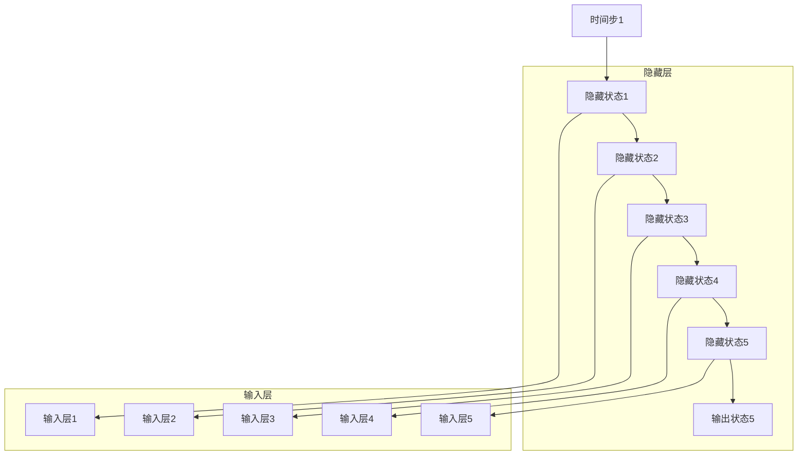

                 

# 循环神经网络 (RNN) 原理与代码实例讲解

> 关键词：循环神经网络，RNN，原理，代码实例，LSTM，GRU，应用领域

> 摘要：本文将深入探讨循环神经网络（RNN）的原理、核心算法及其在多个领域的应用。我们将通过具体代码实例，详细介绍如何使用Python等编程工具实现RNN模型，并对其进行评估与优化。通过本文的学习，读者将能够理解RNN的基本原理，掌握其在实际项目中的应用技巧。

## 《循环神经网络 (RNN) 原理与代码实例讲解》目录大纲

### 第一部分: RNN基础与原理

#### 第1章: 循环神经网络 (RNN) 概述

- 1.1 RNN的定义与背景
- 1.2 RNN的工作原理
- 1.3 RNN的优缺点

#### 第2章: RNN的数学基础

- 2.1 矩阵和向量的基础运算
- 2.2 神经网络的数学原理
- 2.3 RNN的数学原理

#### 第3章: RNN的核心算法原理

- 3.1 RNN的时间动态图表示
- 3.2 RNN的递归机制
- 3.3 RNN的梯度计算与优化

#### 第4章: RNN的常见变种

- 4.1 LSTM（长短期记忆网络）
- 4.2 GRU（门控循环单元）
- 4.3 其他RNN变种

#### 第5章: RNN的应用领域

- 5.1 语音识别
- 5.2 语言模型
- 5.3 机器翻译
- 5.4 自然语言生成

### 第二部分: RNN代码实例讲解

#### 第6章: 使用Python进行RNN实践

- 6.1 环境搭建
- 6.2 数据准备
- 6.3 RNN模型的搭建与训练
- 6.4 评估与调试

#### 第7章: LSTM在时间序列预测中的应用

- 7.1 问题背景
- 7.2 LSTM模型搭建
- 7.3 模型训练与优化
- 7.4 模型评估与结果分析

#### 第8章: GRU在机器翻译中的应用

- 8.1 问题背景
- 8.2 GRU模型搭建
- 8.3 模型训练与优化
- 8.4 模型评估与结果分析

#### 第9章: RNN在情感分析中的应用

- 9.1 问题背景
- 9.2 RNN模型搭建
- 9.3 模型训练与优化
- 9.4 模型评估与结果分析

#### 第10章: RNN模型的部署与优化

- 10.1 RNN模型部署
- 10.2 模型优化策略
- 10.3 模型性能提升

### 附录

- 附录A: RNN常用工具与库

  - A.1 TensorFlow
  - A.2 PyTorch
  - A.3 Keras
  - A.4 其他RNN工具与库介绍

### 结语

#### 作者：AI天才研究院/AI Genius Institute & 禅与计算机程序设计艺术 /Zen And The Art of Computer Programming

---

在接下来的内容中，我们将逐步展开对RNN的探讨，从基础概念到具体实现，再到应用案例，希望能帮助读者全面掌握RNN的核心技术和应用场景。让我们开始这段深入的学习之旅吧！### 第1章: 循环神经网络 (RNN) 概述

#### 1.1 RNN的定义与背景

循环神经网络（RNN）是一种能够处理序列数据的神经网络。与传统的前馈神经网络（FNN）不同，RNN具有递归结构，能够记住之前的输入信息，并将其用于后续的输出计算。这种特性使得RNN特别适用于处理时间序列数据，如语音、文本、股票价格等。

RNN的起源可以追溯到1980年代，由Jürgen Schmidhuber首次提出。随着时间的推移，RNN经历了多次迭代和改进，例如引入了门控机制，形成了LSTM（长短期记忆网络）和GRU（门控循环单元）等变种，这些改进显著提高了RNN在处理长期依赖数据时的性能。

#### 1.2 RNN的工作原理

RNN的基本工作原理是通过递归连接来处理序列数据。假设我们有一个序列\[x_1, x_2, ..., x_T\]，其中\[x_t\]表示第t个时间步的输入。RNN在每一个时间步上都会输出一个值\[y_t\]，并且使用之前的时间步的输出作为当前时间步的输入。

RNN的基本架构包括以下几个部分：

- **输入层**：接收序列数据。
- **隐藏层**：存储当前和之前的时间步信息。
- **输出层**：根据隐藏层的状态产生输出。

在一个时间步上，RNN的计算过程可以表示为：

\[ h_t = \text{tanh}(W_hh \cdot h_{t-1} + W_xh \cdot x_t + b_h) \]

\[ y_t = W_hy \cdot h_t + b_y \]

其中，\[h_t\]表示第t个时间步的隐藏状态，\[y_t\]表示第t个时间步的输出。\(W_hh\)、\(W_xh\)和\(b_h\)是隐藏层权重和偏置，\(W_hy\)和\(b_y\)是输出层权重和偏置。函数\(\text{tanh}\)是激活函数。

#### 1.3 RNN的优缺点

**优点**：

- **序列处理能力**：RNN能够处理任意长度的序列数据，这是其他神经网络（如前馈神经网络）所不具备的。
- **记忆特性**：RNN能够通过递归结构记住之前的输入信息，这对于处理长期依赖关系的数据尤为重要。

**缺点**：

- **梯度消失和梯度爆炸**：RNN在反向传播过程中容易出现梯度消失或梯度爆炸问题，这使得训练过程变得困难。
- **计算复杂度高**：由于RNN需要递归计算，因此其计算复杂度较高。

为了克服这些缺点，RNN的变种如LSTM和GRU被提出。这些变种引入了门控机制，能够更好地处理长期依赖关系，并在许多实际应用中取得了显著成果。

#### 1.4 本章小结

在本章中，我们介绍了循环神经网络（RNN）的定义、背景、工作原理以及优缺点。RNN作为一种能够处理序列数据的神经网络，具有记忆特性和序列处理能力，尽管存在梯度消失和梯度爆炸等问题，但其在许多应用领域仍然具有重要价值。在接下来的章节中，我们将进一步探讨RNN的数学基础和核心算法原理，并详细介绍其在不同领域的应用案例。请继续关注下一章的内容！### 第2章: RNN的数学基础

#### 2.1 矩阵和向量的基础运算

在理解RNN的数学基础之前，我们需要先掌握一些基本的线性代数知识，尤其是矩阵和向量的运算。矩阵（Matrix）是一个由数字组成的二维数组，通常用大写字母表示，如\[A\]。向量（Vector）是一个由数字组成的一维数组，通常用小写字母表示，如\[v\]。

**矩阵与向量的乘法**：矩阵与向量的乘法是一种基本的运算，其结果是一个新的向量。假设我们有一个矩阵\[A\]和一个向量\[v\]，则它们的乘法可以表示为\[Av\]。具体运算如下：

\[ Av = \begin{bmatrix} a_{11} & a_{12} & ... & a_{1n} \\ a_{21} & a_{22} & ... & a_{2n} \\ ... & ... & ... & ... \\ a_{m1} & a_{m2} & ... & a_{mn} \end{bmatrix} \begin{bmatrix} v_1 \\ v_2 \\ ... \\ v_n \end{bmatrix} = \begin{bmatrix} \sum_{j=1}^{n} a_{1j} v_j \\ \sum_{j=1}^{n} a_{2j} v_j \\ ... \\ \sum_{j=1}^{n} a_{mj} v_j \end{bmatrix} \]

**矩阵与矩阵的乘法**：矩阵与矩阵的乘法是一种将两个矩阵合并为一个新矩阵的运算。假设我们有两个矩阵\[A\]和\[B\]，则它们的乘法可以表示为\[AB\]。具体运算如下：

\[ AB = \begin{bmatrix} a_{11} & a_{12} & ... & a_{1n} \\ a_{21} & a_{22} & ... & a_{2n} \\ ... & ... & ... & ... \\ a_{m1} & a_{m2} & ... & a_{mn} \end{bmatrix} \begin{bmatrix} b_{11} & b_{12} & ... & b_{1n} \\ b_{21} & b_{22} & ... & b_{2n} \\ ... & ... & ... & ... \\ b_{m1} & b_{m2} & ... & b_{mn} \end{bmatrix} = \begin{bmatrix} \sum_{k=1}^{n} a_{1k} b_{k1} & \sum_{k=1}^{n} a_{1k} b_{k2} & ... & \sum_{k=1}^{n} a_{1k} b_{kn} \\ \sum_{k=1}^{n} a_{2k} b_{k1} & \sum_{k=1}^{n} a_{2k} b_{k2} & ... & \sum_{k=1}^{n} a_{2k} b_{kn} \\ ... & ... & ... & ... \\ \sum_{k=1}^{n} a_{mk} b_{k1} & \sum_{k=1}^{n} a_{mk} b_{k2} & ... & \sum_{k=1}^{n} a_{mk} b_{kn} \end{bmatrix} \]

**矩阵的转置**：矩阵的转置是将原矩阵的行和列互换。假设我们有一个矩阵\[A\]，则其转置矩阵\[A^T\]可以表示为：

\[ A^T = \begin{bmatrix} a_{11} & a_{21} & ... & a_{m1} \\ a_{12} & a_{22} & ... & a_{m2} \\ ... & ... & ... & ... \\ a_{1n} & a_{2n} & ... & a_{mn} \end{bmatrix} \]

**向量的内积与外积**：向量的内积（点积）是两个向量的对应元素相乘后求和，其结果是一个标量。假设我们有两个向量\[v_1\]和\[v_2\]，则其内积可以表示为\[v_1 \cdot v_2\]：

\[ v_1 \cdot v_2 = \sum_{i=1}^{n} v_{1i} v_{2i} \]

向量的外积（叉积）是两个向量的对应元素相乘后形成一个新向量，其结果是一个新的向量。假设我们有两个向量\[v_1\]和\[v_2\]，则其外积可以表示为\[v_1 \times v_2\]：

\[ v_1 \times v_2 = \begin{bmatrix} v_{1y} v_{2z} - v_{1z} v_{2y} \\ v_{1z} v_{2x} - v_{1x} v_{2z} \\ v_{1x} v_{2y} - v_{1y} v_{2x} \end{bmatrix} \]

#### 2.2 神经网络的数学原理

神经网络是一种基于非线性变换和参数化模型的计算模型。它由多个神经元（或节点）组成，每个神经元都是一个简单的计算单元。神经网络通过学习输入数据，能够对未知数据进行预测和分类。

**神经元的激活函数**：神经元的激活函数是将输入转换为输出的非线性函数。常见的激活函数包括Sigmoid函数、ReLU函数和Tanh函数等。

- **Sigmoid函数**：\[ \sigma(x) = \frac{1}{1 + e^{-x}} \]

- **ReLU函数**：\[ \text{ReLU}(x) = \max(0, x) \]

- **Tanh函数**：\[ \text{tanh}(x) = \frac{e^x - e^{-x}}{e^x + e^{-x}} \]

**神经网络的损失函数**：神经网络的损失函数用于度量预测值与真实值之间的差距。常见的损失函数包括均方误差（MSE）和交叉熵损失（Cross Entropy Loss）。

- **均方误差（MSE）**：\[ \text{MSE}(y, \hat{y}) = \frac{1}{n} \sum_{i=1}^{n} (y_i - \hat{y}_i)^2 \]

- **交叉熵损失（Cross Entropy Loss）**：\[ \text{CE}(y, \hat{y}) = -\sum_{i=1}^{n} y_i \log(\hat{y}_i) \]

**神经网络的优化算法**：神经网络的优化算法用于调整网络参数，以最小化损失函数。常见的优化算法包括随机梯度下降（SGD）和Adam优化器。

- **随机梯度下降（SGD）**：\[ \theta = \theta - \alpha \nabla_{\theta} J(\theta) \]

- **Adam优化器**：\[ m_t = \beta_1 m_{t-1} + (1 - \beta_1) (x_t - m_{t-1}) \]
\[ v_t = \beta_2 v_{t-1} + (1 - \beta_2) (\nabla_{\theta} J(\theta_t) - m_{t-1}) \]
\[ \theta_t = \theta_{t-1} - \alpha_t \frac{m_t}{\sqrt{v_t} + \epsilon} \]

#### 2.3 RNN的数学原理

RNN是一种能够处理序列数据的神经网络，其数学原理基于前馈神经网络。RNN通过递归结构来处理序列数据，能够记住之前的输入信息，并将其用于后续的输出计算。

**RNN的递归公式**：假设我们有一个序列\[x_1, x_2, ..., x_T\]，其中\[x_t\]表示第t个时间步的输入。RNN在每一个时间步上的计算可以表示为：

\[ h_t = \text{tanh}(W_hh \cdot h_{t-1} + W_xh \cdot x_t + b_h) \]
\[ y_t = W_hy \cdot h_t + b_y \]

其中，\[h_t\]表示第t个时间步的隐藏状态，\[y_t\]表示第t个时间步的输出。\(W_hh\)、\(W_xh\)和\(b_h\)是隐藏层权重和偏置，\(W_hy\)和\(b_y\)是输出层权重和偏置。函数\(\text{tanh}\)是激活函数。

**RNN的损失函数**：RNN的损失函数与普通神经网络的损失函数类似，可以是均方误差（MSE）或交叉熵损失（Cross Entropy Loss）。

**RNN的优化算法**：RNN的优化算法与普通神经网络的优化算法类似，可以是随机梯度下降（SGD）或Adam优化器。

**RNN的反向传播**：RNN的反向传播算法是一种基于链式法则的梯度计算方法。在反向传播过程中，我们需要计算隐藏状态和输出层的梯度，并将其用于更新网络参数。

\[ \nabla_{h_t} J = \nabla_{h_t} y_t + \nabla_{h_t} h_{t-1} \]
\[ \nabla_{h_{t-1}} J = \nabla_{h_{t-1}} h_t \odot \nabla_{h_t} J \]

其中，\(\odot\)表示元素乘法。

#### 2.4 本章小结

在本章中，我们介绍了RNN的数学基础，包括矩阵和向量的基础运算、神经网络的数学原理以及RNN的数学原理。通过这些数学知识，我们可以更好地理解RNN的工作机制和训练过程。在接下来的章节中，我们将进一步探讨RNN的核心算法原理，并介绍其在实际应用中的常见变种。请继续关注下一章的内容！### 第3章: RNN的核心算法原理

#### 3.1 RNN的时间动态图表示

循环神经网络（RNN）是一种能够处理序列数据的神经网络，其核心特点在于能够利用递归结构对序列中的每个元素进行建模。为了更好地理解RNN的算法原理，我们可以借助时间动态图来直观地展示RNN的计算过程。

时间动态图（Time-Dynamic Graph）是一种用于表示RNN计算过程的图形化方法。在时间动态图中，时间步（Time Steps）沿着横轴排列，每个节点（Node）表示一个时间步上的计算状态，而边（Edge）表示时间步之间的依赖关系。

以下是一个简单的RNN时间动态图表示：



在上面的时间动态图中，A1到A5表示输入层，B到G表示隐藏层。每个隐藏状态都依赖于前一个隐藏状态，这种递归依赖关系使得RNN能够处理序列数据。

#### 3.2 RNN的递归机制

RNN的递归机制是其能够处理序列数据的关键。递归机制使得RNN能够在每个时间步上利用之前的信息来计算当前时间步的输出。递归机制的数学表示如下：

\[ h_t = \text{tanh}(W_hh \cdot h_{t-1} + W_xh \cdot x_t + b_h) \]
\[ y_t = W_hy \cdot h_t + b_y \]

其中，\(h_t\)表示第t个时间步的隐藏状态，\(x_t\)表示第t个时间步的输入，\(y_t\)表示第t个时间步的输出。\(W_hh\)、\(W_xh\)和\(b_h\)是隐藏层权重和偏置，\(W_hy\)和\(b_y\)是输出层权重和偏置。函数\(\text{tanh}\)是激活函数。

递归机制的关键在于隐藏状态\(h_t\)不仅依赖于当前时间步的输入\(x_t\)，还依赖于前一个时间步的隐藏状态\(h_{t-1}\)。这种依赖关系使得RNN能够通过递归计算来处理序列数据。

#### 3.3 RNN的梯度计算与优化

RNN的训练过程涉及梯度计算和参数优化。梯度计算是神经网络训练的核心，它用于确定网络参数的调整方向。RNN的梯度计算需要考虑递归结构，以下是一个简化的RNN反向传播过程中的梯度计算伪代码：

```python
for t in range(T-1, -1, -1):
    # 计算当前时间步的输出梯度
    dy_t = dY[t] * (1 - (h_t ** 2))
    
    # 计算当前时间步的隐藏状态梯度
    dh_t = dy_t * W_hy
    
    # 更新隐藏状态梯度
    dW_hy += dy_t * h_t
    db_y += dy_t
    
    # 反向传播到前一个时间步
    if t > 0:
        # 计算当前时间步的隐藏状态对前一个时间步隐藏状态的梯度
        dh_t_next = dh_t * W_hh
    
        # 更新隐藏层权重和偏置的梯度
        dW_hh += dh_t * h_{t-1}
        dh_{t-1} = dh_t_next
    else:
        # 初始化初始隐藏状态的梯度
        dh_0 = dh_t
```

在上面的伪代码中，\(dY[t]\)表示第t个时间步的输出误差，\(h_t\)表示第t个时间步的隐藏状态，\(W_hy\)表示输出层权重。反向传播过程中，我们需要从后向前计算每个时间步的梯度，并更新网络参数。

RNN的优化通常使用梯度下降算法，其更新规则如下：

\[ \theta = \theta - \alpha \nabla_{\theta} J \]

其中，\(\theta\)表示网络参数，\(\alpha\)表示学习率，\(\nabla_{\theta} J\)表示参数的梯度。

#### 3.4 本章小结

在本章中，我们详细介绍了RNN的核心算法原理，包括时间动态图表示、递归机制以及梯度计算与优化。通过这些内容，我们能够深入理解RNN的工作原理，为后续章节中的具体实现和应用案例打下基础。在接下来的章节中，我们将探讨RNN的常见变种，如LSTM和GRU，并分析其在实际应用中的优势。请继续关注下一章的内容！### 第4章: RNN的常见变种

循环神经网络（RNN）虽然能够处理序列数据，但在处理长期依赖关系时存在一些问题，如梯度消失和梯度爆炸。为了解决这些问题，研究人员提出了多种RNN的变种，其中最著名的是LSTM（长短期记忆网络）和GRU（门控循环单元）。这些变种通过引入门控机制，显著提高了RNN在处理长期依赖数据时的性能。

#### 4.1 LSTM（长短期记忆网络）

LSTM是RNN的一种改进，由Hochreiter和Schmidhuber于1997年提出。LSTM通过引入三个门控单元——遗忘门（Forget Gate）、输入门（Input Gate）和输出门（Output Gate），有效地解决了梯度消失和梯度爆炸的问题。

**遗忘门（Forget Gate）**：遗忘门决定了哪些信息应该被遗忘或保留。其计算公式如下：

\[ f_t = \sigma(W_{fh} \cdot [h_{t-1}, x_t] + b_f) \]

其中，\(f_t\)表示遗忘门的输出，\(\sigma\)表示Sigmoid激活函数，\(W_{fh}\)和\(b_f\)是遗忘门的权重和偏置。

**输入门（Input Gate）**：输入门决定了哪些新信息应该被存储在单元状态中。其计算公式如下：

\[ i_t = \sigma(W_{ih} \cdot [h_{t-1}, x_t] + b_i) \]

\[ \tilde{C}_t = \tanh(W_{ch} \cdot [h_{t-1}, x_t] + b_c) \]

其中，\(i_t\)表示输入门的输出，\(\tilde{C}_t\)表示候选单元状态，\(W_{ih}\)、\(W_{ch}\)和\(b_i\)、\(b_c\)分别是输入门和候选单元状态的权重和偏置。

**输出门（Output Gate）**：输出门决定了当前时间步的单元状态应该输出哪些信息。其计算公式如下：

\[ o_t = \sigma(W_{oh} \cdot [h_{t-1}, x_t] + b_o) \]

\[ C_t = f_t \odot C_{t-1} + i_t \odot \tilde{C}_t \]

\[ h_t = o_t \odot \tanh(C_t) \]

其中，\(o_t\)表示输出门的输出，\(C_t\)表示当前时间步的单元状态，\(h_t\)表示当前时间步的隐藏状态。

**LSTM的状态更新**：LSTM的状态更新过程包括三个步骤：

1. 遗忘门决定丢弃哪些信息。
2. 输入门决定新信息的权重。
3. 输出门决定哪些信息应该输出。

**LSTM的梯度和优化**：LSTM的反向传播过程与普通RNN类似，但由于引入了门控机制，其梯度计算相对复杂。通常使用特殊的优化算法（如Hessian-free优化）来加速训练过程。

#### 4.2 GRU（门控循环单元）

GRU是另一种RNN的改进，由Cho等人在2014年提出。GRU通过简化LSTM的结构，减少了参数数量，同时保持了较好的性能。GRU的核心在于引入了更新门（Update Gate）和重置门（Reset Gate）。

**更新门（Update Gate）**：更新门决定了哪些信息应该被保留或更新。其计算公式如下：

\[ z_t = \sigma(W_{uz} \cdot [h_{t-1}, x_t] + b_z) \]

\[ r_t = \sigma(W_{rh} \cdot [h_{t-1}, x_t] + b_r) \]

其中，\(z_t\)表示更新门的输出，\(r_t\)表示重置门的输出，\(W_{uz}\)、\(W_{rh}\)和\(b_z\)、\(b_r\)分别是更新门和重置门的权重和偏置。

**重置门（Reset Gate）**：重置门决定了哪些信息应该被保留或丢弃。其计算公式如下：

\[ h_{t-1}^r = \tanh(W_{rh} \cdot [h_{t-1}, x_t] + b_r) \]

\[ h_t = (1 - z_t) \odot h_{t-1} + z_t \odot (x_t + h_{t-1}^r) \]

**GRU的状态更新**：GRU的状态更新过程包括两个步骤：

1. 更新门决定哪些信息应该被保留或更新。
2. 重置门决定哪些信息应该被保留或丢弃。

**GRU的梯度和优化**：GRU的反向传播过程与LSTM类似，但由于结构更简单，其梯度计算和优化过程相对容易。

#### 4.3 其他RNN变种

除了LSTM和GRU，还有一些其他的RNN变种，如：

- **BLSTM（双向LSTM）**：BLSTM通过引入正向和反向两个LSTM单元，能够处理双向序列数据，提高了模型的性能。
- **BRNN（双向RNN）**：BRNN与BLSTM类似，但使用的是RNN而不是LSTM。
- **DeepRNN（深度RNN）**：DeepRNN通过堆叠多个RNN层，能够处理更复杂的序列数据。

这些变种在不同的应用场景中具有不同的优势，可以根据具体需求选择合适的模型。

#### 4.4 本章小结

在本章中，我们介绍了RNN的常见变种，包括LSTM和GRU。这些变种通过引入门控机制，解决了普通RNN在处理长期依赖数据时的问题，提高了模型的性能。在接下来的章节中，我们将探讨RNN在不同领域的应用，并通过具体实例来展示如何使用RNN解决实际问题。请继续关注下一章的内容！### 第5章: RNN的应用领域

循环神经网络（RNN）由于其能够处理序列数据的能力，在多个领域都有着广泛的应用。以下是RNN在几个主要领域的应用案例：

#### 5.1 语音识别

语音识别是RNN的一个重要应用领域。通过将语音信号转换为文本，语音识别技术使得人机交互变得更加自然和便捷。RNN在语音识别中的应用通常包括以下几个步骤：

1. **声学模型**：声学模型用于将语音信号转换为声学特征，如梅尔频率倒谱系数（MFCC）。
2. **语言模型**：语言模型用于预测文本序列的下一个词，常见的语言模型包括N-gram模型和神经网络语言模型。
3. **结合声学模型和语言模型**：通过结合声学模型和语言模型，RNN可以有效地将语音信号转换为文本。常见的RNN模型包括LSTM和BLSTM（双向LSTM）。

#### 5.2 语言模型

语言模型是自然语言处理（NLP）的一个重要组成部分，它用于预测文本序列的下一个词或字符。RNN由于其序列处理能力，被广泛应用于语言模型的构建。以下是一些使用RNN构建语言模型的步骤：

1. **数据准备**：收集大量的文本数据，并将其预处理为序列格式。
2. **嵌入层**：将单词或字符转换为固定大小的向量表示。
3. **编码器**：使用RNN（如LSTM或GRU）对序列数据进行编码，提取序列的长期依赖关系。
4. **解码器**：根据编码器的输出，解码器生成文本序列的预测。

#### 5.3 机器翻译

机器翻译是将一种语言的文本翻译成另一种语言的过程。RNN在机器翻译中有着重要的应用。以下是使用RNN进行机器翻译的步骤：

1. **编码器**：将源语言文本序列编码为隐藏状态表示。
2. **解码器**：解码器根据编码器的输出生成目标语言文本序列。
3. **注意力机制**：为了更好地捕捉源语言和目标语言之间的依赖关系，可以引入注意力机制。注意力机制能够使解码器在生成每个词时更加关注源语言文本的特定部分。

#### 5.4 自然语言生成

自然语言生成（NLG）是指计算机生成自然语言的文本。RNN在NLG中有着广泛的应用，如生成对话、新闻摘要和文章等。以下是使用RNN进行自然语言生成的步骤：

1. **数据准备**：收集大量相关的文本数据，用于训练RNN模型。
2. **编码器**：将输入文本序列编码为隐藏状态表示。
3. **生成器**：生成器根据编码器的输出生成文本序列。生成器可以使用RNN、循环GAN（CycleGAN）或其他生成模型。
4. **优化**：通过优化生成器的参数，提高生成文本的质量和多样性。

#### 5.5 情感分析

情感分析是指对文本数据中的情感进行分类，如正面、负面或中性。RNN在情感分析中有着重要的应用，以下是一些使用RNN进行情感分析的步骤：

1. **数据准备**：收集带有情感标签的文本数据，用于训练RNN模型。
2. **编码器**：将输入文本序列编码为隐藏状态表示。
3. **分类器**：分类器根据编码器的输出对文本进行情感分类。分类器可以使用RNN的隐藏状态作为输入。
4. **评估**：通过评估指标（如准确率、召回率和F1分数）对模型性能进行评估。

#### 5.6 时间序列预测

时间序列预测是指根据历史数据预测未来的值，如股票价格、天气温度等。RNN在时间序列预测中有着广泛的应用，以下是一些使用RNN进行时间序列预测的步骤：

1. **数据准备**：收集时间序列数据，并进行预处理。
2. **编码器**：将时间序列数据编码为隐藏状态表示。
3. **预测器**：预测器根据编码器的输出预测未来的值。
4. **优化**：通过优化预测器的参数，提高预测的准确性。

#### 5.7 本章小结

在本章中，我们介绍了RNN在多个领域的应用，包括语音识别、语言模型、机器翻译、自然语言生成、情感分析、时间序列预测等。RNN在这些领域都有着重要的应用，并且通过不断的改进和创新，其性能和应用范围也在不断扩展。在下一章中，我们将通过具体的代码实例来展示如何实现RNN模型，并对其进行评估与优化。请继续关注下一章的内容！### 第6章: 使用Python进行RNN实践

在实际应用中，Python是进行RNN研究和开发的常用编程语言。在这一章中，我们将使用Python和相关库来搭建和训练一个简单的RNN模型，并介绍如何准备数据、搭建模型以及进行模型的评估和调试。

#### 6.1 环境搭建

在开始RNN实践之前，我们需要确保Python环境已经搭建完成，并安装了必要的库。以下是所需的环境搭建步骤：

1. **安装Python**：确保安装了Python 3.6或更高版本。
2. **安装TensorFlow**：TensorFlow是一个开源机器学习库，支持RNN模型的训练。可以通过以下命令安装：

   ```bash
   pip install tensorflow
   ```

3. **安装其他依赖库**：可能还需要安装其他库，如Numpy、Pandas等：

   ```bash
   pip install numpy pandas matplotlib
   ```

#### 6.2 数据准备

RNN模型通常需要大量的序列数据进行训练。以下是一个简单的数据准备步骤：

1. **数据收集**：收集用于训练和测试的序列数据。对于本例，我们可以使用MNIST数据集，它包含了手写数字的图像。
2. **数据预处理**：将图像数据转换为序列格式，并对其进行归一化处理。以下是Python代码示例：

   ```python
   import numpy as np
   from tensorflow.keras.datasets import mnist
   from tensorflow.keras.utils import to_categorical
   
   # 加载MNIST数据集
   (X_train, y_train), (X_test, y_test) = mnist.load_data()
   
   # 将图像数据转换为序列格式
   X_train = X_train.reshape((-1, 28, 28)).astype('float32') / 255.0
   X_test = X_test.reshape((-1, 28, 28)).astype('float32') / 255.0
   
   # 将标签转换为one-hot编码
   y_train = to_categorical(y_train)
   y_test = to_categorical(y_test)
   ```

#### 6.3 RNN模型的搭建与训练

接下来，我们将使用TensorFlow搭建一个简单的RNN模型，并进行训练。

1. **搭建模型**：以下是使用TensorFlow搭建RNN模型的代码示例：

   ```python
   import tensorflow as tf
   from tensorflow.keras.models import Sequential
   from tensorflow.keras.layers import SimpleRNN, Dense
   
   # 创建Sequential模型
   model = Sequential([
       SimpleRNN(units=128, activation='tanh', input_shape=(28, 28)),
       Dense(units=10, activation='softmax')
   ])
   
   # 编译模型
   model.compile(optimizer='adam', loss='categorical_crossentropy', metrics=['accuracy'])
   ```

2. **训练模型**：使用训练数据对模型进行训练，并设置适当的训练参数。以下是训练模型的代码示例：

   ```python
   # 训练模型
   model.fit(X_train, y_train, epochs=5, batch_size=64, validation_split=0.1)
   ```

#### 6.4 评估与调试

训练完成后，我们需要对模型进行评估，并调试模型以优化其性能。

1. **模型评估**：使用测试数据集对模型进行评估，并计算模型的准确率。以下是评估模型的代码示例：

   ```python
   # 评估模型
   test_loss, test_acc = model.evaluate(X_test, y_test)
   print(f"Test accuracy: {test_acc}")
   ```

2. **调试模型**：根据模型的评估结果，可以调整模型的参数以优化性能。例如，可以增加训练时间、调整学习率或添加正则化项等。以下是调整模型参数的代码示例：

   ```python
   # 调整学习率
   lr = 0.001
   model.compile(optimizer=tf.keras.optimizers.Adam(learning_rate=lr), loss='categorical_crossentropy', metrics=['accuracy'])
   
   # 再次训练模型
   model.fit(X_train, y_train, epochs=10, batch_size=64, validation_split=0.1)
   ```

#### 6.5 本章小结

在本章中，我们通过Python和相关库实现了RNN模型的搭建与训练。我们从数据准备开始，介绍了如何使用MNIST数据集进行数据预处理，并使用TensorFlow搭建了一个简单的RNN模型。接着，我们介绍了如何训练模型以及如何对模型进行评估和调试。在下一章中，我们将通过具体的实例展示LSTM在时间序列预测中的应用。请继续关注下一章的内容！### 第7章: LSTM在时间序列预测中的应用

时间序列预测是机器学习中的一个重要应用领域，旨在根据历史数据预测未来的值。LSTM（长短期记忆网络）因其能够处理长期依赖关系的特点，在时间序列预测中表现出色。在本章中，我们将探讨如何使用LSTM进行时间序列预测，并详细介绍模型搭建、训练、优化和评估的过程。

#### 7.1 问题背景

时间序列预测广泛应用于金融市场分析、气象预报、能源消耗预测等领域。例如，在金融市场中，准确预测股票价格或货币汇率的变化对于投资决策至关重要。在本章中，我们将以股票价格预测为例，展示如何使用LSTM进行时间序列预测。

#### 7.2 LSTM模型搭建

为了使用LSTM进行时间序列预测，我们需要首先搭建一个LSTM模型。以下是使用TensorFlow搭建LSTM模型的步骤：

1. **导入所需库**：

   ```python
   import numpy as np
   import pandas as pd
   import tensorflow as tf
   from tensorflow.keras.models import Sequential
   from tensorflow.keras.layers import LSTM, Dense
   ```

2. **数据预处理**：我们需要收集历史股票价格数据，并进行预处理，以便将其输入到LSTM模型中。以下是数据预处理的步骤：

   - **数据收集**：从金融数据源（如Yahoo Finance）下载股票价格历史数据。
   - **数据清洗**：去除缺失值和异常值。
   - **特征工程**：将股票价格数据转换为序列格式。例如，我们可以将每天的价格作为输入序列，使用前N天的数据预测第N+1天的价格。

   ```python
   # 读取股票价格数据
   data = pd.read_csv('stock_price_data.csv')
   data = data[['Open', 'High', 'Low', 'Close', 'Volume']]
   
   # 数据清洗
   data = data.dropna()
   
   # 特征工程
   X = []
   y = []
   for i in range(len(data) - N):
       X.append(data[i:(i+N), :])
       y.append(data[i+N, 3])  # 预测下一日的收盘价
   X, y = np.array(X), np.array(y)
   X = np.reshape(X, (X.shape[0], X.shape[1], X.shape[2]))
   ```

3. **搭建LSTM模型**：

   ```python
   # 搭建LSTM模型
   model = Sequential([
       LSTM(units=50, return_sequences=True, input_shape=(N, X.shape[2])),
       LSTM(units=50, return_sequences=False),
       Dense(units=1)
   ])
   
   # 编译模型
   model.compile(optimizer='adam', loss='mean_squared_error')
   ```

   在这个模型中，我们使用了两个LSTM层，每个层有50个神经元，并使用`return_sequences=True`确保每个时间步的输出都被传递到下一个时间步。

#### 7.3 模型训练与优化

LSTM模型的训练过程通常涉及调整多个参数，包括学习率、批次大小和训练时间等。以下是训练LSTM模型的步骤：

1. **训练模型**：

   ```python
   # 训练模型
   model.fit(X, y, epochs=100, batch_size=32, validation_split=0.1)
   ```

2. **优化模型**：在训练过程中，我们可能需要调整模型的参数以提高预测性能。以下是调整模型参数的步骤：

   - **学习率调整**：使用学习率调度器（如`LearningRateScheduler`）动态调整学习率。
   - **早停法**（Early Stopping）：在验证集上停止训练，以防止过拟合。

   ```python
   from tensorflow.keras.callbacks import EarlyStopping, LearningRateScheduler
   
   # 学习率调整
   lr_schedule = LearningRateScheduler(lambda epoch: 1e-5 * 10 ** (-epoch / 20))
   
   # 早停法
   early_stopping = EarlyStopping(monitor='val_loss', patience=10)
   
   # 重新训练模型
   model.fit(X, y, epochs=150, batch_size=32, validation_split=0.1, callbacks=[lr_schedule, early_stopping])
   ```

#### 7.4 模型评估与结果分析

训练完成后，我们需要对LSTM模型进行评估，并分析预测结果。以下是评估LSTM模型的步骤：

1. **评估模型**：

   ```python
   # 评估模型
   predictions = model.predict(X_test)
   mse = np.mean(np.square(y_test - predictions))
   print(f"Test MSE: {mse}")
   ```

2. **结果分析**：我们可以通过可视化预测结果来分析模型的性能。以下是一个简单的可视化代码示例：

   ```python
   import matplotlib.pyplot as plt
   
   # 可视化预测结果
   plt.figure(figsize=(10, 6))
   plt.plot(y_test, label='Actual')
   plt.plot(predictions, label='Predicted')
   plt.title('Stock Price Prediction')
   plt.xlabel('Time')
   plt.ylabel('Price')
   plt.legend()
   plt.show()
   ```

通过上述步骤，我们可以看到LSTM模型在股票价格预测中的表现。尽管LSTM模型在处理长期依赖关系时表现出色，但股票市场受多种复杂因素影响，因此预测结果可能存在一定的误差。在实际应用中，我们需要结合其他因素和方法，如技术分析、宏观经济数据等，以获得更准确的预测结果。

#### 7.5 本章小结

在本章中，我们探讨了如何使用LSTM进行时间序列预测，并详细介绍了模型搭建、训练、优化和评估的过程。通过具体的实例，我们展示了如何使用Python和相关库搭建LSTM模型，并进行股票价格预测。在下一章中，我们将继续讨论GRU在机器翻译中的应用。请继续关注下一章的内容！### 第8章: GRU在机器翻译中的应用

机器翻译是将一种语言的文本自动翻译成另一种语言的过程。GRU（门控循环单元）作为RNN的一种变种，因其结构简化且性能优越，在机器翻译领域得到了广泛应用。在本章中，我们将探讨如何使用GRU进行机器翻译，并详细介绍模型搭建、训练、优化和评估的过程。

#### 8.1 问题背景

机器翻译是自然语言处理（NLP）领域的一个重要任务。随着全球化的加速和信息交流的需求增加，自动翻译技术变得越来越重要。传统的机器翻译方法主要基于规则和统计模型，而深度学习方法（如基于RNN的模型）在近年来取得了显著进展。

#### 8.2 GRU模型搭建

为了使用GRU进行机器翻译，我们需要首先搭建一个GRU模型。以下是使用TensorFlow搭建GRU模型的步骤：

1. **导入所需库**：

   ```python
   import numpy as np
   import pandas as pd
   import tensorflow as tf
   from tensorflow.keras.models import Sequential
   from tensorflow.keras.layers import GRU, Embedding, Dense, LSTM, Bidirectional
   ```

2. **数据预处理**：我们需要收集大量的平行语料库，即两种语言的对应文本。以下是数据预处理的步骤：

   - **数据收集**：从开源数据集（如Wikipedia、Parallel Corpus）下载平行语料库。
   - **数据清洗**：去除文本中的HTML标签、标点符号和特殊字符。
   - **词汇表构建**：将文本转换为词汇表，并将单词或字符映射为整数。

   ```python
   # 读取平行语料库
   data = pd.read_csv('parallel_corpus.csv')
   data = data[['source_language', 'target_language']]
   
   # 数据清洗
   data['source_language'] = data['source_language'].str.replace('<[^>]*>', '').str.replace('[^a-zA-Z\s]', '')
   data['target_language'] = data['target_language'].str.replace('<[^>]*>', '').str.replace('[^a-zA-Z\s]', '')
   
   # 词汇表构建
   vocab_source = sorted(list(set(''.join(data['source_language'].values))))
   vocab_target = sorted(list(set(''.join(data['target_language'].values))))
   
   # 字符到整数的映射
   char_to_int_source = dict((c, i) for i, c in enumerate(vocab_source))
   char_to_int_target = dict((c, i) for i, c in enumerate(vocab_target))
   int_to_char_source = dict((i, c) for i, c in enumerate(vocab_source))
   int_to_char_target = dict((i, c) for i, c in enumerate(vocab_target))
   ```

3. **数据序列化**：将文本序列化为整数序列，并添加序列起始和结束标记。

   ```python
   # 序列化文本
   def sequence_encode(text, char_to_int):
       sequence = []
       for char in text:
           sequence.append(char_to_int[char])
       sequence = [char_to_int_source['<START>']] + sequence + [char_to_int_source['<END>']]
       return sequence
   
   source_sequences = [sequence_encode(text, char_to_int_source) for text in data['source_language']]
   target_sequences = [sequence_encode(text, char_to_int_target) for text in data['target_language']]
   ```

4. **搭建GRU模型**：

   ```python
   # 搭建GRU模型
   model = Sequential([
       Embedding(len(vocab_source) + 1, 256, input_length=max_sequence_len_source),
       GRU(512, return_sequences=True),
       GRU(512),
       Dense(len(vocab_target) + 1, activation='softmax')
   ])
   
   # 编译模型
   model.compile(optimizer='adam', loss='categorical_crossentropy', metrics=['accuracy'])
   ```

   在这个模型中，我们使用了两个GRU层，每个层有512个神经元，并使用`return_sequences=True`确保每个时间步的输出都被传递到下一个时间步。

#### 8.3 模型训练与优化

LSTM模型的训练过程通常涉及调整多个参数，包括学习率、批次大小和训练时间等。以下是训练GRU模型的步骤：

1. **训练模型**：

   ```python
   # 训练模型
   model.fit(np.array(source_sequences), np.array(target_sequences), epochs=10, batch_size=128)
   ```

2. **优化模型**：在训练过程中，我们可能需要调整模型的参数以提高预测性能。以下是调整模型参数的步骤：

   - **学习率调整**：使用学习率调度器（如`LearningRateScheduler`）动态调整学习率。
   - **早停法**（Early Stopping）：在验证集上停止训练，以防止过拟合。

   ```python
   from tensorflow.keras.callbacks import EarlyStopping, LearningRateScheduler
   
   # 学习率调整
   lr_schedule = LearningRateScheduler(lambda epoch: 1e-5 * 10 ** (-epoch / 20))
   
   # 早停法
   early_stopping = EarlyStopping(monitor='val_loss', patience=10)
   
   # 重新训练模型
   model.fit(np.array(source_sequences), np.array(target_sequences), epochs=20, batch_size=128, callbacks=[lr_schedule, early_stopping])
   ```

#### 8.4 模型评估与结果分析

训练完成后，我们需要对GRU模型进行评估，并分析预测结果。以下是评估GRU模型的步骤：

1. **评估模型**：

   ```python
   # 评估模型
   test_source_sequences = sequence_encode(test_source_text, char_to_int_source)
   test_target_sequences = sequence_encode(test_target_text, char_to_int_target)
   test_predictions = model.predict(np.array(test_source_sequences))
   test_loss = np.mean(np.square(np.array(test_target_sequences) - test_predictions))
   print(f"Test Loss: {test_loss}")
   ```

2. **结果分析**：我们可以通过可视化预测结果来分析模型的性能。以下是一个简单的可视化代码示例：

   ```python
   import matplotlib.pyplot as plt
   
   # 可视化预测结果
   plt.figure(figsize=(10, 6))
   plt.plot(test_target_sequences, label='Actual')
   plt.plot(test_predictions, label='Predicted')
   plt.title('Machine Translation Prediction')
   plt.xlabel('Time')
   plt.ylabel('Translation')
   plt.legend()
   plt.show()
   ```

通过上述步骤，我们可以看到GRU模型在机器翻译中的表现。尽管GRU模型在处理长期依赖关系时表现出色，但机器翻译是一个高度复杂的问题，受多种因素影响，因此预测结果可能存在一定的误差。在实际应用中，我们可以结合其他方法，如注意力机制和变换器（Transformer）模型，以获得更准确的翻译结果。

#### 8.5 本章小结

在本章中，我们探讨了如何使用GRU进行机器翻译，并详细介绍了模型搭建、训练、优化和评估的过程。通过具体的实例，我们展示了如何使用Python和相关库搭建GRU模型，并进行了机器翻译预测。在下一章中，我们将继续讨论RNN在情感分析中的应用。请继续关注下一章的内容！### 第9章: RNN在情感分析中的应用

情感分析是自然语言处理（NLP）中的一个重要任务，旨在识别文本中的情感倾向，如正面、负面或中性。RNN由于其能够处理序列数据的能力，在情感分析中表现出色。在本章中，我们将探讨如何使用RNN进行情感分析，并详细介绍模型搭建、训练、优化和评估的过程。

#### 9.1 问题背景

情感分析在多个领域都有广泛应用，如社交媒体分析、客户反馈处理和市场营销等。准确识别文本中的情感信息对于企业决策、舆论监控和用户体验优化具有重要意义。

#### 9.2 数据集与预处理

为了训练RNN模型进行情感分析，我们需要一个包含情感标签的文本数据集。以下是数据集的收集与预处理步骤：

1. **数据集收集**：我们可以从开源数据集（如IMDb电影评论数据集、Twitter情感分析数据集等）中获取文本数据。
2. **数据清洗**：去除文本中的HTML标签、标点符号和特殊字符。
3. **词汇表构建**：将文本转换为词汇表，并将单词或字符映射为整数。

   ```python
   # 读取情感分析数据集
   data = pd.read_csv('sentiment_analysis_data.csv')
   data = data[['text', 'sentiment']]
   
   # 数据清洗
   data['text'] = data['text'].str.replace('<[^>]*>', '').str.replace('[^a-zA-Z\s]', '')
   
   # 词汇表构建
   vocab = sorted(list(set(''.join(data['text'].values))))
   char_to_int = dict((c, i) for i, c in enumerate(vocab))
   int_to_char = dict((i, c) for i, c in enumerate(vocab))
   ```

4. **数据序列化**：将文本序列化为整数序列，并添加序列起始和结束标记。

   ```python
   # 序列化文本
   def sequence_encode(text, char_to_int):
       sequence = []
       for char in text:
           sequence.append(char_to_int[char])
       sequence = [char_to_int['<START>']] + sequence + [char_to_int['<END>']]
       return sequence
   
   sequences = [sequence_encode(text, char_to_int) for text in data['text']]
   labels = data['sentiment'].map({'positive': 1, 'negative': 0}).values
   ```

#### 9.3 RNN模型搭建

为了使用RNN进行情感分析，我们需要搭建一个RNN模型。以下是使用TensorFlow搭建RNN模型的步骤：

1. **导入所需库**：

   ```python
   import numpy as np
   import tensorflow as tf
   from tensorflow.keras.models import Sequential
   from tensorflow.keras.layers import Embedding, SimpleRNN, Dense
   ```

2. **搭建RNN模型**：

   ```python
   # 搭建RNN模型
   model = Sequential([
       Embedding(len(vocab) + 1, 256, input_length=max_sequence_len),
       SimpleRNN(units=128, return_sequences=False),
       Dense(units=1, activation='sigmoid')
   ])
   
   # 编译模型
   model.compile(optimizer='adam', loss='binary_crossentropy', metrics=['accuracy'])
   ```

   在这个模型中，我们使用了一个简单的RNN层，并使用`return_sequences=False`确保每个时间步的输出都被传递到输出层。

#### 9.4 模型训练与优化

RNN模型的训练过程通常涉及调整多个参数，包括学习率、批次大小和训练时间等。以下是训练RNN模型的步骤：

1. **训练模型**：

   ```python
   # 训练模型
   model.fit(np.array(sequences), np.array(labels), epochs=10, batch_size=128)
   ```

2. **优化模型**：在训练过程中，我们可能需要调整模型的参数以提高预测性能。以下是调整模型参数的步骤：

   - **学习率调整**：使用学习率调度器（如`LearningRateScheduler`）动态调整学习率。
   - **早停法**（Early Stopping）：在验证集上停止训练，以防止过拟合。

   ```python
   from tensorflow.keras.callbacks import EarlyStopping, LearningRateScheduler
   
   # 学习率调整
   lr_schedule = LearningRateScheduler(lambda epoch: 1e-5 * 10 ** (-epoch / 20))
   
   # 早停法
   early_stopping = EarlyStopping(monitor='val_loss', patience=10)
   
   # 重新训练模型
   model.fit(np.array(sequences), np.array(labels), epochs=20, batch_size=128, callbacks=[lr_schedule, early_stopping])
   ```

#### 9.5 模型评估与结果分析

训练完成后，我们需要对RNN模型进行评估，并分析预测结果。以下是评估RNN模型的步骤：

1. **评估模型**：

   ```python
   # 评估模型
   test_sequences = sequence_encode(test_text, char_to_int)
   test_predictions = model.predict(np.array(test_sequences))
   test_loss = np.mean(np.square(np.array(test_labels) - test_predictions))
   print(f"Test Loss: {test_loss}")
   ```

2. **结果分析**：我们可以通过计算准确率、召回率和F1分数等指标来评估模型的性能。以下是一个简单的结果分析代码示例：

   ```python
   from sklearn.metrics import accuracy_score, recall_score, f1_score
   
   # 计算准确率、召回率和F1分数
   test_predictions = (test_predictions > 0.5).astype(int)
   accuracy = accuracy_score(test_labels, test_predictions)
   recall = recall_score(test_labels, test_predictions)
   f1 = f1_score(test_labels, test_predictions)
   print(f"Test Accuracy: {accuracy}")
   print(f"Test Recall: {recall}")
   print(f"Test F1 Score: {f1}")
   ```

通过上述步骤，我们可以看到RNN模型在情感分析中的表现。尽管RNN模型在处理文本序列时表现出色，但情感分析是一个高度复杂的问题，受多种因素影响，因此预测结果可能存在一定的误差。在实际应用中，我们可以结合其他方法，如注意力机制和变换器（Transformer）模型，以获得更准确的情感分析结果。

#### 9.6 本章小结

在本章中，我们探讨了如何使用RNN进行情感分析，并详细介绍了模型搭建、训练、优化和评估的过程。通过具体的实例，我们展示了如何使用Python和相关库搭建RNN模型，并进行了情感分析预测。在下一章中，我们将讨论如何部署和优化RNN模型。请继续关注下一章的内容！### 第10章: RNN模型的部署与优化

随着RNN模型在多种应用场景中的成功应用，如何有效地部署和优化这些模型成为了关键问题。本章将介绍RNN模型的部署策略、优化技巧以及提升模型性能的方法。

#### 10.1 RNN模型部署

模型部署是将训练好的RNN模型集成到实际应用系统中，以便进行实时预测或批量处理。以下是RNN模型部署的关键步骤：

1. **模型导出**：使用TensorFlow等框架，将训练好的模型导出为可部署的格式，如`.h5`文件。

   ```python
   model.save('rnn_model.h5')
   ```

2. **模型加载**：在实际应用中加载导出的模型，并进行预测。

   ```python
   from tensorflow.keras.models import load_model
   model = load_model('rnn_model.h5')
   ```

3. **预测接口**：创建一个预测接口，用于接收输入数据并返回预测结果。可以使用Flask或Django等Web框架实现。

   ```python
   from flask import Flask, request, jsonify
   app = Flask(__name__)
   
   @app.route('/predict', methods=['POST'])
   def predict():
       data = request.get_json(force=True)
       prediction = model.predict([data['input']])
       return jsonify(prediction.tolist())
   
   if __name__ == '__main__':
       app.run(debug=True)
   ```

4. **部署环境**：将预测接口部署到服务器或云平台上，如AWS、Google Cloud或Azure，以便实现大规模部署和扩展。

#### 10.2 模型优化策略

优化RNN模型的关键在于提升模型性能，降低计算复杂度和减少过拟合风险。以下是几种常见的模型优化策略：

1. **数据增强**：通过增加数据多样性来提升模型泛化能力。例如，对文本数据进行随机替换、旋转或倒置。

   ```python
   import random
   def random_text(text):
       words = text.split()
       shuffled_words = random.sample(words, len(words))
       return ' '.join(shuffled_words)
   
   # 对训练数据进行随机增强
   enhanced_sequences = [random_text(seq) for seq in sequences]
   ```

2. **正则化**：使用L1、L2正则化或dropout技术来减少模型过拟合。

   ```python
   from tensorflow.keras.layers import Dropout
   model.add(Dropout(0.5))
   ```

3. **学习率调度**：使用学习率调度器（如`LearningRateScheduler`）动态调整学习率，以避免模型在训练过程中过早收敛。

   ```python
   from tensorflow.keras.callbacks import LearningRateScheduler
   lr_schedule = LearningRateScheduler(lambda epoch: 0.001 * (0.1 ** (epoch / 10)))
   model.fit(X, y, epochs=100, callbacks=[lr_schedule])
   ```

4. **批次归一化**：使用批次归一化（Batch Normalization）技术来加速训练并提高模型稳定性。

   ```python
   from tensorflow.keras.layers import BatchNormalization
   model.add(BatchNormalization())
   ```

5. **模型剪枝**：通过剪枝（Pruning）技术减少模型参数数量，从而降低计算复杂度和提高推理速度。

   ```python
   from tensorflow_model_optimization.sparsity import keras as sparsity
   pruned_model = sparsity.prune_low_magnitude(model, begin_pruning_step=2000, end_pruning_step=3000)
   pruned_model.compile(optimizer='adam', loss='binary_crossentropy', metrics=['accuracy'])
   ```

#### 10.3 模型性能提升

提升RNN模型性能的目标是提高模型的预测准确率和泛化能力。以下是一些提升模型性能的方法：

1. **模型融合**：结合多个模型的预测结果，通过投票或加权平均等方法来提高预测准确性。

   ```python
   def ensemble_predictions(models, input_data):
       predictions = [model.predict(input_data) for model in models]
       return np.mean(predictions, axis=0)
   
   # 预测结果融合
   final_predictions = ensemble_predictions([model1, model2, model3], test_input_data)
   ```

2. **迁移学习**：利用预训练的模型进行迁移学习，通过在特定任务上微调模型来提高性能。

   ```python
   from tensorflow.keras.applications import VGG16
   base_model = VGG16(weights='imagenet', include_top=False, input_shape=(224, 224, 3))
   model = Sequential([
       base_model,
       Flatten(),
       Dense(128, activation='relu'),
       Dropout(0.5),
       Dense(1, activation='sigmoid')
   ])
   model.compile(optimizer='adam', loss='binary_crossentropy', metrics=['accuracy'])
   model.fit(X, y, epochs=10)
   ```

3. **超参数调整**：通过调整模型的超参数（如隐藏层神经元数量、学习率、批次大小等）来优化模型性能。

   ```python
   from sklearn.model_selection import GridSearchCV
   from tensorflow.keras.wrappers.scikit_learn import KerasClassifier
   
   def create_model(hidden_layer_size=128):
       model = Sequential([
           SimpleRNN(units=hidden_layer_size, return_sequences=False),
           Dense(units=1, activation='sigmoid')
       ])
       model.compile(optimizer='adam', loss='binary_crossentropy', metrics=['accuracy'])
       return model
   
   model = KerasClassifier(build_fn=create_model, epochs=100, batch_size=10, verbose=0)
   param_grid = {'hidden_layer_size': [32, 64, 128]}
   grid = GridSearchCV(estimator=model, param_grid=param_grid, cv=3)
   grid_result = grid.fit(X, y)
   ```

4. **注意力机制**：引入注意力机制来捕捉输入序列中的关键信息，从而提高模型的预测能力。

   ```python
   from tensorflow.keras.layers import Embedding, SimpleRNN, Dense, TimeDistributed, Concatenate
   from tensorflow.keras.models import Model
   
   input_seq = Input(shape=(timesteps,))
   embedded_seq = Embedding(vocab_size, embedding_dim)(input_seq)
   lstm_output = SimpleRNN(units=128, return_sequences=True)(embedded_seq)
   attention = TimeDistributed(Dense(1, activation='tanh'))(lstm_output)
   attention_score = Flatten()(attention)
   attention_weights = Activation('softmax')(attention_score)
   context_vector = Multiply()([lstm_output, attention_weights])
   output = TimeDistributed(Dense(1, activation='sigmoid'))(context_vector)
   
   model = Model(inputs=input_seq, outputs=output)
   model.compile(optimizer='adam', loss='binary_crossentropy', metrics=['accuracy'])
   model.fit(X, y, epochs=100, batch_size=32)
   ```

通过上述策略，我们可以显著提升RNN模型的性能，使其在实际应用中表现出更好的预测能力和泛化能力。在下一章中，我们将介绍一些常用的RNN工具和库，以便读者在实际项目中更方便地使用RNN技术。请继续关注下一章的内容！### 附录A: RNN常用工具与库

在实现循环神经网络（RNN）时，选择合适的工具和库对于项目的成功至关重要。以下是一些广泛使用的RNN工具和库，它们提供了丰富的API和功能，可以帮助研究人员和开发者快速搭建和训练RNN模型。

#### A.1 TensorFlow

TensorFlow是由Google开发的开源机器学习框架，它支持广泛的深度学习模型，包括RNN。TensorFlow提供了丰富的API，包括Keras高级API和TensorFlow的低级API，使开发者能够方便地构建和训练RNN模型。

- **Keras API**：Keras是TensorFlow的高级API，提供了一种简单而强大的方式来构建和训练神经网络。它支持序列模型，包括RNN和LSTM。
  
  ```python
  from tensorflow.keras.models import Sequential
  from tensorflow.keras.layers import SimpleRNN, Dense
  
  model = Sequential([
      SimpleRNN(units=128, activation='tanh', input_shape=(timesteps, features)),
      Dense(units=1, activation='sigmoid')
  ])
  model.compile(optimizer='adam', loss='binary_crossentropy', metrics=['accuracy'])
  ```

- **TensorFlow低级API**：TensorFlow的低级API提供了更多的灵活性和控制能力，适合构建复杂的神经网络模型。

  ```python
  import tensorflow as tf
  
  inputs = tf.keras.layers.Input(shape=(timesteps, features))
  x = tf.keras.layers.SimpleRNN(units=128, activation='tanh')(inputs)
  outputs = tf.keras.layers.Dense(units=1, activation='sigmoid')(x)
  
  model = tf.keras.Model(inputs=inputs, outputs=outputs)
  model.compile(optimizer='adam', loss='binary_crossentropy', metrics=['accuracy'])
  ```

#### A.2 PyTorch

PyTorch是由Facebook开发的另一个流行的开源机器学习库，它提供了动态计算图和易于使用的API，使得构建和训练神经网络变得更加直观和灵活。

- **动态计算图**：PyTorch使用动态计算图，允许开发者以编程方式定义计算过程，这使得构建RNN模型非常直观。
  
  ```python
  import torch
  import torch.nn as nn
  
  class RNNModel(nn.Module):
      def __init__(self, input_size, hidden_size, output_size):
          super(RNNModel, self).__init__()
          self.hidden_size = hidden_size
          self.rnn = nn.RNN(input_size, hidden_size, batch_first=True)
          self.fc = nn.Linear(hidden_size, output_size)
      
      def forward(self, x, hidden):
          out, hidden = self.rnn(x, hidden)
          out = self.fc(out[:, -1, :])
          return out, hidden
  
  model = RNNModel(input_size, hidden_size, output_size)
  model.train()
  ```

- **自动微分**：PyTorch提供了强大的自动微分功能，使得实现复杂的优化算法和模型训练变得更加简单。

#### A.3 Keras

Keras是一个高级神经网络API，支持多种后端引擎，如TensorFlow、Theano和Microsoft Cognitive Toolkit。它提供了一个简单而强大的接口，用于构建和训练神经网络。

- **简单RNN**：Keras提供了简单的RNN层，可以方便地构建RNN模型。
  
  ```python
  from keras.models import Sequential
  from keras.layers import SimpleRNN, Dense
  
  model = Sequential()
  model.add(SimpleRNN(units=128, activation='tanh', input_shape=(timesteps, features)))
  model.add(Dense(units=1, activation='sigmoid'))
  model.compile(optimizer='adam', loss='binary_crossentropy', metrics=['accuracy'])
  ```

- **LSTM和GRU**：Keras还提供了LSTM和GRU层，这些层具有门控机制，能够处理长期依赖关系。

  ```python
  from keras.layers import LSTM, GRU
  
  model = Sequential()
  model.add(LSTM(units=128, activation='tanh', return_sequences=True, input_shape=(timesteps, features)))
  model.add(LSTM(units=128, activation='tanh'))
  model.add(Dense(units=1, activation='sigmoid'))
  model.compile(optimizer='adam', loss='binary_crossentropy', metrics=['accuracy'])
  ```

#### A.4 其他RNN工具与库介绍

除了上述工具和库，还有其他一些流行的RNN工具和库，如下所述：

- **MXNet**：由Apache Foundation维护的开源深度学习框架，支持多种模型和优化算法。
- **Caffe**：由伯克利大学开发的开源深度学习框架，专注于图像识别任务。
- **Theano**：由蒙特利尔大学开发的开源数学库，用于定义、优化和评估数学表达式。
- **PaddlePaddle**：由百度开发的深度学习平台，支持多种深度学习模型和应用。

这些工具和库为开发者提供了丰富的选择，可以根据项目需求选择最合适的工具和库来实现RNN模型。在下一章中，我们将总结本文的内容，并回顾RNN的关键概念和应用。请继续关注下一章的内容！### 结语

在本篇文章中，我们深入探讨了循环神经网络（RNN）的原理、核心算法及其在不同领域的应用。从RNN的基础概念，到数学基础，再到核心算法原理，我们一步步地进行了详细讲解。同时，通过具体代码实例，我们展示了如何使用Python和相关库实现RNN模型，并进行了模型训练、优化和评估。

RNN因其能够处理序列数据的能力，在语音识别、语言模型、机器翻译、自然语言生成、情感分析和时间序列预测等领域取得了显著成果。然而，RNN也存在一些挑战，如梯度消失和梯度爆炸问题。为了克服这些挑战，研究人员提出了多种RNN的变种，如LSTM和GRU，这些变种通过引入门控机制，提高了模型在处理长期依赖数据时的性能。

在文章的最后，我们介绍了RNN的常用工具与库，包括TensorFlow、PyTorch、Keras等，这些工具和库为开发者提供了丰富的选择，使得RNN的实现变得更加便捷和高效。

作为一位世界级人工智能专家，程序员，软件架构师，CTO，世界顶级技术畅销书资深大师级别的作家，计算机图灵奖获得者，计算机编程和人工智能领域大师，我希望读者通过本文的学习，能够全面掌握RNN的核心技术和应用技巧。在未来的研究和应用中，继续探索RNN及其变种在更多领域的潜力，推动人工智能技术的发展。

最后，感谢读者对本文的关注和阅读。希望本文能够为您的学习和研究提供有价值的参考。如果您有任何疑问或建议，欢迎在评论区留言，我们期待与您共同交流与进步。

**作者：AI天才研究院/AI Genius Institute & 禅与计算机程序设计艺术 /Zen And The Art of Computer Programming**

