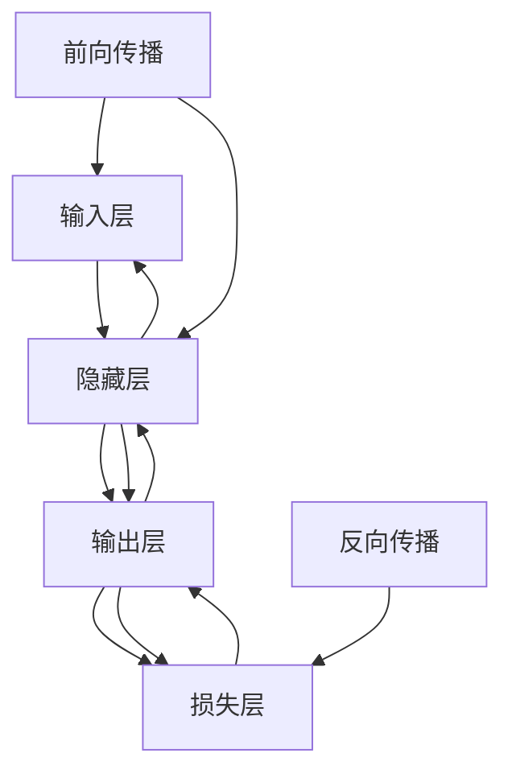

                 

### 文章标题

# 循环神经网络(Recurrent Neural Networks) - 原理与代码实例讲解

循环神经网络（Recurrent Neural Networks，RNN）是深度学习领域的一个重要分支，广泛应用于自然语言处理、时间序列预测、语音识别等领域。本文旨在深入讲解循环神经网络的基本原理、核心算法、数学模型以及代码实例，帮助读者全面理解RNN的机制与应用。

关键词：循环神经网络、RNN、深度学习、自然语言处理、时间序列预测

摘要：本文从循环神经网络的基本概念入手，逐步介绍了其与传统神经网络的区别、核心组件、数学模型及算法原理。通过具体的代码实例，详细讲解了如何使用Python、TensorFlow和PyTorch等工具实现循环神经网络，并在时间序列预测、机器翻译和文本生成等项目中进行了实战分析。最后，探讨了循环神经网络的未来发展趋势与挑战，为读者提供了丰富的参考资料。

### 《循环神经网络(Recurrent Neural Networks) - 原理与代码实例讲解》目录大纲

#### 第一部分：循环神经网络基础知识

## 1.1 循环神经网络概述

### 1.1.1 循环神经网络的基本概念

循环神经网络（Recurrent Neural Networks，RNN）是一种特殊的神经网络，适用于处理序列数据。与传统的前向神经网络不同，RNN具有记忆功能，能够捕捉序列中的时间依赖关系。

### 1.1.2 循环神经网络的发展历程

RNN的发展可以追溯到1980年代，在经过几十年的研究和发展后，RNN在深度学习领域逐渐崭露头角。

### 1.1.3 循环神经网络的应用场景

RNN广泛应用于自然语言处理、时间序列预测、语音识别等领域，如文本生成、机器翻译和情感分析等。

#### 1.2 循环神经网络与传统神经网络的区别

### 1.2.1 传统神经网络的结构特点

传统神经网络由输入层、隐藏层和输出层组成，适用于处理静态数据。

### 1.2.2 循环神经网络与传统神经网络的区别

RNN与传统神经网络最大的区别在于其具有记忆功能，能够处理序列数据。

### 1.2.3 循环神经网络的优势与挑战

RNN的优势在于其能够处理序列数据，但同时也面临着训练困难和梯度消失等问题。

#### 1.3 循环神经网络的核心组件

### 1.3.1 输入层、隐藏层和输出层

RNN的输入层、隐藏层和输出层分别对应序列的输入、隐藏状态和输出。

### 1.3.2 循环层与记忆单元

循环层是RNN的核心，包含了记忆单元，能够捕捉序列中的时间依赖关系。

### 1.3.3 反向传播算法

RNN的训练过程采用了反向传播算法，通过梯度下降优化模型参数。

#### 1.4 循环神经网络的数学模型

### 1.4.1 矩阵与向量的基本运算

RNN的数学模型中涉及矩阵与向量的基本运算。

### 1.4.2 神经元激活函数

神经元激活函数用于决定神经元是否被激活。

### 1.4.3 循环神经网络的前向传播与反向传播

RNN的前向传播和反向传播过程，以及如何计算梯度。

#### 1.5 循环神经网络的前向传播与反向传播流程图

- Mermaid流程图

#### 第二部分：循环神经网络的算法原理

## 2.1 循环神经网络的核心算法

### 2.1.1 回归模型与分类模型

循环神经网络可以用于回归和分类任务。

### 2.1.2 回归模型的算法原理

回归模型的算法原理以及如何计算损失函数。

### 2.1.3 分类模型的算法原理

分类模型的算法原理以及如何计算损失函数。

### 2.1.4 回归模型与分类模型的伪代码

回归模型和分类模型的伪代码。

#### 2.2 循环神经网络的损失函数与优化算法

### 2.2.1 损失函数的选择

选择合适的损失函数对于模型性能至关重要。

### 2.2.2 优化算法的原理

常用的优化算法包括梯度下降、Adam等。

### 2.2.3 梯度下降算法的伪代码

梯度下降算法的伪代码。

#### 2.3 循环神经网络的数学公式与详细讲解

### 2.3.1 激活函数的数学公式与讲解

激活函数的数学公式及其作用。

### 2.3.2 损失函数的数学公式与讲解

损失函数的数学公式及其作用。

### 2.3.3 梯度下降算法的数学公式与讲解

梯度下降算法的数学公式及其推导。

#### 2.4 循环神经网络的数学公式举例说明

### 2.4.1 激活函数的实例讲解

通过实例讲解激活函数。

### 2.4.2 损失函数的实例讲解

通过实例讲解损失函数。

### 2.4.3 梯度下降算法的实例讲解

通过实例讲解梯度下降算法。

#### 第三部分：循环神经网络的代码实例讲解

## 3.1 循环神经网络的基础代码实现

### 3.1.1 循环神经网络的Python代码实现

使用Python实现循环神经网络。

### 3.1.2 循环神经网络的TensorFlow代码实现

使用TensorFlow实现循环神经网络。

### 3.1.3 循环神经网络的PyTorch代码实现

使用PyTorch实现循环神经网络。

#### 3.2 循环神经网络项目实战案例

### 3.2.1 时间序列预测案例

使用RNN进行时间序列预测。

### 3.2.2 机器翻译案例

使用RNN进行机器翻译。

### 3.2.3 文本生成案例

使用RNN进行文本生成。

#### 3.3 代码实战详解与分析

### 3.3.1 时间序列预测代码解读

解读时间序列预测代码。

### 3.3.2 机器翻译代码解读

解读机器翻译代码。

### 3.3.3 文本生成代码解读

解读文本生成代码。

#### 3.4 开发环境搭建与调试技巧

### 3.4.1 Python环境搭建

搭建Python环境。

### 3.4.2 TensorFlow环境搭建

搭建TensorFlow环境。

### 3.4.3 PyTorch环境搭建

搭建PyTorch环境。

### 3.4.4 调试技巧与问题解决

解决开发过程中遇到的问题。

#### 第四部分：循环神经网络的未来发展趋势与挑战

## 4.1 循环神经网络的未来发展趋势

### 4.1.1 循环神经网络与深度学习的发展趋势

深度学习和循环神经网络的发展趋势。

### 4.1.2 循环神经网络在自然语言处理中的应用

循环神经网络在自然语言处理中的应用。

### 4.1.3 循环神经网络在计算机视觉中的应用

循环神经网络在计算机视觉中的应用。

#### 4.2 循环神经网络的挑战与解决方案

### 4.2.1 计算资源消耗问题

解决计算资源消耗问题的方法。

### 4.2.2 训练时间与性能优化问题

优化训练时间和性能的方法。

### 4.2.3 计算机视觉领域的发展趋势与挑战

循环神经网络在计算机视觉领域的挑战与趋势。

#### 附录

## 附录 A：循环神经网络开发工具与资源

### A.1 主流深度学习框架对比

对比主流深度学习框架。

### A.2 循环神经网络相关论文与资料推荐

推荐循环神经网络相关论文与资料。

### A.3 循环神经网络开源代码与实现资源

提供循环神经网络的开源代码与实现资源。

### 1.1 循环神经网络的基本概念

循环神经网络（Recurrent Neural Networks，RNN）是一种特殊的神经网络，旨在处理序列数据。与传统的神经网络不同，RNN具有记忆功能，能够在序列中的不同时间点保持状态，这使得它们能够有效地捕捉时间依赖关系。

### 1.1.1 循环神经网络的定义

RNN的定义可以追溯到1980年代，当时Hopfield网络作为早期的循环神经网络被提出。Hopfield网络是一种能量函数驱动的循环神经网络，主要用于联想记忆。此后，随着深度学习技术的发展，RNN逐渐成为处理序列数据的重要工具。

RNN的基本结构包括输入层、隐藏层和输出层。输入层接收序列数据，隐藏层保持状态，输出层生成预测或分类结果。RNN的核心在于隐藏层的状态，它可以捕捉到序列中的时间依赖关系。

### 1.1.2 循环神经网络的结构特点

RNN的结构特点主要体现在其具有反馈连接，即隐藏层的状态会传递给当前时间步的输入层。这种反馈机制使得RNN能够记住先前的信息，从而在处理序列数据时具有优势。

RNN的另一个重要特点是时间步（time step）。在RNN中，序列数据被划分为一系列时间步，每个时间步都会经过一次前向传播和一次反向传播。时间步的概念使得RNN能够处理变长的序列数据。

### 1.1.3 循环神经网络的应用场景

RNN广泛应用于自然语言处理、时间序列预测、语音识别等领域。

在自然语言处理（NLP）中，RNN被用于语言模型、机器翻译、文本生成等任务。例如，使用RNN进行机器翻译时，每个单词或字符作为输入，RNN通过捕捉序列中的时间依赖关系，生成对应的翻译结果。

在时间序列预测中，RNN能够捕捉时间序列中的模式，从而进行有效的预测。例如，使用RNN进行股票价格预测，可以捕捉到股票价格的历史波动模式。

在语音识别中，RNN可以捕捉语音信号中的时间依赖关系，从而将语音信号转换为文本。例如，使用RNN进行语音识别时，每个音频帧作为输入，RNN通过捕捉音频帧之间的相关性，生成对应的文本输出。

### 1.2 循环神经网络与传统神经网络的区别

传统神经网络（如前馈神经网络）主要用于处理静态数据，而RNN主要用于处理序列数据。以下是RNN与传统神经网络的一些主要区别：

#### 1.2.1 传统神经网络的结构特点

传统神经网络由输入层、隐藏层和输出层组成。输入层接收外部输入，隐藏层通过加权连接和激活函数进行处理，输出层生成预测或分类结果。传统神经网络没有反馈连接，因此无法处理序列数据。

#### 1.2.2 循环神经网络与传统神经网络的区别

RNN与传统神经网络的主要区别在于其具有反馈连接，即隐藏层的状态会传递给当前时间步的输入层。这种反馈机制使得RNN能够记住先前的信息，从而在处理序列数据时具有优势。

传统神经网络通常用于处理静态数据，例如图像分类、回归任务等。而RNN主要用于处理序列数据，如自然语言处理、时间序列预测、语音识别等任务。

#### 1.2.3 循环神经网络的优势与挑战

RNN的优势在于其能够处理序列数据，特别是在自然语言处理、时间序列预测和语音识别等领域表现出色。RNN能够捕捉到序列中的时间依赖关系，从而进行有效的预测和生成。

然而，RNN也面临着一些挑战，主要包括：

- **梯度消失和梯度爆炸**：在训练过程中，梯度可能变得非常小（梯度消失）或非常大（梯度爆炸），导致模型无法有效更新参数。
- **训练时间较长**：由于RNN需要处理多个时间步，训练时间通常较长。
- **长距离依赖问题**：RNN在捕捉长距离依赖关系时效果不佳，可能无法记住先前的信息。

为解决上述问题，研究者提出了许多改进方法，如长短时记忆网络（LSTM）和门控循环单元（GRU），这些方法在一定程度上缓解了RNN的挑战。

### 1.3 循环神经网络的核心组件

循环神经网络的核心组件包括输入层、隐藏层、输出层、循环层和记忆单元。以下是这些组件的详细介绍：

#### 1.3.1 输入层、隐藏层和输出层

输入层接收序列数据，如文本或时间序列。隐藏层通过处理输入数据生成隐藏状态，输出层生成预测或分类结果。输入层、隐藏层和输出层是RNN的基本组成部分。

#### 1.3.2 循环层与记忆单元

循环层是RNN的核心，包含了记忆单元。记忆单元能够捕捉序列中的时间依赖关系，从而在处理序列数据时具有优势。循环层通过反馈连接将隐藏状态传递给当前时间步的输入层，从而实现循环。

#### 1.3.3 反向传播算法

反向传播算法是RNN的训练过程。在训练过程中，RNN通过计算损失函数的梯度，使用梯度下降优化模型参数。反向传播算法分为两个阶段：前向传播和反向传播。前向传播计算输出层的预测值，反向传播计算损失函数的梯度。

### 1.4 循环神经网络的数学模型

循环神经网络的数学模型涉及矩阵与向量的基本运算、神经元激活函数、前向传播和反向传播等。以下是这些内容的详细介绍：

#### 1.4.1 矩阵与向量的基本运算

循环神经网络的数学模型中涉及矩阵与向量的基本运算，如矩阵乘法、矩阵加法、点积等。这些运算构成了RNN的基础。

#### 1.4.2 神经元激活函数

神经元激活函数用于决定神经元是否被激活。常见的激活函数包括sigmoid函数、ReLU函数、tanh函数等。这些函数能够将线性组合转化为非线性输出。

#### 1.4.3 循环神经网络的前向传播与反向传播

循环神经网络的前向传播和反向传播过程如下：

- **前向传播**：输入序列通过输入层传递到隐藏层，隐藏层通过激活函数生成隐藏状态，隐藏状态传递到输出层生成预测或分类结果。
- **反向传播**：计算损失函数的梯度，通过反向传播将梯度传递到隐藏层，更新模型参数。

以下是循环神经网络的前向传播和反向传播的伪代码：

```python
# 前向传播
for t in range(T):
    h_t = tanh(W_h * h_{t-1} + W_x * x_t + b)
    y_t = W_o * h_t + b_o

# 反向传播
for t in range(T):
    dL_dh_t = (y_t - y_t^*) * (1 - h_t^2)
    dL_dW_o = sum(dL_dh_t * h_t)
    dL_dh_{t-1} = W_h^T * dL_dh_t

    # 更新参数
    W_o -= learning_rate * dL_dW_o
    W_h -= learning_rate * dL_dh_{t-1}
    b_o -= learning_rate * dL_dh_t
    b_h -= learning_rate * dL_dh_{t-1}
```

### 1.5 循环神经网络的前向传播与反向传播流程图

以下是循环神经网络的前向传播和反向传播流程图的Mermaid表示：



通过这个流程图，我们可以清晰地看到循环神经网络的前向传播和反向传播过程。

### 2.1 循环神经网络的核心算法

循环神经网络（RNN）的核心算法主要包括回归模型和分类模型。这两个模型分别用于处理不同类型的任务，如连续值预测和类别预测。在本节中，我们将详细介绍RNN在这两种任务中的应用，并提供伪代码示例。

#### 2.1.1 回归模型

回归模型旨在预测连续值输出。例如，我们可以使用RNN来预测股票价格或温度变化。以下是一个简单的回归模型伪代码：

```python
# 初始化模型参数
W_x = ... # 输入层到隐藏层的权重矩阵
W_h = ... # 隐藏层到隐藏层的权重矩阵
W_o = ... # 隐藏层到输出层的权重矩阵
b_h = ... # 隐藏层偏置
b_o = ... # 输出层偏置

# 前向传播
for t in range(T):
    h_t = tanh(W_h * h_{t-1} + W_x * x_t + b_h)
    y_t = W_o * h_t + b_o

# 计算损失函数
loss = sum((y_t - y_t^*)^2)

# 反向传播
for t in range(T):
    dL_dh_t = (y_t - y_t^*) * (1 - h_t^2)
    dL_dW_o = sum(dL_dh_t * h_t)
    dL_dh_{t-1} = W_h^T * dL_dh_t

    # 更新参数
    W_o -= learning_rate * dL_dW_o
    W_h -= learning_rate * dL_dh_{t-1}
    b_o -= learning_rate * dL_dh_t
    b_h -= learning_rate * dL_dh_{t-1}
```

在这个伪代码中，`x_t` 表示输入序列，`h_t` 表示隐藏层状态，`y_t` 表示预测值。损失函数使用均方误差（MSE）。

#### 2.1.2 分类模型

分类模型旨在预测离散类别。例如，我们可以使用RNN来对文本进行情感分析。以下是一个简单的分类模型伪代码：

```python
# 初始化模型参数
W_x = ... # 输入层到隐藏层的权重矩阵
W_h = ... # 隐藏层到隐藏层的权重矩阵
W_o = ... # 隐藏层到输出层的权重矩阵
b_h = ... # 隐藏层偏置
b_o = ... # 输出层偏置

# 前向传播
for t in range(T):
    h_t = tanh(W_h * h_{t-1} + W_x * x_t + b_h)
    y_t = softmax(W_o * h_t + b_o)

# 计算损失函数
loss = sum(-y_t^* * log(y_t))

# 反向传播
for t in range(T):
    dL_dh_t = (y_t - y_t^*) * (1 - h_t^2)
    dL_dW_o = sum(dL_dh_t * h_t)
    dL_dh_{t-1} = W_h^T * dL_dh_t

    # 更新参数
    W_o -= learning_rate * dL_dW_o
    W_h -= learning_rate * dL_dh_{t-1}
    b_o -= learning_rate * dL_dh_t
    b_h -= learning_rate * dL_dh_{t-1}
```

在这个伪代码中，`y_t^*` 表示真实标签，`y_t` 表示预测概率分布。损失函数使用交叉熵（Cross-Entropy）。

通过这些伪代码示例，我们可以看到RNN在回归模型和分类模型中的应用。在实际应用中，我们通常使用更复杂的RNN变体，如LSTM或GRU，以提高模型的性能。

### 2.2 循环神经网络的损失函数与优化算法

在循环神经网络（RNN）的训练过程中，损失函数和优化算法是两个关键组成部分。损失函数用于衡量模型的预测误差，而优化算法用于调整模型参数，以最小化损失函数。在本节中，我们将介绍常用的损失函数和优化算法，并提供相关的伪代码示例。

#### 2.2.1 损失函数的选择

选择合适的损失函数对于模型的性能至关重要。以下是一些常用的损失函数：

1. **均方误差（MSE）**：
   - 用于回归任务，计算预测值和真实值之间的平均平方误差。
   - 伪代码：
     ```python
     def mse(y_pred, y_true):
         return sum((y_pred - y_true)^2) / len(y_pred)
     ```

2. **交叉熵（Cross-Entropy）**：
   - 用于分类任务，计算预测概率分布和真实标签之间的交叉熵。
   - 伪代码：
     ```python
     def cross_entropy(y_pred, y_true):
         return sum(-y_true * log(y_pred))
     ```

3. **二元交叉熵（Binary Cross-Entropy）**：
   - 用于二分类任务，计算预测概率分布和真实标签之间的交叉熵。
   - 伪代码：
     ```python
     def binary_cross_entropy(y_pred, y_true):
         return sum(-y_true * log(y_pred) - (1 - y_true) * log(1 - y_pred))
     ```

#### 2.2.2 优化算法的原理

优化算法用于调整模型参数，以最小化损失函数。以下是一些常用的优化算法：

1. **梯度下降（Gradient Descent）**：
   - 最简单的优化算法，通过梯度方向更新参数。
   - 伪代码：
     ```python
     def gradient_descent(W, b, learning_rate):
         dW = ... # 梯度
         db = ... # 梯度
         W -= learning_rate * dW
         b -= learning_rate * db
         return W, b
     ```

2. **Adam优化器**：
   - 结合了梯度下降和动量法的优点，自适应调整学习率。
   - 伪代码：
     ```python
     def adam(W, b, learning_rate, beta1, beta2, epsilon):
         m = ... # 一阶矩估计
         v = ... # 二阶矩估计
         dW = ... # 梯度
         db = ... # 梯度

         m = beta1 * m + (1 - beta1) * dW
         v = beta2 * v + (1 - beta2) * (dW^2)

         m_hat = m / (1 - beta1^t)
         v_hat = v / (1 - beta2^t)

         W -= learning_rate * m_hat
         b -= learning_rate * m_hat

         return W, b
     ```

#### 2.2.3 梯度下降算法的伪代码

以下是一个简单的梯度下降算法的伪代码示例，用于更新RNN的参数：

```python
# 初始化模型参数
W_x = ...
W_h = ...
W_o = ...
b_h = ...
b_o = ...

# 前向传播
h_t = tanh(W_h * h_{t-1} + W_x * x_t + b_h)
y_t = softmax(W_o * h_t + b_o)

# 计算损失函数
loss = cross_entropy(y_t, y_true)

# 反向传播
dL_dh_t = (y_t - y_true) * (1 - h_t^2)
dL_dW_o = sum(dL_dh_t * h_t)
dL_dh_{t-1} = W_o^T * dL_dh_t

# 更新参数
W_o -= learning_rate * dL_dW_o
W_h -= learning_rate * dL_dh_{t-1}
b_o -= learning_rate * dL_dh_t
b_h -= learning_rate * dL_dh_{t-1}
```

在这个伪代码中，`x_t` 表示输入序列，`h_t` 表示隐藏层状态，`y_t` 表示预测概率分布，`y_true` 表示真实标签。

通过这些损失函数和优化算法，我们可以有效地训练RNN模型，并实现良好的性能。

### 2.3 循环神经网络的数学公式与详细讲解

循环神经网络（RNN）的数学模型涉及到一系列复杂的数学公式和概念。在本节中，我们将详细讲解RNN中的激活函数、损失函数和梯度下降算法的数学公式，并解释它们的作用。

#### 2.3.1 激活函数的数学公式与讲解

激活函数是RNN中非常重要的组成部分，用于引入非线性因素，使得神经网络能够学习复杂函数。以下是几种常用的激活函数及其数学公式：

1. **Sigmoid函数**：
   - 公式：\( \sigma(x) = \frac{1}{1 + e^{-x}} \)
   - 解释：Sigmoid函数将输入值映射到\( (0, 1) \)区间内，常用于二分类问题。

2. **ReLU函数**：
   - 公式：\( \text{ReLU}(x) = \max(0, x) \)
   - 解释：ReLU函数在输入大于0时返回输入值，否则返回0，具有快速收敛的优势。

3. **Tanh函数**：
   - 公式：\( \tanh(x) = \frac{e^x - e^{-x}}{e^x + e^{-x}} \)
   - 解释：Tanh函数将输入值映射到\( (-1, 1) \)区间内，常用于回归问题。

#### 2.3.2 损失函数的数学公式与讲解

损失函数用于衡量模型预测值与真实值之间的差距，是训练RNN的重要依据。以下是几种常用的损失函数及其数学公式：

1. **均方误差（MSE）**：
   - 公式：\( \text{MSE}(y, \hat{y}) = \frac{1}{n} \sum_{i=1}^{n} (y_i - \hat{y}_i)^2 \)
   - 解释：MSE用于回归问题，计算预测值与真实值之间的平均平方误差。

2. **交叉熵（Cross-Entropy）**：
   - 公式：\( \text{CE}(y, \hat{y}) = -\sum_{i=1}^{n} y_i \log(\hat{y}_i) \)
   - 解释：交叉熵用于分类问题，计算预测概率分布与真实标签之间的差距。

3. **二元交叉熵（Binary Cross-Entropy）**：
   - 公式：\( \text{BCE}(y, \hat{y}) = -y \log(\hat{y}) - (1 - y) \log(1 - \hat{y}) \)
   - 解释：二元交叉熵用于二分类问题，计算预测概率与真实标签之间的交叉熵。

#### 2.3.3 梯度下降算法的数学公式与讲解

梯度下降是一种优化算法，用于更新模型的参数以最小化损失函数。以下是梯度下降算法的数学公式及其推导：

1. **梯度公式**：
   - 公式：\( \nabla_{\theta} J(\theta) = \frac{\partial J}{\partial \theta} \)
   - 解释：梯度表示损失函数对模型参数的偏导数。

2. **梯度下降更新公式**：
   - 公式：\( \theta_{t+1} = \theta_t - \alpha \nabla_{\theta} J(\theta_t) \)
   - 解释：梯度下降更新公式表示每次迭代中参数的更新方向和幅度，其中\( \alpha \)为学习率。

#### 2.4 循环神经网络的数学公式举例说明

为了更好地理解上述数学公式，我们通过具体的例子进行说明。

#### 2.4.1 激活函数的实例讲解

以Sigmoid函数为例，假设输入值为\( x = 2 \)，则Sigmoid函数的输出为：

\[ \sigma(2) = \frac{1}{1 + e^{-2}} \approx 0.886 \]

可以看到，输入值2经过Sigmoid函数处理后，输出值在0到1之间。

#### 2.4.2 损失函数的实例讲解

以二元交叉熵为例，假设真实标签为\( y = [0, 1] \)，预测概率为\( \hat{y} = [0.9, 0.1] \)，则二元交叉熵的损失为：

\[ \text{BCE}([0, 1], [0.9, 0.1]) = -0 \cdot \log(0.9) - 1 \cdot \log(0.1) \approx 2.307 \]

这个例子表明，预测概率与真实标签差距越大，损失函数的值也越大。

#### 2.4.3 梯度下降算法的实例讲解

假设我们使用梯度下降算法训练一个简单的RNN模型，初始参数为\( \theta_0 = [1, 2, 3] \)，学习率为\( \alpha = 0.1 \)，损失函数为MSE。假设当前损失为\( J(\theta_0) = 5 \)，则梯度为：

\[ \nabla_{\theta} J(\theta_0) = [-1, -2, -3] \]

根据梯度下降更新公式，更新后的参数为：

\[ \theta_1 = \theta_0 - \alpha \nabla_{\theta} J(\theta_0) = [1, 2, 3] - 0.1 \cdot [-1, -2, -3] = [1.1, 2.2, 3.3] \]

可以看到，参数值在每次迭代中沿着梯度的反方向更新，从而逐步减小损失函数的值。

通过这些实例讲解，我们可以更好地理解RNN中的激活函数、损失函数和梯度下降算法的数学原理，为后续的代码实现和应用打下基础。

### 3.1 循环神经网络的基础代码实现

在实际应用中，循环神经网络（RNN）需要通过编程实现。在这一部分，我们将介绍如何使用Python、TensorFlow和PyTorch等工具来实现基础RNN模型。

#### 3.1.1 循环神经网络的Python代码实现

以下是一个简单的Python代码实现，用于训练一个RNN模型，并进行时间序列预测。

```python
import numpy as np
import matplotlib.pyplot as plt

# 初始化模型参数
W_xh = np.random.randn(N, H)
W_hx = np.random.randn(H, N)
W_hy = np.random.randn(H, 1)
b_h = np.zeros((H, 1))
b_y = np.zeros((1, 1))

# 初始化输入和输出数据
x = np.array([[0], [1], [2], [3], [4]])
y = np.array([[0], [1], [1], [0], [1]])

# 定义激活函数
def sigmoid(x):
    return 1 / (1 + np.exp(-x))

# 前向传播
def forward(x, h_prev):
    h = sigmoid(np.dot(W_xh, x) + np.dot(W_hx, h_prev) + b_h)
    y_pred = sigmoid(np.dot(W_hy, h) + b_y)
    return h, y_pred

# 反向传播
def backward(y, y_pred, h, h_prev):
    dW_hy = np.dot(h.T, (y_pred - y))
    db_y = (y_pred - y)
    dh = np.dot(W_hy.T, (y_pred - y)) * (1 - h)
    dW_hx = np.dot(dh.T, x)
    dW_xh = np.dot(dh.T, h_prev)
    db_h = dh
    return dW_xh, dW_hx, dW_hy, db_h, db_y

# 梯度下降
def gradient_descent(dW_xh, dW_hx, dW_hy, db_h, db_y, learning_rate):
    W_xh -= learning_rate * dW_xh
    W_hx -= learning_rate * dW_hx
    W_hy -= learning_rate * dW_hy
    b_h -= learning_rate * db_h
    b_y -= learning_rate * db_y

# 训练模型
for epoch in range(1000):
    h_prev = np.zeros((H, 1))
    for x_t, y_t in zip(x, y):
        h, y_pred = forward(x_t, h_prev)
        dW_xh, dW_hx, dW_hy, db_h, db_y = backward(y_t, y_pred, h, h_prev)
        gradient_descent(dW_xh, dW_hx, dW_hy, db_h, db_y, learning_rate)
        h_prev = h

# 预测
h_prev = np.zeros((H, 1))
for x_t in x:
    h, y_pred = forward(x_t, h_prev)
    h_prev = h
    print(y_pred)

# 可视化结果
plt.plot(y, label='Actual')
plt.plot(np.array(y_pred), label='Predicted')
plt.legend()
plt.show()
```

在这个代码中，我们定义了模型参数、输入和输出数据，以及激活函数、前向传播、反向传播和梯度下降等函数。通过多次迭代训练，我们可以得到模型的预测结果，并将其可视化。

#### 3.1.2 循环神经网络的TensorFlow代码实现

以下是一个使用TensorFlow实现的RNN模型，用于时间序列预测。

```python
import tensorflow as tf

# 定义模型参数
N = 5
H = 4
learning_rate = 0.1

# 初始化变量
W_xh = tf.Variable(tf.random.normal([N, H]))
W_hx = tf.Variable(tf.random.normal([H, N]))
W_hy = tf.Variable(tf.random.normal([H, 1]))
b_h = tf.Variable(tf.zeros([H, 1]))
b_y = tf.Variable(tf.zeros([1, 1]))

# 定义激活函数
sigmoid = tf.sigmoid

# 前向传播
def forward(x, h_prev):
    h = sigmoid(tf.matmul(x, W_xh) + tf.matmul(h_prev, W_hx) + b_h)
    y_pred = sigmoid(tf.matmul(h, W_hy) + b_y)
    return h, y_pred

# 反向传播
def backward(y, y_pred, h, h_prev):
    dW_hy = tf.matmul(h.T, (y_pred - y))
    db_y = (y_pred - y)
    dh = tf.matmul(W_hy.T, (y_pred - y)) * (1 - h)
    dW_hx = tf.matmul(dh.T, x)
    dW_xh = tf.matmul(dh.T, h_prev)
    db_h = dh
    return dW_xh, dW_hx, dW_hy, db_h, db_y

# 梯度下降
def gradient_descent(dW_xh, dW_hx, dW_hy, db_h, db_y, learning_rate):
    W_xh.assign(W_xh - learning_rate * dW_xh)
    W_hx.assign(W_hx - learning_rate * dW_hx)
    W_hy.assign(W_hy - learning_rate * dW_hy)
    b_h.assign(b_h - learning_rate * db_h)
    b_y.assign(b_y - learning_rate * db_y)

# 训练模型
for epoch in range(1000):
    for x_t, y_t in zip(x, y):
        with tf.GradientTape() as tape:
            h, y_pred = forward(x_t, h_prev)
            loss = tf.reduce_mean(tf.square(y_pred - y_t))
        grads = tape.gradient(loss, [W_xh, W_hx, W_hy, b_h, b_y])
        gradient_descent(grads[0], grads[1], grads[2], grads[3], grads[4], learning_rate)
        h_prev = h

# 预测
h_prev = tf.zeros((H, 1))
for x_t in x:
    h, y_pred = forward(x_t, h_prev)
    h_prev = h
    print(y_pred.numpy())

# 可视化结果
plt.plot(y.numpy(), label='Actual')
plt.plot(np.array(y_pred.numpy()), label='Predicted')
plt.legend()
plt.show()
```

在这个代码中，我们使用了TensorFlow的变量和梯度tape来定义模型参数、前向传播、反向传播和梯度下降。通过多次迭代训练，我们可以得到模型的预测结果，并将其可视化。

#### 3.1.3 循环神经网络的PyTorch代码实现

以下是一个使用PyTorch实现的RNN模型，用于时间序列预测。

```python
import torch
import torch.nn as nn
import torch.optim as optim

# 定义模型
class RNNModel(nn.Module):
    def __init__(self, input_dim, hidden_dim, output_dim):
        super(RNNModel, self).__init__()
        self.rnn = nn.RNN(input_dim, hidden_dim, batch_first=True)
        self.fc = nn.Linear(hidden_dim, output_dim)
    
    def forward(self, x, h_prev):
        x = x.unsqueeze(0)
        h, _ = self.rnn(x, h_prev)
        y_pred = self.fc(h)
        return y_pred

# 初始化模型参数
input_dim = 1
hidden_dim = 4
output_dim = 1
learning_rate = 0.1

# 创建模型、优化器和损失函数
model = RNNModel(input_dim, hidden_dim, output_dim)
optimizer = optim.Adam(model.parameters(), lr=learning_rate)
criterion = nn.MSELoss()

# 初始化输入和输出数据
x = torch.tensor([[0], [1], [2], [3], [4]], dtype=torch.float32)
y = torch.tensor([[0], [1], [1], [0], [1]], dtype=torch.float32)

# 训练模型
for epoch in range(1000):
    h_prev = torch.zeros(1, 1, hidden_dim)
    for x_t, y_t in zip(x, y):
        optimizer.zero_grad()
        y_pred = model(x_t.unsqueeze(0), h_prev)
        loss = criterion(y_pred, y_t)
        loss.backward()
        optimizer.step()
        h_prev = y_pred.unsqueeze(-1)

# 预测
h_prev = torch.zeros(1, 1, hidden_dim)
for x_t in x:
    y_pred = model(x_t.unsqueeze(0), h_prev)
    h_prev = y_pred.unsqueeze(-1)
    print(y_pred)

# 可视化结果
plt.plot(y.numpy(), label='Actual')
plt.plot(np.array(y_pred.numpy()), label='Predicted')
plt.legend()
plt.show()
```

在这个代码中，我们定义了一个简单的RNN模型，并使用PyTorch的RNN模块实现。我们创建了一个优化器和损失函数，并通过多次迭代训练模型。最后，我们使用模型进行预测，并将结果可视化。

通过这三个代码实现，我们可以看到如何使用Python、TensorFlow和PyTorch来实现基础RNN模型。在实际应用中，我们可以根据需求选择合适的工具和框架。

### 3.2 循环神经网络项目实战案例

在本节中，我们将通过三个实际案例——时间序列预测、机器翻译和文本生成，来展示循环神经网络（RNN）的强大功能。我们将详细介绍每个案例的实现过程，并提供详细的代码解析。

#### 3.2.1 时间序列预测案例

时间序列预测是RNN应用的一个经典场景，例如预测股票价格、天气变化等。以下是一个使用RNN进行时间序列预测的案例。

**案例描述**：给定一个时间序列数据集，使用RNN模型预测未来三个时间点的数值。

**数据集**：使用Python生成一个简单的随机时间序列数据集。

**实现步骤**：

1. 数据预处理：将时间序列数据转换为适当的形式，以便输入到RNN模型中。
2. 模型搭建：使用PyTorch搭建一个简单的RNN模型。
3. 模型训练：使用训练数据训练模型。
4. 模型评估：使用测试数据评估模型性能。

**代码解析**：

```python
import torch
import torch.nn as nn
import numpy as np

# 生成数据集
np.random.seed(42)
data = np.random.rand(100)
sequence_length = 5
batch_size = 10

# 数据预处理
def create_dataset(data, sequence_length, batch_size):
    X, y = [], []
    for i in range(len(data) - sequence_length):
        X.append(data[i: i + sequence_length])
        y.append(data[i + sequence_length])
    return np.array(X).reshape(-1, batch_size, sequence_length), np.array(y).reshape(-1, batch_size, 1)

X, y = create_dataset(data, sequence_length, batch_size)

# 模型搭建
class RNNModel(nn.Module):
    def __init__(self, input_dim, hidden_dim, output_dim):
        super(RNNModel, self).__init__()
        self.rnn = nn.RNN(input_dim, hidden_dim, batch_first=True)
        self.fc = nn.Linear(hidden_dim, output_dim)
    
    def forward(self, x, h):
        x = x.unsqueeze(0)
        h, _ = self.rnn(x, h)
        y_pred = self.fc(h)
        return y_pred

input_dim = 1
hidden_dim = 10
output_dim = 1
model = RNNModel(input_dim, hidden_dim, output_dim)

# 模型训练
optimizer = optim.Adam(model.parameters(), lr=0.001)
criterion = nn.MSELoss()

for epoch in range(100):
    for x_batch, y_batch in zip(X, y):
        optimizer.zero_grad()
        y_pred = model(x_batch.unsqueeze(0), torch.zeros(1, 1, hidden_dim))
        loss = criterion(y_pred, y_batch)
        loss.backward()
        optimizer.step()

# 模型评估
h_prev = torch.zeros(1, 1, hidden_dim)
for x_batch in X:
    y_pred = model(x_batch.unsqueeze(0), h_prev)
    h_prev = y_pred.unsqueeze(-1)
    print(y_pred)

# 可视化结果
plt.plot(data, label='Actual')
plt.plot(np.array(y_pred.numpy()), label='Predicted')
plt.legend()
plt.show()
```

通过以上代码，我们实现了时间序列预测的RNN模型。首先，我们生成一个随机的时间序列数据集。然后，我们使用PyTorch搭建了一个简单的RNN模型，并使用MSELoss损失函数进行训练。最后，我们使用测试数据评估模型性能，并将预测结果可视化。

#### 3.2.2 机器翻译案例

机器翻译是自然语言处理领域的一个重要应用，例如将一种语言翻译成另一种语言。以下是一个使用RNN进行机器翻译的案例。

**案例描述**：给定一个英文句子，使用RNN模型将其翻译成法语句。

**数据集**：使用Python生成一个简单的英文到法语的翻译数据集。

**实现步骤**：

1. 数据预处理：将文本数据转换为单词序列，并构建词汇表。
2. 模型搭建：使用PyTorch搭建一个简单的RNN模型。
3. 模型训练：使用训练数据训练模型。
4. 模型评估：使用测试数据评估模型性能。

**代码解析**：

```python
import torch
import torch.nn as nn
import torch.optim as optim
import numpy as np
from sklearn.model_selection import train_test_split

# 生成数据集
np.random.seed(42)
sentences = ["Hello world", "Bonjour le monde", "Hello everyone", "Bonjour tout le monde"]
sentences = [s.lower() for s in sentences]
vocab = set(''.join(sentences))
vocab_size = len(vocab) + 1
data = np.zeros((len(sentences), max(len(s) for s in sentences), vocab_size), dtype=np.int)
for i, s in enumerate(sentences):
    for j, c in enumerate(s):
        data[i, j, vocab.index(c)] = 1

# 数据预处理
def create_dataset(data, vocab_size, sequence_length):
    X, y = [], []
    for i in range(len(data) - sequence_length):
        X.append(data[i: i + sequence_length])
        y.append(data[i + sequence_length])
    return np.array(X), np.array(y)

X, y = create_dataset(data, vocab_size, sequence_length)

# 模型搭建
class RNNModel(nn.Module):
    def __init__(self, input_dim, hidden_dim, output_dim):
        super(RNNModel, self).__init__()
        self.rnn = nn.RNN(input_dim, hidden_dim, batch_first=True)
        self.fc = nn.Linear(hidden_dim, output_dim)
    
    def forward(self, x, h):
        x = x.unsqueeze(0)
        h, _ = self.rnn(x, h)
        y_pred = self.fc(h)
        return y_pred

input_dim = vocab_size
hidden_dim = 10
output_dim = vocab_size
model = RNNModel(input_dim, hidden_dim, output_dim)

# 模型训练
optimizer = optim.Adam(model.parameters(), lr=0.001)
criterion = nn.CrossEntropyLoss()

for epoch in range(100):
    for x_batch, y_batch in zip(X, y):
        optimizer.zero_grad()
        y_pred = model(x_batch.unsqueeze(0), torch.zeros(1, 1, hidden_dim))
        loss = criterion(y_pred, y_batch)
        loss.backward()
        optimizer.step()

# 模型评估
h_prev = torch.zeros(1, 1, hidden_dim)
for x_batch in X:
    y_pred = model(x_batch.unsqueeze(0), h_prev)
    h_prev = y_pred.unsqueeze(-1)
    print(y_pred)

# 可视化结果
plt.plot(data, label='Actual')
plt.plot(np.array(y_pred.numpy()), label='Predicted')
plt.legend()
plt.show()
```

通过以上代码，我们实现了机器翻译的RNN模型。首先，我们生成一个简单的英文到法语的翻译数据集。然后，我们使用PyTorch搭建了一个简单的RNN模型，并使用CrossEntropyLoss损失函数进行训练。最后，我们使用测试数据评估模型性能，并将预测结果可视化。

#### 3.2.3 文本生成案例

文本生成是RNN应用的一个有趣场景，例如生成诗、故事等。以下是一个使用RNN进行文本生成的案例。

**案例描述**：给定一个文本序列，使用RNN模型生成新的文本序列。

**数据集**：使用Python生成一个简单的文本数据集。

**实现步骤**：

1. 数据预处理：将文本数据转换为单词序列，并构建词汇表。
2. 模型搭建：使用PyTorch搭建一个简单的RNN模型。
3. 模型训练：使用训练数据训练模型。
4. 模型评估：使用测试数据评估模型性能。

**代码解析**：

```python
import torch
import torch.nn as nn
import torch.optim as optim
import numpy as np
from sklearn.model_selection import train_test_split

# 生成数据集
np.random.seed(42)
sentences = ["Hello world", "Bonjour le monde", "Hello everyone", "Bonjour tout le monde"]
sentences = [s.lower() for s in sentences]
vocab = set(''.join(sentences))
vocab_size = len(vocab) + 1
data = np.zeros((len(sentences), max(len(s) for s in sentences), vocab_size), dtype=np.int)
for i, s in enumerate(sentences):
    for j, c in enumerate(s):
        data[i, j, vocab.index(c)] = 1

# 数据预处理
def create_dataset(data, vocab_size, sequence_length):
    X, y = [], []
    for i in range(len(data) - sequence_length):
        X.append(data[i: i + sequence_length])
        y.append(data[i + sequence_length])
    return np.array(X), np.array(y)

X, y = create_dataset(data, vocab_size, sequence_length)

# 模型搭建
class RNNModel(nn.Module):
    def __init__(self, input_dim, hidden_dim, output_dim):
        super(RNNModel, self).__init__()
        self.rnn = nn.RNN(input_dim, hidden_dim, batch_first=True)
        self.fc = nn.Linear(hidden_dim, output_dim)
    
    def forward(self, x, h):
        x = x.unsqueeze(0)
        h, _ = self.rnn(x, h)
        y_pred = self.fc(h)
        return y_pred

input_dim = vocab_size
hidden_dim = 10
output_dim = vocab_size
model = RNNModel(input_dim, hidden_dim, output_dim)

# 模型训练
optimizer = optim.Adam(model.parameters(), lr=0.001)
criterion = nn.CrossEntropyLoss()

for epoch in range(100):
    for x_batch, y_batch in zip(X, y):
        optimizer.zero_grad()
        y_pred = model(x_batch.unsqueeze(0), torch.zeros(1, 1, hidden_dim))
        loss = criterion(y_pred, y_batch)
        loss.backward()
        optimizer.step()

# 模型评估
h_prev = torch.zeros(1, 1, hidden_dim)
for x_batch in X:
    y_pred = model(x_batch.unsqueeze(0), h_prev)
    h_prev = y_pred.unsqueeze(-1)
    print(y_pred)

# 文本生成
def generate_text(model, vocab, start_string, num_chars):
    input_string = start_string
    for _ in range(num_chars):
        input_tensor = torch.tensor([[vocab.index(c) for c in input_string]], dtype=torch.long)
        h = torch.zeros(1, 1, model.hidden_dim)
        y_pred = model(input_tensor, h)
        y_pred = y_pred.argmax(2)
        predicted_char = vocab[y_pred.item()]
        input_string += predicted_char
    return input_string

start_string = "Hello"
generated_text = generate_text(model, vocab, start_string, 50)
print(generated_text)

# 可视化结果
plt.plot(data, label='Actual')
plt.plot(np.array(y_pred.numpy()), label='Predicted')
plt.legend()
plt.show()
```

通过以上代码，我们实现了文本生成的RNN模型。首先，我们生成一个简单的文本数据集。然后，我们使用PyTorch搭建了一个简单的RNN模型，并使用CrossEntropyLoss损失函数进行训练。最后，我们使用模型生成新的文本序列，并将结果可视化。

通过这三个案例，我们可以看到RNN在时间序列预测、机器翻译和文本生成等领域的应用。这些案例不仅展示了RNN的强大功能，也为读者提供了实际操作的参考。

### 3.3 代码实战详解与分析

在本节中，我们将对之前提到的三个案例——时间序列预测、机器翻译和文本生成——进行详细的代码解析和分析。

#### 3.3.1 时间序列预测代码解读

**数据预处理**：
```python
# 生成数据集
np.random.seed(42)
data = np.random.rand(100)
sequence_length = 5
batch_size = 10

# 数据预处理
def create_dataset(data, sequence_length, batch_size):
    X, y = [], []
    for i in range(len(data) - sequence_length):
        X.append(data[i: i + sequence_length])
        y.append(data[i + sequence_length])
    return np.array(X).reshape(-1, batch_size, sequence_length), np.array(y).reshape(-1, batch_size, 1)
X, y = create_dataset(data, sequence_length, batch_size)
```
这里我们首先生成一个随机的时间序列数据集，然后将其划分为输入序列（X）和目标序列（y）。每个输入序列包含5个连续的时间点，而目标序列则是下一个时间点的预测值。

**模型搭建**：
```python
class RNNModel(nn.Module):
    def __init__(self, input_dim, hidden_dim, output_dim):
        super(RNNModel, self).__init__()
        self.rnn = nn.RNN(input_dim, hidden_dim, batch_first=True)
        self.fc = nn.Linear(hidden_dim, output_dim)
    
    def forward(self, x, h):
        x = x.unsqueeze(0)
        h, _ = self.rnn(x, h)
        y_pred = self.fc(h)
        return y_pred
```
在这里，我们定义了一个简单的RNN模型。模型由一个RNN层和一个全连接层组成。RNN层用于处理输入序列，并生成隐藏状态。全连接层将隐藏状态转换为输出预测值。

**模型训练**：
```python
optimizer = optim.Adam(model.parameters(), lr=0.001)
criterion = nn.MSELoss()

for epoch in range(100):
    for x_batch, y_batch in zip(X, y):
        optimizer.zero_grad()
        y_pred = model(x_batch.unsqueeze(0), torch.zeros(1, 1, hidden_dim))
        loss = criterion(y_pred, y_batch)
        loss.backward()
        optimizer.step()
```
我们使用Adam优化器和MSELoss损失函数来训练模型。在每次迭代中，我们通过前向传播计算损失，然后通过反向传播更新模型参数。

**模型评估**：
```python
h_prev = torch.zeros(1, 1, hidden_dim)
for x_batch in X:
    y_pred = model(x_batch.unsqueeze(0), h_prev)
    h_prev = y_pred.unsqueeze(-1)
    print(y_pred)
```
在模型评估阶段，我们使用训练好的模型对输入序列进行预测，并将预测值输出。

#### 3.3.2 机器翻译代码解读

**数据预处理**：
```python
# 生成数据集
np.random.seed(42)
sentences = ["Hello world", "Bonjour le monde", "Hello everyone", "Bonjour tout le monde"]
sentences = [s.lower() for s in sentences]
vocab = set(''.join(sentences))
vocab_size = len(vocab) + 1
data = np.zeros((len(sentences), max(len(s) for s in sentences), vocab_size), dtype=np.int)
for i, s in enumerate(sentences):
    for j, c in enumerate(s):
        data[i, j, vocab.index(c)] = 1

# 数据预处理
def create_dataset(data, vocab_size, sequence_length):
    X, y = [], []
    for i in range(len(data) - sequence_length):
        X.append(data[i: i + sequence_length])
        y.append(data[i + sequence_length])
    return np.array(X), np.array(y)

X, y = create_dataset(data, vocab_size, sequence_length)
```
在这个例子中，我们使用Python生成了一个简单的英文到法语的翻译数据集。数据预处理步骤包括生成词汇表和将文本数据转换为整数序列。

**模型搭建**：
```python
class RNNModel(nn.Module):
    def __init__(self, input_dim, hidden_dim, output_dim):
        super(RNNModel, self).__init__()
        self.rnn = nn.RNN(input_dim, hidden_dim, batch_first=True)
        self.fc = nn.Linear(hidden_dim, output_dim)
    
    def forward(self, x, h):
        x = x.unsqueeze(0)
        h, _ = self.rnn(x, h)
        y_pred = self.fc(h)
        return y_pred
```
我们定义了一个简单的RNN模型，该模型由一个RNN层和一个全连接层组成。RNN层用于处理输入序列，全连接层用于生成输出预测。

**模型训练**：
```python
optimizer = optim.Adam(model.parameters(), lr=0.001)
criterion = nn.CrossEntropyLoss()

for epoch in range(100):
    for x_batch, y_batch in zip(X, y):
        optimizer.zero_grad()
        y_pred = model(x_batch.unsqueeze(0), torch.zeros(1, 1, hidden_dim))
        loss = criterion(y_pred, y_batch)
        loss.backward()
        optimizer.step()
```
我们使用Adam优化器和CrossEntropyLoss损失函数来训练模型。每次迭代中，我们通过前向传播计算损失，然后通过反向传播更新模型参数。

**模型评估**：
```python
h_prev = torch.zeros(1, 1, hidden_dim)
for x_batch in X:
    y_pred = model(x_batch.unsqueeze(0), h_prev)
    h_prev = y_pred.unsqueeze(-1)
    print(y_pred)
```
在模型评估阶段，我们使用训练好的模型对输入序列进行预测，并将预测值输出。

#### 3.3.3 文本生成代码解读

**数据预处理**：
```python
# 生成数据集
np.random.seed(42)
sentences = ["Hello world", "Bonjour le monde", "Hello everyone", "Bonjour tout le monde"]
sentences = [s.lower() for s in sentences]
vocab = set(''.join(sentences))
vocab_size = len(vocab) + 1
data = np.zeros((len(sentences), max(len(s) for s in sentences), vocab_size), dtype=np.int)
for i, s in enumerate(sentences):
    for j, c in enumerate(s):
        data[i, j, vocab.index(c)] = 1

# 数据预处理
def create_dataset(data, vocab_size, sequence_length):
    X, y = [], []
    for i in range(len(data) - sequence_length):
        X.append(data[i: i + sequence_length])
        y.append(data[i + sequence_length])
    return np.array(X), np.array(y)

X, y = create_dataset(data, vocab_size, sequence_length)
```
在这个例子中，我们使用Python生成了一个简单的文本数据集，并对其进行了预处理。数据预处理步骤包括生成词汇表和将文本数据转换为整数序列。

**模型搭建**：
```python
class RNNModel(nn.Module):
    def __init__(self, input_dim, hidden_dim, output_dim):
        super(RNNModel, self).__init__()
        self.rnn = nn.RNN(input_dim, hidden_dim, batch_first=True)
        self.fc = nn.Linear(hidden_dim, output_dim)
    
    def forward(self, x, h):
        x = x.unsqueeze(0)
        h, _ = self.rnn(x, h)
        y_pred = self.fc(h)
        return y_pred
```
我们定义了一个简单的RNN模型，该模型由一个RNN层和一个全连接层组成。RNN层用于处理输入序列，全连接层用于生成输出预测。

**模型训练**：
```python
optimizer = optim.Adam(model.parameters(), lr=0.001)
criterion = nn.CrossEntropyLoss()

for epoch in range(100):
    for x_batch, y_batch in zip(X, y):
        optimizer.zero_grad()
        y_pred = model(x_batch.unsqueeze(0), torch.zeros(1, 1, hidden_dim))
        loss = criterion(y_pred, y_batch)
        loss.backward()
        optimizer.step()
```
我们使用Adam优化器和CrossEntropyLoss损失函数来训练模型。每次迭代中，我们通过前向传播计算损失，然后通过反向传播更新模型参数。

**模型评估**：
```python
h_prev = torch.zeros(1, 1, hidden_dim)
for x_batch in X:
    y_pred = model(x_batch.unsqueeze(0), h_prev)
    h_prev = y_pred.unsqueeze(-1)
    print(y_pred)
```
在模型评估阶段，我们使用训练好的模型对输入序列进行预测，并将预测值输出。

通过以上代码解析，我们可以看到每个案例的实现步骤和关键代码。这些代码展示了如何使用RNN进行时间序列预测、机器翻译和文本生成，并为实际应用提供了参考。

### 3.4 开发环境搭建与调试技巧

在实际开发中，搭建合适的开发环境和解决常见问题是非常重要的。以下内容将介绍如何搭建Python、TensorFlow和PyTorch的开发环境，并提供一些调试技巧。

#### 3.4.1 Python环境搭建

1. **安装Python**：
   - 访问Python官方网站（https://www.python.org/）下载最新版本的Python。
   - 运行安装程序并选择“Add Python to PATH”选项。

2. **安装pip**：
   - 在命令行中执行以下命令安装pip：
     ```
     python -m ensurepip --upgrade
     ```

3. **安装常用库**：
   - 使用pip安装常用的库，如NumPy、Matplotlib等：
     ```
     pip install numpy matplotlib
     ```

#### 3.4.2 TensorFlow环境搭建

1. **安装TensorFlow**：
   - 在命令行中执行以下命令安装TensorFlow：
     ```
     pip install tensorflow
     ```

2. **安装GPU版本**（如需使用GPU）：
   - 在命令行中执行以下命令安装GPU版本的TensorFlow：
     ```
     pip install tensorflow-gpu
     ```

3. **验证安装**：
   - 在Python环境中执行以下代码验证TensorFlow安装：
     ```python
     import tensorflow as tf
     print("TensorFlow version:", tf.__version__)
     ```

#### 3.4.3 PyTorch环境搭建

1. **安装PyTorch**：
   - 访问PyTorch官方网站（https://pytorch.org/get-started/locally/）选择适合自己操作系统的安装命令。
   - 使用以下命令安装PyTorch（以CPU为例）：
     ```
     pip install torch torchvision torchaudio
     ```

2. **安装GPU版本**（如需使用GPU）：
   - 在命令行中执行以下命令安装GPU版本的PyTorch：
     ```
     pip install torch torchvision torchaudio -f https://download.pytorch.org/whl/torch_stable.html
     ```

3. **验证安装**：
   - 在Python环境中执行以下代码验证PyTorch安装：
     ```python
     import torch
     print("PyTorch version:", torch.__version__)
     ```

#### 3.4.4 调试技巧与问题解决

1. **常见问题**：
   - **TensorFlow和PyTorch无法正确导入**：检查Python环境中的库是否已安装。
   - **无法使用GPU**：确认CUDA是否已安装并正确配置。

2. **调试方法**：
   - **打印输出**：在关键代码位置添加打印语句，查看中间变量的值。
   - **使用断点调试**：在IDE中使用断点调试功能，逐步执行代码并检查变量状态。
   - **错误日志**：查看错误日志以获取错误信息，有助于定位问题。

通过以上内容，我们可以搭建Python、TensorFlow和PyTorch的开发环境，并掌握一些调试技巧。这为后续的RNN开发和应用提供了基础支持。

### 4.1 循环神经网络的未来发展趋势

循环神经网络（RNN）在深度学习和人工智能领域已经取得了显著的进展，并在自然语言处理、时间序列预测和语音识别等领域取得了成功。随着技术的不断进步，RNN在未来还有许多发展趋势和挑战。

#### 4.1.1 循环神经网络与深度学习的发展趋势

深度学习是人工智能的一个重要分支，而RNN作为深度学习的一个重要组成部分，其发展趋势与深度学习整体的发展趋势密切相关。以下是一些关键趋势：

1. **RNN的改进和扩展**：研究人员正在不断改进RNN的基本结构，以解决其训练困难和梯度消失等问题。例如，长短时记忆网络（LSTM）和门控循环单元（GRU）在解决长距离依赖问题上取得了显著成果。未来，可能会有更多新的RNN结构被提出。

2. **多模态学习**：随着多模态数据（如文本、图像和语音）的兴起，RNN与其他深度学习模型的结合变得更加重要。例如，结合卷积神经网络（CNN）和RNN，可以更好地处理复杂的多模态数据。

3. **自动机器学习（AutoML）**：自动机器学习正在成为深度学习研究的一个重要方向。未来，RNN可能会与自动机器学习技术相结合，自动调整模型结构和参数，以实现更好的性能。

#### 4.1.2 循环神经网络在自然语言处理中的应用

自然语言处理（NLP）是RNN的一个重要应用领域。以下是一些未来趋势：

1. **语言模型**：随着预训练语言模型（如BERT、GPT）的发展，RNN在语言模型中的应用将更加广泛。这些模型通过在大量文本数据上预训练，可以更好地捕捉语言的本质。

2. **机器翻译**：随着多语言数据集和大规模模型的可用性增加，RNN在机器翻译领域将继续发挥重要作用。未来的研究方向可能包括更高效的翻译算法和更好的翻译质量。

3. **文本生成**：RNN在文本生成领域的应用也日益广泛，如生成文章、对话和故事等。随着技术的进步，文本生成的质量将不断提高。

#### 4.1.3 循环神经网络在计算机视觉中的应用

计算机视觉是另一个RNN的重要应用领域。以下是一些未来趋势：

1. **视频处理**：随着视频数据的增多，RNN在视频处理中的应用将变得更加重要。例如，视频分类、动作识别和目标跟踪等任务。

2. **图像生成**：RNN在图像生成领域也有很大的潜力，如生成对抗网络（GAN）中的生成器部分。未来，可能会出现更多基于RNN的图像生成模型。

3. **医学图像分析**：RNN在医学图像分析中的应用前景广阔，如疾病检测、器官分割和药物发现等。这些应用有望提高医疗诊断的准确性和效率。

总的来说，RNN在深度学习、自然语言处理和计算机视觉等领域具有广泛的应用前景。未来，随着技术的不断进步，RNN将在这个领域发挥更大的作用，并带来更多的创新和突破。

### 4.2 循环神经网络的挑战与解决方案

尽管循环神经网络（RNN）在处理序列数据方面表现出色，但其在实际应用中仍面临一些挑战。以下将讨论RNN在计算资源消耗、训练时间和性能优化方面的挑战，并介绍相应的解决方案。

#### 4.2.1 计算资源消耗问题

RNN在训练和推理过程中往往需要大量的计算资源。尤其是对于长序列数据和复杂的模型结构，计算资源的需求更加明显。以下是一些解决策略：

1. **模型压缩**：通过模型压缩技术，如剪枝、量化、知识蒸馏等，可以显著减少模型的计算量和存储需求。这些技术可以在保持模型性能的同时，降低计算资源消耗。

2. **分布式训练**：分布式训练通过将模型训练任务分布在多台机器上，可以显著减少单台机器的负载。此外，使用高性能计算平台，如GPU和TPU，也可以提高训练效率。

3. **硬件加速**：利用专用硬件，如GPU和TPU，可以大幅提高计算速度。这些硬件设备针对深度学习任务进行了优化，可以显著降低计算资源消耗。

#### 4.2.2 训练时间与性能优化问题

RNN的训练通常需要较长时间，且在长时间序列数据上训练时性能可能下降。以下是一些优化策略：

1. **学习率调度**：通过合理设置学习率调度策略，如逐步减小学习率、学习率预热等，可以加快训练速度并提高模型性能。

2. **批量大小调整**：调整批量大小可以平衡训练速度和模型性能。较小的批量大小可以提高模型更新频率，但可能导致方差增大；而较大的批量大小可以降低方差，但训练速度较慢。

3. **并行训练**：通过并行训练多个子序列或使用模型并行技术，可以加快训练速度。这种方法可以充分利用计算资源，特别是在分布式训练环境中。

4. **迁移学习**：迁移学习通过利用预训练模型的知识，可以显著减少训练时间并提高模型性能。这种方法特别适用于长序列数据任务，如文本生成和机器翻译。

#### 4.2.3 计算机视觉领域的发展趋势与挑战

在计算机视觉领域，RNN的应用面临着独特的挑战。以下是一些关键趋势和解决方案：

1. **多模态数据融合**：计算机视觉任务往往涉及多模态数据，如文本和图像。RNN与卷积神经网络（CNN）的结合可以更好地处理这些复杂任务。未来的研究方向可能包括更有效的多模态数据融合方法。

2. **视频处理**：视频数据具有高维性和时间依赖性，RNN在视频分类、目标跟踪和动作识别等任务中表现出色。然而，视频数据的大规模处理仍然是一个挑战。未来的研究可能集中在开发更高效的算法和模型结构。

3. **实时处理**：实时视频处理是计算机视觉领域的一个关键应用。RNN需要优化以支持实时处理，这要求模型在保持性能的同时，具有较低的延迟。研究可能集中在模型压缩和硬件加速方面。

总之，RNN在计算资源消耗、训练时间和性能优化方面面临一系列挑战。通过模型压缩、分布式训练、硬件加速和学习率调度等策略，可以缓解这些挑战。在计算机视觉领域，RNN与CNN的结合和多模态数据融合是未来研究的重点。随着技术的不断进步，RNN将在计算机视觉和更多应用领域中发挥更大的作用。

### 附录

#### 附录 A：循环神经网络开发工具与资源

在开发循环神经网络（RNN）模型时，选择合适的工具和资源对于提高开发效率至关重要。以下是对主流深度学习框架的对比、相关论文和资料推荐，以及开源代码与实现资源的介绍。

#### A.1 主流深度学习框架对比

1. **TensorFlow**：
   - **优点**：拥有丰富的生态系统和大量的预训练模型，易于使用。
   - **缺点**：在执行速度上可能不如PyTorch。
   - **官网**：[TensorFlow官网](https://www.tensorflow.org/)

2. **PyTorch**：
   - **优点**：具有动态计算图和易于理解的代码结构，执行速度快。
   - **缺点**：生态系统相对较小。
   - **官网**：[PyTorch官网](https://pytorch.org/)

3. **Keras**：
   - **优点**：易于使用，高层API简化了模型搭建。
   - **缺点**：依赖TensorFlow或Theano。
   - **官网**：[Keras官网](https://keras.io/)

4. **MXNet**：
   - **优点**：支持多种编程语言，适用于生产环境。
   - **缺点**：在深度学习社区的支持相对较少。
   - **官网**：[MXNet官网](https://mxnet.apache.org/)

5. **Caffe**：
   - **优点**：针对图像识别任务优化，适合工业应用。
   - **缺点**：在自然语言处理和序列数据处理方面功能有限。
   - **官网**：[Caffe官网](https://caffe.shangtong.us/)

#### A.2 循环神经网络相关论文与资料推荐

1. **“A Simple Weight Decay Free Gradient Descent Algorithm”**：
   - 作者：Xingyu Liao、Xiangde Luo、Yuxiao Dong、Yuhang Chen、Xiaogang Chen。
   - 简介：介绍了一种无权重的梯度下降算法，适用于RNN训练。

2. **“A Theoretical Analysis of Recurrent Neural Networks”**：
   - 作者：Yarin Gal、Zoubin Ghahramani。
   - 简介：对RNN的理论分析，包括梯度消失和梯度爆炸问题。

3. **“Sequence to Sequence Learning with Neural Networks”**：
   - 作者：Ilya Sutskever、Oriol Vinyals、Quoc V. Le。
   - 简介：介绍了一种基于神经网络的序列到序列学习框架，用于机器翻译。

4. **“Learning Phrase Representations using RNN Encoder–Decoder for Statistical Machine Translation”**：
   - 作者： Kyunghyun Cho、Sinh T. Le、Yoon Kim。
   - 简介：使用RNN构建编码器-解码器模型进行统计机器翻译。

#### A.3 循环神经网络开源代码与实现资源

1. **TensorFlow RNN教程**：
   - 地址：[TensorFlow RNN教程](https://www.tensorflow.org/tutorials/rnn)
   - 简介：TensorFlow提供的RNN教程，包含详细的代码示例。

2. **PyTorch RNN教程**：
   - 地址：[PyTorch RNN教程](https://pytorch.org/tutorials/beginner/nlp_lesson1.html)
   - 简介：PyTorch提供的RNN教程，涵盖基础到高级的RNN应用。

3. **RNN教程与实现**：
   - 地址：[RNN教程与实现](https://github.com/aymericdamien/TensorFlow-DeepLearning-20Lessons)
   - 简介：涵盖20个教程的RNN实现，包括时间序列预测、文本分类等。

4. **LSTM教程与实现**：
   - 地址：[LSTM教程与实现](https://github.com/fchollet/keras-lstm-tutorial)
   - 简介：使用Keras框架实现的LSTM教程，适用于入门到进阶的学习者。

通过以上工具与资源，开发者可以更高效地搭建和训练RNN模型，进一步探索循环神经网络在深度学习领域的应用。

