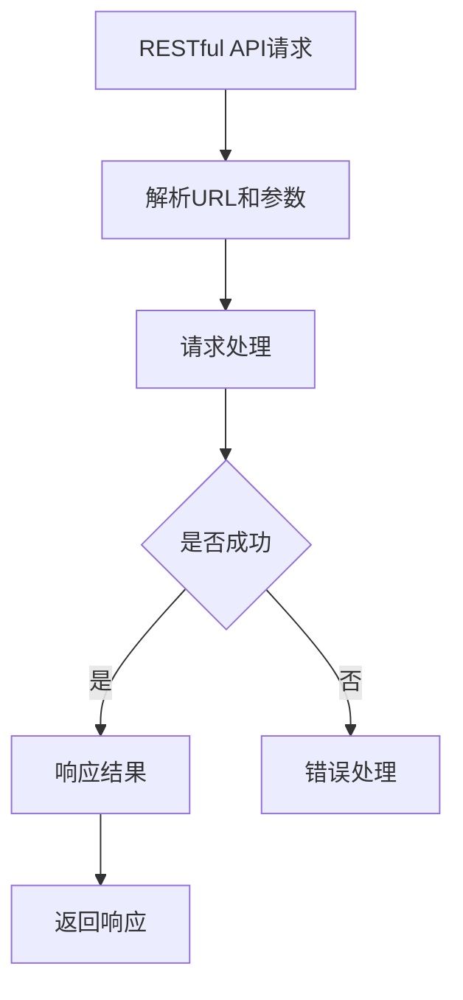

                 

### 文章标题

《微服务通信：REST 和 gRPC》

> 关键词：微服务通信、RESTful API、gRPC、性能优化、安全性、服务发现、负载均衡

摘要：本文深入探讨了微服务架构中的通信机制，重点分析了RESTful API和gRPC这两种主流的微服务通信协议。首先，介绍了微服务通信的基本概念和挑战，然后详细讲解了RESTful API的设计原则、实践和安全性。接下来，阐述了gRPC的基本原理、架构、编程模型及其高级特性，包括健康检查、监控、流量控制和负载均衡。文章进一步探讨了在微服务架构中如何结合使用REST和gRPC，并通过性能和安全性对比，分析了它们的适用场景。最后，展望了微服务通信的未来发展趋势，并提出了最佳实践和解决方案。

### 目录

第一部分：微服务通信基础

## 第1章：微服务与通信概述

### 1.1 微服务的定义与优势

#### 1.1.1 微服务架构的基本概念

微服务架构（Microservices Architecture）是一种软件开发方法，旨在构建独立的、模块化的、分布式系统。在这种架构中，应用程序被划分为一组小的、自治的服务，每个服务负责实现特定的业务功能，并通过轻量级的通信协议（如REST或gRPC）相互协作。

#### 1.1.2 微服务的优点

1. **高可扩展性**：微服务允许独立扩展和部署，从而提高了系统的整体可扩展性。
2. **高可维护性**：服务自治和松耦合降低了系统的复杂度，使得维护和升级变得更加容易。
3. **快速迭代**：微服务支持独立的开发和部署，可以加快新功能的迭代速度。
4. **高容错性**：单个服务的故障不会影响整个系统的运行。

#### 1.1.3 微服务通信的挑战

1. **分布式复杂性**：微服务架构中，服务之间的通信复杂度增加。
2. **数据一致性**：分布式系统中的数据一致性是一个难题。
3. **性能瓶颈**：网络延迟和传输开销可能会影响系统的性能。
4. **安全性**：确保服务之间的安全通信和访问控制是关键。

### 1.2 微服务通信协议概述

#### 1.2.1 RESTful API 设计原则

RESTful API 是一种基于HTTP协议的接口设计风格，其核心原则包括：

1. **统一接口**：使用标准HTTP方法（GET、POST、PUT、DELETE等）来表示操作。
2. **无状态**：每个请求都应该独立于其他请求，确保安全性。
3. **缓存**：充分利用HTTP缓存机制，提高性能。
4. **统一资源定位**：使用URL来表示资源。

#### 1.2.2 gRPC 概念介绍

gRPC 是一个开源的高性能远程过程调用（RPC）框架，由Google开发。其核心特点包括：

1. **高效序列化**：使用 Protocol Buffers 进行数据序列化，效率高且可扩展性强。
2. **多语言支持**：支持多种编程语言，包括Java、Go、Python等。
3. **流式通信**：支持双向流式通信，适用于实时数据传输。
4. **自动重试和负载均衡**：内置机制支持自动重试和负载均衡，提高系统的可靠性。

#### 1.2.3 REST 与 gRPC 的对比

| 特性 | REST | gRPC |
| --- | --- | --- |
| 通信协议 | HTTP | HTTP/2 |
| 序列化格式 | JSON | Protocol Buffers |
| 高级特性 | 缓存、无状态 | 流式通信、自动重试、负载均衡 |
| 性能 | 中等 | 高效 |
| 编程模型 | 手动 | 自动 |

### 1.3 RESTful API 设计

#### 1.3.1 REST 架构风格

RESTful API 的设计风格基于Representational State Transfer（REST）架构风格，其主要原则包括：

1. **资源导向**：将API设计为中心，每个操作都与资源相关。
2. **统一接口**：使用标准HTTP方法（GET、POST、PUT、DELETE等）来表示操作。
3. **无状态**：每个请求都应该独立于其他请求，确保安全性。
4. **可缓存**：充分利用HTTP缓存机制，提高性能。

#### 1.3.2 HTTP 方法与状态码

1. **HTTP 方法**：
   - GET：获取资源
   - POST：创建资源
   - PUT：更新资源
   - DELETE：删除资源

2. **状态码**：
   - 200 OK：请求成功
   - 400 Bad Request：请求无效
   - 401 Unauthorized：未授权
   - 403 Forbidden：禁止访问
   - 500 Internal Server Error：服务器内部错误

#### 1.3.3 URL 设计与参数传递

1. **URL 设计**：URL应简洁、有意义，便于理解和记忆。例如：
   - `/users/{id}`：获取特定用户的详细信息。
   - `/orders/{id}/cancel`：取消特定订单。

2. **参数传递**：URL参数和查询字符串可用于传递数据。例如：
   - `/users?email=example@example.com`：根据邮箱查询用户。
   - `/orders?status=pending`：查询待处理订单。

#### 1.3.4 API 版本管理

1. **版本号**：通过在URL中添加版本号来管理API版本。例如：
   - `/v1/users/{id}`：访问v1版本的用户信息接口。

2. **兼容性策略**：在更新API时，应确保旧版本API的可用性，避免中断服务。

### 第2章：RESTful API 实践

#### 2.1 RESTful API 开发工具

1. **设计工具**：
   - Swagger：用于生成、描述和测试RESTful API的规范文档。
   - Postman：用于API测试和调试。

2. **测试工具**：
   - JMeter：用于性能测试。
   - MockServer：用于模拟API行为。

#### 2.2 RESTful API 示例

##### 2.2.1 简单 RESTful API 实现示例

以下是一个简单的 RESTful API 实现示例，用于处理用户注册功能：

```java
// 用户注册API
@RestController
@RequestMapping("/users")
public class UserController {

    @Autowired
    private UserRepository userRepository;

    @PostMapping
    public ResponseEntity<?> registerUser(@RequestBody User user) {
        if (userRepository.existsByUsername(user.getUsername())) {
            return ResponseEntity.badRequest().body("Error: Username is already taken!");
        }

        userRepository.save(user);
        return ResponseEntity.ok("User registered successfully!");
    }
}
```

##### 2.2.2 实际项目中的 RESTful API 优化案例

在大型项目中，优化 RESTful API 的性能和可维护性至关重要。以下是一些优化策略：

1. **缓存**：使用缓存减少数据库查询次数，提高响应速度。
2. **批量操作**：合并多个请求为批量操作，减少网络开销。
3. **分页**：使用分页技术减少一次性返回大量数据，提高用户体验。
4. **限流**：限制客户端请求频率，防止过度负载。

#### 2.3 RESTful API 安全性

1. **认证与授权**：
   - 认证：验证用户身份，常用的方式包括基于用户名和密码、令牌（如JWT）。
   - 授权：确定用户对资源的访问权限，常用的方式包括角色基础访问控制和基于属性的访问控制（ABAC）。

2. **数据加密与传输安全**：
   - 数据加密：对敏感数据进行加密，确保数据在传输过程中不被窃取。
   - 传输安全：使用HTTPS等安全协议，确保数据在传输过程中不被篡改。

### 第3章：gRPC 基础

#### 3.1 gRPC 简介

gRPC 是一个开源的高性能远程过程调用（RPC）框架，由Google开发。它基于HTTP/2协议，使用Protocol Buffers进行数据序列化，支持多种编程语言，适用于构建分布式微服务架构。

#### 3.2 gRPC 架构与原理

##### 3.2.1 gRPC 架构

gRPC 架构主要包括以下组件：

1. **gRPC 客户端**：发送请求并处理响应。
2. **gRPC 服务器**：接收请求并返回响应。
3. **gRPC 代理**：可选组件，用于简化服务发现和负载均衡。
4. **gRPC 链路跟踪**：可选组件，用于跟踪请求的执行过程。

##### 3.2.2 gRPC 通信流程

gRPC 通信流程包括以下步骤：

1. **服务定义**：使用 Protocol Buffers 定义服务接口。
2. **代码生成**：使用 gRPC 工具生成客户端和服务器的代码。
3. **客户端调用**：客户端通过生成的代码发送请求。
4. **服务器处理**：服务器接收请求并返回响应。
5. **结果处理**：客户端处理返回的响应。

##### 3.2.3 gRPC 数据序列化

gRPC 使用 Protocol Buffers 进行数据序列化，其优点包括：

1. **高效**：序列化和反序列化速度较快。
2. **可扩展**：支持自定义数据类型和枚举。
3. **兼容性**：支持多种编程语言。

#### 3.3 gRPC 编程模型

##### 3.3.1 gRPC 服务定义

在 gRPC 中，服务定义使用 Protocol Buffers 语言（PB）。以下是一个简单的 gRPC 服务定义示例：

```protobuf
syntax = "proto3";

service HelloService {
  rpc SayHello (HelloRequest) returns (HelloResponse);
}

message HelloRequest {
  string name = 1;
}

message HelloResponse {
  string message = 1;
}
```

##### 3.3.2 gRPC 客户端与服务器实现

1. **客户端实现**：

```java
import io.grpc.ManagedChannel;
import io.grpc.ManagedChannelBuilder;
import com.example.grpc.hello.GreeterGrpc;
import com.example.grpc.hello.HelloRequest;
import com.example.grpc.hello.HelloResponse;

public class HelloClient {
    public static void main(String[] args) throws Exception {
        ManagedChannel channel = ManagedChannelBuilder.forAddress("localhost", 50051)
                .usePlaintext()
                .build();
        GreeterGrpc.GreeterBlockingStub stub = GreeterGrpc.newBlockingStub(channel);

        HelloRequest request = HelloRequest.newBuilder().setName("World").build();
        HelloResponse response = stub.sayHello(request);

        System.out.println("Response: " + response.getMessage());
        channel.shutdown();
    }
}
```

2. **服务器实现**：

```java
import io.grpc.Server;
import io.grpc.ServerBuilder;
import com.example.grpc.hello.GreeterGrpc;
import com.example.grpc.hello.HelloRequest;
import com.example.grpc.hello.HelloResponse;

public class HelloServer {
    public static void main(String[] args) throws Exception {
        Server server = ServerBuilder.forPort(50051)
                .addService(new GreeterImpl())
                .build();

        server.start();
        server.awaitTermination();
    }

    public static class GreeterImpl extends GreeterGrpc.GreeterImplBase {
        @Override
        public void sayHello(HelloRequest request, StreamObserver<HelloResponse> responseObserver) {
            String name = request.getName();
            HelloResponse response = HelloResponse.newBuilder().setMessage("Hello " + name).build();
            responseObserver.onNext(response);
            responseObserver.onCompleted();
        }
    }
}
```

##### 3.3.3 gRPC 流与流控

gRPC 支持流式通信，包括双向流、服务器流和客户端流。流控是控制流式通信速率的一种机制，可以防止服务器过载。

1. **双向流**：客户端和服务器可以同时发送和接收消息。
2. **服务器流**：服务器可以发送一系列的消息，客户端可以接收这些消息。
3. **客户端流**：客户端可以发送一系列的消息，服务器可以接收这些消息。

#### 3.4 gRPC 高级特性

##### 3.4.1 gRPC 健康检查与监控

1. **健康检查**：用于检测 gRPC 服务的健康状况，确保服务可用性。
2. **监控**：通过日志、指标和告警等方式，监控 gRPC 服务的性能和运行状态。

##### 3.4.2 gRPC 流量控制与负载均衡

1. **流量控制**：通过控制请求速率和响应速率，防止服务器过载。
2. **负载均衡**：将请求均匀分配到多个服务器实例上，提高系统性能和可用性。

##### 3.4.3 gRPC 服务发现与注册

1. **服务发现**：动态发现和选择可用服务实例。
2. **服务注册**：将服务实例注册到服务发现系统，使其可被发现。

### 第4章：微服务通信中的 gRPC 应用

#### 4.1 gRPC 在微服务中的角色

在微服务架构中，gRPC 扮演着重要的角色：

1. **服务间通信**：作为服务间通信的桥梁，实现高效、可靠的通信。
2. **负载均衡**：通过 gRPC 代理实现负载均衡，提高系统的性能和可用性。
3. **服务发现**：通过服务发现机制，动态发现和选择可用服务实例。

#### 4.2 gRPC 微服务架构设计

##### 4.2.1 微服务拆分策略

微服务拆分策略是设计微服务架构的关键：

1. **功能拆分**：根据业务功能将应用程序划分为多个独立的微服务。
2. **数据边界**：根据数据依赖关系，确保数据的一致性和完整性。
3. **通信模式**：选择合适的通信协议，如REST或gRPC。

##### 4.2.2 gRPC 服务设计模式

在微服务架构中，gRPC 服务设计模式包括：

1. **单一职责**：每个 gRPC 服务实现特定的业务功能。
2. **服务自治**：每个 gRPC 服务独立部署和扩展。
3. **松耦合**：服务之间通过轻量级的通信协议（如gRPC）进行交互。

#### 4.3 gRPC 微服务实践

##### 4.3.1 gRPC 微服务开发示例

以下是一个简单的 gRPC 微服务开发示例，用于处理用户管理功能：

1. **定义服务接口**：

```protobuf
syntax = "proto3";

service UserManager {
  rpc CreateUser (CreateUserRequest) returns (CreateUserResponse);
  rpc GetUser (GetUserRequest) returns (GetUserResponse);
}

message CreateUserRequest {
  string username = 1;
  string password = 2;
}

message CreateUserResponse {
  string message = 1;
}

message GetUserRequest {
  string username = 1;
}

message GetUserResponse {
  string username = 1;
  string password = 2;
}
```

2. **实现服务接口**：

```java
import io.grpc.Server;
import io.grpc.ServerBuilder;
import com.example.grpc.user.UserManagerGrpc;
import com.example.grpc.user.CreateUserRequest;
import com.example.grpc.user.CreateUserResponse;
import com.example.grpc.user.GetUserRequest;
import com.example.grpc.user.GetUserResponse;

public class UserManagerServer {
    public static void main(String[] args) throws Exception {
        Server server = ServerBuilder.forPort(50051)
                .addService(new UserManagerImpl())
                .build();

        server.start();
        server.awaitTermination();
    }

    public static class UserManagerImpl extends UserManagerGrpc.UserManagerImplBase {
        @Override
        public void createUser(CreateUserRequest request, StreamObserver<CreateUserResponse> responseObserver) {
            // 实现用户创建逻辑
            String username = request.getUsername();
            String password = request.getPassword();
            // 保存用户信息
            // 返回成功消息
            CreateUserResponse response = CreateUserResponse.newBuilder().setMessage("User created successfully!").build();
            responseObserver.onNext(response);
            responseObserver.onCompleted();
        }

        @Override
        public void getUser(GetUserRequest request, StreamObserver<GetUserResponse> responseObserver) {
            // 实现用户查询逻辑
            String username = request.getUsername();
            // 查询用户信息
            String password = "password"; // 假设查询到的用户密码为password
            // 返回用户信息
            GetUserResponse response = GetUserResponse.newBuilder().setUsername(username).setPassword(password).build();
            responseObserver.onNext(response);
            responseObserver.onCompleted();
        }
    }
}
```

3. **客户端调用示例**：

```java
import io.grpc.ManagedChannel;
import io.grpc.ManagedChannelBuilder;
import com.example.grpc.user.UserManagerGrpc;
import com.example.grpc.user.CreateUserRequest;
import com.example.grpc.user.CreateUserResponse;
import com.example.grpc.user.GetUserRequest;
import com.example.grpc.user.GetUserResponse;

public class UserManagerClient {
    public static void main(String[] args) throws Exception {
        ManagedChannel channel = ManagedChannelBuilder.forAddress("localhost", 50051)
                .usePlaintext()
                .build();
        UserManagerGrpc.UserManagerBlockingStub stub = UserManagerGrpc.newBlockingStub(channel);

        // 创建用户
        CreateUserRequest request = CreateUserRequest.newBuilder().setUsername("john").setPassword("password").build();
        CreateUserResponse response = stub.createUser(request);
        System.out.println("Response: " + response.getMessage());

        // 获取用户
        GetUserRequest getUserRequest = GetUserRequest.newBuilder().setUsername("john").build();
        GetUserResponse getUserResponse = stub.getUser(getUserRequest);
        System.out.println("Response: " + getUserResponse.getUsername() + " " + getUserResponse.getPassword());

        channel.shutdown();
    }
}
```

##### 4.3.2 实际项目中的 gRPC 微服务优化案例

在实际项目中，优化 gRPC 微服务性能和可维护性至关重要。以下是一些优化策略：

1. **服务拆分**：根据业务需求，合理拆分服务，降低服务之间的依赖和通信开销。
2. **负载均衡**：使用负载均衡策略，将请求均匀分配到多个服务实例上，提高系统的性能和可用性。
3. **缓存**：使用缓存减少数据库查询次数，提高响应速度。
4. **限流**：限制客户端请求频率，防止过度负载。

### 第5章：微服务通信中的REST与gRPC综合应用

#### 5.1 REST与gRPC的混合使用

在微服务架构中，REST和gRPC可以结合使用，以充分利用两者的优势：

1. **场景选择**：根据业务需求和性能要求，选择合适的通信协议。
2. **接口设计**：在API设计中，将公共接口使用REST，私有接口使用gRPC，以减少不必要的通信开销。
3. **服务集成**：将REST服务作为外部接口，gRPC服务作为内部通信，实现服务的解耦和高效通信。

#### 5.2 REST与gRPC性能比较

1. **请求响应时间**：gRPC通常具有更快的请求响应时间，因为其使用了高效的序列化和压缩机制。
2. **吞吐量**：gRPC在处理大量并发请求时具有更高的吞吐量，因为其支持双向流和高效的负载均衡策略。
3. **网络开销**：REST通常具有更低的网络开销，因为其可以使用HTTP缓存和更丰富的错误处理机制。

#### 5.3 REST与gRPC的安全性比较

1. **认证与授权**：REST通常使用OAuth 2.0等认证和授权机制，而gRPC可以使用JWT等机制。
2. **数据加密**：REST通常使用HTTPS等加密机制，而gRPC使用TLS/SSL进行数据传输。
3. **安全性配置**：REST安全性配置较为灵活，而gRPC的安全配置相对简单。

#### 5.4 REST与gRPC的适用场景

1. **内部通信**：gRPC适用于内部服务之间的通信，具有更高的性能和安全性。
2. **外部通信**：REST适用于与外部系统（如第三方API或前端应用）的通信，具有更丰富的功能和灵活性。

### 第6章：微服务通信的未来发展趋势

#### 6.1 微服务通信技术的发展

随着微服务架构的广泛应用，微服务通信技术也在不断发展和创新：

1. **服务网格**：服务网格（Service Mesh）是一种新的通信架构，旨在简化微服务通信，提供透明的服务间通信和安全保障。
2. **云原生技术**：云原生技术（如Kubernetes、Docker等）为微服务通信提供了高效、可伸缩的部署和管理方式。
3. **智能路由与流量管理**：基于AI和机器学习的智能路由和流量管理技术，可以提高微服务通信的效率和可靠性。

#### 6.2 微服务通信的最佳实践

1. **服务拆分**：根据业务需求和依赖关系，合理拆分服务，降低服务之间的耦合。
2. **服务发现与注册**：使用服务发现和注册机制，动态发现和选择可用服务实例。
3. **负载均衡与流量控制**：使用负载均衡和流量控制策略，提高系统的性能和可用性。
4. **安全性与监控**：确保服务之间的安全通信，并使用监控工具跟踪服务的运行状态。

#### 6.3 微服务通信的挑战与应对策略

1. **分布式数据一致性**：使用分布式事务和消息队列等技术，确保数据的一致性。
2. **性能优化**：使用缓存、批量操作和优化网络配置等策略，提高系统的性能。
3. **安全性保障**：使用加密、认证和授权等机制，确保服务之间的安全通信。

### 第7章：工具与资源

#### 7.1 RESTful API 设计与开发工具

1. **Swagger**：用于生成、描述和测试RESTful API的规范文档。
2. **Postman**：用于API测试和调试。
3. **Spring Boot**：用于快速构建RESTful API服务。

#### 7.2 gRPC 开发工具与资源

1. **gRPC 官方文档**：提供详细的gRPC框架介绍和使用指南。
2. **Protocol Buffers**：用于定义服务接口和数据结构。
3. **gRPC-UI**：用于可视化监控gRPC服务的运行状态。

#### 7.3 微服务通信相关书籍与论文

1. **《微服务设计》**：由Sam Newman著，全面介绍了微服务架构的设计原则和实践。
2. **《RESTful Web Services Cookbook》**：由Sam Ruby著，提供了丰富的RESTful API设计实践。
3. **《gRPC: The Definitive Guide》**：由Chris Lindsay和Michael Yu著，详细介绍了gRPC框架的使用方法。

### 附录

#### 附录A：工具与资源

1. **Swagger**：用于生成、描述和测试RESTful API的规范文档。
2. **Postman**：用于API测试和调试。
3. **Spring Boot**：用于快速构建RESTful API服务。

4. **gRPC 官方文档**：提供详细的gRPC框架介绍和使用指南。
5. **Protocol Buffers**：用于定义服务接口和数据结构。
6. **gRPC-UI**：用于可视化监控gRPC服务的运行状态。

#### 附录B：Mermaid 流程图



#### 附录C：伪代码示例

```java
// gRPC 服务定义伪代码
service MyService {
  rpc AddRequest (AddRequest) returns (AddResponse);
}

// RESTful API 请求与响应伪代码
function makeRequest(url, method, body) {
  // 发起HTTP请求
  // 解析URL和参数
  // 处理请求和响应
  // 返回响应结果
}
```

#### 附录D：数学模型与公式

$$
URL_{path} = base_{url} + path_{segment}
$$

$$
response_{code} = 200 \quad (成功) \\
response_{code} = 400 \quad (客户端错误) \\
response_{code} = 500 \quad (服务器错误)
$$

#### 附录E：项目实战

1. **实现一个简单的 gRPC 服务，处理加减运算请求。**
2. **开发一个 RESTful API，实现用户注册与登录功能。**

#### 附录F：源代码与分析

1. **提供 gRPC 服务端和客户端的实现代码。**
2. **分析 RESTful API 的设计原则和优化策略。**
3. **解释微服务通信项目中遇到的问题和解决方案。**

