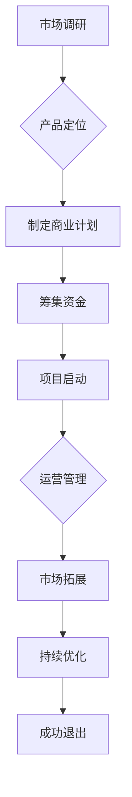

                 

# 文章标题：微经济创业：小而美的精品商业

> 关键词：微经济创业、小而美企业、商业模式、精益运营、国际化、案例解析、创业者成长

> 摘要：本文将深入探讨微经济创业领域，分析其概念、意义、生态系统、优势策略，以及如何通过产品定位、品牌塑造、精益运营、市场拓展等手段实现小而美的精品商业。通过国内外成功案例的解析，为创业者提供实战指导和可持续发展路径。

### 《微经济创业：小而美的精品商业》目录大纲

## 第一部分：微经济创业概述

### 第1章：微经济创业的概念与意义
#### 1.1 微经济的定义
#### 1.2 微经济创业的特点
#### 1.3 微经济创业的机遇与挑战

### 第2章：微经济创业的生态系统
#### 2.1 微经济创业环境分析
#### 2.2 政策与法规环境
#### 2.3 社会网络与资源整合

## 第二部分：小而美的精品商业模式

### 第3章：小而美企业的优势与策略
#### 3.1 小而美企业的特点
#### 3.2 小而美的企业战略
#### 3.3 创业者心态与领导力

### 第4章：产品定位与品牌塑造
#### 4.1 产品定位的重要性
#### 4.2 品牌塑造的方法
#### 4.3 用户口碑与社群营销

### 第5章：精益运营与管理
#### 5.1 精益创业理念
#### 5.2 企业资源管理
#### 5.3 风险管理与危机应对

### 第6章：市场拓展与国际化
#### 6.1 市场调研与目标市场定位
#### 6.2 国际化战略规划
#### 6.3 跨文化沟通与合作

## 第三部分：案例分析与创业实战

### 第7章：成功微经济创业案例解析
#### 7.1 国内微经济创业案例分析
#### 7.2 国外微经济创业案例分析
#### 7.3 案例总结与启示

### 第8章：创业实战与项目规划
#### 8.1 创业项目的构思与规划
#### 8.2 融资策略与资源筹集
#### 8.3 项目运营与优化

### 第9章：创业者的自我成长与可持续发展
#### 9.1 创业者素质与能力提升
#### 9.2 创业者心理调适与团队建设
#### 9.3 创业者的可持续发展之路

## 附录

### 附录A：微经济创业相关资源与工具
#### A.1 微经济创业书籍推荐
#### A.2 微经济创业网站与平台
#### A.3 创业者社群与交流平台

### 附录B：Mermaid 流程图与算法讲解
#### B.1 微经济创业流程图
#### B.2 算法原理讲解与伪代码展示

### 附录C：数学模型与公式讲解
#### C.1 微经济创业中的数学模型
#### C.2 数学公式详细讲解与举例说明

### 附录D：代码案例与解读
#### D.1 创业项目代码实战
#### D.2 源代码详细实现与代码解读
#### D.3 代码解读与分析

## 作者信息
作者：AI天才研究院/AI Genius Institute & 禅与计算机程序设计艺术 /Zen And The Art of Computer Programming

### 正文部分（接下来按照大纲逐章撰写内容）

## 第1章：微经济创业的概念与意义

### 1.1 微经济的定义

微经济，作为一个新兴的经济概念，主要指以微型企业、微型个体户为主体的经济活动。它不同于传统的宏观经济，强调的是规模小、灵活性高、资源利用效率高的小型经济实体。微经济通常指的是那些规模较小，资本投入较低，但创新能力强，适应市场需求变化迅速的企业或个体经营户。

微经济的出现并非偶然，它是对现代商业环境中新兴技术、互联网发展、消费者需求变化的回应。这些微型企业或个体户利用互联网、移动通讯技术等现代信息技术手段，实现了低成本、高效能的运营模式。例如，电子商务平台的兴起使得很多个人创业者可以通过网络销售自己的产品，不再受限于地域和实体店面。

微经济创业的特点包括：

1. **规模小、资本投入低**：微型企业通常员工数量较少，资本需求相对较低，使得更多人有机会实现创业梦想。
2. **灵活性高**：由于规模小，微型企业能够迅速适应市场变化，调整经营策略，具备较高的灵活性。
3. **创新驱动**：微经济企业往往以创新为主要动力，通过不断研发新产品、服务来满足市场需求。
4. **快速响应**：微型企业能够快速捕捉市场信息，及时调整经营策略，提高市场竞争力。

### 1.2 微经济创业的特点

微经济创业具有以下几个显著特点：

1. **低成本、高效能**：微型企业由于规模小，运营成本相对较低，但通过信息技术手段的高效利用，可以实现高效的运营和管理。
2. **创新驱动**：微型企业往往以创新为核心竞争力，通过新产品、新服务的开发来占领市场。
3. **灵活应变**：微型企业能够迅速响应市场变化，调整经营策略，提高市场适应能力。
4. **团队合作**：微型企业通常需要紧密的团队合作，每个成员都承担多重角色，实现高效协同。
5. **可持续性**：微经济企业由于规模小，资源利用效率高，往往更注重可持续发展，具备较强的抗风险能力。

### 1.3 微经济创业的机遇与挑战

微经济创业既是机遇也是挑战。以下是其机遇与挑战的详细分析：

**机遇：**

1. **技术创新**：互联网、移动通讯技术的发展为微经济创业提供了丰富的工具和平台，使得创业者可以低成本地开展业务。
2. **市场细分**：消费者需求的多样化使得市场细分成为可能，微型企业可以通过精准定位特定消费群体来获得市场优势。
3. **政策支持**：许多国家和地区都出台了鼓励微型企业发展的政策，提供了税收减免、资金支持等优惠措施。
4. **国际化**：全球化背景下，微型企业可以通过互联网等手段快速进入国际市场，实现国际化运营。

**挑战：**

1. **市场竞争**：微型企业在市场上的竞争日益激烈，如何脱颖而出成为一大挑战。
2. **资金瓶颈**：微型企业往往面临融资难题，资金不足可能会限制企业的发展。
3. **管理难题**：微型企业由于规模小，管理难度较大，创业者需要具备较高的管理能力。
4. **持续创新**：微型企业需要不断进行产品和服务创新，以适应市场变化，但创新的风险也较大。

通过以上分析，我们可以看到微经济创业既有广阔的发展前景，也面临着诸多挑战。了解微经济的定义、特点以及创业机遇与挑战，将为创业者提供有价值的参考。

## 第2章：微经济创业的生态系统

### 2.1 微经济创业环境分析

微经济创业环境的分析是理解微经济创业成功与否的关键。一个良好的创业环境能够为创业者提供必要的支持，帮助他们克服困难，实现创业目标。以下是微经济创业环境的主要组成部分：

**市场环境：** 市场环境是微经济创业的基础。市场的需求变化、竞争态势、消费趋势等都会直接影响到微型企业的运营和发展。一个健康、开放的市场环境能够为微型企业提供更多的商机和发展空间。

**政策环境：** 政策环境对微经济创业的影响至关重要。许多国家和地区都出台了鼓励微型企业发展的政策，包括税收减免、贷款优惠、技术支持等。这些政策的实施能够降低微型企业的创业成本，提高创业成功率。

**技术环境：** 现代信息技术的发展为微经济创业提供了强大的支持。互联网、移动通讯技术、大数据、人工智能等新兴技术使得微型企业能够以低成本、高效能的方式运营和管理。技术的不断进步也为微型企业提供了创新的可能性和发展空间。

**社会环境：** 社会环境对微经济创业的影响不容忽视。社会文化、价值观、消费观念等都会影响消费者的购买行为，从而影响微型企业的市场表现。一个包容、开放的社会环境能够促进微型企业的创新和发展。

**资本环境：** 资本环境是微经济创业的重要保障。充足的资本支持能够帮助微型企业快速扩展业务，实现规模效应。资本市场的活跃程度、资本流动性、融资渠道的多样性都会影响到微型企业的融资难易程度。

### 2.2 政策与法规环境

政策与法规环境是微经济创业的重要保障。政府通过制定和实施相关政策和法规，为微型企业提供了法律保护和政策支持。

**税收政策：** 许多国家和地区都出台了针对微型企业的税收减免政策。例如，一些国家提供小微企业免税期、低税率等优惠政策，以降低微型企业的运营成本。

**贷款政策：** 政府通过提供低息贷款、贷款担保等手段，帮助微型企业解决融资难题。这些贷款政策能够为微型企业提供必要的资金支持，促进其发展。

**法规保护：** 政府通过制定相关法规，保护微型企业的合法权益。例如，一些国家制定了反垄断法、知识产权保护法等，以防止大型企业对微型企业的压制。

**创业支持政策：** 政府还通过提供创业培训、咨询服务、孵化器建设等支持政策，帮助微型企业提升管理水平、增强创新能力。

### 2.3 社会网络与资源整合

社会网络和资源整合是微经济创业成功的关键因素。微型企业往往通过建立和维护良好的社会关系，整合各种资源，实现企业的快速发展。

**社会网络：** 社会网络是微型企业获取信息和资源的重要途径。通过参加行业会议、社交活动、创业者社群等，微型企业可以结识业界人士、获取市场信息、建立合作关系。

**资源整合：** 资源整合能力是微型企业的核心竞争力。微型企业可以通过内部资源整合、外部资源整合等方式，实现资源的最佳配置。内部资源整合包括优化人力资源管理、提高生产效率等；外部资源整合包括与供应商、客户、合作伙伴建立长期稳定的合作关系。

通过以上分析，我们可以看到，微经济创业的生态系统是一个复杂而多元的体系。一个良好的创业环境、有效的政策支持、良好的社会网络和资源整合能力，都是微经济创业成功的关键因素。

### 第3章：小而美企业的优势与策略

#### 3.1 小而美企业的特点

小而美企业（Small and Beautiful Companies）是微经济创业中的一支重要力量。它们以其独特的特点和优势，在激烈的市场竞争中脱颖而出。

**规模小**：小而美企业通常员工数量较少，经营规模相对较小。这使得它们在资源管理和运营成本方面具有优势。

**灵活性高**：小而美企业由于规模小，能够迅速适应市场变化，调整经营策略。这种灵活性使得它们能够快速响应客户需求，提高市场竞争力。

**创新能力**：小而美企业往往以创新为主要驱动力。它们能够快速研发新产品、服务，满足市场的多样化需求。

**用户至上**：小而美企业注重用户体验，致力于提供优质的产品和服务。它们通常能够与客户建立紧密的联系，形成良好的用户口碑。

**高效管理**：小而美企业通常采取扁平化管理结构，决策流程短，沟通效率高。这种高效管理模式有助于提高企业的运营效率。

**资源利用效率高**：小而美企业由于规模小，能够更高效地利用资源。它们通常通过优化生产流程、降低运营成本来实现资源的高效利用。

#### 3.2 小而美的企业战略

小而美企业需要制定清晰的战略来应对市场竞争，实现可持续发展。以下是几个关键的战略方向：

**产品创新战略**：小而美企业应持续关注市场需求，通过产品创新来满足消费者的多样化需求。产品创新不仅包括新产品的开发，还包括对现有产品的改进和优化。

**市场细分战略**：小而美企业可以通过市场细分，找到特定的目标客户群体，提供定制化的产品和服务。这种精准的市场定位有助于提高市场占有率和客户满意度。

**品牌建设战略**：品牌建设是小而美企业的重要战略之一。通过塑造独特的品牌形象，提高品牌知名度和美誉度，小而美企业可以增强市场竞争力。

**合作伙伴战略**：小而美企业可以通过与供应商、客户、合作伙伴建立长期稳定的合作关系，实现资源的共享和优化。合作伙伴战略有助于提高企业的资源整合能力和市场竞争力。

**国际化战略**：全球化背景下，小而美企业可以通过国际化战略，拓展国际市场，实现业务增长。国际化战略包括市场调研、目标市场定位、跨文化沟通与合作等方面。

#### 3.3 创业者心态与领导力

小而美企业的成功离不开创业者的心态和领导力。以下是创业者需要具备的心态和领导力要素：

**积极乐观的心态**：创业者需要具备积极乐观的心态，面对困难和挑战时能够保持乐观态度，积极寻找解决方案。

**创新精神**：创业者应具备强烈的创新精神，敢于尝试新事物，不断挑战自我。

**领导力**：创业者需要具备优秀的领导力，能够激发团队潜力，实现团队高效协同。

**持续学习**：创业者应持续学习，不断更新知识和技能，以适应市场变化和技术进步。

**团队协作**：创业者需要建立良好的团队协作机制，培养团队成员的协作精神和团队意识。

通过以上分析，我们可以看到，小而美企业以其独特的优势和策略，在激烈的市场竞争中占据了一席之地。创业者通过制定明确的企业战略，培养积极的心态和优秀的领导力，可以推动小而美企业实现可持续发展。

#### 3.4 小而美企业的优势

小而美企业在市场竞争中具有显著的优势，这些优势帮助它们在激烈的环境中脱颖而出。以下是小而美企业的主要优势：

**灵活的运营模式**：小而美企业通常采用灵活的运营模式，这使得它们能够迅速调整战略，以应对市场变化。例如，在需求波动时，企业可以迅速调整生产计划，减少库存积压。

**高效的决策流程**：小而美企业的组织结构通常较为扁平，管理层级较少，决策流程短。这意味着企业能够快速做出决策，减少内部沟通的成本和延迟。

**低成本运营**：小而美企业的规模相对较小，运营成本较低。这使它们在价格竞争中有一定的优势，能够以更具竞争力的价格提供产品和服务。

**创新驱动**：小而美企业通常注重创新，以创新作为企业发展的核心驱动力。这种创新精神使得企业能够不断推出新产品，满足市场的多样化需求。

**高度定制化服务**：小而美企业往往能够提供高度定制化的产品和服务，这使它们能够更好地满足特定客户群体的需求，从而提高客户满意度和忠诚度。

**快速响应市场需求**：由于规模小，小而美企业能够快速响应市场需求，及时调整产品或服务，以适应市场变化。

**紧密的客户关系**：小而美企业通常与客户保持紧密的联系，这有助于它们更好地了解客户需求，提供个性化的解决方案。

**企业文化**：小而美企业往往注重建立独特的企业文化，这种文化能够激励员工，增强团队的凝聚力，从而提高企业的整体绩效。

通过以上优势，小而美企业能够在竞争激烈的市场中立于不败之地，实现持续发展和成长。

#### 3.5 创业者心态与领导力的关键因素

在创业过程中，创业者的心态和领导力是决定企业成败的关键因素。以下是创业者需要具备的关键心态和领导力要素：

**积极乐观的心态**：创业者需要具备积极乐观的心态，面对困难和挑战时能够保持乐观态度，积极寻找解决方案。这种心态有助于创业者克服创业过程中的各种困难，保持前进的动力。

**创新精神**：创业者应具备强烈的创新精神，敢于尝试新事物，不断挑战自我。创新精神是推动企业发展的核心动力，有助于企业在市场中脱颖而出。

**坚韧不拔**：创业者需要坚韧不拔，具备应对挫折和失败的能力。创业道路充满不确定性，创业者需要具备承受失败和挫折的心理素质，不断调整策略，迎接新的挑战。

**决策能力**：创业者需要具备优秀的决策能力，能够在复杂多变的市场环境中做出正确的决策。决策能力包括快速分析问题、评估风险、选择最佳方案等方面。

**领导力**：创业者需要具备领导力，能够激发团队的潜力，实现团队高效协同。领导力包括领导风格、沟通技巧、团队建设等方面。

**学习能力**：创业者应具备持续学习的能力，不断更新知识和技能，以适应市场变化和技术进步。学习能力强有助于创业者不断提高自身素质，提升企业的竞争力。

**团队合作精神**：创业者需要具备团队合作精神，能够与团队成员建立良好的合作关系，共同实现企业目标。团队合作精神有助于提高企业的整体绩效，实现可持续发展。

通过以上关键心态和领导力要素，创业者可以更好地应对创业过程中的挑战，推动企业实现持续发展和成功。

#### 3.6 小而美企业的成功策略

小而美企业的成功离不开有效的策略。以下是一些关键的成功策略，帮助小而美企业在激烈的市场竞争中脱颖而出：

**产品差异化策略**：小而美企业可以通过产品差异化来区分自身与竞争对手，满足消费者独特的需求。这包括开发独特的设计、功能或品质，以提供与众不同的产品体验。

**市场细分策略**：通过市场细分，小而美企业可以找到特定的目标客户群体，提供定制化的产品和服务。这种精准的市场定位有助于提高市场占有率和客户满意度。

**精益运营策略**：小而美企业应采取精益运营策略，通过优化生产流程、降低运营成本来提高效率。精益运营有助于企业在资源有限的情况下实现最大化的产出。

**品牌建设策略**：品牌建设是小而美企业的重要策略之一。通过塑造独特的品牌形象，提高品牌知名度和美誉度，小而美企业可以增强市场竞争力。

**客户关系管理策略**：小而美企业应注重客户关系管理，通过提供优质的客户服务和售后支持，建立长期稳定的客户关系。良好的客户关系有助于提高客户满意度和忠诚度。

**创新驱动策略**：小而美企业应以创新为核心驱动力，不断研发新产品、服务，以满足市场的多样化需求。创新驱动有助于企业在市场中保持领先地位。

**灵活应变策略**：小而美企业应具备灵活应变的策略，能够迅速适应市场变化，调整经营策略。这种灵活性有助于企业应对市场波动，提高市场竞争力。

**合作伙伴策略**：小而美企业可以通过与供应商、客户、合作伙伴建立长期稳定的合作关系，实现资源的共享和优化。合作伙伴策略有助于提高企业的资源整合能力和市场竞争力。

通过以上成功策略，小而美企业可以充分利用自身的优势，在激烈的市场竞争中实现持续发展和成功。

### 第4章：产品定位与品牌塑造

#### 4.1 产品定位的重要性

产品定位是企业在市场中立足的基础，也是品牌塑造的核心。正确的产品定位可以帮助企业明确自身在市场中的位置，吸引目标客户，从而提高市场竞争力。以下是产品定位的重要性：

**明确市场定位**：通过产品定位，企业可以明确自己在市场中的定位，确定目标市场和目标客户。这有助于企业集中资源，专注于满足目标客户的需求，从而提高市场占有率。

**差异化竞争**：产品定位有助于企业实现差异化竞争，通过提供独特的产品或服务来区分自身与竞争对手。这种差异化可以增强企业的市场竞争力，避免陷入价格战。

**提升品牌价值**：产品定位是品牌塑造的重要一环。通过准确的产品定位，企业可以塑造出具有高度识别度的品牌形象，提高品牌在消费者心中的价值。

**提高营销效率**：产品定位有助于企业制定更加精准的营销策略，提高营销效率。企业可以根据产品定位，选择合适的营销渠道和推广手段，有效传达品牌信息和产品特点。

**满足客户需求**：产品定位可以帮助企业更好地了解客户需求，提供符合客户期望的产品和服务。这有助于提高客户满意度和忠诚度，促进长期业务发展。

**优化资源配置**：通过产品定位，企业可以明确自身优势和市场机会，优化资源配置，提高运营效率。这有助于企业将有限的资源集中在最有价值的业务领域，实现最大化收益。

#### 4.2 品牌塑造的方法

品牌塑造是企业长期发展的关键，它不仅仅是一个标志或口号，更是一种价值观和文化的体现。以下是品牌塑造的主要方法：

**建立品牌形象**：品牌形象是消费者对品牌的第一印象，包括视觉元素、品牌名称、标识等。通过设计独特的品牌形象，企业可以提升品牌的识别度，增强品牌影响力。

**传播品牌理念**：品牌理念是企业价值观和使命的体现，是品牌的核心。通过有效的传播手段，如广告、公关活动、社交媒体等，企业可以将品牌理念传递给消费者，树立品牌形象。

**提供优质产品和服务**：优质的产品和服务是品牌塑造的基础。企业应始终坚持以客户为中心，提供高质量的产品和服务，赢得客户的信任和忠诚。

**塑造品牌个性**：品牌个性是品牌的独特性格特征，如时尚、专业、亲切等。通过塑造鲜明的品牌个性，企业可以吸引特定的目标客户群体，增强品牌的市场竞争力。

**建立品牌社区**：品牌社区是一种在线或线下互动平台，让品牌与消费者建立紧密联系。通过品牌社区，企业可以更好地了解消费者需求，提供个性化服务，增强品牌忠诚度。

**进行品牌延伸**：品牌延伸是指将品牌应用到新的产品或服务领域。通过品牌延伸，企业可以扩大市场份额，提高品牌价值。

#### 4.3 用户口碑与社群营销

用户口碑和社群营销是现代营销中的重要策略，它们可以帮助企业建立良好的品牌形象，提高用户忠诚度，从而促进业务增长。以下是用户口碑和社群营销的方法：

**用户口碑营销**：

1. **提供优质产品和服务**：优质的用户体验是口碑传播的基础。企业应始终提供高质量的产品和服务，赢得用户的满意和信任。
2. **鼓励用户分享**：企业可以通过提供奖励、优惠券等方式，鼓励用户在社交媒体上分享使用体验。用户的真实分享可以增强品牌的影响力。
3. **积极回应用户反馈**：企业应积极回应用户的反馈和评论，无论是正面还是负面。这不仅可以提高用户满意度，还可以树立企业的良好形象。
4. **利用KOL（关键意见领袖）**：关键意见领袖在社交媒体上拥有大量粉丝，他们的推荐可以极大地提升品牌的曝光率和认可度。

**社群营销**：

1. **建立品牌社群**：企业可以创建线上社群，如微信群、QQ群、论坛等，让用户之间进行互动和交流。这种社群可以增强用户对品牌的归属感和忠诚度。
2. **举办线上活动**：通过线上活动，如问答环节、主题讨论、互动游戏等，可以增强用户参与感和粘性。
3. **提供个性化服务**：通过社群，企业可以了解用户的需求和偏好，提供个性化的产品和服务，从而提高用户满意度。
4. **跨平台营销**：企业可以利用不同的社交媒体平台，如微博、抖音、微信等，进行跨平台营销，扩大品牌影响力。

通过有效的用户口碑营销和社群营销，企业可以建立强大的品牌资产，提高市场竞争力，实现持续的业务增长。

#### 4.4 产品定位与品牌塑造的协同作用

产品定位与品牌塑造在企业发展中具有协同作用，二者相互促进，共同塑造企业的市场形象。以下是产品定位与品牌塑造的协同作用：

**增强品牌识别度**：产品定位明确了企业在市场中的定位和目标客户，品牌塑造则通过独特的品牌形象和理念，增强品牌的识别度。准确的定位和鲜明的品牌形象有助于消费者快速识别和选择品牌。

**提升品牌价值**：产品定位确定了品牌的核心价值和优势，品牌塑造则通过传播和强化这些价值，提升品牌在消费者心中的地位。品牌价值的高提升可以带来更高的溢价和市场份额。

**增强用户忠诚度**：产品定位提供了满足用户需求的产品和服务，品牌塑造则通过建立情感连接和用户参与，增强用户对品牌的忠诚度。忠诚的用户不仅会重复购买，还可能成为品牌的传播者。

**扩大市场占有率**：通过准确的定位和有效的品牌塑造，企业可以吸引更多的目标客户，扩大市场占有率。市场占有率的提高可以带来更大的销售额和市场份额。

**实现可持续发展**：产品定位与品牌塑造的协同作用有助于企业实现可持续发展。明确的定位和强大的品牌可以为企业在竞争激烈的市场中提供持续竞争优势，确保企业的长期发展。

通过产品定位与品牌塑造的协同作用，企业可以在市场中建立强大的品牌影响力，实现持续的业务增长和可持续发展。

### 第5章：精益运营与管理

#### 5.1 精益创业理念

精益创业（Lean Startup）理念是一种以用户为中心、快速迭代和持续验证的创业方法论。它起源于硅谷，由埃里克·莱斯（Eric Ries）提出。精益创业的核心思想是通过最小可行产品（Minimum Viable Product，MVP）快速验证市场需求，不断调整和优化产品，最终实现产品的市场成功。以下是精益创业理念的主要原则：

**用户反馈**：精益创业强调用户反馈的重要性。通过不断收集用户反馈，企业可以及时了解用户需求和偏好，从而调整产品方向，提高用户满意度。

**最小可行产品**：MVP是精益创业的核心概念。它是一个具备核心功能的最简产品版本，旨在验证市场需求和假设。通过MVP，企业可以最小化资源投入，快速测试市场反应。

**快速迭代**：精益创业主张快速迭代，即通过持续迭代和优化产品，快速适应市场变化。快速迭代有助于企业尽早发现问题，及时调整，减少研发风险。

**数据驱动**：精益创业强调数据驱动决策。企业应通过数据分析来验证假设、评估产品性能，并根据数据结果调整策略。

**风险管理**：精益创业注重风险管理，通过早期验证和持续迭代，企业可以识别和应对潜在风险，降低创业失败的概率。

**灵活应变**：精益创业强调灵活应变，企业应具备快速调整战略和运营的能力，以适应市场变化。

#### 5.2 企业资源管理

企业资源管理（Enterprise Resource Planning，ERP）是企业内部管理和资源优化的重要工具。ERP系统通过整合企业的各项业务流程，实现资源的最佳配置和利用。以下是企业资源管理的几个关键方面：

**财务管理**：ERP系统可以帮助企业实现财务管理的自动化和精细化。通过ERP系统，企业可以实时监控财务状况，提高资金使用效率，降低财务风险。

**人力资源管理**：ERP系统可以整合企业的人力资源信息，实现招聘、培训、绩效评估、薪资管理等各个环节的自动化和优化。这有助于提高人力资源管理水平，增强员工满意度。

**生产管理**：ERP系统可以帮助企业实现生产流程的优化，提高生产效率。通过ERP系统，企业可以实时监控生产进度，优化生产资源，减少库存积压。

**供应链管理**：ERP系统可以整合企业的供应链信息，实现供应链的透明化和优化。通过ERP系统，企业可以实时监控供应链各个环节，提高供应链的响应速度和灵活性。

**客户关系管理**：ERP系统可以帮助企业实现客户关系的自动化和精细化。通过ERP系统，企业可以实时记录客户信息，分析客户需求，提供个性化的产品和服务。

#### 5.3 风险管理与危机应对

风险管理和危机应对是企业运营中不可或缺的环节。有效的风险管理可以帮助企业识别和应对潜在风险，减少损失；而危机应对则是在风险发生时，帮助企业迅速采取行动，降低危机影响。以下是风险管理与危机应对的关键策略：

**风险识别**：企业应建立完善的内部风险识别机制，通过定期评估和分析，识别可能存在的风险。这包括市场风险、财务风险、运营风险、法律风险等方面。

**风险评估**：对企业识别出的风险进行评估，确定其发生的概率和可能造成的影响。通过风险评估，企业可以了解风险的优先级，有针对性地制定应对策略。

**风险控制**：针对评估出的高风险，企业应制定相应的风险控制措施，包括预防措施和应急措施。例如，对于市场风险，企业可以通过多元化市场布局来降低风险；对于财务风险，企业可以通过严格的财务管理和内部控制来降低风险。

**危机应对**：在风险发生时，企业应迅速采取行动，进行危机应对。危机应对包括以下几个方面：

- **危机预警**：通过建立危机预警机制，企业可以及时发现潜在危机，采取预防措施。
- **危机管理**：危机管理包括危机响应、危机沟通、危机处理等方面。企业应建立专门的危机管理团队，负责处理危机事件。
- **危机公关**：在危机发生时，企业应通过有效的公关措施，向公众传递正面信息，减轻危机对品牌形象的影响。
- **危机恢复**：危机过后，企业应采取恢复措施，恢复运营和品牌形象。通过总结危机应对经验，企业可以不断提高危机应对能力。

通过有效的风险管理和危机应对，企业可以降低运营风险，提高抗风险能力，确保企业的稳定发展。

### 第6章：市场拓展与国际化

#### 6.1 市场调研与目标市场定位

市场调研和目标市场定位是市场拓展的重要基础。通过全面的市场调研，企业可以了解市场需求、竞争态势、消费者行为等关键信息，从而制定科学的营销策略。以下是市场调研与目标市场定位的步骤：

**1. 确定调研目标**：首先，企业需要明确市场调研的目标，例如了解目标市场的规模、消费者需求、竞争环境等。

**2. 收集数据**：通过问卷调查、访谈、焦点小组讨论、市场分析报告等方式，收集与目标市场相关的数据。

**3. 数据分析**：对收集到的数据进行分析，识别市场趋势、消费者需求、市场细分等。

**4. 确定目标市场**：根据数据分析结果，确定企业的目标市场。目标市场应具备以下条件：市场潜力大、竞争相对较小、企业具备竞争优势。

**5. 制定市场策略**：根据目标市场的特点，制定相应的市场进入策略、产品策略、价格策略、促销策略等。

#### 6.2 国际化战略规划

国际化战略是企业扩展全球市场的关键。以下是国际化战略规划的主要步骤：

**1. 市场机会分析**：分析全球市场的机会，包括市场需求、市场规模、市场增长率等。

**2. 竞争对手分析**：了解竞争对手的全球战略、市场占有率、产品特点等。

**3. 公司能力评估**：评估企业的国际化能力，包括产品竞争力、品牌知名度、资金实力等。

**4. 目标市场选择**：根据市场机会和公司能力，选择合适的目标市场。

**5. 制定国际化策略**：根据目标市场的特点，制定国际化策略，包括市场进入策略、产品策略、渠道策略、定价策略等。

**6. 实施与监控**：实施国际化战略，并建立监控机制，定期评估国际化战略的效果，及时调整策略。

#### 6.3 跨文化沟通与合作

跨文化沟通与合作是国际化成功的关键。以下是跨文化沟通与合作的关键要素：

**1. 文化理解**：深入了解目标市场的文化背景、价值观、商业习惯等，避免文化冲突。

**2. 沟通策略**：采用合适的沟通方式，如面对面交流、电子邮件、电话会议等，确保信息传递的准确性和有效性。

**3. 建立信任**：通过建立信任关系，增强合作伙伴和客户对企业的认同感。

**4. 适应与融合**：在跨文化合作中，企业应尊重当地文化，积极适应和融合，提高合作效率。

**5. 跨文化培训**：对企业员工进行跨文化培训，提高他们的跨文化沟通能力和适应性。

通过有效的市场调研、目标市场定位、国际化战略规划和跨文化沟通与合作，企业可以实现全球市场的拓展，提高国际竞争力。

### 第7章：成功微经济创业案例解析

#### 7.1 国内微经济创业案例分析

国内微经济创业案例丰富多样，以下选取几个典型案例进行分析：

**案例一：拼多多**  
拼多多是一个基于社交电商的微经济创业企业。它通过拼团模式，将消费者和卖家直接连接，实现了低成本、高效率的商业模式。拼多多成功的关键因素包括：

1. **精准市场定位**：拼多多针对价格敏感的消费群体，提供低价优质的商品，满足了广大农村消费者的需求。
2. **社交化营销**：通过社交平台的推广，拼多多实现了病毒式营销，迅速积累了大量用户。
3. **灵活的运营策略**：拼多多根据市场反馈，不断调整产品和服务，提高用户体验。

**案例二：美团**  
美团是一个生活服务类电商平台，通过提供餐饮、外卖、酒店预订等服务，成为微经济创业的典范。其成功原因包括：

1. **市场细分**：美团针对不同城市和不同用户需求，提供多样化的服务，实现了精准市场定位。
2. **高效供应链**：通过整合线上线下资源，美团建立了高效的供应链体系，提高了服务质量和效率。
3. **数据驱动**：美团通过大数据分析，优化运营策略，提高用户满意度。

**案例三：滴滴出行**  
滴滴出行是一个基于移动互联网的打车服务平台，通过技术创新和商业模式创新，实现了快速扩张。其成功因素包括：

1. **技术创新**：滴滴出行利用移动互联网和大数据技术，提高了服务效率和用户体验。
2. **灵活运营**：滴滴出行通过不断优化产品和运营策略，满足了用户多样化的出行需求。
3. **生态合作**：滴滴出行与各类合作伙伴建立生态合作，扩大了市场份额。

#### 7.2 国外微经济创业案例分析

国外微经济创业也取得了显著成果，以下选取几个典型案例进行分析：

**案例一：Airbnb**  
Airbnb是一个全球性的民宿预订平台，通过共享经济模式，为用户提供住宿服务。其成功原因包括：

1. **市场创新**：Airbnb通过共享经济模式，实现了闲置资源的有效利用，创造了新的市场需求。
2. **用户体验**：Airbnb注重用户体验，通过完善的用户评价系统和优质服务，赢得了用户的信任和忠诚。
3. **国际化战略**：Airbnb早期就进行了国际化布局，成功进入了多个国家和地区，实现了全球市场的拓展。

**案例二：Uber**  
Uber是一个全球性的打车服务平台，通过移动互联网和大数据技术，实现了高效便捷的出行服务。其成功原因包括：

1. **技术创新**：Uber利用移动互联网和大数据技术，提高了服务效率和用户体验。
2. **灵活运营**：Uber根据市场反馈，不断优化产品和运营策略，满足了用户多样化的出行需求。
3. **生态合作**：Uber与各类合作伙伴建立生态合作，扩大了市场份额。

**案例三：Instagram**  
Instagram是一个社交媒体平台，通过图片和视频分享，吸引了大量用户。其成功原因包括：

1. **用户驱动**：Instagram注重用户体验，通过个性化推荐和互动功能，提高了用户参与度。
2. **内容创新**：Instagram通过多样化的内容形式，如滤镜、特效等，丰富了用户的使用体验。
3. **国际化发展**：Instagram在早期就进行了国际化布局，成功进入了多个国家和地区，实现了全球市场的拓展。

通过以上国内外微经济创业案例分析，我们可以看到，成功的微经济创业企业通常具备以下共同特点：

1. **精准市场定位**：明确目标市场，提供满足消费者需求的产品和服务。
2. **技术创新**：利用现代信息技术，提高服务效率和用户体验。
3. **灵活运营**：根据市场反馈，不断调整产品和服务，提高市场竞争力。
4. **国际化战略**：积极拓展国际市场，实现全球业务的布局。

#### 7.3 案例总结与启示

通过对国内外微经济创业案例的分析，我们可以总结出以下启示：

1. **市场创新**：成功的微经济创业企业往往能够创造新的市场需求，通过创新的产品和服务满足消费者需求。
2. **用户体验**：用户体验是微经济创业成功的关键。企业应注重用户体验，提供高质量的产品和服务。
3. **灵活应变**：微经济创业企业应具备灵活应变的策略，能够快速适应市场变化，调整产品和服务。
4. **国际化发展**：全球市场的拓展有助于微经济创业企业实现业务的快速增长和可持续发展。

通过借鉴这些成功经验，创业者可以更好地开展微经济创业，实现企业的持续发展和成功。

### 第8章：创业实战与项目规划

#### 8.1 创业项目的构思与规划

创业项目的构思与规划是创业过程中的关键一步。以下是创业项目构思与规划的主要步骤：

**1. 确定创业方向**：首先，创业者需要明确创业的方向。这可以通过市场调研、个人兴趣和优势来确定。创业者应选择一个有市场需求、符合自身能力和资源的领域。

**2. 市场调研**：在确定创业方向后，创业者需要进行深入的市场调研。这包括了解目标市场的规模、竞争态势、消费者需求等。市场调研可以通过问卷调查、访谈、数据分析等方式进行。

**3. 制定商业计划**：商业计划是创业项目的重要文件，包括项目背景、市场分析、营销策略、运营计划、财务预测等内容。创业者应根据市场调研结果，制定切实可行的商业计划。

**4. 确定产品或服务**：根据市场调研和商业计划，创业者需要明确产品或服务的定位、功能、特点等。产品或服务应满足市场需求，具备竞争力。

**5. 设计运营模式**：创业者需要设计项目的运营模式，包括生产流程、销售渠道、客户服务等方面。运营模式应高效、可行，能够确保项目的稳定运营。

**6. 资金规划**：创业者需要根据商业计划和运营模式，制定资金规划。这包括项目启动资金、运营资金、融资策略等。创业者应确保资金充足，以支持项目的持续发展。

**7. 风险评估与管理**：在项目规划过程中，创业者应识别和评估项目面临的风险，制定相应的风险管理策略。这包括市场风险、财务风险、运营风险等。

**8. 制定时间表**：创业者应制定项目的时间表，明确项目各个阶段的进度和目标。时间表有助于创业者跟踪项目进度，确保项目按时完成。

通过以上步骤，创业者可以全面构思和规划创业项目，为项目的成功奠定基础。

#### 8.2 融资策略与资源筹集

融资策略与资源筹集是创业过程中至关重要的一环。以下是创业融资的主要策略和资源筹集方法：

**1. 自有资金**：自有资金是创业初期的主要资金来源。创业者可以通过存款、房产、投资等方式筹集自有资金。自有资金的好处是无需支付利息，减轻创业初期的财务压力。

**2. 家人和朋友**：创业者可以向家人和朋友借款，这通常是一种低成本甚至无利息的融资方式。家人和朋友的支持不仅提供了资金，还可以为创业者提供精神上的鼓励和支持。

**3. 天使投资**：天使投资是指个人投资者对早期创业企业的投资。天使投资者通常具有丰富的行业经验和投资眼光，他们可以为创业企业提供资金、资源和指导。创业者可以通过创业竞赛、创业者社群等途径寻找天使投资者。

**4. 风险投资**：风险投资是指专业投资机构对具有高成长潜力的创业企业的投资。风险投资机构通常要求较高的投资回报，但可以提供专业的管理建议和市场资源。创业者可以通过创业投资机构、风险投资会议等途径接触风险投资机构。

**5. 政府资助**：许多国家和地区都提供了政府资助项目，支持微型企业的发展。创业者可以通过申请政府补助、贷款贴息、税收减免等政策，获得资金支持。

**6. 众筹**：众筹是通过互联网平台向公众筹集资金的一种方式。创业者可以通过众筹平台展示项目，吸引公众投资和支持。众筹不仅提供了资金，还可以提高项目的知名度和影响力。

**7. 银行贷款**：创业者可以通过银行贷款筹集资金。银行贷款通常需要提供担保和抵押，利率相对较低。创业者应选择合适的银行和贷款产品，确保贷款条件符合自身需求。

**8. 股权融资**：股权融资是指通过出让企业部分股权来筹集资金。股权融资可以引入战略投资者，为创业企业带来资源和经验。创业者应谨慎选择投资者，确保股权结构合理。

通过以上融资策略和资源筹集方法，创业者可以灵活运用各种资金来源，为项目的顺利推进提供资金保障。

#### 8.3 项目运营与优化

项目运营与优化是创业过程中的关键环节。以下是项目运营与优化的主要方法和策略：

**1. 制定运营计划**：创业者需要根据商业计划和市场需求，制定详细的运营计划。运营计划应包括生产、销售、客户服务、财务管理等方面的内容。创业者应确保运营计划的可行性和适应性，以应对市场变化。

**2. 优化生产流程**：创业者应不断优化生产流程，提高生产效率，降低运营成本。通过引入先进的生产设备和技术，改进生产工艺，创业者可以确保产品的高质量和低成本。

**3. 建立销售渠道**：创业者需要建立多元化的销售渠道，包括线上和线下渠道。通过建立自营电商平台、与第三方电商平台合作、开设实体店铺等方式，创业者可以扩大产品的销售范围，提高销售额。

**4. 提供优质客户服务**：优质客户服务是提高客户满意度和忠诚度的关键。创业者应建立完善的客户服务体系，包括售前咨询、售后服务、投诉处理等。通过提供快速、高效、贴心的客户服务，创业者可以赢得客户的信任和好评。

**5. 数据分析与决策**：创业者应充分利用数据分析工具，对业务运营数据进行实时监控和分析。通过数据分析，创业者可以了解市场需求、消费者行为、运营绩效等，为决策提供科学依据。

**6. 持续改进与优化**：创业者应保持持续改进和优化的意识，不断改进产品和服务，提高运营效率。通过引入新技术、新方法，创业者可以保持竞争优势，适应市场变化。

**7. 风险管理与危机应对**：创业者应建立完善的风险管理机制，识别和评估项目风险，制定相应的应对措施。在风险发生时，创业者应迅速采取行动，进行危机应对，降低风险对项目的影响。

通过以上项目运营与优化方法，创业者可以确保项目的顺利推进和持续发展，提高企业的市场竞争力和盈利能力。

### 第9章：创业者的自我成长与可持续发展

#### 9.1 创业者素质与能力提升

创业者的素质与能力是创业成功的关键因素。以下是创业者需要具备的素质与能力，以及如何提升这些素质与能力的方法：

**1. 创新思维**：创业者应具备创新思维，能够从不同的角度思考问题，找到创新的解决方案。提升创新思维的方法包括阅读创新书籍、参加创新培训、参与创新比赛等。

**2. 领导力**：创业者需要具备领导力，能够带领团队实现共同目标。提升领导力的方法包括参加领导力培训、阅读领导力书籍、学习成功创业者的领导经验等。

**3. 沟通能力**：创业者需要具备良好的沟通能力，能够有效地与团队成员、合作伙伴、客户等进行沟通。提升沟通能力的方法包括参加沟通技巧培训、阅读沟通书籍、练习演讲等。

**4. 适应能力**：创业者需要具备较强的适应能力，能够快速适应市场变化和挑战。提升适应能力的方法包括不断学习新知识、保持开放的心态、积极参与市场调研等。

**5. 团队协作**：创业者需要具备团队协作能力，能够与团队成员建立良好的合作关系，实现高效协同。提升团队协作能力的方法包括参加团队建设活动、学习团队合作技巧、培养团队成员之间的信任等。

**6. 应变能力**：创业者需要具备较强的应变能力，能够在面临突发情况时迅速做出决策，采取有效措施。提升应变能力的方法包括模拟应急场景、学习危机管理技巧、保持冷静和理性等。

**7. 财务管理**：创业者需要具备基本的财务管理能力，能够进行预算规划、成本控制、财务分析等。提升财务管理能力的方法包括参加财务培训、学习财务管理知识、请教专业财务顾问等。

#### 9.2 创业者心理调适与团队建设

创业过程中，创业者需要保持良好的心理状态，以应对各种挑战和压力。以下是创业者心理调适和团队建设的方法：

**1. 心理调适**：创业者可以通过以下方法进行心理调适：

- **积极心态**：保持积极乐观的心态，面对困难和挑战时能够保持冷静和信心。
- **时间管理**：合理安排时间和任务，避免过度劳累和压力。
- **放松与休息**：定期进行放松和休息，保持身心健康。
- **寻求支持**：与家人、朋友、导师等倾诉，寻求心理支持和建议。

**2. 团队建设**：团队建设是创业者成功的重要因素。以下是团队建设的方法：

- **明确目标**：明确团队的目标和愿景，确保团队成员共同追求同一目标。
- **沟通协作**：建立良好的沟通机制，促进团队成员之间的协作和信息共享。
- **激励与奖励**：通过激励和奖励机制，激发团队成员的工作积极性和创造力。
- **培养团队文化**：建立积极的团队文化，包括价值观、行为准则等，增强团队的凝聚力和归属感。
- **培训与发展**：为团队成员提供培训和发展机会，提高团队的整体素质和能力。

通过良好的心理调适和团队建设，创业者可以更好地应对创业过程中的挑战，提高团队协作效率，实现企业的可持续发展。

#### 9.3 创业者的可持续发展之路

创业者的可持续发展是创业成功的重要保障。以下是创业者实现可持续发展的方法和策略：

**1. 持续创新**：创业者应保持持续创新的能力，不断研发新产品、服务和技术，满足市场的多样化需求。通过创新，创业者可以保持竞争优势，实现企业的长期发展。

**2. 品牌建设**：创业者应重视品牌建设，通过塑造独特的品牌形象和价值观，提高品牌知名度和美誉度。品牌建设有助于增强企业的市场竞争力和客户忠诚度。

**3. 财务管理**：创业者应建立完善的财务管理机制，确保企业的财务健康和稳定。通过有效的财务管理，创业者可以降低财务风险，提高资金使用效率。

**4. 管理优化**：创业者应不断优化企业的管理流程和运营模式，提高企业的运营效率。通过管理优化，创业者可以降低运营成本，提高企业的盈利能力。

**5. 社会责任**：创业者应承担社会责任，关注环境保护、社会公益等方面。通过履行社会责任，创业者可以树立良好的企业形象，增强企业的社会认可度。

**6. 国际化发展**：创业者应积极拓展国际市场，实现企业的全球化发展。通过国际化发展，创业者可以扩大企业的市场份额，提高企业的国际竞争力。

**7. 持续学习**：创业者应保持持续学习的态度，不断更新知识和技能，适应市场变化和技术进步。通过持续学习，创业者可以提升自身的素质和能力，推动企业的可持续发展。

通过以上方法和策略，创业者可以实现企业的可持续发展，为企业的长期成功奠定基础。

### 附录A：微经济创业相关资源与工具

#### A.1 微经济创业书籍推荐

1. **《精益创业》**：作者埃里克·莱斯，介绍了精益创业的理念和方法，对创业者具有极大的启发意义。
2. **《创业维艰》**：作者本·霍洛维茨，分享了创业过程中的挑战和经验，为创业者提供了实用的指导。
3. **《创业家之路》**：作者史蒂夫·乔布斯，讲述了苹果公司创始人乔布斯在创业过程中的思考和决策，对创业者具有深刻的启示。
4. **《创新者的窘境》**：作者克莱顿·克里斯坦森，探讨了企业在创新过程中的困境和应对策略，对创业者具有重要的指导作用。

#### A.2 微经济创业网站与平台

1. **创业邦**：国内领先的创业服务平台，提供创业资讯、投资动态、创业活动等信息。
2. **创业家**：提供创业项目展示、创业者社群交流、创业服务等一系列创业资源。
3. **36氪**：覆盖创业资讯、投资、企业服务等多个领域的创业平台，为创业者提供全方位的支持。
4. **天使汇**：国内知名的天使投资平台，为创业项目提供融资机会和资源对接。

#### A.3 创业者社群与交流平台

1. **创业家社群**：一个以创业者为主题的线上社群，提供创业资讯、项目交流、资源共享等。
2. **创业者社区**：一个汇集创业者的平台，提供创业指导、项目对接、合作机会等。
3. **创业微信群**：创业者之间可以通过微信群进行交流和合作，分享创业经验和资源。
4. **创业论坛**：创业者可以在论坛上发布问题、分享经验，与其他创业者进行互动交流。

### 附录B：Mermaid 流程图与算法讲解

#### B.1 微经济创业流程图



#### B.2 算法原理讲解与伪代码展示

**算法原理：** 微经济创业流程中的关键决策点可以通过一个简单的决策树算法进行优化。

**伪代码：**
```plaintext
function 创业流程(市场需求，竞争态势，资金状况) {
    if (市场需求 > 5000) {
        return "市场进入";
    } else if (竞争态势较低 && 资金状况良好) {
        return "市场细分进入";
    } else {
        return "策略调整";
    }
}
```

### 附录C：数学模型与公式讲解

#### C.1 微经济创业中的数学模型

**1. 销售收入模型：** 
$$ R = p \times Q $$
其中，R表示销售收入，p表示单位产品价格，Q表示销售量。

**2. 成本模型：** 
$$ C = FC + VC \times Q $$
其中，C表示总成本，FC表示固定成本，VC表示变动成本，Q表示销售量。

**3. 利润模型：** 
$$ P = R - C $$
其中，P表示利润。

#### C.2 数学公式详细讲解与举例说明

**1. 销售收入模型详细讲解：**  
销售收入模型是微经济创业中常用的模型，用于预测企业的销售收入。单位产品价格p和销售量Q是模型中的关键变量。当市场需求增加时，销售量Q会相应增加，从而提高销售收入R。

**举例说明：**  
假设某公司生产一款智能手机，每台售价为1000元，预计每月销售量为500台。则该公司的月销售收入为：
$$ R = 1000 \times 500 = 500,000 \text{元} $$

**2. 成本模型详细讲解：**  
成本模型用于计算企业在生产过程中所发生的总成本。固定成本FC是在生产过程中不随销售量变化的成本，如厂房租金、设备折旧等；变动成本VC则是随销售量变化的成本，如原材料、人工等。

**举例说明：**  
假设某公司每月的固定成本为10万元，每生产一台手机所需的变动成本为300元。如果该公司预计每月生产1000台手机，则总成本为：
$$ C = 100,000 + 300 \times 1000 = 430,000 \text{元} $$

**3. 利润模型详细讲解：**  
利润模型通过销售收入减去总成本来计算企业的净利润。利润是企业生存和发展的关键指标，反映了企业的盈利能力。

**举例说明：**  
使用上述的销售收入和成本模型数据，假设该公司的销售收入为50万元，总成本为43万元，则该公司的净利润为：
$$ P = 500,000 - 430,000 = 70,000 \text{元} $$

通过以上数学模型和公式的详细讲解与举例说明，创业者可以更好地理解并运用这些工具进行创业决策和财务分析。

### 附录D：代码案例与解读

#### D.1 创业项目代码实战

在本节中，我们将通过一个实际的创业项目代码案例，展示如何搭建一个简单的电商平台。该项目使用Python语言进行开发，采用了Flask框架。

**项目需求：** 
- 用户注册与登录功能
- 商品展示与搜索功能
- 购物车与结算功能

**开发环境：** 
- Python 3.8+
- Flask 1.1.2

**源代码：**
```python
from flask import Flask, render_template, request, redirect, url_for

app = Flask(__name__)

# 用户注册
@app.route('/register', methods=['GET', 'POST'])
def register():
    if request.method == 'POST':
        username = request.form['username']
        password = request.form['password']
        # 存储用户信息到数据库（此处简化处理）
        return redirect(url_for('login'))
    return render_template('register.html')

# 用户登录
@app.route('/login', methods=['GET', 'POST'])
def login():
    if request.method == 'POST':
        username = request.form['username']
        password = request.form['password']
        # 验证用户信息（此处简化处理）
        return redirect(url_for('home'))
    return render_template('login.html')

# 主页面
@app.route('/')
@app.route('/home')
def home():
    return render_template('home.html')

if __name__ == '__main__':
    app.run(debug=True)
```

#### D.2 源代码详细实现与代码解读

在上面的源代码中，我们定义了三个主要的路由：`/register`、`/login` 和 `/home`。以下是每个路由的详细解读：

1. **用户注册**：
   - `@app.route('/register', methods=['GET', 'POST'])`：定义了注册页面的路由，支持GET和POST请求。
   - `if request.method == 'POST':`：当用户提交注册表单时，会触发POST请求。
   - `username = request.form['username']` 和 `password = request.form['password']`：获取用户输入的用户名和密码。
   - `return redirect(url_for('login'))`：将用户重定向到登录页面。

2. **用户登录**：
   - `@app.route('/login', methods=['GET', 'POST'])`：定义了登录页面的路由，支持GET和POST请求。
   - `if request.method == 'POST':`：当用户提交登录表单时，会触发POST请求。
   - `username = request.form['username']` 和 `password = request.form['password']`：获取用户输入的用户名和密码。
   - `return redirect(url_for('home'))`：将用户重定向到主页面。

3. **主页面**：
   - `@app.route('/')` 和 `@app.route('/home')`：定义了主页面的路由。
   - `return render_template('home.html')`：渲染主页面模板。

#### D.3 代码解读与分析

通过上述代码实现，我们可以看到如何使用Flask框架搭建一个简单的电商平台。以下是代码解读与分析：

1. **框架选择**：
   Flask是一个轻量级的Web应用框架，非常适合用于快速开发小型项目。它提供了丰富的扩展和插件，方便开发者实现各种功能。

2. **路由定义**：
   路由是Web应用的核心，定义了URL与函数之间的映射关系。在上面的代码中，我们定义了三个路由，分别对应用户注册、登录和主页面的功能。

3. **表单处理**：
   Flask通过`request`对象处理表单数据。在注册和登录过程中，我们通过`request.form`获取用户输入的数据，并对其进行处理。

4. **模板渲染**：
   Flask使用模板引擎渲染HTML页面。在代码中，我们通过`render_template`函数加载并渲染模板文件，实现页面展示。

5. **数据存储**：
   在实际项目中，用户注册信息需要存储在数据库中。此处代码简化处理，未涉及数据库操作。

通过本节代码实战，创业者可以了解如何使用Python和Flask框架快速搭建一个基础的电商平台。在此基础上，创业者可以进一步扩展功能，如商品管理、订单处理等，实现完整的电商系统。

### 总结

在本文中，我们从微经济创业的概念、生态系统、小而美的企业优势、产品定位与品牌塑造、精益运营与管理、市场拓展与国际化、案例分析与创业实战、创业者的自我成长与可持续发展等方面，系统地探讨了微经济创业的理论和实践。通过详细的分析和案例分享，我们总结了微经济创业的关键要素和成功策略。

微经济创业作为一种灵活、创新、高效的商业模式，为创业者提供了广阔的发展空间。它不仅能够满足市场需求，还能为社会创造大量就业机会。然而，微经济创业也面临着市场竞争、资金瓶颈、管理难题等挑战。创业者需要具备创新精神、坚韧不拔的毅力，以及良好的心态和领导力。

在未来的创业道路上，我们鼓励创业者积极借鉴国内外成功经验，不断学习和实践，把握市场机遇，实现企业的可持续发展。同时，政府和社会各界也应为创业者提供更好的创业环境和支持，共同推动微经济创业的繁荣发展。让我们携手共进，为构建一个更加美好、创新、繁荣的经济体系贡献力量。

