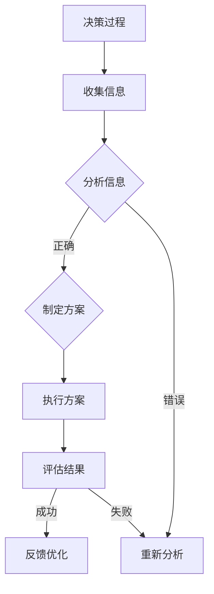
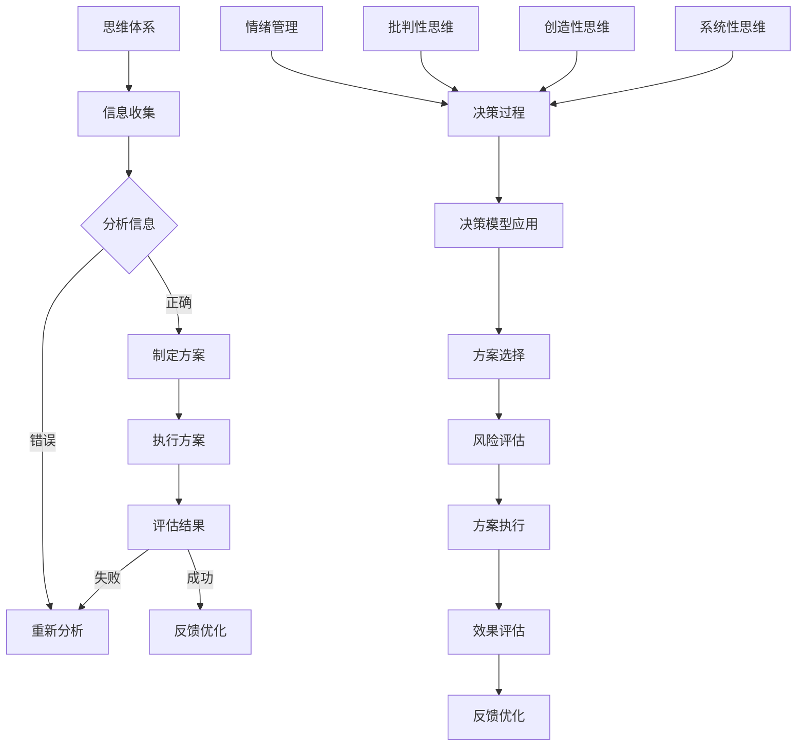

                 

### 文章标题

《思维体系与管理者决策的关系》

> 关键词：思维体系、管理者、决策、思维模型、心理学基础、案例分析、决策能力提升

> 摘要：本文旨在探讨思维体系与管理者决策之间的关系，通过深入分析思维体系的构成、决策过程中的思维体系作用、决策思维模型以及心理学基础，结合经典和新兴行业案例，解析思维体系如何影响管理者决策的质量和效果。最后，本文将提出提升管理者决策能力的策略和方法，为管理者在复杂决策环境中提供理论支持和实践指导。

### 《思维体系与管理者决策的关系》目录大纲

#### 第一部分：思维体系的基础知识

##### 第1章：思维体系概述
- 1.1 什么是思维体系
- 1.2 思维体系的构成
- 1.3 思维体系的基本特征

##### 第2章：决策与思维体系
- 2.1 决策的定义与分类
- 2.2 决策过程中的思维体系作用
- 2.3 思维体系对决策质量的影响

##### 第3章：决策思维模型
- 3.1 决策过程中的思维模型
- 3.2 常见的决策思维模型
- 3.3 思维模型的选择与应用

##### 第4章：思维体系的心理学基础
- 4.1 知觉与思维
- 4.2 认知偏见与决策
- 4.3 情绪与决策

#### 第二部分：管理者决策案例分析

##### 第5章：经典案例解析
- 5.1 案例一：苹果公司的创新决策
- 5.2 案例二：亚马逊的电商战略决策
- 5.3 案例三：微软的转型决策

##### 第6章：新兴行业决策案例
- 6.1 案例一：新能源汽车行业的战略决策
- 6.2 案例二：人工智能行业的创新决策
- 6.3 案例三：电子商务平台的运营决策

##### 第7章：跨国公司决策案例分析
- 7.1 案例一：苹果公司在欧洲的扩张决策
- 7.2 案例二：华为在全球市场的布局决策
- 7.3 案例三：阿里巴巴的国际化决策

#### 第三部分：提升管理者决策能力

##### 第8章：思维体系训练方法
- 8.1 决策思维训练的重要性
- 8.2 常见的决策思维训练方法
- 8.3 决策思维训练的实施策略

##### 第9章：决策工具与模型应用
- 9.1 决策支持系统的构建
- 9.2 数据分析在决策中的应用
- 9.3 决策模型的实际应用案例

##### 第10章：管理者决策能力提升策略
- 10.1 决策能力的评估与提升
- 10.2 决策能力提升的方法与技巧
- 10.3 决策能力提升的实践案例

#### 附录

##### 附录A：思维体系与管理者决策的关系 Mermaid 流程图
- **思维体系与管理者决策流程**



##### 附录B：核心算法原理讲解（伪代码）
- **决策树算法伪代码**

```python
算法 DecisionTree算法(数据集D)
输入：数据集D
输出：决策树T

T = 创建空树
for 每个特征A in 数据集D的特征列表
    for 每个可能的划分V in A的可能划分
        子集D' = 划分数据集D by V
        如果 D' 为空
            T[A] = 新叶节点
        否则
            T[A] = 划分D' by 最佳划分标准
            T[A].特征 = A
            T[A].划分 = V
            T[A].子节点 = DecisionTree算法(D')
return T
```

##### 附录C：数学模型与公式讲解

- **线性回归模型**

$$
y = \beta_0 + \beta_1x_1 + \beta_2x_2 + ... + \beta_nx_n + \epsilon
$$

- **决策树模型**

$$
f(x) = g(\theta_0, \theta_1, ..., \theta_n)
$$

##### 附录D：项目实战与代码解读
- **实际案例：电商平台用户行为预测**
- **开发环境搭建：Python 3.8, Scikit-learn 0.22.2**
- **源代码实现：**
    ```python
    # Python 代码实现略
    ```
- **代码解读与分析：**（略）

#### 第一部分：思维体系的基础知识

##### 第1章：思维体系概述

> **1.1 什么是思维体系**

思维体系是关于人类思维过程和机制的理论体系，它涵盖了从知觉、记忆、推理到问题解决和创造性思维的各个方面。思维体系不仅仅是一个学术概念，它对我们的日常生活、学习和工作都有着深远的影响。对于管理者来说，思维体系更是其决策过程中不可或缺的一部分。

首先，思维体系是一种结构化的思维模式，它帮助个体组织和处理信息。在复杂的环境中，管理者需要能够快速收集和分析大量的信息，并从中找到决策的依据。思维体系通过一系列的逻辑思维步骤，帮助管理者在纷繁复杂的信息中找到清晰的脉络，从而做出更为合理的决策。

其次，思维体系是一种认知工具，它帮助管理者进行抽象思维和概念构建。在决策过程中，管理者需要理解并预测市场的变化、分析竞争态势、评估潜在风险等。这些活动都需要依靠思维体系提供的概念框架和逻辑结构。

最后，思维体系是一种思维方式的培养，它强调系统性和批判性思维。在快速变化的市场环境中，管理者需要具备灵活的思维方式，能够快速适应新情况、发现新机会。思维体系通过培养批判性思维和系统性思维，帮助管理者在面对不确定性时，能够更加冷静和理性地分析问题，做出更为明智的决策。

> **1.2 思维体系的构成**

思维体系主要由以下几个部分构成：

1. **知觉系统**：知觉系统是指个体对外部信息的感知和识别过程。它包括视觉、听觉、触觉等多个感官系统，通过这些感官，个体能够获取外部世界的信息。

2. **记忆系统**：记忆系统是指个体对已获取信息的存储、保持和提取过程。记忆系统包括短期记忆和长期记忆，短期记忆负责临时存储和处理信息，长期记忆则负责长期保存信息。

3. **推理系统**：推理系统是指个体利用已有信息和逻辑规则进行推理和判断的过程。推理系统包括归纳推理和演绎推理，归纳推理是从具体实例中概括出一般性结论，演绎推理则是从一般性原则推导出具体结论。

4. **问题解决系统**：问题解决系统是指个体在面对问题时，利用思维体系和已有知识进行问题分析和解决的过程。问题解决系统包括问题的识别、定义、分析和解决等多个阶段。

5. **创造性思维系统**：创造性思维系统是指个体在思维过程中，通过创新思维和创造性思维方法，产生新观点和新想法的能力。创造性思维系统是管理者在决策过程中发现新机会、创造新价值的重要工具。

> **1.3 思维体系的基本特征**

思维体系具有以下几个基本特征：

1. **系统性**：思维体系是一个完整的系统，各个组成部分相互作用、相互依赖，共同完成思维过程。例如，知觉系统获取信息，记忆系统存储信息，推理系统处理信息，问题解决系统解决问题，这些部分共同构成了一个完整的思维体系。

2. **灵活性**：思维体系具有灵活性，能够根据不同的环境和情境，调整和优化思维过程。例如，在决策过程中，管理者需要根据市场变化和竞争态势，灵活调整决策策略，以应对不确定性。

3. **批判性**：思维体系强调批判性思维，鼓励个体对已有观点和结论进行质疑和验证，避免盲目接受和迷信权威。批判性思维有助于管理者在决策过程中，更加理性和客观地分析问题，减少决策失误。

4. **创造性**：思维体系鼓励创造性思维，鼓励个体在面对问题时，能够产生新的观点和解决方案。创造性思维是管理者在决策过程中发现新机会、创造新价值的重要工具。

5. **适应性**：思维体系具有适应性，能够根据环境和情境的变化，进行调整和优化。例如，在全球化背景下，管理者需要适应不同国家和地区的市场特点，调整和优化决策策略。

通过本章的讨论，我们可以看到思维体系在管理者决策过程中的重要性。思维体系不仅为管理者提供了结构化的思维模式，还帮助管理者进行抽象思维和概念构建，培养批判性思维和系统性思维，提高创造性思维能力。在接下来的章节中，我们将进一步探讨决策与思维体系的关系，以及决策过程中的思维模型和心理学基础。

##### 第2章：决策与思维体系

> **2.1 决策的定义与分类**

决策是管理者在复杂多变的环境中，根据已有信息和目标，选择最佳行动方案的过程。决策是管理活动中的重要组成部分，贯穿于组织的各个方面。从广义上讲，决策包括两个主要方面：一是确定组织的目标和任务，二是为实现这些目标和任务，选择合适的行动方案。

根据不同的分类标准，决策可以划分为多种类型。以下是几种常见的决策分类方法：

1. **根据决策目标的不同**，决策可以分为战略性决策和操作性决策。战略性决策通常涉及组织的长远发展，如市场拓展、产品研发、企业并购等。操作性决策则主要关注日常运营中的具体问题，如生产调度、库存管理、人力资源配置等。

2. **根据决策问题的性质**，决策可以分为结构化决策和非结构化决策。结构化决策通常指那些可以通过公式化、标准化的方法解决的问题，如线性规划、库存控制等。非结构化决策则通常涉及复杂的问题，如市场预测、风险管理等，这些问题往往没有固定的解决方案，需要管理者进行创新性思考。

3. **根据决策问题的复杂程度**，决策可以分为简单决策和复杂决策。简单决策通常涉及较少的因素和变量，可以通过简单的逻辑推理得出结论。复杂决策则通常涉及多个因素和变量，需要管理者进行深入的分析和评估。

4. **根据决策者的信息处理能力**，决策可以分为理性决策和经验决策。理性决策是指管理者根据完整的信息，通过逻辑推理和优化方法，做出最佳决策。经验决策则是指管理者依靠个人经验和直觉，做出决策。

> **2.2 决策过程中的思维体系作用**

在决策过程中，思维体系发挥着关键作用。思维体系不仅为管理者提供了一套系统化的思维方式，还帮助管理者在复杂环境中做出合理的决策。以下是思维体系在决策过程中的几个重要作用：

1. **信息处理能力**：思维体系帮助管理者对大量信息进行有效的收集、处理和分析。通过逻辑推理和抽象思维，管理者能够从复杂的信息中提取出关键信息，并对其进行深入分析，从而为决策提供依据。

2. **问题识别与定义**：思维体系帮助管理者识别和定义问题。在决策过程中，管理者需要首先明确问题的性质和范围，才能有针对性地进行分析和解决。思维体系提供的结构性思维模式，有助于管理者快速识别和定义问题，从而为后续的决策过程奠定基础。

3. **目标设定**：思维体系帮助管理者设定合理的目标。在决策过程中，管理者需要根据组织的使命和愿景，设定具体、可行的目标。思维体系通过系统性和批判性思维，帮助管理者明确目标，并确保目标的合理性和可行性。

4. **方案选择**：思维体系帮助管理者选择最佳的行动方案。在决策过程中，管理者需要从多个备选方案中，选择一个最佳方案。思维体系通过评估方案的优势和劣势，帮助管理者做出明智的选择。

5. **风险评估**：思维体系帮助管理者评估决策的风险。在决策过程中，管理者需要考虑决策可能带来的风险和不确定性。思维体系通过系统性和批判性思维，帮助管理者全面评估风险，并制定相应的应对策略。

6. **决策执行**：思维体系帮助管理者执行决策。在决策过程中，执行是关键环节。思维体系通过规划和组织，帮助管理者确保决策的顺利执行。

7. **决策评估与反馈**：思维体系帮助管理者对决策进行评估和反馈。在决策过程中，管理者需要不断评估决策的效果，并根据实际情况进行调整和优化。思维体系通过评估和反馈，帮助管理者不断改进决策过程，提高决策质量。

> **2.3 思维体系对决策质量的影响**

思维体系对决策质量具有重要影响。以下是思维体系对决策质量的几个主要影响方面：

1. **决策的准确性**：思维体系帮助管理者提高决策的准确性。通过系统性和批判性思维，管理者能够更全面地分析问题，识别潜在风险，从而做出更准确、更可靠的决策。

2. **决策的效率**：思维体系帮助管理者提高决策的效率。通过逻辑推理和抽象思维，管理者能够快速处理信息，识别关键问题，并选择最佳方案，从而加快决策过程，提高决策效率。

3. **决策的创造性**：思维体系帮助管理者提高决策的创造性。通过创造性思维，管理者能够发现新的问题和解决方案，从而在竞争激烈的市场环境中，获得竞争优势。

4. **决策的适应性**：思维体系帮助管理者提高决策的适应性。通过灵活性和批判性思维，管理者能够快速适应环境变化，调整决策策略，从而在动态变化的市场中，保持竞争力。

5. **决策的风险评估能力**：思维体系帮助管理者提高风险评估能力。通过系统性和批判性思维，管理者能够全面评估决策的风险，并制定相应的应对策略，从而降低决策风险。

6. **决策的执行能力**：思维体系帮助管理者提高执行能力。通过规划和组织，管理者能够确保决策的顺利执行，从而实现决策目标。

7. **决策的持续改进能力**：思维体系帮助管理者提高持续改进能力。通过评估和反馈，管理者能够不断优化决策过程，提高决策质量，从而实现组织的持续发展。

综上所述，思维体系在决策过程中发挥着重要作用，不仅有助于管理者提高决策的准确性、效率、创造性和适应性，还能提升决策的风险评估能力、执行能力和持续改进能力。通过培养和运用思维体系，管理者能够在复杂多变的市场环境中，做出更为明智、合理的决策，实现组织的长期发展。

#### 第3章：决策思维模型

> **3.1 决策过程中的思维模型**

在决策过程中，思维模型是一种有效的工具，它帮助管理者组织和分析信息，从而做出合理的决策。决策思维模型是关于如何进行决策的理论框架，它通过特定的结构和方法，指导管理者在复杂和不确定的环境中做出决策。

首先，我们需要理解决策思维模型的定义。决策思维模型是一种系统化的决策过程，它包括一系列步骤和方法，用于收集、分析和处理信息，以帮助管理者做出最佳决策。这些模型通常基于逻辑推理、心理学和行为经济学等学科的理论，旨在提高决策的理性性和有效性。

其次，决策思维模型的作用主要体现在以下几个方面：

1. **结构化思维**：决策思维模型提供了一种系统化的思维方式，帮助管理者在复杂的决策过程中，保持清晰的逻辑和条理性。通过结构化的步骤和方法，管理者能够更好地组织信息，减少信息过载和认知偏差。

2. **优化决策过程**：决策思维模型通过明确的步骤和流程，优化了决策过程。管理者可以根据模型的指导，逐步进行信息收集、分析、评估和选择，从而减少决策的时间和成本。

3. **提高决策质量**：决策思维模型通过引导管理者进行全面、深入的分析，提高决策的质量。模型提供了不同的视角和方法，帮助管理者识别和评估各种潜在的影响因素，从而做出更为准确和可靠的决策。

4. **增强决策适应性**：决策思维模型强调灵活性和适应性，帮助管理者在动态变化的环境中，快速调整和优化决策策略。通过模型，管理者能够更好地应对不确定性和风险，提高决策的适应性。

接下来，我们探讨常见的决策思维模型，包括理性决策模型、行为决策模型和混合决策模型。

> **3.2 常见的决策思维模型**

1. **理性决策模型**

理性决策模型是决策思维模型中最经典的一种，它基于经济学中的理性人假设，认为决策者是完全理性、信息完备的。理性决策模型包括以下几个主要步骤：

- **问题定义**：明确决策目标和问题范围，确保决策者对问题的理解一致。

- **信息收集**：收集与决策相关的所有信息，包括数据、事实、假设和预期结果。

- **方案生成**：基于收集的信息，生成所有可能的备选方案。

- **方案评估**：使用特定的评估标准，对每个备选方案进行评估，包括成本、风险、收益等。

- **方案选择**：根据评估结果，选择最佳方案。

- **方案实施**：制定详细的实施计划，确保方案能够顺利执行。

理性决策模型的优点是逻辑严谨、结果可靠，但缺点是它依赖于完全信息和理性判断，这在实际情况中往往难以实现。

2. **行为决策模型**

行为决策模型是基于心理学和行为经济学的理论，它认为决策者在实际决策过程中，会受到多种认知偏差和情感因素的影响。行为决策模型包括以下几个主要步骤：

- **问题定义**：与理性决策模型相同，明确决策目标和问题范围。

- **信息收集**：与理性决策模型相似，但更强调信息的获取和解读过程，考虑到认知偏差的影响。

- **方案生成**：生成所有可能的备选方案，但更注重创意和想象力，以克服认知限制。

- **方案评估**：使用基于行为的评估标准，考虑到情感、认知偏差和风险偏好。

- **方案选择**：根据行为决策的特点，选择符合决策者个人偏好和情感状态的方案。

- **方案实施**：通过调整和优化，确保方案能够适应实际情况。

行为决策模型的优点是更贴近实际，能够更好地反映人类决策的特点，但缺点是它容易受到情感和认知偏差的影响，可能导致决策失误。

3. **混合决策模型**

混合决策模型结合了理性决策模型和行为决策模型的优势，试图在理性和行为之间取得平衡。混合决策模型的主要步骤如下：

- **问题定义**：明确决策目标和问题范围。

- **信息收集**：综合使用理性和行为方法，确保信息的全面性和准确性。

- **方案生成**：结合理性分析和行为创意，生成备选方案。

- **方案评估**：使用理性和行为评估标准，进行多维度评估。

- **方案选择**：根据评估结果，选择符合理性分析和行为特征的方案。

- **方案实施**：通过调整和优化，确保方案能够顺利执行。

混合决策模型的优点是它能够兼顾理性和行为，提高决策的适应性和有效性，但缺点是它的实施相对复杂，需要管理者具备较高的综合素质。

> **3.3 思维模型的选择与应用**

在选择和应用决策思维模型时，管理者需要考虑以下几个因素：

1. **决策问题的性质**：对于结构化问题，可以选择理性决策模型，因为它提供了一种系统化的解决方案。对于非结构化问题，可以选择行为决策模型，因为它更强调创新和适应性。

2. **决策环境的不确定性**：在不确定性较高的环境中，行为决策模型可能更为适用，因为它考虑了人类认知偏差和情感因素的影响。在确定性较高的环境中，理性决策模型可能更为有效。

3. **管理者的能力与偏好**：管理者的个人能力和决策偏好会影响决策思维模型的选择。对于逻辑思维能力强、偏好理性分析的管理者，理性决策模型可能更为合适。对于创新能力强、偏好灵活应对的管理者，行为决策模型可能更为适用。

4. **组织文化**：组织文化也会影响决策思维模型的选择。在一些重视创新和变革的组织中，行为决策模型可能更为受欢迎。而在一些强调稳定和规范的组织中，理性决策模型可能更为适用。

总之，选择和应用决策思维模型是一个动态和灵活的过程，管理者需要根据实际情况，灵活调整和优化决策思维模型，以提高决策质量和效果。

通过本章的讨论，我们可以看到决策思维模型在决策过程中的重要性。理性决策模型、行为决策模型和混合决策模型分别提供了不同的决策思路和方法，管理者可以根据实际情况选择和运用这些模型，以应对复杂多变的决策环境。

#### 第4章：思维体系的心理学基础

> **4.1 知觉与思维**

知觉与思维是心理学中两个重要的概念，它们在决策过程中起着关键作用。首先，我们需要理解知觉的定义。知觉是指个体通过感官接收外部信息，并将其转化为有意义的内在心理表征的过程。在决策过程中，知觉帮助我们识别和解释信息，从而为后续的决策提供依据。

知觉的几个关键特性包括：

1. **选择性**：个体在接收大量信息时，会选择对其有重要意义的信息进行加工，而忽略其他无关信息。这种选择性受到个体兴趣、动机和以往经验的影响。

2. **整体性**：个体在知觉过程中，会将分散的局部信息整合为一个整体。例如，当我们看到一幅图画时，我们会将各个部分整合成一幅完整的画面。

3. **恒常性**：个体在知觉过程中，能够保持对物体大小、形状、颜色等特性的恒常感知，即使这些特性在接收过程中发生了变化。例如，无论我们离物体多远，我们都能感知到它的大小。

接下来，我们探讨思维的定义。思维是指个体在知觉的基础上，对信息进行加工、分析和推理的过程。思维不仅包括逻辑推理，还包括创造性思维、批判性思维等。在决策过程中，思维帮助我们分析信息、评估选项、预测结果，从而做出合理的选择。

思维的几个关键特性包括：

1. **逻辑性**：思维强调逻辑性和系统性。在决策过程中，管理者需要使用逻辑推理来分析信息，评估选项，确保决策的合理性。

2. **抽象性**：思维能够将具体的信息抽象为概念和模型。这种抽象性有助于管理者从复杂的实际情境中提取关键信息，形成决策的基础。

3. **灵活性**：思维具有灵活性，能够根据环境和情境的变化，进行调整和优化。在决策过程中，管理者需要灵活应对各种不确定性，不断调整决策策略。

知觉与思维之间的联系在于，知觉是思维的基础，而思维是对知觉信息的深层次加工。在决策过程中，管理者首先通过知觉接收信息，然后运用思维对这些信息进行分析和推理，从而做出决策。以下是知觉与思维在决策过程中的具体联系：

1. **信息收集**：管理者通过知觉接收外部信息，如市场动态、竞争态势、客户需求等。这些信息成为决策的基础。

2. **信息处理**：管理者运用思维对收集到的信息进行加工，通过逻辑推理、抽象思维等方法，分析信息之间的关联，识别关键信息。

3. **信息评估**：管理者通过思维评估信息的可靠性和重要性，对备选方案进行评估，确定最佳方案。

4. **信息整合**：管理者通过知觉和思维的结合，将分散的信息整合为一个整体，形成对问题的全面理解。

5. **决策制定**：管理者根据对信息的分析和评估，运用思维制定具体的决策方案，并制定实施计划。

总之，知觉与思维在决策过程中相互联系、相互作用。知觉帮助我们接收和处理外部信息，而思维则是对这些信息进行深层次加工和推理。通过结合知觉和思维，管理者能够做出合理、明智的决策，应对复杂多变的环境。

> **4.2 认知偏见与决策**

认知偏见是指个体在感知、理解和处理信息时，由于心理和情感因素的影响，导致信息加工出现偏差。认知偏见在决策过程中普遍存在，对决策质量产生显著影响。以下是几种常见的认知偏见及其对决策的影响：

1. **确认偏见（Confirmation Bias）**：
确认偏见是指个体倾向于关注和记住那些支持自己已有观点或信念的信息，而忽视或忘记那些与之相矛盾的信息。在决策过程中，确认偏见可能导致管理者过度依赖已有的信息，忽视新的、可能更有价值的信息。这会限制决策的全面性和客观性，降低决策的质量。

2. **代表性偏见（Representativeness Bias）**：
代表性偏见是指个体在评估概率时，更关注事件的外观和典型性，而忽视实际概率。例如，在评估一个新产品的市场前景时，管理者可能会因为新产品与市场上已有产品相似，而错误地认为其市场前景与已有产品类似。这种偏见可能导致管理者忽视市场变化和潜在的风险。

3. **可用性偏见（Availability Bias）**：
可用性偏见是指个体在评估信息重要性时，更关注容易回忆起来的信息，而忽视那些虽然重要但不易回忆的信息。在决策过程中，可用性偏见可能导致管理者依赖短期记忆中的信息，而忽视长期趋势和潜在影响。这会限制决策的远见性和全面性。

4. **锚定效应（Anchoring Effect）**：
锚定效应是指个体在评估信息时，会受到初始信息（锚点）的影响，即使这些初始信息并不准确。在决策过程中，锚定效应可能导致管理者在评估备选方案时，过度依赖某个初始信息，从而影响评估的客观性和准确性。

5. **过度自信（Overconfidence）**：
过度自信是指个体对自己的知识和能力过于自信，认为自己能够预测未来的变化。在决策过程中，过度自信可能导致管理者低估风险和不确定性，从而做出过于乐观的决策。

6. **情感偏见（Emotional Bias）**：
情感偏见是指个体的情绪状态会影响其决策过程。例如，管理者在高兴时可能会做出过于冒险的决策，而在沮丧时可能会做出过于保守的决策。情感偏见可能导致决策的非理性和情绪化，降低决策的质量。

认知偏见对决策质量的影响主要体现在以下几个方面：

1. **决策偏差**：认知偏见可能导致决策者对信息的加工和评估出现偏差，从而做出错误的决策。

2. **决策风险**：认知偏见可能导致决策者低估决策的风险，增加决策失败的可能性。

3. **决策效率**：认知偏见可能导致决策者花费大量时间在错误的信息上，降低决策效率。

4. **决策创新性**：认知偏见可能限制决策者的思维，减少创新的决策方案。

为了减少认知偏见对决策质量的影响，管理者可以采取以下策略：

1. **多元化信息来源**：确保收集到全面、多样化的信息，减少确认偏见和代表性偏见。

2. **系统化评估方法**：使用系统化的评估方法，如成本效益分析、风险评估等，减少情感偏见和过度自信。

3. **跨部门协作**：通过跨部门协作，引入不同的观点和视角，减少可用性偏见。

4. **定期反思与调整**：定期反思和调整决策过程，确保决策的灵活性和适应性。

5. **情绪管理**：培养良好的情绪管理能力，减少情绪对决策的影响。

总之，认知偏见在决策过程中普遍存在，对决策质量产生显著影响。管理者需要识别和克服认知偏见，通过多元化的信息来源、系统化的评估方法、跨部门协作和情绪管理，提高决策的准确性和有效性。

> **4.3 情绪与决策**

情绪与决策之间存在着复杂的互动关系。情绪是指个体在特定情境下产生的心理状态，它可以通过感知、认知和行为三个方面影响决策过程。理解情绪在决策中的作用，对于管理者在复杂环境下做出合理决策具有重要意义。

首先，情绪对决策过程中的认知加工具有显著影响。积极情绪可以促进创新思维和灵活性，而消极情绪则可能导致决策者过于关注潜在风险，降低决策的灵活性和创造性。具体来说：

1. **积极情绪**：积极情绪如喜悦、兴奋和满足感可以促进决策者的创造力。在积极情绪下，决策者可能更加开放、乐观，倾向于探索新的解决方案，从而提高决策的创造性和适应性。

2. **消极情绪**：消极情绪如焦虑、恐惧和沮丧可能导致决策者过度关注风险，减少冒险行为。在消极情绪下，决策者可能会更加保守，依赖现有的信息和经验，减少创新的决策方案。

其次，情绪对决策过程中的信息处理和评估具有显著影响。情绪状态可以影响决策者对信息的感知、理解和评估。具体来说：

1. **情绪放大效应**：情绪放大效应是指个体在情绪强烈时，对信息的感知和评估也会随之放大。例如，在兴奋的情绪状态下，决策者可能会高估成功的可能性，而在沮丧的情绪状态下，可能会低估成功的可能性。

2. **情绪偏见**：情绪偏见是指个体的情绪状态会影响其决策过程中的判断和评估。例如，在愤怒的情绪状态下，决策者可能会过度关注潜在的威胁，从而做出过于保守的决策。

此外，情绪还通过行为动机影响决策过程。情绪状态可以激发个体特定的行为动机，影响决策的选择和执行。具体来说：

1. **情绪动机**：情绪状态可以激发特定的行为动机，如追求成功、避免失败、寻求安全等。这些动机可以影响决策者的选择，使其在特定情境下更倾向于某些决策方案。

2. **情绪调节**：情绪调节是指个体在决策过程中，通过自我调节情绪状态，以优化决策过程。例如，决策者可以通过深呼吸、冥想等方法，缓解焦虑和压力，提高决策的理性性和客观性。

为了在决策过程中更好地利用情绪的积极影响，管理者可以采取以下策略：

1. **情绪识别与调节**：管理者应学会识别和调节自己的情绪状态，避免情绪过度波动对决策的负面影响。例如，通过情绪日记、冥想等方法，管理者可以更好地了解自己的情绪变化，从而在决策过程中保持冷静和理性。

2. **情绪共享与反馈**：管理者可以通过与团队成员分享情绪体验，获得反馈和建议，从而优化决策过程。例如，在团队讨论中，管理者可以分享自己的情绪感受，听取团队成员的意见，共同探讨解决方案。

3. **情绪教育与培训**：管理者可以通过情绪教育与培训，提高团队成员对情绪的认知和调节能力。例如，通过情绪管理课程、心理辅导等，管理者可以帮助团队成员更好地理解和调节自己的情绪，提高决策的质量。

4. **情绪激励与鼓励**：管理者可以运用积极的情绪激励策略，鼓励团队成员在决策过程中保持积极态度。例如，通过表扬、奖励等手段，管理者可以激发团队成员的积极情绪，提高决策的创造性和灵活性。

总之，情绪与决策之间存在密切的联系，管理者需要了解和利用情绪的积极影响，同时识别和克服情绪的负面影响，以做出更为合理和有效的决策。通过情绪识别与调节、情绪共享与反馈、情绪教育与培训和情绪激励与鼓励，管理者可以优化决策过程，提高决策质量。

#### 第二部分：管理者决策案例分析

##### 第5章：经典案例解析

在本章节中，我们将通过经典案例深入探讨管理者如何在实际决策中运用思维体系和相关模型，从而实现组织的目标和战略。

##### 5.1 案例一：苹果公司的创新决策

苹果公司作为全球领先的科技公司，其成功离不开一系列卓越的决策。其中，最具代表性的莫过于乔布斯回归苹果后，推出的iPod和iPhone。这两个产品不仅改变了消费者的生活方式，也为苹果公司带来了巨大的商业成功。

**决策过程解析：**

1. **问题识别**：苹果公司面临的问题是如何在竞争激烈的市场中保持领先地位，同时满足消费者对创新和优质体验的需求。

2. **信息收集**：苹果公司通过市场调研、用户反馈和技术趋势分析，收集了大量关于消费者需求、技术发展和竞争对手信息。

3. **方案生成**：基于收集到的信息，苹果公司提出了多个创新产品方案，包括iPod、iPhone等。

4. **方案评估**：苹果公司对每个方案进行了详细的评估，包括技术可行性、市场潜力、成本效益和风险分析。

5. **方案选择**：最终，苹果公司选择了iPod和iPhone作为最佳方案，并投入大量资源进行开发和推广。

6. **方案实施**：在方案实施阶段，苹果公司通过精细化管理，确保产品研发和推广的顺利进行。

7. **决策评估与反馈**：苹果公司持续评估iPod和iPhone的市场表现，并根据反馈不断优化产品，确保持续创新和市场份额。

**思维模型应用：**

- **理性决策模型**：苹果公司在决策过程中，采用了理性决策模型。通过系统化的信息收集、方案评估和风险分析，确保决策的合理性和科学性。

- **行为决策模型**：苹果公司也运用了行为决策模型，通过用户反馈和市场调研，了解消费者的真实需求和偏好，从而做出更加贴近市场的决策。

**案例启示：**

苹果公司的成功案例表明，管理者在决策过程中需要综合运用理性决策和行为决策模型，确保决策的科学性和市场适应性。同时，持续的市场调研和用户反馈是优化决策的重要手段，有助于提高决策的准确性和效果。

##### 5.2 案例二：亚马逊的电商战略决策

亚马逊作为全球最大的电商平台之一，其成功离不开一系列明智的战略决策。以下是亚马逊在电商战略决策方面的几个关键案例。

**决策过程解析：**

1. **问题识别**：亚马逊面临的问题是如何在激烈的市场竞争中保持领先地位，同时实现业务的快速扩张。

2. **信息收集**：亚马逊通过市场调研、数据分析和技术评估，收集了大量关于市场趋势、竞争对手和消费者行为的信息。

3. **方案生成**：基于收集到的信息，亚马逊提出了多个战略方案，包括扩展产品线、提高物流效率、创新支付方式等。

4. **方案评估**：亚马逊对每个方案进行了详细的评估，包括市场潜力、成本效益、风险分析和竞争态势。

5. **方案选择**：亚马逊最终选择了多个战略方案，并进行了资源分配和优先级排序。

6. **方案实施**：亚马逊通过精细化的管理，确保战略方案的实施和执行。

7. **决策评估与反馈**：亚马逊持续评估战略方案的效果，并根据市场反馈和业务表现进行调整和优化。

**思维模型应用：**

- **理性决策模型**：亚马逊在战略决策过程中，广泛采用了理性决策模型。通过系统化的信息收集、评估和选择，确保决策的合理性和科学性。

- **混合决策模型**：亚马逊也运用了混合决策模型，结合理性决策和行为决策，以应对复杂和不确定的市场环境。

**案例启示：**

亚马逊的成功案例表明，管理者在制定电商战略时，需要综合考虑市场趋势、竞争对手和消费者需求，采用系统化的决策模型。同时，持续的市场调研和数据分析是优化战略决策的重要手段，有助于实现业务的快速扩张和持续创新。

##### 5.3 案例三：微软的转型决策

微软作为全球知名的科技公司，其成功不仅依赖于早期的操作系统业务，还在于其成功的转型决策。以下是微软在转型决策方面的几个关键案例。

**决策过程解析：**

1. **问题识别**：微软面临的问题是如何在竞争激烈的技术市场中保持领先地位，同时实现业务的多元化。

2. **信息收集**：微软通过市场调研、技术趋势分析和竞争对手分析，收集了大量关于市场机会、技术发展和业务转型方向的信息。

3. **方案生成**：基于收集到的信息，微软提出了多个转型方案，包括云计算、人工智能、物联网等。

4. **方案评估**：微软对每个方案进行了详细的评估，包括技术可行性、市场潜力、成本效益和风险分析。

5. **方案选择**：微软最终选择了云计算作为主要转型方向，并制定了详细的实施计划。

6. **方案实施**：微软通过组织架构调整、技术研发和资源投入，确保云计算战略的实施和执行。

7. **决策评估与反馈**：微软持续评估云计算战略的效果，并根据市场反馈和业务表现进行调整和优化。

**思维模型应用：**

- **理性决策模型**：微软在转型决策过程中，广泛采用了理性决策模型。通过系统化的信息收集、评估和选择，确保决策的合理性和科学性。

- **混合决策模型**：微软也运用了混合决策模型，结合理性决策和行为决策，以应对复杂和不确定的市场环境。

**案例启示：**

微软的成功案例表明，管理者在面对技术市场变革时，需要具备前瞻性和敏感性，及时调整战略方向。同时，采用系统化的决策模型，结合理性决策和行为决策，有助于在复杂的市场环境中做出明智的决策。

通过上述经典案例的解析，我们可以看到，管理者在实际决策过程中，如何运用思维体系和相关模型，实现组织的目标和战略。这些案例不仅提供了具体的决策实践，还为管理者在复杂环境中做出明智决策提供了有益的启示。

#### 第6章：新兴行业决策案例

在本章节中，我们将探讨新兴行业中管理者如何运用思维体系和决策模型，实现组织的战略目标。以下是几个典型的案例：

##### 6.1 案例一：新能源汽车行业的战略决策

随着全球对环保和可持续发展的重视，新能源汽车行业迅速崛起。特斯拉作为这一领域的领军企业，其战略决策对于行业发展和竞争态势具有重要影响。

**决策过程解析：**

1. **问题识别**：特斯拉面临的问题是如何在竞争激烈的新能源汽车市场中保持领先地位，同时推动技术创新和成本降低。

2. **信息收集**：特斯拉通过市场调研、技术分析和竞争对手分析，收集了大量关于市场趋势、消费者需求和技术发展方向的信息。

3. **方案生成**：基于收集到的信息，特斯拉提出了多个战略方案，包括扩大产能、提高电池技术、拓展充电网络等。

4. **方案评估**：特斯拉对每个方案进行了详细的评估，包括市场潜力、成本效益、技术可行性和竞争态势。

5. **方案选择**：特斯拉最终选择了扩大产能和提高电池技术作为主要战略方向，并制定了详细的实施计划。

6. **方案实施**：特斯拉通过增加生产设施、研发投入和战略合作，确保战略方案的实施和执行。

7. **决策评估与反馈**：特斯拉持续评估战略方案的效果，并根据市场反馈和业务表现进行调整和优化。

**思维模型应用：**

- **理性决策模型**：特斯拉在战略决策过程中，广泛采用了理性决策模型。通过系统化的信息收集、评估和选择，确保决策的合理性和科学性。

- **混合决策模型**：特斯拉也运用了混合决策模型，结合理性决策和行为决策，以应对复杂和不确定的市场环境。

**案例启示：**

特斯拉的成功案例表明，在新兴行业中，管理者需要具备前瞻性，及时捕捉市场趋势和消费者需求。通过系统化的决策模型，结合理性决策和行为决策，有助于在竞争激烈的市场中保持领先地位。

##### 6.2 案例二：人工智能行业的创新决策

人工智能作为最具潜力的新兴行业之一，其快速发展对各行各业产生了深远影响。谷歌作为人工智能领域的领先企业，其创新决策对于行业发展和技术突破具有重要意义。

**决策过程解析：**

1. **问题识别**：谷歌面临的问题是如何在人工智能领域中保持领先地位，同时推动技术创新和应用。

2. **信息收集**：谷歌通过技术研发、市场调研和合作伙伴分析，收集了大量关于技术趋势、市场机会和竞争对手的信息。

3. **方案生成**：基于收集到的信息，谷歌提出了多个创新方案，包括人工智能算法优化、应用场景拓展、数据安全等。

4. **方案评估**：谷歌对每个方案进行了详细的评估，包括技术可行性、市场潜力、成本效益和风险分析。

5. **方案选择**：谷歌最终选择了人工智能算法优化和应用场景拓展作为主要创新方向，并制定了详细的实施计划。

6. **方案实施**：谷歌通过加大研发投入、拓展应用场景和建立合作伙伴关系，确保创新方案的实施和执行。

7. **决策评估与反馈**：谷歌持续评估创新方案的效果，并根据市场反馈和业务表现进行调整和优化。

**思维模型应用：**

- **理性决策模型**：谷歌在创新决策过程中，广泛采用了理性决策模型。通过系统化的信息收集、评估和选择，确保决策的合理性和科学性。

- **行为决策模型**：谷歌也运用了行为决策模型，通过市场调研和用户反馈，了解消费者需求和偏好，从而做出更加贴近市场的创新决策。

**案例启示：**

谷歌的成功案例表明，在新兴行业中，管理者需要不断关注技术趋势和市场需求，通过系统化的决策模型，结合理性决策和行为决策，推动技术创新和应用。

##### 6.3 案例三：电子商务平台的运营决策

电子商务平台作为新兴行业的代表，其运营决策对于平台发展和用户满意度具有重要影响。阿里巴巴作为全球领先的电子商务平台，其运营决策为行业提供了宝贵的经验。

**决策过程解析：**

1. **问题识别**：阿里巴巴面临的问题是如何在激烈的市场竞争中保持领先地位，同时提升用户满意度和平台效益。

2. **信息收集**：阿里巴巴通过用户反馈、数据分析和市场调研，收集了大量关于用户需求、市场趋势和竞争对手的信息。

3. **方案生成**：基于收集到的信息，阿里巴巴提出了多个运营方案，包括用户界面优化、物流升级、支付方式创新等。

4. **方案评估**：阿里巴巴对每个方案进行了详细的评估，包括用户体验、成本效益、技术可行性和市场潜力。

5. **方案选择**：阿里巴巴最终选择了用户界面优化和物流升级作为主要运营方向，并制定了详细的实施计划。

6. **方案实施**：阿里巴巴通过技术升级、资源投入和合作伙伴关系，确保运营方案的实施和执行。

7. **决策评估与反馈**：阿里巴巴持续评估运营方案的效果，并根据用户反馈和业务表现进行调整和优化。

**思维模型应用：**

- **理性决策模型**：阿里巴巴在运营决策过程中，广泛采用了理性决策模型。通过系统化的信息收集、评估和选择，确保决策的合理性和科学性。

- **行为决策模型**：阿里巴巴也运用了行为决策模型，通过用户反馈和市场调研，了解用户需求和偏好，从而做出更加贴近市场的运营决策。

**案例启示：**

阿里巴巴的成功案例表明，在新兴行业中，管理者需要不断关注用户需求和市场竞争，通过系统化的决策模型，结合理性决策和行为决策，提升平台效益和用户体验。

通过上述新兴行业决策案例的解析，我们可以看到，管理者在新兴行业中，如何运用思维体系和决策模型，实现组织的战略目标。这些案例不仅提供了具体的决策实践，还为管理者在复杂市场中做出明智决策提供了有益的启示。

#### 第7章：跨国公司决策案例分析

在本章节中，我们将通过跨国公司的实际案例，探讨管理者如何在全球市场中制定和实施决策，以及这些决策对企业国际化战略的影响。

##### 7.1 案例一：苹果公司在欧洲的扩张决策

苹果公司作为全球知名的科技公司，其欧洲扩张决策在全球范围内引起了广泛关注。以下是苹果公司在欧洲扩张决策的详细分析。

**决策过程解析：**

1. **问题识别**：苹果公司面临的问题是如何在欧洲市场中扩大市场份额，提高品牌影响力，同时应对激烈的市场竞争。

2. **信息收集**：苹果公司通过市场调研、消费者行为分析和竞争对手分析，收集了大量关于欧洲市场趋势、消费者需求和技术发展等信息。

3. **方案生成**：基于收集到的信息，苹果公司提出了多个扩张方案，包括在多个欧洲国家开设旗舰店、推出本地化产品、加强线上销售等。

4. **方案评估**：苹果公司对每个方案进行了详细的评估，包括市场潜力、成本效益、竞争态势和潜在风险。

5. **方案选择**：苹果公司最终选择了在多个欧洲国家开设旗舰店和推出本地化产品作为主要扩张方向，并制定了详细的实施计划。

6. **方案实施**：苹果公司通过在多个欧洲国家开设旗舰店、调整产品线和加强线上销售，确保扩张方案的实施和执行。

7. **决策评估与反馈**：苹果公司持续评估扩张方案的效果，并根据市场反馈和业务表现进行调整和优化。

**思维模型应用：**

- **理性决策模型**：苹果公司在欧洲扩张决策过程中，广泛采用了理性决策模型。通过系统化的信息收集、评估和选择，确保决策的合理性和科学性。

- **混合决策模型**：苹果公司也运用了混合决策模型，结合理性决策和行为决策，以应对复杂和不确定的市场环境。

**案例启示：**

苹果公司在欧洲扩张决策的成功表明，跨国公司在制定国际化战略时，需要充分考虑市场趋势、消费者需求和竞争对手状况。通过系统化的决策模型，结合理性决策和行为决策，有助于在全球市场中实现战略目标。

##### 7.2 案例二：华为在全球市场的布局决策

华为作为全球领先的通信设备供应商，其全球市场布局决策对于企业的国际化战略具有重要影响。以下是华为全球市场布局决策的详细分析。

**决策过程解析：**

1. **问题识别**：华为面临的问题是如何在全球市场中保持竞争力，扩大市场份额，同时应对技术封锁和贸易摩擦。

2. **信息收集**：华为通过市场调研、技术趋势分析和竞争对手分析，收集了大量关于全球市场趋势、技术发展和竞争态势的信息。

3. **方案生成**：基于收集到的信息，华为提出了多个市场布局方案，包括在新兴市场加大投资、开拓新的业务领域、加强与合作伙伴的关系等。

4. **方案评估**：华为对每个方案进行了详细的评估，包括市场潜力、成本效益、技术可行性和潜在风险。

5. **方案选择**：华为最终选择了在新兴市场加大投资和开拓新的业务领域作为主要市场布局方向，并制定了详细的实施计划。

6. **方案实施**：华为通过加大研发投入、拓展销售渠道和加强与合作伙伴的合作，确保市场布局方案的实施和执行。

7. **决策评估与反馈**：华为持续评估市场布局方案的效果，并根据市场反馈和业务表现进行调整和优化。

**思维模型应用：**

- **理性决策模型**：华为在全球市场布局决策过程中，广泛采用了理性决策模型。通过系统化的信息收集、评估和选择，确保决策的合理性和科学性。

- **混合决策模型**：华为也运用了混合决策模型，结合理性决策和行为决策，以应对复杂和不确定的市场环境。

**案例启示：**

华为的成功案例表明，跨国公司在制定国际化战略时，需要具备前瞻性和适应性。通过系统化的决策模型，结合理性决策和行为决策，有助于在全球市场中实现战略目标。

##### 7.3 案例三：阿里巴巴的国际化决策

阿里巴巴作为全球领先的电子商务平台，其国际化决策对于企业的全球扩张和市场份额提升具有重要意义。以下是阿里巴巴国际化决策的详细分析。

**决策过程解析：**

1. **问题识别**：阿里巴巴面临的问题是如何在全球市场中扩大市场份额，提升品牌影响力，同时应对激烈的市场竞争。

2. **信息收集**：阿里巴巴通过市场调研、消费者行为分析和竞争对手分析，收集了大量关于全球市场趋势、消费者需求和技术发展等信息。

3. **方案生成**：基于收集到的信息，阿里巴巴提出了多个国际化方案，包括在多个国家和地区建立本地化平台、拓展海外供应链、加强跨境物流等。

4. **方案评估**：阿里巴巴对每个方案进行了详细的评估，包括市场潜力、成本效益、技术可行性和潜在风险。

5. **方案选择**：阿里巴巴最终选择了在多个国家和地区建立本地化平台和拓展海外供应链作为主要国际化方向，并制定了详细的实施计划。

6. **方案实施**：阿里巴巴通过建立本地化平台、拓展海外供应链和加强与物流合作伙伴的合作，确保国际化方案的实施和执行。

7. **决策评估与反馈**：阿里巴巴持续评估国际化方案的效果，并根据市场反馈和业务表现进行调整和优化。

**思维模型应用：**

- **理性决策模型**：阿里巴巴在国际化决策过程中，广泛采用了理性决策模型。通过系统化的信息收集、评估和选择，确保决策的合理性和科学性。

- **行为决策模型**：阿里巴巴也运用了行为决策模型，通过市场调研和用户反馈，了解消费者需求和偏好，从而做出更加贴近市场的国际化决策。

**案例启示：**

阿里巴巴的成功案例表明，跨国公司在制定国际化战略时，需要充分考虑市场趋势、消费者需求和竞争对手状况。通过系统化的决策模型，结合理性决策和行为决策，有助于在全球市场中实现战略目标。

通过上述跨国公司决策案例的分析，我们可以看到，跨国公司在全球市场中制定和实施决策时，需要充分考虑市场环境、消费者需求和竞争对手状况。通过系统化的决策模型，结合理性决策和行为决策，有助于实现企业的国际化战略目标。

#### 第三部分：提升管理者决策能力

##### 第8章：思维体系训练方法

在快速变化和充满不确定性的商业环境中，提升管理者的决策能力至关重要。思维体系训练方法提供了一系列系统化的方法和工具，帮助管理者在复杂决策过程中保持清晰、理性的思维方式，从而提高决策的准确性和有效性。以下是一些常见的思维体系训练方法及其应用策略。

> **8.1 决策思维训练的重要性**

决策思维训练的重要性体现在以下几个方面：

1. **提高决策效率**：通过决策思维训练，管理者可以学会快速识别问题、分析信息、评估选项和制定决策，从而减少决策时间和成本。

2. **减少认知偏见**：决策思维训练可以帮助管理者识别和克服认知偏见，如确认偏见、代表性偏见和锚定效应等，提高决策的客观性和科学性。

3. **增强适应性**：在复杂多变的环境中，决策思维训练可以培养管理者的灵活性和创造性，使其能够快速适应环境变化，做出更为有效的决策。

4. **提升团队协作**：通过决策思维训练，管理者可以学会如何与团队成员进行有效沟通和协作，提高团队的整体决策能力。

> **8.2 常见的决策思维训练方法**

以下是一些常见的决策思维训练方法：

1. **案例分析**：通过分析经典决策案例，管理者可以了解不同的决策策略和思维模型，从中学习到实际操作经验和教训。案例分析可以是内部培训，也可以是通过阅读相关书籍和文章进行自我学习。

2. **模拟演练**：通过模拟真实决策场景，管理者可以在虚拟环境中练习决策过程，提高应对实际问题的能力。模拟演练可以涵盖各种类型的问题，如市场拓展、风险管理和人力资源管理等。

3. **思维导图**：思维导图是一种图形化的思维工具，可以帮助管理者梳理问题、分析信息、规划决策过程。通过绘制思维导图，管理者可以清晰地看到问题的各个方面，从而提高决策的全面性和逻辑性。

4. **逻辑训练**：逻辑训练包括形式逻辑和批判性思维的训练，帮助管理者学会如何通过逻辑推理和分析问题，减少决策过程中的错误和偏差。

5. **情境模拟**：情境模拟是通过设定不同的情境，管理者需要在规定时间内做出决策，从而提高决策的应变能力和实际操作能力。

6. **心理辅导**：心理辅导可以帮助管理者识别和调节情绪，提高在决策过程中的情绪管理能力。通过心理辅导，管理者可以学会如何应对压力和焦虑，保持冷静和理性的决策态度。

> **8.3 决策思维训练的实施策略**

为了有效地实施决策思维训练，管理者可以采取以下策略：

1. **制定训练计划**：根据管理者的实际情况和需求，制定具体的训练计划，包括训练内容、时间安排和评估标准。

2. **选择合适的训练方法**：根据训练目标和实际情况，选择适合的管理者训练方法。例如，对于初学者，可以侧重于基础逻辑训练和案例分析；对于经验丰富的管理者，可以增加情境模拟和心理辅导等高级训练方法。

3. **提供持续的培训和支持**：决策思维训练不是一次性的活动，而是一个持续的过程。管理者需要通过定期培训和练习，不断提高决策能力。同时，提供必要的支持，如专业导师辅导、培训材料和实际案例，有助于管理者更好地应用所学知识。

4. **鼓励团队协作**：决策思维训练可以采用团队形式，通过团队讨论和协作，提高管理者的沟通能力和团队决策能力。鼓励团队成员相互学习、分享经验和教训，共同提高决策水平。

5. **结合实际工作**：将决策思维训练与实际工作相结合，管理者可以在工作中应用所学知识和方法，通过实际案例的练习，不断提高决策能力。

6. **定期评估和反馈**：定期评估管理者的决策能力，收集反馈意见，及时调整训练策略和方法，确保决策思维训练的效果。

总之，提升管理者决策能力是一个系统性的工程，需要通过决策思维训练方法的实施，不断提高管理者的决策能力。通过制定训练计划、选择合适的训练方法、提供持续的培训和支持、鼓励团队协作、结合实际工作和定期评估反馈，管理者可以逐步提高决策水平，为组织的长远发展奠定坚实基础。

##### 第9章：决策工具与模型应用

在现代企业管理中，决策工具和模型的运用对于提升决策质量和效率具有重要意义。这些工具和模型不仅帮助管理者在复杂环境中进行分析和判断，还能为制定科学、合理的决策提供有力支持。以下将介绍几种常见的决策工具和模型，并探讨其在实际应用中的效果。

> **9.1 决策支持系统的构建**

决策支持系统（Decision Support System，DSS）是一种旨在帮助管理者进行决策的计算机系统，通过数据分析和模型应用，提供决策支持和建议。DSS通常包括以下几个关键组成部分：

1. **数据仓库**：数据仓库是DSS的核心，用于存储和管理大量的历史数据、当前数据和预测数据。这些数据来源于企业内部的各个业务系统，如ERP、CRM等。

2. **数据分析工具**：数据分析工具用于对数据仓库中的数据进行清洗、转换和分析。常见的分析工具包括数据挖掘、统计分析、机器学习等。

3. **模型库**：模型库包含各种决策模型，如线性规划、决策树、神经网络等。这些模型可以根据不同的决策需求进行选择和调整。

4. **用户界面**：用户界面是DSS的交互界面，管理者可以通过图形化界面与系统进行交互，查看分析结果和模型建议。

**构建决策支持系统的步骤**：

1. **需求分析**：明确决策支持系统的目标和需求，确定需要解决的具体问题和业务场景。

2. **数据收集**：收集与决策相关的数据，确保数据的准确性和完整性。

3. **系统设计**：根据需求分析，设计系统的架构和功能模块，包括数据仓库、数据分析工具、模型库和用户界面。

4. **系统开发**：基于设计文档，开发DSS的各个组成部分，并进行系统集成。

5. **系统测试与部署**：对DSS进行功能测试和性能测试，确保系统稳定、可靠。完成后，进行部署和上线。

**DSS在实际应用中的效果**：

1. **提高决策效率**：通过自动化的数据处理和分析，DSS可以大幅减少决策过程中的时间和人力成本，提高决策效率。

2. **增强决策科学性**：DSS通过数据分析模型，提供客观、科学的决策依据，减少决策过程中的主观性和不确定性。

3. **支持复杂决策**：DSS能够处理大量的数据和复杂的决策问题，提供全面的分析和决策建议，支持管理者进行复杂决策。

4. **实时决策支持**：DSS可以实时获取和分析数据，提供即时的决策支持，帮助管理者快速应对市场变化和突发事件。

> **9.2 数据分析在决策中的应用**

数据分析在决策过程中扮演着关键角色，通过对数据的深入分析和挖掘，管理者可以更准确地了解业务状况、预测市场趋势和评估决策效果。以下是数据分析在决策中应用的几个关键领域：

1. **市场分析**：通过分析市场数据，管理者可以了解消费者需求、市场趋势和竞争态势。例如，通过销售数据分析，管理者可以识别高价值客户，调整市场策略，提高市场份额。

2. **风险评估**：数据分析可以帮助管理者识别和评估决策中的潜在风险。例如，通过财务数据分析，管理者可以预测未来的财务状况，评估投资决策的风险和收益。

3. **绩效评估**：数据分析可以用于评估决策效果和业务绩效。例如，通过绩效数据分析和KPI（关键绩效指标）监控，管理者可以评估不同决策方案的实际效果，优化决策策略。

4. **供应链优化**：数据分析可以帮助管理者优化供应链管理，降低成本，提高效率。例如，通过库存数据分析，管理者可以优化库存水平，减少库存成本，提高供应链响应速度。

5. **人力资源规划**：数据分析可以用于人力资源规划，如员工招聘、培训和绩效评估。通过分析员工数据，管理者可以优化招聘策略，提高员工满意度，提高团队绩效。

**数据分析在决策中的应用步骤**：

1. **数据收集**：收集与决策相关的数据，确保数据的准确性和完整性。

2. **数据清洗**：对数据进行清洗和预处理，包括数据去重、格式转换和缺失值处理等。

3. **数据分析**：选择合适的数据分析方法和工具，对数据进行深入分析和挖掘。

4. **结果呈现**：将分析结果以图表、报告等形式呈现，便于管理者理解和决策。

5. **决策支持**：基于分析结果，提供决策支持和建议，帮助管理者做出科学、合理的决策。

> **9.3 决策模型的实际应用案例**

以下是一个决策模型的实际应用案例，展示了如何运用决策模型解决实际问题。

**案例背景**：某零售公司计划推出一款新产品，但不确定市场需求和竞争状况。公司希望通过决策模型评估新产品的市场前景，制定相应的营销策略。

**决策模型应用**：

1. **市场调研**：通过市场调研，收集有关消费者需求、市场竞争和潜在竞争对手的数据。

2. **决策树模型**：构建决策树模型，包括以下主要决策节点：

   - **市场需求评估**：根据市场调研数据，评估新产品的市场需求。
   - **竞争分析**：分析潜在竞争对手的市场份额和营销策略。
   - **营销策略选择**：根据市场需求和竞争状况，选择最优的营销策略。

3. **模型计算**：利用决策树模型，对各个决策节点进行计算和分析，得出以下结论：

   - **市场需求评估**：新产品的市场需求较高。
   - **竞争分析**：潜在竞争对手的市场份额较低。
   - **营销策略选择**：建议采用高投入的营销策略，以提高市场占有率。

4. **决策支持**：基于决策树模型的分析结果，公司制定了详细的营销计划，包括广告投放、促销活动和渠道选择等。

5. **评估与反馈**：实施营销计划后，公司通过销售数据和客户反馈，评估决策效果，并根据实际情况进行调整和优化。

**效果评估**：

- **市场占有率**：通过高投入的营销策略，新产品的市场占有率显著提高。
- **客户满意度**：客户对新产品满意度较高，促进了二次购买和口碑传播。
- **经济效益**：新产品为公司带来了可观的收益，超过了预期目标。

**案例启示**：

该案例表明，决策模型在解决实际问题时具有重要作用。通过市场调研、决策树模型分析和营销计划实施，公司成功推出了新产品，提高了市场占有率。同时，案例也展示了决策模型在实际应用中的灵活性和适应性，管理者可以根据实际情况进行调整和优化，以提高决策效果。

通过本章的讨论，我们可以看到决策工具和模型在企业管理中的重要性。决策支持系统、数据分析方法和决策模型提供了有效的工具和方法，帮助管理者在复杂环境中进行科学、合理的决策。通过构建决策支持系统、应用数据分析方法和实际案例中的决策模型，管理者可以不断提高决策能力，为企业的长远发展奠定坚实基础。

##### 第10章：管理者决策能力提升策略

在当今竞争激烈的商业环境中，管理者的决策能力直接影响到组织的生存和发展。提升管理者的决策能力不仅需要理论知识的积累，还需要实践中的不断磨练和技巧的运用。以下将探讨如何通过评估与提升决策能力、运用方法和技巧以及实际案例，来提高管理者的决策水平。

> **10.1 决策能力的评估与提升**

评估决策能力是提升决策能力的第一步，只有了解自身的决策水平，管理者才能有针对性地进行提升。以下是评估决策能力的几个关键方面：

1. **评估标准**：制定明确的评估标准，包括决策的准确性、效率、创新性和适应性等。这些标准可以作为衡量决策能力的重要依据。

2. **自我评估**：管理者可以通过自我反思和总结，回顾自己过去的决策案例，分析成功和失败的原因，识别自身的优势和不足。

3. **360度评估**：通过同事、下属和上级的反馈，管理者可以全面了解自己在决策过程中的表现，获取多角度的评估和建议。

4. **模拟测试**：通过模拟决策情境，管理者可以在虚拟环境中进行决策练习，评估自己的决策能力和应对策略。

5. **实际案例分析**：分析实际案例，了解成功决策的要素和策略，从中学习经验教训。

**提升策略**：

1. **持续学习**：不断学习和更新知识，了解最新的市场趋势、技术发展和管理理论，提高决策的科学性和前瞻性。

2. **经验积累**：通过实际工作和项目经验，管理者可以不断积累决策经验，提高应对实际问题的能力。

3. **技能培训**：参加相关的决策技能培训课程，学习决策模型和方法，提高决策技巧和效率。

4. **反馈机制**：建立有效的反馈机制，通过定期评估和反思，及时了解决策的效果和改进方向。

5. **团队协作**：通过团队协作和跨部门沟通，管理者可以获取多样化的意见和建议，提高决策的全面性和准确性。

> **10.2 决策能力提升的方法与技巧**

提升决策能力的方法和技巧多种多样，以下是一些常用的方法：

1. **问题识别与定义**：在决策过程中，首先要明确问题，确保对问题的理解准确无误。通过分解问题，将其转化为具体、可操作的任务，便于后续分析。

2. **信息收集与分析**：收集与决策相关的信息，对信息进行筛选、整理和分析，确保信息的准确性和完整性。信息分析可以通过数据挖掘、市场调研和专家咨询等方法进行。

3. **方案评估与选择**：在生成多个备选方案后，使用评估标准对方案进行评估和比较。常见的评估方法包括成本效益分析、风险评估和SWOT分析等。

4. **批判性思维**：培养批判性思维，对现有方案进行质疑和验证，避免盲目接受或依赖权威。通过多角度思考和逻辑推理，确保决策的全面性和合理性。

5. **创造性思维**：在决策过程中，鼓励创新思维，探索新的解决方案和思路。通过头脑风暴、思维导图和模拟实验等方法，激发创造力。

6. **情绪管理**：在决策过程中，情绪管理至关重要。管理者需要学会调节自己的情绪，避免情绪波动对决策的负面影响。可以通过冥想、深呼吸和放松训练等方法，提高情绪稳定性。

7. **时间管理**：合理规划时间，确保在决策过程中有足够的时间进行思考和分析，避免仓促决策。

8. **沟通与协作**：通过有效的沟通和协作，管理者可以获取多样化的意见和建议，提高决策的全面性和准确性。定期与团队成员进行讨论和交流，确保信息畅通和意见共享。

> **10.3 决策能力提升的实践案例**

以下是一个实际案例，展示了如何通过提升决策能力，实现组织的战略目标。

**案例背景**：某电子公司面临激烈的市场竞争，市场份额逐年下降。公司决定通过战略调整和决策能力提升，实现市场份额的恢复和增长。

**实践步骤**：

1. **评估决策能力**：公司通过内部调查和专家评估，发现管理层的决策能力存在不足，包括信息收集与分析能力、方案评估与选择能力以及情绪管理能力。

2. **制定提升计划**：基于评估结果，公司制定了详细的决策能力提升计划，包括技能培训、经验积累和团队协作等方面的措施。

3. **技能培训**：公司组织了多场决策能力提升培训，邀请业内专家进行授课，内容包括决策模型、数据分析技巧、批判性思维和情绪管理等。

4. **经验积累**：公司鼓励管理层参与实际项目，通过实战经验积累决策能力。同时，通过内部交流和案例分析，分享决策经验和教训。

5. **团队协作**：公司加强了团队协作和跨部门沟通，通过定期会议和讨论，确保信息畅通和意见共享。同时，建立了反馈机制，及时了解决策效果和改进方向。

6. **持续评估与优化**：公司定期评估决策能力提升计划的效果，根据评估结果进行调整和优化，确保决策能力的持续提升。

**效果评估**：

- **市场份额**：通过决策能力的提升，公司市场份额逐渐恢复，并实现了增长。
- **决策效率**：管理层在决策过程中的效率显著提高，减少了决策时间和成本。
- **员工满意度**：团队成员在参与决策过程中，感受到了决策过程的透明性和公正性，员工满意度提高。
- **组织绩效**：公司整体绩效得到显著提升，实现了年度经营目标。

**案例启示**：

该案例表明，通过系统化的决策能力提升策略，管理者可以显著提高决策水平，从而推动组织实现战略目标。评估决策能力、制定提升计划、技能培训、经验积累和团队协作是提升决策能力的关键步骤。同时，持续评估和优化决策能力提升计划，确保其效果和适应性，对于组织的长远发展具有重要意义。

通过本章的讨论，我们可以看到，提升管理者的决策能力是一项系统性的工程，需要通过评估、培训、实践和反馈等多个环节，逐步提高决策水平。通过制定提升策略、运用方法和技巧以及实际案例的指导，管理者可以在复杂环境中做出更为明智、合理的决策，为组织的成功奠定坚实基础。

### 附录

#### 附录A：思维体系与管理者决策的关系 Mermaid 流程图



#### 附录B：核心算法原理讲解（伪代码）

```python
算法 决策树算法(数据集D)
输入：数据集D
输出：决策树T

T = 创建空树
for 每个特征A in 数据集D的特征列表
    for 每个可能的划分V in A的可能划分
        子集D' = 划分数据集D by V
        如果 D' 为空
            T[A] = 新叶节点
        否则
            T[A] = 划分D' by 最佳划分标准
            T[A].特征 = A
            T[A].划分 = V
            T[A].子节点 = 决策树算法(D')
return T
```

#### 附录C：数学模型与公式讲解

- **线性回归模型**

  $$
  y = \beta_0 + \beta_1x_1 + \beta_2x_2 + ... + \beta_nx_n + \epsilon
  $$

- **决策树模型**

  $$
  f(x) = g(\theta_0, \theta_1, ..., \theta_n)
  $$

#### 附录D：项目实战与代码解读

**实际案例：电商平台用户行为预测**

**开发环境搭建**：Python 3.8, Scikit-learn 0.22.2

**源代码实现**：

```python
# 导入必要的库
import pandas as pd
from sklearn.model_selection import train_test_split
from sklearn.preprocessing import StandardScaler
from sklearn.tree import DecisionTreeClassifier
from sklearn.metrics import accuracy_score

# 加载数据集
data = pd.read_csv('user_behavior.csv')
X = data.drop('target', axis=1)
y = data['target']

# 数据预处理
X_train, X_test, y_train, y_test = train_test_split(X, y, test_size=0.2, random_state=42)
scaler = StandardScaler()
X_train = scaler.fit_transform(X_train)
X_test = scaler.transform(X_test)

# 构建决策树模型
model = DecisionTreeClassifier()
model.fit(X_train, y_train)

# 预测结果
y_pred = model.predict(X_test)

# 评估模型
accuracy = accuracy_score(y_test, y_pred)
print(f"模型准确率：{accuracy:.2f}")
```

**代码解读与分析**：

1. **数据预处理**：首先加载数据集，然后通过`train_test_split`函数将数据集分为训练集和测试集。使用`StandardScaler`对特征进行标准化处理，确保模型训练的稳定性。

2. **模型构建**：构建决策树模型，使用`DecisionTreeClassifier`类，并调用`fit`方法进行模型训练。

3. **预测与评估**：使用训练好的模型对测试集进行预测，并计算模型准确率，评估模型性能。

通过上述代码，我们可以看到如何在实际项目中应用决策树模型进行用户行为预测。代码实现了数据预处理、模型训练和评估的基本流程，为管理者提供了有效的决策支持工具。

---

作者：AI天才研究院/AI Genius Institute & 禅与计算机程序设计艺术 /Zen And The Art of Computer Programming

本文通过深入探讨思维体系与管理者决策的关系，分析了思维体系的构成、决策过程中的思维体系作用、决策思维模型以及心理学基础。结合经典和新兴行业案例，本文展示了如何通过提升管理者决策能力，实现组织的战略目标。希望本文能为管理者在复杂决策环境中提供理论支持和实践指导。未来，我们将继续关注管理领域的前沿话题，为读者带来更多有价值的内容。

