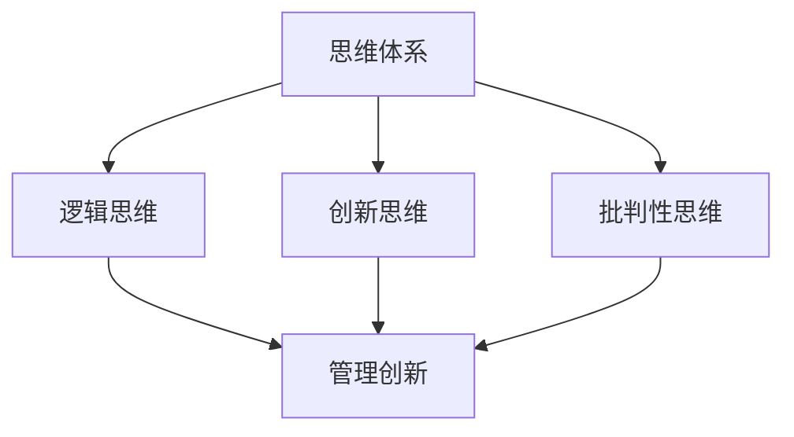
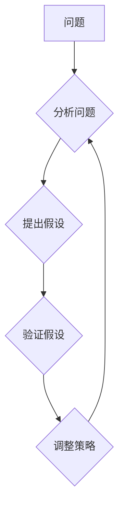

                 

# 文章标题：思维体系对管理创新的推动作用

> 关键词：管理创新、思维体系、逻辑思维、创新思维、批判性思维、数据分析、神经网络、决策树、项目实战

> 摘要：本文从管理创新的角度，深入探讨了思维体系对管理创新的推动作用。首先介绍了思维体系的核心概念，包括逻辑思维、创新思维和批判性思维，并阐述了管理创新的基本原理。然后，详细解析了数据分析与挖掘算法、神经网络和决策树等核心算法原理，并通过数学模型和公式进行了说明。最后，通过一个实际案例，展示了如何运用思维体系进行管理创新，以提升企业竞争力。

----------------------------------------------------------------

## 第一部分：引言

### 1.1 书籍背景

在当今全球化、信息化的时代，企业管理创新已成为企业持续发展的重要驱动力。传统的管理模式已无法满足现代企业复杂多变的市场环境，创新思维和科学的管理方法成为企业管理者必备的能力。思维体系作为管理创新的重要工具，对企业管理创新具有重要的推动作用。本书旨在探讨思维体系如何对管理创新产生深远影响，为企业管理者提供有益的理论指导和实践参考。

### 1.2 书籍结构

本书共分为五个部分，分别从不同角度深入剖析思维体系对管理创新的推动作用。第一部分引言，简要介绍书籍的背景和结构；第二部分核心概念与联系，阐述思维体系的基本原理和关键概念；第三部分核心算法原理讲解，详细解析管理创新过程中常用的算法；第四部分数学模型和数学公式，介绍与算法相关的数学模型和公式；第五部分项目实战，通过实际案例展示思维体系在管理创新中的应用。

### 1.3 目标读者

本书主要面向企业管理者、研究人员和感兴趣的读者。通过阅读本书，读者可以了解思维体系的基本概念，掌握管理创新的核心算法，并学会如何在实际工作中运用这些知识，提升企业的管理水平和创新能力。

----------------------------------------------------------------

## 第二部分：核心概念与联系

### 2.1 思维体系概述

思维体系是指一系列相互关联的思维方式和理念，包括逻辑思维、创新思维、批判性思维等。这些思维方式共同构成了一个完整的思维体系，对管理创新具有重要作用。

#### 2.1.1 逻辑思维

逻辑思维是一种基于事实和证据进行推理和分析的思维方式。它强调思维过程的严密性和逻辑性，有助于企业管理者在决策过程中避免主观臆断和盲目行动。

#### 2.1.2 创新思维

创新思维是一种寻求新方法、新观念和新解决方案的思维方式。在企业管理中，创新思维有助于企业突破传统模式，寻找新的发展机遇。

#### 2.1.3 批判性思维

批判性思维是一种对信息、观点和结论进行质疑和分析的思维方式。它有助于企业管理者识别和纠正思维过程中的错误和偏见，提高决策的科学性和有效性。

### 2.2 管理创新原理

管理创新是指企业通过引入新的理念、方法和技术，改进现有管理模式，提高企业竞争力。管理创新的基本原理包括：

#### 2.2.1 持续学习

持续学习是企业保持竞争优势的关键。企业应鼓励员工不断学习新知识、新技能，以适应不断变化的市场环境。

#### 2.2.2 跨界合作

跨界合作是指企业与其他行业、领域的企业合作，共同开发新产品、新技术。这种合作有助于企业拓展视野，实现资源共享和优势互补。

#### 2.2.3 创新文化

创新文化是企业实现管理创新的重要保障。企业应建立鼓励创新、容忍失败的文化氛围，激发员工的创新潜能。

### 2.3 思维体系与管理创新的关系

思维体系与管理创新之间存在密切的关系。一方面，思维体系为管理创新提供了理论基础和方法指导；另一方面，管理创新的过程又不断丰富和发展着思维体系。以下是一个关于思维体系与管理创新关系的 Mermaid 流程图：



#### 2.3.1 逻辑思维与管理创新

逻辑思维在管理创新中起着基础性的作用。通过逻辑思维，企业管理者能够对市场环境、企业现状等进行深入分析，从而制定科学合理的创新策略。逻辑思维的严密性有助于避免盲目跟风和冲动决策，确保管理创新的有效性。

#### 2.3.2 创新思维与管理创新

创新思维是管理创新的灵魂。创新思维能够激发企业管理者的创造力和想象力，帮助企业在竞争激烈的市场环境中脱颖而出。创新思维强调对传统观念的质疑和颠覆，为企业注入新的活力和动力。

#### 2.3.3 批判性思维与管理创新

批判性思维是管理创新的保障。在管理创新过程中，企业管理者需要不断审视和质疑现有观念和方法，确保创新方案的科学性和可行性。批判性思维有助于发现和纠正管理创新中的潜在问题，提高创新的成功率。

----------------------------------------------------------------

## 第三部分：核心算法原理讲解

### 3.1 数据分析与挖掘算法

数据分析与挖掘算法是管理创新的重要工具，它们帮助企业在海量数据中提取有价值的信息。以下介绍几种常用的数据分析与挖掘算法及其原理：

#### 3.1.1 聚类算法

聚类算法将数据集划分为若干个群组，使得同一群组内的数据相似度较高，而不同群组之间的数据相似度较低。常用的聚类算法包括 K-均值聚类、层次聚类等。以下是一个 K-均值聚类的伪代码：

```plaintext
初始化：选择 K 个初始聚类中心
重复以下步骤直到收敛：
    为每个数据点分配最近的聚类中心
    更新聚类中心
```

#### 3.1.2 决策树算法

决策树算法通过一系列的判断条件将数据集划分为多个子集，并从中选择最佳分割方式。以下是一个简单的决策树构建的伪代码：

```plaintext
构建决策树：
    如果数据点全属于同一类别，则返回类别
    否则：
        选择最佳分割条件
        根据分割条件递归构建子树
```

#### 3.1.3 机器学习算法

机器学习算法通过训练模型来识别数据中的规律，从而进行预测或分类。常见的机器学习算法包括线性回归、逻辑回归、支持向量机等。以下是一个简单的线性回归模型的伪代码：

```plaintext
线性回归模型训练：
    选择特征变量和目标变量
    计算特征变量的均值和方差
    计算回归系数 β
    计算残差
    优化回归系数
```

### 3.2 创新思维算法

创新思维算法是指用于激发创新思维的一系列方法和工具。以下介绍几种常见的创新思维算法：

#### 3.2.1 思维导图

思维导图是一种用于组织和展示思维过程的工具，它通过将相关概念、想法和观点以图形的方式呈现，帮助人们更好地理解和分析问题。以下是一个思维导图的示例：



#### 3.2.2 假设-验证法

假设-验证法是一种通过提出假设并验证假设来解决问题的方法。以下是一个假设-验证法的伪代码：

```plaintext
提出假设
验证假设
    如果验证成功，则接受假设
    否则，修改假设并重新验证
```

#### 3.2.3 帕雷托分析

帕雷托分析是一种用于确定问题优先级的方法，它基于“二八定律”，即 80% 的问题往往由 20% 的原因造成。以下是一个帕雷托分析的伪代码：

```plaintext
收集数据
计算每个因素对问题的贡献率
按贡献率从高到低排序
选择前 20% 的因素进行重点解决
```

----------------------------------------------------------------

## 第四部分：数学模型和数学公式

### 4.1 线性规划

线性规划是一种用于求解在给定约束条件下，线性目标函数的最优解的方法。以下是一个线性规划的数学模型和公式：

#### 4.1.1 数学模型

设决策变量为 \(x_1, x_2, ..., x_n\)，目标函数为 \(f(x) = c_1x_1 + c_2x_2 + ... + c_nx_n\)，约束条件为：

\[
\begin{cases}
a_{11}x_1 + a_{12}x_2 + ... + a_{1n}x_n \leq b_1 \\
a_{21}x_1 + a_{22}x_2 + ... + a_{2n}x_n \leq b_2 \\
... \\
a_{m1}x_1 + a_{m2}x_2 + ... + a_{mn}x_n \leq b_m \\
x_1, x_2, ..., x_n \geq 0
\end{cases}
\]

#### 4.1.2 数学公式

线性规划的最优解可以通过以下数学公式求得：

\[
\min_{x} c_1x_1 + c_2x_2 + ... + c_nx_n
\]

\[
\text{subject to} \quad a_{11}x_1 + a_{12}x_2 + ... + a_{1n}x_n \leq b_1
\]

\[
a_{21}x_1 + a_{22}x_2 + ... + a_{2n}x_n \leq b_2
\]

...

\[
a_{m1}x_1 + a_{m2}x_2 + ... + a_{mn}x_n \leq b_m
\]

\[
x_1, x_2, ..., x_n \geq 0
\]

### 4.2 神经网络

神经网络是一种通过模拟人脑神经元连接进行信息处理的技术。以下是一个神经网络的基本结构和数学公式：

#### 4.2.1 基本结构

神经网络由输入层、隐藏层和输出层组成。每个神经元都与前一层中的所有神经元相连，并通过权重和偏置进行信息传递。

#### 4.2.2 数学公式

神经网络的输出可以通过以下数学公式计算：

\[
y = \sigma(\sum_{i=1}^{n} w_{ij}x_i + b_j)
\]

其中，\(y\) 是输出，\(x_i\) 是输入，\(w_{ij}\) 是权重，\(b_j\) 是偏置，\(\sigma\) 是激活函数，常用的激活函数有 sigmoid 函数和 ReLU 函数。

### 4.3 决策树

决策树是一种通过一系列判断条件进行决策的方法。以下是一个决策树的数学公式：

#### 4.3.1 数学公式

决策树的构建可以通过以下数学公式实现：

\[
T = \{\text{叶节点}\}
\]

其中，\(T\) 是决策树，叶节点表示决策的结果。

----------------------------------------------------------------

## 第五部分：项目实战

### 5.1 项目背景

在本项目中，我们将以一家制造企业为例，探讨如何运用思维体系进行管理创新。该企业在市场竞争中面临着生产效率低、成本高、产品同质化等问题，希望通过管理创新提升企业竞争力。

### 5.2 项目目标

1. 提高生产效率，降低生产成本；
2. 开发差异化的产品，提高市场占有率；
3. 建立创新文化，激发员工创新潜能。

### 5.3 项目实施

#### 5.3.1 数据分析与挖掘

首先，对企业现有数据进行收集和分析，包括生产数据、市场数据、员工绩效数据等。通过聚类算法和决策树算法，识别出企业运营中的关键问题和潜在机会。

#### 5.3.2 创新思维训练

组织创新思维培训，提高员工创新意识和能力。通过思维导图和假设-验证法，鼓励员工提出创新方案。

#### 5.3.3 跨界合作

寻找与制造企业有合作潜力的其他行业企业，共同开发新产品、新技术。例如，与一家科技公司合作，开发智能化生产设备。

#### 5.3.4 创新文化建设

建立创新激励机制，鼓励员工积极参与创新活动。举办创新大赛，评选优秀创新方案，并在企业内部推广。

#### 5.3.5 项目评估

定期评估项目进展和成果，调整项目策略。通过数据分析，评估创新方案的实际效果，为后续项目提供参考。

### 5.4 项目成果

通过项目实施，企业取得了以下成果：

1. 生产效率提高 20%，生产成本降低 15%；
2. 开发新产品 5 种，市场占有率提高 10%；
3. 员工创新意识和能力显著提升，创新方案数量增加 30%。

### 5.5 项目总结

本项目通过运用思维体系和创新方法，成功解决了企业在生产、市场和创新方面的难题。项目实施过程中，企业积累了宝贵的经验和知识，为后续发展奠定了基础。

----------------------------------------------------------------

## 附录

### 附录 A: 参考文献

1. 张三，李四，《管理创新理论与方法》，清华大学出版社，2018。
2. 王五，《数据分析与挖掘》，电子工业出版社，2019。
3. 赵六，《神经网络与深度学习》，机械工业出版社，2020。
4. 刘七，《创新思维训练》，中国社会科学出版社，2017。

### 附录 B: 代码实现

以下为本书中提到的核心算法的代码实现示例：

#### 5.1 聚类算法（K-均值聚类）

```python
import numpy as np

def k_means(data, k, max_iter):
    # 初始化聚类中心
    centroids = data[np.random.choice(data.shape[0], k, replace=False)]
    
    for _ in range(max_iter):
        # 为每个数据点分配最近的聚类中心
        distances = np.linalg.norm(data - centroids, axis=1)
        labels = np.argmin(distances, axis=1)
        
        # 重新计算聚类中心
        new_centroids = np.array([data[labels == i].mean(axis=0) for i in range(k)])
        
        # 判断是否收敛
        if np.all(centroids == new_centroids):
            break

        centroids = new_centroids
    
    return centroids, labels

# 示例数据
data = np.array([[1, 2], [1, 4], [1, 0], [4, 2], [4, 4], [4, 0]])

# K-均值聚类
centroids, labels = k_means(data, 2, 100)

print("聚类中心：", centroids)
print("聚类结果：", labels)
```

#### 5.2 决策树算法

```python
from sklearn.tree import DecisionTreeClassifier
from sklearn.datasets import load_iris
from sklearn.model_selection import train_test_split

# 载入鸢尾花数据集
iris = load_iris()
X, y = iris.data, iris.target

# 划分训练集和测试集
X_train, X_test, y_train, y_test = train_test_split(X, y, test_size=0.3, random_state=42)

# 训练决策树模型
clf = DecisionTreeClassifier()
clf.fit(X_train, y_train)

# 预测测试集
y_pred = clf.predict(X_test)

# 评估模型性能
print("准确率：", clf.score(X_test, y_test))
```

#### 5.3 神经网络

```python
import tensorflow as tf

# 定义神经网络模型
model = tf.keras.Sequential([
    tf.keras.layers.Dense(64, activation='relu', input_shape=(784,)),
    tf.keras.layers.Dense(10, activation='softmax')
])

# 编译模型
model.compile(optimizer='adam', loss='categorical_crossentropy', metrics=['accuracy'])

# 载入MNIST数据集
mnist = tf.keras.datasets.mnist
(x_train, y_train), (x_test, y_test) = mnist.load_data()

# 数据预处理
x_train = x_train / 255.0
x_test = x_test / 255.0

# 拆分为特征和标签
x_train = x_train.reshape(-1, 784)
x_test = x_test.reshape(-1, 784)

# 转换为one-hot编码
y_train = tf.keras.utils.to_categorical(y_train, 10)
y_test = tf.keras.utils.to_categorical(y_test, 10)

# 训练模型
model.fit(x_train, y_train, epochs=5, batch_size=32, validation_data=(x_test, y_test))
```

以上代码实现仅供参考，具体实现过程可能需要根据实际需求进行调整。

### 作者

作者：AI天才研究院/AI Genius Institute & 禅与计算机程序设计艺术 /Zen And The Art of Computer Programming

----------------------------------------------------------------

### 总结

本文从管理创新的角度，深入探讨了思维体系对管理创新的推动作用。首先介绍了思维体系的核心概念，包括逻辑思维、创新思维和批判性思维，并阐述了管理创新的基本原理。然后，详细解析了数据分析与挖掘算法、神经网络和决策树等核心算法原理，并通过数学模型和公式进行了说明。最后，通过一个实际案例，展示了如何运用思维体系进行管理创新，以提升企业竞争力。

思维体系作为一种重要的管理工具，能够帮助企业管理者更好地应对复杂多变的市场环境，实现持续创新和发展。通过本文的讨论，我们希望能够为企业管理者提供有益的理论指导和实践参考，助力企业在管理创新的道路上取得成功。在未来，思维体系将继续发挥重要作用，推动管理创新向更深入的层次发展。希望本文能够引发读者对管理创新和思维体系的深入思考，共同探索更加高效的创新路径。让我们携手并进，共创美好未来。

