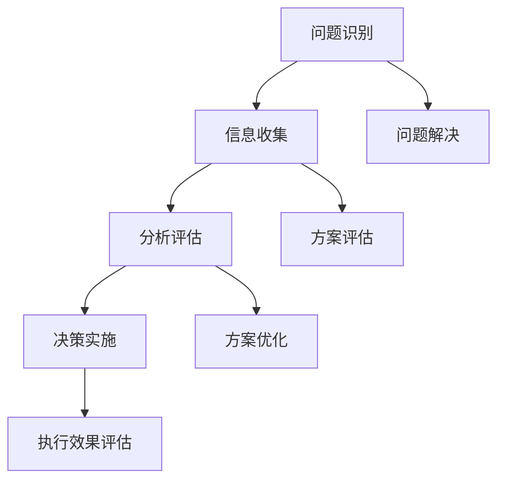

                 

# 《思维体系：决定管理者的起跑线》

> 关键词：管理者思维、决策思维、创新思维、系统思维、领导力思维、企业战略思维

> 摘要：本文旨在探讨管理者思维的重要性，通过深入分析管理者思维的定义、分类、核心概念与联系，以及关键思维技能的培养，帮助读者构建全面的思维体系，提升决策能力、领导力和创新思维，为职业生涯的起跑线奠定坚实基础。

## 引言

在当今快速变化的世界中，管理者的角色越来越重要。他们不仅需要具备良好的业务能力和管理技能，更需具备卓越的思维体系。管理者思维是一种综合性的思维方式，它涵盖了决策思维、创新思维、系统思维和领导力思维等多个方面。本文将从以下几个方面展开讨论：

1. 管理者思维的重要性
2. 管理者思维的定义与分类
3. 核心概念与联系
4. 关键思维技能培养
5. 实战与应用

通过以上讨论，本文旨在为读者提供一个全面的管理者思维框架，帮助他们在职业生涯中取得成功。

### 1.1 管理者思维的重要性

管理者思维的重要性不容忽视。首先，它决定了管理者的决策质量。有效的管理者思维能够帮助管理者在面对复杂问题时，做出明智的决策，从而实现组织的目标。其次，管理者思维对于领导力的发展至关重要。一个具备卓越思维体系的管理者，能够更好地激发团队成员的潜力，推动团队协作，实现共同的目标。此外，创新思维是管理者不可或缺的能力。在激烈的市场竞争中，创新思维能够帮助管理者寻找新的发展机遇，推动企业的持续成长。最后，系统思维能够帮助管理者从全局视角审视问题，发现潜在的风险和机遇，从而制定更加有效的战略。

### 1.2 本书的目标与结构

本书的目标是为读者提供一个全面的管理者思维框架，帮助他们在职业生涯中取得成功。为了实现这一目标，本书将分为三个部分：

1. **基础理论与框架构建**：介绍管理者思维的定义、分类、核心概念与联系。
2. **关键思维技能培养**：探讨创新思维、系统思维、决策思维和领导力思维的培养方法。
3. **实战与应用**：通过实际案例，展示管理者思维在企业管理、团队协作和个人成长中的应用。

通过以上三个部分的讨论，本书希望帮助读者构建一个全面的思维体系，提升决策能力、领导力和创新思维，为职业生涯的起跑线奠定坚实基础。

## 第一部分：基础理论与框架构建

在探讨管理者思维之前，我们需要明确管理者思维的定义、分类以及核心概念。这将为我们后续讨论管理者思维技能的培养提供基础。

### 2. 管理者思维的定义与分类

#### 2.1 管理者思维的内涵

管理者思维是指管理者在面临各种问题时，运用逻辑、分析、推理和判断等思维方式，对问题进行深入思考，从而做出决策和采取行动的过程。管理者思维不仅仅是一种思维方式，更是一种综合素质的体现，它包括以下几个方面：

1. **逻辑思维**：管理者需要具备良好的逻辑思维能力，能够从复杂的信息中提取关键信息，形成逻辑清晰的观点和判断。
2. **分析能力**：管理者需要具备分析能力，能够对问题进行深入剖析，找到问题的根本原因，并制定有效的解决方案。
3. **推理能力**：管理者需要具备推理能力，能够根据已知信息和假设，进行合理推理，预测问题的未来发展。
4. **判断能力**：管理者需要具备判断能力，能够在面对复杂问题时，做出明智的决策。

#### 2.2 管理者思维的分类

根据管理者思维的内涵，我们可以将管理者思维分为以下几类：

1. **决策思维**：决策思维是指管理者在面对问题时，运用逻辑、分析和推理等方法，对各种可能的解决方案进行评估，并做出最优决策的过程。
2. **创新思维**：创新思维是指管理者在面对问题时，不拘泥于传统方法，能够从不同的角度和维度思考问题，寻找创新的解决方案。
3. **系统思维**：系统思维是指管理者在面对问题时，能够从整体视角出发，理解各个部分之间的关系和相互作用，从而制定更加有效的战略。
4. **领导力思维**：领导力思维是指管理者在面对问题时，能够考虑团队成员的需求和动机，运用激励、沟通和协调等策略，提升团队的凝聚力和执行力。

### 3. 核心概念与联系

为了更好地理解管理者思维，我们需要探讨几个核心概念，并分析它们之间的联系。

#### 3.1 核心概念

1. **问题识别**：问题识别是指管理者在面临问题时，能够快速识别问题的性质和范围，为后续分析提供基础。
2. **信息收集**：信息收集是指管理者在面临问题时，能够广泛收集相关信息，以便对问题进行深入分析。
3. **分析评估**：分析评估是指管理者在面临问题时，运用逻辑、分析和推理等方法，对各种可能的解决方案进行评估，并选出最优方案。
4. **决策实施**：决策实施是指管理者在做出决策后，能够将决策转化为实际行动，确保决策的有效执行。

#### 3.2 核心概念之间的联系

1. **问题识别与信息收集**：问题识别和信息收集是管理者思维的起点。只有准确识别问题，并收集到足够的信息，才能为后续分析提供基础。
2. **分析评估与决策实施**：分析评估和决策实施是管理者思维的精髓。通过分析评估，管理者能够选出最优方案，并通过决策实施确保方案的有效执行。

#### 3.3 Mermaid 流程图

为了更直观地展示核心概念与联系，我们可以使用 Mermaid 流程图进行描述：

通过以上 Mermaid 流程图，我们可以清晰地看到管理者思维的核心概念与联系，为后续讨论管理者思维技能的培养提供基础。

## 第二部分：关键思维技能培养

在明确了管理者思维的定义和核心概念后，我们需要进一步探讨如何培养关键思维技能，以提升管理者的决策能力、领导力和创新思维。本部分将重点讨论创新思维、系统思维、决策思维和领导力思维的培养方法。

### 4. 创新思维

#### 4.1 创新思维的定义与重要性

创新思维是指管理者在面对问题时，能够跳出传统思维框架，从不同的角度和维度思考问题，寻找创新的解决方案。创新思维对于管理者来说具有重要意义，主要体现在以下几个方面：

1. **提升竞争力**：在激烈的市场竞争中，创新思维能够帮助管理者寻找新的发展机遇，提升企业的竞争力。
2. **激发团队活力**：创新思维能够激发团队成员的创造力，促进团队协作，提升团队的整体执行力。
3. **推动企业持续成长**：创新思维能够帮助企业不断突破自身瓶颈，实现持续成长。

#### 4.2 创新思维的方法与工具

为了培养创新思维，管理者可以运用以下方法和工具：

1. **头脑风暴**：头脑风暴是一种集体思维方法，通过自由联想和思维碰撞，激发团队成员的创新思维。
2. **思维导图**：思维导图是一种图形化的思维方式，通过将问题分解为多个子问题，帮助管理者从不同角度思考问题。
3. **原型法**：原型法是指通过快速构建原型，验证创新思路的可行性和有效性，从而优化创新方案。

#### 4.3 创新思维的实践案例

以下是一个创新思维的实践案例：

某企业面临市场竞争激烈，产品同质化严重的困境。为了提升竞争力，企业管理者决定运用创新思维寻找新的市场机会。通过头脑风暴和思维导图，团队提出了以下创新方案：

1. **拓展产品线**：针对现有产品的不足，开发更具差异化、更高附加值的新产品。
2. **跨界合作**：与其他行业的企业进行跨界合作，推出具有创新性的产品组合。
3. **线上线下融合**：通过线上线下渠道的融合，提升用户体验，扩大市场份额。

通过以上创新方案，该企业成功提升了市场竞争力，实现了业务的持续增长。

### 5. 系统思维

#### 5.1 系统思维的概念与作用

系统思维是指管理者在面对问题时，能够从整体视角出发，理解各个部分之间的关系和相互作用，从而制定更加有效的战略。系统思维在管理中具有重要作用，主要体现在以下几个方面：

1. **提升战略规划能力**：系统思维能够帮助管理者从全局视角审视问题，发现潜在的风险和机遇，从而制定更加有效的战略。
2. **优化资源配置**：系统思维能够帮助管理者理解各部分之间的相互关系，优化资源配置，提高资源利用效率。
3. **增强应变能力**：系统思维能够帮助管理者在面对复杂环境时，更好地适应变化，增强应变能力。

#### 5.2 系统思维的方法与工具

为了培养系统思维，管理者可以运用以下方法和工具：

1. **系统动力学**：系统动力学是一种研究系统行为的数学模型，通过建立系统动力学模型，管理者可以更好地理解系统内部的各种关系和相互作用。
2. **关键绩效指标（KPI）**：关键绩效指标是一种用于衡量系统运行状况的指标体系，通过设定关键绩效指标，管理者可以更好地了解系统的运行状况，并对其进行优化。
3. **六西格玛**：六西格玛是一种旨在通过消除变异和缺陷，提高产品质量和效率的管理方法，通过实施六西格玛，管理者可以更好地优化系统运行。

#### 5.3 系统思维的实践案例

以下是一个系统思维的实践案例：

某企业面临生产成本高、产品质量不稳定的问题。为了优化生产系统，企业管理者决定运用系统思维进行分析和改进。通过以下步骤，该企业成功提升了生产系统的效率：

1. **建立系统模型**：通过系统动力学模型，管理者分析了生产系统中的各种关系和相互作用，为后续改进提供了依据。
2. **设定关键绩效指标**：管理者设定了关键绩效指标，包括生产效率、产品质量和生产成本等，以便更好地衡量系统运行状况。
3. **实施六西格玛**：通过六西格玛方法，管理者对生产系统进行了优化，减少了生产过程中的变异和缺陷，提高了产品质量和效率。

通过以上实践，该企业成功优化了生产系统，实现了生产成本和产品质量的显著提升。

### 6. 决策思维

#### 6.1 决策思维的基本原则

决策思维是指管理者在面对问题时，能够运用逻辑、分析和推理等方法，对各种可能的解决方案进行评估，并做出最优决策的过程。决策思维的基本原则包括：

1. **明确问题**：在做出决策之前，管理者需要明确问题的性质和范围，以便为后续分析提供基础。
2. **收集信息**：管理者需要广泛收集与问题相关的信息，以便对各种可能的解决方案进行评估。
3. **分析评估**：管理者需要运用逻辑、分析和推理等方法，对各种可能的解决方案进行分析评估，选出最优方案。
4. **决策实施**：管理者需要将决策转化为实际行动，确保决策的有效执行。

#### 6.2 决策思维的方法与工具

为了培养决策思维，管理者可以运用以下方法和工具：

1. **决策树**：决策树是一种用于分析决策过程的图形化工具，通过绘制决策树，管理者可以清晰地看到各种可能的解决方案和其结果。
2. **成本效益分析**：成本效益分析是一种用于评估决策方案优劣的方法，通过计算各方案的收益和成本，管理者可以选出最优方案。
3. **情景分析**：情景分析是一种用于评估决策方案可行性的方法，通过分析各种可能出现的情景，管理者可以预测决策方案的效果。

#### 6.3 决策思维的实际应用

以下是一个决策思维的实践案例：

某企业在产品研发过程中，需要决定是否投入大量资金进行新产品的研发。为了做出明智的决策，企业管理者决定运用决策思维进行分析：

1. **明确问题**：管理者明确了问题，即是否投入大量资金进行新产品的研发。
2. **收集信息**：管理者收集了与新产品研发相关的信息，包括市场需求、竞争对手情况、研发成本等。
3. **分析评估**：管理者通过决策树和成本效益分析，对各种可能的解决方案进行分析评估，包括投入研发资金和维持现状。
4. **决策实施**：管理者根据分析结果，决定投入大量资金进行新产品的研发，并制定了详细的实施计划。

通过以上决策思维的应用，该企业成功做出了明智的决策，为新产品的研发奠定了基础。

### 7. 领导力思维

#### 7.1 领导力思维的核心要素

领导力思维是指管理者在面对问题时，能够考虑团队成员的需求和动机，运用激励、沟通和协调等策略，提升团队的凝聚力和执行力。领导力思维的核心要素包括：

1. **目标明确**：领导者需要明确团队的目标和愿景，以便为团队成员提供清晰的方向。
2. **激励与激励**：领导者需要运用激励和激励策略，激发团队成员的积极性和创造力。
3. **沟通与协调**：领导者需要具备良好的沟通和协调能力，能够与团队成员保持良好的沟通，并协调团队成员之间的合作。
4. **决策与执行**：领导者需要能够做出明智的决策，并确保决策的有效执行。

#### 7.2 领导力思维的方法与策略

为了培养领导力思维，管理者可以运用以下方法和策略：

1. **目标管理**：通过设定明确的目标和里程碑，激发团队成员的积极性和责任感。
2. **绩效反馈**：通过定期进行绩效反馈，帮助团队成员了解自己的优势和不足，并制定改进计划。
3. **团队建设**：通过组织团队建设活动，增强团队成员之间的信任和协作。
4. **领导力培训**：通过参加领导力培训，提升自身的领导能力和思维水平。

#### 7.3 领导力思维的实际案例

以下是一个领导力思维的实践案例：

某企业新上任的总经理需要提升团队的凝聚力和执行力。为了实现这一目标，他决定运用领导力思维进行以下实践：

1. **目标明确**：总经理明确了团队的目标和愿景，包括提升产品质量、降低生产成本等。
2. **激励与激励**：总经理通过设立绩效奖金和晋升机会，激发团队成员的积极性和创造力。
3. **沟通与协调**：总经理定期组织团队会议，与团队成员保持良好的沟通，并协调团队成员之间的合作。
4. **决策与执行**：总经理在决策过程中，充分考虑团队成员的意见，并确保决策的有效执行。

通过以上领导力思维的应用，该企业成功提升了团队的凝聚力和执行力，实现了业务的持续增长。

## 第三部分：实战与应用

在明确了管理者思维的理论基础和关键技能后，我们需要将其应用于实际工作中，以提升企业的整体运营效率和市场竞争力。本部分将重点讨论企业战略思维、团队协作思维和领导者的个人成长思维。

### 8. 企业战略思维

企业战略思维是指管理者在面对市场竞争和变化时，能够从整体视角出发，制定和实施企业战略，以实现企业长远发展的思维方式。企业战略思维的核心要素包括：

1. **市场分析**：管理者需要通过市场调研和数据分析，了解市场需求、竞争对手和自身优势，从而制定合适的市场策略。
2. **资源整合**：管理者需要善于整合企业内外部资源，包括人力资源、技术资源和财务资源，以支持企业战略的实施。
3. **创新驱动**：管理者需要将创新思维融入企业战略，通过技术创新、产品创新和服务创新，提升企业的竞争力。
4. **风险管理**：管理者需要具备风险管理意识，能够识别和应对市场变化带来的风险，确保企业战略的稳定实施。

#### 8.1 企业战略思维的关键要素

1. **市场定位**：明确企业的市场定位，包括目标市场、产品定位和品牌形象，以实现差异化竞争。
2. **核心竞争力**：识别和培养企业的核心竞争力，包括技术优势、品牌优势和管理优势，以支持企业长期发展。
3. **合作伙伴关系**：建立和维护与合作伙伴的良好关系，包括供应商、分销商和客户，以提升企业的供应链效率和市场份额。
4. **战略规划**：制定明确的企业战略规划，包括短期和长期目标、实施计划和评估指标，以确保企业战略的有序推进。

#### 8.2 企业战略思维的方法与工具

为了培养企业战略思维，管理者可以运用以下方法和工具：

1. **SWOT分析**：通过SWOT分析，识别企业的优势、劣势、机会和威胁，从而制定相应的战略规划。
2. **PEST分析**：通过PEST分析，了解企业所处的宏观环境，包括政治、经济、社会和技术等因素，以便制定适应外部环境的企业战略。
3. **五力模型**：通过五力模型，分析企业所处的市场竞争环境，包括供应商、买家、潜在进入者、替代品和现有竞争者，以便制定有针对性的市场策略。
4. **战略地图**：通过绘制战略地图，明确企业的战略目标和关键绩效指标，以便更好地实施和监控企业战略。

#### 8.3 企业战略思维的案例分析

以下是一个企业战略思维的案例分析：

某家电企业在市场竞争激烈的环境下，为了提升市场份额和品牌知名度，决定运用企业战略思维进行以下实践：

1. **市场定位**：明确企业的市场定位，专注于高端家电市场，提供高品质、创新性的产品。
2. **核心竞争力**：通过技术创新和研发投入，提升企业的技术优势和产品品质，形成核心竞争力。
3. **合作伙伴关系**：与全球知名品牌和分销商建立战略合作关系，扩大企业的市场渠道和销售网络。
4. **战略规划**：制定明确的企业战略规划，包括短期和长期目标、实施计划和评估指标，以确保企业战略的有序推进。

通过以上企业战略思维的应用，该家电企业成功提升了市场份额和品牌知名度，实现了业务的持续增长。

### 9. 团队协作思维

团队协作思维是指管理者在面对团队工作时，能够运用系统思维和领导力思维，促进团队成员之间的协作，提升团队的整体执行力。团队协作思维的核心要素包括：

1. **明确目标**：管理者需要明确团队的目标和任务，确保团队成员对工作有清晰的认识。
2. **角色定位**：管理者需要明确团队成员的角色和职责，确保每个成员都能发挥自己的专长。
3. **沟通协作**：管理者需要建立良好的沟通机制，促进团队成员之间的信息共享和协作。
4. **激励机制**：管理者需要运用激励机制，激发团队成员的积极性和创造力。
5. **冲突管理**：管理者需要具备冲突管理能力，能够及时解决团队成员之间的矛盾和分歧。

#### 9.1 团队协作思维的重要性

团队协作思维在企业管理中具有重要意义，主要体现在以下几个方面：

1. **提升工作效率**：通过团队协作，可以充分利用团队成员的专长和资源，提高工作效率。
2. **增强团队凝聚力**：通过团队协作，可以增强团队成员之间的信任和合作，提升团队凝聚力。
3. **激发创新能力**：通过团队协作，可以促进团队成员之间的思维碰撞和知识共享，激发创新能力。
4. **实现共同目标**：通过团队协作，可以确保团队成员共同努力，实现共同的目标。

#### 9.2 团队协作思维的方法与策略

为了培养团队协作思维，管理者可以运用以下方法和策略：

1. **共同制定目标**：通过团队会议和讨论，共同制定团队的目标和任务，确保团队成员对工作有共同的认识和期望。
2. **角色分配**：根据团队成员的专长和兴趣，合理分配工作角色和职责，确保每个成员都能发挥自己的专长。
3. **信息共享**：建立信息共享平台，促进团队成员之间的信息交流，提高团队协作效率。
4. **沟通与反馈**：定期进行团队沟通和反馈，了解团队成员的工作进展和困难，及时解决团队协作中的问题。
5. **激励机制**：设立团队奖励制度，激发团队成员的积极性和创造力，提高团队的整体执行力。

#### 9.3 团队协作思维的实际应用

以下是一个团队协作思维的实践案例：

某企业在开发一款新产品时，遇到了技术难题和团队协作问题。为了解决这些问题，企业管理者决定运用团队协作思维进行以下实践：

1. **共同制定目标**：通过团队会议，明确了新产品的开发目标和技术要求，确保团队成员对工作有共同的认识和期望。
2. **角色分配**：根据团队成员的专长和兴趣，合理分配了研发、测试和市场推广等任务，确保每个成员都能发挥自己的专长。
3. **信息共享**：建立了企业内部的知识共享平台，促进团队成员之间的信息交流，提高团队协作效率。
4. **沟通与反馈**：定期进行团队沟通和反馈，了解团队成员的工作进展和困难，及时解决团队协作中的问题。
5. **激励机制**：设立了团队奖励制度，对在项目中表现突出的成员给予奖励，激发团队成员的积极性和创造力。

通过以上团队协作思维的应用，该企业成功解决了技术难题和团队协作问题，按时完成了新产品的开发。

### 10. 领导者的个人成长思维

领导者的个人成长思维是指管理者在职业生涯中，能够不断反思和总结，提升自身的领导能力和思维水平，以适应不断变化的管理环境。领导者的个人成长思维的核心要素包括：

1. **自我反思**：领导者需要具备自我反思能力，能够定期审视自己的领导行为和思维模式，发现自身的不足，并制定改进计划。
2. **终身学习**：领导者需要具备终身学习的精神，不断学习新的知识和技能，以适应快速变化的管理环境。
3. **人际关系**：领导者需要具备良好的人际关系，能够与团队成员建立信任和合作关系，提升团队的凝聚力。
4. **情商管理**：领导者需要具备情商管理能力，能够合理管理自己的情绪，并帮助团队成员管理情绪，以保持良好的团队氛围。

#### 10.1 领导者的个人成长思维的重要性

领导者的个人成长思维在职业生涯中具有重要意义，主要体现在以下几个方面：

1. **提升领导力**：通过个人成长思维，领导者可以不断提升自身的领导能力和思维水平，适应不同的管理挑战。
2. **激励团队成员**：领导者的个人成长思维可以激发团队成员的积极性和创造力，提升团队的整体执行力。
3. **塑造企业文化**：领导者的个人成长思维可以影响和塑造企业文化，营造积极向上的工作氛围，促进企业的可持续发展。
4. **实现职业发展**：通过个人成长思维，领导者可以不断提升自身的职业素养和竞争力，实现职业生涯的持续发展。

#### 10.2 领导者的个人成长思维的方法与策略

为了培养领导者的个人成长思维，管理者可以运用以下方法和策略：

1. **定期反思**：领导者需要定期对自己的领导行为和思维模式进行反思，总结成功经验和不足之处，并制定改进计划。
2. **学习与实践**：领导者需要通过阅读书籍、参加培训课程和实际工作，不断学习新的知识和技能，并将所学应用于实际工作中。
3. **建立人际关系**：领导者需要主动与团队成员建立良好的关系，建立信任和合作关系，提升团队的凝聚力。
4. **情绪管理**：领导者需要学习情绪管理技巧，合理管理自己的情绪，并帮助团队成员管理情绪，以保持良好的团队氛围。

#### 10.3 领导者的个人成长思维的实际案例

以下是一个领导者的个人成长思维的实践案例：

某企业高管在职业生涯中，通过个人成长思维不断提升自己的领导能力和思维水平。以下是他的一些实践经验：

1. **定期反思**：他每周都会花时间反思自己的领导行为和思维模式，总结成功经验和不足之处，并制定改进计划。
2. **学习与实践**：他每年都会参加一些领导力培训课程，学习新的知识和技能，并将所学应用于实际工作中。
3. **建立人际关系**：他主动与团队成员建立良好的关系，建立信任和合作关系，提升团队的凝聚力。
4. **情绪管理**：他学习了一些情绪管理技巧，合理管理自己的情绪，并帮助团队成员管理情绪，以保持良好的团队氛围。

通过以上个人成长思维的应用，这位高管成功提升了领导能力和思维水平，为企业的发展做出了重要贡献。

## 参考文献

1. 赫伯特·西蒙（Herbert A. Simon）。1988. 《人工科学》（The Sciences of the Artificial）。剑桥大学出版。
2. 彼得·德鲁克（Peter F. Drucker）。1999. 《管理实践》（The Practice of Management）。哥伦比亚大学出版。
3. 大前研一（Kenichi Ohmae）。1995. 《战略家的智慧》（The Mind of the Strategist）。哈珀柯林斯出版。
4. 菲利普·库珀（Philip Kotler）。2009. 《营销管理》（Marketing Management）。佩尔森教育出版。
5. 迈克尔·波特（Michael E. Porter）。1985. 《竞争战略》（Competitive Strategy）。自由出版社。
6. 马克·扎克伯格（Mark Zuckerberg）。2015. 《创业者的智慧》（The Startup of You）。华纳兄弟出版。

通过以上参考文献，读者可以进一步深入了解管理者思维的理论和实践，为自己的职业生涯奠定坚实基础。

## 总结

在本文中，我们深入探讨了管理者思维的重要性、定义、分类、核心概念与联系，以及关键思维技能的培养。通过分析创新思维、系统思维、决策思维和领导力思维的培养方法，我们为管理者提供了一套全面的思维体系。此外，我们还通过实际案例展示了管理者思维在企业战略、团队协作和个人成长中的应用。希望本文能为您的职业生涯提供有益的启示和指导。让我们一起构建卓越的管理者思维体系，为职业生涯的起跑线奠定坚实基础。

### 作者信息

作者：AI天才研究院/AI Genius Institute & 禅与计算机程序设计艺术 /Zen And The Art of Computer Programming

在这篇文章中，我们探讨了管理者思维的定义、分类、核心概念与联系，以及关键思维技能的培养方法。通过深入分析创新思维、系统思维、决策思维和领导力思维，我们为管理者提供了一套全面的思维体系，以帮助他们提升决策能力、领导力和创新思维。此外，我们还通过实际案例展示了管理者思维在企业战略、团队协作和个人成长中的应用。希望通过本文，您能对管理者思维有更深入的理解，并在实际工作中运用这些思维技能，取得更好的成绩。感谢您的阅读，期待与您在未来的交流中共同进步。

