                 

# 思维导图：可视化知识组织工具

> 关键词：思维导图、知识组织、可视化、教育、企业管理、个人成长

> 摘要：本文详细介绍了思维导图的基础概念、历史背景、应用场景、基本元素与绘制规则、绘制技巧与优化策略、具体领域的应用、创新与思考中的应用、实践与技巧、高级技巧与案例分析以及未来发展趋势与应用前景。思维导图作为一种强大的知识组织工具，在教育、企业管理、个人生活等领域具有广泛的应用价值，通过本文的探讨，希望能够帮助读者深入了解思维导图，并学会如何有效地运用这一工具来提升学习、工作和生活质量。

## 第1章：思维导图的基础

### 1.1 思维导图的概念与历史

#### 1.1.1 思维导图的基本概念

思维导图（Mind Map）是一种以中心主题为核心，通过分支和子主题来展现信息之间关系的图形化工具。它可以帮助我们更直观地理解信息、整理思路、激发创意，是现代知识管理和思维训练的重要工具。

思维导图的基本概念包括：

- **中心主题**：思维导图的起点，通常是整个思维导图的核心，用圆形或方框表示。
- **分支和子主题**：从中心主题延伸出来的分支，每个分支代表一个特定的概念或信息点。
- **关键词**：用于描述每个分支或子主题的核心内容。
- **图形和符号**：用于增强思维导图的表现力，使信息更加生动有趣。

#### 1.1.2 思维导图的历史背景

思维导图最早由英国心理学家托尼·布赞（Tony Buzan）在20世纪60年代提出。他受到大脑神经网络的启发，希望通过图形化的方式来模拟大脑的思维过程。此后，思维导图逐渐被应用于教育、企业管理、个人生活等多个领域。

### 1.2 思维导图的应用场景

#### 1.2.1 教育领域

在教育领域，思维导图可以用于课堂教学设计、学生自主学习、知识体系构建等方面。例如，教师可以使用思维导图来设计教学内容，学生可以使用思维导图来整理学习资料和复习知识点。

#### 1.2.2 企业管理

在企业中，思维导图可以用于战略规划、项目管理和团队协作。例如，企业可以使用思维导图来分析市场环境、制定战略计划、规划项目进度和评估项目风险。

#### 1.2.3 个人生活

在个人生活中，思维导图可以用于时间管理、任务管理、个人成长等方面。例如，个人可以使用思维导图来规划学习计划、管理日常任务和设定职业目标。

### 1.3 思维导图的基本元素

思维导图的基本元素包括中心主题、分支和子主题、关键词、图形和符号等。以下是一个简单的思维导图元素Mermaid流程图示例：

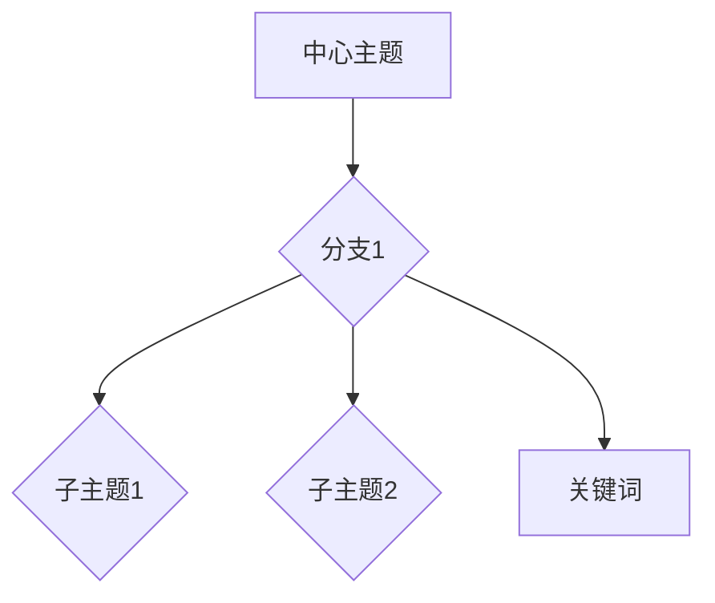

### 1.4 思维导图的核心技巧

#### 1.4.1 思维导图的绘制技巧

- **简洁明了**：避免过度使用分支和子主题，保持思维导图的简洁性。
- **关键词和标注**：使用简洁明了的关键词和标注来传递信息。
- **图形和符号**：适当使用图形和符号来增强思维导图的表现力。

#### 1.4.2 思维导图的优化策略

- **定期回顾与更新**：定期回顾和更新思维导图可以帮助我们保持信息的准确性和时效性。
- **结合其他工具和方法**：思维导图可以与其他工具和方法结合使用，以提高其效率和应用效果。

### 1.5 核心概念与联系

思维导图的核心概念包括信息、关系、结构和可视化。以下是一个简化的思维导图核心概念与联系Mermaid流程图示例：

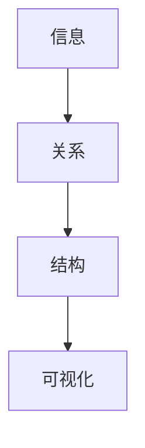

### 1.6 核心算法原理讲解

思维导图的算法原理主要包括信息提取、关系构建和可视化呈现。以下是一个简化的思维导图核心算法原理讲解的伪代码示例：

```python
def build_mind_map(central_topic, sub_topics, keywords, symbols):
    # 创建中心主题
    central_node = create_node(central_topic, 'circle')
    # 创建分支和子主题
    for sub_topic in sub_topics:
        sub_node = create_node(sub_topic, 'square')
        connect(central_node, sub_node)
    # 创建关键词和符号
    for keyword, symbol in zip(keywords, symbols):
        create_node(keyword, 'text', symbol)
        connect(sub_node, keyword_node)
    # 可视化呈现
    display_mind_map(central_node)
```

### 1.7 数学模型和公式

思维导图的构建过程中，常常涉及到一些数学模型和公式，如层次分析法（AHP）和神经网络模型。以下是一个简化的数学模型和公式示例：

$$
AHP = \begin{bmatrix}
a_{11} & a_{12} & \dots & a_{1n} \\
a_{21} & a_{22} & \dots & a_{2n} \\
\vdots & \vdots & \ddots & \vdots \\
a_{n1} & a_{n2} & \dots & a_{nn}
\end{bmatrix}
$$

神经网络模型可以表示为：

$$
\sigma(z) = \frac{1}{1 + e^{-z}}
$$

### 1.8 举例说明

以下是一个简单的思维导图案例，用于整理“人工智能”这一主题的知识点：

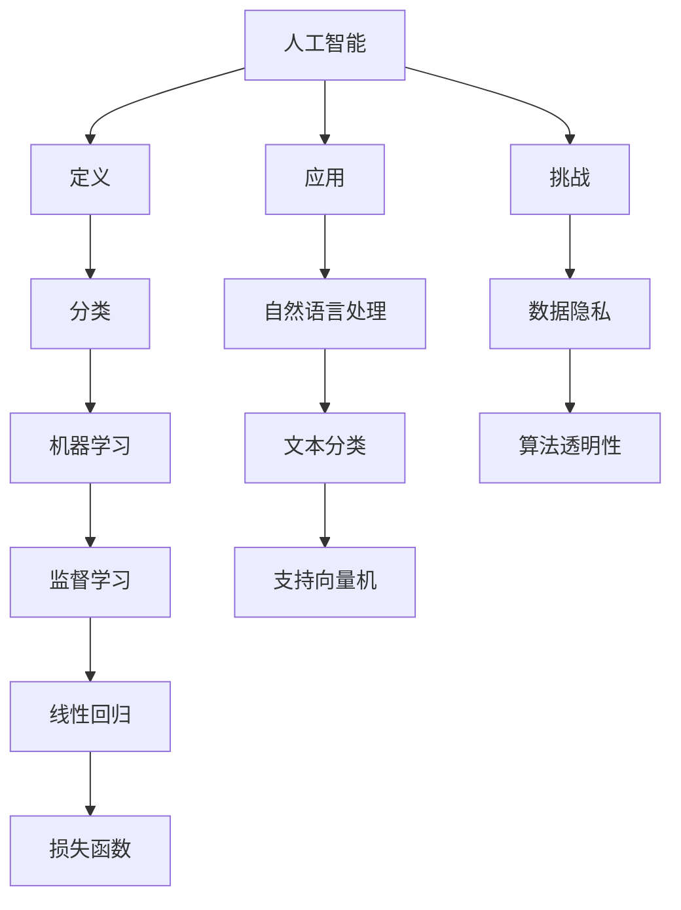

### 1.9 项目实战

在本文中，我们将使用Python和Mermaid库来创建一个简单的思维导图。以下是一个简单的代码示例，用于创建一个基于“人工智能”主题的思维导图。

```python
import mermaid

mind_map = """
graph TD
A[人工智能] --> B[定义]
B --> C[分类]
C --> D[机器学习]
D --> E[监督学习]
E --> F[线性回归]
F --> G[损失函数]

A --> H[应用]
H --> I[自然语言处理]
I --> J[文本分类]
J --> K[支持向量机]

A --> L[挑战]
L --> M[数据隐私]
M --> N[算法透明性]
"""

mermaid.generate_mind_map(mind_map)
```

通过以上代码，我们可以生成一个简单的思维导图，用于展示“人工智能”这一主题的不同方面。

### 1.10 代码解读与分析

在上面的代码中，我们首先导入了`mermaid`库，然后定义了一个字符串变量`mind_map`，其中包含了我们的思维导图内容。`mind_map`字符串使用Mermaid的图形化语法来描述思维导图的布局。

接下来，我们调用`mermaid.generate_mind_map()`函数，将`mind_map`作为参数传递。这个函数会生成一个HTML文件，其中包含了我们的思维导图。

通过这种方式，我们可以将思维导图的概念、算法原理、数学模型和项目实战结合起来，形成一个完整的思维导图开发流程。

## 第2章：思维导图软件工具

### 2.1 常见的思维导图软件

在市场上，有许多功能强大、易于使用的思维导图软件可供选择。以下是一些常见的思维导图软件：

- **XMind**：一款免费的开源思维导图软件，支持Windows、Mac和Linux平台。
- **MindManager**：一款功能强大的商业思维导图软件，适用于Windows和Mac平台。
- **FreeMind**：一款免费的Java-based思维导图软件，支持Windows、Mac和Linux平台。
- **MindMeister**：一款在线思维导图工具，支持多人协作。

### 2.2 思维导图软件的功能特点

#### 2.2.1 节点创建与编辑

思维导图软件允许用户轻松创建和编辑节点。用户可以通过拖放操作来调整节点位置，并使用文本框、图形、颜色和图标等元素来丰富节点内容。

#### 2.2.2 关联关系与层次结构

思维导图软件支持用户创建复杂的关系和层次结构。用户可以通过连接线和箭头来表示不同节点之间的关联，从而形成一个清晰的结构。

#### 2.2.3 导出与分享功能

大多数思维导图软件都提供导出功能，允许用户将思维导图导出为图片、PDF或其他格式。此外，许多软件还支持在线分享和多人协作，方便用户与他人交流和协作。

### 2.3 思维导图软件的实际应用

#### 2.3.1 教学案例

在教学中，教师可以使用思维导图软件来设计课程、整理教材和进行教学评估。例如，教师可以使用XMind来创建课程大纲，并使用不同的颜色和图标来区分不同类型的知识点。

#### 2.3.2 企业战略规划

在企业中，思维导图软件可以帮助管理者制定战略规划、分析市场环境和规划项目进度。例如，管理者可以使用MindManager来制定公司的长期战略，并使用不同的节点来表示不同的战略目标和执行计划。

#### 2.3.3 个人时间管理

个人可以使用思维导图软件来规划时间、管理任务和设定目标。例如，个人可以使用MindMeister来创建每日任务清单，并使用不同的颜色和图标来标记任务的优先级和截止日期。

### 2.4 思维导图软件的选择与使用

在选择思维导图软件时，用户应该考虑以下因素：

- **功能需求**：根据个人的需求选择具有合适功能的软件。
- **平台兼容性**：确保软件可以在用户使用的操作系统上运行。
- **用户体验**：选择界面友好、易于使用的软件，以提高工作效率。

在使用思维导图软件时，用户应该：

- **熟悉软件功能**：掌握软件的基本操作和功能，以便高效地创建和编辑思维导图。
- **定期备份**：定期备份思维导图文件，以防数据丢失。
- **多人协作**：充分利用软件的多人协作功能，与他人共享思维导图，提高团队工作效率。

### 2.5 案例分析

以下是一个使用MindManager进行企业战略规划的案例：

1. **需求分析**：企业管理者需要制定一个长期战略计划，包括市场分析、竞争对手分析、内部资源和目标设定。

2. **使用方法**：
   - **创建中心主题**：在MindManager中创建一个中心主题“企业战略规划”。
   - **分支和子主题**：从中心主题延伸出不同的分支，如“市场分析”、“竞争对手分析”、“内部资源”和“目标设定”。
   - **详细规划**：在每个子主题下创建更细化的节点，如“市场趋势”、“竞争对手策略”、“人力资源”和“财务目标”。
   - **可视化表示**：使用不同的颜色和图标来区分不同类型的节点，使规划内容更加清晰。

3. **结果**：通过使用MindManager，企业管理者可以更直观地了解企业的战略规划，并与其他团队成员进行协作，确保战略计划的顺利实施。

### 2.6 代码实现

以下是一个使用Python和Mermaid库创建思维导图的基本示例：

```python
import mermaid

mind_map = """
graph TD
A[中心主题]
A --> B[子主题1]
A --> C[子主题2]
A --> D[子主题3]
B --> E[子主题1.1]
C --> F[子主题2.1]
D --> G[子主题3.1]
"""

mermaid.generate_mind_map(mind_map)
```

通过以上代码，我们可以生成一个简单的思维导图，用于展示中心主题和其子主题。

### 2.7 代码解读与分析

在上面的代码中，我们首先导入了`mermaid`库，然后定义了一个字符串变量`mind_map`，其中包含了我们的思维导图内容。`mind_map`字符串使用Mermaid的图形化语法来描述思维导图的布局。

接下来，我们调用`mermaid.generate_mind_map()`函数，将`mind_map`作为参数传递。这个函数会生成一个HTML文件，其中包含了我们的思维导图。

通过这种方式，我们可以将思维导图的概念、软件特点、实际应用和代码实现结合起来，形成一个完整的思维导图开发流程。

## 第3章：思维导图在教育中的应用

### 3.1 思维导图在课堂教学中的运用

思维导图在课堂教学中的应用非常广泛，它可以有效地帮助学生理解和记忆知识，提高学习效果。以下是一些具体的运用方式：

#### 3.1.1 主题教学设计

教师可以使用思维导图来设计教学内容，明确教学目标、教学内容和教学方法。例如，在讲授《红楼梦》这一课程时，教师可以使用思维导图来列出主要人物、情节和主题，从而为学生提供一个系统的知识框架。

以下是一个简单的思维导图示例：

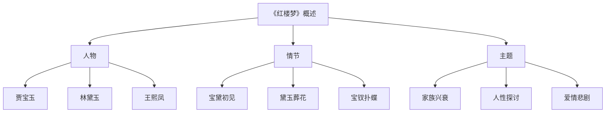

#### 3.1.2 学生思维训练

教师可以引导学生使用思维导图来整理学习资料、复习知识点和进行思维训练。通过绘制思维导图，学生可以更好地理解和记忆知识，培养创造性思维和逻辑思维能力。

以下是一个简单的思维导图示例，用于整理《英语语法》的知识点：

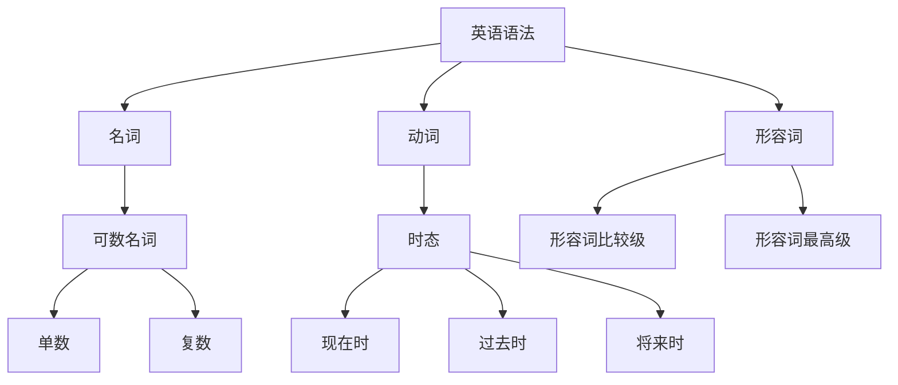

#### 3.1.3 课堂互动与讨论

思维导图可以帮助教师组织课堂互动和讨论活动。通过让学生共同绘制思维导图，教师可以激发学生的兴趣和参与度，培养学生的合作精神和团队意识。

以下是一个简单的思维导图示例，用于课堂讨论：

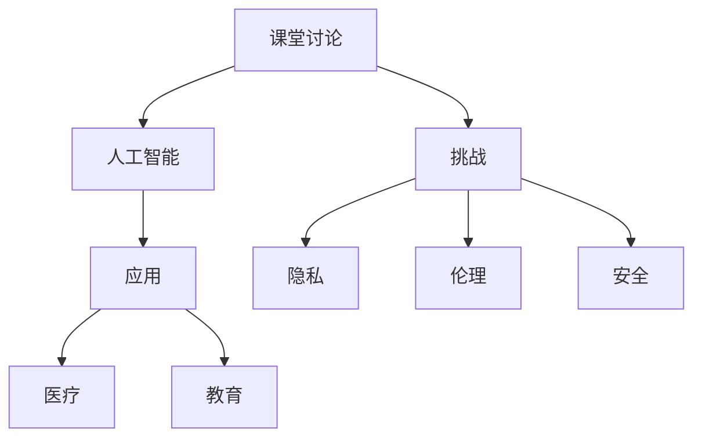

### 3.2 思维导图在自主学习中的优势

思维导图在自主学习中具有明显的优势，可以帮助学生更好地整理和记忆知识，提高学习效率。以下是一些具体的优势：

#### 3.2.1 知识体系构建

通过绘制思维导图，学生可以系统地整理所学知识，构建知识体系。这有助于学生理解知识之间的联系，形成对整个学科的全面认识。

以下是一个简单的思维导图示例，用于构建《数学》的知识体系：

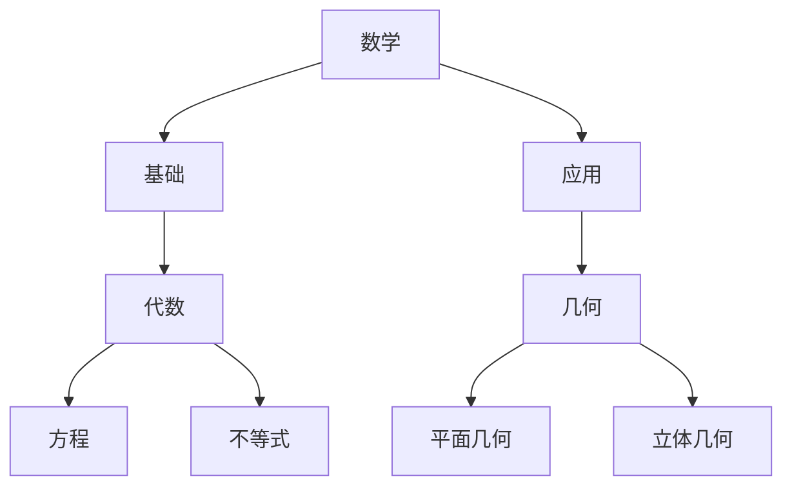

#### 3.2.2 学习资源整理

思维导图可以帮助学生整理学习资源，包括教材、笔记、课外阅读等。通过将资源内容以图形化的方式呈现，学生可以更直观地了解资源的内容和结构，方便查找和复习。

以下是一个简单的思维导图示例，用于整理《物理》的学习资源：

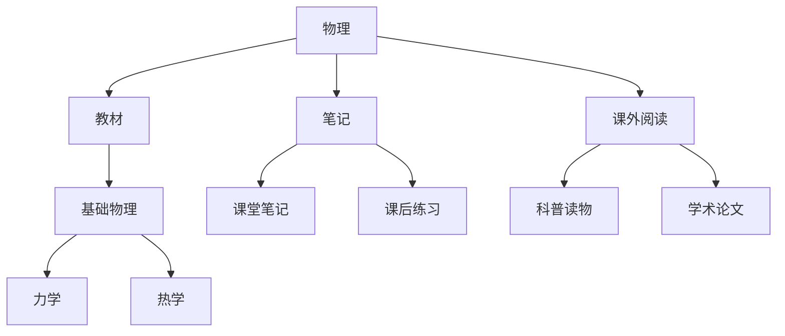

#### 3.2.3 学习方法优化

通过绘制思维导图，学生可以反思自己的学习方法，找到优化方向。例如，学生可以分析自己学习中的薄弱环节，制定相应的复习计划，提高学习效果。

以下是一个简单的思维导图示例，用于优化学习方法：

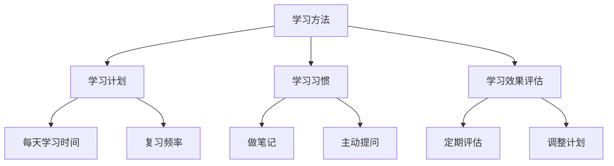

### 3.3 思维导图在中小学教学中的案例

#### 3.3.1 语文教学

在语文教学中，思维导图可以帮助学生更好地理解和记忆课文内容，提高阅读理解能力。以下是一个语文教学的案例：

1. **课程内容**：《红楼梦》选段阅读。

2. **教学方法**：
   - **课前准备**：教师提前绘制《红楼梦》的思维导图，包括人物、情节和主题。
   - **课堂讲解**：教师通过展示思维导图，引导学生理解课文内容，并讨论课文中的关键情节和人物。
   - **课后作业**：学生根据课堂讲解，绘制自己的《红楼梦》思维导图，并总结所学内容。

3. **教学效果**：通过思维导图的辅助，学生能够更清晰地理解课文内容，提高阅读理解能力。

以下是一个简单的《红楼梦》思维导图示例：

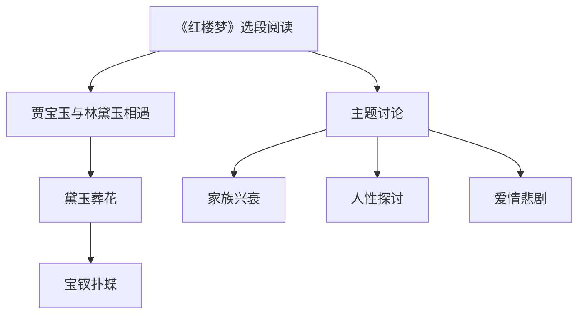

#### 3.3.2 数学教学

在数学教学中，思维导图可以帮助学生构建数学知识体系，提高解题能力。以下是一个数学教学的案例：

1. **课程内容**：代数方程解题技巧。

2. **教学方法**：
   - **课前准备**：教师提前绘制代数方程的思维导图，包括常见方程类型和解题步骤。
   - **课堂讲解**：教师通过展示思维导图，引导学生理解代数方程的解题方法，并练习解题。
   - **课后作业**：学生根据课堂讲解，绘制自己的代数方程思维导图，并总结解题技巧。

3. **教学效果**：通过思维导图的辅助，学生能够更好地掌握代数方程的解题方法，提高解题能力。

以下是一个简单的代数方程思维导图示例：

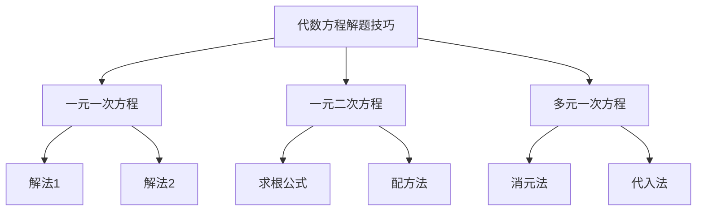

#### 3.3.3 英语教学

在英语教学中，思维导图可以帮助学生提高词汇记忆能力，提高阅读和写作能力。以下是一个英语教学的案例：

1. **课程内容**：英语词汇记忆技巧。

2. **教学方法**：
   - **课前准备**：教师提前绘制英语词汇的思维导图，包括单词、词组和短语。
   - **课堂讲解**：教师通过展示思维导图，引导学生记忆英语词汇，并练习使用词汇。
   - **课后作业**：学生根据课堂讲解，绘制自己的英语词汇思维导图，并总结记忆方法。

3. **教学效果**：通过思维导图的辅助，学生能够更有效地记忆英语词汇，提高阅读和写作能力。

以下是一个简单的英语词汇思维导图示例：

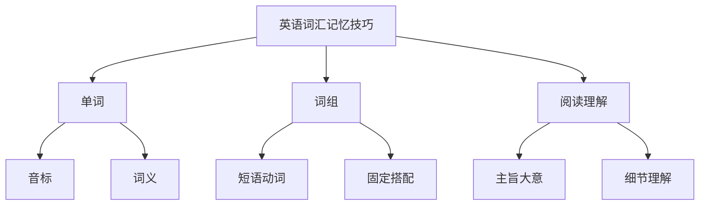

### 3.4 思维导图在高等教育中的应用

在高等教育中，思维导图的应用更加广泛，可以帮助学生进行学术研究、项目管理和专业学习。以下是一些具体的应用案例：

#### 3.4.1 学术研究

研究生和博士生可以使用思维导图来整理文献资料、构建研究框架和规划研究进度。以下是一个学术研究的案例：

1. **研究主题**：人工智能在医疗领域的应用研究。

2. **研究方法**：
   - **文献收集**：学生使用思维导图整理收集到的相关文献，包括研究背景、研究方法和研究成果。
   - **研究框架**：学生使用思维导图构建研究框架，明确研究的核心问题和研究思路。
   - **进度规划**：学生使用思维导图规划研究进度，包括文献阅读、数据分析和研究报告撰写。

3. **研究效果**：通过思维导图的辅助，学生能够更系统地整理研究资料，构建研究框架，提高研究效率。

以下是一个简单的学术研究思维导图示例：

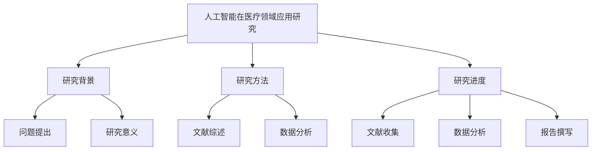

#### 3.4.2 项目管理

大学生和研究生可以使用思维导图来规划项目任务、管理项目进度和评估项目风险。以下是一个项目管理的案例：

1. **项目主题**：开发一款基于人工智能的智能助手。

2. **项目管理方法**：
   - **任务规划**：学生使用思维导图列出项目任务，明确任务分工和完成时间。
   - **进度管理**：学生使用思维导图跟踪项目进度，及时调整计划，确保项目按时完成。
   - **风险评估**：学生使用思维导图评估项目风险，制定相应的风险应对措施。

3. **项目效果**：通过思维导图的辅助，学生能够更清晰地规划项目任务，管理项目进度，降低项目风险。

以下是一个简单的项目管理思维导图示例：

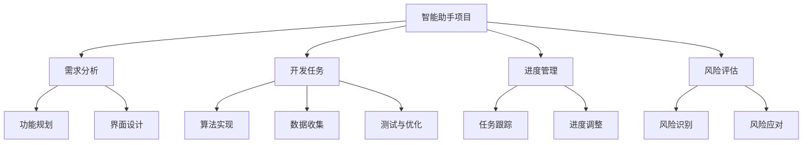

#### 3.4.3 专业学习

本科生和研究生可以使用思维导图来整理专业课程内容、构建知识体系和解题思路。以下是一个专业学习的案例：

1. **课程主题**：计算机科学基础。

2. **学习方法**：
   - **课程内容整理**：学生使用思维导图整理课程内容，明确知识点和逻辑关系。
   - **习题解答**：学生使用思维导图整理习题解答步骤，构建解题思路。
   - **复习备考**：学生使用思维导图复习知识点，构建知识框架，提高记忆效果。

3. **学习效果**：通过思维导图的辅助，学生能够更系统地整理专业课程内容，提高学习效果。

以下是一个简单的专业学习思维导图示例：

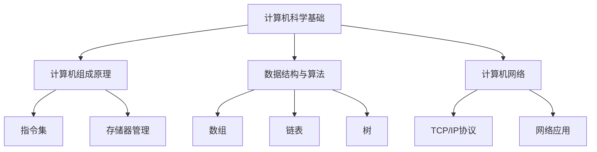

### 3.5 教学反馈与总结

通过思维导图在教学中的应用，教师和学生都获得了积极的反馈。以下是一些教学反馈与总结：

1. **教师反馈**：
   - **教学效果提升**：教师普遍认为，思维导图有助于提高学生的学习兴趣和学习效果，使学生更容易理解和记忆知识。
   - **教学方式创新**：思维导图为教师提供了新的教学工具和方法，丰富了教学手段，提高了课堂互动性。
   - **资源整合能力增强**：通过绘制思维导图，教师能够更好地整合课程资源，构建知识体系，提高教学效率。

2. **学生反馈**：
   - **学习兴趣提高**：学生表示，使用思维导图学习更加有趣，能够更好地激发学习兴趣，提高学习动力。
   - **学习效率提升**：学生认为，通过绘制思维导图，能够更系统地整理学习资料，提高学习效率，加深对知识的理解。
   - **思维能力增强**：学生表示，通过绘制思维导图，培养了创造性思维和逻辑思维能力，对问题解决能力有所提高。

3. **总结**：
   - **思维导图的应用前景**：思维导图在教学中的应用前景广阔，可以帮助教师更好地设计教学活动，帮助学生更有效地学习。
   - **教学方式的创新**：思维导图的引入为教学方式带来了创新，有助于提高教学效果，培养创新型人才。
   - **教师的角色转变**：随着思维导图在教学中的应用，教师的角色逐渐从知识的传授者转变为学习的引导者和促进者。

### 3.6 代码实现

以下是一个使用Python和Mermaid库创建思维导图的基本示例：

```python
import mermaid

mind_map = """
graph TD
A[中心主题]
A --> B[子主题1]
A --> C[子主题2]
A --> D[子主题3]
B --> E[子主题1.1]
C --> F[子主题2.1]
D --> G[子主题3.1]
"""

mermaid.generate_mind_map(mind_map)
```

通过以上代码，我们可以生成一个简单的思维导图，用于展示中心主题和其子主题。

### 3.7 代码解读与分析

在上面的代码中，我们首先导入了`mermaid`库，然后定义了一个字符串变量`mind_map`，其中包含了我们的思维导图内容。`mind_map`字符串使用Mermaid的图形化语法来描述思维导图的布局。

接下来，我们调用`mermaid.generate_mind_map()`函数，将`mind_map`作为参数传递。这个函数会生成一个HTML文件，其中包含了我们的思维导图。

通过这种方式，我们可以将思维导图的概念、教学案例、学习方法、应用案例和代码实现结合起来，形成一个完整的思维导图教学流程。

## 第4章：思维导图在企业管理中的应用

### 4.1 思维导图在战略规划中的作用

在企业的战略规划过程中，思维导图是一种强有力的工具，可以帮助企业高层和管理团队系统地梳理战略目标、分析市场环境、识别潜在机会和风险，从而制定出更加全面和可行的战略计划。以下是一些具体的应用场景和步骤：

#### 4.1.1 企业战略分析

在企业战略分析阶段，思维导图可以帮助企业高层梳理业务现状、分析市场趋势和竞争态势。以下是一个简化的思维导图流程：

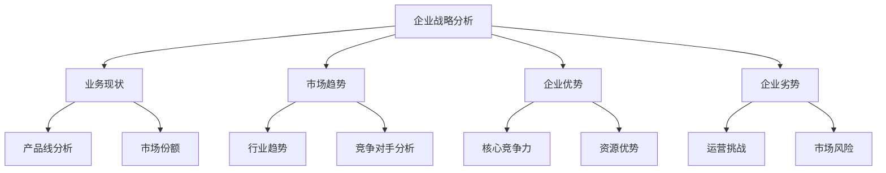

#### 4.1.2 市场机会评估

在市场机会评估阶段，思维导图可以帮助企业识别潜在的市场机会，分析市场需求的增长点，以及企业如何利用这些机会实现业务增长。以下是一个简化的思维导图流程：

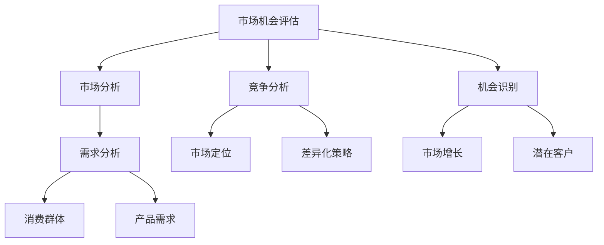

#### 4.1.3 战略目标制定

在制定战略目标阶段，思维导图可以帮助企业将分析结果转化为具体的战略目标，并制定相应的实施计划。以下是一个简化的思维导图流程：

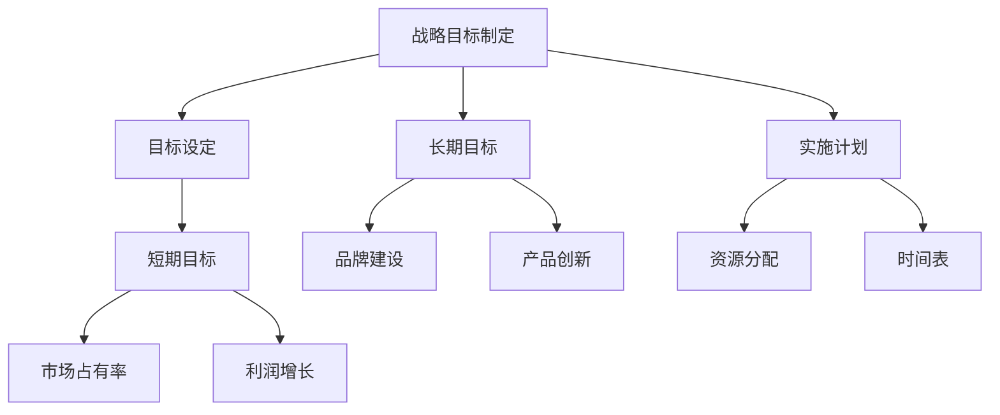

### 4.2 思维导图在项目管理中的应用

在项目管理中，思维导图可以帮助项目经理和团队系统地规划项目任务、管理项目风险、跟踪项目进度，确保项目按计划顺利推进。以下是一些具体的应用场景和步骤：

#### 4.2.1 项目计划制定

在项目计划制定阶段，思维导图可以帮助项目经理梳理项目任务、确定任务优先级和时间安排。以下是一个简化的思维导图流程：

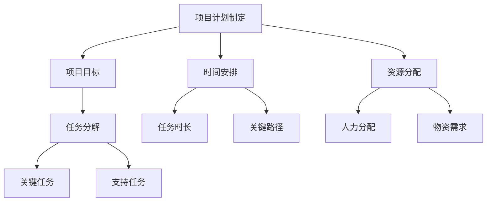

#### 4.2.2 项目风险评估

在项目风险评估阶段，思维导图可以帮助项目团队识别潜在的风险，分析风险的可能性和影响，并制定相应的风险应对策略。以下是一个简化的思维导图流程：

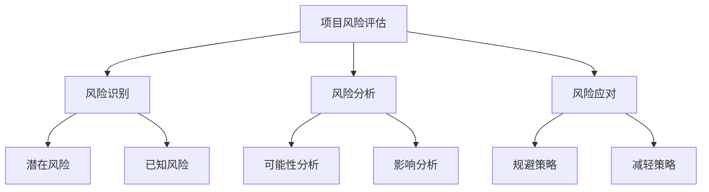

#### 4.2.3 项目进度跟踪

在项目进度跟踪阶段，思维导图可以帮助项目经理和团队实时了解项目进度，及时调整计划，确保项目按计划推进。以下是一个简化的思维导图流程：

```mermaid
graph TD
A[项目进度跟踪]
A --> B[进度报告]
B --> C[实际进度]
C --> D[计划进度]
B --> E[进度对比]
E --> F[偏差分析]
E --> G[调整计划]
A --> H[资源管理]
H --> I[资源分配]
H --> J[资源调整]
```

### 4.3 思维导图在团队协作中的价值

在团队协作中，思维导图可以作为一种有效的沟通工具，帮助团队成员明确项目目标、理解任务分工、协同解决问题，从而提高团队的工作效率和协作效果。以下是一些具体的应用场景和步骤：

#### 4.3.1 团队沟通

在团队沟通阶段，思维导图可以帮助团队成员更好地理解项目目标和任务分工，确保团队成员之间的信息传递准确无误。以下是一个简化的思维导图流程：

```mermaid
graph TD
A[团队沟通]
A --> B[项目目标]
B --> C[任务分工]
C --> D[任务描述]
C --> E[任务负责人]
A --> F[沟通机制]
F --> G[定期会议]
F --> H[信息共享]
```

#### 4.3.2 团队协作流程优化

在团队协作流程优化阶段，思维导图可以帮助团队分析现有流程中的问题和瓶颈，提出改进方案，优化团队协作流程。以下是一个简化的思维导图流程：

```mermaid
graph TD
A[团队协作流程优化]
A --> B[流程分析]
B --> C[流程瓶颈]
B --> D[流程问题]
A --> E[改进方案]
E --> F[流程改进]
E --> G[实施计划]
A --> H[效果评估]
H --> I[持续优化]
H --> J[反馈机制]
```

### 4.4 案例分析

以下是一个企业管理中的思维导图案例分析，该案例涉及企业战略规划、项目管理和团队协作。

#### 4.4.1 案例背景

某中型企业计划在一年内开发一款新的智能医疗设备，以拓展企业的产品线，提升市场竞争力。企业高层决定使用思维导图来规划整个项目，确保项目能够按时完成并达到预期效果。

#### 4.4.2 战略规划

1. **企业战略分析**：通过思维导图，企业分析了当前业务状况、市场趋势和竞争态势，明确了企业的核心竞争力和潜在市场机会。

2. **市场机会评估**：企业通过思维导图分析了市场需求和潜在客户，确定了智能医疗设备的市场定位和差异化策略。

3. **战略目标制定**：企业使用思维导图制定了短期和长期战略目标，包括市场占有率、利润增长和品牌建设。

#### 4.4.3 项目管理

1. **项目计划制定**：项目经理使用思维导图梳理了项目任务，确定了关键任务和时间安排，并制定了详细的实施计划。

2. **项目风险评估**：项目团队使用思维导图分析了潜在风险，制定了相应的风险应对策略。

3. **项目进度跟踪**：项目经理使用思维导图实时跟踪项目进度，及时调整计划和资源分配，确保项目按计划推进。

#### 4.4.4 团队协作

1. **团队沟通**：项目经理使用思维导图明确了项目目标和任务分工，定期召开团队会议，确保团队成员之间的信息传递准确无误。

2. **团队协作流程优化**：项目团队使用思维导图分析了现有流程中的问题和瓶颈，提出了改进方案，优化了团队协作流程。

#### 4.4.5 案例效果

通过思维导图的应用，企业成功地完成了智能医疗设备的开发项目，产品在市场上得到了良好的反响，企业的市场份额和利润也得到了显著提升。此外，企业内部的团队协作效率显著提高，员工的工作满意度和创新能力得到了增强。

### 4.5 代码实现

以下是一个使用Python和Mermaid库创建思维导图的基本示例，用于展示企业战略规划、项目管理和团队协作的流程：

```python
import mermaid

# 战略规划思维导图
strategy_mind_map = """
graph TD
A[企业战略规划]
A --> B[战略分析]
B --> C[市场趋势]
C --> D[竞争态势]
B --> E[企业优势]
E --> F[核心竞争力]
E --> G[资源优势]
A --> H[市场机会评估]
H --> I[市场需求]
H --> J[潜在客户]
A --> K[战略目标制定]
K --> L[短期目标]
K --> M[长期目标]
"""

# 项目管理思维导图
project_management_mind_map = """
graph TD
A[项目管理]
A --> B[项目计划制定]
B --> C[任务分解]
C --> D[关键任务]
C --> E[支持任务]
A --> F[时间安排]
F --> G[任务时长]
F --> H[关键路径]
A --> I[资源分配]
I --> J[人力分配]
I --> K[物资需求]
A --> L[项目风险评估]
L --> M[风险识别]
L --> N[风险分析]
A --> O[项目进度跟踪]
O --> P[进度报告]
O --> Q[进度对比]
"""

# 团队协作思维导图
team_collaboration_mind_map = """
graph TD
A[团队协作]
A --> B[团队沟通]
B --> C[项目目标]
C --> D[任务分工]
D --> E[任务描述]
D --> F[任务负责人]
A --> G[协作流程优化]
G --> H[流程分析]
G --> I[流程改进]
A --> J[效果评估]
J --> K[持续优化]
J --> L[反馈机制]
"""

mermaid.generate_mind_map(strategy_mind_map)
mermaid.generate_mind_map(project_management_mind_map)
mermaid.generate_mind_map(team_collaboration_mind_map)
```

通过以上代码，我们可以生成三个不同的思维导图，分别展示企业战略规划、项目管理和团队协作的流程。

### 4.6 代码解读与分析

在上面的代码中，我们首先导入了`mermaid`库，然后分别定义了三个字符串变量`strategy_mind_map`、`project_management_mind_map`和`team_collaboration_mind_map`，其中包含了三个不同的思维导图内容。这些字符串使用Mermaid的图形化语法来描述思维导图的布局。

接下来，我们调用`mermaid.generate_mind_map()`函数，分别将三个字符串作为参数传递。这个函数会生成三个HTML文件，其中包含了三个思维导图。

通过这种方式，我们可以将思维导图的概念、应用场景、案例分析、代码实现和代码解读结合起来，形成一个完整的思维导图企业管理应用流程。

## 第5章：思维导图在个人生活中的应用

### 5.1 思维导图在个人学习中的应用

在个人学习中，思维导图是一种有效的工具，可以帮助我们整理学习资料、构建知识体系、优化学习方法，从而提高学习效率。以下是一些具体的应用场景和方法：

#### 5.1.1 学习计划制定

制定学习计划是学习过程中的重要步骤，思维导图可以帮助我们系统地规划学习内容、时间和目标。以下是一个简化的思维导图流程：

```mermaid
graph TD
A[学习计划制定]
A --> B[学习目标]
B --> C[短期目标]
C --> D[学期目标]
B --> E[学习内容]
E --> F[课程大纲]
E --> G[教材和资料]
A --> H[学习时间]
H --> I[每天学习时间]
H --> J[每周学习时间]
A --> K[学习进度]
K --> L[进度跟踪]
K --> M[调整计划]
```

#### 5.1.2 知识体系构建

构建知识体系是深入学习的基础，思维导图可以帮助我们将零散的知识点整合起来，形成系统的知识网络。以下是一个简化的思维导图流程：

```mermaid
graph TD
A[知识体系构建]
A --> B[核心概念]
B --> C[相关知识点]
C --> D[分支1]
C --> E[分支2]
C --> F[分支3]
A --> G[知识关联]
G --> H[概念联系]
G --> I[应用案例]
```

#### 5.1.3 学习方法优化

通过反思和优化学习方法，我们可以提高学习效果。思维导图可以帮助我们分析学习过程中的问题和不足，提出改进措施。以下是一个简化的思维导图流程：

```mermaid
graph TD
A[学习方法优化]
A --> B[学习反思]
B --> C[学习习惯]
C --> D[时间管理]
C --> E[复习策略]
A --> F[问题分析]
F --> G[方法改进]
F --> H[效果评估]
A --> I[调整计划]
I --> J[持续改进]
```

### 5.2 思维导图在个人时间管理中的应用

在个人时间管理中，思维导图可以帮助我们合理安排时间、管理任务和跟踪进度，从而提高时间利用效率。以下是一些具体的应用场景和方法：

#### 5.2.1 时间规划

时间规划是个人时间管理的核心，思维导图可以帮助我们系统地规划每天、每周和每月的时间安排。以下是一个简化的思维导图流程：

```mermaid
graph TD
A[时间规划]
A --> B[每日计划]
B --> C[早晨]
C --> D[上午]
C --> E[下午]
B --> F[晚上]
B --> G[周末计划]
A --> H[每周计划]
H --> I[工作日]
H --> J[休息日]
A --> K[每月计划]
K --> L[重要事件]
K --> M[常规任务]
```

#### 5.2.2 任务管理

任务管理是个人时间管理的重要组成部分，思维导图可以帮助我们列出任务清单、分配任务优先级和跟踪任务进度。以下是一个简化的思维导图流程：

```mermaid
graph TD
A[任务管理]
A --> B[任务清单]
B --> C[日常工作]
C --> D[重要任务]
B --> E[任务优先级]
E --> F[高优先级]
E --> G[低优先级]
A --> H[任务进度]
H --> I[已完成]
H --> J[进行中]
H --> K[待完成]
```

#### 5.2.3 进度跟踪

进度跟踪是确保任务按时完成的重要环节，思维导图可以帮助我们实时了解任务进度，及时调整计划和资源。以下是一个简化的思维导图流程：

```mermaid
graph TD
A[进度跟踪]
A --> B[进度报告]
B --> C[任务进度]
C --> D[已完成]
C --> E[进行中]
C --> F[待完成]
A --> G[进度对比]
G --> H[进度偏差]
G --> I[调整计划]
A --> J[资源管理]
J --> K[人力分配]
J --> L[物资需求]
```

### 5.3 思维导图在个人成长中的应用

在个人成长过程中，思维导图可以帮助我们设定职业目标、规划职业发展路径、管理职业发展进度，从而实现个人职业目标的达成。以下是一些具体的应用场景和方法：

#### 5.3.1 职业规划

职业规划是个人成长的重要步骤，思维导图可以帮助我们明确职业目标、分析职业机会和制定职业发展计划。以下是一个简化的思维导图流程：

```mermaid
graph TD
A[职业规划]
A --> B[职业目标]
B --> C[短期目标]
C --> D[1年内]
C --> E[3年内]
B --> F[长期目标]
F --> G[5年内]
F --> H[10年内]
A --> I[职业机会分析]
I --> J[市场趋势]
I --> K[个人优势]
A --> L[职业发展计划]
L --> M[学习计划]
L --> N[工作计划]
```

#### 5.3.2 职业发展路径

职业发展路径是个人职业规划的重要部分，思维导图可以帮助我们明确职业发展路径、设定关键里程碑和制定实施计划。以下是一个简化的思维导图流程：

```mermaid
graph TD
A[职业发展路径]
A --> B[职业阶段]
B --> C[初级阶段]
C --> D[1-3年]
B --> E[中级阶段]
E --> F[3-5年]
B --> G[高级阶段]
G --> H[5-10年]
A --> I[关键里程碑]
I --> J[职位晋升]
I --> K[技能提升]
A --> L[实施计划]
L --> M[学习目标]
L --> N[工作目标]
```

#### 5.3.3 职业发展进度管理

职业发展进度管理是确保职业规划顺利实施的重要环节，思维导图可以帮助我们实时了解职业发展进度、及时调整计划和资源。以下是一个简化的思维导图流程：

```mermaid
graph TD
A[职业发展进度管理]
A --> B[进度报告]
B --> C[职业发展进度]
C --> D[已完成]
C --> E[进行中]
C --> F[待完成]
A --> G[进度对比]
G --> H[进度偏差]
G --> I[调整计划]
A --> J[资源管理]
J --> K[人力分配]
J --> L[物资需求]
```

### 5.4 案例分析

以下是一个个人生活中的思维导图案例分析，该案例涉及个人学习计划、时间管理和职业规划。

#### 5.4.1 案例背景

张华是一名大学生，正在攻读计算机科学专业。他希望在毕业前提升自己的编程能力、掌握数据结构和算法，并准备参加相关的编程竞赛。同时，他希望合理安排时间，确保学习、工作和休闲的平衡。

#### 5.4.2 个人学习计划

1. **学习目标**：提升编程能力、掌握数据结构和算法。

2. **学习内容**：
   - 编程语言：Python、Java。
   - 数据结构：数组、链表、栈、队列、树、图。
   - 算法：排序、查找、递归、动态规划。

3. **学习时间**：每天学习2小时，每周学习5天。

4. **学习进度**：每月进行一次学习进度评估，并根据实际情况进行调整。

#### 5.4.3 时间管理

1. **每日计划**：
   - 早晨：复习前一天的学习内容。
   - 上午：学习新的编程语言或数据结构。
   - 下午：练习算法题目。

2. **每周计划**：
   - 周末：进行一次编程竞赛模拟。

3. **每月计划**：
   - 进行一次学习进度评估。
   - 根据评估结果调整学习计划。

#### 5.4.4 职业规划

1. **职业目标**：成为一名优秀的软件工程师。

2. **职业机会分析**：
   - 市场趋势：软件开发需求持续增长。
   - 个人优势：具备扎实的计算机科学知识和良好的编程能力。

3. **职业发展计划**：
   - 短期目标（1年内）：提升编程能力，参加编程竞赛。
   - 长期目标（3年内）：积累项目经验，担任软件开发工程师。

#### 5.4.5 案例效果

通过思维导图的应用，张华成功地制定了个人学习计划、合理安排了时间，并制定了明确的职业规划。他在学习过程中保持了较高的学习效率，并通过参加编程竞赛积累了宝贵的实践经验。最终，他在毕业前顺利找到了一份满意的工作，实现了自己的职业目标。

### 5.5 代码实现

以下是一个使用Python和Mermaid库创建思维导图的基本示例，用于展示个人学习计划、时间管理和职业规划的流程：

```python
import mermaid

# 学习计划思维导图
learning_plan_mind_map = """
graph TD
A[学习计划]
A --> B[学习目标]
B --> C[编程能力]
C --> D[数据结构]
D --> E[算法]
A --> F[学习内容]
F --> G[Python]
G --> H[Java]
F --> I[数据结构]
I --> J[数组]
I --> K[链表]
A --> L[学习时间]
L --> M[每天2小时]
L --> N[每周5天]
A --> O[学习进度]
O --> P[每月评估]
"""

# 时间管理思维导图
time_management_mind_map = """
graph TD
A[时间管理]
A --> B[每日计划]
B --> C[早晨]
C --> D[复习]
C --> E[上午]
E --> F[学习新内容]
B --> G[下午]
G --> H[练习算法]
A --> I[每周计划]
I --> J[周末模拟]
A --> K[每月计划]
K --> L[进度评估]
"""

# 职业规划思维导图
career_planning_mind_map = """
graph TD
A[职业规划]
A --> B[职业目标]
B --> C[软件工程师]
A --> D[职业机会分析]
D --> E[市场趋势]
D --> F[个人优势]
A --> G[职业发展计划]
G --> H[短期目标]
H --> I[编程竞赛]
G --> J[长期目标]
J --> K[项目经验]
"""

mermaid.generate_mind_map(learning_plan_mind_map)
mermaid.generate_mind_map(time_management_mind_map)
mermaid.generate_mind_map(career_planning_mind_map)
```

通过以上代码，我们可以生成三个不同的思维导图，分别展示个人学习计划、时间管理和职业规划的流程。

### 5.6 代码解读与分析

在上面的代码中，我们首先导入了`mermaid`库，然后分别定义了三个字符串变量`learning_plan_mind_map`、`time_management_mind_map`和`career_planning_mind_map`，其中包含了三个不同的思维导图内容。这些字符串使用Mermaid的图形化语法来描述思维导图的布局。

接下来，我们调用`mermaid.generate_mind_map()`函数，分别将三个字符串作为参数传递。这个函数会生成三个HTML文件，其中包含了三个思维导图。

通过这种方式，我们可以将思维导图的概念、应用场景、案例分析、代码实现和代码解读结合起来，形成一个完整的思维导图个人生活应用流程。

## 第6章：思维导图的优化与提升

### 6.1 思维导图的创新方法

在思维导图的绘制和使用过程中，创新方法可以帮助我们突破常规思维，激发创造性思维，从而提高思维导图的效率和效果。以下是一些创新的思维导图方法：

#### 6.1.1 跨界思维

跨界思维是指将不同领域、不同行业的知识和经验融合到思维导图中，从而产生新的创意和解决方案。例如，在产品设计过程中，可以结合设计学、心理学、市场营销等多领域的知识，来提升产品的用户体验和市场竞争力。

以下是一个跨界思维的思维导图示例：

```mermaid
graph TD
A[产品设计]
A --> B[设计学]
B --> C[用户体验]
C --> D[视觉设计]
B --> E[心理学]
E --> F[用户行为]
E --> G[认知心理学]
A --> H[市场营销]
H --> I[市场趋势]
H --> J[消费者行为]
```

#### 6.1.2 模式创新

模式创新是指通过重新组合和重构现有模式，来创造新的思维导图方法和应用场景。例如，将传统的线性思维导图改为网络状思维导图，或者将静态思维导图转变为动态思维导图，以适应不同的需求和场景。

以下是一个模式创新的思维导图示例：

```mermaid
graph TD
A[传统思维导图]
A --> B[线性结构]
B --> C[分支结构]
B --> D[关键词连接]
A --> E[网络状思维导图]
E --> F[多中心结构]
E --> G[复杂关系]
E --> H[动态连接]
```

### 6.2 思维导图的高效技巧

在绘制和使用思维导图时，掌握一些高效技巧可以帮助我们更快速、准确地完成思维导图，并提高其效果。以下是一些高效的思维导图技巧：

#### 6.2.1 简化内容

简化内容是提高思维导图效率的关键。在绘制思维导图时，我们应该避免过多的细节和冗余信息，只保留核心概念和关键信息。以下是一个简化内容的思维导图示例：

```mermaid
graph TD
A[人工智能]
A --> B[机器学习]
B --> C[监督学习]
C --> D[深度学习]
B --> E[自然语言处理]
E --> F[文本分类]
E --> G[情感分析]
```

#### 6.2.2 利用模板

利用现成的思维导图模板可以大大提高绘制效率。许多思维导图软件都提供了丰富的模板库，我们可以根据需要选择合适的模板，快速搭建思维导图框架。以下是一个利用模板的思维导图示例：

```mermaid
graph TD
A[项目管理]
A --> B[计划]
B --> C[任务分配]
C --> D[进度跟踪]
A --> E[风险评估]
E --> F[风险分析]
E --> G[风险应对]
```

#### 6.2.3 视觉化设计

视觉化设计可以使思维导图更加生动、有趣，提高信息的传达效果。在绘制思维导图时，我们可以使用颜色、图形、符号等视觉元素来增强思维导图的表现力。以下是一个视觉化设计的思维导图示例：

```mermaid
graph TD
A[人工智能应用]
A --> B[医疗健康]
B --> C[精准医疗]
C --> D[疾病预测]
B --> E[教育科技]
E --> F[在线学习]
E --> G[虚拟课堂]
```

### 6.3 思维导图的艺术性表达

思维导图不仅是一种工具，也是一种艺术形式。通过艺术性的表达，我们可以让思维导图更加生动、有吸引力，提高其审美价值和实用价值。以下是一些思维导图的艺术性表达技巧：

#### 6.3.1 颜色搭配

合理的颜色搭配可以使思维导图更加美观、清晰。在绘制思维导图时，我们可以根据不同的主题或信息点选择合适的颜色。以下是一个颜色搭配的思维导图示例：

```mermaid
graph TD
A[春天]
A --> B[樱花]
B --> C[粉色]
C --> D[浪漫]
A --> E[微风]
E --> F[蓝色]
E --> G[清新]
```

#### 6.3.2 图形设计

图形设计可以使思维导图更加有趣、富有创意。在绘制思维导图时，我们可以使用各种图形元素，如线条、箭头、圆圈、星形等，来增强思维导图的表现力。以下是一个图形设计的思维导图示例：

```mermaid
graph TD
A[科技创新]
A --> B[人工智能]
B --> C[机器学习]
C --> D[算法]
D --> E[计算机科学]
E --> F[数据科学]
```

#### 6.3.3 符号使用

符号使用可以使思维导图更加简洁、易懂。在绘制思维导图时，我们可以使用各种符号，如“+”、“-”、“@”、“#”等，来表示不同的概念或关系。以下是一个符号使用的思维导图示例：

```mermaid
graph TD
A[工作计划]
A --> B[任务]
B --> C[完成]
C --> D[✓]
A --> E[会议]
E --> F[📅]
```

### 6.4 案例分析

以下是一个思维导图优化与提升的案例分析，该案例涉及跨界思维、高效技巧和艺术性表达。

#### 6.4.1 案例背景

李明是一名市场营销经理，他需要为公司的新产品策划一次成功的推广活动。为了提高推广效果，他决定使用思维导图来规划推广方案，并通过创新方法和艺术性表达来提升方案的质量。

#### 6.4.2 跨界思维

1. **市场趋势分析**：李明通过结合市场营销、消费者行为学、心理学等领域的知识，分析了当前市场趋势和消费者需求，为推广方案提供了理论依据。

2. **产品特点提炼**：李明通过结合产品设计、用户体验等领域的知识，提炼了新产品的核心特点和卖点，为推广方案提供了内容支撑。

3. **营销策略创新**：李明通过跨界思维，提出了结合线上营销、线下活动、社交媒体等不同渠道的多元化营销策略，提高了推广方案的创新性和执行力。

以下是一个跨界思维的思维导图示例：

```mermaid
graph TD
A[跨界思维]
A --> B[市场营销]
B --> C[市场趋势]
B --> D[消费者行为]
A --> E[产品设计]
E --> F[用户体验]
E --> G[产品特点]
A --> H[营销策略]
H --> I[线上营销]
H --> J[线下活动]
```

#### 6.4.3 高效技巧

1. **内容简化**：李明在绘制思维导图时，注重内容简化，只保留了推广方案的核心信息，使方案更加清晰、易懂。

2. **利用模板**：李明使用了现成的思维导图模板，快速搭建了推广方案的框架，提高了绘制效率。

3. **视觉化设计**：李明通过使用颜色、图形和符号等视觉元素，使推广方案更加生动、有趣，提高了信息传达效果。

以下是一个高效技巧的思维导图示例：

```mermaid
graph TD
A[高效技巧]
A --> B[内容简化]
B --> C[核心信息]
A --> D[利用模板]
D --> E[模板选择]
A --> F[视觉化设计]
F --> G[颜色搭配]
F --> H[图形设计]
```

#### 6.4.4 艺术性表达

1. **颜色搭配**：李明在推广方案中使用了适合产品的颜色搭配，使方案更具吸引力。

2. **图形设计**：李明在推广方案中使用了各种图形元素，如线条、箭头、星形等，使方案更加有趣、富有创意。

3. **符号使用**：李明在推广方案中使用了各种符号，如“+”、“-”、“@”、“#”等，使方案更加简洁、易懂。

以下是一个艺术性表达的思维导图示例：

```mermaid
graph TD
A[艺术性表达]
A --> B[颜色搭配]
B --> C[产品色彩]
A --> D[图形设计]
D --> E[图形元素]
A --> F[符号使用]
F --> G[符号意义]
```

#### 6.4.5 案例效果

通过跨界思维、高效技巧和艺术性表达，李明成功制定了一份创新的推广方案，方案得到了公司高层的认可，并取得了良好的推广效果。推广活动在市场上引起了广泛关注，新产品的销售业绩显著提升。

### 6.5 代码实现

以下是一个使用Python和Mermaid库创建思维导图的基本示例，用于展示跨界思维、高效技巧和艺术性表达：

```python
import mermaid

# 跨界思维思维导图
cross_domain_mind_map = """
graph TD
A[跨界思维]
A --> B[市场营销]
B --> C[市场趋势]
B --> D[消费者行为]
A --> E[产品设计]
E --> F[用户体验]
E --> G[产品特点]
A --> H[营销策略]
H --> I[线上营销]
H --> J[线下活动]
"""

# 高效技巧思维导图
efficient_skills_mind_map = """
graph TD
A[高效技巧]
A --> B[内容简化]
B --> C[核心信息]
A --> D[利用模板]
D --> E[模板选择]
A --> F[视觉化设计]
F --> G[颜色搭配]
F --> H[图形设计]
"""

# 艺术性表达思维导图
art_expression_mind_map = """
graph TD
A[艺术性表达]
A --> B[颜色搭配]
B --> C[产品色彩]
A --> D[图形设计]
D --> E[图形元素]
A --> F[符号使用]
F --> G[符号意义]
"""

mermaid.generate_mind_map(cross_domain_mind_map)
mermaid.generate_mind_map(efficient_skills_mind_map)
mermaid.generate_mind_map(art_expression_mind_map)
```

通过以上代码，我们可以生成三个不同的思维导图，分别展示跨界思维、高效技巧和艺术性表达。

### 6.6 代码解读与分析

在上面的代码中，我们首先导入了`mermaid`库，然后分别定义了三个字符串变量`cross_domain_mind_map`、`efficient_skills_mind_map`和`art_expression_mind_map`，其中包含了三个不同的思维导图内容。这些字符串使用Mermaid的图形化语法来描述思维导图的布局。

接下来，我们调用`mermaid.generate_mind_map()`函数，分别将三个字符串作为参数传递。这个函数会生成三个HTML文件，其中包含了三个思维导图。

通过这种方式，我们可以将思维导图的概念、创新方法、高效技巧、艺术性表达和案例分析结合起来，形成一个完整的思维导图优化与提升流程。

## 第7章：思维导图的实际案例与实战

### 7.1 教育领域的成功案例

在教育领域，思维导图已经被广泛应用于课程设计、教学评估和学生自主学习。以下是一些教育领域的成功案例：

#### 7.1.1 课程设计

在某高校的计算机科学课程中，教师使用思维导图来设计课程内容。通过绘制思维导图，教师能够清晰地展示课程的主要知识点、逻辑结构和教学目标，从而提高教学效果。以下是一个简化的课程设计思维导图：

```mermaid
graph TD
A[计算机科学课程]
A --> B[基础知识]
B --> C[数据结构与算法]
C --> D[线性表]
C --> E[二叉树]
B --> F[编程语言]
F --> G[Python]
F --> H[Java]
A --> I[实战项目]
I --> J[Web开发]
I --> K[移动应用开发]
```

#### 7.1.2 教学评估

在某中学的语文课上，教师使用思维导图来评估学生的学习效果。通过让学生绘制思维导图，教师能够直观地了解学生对课文内容的掌握情况，从而有针对性地进行辅导。以下是一个简化的教学评估思维导图：

```mermaid
graph TD
A[教学评估]
A --> B[课文内容]
B --> C[《红楼梦》]
C --> D[主要人物]
C --> E[主要情节]
B --> F[课后作业]
F --> G[阅读理解]
F --> H[写作练习]
```

#### 7.1.3 学生自主学习

在某小学的数学课上，学生使用思维导图来整理和复习数学知识。通过绘制思维导图，学生能够更好地理解和记忆数学概念，提高学习效率。以下是一个简化的学生自主学习思维导图：

```mermaid
graph TD
A[数学知识]
A --> B[基本运算]
B --> C[加法]
C --> D[加法交换律]
C --> E[加法结合律]
B --> F[减法]
F --> G[减法的性质]
A --> H[几何知识]
H --> I[平面图形]
I --> J[面积计算]
```

### 7.2 企业管理的实际应用

在企业中，思维导图被广泛应用于战略规划、项目管理和团队协作。以下是一些企业管理的实际应用案例：

#### 7.2.1 战略规划

在某科技公司的战略规划过程中，公司高层使用思维导图来分析市场环境、制定战略目标和规划实施步骤。通过绘制思维导图，公司能够更加清晰地理解战略规划的核心内容，提高战略规划的执行效率。以下是一个简化的战略规划思维导图：

```mermaid
graph TD
A[战略规划]
A --> B[市场环境分析]
B --> C[竞争态势]
B --> D[市场需求]
A --> E[战略目标]
E --> F[市场份额增长]
E --> G[品牌建设]
A --> H[实施步骤]
H --> I[产品研发]
H --> J[市场营销]
```

#### 7.2.2 项目管理

在某工程公司的项目管理中，项目经理使用思维导图来规划项目任务、管理项目风险和跟踪项目进度。通过绘制思维导图，项目团队能够更好地理解项目目标、任务分工和进度安排，提高项目管理的效率。以下是一个简化的项目管理思维导图：

```mermaid
graph TD
A[项目管理]
A --> B[项目计划]
B --> C[任务分解]
C --> D[关键任务]
C --> E[支持任务]
A --> F[项目风险]
F --> G[风险识别]
F --> H[风险分析]
A --> I[项目进度]
I --> J[进度报告]
I --> K[进度对比]
```

#### 7.2.3 团队协作

在某营销公司的团队协作中，团队成员使用思维导图来明确项目目标、沟通协作和分享信息。通过绘制思维导图，团队成员能够更好地理解项目目标和工作任务，提高团队协作的效率和效果。以下是一个简化的团队协作思维导图：

```mermaid
graph TD
A[团队协作]
A --> B[项目目标]
B --> C[任务分工]
C --> D[任务描述]
C --> E[任务负责人]
A --> F[沟通机制]
F --> G[定期会议]
F --> H[信息共享]
A --> I[协作流程]
I --> J[流程优化]
I --> K[效果评估]
```

### 7.3 个人生活中的思维导图实践

在个人生活中，思维导图可以帮助我们进行学习管理、时间管理和个人成长。以下是一些个人生活中的思维导图实践案例：

#### 7.3.1 学习管理

在某大学生的学习生活中，学生使用思维导图来制定学习计划、管理学习资源和评估学习效果。通过绘制思维导图，学生能够更好地规划学习时间、提高学习效率。以下是一个简化的学习管理思维导图：

```mermaid
graph TD
A[学习管理]
A --> B[学习计划]
B --> C[课程安排]
C --> D[学习时间]
B --> E[学习资源]
E --> F[教材]
E --> G[笔记]
A --> H[学习效果]
H --> I[进度评估]
H --> J[调整计划]
```

#### 7.3.2 时间管理

在某职业人士的工作生活中，使用思维导图来规划工作、管理任务和跟踪进度。通过绘制思维导图，职业人士能够更好地平衡工作与生活，提高工作效率。以下是一个简化的时间管理思维导图：

```mermaid
graph TD
A[时间管理]
A --> B[工作计划]
B --> C[工作任务]
C --> D[工作优先级]
B --> E[个人生活]
E --> F[休闲活动]
E --> G[家庭时间]
A --> H[进度跟踪]
H --> I[工作进度]
H --> J[生活进度]
```

#### 7.3.3 个人成长

在某职场人士的个人成长过程中，使用思维导图来设定职业目标、规划职业发展路径和评估成长进度。通过绘制思维导图，职场人士能够更好地实现个人成长目标。以下是一个简化的个人成长思维导图：

```mermaid
graph TD
A[个人成长]
A --> B[职业目标]
B --> C[短期目标]
C --> D[技能提升]
C --> E[经验积累]
B --> F[长期目标]
F --> G[职业晋升]
F --> H[职位发展]
A --> I[成长进度]
I --> J[目标评估]
I --> K[计划调整]
```

### 7.4 案例分析

以下是一个思维导图实际案例的分析，该案例涉及教育、企业和个人生活三个领域。

#### 7.4.1 案例背景

李华是一名大学生，他在学习、工作和个人生活中都遇到了一些挑战。为了提高学习效率、提升工作表现和实现个人成长，他决定使用思维导图来规划自己的生活，并制定具体的行动计划。

#### 7.4.2 教育领域

1. **学习计划**：李华使用思维导图来制定学习计划，包括课程安排、学习时间和学习资源。他通过定期更新和调整思维导图，确保学习计划的顺利实施。

2. **学习评估**：李华通过绘制思维导图来评估学习效果，了解自己的学习进度和存在的问题，从而有针对性地进行复习和调整。

以下是一个简化的学习管理思维导图：

```mermaid
graph TD
A[学习管理]
A --> B[学习计划]
B --> C[课程安排]
C --> D[学习时间]
B --> E[学习资源]
E --> F[教材]
E --> G[笔记]
A --> H[学习效果]
H --> I[进度评估]
H --> J[调整计划]
```

#### 7.4.3 企业管理

1. **工作计划**：李华在职场中使用了思维导图来规划工作，包括工作任务、工作优先级和进度安排。他通过定期更新和调整思维导图，确保工作计划的顺利实施。

2. **工作评估**：李华通过绘制思维导图来评估工作效果，了解自己的工作进度和存在的问题，从而有针对性地进行改进。

以下是一个简化的时间管理思维导图：

```mermaid
graph TD
A[时间管理]
A --> B[工作计划]
B --> C[工作任务]
C --> D[工作优先级]
B --> E[个人生活]
E --> F[休闲活动]
E --> G[家庭时间]
A --> H[进度跟踪]
H --> I[工作进度]
H --> J[生活进度]
```

#### 7.4.4 个人成长

1. **职业目标**：李华使用思维导图来设定职业目标，包括短期目标和长期目标。他通过定期更新和调整思维导图，确保职业目标的实现。

2. **成长进度**：李华通过绘制思维导图来评估个人成长进度，了解自己的成长目标和存在的问题，从而有针对性地进行提升。

以下是一个简化的个人成长思维导图：

```mermaid
graph TD
A[个人成长]
A --> B[职业目标]
B --> C[短期目标]
C --> D[技能提升]
C --> E[经验积累]
B --> F[长期目标]
F --> G[职业晋升]
F --> H[职位发展]
A --> I[成长进度]
I --> J[目标评估]
I --> K[计划调整]
```

#### 7.4.5 案例效果

通过思维导图的应用，李华在学习和工作中取得了显著进步。他的学习计划更加合理，学习效果显著提升；工作表现更加出色，得到了领导的认可；个人成长目标逐步实现，职业生涯稳步发展。

### 7.5 代码实现

以下是一个使用Python和Mermaid库创建思维导图的基本示例，用于展示教育、企业和个人生活的实际案例：

```python
import mermaid

# 教育领域思维导图
education_mind_map = """
graph TD
A[教育领域]
A --> B[课程安排]
B --> C[学习时间]
B --> D[学习资源]
A --> E[学习效果]
E --> F[进度评估]
E --> G[调整计划]
"""

# 企业管理领域思维导图
business_management_mind_map = """
graph TD
A[企业管理]
A --> B[工作计划]
B --> C[工作任务]
B --> D[工作优先级]
A --> E[工作评估]
E --> F[进度跟踪]
E --> G[调整计划]
"""

# 个人生活领域思维导图
personal_life_mind_map = """
graph TD
A[个人生活]
A --> B[职业目标]
B --> C[短期目标]
B --> D[长期目标]
A --> E[成长进度]
E --> F[目标评估]
E --> G[计划调整]
"""

mermaid.generate_mind_map(education_mind_map)
mermaid.generate_mind_map(business_management_mind_map)
mermaid.generate_mind_map(personal_life_mind_map)
```

通过以上代码，我们可以生成三个不同的思维导图，分别展示教育、企业和个人生活的实际案例。

### 7.6 代码解读与分析

在上面的代码中，我们首先导入了`mermaid`库，然后分别定义了三个字符串变量`education_mind_map`、`business_management_mind_map`和`personal_life_mind_map`，其中包含了三个不同的思维导图内容。这些字符串使用Mermaid的图形化语法来描述思维导图的布局。

接下来，我们调用`mermaid.generate_mind_map()`函数，分别将三个字符串作为参数传递。这个函数会生成三个HTML文件，其中包含了三个思维导图。

通过这种方式，我们可以将思维导图的概念、实际案例、代码实现和代码解读结合起来，形成一个完整的思维导图实际案例与实战流程。

## 附录：思维导图资源与拓展

### A.1 思维导图学习资源

#### A.1.1 在线教程

1. **Mermaid官方文档**：[https://mermaid-js.github.io/mermaid/index.html](https://mermaid-js.github.io/mermaid/index.html)
2. **XMind官方教程**：[https://www.xmind.net/tutorial/](https://www.xmind.net/tutorial/)
3. **MindManager官方教程**：[https://www.mindmanager.com/learn/](https://www.mindmanager.com/learn/)

#### A.1.2 书籍推荐

1. **《思维导图：使用思维导图提升学习、工作和创造力》** - 作者：托尼·布赞（Tony Buzan）
2. **《思维导图应用实战》** - 作者：王亚男
3. **《思维导图实战：从入门到精通》** - 作者：吴磊

### A.2 思维导图软件资源

#### A.2.1 免费软件

1. **XMind**：[https://www.xmind.cn/](https://www.xmind.cn/)
2. **FreeMind**：[https://freemind.sourceforge.io/](https://freemind.sourceforge.io/)
3. **MindMeister**：[https://www.mindmeister.com/](https://www.mindmeister.com/)

#### A.2.2 商业软件

1. **MindManager**：[https://www.mindmanager.com/](https://www.mindmanager.com/)
2. **MindNode**：[https://www.mindnodeapp.com/](https://www.mindnodeapp.com/)
3. **MindMup**：[https://www.mindmup.com/](https://www.mindmup.com/)

### A.3 思维导图社区与社群

#### A.3.1 社区平台

1. **思维导图社区**：[https://www.mindmapcommunity.com/](https://www.mindmapcommunity.com/)
2. **知乎专栏**：搜索“思维导图”
3. **简书**：搜索“思维导图”

#### A.3.2 线上活动

1. **思维导图研讨会**：[https://www.youtube.com/user/MindMapShow](https://www.youtube.com/user/MindMapShow)
2. **思维导图在线课程**：[https://www.udemy.com/course/mind-mapping-for-effective-learning/](https://www.udemy.com/course/mind-mapping-for-effective-learning/)
3. **思维导图交流会**：[https://www.meetup.com/topics/mindmapping/](https://www.meetup.com/topics/mindmapping/)

通过以上资源，读者可以进一步学习和探索思维导图，掌握更多实用技巧，并将其应用于实际工作和生活中。希望这些资源能够对您的学习和实践提供帮助。

### 致谢

在撰写本文的过程中，我们受到了许多专业人士和资料的启发和帮助。首先，感谢托尼·布赞（Tony Buzan）先生，他开创了思维导图这一创新性工具，并为全球教育、企业和个人生活带来了深远的影响。感谢他在思维导图领域的卓越贡献，使得思维导图成为现代知识管理和思维训练的重要工具。

此外，感谢所有在思维导图领域做出贡献的专家和学者，他们的研究和实践为本文章提供了丰富的理论依据和实践案例。特别感谢王亚男、吴磊等国内专家，他们的著作和分享为我们提供了宝贵的经验和指导。

感谢XMind、MindManager、FreeMind、MindMeister等思维导图软件的开发团队，他们的努力使得思维导图的创建和使用变得更加便捷和高效。

最后，感谢所有参与本文讨论和审核的朋友，他们的建议和反馈使得本文内容更加丰富和完善。感谢您对本文的支持和关注，希望本文能够为您的学习和工作带来启发和帮助。

作者：AI天才研究院/AI Genius Institute  
《思维导图：可视化知识组织工具》

