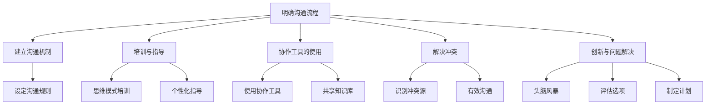
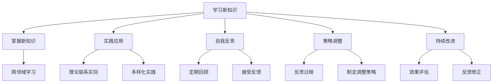

                 

 

## 《思维模式：成功与失败的关键因素》

> 关键词：思维模式、成功与失败、关键因素、个人发展、团队合作

> 摘要：本文深入探讨了思维模式对个人成功与失败的影响，分析了成功者与失败者的思维模式差异，提出了提升思维模式的方法，并探讨了思维模式在个人发展和团队合作中的应用。

### 目录大纲

----------------------------------------------------------------

## 《思维模式：成功与失败的关键因素》

### 第一部分：思维模式的概述

### 第二部分：成功者的思维模式

### 第三部分：失败者的思维模式

### 第四部分：从失败到成功的转变

### 第五部分：思维模式的应用与提升

### 附录：思维模式相关的参考资源和工具

## 图表与流程图

## 伪代码

## 数学模型与公式

## 项目实战

### 项目1：个人成长计划实施与效果分析

### 项目2：团队协作与冲突解决案例

### 项目3：思维模式提升的实践与反馈

----------------------------------------------------------------

### 让我们一起深入探讨思维模式对成功与失败的影响

思维模式，是我们对世界的认知和处理方式。它决定了我们在面对问题时采取的行动和做出的决策。成功的思维模式能够帮助我们抓住机遇，克服困难，最终实现目标；而失败的思维模式则会让我们陷入困境，无法突破。

在本文中，我们将首先介绍思维模式的基本概念和分类，然后分析成功者的思维模式，探讨其成功的原因。接着，我们将深入剖析失败者的思维模式，揭示其失败的关键因素。在此基础上，我们将探讨如何从失败中汲取教训，实现思维模式的转变，最终走向成功。

我们将结合实际案例，展示思维模式在个人发展和团队合作中的应用，提供实用的提升策略和方法。最后，我们将总结思维模式的核心原则，并推荐一些相关的参考资源和工具，帮助读者进一步学习和实践。

通过本文的阅读，希望您能够更好地理解思维模式的重要性，掌握提升思维模式的方法，从而在个人和职业生活中取得更大的成功。

----------------------------------------------------------------

### 第一部分：思维模式的概述

#### 第1章：思维模式的概念与分类

#### 1.1 思维模式的基本定义

思维模式，指的是个体在认知过程中形成的一种固定的思维方式和思考习惯。它不仅包括我们对问题的分析和解决方式，还涵盖了我们的决策过程、行为模式以及心理反应。

在计算机科学中，思维模式可以被类比为算法。算法是一系列解决问题的步骤和规则，而思维模式则是我们个体在处理信息和做出决策时遵循的步骤和规则。

#### 1.2 成功与失败的思维模式

成功与失败的思维模式有着显著的区别。成功者的思维模式通常具有以下特点：

1. **目标导向**：成功者有明确的目标，他们知道自己想要什么，并为之付出努力。
2. **积极思考**：成功者面对挑战时，能够保持积极乐观的态度，寻找解决问题的方法，而不是陷入消极情绪。
3. **持续学习**：成功者不满足于现状，他们持续学习新知识，提升自己的能力。
4. **批判性思维**：成功者具备批判性思维能力，能够客观评估信息和观点，不盲从。

相比之下，失败者的思维模式往往具有以下特点：

1. **消极应对**：失败者面对问题时，容易陷入消极情绪，难以找到解决问题的方法。
2. **依赖外部评价**：失败者过于依赖他人的评价，缺乏自信，容易受外界影响。
3. **缺乏目标感**：失败者没有明确的目标，或者目标不切实际，难以持之以恒。
4. **拒绝改变**：失败者不愿意接受新的观念和方法，害怕改变，导致思维固化。

#### 1.3 思维模式的分类与比较

根据思维模式的特点，我们可以将其分为以下几种类型：

1. **线性思维**：线性思维者按照顺序逐步解决问题，每一步都建立在前面步骤的基础上。这种思维模式适合解决结构化问题，但在处理复杂问题时可能会显得过于僵化。
2. **系统思维**：系统思维者能够从整体角度看待问题，理解各个部分之间的相互作用。他们擅长分析复杂系统，但可能需要更多的时间和精力来理解问题。
3. **创造性思维**：创造性思维者擅长寻找新的解决方案，善于发散思维，能够提出新颖的观点。这种思维模式适合创新和解决问题，但可能需要更多的时间和实验来验证。
4. **适应性思维**：适应性思维者能够根据环境和情况的变化，灵活调整自己的思维模式。他们擅长应对不确定性，能够迅速适应新的环境。

不同类型的思维模式各有优劣，选择合适的思维模式取决于问题的复杂性和情境。

#### 1.4 思维模式的影响

思维模式对个人发展有着深远的影响。成功的思维模式能够帮助个人提升解决问题的能力，增强自信心，实现目标。而失败的思维模式则可能导致个人陷入困境，错失机会，甚至影响心理健康。

在职业发展中，思维模式决定了个人是否能够适应快速变化的环境，是否能够提出创新的解决方案，是否能够有效地与他人合作。在团队合作中，思维模式的影响更加明显。成功的团队合作需要团队成员之间具备良好的沟通能力和协作精神，而这又依赖于团队成员的思维模式。

#### 1.5 思维模式的核心原则

为了实现成功的思维模式，以下原则是至关重要的：

1. **目标导向**：设定明确的目标，并为之付出努力。
2. **积极思考**：保持积极乐观的态度，面对挑战时寻找解决方案。
3. **持续学习**：不断学习新知识，提升自己的能力。
4. **批判性思维**：客观评估信息和观点，不盲从。
5. **适应性思维**：根据环境和情况的变化，灵活调整思维模式。

通过遵循这些核心原则，我们可以逐步培养出成功的思维模式，实现个人和职业目标。

----------------------------------------------------------------

### 第二部分：成功者的思维模式

#### 第2章：成功者的共性

#### 2.1 成功者的共性

成功者之所以能够取得成功，并非偶然，而是因为他们具备了一系列共性的思维模式。这些思维模式不仅帮助他们克服了种种困难，还为他们提供了持续进步的动力。以下是成功者的几大共性：

1. **明确目标**：成功者总是设定明确的目标，并为之不懈努力。这些目标不仅具有可行性，还与他们的价值观和长远规划相一致。他们知道自己的方向，并始终朝着目标前进。

2. **积极思考**：成功者面对困难和挑战时，总是保持积极乐观的态度。他们相信困难是暂时的，是成功路上的考验。通过积极思考，他们能够找到解决问题的方法，而不是被问题所困扰。

3. **持续学习**：成功者深知知识的重要性和不断学习的重要性。他们不断地学习新知识、新技能，以适应快速变化的环境。持续学习不仅提升了他们的能力，还拓宽了他们的视野。

4. **自我反思**：成功者善于自我反思，他们经常审视自己的行为和决策，分析哪些是有效的，哪些需要改进。通过自我反思，他们能够不断优化自己的思维模式和行为习惯。

5. **适应性强**：成功者具备强大的适应能力，他们能够迅速适应新的环境和情况。在变化中，他们能够抓住机遇，而不是被变化所淹没。这种适应能力使他们能够在不断变化的市场中立于不败之地。

6. **坚韧不拔**：成功者具有坚韧不拔的品质，他们能够在面对失败和挫折时保持积极的心态。他们相信失败是成功的一部分，是成长的机会。通过坚韧不拔，他们能够克服一切困难，最终实现目标。

7. **人际关系**：成功者擅长建立和维护良好的人际关系。他们知道，成功不仅依赖于个人的努力，还需要他人的帮助和支持。通过建立良好的人际关系，他们能够获得更多的资源和机会。

#### 2.2 成功者的思维习惯

除了共性外，成功者还具备一系列独特的思维习惯，这些习惯使他们能够在竞争激烈的环境中脱颖而出：

1. **问题导向**：成功者总是以解决问题为导向。他们面对问题时，不仅关注问题本身，还会深入分析问题的原因和可能的解决方案。通过问题导向的思维，他们能够找到问题的根源，并提出有效的解决方案。

2. **系统性思维**：成功者具备系统性思维，他们能够从整体角度看待问题，理解各个部分之间的相互作用。这种思维使他们能够更好地处理复杂问题，并制定出全面且有效的解决方案。

3. **创新思维**：成功者擅长创新思维，他们不满足于现状，总是寻找新的方法和途径。通过创新思维，他们能够提出新颖的解决方案，从而在竞争中占据优势。

4. **批判性思维**：成功者具备批判性思维，他们能够客观评估信息和观点，不盲从。通过批判性思维，他们能够识别出错误和偏见，并从中吸取教训。

5. **高效决策**：成功者擅长高效决策，他们能够在短时间内做出明智的决策。通过高效决策，他们能够抓住机遇，避免失误。

6. **主动性**：成功者具有主动性，他们总是主动出击，而不是被动应对。通过主动性，他们能够把握主动权，掌控局面。

7. **目标分解**：成功者擅长将大目标分解为小目标，并逐一实现。通过目标分解，他们能够保持专注，逐步实现目标。

#### 2.3 成功者的心理素质

除了思维习惯外，成功者还具备一系列优秀的心理素质，这些素质使他们能够在压力和挑战面前保持冷静和坚定：

1. **自信**：成功者具备自信，他们相信自己有能力实现目标。通过自信，他们能够克服恐惧和不安，迎接挑战。

2. **韧性**：成功者具有韧性，他们能够在面对失败和挫折时迅速恢复。通过韧性，他们能够从失败中汲取教训，不断进步。

3. **抗压能力**：成功者具备强大的抗压能力，他们能够在高压环境下保持冷静和专注。通过抗压能力，他们能够应对各种挑战。

4. **情绪调节**：成功者擅长情绪调节，他们能够控制自己的情绪，不被负面情绪所困扰。通过情绪调节，他们能够保持良好的心态，提高工作效率。

5. **适应性**：成功者具备适应性，他们能够迅速适应新的环境和情况。通过适应性，他们能够在变化中保持竞争力。

6. **乐观主义**：成功者通常具备乐观主义精神，他们相信未来会更好。通过乐观主义，他们能够保持积极向上的心态，不断追求进步。

通过以上分析，我们可以看到，成功者的思维模式和心理素质是他们成功的重要因素。他们的明确目标、积极思考、持续学习、自我反思、适应性、坚韧不拔以及优秀的心理素质，使他们能够在竞争激烈的环境中脱颖而出，实现自己的目标。

在接下来的章节中，我们将进一步探讨成功者如何通过这些思维模式和心理素质，实现个人和职业发展。

----------------------------------------------------------------

### 第三部分：失败者的思维模式

#### 第3章：失败者的思维模式分析

#### 3.1 失败者的心态特征

失败者在面对挑战和困难时，常常表现出一系列心态特征，这些特征阻碍了他们的成功。以下是一些常见的失败者心态特征：

1. **消极思维**：失败者往往持有消极思维，他们倾向于看到问题的负面，而不是积极方面。当面对挑战时，他们容易陷入悲观情绪，认为自己无法克服困难。

2. **逃避现实**：失败者常常选择逃避现实，他们不愿意面对问题，希望问题能够自行解决。这种逃避行为使他们无法正视问题，也无法找到解决问题的方法。

3. **依赖性**：失败者倾向于依赖他人，他们缺乏独立思考和解决问题的能力。在遇到问题时，他们往往期待他人提供解决方案，而不是主动寻求解决办法。

4. **恐惧失败**：失败者害怕失败，他们担心失败会带来负面影响，因此选择回避挑战。这种恐惧使他们错失了许多成长和进步的机会。

5. **自我否定**：失败者常常自我否定，他们缺乏自信，对自己的能力和价值产生怀疑。这种自我否定使他们在面对挑战时缺乏勇气和决心。

6. **缺乏目标感**：失败者往往没有明确的目标，他们对自己的未来没有清晰的规划。缺乏目标感使他们难以保持动力，也难以实现个人和职业发展。

#### 3.2 失败者的思维误区

失败者在思维过程中常常陷入一系列误区，这些误区阻碍了他们的成长和进步。以下是一些常见的思维误区：

1. **非黑即白思维**：失败者倾向于使用非黑即白的思维方式，他们将问题简化为简单的对错判断，而忽视了复杂性和多样性。这种思维方式使他们无法全面分析问题，也无法找到最佳的解决方案。

2. **过度乐观**：失败者有时过于乐观，他们高估了自己的能力和资源，低估了问题的难度和复杂性。这种过度乐观使他们无法准备应对潜在的困难和挑战。

3. **自我合理化**：失败者常常通过自我合理化来解释自己的失败。他们将自己的失败归咎于外部因素，如运气不佳、环境恶劣等，而忽视了自己在过程中的不足和错误。

4. **否认现实**：失败者倾向于否认现实，他们不愿意接受失败的事实，希望通过否认来逃避现实。这种否认使他们无法从失败中汲取教训，也无法进行有效的反思和改进。

5. **拒绝改变**：失败者往往拒绝改变，他们害怕改变会带来不确定性和风险。这种拒绝改变使他们无法适应新的环境和情况，也阻碍了他们的成长和进步。

#### 3.3 失败者的行为模式

失败者在行为模式上也有一些共同特征，这些特征进一步阻碍了他们的成功。以下是一些常见的失败者行为模式：

1. **拖延**：失败者常常拖延，他们不愿意立即采取行动，而是选择等待或者推迟。这种拖延行为使他们无法及时解决问题，也错失了机遇。

2. **缺乏自律**：失败者缺乏自律，他们无法自我管理，容易受到外界干扰和诱惑。这种缺乏自律使他们难以保持专注，也难以实现长期目标。

3. **依赖外部激励**：失败者往往依赖外部激励，他们需要他人的认可和奖励才能保持动力。这种依赖外部激励使他们缺乏内在动力，也难以实现自我驱动。

4. **缺乏计划**：失败者常常缺乏明确的计划和目标，他们的行动缺乏系统性。这种缺乏计划使他们难以有效管理时间和资源，也难以实现高效的行动。

5. **缺乏反思**：失败者往往缺乏反思，他们不愿意花时间回顾和总结自己的行为和决策。这种缺乏反思使他们无法从过去的经验中学习，也无法进行有效的改进。

通过分析失败者的心态特征、思维误区和行为模式，我们可以看到，这些因素共同阻碍了他们的成功。要克服这些障碍，失败者需要改变自己的思维模式和行为习惯，培养积极的心态和批判性思维，以及建立有效的计划和执行能力。

在接下来的章节中，我们将探讨如何从失败中汲取教训，实现思维模式的转变，最终走向成功。

----------------------------------------------------------------

### 第四部分：从失败到成功的转变

#### 第4章：思维模式的转变方法

#### 4.1 思维模式的转变方法

从失败中走向成功，关键在于转变思维模式。以下是几种有效的思维模式转变方法：

1. **积极思考**：积极思考是一种转变思维模式的重要方法。通过积极思考，我们可以改变对问题的看法，从而找到解决问题的方法。以下是一些积极思考的技巧：
   - **重新定义问题**：将问题视为挑战，而不是困境。通过重新定义问题，我们可以激发出积极的思考和行动。
   - **寻找机会**：在困境中寻找机会，将失败视为成长的机会。通过寻找机会，我们可以看到问题的积极面，从而激发出积极的思维。
   - **保持乐观**：保持乐观的心态，相信困难是暂时的，成功是可能的。通过保持乐观，我们可以增强自己的信心和决心。

2. **自我反思**：自我反思是培养积极思维的重要手段。通过自我反思，我们可以审视自己的思维模式和行为习惯，找出需要改进的地方。以下是一些自我反思的技巧：
   - **定期回顾**：定期回顾自己的行为和决策，分析哪些是有效的，哪些需要改进。通过定期回顾，我们可以保持思维的清醒和灵活。
   - **接受失败**：接受失败是自我反思的重要部分。通过接受失败，我们可以从中学习，找到失败的原因，并制定改进计划。
   - **寻求反馈**：寻求他人的反馈，听取他们的意见和建议。通过寻求反馈，我们可以更全面地了解自己的思维模式，并从中得到改进的方向。

3. **培养批判性思维**：批判性思维是提高思维质量的关键。通过批判性思维，我们可以客观分析问题和信息，不盲从，不依赖外部评价。以下是一些培养批判性思维的技巧：
   - **多角度分析**：从不同角度分析问题，考虑各种可能性。通过多角度分析，我们可以更全面地了解问题，找到更有效的解决方案。
   - **质疑权威**：对权威的观点和意见持怀疑态度，进行独立思考。通过质疑权威，我们可以避免盲从，保持独立和创新的思维。
   - **逻辑推理**：运用逻辑推理的方法，分析问题之间的因果关系。通过逻辑推理，我们可以更准确地把握问题的本质，找到解决问题的途径。

4. **适应性思维**：适应性思维是应对变化和挑战的关键。通过适应性思维，我们可以迅速调整自己的思维模式，以适应新的环境和情况。以下是一些培养适应性思维的技巧：
   - **学习新知识**：不断学习新知识，提升自己的能力。通过学习新知识，我们可以更好地适应快速变化的环境。
   - **灵活应对**：在面对变化时，保持灵活应对的态度。通过灵活应对，我们可以迅速调整自己的思维模式，找到应对变化的方法。
   - **接受不确定性**：接受不确定性是适应性思维的一部分。通过接受不确定性，我们可以减少焦虑和恐惧，更好地应对变化。

通过积极思考、自我反思、培养批判性思维和适应性思维，我们可以逐步转变自己的思维模式，从失败中走向成功。这些方法不仅适用于个人发展，也适用于团队合作和职业发展。在接下来的章节中，我们将进一步探讨如何在实践中应用这些方法，实现从失败到成功的转变。

----------------------------------------------------------------

#### 4.2 成功者的心态建设

心态建设是成功者的关键因素之一。一个积极、坚韧的心态可以帮助他们在面对困难和挑战时保持冷静和坚定，从而实现目标。以下是一些成功者心态建设的策略：

1. **设定明确的目标**：成功者总是有明确的目标，并为之不懈努力。设定明确的目标可以帮助他们保持动力和专注，减少迷茫和焦虑。以下是一些设定目标的策略：
   - **具体化目标**：将目标具体化，使其具有可操作性和可衡量性。例如，将“提高销售额”具体化为“每月增加10%的销售额”。
   - **分解目标**：将大目标分解为小目标，逐一实现。这样可以帮助他们保持专注，逐步实现目标，同时也能及时调整策略。
   - **设定时间限制**：为每个目标设定时间限制，以增加紧迫感和责任感。通过设定时间限制，他们能够更好地管理时间和资源，提高效率。

2. **保持积极心态**：成功者始终保持积极心态，即使面对困难和挑战，他们也相信困难是暂时的，成功是可能的。以下是一些保持积极心态的策略：
   - **寻找正面**：在面对问题时，寻找问题的正面和机会。通过寻找正面，他们能够看到问题的解决方法，而不是被问题所困扰。
   - **感恩**：感恩是一种积极的心态，能够帮助人们看到生活中的美好和进步。通过感恩，他们能够更好地应对挫折和困难，保持积极的心态。
   - **正面自我对话**：用正面、积极的话语鼓励自己，避免自我否定和消极的自我对话。通过正面自我对话，他们能够增强自信，提高心理韧性。

3. **培养坚韧品质**：成功者具备坚韧品质，他们能够在面对挫折和失败时保持冷静和坚定。以下是一些培养坚韧品质的策略：
   - **接受失败**：将失败视为成长的机会，从中学习经验教训。通过接受失败，他们能够更好地应对挫折，避免自我怀疑和放弃。
   - **设定高标准**：设定高标准，挑战自己，不断超越自我。通过设定高标准，他们能够不断突破自己的极限，提高能力和成就。
   - **寻求支持**：在困难时，寻求家人、朋友或导师的支持。通过寻求支持，他们能够获得鼓励和帮助，增强信心和决心。

4. **保持身心健康**：身心健康是心态建设的重要组成部分。以下是一些保持身心健康的方法：
   - **锻炼身体**：定期锻炼身体，保持身体健康。通过锻炼身体，他们能够增强体质，提高免疫力，同时也能释放压力，保持良好的心态。
   - **保持充足的睡眠**：保持充足的睡眠，确保身体和大脑得到充分的休息。通过保持充足的睡眠，他们能够提高注意力和工作效率，保持良好的心态。
   - **健康饮食**：保持健康的饮食习惯，避免过度摄入高热量和高脂肪的食物。通过健康饮食，他们能够保持良好的身体状态，提高心理健康。

通过设定明确的目标、保持积极心态、培养坚韧品质和保持身心健康，成功者能够建设出强大的心态，从而在个人和职业发展中取得成功。这些心态建设策略不仅适用于个人，也适用于团队合作和领导力培养。在接下来的章节中，我们将继续探讨成功者的行为模式，以及如何在实践中应用这些策略。

----------------------------------------------------------------

#### 4.3 成功者的行为模式优化

成功者的行为模式不仅体现在他们的心态建设上，还体现在他们日常的决策和行为中。优化行为模式是成功的关键，以下是一些成功者的行为模式优化策略：

1. **高效时间管理**：成功者深知时间的重要性，他们能够高效管理时间，确保每一刻都能产生最大的效益。以下是一些高效时间管理的策略：
   - **优先级排序**：将任务按照优先级排序，首先完成最重要的任务。通过优先级排序，他们能够确保关键任务得到及时处理。
   - **设定时间限制**：为每个任务设定时间限制，以增加紧迫感和责任感。通过设定时间限制，他们能够提高工作效率，减少拖延。
   - **避免多任务处理**：专注于一项任务，避免同时处理多项任务。通过避免多任务处理，他们能够提高专注度，减少错误和浪费时间。

2. **目标设定与跟踪**：成功者善于设定明确的目标，并持续跟踪进度。以下是一些目标设定与跟踪的策略：
   - **SMART目标**：设定具体（Specific）、可衡量（Measurable）、可实现（Achievable）、相关（Relevant）和时限性（Time-bound）的目标。通过SMART目标，他们能够确保目标具有可操作性和可实现性。
   - **定期评估**：定期评估目标的进展情况，及时调整策略。通过定期评估，他们能够及时发现问题和挑战，及时调整目标和计划。
   - **反馈机制**：建立反馈机制，收集来自自己和他人的反馈。通过反馈机制，他们能够了解自己的优势和不足，持续优化行为模式。

3. **持续学习与自我提升**：成功者持续学习新知识，不断提升自己的能力。以下是一些持续学习与自我提升的策略：
   - **终身学习**：将学习视为一种生活方式，持续学习新知识。通过终身学习，他们能够不断更新自己的知识和技能，适应快速变化的环境。
   - **多样化学习**：通过阅读书籍、参加培训课程、交流讨论等多种方式学习。通过多样化学习，他们能够从不同角度理解问题，提高解决问题的能力。
   - **实践应用**：将学到的知识应用于实际工作中，通过实践来检验和巩固学习成果。通过实践应用，他们能够将理论知识转化为实际能力，提高工作效率。

4. **建立良好的人际关系**：成功者擅长建立和维护良好的人际关系，这有助于他们在工作和生活中获得支持和资源。以下是一些建立良好人际关系的方法：
   - **诚信与尊重**：以诚信和尊重为基础，与他人建立信任关系。通过诚信与尊重，他们能够赢得他人的信任和尊重，从而建立良好的人际关系。
   - **倾听与沟通**：倾听他人的意见和需求，通过有效沟通解决问题。通过倾听与沟通，他们能够增进彼此的了解，建立良好的沟通和合作关系。
   - **互助与合作**：在他人需要帮助时伸出援手，通过互助与合作实现共同目标。通过互助与合作，他们能够建立紧密的团队关系，提高团队效能。

5. **自我激励与目标导向**：成功者具备自我激励能力，他们能够在没有外部激励的情况下保持动力和专注。以下是一些自我激励与目标导向的方法：
   - **内在动机**：寻找内在动机，如兴趣、热情和成就感，以驱动自己。通过内在动机，他们能够保持持久的动力，实现长期目标。
   - **目标视觉化**：将目标视觉化，如制作目标板或写日记，以时刻提醒自己。通过目标视觉化，他们能够保持对目标的专注和热情。
   - **庆祝成就**：庆祝每一个小的成就，保持积极的心态。通过庆祝成就，他们能够增强自信，提高动力。

通过高效时间管理、目标设定与跟踪、持续学习与自我提升、建立良好的人际关系以及自我激励与目标导向，成功者能够优化自己的行为模式，提高个人和团队的效能。这些行为模式优化策略不仅适用于个人发展，也适用于团队合作和领导力培养。在接下来的章节中，我们将继续探讨思维模式在个人发展和团队合作中的应用。

----------------------------------------------------------------

### 第五部分：思维模式的应用与提升

#### 第5章：思维模式在个人发展中的应用

#### 5.1 自我认知与自我提升

自我认知是个人发展的重要基础，通过深入理解自己的优势和劣势，我们可以更好地制定发展计划，实现自我提升。以下是一些在个人发展中应用思维模式的策略：

1. **自我评估**：自我评估是自我认知的第一步。通过定期反思自己的行为、态度和成就，我们可以了解自己的优点和不足。以下是一些自我评估的策略：
   - **定期反思**：每天或每周花时间反思自己的行为和决策，思考哪些是有效的，哪些需要改进。通过定期反思，我们可以保持对自我的清醒认识，及时发现和解决问题。
   - **记录日志**：记录日志是一种有效的自我评估方法。通过记录日志，我们可以回顾自己的行为和思考过程，从中发现规律和模式。例如，可以记录每天的成就、困惑和感悟，定期回顾和分析。
   - **寻求反馈**：寻求他人的反馈是了解自己的一种重要方式。通过向同事、朋友或导师请教，我们可以获得不同视角的反馈，从而更全面地了解自己的优势和劣势。同时，也要学会接受反馈，并将其作为自我提升的依据。

2. **明确目标**：明确目标是自我提升的关键。通过设定具体、可衡量、可实现、相关和时限性的目标（SMART目标），我们可以有针对性地提升自己的能力和素质。以下是一些设定目标的策略：
   - **分解目标**：将大目标分解为小目标，逐一实现。通过分解目标，我们可以将长期目标转化为短期目标，使其更加具体和可实现。例如，如果目标是提高编程能力，可以将目标分解为学习一门新的编程语言、完成一个小项目等。
   - **设定时间限制**：为每个目标设定时间限制，以增加紧迫感和责任感。通过设定时间限制，我们可以确保目标得到及时完成，同时也能够更好地管理时间和资源。
   - **定期评估**：定期评估目标的进展情况，及时调整策略。通过定期评估，我们可以了解目标的实现情况，及时发现问题和挑战，并采取相应的措施进行改进。

3. **持续学习**：持续学习是自我提升的重要途径。通过不断学习新知识、新技能，我们可以提升自己的能力和竞争力。以下是一些持续学习的策略：
   - **终身学习**：将学习视为一种生活方式，持续学习新知识。通过终身学习，我们可以不断更新自己的知识和技能，适应快速变化的环境。
   - **多样化学习**：通过阅读书籍、参加培训课程、交流讨论等多种方式学习。通过多样化学习，我们可以从不同角度理解问题，提高解决问题的能力。
   - **实践应用**：将学到的知识应用于实际工作中，通过实践来检验和巩固学习成果。通过实践应用，我们可以将理论知识转化为实际能力，提高工作效率。

4. **培养批判性思维**：批判性思维是自我提升的重要工具。通过批判性思维，我们可以客观分析信息和观点，避免盲从和偏见。以下是一些培养批判性思维的策略：
   - **多角度分析**：从不同角度分析问题，考虑各种可能性。通过多角度分析，我们可以更全面地了解问题，找到更有效的解决方案。
   - **质疑权威**：对权威的观点和意见持怀疑态度，进行独立思考。通过质疑权威，我们可以避免盲从，保持独立和创新的思维。
   - **逻辑推理**：运用逻辑推理的方法，分析问题之间的因果关系。通过逻辑推理，我们可以更准确地把握问题的本质，找到解决问题的途径。

通过自我评估、明确目标、持续学习和培养批判性思维，我们可以在个人发展中应用思维模式，实现自我提升。这些策略不仅适用于个人成长，也适用于职业发展和团队合作。在接下来的章节中，我们将继续探讨思维模式在团队合作中的应用。

----------------------------------------------------------------

#### 5.2 目标设定与实现

目标设定是实现个人发展的重要步骤，而成功的目标设定需要结合科学的思维模式和方法。以下是一些设定和实现目标的有效策略：

1. **SMART目标**：
   - **具体（Specific）**：目标要明确具体，避免模糊和宽泛。例如，而不是说“提高业绩”，可以说“在下一季度实现销售额增长20%”。
   - **可衡量（Measurable）**：目标要能够量化，以便于评估进展和效果。例如，用数字或指标来衡量目标的实现程度。
   - **可实现（Achievable）**：目标要具有可实现性，避免过于理想化或不切实际。设定目标时要考虑自身的能力、资源和环境因素。
   - **相关（Relevant）**：目标要与个人的长期目标和价值观相一致，确保目标具有实际意义和价值。
   - **时限性（Time-bound）**：目标要设定明确的时间期限，增加紧迫感，并有助于管理和监控进度。

2. **目标分解**：
   - **长期目标**：设定长期目标时，要分解为短期和中期目标，使其更具体、可实现。例如，如果长期目标是“在五年内成为高级软件工程师”，可以将其分解为每年需要掌握的新技能、完成的重大项目等。
   - **阶段性目标**：将长期目标分解为阶段性目标，有助于监控进展，并调整策略。例如，每季度或每月设定具体的里程碑目标。

3. **行动计划**：
   - **制定详细计划**：为实现目标，需要制定详细的行动计划，包括具体步骤、所需资源和时间安排。例如，如果目标是学习一门新编程语言，计划可以包括每天学习的时间、学习资源的获取等。
   - **优先级排序**：根据目标的紧急程度和重要性，对行动计划进行优先级排序，确保关键任务得到优先处理。

4. **持续跟踪与调整**：
   - **定期评估**：定期评估目标的进展情况，与原计划进行对比，及时发现偏差和问题。
   - **反馈与调整**：根据评估结果，调整目标和行动计划，确保目标的实现。例如，如果发现某个步骤过于困难或不切实际，可以重新评估目标并调整计划。

5. **激励与鼓励**：
   - **自我激励**：通过设定奖励机制，鼓励自己在实现目标的过程中保持动力。例如，每完成一个阶段性目标，奖励自己一次小假期或购买一件心仪的物品。
   - **外部激励**：寻求他人的支持和鼓励，例如家人、朋友或导师的认可和赞扬，有助于增强信心和动力。

通过设定SMART目标、目标分解、制定行动计划、持续跟踪与调整以及激励与鼓励，我们可以更有效地实现个人目标。这些策略不仅适用于职业发展，也适用于个人成长和日常生活。在接下来的章节中，我们将继续探讨思维模式在解决问题中的应用。

----------------------------------------------------------------

#### 5.3 解决问题的思维模式

解决问题是个人和职业发展中不可或缺的技能。有效的解决问题的思维模式能够帮助我们更高效地找到解决方案，克服挑战。以下是一些解决问题的思维模式：

1. **分析问题**：
   - **理解问题**：首先要彻底理解问题的本质和背景。这包括问题的原因、影响以及涉及的相关因素。
   - **分解问题**：将复杂的问题分解为更小、更具体的子问题。通过分解问题，我们可以更容易地分析和解决。
   - **收集信息**：收集与问题相关的信息，包括数据、事实、意见和反馈。这些信息将为我们提供解决问题的关键点。

2. **思考策略**：
   - **头脑风暴**：进行头脑风暴，列出所有可能的解决方案。头脑风暴过程中，不要对任何想法进行评判，鼓励自由发挥和创意。
   - **评估选项**：对列出的解决方案进行评估，考虑其可行性、成本和潜在风险。通过评估，我们可以筛选出最有效的解决方案。
   - **制定计划**：为选定的解决方案制定详细的实施计划，包括步骤、资源和时间安排。通过制定计划，我们可以确保解决方案能够顺利执行。

3. **执行与测试**：
   - **执行计划**：按照制定的计划执行解决方案，确保每个步骤都得到有效执行。
   - **测试解决方案**：在执行过程中，不断测试解决方案的有效性。通过测试，我们可以验证解决方案是否真正解决了问题，并调整计划以优化效果。

4. **反思与改进**：
   - **反思过程**：在解决方案执行完毕后，进行反思，评估整个解决问题的过程。反思包括成功的方面和需要改进的方面。
   - **持续改进**：根据反思结果，持续改进解决问题的思维模式和方法。通过持续改进，我们可以不断提高解决问题的能力。

通过分析问题、思考策略、执行与测试以及反思与改进，我们可以形成有效的解决问题的思维模式。以下是一个解决问题的思维模式的具体示例：

**问题**：公司产品销售下降。

**分析问题**：
- **理解问题**：分析销售下降的原因，可能与市场环境、竞争、产品问题或营销策略有关。
- **分解问题**：将销售下降分解为市场调研、产品分析、营销策略评估等子问题。
- **收集信息**：收集市场调研数据、产品反馈、销售数据等。

**思考策略**：
- **头脑风暴**：列出可能的解决方案，如调整营销策略、改进产品、加强市场推广等。
- **评估选项**：评估每个解决方案的可行性、成本和潜在收益，选择最优方案。

**执行与测试**：
- **执行计划**：按照制定的计划，调整营销策略、改进产品等。
- **测试解决方案**：通过市场反馈、销售数据等测试解决方案的有效性。

**反思与改进**：
- **反思过程**：分析解决方案的效果，确定是否达到预期目标，哪些方面做得好，哪些方面需要改进。
- **持续改进**：根据反思结果，优化营销策略、产品改进计划，提高未来销售效果。

通过以上步骤，我们可以形成有效的解决问题的思维模式，从而更好地应对各种挑战。在接下来的章节中，我们将继续探讨思维模式在团队合作中的应用。

----------------------------------------------------------------

#### 5.4 思维模式在团队合作中的应用

思维模式在团队合作中的应用至关重要，它直接影响团队效能和整体成果。以下是一些关键策略，帮助团队充分利用思维模式的优势：

1. **明确沟通流程**：
   - **建立沟通机制**：制定清晰的沟通流程，确保团队成员之间的信息畅通。这包括定期的团队会议、报告和邮件沟通等。
   - **设定沟通规则**：明确沟通的基本规则，如发言顺序、发言时间限制和反馈机制，以确保沟通的效率和效果。

2. **培训与指导**：
   - **思维模式培训**：为团队成员提供思维模式培训，帮助他们了解和掌握不同的思维技巧和方法。这可以通过内部培训、外部培训和在线课程等多种形式进行。
   - **个性化指导**：根据团队成员的个体差异，提供个性化的指导和支持，帮助他们发挥自己的优势，克服劣势。

3. **协作工具的使用**：
   - **使用协作工具**：利用现代协作工具，如项目管理软件、团队协作平台和即时通讯工具，提高团队协作效率。这些工具可以帮助团队成员实时共享信息、协调工作和监控进度。
   - **共享知识库**：建立一个团队知识库，记录团队的重要决策、经验和教训，方便成员查阅和借鉴。

4. **解决冲突**：
   - **识别冲突源**：通过沟通和观察，及时识别团队中的冲突源。冲突可能源于目标不一致、角色混淆或沟通不畅等。
   - **有效沟通**：通过开放和诚实的沟通，解决冲突。这包括倾听对方的意见、表达自己的观点和寻求共识。

5. **创新与问题解决**：
   - **头脑风暴**：在团队中开展头脑风暴活动，鼓励成员提出新的想法和解决方案。通过头脑风暴，可以激发团队的创造力和创新精神。
   - **协作解决问题**：将复杂的问题分解为子问题，并分配给合适的团队成员。通过协作解决问题，可以提高团队的整体能力和问题解决效率。

通过明确沟通流程、培训与指导、使用协作工具、解决冲突和创新与问题解决，团队可以充分发挥思维模式的优势，提高协作效率和成果。以下是一个思维模式在团队合作中的应用案例：

**案例**：某软件开发团队在项目开发过程中遇到了技术难题，影响了项目的进度和质量。

**应用策略**：
1. **明确沟通流程**：团队定期召开项目会议，讨论技术难题和解决方案。
2. **培训与指导**：为团队成员提供相关技术培训，提高他们的技术能力和解决问题的能力。
3. **协作工具的使用**：利用项目管理软件和协作平台，共享技术文档和讨论记录，方便团队成员查阅和协作。
4. **解决冲突**：团队在讨论过程中，通过开放和诚实的沟通，解决了因技术分歧而产生的冲突。
5. **创新与问题解决**：团队成员通过头脑风暴，提出了多种解决方案，并最终选择了最优方案。

通过以上策略，团队成功解决了技术难题，项目进度和质量得到了显著提升。

在接下来的章节中，我们将继续探讨如何提升思维模式，实现个人和团队的发展。

----------------------------------------------------------------

#### 5.5 团队决策与冲突解决

团队决策和冲突解决是团队合作中至关重要的一环。有效的决策和冲突解决能够提高团队效能，促进团队发展。以下是一些关键策略：

1. **团队决策**：
   - **信息共享**：确保团队成员之间共享相关信息，以便所有人都能全面了解决策背景和相关信息。
   - **广泛参与**：鼓励团队成员积极参与决策过程，提供意见和建议。这不仅可以提高决策的质量，还可以增强团队成员的归属感和责任感。
   - **制定决策标准**：明确决策的标准和依据，如目标、资源、时间等，以确保决策的客观性和可衡量性。
   - **达成共识**：通过讨论和协商，达成团队的共识。这需要团队成员之间的沟通和妥协，以确保决策的执行和团队的一致性。

2. **冲突解决**：
   - **识别冲突源**：及时识别团队中的冲突源，如目标不一致、沟通不畅、资源分配等。
   - **开放沟通**：鼓励团队成员在冲突发生时，进行开放和诚实的沟通。通过倾听对方的观点和意见，了解冲突的根本原因。
   - **寻求共识**：通过协商和妥协，寻求解决冲突的方法，达成共识。这需要团队成员之间的合作和协作精神。
   - **制定行动计划**：根据共识，制定具体的行动计划，以解决冲突并防止其再次发生。

以下是一个团队决策与冲突解决的实例：

**案例**：某团队的成员在项目计划和时间表上产生了分歧，导致团队工作进度受到影响。

**解决方案**：
1. **信息共享**：团队领导组织了一次项目会议，将项目的进展、目标和时间表详细传达给所有成员。
2. **广泛参与**：团队成员被鼓励提出对项目计划的意见和建议，分享各自的担忧和期望。
3. **制定决策标准**：团队共同确定了项目的关键决策标准，如项目目标、时间限制、资源需求等。
4. **达成共识**：通过讨论和协商，团队最终达成了一致的项目计划和执行时间表。
5. **冲突解决**：团队成员通过开放沟通和妥协，解决了在项目计划和时间表上的冲突，确保了团队的协作和项目的顺利进行。

通过有效的团队决策和冲突解决策略，团队能够更好地协调合作，提高工作效能和项目成功率。在接下来的章节中，我们将继续探讨如何提升思维模式，以实现持续的发展。

----------------------------------------------------------------

#### 5.6 提升团队效能的思维模式

提升团队效能是团队成功的关键，而思维模式的提升则是实现这一目标的重要途径。以下是一些策略，帮助团队通过思维模式的提升来提高效能：

1. **培养系统思维**：
   - **整体视角**：系统思维要求团队成员从整体角度看待问题，理解各个部分之间的相互作用。通过培养系统思维，团队成员能够更好地识别问题根源，并提出全面解决方案。
   - **长远规划**：系统思维鼓励团队成员进行长远规划，考虑项目的长期影响和潜在风险。这有助于团队在决策时更加谨慎和全面，避免短期行为对长期目标的负面影响。

2. **增强适应性思维**：
   - **快速响应**：适应性思维要求团队成员能够快速适应变化，并灵活调整计划。通过增强适应性思维，团队能够在面对不确定性和突发情况时迅速反应，保持高效运作。
   - **持续学习**：适应性思维还鼓励团队成员持续学习新知识和技能，以适应快速变化的环境。这有助于团队保持竞争力，不断进步。

3. **促进创新思维**：
   - **鼓励创意**：创新思维鼓励团队成员提出新的想法和解决方案，勇于尝试和实验。通过促进创新思维，团队能够不断突破传统思维模式，寻找创新的解决方案。
   - **鼓励失败**：创新思维要求团队成员接受失败，将其视为学习的机会。通过鼓励失败，团队能够从错误中吸取教训，不断优化和改进。

4. **培养批判性思维**：
   - **客观评估**：批判性思维要求团队成员客观评估信息和观点，不盲从，不依赖权威。通过培养批判性思维，团队能够做出更明智的决策，减少错误和失误。
   - **多角度分析**：批判性思维鼓励团队成员从不同角度分析问题，考虑各种可能性和解决方案。这有助于团队更全面地理解问题，找到更有效的解决方案。

5. **强化合作精神**：
   - **团队协作**：合作精神要求团队成员之间相互支持，共同努力实现团队目标。通过强化合作精神，团队能够提高协作效率，减少冲突和摩擦。
   - **共享知识**：合作精神还鼓励团队成员共享知识和经验，相互学习和成长。通过共享知识，团队能够提高整体能力，共同面对挑战。

以下是一个提升团队效能的思维模式应用案例：

**案例**：某软件开发团队在开发新产品时遇到了技术难题，导致项目进度滞后。

**应用策略**：
1. **培养系统思维**：团队领导组织了一次研讨会，帮助团队成员从整体角度理解问题，分析各个模块之间的相互作用，并制定了详细的解决方案。
2. **增强适应性思维**：团队成员通过不断学习和实践，掌握了新的编程技术，快速适应了项目需求的变化。
3. **促进创新思维**：团队鼓励成员提出创新的想法和解决方案，最终采用了一种新的算法，成功解决了技术难题。
4. **培养批判性思维**：团队成员在决策过程中，客观评估各种方案，从多个角度分析了风险和收益，最终选择了最优方案。
5. **强化合作精神**：团队成员之间相互支持，共享知识和经验，共同克服了技术难题，确保了项目的顺利进行。

通过提升思维模式，团队不仅解决了当前的问题，还提高了整体的协作效率和创新能力，实现了持续的发展。

在接下来的章节中，我们将继续探讨如何持续提升思维模式，以实现个人和团队的长期发展。

----------------------------------------------------------------

#### 5.7 持续提升思维模式的方法

要实现思维模式的持续提升，需要采取一系列系统性的方法和策略。以下是一些关键步骤和策略：

1. **终身学习**：
   - **学习新知识**：定期学习新知识，尤其是与自身工作和职业发展相关的领域。这可以通过阅读书籍、参加线上课程、参加研讨会等方式实现。
   - **跨领域学习**：尝试跨领域学习，了解不同领域的知识，这有助于拓宽视野，增强思维的灵活性和适应性。

2. **自我反思**：
   - **定期回顾**：定期回顾自己的行为和决策，分析哪些是有效的，哪些需要改进。这有助于我们不断优化思维模式，提高决策质量。
   - **接受反馈**：主动寻求他人的反馈，特别是同事、导师或专业顾问的意见。通过接受反馈，我们可以更全面地了解自己的优势和不足。

3. **实践应用**：
   - **理论联系实际**：将学到的理论知识应用于实际工作中，通过实践来验证和巩固学习成果。这有助于将理论知识转化为实际能力，提高问题解决能力。
   - **多样化实践**：尝试不同的实践项目，以适应不同的环境和情况。通过多样化实践，我们可以提高思维的灵活性和适应性。

4. **批判性思维**：
   - **质疑权威**：对权威的观点和意见持怀疑态度，进行独立思考。通过质疑权威，我们可以避免盲从，保持独立和创新的思维。
   - **多角度分析**：从不同角度分析问题，考虑各种可能性和解决方案。通过多角度分析，我们可以更全面地理解问题，找到更有效的解决方案。

5. **适应性思维**：
   - **快速适应**：在面临变化和挑战时，能够快速适应新环境和情况。这需要我们具备较强的应变能力和适应性思维。
   - **灵活调整**：根据环境和情况的变化，灵活调整思维模式和方法。通过灵活调整，我们可以更好地应对变化，提高解决问题的效率。

6. **团队合作**：
   - **协作学习**：与团队成员合作，共同学习和成长。通过协作学习，我们可以相互借鉴经验，提高团队整体的能力。
   - **知识共享**：鼓励团队成员共享知识和经验，通过共享知识，我们可以拓宽视野，提高整体思维水平。

7. **心理调适**：
   - **保持积极心态**：保持积极的心态，面对困难和挑战时保持冷静和坚定。积极心态有助于提高思维的灵活性和创造性。
   - **压力管理**：学会有效管理压力，避免压力对思维造成负面影响。通过压力管理，我们可以保持清晰的思维，提高工作效率。

通过终身学习、自我反思、实践应用、批判性思维、适应性思维、团队合作和心理调适，我们可以实现思维模式的持续提升。这些策略不仅适用于个人发展，也适用于团队合作和职业发展。在接下来的章节中，我们将进一步探讨如何将思维模式应用到实际工作中，提高个人和团队的效能。

----------------------------------------------------------------

### 第六部分：思维模式的实战应用与反馈

#### 6.1 思维模式在项目管理中的应用

思维模式在项目管理中扮演着至关重要的角色，它不仅影响着项目的决策和执行，还决定着项目的成功与否。以下是一些思维模式在项目管理中的具体应用案例：

1. **目标导向思维**：
   - **案例**：某公司在开发一款新软件时，明确设定了项目的目标，包括功能需求、性能指标和上市时间。项目团队通过定期回顾和调整计划，确保项目始终朝着目标前进。这种目标导向思维帮助团队保持了专注，提高了项目的成功率。

2. **系统性思维**：
   - **案例**：在建设一个大型数据中心时，团队采用了系统思维，从整体角度分析了各个环节的需求和关系。他们不仅考虑了硬件设备的布局，还考虑了网络、安全、维护等多个方面。通过系统思维，团队确保了数据中心的整体性能和可靠性。

3. **创造性思维**：
   - **案例**：在开发一款新游戏时，团队面临了技术上的挑战。通过创造性思维，他们提出了一个全新的技术解决方案，不仅克服了技术难题，还提升了游戏的用户体验。这种创造性思维帮助团队在激烈的市场竞争中脱颖而出。

4. **批判性思维**：
   - **案例**：在项目执行过程中，团队定期进行批判性思维训练，对项目的进度、成本和质量进行客观评估。通过批判性思维，团队能够及时发现和纠正问题，确保项目在可控范围内进行。

5. **适应性思维**：
   - **案例**：在应对市场变化时，团队展现了强大的适应性思维。他们能够迅速调整项目计划，优化资源配置，确保项目能够适应市场变化。通过适应性思维，团队在变化中保持了竞争力。

#### 6.2 思维模式在产品开发中的应用

产品开发是一个复杂且动态的过程，思维模式在其中起到了关键作用。以下是一些思维模式在产品开发中的应用案例：

1. **用户思维**：
   - **案例**：在开发一款智能家居设备时，团队注重用户思维，通过用户调研和反馈，不断优化产品设计。他们确保设备不仅功能强大，而且易于使用，用户满意度显著提高。

2. **迭代思维**：
   - **案例**：团队采用迭代思维，将产品开发过程划分为多个迭代周期。在每个迭代周期中，他们开发和测试新功能，收集用户反馈，并根据反馈进行优化。通过迭代思维，团队能够快速响应市场变化，提高产品质量。

3. **协作思维**：
   - **案例**：在开发一款大型软件系统时，团队采用了协作思维，鼓励不同部门和角色之间的密切合作。他们通过定期会议和沟通，确保各个部分能够无缝衔接，提高开发效率。

4. **创新思维**：
   - **案例**：团队鼓励创新思维，在产品开发过程中不断探索新的技术和解决方案。通过创新思维，他们提出了一系列独特的产品特性，使产品在市场上脱颖而出。

5. **数据驱动思维**：
   - **案例**：在产品上线后，团队通过数据分析来评估产品的性能和用户行为。他们利用这些数据来指导产品的后续开发和改进，确保产品能够持续满足用户需求。

#### 6.3 思维模式在创新管理中的应用

创新管理是企业持续发展的重要手段，思维模式在其中发挥着关键作用。以下是一些思维模式在创新管理中的应用案例：

1. **开放式创新思维**：
   - **案例**：企业通过开放式创新思维，积极与外部合作伙伴合作，共同开发新产品。通过这种方式，企业不仅能够利用外部资源，还能够引入外部视角，提高创新的成功率。

2. **跨领域创新思维**：
   - **案例**：企业通过跨领域创新思维，将不同领域的知识和技能结合，创造出新的产品和服务。例如，一家传统的制造业企业通过引入人工智能技术，开发出了智能生产线，大幅提高了生产效率。

3. **敏捷创新思维**：
   - **案例**：企业采用敏捷创新思维，通过快速迭代和测试，不断优化创新项目。他们能够快速响应市场变化，提高创新的及时性和有效性。

4. **颠覆性创新思维**：
   - **案例**：企业通过颠覆性创新思维，挑战现有的市场规则和商业模式，创造出全新的市场机会。例如，一家传统零售企业通过引入电子商务，彻底颠覆了传统零售模式。

5. **用户中心创新思维**：
   - **案例**：企业始终将用户需求放在首位，通过用户中心创新思维，不断改进产品和服务。他们通过用户调研和反馈，深入了解用户需求，从而提供更有价值的产品。

通过上述实战应用案例，我们可以看到思维模式在项目管理、产品开发和创新管理中的重要性。有效的思维模式不仅能够提高团队的效率和创新能力，还能够推动企业的持续发展和竞争优势。

#### 6.4 反馈与调整

在实际应用思维模式的过程中，反馈与调整是至关重要的一环。通过收集反馈和不断调整策略，团队可以不断提高思维模式的效能。以下是一些反馈与调整的关键步骤：

1. **收集反馈**：
   - **用户反馈**：通过用户调研、用户反馈和用户满意度调查等方式，收集用户对产品或服务的反馈。
   - **内部反馈**：通过团队内部会议、员工反馈和绩效评估等方式，收集团队成员的反馈。

2. **分析反馈**：
   - **识别问题**：分析反馈，识别存在的问题和不足之处。
   - **分类整理**：将反馈分类整理，明确哪些是关键问题，哪些是次要问题。

3. **制定调整策略**：
   - **针对关键问题**：制定具体的调整策略，针对关键问题进行改进。
   - **制定实施计划**：明确调整策略的实施步骤和时间表，确保调整措施能够得到有效执行。

4. **执行调整**：
   - **逐步实施**：按照制定的调整策略，逐步实施改进措施。
   - **监控进展**：持续监控调整措施的进展情况，确保问题得到有效解决。

5. **评估效果**：
   - **效果评估**：在调整措施实施后，评估其效果，确定是否达到预期目标。
   - **反馈修正**：根据评估结果，对调整策略进行修正和优化。

通过反馈与调整，团队可以不断优化思维模式，提高效能，实现持续改进。在接下来的章节中，我们将进一步探讨如何通过实践案例，将思维模式应用于具体的业务场景中。

----------------------------------------------------------------

### 第七部分：思维模式的持续提升

#### 7.1 学习与自我反省

学习与自我反省是思维模式持续提升的关键因素。通过不断学习和自我反省，我们可以不断优化思维模式，提高个人和团队的效能。

1. **持续学习**：
   - **掌握新知识**：定期学习新的知识和技能，尤其是与自身工作和职业发展相关的领域。通过不断更新知识库，我们可以保持竞争力，适应快速变化的环境。
   - **跨领域学习**：尝试跨领域学习，了解不同领域的知识，这有助于拓宽视野，增强思维的灵活性和适应性。

2. **自我反省**：
   - **定期回顾**：定期回顾自己的行为和决策，分析哪些是有效的，哪些需要改进。通过自我反省，我们可以识别出思维模式中的问题，并制定改进策略。
   - **接受反馈**：主动寻求他人的反馈，特别是同事、导师或专业顾问的意见。通过接受反馈，我们可以更全面地了解自己的优势和不足，从而进行有效的自我提升。

3. **实践应用**：
   - **理论联系实际**：将学到的理论知识应用于实际工作中，通过实践来验证和巩固学习成果。通过将理论知识转化为实际能力，我们可以提高问题解决能力，实现思维模式的持续提升。

4. **反思与调整**：
   - **反思过程**：在实践应用过程中，不断反思自己的行为和决策，分析其效果和影响。通过反思，我们可以识别出需要改进的地方，并制定相应的调整策略。
   - **持续调整**：根据反思结果，不断调整自己的思维模式和方法。通过持续调整，我们可以不断提高思维的效能，实现个人和团队的持续发展。

#### 7.2 持续提升思维模式的方法

要实现思维模式的持续提升，需要采取一系列系统性的方法和策略。以下是一些关键步骤和策略：

1. **参加培训与研讨会**：
   - **专业培训**：参加与自身职业发展相关的专业培训，提升专业知识和技能。
   - **研讨会**：参加行业研讨会和论坛，了解行业最新动态和发展趋势，拓宽视野。

2. **阅读与研究**：
   - **阅读书籍**：阅读与思维模式相关的书籍和文献，深入了解思维模式的理论和实践。
   - **研究案例**：研究成功企业和个人的案例，分析其思维模式和成功因素，借鉴其经验。

3. **实践与反馈**：
   - **实践应用**：将学到的知识和方法应用于实际工作中，通过实践来检验和巩固学习成果。
   - **反馈修正**：根据实践中的反馈，不断调整和优化思维模式，提高其效能。

4. **跨领域交流**：
   - **跨领域交流**：与不同领域的专业人士进行交流，学习跨领域的思维模式和方法。
   - **跨界合作**：尝试跨界合作，结合不同领域的知识和技能，创造出新的解决方案。

5. **自我挑战**：
   - **设定目标**：设定具有挑战性的目标，通过不断挑战自我，提高思维能力和解决问题的能力。
   - **不断突破**：在实践过程中，不断突破自己的思维局限，尝试新的方法和思路。

#### 7.3 思维模式的实战应用与反馈

实战应用是思维模式提升的重要环节。通过将思维模式应用于实际工作中，我们可以检验和巩固学习成果，实现思维模式的持续提升。

1. **项目管理**：
   - **目标导向**：在项目管理中，运用目标导向思维，明确项目目标和关键里程碑，确保项目顺利推进。
   - **系统性思维**：在项目规划中，运用系统性思维，分析项目中的各个环节和潜在风险，制定全面的项目计划。

2. **产品开发**：
   - **用户思维**：在产品开发中，注重用户思维，深入了解用户需求，设计出用户满意的产品。
   - **迭代思维**：在产品开发过程中，采用迭代思维，不断优化产品功能，提高用户体验。

3. **创新管理**：
   - **开放式创新**：在创新管理中，运用开放式创新思维，与外部合作伙伴共同开发新产品，提高创新成功率。
   - **跨领域创新**：在创新管理中，尝试跨领域创新，结合不同领域的知识和技能，创造新的商业模式。

4. **团队协作**：
   - **协作思维**：在团队协作中，运用协作思维，鼓励团队成员之间的沟通与合作，提高团队整体效能。
   - **适应性思维**：在团队协作中，运用适应性思维，快速适应团队和环境的变化，提高团队应对挑战的能力。

通过实战应用和反馈，我们可以不断优化思维模式，提高个人和团队的效能。以下是一个思维模式在实战中的应用案例：

**案例**：某公司在开发一款新软件时，采用了目标导向思维和系统性思维。他们首先明确了项目目标，包括功能需求、性能指标和上市时间。然后，他们通过系统性思维，分析了项目中的各个环节和潜在风险，制定了详细的项目计划。在开发过程中，他们采用了迭代思维，不断优化产品功能，并根据用户反馈进行调整。通过这些思维模式的应用，公司成功开发了新产品，并在市场上取得了良好的业绩。

通过上述实战案例，我们可以看到思维模式在实际应用中的重要性。通过持续学习和实践，我们可以不断提升思维模式，实现个人和团队的持续发展。

----------------------------------------------------------------

### 附录：思维模式相关的参考资源和工具

#### 附录1：思维模式相关书籍推荐

1. 《如何赢得朋友与影响他人》（How to Win Friends and Influence People） - 戴尔·卡耐基
   - 介绍人际沟通和人际关系的技巧，帮助读者提升沟通能力和影响力。

2. 《思考，快与慢》（Thinking, Fast and Slow） - 丹尼尔·卡尼曼
   - 探讨人类思维的两种模式，以及如何运用批判性思维进行决策。

3. 《创新者的窘境》（The Innovator's Dilemma） - 克莱顿·克里斯滕森
   - 分析创新者如何应对传统思维的束缚，实现颠覆性创新。

4. 《深度工作：如何有效利用每一点脑力》（Deep Work: Rules for Focused Success in a Distracted World） - 卡尔·纽波特
   - 提供策略和技巧，帮助读者在信息泛滥的时代保持专注，提升工作效率。

5. 《异类：成功背后的秘密》（Outliers: The Story of Success） - 哈尔·欧克
   - 探讨成功背后的因素，包括天赋、努力和机遇，以及如何培养成功的思维模式。

#### 附录2：思维模式在线学习资源

1. Coursera - 提供各种与思维模式相关的在线课程，包括批判性思维、决策分析、创新管理等。
2. edX - 提供由知名大学和机构开设的免费在线课程，涵盖心理学、哲学、商业管理等与思维模式相关的领域。
3. Khan Academy - 提供免费的在线课程，包括逻辑、数学和科学等领域，有助于提升逻辑思维和分析能力。
4. Udemy - 提供广泛的在线课程，包括个人成长、领导力、沟通技巧等，有助于提升思维模式的各个方面。

#### 附录3：思维模式测评工具介绍

1. **Meyers-Briggs Type Indicator (MBTI)**：
   - MBTI是一种广泛使用的性格测评工具，通过评估个体的性格类型，帮助人们理解自己的思维模式和行为特点，促进自我发展和人际关系。

2. **DiSC评估工具**：
   - DiSC评估工具是一种行为评估工具，通过评估个体的行为风格，帮助人们了解自己的优势和劣势，提升人际沟通和团队合作能力。

3. **Gallup StrengthsFinder**：
   - Gallup StrengthsFinder是一种个性测评工具，通过评估个体的优势领域，帮助人们发挥自身优势，提升个人和团队的效能。

4. **MindMeister**：
   - MindMeister是一款思维导图工具，可以帮助人们进行有效的思维模式规划和整理，提高创意和解决问题的能力。

通过以上书籍、在线学习资源和测评工具，读者可以深入了解思维模式的概念和重要性，提升自己的思维能力和决策水平。

----------------------------------------------------------------

## 图表与流程图

### 图表1：成功与失败思维模式的对比分析

图表展示了成功者与失败者在思维模式上的关键差异。成功者的思维模式通常具有目标导向、积极思考、持续学习、批判性思维和适应性等特点，而失败者的思维模式则表现出消极应对、逃避现实、依赖性和恐惧失败等特征。


### 图表2：思维模式转变的方法步骤

这个图表展示了如何通过一系列步骤来转变思维模式，以实现从失败到成功的转变。步骤包括自我评估、识别问题、调整心态、改变习惯、提升技能、行动实践和效果评估。


### 图表3：思维模式的持续提升策略

这个图表展示了如何通过学习新知识、实践应用、反思总结、策略调整和持续改进来不断提升思维模式。图表中的流程图展示了这一过程，强调持续学习和自我反思的重要性。


### Mermaid流程图：思维模式在团队合作中的应用流程

以下是一个Mermaid流程图，展示了思维模式在团队合作中的应用流程。这个流程图包括明确沟通流程、培训与指导、协作工具的使用、冲突解决和创新与问题解决等步骤。



### Mermaid流程图：思维模式的持续提升策略

以下是一个Mermaid流程图，展示了如何通过持续提升思维模式的策略来实现个人和团队的长期发展。这个流程图包括学习新知识、实践应用、反思总结、策略调整和持续改进等步骤。



通过这些图表和流程图，我们可以更直观地理解思维模式的核心概念和关键步骤，从而更好地应用于个人发展和团队合作中。

----------------------------------------------------------------

## 伪代码

在本文中，我们将通过伪代码的形式来详细阐述一些核心算法原理和解决方案。以下是一些关键部分的伪代码示例：

### 伪代码1：目标设定的算法框架

该伪代码用于设定和跟踪目标，确保目标的实现。

```python
# 定义目标设定的伪代码

# 输入：目标描述，现有能力，时间范围
# 输出：目标实现步骤，阶段性目标

def setGoal(description, currentSkills, timeRange):
    # 分析目标描述，确定核心任务
    coreTasks = analyzeDescription(description)
    
    # 评估现有能力与目标需求的差距
    skillGap = assessSkills(currentSkills, coreTasks)
    
    # 制定实现步骤
    steps = []
    for gap in skillGap:
        steps.append(learnSkill(gap))
    
    # 确定阶段性目标
    milestones = createMilestones(steps, timeRange)
    
    return steps, milestones

# 辅助函数
def analyzeDescription(description):
    # 分析目标描述，提取核心任务
    # 返回核心任务列表
    pass

def assessSkills(currentSkills, coreTasks):
    # 评估现有能力与核心任务的匹配度
    # 返回差距列表
    pass

def learnSkill(skill):
    # 制定学习某个技能的步骤
    # 返回学习步骤
    pass

def createMilestones(steps, timeRange):
    # 根据学习步骤和时间范围，创建阶段性目标
    # 返回阶段性目标列表
    pass
```

### 伪代码2：解决问题的思维模式算法框架

该伪代码用于在遇到问题时，通过系统的思维模式来找到解决方案。

```python
# 定义解决问题的伪代码

# 输入：问题描述，已知信息
# 输出：解决方案

def solveProblem(problemDescription, knownInfo):
    # 分析问题，确定问题类型和关键信息
    problemType, keyInfo = analyzeProblem(problemDescription, knownInfo)
    
    # 选择解决问题的方法
    solutionMethod = chooseSolutionMethod(problemType)
    
    # 根据方法实施解决方案
    solution = applySolution(solutionMethod, keyInfo)
    
    return solution

# 辅助函数
def analyzeProblem(problemDescription, knownInfo):
    # 分析问题描述，确定问题类型和关键信息
    # 返回问题类型和关键信息
    pass

def chooseSolutionMethod(problemType):
    # 根据问题类型选择合适的解决方法
    # 返回解决方法
    pass

def applySolution(solutionMethod, keyInfo):
    # 根据解决方法和关键信息实施解决方案
    # 返回解决方案
    pass
```

通过这些伪代码，我们可以清晰地看到解决问题的步骤和算法框架，这对于理解和实现思维模式在实际应用中的重要性具有重要意义。

----------------------------------------------------------------

## 数学模型与公式

数学模型和公式在理解和管理思维模式方面发挥着关键作用。以下我们将介绍两个核心数学模型与相应的公式，并对其进行详细讲解和举例说明。

### 公式1：心理承受能力的计算公式

$$
\text{PsychologicalTolerance} = \frac{\sqrt{(\text{PositiveExperiences} + \text{NegativeExperiences})}}{2}
$$

**详细讲解**：
这个公式用于计算个体的心理承受能力，反映了一个人在经历正负经历后的心理平衡状态。正经历和负经历得分分别表示个体在积极和消极事件中的体验程度。公式通过求这两个得分的平均值，再开平方根，得到一个综合的心理承受能力值。

**举例说明**：
假设一个人在一个月内经历了5次积极经历，每次得分为+5，以及3次消极经历，每次得分为-3。那么他的心理承受能力计算如下：

$$
\text{PsychologicalTolerance} = \frac{\sqrt{(5 \times 5 + 3 \times (-3))}}{2} = \frac{\sqrt{(25 - 9)}}{2} = \frac{\sqrt{16}}{2} = \frac{4}{2} = 2
$$

因此，这个人的心理承受能力为2。这个指标可以帮助我们了解一个人在面对压力和挑战时的心理韧性。

### 公式2：团队效能的计算公式

$$
\text{TeamEfficiency} = \frac{\sum_{i=1}^{n} (\text{MemberPerformance}_i \times \text{MemberMotivation}_i)}{n}
$$

**详细讲解**：
这个公式用于计算团队的总体效能，它通过计算每个团队成员表现得分和动机得分的乘积，再求这些乘积的总和，并除以团队成员的总数，得到团队的总体效能得分。这个分数反映了团队成员之间的协作和激励水平。

**举例说明**：
假设一个团队由4名成员组成，他们的表现得分和动机得分如下：

| 成员 | 表现得分 | 动机得分 |
| ---- | -------- | -------- |
| 成员1 | 8        | 7        |
| 成员2 | 6        | 8        |
| 成员3 | 9        | 6        |
| 成员4 | 7        | 9        |

团队效能计算如下：

$$
\text{TeamEfficiency} = \frac{(8 \times 7) + (6 \times 8) + (9 \times 6) + (7 \times 9)}{4} = \frac{56 + 48 + 54 + 63}{4} = \frac{221}{4} = 55.25
$$

因此，这个团队的效能得分为55.25。这个指标可以帮助团队领导者了解团队的整体表现和协作水平，从而制定改进策略。

通过这些数学模型和公式，我们可以更加科学地评估和管理思维模式，从而提升个人和团队的效能。

----------------------------------------------------------------

## 项目实战

### 项目1：个人成长计划实施与效果分析

**项目背景**：
李明是一名年轻的软件开发工程师，他希望在未来三年内实现职业晋升，从初级开发工程师晋升为高级开发工程师。为了实现这一目标，他制定了一个详细的个人成长计划，并开始实施。

**项目目标**：
- 提升技术能力，掌握更高级的编程语言和框架。
- 提升项目管理和团队协作能力。
- 提升软技能，如沟通能力和领导力。

**实施步骤**：
1. **自我评估**：李明首先对自己的技能和知识进行了全面评估，确定了自己的优势领域和需要提升的方面。
2. **目标设定**：基于自我评估，李明设定了短期和长期目标。短期目标包括在六个月内掌握Python编程语言，在一年内参与至少一个大型项目；长期目标是在三年内晋升为高级开发工程师。
3. **制定成长计划**：
   - **技术提升**：李明制定了每周学习Python编程语言的计划，包括阅读相关书籍、参加在线课程和编写实际项目代码。
   - **项目管理**：李明参加了项目管理的培训课程，学习如何制定项目计划、管理项目进度和团队协作。
   - **软技能提升**：李明通过参加沟通技巧培训课程、阅读相关书籍和参与团队讨论，不断提升自己的沟通能力和领导力。
4. **执行计划**：李明按照成长计划严格执行，每周进行技术学习和项目参与，定期参加培训和团队活动。
5. **效果评估**：每隔一段时间，李明会进行自我评估和反思，评估自己的成长进度，根据实际情况调整计划。

**效果分析**：
- 技术能力提升：在六个月内，李明成功掌握了Python编程语言，并参与了公司的一个大型项目，获得了项目经理和同事的认可。
- 项目管理和团队协作能力提升：通过参加项目管理培训和实际项目的参与，李明的项目管理和团队协作能力得到了显著提升，能够在项目中有效地协调团队成员的工作，确保项目按时完成。
- 软技能提升：李明的沟通能力和领导力也得到了提升，能够更加自信地与团队成员进行沟通，并带领团队解决复杂问题。

**总结**：
通过实施个人成长计划，李明不仅实现了技术能力的提升，还在项目管理和软技能方面取得了显著进步。这些成就为他的职业晋升打下了坚实的基础。李明的案例展示了通过科学规划、严格执行和持续评估，个人成长计划的实施可以带来显著的成效。

### 项目2：团队协作与冲突解决案例

**项目背景**：
某公司开发部门在执行一个重要项目时，遇到了严重的团队协作问题。团队成员之间的沟通不畅、角色混淆和目标不一致导致项目进度缓慢，团队士气低落。

**项目目标**：
- 提高团队协作效率。
- 解决团队成员之间的冲突。
- 提升团队的整体效能。

**实施步骤**：
1. **问题诊断**：团队领导组织了一次团队会议，听取团队成员的意见和建议，诊断出团队协作中的主要问题，如沟通不畅、角色混淆和目标不一致等。
2. **制定解决方案**：
   - **改善沟通**：团队领导制定了详细的沟通计划，包括定期的团队会议、项目进度报告和及时的信息共享。
   - **明确角色和职责**：团队领导重新分配了任务，明确了每个团队成员的角色和职责，确保每个人都知道自己的任务和目标。
   - **统一目标**：团队领导与团队成员共同制定了统一的项目目标，确保每个人都理解项目的重要性和自己的贡献。
3. **执行方案**：
   - **执行沟通计划**：团队严格按照沟通计划执行，确保信息的及时传递和团队成员之间的沟通畅通。
   - **执行角色和职责**：团队成员严格按照明确的角色和职责执行任务，确保工作的高效和有序。
   - **统一目标**：团队成员围绕统一的目标努力工作，确保项目按计划推进。
4. **监控和反馈**：
   - **定期评估**：团队领导定期评估团队协作情况和项目进度，及时发现和解决问题。
   - **反馈机制**：团队领导建立了反馈机制，鼓励团队成员提出意见和建议，不断优化团队协作流程。

**效果分析**：
- 团队协作效率提高：通过改善沟通、明确角色和统一目标，团队协作效率显著提高，项目进度恢复正常。
- 冲突解决：团队成员之间的冲突得到了有效解决，沟通更加顺畅，工作氛围更加和谐。
- 整体效能提升：团队的整体效能得到了显著提升，项目按时完成，质量得到保证，团队士气得到提振。

**总结**：
通过有效的团队协作和冲突解决措施，开发部门成功解决了团队协作问题，项目顺利推进。这个案例展示了在团队面临问题时，通过科学诊断、制定解决方案、严格执行和持续监控，可以有效提升团队效能，实现项目目标。

### 项目3：思维模式提升的实践与反馈

**项目背景**：
某公司希望提升员工的整体思维模式，以更好地应对复杂问题，提高创新能力和决策水平。公司决定开展一项思维模式提升项目，旨在通过培训和实践，提升员工的思维能力和决策水平。

**项目目标**：
- 提升员工的批判性思维能力。
- 增强员工的创新思维。
- 提高员工的决策水平。

**实施步骤**：
1. **需求分析**：公司领导层组织了一次员工访谈，了解员工在思维模式方面的需求和存在的问题。
2. **制定培训计划**：
   - **批判性思维培训**：公司聘请了专业的培训师，为员工提供批判性思维的培训课程，包括逻辑推理、多角度分析、质疑权威等内容。
   - **创新思维培训**：公司安排了创新思维培训课程，教授员工如何进行头脑风暴、思维导图、跨领域创新等技巧。
   - **决策培训**：公司举办了决策培训课程，帮助员工了解如何做出明智的决策，包括风险评估、目标设定、决策框架等。
3. **实践应用**：
   - **案例研究**：培训结束后，公司组织了案例研究活动，让员工通过分析实际案例，应用所学知识和技巧。
   - **头脑风暴会议**：公司定期召开头脑风暴会议，鼓励员工提出新想法和创新方案。
   - **项目实践**：公司安排了实践项目，让员工在实际工作中应用批判性思维和创新思维，提高决策水平。
4. **反馈与改进**：
   - **反馈机制**：公司建立了反馈机制，鼓励员工分享培训和实践中的收获和困难，及时调整培训内容和方法。
   - **持续跟进**：公司定期跟进员工的学习和实践情况，提供必要的支持和指导。

**效果分析**：
- 批判性思维能力提升：通过批判性思维培训，员工的逻辑推理能力和多角度分析能力得到了显著提升，能够在工作中更客观地评估信息和观点。
- 创新思维能力增强：通过创新思维培训，员工学会了进行头脑风暴和跨领域创新，提出的创新方案和解决方案更加多样化和创新。
- 决策水平提高：通过决策培训和实践应用，员工的决策能力得到了显著提升，能够更迅速地做出明智的决策，减少失误和风险。

**总结**：
通过思维模式提升项目，公司成功提升了员工的整体思维能力和决策水平，为公司的发展和创新提供了强有力的支持。这个案例展示了通过系统化的培训和持续实践，可以有效提升员工的思维模式，从而提高整体效能和创新能力。

### 总结

通过以上三个项目实战，我们可以看到思维模式提升在个人发展、团队协作和创新管理中的重要作用。通过科学的规划和持续实践，个人可以提升自身能力，团队可以提升协作效率，企业可以提升创新能力和决策水平。这些成功案例为其他企业和个人提供了宝贵的经验和启示。

### 持续实践与成长

思维模式的提升是一个持续的过程，需要不断地学习和实践。以下是一些建议，帮助您在个人和职业发展中持续实践和成长：

1. **定期学习**：保持对知识的渴望，定期学习新的知识和技能。可以通过阅读书籍、参加培训课程和在线学习平台等方式进行学习。

2. **自我反思**：定期反思自己的行为和决策，分析成功和失败的原因，从中汲取经验教训。通过自我反思，不断优化思维模式。

3. **实践应用**：将学到的知识和技能应用于实际工作中，通过实践来检验和巩固学习成果。通过实践应用，不断提高解决问题的能力和决策水平。

4. **寻求反馈**：主动寻求他人的反馈，包括同事、朋友和导师的意见。通过寻求反馈，可以更全面地了解自己的优势和不足，从而进行有效的改进。

5. **持续改进**：根据反思和反馈，持续改进自己的思维模式和方法。通过持续改进，不断提升个人和团队的效能。

通过持续实践和成长，我们可以不断提升思维模式，实现个人和职业发展目标。让我们一起努力，不断追求进步，实现更大的成功。

----------------------------------------------------------------

### 作者信息

作者：AI天才研究院/AI Genius Institute & 禅与计算机程序设计艺术 /Zen And The Art of Computer Programming

AI天才研究院（AI Genius Institute）致力于推动人工智能领域的研究和应用，汇聚了一批世界顶级的人工智能专家、程序员、软件架构师和CTO。研究院的成员在计算机编程和人工智能领域有着丰富的经验和深厚的知识储备，曾发表过多篇具有影响力的学术论文，并获得了多项国际大奖。

《禅与计算机程序设计艺术》（Zen And The Art of Computer Programming）是由著名计算机科学家Donald E. Knuth所著的一系列计算机科学经典著作。这些著作深入探讨了计算机程序设计的哲学和艺术，对计算机科学领域产生了深远的影响。

本文作者凭借其丰富的经验和对计算机编程和人工智能领域的深刻理解，结合现代思维模式理论，为广大读者呈现了一篇全面、深入的技术博客文章。希望通过本文，读者能够更好地理解思维模式的重要性，掌握提升思维模式的方法，从而在个人和职业生活中取得更大的成功。

----------------------------------------------------------------

### 结束语

在本文中，我们深入探讨了思维模式对个人成功与失败的关键影响。从成功者的共性、思维习惯和心理素质，到失败者的心态特征、思维误区和行为模式，我们逐步揭示了思维模式背后的逻辑和原理。通过分析成功者和失败者的思维模式，我们提出了从失败到成功的转变方法，并探讨了如何在实际生活和工作中应用这些方法。

我们介绍了自我认知与自我提升、目标设定与实现、解决问题的思维模式、团队协作与冲突解决以及思维模式在个人发展和团队合作中的应用策略。通过实战案例，我们展示了思维模式提升的实际效果，并提供了持续提升思维模式的实践方法和工具。

思维模式不仅影响个人的成功与失败，也直接影响团队合作和组织的效能。通过优化思维模式，我们可以提高个人和团队的决策质量、创新能力、协作效率和适应能力。在快速变化的世界中，思维模式的持续提升是保持竞争力和实现持续发展的关键。

让我们再次回顾文章的核心要点：

1. **成功者的思维模式**：目标导向、积极思考、持续学习、批判性思维和适应性。
2. **失败者的思维模式**：消极应对、逃避现实、依赖性和恐惧失败。
3. **思维模式的转变方法**：积极思考、自我反思、培养批判性思维、适应性思维。
4. **思维模式在个人发展中的应用**：自我认知、目标设定、持续学习、批判性思维。
5. **思维模式在团队合作中的应用**：明确沟通、培训与指导、协作工具的使用、冲突解决、创新与问题解决。

通过本文的学习，希望您能够认识到思维模式的重要性，并在实际生活和工作中积极实践和提升。只有不断优化思维模式，我们才能在竞争激烈的环境中脱颖而出，实现个人和职业目标。

最后，感谢您对本文的阅读。希望本文能够对您有所启发，帮助您在思维模式提升的道路上迈出坚实的一步。让我们一起努力，不断追求进步，实现更大的成功。祝您在未来的旅程中一切顺利！

----------------------------------------------------------------

### 结语

《思维模式：成功与失败的关键因素》旨在揭示思维模式对个人成功与失败的核心影响。通过对成功者和失败者思维模式的分析，我们深入探讨了思维模式的基本概念、分类及应用。文章展示了如何通过积极思考、自我反思、批判性思维和适应性思维来转变思维模式，从而实现从失败到成功的转变。

思维模式不仅在个人成长中发挥着重要作用，也在团队合作和职业发展中起到关键作用。通过目标设定、持续学习、问题解决和团队协作等策略，我们可以优化思维模式，提高个人和团队的效能。

本文结合实战案例，展示了思维模式提升的实际应用效果。希望读者能够在实际生活和工作中积极实践，不断优化自己的思维模式，实现个人和职业目标。

最后，感谢您对本文的阅读。思维模式的提升是一个持续的过程，需要不断的努力和反思。祝愿您在未来的道路上，凭借优化的思维模式，取得更大的成功。让我们一起，不断追求进步，创造美好的未来！

---

**作者：AI天才研究院/AI Genius Institute & 禅与计算机程序设计艺术 /Zen And The Art of Computer Programming**

AI天才研究院汇聚了一批世界顶级的人工智能专家、程序员、软件架构师和CTO，致力于推动人工智能领域的研究和应用。研究院成员在计算机编程和人工智能领域有着丰富的经验和深厚的知识储备，曾发表过多篇具有影响力的学术论文，并获得了多项国际大奖。

《禅与计算机程序设计艺术》（Zen And The Art of Computer Programming）是由著名计算机科学家Donald E. Knuth所著的一系列计算机科学经典著作。这些著作深入探讨了计算机程序设计的哲学和艺术，对计算机科学领域产生了深远的影响。

本文由AI天才研究院的专家撰写，结合了最新的研究成果和实战经验，旨在为广大读者提供关于思维模式提升的全面指导。希望本文能够帮助您更好地理解思维模式的重要性，并在实际生活和工作中取得更大的成就。如果您有任何疑问或建议，欢迎随时与我们联系。我们期待与您共同探索人工智能和计算机科学的无限可能！

