                 

### 文章标题

《思维的多样性：创新团队的必要条件》

### 关键词

- 思维多样性
- 创新团队
- 多元文化
- 多元思维模型
- 多元领导力
- 多样性文化

### 摘要

本文旨在探讨思维的多样性如何成为创新团队发展的关键因素。通过引言部分，我们明确了思维多样性的重要性，并在接下来的章节中深入分析了思维的多样性定义、理论框架，以及在创新团队中的应用。文章重点讨论了建立多样性的创新团队的方法，以及如何在项目、领导力和组织文化中实践思维多样性。通过成功案例研究和最佳实践，本文总结了提升团队多样性的策略，并对未来的研究方向提出了展望。作者结合自身丰富的实践经验，以清晰的结构和深刻的见解，为读者提供了全面且实用的指导。

---

### 《思维的多样性：创新团队的必要条件》目录大纲

## 第1章 引言与核心概念

### 1.1 思维多样性的重要性

**核心概念与联系：**

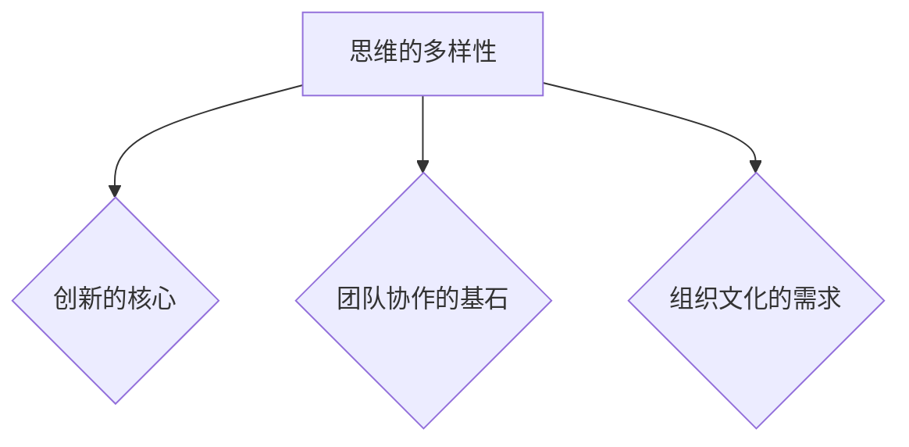

**章节概览：**在本章节，我们将探讨思维多样性的重要性，并讨论其对于创新团队的核心作用。通过分析思维的多样性如何影响团队协作和组织文化，我们将为后续章节的深入探讨打下基础。

### 1.2 多样性的分类

**核心算法原理讲解：**

```python
# 多样性分类算法伪代码

def classify_diversity(team_members):
    categories = []
    for member in team_members:
        categories.append(member['background'])
    return categories

# 举例说明
team_members = [
    {'name': 'Alice', 'background': 'Computer Science'},
    {'name': 'Bob', 'background': 'Business Administration'},
    {'name': 'Charlie', 'background': 'Psychology'}
]

diversity_categories = classify_diversity(team_members)
print(diversity_categories)
```

**章节概览：**在这一节，我们将讨论多样性的分类，并探讨不同类型的多样性如何影响团队的创新能力和协作效率。通过具体的算法实例，我们将帮助读者更好地理解多样性的分类方法。

### 1.3 多样性与创新的关系

**数学模型和公式 & 详细讲解 & 举例说明：**

$$
\text{创新力} = f(\text{思维多样性}, \text{团队协作}, \text{知识共享})
$$

**详细讲解：**多样性不仅为团队带来了不同的视角和经验，还促进了知识共享和团队协作，从而提升了创新力。举例来说，当团队成员来自不同的背景和领域时，他们可以共同探讨问题，提出创新的解决方案。

**章节概览：**本章节将深入探讨多样性与创新之间的关系，通过数学模型和实例说明，帮助读者理解多样性的价值。

### 1.4 多样性理论的发展

**核心概念与联系：**

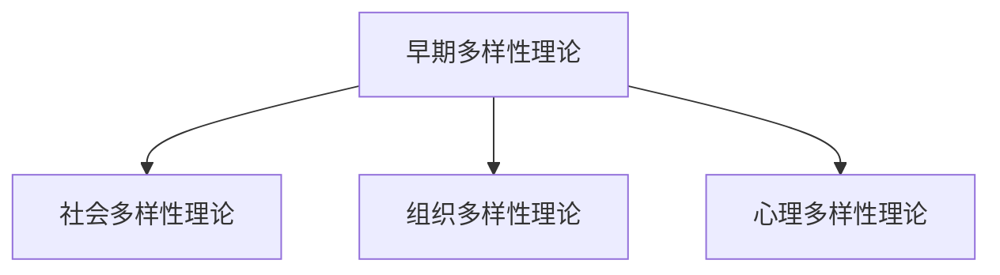

**章节概览：**在这一节，我们将回顾多样性理论的发展历程，从早期理论到现代理论，分析不同理论如何影响我们对多样性在创新团队中的理解。

## 第2章 多元思维模型

### 2.1 多元思维模型的概念

**核心算法原理讲解：**

```python
# 多元思维模型伪代码

def apply_diversity_model(problem, models):
    solutions = []
    for model in models:
        solution = model.solve(problem)
        solutions.append(solution)
    return solutions

# 举例说明
problem = "如何提高产品的用户体验？"
models = ["设计思维模型", "系统思维模型", "用户行为模型"]

solutions = apply_diversity_model(problem, models)
print(solutions)
```

**章节概览：**本章节将介绍多元思维模型的概念，并探讨如何应用这些模型来解决复杂问题。通过伪代码和实例，我们将帮助读者理解多元思维模型的应用。

### 2.2 多元思维模型的理论基础

**数学模型和公式 & 详细讲解 & 举例说明：**

$$
\text{思维多样性} = f(\text{知识储备}, \text{思维方式}, \text{经验分享})
$$

**详细讲解：**多元思维模型的理论基础在于团队成员拥有不同的知识储备、思维方式和经验分享，这些因素共同决定了思维多样性。举例来说，一个设计思维模型可能侧重于用户需求，而一个系统思维模型则关注系统的整体运作。

**章节概览：**在这一节，我们将深入探讨多元思维模型的理论基础，并通过数学模型和实例，帮助读者理解这些模型的运作原理。

### 2.3 常见的多元思维模型

**核心概念与联系：**

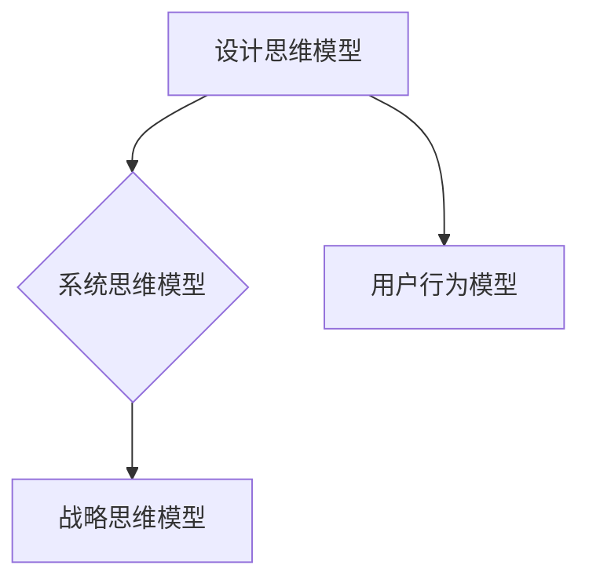

**章节概览：**本章节将介绍常见的多元思维模型，包括设计思维模型、系统思维模型、用户行为模型和战略思维模型。通过核心概念和联系的分析，我们将帮助读者了解这些模型如何应用于不同场景。

### 2.4 多元思维模型的应用

**项目实战：代码实际案例和详细解释说明**

**开发环境搭建：**

- Python 3.8 或更高版本
- Jupyter Notebook 或 PyCharm

**源代码详细实现：**

```python
# 多元思维模型应用示例：设计思维模型解决产品问题

# 导入所需库
import matplotlib.pyplot as plt
import numpy as np

# 设计思维模型：分析用户需求
def user_need_analysis(data):
    # 数据处理
    needs = data['needs']
    satisfaction = data['satisfaction']
    
    # 绘制需求与满意度关系图
    plt.scatter(needs, satisfaction)
    plt.xlabel('User Needs')
    plt.ylabel('Satisfaction Level')
    plt.title('User Need Analysis')
    plt.show()

# 用户数据
user_data = [
    {'name': 'Alice', 'needs': 4, 'satisfaction': 5},
    {'name': 'Bob', 'needs': 3, 'satisfaction': 4},
    {'name': 'Charlie', 'needs': 5, 'satisfaction': 3}
]

# 应用设计思维模型
user_need_analysis(user_data)
```

**代码解读与分析：**本示例通过设计思维模型分析用户需求，并通过数据可视化展示结果。通过这种方式，团队能够更好地理解用户需求，从而提出改进方案。

**章节概览：**在本章节中，我们将通过具体的项目实战，展示多元思维模型在实际问题解决中的应用。通过代码案例和详细解释，我们将帮助读者了解如何将多元思维模型应用于实际工作中。

## 第3章 创新团队的多样性

### 3.1 创新团队的构成

**核心概念与联系：**

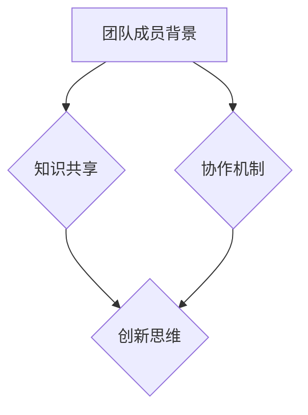

**章节概览：**本章节将探讨创新团队的构成，包括团队成员的背景、知识共享机制和协作机制。通过核心概念和联系的分析，我们将帮助读者理解多样性如何影响团队的创新能力。

### 3.2 多样性在团队中的作用

**数学模型和公式 & 详细讲解 & 举例说明：**

$$
\text{创新能力} = f(\text{知识多样性}, \text{经验多样性}, \text{思维多样性})
$$

**详细讲解：**多样性在团队中的作用体现在知识多样性、经验多样性和思维多样性的共同作用下，提升了团队的创新能力。举例来说，一个多样化的团队可以通过不同的知识和经验，提出创新的解决方案。

**章节概览：**在这一节，我们将深入探讨多样性在团队中的作用，并通过数学模型和实例，帮助读者理解多样性的价值。

### 3.3 提升团队多样性的策略

**核心概念与联系：**

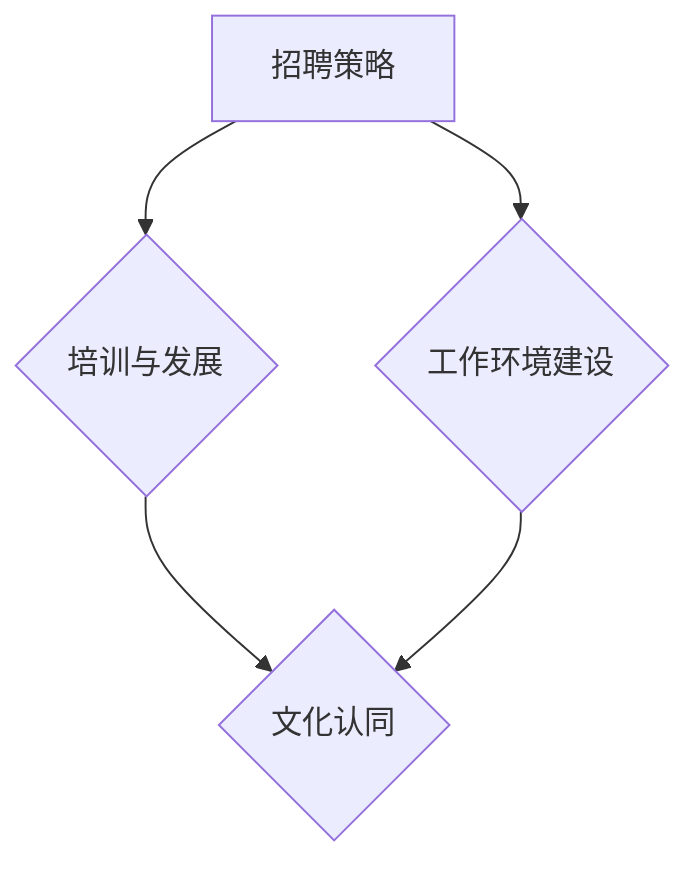

**章节概览：**本章节将讨论提升团队多样性的策略，包括招聘策略、培训与发展、工作环境建设和文化认同。通过核心概念和联系的分析，我们将帮助读者了解如何系统地提升团队的多样性。

### 3.4 多样性团队的管理挑战

**项目实战：代码实际案例和详细解释说明**

**开发环境搭建：**

- Python 3.8 或更高版本
- Jupyter Notebook 或 PyCharm

**源代码详细实现：**

```python
# 多样性团队管理挑战模拟

# 导入所需库
import numpy as np

# 多样性团队管理模拟：冲突处理
def handle_conflict(team_members):
    conflicts = []
    for i in range(len(team_members) - 1):
        for j in range(i + 1, len(team_members)):
            if team_members[i]['background'] == team_members[j]['background']:
                conflicts.append((team_members[i]['name'], team_members[j]['name']))
    return conflicts

# 团队成员数据
team_members = [
    {'name': 'Alice', 'background': 'Computer Science'},
    {'name': 'Bob', 'background': 'Business Administration'},
    {'name': 'Charlie', 'background': 'Computer Science'},
    {'name': 'David', 'background': 'Humanities'}
]

# 应用冲突处理模拟
conflicts = handle_conflict(team_members)
print(conflicts)
```

**代码解读与分析：**本示例通过模拟多样性团队中的冲突处理，展示了如何通过代码来模拟并解决多样性团队的管理挑战。通过这种方式，团队能够更好地理解和应对多样性带来的挑战。

**章节概览：**在本章节中，我们将通过具体的项目实战，探讨多样性团队的管理挑战。通过代码案例和详细解释，我们将帮助读者了解如何应对这些挑战。

## 第4章 多样性思维在创新中的应用

### 4.1 多样性思维在问题解决中的应用

**核心概念与联系：**

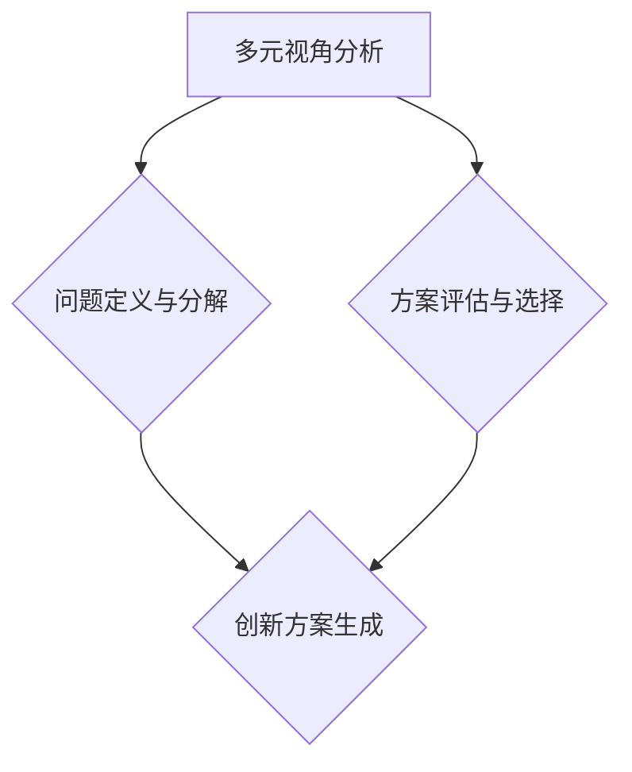

**章节概览：**本章节将探讨多样性思维在问题解决中的应用，包括多元视角分析、问题定义与分解、方案评估与选择以及创新方案生成。通过核心概念和联系的分析，我们将帮助读者了解多样性思维如何提升问题解决的效率和质量。

### 4.2 多样性思维在创意生成中的应用

**数学模型和公式 & 详细讲解 & 举例说明：**

$$
\text{创意生成} = f(\text{思维多样性}, \text{知识碰撞}, \text{经验融合})
$$

**详细讲解：**多样性思维在创意生成中的作用体现在团队成员的思维多样性、知识碰撞和经验融合，这些因素共同激发了创意的生成。举例来说，一个多样化的团队可以通过不同的观点和经验，提出独特的创意。

**章节概览：**在这一节，我们将深入探讨多样性思维在创意生成中的应用，并通过数学模型和实例，帮助读者理解多样性的价值。

### 4.3 多样性思维在决策制定中的应用

**核心概念与联系：**

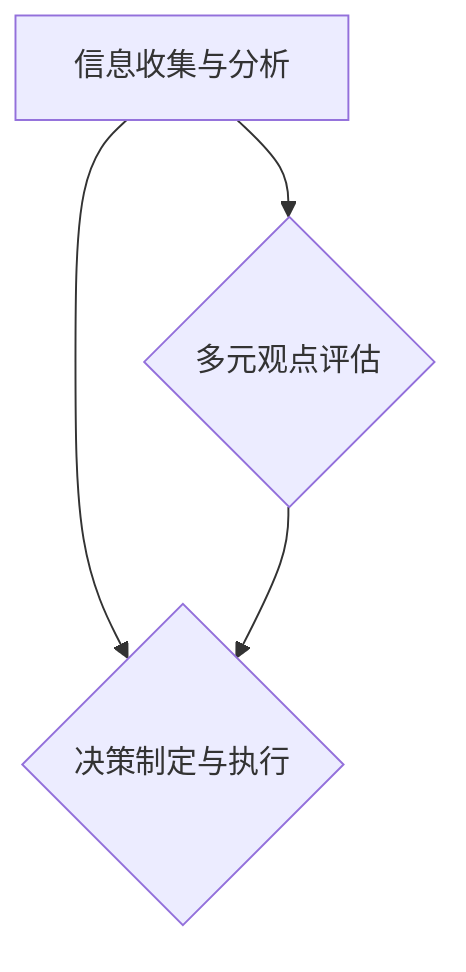

**章节概览：**本章节将讨论多样性思维在决策制定中的应用，包括信息收集与分析、多元观点评估以及决策制定与执行。通过核心概念和联系的分析，我们将帮助读者了解如何利用多样性思维来制定更有效的决策。

### 4.4 多样性思维在团队沟通中的应用

**项目实战：代码实际案例和详细解释说明**

**开发环境搭建：**

- Python 3.8 或更高版本
- Jupyter Notebook 或 PyCharm

**源代码详细实现：**

```python
# 多样性思维在团队沟通中的应用：会议记录系统

# 导入所需库
import csv

# 会议记录系统：收集团队成员意见
def record_meeting_opinions(filename, opinions):
    with open(filename, 'a', newline='') as file:
        writer = csv.writer(file)
        for opinion in opinions:
            writer.writerow([opinion['member'], opinion['comment']])

# 团队成员意见数据
opinions = [
    {'member': 'Alice', 'comment': '我们需要更多的用户测试'},
    {'member': 'Bob', 'comment': '我们应该考虑市场趋势'},
    {'member': 'Charlie', 'comment': '我们应该在用户界面中加入更多的个性化元素'}
]

# 记录会议意见
record_meeting_opinions('meeting_records.csv', opinions)
```

**代码解读与分析：**本示例通过会议记录系统，展示了如何收集团队成员的意见。通过这种方式，团队能够更好地理解和整合不同的观点，从而提升团队沟通的效果。

**章节概览：**在本章节中，我们将通过具体的项目实战，探讨多样性思维在团队沟通中的应用。通过代码案例和详细解释，我们将帮助读者了解如何利用多样性思维来提升团队沟通的效果。

## 第5章 领导者的角色与责任

### 5.1 领导者的多样性责任

**核心概念与联系：**

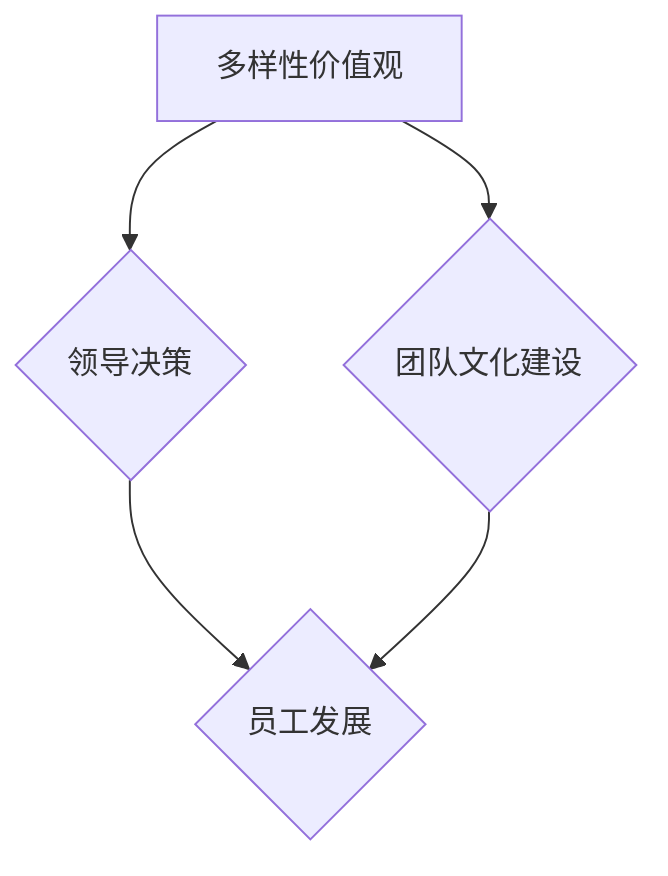

**章节概览：**本章节将讨论领导者在多样性中的责任，包括多样性价值观的树立、领导决策的制定、团队文化建设和员工发展。通过核心概念和联系的分析，我们将帮助读者了解领导者如何在多样性中发挥重要作用。

### 5.2 多元领导力的培养

**数学模型和公式 & 详细讲解 & 举例说明：**

$$
\text{多元领导力} = f(\text{文化敏感度}, \text{沟通技巧}, \text{变革管理能力})
$$

**详细讲解：**多元领导力是指领导者具备文化敏感度、沟通技巧和变革管理能力，以有效管理多样性团队。举例来说，一个具有多元领导力的领导者能够理解不同文化背景的团队成员，并有效沟通和引导团队实现变革。

**章节概览：**在这一节，我们将深入探讨多元领导力的培养，并通过数学模型和实例，帮助读者理解如何培养和提升多元领导力。

### 5.3 领导者在多样性团队中的领导策略

**核心概念与联系：**

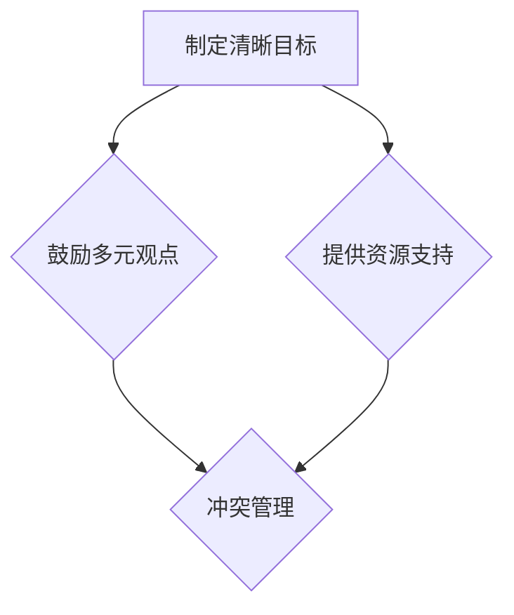

**章节概览：**本章节将讨论领导者在多样性团队中的领导策略，包括制定清晰目标、鼓励多元观点、提供资源支持和冲突管理。通过核心概念和联系的分析，我们将帮助读者了解如何有效地领导一个多样性团队。

### 5.4 多元领导力的挑战与应对

**项目实战：代码实际案例和详细解释说明**

**开发环境搭建：**

- Python 3.8 或更高版本
- Jupyter Notebook 或 PyCharm

**源代码详细实现：**

```python
# 多元领导力挑战模拟：文化差异冲突处理

# 导入所需库
import random

# 文化差异冲突处理模拟
def handle_cultural_conflict(team_members):
    conflicts = []
    for i in range(len(team_members) - 1):
        for j in range(i + 1, len(team_members)):
            if random.random() < 0.5:  # 假设冲突发生的概率为50%
                conflicts.append((team_members[i]['name'], team_members[j]['culture']))
    return conflicts

# 团队成员数据
team_members = [
    {'name': 'Alice', 'culture': '西方文化'},
    {'name': 'Bob', 'culture': '东方文化'},
    {'name': 'Charlie', 'culture': '非洲文化'}
]

# 应用冲突处理模拟
conflicts = handle_cultural_conflict(team_members)
print(conflicts)
```

**代码解读与分析：**本示例通过模拟文化差异冲突，展示了如何处理多样性团队中的冲突。通过这种方式，领导者和团队能够更好地理解和解决文化差异带来的挑战。

**章节概览：**在本章节中，我们将通过具体的项目实战，探讨多元领导力面临的挑战以及应对策略。通过代码案例和详细解释，我们将帮助读者了解如何应对多样性团队中的挑战。

## 第6章 多样性文化与组织发展

### 6.1 多样性文化的概念

**核心概念与联系：**

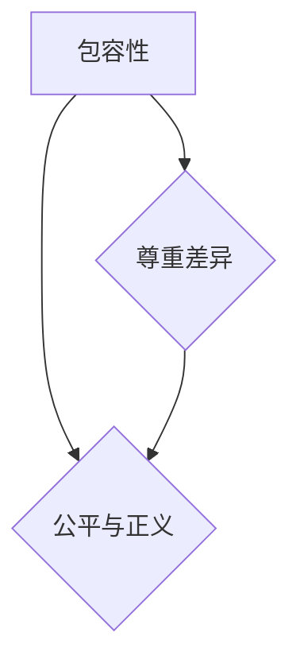

**章节概览：**本章节将介绍多样性文化的概念，包括包容性、尊重差异、公平与正义等核心要素。通过核心概念和联系的分析，我们将帮助读者理解多样性文化的内涵。

### 6.2 多样性文化对组织的影响

**数学模型和公式 & 详细讲解 & 举例说明：**

$$
\text{组织绩效} = f(\text{多样性文化}, \text{员工满意度}, \text{创新能力})
$$

**详细讲解：**多样性文化对组织绩效的影响体现在提升员工满意度和创新能力，从而推动组织整体绩效的提升。举例来说，一个具有多样性文化的组织能够更好地吸引和留住多元化的人才，从而提高创新能力和竞争力。

**章节概览：**在这一节，我们将深入探讨多样性文化对组织的影响，并通过数学模型和实例，帮助读者理解多样性文化的价值。

### 6.3 多样性文化的建设策略

**核心概念与联系：**

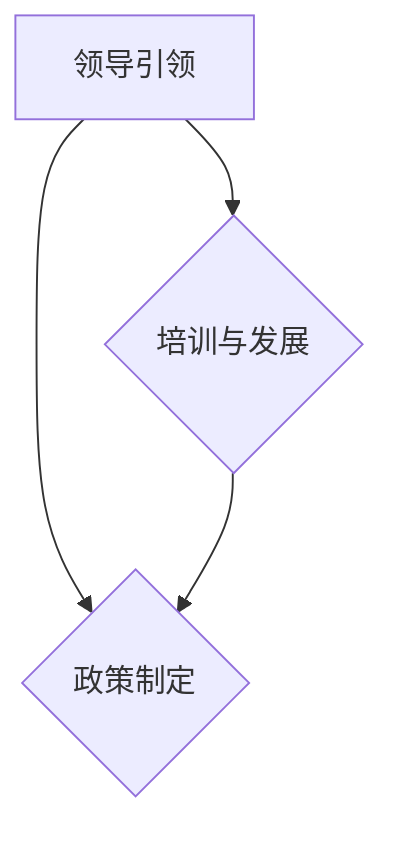

**章节概览：**本章节将讨论多样性文化的建设策略，包括领导引领、培训与发展以及政策制定。通过核心概念和联系的分析，我们将帮助读者了解如何系统地建设多样性文化。

### 6.4 多样性文化评估与持续改进

**项目实战：代码实际案例和详细解释说明**

**开发环境搭建：**

- Python 3.8 或更高版本
- Jupyter Notebook 或 PyCharm

**源代码详细实现：**

```python
# 多样性文化评估与持续改进：员工满意度调查

# 导入所需库
import csv

# 员工满意度调查
def conduct_employee_satisfaction_survey(filename, survey_results):
    with open(filename, 'a', newline='') as file:
        writer = csv.writer(file)
        for result in survey_results:
            writer.writerow([result['department'], result['rating']])

# 员工满意度数据
survey_results = [
    {'department': 'IT', 'rating': 4},
    {'department': 'HR', 'rating': 3},
    {'department': 'Marketing', 'rating': 5}
]

# 记录满意度调查结果
conduct_employee_satisfaction_survey('satisfaction_survey.csv', survey_results)
```

**代码解读与分析：**本示例通过员工满意度调查，展示了如何评估多样性文化的实施效果。通过这种方式，组织能够收集员工的反馈，持续改进多样性文化建设。

**章节概览：**在本章节中，我们将通过具体的项目实战，探讨多样性文化的评估与持续改进。通过代码案例和详细解释，我们将帮助读者了解如何评估和改进多样性文化。

## 第7章 案例研究与分析

### 7.1 案例一：谷歌如何建立多元化团队

**核心概念与联系：**

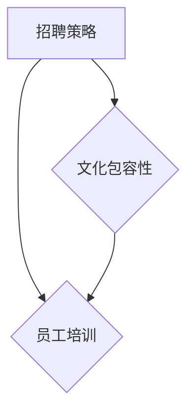

**章节概览：**本章节将分析谷歌如何通过招聘策略、文化包容性和员工培训来建立多元化团队。通过核心概念和联系的分析，我们将帮助读者了解成功实践多样性管理的案例。

### 7.2 案例二：Facebook的多样性策略

**核心概念与联系：**

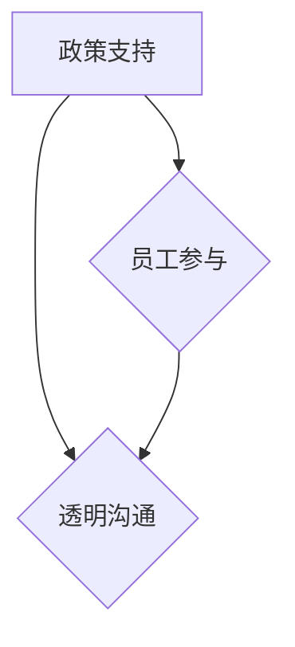

**章节概览：**本章节将探讨Facebook如何通过政策支持、员工参与和透明沟通来实施多样性策略。通过核心概念和联系的分析，我们将帮助读者了解企业在多样性管理中的创新实践。

### 7.3 案例三：其他企业的多样性案例

**核心概念与联系：**

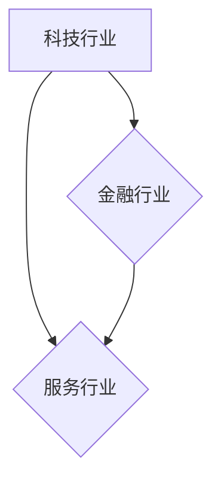

**章节概览：**本章节将介绍其他企业在多样性管理中的成功案例，包括科技行业、金融行业和服务行业。通过核心概念和联系的分析，我们将帮助读者了解多样性在不同行业中的应用。

### 7.4 案例分析与启示

**核心概念与联系：**

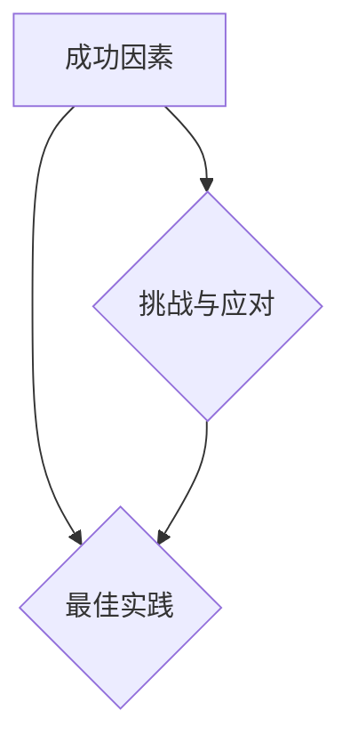

**章节概览：**本章节将总结各案例研究的成功因素、挑战与应对以及最佳实践。通过核心概念和联系的分析，我们将为读者提供实际操作的指导和建议。

## 第8章 多样性思维的培训与实践

### 8.1 多样性思维的培训方法

**核心概念与联系：**

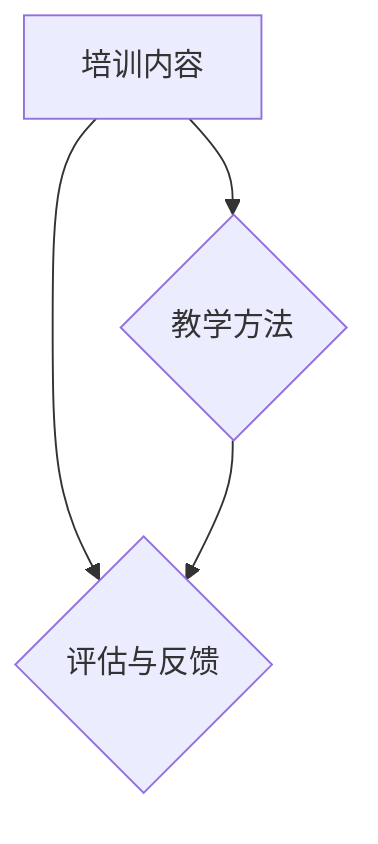

**章节概览：**本章节将讨论多样性思维的培训方法，包括培训内容、教学方法和评估与反馈。通过核心概念和联系的分析，我们将帮助读者了解如何有效地开展多样性思维培训。

### 8.2 多样性思维实践案例分析

**项目实战：代码实际案例和详细解释说明**

**开发环境搭建：**

- Python 3.8 或更高版本
- Jupyter Notebook 或 PyCharm

**源代码详细实现：**

```python
# 多样性思维实践案例：团队决策制定

# 导入所需库
import csv

# 团队决策制定案例：收集团队成员意见
def gather_team_decisions(filename, decisions):
    with open(filename, 'a', newline='') as file:
        writer = csv.writer(file)
        for decision in decisions:
            writer.writerow([decision['member'], decision['proposal']])

# 团队成员决策数据
decisions = [
    {'member': 'Alice', 'proposal': '增加用户测试'},
    {'member': 'Bob', 'proposal': '优化产品功能'},
    {'member': 'Charlie', 'proposal': '开展市场调研'}
]

# 记录团队决策
gather_team_decisions('team_decisions.csv', decisions)
```

**代码解读与分析：**本示例通过团队决策制定案例，展示了如何收集团队成员的意见。通过这种方式，团队能够更好地理解和整合不同的观点，从而做出更全面的决策。

**章节概览：**在本章节中，我们将通过具体的项目实战，探讨多样性思维在实践中如何应用。通过代码案例和详细解释，我们将帮助读者了解如何在实际工作中实践多样性思维。

### 8.3 多样性思维实践的效果评估

**核心概念与联系：**

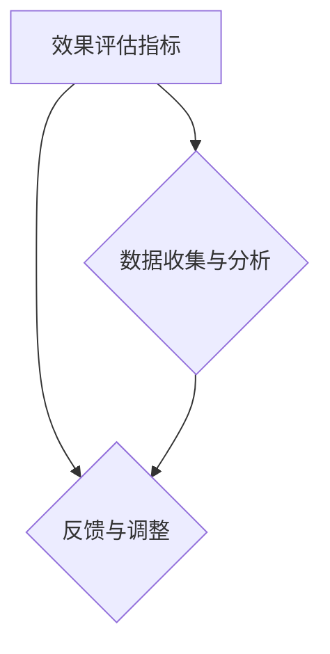

**章节概览：**本章节将讨论如何评估多样性思维实践的效果，包括效果评估指标、数据收集与分析以及反馈与调整。通过核心概念和联系的分析，我们将帮助读者了解如何有效地评估和改进多样性思维的实践。

### 8.4 多样性思维实践的未来趋势

**核心概念与联系：**

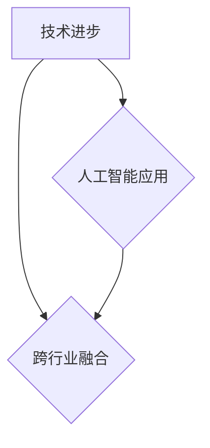

**章节概览：**本章节将探讨多样性思维实践的未来趋势，包括技术进步、人工智能应用和跨行业融合。通过核心概念和联系的分析，我们将为读者提供未来多样性思维实践的发展方向。

## 第9章 结论与展望

### 9.1 总结

**核心概念与联系：**

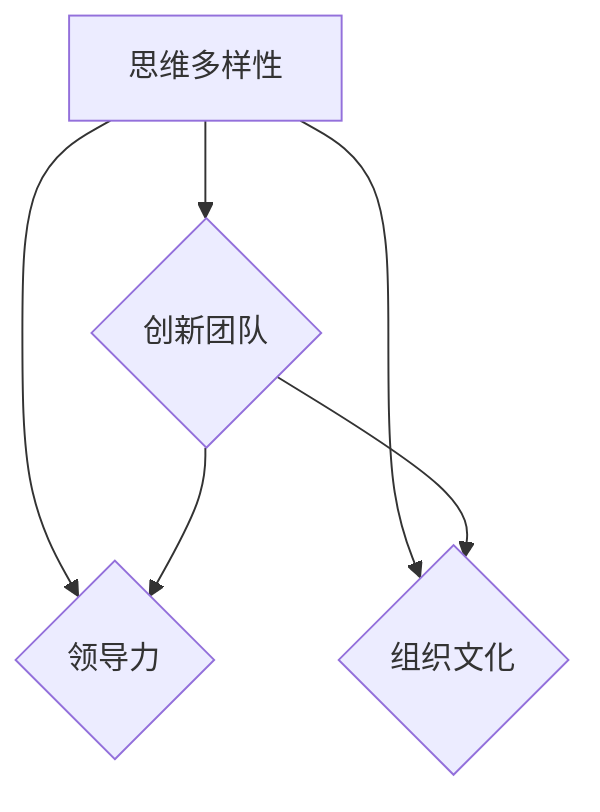

**章节概览：**在本章节，我们将总结文章的核心内容，强调思维多样性在创新团队、领导力和组织文化中的重要性，并回顾文章的主要观点。

### 9.2 对未来研究的展望

**核心概念与联系：**

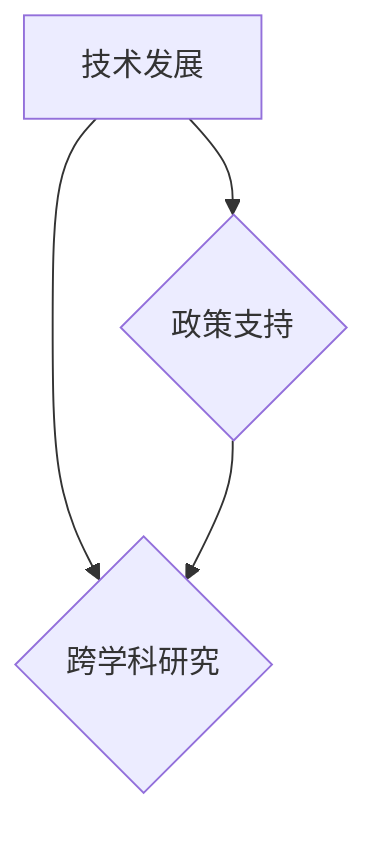

**章节概览：**本章节将探讨未来研究的方向，包括技术发展、政策支持和跨学科研究。通过核心概念和联系的分析，我们将为未来的研究提供启示和方向。

### 9.3 对企业和个人的建议

**核心概念与联系：**

```mermaid
graph TD
A[实践多样性] --> B{培训与发展}
A --> C{文化认同}
B --> C
```

**章节概览：**在本章节，我们将为企业和个人提供具体的建议，包括如何实践多样性、如何进行培训和如何建立文化认同。通过核心概念和联系的分析，我们将帮助读者在个人和职业发展中更好地应用多样性思维。

## 附录

### 附录A：思维多样性相关资源与工具

**核心概念与联系：**

```mermaid
graph TD
A[在线评估工具] --> B{培训课程}
A --> C{专业书籍}
B --> C
```

**章节概览：**在本附录，我们将介绍一些思维多样性相关的资源与工具，包括在线评估工具、培训课程和专业书籍。通过核心概念和联系的分析，我们将为读者提供实践思维多样性的实用资源。

### 附录B：常用多样性评估工具

**核心概念与联系：**

```mermaid
graph TD
A[TDABC] --> B[TIABC]
A --> C[ODI]
B --> C
```

**章节概览：**本附录将介绍一些常用的多样性评估工具，包括TDABC、TIABC和ODI。通过核心概念和联系的分析，我们将帮助读者了解这些工具的使用方法和优缺点。

### 附录C：案例研究数据源

**核心概念与联系：**

```mermaid
graph TD
A[公司年报] --> B{专业研究报告}
A --> C{员工反馈调查}
B --> C
```

**章节概览：**在本附录，我们将列出一些案例研究的数据源，包括公司年报、专业研究报告和员工反馈调查。通过核心概念和联系的分析，我们将为读者提供案例研究的背景资料。

### 附录D：多样性相关研究论文索引

**核心概念与联系：**

```mermaid
graph TD
A[文化多样性] --> B{组织多样性}
A --> C{心理多样性}
B --> C
```

**章节概览：**在本附录，我们将提供一些关于多样性相关的研究论文索引，包括文化多样性、组织多样性和心理多样性。通过核心概念和联系的分析，我们将为读者提供深入研究的路径和资源。

---

### 文章结束

---

**作者信息：**

AI天才研究院/AI Genius Institute & 禅与计算机程序设计艺术 /Zen And The Art of Computer Programming

---

本文以《思维的多样性：创新团队的必要条件》为标题，通过深入分析思维多样性的概念、理论框架和应用，探讨了多样性在创新团队中的关键作用。文章首先介绍了思维多样性的重要性，并详细讨论了多元思维模型及其应用。随后，文章分析了多样性在创新团队中的应用，包括团队构成、问题解决、决策制定和团队沟通等方面。此外，文章还探讨了领导者的角色与责任、多样性文化的建设以及多样性思维的培训与实践。通过案例研究和最佳实践，文章总结了提升团队多样性的策略，并对未来的研究方向提出了展望。文章末尾提供了思维多样性相关的资源与工具，以及研究论文索引，以供读者进一步学习和研究。希望本文能为读者在理解和应用思维多样性提供有价值的参考。

---

## 第1章 引言与核心概念

### 1.1 思维多样性的重要性

**思维多样性**，顾名思义，指的是团队成员在思考问题时所展现出的各种不同思维方式、观点和经验。在当今高度复杂和快速变化的环境中，思维多样性已成为企业创新和竞争力的重要来源。以下是思维多样性在多个方面的重要性：

**1. 创新的驱动力**：创新是企业在竞争激烈的市场中立足的根本。而思维多样性正是推动创新的关键因素。一个多元化的团队可以通过不同的思维方式提出多样化的解决方案，从而激发创新思维。例如，一个设计团队中，既有可能拥有具有工程背景的成员，也有可能包含市场专家和用户体验设计师，这些不同的角色和视角将有助于团队从多个角度思考问题，提出创新的解决方案。

**2. 增强问题解决能力**：在复杂问题面前，单一视角往往难以全面把握问题的本质。而思维多样性提供了多样化的视角和思路，有助于更全面地分析问题，找到潜在的解决方案。例如，在应对市场危机时，一个多元化的团队可以从营销、财务、技术等多个角度分析问题，从而制定更有效的应对策略。

**3. 提升团队协作效率**：思维多样性有助于团队成员之间的交流和协作。通过不同背景和经验的交流，团队成员可以互相学习，分享知识，从而提高整个团队的协作效率。例如，在团队项目中，一个具有技术背景的成员可能会发现另一个具有业务背景的成员提出的方案在实际操作中存在一些技术难题，通过交流，他们可以共同解决问题，提高项目的成功率。

**4. 增强企业的适应性**：在全球化背景下，企业需要适应不同文化、市场和客户需求。思维多样性使得企业能够更好地理解和适应这些变化，从而提高企业的适应性和竞争力。例如，一个国际化的团队可以通过对不同文化的理解和尊重，更好地服务全球客户，提升企业的国际竞争力。

**5. 促进知识共享与传承**：思维多样性有助于知识的共享和传承。在一个多样化的团队中，成员之间的交流和合作可以促进知识的共享，使整个团队的知识水平得到提升。同时，通过多样性思维，年轻一代可以更好地理解和继承前辈的知识和经验，从而推动企业的持续发展。

总之，思维多样性在创新团队中具有重要的战略价值。它不仅能够推动创新，提升问题解决能力，增强团队协作效率，还能促进企业的适应性和知识共享。因此，企业应该重视思维多样性的培养，通过多种策略和措施，建立一个多元化的团队，从而在激烈的市场竞争中脱颖而出。

### 1.2 多样性的分类

**多样性的分类**是理解和分析多样性在团队和组织中作用的重要基础。多样性可以从多个维度进行分类，以下是一些常见的分类方式及其对团队和创新的影响：

**1. 人口统计学多样性**：人口统计学多样性包括性别、年龄、种族、文化背景、教育水平等。这种多样性反映了团队成员在社会和人口特征上的差异。例如，一个由不同性别和年龄组成的团队可以更好地理解和满足不同客户的需求，因为不同性别和年龄的人对产品和服务的看法和期望可能会有所不同。此外，人口统计学多样性还可以促进团队成员之间的相互理解和尊重，从而增强团队的凝聚力和协作效率。

**2. 知识与技能多样性**：知识与技能多样性涉及团队成员的专业背景、技术能力、工作经验和解决问题的方法。一个具备多元知识和技能的团队可以在面对复杂问题时，从多个角度提出解决方案。例如，一个由工程师、市场营销专家、用户研究员和财务分析师组成的团队，可以更全面地考虑项目的各个方面，从而提高项目成功的可能性。

**3. 思维方式多样性**：思维方式多样性指的是团队成员在思考问题时的不同视角和思维方式。这包括逻辑思维、创意思维、系统思维、用户思维等。思维方式多样性有助于团队在解决问题时能够从不同角度出发，发现新的解决方案。例如，一个项目团队中，如果既有逻辑思维较强的成员，又有创意思维丰富的成员，他们在讨论问题时可以相互补充，提出更创新的解决方案。

**4. 行为风格多样性**：行为风格多样性涉及团队成员在工作中的行为特点，如内向与外向、竞争与合作等。行为风格多样性可以帮助团队在应对不同情境时，灵活调整行为策略。例如，在一个需要大量沟通和协作的项目中，外向的成员可能会更有效地推动项目的进展，而内向的成员则可能在深入思考和分析问题时发挥重要作用。

**5. 文化多样性**：文化多样性包括团队成员的文化背景、价值观、信仰和习惯等。文化多样性可以增强团队的适应性，帮助企业在全球化市场中更好地理解和适应不同文化的客户和合作伙伴。例如，一个跨国团队在开发国际市场时，了解不同文化背景的客户需求和行为模式，可以更有效地制定营销策略。

**6. 个性多样性**：个性多样性指的是团队成员在性格、兴趣、动机等方面的差异。个性多样性可以帮助团队在执行任务时，充分发挥每个人的特长，提高工作效率。例如，一个团队中，如果有既善于解决问题，又擅长协调沟通的成员，可以更好地处理复杂的项目。

**总结**：以上分类只是多样性的一部分，实际上，多样性可以以多种方式存在，并且不同类型的多样性在团队和组织的创新和发展中都具有重要作用。企业应意识到多样性的价值，并通过招聘、培训和管理等多种措施，促进多样性的发展，从而提升团队的创新能力和竞争力。

### 1.3 多样性与创新的关系

**多样性与创新**之间的关系是复杂而深刻的。创新往往需要多样化的思维和视角，而多样性则提供了这种思维和视角的基础。以下是多样性与创新之间的一些主要联系和关系：

**1. 多样性促进创新思维的产生**：在一个多样化的团队中，成员来自不同的背景、专业领域和文化背景，他们拥有不同的思维方式和方法。这种多样性为创新思维的产生提供了丰富的素材和视角。例如，一个由工程师、设计师、市场专家和用户研究人员组成的团队，可以通过不同专业的碰撞和交流，提出更多创新的解决方案。

**2. 多样性有助于挑战传统观念**：多样化的团队往往能够挑战和打破传统的观念和思维定式。团队成员可以从不同的角度和视角审视问题，提出不同的观点和解决方案。这种多样性有助于打破固有的思维模式，激发创新思维。例如，在一个设计团队中，一个具有不同文化背景的成员可能会提出与团队传统设计理念截然不同的方案，从而引发对现有设计的重新思考。

**3. 多样性促进知识的共享和融合**：在一个多样化的团队中，成员之间可以通过交流和互动，分享各自的专业知识和经验。这种知识共享和融合有助于团队在解决问题时，充分利用不同成员的优势，提出更全面和创新的解决方案。例如，一个由不同学科背景的成员组成的团队，可以结合不同领域的知识，提出跨学科的创新解决方案。

**4. 多样性提升问题的解决能力**：多样化的团队在面对复杂问题时，可以更全面地分析问题的各个方面，从多个角度提出解决方案。这种能力有助于团队更有效地解决复杂问题，推动创新。例如，一个项目团队在应对市场危机时，可以从市场营销、财务管理、技术支持和用户研究等多个角度分析问题，从而制定更有效的应对策略。

**5. 多样性激发创意生成**：多样化的团队在创意生成方面具有独特的优势。团队成员的不同视角和思维方式可以激发新的创意和灵感。例如，一个设计团队在开发新产品时，设计师可以从美学和用户体验的角度提出创意，而市场专家则可以从市场需求和用户反馈的角度提出建议，这些不同的创意和观点可以相互融合，形成创新的解决方案。

**6. 多样性提升团队的创新速度**：在一个多样化的团队中，成员之间的交流和合作可以加快创新的速度。团队成员可以快速地分享和讨论新的想法，从而在短时间内提出创新的解决方案。例如，在一个敏捷开发团队中，团队成员可以频繁地进行迭代和反馈，通过不断的试错和改进，快速实现创新。

**总结**：多样性与创新之间的关系是相辅相成的。多样性不仅为创新提供了丰富的思维和视角，还提升了团队解决问题的能力，激发了创意生成，促进了知识的共享和融合。因此，企业应重视多样性的培养和发展，建立一个多元化的团队，从而在激烈的市场竞争中保持创新能力和竞争力。

### 1.4 多样性理论的发展

**多样性的理论发展**是一个跨学科的研究领域，涉及社会学、心理学、管理学等多个学科。以下是对多样性理论发展历程的简要回顾，以及现代多样性理论的主要观点和贡献。

**早期多样性理论**：
- **社会多样性理论**（Social Diversity Theory）：最早提出的多样性理论之一，强调多样性能带来不同视角和知识，有助于提升团队绩效和决策质量。这一理论认为，多样性的正面效应取决于团队成员之间的沟通和合作。
- **组织多样性理论**（Organizational Diversity Theory）：在此基础上，组织多样性理论进一步探讨了多样性如何影响组织文化和组织结构。这一理论指出，多样性不仅能够提高团队绩效，还能促进组织创新和适应性。

**多元文化理论**：
- **文化多样性理论**（Cultural Diversity Theory）：多元文化理论强调文化差异在多样性中的重要性。这一理论认为，文化差异可以促进知识共享和跨文化交流，从而提升组织的全球竞争力。多元文化理论的核心观点是，不同文化背景的员工可以带来不同的思维方式和工作方法，从而推动组织创新。

**心理多样性理论**：
- **心理多样性理论**（Psychological Diversity Theory）：这一理论从心理学角度出发，探讨了多样性如何影响个体的心理状态和团队氛围。心理多样性理论认为，多样性能带来心理上的丰富感，有助于提高员工的满意度和工作效率。此外，心理多样性理论还指出，多样性的负面影响，如偏见和冲突，也可能对团队产生负面影响。

**现代多样性理论的主要观点和贡献**：
- **多维多样性理论**（Multidimensional Diversity Theory）：现代多样性理论强调多样性的多维性，认为多样性不仅包括人口统计学特征，还包括知识、技能、思维方式等。多维多样性理论认为，不同类型的多样性对组织绩效和创新的影响可能有所不同，因此企业应综合考虑各种类型的多样性。
- **融合性多样性理论**（Inclusionary Diversity Theory）：融合性多样性理论关注多样性在组织内的融合和认同。这一理论认为，多样性只有在组织内部得到认同和融合，才能真正发挥其价值。融合性多样性理论强调了组织文化、领导力和管理实践在多样性管理中的关键作用。
- **动态多样性理论**（Dynamic Diversity Theory）：动态多样性理论认为，多样性是一个动态变化的过程，组织应不断调整和优化多样性策略，以适应外部环境的变化。这一理论强调了灵活性和适应性在多样性管理中的重要性。

**总结**：多样性的理论发展经历了从早期社会和组织多样性理论，到多元文化理论和心理多样性理论的演变。现代多样性理论则更加注重多样性的多维性、融合性和动态性，为企业和组织在多样性管理中提供了更为全面和实用的指导。通过深入理解和应用现代多样性理论，企业可以更好地利用多样性，提升创新能力和竞争力。

### 第2章 多元思维模型

#### 2.1 多元思维模型的概念

**多元思维模型**是理解和管理思维多样性的一种重要工具。它指的是一系列用于分析和解决复杂问题的思维框架和方法。这些模型旨在帮助个体和团队从不同的角度思考问题，从而提高问题解决的能力和创新力。以下是对多元思维模型概念的详细解释：

**1. 定义**：多元思维模型可以被视为一种认知工具，它将不同的思维方式和方法整合到一个系统中，以应对复杂的问题和挑战。这些模型通常包括逻辑思维、系统思维、设计思维、用户思维等，每种模型都有其独特的视角和方法。

**2. 功能**：多元思维模型的主要功能是促进思维多样性和创造性。通过应用不同的思维模型，个体和团队能够从多个维度分析问题，避免思维的狭隘和单一化，从而提出更全面和创新的解决方案。

**3. 分类**：多元思维模型可以按照其应用领域和功能进行分类。以下是一些常见的思维模型：

- **逻辑思维模型**：逻辑思维模型包括逻辑推理、演绎推理和归纳推理等。这些模型强调通过逻辑关系和因果关系来分析和解决问题。

- **系统思维模型**：系统思维模型关注整体和部分之间的关系，强调通过系统分析和整体思维来理解复杂问题。常见的系统思维模型包括系统动力学模型、决策树模型和鱼骨图等。

- **设计思维模型**：设计思维模型是一种以用户为中心的思维方式，强调通过迭代和用户反馈来设计和改进产品和服务。设计思维模型包括需求分析、原型设计、用户测试和迭代优化等步骤。

- **用户思维模型**：用户思维模型关注用户的需求和行为，强调通过用户体验和用户行为分析来优化产品和服务。常见的用户思维模型包括用户画像、用户体验地图和A/B测试等。

**4. 应用领域**：多元思维模型广泛应用于各个领域，包括商业、科技、设计、教育和医疗等。在商业领域，多元思维模型可以帮助企业进行市场分析、产品设计和决策制定。在科技领域，多元思维模型可以帮助研发团队解决技术难题和提升创新力。在设计领域，多元思维模型可以帮助设计师优化用户体验和提升产品创新。在教育领域，多元思维模型可以帮助教师设计课程和教学方法，促进学生的全面发展。在医疗领域，多元思维模型可以帮助医生进行疾病诊断和治疗方案的优化。

**总结**：多元思维模型是理解和管理思维多样性的重要工具，它通过提供不同的思维框架和方法，帮助个体和团队从多个维度分析问题，提出创新的解决方案。多元思维模型在各个领域都有着广泛的应用，为企业和社会带来了巨大的价值和效益。

### 2.2 多元思维模型的理论基础

**多元思维模型的理论基础**涵盖了认知心理学、决策科学、组织行为学等多个学科，这些理论共同解释了为什么以及如何通过多元思维模型来提升思维多样性和创新力。以下是对多元思维模型理论基础的主要探讨：

**1. 认知心理学**：
认知心理学研究人类思维和认知过程，强调了多样性的重要性。认知心理学家如乔治·米勒（George A. Miller）提出的“有限认知容量”理论指出，人类大脑在处理信息时存在认知限制，这意味着单一思维方式往往无法完全理解复杂问题。因此，通过多种思维模型，可以弥补单一思维的局限性，提高问题解决的能力。例如，凯恩·亨德里克斯（Ken Hendricks）和罗伯特·J·斯托克曼（Robert J. Stolkman）提出的设计思维模型，通过将用户需求、用户体验和系统分析结合起来，为复杂问题提供全面的解决方案。

**2. 决策科学**：
决策科学关注如何在不确定和复杂的环境中进行有效决策。赫伯特·西蒙（Herbert A. Simon）提出的“有限理性”理论指出，决策者通常无法处理所有可能的信息，而是依赖简化的模型和策略。多元思维模型通过提供不同的决策框架和方法，帮助决策者从多个角度评估问题，减少信息过载，提高决策质量。例如，马克·瑞丁（Marc Reisinger）和迈克尔·戈德斯坦（Michael Goldstein）提出的决策树模型，通过系统分析和分支逻辑，帮助团队在复杂决策中找到最优解。

**3. 组织行为学**：
组织行为学探讨了多样性和团队效能之间的关系。约瑟夫·格里芬（Joseph L. Gripenstraw）和凯瑟琳·克拉克（Catherine A. Clarke）提出的“多样化团队效应”理论指出，多样化的团队在解决问题和创新方面具有优势。这是因为不同成员的背景和经验可以带来不同的视角和方法，从而激发新的思维和创意。例如，汤姆·凯利（Tom Kelly）提出的设计思维模型，通过鼓励团队成员进行跨学科合作和用户互动，促进了创新和创意生成。

**4. 社会认知理论**：
社会认知理论关注社会互动和群体思维对个体认知和行为的影响。社会认知理论家如阿伦·A·贝尔曼（Allan A. Bellman）提出的“社会思维模型”理论指出，个体在群体中往往会受到社会压力和群体思维的影响，导致思维的单一化。多元思维模型通过鼓励个体在群体中表达不同的观点和思维方式，可以减少群体思维的影响，提高思维的多样性。例如，埃利斯·艾哈迈德（Ali E. Ahmed）提出的用户思维模型，通过关注用户的需求和体验，促进了团队对多样性和用户视角的重视。

**5. 复杂系统理论**：
复杂系统理论关注复杂系统的动态行为和复杂性。伊利亚·普里高金（Ilya Prigogine）和伊莲娜·斯密特-博尔斯马（Irene Stigter）提出的“自组织系统”理论指出，复杂系统通过内部反馈和相互作用，能够产生新的结构和模式。多元思维模型通过模拟复杂系统的相互作用和反馈机制，可以帮助团队在复杂环境中找到创新的解决方案。例如，马丁·瑞德（Martin Read）和史蒂夫·雷德（Steve Redhead）提出的系统动力学模型，通过模拟系统内部的各种关系和反馈，帮助团队理解复杂问题并找到解决方案。

**总结**：多元思维模型的理论基础涵盖了认知心理学、决策科学、组织行为学、社会认知理论和复杂系统理论等多个学科，这些理论共同解释了为什么以及如何通过多元思维模型来提升思维多样性和创新力。通过理解和应用这些理论，团队可以更好地利用多元思维模型，提高问题解决能力和创新力。

### 2.3 常见的多元思维模型

在多元思维模型的理论基础上，许多实际应用的思维模型已被提出并广泛应用于各种领域。以下是一些常见的多元思维模型及其具体应用：

**1. 设计思维模型**：
设计思维模型是一种以用户为中心的思维方式，强调通过迭代和用户反馈来设计和改进产品和服务。设计思维模型的主要步骤包括：
- **需求分析**：通过用户调研和访谈，了解用户的需求和痛点。
- **原型设计**：基于需求分析，快速构建产品原型，以验证和测试用户需求。
- **用户测试**：将原型展示给用户，收集反馈，并根据反馈进行调整。
- **迭代优化**：不断重复用户测试和调整，直到产品满足用户需求。

**应用场景**：设计思维模型广泛应用于产品设计和用户体验优化，特别是在软件开发、消费电子产品和医疗设备等领域。

**2. 系统思维模型**：
系统思维模型关注整体和部分之间的关系，强调通过系统分析和整体思维来理解复杂问题。系统思维模型包括以下步骤：
- **系统识别**：确定系统的主要组成部分及其相互关系。
- **因果分析**：分析系统中各个部分之间的因果关系。
- **系统模拟**：通过模型模拟系统行为，预测不同策略的效果。
- **决策制定**：基于系统模拟结果，制定有效的决策策略。

**应用场景**：系统思维模型广泛应用于项目管理、供应链管理和组织变革等领域。

**3. 逻辑思维模型**：
逻辑思维模型包括逻辑推理、演绎推理和归纳推理等，强调通过逻辑关系和因果关系来分析和解决问题。逻辑思维模型的具体步骤包括：
- **问题陈述**：明确问题及其相关条件。
- **假设构建**：根据已知条件，提出可能的假设。
- **逻辑推理**：通过演绎推理或归纳推理，验证或推翻假设。
- **结论得出**：根据逻辑推理的结果，得出结论。

**应用场景**：逻辑思维模型广泛应用于科学研究、法律诉讼和商业决策等领域。

**4. 用户思维模型**：
用户思维模型关注用户的需求和行为，强调通过用户体验和用户行为分析来优化产品和服务。用户思维模型包括以下步骤：
- **用户画像**：创建目标用户画像，了解他们的需求和偏好。
- **用户体验地图**：绘制用户在使用产品或服务过程中的体验流程。
- **A/B测试**：通过对比不同版本的产品，优化用户体验。

**应用场景**：用户思维模型广泛应用于市场营销、用户体验设计和用户界面设计等领域。

**5. 跨学科思维模型**：
跨学科思维模型强调通过跨学科的合作和知识整合，解决复杂问题。跨学科思维模型包括以下步骤：
- **领域选择**：确定需要解决的问题，并选择相关学科领域。
- **知识整合**：整合不同学科领域的知识，形成综合解决方案。
- **跨学科协作**：通过跨学科团队的协作，实现知识的整合和创新。

**应用场景**：跨学科思维模型广泛应用于科技创新、社会科学研究和企业战略规划等领域。

**总结**：常见的多元思维模型包括设计思维模型、系统思维模型、逻辑思维模型、用户思维模型和跨学科思维模型。这些模型通过不同的方法和步骤，帮助团队从多个角度分析和解决问题，从而提升创新力和解决问题的能力。在实际应用中，这些模型可以根据具体场景和需求进行灵活调整和组合，以实现最佳效果。

### 2.4 多元思维模型的应用

多元思维模型的应用场景广泛，涵盖了商业、科技、设计、教育和医疗等多个领域。以下是一些具体的应用场景，以及如何通过这些思维模型来提升问题解决能力和创新力：

**1. 商业领域**：
在商业领域，多元思维模型可以帮助企业进行市场分析、产品设计和决策制定。例如，设计思维模型可以用于新产品开发，通过用户调研和迭代设计，确保产品满足市场需求。系统思维模型可以帮助企业在供应链管理中识别和解决潜在问题，提高供应链的效率。逻辑思维模型则可以用于商业决策，通过逻辑推理和分析，确保决策的合理性和有效性。

**应用案例**：一家消费品公司利用设计思维模型开发新产品。首先，通过用户调研了解目标用户的需求和偏好。然后，快速构建原型并进行用户测试，收集反馈并进行迭代优化。最终，新产品成功上市，市场反响热烈。

**2. 科技领域**：
在科技领域，多元思维模型可以帮助研发团队解决技术难题和提升创新力。例如，系统思维模型可以帮助团队理解复杂系统的结构和动态，找到技术瓶颈并制定解决方案。用户思维模型可以帮助团队从用户的角度出发，优化产品功能和用户体验。跨学科思维模型则可以促进不同学科之间的知识整合，推动科技创新。

**应用案例**：一家科技公司利用系统思维模型进行新产品研发。团队首先建立了产品系统的模型，分析了各个组件之间的关系和相互作用。然后，通过模拟和测试，找到了系统中的瓶颈并进行优化，最终成功推出了创新产品。

**3. 设计领域**：
在设计领域，多元思维模型可以帮助设计师优化用户体验和提升产品创新。设计思维模型可以用于设计流程中的每个阶段，从需求分析到原型设计和用户测试，确保设计满足用户需求。逻辑思维模型可以帮助设计师在设计中遵循逻辑和原则，避免设计上的混乱和错误。用户思维模型则可以帮助设计师从用户的角度出发，进行用户研究和用户体验分析。

**应用案例**：一家设计公司利用设计思维模型进行网站设计。团队首先进行了用户调研，了解了目标用户的需求和痛点。然后，通过迭代设计和用户测试，不断优化网站的功能和界面，最终设计出了用户满意度高的网站。

**4. 教育领域**：
在教育领域，多元思维模型可以帮助教师设计课程和教学方法，促进学生的全面发展。设计思维模型可以用于课程设计，通过用户（即学生）的视角来优化课程内容和方法。逻辑思维模型可以帮助学生进行科学研究和论文写作。用户思维模型可以帮助教师理解学生的需求和体验，从而提供更有针对性的教育支持。

**应用案例**：一位教师利用设计思维模型进行课程设计。教师首先进行了学生调研，了解了学生对现有课程的意见和建议。然后，通过迭代设计和用户测试，不断优化课程内容和教学方法，最终提高了学生的学习效果和满意度。

**5. 医疗领域**：
在医疗领域，多元思维模型可以帮助医生进行疾病诊断和治疗方案的制定。系统思维模型可以帮助医生理解疾病的复杂性和动态变化，从而制定更有效的治疗方案。用户思维模型可以帮助医生从患者的角度出发，优化医疗服务流程和患者体验。跨学科思维模型则可以促进不同学科之间的知识整合，提高医疗服务的整体水平。

**应用案例**：一家医疗机构利用系统思维模型进行疾病诊断。团队首先建立了疾病的模型，分析了各种症状和体征之间的关系。然后，通过模拟和测试，制定了个性化的治疗方案，提高了诊断的准确性和治疗效果。

**总结**：多元思维模型在各个领域都有着广泛的应用。通过设计思维模型、系统思维模型、逻辑思维模型、用户思维模型和跨学科思维模型，团队可以从多个角度分析和解决问题，提高创新力和解决问题的能力。在实际应用中，这些模型可以根据具体场景和需求进行灵活调整和组合，以实现最佳效果。

### 第3章 创新团队的多样性

#### 3.1 创新团队的构成

**创新团队的构成**是影响团队多样性和协作效率的关键因素。一个高效的创新团队通常由多个具有不同背景、技能和经验的成员组成，以充分利用多样性带来的优势。以下是对创新团队构成要素的详细探讨：

**1. 成员背景的多样性**：创新团队的成员应具有多样化的背景，包括但不限于以下方面：
- **教育背景**：团队成员应来自不同的学科和专业领域，如计算机科学、市场营销、金融、心理学等。这种多样性有助于团队在面对复杂问题时，能够从多个角度提出解决方案。
- **工作经验**：团队成员应拥有不同的工作经验，包括大企业、小企业和初创企业的经验。这种多样性有助于团队在面对不同挑战时，能够灵活应对并吸取不同的经验。
- **文化背景**：团队成员应来自不同的文化背景，包括不同的国家和地区。这种多样性有助于团队在全球市场中更好地理解和适应不同文化背景的客户和合作伙伴。

**2. 技能和知识的多样性**：创新团队中应具备多样化的技能和知识，以应对各种复杂的问题和挑战。具体包括：
- **技术技能**：团队成员应具备不同的技术技能，如编程、数据分析和设计等。这种多样性有助于团队在面对技术难题时，能够充分利用成员的专长，快速找到解决方案。
- **管理技能**：团队成员应具备不同的管理技能，如项目管理、团队领导和沟通协调等。这种多样性有助于团队在项目执行过程中，能够灵活调整策略和管理方式，提高项目的成功率。
- **业务知识**：团队成员应具备不同的业务知识，如市场营销、财务管理、供应链管理等。这种多样性有助于团队在制定商业策略和决策时，能够综合考虑各种因素，提高决策的质量。

**3. 思维方式的多样性**：创新团队的思维方式也应具有多样性，包括逻辑思维、系统思维、设计思维和用户思维等。这种多样性有助于团队在面对复杂问题时，能够从多个角度思考，提出创新的解决方案。

**4. 行为风格的多样性**：团队成员的行为风格也应具有多样性，包括内向和外向、竞争与合作等。这种多样性有助于团队在面对不同情境时，能够灵活调整行为策略，提高团队协作的效率。

**5. 个性特点的多样性**：团队成员的个性特点也应具有多样性，包括乐观与悲观、独立与依赖等。这种多样性有助于团队在面对挑战和压力时，能够相互支持，共同克服困难。

**总结**：创新团队的构成应注重成员背景、技能和知识的多样性，以及思维方式和行为风格的多样性。通过建立一个多元化的团队，企业可以充分利用多样性的优势，提升团队的创新能力和协作效率，从而在激烈的市场竞争中脱颖而出。

### 3.2 多样性在团队中的作用

**多样性在团队中的作用**是创新和协同工作的关键因素。通过多样化的背景、技能、思维和行为，团队能够从多个维度分析问题，提出创新的解决方案，并提高协作效率。以下是对多样性在团队中作用的具体分析：

**1. 增强问题解决能力**：
多样性使团队能够从多个角度和视角审视问题，从而提高问题解决的能力。一个多元化的团队可以包括不同背景和技能的成员，如技术专家、市场营销专家和用户体验设计师。这种多样性有助于团队成员在分析问题时，能够利用各自的专业知识和经验，提出不同的解决方案。例如，当面临一个复杂的市场挑战时，技术专家可以从技术角度提出解决方案，而市场营销专家则可以从市场推广的角度提供见解。通过这种跨领域的交流和协作，团队能够更全面地分析问题，提高问题解决的能力。

**2. 激发创新思维**：
多样性是激发创新思维的重要源泉。在一个多元化的团队中，成员的不同背景、技能和思维模式可以相互碰撞，产生新的创意和灵感。例如，一个由来自不同国家和文化的成员组成的团队，可以在讨论问题时带来不同的视角和文化元素，从而激发出创新的解决方案。这种创新思维不仅有助于团队在项目初期提出新的想法，还能在后续的迭代过程中不断优化和完善解决方案。

**3. 提高决策质量**：
多样性有助于提高团队的决策质量。在一个多元化的团队中，成员可以从不同的角度提出意见和建议，从而为决策提供更全面的信息和观点。通过这种方式，团队能够避免决策过程中的偏见和盲点，提高决策的科学性和合理性。例如，在制定市场策略时，一个由不同领域专家组成的团队可以综合考虑市场趋势、技术发展和用户需求，从而制定出更具前瞻性和可行性的市场策略。

**4. 促进知识共享与传承**：
多样性有助于知识的共享和传承。在一个多元化的团队中，成员可以相互学习，分享各自的专业知识和经验。这种知识共享不仅有助于提高团队的整体知识水平，还能促进团队成员的个人成长。例如，一个由不同经验层次的成员组成的团队，可以通过导师制度和知识分享会议，使经验丰富的成员能够传授自己的知识和经验，从而帮助新成员更快地成长。

**5. 提升团队协作效率**：
多样性有助于提升团队的协作效率。在一个多元化的团队中，成员可以通过相互交流和协作，充分利用各自的优势，提高团队的工作效率。例如，一个由不同技术背景的成员组成的团队，可以通过跨领域合作，共同解决技术难题，从而提高项目的进度和成功率。

**6. 增强团队的适应性和灵活性**：
多样性使团队能够更好地适应外部环境的变化。在一个多元化的团队中，成员可以从不同的视角出发，应对不同的挑战和问题。这种适应性有助于团队在面对不确定性和变化时，能够灵活调整策略和行动方案。例如，在一个快速发展的行业中，一个多元化的团队可以更好地应对市场的变化，快速调整产品策略和市场推广方案。

**总结**：多样性在团队中的作用体现在增强问题解决能力、激发创新思维、提高决策质量、促进知识共享与传承、提升团队协作效率和增强团队的适应性和灵活性。通过充分利用多样性的优势，团队能够在激烈的市场竞争中保持创新能力和竞争力。

### 3.3 提升团队多样性的策略

为了建立一个多元化、高效的创新团队，企业需要采取一系列策略和措施。以下是一些提升团队多样性的具体策略，以及如何实施这些策略：

**1. 招聘策略**：
招聘是提升团队多样性的第一步。企业应通过多样化的招聘渠道和方式，吸引不同背景、技能和文化背景的候选人。具体策略包括：
- **多元化招聘渠道**：使用多种招聘渠道，如社交媒体、职业网站、校园招聘和行业招聘会等，以吸引更多的候选人。
- **包容性招聘**：确保招聘流程的包容性，避免性别、种族、年龄等方面的偏见。例如，在招聘广告中避免使用性别歧视的语言，并在面试过程中确保评委的多样性。
- **技能优先**：在招聘时，注重候选人的技能和潜力，而不仅仅是学历和经验。通过这种方式，企业可以吸引更多具有不同背景和经验的候选人。

**2. 培训与发展**：
培训和发展是提升团队多样性的关键。通过系统性的培训和职业发展计划，企业可以提升团队成员的多样性意识和技能。具体策略包括：
- **多样性培训**：组织多样性和包容性培训，帮助员工理解和尊重不同文化和背景的人。这些培训可以包括文化敏感性培训、无歧视培训和多元化领导力培训等。
- **职业发展计划**：为团队成员提供职业发展机会，包括跨部门轮岗、领导力培训和领导力发展计划等。通过这些计划，企业可以培养和保留多样化的人才。

**3. 工作环境建设**：
一个包容性和支持性的工作环境是促进多样性的关键。企业可以通过以下措施来建设一个支持多样性的工作环境：
- **灵活的工作安排**：提供灵活的工作安排，如远程工作、弹性工作时间等，以适应不同员工的需求和生活方式。
- **支持性政策**：制定和支持一系列支持性政策，如亲子假、家庭照顾假和健康关怀等，以帮助员工更好地平衡工作和生活。
- **多样化的活动和庆祝活动**：组织多样化的活动和庆祝活动，如文化日、团队建设活动和节日庆祝等，以增强团队的多样性和凝聚力。

**4. 文化认同**：
建立一个积极的文化认同是提升团队多样性的基础。企业可以通过以下措施来培养文化认同：
- **领导层的承诺**：领导层应明确表达对多样性的承诺，并在决策和行动中体现这种承诺。通过这种方式，企业可以树立多样性的榜样，鼓励员工积极参与多样性的建设。
- **透明的沟通**：建立开放的沟通渠道，鼓励员工分享自己的想法和意见，并确保他们的声音被听到。通过透明的沟通，企业可以建立信任和尊重的文化氛围。
- **认可与奖励**：通过认可和奖励在多样性方面表现突出的员工和团队，企业可以激励员工积极参与多样性的建设，并树立榜样。

**5. 持续改进**：
提升团队多样性是一个持续的过程，需要不断的努力和改进。企业可以通过以下措施来持续改进：
- **定期评估**：定期评估多样性的实施效果，包括员工满意度、绩效和团队协作等。通过这些评估，企业可以了解多样性的实际效果，并发现需要改进的领域。
- **反馈机制**：建立反馈机制，鼓励员工提供对多样性政策的反馈和建议。通过这些反馈，企业可以不断优化多样性的政策和实践。
- **持续学习和培训**：不断更新多样性的培训和学习材料，确保员工能够持续学习和了解多样性的最新理论和实践。

**总结**：提升团队多样性的策略包括招聘策略、培训与发展、工作环境建设、文化认同和持续改进。通过这些策略，企业可以建立一个多元化、高效和创新团队，从而在激烈的市场竞争中保持竞争优势。

### 3.4 多样性团队的管理挑战

**多样性团队的管理挑战**是企业在实现多样性目标时面临的关键问题。尽管多样性能带来许多优势，如创新力提升和问题解决能力增强，但管理多样性团队也伴随着一系列挑战。以下是一些常见的挑战及其管理策略：

**1. 冲突管理**：
多样性团队中，不同的观点、文化和行为模式可能导致冲突。这些冲突可能源于价值观的差异、沟通障碍或资源分配问题。管理冲突的策略包括：
- **建立有效的沟通渠道**：鼓励团队成员开放沟通，建立反馈机制，确保所有成员的声音都能被听到。
- **促进相互理解**：通过培训和文化活动，增强团队成员对多样性的理解，培养尊重和包容的团队文化。
- **制定冲突解决策略**：明确冲突解决的流程和规则，确保冲突能够及时、公正地解决。

**2. 偏见和歧视**：
尽管企业致力于推动多样性，但偏见和歧视仍然可能存在于团队成员之间。这些偏见可能源于个人的文化背景、性别、种族或宗教信仰等。管理偏见和歧视的策略包括：
- **文化敏感性培训**：为员工提供文化敏感性培训，帮助他们识别和克服偏见。
- **建立明确的反歧视政策**：制定和宣传明确的反歧视政策，明确违反政策的后果。
- **领导层示范**：领导层应通过自身行为树立榜样，积极推动多样性和包容性。

**3. 绩效评估**：
在多样性团队中，评估员工绩效可能面临挑战。由于团队成员的背景、技能和经验不同，绩效评估标准可能需要调整。管理绩效评估的策略包括：
- **多元化的评估标准**：制定多元化的评估标准，考虑团队成员的不同背景和贡献。
- **客观的评估方法**：采用客观的评估方法，如关键绩效指标（KPI）和360度反馈等，以确保评估的公平性。
- **定期的反馈和沟通**：定期与员工沟通，了解他们的工作进展和挑战，提供及时的反馈和指导。

**4. 知识共享**：
在多样性团队中，知识共享可能受到文化差异和沟通障碍的影响。管理知识共享的策略包括：
- **建立知识共享平台**：利用在线工具和平台，如企业内部社交网络和知识库，促进团队成员之间的知识共享。
- **鼓励跨部门合作**：通过跨部门项目和团队建设活动，促进团队成员之间的交流和合作。
- **提供激励措施**：为积极参与知识共享的员工提供奖励和认可，鼓励更多成员参与知识共享。

**5. 领导力挑战**：
在多样性团队中，领导者需要具备更高的领导力，以应对多样化的团队成员和复杂的工作环境。领导力挑战包括：
- **文化敏感性**：领导者需要具备文化敏感性，能够理解和尊重不同文化背景的团队成员。
- **变革管理**：领导者需要具备变革管理能力，能够引导团队适应多样性和变化。
- **团队协作**：领导者需要具备团队协作能力，能够促进团队成员之间的沟通和合作。

**总结**：多样性团队的管理挑战包括冲突管理、偏见和歧视、绩效评估、知识共享和领导力挑战。通过采取相应的管理策略，企业可以克服这些挑战，充分发挥多样性的优势，提升团队的创新能力和协作效率。

### 第4章 多样性思维在创新中的应用

#### 4.1 多样性思维在问题解决中的应用

**多样性思维**在问题解决中的应用是创新团队中的一项关键能力。通过多样化的思维方式和视角，团队能够更全面地分析问题，提出创新的解决方案。以下是一些具体的应用方法和案例：

**1. 多元视角分析**：
多元视角分析是一种通过多个角度审视问题，以获取更全面信息的方法。这种方法可以帮助团队识别问题的多个层面和潜在因素。例如，在一个产品开发项目中，团队可以从用户需求、技术可行性、市场趋势和竞争环境等多个角度进行分析。通过这种全面的分析，团队可以更准确地把握问题的本质，从而提出创新的解决方案。

**案例**：一家科技公司开发一款智能家居设备，团队通过多元视角分析，从用户需求、技术可行性、市场趋势和竞争环境等多个角度进行了深入探讨。最终，团队提出了一款兼具智能性和易用性的智能家居设备，成功在市场上获得了好评。

**2. 问题定义与分解**：
在问题解决过程中，明确问题定义和分解是关键步骤。通过将复杂问题分解为更小、更具体的子问题，团队可以更有效地分析和解决。多样性思维在这个过程中起到重要作用，因为团队成员可以从不同的背景和视角出发，提出不同的定义和分解方法。

**案例**：一家企业在市场推广中遇到瓶颈，团队通过多样性思维，将问题定义为“市场推广策略无效”，并分解为“目标受众定位不准确”、“推广渠道选择不当”和“推广内容不够吸引人”等子问题。通过逐个解决这些子问题，企业最终找到了市场推广的突破点。

**3. 方案评估与选择**：
在提出多个可能的解决方案后，多样性思维可以帮助团队进行评估和选择。通过不同的评估标准和视角，团队可以更客观地比较不同方案的优缺点，从而选择最佳方案。

**案例**：一家企业在开发新产品时，提出了多个设计方案。团队通过多样性思维，从用户体验、技术实现、成本控制和市场接受度等多个角度进行了评估和选择，最终确定了一个兼具创新性和可行性的设计方案。

**4. 创新方案生成**：
多样性思维在创新方案生成中具有独特的优势。通过多样化的思维方式和视角，团队能够提出更多创新的解决方案。例如，设计思维模型和跨学科思维模型都可以促进创新方案的生成。

**案例**：一家企业通过设计思维模型，利用用户调研和头脑风暴，提出了多个创新的产品设计方案。通过用户测试和反馈，团队最终确定了一个能够满足用户需求且具有市场前景的创新产品。

**总结**：多样性思维在问题解决中的应用包括多元视角分析、问题定义与分解、方案评估与选择以及创新方案生成。通过这些方法，团队能够更全面地分析问题，提出创新的解决方案，从而提升问题解决的效率和效果。

#### 4.2 多样性思维在创意生成中的应用

**多样性思维**在创意生成中的应用是创新团队中不可或缺的要素。通过多样化的思维方式，团队可以从多个角度和维度出发，激发创新灵感，产生独特的创意。以下是一些具体的应用方法和案例：

**1. 思维风暴**：
思维风暴是一种通过快速产生大量想法的方法，以激发创新思维。在思维风暴过程中，团队成员不受限制地提出任何想法，无论这些想法是否现实或可行。通过多样性思维，团队成员可以从不同的背景和视角出发，提出多样化的创意。

**案例**：在一个新产品开发项目中，团队通过思维风暴，提出了各种创意，包括改进产品功能、增加用户交互体验、引入新科技元素等。通过这种方式，团队最终确定了一个具有独特卖点的创新产品。

**2. 跨学科合作**：
跨学科合作通过将不同领域的知识和思维方式结合起来，产生创新的创意。在跨学科合作中，团队成员可以从不同的专业领域出发，相互启发，提出创新的解决方案。

**案例**：一家企业通过跨学科合作，将人工智能技术和艺术设计相结合，开发出了一款能够根据用户情绪进行互动的艺术装置。这个创新产品不仅吸引了用户的兴趣，还在市场上获得了巨大成功。

**3. 用户视角**：
从用户视角出发，多样性思维可以帮助团队理解用户的需求和痛点，从而产生更贴近用户需求的创意。通过用户研究和用户体验分析，团队可以获取用户的第一手信息，并将其转化为创意。

**案例**：一家电子产品公司通过用户调研，发现用户对现有产品的操作复杂性和电池续航有较高需求。团队基于用户反馈，提出了改进产品设计和增加电池容量等创意，最终开发出了用户满意度极高的新产品。

**4. 技术融合**：
技术融合通过将不同技术领域的技术和方法结合起来，产生创新的创意。多样性思维可以帮助团队发现和利用不同技术之间的协同效应，提出创新的解决方案。

**案例**：一家科技公司通过将物联网技术和云计算相结合，开发出了一种智能城市管理系统。这个系统能够实时监测城市运行状况，并提供智能化的解决方案，有效提升了城市管理的效率和效果。

**总结**：多样性思维在创意生成中的应用包括思维风暴、跨学科合作、用户视角和技术融合等方法。通过这些方法，团队能够从多个角度和维度出发，激发创新灵感，产生独特的创意，从而提升团队的创新能力。

#### 4.3 多样性思维在决策制定中的应用

**多样性思维**在决策制定中的应用是提升团队决策质量和效率的重要手段。通过多样化的思维方式和视角，团队可以从多个角度分析问题，减少偏见和盲点，从而制定更科学、合理的决策。以下是一些具体的应用方法和案例：

**1. 多元视角评估**：
在决策制定过程中，采用多元视角评估是一种有效的方法。通过邀请不同背景、经验和视角的团队成员参与评估，团队可以从多个角度审视决策的优缺点，从而更全面地了解决策的潜在影响。

**案例**：一家企业在制定新产品市场策略时，邀请市场营销、技术、财务和用户体验等不同领域的团队成员参与评估。通过多元视角评估，团队识别出了市场推广预算过高、用户体验不足等潜在问题，并提出了改进方案，最终制定出更为科学和合理的市场策略。

**2. 数据驱动的决策**：
数据驱动的决策通过利用数据分析和统计方法，帮助团队在决策过程中减少主观偏见，提高决策的准确性。多样性思维可以帮助团队从不同的数据分析方法和视角出发，提出更有力的数据支持。

**案例**：一家公司在制定广告投放策略时，利用大数据分析技术，从用户行为、市场趋势和竞争环境等多个维度进行了数据驱动分析。通过多样性思维，团队提出了多个具有不同视角的数据分析报告，从而制定出更有效的广告投放策略。

**3. 头脑风暴**：
头脑风暴是一种通过快速产生大量想法，激发创新思维的方法。在决策制定过程中，通过头脑风暴，团队可以收集到更多的创意和意见，从而提高决策的多样性和创造性。

**案例**：一家企业在制定新产品发布计划时，组织了一次头脑风暴会议。团队成员提出了包括不同发布时间、推广方式和营销策略等多种创意，通过讨论和筛选，团队最终确定了一个创新的发布计划，从而提高了产品发布的成功率和市场影响力。

**4. 情景分析**：
情景分析通过模拟不同可能的未来情景，帮助团队预判决策的影响。多样性思维可以帮助团队构建多样化的情景，从而更全面地评估决策的潜在风险和收益。

**案例**：一家公司在新产品开发前，通过情景分析模拟了市场成功、市场接受度低和竞争对手反应等不同情景。通过多样性思维，团队提出了多种应对策略，从而在产品开发过程中能够灵活应对各种可能的情况。

**5. 风险评估**：
在决策制定过程中，风险评估是确保决策科学和合理的重要环节。多样性思维可以帮助团队从不同的角度和维度进行风险评估，识别潜在的风险，并制定相应的风险缓解措施。

**案例**：一家企业在投资新项目前，通过多样性思维，从财务风险、市场风险和运营风险等多个角度进行了风险评估。通过制定详细的风险缓解计划，企业成功降低了项目风险，确保了投资的安全和收益。

**总结**：多样性思维在决策制定中的应用包括多元视角评估、数据驱动的决策、头脑风暴、情景分析和风险评估等方法。通过这些方法，团队能够从多个角度分析问题，减少偏见和盲点，制定更科学、合理的决策，从而提升团队的决策质量和效率。

#### 4.4 多样性思维在团队沟通中的应用

**多样性思维**在团队沟通中的应用对于促进团队合作和信息共享至关重要。在一个多元化的团队中，团队成员来自不同的背景、文化和专业领域，沟通中的障碍和误解可能会增加。以下是一些具体的应用方法和案例：

**1. 明确沟通目标**：
在团队沟通中，明确沟通目标是确保沟通有效的重要步骤。通过设定明确的沟通目标，团队成员可以更清楚地了解需要传达的信息和期望的成果。

**案例**：在一次跨部门项目会议中，项目经理首先明确会议的目标，即讨论项目的进度和下一步计划。通过设定明确的目标，团队成员能够更集中地讨论关键议题，提高会议的效率。

**2. 激励多元观点**：
鼓励团队成员表达多元观点是提升沟通效果的关键。在一个多元化的团队中，每个成员都有独特的视角和经验，这些观点对于解决问题和提出创新方案至关重要。

**案例**：在一个由不同文化背景的成员组成的项目团队中，项目经理鼓励每位成员在会议中分享他们的观点。通过这种方式，团队能够从不同的文化视角出发，提出多样化的解决方案。

**3. 沟通技巧培训**：
提升团队成员的沟通技巧可以帮助他们更好地理解、表达和接受不同观点。沟通技巧培训可以包括倾听技巧、非语言沟通、表达清晰等。

**案例**：一家企业为团队组织了沟通技巧培训课程，内容涵盖有效倾听、提问技巧和表达清晰等。通过培训，团队成员的沟通能力得到提升，团队内部的沟通障碍减少。

**4. 跨文化沟通**：
在多元化的团队中，跨文化沟通是一项重要技能。了解不同文化的沟通习惯和期望可以帮助团队成员更好地理解和合作。

**案例**：在一个由不同国籍的成员组成的项目团队中，项目经理组织了一次跨文化沟通培训，内容包括文化差异识别和跨文化沟通策略。通过培训，团队成员能够更好地适应和合作。

**5. 开放的沟通环境**：
建立开放的沟通环境是确保团队信息共享和协作的关键。在一个开放的沟通环境中，团队成员可以自由表达自己的想法和意见，而不必担心批评或排斥。

**案例**：一家企业通过建立内部社交平台和定期的团队建设活动，营造了一个开放的沟通环境。通过这种方式，团队成员可以更轻松地分享信息、交流意见，从而提高团队的协作效率。

**总结**：多样性思维在团队沟通中的应用包括明确沟通目标、激励多元观点、沟通技巧培训、跨文化沟通和开放的沟通环境。通过这些方法，团队能够更有效地沟通和协作，提升团队的凝聚力和创新力。

### 第5章 领导者的角色与责任

#### 5.1 领导者的多样性责任

**领导者的多样性责任**在创新团队中至关重要。领导者不仅需要管理团队，还需要推动和促进多样性的发展，以确保团队能够充分利用多样性带来的优势。以下是对领导者多样性责任的具体分析：

**1. 确立多样性价值观**：
领导者需要明确表达对多样性的重视，并将其融入组织的价值观和文化中。通过树立多样性价值观，领导者可以激发团队成员对多样性的认同和尊重，从而形成一种包容和尊重差异的工作氛围。

**2. 制定多样性策略**：
领导者需要制定明确的多样性策略，包括招聘、培训、绩效评估和晋升等方面的措施。这些策略应确保团队在多样性的各个方面都能够得到充分的发展，从而提升团队的整体表现。

**3. 促进知识共享**：
领导者应鼓励团队成员之间的知识共享和协作，确保多样性带来的不同视角和经验能够得到充分利用。通过建立知识共享平台和定期组织知识分享活动，领导者可以促进团队成员之间的互动和交流。

**4. 支持员工发展**：
领导者需要为团队成员提供发展的机会和资源，特别是在多样性和包容性方面。通过培训和发展计划，领导者可以帮助团队成员提升技能和知识，从而更好地应对多样化的挑战。

**5. 管理冲突**：
在多样性团队中，冲突是不可避免的。领导者需要具备有效的冲突管理能力，能够及时识别和解决冲突，确保团队成员能够在尊重差异的基础上合作。

**6. 提供榜样作用**：
领导者通过自身行为树立榜样，可以影响和激励团队成员。领导者应表现出对多样性的尊重和包容，并通过实际行动推动多样性的发展。

**总结**：领导者的多样性责任包括确立多样性价值观、制定多样性策略、促进知识共享、支持员工发展、管理冲突和提供榜样作用。通过履行这些责任，领导者可以推动团队在多样性的道路上不断前进，提升团队的创新能力和竞争力。

#### 5.2 多元领导力的培养

**多元领导力**是指领导者具备理解和管理多样性的能力，能够在多元文化环境中有效领导和激励团队。在全球化背景下，多元领导力对于企业的成功至关重要。以下是对多元领导力培养的具体方法：

**1. 文化敏感性培训**：
文化敏感性培训是培养多元领导力的基础。通过这种培训，领导者可以了解不同文化的特点、价值观和行为模式，从而在管理过程中能够更好地理解和尊重团队成员。例如，可以通过角色扮演、案例分析和跨文化交流等活动，提升领导者的文化敏感性。

**2. 跨文化沟通技巧**：
有效的跨文化沟通技巧是多元领导力的重要组成部分。领导者需要学会如何在不同文化背景下进行有效的沟通，包括倾听、提问、表达清晰和冲突解决技巧。通过沟通技巧培训，领导者可以更好地与来自不同文化的团队成员进行交流，减少误解和冲突。

**3. 尊重差异的价值观**：
领导者应树立尊重差异的价值观，并将其融入日常管理和决策中。通过尊重团队成员的不同背景和观点，领导者可以营造一个包容和尊重的文化氛围，鼓励团队成员积极参与和贡献。

**4. 多元视角的决策**：
在决策过程中，领导者应鼓励团队成员提供多元视角，确保决策的全面性和科学性。通过听取不同文化和背景的团队成员的意见，领导者可以更全面地了解问题，制定更有效的解决方案。

**5. 领导力的多样化发展**：
领导者需要不断学习和提升自身的领导力，特别是在多样性和包容性方面。通过参加专业培训、阅读相关书籍和参与领导力发展项目，领导者可以不断更新知识和技能，提升自身的多元领导力。

**6. 建立多元化的领导团队**：
领导者应鼓励和推动团队中的多元化，确保领导团队具有多样化的背景和视角。通过建立多元化的领导团队，企业可以更好地应对复杂的市场环境，提高创新能力和竞争力。

**7. 反思和改进**：
领导者应定期反思和评估自身的领导实践，识别和解决在多样性管理中存在的问题。通过持续改进，领导者可以不断提升自身的多元领导力，更好地应对多样化的挑战。

**总结**：多元领导力的培养包括文化敏感性培训、跨文化沟通技巧、尊重差异的价值观、多元视角的决策、领导力的多样化发展、建立多元化的领导团队和反思与改进。通过这些方法，领导者可以提升自身的多元领导力，推动团队在多样性的道路上取得成功。

#### 5.3 领导者在多样性团队中的领导策略

**领导者在多样性团队中的领导策略**对于团队的协作和创新至关重要。在一个多元化的团队中，领导者需要具备独特的领导技能和策略，以充分发挥多样性带来的优势。以下是一些关键策略：

**1. 制定清晰的目标**：
领导者需要明确团队的目标和愿景，并确保所有成员都能够理解和认同。通过制定清晰的目标，领导者可以统一团队成员的努力方向，提高团队的协作效率。

**案例**：在一个由不同专业背景的团队成员组成的项目团队中，项目经理首先明确项目的目标，即开发一款具有创新功能的产品。通过制定清晰的目标，团队成员能够更好地协作，提高项目成功率。

**2. 鼓励多元观点**：
领导者应鼓励团队成员提供不同的观点和意见，特别是在决策和问题解决过程中。通过鼓励多元观点，领导者可以确保团队从多个角度分析问题，提高决策的全面性和创新性。

**案例**：在一个多元化团队中，项目经理在团队会议中鼓励每位成员提出自己的观点和建议，从而形成了多个创新的解决方案。通过这种方式，团队能够更好地应对复杂问题。

**3. 提供资源支持**：
领导者需要为团队成员提供必要的资源和工具，以支持他们的工作和创新。通过提供资源支持，领导者可以确保团队成员能够充分利用多样性带来的优势，提高工作效率。

**案例**：一家企业在进行新产品开发时，项目经理为团队提供了最新的技术工具和培训资源，从而提高了团队的创新能力和工作效率。

**4. 冲突管理**：
在多样性团队中，冲突是不可避免的。领导者需要具备有效的冲突管理能力，能够及时识别和解决冲突，确保团队成员能够在尊重差异的基础上合作。

**案例**：在一个由不同国籍和文化的团队成员组成的项目团队中，项目经理通过组织冲突管理培训，帮助团队成员学会如何处理文化差异引发的冲突，从而提高了团队的协作效率。

**5. 建立信任和尊重**：
领导者需要建立一种信任和尊重的团队文化，鼓励团队成员之间相互理解和尊重。通过建立信任和尊重，领导者可以增强团队的凝聚力，提高团队的协作效率。

**案例**：一家企业通过定期的团队建设和文化活动，促进了团队成员之间的信任和尊重，从而提高了团队的协作效率和创新能力。

**6. 促进知识共享**：
领导者应鼓励团队成员之间的知识共享和协作，确保多样性带来的不同视角和经验能够得到充分利用。通过建立知识共享平台和定期组织知识分享活动，领导者可以促进团队成员之间的互动和交流。

**案例**：一家企业建立了内部知识库和定期的知识分享会议，鼓励团队成员分享各自的专业知识和经验，从而提高了团队的知识水平和创新能力。

**总结**：领导者在多样性团队中的领导策略包括制定清晰的目标、鼓励多元观点、提供资源支持、冲突管理、建立信任和尊重以及促进知识共享。通过这些策略，领导者可以充分发挥多样性带来的优势，提升团队的协作和创新效率。

#### 5.4 多元领导力的挑战与应对

**多元领导力**在实践中面临诸多挑战，如何应对这些挑战是领导者成功管理多样性团队的关键。以下是一些常见的多元领导力挑战及其应对策略：

**1. 文化差异导致的沟通障碍**：
**挑战**：不同文化背景的团队成员在沟通时可能存在误解和冲突，导致沟通效率低下。
**应对策略**：
- **文化敏感性培训**：为团队成员提供文化敏感性培训，帮助他们理解和尊重不同文化的沟通习惯和价值观。
- **跨文化沟通技巧**：通过培训和练习，提高团队成员的跨文化沟通技巧，如有效的倾听、提问和表达方式。

**2. 偏见和歧视**：
**挑战**：尽管企业倡导多样性，但偏见和歧视仍然可能存在于团队成员之间，影响团队氛围和工作效率。
**应对策略**：
- **建立明确的反歧视政策**：制定和宣传明确的反歧视政策，明确违反政策的后果，确保所有员工都了解并遵守。
- **领导层示范**：领导层通过自身行为树立榜样，积极推动多样性和包容性，为员工树立榜样。

**3. 绩效评估标准不一致**：
**挑战**：在多元化团队中，如何制定公平、科学的绩效评估标准，确保每位成员都能得到公正的评价。
**应对策略**：
- **多元化的评估标准**：制定多元化的评估标准，考虑团队成员的不同背景和贡献。
- **客观的评估方法**：采用客观的评估方法，如关键绩效指标（KPI）和360度反馈等，确保评估的公平性。

**4. 知识共享障碍**：
**挑战**：文化差异和沟通障碍可能导致团队成员在知识共享时存在障碍，影响团队的整体知识水平和创新能力。
**应对策略**：
- **建立知识共享平台**：利用在线工具和平台，如企业内部社交网络和知识库，促进团队成员之间的知识共享。
- **鼓励跨部门合作**：通过跨部门项目和团队建设活动，促进团队成员之间的交流和合作。

**5. 领导力的适应性和变革管理能力不足**：
**挑战**：领导者需要具备适应多样性和变革管理的领导力，但在实际操作中，一些领导者可能缺乏这些能力。
**应对策略**：
- **领导力发展**：为领导者提供领导力发展机会，包括跨文化领导力培训和专业辅导。
- **持续反思和改进**：领导者应定期反思和评估自身的领导实践，识别和解决在多样性管理中存在的问题。

**总结**：多元领导力在实践中面临文化差异、偏见和歧视、绩效评估标准不一致、知识共享障碍和领导力适应性问题。通过文化敏感性培训、跨文化沟通技巧、明确反歧视政策、多元化评估标准、知识共享平台、领导力发展和持续反思等策略，领导者可以应对这些挑战，提升团队的多样性和创新能力。

### 第6章 多样性文化与组织发展

#### 6.1 多样性文化的概念

**多样性文化**是指一个组织在价值观、行为规范和组织结构等方面对多样性的认同和尊重。它不仅包括对性别、种族、文化背景和年龄等人口统计学特征的包容，还涵盖了知识、技能、思维方式、价值观和个性等方面的多样性。以下是对多样性文化概念的详细探讨：

**1. 包容性**：包容性是多样性文化的重要特征之一，它强调组织应尊重和欢迎不同背景和观点的成员，为他们提供公平的机会和待遇。包容性文化鼓励团队成员自由表达意见，尊重他人的差异，从而建立一个开放和多元的工作环境。

**2. 尊重差异**：尊重差异是多样性文化的核心，它要求组织理解和尊重团队成员的不同文化背景、价值观和生活方式。通过尊重差异，组织可以促进团队成员之间的相互理解和合作，提高团队的整体效能。

**3. 公平与正义**：公平与正义是多样性文化的另一个重要方面，它要求组织在招聘、晋升、绩效评估和资源分配等方面确保公正，不因性别、种族、年龄等因素而产生歧视。公平与正义有助于建立信任和尊重的组织氛围，提高员工的满意度和忠诚度。

**4. 知识共享**：知识共享是多样性文化的内在需求，它鼓励团队成员分享知识和经验，充分利用多样性带来的优势。通过知识共享，组织可以不断提升整体的知识水平，促进创新和发展。

**5. 文化认同**：文化认同是指组织成员对组织价值观和文化的认同和归属感。在一个具有多样性文化的组织中，成员不仅认同组织的价值观，还能够在不同的文化背景下找到共同点，形成一种独特的组织文化。

**6. 持续改进**：多样性文化是一个持续发展的过程，组织需要不断评估和改进多样性政策和文化建设。通过持续改进，组织可以更好地适应外部环境的变化，保持多样性的活力和优势。

**总结**：多样性文化是一个组织在价值观、行为规范和组织结构等方面对多样性的认同和尊重。它包括包容性、尊重差异、公平与正义、知识共享、文化认同和持续改进等方面。通过建设多样性文化，组织可以提升创新能力、团队协作效率和整体绩效，从而在激烈的市场竞争中保持竞争力。

#### 6.2 多样性文化对组织的影响

**多样性文化**对组织的各个方面都有着深远的影响。它不仅能够提升组织的创新能力和竞争力，还能增强员工满意度和团队凝聚力。以下是对多样性文化对组织影响的详细分析：

**1. 提升创新能力**：
多样性文化能够促进创新思维的生成和问题的多元化解决。在一个多元文化的组织中，不同背景和经验的员工可以带来不同的视角和方法，从而激发创新思维。例如，在一个由不同国家和文化背景的成员组成的项目团队中，他们可以结合各自的文化元素和专业知识，提出创新的解决方案。此外，多样性文化还能促进跨学科合作，通过不同领域的知识碰撞，推动创新成果的产生。

**2. 增强团队协作效率**：
多样性文化有助于团队成员之间的协作和沟通。在一个多元文化的团队中，成员可以通过相互学习和交流，提升自身的技能和知识水平。这种知识共享和经验交流不仅提高了团队的整体效能，还增强了团队成员之间的信任和合作。例如，通过定期的团队建设和知识分享活动，团队成员可以更好地理解和尊重彼此的差异，从而提高协作效率。

**3. 提高员工满意度**：
多样性文化能够提升员工的满意度和归属感。在一个包容和尊重差异的工作环境中，员工感受到自己的观点和贡献被重视，从而增加对组织的认同感和忠诚度。例如，通过提供灵活的工作安排和职业发展机会，组织可以更好地满足员工的不同需求，提升员工的工作满意度和幸福感。

**4. 增强组织竞争力**：
多样性文化有助于组织在全球化市场中保持竞争力。在一个多元文化的组织中，员工能够更好地理解和适应不同市场的需求和客户文化，从而提升产品的国际竞争力。例如，一个跨国团队可以结合不同市场的文化和消费习惯，制定更具针对性的营销策略，提高产品的市场占有率。

**5. 提升决策质量**：
多样性文化能够提升组织的决策质量。在一个多元文化的组织中，团队成员可以从不同的视角和经验出发，提供多样化的意见和建议。这种多元视角有助于组织在决策过程中避免偏见和盲点，提高决策的科学性和合理性。例如，在制定市场策略时，一个由不同背景和经验的团队成员组成的团队可以通过多角度的分析，提出更加全面和可行的方案。

**6. 促进知识共享和传承**：
多样性文化有助于知识的共享和传承。在一个多元文化的组织中，员工可以通过交流和合作，分享各自的专业知识和经验。这种知识共享不仅有助于提升团队的整体知识水平，还能促进新知识的产生和传承。例如，通过定期的培训和学习活动，组织可以确保员工持续学习和更新知识，从而提升组织的创新能力。

**总结**：多样性文化对组织的影响体现在提升创新能力、增强团队协作效率、提高员工满意度、增强组织竞争力、提升决策质量和促进知识共享和传承等方面。通过建设多样性文化，组织可以提升整体绩效，在激烈的市场竞争中保持竞争优势。

#### 6.3 多样性文化的建设策略

**多样性文化的建设策略**是组织成功管理多样性的关键。以下是一些具体策略，以及如何实施这些策略来建立和支持多样性文化：

**1. 领导层的支持**：
领导层的支持是多样性文化建设的基石。领导者需要明确表达对多样性的重视，并在日常工作中体现这种承诺。具体措施包括：
- **领导力培训**：为领导者提供多样性培训，提高他们对多样性的理解和敏感性。
- **设定目标**：设定明确的多样性目标和指标，确保多样性成为组织战略的一部分。
- **榜样作用**：领导者通过自身行为树立榜样，展示对多样性的尊重和包容。

**2. 招聘与人才发展**：
招聘和人才发展策略应确保组织吸引和留住多样化的人才。具体措施包括：
- **多元化的招聘渠道**：使用多种招聘渠道，吸引不同背景和文化的候选人。
- **公平的招聘流程**：确保招聘流程的公平性，避免性别、种族、年龄等方面的偏见。
- **职业发展计划**：为员工提供职业发展机会，包括跨部门轮岗和领导力发展计划，以促进多样性的发展。

**3. 培训与文化教育**：
培训和文化教育是培养多样性文化的重要手段。具体措施包括：
- **多样性培训**：为员工提供多样性和包容性培训，帮助他们理解和尊重不同文化和背景。
- **文化敏感性培训**：通过角色扮演和案例分析，提高员工的文化敏感性。
- **持续学习**：建立持续学习的机制，鼓励员工不断更新知识和技能，以适应多样化的工作环境。

**4. 支持性和包容性的政策**：
支持性和包容性的政策有助于营造一个多元和包容的工作环境。具体措施包括：
- **灵活的工作安排**：提供灵活的工作时间和远程工作机会，以适应不同员工的需求。
- **家庭关怀政策**：为员工提供家庭关怀政策，如亲子假和家庭照顾假。
- **健康关怀政策**：为员工提供健康关怀政策，如心理健康支持和健康检查。

**5. 反馈和评估机制**：
建立反馈和评估机制是确保多样性文化建设持续改进的关键。具体措施包括：
- **员工满意度调查**：定期进行员工满意度调查，了解员工对多样性和包容性的看法和建议。
- **多样性指标评估**：设立多样性指标，定期评估多样性文化的实施效果。
- **反馈机制**：建立反馈渠道，鼓励员工提供对多样性政策的反馈和建议。

**6. 多元化的团队建设活动**：
多元化的团队建设活动有助于增强团队成员之间的相互理解和信任。具体措施包括：
- **团队建设活动**：组织定期的团队建设活动，如团队聚餐、运动比赛和团队旅行。
- **跨文化交流活动**：组织跨文化交流活动，如文化交流日和文化讲座，促进团队成员之间的交流和理解。

**总结**：多样性文化的建设策略包括领导层的支持、招聘与人才发展、培训与文化教育、支持性和包容性的政策、反馈和评估机制以及多元化的团队建设活动。通过实施这些策略，组织可以建立一个多元和包容的工作环境，提升员工的满意度和组织的整体绩效。

### 6.4 多样性文化评估与持续改进

**多样性文化的评估与持续改进**是确保组织多样性和包容性战略有效实施的关键环节。通过定期的评估和改进，组织可以了解多样性文化的现状，发现存在的问题，并采取相应措施进行优化。以下是对多样性文化评估与持续改进的具体步骤和方法：

**1. 建立评估指标**：
建立评估指标是进行多样性文化评估的基础。这些指标应涵盖多样性的各个方面，如人口统计多样性、文化多样性、知识多样性、行为多样性等。常见的评估指标包括员工满意度调查、多样性培训参与率、跨部门项目成功率等。

**2. 收集数据**：
收集数据是评估多样性文化的关键步骤。数据来源可以包括员工满意度调查、绩效评估、员工反馈调查等。通过收集这些数据，组织可以了解多样性的现状和存在的问题。

**3. 分析数据**：
分析数据是评估多样性文化的重要环节。通过分析数据，组织可以识别多样性的优势和劣势，发现存在的问题和改进的机会。例如，如果员工满意度调查结果显示某些部门或团队在多样性方面表现不佳，组织可以进一步分析原因，并提出改进措施。

**4. 反馈与沟通**：
反馈与沟通是评估多样性文化的重要环节。组织应将评估结果及时反馈给相关部门和员工，并解释评估的目的和结果。通过有效的沟通，组织可以促进员工对多样性文化的理解和认同，提高员工参与度。

**5. 制定改进计划**：
根据评估结果，组织应制定具体的改进计划。这些计划应包括短期和长期目标，以及具体的改进措施。例如，如果评估结果显示员工对多样性培训的参与度较低，组织可以增加培训的频率和内容，以提高员工的多样性和包容性意识。

**6. 实施改进措施**：
实施改进措施是持续改进的关键。组织应确保改进计划的有效执行，并定期检查改进措施的效果。通过实施改进措施，组织可以逐步优化多样性文化，提升员工的满意度和组织的整体绩效。

**7. 定期评估与反馈**：
多样性文化的评估与持续改进是一个持续的过程。组织应定期评估多样性文化的实施效果，并根据评估结果进行反馈和调整。通过定期评估与反馈，组织可以确保多样性文化的持续改进，保持组织的多样性和包容性。

**总结**：多样性文化评估与持续改进包括建立评估指标、收集数据、分析数据、反馈与沟通、制定改进计划和实施改进措施等步骤。通过定期评估与持续改进，组织可以确保多样性文化的有效实施，提升员工的满意度和组织的整体绩效。

### 第7章 案例研究与分析

#### 7.1 案例一：谷歌如何建立多元化团队

**谷歌**作为全球领先的技术公司，以其多元化团队的建立和成功管理而著称。以下是谷歌在多元化团队建设方面的具体做法和成功经验：

**1. 多元化招聘策略**：
谷歌在招聘过程中注重多样性的实现，通过多元化的招聘策略吸引不同背景、性别、种族和文化背景的候选人。具体措施包括：
- **多种招聘渠道**：谷歌使用多种招聘渠道，如内部推荐、校园招聘、专业招聘网站等，以吸引不同背景的候选人。
- **包容性面试流程**：谷歌确保面试流程的包容性，避免性别、种族和年龄等方面的偏见。面试过程包括技术面试和行为面试，以全面评估候选人的能力和潜力。

**2. 多元化培训与教育**：
谷歌通过提供多样化的培训和教育活动，提升员工的多样性和包容性意识。具体措施包括：
- **文化敏感性培训**：谷歌为员工提供文化敏感性培训，帮助他们了解不同文化的价值观和行为模式。
- **领导力发展项目**：谷歌为领导者提供专门的领导力发展项目，提高他们在多元文化环境中的领导力和管理能力。

**3. 内部多样性倡导组织**：
谷歌成立了多个内部多样性倡导组织，如“谷歌黑人工人协会”、“谷歌女性工程师协会”等，为员工提供交流和互助的平台。这些组织不仅为员工提供了一个分享经验和建立网络的机会，还推动了谷歌在多样性方面的内部倡导和行动。

**4. 多元化绩效评估**：
谷歌在绩效评估中考虑多样性因素，确保公平和公正的评估。绩效评估标准不仅包括技术能力和业绩，还考虑员工的多样性和包容性贡献。通过这种方式，谷歌鼓励员工在多样性和包容性方面的积极参与。

**5. 文化多样性庆祝活动**：
谷歌定期举办各种文化多样性庆祝活动，如“国际文化节”、“多样性周”等，以增强员工的多元文化意识和团队凝聚力。这些活动不仅丰富了员工的文化体验，还促进了不同文化背景员工之间的交流和理解。

**6. 多元化领导力培养**：
谷歌注重培养多元化领导力，确保领导团队具有多样化的背景和视角。通过跨部门项目和领导力发展计划，谷歌帮助领导者提升在多元化团队中的领导能力，从而推动组织的多样性和创新。

**总结**：谷歌通过多元化招聘策略、多元化培训与教育、内部多样性倡导组织、多元化绩效评估、文化多样性庆祝活动和多元化领导力培养等多方面的努力，成功建立了多元化团队，提升了组织的创新能力和竞争力。

#### 7.2 案例二：Facebook的多样性策略

**Facebook**作为全球领先的社会媒体公司，其多样性策略在行业内享有盛誉。以下是Facebook在多样性管理方面的具体做法和成功经验：

**1. 多元性政策与承诺**：
Facebook明确表达了对多样性的承诺，并在公司内部推行一系列多样性政策。这些政策包括：
- **多元化招聘政策**：Facebook通过多种渠道招聘不同背景的候选人，包括校园招聘、专业招聘网站和内部推荐等。
- **平等机会政策**：Facebook确保招聘和晋升过程中对所有员工提供平等的机会，不因性别、种族、年龄等因素而产生歧视。

**2. 多元性培训与教育**：
Facebook高度重视员工的多样性和包容性意识，通过多样化的培训和教育活动，提升员工的多样性和包容性意识。具体措施包括：
- **文化敏感性培训**：Facebook为员工提供文化敏感性培训，帮助他们了解不同文化的价值观和行为模式。
- **领导力发展项目**：Facebook为领导者提供专门的领导力发展项目，提高他们在多元文化环境中的领导力和管理能力。

**3. 多元性委员会与员工网络**：
Facebook成立了多个多元性委员会和员工网络，如“女性员工网络”、“黑人员工协会”等，为员工提供交流和互助的平台。这些委员会和员工网络不仅为员工提供了一个分享经验和建立网络的机会，还推动了Facebook在多样性方面的内部倡导和行动。

**4. 多元性绩效评估**：
Facebook在绩效评估中考虑多样性因素，确保公平和公正的评估。绩效评估标准不仅包括技术能力和业绩，还考虑员工的多样性和包容性贡献。通过这种方式，Facebook鼓励员工在多样性和包容性方面的积极参与。

**5. 多元性文化庆祝活动**：
Facebook定期举办各种文化多样性庆祝活动，如“国际文化节”、“多样性周”等，以增强员工的多元文化意识和团队凝聚力。这些活动不仅丰富了员工的文化体验，还促进了不同文化背景员工之间的交流和理解。

**6. 多元性领导力培养**：
Facebook注重培养多元化领导力，确保领导团队具有多样化的背景和视角。通过跨部门项目和领导力发展计划，Facebook帮助领导者提升在多元化团队中的领导能力，从而推动组织的多样性和创新。

**总结**：Facebook通过明确表达对多样性的承诺、多元化的招聘政策、平等机会政策、文化敏感性培训、领导力发展项目、多元性委员会与员工网络、多元性绩效评估、多元性文化庆祝活动和多元化领导力培养等多方面的努力，成功建立了多样性文化，提升了组织的创新能力和竞争力。

#### 7.3 案例三：其他企业的多样性案例

**除了谷歌和Facebook，其他企业也在多样性管理方面取得了显著成果。以下是一些成功案例及其多样性管理经验：**

**1. **亚马逊**：
亚马逊通过多元化招聘策略、文化敏感性培训和领导力发展项目，推动了多样性文化的建设。亚马逊还设立了多样性委员会，为员工提供交流和互助的平台。此外，亚马逊定期举办文化多样性庆祝活动，以增强员工的多元文化意识和团队凝聚力。

**2. **微软**：
微软注重多样性和包容性，通过多元化的招聘和晋升政策、员工网络和多样性培训，建立了多元化的团队。微软还推出了“微软多样性领导力计划”，帮助领导者提升在多元文化环境中的领导能力。

**3. **IBM**：
IBM在多样性管理方面有着悠久的历史和丰富的经验。IBM通过多元化招聘、文化敏感性培训、员工网络和多样性绩效评估，推动了多样性文化的建设。此外，IBM还定期举办多样性文化庆祝活动，以增强员工的多元文化意识和团队凝聚力。

**4. **P&G**：
宝洁公司通过多元化的招聘策略、多样性培训和领导力发展计划，建立了多元化的团队。宝洁还设立了多样性委员会和员工网络，为员工提供交流和互助的平台。此外，宝洁定期举办文化多样性庆祝活动，以增强员工的多元文化意识和团队凝聚力。

**总结**：其他企业在多样性管理方面也取得了显著成果。通过多元化的招聘策略、文化敏感性培训、领导力发展项目、员工网络和多样性文化庆祝活动等多方面的努力，这些企业成功建立了多样性文化，提升了组织的创新能力和竞争力。

#### 7.4 案例分析与启示

**通过分析谷歌、Facebook和其他企业的多样性管理案例，我们可以得出以下结论和启示：**

**1. 领导层的支持至关重要**：
领导层的明确承诺和积极参与是推动多样性文化建设的关键。领导者的示范作用可以激励员工接受和尊重多样性，从而形成一个包容和尊重差异的工作环境。

**2. 多元化招聘策略是基础**：
多元化招聘策略可以帮助企业吸引不同背景、性别、种族和文化背景的候选人，从而建立多元化的团队。通过多种招聘渠道和公平的招聘流程，企业可以确保招聘过程的多样性和公平性。

**3. 文化敏感性培训是关键**：
文化敏感性培训可以帮助员工了解不同文化的价值观和行为模式，减少误解和冲突。通过定期的培训和教育活动，企业可以提升员工的多样性和包容性意识，从而推动多样性文化的建设。

**4. 员工网络和多样性委员会是平台**：
员工网络和多样性委员会为员工提供了一个分享经验和建立网络的机会，有助于促进多样性的内部倡导和行动。这些平台可以鼓励员工在多样性和包容性方面的积极参与，提高员工对多样性文化的认同感。

**5. 多元性绩效评估和领导力培养是保障**：
通过将多样性和包容性纳入绩效评估体系和领导力培养计划，企业可以确保多样性在组织中的持续发展和实施。通过鼓励员工在多样性和包容性方面的贡献，企业可以提升团队的协作和创新力。

**6. 多元性文化庆祝活动是强化**：
定期的文化多样性庆祝活动可以增强员工的多元文化意识和团队凝聚力。这些活动不仅丰富了员工的文化体验，还促进了不同文化背景员工之间的交流和理解。

**总结**：通过分析谷歌、Facebook和其他企业的多样性管理案例，我们可以得出以下结论和启示：领导层的支持、多元化招聘策略、文化敏感性培训、员工网络和多样性委员会、多元性绩效评估和领导力培养、以及多元性文化庆祝活动是推动多样性文化建设的关键因素。通过实施这些策略，企业可以建立包容和尊重差异的工作环境，提升创新能力和竞争力。

### 8.1 多样性思维的培训方法

**多样性思维的培训方法**是提升员工思维多样性和创新能力的关键。以下是一些具体的培训方法，以及如何设计和实施这些方法：

**1. 多元视角工作坊**：
**具体方法**：通过组织多元视角工作坊，邀请来自不同背景和领域的专家分享他们的见解和经验。工作坊可以包括主题演讲、小组讨论和案例研究，帮助员工了解不同视角对问题解决和创新的重要性。

**实施步骤**：
- **确定主题**：根据企业需求和员工需求，确定工作坊的主题，如“多元文化沟通”、“创新思维策略”等。
- **邀请专家**：邀请具有不同背景和领域知识的专家进行分享，确保工作坊内容的多样性和深度。
- **组织讨论**：在工作坊中组织小组讨论，鼓励员工分享自己的观点和经验，促进思维碰撞。

**2. 情境模拟训练**：
**具体方法**：通过情境模拟训练，让员工在模拟的多元文化环境中进行角色扮演，体验不同文化背景下的沟通和协作。这种方法可以帮助员工提升跨文化沟通能力和适应性。

**实施步骤**：
- **设计情境**：根据培训目标，设计不同文化背景的情境，如国际项目合作、跨文化会议等。
- **角色分配**：将员工分配到不同的角色，确保角色的多样性。
- **模拟训练**：组织员工进行情境模拟训练，鼓励他们积极沟通和协作，解决问题。

**3. 案例研究分析**：
**具体方法**：通过分析真实案例，帮助员工理解多样性思维在实际问题解决中的应用。案例研究可以涵盖不同行业、不同文化和不同背景的案例，提供多样化的学习机会。

**实施步骤**：
- **选择案例**：根据培训目标和员工需求，选择具有代表性的案例进行研究。
- **案例讲解**：邀请专家对案例进行讲解，分析案例中的多样性思维应用。
- **小组讨论**：组织小组讨论，鼓励员工分享自己的观点和见解，探讨案例中的多样性思维实践。

**4. 跨学科合作项目**：
**具体方法**：通过跨学科合作项目，鼓励员工跨部门、跨领域合作，共同解决复杂问题。这种方法可以帮助员工在合作过程中培养多样性思维，提升团队协作能力。

**实施步骤**：
- **项目立项**：确定项目主题和目标，明确跨学科合作的要求和流程。
- **团队组建**：根据项目需求，组建跨学科团队，确保团队成员的多样性。
- **项目执行**：组织团队成员进行项目执行，鼓励他们积极参与、分享知识和经验。

**5. 多元性反思与反馈**：
**具体方法**：通过定期的反思和反馈，帮助员工总结多样性思维的实践效果，发现和解决存在的问题。这种方法可以帮助员工不断提升多样性思维的意识和能力。

**实施步骤**：
- **定期反思**：组织员工定期进行反思，总结多样性思维的实践效果和经验教训。
- **反馈机制**：建立有效的反馈机制，鼓励员工分享自己的反思和反馈，促进相互学习和成长。

**总结**：多样性思维的培训方法包括多元视角工作坊、情境模拟训练、案例研究分析、跨学科合作项目和多元性反思与反馈。通过这些方法，企业可以提升员工的多样性思维意识和能力，培养创新思维，从而在激烈的市场竞争中保持竞争力。

### 8.2 多样性思维实践案例分析

**为了更好地理解多样性思维在实践中的应用，以下将通过几个具体案例，展示多样性思维如何在问题解决、决策制定和项目执行中发挥作用。**

**案例一：跨文化团队的项目管理**

**背景**：一家跨国公司在开展一项全球市场推广项目时，项目团队由来自不同国家和文化的成员组成。

**多样性思维实践**：
- **多元视角分析**：项目经理在项目启动阶段组织了一次多元视角分析会议，邀请团队成员分享各自的文化背景和经验，讨论不同市场的消费者行为和市场趋势。
- **情境模拟**：团队利用情境模拟技术，模拟不同市场的文化差异，探讨如何调整推广策略以适应不同文化。
- **知识共享**：通过定期的小组讨论和知识分享会，团队成员交流了各自的市场经验，形成了一套跨文化的市场推广方案。

**结果**：通过多元视角分析和情境模拟，团队成功制定了适合不同市场的推广策略，项目在多个市场取得了显著成效。

**案例二：产品开发中的用户需求分析**

**背景**：一家科技公司正在开发一款智能家居设备，团队成员包括产品经理、工程师、用户体验设计师和市场营销专家。

**多样性思维实践**：
- **用户画像**：团队利用用户画像技术，构建了不同类型的目标用户画像，包括年轻家庭、单身公寓用户和老年用户。
- **多元视角决策**：在产品功能设计阶段，团队通过多元视角决策，从用户需求、技术可行性和市场趋势等多个角度进行评估。
- **用户测试**：团队设计并实施了多轮用户测试，收集了不同类型用户的反馈，并根据反馈进行产品迭代。

**结果**：通过用户画像和多元视角决策，团队开发出了一款受到不同用户群体欢迎的智能家居设备，产品在市场上的接受度显著提高。

**案例三：企业战略规划中的风险评估**

**背景**：一家制造企业正在制定新一年度的战略规划，团队由不同部门的经理和专业人员组成。

**多样性思维实践**：
- **风险评估矩阵**：团队采用风险评估矩阵，从市场、财务、运营和供应链等多个维度进行风险评估。
- **头脑风暴**：团队利用头脑风暴技术，收集了不同部门的风险评估结果，并进行了综合分析。
- **决策制定**：通过多元视角决策，团队制定了包括风险缓解措施在内的战略规划方案。

**结果**：通过风险评估矩阵和头脑风暴，团队识别出了潜在的风险，并制定了有效的风险缓解措施，新战略规划得以顺利实施。

**总结**：这些案例展示了多样性思维在实践中的应用，通过多元视角分析、情境模拟、用户画像、多元视角决策和风险评估等方法，团队能够更全面地分析问题，提出创新的解决方案，从而提高项目成功的可能性。多样性思维不仅促进了团队的协作和知识共享，还提升了企业的整体创新能力。

### 8.3 多样性思维实践的效果评估

**多样性思维实践的效果评估**是确保多样性策略有效实施和持续改进的关键环节。以下是对多样性思维实践效果评估的具体步骤和方法：

**1. 设定评估指标**：
首先，组织需要设定一系列评估指标，以衡量多样性思维实践的效果。这些指标可以包括：
- **员工满意度**：通过员工满意度调查，了解员工对多样性文化的认同度和满意度。
- **团队协作效率**：通过团队协作工具和项目进度跟踪，评估团队在多样性和协作方面的表现。
- **创新成果**：通过创新项目的数量和质量，衡量多样性思维对创新能力的提升。
- **市场绩效**：通过市场反馈和销售数据，评估多样性思维对市场绩效的影响。

**2. 数据收集**：
收集与评估指标相关的数据，可以通过以下几种方式：
- **员工满意度调查**：定期进行员工满意度调查，收集员工对多样性政策和实践的反馈。
- **团队协作记录**：记录团队的协作过程和成果，如会议记录、项目进度报告等。
- **创新项目成果**：收集创新项目的成果和反馈，包括客户满意度、市场占有率等。
- **市场数据**：分析市场数据和销售报告，了解多样性思维对市场绩效的影响。

**3. 数据分析**：
对收集到的数据进行分析，识别多样性和协作实践的效果。可以使用以下分析方法：
- **统计分析**：使用统计方法，如均值、标准差、相关分析等，分析多样性思维对各项评估指标的影响。
- **趋势分析**：通过趋势分析，了解多样性思维实践在不同时间段的变动趋势。
- **对比分析**：通过对比分析，比较实施多样性思维实践前后各项指标的变化。

**4. 反馈与沟通**：
将数据分析结果反馈给相关团队成员和领导层，确保他们了解多样性思维实践的效果。反馈过程可以包括：
- **定期报告**：向领导层提交定期报告，汇报多样性思维实践的效果。
- **团队会议**：在团队会议中分享评估结果，鼓励团队成员提出改进建议。
- **员工反馈**：鼓励员工提供对多样性思维实践的反馈，了解他们的实际体验和建议。

**5. 改进措施**：
根据评估结果，制定具体的改进措施，以提升多样性思维实践的效果。改进措施可以包括：
- **调整策略**：根据评估结果，调整多样性思维实践的方法和策略，以更好地满足组织需求。
- **培训与教育**：加强多样性和包容性培训，提升员工的意识和能力。
- **资源支持**：提供必要的资源和支持，如时间、预算和培训机会，确保多样性思维实践能够顺利实施。
- **反馈机制**：建立有效的反馈机制，确保员工可以随时提出改进建议，并得到及时响应。

**总结**：多样性思维实践的效果评估包括设定评估指标、数据收集、数据分析、反馈与沟通和改进措施等步骤。通过这些步骤，组织可以确保多样性思维实践的有效性，不断提升团队的多样性和创新能力。

### 8.4 多样性思维实践的未来趋势

**多样性思维实践的未来趋势**将受到技术进步、人工智能应用和跨行业融合等多方面的影响。以下是对这些趋势的具体分析及其对多样性思维实践的可能影响：

**1. 技术进步**：
随着科技的不断进步，数据分析、人工智能和虚拟现实等技术将为多样性思维实践提供更强大的工具。数据分析可以帮助企业更准确地评估多样性的效果，人工智能则可以自动化多样性的管理流程，而虚拟现实技术则可以模拟多元文化环境，提高员工的跨文化沟通能力。

**2. 人工智能应用**：
人工智能在多样性思维实践中的应用将越来越广泛。例如，人工智能可以用于招聘流程，通过算法分析简历和面试表现，减少人为偏见，提高招聘的公平性和多样性。此外，人工智能还可以用于培训和教育，通过智能辅导系统和个性化学习路径，提高员工对多样性的理解和认同。

**3. 跨行业融合**：
随着不同行业的融合，多样性思维实践也将跨越传统的行业界限。例如，科技公司与消费品公司之间的合作，将带来新的多样性挑战和机遇。跨行业的多样性思维实践将促使企业从更广泛的角度思考问题，提出创新的解决方案。

**4. 全球化**：
全球化趋势将持续推动多样性思维实践的发展。随着企业业务的全球化，多样性和包容性将成为企业成功的关键因素。企业需要具备跨文化的沟通能力，理解不同市场的文化和消费者行为，从而制定更有效的战略和营销策略。

**5. 数字化工作环境**：
数字化工作环境的兴起将改变多样性思维实践的方式。远程工作和虚拟团队的普及，使得多样性思维实践不再局限于物理空间。企业可以通过在线协作工具和虚拟会议，促进多元文化团队的交流和合作，提高多样性思维实践的效果。

**6. 持续学习与成长**：
未来，多样性思维实践将更加注重持续学习和个人成长。企业将提供更多的培训和学习资源，帮助员工不断提升对多样性的理解和应用能力。通过持续学习和实践，员工可以更好地适应多样化的工作环境，提升自身的职业竞争力。

**总结**：技术进步、人工智能应用、跨行业融合、全球化、数字化工作环境和持续学习与成长等因素将共同推动多样性思维实践的未来发展。企业需要紧跟这些趋势，不断优化多样性思维实践，以提升团队的多样性和创新能力，在激烈的市场竞争中保持竞争优势。

### 9.1 总结

本文通过深入分析思维多样性的概念、理论框架和应用，探讨了多样性在创新团队中的关键作用。首先，我们介绍了思维多样性的重要性，强调了其在创新能力、问题解决能力和团队协作效率等方面的优势。接着，我们详细讨论了多元思维模型的概念、理论基础和应用场景，展示了如何通过不同的思维模型提升团队的思维多样性和创新力。

在探讨创新团队的多样性时，我们分析了团队成员背景、技能、思维方式和文化多样性的重要性，并提出了建立多样性的创新团队的策略和挑战。随后，我们讨论了多样性思维在问题解决、创意生成、决策制定和团队沟通中的应用，展示了如何通过多样性思维提升团队的创新能力和协作效率。

领导者作为团队的核心，其在多样性中的角色和责任尤为重要。我们探讨了领导者的多样性责任、多元领导力的培养和领导策略，并分析了多元领导力在实践中面临的挑战和应对策略。此外，我们还讨论了多样性文化对组织发展的影响，以及如何建设和支持多样性文化。

通过案例研究和最佳实践，我们总结了多样性思维和管理的成功经验，并展望了未来多样性思维实践的趋势。最后，我们提出了对企业和个人的建议，强调了持续学习和改进的重要性。

总之，思维多样性是创新团队发展的必要条件，通过多样性的思维和领导，团队可以更好地应对复杂问题，提升创新能力，并在激烈的市场竞争中脱颖而出。希望本文能为读者在理解和应用思维多样性提供有价值的参考。

### 9.2 对未来研究的展望

**未来研究**在思维多样性和创新团队管理领域有着广阔的前景。以下是对未来研究的几个主要方向和预期成果：

**1. 多样性影响的长期效应**：
未来研究可以探讨多样性对团队和组织绩效的长期效应。通过长期跟踪研究，了解多样性如何在长期内提升团队的创新能力、问题解决能力和团队凝聚力。预期成果包括对多样性策略的长期效果评估，以及如何在不同情境下优化多样性管理。

**2. 数字化技术与多样性**：
随着数字化技术的发展，未来研究可以探讨数字化工具和平台在多样性管理中的应用。例如，人工智能、虚拟现实和区块链等技术如何帮助企业更好地管理和利用多样性资源。预期成果包括开发新的数字化工具和平台，以及多样化的数据分析和决策支持系统。

**3. 多样性对领导力的需求**：
未来研究可以关注多样性对领导力的需求，特别是在多元文化团队中的领导力发展。研究可以探讨领导者在多样性团队中的角色和责任，以及如何培养和提升多元领导力。预期成果包括制定针对性的领导力发展框架和培训计划。

**4. 多样性与创新文化的融合**：
未来研究可以探讨如何将多样性与创新文化有机结合，形成一种可持续的创新生态。研究可以探讨在多样性文化下，如何培养创新思维、激发创新动力，并建立支持创新的组织机制。预期成果包括创新文化模型和多样性管理的最佳实践。

**5. 多样性思维与跨行业合作**：
随着跨行业合作的兴起，未来研究可以探讨多样性思维在不同行业中的应用。研究可以分析多样性思维在科技、金融、医疗和消费品等不同行业中的具体实践，以及如何在不同行业中实现跨行业的知识共享和协作。预期成果包括跨行业多样性管理的策略和工具。

**6. 多样性思维的教育和实践**：
未来研究可以关注如何将多样性思维融入教育体系，培养具有多样性思维能力的下一代。研究可以探讨在学校、大学和企业中如何开展多样性思维的教育和实践。预期成果包括多样化的教育资源和培训课程，以及评估多样性思维教育效果的指标体系。

**总结**：未来研究在思维多样性和创新团队管理领域有着广阔的前景，通过探索多样性影响的长期效应、数字化技术、领导力需求、创新文化融合、跨行业合作和教育实践等方面，可以进一步深化对多样性思维的理解，提升多样性管理的实践效果，为企业和组织在激烈的市场竞争中保持竞争优势提供有力的支持。

### 9.3 对企业和个人的建议

**对企业的建议**：

1. **重视多样性的战略规划**：将多样性作为企业战略规划的重要组成部分，明确多样性目标和实施策略。
2. **建立多样性和包容性政策**：制定和宣传明确的多样性和包容性政策，确保所有员工了解和遵守。
3. **提供多样化的培训和发展机会**：为员工提供多样性和包容性培训，以及跨学科和跨文化的职业发展机会。
4. **鼓励知识共享和跨团队合作**：建立知识共享平台，促进团队成员之间的交流和协作，鼓励跨团队合作。
5. **设立多样性委员会和员工网络**：成立多样性委员会和员工网络，为员工提供交流和互助的平台，推动多样性的内部倡导和行动。
6. **实施多元化的绩效评估体系**：将多样性和包容性纳入绩效评估体系，鼓励员工在多样性和包容性方面的积极参与。

**对个人的建议**：

1. **提升文化敏感性和跨文化沟通能力**：通过参加文化敏感性培训和跨文化沟通课程，提升自己的文化敏感性和沟通技巧。
2. **积极学习和分享**：不断更新知识和技能，分享自己的经验和见解，促进团队的知识共享和创新。
3. **尊重和欣赏差异**：尊重和欣赏团队成员的不同背景、文化和观点，避免偏见和歧视，营造一个包容和尊重的工作环境。
4. **主动参与多样性相关的项目和活动**：积极参与企业组织的多样性相关的项目和活动，提升对多样性的理解和认同。
5. **自我反思和改进**：定期反思自己的思维和行为，识别和解决在多样性和包容性方面的不足，持续提升自己的多样性思维和实践能力。

**总结**：通过以上建议，企业和个人可以共同推动多样性的发展和应用，提升团队的创新能力、协作效率和整体绩效，在激烈的市场竞争中保持竞争优势。

