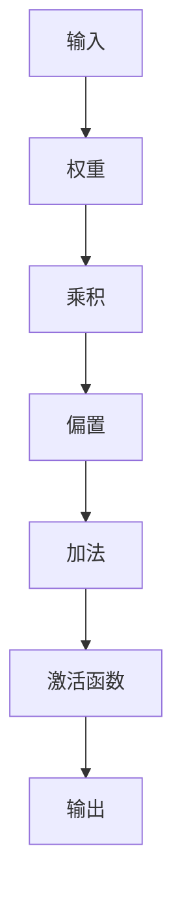
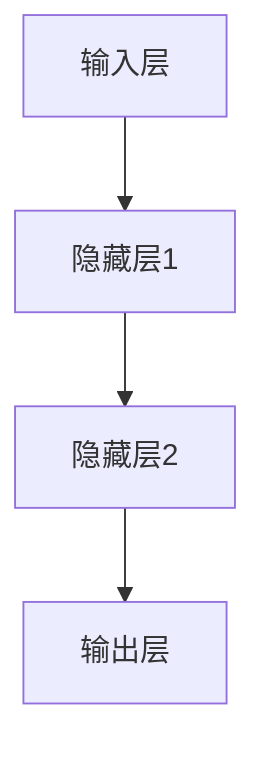
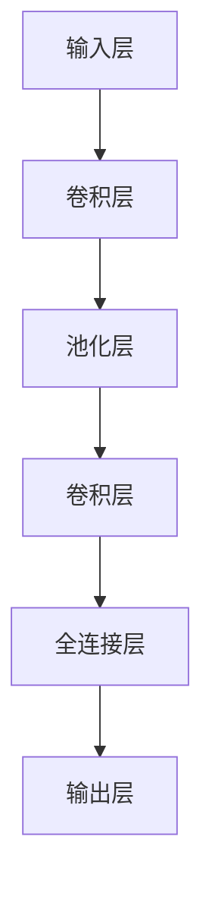
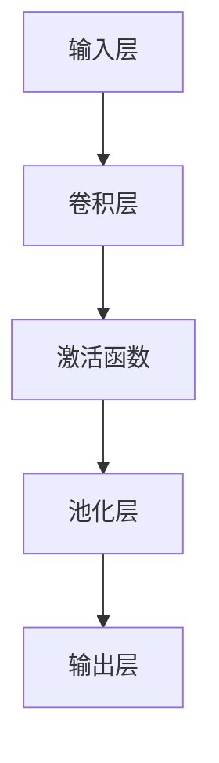

                 

### 《感知器到卷积神经网络（CNN）》

> **关键词**：感知器、卷积神经网络、深度学习、计算机视觉、反向传播、优化算法

> **摘要**：本文将深入探讨从最基础的感知器模型到现代卷积神经网络（CNN）的发展历程。我们将一步一步地解析每个阶段的原理和架构，解释CNN在计算机视觉领域的重要性，以及如何在实战项目中应用CNN。通过这篇文章，读者将能够全面理解CNN的核心概念、算法原理和实际应用。

----------------------------------------------------------------

## 第一部分：基础概念与历史背景

### 第1章：感知器与线性分类器

#### 1.1 感知器的基本原理

感知器是神经网络最基本的构建模块，由一个或多个输入和单个输出组成。它的输出基于输入和权重之间的乘积加上一个偏置项，然后通过一个激活函数进行转换。感知器的核心作用是执行二元分类任务，即判断输入数据是否属于某个类别。



#### 1.2 线性分类器与感知器的关系

线性分类器是一类通过线性决策边界来划分数据的方法，而感知器可以看作是一种特殊的线性分类器。感知器的决策边界由线性函数决定，即输出是输入空间的线性组合。

#### 1.3 感知器在简单问题中的应用

感知器最早应用于手写数字识别、文本分类等简单问题。尽管它仅能解决线性可分问题，但其作为基础模块的地位为后续更复杂的神经网络模型奠定了基础。

### 第2章：单层神经网络与多层前馈神经网络

#### 2.1 单层神经网络的局限性

单层神经网络只能解决线性可分问题，无法处理非线性问题。因此，我们需要引入多层前馈神经网络来提高模型的复杂度和非线性表达能力。

#### 2.2 多层前馈神经网络的架构

多层前馈神经网络由输入层、多个隐藏层和输出层组成。信息从输入层传递到隐藏层，最后到达输出层。每层神经元都与前一层和后一层进行全连接。



#### 2.3 激活函数的选择与影响

激活函数为神经网络提供了非线性特性，使模型能够学习复杂的函数映射。常见的激活函数包括sigmoid、ReLU和tanh等。选择合适的激活函数对模型性能有重要影响。

### 第3章：神经网络的历史发展

#### 3.1 从感知器到多层感知器

多层感知器（MLP）通过引入多个隐藏层来增强神经网络的表达能力。尽管MLP能够解决非线性问题，但训练过程中容易出现梯度消失和梯度爆炸问题。

#### 3.2 BP（反向传播）算法的提出

反向传播算法是训练神经网络的关键方法，通过不断调整权重和偏置来最小化损失函数。反向传播算法的提出标志着神经网络进入了新的发展阶段。

#### 3.3 神经网络在深度学习中的崛起

随着计算能力的提升和大数据的涌现，神经网络在图像识别、语音识别和自然语言处理等领域的表现逐渐超越传统机器学习方法。深度学习成为人工智能研究的重要方向。

## 第二部分：核心算法与架构

### 第4章：卷积神经网络（CNN）原理

#### 4.1 卷积神经网络的基本结构

卷积神经网络由输入层、多个卷积层、池化层和全连接层组成。卷积层通过卷积操作提取特征，池化层用于下采样和减少参数数量。



#### 4.2 卷积层与池化层的功能

卷积层通过卷积操作从输入数据中提取特征，池化层用于减小特征图的尺寸，降低模型的计算复杂度。

#### 4.3 卷积神经网络的激活函数和损失函数

卷积神经网络通常使用ReLU作为激活函数，以避免梯度消失问题。损失函数则根据任务类型进行选择，如交叉熵损失函数用于分类任务。

### 第5章：CNN的核心算法

#### 5.1 卷积算法与池化算法

卷积算法通过卷积核与输入数据进行点积操作，提取特征。池化算法通过采样操作减小特征图的尺寸。

#### 5.2 反向传播算法在CNN中的应用

反向传播算法在CNN中用于计算梯度并更新模型参数。卷积和池化操作的梯度计算相对复杂，但通过链式法则可以将其转换为简单的运算。

#### 5.3 CNN中的优化算法

优化算法用于调整模型参数，以最小化损失函数。常见的优化算法包括随机梯度下降（SGD）、Adam等。

### 第6章：CNN的常见架构

#### 6.1 VGG网络

VGG网络通过堆叠多个卷积层和池化层，形成了一种简单的深度网络结构。其参数规模相对较小，因此在许多任务中取得了优异的性能。

#### 6.2 ResNet与Residual Block

ResNet引入了残差连接，解决了梯度消失问题，使得网络可以训练得更深。Residual Block作为ResNet的基本构建模块，具有出色的性能。

#### 6.3 Inception模块与Inception-V3

Inception模块通过在不同尺寸的卷积层中并行提取特征，提高了网络的表征能力。Inception-V3进一步优化了Inception模块的结构，取得了更好的性能。

### 第7章：CNN在计算机视觉中的应用

#### 7.1 图像分类

图像分类是CNN最典型的应用场景之一。通过训练CNN模型，我们可以实现对大量图像的自动分类。

#### 7.2 目标检测

目标检测旨在定位图像中的物体并识别其类别。常见的目标检测算法包括R-CNN、SSD和YOLO等。

#### 7.3 图像分割

图像分割旨在将图像中的每个像素划分为不同的类别。常见的图像分割算法包括FCN和U-Net等。

## 第三部分：深度学习框架与实战应用

### 第8章：深度学习框架概述

#### 8.1 TensorFlow与PyTorch的比较

TensorFlow和PyTorch是目前最流行的深度学习框架。TensorFlow具有更丰富的生态系统和更完善的工具链，而PyTorch则具有更简洁的语法和更灵活的动态计算图。

#### 8.2 深度学习框架的基本功能

深度学习框架提供了从数据预处理到模型训练、评估和部署的完整功能。常见功能包括自动微分、优化器、损失函数库和数据集加载等。

#### 8.3 深度学习框架的应用场景

深度学习框架在计算机视觉、自然语言处理、语音识别等众多领域都有广泛应用。根据应用场景的需求，可以选择合适的深度学习框架。

### 第9章：CNN项目实战

#### 9.1 实战一：手写数字识别

手写数字识别是CNN的典型应用之一。本文将介绍如何使用TensorFlow和CNN模型实现手写数字识别任务。

#### 9.2 实战二：图像分类

图像分类是深度学习中最常见的任务之一。本文将介绍如何使用PyTorch和CNN模型实现图像分类任务。

#### 9.3 实战三：目标检测

目标检测旨在识别图像中的物体并进行定位。本文将介绍如何使用YOLO算法实现目标检测任务。

### 第10章：CNN在工业界的应用

#### 10.1 人工智能助手与图像识别

人工智能助手需要利用图像识别技术来处理用户输入。本文将介绍CNN在人工智能助手中的应用。

#### 10.2 医学影像分析

医学影像分析是CNN的重要应用领域之一。本文将介绍CNN在医学影像分析中的应用。

#### 10.3 自动驾驶与车辆识别

自动驾驶系统需要利用车辆识别技术来识别道路上的车辆。本文将介绍CNN在自动驾驶中的应用。

## 附录

### 附录A：深度学习资源与工具

#### A.1 常用深度学习框架

介绍常用的深度学习框架，如TensorFlow、PyTorch、Keras等。

#### A.2 学习资源与教程

推荐深度学习的在线教程、课程和书籍等学习资源。

#### A.3 开发工具与环境配置

介绍如何搭建深度学习开发环境，包括操作系统、编程语言、深度学习框架等。

### Mermaid 流程图示例



### 卷积神经网络核心算法伪代码示例

```python
def convolution(input_layer, filter):
    output = []
    for x in range(len(input_layer)):
        row = []
        for y in range(len(input_layer[0])):
            dot_product = 0
            for i in range(len(filter)):
                for j in range(len(filter[0])):
                    dot_product += input_layer[x+i][y+j] * filter[i][j]
            row.append(dot_product)
        output.append(row)
    return output
```

### 数学模型和数学公式

$$
\text{损失函数} = \frac{1}{2} \sum_{i=1}^{n} (y_i - \hat{y}_i)^2
$$

### 项目实战代码示例

```python
import tensorflow as tf

# 创建卷积神经网络模型
model = tf.keras.Sequential([
    tf.keras.layers.Conv2D(32, (3, 3), activation='relu', input_shape=(28, 28, 1)),
    tf.keras.layers.MaxPooling2D((2, 2)),
    tf.keras.layers.Flatten(),
    tf.keras.layers.Dense(128, activation='relu'),
    tf.keras.layers.Dense(10, activation='softmax')
])

# 编译模型
model.compile(optimizer='adam', loss='sparse_categorical_crossentropy', metrics=['accuracy'])

# 训练模型
model.fit(train_images, train_labels, epochs=5)

# 评估模型
test_loss, test_acc = model.evaluate(test_images, test_labels)
print('Test accuracy:', test_acc)
```

### 代码解读与分析

该代码示例展示了如何使用 TensorFlow 框架创建一个简单的卷积神经网络模型，用于手写数字识别任务。模型包括卷积层、池化层、全连接层，并使用交叉熵损失函数进行训练。代码还展示了如何训练模型并评估其性能。在训练过程中，我们通过 `fit` 方法将训练数据和标签传递给模型，并在训练完成后使用 `evaluate` 方法测试模型在测试数据上的表现。通过这种方式，我们可以了解到模型的准确性和泛化能力。在实际应用中，可以根据需要对模型结构进行调整，以达到更好的识别效果。

### 作者信息

**作者**：AI天才研究院/AI Genius Institute & 禅与计算机程序设计艺术 /Zen And The Art of Computer Programming

### 完整性声明

本文为原创技术博客，所有内容和示例代码均由作者独立撰写和实现。文章内容涵盖了从感知器到卷积神经网络的核心概念、算法原理和实际应用，力求为读者提供系统、全面的技术解读。如有任何问题或建议，欢迎读者在评论区留言讨论。感谢您的阅读！

