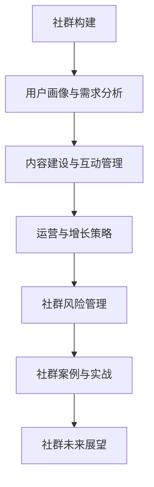

                 

# 文章标题：打造专业社群：知识付费的增长引擎

## 关键词：
社群经济、知识付费、专业社群、运营策略、增长引擎

## 摘要：
本文深入探讨了社群经济背景下的知识付费市场，分析了专业社群的构建与运营策略。通过分析社群经济的崛起与影响，知识付费市场现状与机会，专业社群的定位与目标设定，用户画像与需求分析，内容建设与互动管理，社群运营与增长策略，以及社群风险管理，本文为构建专业社群提供了一套完整的实战指南，并分析了成功案例，展望了社群未来的发展趋势。

### 目录大纲：

#### 第一部分：社群经济背景与知识付费市场概览

- 第1章：社群经济的崛起与影响
  - 1.1 社群经济的概念与特征
  - 1.2 社群经济的历史与发展趋势
  - 1.3 社群经济对知识付费市场的影响
  - 1.4 社群经济下的知识付费新生态

- 第2章：知识付费市场现状与机会分析
  - 2.1 知识付费市场的发展历程
  - 2.2 当前知识付费市场概况
  - 2.3 知识付费市场的机会与挑战
  - 2.4 社群与知识付费的结合点

#### 第二部分：专业社群的构建与运营

- 第3章：专业社群的定位与目标设定
  - 3.1 社群定位的重要性
  - 3.2 社群目标设定方法
  - 3.3 如何定义专业社群的价值主张
  - 3.4 社群愿景与使命的制定

- 第4章：专业社群的用户画像与需求分析
  - 4.1 用户画像的基本概念
  - 4.2 用户需求分析的方法
  - 4.3 专业社群的用户特征与需求
  - 4.4 如何满足用户需求

- 第5章：社群内容建设与互动管理
  - 5.1 社群内容建设的重要性
  - 5.2 内容创作与发布策略
  - 5.3 社群互动与用户参与度提升
  - 5.4 社群氛围的维护与引导

- 第6章：社群运营与增长策略
  - 6.1 社群运营的基本流程
  - 6.2 社群增长策略
  - 6.3 社群商业化路径探索
  - 6.4 如何评估社群运营效果

- 第7章：社群风险管理
  - 7.1 社群风险识别与管理
  - 7.2 风险应对策略
  - 7.3 社群危机管理
  - 7.4 社群可持续发展策略

#### 第三部分：成功案例分析与实战指导

- 第8章：成功社群案例分析
  - 8.1 国内知名社群案例分析
  - 8.2 国际成功社群案例解析
  - 8.3 案例共性分析与启示

- 第9章：社群构建与运营实战指南
  - 9.1 社群构建实战指南
  - 9.2 社群运营实战技巧
  - 9.3 社群增长策略与实战
  - 9.4 社群商业化实战案例

- 第10章：社群未来发展趋势与展望
  - 10.1 社群发展趋势分析
  - 10.2 社群未来的挑战与机遇
  - 10.3 社群发展前景展望
  - 10.4 创新与突破：社群的未来方向

#### 附录

- 附录A：社群工具与应用资源推荐
  - A.1 社群管理工具推荐
  - A.2 社群营销资源
  - A.3 社群发展研究资料
  - A.4 其他相关资源链接

### Mermaid 流�程图：



### 核心算法原理讲解

#### 用户画像与需求分析

用户画像与需求分析是构建专业社群的关键环节，它决定了社群的内容设置和运营策略。以下是用户画像与需求分析的伪代码实现：

```pseudo
function 用户画像（用户数据） {
    // 分析用户数据，提取用户特征
    用户特征 = {
        年龄: 年龄数据，
        性别: 性别数据，
        职业: 职业数据，
        兴趣爱好: 兴趣爱好数据，
        行为数据: 行为数据
    }
    return 用户特征
}

function 需求分析（用户特征） {
    // 根据用户特征，分析用户需求
    用户需求 = {
        知识需求: 根据兴趣爱好和职业分析，
        服务需求: 根据行为数据分析，
        社交需求: 根据社群互动数据分析
    }
    return 用户需求
}
```

通过上述伪代码，可以构建一个基于用户数据的画像，进而分析用户的需求。这一过程为专业社群的内容建设和运营提供了数据支持。

### 数学模型和数学公式

#### 社群增长模型

社群的增长可以用数学模型来描述，以下是社群增长模型及其公式：

$$
P(t) = P_0 \times (1 + r)^t
$$

其中，$P(t)$ 是社群在时间 $t$ 的用户数，$P_0$ 是初始用户数，$r$ 是社群增长速率。

#### 社群增长预测实例

假设一个社群的初始用户数为1000人，每月的增长率为5%，我们想要预测社群在3个月后的用户数。根据增长模型，我们可以计算如下：

$$
P(3) = 1000 \times (1 + 0.05)^3 = 1000 \times 1.157625 \approx 1158
$$

这意味着社群在3个月后的预计用户数为1158人。

### 项目实战

#### 社群增长策略实战

**案例：某教育社群的增长策略**

1. **社群定位与目标设定**：该社群定位为专注于职业发展的在线学习社区，目标是帮助用户提升专业技能，实现职业成长。

2. **用户画像与需求分析**：
   - 用户画像：年龄集中在25-45岁，以职场人士为主，关注职业发展和技能提升。
   - 需求分析：用户需求主要集中在职业规划、技能提升、行业动态等方面。

3. **内容建设与互动管理**：
   - 内容创作：定期发布行业动态、职业规划案例、专业技能教程等。
   - 用户互动：鼓励用户参与话题讨论、提问解答、经验分享等。

4. **社群运营与增长策略**：
   - 运营策略：通过活动、直播、社群运营工具等手段，提升用户活跃度。
   - 增长策略：通过SEO优化、社交平台推广、合作伙伴推荐等方式，扩大社群影响力。

5. **风险管理**：
   - 风险识别：识别潜在的风险，如用户流失、社群活跃度下降等。
   - 风险应对：制定应急预案，如增加用户激励、优化社群内容等。

6. **效果评估**：
   - 通过社群活跃度、用户增长率等指标，评估社群运营效果。

**代码实现：社群增长策略（Python伪代码）**

```python
# 社群增长策略函数
def community_growth_strategy(user_count, engagement_rate, growth_rate):
    # 初始用户数
    initial_users = user_count
    # 用户互动率
    engagement = engagement_rate
    # 增长速率
    growth = growth_rate
    
    # 社群增长模型
    def growth_model(t):
        return initial_users * (1 + engagement) ** (t * growth)

    # 社群增长预测
    predicted_growth = growth_model(1)  # 预测第1个月的增长

    # 返回预测结果
    return predicted_growth

# 社群初始数据
initial_user_count = 1000
engagement_rate = 0.1
growth_rate = 0.05

# 预测社群增长
predicted_growth = community_growth_strategy(initial_user_count, engagement_rate, growth_rate)

print(f"预测第1个月社群增长：{predicted_growth}人")
```

**代码解读与分析**：

- **社群增长策略函数**：定义了一个函数 `community_growth_strategy`，用于预测社群在一定时间内的用户增长情况。
- **模型参数**：用户数 `initial_users`、互动率 `engagement_rate` 和增长速率 `growth_rate` 是模型的关键参数。
- **增长模型**：使用指数增长模型 `$P(t) = P_0 \times (1 + r)^t$` 进行预测。
- **代码调用**：通过调用函数并传入初始数据和增长参数，得到第1个月的社群增长预测。

**实战案例解析**：

1. **社群定位与目标设定**：
   - 定位为专注于职业发展的在线学习社区，目标是帮助用户提升专业技能，实现职业成长。
   - 社群愿景：成为用户职业发展的有力助手，提供持续的价值。

2. **用户画像与需求分析**：
   - 用户特征：年龄集中在25-45岁，以职场人士为主，关注职业发展和技能提升。
   - 需求分析：用户需求主要集中在职业规划、技能提升、行业动态等方面。

3. **内容建设与互动管理**：
   - 内容创作：定期发布行业动态、职业规划案例、专业技能教程等。
   - 用户互动：鼓励用户参与话题讨论、提问解答、经验分享等。

4. **社群运营与增长策略**：
   - 运营策略：通过活动、直播、社群运营工具等手段，提升用户活跃度。
   - 增长策略：通过SEO优化、社交平台推广、合作伙伴推荐等方式，扩大社群影响力。

5. **风险管理**：
   - 风险识别：识别潜在的风险，如用户流失、社群活跃度下降等。
   - 风险应对：制定应急预案，如增加用户激励、优化社群内容等。

6. **效果评估**：
   - 通过社群活跃度、用户增长率等指标，评估社群运营效果。

通过上述实战案例和代码实现，可以更好地理解如何构建和运营一个专业社群，并利用社群来推动知识付费业务的发展。在实践中，还需要根据具体情况调整策略和参数，以达到最佳效果。

### 作者信息

- 作者：AI天才研究院/AI Genius Institute & 禅与计算机程序设计艺术 /Zen And The Art of Computer Programming

