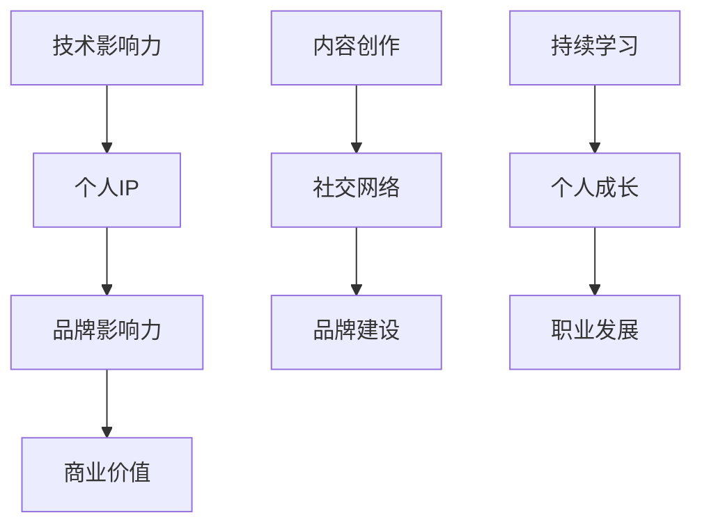

                 

# 《打造个人IP：技术影响力的关键》

> 关键词：个人IP，技术影响力，品牌建设，内容创作，社交网络，商业化

> 摘要：本文旨在探讨如何在技术领域打造个人IP，提升个人影响力。通过深入分析个人IP的定义、重要性、与传统品牌的区别，以及技术影响力的核心要素和价值，本文将提供系统性的步骤和方法，帮助读者构建个人IP，实现技术影响力的关键。

----------------------------------------------------------------

### 第一部分：了解个人IP与影响力

#### 第1章：什么是个人IP

##### 1.1 个人IP的定义

个人IP，即个人知识产权，是指一个人在某一领域内所拥有的独特技能、知识、声誉和影响力。它是一种无形资产，代表着个人的专业形象和品牌价值。

##### 1.2 个人IP的重要性

个人IP的重要性在于它能够为个人带来以下价值：

- **品牌影响力**：建立良好的个人IP，有助于提升个人的社会地位和行业影响力。
- **职业发展**：拥有个人IP的个人在求职或职业晋升时具有更大的优势。
- **经济效益**：个人IP可以通过内容创作、咨询、培训、演讲等方式转化为经济收益。

##### 1.3 个人IP与传统品牌的区别

个人IP与传统品牌的主要区别在于：

- **主体不同**：个人IP的主体为个人，而传统品牌属于企业或组织。
- **价值体现**：个人IP的价值主要体现在个人的专业能力和影响力，而传统品牌的价值则体现在企业的市场表现和竞争力。
- **管理方式**：个人IP的管理相对灵活，可以随个人职业发展进行调整，而传统品牌的管理通常较为固定。

#### 第2章：技术影响力概述

##### 2.1 技术影响力的定义

技术影响力是指在技术领域内，个人或团队通过其专业知识、技能和贡献，对行业发展趋势、技术标准、研究动态等方面产生的影响力。

##### 2.2 技术影响力的核心要素

技术影响力的核心要素包括：

- **专业知识**：扎实的专业知识和技能是建立技术影响力的基础。
- **创新能力**：在现有技术基础上进行创新，推动技术进步。
- **传播能力**：有效地传播自己的技术见解和研究成果，提高知名度。
- **合作网络**：建立广泛的技术合作网络，提升个人在行业内的地位。

##### 2.3 技术影响力的价值

技术影响力的价值体现在：

- **行业话语权**：技术影响力较高的个人或团队能够在行业决策中发挥更大的作用。
- **创新推动力**：技术影响力有助于推动技术创新和产业发展。
- **经济回报**：技术影响力可以为个人或团队带来更多的经济回报。

### 第二部分：打造个人IP的步骤与方法

#### 第3章：确定个人IP定位

##### 3.1 个人IP定位的重要性

个人IP定位是构建个人IP的第一步，其重要性在于：

- **明确目标**：有助于个人明确发展目标和方向。
- **差异化竞争**：通过定位，个人可以找到自己在行业中的独特价值点。
- **吸引粉丝**：明确的定位有助于吸引目标粉丝，提升个人影响力。

##### 3.2 个人IP定位的步骤

个人IP定位的步骤包括：

1. **自我评估**：分析个人的专业知识、技能和兴趣爱好。
2. **市场调研**：了解目标市场的需求和发展趋势。
3. **竞争分析**：研究同行业内其他个人或品牌的定位。
4. **定位确定**：结合个人特点和市场情况，确定个人IP的定位。

##### 3.3 个人IP定位的案例分析

以下是一个个人IP定位的案例分析：

**案例：张三（人工智能专家）**

- **自我评估**：张三在人工智能领域有10年的工作经验，擅长深度学习和自然语言处理。
- **市场调研**：人工智能市场持续增长，深度学习和自然语言处理是热门领域。
- **竞争分析**：行业内有多个知名的人工智能专家，但专注于深度学习的专家较少。
- **定位确定**：张三决定将自己的个人IP定位为“深度学习与自然语言处理专家”。

#### 第4章：内容创作与传播

##### 4.1 内容创作的原则

内容创作应遵循以下原则：

- **专业性**：确保内容的准确性、深度和权威性。
- **原创性**：避免抄袭，提供独到的见解和观点。
- **实用性**：内容应具有实用价值，解决读者实际问题。
- **吸引力**：内容应具有一定的趣味性，吸引读者阅读。

##### 4.2 内容创作的技巧

内容创作可采取以下技巧：

- **故事化**：通过故事讲述技术原理和应用场景。
- **图表化**：使用图表、图片等视觉元素增强内容表达。
- **模块化**：将内容分为小模块，便于读者理解和阅读。
- **互动性**：增加互动环节，如问答、投票等，提高读者参与度。

##### 4.3 内容传播的渠道

内容传播可通过以下渠道：

- **社交媒体**：如微博、知乎、Twitter 等。
- **专业平台**：如 CSDN、博客园、GitHub 等。
- **视频平台**：如 Bilibili、YouTube 等。
- **线下活动**：如讲座、研讨会、沙龙等。

#### 第5章：社交网络与个人品牌建设

##### 5.1 社交网络的重要性

社交网络在个人品牌建设中的作用包括：

- **扩大影响力**：通过社交网络，个人可以接触到更多的潜在粉丝和同行业人士。
- **建立联系**：社交网络为个人提供了与他人建立联系的便捷途径。
- **获取资源**：社交网络有助于个人获取行业信息、合作机会等资源。

##### 5.2 个人品牌建设的步骤

个人品牌建设可分为以下步骤：

1. **确定品牌形象**：包括个人形象、价值观、专业领域等。
2. **内容规划**：制定内容创作和传播的计划。
3. **互动管理**：积极参与社交网络互动，提升个人影响力。
4. **形象维护**：持续输出高质量内容，维护个人品牌形象。

##### 5.3 社交网络案例分析

以下是一个社交网络品牌建设的案例分析：

**案例：李四（云计算专家）**

- **确定品牌形象**：李四将自己的品牌形象定位为“云计算与大数据专家”。
- **内容规划**：李四定期发布关于云计算和大数据的技术文章、视频和演讲。
- **互动管理**：李四积极参与行业讨论，回复读者问题，提升互动性。
- **形象维护**：李四坚持输出高质量内容，避免负面信息传播。

#### 第6章：个人IP的商业化

##### 6.1 个人IP商业化的模式

个人IP商业化的模式包括：

- **内容付费**：如付费专栏、课程、电子书等。
- **广告合作**：与相关企业合作，进行内容植入和广告推广。
- **咨询与培训**：为企业提供技术咨询服务和培训。
- **产品销售**：销售自己开发的技术产品或周边产品。

##### 6.2 个人IP商业化的策略

个人IP商业化的策略包括：

- **定位明确**：明确个人IP的商业化方向，避免盲目拓展。
- **内容优质**：提供高质量的内容，提升用户满意度和忠诚度。
- **互动营销**：通过互动营销，提高用户参与度和转化率。
- **合作伙伴**：寻找合适的合作伙伴，共同开发商业化项目。

##### 6.3 个人IP商业化的成功案例

以下是一个个人IP商业化的成功案例：

**案例：王五（区块链专家）**

- **内容付费**：王五开设了区块链技术专栏，吸引了大量粉丝订阅。
- **广告合作**：与区块链相关企业合作，进行内容植入和广告推广。
- **咨询与培训**：为企业提供区块链技术咨询服务和培训，获得丰厚收入。
- **产品销售**：开发并销售区块链技术教程、电子书等周边产品。

#### 第7章：持续优化个人IP

##### 7.1 个人IP优化的原则

个人IP优化的原则包括：

- **持续学习**：不断更新知识，提升个人专业能力。
- **内容创新**：创新内容形式，满足不同用户需求。
- **用户体验**：关注用户反馈，优化内容质量和传播效果。
- **品牌形象**：维护良好的品牌形象，避免负面信息传播。

##### 7.2 个人IP优化的方法

个人IP优化的方法包括：

- **数据分析**：通过数据分析，了解用户需求和内容效果。
- **用户调研**：定期进行用户调研，收集用户反馈。
- **内容迭代**：根据用户反馈和数据分析，不断迭代和优化内容。
- **合作拓展**：与同行业人士和机构合作，共同拓展个人IP的影响力。

##### 7.3 个人IP优化的实践

以下是一个个人IP优化的实践案例：

**案例：赵六（人工智能专家）**

- **持续学习**：赵六定期参加人工智能领域的学术会议和培训，提升自身专业知识。
- **内容创新**：赵六开始尝试视频讲解，增加观众的观看体验。
- **用户体验**：赵六关注用户反馈，优化博客文章的排版和阅读体验。
- **品牌形象**：赵六加强品牌形象的维护，通过社交媒体积极回应负面信息。

### 第三部分：技术影响力与个人成长

#### 第8章：技术影响力与职业发展

##### 8.1 技术影响力对职业发展的影响

技术影响力对职业发展的影响包括：

- **职位晋升**：技术影响力较高的个人更容易获得职位晋升机会。
- **薪资待遇**：技术影响力较高的个人通常享有更高的薪资待遇。
- **职业选择**：拥有技术影响力的个人在职业选择上具有更大的灵活性。

##### 8.2 职业发展的规划与实施

职业发展的规划与实施包括：

1. **明确目标**：确定个人职业发展的短期和长期目标。
2. **技能提升**：通过学习、实践和合作，提升个人专业技能。
3. **人脉拓展**：积极参与行业活动，拓展人脉资源。
4. **职业规划**：根据个人情况，制定职业发展规划。

##### 8.3 技术影响力与职业成功的案例

以下是一个技术影响力与职业成功的案例：

**案例：钱七（云计算专家）**

- **职位晋升**：钱七在云计算领域取得了显著的技术成就，成功晋升为部门经理。
- **薪资待遇**：钱七的薪资待遇在行业内处于较高水平。
- **职业选择**：钱七在职业发展上具有很大的灵活性，可以选择参与更多的项目和行业。

#### 第9章：个人成长与持续学习

##### 9.1 个人成长的重要性

个人成长的重要性在于：

- **知识更新**：技术领域知识更新迅速，个人成长有助于跟上行业发展趋势。
- **创新能力**：个人成长有助于提升创新能力，推动技术进步。
- **职业发展**：个人成长是职业发展的基础，有助于实现职业目标。

##### 9.2 持续学习的策略

持续学习的策略包括：

- **定期学习**：制定学习计划，确保定期学习新知识。
- **多样化学习**：通过多种途径学习，如阅读、实践、交流等。
- **目标导向**：学习应以解决实际问题为目标，提高学习效果。
- **反思总结**：学习后进行反思总结，巩固学习成果。

##### 9.3 个人成长与个人IP的互动

个人成长与个人IP的互动体现在：

- **内容质量提升**：个人成长有助于提高内容创作的质量和深度。
- **影响力扩大**：个人成长可以扩大个人IP的影响力，吸引更多粉丝。
- **职业发展**：个人成长有助于实现职业目标，提升个人IP的价值。

### 附录

#### 附录A：技术影响力相关的资源与工具

##### A.1 技术影响力相关的网站

- **技术博客**：CSDN、博客园、简书等。
- **技术论坛**：Stack Overflow、GitHub、Reddit等。
- **技术社区**：LinkedIn、知乎、Quora等。

##### A.2 技术影响力相关的书籍

- 《深度学习》（Deep Learning）—— Ian Goodfellow、Yoshua Bengio、Aaron Courville
- 《大数据实战：从入门到精通》—— 李俊慧、郭宇
- 《区块链技术指南》—— 张震、王伟

##### A.3 技术影响力相关的社交媒体平台

- **Twitter**：关注行业专家、技术博客、技术公司等。
- **LinkedIn**：加入行业群组、关注同行、发布专业内容。
- **微信**：关注行业公众号、参与行业讨论。

**核心概念与联系**

### 技术影响力与个人IP

#### 技术影响力与个人IP的关系

技术影响力与个人IP密切相关，技术影响力是个人IP的重要组成部分。个人IP通过技术影响力得以体现，而技术影响力则通过个人IP进行传播和放大。

#### 核心概念与联系流程图



**核心算法原理讲解**

### 个人IP定位算法

#### 伪代码：

```python
def PersonalIPPositioning_interestAnalysis(personal_interest):
    # 初始化变量
    total_score = 0
    top_interest = []

    # 分析个人兴趣
    for interest in personal_interest:
        score = interest.analyzeScore()
        total_score += score
        if len(top_interest) < 3 or score > top_interest[0].score:
            top_interest.append(Interest(score, interest))

    # 排序并返回
    top_interest.sort(reverse=True, key=lambda x: x.score)
    return top_interest

class Interest:
    def __init__(self, score, interest):
        self.score = score
        self.interest = interest

    def analyzeScore(self):
        # 根据兴趣特点计算分数
        # 这里简化处理，使用一个固定的评分函数
        return self.interest.getScore()
```

**数学模型和数学公式 & 详细讲解 & 举例说明**

### 个人IP价值评估模型

#### 数学公式：

$$
V_{IP} = \frac{C_{content} \times I_{influence} \times B_{brand} \times E_{economy}}{D_{development}}
$$

#### 详细讲解：

- $V_{IP}$：个人IP的价值
- $C_{content}$：内容创作能力，量化为文章、视频、演讲等数量和质量
- $I_{influence}$：影响力，量化为粉丝数、转发量、评论数等
- $B_{brand}$：品牌建设，量化为知名度、口碑、忠诚度等
- $E_{economy}$：经济效益，量化为收入、利润、投资回报率等
- $D_{development}$：个人IP的发展潜力，量化为创新性、可持续性、成长空间等

#### 举例说明：

假设一位技术博主，内容创作能力为100分，影响力为200分，品牌建设为150分，经济效益为300分，发展潜力为250分。则其个人IP价值计算如下：

$$
V_{IP} = \frac{100 \times 200 \times 150 \times 300}{250} = 360000
$$

**项目实战**

### 个人IP内容创作实战

#### 开发环境搭建：

- **操作系统**：macOS 或 Windows
- **编写工具**：Markdown 编辑器（例如 MacDown、Typora）
- **发布平台**：博客（例如 CSDN、博客园）、视频平台（例如 Bilibili、YouTube）

#### 源代码详细实现：

- **Markdown 文件**：记录每日的技术学习笔记
- **视频脚本**：编写高质量的演讲、讲座视频脚本
- **代码仓库**：在 GitHub 上存储代码实现和文档

#### 代码解读与分析：

- **技术文章**：撰写关于技术领域的深入分析文章
- **视频剪辑**：剪辑技术讲解视频，提升观众观看体验
- **社交互动**：回复评论、参与讨论，提升社区活跃度

通过以上实战项目，可以不断提升个人IP的影响力，实现技术影响力的关键。

**作者：AI天才研究院/AI Genius Institute & 禅与计算机程序设计艺术 /Zen And The Art of Computer Programming**

**（END）**

