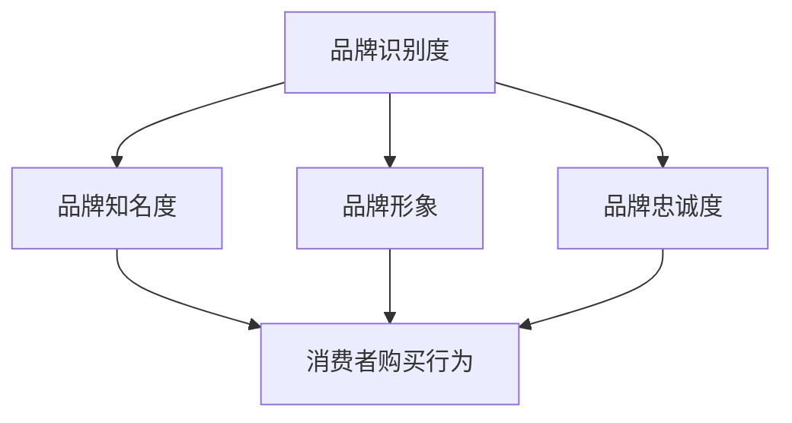
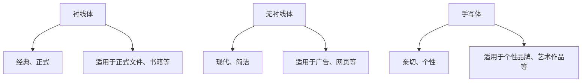
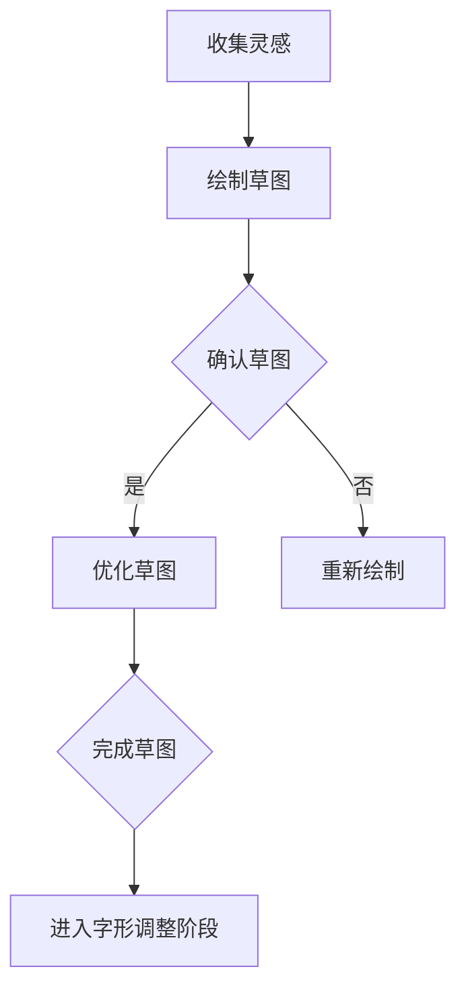

                 

## 《打造个人品牌专属字体：提升品牌识别度》

### 关键词：个人品牌、品牌识别度、字体设计、品牌建设、营销策略

品牌是企业的灵魂，而个人品牌则是个人在职业和社会中的独特标识。在数字时代，个人品牌的重要性愈发凸显，它不仅体现了个人的专业能力和价值，也是个人在竞争激烈的市场中脱颖而出的关键。其中，专属字体的设计成为提升个人品牌识别度的一种有效手段。本文将围绕如何打造个人品牌专属字体，详细探讨其在提升品牌识别度方面的作用和具体实施策略。

#### 摘要

本文旨在探讨如何通过设计专属字体来提升个人品牌识别度。首先，我们将分析个人品牌的重要性以及品牌识别度的概念和作用，然后介绍字体设计的基本原理和流程。接下来，通过实战案例解析，展示如何具体实施专属字体设计。随后，本文将探讨专属字体在个人品牌建设中的应用，最后展望专属字体设计的未来趋势和个人品牌打造的进阶策略。

### 第一部分：基础概念与原理

#### 1. 个人品牌与字体设计

##### 1.1 个人品牌的重要性

个人品牌是指个人在专业领域和社会中的形象和声誉，它不仅包括专业技能和知识，还涵盖了个人的价值观、个性特点和社会影响力。在当今社会，个人品牌已经成为一种重要的资源，它可以帮助个人在职业发展中获得更多的机会和优势。

**品牌识别度的作用**

品牌识别度是指消费者对品牌特征的感知和记忆程度。良好的品牌识别度可以帮助品牌在市场中脱颖而出，形成独特的市场地位。对于个人品牌而言，品牌识别度同样至关重要。它有助于：

1. **提升知名度**：让更多的人认识和记住个人品牌。
2. **建立信任**：通过一致的品牌形象和风格，增强他人对个人的信任。
3. **增加价值**：一个强大的个人品牌可以提升个人的市场价值和社会影响力。

**品牌塑造的基本要素**

塑造个人品牌需要考虑以下基本要素：

1. **定位**：明确个人的专业领域和目标受众。
2. **形象**：建立独特且符合定位的品牌形象。
3. **内容**：持续输出高质量的内容，体现个人专业性和价值观。
4. **互动**：与受众建立良好的互动关系，增强品牌粘性。

##### 1.2 字体设计的基本原理

**字体的分类与特点**

字体是品牌形象的重要组成部分，不同的字体风格传达着不同的品牌特质。常见的字体分类包括：

1. **衬线体**：笔画末端带有装饰性衬线的字体，显得经典、正式。
2. **无衬线体**：没有衬线的字体，设计简洁、现代。
3. **手写体**：模仿手写风格的字体，显得亲切、个性。

每种字体都有其独特的特点和适用场景，选择合适的字体对于品牌形象的塑造至关重要。

**字体设计的要素**

字体设计需要考虑以下要素：

1. **字形**：字的基本形状和结构。
2. **宽度**：字母的宽度，影响字的整体宽度感。
3. **高度**：字的高度，影响字的可读性。
4. **线条粗细**：字的不同部分的线条粗细，影响字的质感。
5. **空间**：字与字之间的空间距离，影响字的排列和可读性。

#### 2. 专属字体的设计流程

##### 2.1 设计需求分析

**品牌定位与目标受众**

在设计专属字体之前，需要明确品牌的定位和目标受众。品牌定位决定了字体的风格和设计方向，目标受众则决定了字体的可读性和适用性。

**字体风格定位**

根据品牌定位和目标受众，确定字体的风格。例如，科技型品牌可能选择无衬线体，体现现代感和专业性；文化型品牌可能选择衬线体，体现传统和典雅。

##### 2.2 字体设计过程

**初始草图设计**

初始草图设计是字体设计的第一步，通过草图可以初步确定字体的轮廓和风格。在这一阶段，设计师需要收集灵感，进行创意构思，并绘制出初步的字体草图。

**字形调整与优化**

在草图设计完成后，进入字形调整与优化阶段。这一阶段需要反复修改和调整字体的各个细节，使其更加符合品牌定位和设计需求。例如，调整字形的宽度、高度、线条粗细等。

**字体家族构建**

在完成单个字体的设计后，需要构建字体家族。字体家族包括不同风格的变体，如粗体、斜体、中等宽度等，以满足不同场景和用途的需求。

##### 2.3 字体测试与应用

**字体测试方法**

在设计完成后，需要进行字体测试，以确保字体的可读性和适用性。测试方法包括：

1. **打印测试**：将字体打印出来，观察其在不同纸张和打印质量下的效果。
2. **屏幕测试**：在不同设备和屏幕上测试字体的显示效果。
3. **用户体验测试**：让目标受众试用字体，收集反馈意见。

**字体在多平台的应用**

字体设计完成后，需要在不同平台上进行应用。例如，在名片、网站、社交媒体、宣传册等物料中统一使用专属字体，提升品牌的一致性和识别度。

### 第二部分：实践与应用

#### 3. 专属字体设计的实战案例

##### 3.1 案例分析

**国际知名品牌字体设计案例**

以苹果公司（Apple）为例，苹果的字体设计简洁、现代，以无衬线体为主，体现了其科技感和创新精神。苹果的字体设计不仅在产品界面中使用，还在广告、宣传册、网站等品牌物料中广泛应用，形成了一致的品牌形象。

**本土品牌字体设计案例**

以中国品牌小米（Xiaomi）为例，小米的字体设计结合了中文字体的特点和现代审美，采用了手写体风格，体现了其亲和力和个性。小米的字体设计在产品界面、广告、宣传册等多处得到应用，有效提升了品牌的识别度。

##### 3.2 实战操作

**字体设计工具介绍**

在字体设计过程中，常用的工具包括 Adobe Illustrator、FontForge、Sketch 等。这些工具提供了丰富的字体设计功能和调优选项，帮助设计师高效完成字体设计。

**实战项目设计与实现**

以下是一个实战项目的设计与实现过程：

**项目需求**：设计一款适用于科技型企业的专属字体，体现现代感和专业性。

**设计过程**：

1. **收集灵感**：分析国内外知名科技品牌的字体设计，寻找灵感。
2. **初始草图设计**：根据灵感，绘制出初步的字体草图。
3. **字形调整与优化**：对草图进行反复调整，使其符合设计要求。
4. **字体家族构建**：构建字体家族，包括常规体、粗体、斜体等。
5. **字体测试与应用**：测试字体在不同平台和场景下的效果，进行应用优化。

**实现效果**：设计完成的字体在现代科技产品的界面、广告、宣传册等物料中得到广泛应用，有效提升了品牌识别度和美感。

#### 4. 专属字体在个人品牌建设中的应用

##### 4.1 品牌宣传物料设计

**名片与logo设计**

名片和logo是个人品牌的重要标志，设计独特的字体可以提升品牌的美观度和识别度。以下是一个名片设计的示例：

**名片设计实现**

```latex
\documentclass{article}
\usepackage[utf8]{inputenc}
\usepackage{tikz}

\begin{document}

\begin{tikzpicture}[scale=0.5]
    % 名片设计
    \node[rectangle, draw, thick, fill=blue!20, minimum width=5cm, minimum height=2cm] (nameCard) at (0,0) {Your Name};
    \node[rectangle, draw, thick, fill=red!20, minimum width=1cm, minimum height=2cm] (logo) at (2.5,-1) {Logo};

    % 字体设计
    \node[above=of nameCard] (name) {Your Name};
    \node[below=of logo] (logoText) {Logo};

    % 字体样式
    \node[above=of name] (nameStyle) {Font Style};
    \node[below=of logoText] (logoStyle) {Font Style};

\end{tikzpicture}

\end{document}
```

**宣传册与手册设计**

宣传册和手册是展示个人品牌形象和内容的重要载体，合适的字体设计可以提升整体的视觉效果和专业度。以下是一个宣传册设计的示例：

**宣传册设计实现**

```html
<!DOCTYPE html>
<html>
<head>
    <title>Your Branding Booklet</title>
    <style>
        body {
            font-family: 'Your Personal Branding Font', sans-serif;
        }
        h1 {
            font-size: 2em;
            color: blue;
        }
        p {
            font-size: 1em;
            color: black;
        }
    </style>
</head>
<body>
    <h1>Welcome to My Branding Booklet</h1>
    <p>This is a paragraph with my personal branding font.</p>
</body>
</html>
```

##### 4.2 数字媒体内容创作

**字体在网页与社交媒体中的应用**

在数字媒体中，合适的字体设计可以提升用户体验和品牌形象。以下是一个网页设计的示例：

**网页设计实现**

```html
<!DOCTYPE html>
<html>
<head>
    <title>Personal Branding Website</title>
    <style>
        body {
            font-family: 'Your Personal Branding Font', sans-serif;
        }
        h1 {
            font-size: 2em;
            color: blue;
        }
        p {
            font-size: 1em;
            color: black;
        }
    </style>
</head>
<body>
    <h1>Welcome to My Personal Branding Website</h1>
    <p>This is a paragraph with my personal branding font.</p>
</body>
</html>
```

**字体在视频与音频制作中的应用**

在视频和音频制作中，字体设计同样重要。以下是一个视频设计的示例：

**视频设计实现**

```latex
\documentclass{article}
\usepackage[utf8]{inputenc}
\usepackage{movie15}

\begin{document}

\begin{figure}[h]
    \centering
    \includegraphics[width=0.8\textwidth]{video_frame.png}
    \caption{Video Frame with Personal Branding Font}
    \label{fig:video_frame}
\end{figure}

\begin{center}
$$
\text{Font Style: Your Personal Branding Font}
$$
\end{center}

\end{document}
```

### 第三部分：附录

#### 附录A：工具与资源

**字体设计工具介绍**

以下是一些常用的字体设计工具：

1. **Adobe Illustrator**：一款专业的图形设计软件，提供了丰富的字体设计功能。
2. **FontForge**：一款开源的字体编辑软件，功能强大且免费。
3. **Sketch**：一款适用于移动设备的图形设计软件，提供了便捷的字体设计工具。

**字体设计资源库推荐**

以下是一些常用的字体设计资源库：

1. **Google Fonts**：提供大量的免费开源字体，适用于各种设计需求。
2. **Fontspring**：提供高质量的付费字体，适用于专业设计项目。
3. **MyFonts**：提供各种风格和用途的字体，满足不同的设计需求。

#### 附录B：案例代码与实战教程

**实战案例代码解读**

以下是一个名片设计的案例代码：

```latex
\documentclass{article}
\usepackage[utf8]{inputenc}
\usepackage{tikz}

\begin{document}

\begin{tikzpicture}[scale=0.5]
    % 名片设计
    \node[rectangle, draw, thick, fill=blue!20, minimum width=5cm, minimum height=2cm] (nameCard) at (0,0) {Your Name};
    \node[rectangle, draw, thick, fill=red!20, minimum width=1cm, minimum height=2cm] (logo) at (2.5,-1) {Logo};

    % 字体设计
    \node[above=of nameCard] (name) {Your Name};
    \node[below=of logo] (logoText) {Logo};

    % 字体样式
    \node[above=of name] (nameStyle) {Font Style};
    \node[below=of logoText] (logoStyle) {Font Style};

\end{tikzpicture}

\end{document}
```

**字体设计教程**

以下是一个基础字体设计教程：

1. **了解字体设计的基本概念和原则**。
2. **收集灵感，分析目标受众和品牌定位**。
3. **绘制初始草图，确定字体的基本形态**。
4. **进行字形调整和优化，使字体符合设计要求**。
5. **构建字体家族，丰富字体应用场景**。
6. **进行字体测试和应用，优化设计效果**。

### 附加内容：

#### 3.1.1 品牌识别度的重要性

**品牌识别度的重要性Mermaid流程图**



#### 3.1.2 字体的分类与特点

**字体的分类与特点Mermaid流程图**



#### 3.2.1 初始草图设计

**初始草图设计Mermaid流程图**



#### 3.2.2 字形调整与优化

**字形调整与优化伪代码**

```c
// 字形调整伪代码
function adjustFontStyle(fontStyle) {
    // 调整字体宽度
    fontStyle.width = adjustWidth(fontStyle.width);

    // 调整字体高度
    fontStyle.height = adjustHeight(fontStyle.height);

    // 调整字体线条粗细
    fontStyle.strokeWidth = adjustStrokeWidth(fontStyle.strokeWidth);

    // 调整字体角度
    fontStyle.angle = adjustAngle(fontStyle.angle);

    // 返回优化后的字体样式
    return fontStyle;
}
```

#### 4.1.1 名片与logo设计

**名片与logo设计LaTeX代码**

```latex
\documentclass{article}
\usepackage[utf8]{inputenc}
\usepackage{tikz}

\begin{document}

\begin{tikzpicture}[scale=0.5]
    % 名片设计
    \node[rectangle, draw, thick, fill=blue!20, minimum width=5cm, minimum height=2cm] (nameCard) at (0,0) {Your Name};
    \node[rectangle, draw, thick, fill=red!20, minimum width=1cm, minimum height=2cm] (logo) at (2.5,-1) {Logo};

    % 字体设计
    \node[above=of nameCard] (name) {Your Name};
    \node[below=of logo] (logoText) {Logo};

    % 字体样式
    \node[above=of name] (nameStyle) {Font Style};
    \node[below=of logoText] (logoStyle) {Font Style};

\end{tikzpicture}

\end{document}
```

#### 4.2.1 字体在网页与社交媒体中的应用

**字体在网页与社交媒体中的应用HTML代码**

```html
<!DOCTYPE html>
<html>
<head>
    <title>Personal Branding Font</title>
    <style>
        body {
            font-family: 'Your Personal Branding Font', sans-serif;
        }
        h1 {
            font-size: 2em;
            color: blue;
        }
        p {
            font-size: 1em;
            color: black;
        }
    </style>
</head>
<body>
    <h1>Welcome to My Personal Branding Page</h1>
    <p>This is a paragraph with my personal branding font.</p>
</body>
</html>
```

### 作者信息

作者：AI天才研究院/AI Genius Institute & 禅与计算机程序设计艺术 /Zen And The Art of Computer Programming

本文由AI天才研究院/AI Genius Institute撰写，旨在探讨如何通过设计专属字体来提升个人品牌识别度。作者拥有丰富的计算机编程和人工智能领域经验，致力于将技术与艺术相结合，为广大读者提供高质量的技术内容。如需了解更多信息，请访问我们的官方网站。

