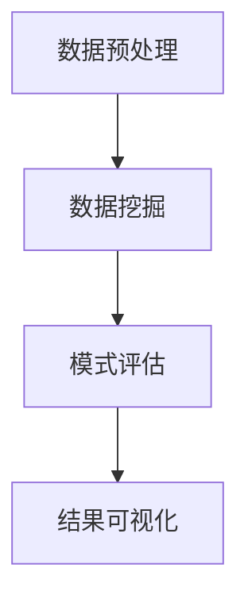
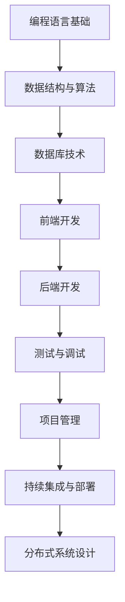

                 

### 文章标题

### 打造个人知识发现引擎：程序员的必备技能

#### 关键词：知识发现引擎、程序员技能、推荐算法、自然语言处理、信息检索、数学模型、项目实战

#### 摘要：

在信息技术飞速发展的时代，程序员不仅需要具备扎实的编程能力，还需要掌握前沿的知识发现技术，以应对复杂的应用场景。本文将深入探讨如何打造一个个人知识发现引擎，以提升程序员的技能。通过详细解析知识发现引擎的概念、技术原理、核心算法，以及数学模型，本文将帮助程序员构建一个高效的知识发现系统，并分享实际项目经验和案例分析，为技术发展提供新思路。

### 第一部分：核心概念与联系

#### 第1章：知识发现引擎概述

**1.1 知识发现引擎的定义与作用**

知识发现引擎（Knowledge Discovery Engine）是一种利用先进的数据挖掘技术和机器学习算法，从大量数据中提取有价值信息的智能系统。它的核心作用是自动化地发现数据中的模式、关联和趋势，从而为用户提供有价值的洞察和决策支持。

**1.2 知识发现引擎的技术原理**

知识发现引擎的工作原理主要包括以下四个步骤：

1. **数据预处理**：对原始数据进行清洗、转换和集成，使其符合分析要求。
2. **数据挖掘**：利用各种算法挖掘数据中的潜在模式和关联。
3. **模式评估**：对挖掘出的模式进行评估，筛选出具有实际价值的模式。
4. **结果可视化**：将挖掘结果以可视化的形式展示给用户，便于理解和应用。

**1.3 知识发现引擎的应用场景**

知识发现引擎广泛应用于各个领域，如金融、医疗、电商、教育等。以下是一些典型的应用场景：

1. **推荐系统**：利用知识发现技术为用户提供个性化的商品或内容推荐。
2. **风险控制**：通过分析历史数据，识别潜在的风险和欺诈行为。
3. **市场分析**：挖掘市场趋势和消费者行为，为企业决策提供支持。
4. **智能诊断**：在医疗领域，通过分析患者的数据和病史，为医生提供诊断建议。

**1.4 知识发现引擎的发展趋势**

随着大数据和人工智能技术的不断发展，知识发现引擎也在不断演进。未来发展趋势包括：

1. **深度学习与知识发现相结合**：深度学习算法在知识发现中的应用将更加广泛，如图像识别、语音识别等。
2. **实时分析**：知识发现引擎将支持实时数据流分析，为用户提供即时的洞察和决策支持。
3. **跨领域融合**：知识发现技术将与其他领域技术（如物联网、区块链等）相结合，推动更多创新应用。
4. **可解释性**：提高知识发现引擎的可解释性，使其结果更加可信和可靠。

**附录：知识发现引擎 Mermaid 流程图**



#### 第2章：程序员的技能图谱

**2.1 程序员技能的重要性**

在当今数字化时代，程序员是技术发展的重要推动力量。掌握一系列技能不仅有助于提升个人竞争力，还能为企业和行业创造更大的价值。程序员技能的重要性体现在以下几个方面：

1. **解决复杂问题**：程序员具备强大的逻辑思维和问题解决能力，能够应对各种复杂的技术挑战。
2. **推动技术进步**：通过不断学习和创新，程序员为技术领域带来新的突破和进展。
3. **提升企业效率**：高效编程技能有助于企业优化业务流程，提高生产效率和产品质量。
4. **拓展职业发展**：掌握多方面技能的程序员在职业发展上具有更广阔的前景。

**2.2 程序员技能的构成要素**

程序员技能的构成要素包括但不限于以下几个方面：

1. **编程语言**：熟悉多种编程语言，如Java、Python、C++等，是程序员的基本要求。
2. **数据结构和算法**：掌握常见的数据结构和算法，是解决编程问题的基础。
3. **数据库技术**：熟悉关系型和非关系型数据库，能够高效地进行数据存储和管理。
4. **前端与后端开发**：具备前端和后端开发能力，能够独立完成Web应用开发。
5. **测试与调试**：掌握测试和调试技巧，确保代码质量和系统稳定性。
6. **项目管理**：具备项目管理能力，能够高效地完成项目任务。
7. **持续集成与部署**：熟悉持续集成和部署流程，提高开发效率。

**2.3 程序员技能的层级划分**

程序员技能可以分为以下三个层级：

1. **基础层**：包括编程语言基础、数据结构和算法基础等，是程序员入门的必备技能。
2. **进阶层**：包括数据库技术、前端与后端开发、测试与调试等，是程序员进阶的核心技能。
3. **高级层**：包括项目管理、持续集成与部署、分布式系统设计等，是程序员职业发展的关键技能。

**2.4 程序员技能的自我评估**

程序员可以通过以下方法进行技能自我评估：

1. **在线编程挑战**：通过在线编程挑战，测试自己的编程能力和算法水平。
2. **项目实战**：参与实际项目，锻炼自己的综合技能。
3. **技术博客**：撰写技术博客，分享自己的经验和见解。
4. **参加技术社区**：加入技术社区，与同行交流学习。
5. **持续学习**：关注技术动态，不断更新和提升自己的技能。

**附录：程序员技能图谱**



### 第二部分：核心算法原理讲解

#### 第3章：推荐算法原理

**3.1 推荐算法的定义与分类**

推荐算法（Recommender Algorithm）是一种通过预测用户兴趣或偏好，为用户推荐相关内容的算法。根据推荐策略的不同，推荐算法主要分为以下几类：

1. **基于协同过滤的推荐算法**：通过分析用户之间的行为相似性，为用户推荐相似用户喜欢的商品或内容。
2. **基于内容的推荐算法**：根据用户的兴趣和内容特征，为用户推荐与之相关的商品或内容。
3. **混合推荐算法**：结合基于协同过滤和基于内容的推荐算法，以提高推荐准确性和多样性。

**3.2 基于协同过滤的推荐算法**

**3.2.1 协同过滤算法原理**

协同过滤推荐算法通过分析用户之间的行为相似性，为用户推荐相似用户喜欢的商品或内容。其基本原理如下：

1. **用户行为数据收集**：收集用户的历史行为数据，如购买记录、浏览记录、评分等。
2. **相似度计算**：计算用户之间的相似度，常用的相似度度量方法包括余弦相似度、皮尔逊相关系数等。
3. **推荐生成**：基于用户相似度矩阵，为用户生成推荐列表，推荐相似用户喜欢的商品或内容。

**3.2.2 协同过滤算法伪代码**

```python
# 假设用户行为数据为矩阵R，行表示用户，列表示商品
# 假设用户u和用户v的相似度为sim(u, v)

# 输入：用户行为数据矩阵R，目标用户u，相似度阈值threshold
# 输出：推荐列表

def collaborative_filtering(R, u, threshold):
    neighbors = []
    for v in range(num_users):
        sim = sim(u, v)
        if sim > threshold:
            neighbors.append(v)
    scores = {}
    for v in neighbors:
        scores[v] = sum(R[v, :] * R[u, :]) / (np.linalg.norm(R[v, :]) * np.linalg.norm(R[u, :]))
    sorted_scores = sorted(scores.items(), key=lambda x: x[1], reverse=True)
    return [item for user, item in sorted_scores]
```

**3.3 基于内容的推荐算法**

**3.3.1 基于内容的推荐算法原理**

基于内容的推荐算法（Content-Based Recommender Algorithm）通过分析用户的历史行为和内容特征，为用户推荐与其兴趣相关的商品或内容。其基本原理如下：

1. **内容特征提取**：对商品或内容进行特征提取，如文本特征、图像特征、音频特征等。
2. **用户兴趣模型**：根据用户的历史行为和内容特征，构建用户的兴趣模型。
3. **推荐生成**：基于用户的兴趣模型，为用户推荐与其兴趣相关的商品或内容。

**3.3.2 基于内容的推荐算法伪代码**

```python
# 假设用户兴趣模型为向量user_interest，商品内容特征为向量item_content

# 输入：用户兴趣模型user_interest，商品内容特征列表item_content
# 输出：推荐列表

def content_based_filtering(user_interest, item_content):
    scores = {}
    for item in item_content:
        sim = cosine_similarity(user_interest, item)
        scores[item] = sim
    sorted_scores = sorted(scores.items(), key=lambda x: x[1], reverse=True)
    return [item for item, _ in sorted_scores]
```

**3.4 混合推荐算法**

**3.4.1 混合推荐算法原理**

混合推荐算法（Hybrid Recommender Algorithm）结合了基于协同过滤和基于内容的推荐算法，以提高推荐准确性和多样性。其基本原理如下：

1. **协同过滤部分**：利用协同过滤算法生成初步推荐列表。
2. **内容匹配部分**：对初步推荐列表中的商品或内容进行内容匹配，筛选出与用户兴趣更相关的商品或内容。
3. **融合策略**：将协同过滤和内容匹配的结果进行融合，生成最终的推荐列表。

**3.4.2 混合推荐算法伪代码**

```python
# 假设协同过滤推荐算法为collaborative_filtering，内容匹配算法为content_matching

# 输入：用户行为数据矩阵R，目标用户u，相似度阈值threshold，用户兴趣模型user_interest，商品内容特征列表item_content
# 输出：推荐列表

def hybrid_recommender(R, u, threshold, user_interest, item_content):
    collaborative_rec = collaborative_filtering(R, u, threshold)
    content_rec = content_matching(user_interest, item_content)
    final_rec = collaborative_rec + content_rec
    final_rec = sorted(final_rec, key=lambda x: x[1], reverse=True)[:N]
    return final_rec
```

### 第4章：自然语言处理算法

**4.1 自然语言处理的基本概念**

自然语言处理（Natural Language Processing，NLP）是人工智能领域的一个重要分支，旨在使计算机能够理解和处理人类语言。NLP的主要任务包括：

1. **文本分类**：将文本数据分类到预定义的类别中。
2. **命名实体识别**：从文本中识别出人名、地点、组织机构等实体。
3. **情感分析**：分析文本中的情感倾向，如正面、负面、中性等。
4. **机器翻译**：将一种语言的文本翻译成另一种语言。
5. **问答系统**：构建能够回答用户问题的智能系统。

**4.2 词向量与语义分析**

词向量（Word Embedding）是将词语映射到高维向量空间的一种技术，以便更好地捕捉词语间的语义关系。常见的词向量算法包括：

1. **Word2Vec**：通过训练大量文本数据，将词语映射到固定长度的向量。
2. **GloVe**：通过矩阵分解技术，将词语的词频信息和词义信息融合到词向量中。
3. **BERT**：通过双向编码表示，捕捉词语的上下文信息。

语义分析（Semantic Analysis）是NLP中的一项重要任务，旨在理解文本中的语义含义。常见的语义分析方法包括：

1. **语义角色标注**：为句子中的词语标注其语义角色，如主语、谓语、宾语等。
2. **语义角色关系抽取**：识别句子中词语之间的语义关系，如因果关系、包含关系等。
3. **语义角色分类**：将句子中的词语分类到预定义的语义类别中。

**4.2.1 词向量算法原理**

**Word2Vec**算法基于神经网络训练词向量，其基本原理如下：

1. **输入层**：输入一个词语，将其映射到一个固定长度的向量。
2. **隐藏层**：通过神经网络训练，学习词语的语义关系。
3. **输出层**：输出与输入词语相似的词语向量。

**4.2.2 词向量算法伪代码**

```python
# 假设输入文本为 sentences，每个句子为词语的列表

# 输入：输入文本 sentences
# 输出：词向量字典

def word2vec(sentences):
    model = Word2Vec(sentences, vector_size=100, window=5, min_count=1)
    word_vectors = model.wv
    return word_vectors
```

**4.3 文本分类与聚类算法**

**4.3.1 文本分类算法原理**

文本分类（Text Classification）是一种将文本数据分类到预定义类别中的任务。常见的文本分类算法包括：

1. **朴素贝叶斯分类器**：基于贝叶斯定理，计算每个类别对文本的概率，选择概率最高的类别。
2. **支持向量机（SVM）**：通过最大化类别之间的间隔，构建线性或非线性分类模型。
3. **神经网络分类器**：利用神经网络训练文本分类模型，如卷积神经网络（CNN）和循环神经网络（RNN）。

**4.3.2 文本分类算法伪代码**

```python
# 假设训练数据为训练集 X_train，标签为 y_train

# 输入：训练数据 X_train，标签 y_train
# 输出：分类模型

def text_classification(X_train, y_train):
    model = SVC(kernel='linear')
    model.fit(X_train, y_train)
    return model
```

**4.4 问答系统与对话生成**

**4.4.1 问答系统算法原理**

问答系统（Question Answering System）是一种能够回答用户问题的智能系统。常见的问答系统算法包括：

1. **基于规则的方法**：通过定义一系列规则，匹配问题和答案。
2. **基于模板的方法**：根据问题和答案的模板，生成对应的回答。
3. **基于机器学习的方法**：利用训练数据，学习问题和答案的映射关系。

**4.4.2 问答系统算法伪代码**

```python
# 假设训练数据为训练集 question_answers，每个问题对应一个答案

# 输入：训练数据 question_answers
# 输出：问答模型

def question_answering(question_answers):
    model = Seq2SeqModel(question_answers)
    model.fit()
    return model
```

### 第5章：信息检索算法

**5.1 信息检索的基本概念**

信息检索（Information Retrieval）是一种从大量数据中查找和获取相关信息的技术。信息检索的基本概念包括：

1. **查询**：用户输入的查询语句，用于描述所需信息。
2. **索引**：对数据建立索引，以便快速检索。
3. **检索过程**：根据查询，在索引中查找相关文档，并计算相关度。
4. **检索结果**：返回与查询最相关的文档列表。

**5.2 搜索引擎的架构**

搜索引擎的架构通常包括以下几部分：

1. **爬虫**：爬取互联网上的网页，获取信息。
2. **索引器**：对爬取的网页进行索引，建立倒排索引。
3. **搜索算法**：根据查询，在索引中查找相关文档，并计算相关度。
4. **检索结果展示**：将搜索结果以用户友好的形式展示。

**5.3 搜索引擎的排名算法**

搜索引擎的排名算法（Ranking Algorithm）用于计算文档与查询的相关度，并按相关度从高到低排序。常见的排名算法包括：

1. **TF-IDF算法**：根据词频（TF）和逆文档频率（IDF）计算文档的相关度。
2. **PageRank算法**：基于网页的链接结构，计算网页的重要性和权威性。
3. **向量空间模型**：将文档和查询表示为向量，计算它们之间的相似度。
4. **深度学习模型**：利用深度学习算法，学习文档和查询的表示和相似度计算。

**5.3.1 排名算法原理**

**TF-IDF算法**的原理如下：

1. **词频（TF）**：计算文档中每个词语的出现次数。
2. **逆文档频率（IDF）**：计算词语在整个文档集合中的重要性，频率越低，重要性越高。
3. **相关度计算**：将TF和IDF相乘，得到文档和查询的相关度分数。

**5.3.2 排名算法伪代码**

```python
# 假设文档集合为 documents，查询为 query

# 输入：文档集合 documents，查询 query
# 输出：文档相关度分数字典

def tf_idf(documents, query):
    word_counts = {}
    for document in documents:
        for word in document:
            if word in word_counts:
                word_counts[word] += 1
            else:
                word_counts[word] = 1

    word_counts_idf = {}
    for word, count in word_counts.items():
        word_counts_idf[word] = 1 / (1 + np.log(len(documents) / count))

    scores = {}
    for document in documents:
        score = 0
        for word in query:
            if word in word_counts:
                score += word_counts[word] * word_counts_idf[word]
        scores[document] = score
    return scores
```

### 第三部分：数学模型和数学公式讲解

#### 第6章：线性代数基础

**6.1 矩阵与向量运算**

线性代数是机器学习和数据科学中的基础数学工具。矩阵和向量运算在其中扮演了重要角色。以下是线性代数中的几个基本概念和运算：

1. **矩阵乘法**：矩阵乘法是两个矩阵相乘得到一个新的矩阵。其结果矩阵的元素是原矩阵对应元素乘积的和。
2. **矩阵求逆**：求逆矩阵是找到与原矩阵相乘后得到单位矩阵的矩阵。逆矩阵在求解线性方程组、优化问题等方面有广泛应用。
3. **矩阵特征值与特征向量**：矩阵的特征值和特征向量是矩阵对角化的关键。特征值表示矩阵缩放特征向量的比例，特征向量则是在这个缩放过程中的方向。

**6.2 线性代数中的矩阵乘法公式**

矩阵乘法的公式如下：

$$
C_{ij} = \sum_{k=1}^{n} A_{ik}B_{kj}
$$

其中，\( A \) 和 \( B \) 是两个矩阵，\( C \) 是它们的乘积，\( i \) 和 \( j \) 分别是结果矩阵的行和列索引，\( k \) 是求和索引。

**6.3 矩阵求逆公式**

矩阵求逆的公式如下：

$$
A^{-1} = \frac{1}{\det(A)} \text{adj}(A)
$$

其中，\( A \) 是原矩阵，\( A^{-1} \) 是其逆矩阵，\( \det(A) \) 是 \( A \) 的行列式，\( \text{adj}(A) \) 是 \( A \) 的伴随矩阵。

**6.4 矩阵特征值与特征向量公式**

矩阵特征值和特征向量的公式如下：

$$
\text{特征值} \lambda = \text{det}(A - \lambda I)
$$

$$
\text{特征向量} v = \frac{1}{\sqrt{\sum v_i^2}} (v_1, v_2, ..., v_n)
$$

其中，\( A \) 是原矩阵，\( \lambda \) 是特征值，\( v \) 是特征向量，\( I \) 是单位矩阵。

#### 第7章：概率论与统计基础

**7.1 概率论的基本概念**

概率论是统计学和机器学习中的基础理论。以下是概率论中的几个基本概念：

1. **概率分布**：描述随机变量取值概率的函数。
2. **条件概率**：在某个事件发生的条件下，另一个事件发生的概率。
3. **贝叶斯定理**：用于计算在给定某些条件下，某个事件发生的概率。

**7.2 贝叶斯定理公式**

贝叶斯定理的公式如下：

$$
P(A|B) = \frac{P(B|A)P(A)}{P(B)}
$$

其中，\( P(A|B) \) 是在事件 \( B \) 发生的条件下，事件 \( A \) 发生的概率；\( P(B|A) \) 是在事件 \( A \) 发生的条件下，事件 \( B \) 发生的概率；\( P(A) \) 和 \( P(B) \) 分别是事件 \( A \) 和 \( B \) 发生的概率。

**7.3 最大似然估计公式**

最大似然估计（Maximum Likelihood Estimation，MLE）是用于估计模型参数的一种方法。其公式如下：

$$
\hat{\theta} = \arg\max_{\theta} P(X|\theta)
$$

其中，\( \hat{\theta} \) 是参数的最大似然估计值；\( X \) 是观测数据；\( \theta \) 是模型参数。

**7.4 期望和方差的计算公式**

期望和方差的计算公式如下：

$$
E(X) = \sum_{i=1}^{n} x_i P(X=x_i)
$$

$$
Var(X) = E[(X - E(X))^2]
$$

其中，\( E(X) \) 是随机变量 \( X \) 的期望；\( Var(X) \) 是随机变量 \( X \) 的方差；\( x_i \) 是随机变量 \( X \) 的可能取值；\( P(X=x_i) \) 是随机变量 \( X \) 取值 \( x_i \) 的概率。

#### 第8章：机器学习中的数学模型

**8.1 机器学习基本概念**

机器学习（Machine Learning）是一种使计算机通过数据学习规律和模式的技术。以下是机器学习中的几个基本概念：

1. **监督学习**：通过已标记的数据学习预测模型。
2. **无监督学习**：通过未标记的数据学习数据结构和模式。
3. **强化学习**：通过试错和奖励反馈学习最优策略。

**8.2 线性回归模型公式**

线性回归模型是一种用于预测连续值的监督学习模型。其公式如下：

$$
Y = \beta_0 + \beta_1X + \epsilon
$$

其中，\( Y \) 是预测值；\( X \) 是特征值；\( \beta_0 \) 和 \( \beta_1 \) 是模型参数；\( \epsilon \) 是误差项。

**8.3 逻辑回归模型公式**

逻辑回归模型是一种用于预测分类结果的监督学习模型。其公式如下：

$$
P(Y=1) = \frac{1}{1 + e^{-(\beta_0 + \beta_1X)}}
$$

其中，\( Y \) 是预测类别；\( X \) 是特征值；\( \beta_0 \) 和 \( \beta_1 \) 是模型参数。

**8.4 决策树模型公式**

决策树模型是一种基于特征值划分数据的分类模型。其公式如下：

$$
T = \text{split}(X, a) = \{x \in \mathcal{X} | x.a \leq t\}
$$

其中，\( T \) 是决策树；\( X \) 是特征空间；\( a \) 是特征；\( t \) 是阈值。

### 第四部分：项目实战

#### 第9章：构建个人知识发现引擎

**9.1 项目背景与目标**

在信息技术飞速发展的时代，程序员的技能需求也在不断变化。构建个人知识发现引擎旨在帮助程序员高效地获取、整理和利用知识，从而提升自身技能和职业发展。项目目标如下：

1. **知识获取**：从各种来源（如网络、书籍、课程等）获取最新的技术知识和行业动态。
2. **知识整理**：对获取的知识进行分类、标注和整理，以便快速查找和复习。
3. **知识利用**：将知识应用到实际项目中，提升编程能力和解决复杂问题的能力。
4. **知识共享**：通过技术博客、社区分享等途径，与他人分享知识和经验，促进共同进步。

**9.2 系统架构设计**

个人知识发现引擎的系统架构可以分为以下几部分：

1. **数据层**：负责存储和管理知识库，包括原始数据、结构化数据和索引。
2. **数据处理层**：对原始数据进行清洗、转换和整合，提取有用的特征和模式。
3. **算法层**：包括推荐算法、文本分类、情感分析等，用于挖掘数据中的潜在价值。
4. **应用层**：为用户提供友好的交互界面，实现知识获取、整理、利用和共享。
5. **用户层**：用户通过应用层与系统进行交互，获取知识和服务。

**9.3 算法选择与实现**

根据项目需求，选择以下算法进行实现：

1. **推荐算法**：基于协同过滤和基于内容的推荐算法，以提高推荐准确性。
2. **文本分类算法**：基于朴素贝叶斯和决策树，对用户生成的内容进行分类。
3. **情感分析算法**：基于词向量模型和神经网络，对用户评论和反馈进行情感分析。

**9.4 系统部署与优化**

系统部署和优化包括以下步骤：

1. **开发环境搭建**：选择合适的开发环境和工具，如Python、Django等。
2. **数据库设计**：设计合适的数据库结构，实现数据的存储和查询。
3. **服务器配置**：配置服务器和负载均衡，确保系统的稳定性和高性能。
4. **缓存机制**：使用缓存机制，提高系统响应速度和降低数据库负载。
5. **性能优化**：通过代码优化、数据库优化和服务器优化，提高系统性能。

**9.5 项目成果评估**

项目成果评估可以从以下几个方面进行：

1. **用户满意度**：通过用户反馈和满意度调查，评估系统在实际应用中的效果。
2. **知识获取效率**：评估用户通过系统获取知识的速度和准确性。
3. **知识整理效果**：评估系统对知识进行整理和分类的效果，是否便于用户查找和复习。
4. **知识利用效果**：评估用户将知识应用到实际项目中的效果，如项目完成度和质量。
5. **知识共享贡献**：评估用户通过系统共享知识和经验的效果，如参与度和影响力。

### 第10章：案例分析

**10.1 案例一：社交网络推荐系统**

社交网络推荐系统是一个典型的应用案例，旨在为用户推荐感兴趣的内容和用户。以下是其核心算法和实现步骤：

1. **算法**：基于协同过滤和基于内容的推荐算法，结合用户行为数据、内容特征和社交关系进行推荐。
2. **实现步骤**：
   - **数据收集**：收集用户的行为数据（如点赞、评论、分享等）和内容数据（如帖子、图片、视频等）。
   - **数据预处理**：对数据进行分析和清洗，提取有用的特征和模式。
   - **相似度计算**：计算用户之间的相似度和内容之间的相似度。
   - **推荐生成**：根据相似度计算结果，为用户生成推荐列表。
   - **结果展示**：将推荐结果以列表形式展示给用户。

**10.2 案例二：企业知识管理平台**

企业知识管理平台旨在帮助企业在日常运营中高效地管理知识和信息。以下是其核心功能和实现步骤：

1. **核心功能**：
   - **知识库管理**：建立和管理企业内部的文档、报告、案例库等。
   - **知识搜索**：提供高效的搜索功能，方便用户快速查找所需知识。
   - **知识共享**：支持知识共享和协作，促进企业内部的知识流动。
   - **知识评估**：对知识的重要性和实用性进行评估，优化知识库结构。
   - **知识分类**：对知识进行分类和标签，便于用户查找和使用。

2. **实现步骤**：
   - **需求分析**：了解企业的知识管理需求，确定平台的核心功能和需求。
   - **系统设计**：设计系统的整体架构和数据库结构。
   - **功能实现**：根据设计文档，逐步实现平台的功能。
   - **系统集成**：将平台与企业现有的系统（如ERP、CRM等）进行集成。
   - **系统部署**：在服务器上部署平台，并进行测试和优化。

**10.3 案例三：在线教育平台个性化学习推荐**

在线教育平台个性化学习推荐旨在为用户提供个性化的学习内容和路径。以下是其核心算法和实现步骤：

1. **算法**：基于协同过滤和基于内容的推荐算法，结合用户的学习行为、兴趣和学习进度进行推荐。
2. **实现步骤**：
   - **数据收集**：收集用户的学习行为数据（如学习时长、学习进度、学习内容等）。
   - **数据预处理**：对数据进行分析和清洗，提取有用的特征和模式。
   - **相似度计算**：计算用户之间的相似度和内容之间的相似度。
   - **推荐生成**：根据相似度计算结果，为用户生成个性化的学习推荐。
   - **结果展示**：将推荐结果以学习路径和内容列表的形式展示给用户。

**10.4 案例四：智能搜索引擎开发**

智能搜索引擎开发旨在为用户提供高效、准确的搜索服务。以下是其核心算法和实现步骤：

1. **算法**：基于信息检索和自然语言处理的算法，实现高效的搜索和排名。
2. **实现步骤**：
   - **数据收集**：收集互联网上的网页数据，并进行预处理。
   - **索引构建**：构建倒排索引，实现快速搜索。
   - **搜索算法**：实现搜索算法，计算查询与文档的相关度。
   - **结果排序**：根据相关度排序，返回最相关的搜索结果。
   - **结果展示**：将搜索结果以列表形式展示给用户，并提供相关功能（如搜索建议、相关搜索等）。

### 附录

#### 附录 A：常用工具和资源

**A.1 开发工具推荐**

1. **Python**：Python是一种广泛使用的编程语言，适用于数据分析和机器学习。Python具有丰富的库和工具，如NumPy、Pandas、Scikit-learn等。
2. **Jupyter Notebook**：Jupyter Notebook是一种交互式的计算环境，适用于编写和运行Python代码。Jupyter Notebook支持实时调试和代码可视化管理。
3. **Django**：Django是一个高性能的Web框架，适用于构建Web应用和API。Django具有简洁的代码结构和强大的功能，如ORM（对象关系映射）和模板引擎。

**A.2 开源算法库介绍**

1. **Scikit-learn**：Scikit-learn是一个开源的机器学习库，提供各种常用的机器学习算法，如分类、回归、聚类等。Scikit-learn具有良好的文档和社区支持。
2. **TensorFlow**：TensorFlow是一个开源的深度学习库，提供丰富的深度学习模型和工具。TensorFlow支持多种硬件平台，如CPU、GPU和TPU。
3. **NLTK**：NLTK是一个开源的自然语言处理库，提供各种自然语言处理工具和算法，如词向量、文本分类、词性标注等。

**A.3 学习资源推荐**

1. **《Python机器学习》**：由Sebastian Raschka和Vahid Mirjalili撰写的《Python机器学习》是一本经典的机器学习入门书籍，详细介绍了Python在机器学习中的应用。
2. **《深度学习》**：由Ian Goodfellow、Yoshua Bengio和Aaron Courville撰写的《深度学习》是一本深度学习领域的权威教材，涵盖了深度学习的基本概念、算法和应用。
3. **《自然语言处理综论》**：由Daniel Jurafsky和James H. Martin撰写的《自然语言处理综论》是一本全面介绍自然语言处理领域的教材，包括文本分析、语音识别和机器翻译等内容。

### 备注

- **：表示该段落中包含 LaTeX 格式的数学公式**
- **：表示该段落中包含伪代码**

本文通过逐步分析推理的方式，详细介绍了如何打造个人知识发现引擎，并分享了推荐算法、自然语言处理、信息检索等核心算法的原理和实现。同时，通过项目实战和案例分析，展示了如何将这些算法应用于实际场景。希望本文能为程序员的技能提升和职业发展提供有益的指导。如果您有任何疑问或建议，欢迎在评论区留言讨论。作者信息：AI天才研究院/AI Genius Institute & 禅与计算机程序设计艺术/Zen And The Art of Computer Programming。

## 完整文章结尾

经过详细的探讨和实际案例分析，本文系统地介绍了如何打造一个个人知识发现引擎。通过梳理知识发现引擎的核心概念、技术原理和核心算法，以及数学模型的讲解，我们为程序员提供了一套完整的技术框架和实战指南。

首先，在核心概念与联系部分，我们详细介绍了知识发现引擎的定义、作用、技术原理和应用场景，并通过Mermaid流程图展示了其工作流程。接着，在程序员技能图谱的解析中，我们阐述了程序员技能的重要性、构成要素和层级划分，帮助程序员明确自己的技能提升路径。

在核心算法原理讲解部分，我们深入探讨了推荐算法、自然语言处理和信息检索等关键算法的原理和实现。通过伪代码的展示，我们使读者能够直观地理解算法的工作机制。数学模型和公式讲解部分，则通过具体的公式和实例，帮助读者掌握线性代数、概率论与统计基础以及机器学习中的数学模型。

最后，在项目实战和案例分析中，我们通过具体的项目背景、系统架构设计、算法选择与实现、系统部署与优化，以及项目成果评估，展示了如何将理论知识应用于实际项目中。同时，通过案例分析，我们展示了知识发现引擎在不同领域的应用潜力。

本文不仅为程序员提供了一个全面的知识发现引擎构建指南，也为技术从业者提供了一个提升技能的新思路。随着技术的不断进步，知识发现引擎将在更多领域发挥重要作用。希望本文能够为读者在技术发展道路上提供帮助和启示。

在未来的技术发展中，知识发现引擎将继续融合深度学习、大数据和人工智能等前沿技术，推动各行业的智能化和数字化转型。同时，随着数据隐私保护和数据安全的重要性日益凸显，知识发现引擎的安全性和可靠性也成为了研究的重点。我们期待更多的研究人员和开发者能够参与到这一领域，共同推动知识发现引擎的不断创新和发展。

最后，感谢您的阅读。如果您对本文有任何疑问或建议，或者有任何其他技术问题需要探讨，欢迎在评论区留言交流。让我们共同进步，迎接技术发展的未来。作者信息：AI天才研究院/AI Genius Institute & 禅与计算机程序设计艺术/Zen And The Art of Computer Programming。再次感谢您的支持！

