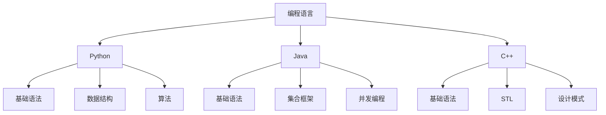
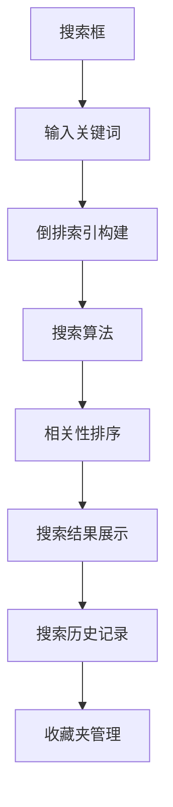
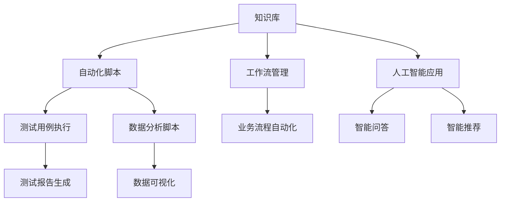
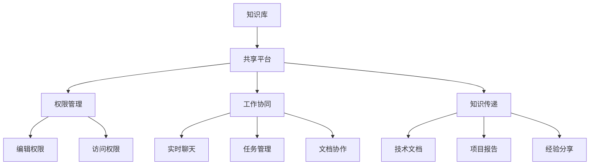
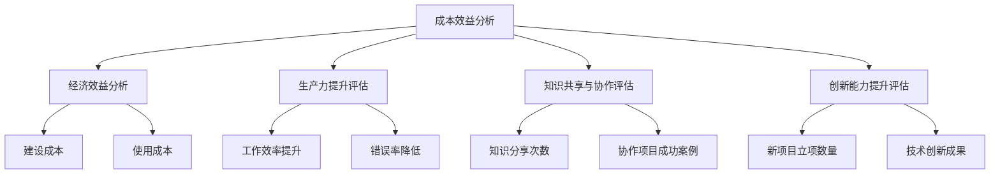
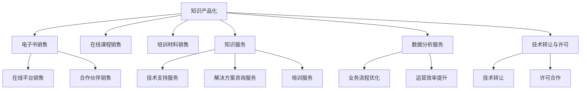
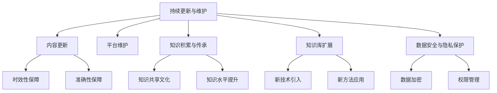

                 

## 文章标题：打造个人知识库的全栈技术方案

### 关键词：个人知识库、技术选型、知识获取、知识积累、知识库运用

#### 摘要：
随着信息爆炸时代的到来，如何高效地获取、整理、存储和利用知识成为每个专业人士必须面对的挑战。本文旨在探讨如何通过全栈技术方案，系统性地打造一个个人知识库，以提升个人学习、工作和创新能力。本文将首先介绍个人知识库的重要性与核心概念，探讨其与传统笔记的区别，并阐述构建个人知识库的目标与原则。随后，文章将详细讨论个人知识库的技术选型与工具介绍，对比分析常见个人知识库工具。接着，文章将深入个人知识库的结构设计，包括层级结构、内容分类和标签系统。随后，文章将分为三个主要部分，分别探讨知识获取与积累的方法、知识库的运用与提升，以及知识库的增值与成长。最后，文章将提供附录，包括个人知识库工具资源列表和构建案例，以供读者参考和学习。

## 目录大纲

### 第一部分：个人知识库的基础建设

#### 第1章：个人知识库的重要性与核心概念

##### 1.1 个人知识库的定义与价值

##### 1.2 个人知识库与传统笔记的区别

##### 1.3 构建个人知识库的目标与原则

#### 第2章：个人知识库的技术选型与工具介绍

##### 2.1 个人知识库技术选型原则

##### 2.2 常见个人知识库工具介绍

##### 2.3 个人知识库工具的对比分析

#### 第3章：个人知识库的结构设计

##### 3.1 个人知识库的层级结构

##### 3.2 个人知识库的内容分类

##### 3.3 个人知识库的标签系统

### 第二部分：知识获取与积累

#### 第4章：高效的知识获取方法

##### 4.1 信息收集与筛选

##### 4.2 知识整理与归纳

##### 4.3 知识存储与管理

#### 第5章：利用网络资源扩充知识库

##### 5.1 开源社区与知识库

##### 5.2 在线课程与培训

##### 5.3 学术论文与研究报告

#### 第6章：实践中的知识积累

##### 6.1 项目实战中的知识积累

##### 6.2 实践中的知识验证与迭代

##### 6.3 实践中的知识分享与传播

### 第三部分：知识库的运用与提升

#### 第7章：个人知识库的日常维护

##### 7.1 知识库的定期更新

##### 7.2 知识库的备份与恢复

##### 7.3 知识库的权限设置与分享

#### 第8章：知识库的深度利用

##### 8.1 知识库的查询与搜索

##### 8.2 知识库的自动化应用

##### 8.3 知识库的团队协作与共享

#### 第9章：知识库的增值与成长

##### 9.1 知识库的价值评估

##### 9.2 知识库的商业化路径

##### 9.3 知识库的可持续发展

### 附录

#### 附录A：个人知识库工具资源列表

##### A.1 开源个人知识库工具

##### A.2 商业个人知识库工具

##### A.3 个人知识库相关书籍与文章推荐

#### 附录B：个人知识库构建案例

##### B.1 案例一：构建个人技术知识库

##### B.2 案例二：构建个人研究知识库

##### B.3 案例三：构建个人项目知识库

## 引言

### 时代背景与知识获取的挑战

在当今这个信息爆炸的时代，知识更新速度之快，让人几乎难以跟上。每天，无数的新信息、新技术、新理论层出不穷，让每个专业人士都面临着巨大的知识获取和处理的压力。如何在这个信息过载的时代中，高效地获取、整理、存储和利用知识，已经成为每个专业人士必须面对的重要课题。

个人知识库作为一种高效的工具，能够帮助个人系统性地整理和存储各种知识和信息，从而提升个人的学习、工作和创新能力。个人知识库不仅能够帮助个人更好地掌握现有的知识，还能够通过不断积累和更新，形成个人的知识体系，为未来的学习和工作提供强有力的支持。

本文将围绕个人知识库的建设，提供一套全栈技术方案，帮助读者构建一个高效、系统、可持续发展的个人知识库。首先，我们将探讨个人知识库的重要性与核心概念，阐述其与传统笔记的区别，并明确构建个人知识库的目标与原则。随后，我们将详细讨论个人知识库的技术选型与工具介绍，对比分析常见的个人知识库工具，帮助读者选择合适的工具。接下来，我们将深入探讨个人知识库的结构设计，包括层级结构、内容分类和标签系统，确保知识库的有序性和可扩展性。

在第二部分，我们将介绍高效的知识获取方法，包括信息收集与筛选、知识整理与归纳、知识存储与管理，帮助读者系统地获取和整理知识。同时，我们还将探讨如何利用网络资源扩充知识库，包括开源社区、在线课程、学术论文与研究报告，以及实践中的知识积累方法。

第三部分将关注知识库的运用与提升，包括知识库的日常维护、深度利用、团队协作与共享，以及知识库的增值与成长。最后，我们将提供附录，包括个人知识库工具资源列表和构建案例，为读者提供实际的参考和指导。

通过本文的探讨，我们希望能够为读者提供一套全面、系统的个人知识库建设方案，帮助读者在信息爆炸的时代中，更好地获取、整理、存储和利用知识，从而提升个人的学习、工作和创新能力。

### 第一部分：个人知识库的基础建设

#### 第1章：个人知识库的重要性与核心概念

##### 1.1 个人知识库的定义与价值

个人知识库，顾名思义，是指个人用于存储、整理、管理和利用各类知识和信息的系统化工具。它不仅包括文字资料，还涵盖了图表、图片、音频、视频等多媒体内容。个人知识库的核心价值在于它能够帮助个人高效地管理知识，提升学习效率，增强创新能力。

首先，个人知识库能够显著提升学习效率。在一个高度结构化的知识库中，个人可以快速检索到所需的信息，避免了重复学习和无效搜索的时间浪费。通过有序的知识分类和标签系统，个人可以系统性地掌握知识，形成知识网络，从而更好地理解和应用所学知识。

其次，个人知识库有助于增强创新能力。知识库中的信息不仅是静态的存储，还可以通过跨领域的知识关联和碰撞，激发新的创意和想法。例如，一位软件开发者在个人知识库中积累了大量技术文档、开源项目代码和学术论文，可以通过这些资源快速找到解决方案，实现技术突破。

最后，个人知识库具有重要的长期价值。随着个人职业生涯的发展，知识库会不断积累和更新，形成宝贵的知识资产。这不仅有助于个人的职业成长，还可以在团队协作和知识传承中发挥重要作用。

##### 1.2 个人知识库与传统笔记的区别

尽管个人知识库和传统笔记都用于记录信息，但它们在功能、结构和应用场景上存在显著区别。

首先，在功能上，个人知识库不仅支持信息的记录和存储，还提供了强大的搜索、分类、关联和管理功能。例如，通过内置的全文搜索功能，个人可以快速定位到特定主题的相关资料，而传统笔记则需要手动翻阅查找。

其次，在结构上，个人知识库通常采用层级结构、标签系统和关联关系来组织信息。这种结构化的设计使得知识库具有良好的扩展性和可维护性，而传统笔记则更多是线性记录，难以实现高效的分类和检索。

最后，在应用场景上，个人知识库不仅适用于个人学习和工作，还可以用于团队协作和知识共享。例如，一个团队可以通过共享知识库，实现团队成员之间的知识传递和协作创新，而传统笔记则更多是个人使用。

##### 1.3 构建个人知识库的目标与原则

为了构建一个高效、系统、可持续发展的个人知识库，我们需要明确以下目标和原则：

**目标：**
1. **系统化存储与管理**：确保各类知识和信息得到系统化的存储和管理，便于快速检索和使用。
2. **持续更新与迭代**：随着个人知识积累的增加，知识库需要不断更新和迭代，保持其价值和实用性。
3. **高效的知识获取与利用**：通过高效的知识获取方法和工具，提升个人学习和工作的效率。
4. **知识共享与协作**：在适当的范围内，实现知识共享和协作，提升团队整体的知识水平和创新能力。

**原则：**
1. **结构化与模块化**：采用层级结构、标签系统和关联关系，确保知识库具有良好的扩展性和可维护性。
2. **简明与高效**：信息记录应简洁明了，避免冗余和复杂性，确保知识库的使用高效。
3. **安全性与隐私性**：保护个人知识库的安全性和隐私性，确保知识不被未经授权的访问和篡改。
4. **灵活性与可扩展性**：选择灵活且易于扩展的工具和技术，以适应未来知识库的需求变化。

通过明确目标和原则，我们可以更好地规划和构建个人知识库，实现知识的系统化管理和高效利用。

### 第2章：个人知识库的技术选型与工具介绍

##### 2.1 个人知识库技术选型原则

在构建个人知识库时，技术选型是一个至关重要的环节。选择合适的工具和技术，不仅能够提升知识库的功能性和用户体验，还能确保其稳定性和可扩展性。以下是构建个人知识库时应遵循的几个技术选型原则：

1. **兼容性与跨平台支持**：选择能够跨平台使用的工具，确保个人在不同设备和操作系统上都能方便地访问和管理知识库。
2. **灵活性与可扩展性**：工具应支持自定义和扩展，以适应个人特定的需求，例如自定义字段、插件扩展等。
3. **安全性**：确保工具在数据存储、传输和访问过程中提供有效的安全措施，防止数据泄露和未经授权的访问。
4. **易用性与用户体验**：工具应具备良好的用户界面和操作逻辑，使得知识库的创建、管理和使用过程简单直观。
5. **社区支持与文档丰富度**：选择拥有活跃社区和丰富文档的工具，有助于解决使用过程中遇到的问题，提升工作效率。

##### 2.2 常见个人知识库工具介绍

目前市面上存在多种个人知识库工具，各具特色。以下是几种常见工具的简要介绍：

1. **Notion**：Notion 是一款功能强大的个人知识库和项目管理工具，支持多种类型的笔记、表格、数据库和看板，提供丰富的模板和自定义功能，界面简洁直观，适用于个人和团队使用。

2. **Evernote**：Evernote 是一款广泛使用的笔记应用，支持文本、图片、音频、视频等多种类型的笔记，提供强大的搜索和标签功能，支持多平台同步，是一款理想的个人知识库解决方案。

3. **OneNote**：OneNote 是微软推出的一款笔记应用，与 Office 生态系统紧密结合，提供丰富的笔记类型和交互功能，支持手写笔记和墨迹输入，适用于 Windows 和 macOS 平台。

4. **Obsidian**：Obsidian 是一款基于 Markdown 的笔记应用，以链接式笔记和知识图谱为核心特性，支持丰富的扩展插件，界面简洁，适用于深度学习和知识管理。

5. **TiddlyWiki**：TiddlyWiki 是一款基于 HTML、CSS 和 JavaScript 的轻量级笔记应用，支持极简主义笔记方式，支持多级链接和丰富插件，适用于个人知识和项目文档管理。

##### 2.3 个人知识库工具的对比分析

以下是对上述几种常见个人知识库工具的对比分析：

| 工具          | 兼容性与跨平台支持 | 灵活性与可扩展性 | 安全性 | 易用性与用户体验 | 社区支持与文档丰富度 |
|--------------|-----------------|-----------------|-------|-----------------|---------------------|
| Notion       | 高              | 高              | 高    | 高              | 高                  |
| Evernote     | 高              | 中等            | 高    | 高              | 高                  |
| OneNote      | 高              | 中等            | 中等  | 高              | 中等                |
| Obsidian     | 中等            | 高              | 中等  | 中等            | 高                  |
| TiddlyWiki   | 高              | 高              | 中等  | 中等            | 中等                |

从上表可以看出，每种工具都有其独特的优势和应用场景。Notion 和 Evernote 在兼容性、灵活性和社区支持方面表现优异，适合需要跨平台使用和强大功能需求的用户；OneNote 则凭借其与 Office 生态系统的紧密结合，适用于 Windows 用户；Obsidian 和 TiddlyWiki 则以其灵活性和轻量级特性，适合对自定义和扩展有较高要求的用户。

### 第3章：个人知识库的结构设计

##### 3.1 个人知识库的层级结构

个人知识库的层级结构设计是确保知识库系统性和可扩展性的关键。通过合理的层级结构，我们可以将各类知识和信息有条理地组织起来，方便用户快速定位和检索。以下是构建个人知识库层级结构时需要考虑的几个方面：

1. **顶层分类**：顶层分类通常按照个人兴趣、专业领域或工作职责进行划分。例如，一个软件开发者的顶层分类可能包括编程语言、框架、数据库、算法等。
2. **次级分类**：次级分类是对顶层分类的细化，例如在“编程语言”这一顶层分类下，可以进一步细分为“Python”、“Java”、“C++”等。
3. **三级分类及以下**：在次级分类的基础上，可以继续细化分类，例如在“Python”分类下，可以细分为“基础语法”、“数据结构”、“算法”等。

以下是一个简单的个人知识库层级结构的示例：

```
- 编程语言
  - Python
    - 基础语法
    - 数据结构
    - 算法
  - Java
    - 基础语法
    - 集合框架
    - 并发编程
  - C++
    - 基础语法
    - STL
    - 设计模式
- 数据库
  - 关系型数据库
    - MySQL
    - PostgreSQL
    - Oracle
  - 非关系型数据库
    - MongoDB
    - Redis
    - Cassandra
- 算法
  - 数据结构与算法
    - 排序算法
    - 搜索算法
    - 图算法
  - 机器学习算法
    - 监督学习
    - 无监督学习
    - 强化学习
```

通过这样的层级结构设计，个人知识库可以清晰、有序地组织各类知识，便于用户快速查找和整理。

##### 3.2 个人知识库的内容分类

除了层级结构，内容分类也是个人知识库设计中的重要环节。合理的分类方法能够帮助用户更好地组织和查找信息，提高知识库的使用效率。以下是几种常见的个人知识库内容分类方法：

1. **按主题分类**：按主题分类是最常见的方法，将相关内容归类到同一个主题下。例如，将所有关于编程语言的内容归类到“编程语言”主题，将所有关于数据库的内容归类到“数据库”主题。
2. **按时间分类**：按时间分类适用于记录和整理随着时间变化的信息，例如日志、年度报告等。通过时间分类，用户可以快速查找特定时间段内的信息。
3. **按来源分类**：按来源分类适用于记录从不同渠道获取的信息，例如书籍、网络文章、课程资料等。通过来源分类，用户可以追溯信息的来源，确保信息的可靠性和准确性。
4. **按用途分类**：按用途分类适用于将内容分为不同的使用场景，例如工作、学习、娱乐等。通过用途分类，用户可以快速找到适用于特定场景的信息。

以下是一个示例的个人知识库内容分类：

```
- 编程语言
  - Python
    - 学习资源
    - 实战项目
    - 经验分享
  - Java
    - 学习资源
    - 实战项目
    - 经验分享
  - C++
    - 学习资源
    - 实战项目
    - 经验分享
- 数据库
  - MySQL
    - 学习资源
    - 实战项目
    - 经验分享
  - PostgreSQL
    - 学习资源
    - 实战项目
    - 经验分享
  - MongoDB
    - 学习资源
    - 实战项目
    - 经验分享
- 算法
  - 数据结构与算法
    - 学习资源
    - 实战项目
    - 经验分享
  - 机器学习算法
    - 学习资源
    - 实战项目
    - 经验分享
```

通过以上分类方法，个人知识库的内容将更加清晰和有条理，便于用户高效地查找和使用。

##### 3.3 个人知识库的标签系统

标签系统是个人知识库的重要组成部分，它通过为每个内容添加标签，实现内容的灵活分类和快速检索。以下是构建个人知识库标签系统时需要考虑的几个方面：

1. **标签的规范化**：为了确保标签的统一性和一致性，应制定一套标签命名规范。例如，统一使用小写字母和下划线，避免使用特殊字符。
2. **标签的层次性**：标签不仅可以单独使用，还可以组成层次结构。例如，可以将“Python”作为一级标签，将“深度学习”和“数据分析”作为二级标签，从而实现标签的层次化。
3. **标签的灵活性**：标签应具有灵活性，能够根据个人需求进行自定义。例如，一个程序员可能将“算法”标签用于记录算法相关的文章和项目，而一个数据科学家则可能将“数据分析”标签用于类似内容。
4. **标签的关联性**：标签之间应具有关联性，以便通过一个标签快速找到相关内容。例如，将“深度学习”与“神经网络”和“数据集”相关联，通过“深度学习”标签可以快速找到与神经网络和数据集相关的文章和资源。

以下是一个示例的个人知识库标签系统：

```
- Python
  - 深度学习
    - 神经网络
    - 数据集
    - 模型优化
  - 数据分析
    - 数据清洗
    - 数据可视化
    - 统计分析
- Java
  - 并发编程
    - 线程
    - 同步与锁
    - 并发框架
  - Web开发
    - 框架
    - 安全
    - 性能优化
- 数据库
  - 关系型数据库
    - SQL
    - 索引
    - 事务
  - 非关系型数据库
    - MongoDB
    - Redis
    - Cassandra
- 算法
  - 排序算法
    - 快速排序
    - 归并排序
    - 插入排序
  - 搜索算法
    - 二分查找
    - BFS
    - DFS
```

通过建立合理的标签系统，个人知识库可以实现内容的灵活分类和高效检索，进一步提升知识管理的效率。

### 第二部分：知识获取与积累

#### 第4章：高效的知识获取方法

在构建个人知识库的过程中，知识获取是至关重要的一步。如何高效地收集、整理和存储信息，确保知识的准确性和可靠性，是每个个人知识库构建者必须掌握的技能。本章将详细介绍几种高效的知识获取方法，包括信息收集与筛选、知识整理与归纳、知识存储与管理，帮助读者构建系统化的个人知识库。

##### 4.1 信息收集与筛选

信息收集是知识获取的第一步。在信息过载的时代，如何从海量的信息中筛选出有价值的内容，是提升知识获取效率的关键。

**1. 定位信息源**：首先，要明确信息收集的目标和需求，选择合适的渠道进行信息收集。信息源可以是专业的书籍、学术论文、权威网站、专业论坛、技术博客等。例如，对于一名软件开发者，可以关注GitHub、Stack Overflow、Reddit等技术社区，以及GitHub、GitLab等代码托管平台。

**2. 使用搜索引擎**：搜索引擎是获取信息的重要工具。通过关键词搜索，可以快速找到相关的信息和资源。为了提高搜索效率，可以采用以下技巧：
- **精确搜索**：使用双引号（"”）将关键词括起来，进行精确搜索，避免搜索到无关内容。
- **逻辑运算符**：使用AND、OR、NOT等逻辑运算符，结合关键词进行高级搜索，例如“深度学习 AND 神经网络”。
- **使用高级搜索功能**：大多数搜索引擎都提供高级搜索功能，如限定时间范围、文件类型、网站等，利用这些功能可以更精准地找到所需信息。

**3. 筛选信息**：在收集到大量信息后，需要进行筛选，确保信息的准确性和可靠性。以下是一些筛选信息的技巧：
- **查证来源**：核实信息来源的权威性和可靠性，避免误信虚假信息。
- **交叉验证**：通过多个来源的信息进行交叉验证，确保信息的准确性。
- **使用参考文献**：查阅相关的学术论文、书籍和报告，确保信息具有科学依据。

##### 4.2 知识整理与归纳

收集到信息后，需要对信息进行整理和归纳，确保知识的系统性和条理性。

**1. 列表整理**：将收集到的信息按照主题、类别进行分类整理，形成列表。例如，将编程相关的信息归类到“编程语言”、“框架”、“算法”等类别下。

**2. 思维导图**：使用思维导图工具，将各类信息进行可视化整理。思维导图可以帮助我们清晰地展示信息之间的关系，便于理解和记忆。以下是一个使用Mermaid绘制的思维导图示例：



**3. 知识归纳**：在整理信息的基础上，进行知识的归纳和总结。通过撰写总结性文档、制作知识卡片等方式，将零散的信息系统化、结构化。以下是一个知识归纳的示例：

```
知识归纳：Python编程语言

1. 基础语法
   - 变量和数据类型
   - 流程控制
   - 函数和模块
   - 面向对象编程

2. 数据结构
   - 列表
   - 元组
   - 集合
   - 字典

3. 算法
   - 排序算法
   - 搜索算法
   - 图算法
   - 动态规划
```

通过以上整理和归纳方法，我们可以将零散的信息系统化、结构化，便于后续的知识管理和利用。

##### 4.3 知识存储与管理

知识存储与管理是个人知识库构建的核心环节。一个高效的知识存储与管理系统，可以确保知识的准确性和可靠性，便于知识的查找和利用。

**1. 选择合适的存储工具**：根据个人需求，选择合适的个人知识库工具。常见的知识库工具包括Notion、Evernote、OneNote、Obsidian等。选择时需要考虑以下因素：
- **兼容性与跨平台支持**：确保工具能够在不同设备和操作系统上使用。
- **安全性**：确保工具提供数据加密和权限设置功能，保护知识库的安全。
- **易用性与用户体验**：选择操作简便、界面友好的工具。
- **扩展性与定制化**：选择支持自定义字段、插件扩展的工具，以适应个人需求。

**2. 设计合理的知识结构**：在知识库中，设计合理的知识结构，确保知识有序、系统化地存储。以下是构建知识结构的几个步骤：
- **顶层分类**：根据个人兴趣、专业领域或工作职责，划分顶层分类，例如“编程语言”、“数据库”、“算法”等。
- **次级分类**：在顶层分类下，进一步细划分次级分类，例如“Python”、“Java”、“C++”等。
- **三级分类及以下**：在次级分类下，继续细划分三级分类及以下，例如“基础语法”、“数据结构”、“算法”等。

**3. 使用标签系统**：标签系统是实现知识灵活分类和高效检索的关键。以下是使用标签系统的几个要点：
- **规范化标签**：制定一套标签命名规范，确保标签的统一性和一致性。
- **层次性标签**：使用层次性标签，实现标签的层次化，例如“Python”、“深度学习”、“神经网络”等。
- **灵活性标签**：根据个人需求，灵活使用标签，实现知识的多样化分类。

**4. 知识备份与同步**：定期备份知识库，确保数据的安全性和完整性。同时，使用同步功能，确保在不同设备上的知识库保持一致性。

**5. 优化知识检索**：使用内置的搜索功能，快速定位所需的知识点。以下是一些优化知识检索的方法：
- **关键词搜索**：使用关键词进行精确搜索，避免搜索到无关内容。
- **筛选条件**：利用筛选条件，例如分类、标签、时间等，缩小搜索范围，提高检索效率。

通过以上知识存储与管理方法，我们可以构建一个高效、系统、可持续发展的个人知识库，确保知识的准确性和可靠性，便于知识的查找和利用。

### 第5章：利用网络资源扩充知识库

在构建个人知识库的过程中，充分利用网络资源是一个不可或缺的环节。互联网上有大量的开源社区、在线课程、学术论文与研究报告等资源，这些资源不仅丰富了我们的知识库，还能够帮助我们提升专业技能和创新能力。本章将详细介绍如何利用网络资源扩充知识库，包括开源社区、在线课程、学术论文与研究报告，以及网络资源的获取与整理方法。

##### 5.1 开源社区与知识库

开源社区是互联网上宝贵的知识库之一，通过参与开源项目，我们可以获取最新的技术动态、最佳实践和高质量的技术文档。以下是几种常用的开源社区和知识库：

**1. GitHub**：GitHub 是全球最大的代码托管平台，通过 GitHub，我们可以找到大量的开源项目、技术文档和社区讨论。以下是一些使用 GitHub 扩展知识库的方法：
- **搜索与关注**：通过关键词搜索，找到与个人兴趣或专业领域相关的开源项目。关注这些项目，及时获取更新和讨论。
- **参与贡献**：积极参与开源项目，通过提交代码、文档和反馈，提升自己的技术水平，扩展知识库。
- **创建个人仓库**：创建个人仓库，存储和管理个人项目、技术文档和研究成果。

**2. GitLab**：GitLab 是与 GitHub 类似的代码托管平台，提供完整的 Git 版本控制和项目协作功能。以下是一些使用 GitLab 扩展知识库的方法：
- **项目浏览**：浏览 GitLab 上的项目，查找与个人兴趣或专业领域相关的资源。
- **创建项目**：创建个人项目，记录和管理个人研究、项目文档和技术博客。
- **团队协作**：与团队成员在 GitLab 上协作，共同推进项目开发，共享知识库。

**3. Stack Overflow**：Stack Overflow 是全球最大的开发者问答社区，通过提问和回答问题，我们可以快速解决技术难题，扩展知识库。以下是一些使用 Stack Overflow 的方法：
- **提问与回答**：在 Stack Overflow 上提问和回答问题，提升自己的技术水平，扩展知识库。
- **关注标签**：关注感兴趣的技术标签，获取相关问题的最新动态和讨论。
- **编写教程**：编写高质量的技术教程，分享自己的经验和知识，提升个人影响力。

##### 5.2 在线课程与培训

在线课程和培训是获取新知识和技能的重要途径，通过在线学习平台，我们可以随时随地学习各种课程，提升自己的专业能力。以下是几种常用的在线学习平台：

**1. Coursera**：Coursera 是全球领先的在线教育平台，提供广泛的课程，涵盖计算机科学、数据科学、人工智能、商业管理等多个领域。以下是一些使用 Coursera 扩展知识库的方法：
- **课程学习**：选择感兴趣的课程，系统学习理论知识，扩展知识库。
- **项目实践**：参与课程项目，通过实际操作，巩固所学知识。
- **课程笔记**：记录课程笔记，将学习内容整理成系统化的知识体系。

**2. Udemy**：Udemy 是全球最大的在线学习平台之一，提供丰富的课程，适合个人和职业发展的不同需求。以下是一些使用 Udemy 扩展知识库的方法：
- **技能提升**：选择与自己职业发展相关的课程，提升专业技能。
- **证书学习**：通过完成课程，获得相应的证书，提升职业竞争力。
- **课程分享**：分享学习心得和经验，与他人交流学习成果。

**3. edX**：edX 是由哈佛大学和麻省理工学院共同创立的在线教育平台，提供高质量的课程和证书项目。以下是一些使用 edX 扩展知识库的方法：
- **名校课程**：学习来自全球顶尖名校的课程，扩展知识视野。
- **认证项目**：参与 edX 的认证项目，获得权威认证，提升个人品牌。
- **社交互动**：加入课程讨论区，与其他学习者交流学习经验和心得。

##### 5.3 学术论文与研究报告

学术论文和研究报告是获取前沿知识和研究动态的重要渠道，通过阅读和分析这些文献，我们可以深入了解学术界的最新进展，为自己的研究和项目提供理论支持。以下是几种获取学术论文和研究报告的方法：

**1. Google Scholar**：Google Scholar 是一个免费的学术搜索引擎，可以搜索到全球范围内的学术论文、技术报告、专利等。以下是一些使用 Google Scholar 的方法：
- **主题搜索**：通过关键词搜索，找到与个人研究领域相关的学术论文和报告。
- **文献分类**：根据文献类型、发表年份、引用次数等条件，对搜索结果进行分类和筛选。
- **引用分析**：通过分析文献的引用关系，找到相关领域的权威文献和重要研究方向。

**2. arXiv**：arXiv 是一个开放获取的学术论文预印本平台，涵盖了物理学、数学、计算机科学、统计学等领域的论文。以下是一些使用 arXiv 的方法：
- **分类浏览**：按照学科领域和主题分类，浏览相关领域的最新论文。
- **作者搜索**：通过作者姓名或机构，查找特定研究者的论文和研究成果。
- **关注订阅**：关注感兴趣的论文和作者，通过订阅功能，获取最新论文的通知和更新。

**3. Web of Science**：Web of Science 是一个综合性的学术数据库，收录了全球范围内的学术期刊、会议论文、专利等。以下是一些使用 Web of Science 的方法：
- **高级搜索**：利用高级搜索功能，精准查找特定主题、关键词、作者等条件的文献。
- **引用分析**：通过分析文献的引用关系，了解某一领域的学术影响力和热点研究方向。
- **数据导出**：将搜索结果导出为参考文献格式，方便整理和引用。

##### 5.4 网络资源的获取与整理方法

在获取网络资源的过程中，如何有效地整理和管理这些资源，是确保知识库系统性和可扩展性的关键。以下是一些网络资源获取与整理的方法：

**1. 文献管理工具**：使用文献管理工具，如 EndNote、Zotero、Mendeley 等，可以帮助我们高效地整理和存储学术论文和研究报告。这些工具支持文献的导入、分类、注释和引用，方便我们进行知识管理。

**2. 网络爬虫**：对于一些重复性的资源获取任务，可以使用网络爬虫工具，如 Scrapy、BeautifulSoup 等，自动化地获取大量网页内容。通过编写爬虫脚本，我们可以快速获取所需的信息，提高获取效率。

**3. 电子书与论文下载**：通过一些学术搜索引擎和下载网站，如 Google 学术搜索、ResearchGate 等，我们可以免费下载大量的学术论文和电子书。这些资源有助于我们快速扩展知识库，提升专业水平。

**4. 知识整理工具**：使用知识整理工具，如 Notion、Evernote、Obsidian 等，我们可以将获取的网络资源进行系统化整理和存储。通过标签、分类和链接等手段，实现知识的灵活分类和高效检索。

通过以上方法，我们可以充分利用网络资源，扩展个人知识库，提升专业技能和创新能力。

### 第6章：实践中的知识积累

在个人知识库的建设过程中，知识积累是至关重要的一个环节。通过实践中的知识积累，我们可以将理论知识转化为实际应用，提升个人技能和解决问题的能力。本章将详细介绍在项目实战中的知识积累、知识验证与迭代，以及知识分享与传播的方法，帮助读者在实践过程中不断积累和提升知识。

##### 6.1 项目实战中的知识积累

项目实战是知识积累的重要途径，通过实际操作和问题解决，我们可以将理论知识应用到具体场景中，积累宝贵的实战经验。以下是在项目实战中进行知识积累的几个步骤：

**1. 明确目标与需求**：在开始项目之前，要明确项目的目标和需求，了解项目的背景和预期成果。通过明确目标与需求，可以确保我们在项目过程中聚焦于关键问题和核心知识点的积累。

**2. 学习相关理论**：在项目开始前，要学习相关的理论知识，包括技术原理、算法模型、设计模式等。通过系统学习相关理论，可以为项目实战打下坚实的基础。

**3. 制定项目计划**：制定详细的项目计划，明确项目的进度、任务分工和时间安排。通过项目计划的制定，可以确保我们在项目过程中有序推进，避免资源浪费和时间拖延。

**4. 实际操作与问题解决**：在项目实施过程中，要积极参与实际操作，动手实践是知识积累的关键。在遇到问题时，要勇于面对，通过查阅资料、讨论和请教，找到解决问题的方法。

**5. 记录总结与反思**：在项目结束后，及时进行总结与反思，记录项目过程中的关键知识点、经验教训和改进措施。通过总结与反思，可以不断积累和提升个人知识。

以下是一个项目实战中的知识积累示例：

**项目背景**：开发一个基于 Python 的自动化测试工具。

**项目目标**：实现自动化测试功能的开发，提升软件测试效率。

**项目需求**：1. 支持多种测试类型的自动化测试；2. 具备可配置性和扩展性；3. 提供测试报告和日志记录功能。

**理论知识**：1. Python 编程语言基础；2. 自动化测试框架（如 Selenium、pytest）；3. 测试用例设计方法。

**项目实施**：
- **学习相关理论**：学习 Python 编程语言基础、Selenium 自动化测试框架和 pytest 测试框架。
- **制定项目计划**：制定项目进度、任务分工和时间安排，明确开发目标。
- **实际操作与问题解决**：根据项目需求，编写测试脚本，实现自动化测试功能。在遇到问题时，查阅资料、讨论和请教，找到解决方案。
- **记录总结与反思**：在项目完成后，总结项目过程中的关键知识点、经验教训和改进措施，形成文档，便于后续参考和优化。

通过以上步骤，在项目实战中，我们可以积累宝贵的知识，提升个人技能。

##### 6.2 实践中的知识验证与迭代

在实践过程中，知识的验证与迭代是确保知识准确性和有效性的关键。以下是在实践中进行知识验证与迭代的几个步骤：

**1. 知识验证**：通过实际应用和测试，验证知识的准确性和有效性。例如，在开发自动化测试工具时，通过实际测试用例的运行，验证测试脚本的功能和性能。

**2. 反馈与优化**：在验证过程中，收集用户反馈和测试结果，识别问题和不足之处。通过反馈与优化，不断改进知识的应用效果。

**3. 迭代更新**：根据验证结果和反馈，对知识进行迭代更新，优化和完善知识库中的内容。例如，在优化自动化测试工具时，根据测试结果和用户反馈，改进测试脚本和报告格式。

以下是一个实践中的知识验证与迭代示例：

**项目背景**：优化自动化测试工具，提升测试效率。

**验证与迭代过程**：
- **知识验证**：在实际测试环境中，运行测试脚本，验证测试工具的功能和性能。
- **反馈与优化**：收集用户反馈和测试结果，识别测试脚本中的问题和不足之处。例如，测试报告格式不够直观、部分测试用例执行时间较长等。
- **迭代更新**：根据反馈结果，对测试脚本和报告进行优化。改进报告格式，提高测试效率，修复测试脚本中的缺陷。

通过以上步骤，我们可以确保知识的准确性和有效性，不断提升个人技能和项目质量。

##### 6.3 实践中的知识分享与传播

知识的积累不仅仅是为了个人的提升，更重要的是通过知识分享与传播，实现知识的共享和共同进步。以下是在实践中进行知识分享与传播的几个方法：

**1. 技术博客**：撰写技术博客，记录项目经验和学习心得，通过博客平台分享给他人。例如，使用 GitHub Pages 或 WordPress 搭建个人博客，定期发布技术文章。

**2. 社交媒体**：利用社交媒体平台，如 Twitter、LinkedIn 等，分享项目进展和知识成果。通过社交互动，扩大知识传播范围。

**3. 在线课程**：开设在线课程，系统性地分享知识和技能。例如，在 Coursera、Udemy、edX 等平台发布课程，为更多人提供学习机会。

**4. 讲座与研讨会**：参加或举办讲座与研讨会，与同行交流经验，传播知识。例如，参加技术沙龙、行业会议等，分享项目经验和研究成果。

以下是一个实践中的知识分享与传播示例：

**项目背景**：完成一个基于 Python 的数据分析项目，通过技术博客和社交媒体分享项目经验和学习心得。

**知识分享与传播方法**：
- **技术博客**：撰写博客文章，详细记录项目的技术实现、数据处理过程和数据分析结果，分享给读者。
- **社交媒体**：在 Twitter 和 LinkedIn 上发布项目进展和博客链接，与同行互动，获取反馈和建议。
- **在线课程**：在 Udemy 平台上开设数据分析课程，系统性地分享数据分析知识和技能。
- **讲座与研讨会**：参加行业研讨会，分享项目经验和数据分析方法，与参会者交流心得。

通过以上方法，我们可以将实践中的知识积累分享给他人，实现知识的共享和共同进步。

### 第三部分：知识库的运用与提升

#### 第7章：个人知识库的日常维护

##### 7.1 知识库的定期更新

个人知识库的定期更新是确保知识库时效性和准确性的关键。随着技术和行业的发展，知识也在不断更新和演变。定期更新知识库不仅可以帮助我们保持对最新知识的掌握，还能够避免过时信息的积累。以下是一些关于知识库定期更新的建议：

**1. 定期回顾**：设定固定的周期（如每周、每月或每季度）对知识库进行回顾，检查其中的内容是否需要更新。回顾过程中，重点关注以下内容：
- **技术更新**：定期查看所关注的领域是否有新技术、新算法、新标准等发布，及时更新知识库中的相关内容。
- **项目经验**：回顾过去的项目经历，总结经验教训，更新知识库中的项目案例和最佳实践。
- **用户反馈**：收集用户对知识库的反馈和意见，根据用户需求调整和优化知识库的内容。

**2. 持续学习**：通过参加培训课程、阅读专业书籍、关注行业动态等方式，持续学习新知识，并将其纳入知识库。以下是一些建议的学习途径：
- **在线课程**：利用 Coursera、Udemy、edX 等在线学习平台，学习最新的技术课程和行业知识。
- **技术博客**：关注技术大牛和行业专家的博客，学习他们的经验和见解。
- **技术论坛**：参与技术论坛和社群，与同行交流，获取最新的行业资讯和问题解决方案。

**3. 整理与优化**：在更新知识库的过程中，对内容进行整理和优化，确保知识库的整洁和易用性。以下是一些整理与优化的建议：
- **内容分类**：对知识库中的内容进行重新分类，确保分类清晰、逻辑性强，便于查找。
- **去除冗余**：删除重复、过时和错误的信息，保持知识库的简洁和准确。
- **格式调整**：优化内容的格式，确保文档结构清晰、美观，提高阅读体验。

通过定期更新知识库，我们可以保持对最新知识的掌握，不断提升个人能力和知识储备。

##### 7.2 知识库的备份与恢复

知识库的备份与恢复是确保数据安全性和完整性的重要措施。由于技术故障、人为错误或外部攻击等原因，知识库中的数据可能会丢失或损坏。因此，定期备份知识库和制定恢复策略至关重要。以下是一些关于知识库备份与恢复的建议：

**1. 备份数据存储方式**：选择合适的备份存储方式，确保数据的安全性和可恢复性。以下是一些常用的备份存储方式：
- **本地备份**：将知识库数据定期备份到本地硬盘或外接存储设备，如 USB 移动硬盘、NAS 等。本地备份便于快速恢复，但需要定期检查设备状态，防止数据丢失。
- **云端备份**：将知识库数据备份到云端存储服务，如 Google Drive、Dropbox、OneDrive 等。云端备份具有安全性高、易于访问和管理等优点，但可能涉及一定的费用。
- **异地备份**：将知识库数据备份到不同地理位置的存储设备，如远程数据中心或云服务器。异地备份能够提高数据的安全性，防止因自然灾害或故障导致的本地数据丢失。

**2. 备份频率**：根据知识库的重要性和更新频率，制定合理的备份频率。以下是一些备份频率的建议：
- **每日备份**：对于更新频繁且至关重要的知识库，如公司的核心数据，应每日进行备份。
- **每周备份**：对于更新较为稳定的知识库，如个人学习笔记，可以每周进行备份。
- **每月备份**：对于一些较为静态的知识库，如文档库、书籍库等，可以每月进行备份。

**3. 恢复策略**：制定详细的恢复策略，确保在数据丢失或损坏时，能够迅速恢复知识库。以下是一些恢复策略的建议：
- **本地恢复**：如果使用本地备份，确保备份文件的安全和可访问性。在需要恢复时，将备份文件复制回知识库中，并确保数据的一致性。
- **云端恢复**：如果使用云端备份，利用云端存储服务的恢复功能，将备份数据恢复到知识库中。在恢复过程中，确保数据的安全性和完整性。
- **异地恢复**：如果使用异地备份，联系异地备份提供商，根据备份策略恢复数据。在恢复过程中，可能需要验证备份文件的有效性和一致性。

通过制定合理的备份与恢复策略，我们可以确保知识库的安全性和完整性，避免数据丢失带来的风险。

##### 7.3 知识库的权限设置与分享

知识库的权限设置与分享是确保知识库安全、有序地管理和使用的关键。通过合理的权限设置和分享机制，我们可以控制知识库的访问权限，确保知识库内容的安全性和保密性，同时促进知识的共享和传播。以下是一些关于知识库权限设置与分享的建议：

**1. 权限设置**：
- **访问权限**：根据用户角色和权限，设置不同的访问权限。例如，管理员可以查看和修改所有内容，普通用户只能查看特定内容。
- **修改权限**：对于知识库中的敏感信息，如商业机密或个人隐私，可以设置只读权限，防止未经授权的用户进行修改。
- **共享权限**：为特定用户或用户组设置共享权限，允许他们访问和共享知识库中的特定内容。

**2. 分享机制**：
- **内部分享**：在组织内部，通过知识库平台的共享功能，实现知识库内容在团队或部门之间的共享和协作。例如，项目经理可以共享项目文档和进度报告，团队成员可以实时查看和更新内容。
- **外部分享**：对于需要与外部合作伙伴或客户共享的知识库内容，可以通过知识库平台的公开链接或邀请链接，实现知识的公开或定向分享。例如，可以将技术博客或公开课程链接分享到社交媒体或邮件列表，让更多人获取知识。

**3. 安全策略**：
- **数据加密**：使用数据加密技术，确保知识库中的数据在传输和存储过程中安全可靠。
- **审计日志**：记录知识库的访问和操作日志，以便在出现安全问题时，能够快速定位和追踪问题源头。
- **权限审核**：定期审核用户的权限和访问记录，确保权限设置的合理性和安全性。

通过合理的权限设置和分享机制，我们可以确保知识库的安全性和有序性，促进知识的共享和传播。

### 第8章：知识库的深度利用

个人知识库的价值不仅在于存储和整理知识，更在于如何深度利用这些知识，实现知识的自动化应用、团队协作与共享。本章将探讨如何通过深度利用知识库，提升个人工作效率和团队创新能力。

##### 8.1 知识库的查询与搜索

高效的查询与搜索功能是深度利用知识库的基础。通过强大的查询和搜索机制，用户可以快速找到所需的知识点，大大提高工作效率。

**1. 搜索算法优化**：知识库平台应支持高效的全文搜索算法，例如倒排索引和向量搜索。通过优化搜索算法，可以大幅提升搜索速度和准确性。

**2. 搜索过滤与排序**：提供多种过滤和排序选项，例如按时间、类别、标签、作者等条件进行筛选，并支持按相关性、重要性等排序。通过这些功能，用户可以快速定位到最相关的知识点。

**3. 搜索提示与自动补全**：提供搜索提示和自动补全功能，例如输入关键词的前几个字符后，系统自动显示可能的搜索结果，减少用户输入和搜索时间。

**4. 搜索历史与收藏**：记录用户的搜索历史和收藏夹，便于用户快速访问常用知识点。同时，支持将搜索结果和收藏夹内容导出为笔记或文档，便于进一步整理和分享。

以下是一个知识库搜索优化的示例：



通过以上优化，知识库的查询与搜索功能将更加高效，帮助用户快速获取所需知识。

##### 8.2 知识库的自动化应用

自动化应用是将知识库中的知识转化为实际操作的工具，通过自动化脚本和工具，实现知识的自动化执行和应用。

**1. 自动化脚本**：利用 Python、JavaScript 等脚本语言，编写自动化脚本，实现知识库中操作步骤的自动化执行。例如，编写自动化测试脚本，自动化执行测试用例；编写数据分析脚本，自动化处理和分析数据。

**2. 工作流管理**：利用工作流管理工具，如 workflowy、Ninja Forms 等，将知识库中的知识点组织成工作流，实现知识的自动化应用。工作流管理工具支持条件分支、循环控制等复杂操作，能够灵活地组织知识库中的知识点。

**3. 人工智能应用**：利用人工智能技术，如机器学习、自然语言处理等，将知识库中的知识点转化为智能应用。例如，利用机器学习模型，实现智能问答、智能推荐等功能；利用自然语言处理技术，实现智能文档生成和内容摘要。

以下是一个自动化应用的示例：



通过自动化应用，知识库中的知识可以更加高效地转化为实际操作，提升工作效率。

##### 8.3 知识库的团队协作与共享

团队协作与共享是知识库深度利用的重要环节，通过共享知识库，可以实现团队成员之间的知识传递和协作创新。

**1. 知识共享平台**：构建一个集中化的知识共享平台，将团队的知识库集中管理，支持多人同时在线编辑和共享。例如，使用 Confluence、Notion 等工具，搭建团队知识库，实现知识的集中管理和协作。

**2. 权限管理**：设置合理的权限管理机制，确保知识的保密性和安全性。根据团队成员的角色和职责，分配不同的访问权限和编辑权限，确保知识的有序管理和使用。

**3. 工作协同**：利用知识库平台的工作协同功能，实现团队成员之间的实时协作。例如，通过聊天功能、任务管理功能、文档协作功能等，实现团队成员之间的实时沟通和协作。

**4. 知识传递**：通过知识库，实现知识的传递和积累。例如，通过编写技术文档、项目报告、经验分享等，将知识传递给新成员，帮助团队成员快速上手和提升能力。

以下是一个知识库团队协作与共享的示例：



通过团队协作与共享，知识库可以实现知识的传递和积累，提升团队整体的知识水平和创新能力。

### 第9章：知识库的增值与成长

##### 9.1 知识库的价值评估

知识库的价值评估是确保知识库建设和使用效益的重要环节。通过对知识库进行价值评估，可以衡量知识库的实际效益，指导后续的知识库建设和优化。

**1. 成本效益分析**：通过比较知识库的建设成本和使用成本，评估知识库的经济效益。例如，分析知识库平台采购费用、维护费用、人员培训费用等，与提高工作效率、减少重复工作等带来的经济效益。

**2. 生产力提升**：评估知识库在提高工作效率、减少错误率、加快项目进度等方面带来的生产力的提升。例如，通过量化工作效率的提升、错误率的降低等指标，评估知识库的价值。

**3. 知识共享与协作**：评估知识库在促进知识共享和团队协作方面的贡献。例如，通过团队成员的知识分享次数、协作项目的成功案例等，评估知识库在知识传递和团队协作中的价值。

**4. 创新能力提升**：评估知识库在激发团队成员创新能力、推动技术创新方面的作用。例如，通过新项目立项数量、技术创新成果等，评估知识库在创新能力提升方面的价值。

以下是一个知识库价值评估的示例：



通过以上评估，可以全面了解知识库的实际效益，指导后续的知识库建设和优化。

##### 9.2 知识库的商业化路径

对于企业和个人来说，知识库的增值与成长不仅仅体现在提升内部工作效率和创新能力上，还可以通过商业化路径实现经济效益的最大化。

**1. 知识产品化**：将知识库中的高质量内容转化为知识产品，如电子书、在线课程、培训材料等，通过在线平台或合作伙伴渠道进行销售，实现知识变现。

**2. 知识服务**：提供基于知识库的咨询服务，如技术支持、解决方案咨询、培训服务等，为企业客户提供专业的知识服务，实现知识增值。

**3. 数据分析服务**：利用知识库中的大数据，提供数据分析和决策支持服务，帮助企业优化业务流程、提升运营效率。

**4. 技术转让与许可**：对于具有核心竞争力的技术和知识，可以寻求技术转让和许可，许可其他企业使用或合作开发，实现知识价值的最大化。

以下是一个知识库商业化路径的示例：



通过以上商业化路径，知识库不仅可以提升内部效益，还可以实现经济效益的最大化。

##### 9.3 知识库的可持续发展

知识库的可持续发展是确保知识库长期有效和持续增值的关键。以下是一些确保知识库可持续发展的策略：

**1. 持续更新与维护**：定期更新知识库内容，保持知识的时效性和准确性。同时，定期维护知识库平台，确保平台的稳定性和安全性。

**2. 知识积累与传承**：鼓励团队成员积极参与知识库的积累和传承，形成良好的知识共享文化。通过培训、经验分享等方式，不断提升团队的知识水平和创新能力。

**3. 知识库扩展**：根据业务需求和团队发展，不断扩展知识库的内容和功能。通过引入新技术、新方法，提升知识库的灵活性和适应性。

**4. 数据安全与隐私保护**：确保知识库中的数据安全性和隐私保护，防止数据泄露和未经授权的访问。通过数据加密、权限管理等方式，保护知识库的数据安全。

以下是一个知识库可持续发展策略的示例：



通过以上策略，可以确保知识库的可持续发展，实现知识库的长期效益。

### 附录

#### 附录A：个人知识库工具资源列表

为了帮助读者更好地构建和管理个人知识库，以下是一些推荐的个人知识库工具资源：

**A.1 开源个人知识库工具**
- **Notion**：https://www.notion.so/
- **Evernote**：https://www.evernote.com/
- **OneNote**：https://www.onenote.com/
- **Obsidian**：https://obsidian.md/
- **TiddlyWiki**：https://www.tiddlywiki.com/

**A.2 商业个人知识库工具**
- **Confluence**：https://www.atlassian.com/software/confluence
- **Airtable**：https://airtable.com/
- **Notion**：https://www.notion.so/
- **Evernote**：https://www.evernote.com/

**A.3 个人知识库相关书籍与文章推荐**
- 《禅与计算机程序设计艺术》：https://www.amazon.com/Zen-Computational-Programming-Structure/dp/0470224480
- 《构建个人知识体系的方法论》：https://www.36kr.com/p/1287109824669
- 《如何高效学习》：https://www.amazon.com/How-Learn-Most-Effective-Ways/dp/1591843183

#### 附录B：个人知识库构建案例

为了帮助读者更好地理解个人知识库的构建过程，以下提供三个个人知识库构建案例：

**B.1 案例一：构建个人技术知识库**

**目标**：构建一个涵盖编程语言、框架、数据库、算法等技术的个人知识库，便于学习和项目开发。

**步骤**：
1. **确定知识库结构**：根据技术领域和项目需求，划分顶层分类，如“编程语言”、“框架”、“数据库”、“算法”等。
2. **选择知识库工具**：选择一款支持Markdown、标签系统和全文搜索功能的工具，如 Notion 或 Obsidian。
3. **收集和整理知识**：从书籍、在线课程、技术社区等渠道获取相关资料，整理成系统化的文档和笔记。
4. **建立标签系统**：为每个知识点添加标签，实现知识的灵活分类和高效检索。
5. **定期更新与维护**：定期更新知识库内容，保持知识的时效性和准确性。

**结果**：构建了一个结构清晰、内容丰富的个人技术知识库，提升了学习效率和技术水平。

**B.2 案例二：构建个人研究知识库**

**目标**：构建一个涵盖学术论文、研究报告、实验数据等的研究知识库，便于科研工作和管理。

**步骤**：
1. **确定知识库结构**：根据研究课题和项目需求，划分顶层分类，如“文献综述”、“实验数据”、“研究报告”等。
2. **选择知识库工具**：选择一款支持参考文献管理、数据存储和分类功能的工具，如 EndNote 或 Zotero。
3. **收集和整理知识**：从学术期刊、研究报告、实验数据等渠道获取相关资料，整理成系统化的文档和笔记。
4. **建立标签系统**：为每个知识点添加标签，实现知识的灵活分类和高效检索。
5. **定期更新与维护**：定期更新知识库内容，保持知识的时效性和准确性。

**结果**：构建了一个结构清晰、内容丰富的个人研究知识库，提高了科研工作的效率和管理水平。

**B.3 案例三：构建个人项目知识库**

**目标**：构建一个涵盖项目需求、设计文档、开发日志、测试报告等的项目知识库，便于项目管理和协作。

**步骤**：
1. **确定知识库结构**：根据项目需求和管理要求，划分顶层分类，如“项目需求”、“设计文档”、“开发日志”、“测试报告”等。
2. **选择知识库工具**：选择一款支持文档管理、任务管理、版本控制的工具，如 Confluence 或 GitLab。
3. **收集和整理知识**：从项目会议记录、设计文档、开发日志、测试报告等渠道获取相关资料，整理成系统化的文档和笔记。
4. **建立标签系统**：为每个知识点添加标签，实现知识的灵活分类和高效检索。
5. **定期更新与维护**：定期更新知识库内容，保持知识的时效性和准确性。

**结果**：构建了一个结构清晰、内容丰富的个人项目知识库，提升了项目管理和协作效率。

通过以上案例，读者可以更好地理解个人知识库的构建过程和方法，根据自己的需求和实际情况进行知识库的构建和优化。

