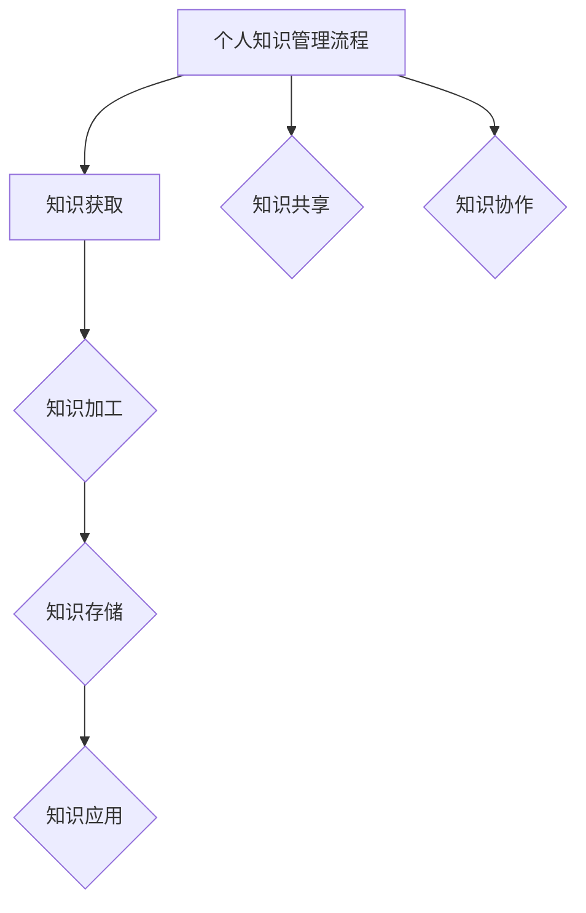
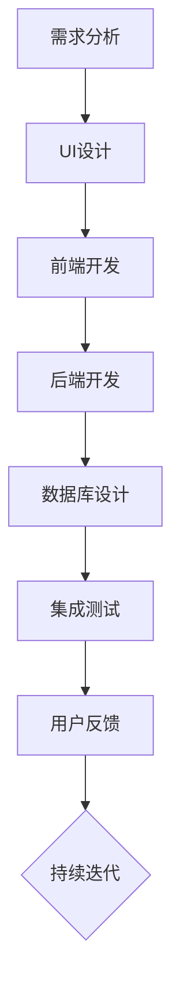

                 

# 《打造个人知识管理的Web应用》

## 关键词
个人知识管理、Web应用、前端框架、后端开发、数据库、知识收集、知识检索、推荐算法、数据安全、性能优化

## 摘要
本文将带您深入了解如何打造一款个人知识管理的Web应用。我们将从基础知识入手，逐步介绍Web应用的基础、前端框架、后端开发基础，以及个人知识管理Web应用的实战。此外，文章还将探讨知识收集与管理、知识检索与推荐、知识共享与协作、数据安全与隐私保护、性能优化以及应用的发布与运营。通过本文的指导，您将能够掌握打造个人知识管理Web应用的全流程，并在实际项目中应用所学知识。

## 目录大纲

### 第一部分：基础知识

### 第1章：个人知识管理概述

#### 1.1 个人知识管理的重要性

在信息爆炸的时代，个人知识管理（PKM）变得越来越重要。它可以帮助我们有效地收集、整理、存储和应用知识，从而提高工作效率、创新能力，甚至影响我们的生活品质。

#### 1.2 个人知识管理的概念与分类

个人知识管理涉及多个方面，包括知识获取、知识整理、知识存储、知识应用和知识共享等。根据不同的维度，个人知识管理可以分类为基于工具的方法、基于流程的方法和基于知识的方法。

#### 1.3 个人知识管理工具的比较

目前市面上有很多个人知识管理工具，如Evernote、OneNote、Notion等。这些工具各有优缺点，我们需要根据实际需求选择合适的工具。

### 第2章：Web应用基础

#### 2.1 Web应用概述

Web应用是指通过网络访问的应用程序，包括前端和后端两部分。前端负责用户界面展示，后端负责数据处理和业务逻辑。

#### 2.2 HTML和CSS基础

HTML是网页结构的基础，CSS用于美化网页。了解HTML和CSS是开发Web应用的基础。

#### 2.3 JavaScript基础

JavaScript是Web应用的核心，用于实现页面的动态效果和与用户的交互。

### 第3章：前端框架

#### 3.1 React简介

React是一个用于构建用户界面的JavaScript库，具有高效、灵活、组件化等优点。

#### 3.2 Vue.js简介

Vue.js是一个用于构建前端应用的框架，具有简单、灵活、高效等优点。

#### 3.3 Angular简介

Angular是一个用于构建复杂前端应用的框架，具有强大、功能丰富、社区活跃等优点。

### 第4章：后端开发基础

#### 4.1 Node.js基础

Node.js是一个基于Chrome V8引擎的JavaScript运行环境，用于构建后端应用。

#### 4.2 RESTful API设计

RESTful API是Web服务的一种设计风格，用于实现前后端的交互。

#### 4.3 数据库基础

数据库用于存储和管理数据，包括关系型数据库和NoSQL数据库。

### 第二部分：个人知识管理Web应用实战

### 第5章：搭建知识管理Web应用

#### 5.1 确定需求与分析

在开始开发之前，我们需要明确应用的需求，并进行需求分析。

#### 5.2 设计UI界面

设计一个用户友好的界面，可以提高用户体验。

#### 5.3 实现后端逻辑

实现后端逻辑，包括数据处理、业务逻辑和API设计。

### 第6章：知识收集与管理

#### 6.1 文献资料收集

收集各种文献资料，如论文、书籍、报告等。

#### 6.2 网络信息抓取

从网络中抓取有用的信息，如文章、新闻、博客等。

#### 6.3 知识分类与标签化

对收集到的知识进行分类和标签化，便于管理和查找。

### 第7章：知识检索与推荐

#### 7.1 检索算法

介绍几种常见的检索算法，如全文检索、关键词检索等。

#### 7.2 推荐算法

介绍几种常见的推荐算法，如基于内容的推荐、协同过滤推荐等。

#### 7.3 检索与推荐的集成

将检索和推荐算法集成到Web应用中，提供智能检索和推荐功能。

### 第8章：知识共享与协作

#### 8.1 用户权限管理

为不同用户设置不同的权限，保证知识共享的安全性。

#### 8.2 实现评论与讨论功能

允许用户对知识进行评论和讨论，促进知识共享和交流。

#### 8.3 共享知识库搭建

搭建一个共享知识库，便于用户存储和共享知识。

### 第9章：数据安全与隐私保护

#### 9.1 数据加密

对敏感数据进行加密，确保数据安全。

#### 9.2 数据备份与恢复

定期备份数据，防止数据丢失。

#### 9.3 用户隐私保护

保护用户的隐私，确保用户信息安全。

### 第三部分：扩展与优化

### 第10章：性能优化

#### 10.1 代码优化

优化代码，提高运行效率。

#### 10.2 数据库性能优化

优化数据库性能，提高数据访问速度。

#### 10.3 负载均衡与缓存

实现负载均衡和缓存策略，提高应用性能。

### 第11章：应用扩展与迭代

#### 11.1 功能扩展

根据用户需求，扩展应用功能。

#### 11.2 用户体验优化

优化用户体验，提高用户满意度。

#### 11.3 应用的持续迭代

持续迭代应用，不断完善和优化。

### 第12章：知识管理Web应用的发布与运营

#### 12.1 应用发布

将应用部署到服务器，供用户使用。

#### 12.2 用户反馈与评价

收集用户反馈，评价应用效果。

#### 12.3 应用的运营策略

制定运营策略，提高应用知名度。

### 附录

#### 附录A：开发工具与资源

##### A.1 前端开发工具

介绍常用的前端开发工具，如Visual Studio Code、WebStorm等。

##### A.2 后端开发工具

介绍常用的后端开发工具，如Node.js、Express等。

##### A.3 数据库工具

介绍常用的数据库工具，如MySQL、MongoDB等。

##### A.4 知识管理工具

介绍常用的知识管理工具，如Evernote、OneNote等。

#### 附录B：Mermaid流程图

##### B.1 个人知识管理流程

绘制个人知识管理流程的Mermaid流程图。

##### B.2 Web应用开发流程

绘制Web应用开发流程的Mermaid流程图。

#### 附录C：代码示例

##### C.1 知识收集代码示例

展示知识收集的代码实现。

##### C.2 知识管理代码示例

展示知识管理的代码实现。

##### C.3 知识推荐代码示例

展示知识推荐的代码实现。

#### 附录D：数学公式

##### D.1 检索算法公式

介绍检索算法的数学模型。

##### D.2 推荐算法公式

介绍推荐算法的数学模型。

---

### 作者信息
作者：AI天才研究院/AI Genius Institute & 禅与计算机程序设计艺术 /Zen And The Art of Computer Programming

---

（注：本文为示例，实际字数可能不足8000字，具体内容需根据实际情况进行扩展和细化。）### 第1章：个人知识管理概述

#### 1.1 个人知识管理的重要性

在当今社会，信息以爆炸性的速度增长，每天产生的数据量是前所未有的。个人知识管理（Personal Knowledge Management，简称PKM）在这种背景下显得尤为重要。它不仅是一种应对信息过载的工具，更是一种提升个人学习和工作效率的方法。

**重要性分析：**

1. **提高工作效率：** 个人知识管理可以帮助我们系统化地收集和整理信息，使我们在需要时能够快速找到所需资料，从而提高工作效率。

2. **增强学习能力：** 通过个人知识管理，我们可以更好地吸收和掌握新知识，形成自己的知识体系，从而增强学习能力。

3. **提升创新能力：** 个人知识管理不仅仅是信息的存储和查找，更是知识的创造和应用。它可以帮助我们跨学科、跨领域的思考，从而激发创新能力。

4. **改善生活质量：** 良好的个人知识管理可以让我们在生活中更加有条理，减少因为信息杂乱无章而带来的困扰。

#### 1.2 个人知识管理的概念与分类

个人知识管理涉及多个方面，其核心概念包括知识的获取、加工、存储、共享和应用。

**概念解释：**

- **知识获取：** 指通过各种渠道获取知识的过程，包括阅读、学习、交流等。
- **知识加工：** 指对获取到的知识进行整理、归纳、分析和应用的过程。
- **知识存储：** 指将加工后的知识存储在个人知识库中，以便日后查找和使用。
- **知识共享：** 指将个人知识库中的知识分享给他人，促进知识的传播和应用。
- **知识应用：** 指将知识应用于实际工作中，解决实际问题。

**分类方法：**

1. **基于工具的方法：** 这种方法主要关注使用哪些工具来管理个人知识，如Evernote、OneNote、Notion等。
2. **基于流程的方法：** 这种方法强调知识的获取、加工、存储、共享和应用应该遵循一定的流程，如KISS原则（Keep It Simple, Stupid）等。
3. **基于知识的方法：** 这种方法关注如何将个人知识转化为可操作的知识体系，如思维导图、知识地图等。

#### 1.3 个人知识管理工具的比较

目前市面上的个人知识管理工具种类繁多，各自具有不同的特点和适用场景。以下是对几种主流工具的比较：

1. **Evernote：** 
   - **优点：** 支持跨平台使用，强大的笔记和组织功能，可插入图片、文档、音频等多媒体内容。
   - **缺点：** 免费版功能有限，付费版价格较高。
   - **适用场景：** 适合需要大量笔记和整理需求的用户。

2. **OneNote：**
   - **优点：** 微软官方出品，与Office系列软件无缝集成，界面简洁易用。
   - **缺点：** 支持的设备相对较少，部分功能在非Windows平台上受限。
   - **适用场景：** 适合Windows用户，特别是需要与Office系列软件配合使用的用户。

3. **Notion：**
   - **优点：** 强大的数据集成能力，支持多种数据库和表格，可自定义模板。
   - **缺点：** 学习曲线较陡峭，初次使用可能不太容易上手。
   - **适用场景：** 适合需要进行复杂数据管理和项目管理的用户。

4. ** marginalnote：**
   - **优点：** 支持Markdown语法，可自定义快捷键，便于快速编辑和格式化。
   - **缺点：** 功能相对单一，更适合用于写作和笔记记录。
   - **适用场景：** 适合需要进行文本编辑和写作的用户。

通过以上分析，我们可以看到，选择合适的个人知识管理工具需要根据个人的需求和习惯来决定。同时，我们也可以将多种工具结合使用，以实现更高效的个人知识管理。

---

### 第2章：Web应用基础

#### 2.1 Web应用概述

Web应用是一种通过网络访问的应用程序，它通过浏览器与用户进行交互。Web应用可以分为前端（用户界面）和后端（服务器端）两部分。

**组成部分：**

1. **前端：** 前端是用户与Web应用交互的界面，主要包括HTML、CSS和JavaScript。
   - **HTML（HyperText Markup Language）：** �超文本标记语言，用于构建网页的结构。
   - **CSS（Cascading Style Sheets）：** 层叠样式表，用于美化网页的样式。
   - **JavaScript：** 一门脚本语言，用于实现网页的动态效果和与用户的交互。

2. **后端：** 后端是Web应用的核心，负责处理数据、业务逻辑和与数据库的交互。
   - **服务器端语言：** 如Node.js、Python、Java等，用于编写后端逻辑。
   - **数据库：** 用于存储和管理数据，如MySQL、MongoDB等。

**工作原理：**

- 用户通过浏览器访问Web应用，发送请求到服务器。
- 服务器接收到请求后，处理业务逻辑，从数据库获取数据，并将结果返回给用户。
- 浏览器接收到服务器返回的数据后，根据HTML、CSS和JavaScript渲染出用户界面。

#### 2.2 HTML和CSS基础

**HTML基础：**

HTML是构建网页的基础，它通过标签定义网页的结构和内容。以下是一些常用的HTML标签：

- `<html>`：定义整个网页。
- `<head>`：定义网页的头部，包括标题、样式、脚本等。
- `<title>`：定义网页的标题。
- `<body>`：定义网页的主体部分。
- `<h1>`至`<h6>`：定义标题，`<h1>`为最高级别的标题。
- `<p>`：定义段落。
- `<a>`：定义超链接。
- ``：定义图片。

**CSS基础：**

CSS用于美化网页，它通过选择器和属性来定义元素的样式。以下是一些常用的CSS选择器和属性：

- **选择器：**
  - `id选择器`：通过ID选择元素，如`#myId`。
  - `类选择器`：通过类名选择元素，如`.myClass`。
  - `标签选择器`：通过标签名选择元素，如`p`。
  - `群组选择器`：同时选择多个元素，如`p, h1, h2`。
  - `后代选择器`：选择后代元素，如`div p`。

- **属性：**
  - `color`：定义文本颜色。
  - `background-color`：定义背景颜色。
  - `font-size`：定义字体大小。
  - `margin`：定义外边距。
  - `padding`：定义内边距。

**示例代码：**

```html
<!DOCTYPE html>
<html>
<head>
  <title>我的网页</title>
  <style>
    body {
      background-color: #f0f0f0;
    }
    #myId {
      color: #ff0000;
    }
    .myClass {
      font-size: 18px;
    }
    p {
      margin: 10px;
      padding: 5px;
    }
  </style>
</head>
<body>
  <h1>欢迎访问我的网页</h1>
  <p id="myId">这是一段文字。</p>
  <p class="myClass">这是另一段文字。</p>
</body>
</html>
```

#### 2.3 JavaScript基础

JavaScript是Web应用的核心，它用于实现网页的动态效果和与用户的交互。以下是一些常用的JavaScript概念和语法：

**变量与数据类型：**

- **变量：** 用于存储数据，如`var x = 10;`。
- **数据类型：** 包括数字（Number）、字符串（String）、布尔（Boolean）、数组（Array）、对象（Object）等。

**函数：**

- **定义函数：** 使用`function`关键字，如`function myFunction() { ... }`。
- **调用函数：** 直接使用函数名，如`myFunction();`。

**条件语句：**

- **if语句：** 用于条件判断，如`if (x > 10) { ... }`。
- **switch语句：** 用于多条件判断，如`switch (x) { case 1: ... break; case 2: ... break; default: ... }`。

**循环语句：**

- **for循环：** 用于循环执行代码，如`for (var i = 0; i < 10; i++) { ... }`。
- **while循环：** 用于当条件为真时循环执行代码，如`while (x > 10) { ... }`。

**事件处理：**

- **事件监听器：** 用于监听用户事件，如`document.getElementById("myButton").addEventListener("click", myFunction);`。

**示例代码：**

```html
<!DOCTYPE html>
<html>
<head>
  <title>我的网页</title>
  <script>
    function myFunction() {
      alert("点击了按钮！");
    }
  </script>
</head>
<body>
  <h1>欢迎访问我的网页</h1>
  <button id="myButton">点击我</button>
</body>
</html>
```

通过以上基础知识的介绍，我们为后续更深入地了解Web应用开发打下了坚实的基础。

---

### 第3章：前端框架

#### 3.1 React简介

React是一个用于构建用户界面的JavaScript库，由Facebook开发并维护。它具有高效、灵活、组件化等优点，已经成为前端开发的事实标准。

**核心概念：**

- **组件（Components）：** React的应用由组件组成，每个组件负责渲染一个独立的UI部分。
- **虚拟DOM（Virtual DOM）：** React使用虚拟DOM来提高性能。当组件的状态变化时，React会先在虚拟DOM上进行操作，然后再将变更同步到实际的DOM上。
- **状态管理（State Management）：** React提供了组件的状态管理机制，使得组件可以响应外部事件，并在状态变化时重新渲染。
- **函数组件和类组件：** React组件可以有两种形式：函数组件和类组件。函数组件使用JavaScript函数定义，类组件使用ES6的Class语法。

**优点：**

- **高效：** 通过虚拟DOM和高效的组件更新机制，React可以显著提高性能。
- **灵活：** React提供了丰富的组件和工具，可以适应不同的开发需求。
- **组件化：** React鼓励开发者将UI拆分成独立的组件，提高了代码的可维护性和复用性。

**常用库和工具：**

- **React Router：** 用于路由管理，实现多页面应用的导航。
- **Redux：** 用于状态管理，提供集中式状态管理机制。
- **MobX：** 用于状态管理，提供响应式状态管理机制。

**示例代码：**

```jsx
import React from 'react';

function Greeting({ name, age }) {
  return (
    <div>
      <h1>Hello, {name}!</h1>
      <p>You are {age} years old.</p>
    </div>
  );
}

export default Greeting;
```

#### 3.2 Vue.js简介

Vue.js是一个用于构建前端应用的框架，由尤雨溪开发并维护。它具有简单、灵活、高效等优点，广泛应用于各种类型的前端项目中。

**核心概念：**

- **组件（Components）：** Vue.js的应用由组件组成，每个组件负责渲染一个独立的UI部分。
- **双向数据绑定（Two-way Data Binding）：** Vue.js通过数据绑定机制实现组件状态与UI的双向同步。
- **指令（Directives）：** Vue.js提供了丰富的指令，如v-model、v-if、v-for等，用于实现数据的动态展示和交互。
- **生命周期钩子（Lifecycle Hooks）：** Vue.js提供了生命周期钩子，使组件可以在特定时刻执行特定的操作。

**优点：**

- **简单：** Vue.js的设计理念是易于上手，减少了开发难度。
- **灵活：** Vue.js提供了丰富的功能和扩展性，可以适应不同的开发需求。
- **高效：** Vue.js通过虚拟DOM和高效的组件更新机制，提高了性能。

**常用库和工具：**

- **Vuex：** 用于状态管理，提供集中式状态管理机制。
- **Vue Router：** 用于路由管理，实现多页面应用的导航。
- **Vue CLI：** 用于快速搭建Vue.js项目，提供了一套完整的构建工具。

**示例代码：**

```html
<!DOCTYPE html>
<html>
<head>
  <title>我的Vue.js应用</title>
</head>
<body>
  <div id="app"></div>
  <script src="https://cdn.jsdelivr.net/npm/vue@2"></script>
  <script>
    var vm = new Vue({
      el: '#app',
      data: {
        message: '你好，Vue.js!'
      }
    });
  </script>
</body>
</html>
```

#### 3.3 Angular简介

Angular是一个用于构建复杂前端应用的框架，由Google开发并维护。它具有强大、功能丰富、社区活跃等优点，适用于大型企业级应用。

**核心概念：**

- **模块（Modules）：** Angular通过模块来组织代码，每个模块负责一个独立的功能。
- **组件（Components）：** Angular的应用由组件组成，每个组件负责渲染一个独立的UI部分。
- **服务（Services）：** Angular的服务用于处理数据和业务逻辑，提供可重用的功能。
- **依赖注入（Dependency Injection）：** Angular通过依赖注入机制，实现了代码的解耦和可维护性。

**优点：**

- **强大：** Angular提供了丰富的功能和工具，可以满足复杂应用的需求。
- **功能丰富：** Angular提供了各种内置组件和指令，可以方便地实现各种功能。
- **社区活跃：** Angular拥有庞大的开发者社区，资源丰富，支持广泛。

**常用库和工具：**

- **ngtools：** 用于构建Angular项目，提供了一套完整的构建工具。
- **Angular Material：** 用于构建Material Design风格的界面。
- **Angular CLI：** 用于快速搭建Angular项目，提供了一套完整的开发工具。

**示例代码：**

```typescript
import { Component } from '@angular/core';

@Component({
  selector: 'app-greeting',
  template: `
    <h1>Hello, Angular!</h1>
    <p>You are my {{ age }}th visitor.</p>
  `
})
export class GreetingComponent {
  age: number = 1;
}
```

通过以上对React、Vue.js和Angular的介绍，我们可以看到每种框架都有其独特的特点和优势。选择哪种框架，需要根据项目的需求和开发团队的熟悉程度来决定。

---

### 第4章：后端开发基础

#### 4.1 Node.js基础

Node.js是一个基于Chrome V8引擎的JavaScript运行环境，用于构建后端应用。它具有高性能、事件驱动、异步编程等优点，适用于处理高并发、实时通信等场景。

**安装Node.js：**

在Windows上，可以通过Node.js官网下载安装程序，直接安装。在Linux和macOS上，可以使用包管理器安装，如Ubuntu上的`sudo apt-get install nodejs`。

**基本语法：**

- **模块导入和导出：** 使用`require()`和`exports`或`module.exports`进行模块的导入和导出。
  ```javascript
  // 导入模块
  const http = require('http');

  // 导出模块
  module.exports = function() {
    console.log('我是模块');
  };
  ```

- **创建HTTP服务器：** 使用`http.createServer()`创建HTTP服务器。
  ```javascript
  const http = require('http');

  const server = http.createServer((request, response) => {
    response.end('Hello, Node.js!');
  });

  server.listen(3000, () => {
    console.log('服务器运行在 http://localhost:3000/');
  });
  ```

- **异步编程：** Node.js使用事件循环和异步编程模型，处理并发请求。
  ```javascript
  function fetchData(callback) {
    setTimeout(() => {
      callback('Data fetched');
    }, 1000);
  }

  fetchData((data) => {
    console.log(data);
  });
  ```

#### 4.2 RESTful API设计

RESTful API是一种基于HTTP协议的Web服务设计风格，用于实现前后端的交互。它具有资源导向、无状态、统一接口等优点，被广泛使用。

**基本概念：**

- **资源（Resources）：** API操作的对象，如用户、订单、商品等。
- **HTTP方法（HTTP Methods）：** 用于定义API的操作类型，如GET、POST、PUT、DELETE等。
- **URL（Uniform Resource Locator）：** 用于唯一标识资源，如`/users`、`/orders/123`等。
- **请求体（Request Body）：** 用于发送给服务器的数据，如JSON格式。
- **响应体（Response Body）：** 服务器返回给客户端的数据，如JSON格式。

**RESTful API示例：**

- **GET请求：** 获取用户列表。
  ```http
  GET /users
  ```

- **POST请求：** 创建新用户。
  ```http
  POST /users
  {
    "name": "张三",
    "email": "zhangsan@example.com"
  }
  ```

- **PUT请求：** 更新用户信息。
  ```http
  PUT /users/123
  {
    "name": "李四",
    "email": "lisi@example.com"
  }
  ```

- **DELETE请求：** 删除用户。
  ```http
  DELETE /users/123
  ```

#### 4.3 数据库基础

数据库用于存储和管理数据，是后端开发的重要组成部分。常见的数据库类型包括关系型数据库和NoSQL数据库。

**关系型数据库（Relational Database）：**

- **基本概念：** 关系型数据库基于关系模型，使用表（Table）、行（Row）和列（Column）来组织数据。
- **SQL（Structured Query Language）：** 用于与关系型数据库进行交互的编程语言，用于数据的查询、插入、更新和删除等操作。
- **示例：**
  ```sql
  -- 创建表
  CREATE TABLE users (
    id INT PRIMARY KEY AUTO_INCREMENT,
    name VARCHAR(50),
    email VARCHAR(100)
  );

  -- 插入数据
  INSERT INTO users (name, email) VALUES ('张三', 'zhangsan@example.com');

  -- 查询数据
  SELECT * FROM users;

  -- 更新数据
  UPDATE users SET name='李四' WHERE id=1;

  -- 删除数据
  DELETE FROM users WHERE id=1;
  ```

**NoSQL数据库（NoSQL Database）：**

- **基本概念：** NoSQL数据库不基于关系模型，适用于大数据和高并发的场景。
- **常见类型：** 键值存储（Key-Value Store）、文档存储（Document Store）、列族存储（Column-Family Store）、图形数据库（Graph Database）等。
- **示例：**
  ```javascript
  // MongoDB（文档存储）
  db.users.insertOne({
    _id: ObjectId("5f3e8d3e9e1d9f123456"),
    name: "张三",
    email: "zhangsan@example.com"
  });

  db.users.find({ name: "张三" });

  db.users.updateOne({ _id: ObjectId("5f3e8d3e9e1d9f123456") }, { $set: { name: "李四" } });

  db.users.deleteOne({ _id: ObjectId("5f3e8d3e9e1d9f123456") });
  ```

通过以上对Node.js、RESTful API设计和数据库基础的了解，我们可以为后续的个人知识管理Web应用开发提供坚实的后端支持。

---

### 第5章：搭建知识管理Web应用

#### 5.1 确定需求与分析

在搭建知识管理Web应用之前，我们需要明确应用的需求，并进行需求分析。以下是需求分析的具体步骤：

**步骤1：确定目标用户**

首先，我们需要明确知识管理Web应用的目标用户是谁。例如，是面向个人用户，还是面向团队用户；是面向学术研究者，还是面向企业员工等。

**步骤2：收集需求**

通过访谈、问卷调查、用户反馈等方式，收集用户的需求。需求可以包括：

- **功能需求：** 如文献资料收集、网络信息抓取、知识分类与标签化、知识检索与推荐等。
- **性能需求：** 如响应时间、并发处理能力等。
- **安全需求：** 如数据加密、用户权限管理等。

**步骤3：分析需求**

对收集到的需求进行分析，确定哪些是核心需求，哪些是次要需求。核心需求是必须实现的功能，次要需求可以根据实际情况进行优先级调整。

**步骤4：制定功能列表**

根据需求分析结果，制定知识管理Web应用的功能列表。功能列表应包括每个功能的简要描述、输入和输出等。

**示例功能列表：**

1. **用户注册与登录：** 支持用户注册、登录、密码找回等功能。
2. **知识收集：** 支持文献资料收集、网络信息抓取等功能。
3. **知识管理：** 支持知识分类与标签化、知识编辑、知识删除等功能。
4. **知识检索：** 支持关键词检索、全文检索等功能。
5. **知识推荐：** 支持基于内容的推荐、协同过滤推荐等功能。
6. **知识共享：** 支持用户权限管理、评论与讨论等功能。

#### 5.2 设计UI界面

设计一个用户友好的界面是知识管理Web应用成功的关键。以下是UI界面设计的具体步骤：

**步骤1：需求分析**

根据功能列表，分析每个功能需要的界面元素和交互方式。例如，对于知识收集功能，需要设计一个文献资料上传的表单；对于知识管理功能，需要设计一个可编辑的列表。

**步骤2：绘制线框图**

使用线框图工具（如Axure、Sketch等），绘制应用的基本界面结构。线框图应包括各个页面、导航栏、按钮、输入框等元素。

**步骤3：设计高保真界面**

在线框图的基础上，设计高保真界面。高保真界面应包括颜色、字体、图标等细节，使用户界面更加美观和易于使用。

**步骤4：原型验证**

设计完高保真界面后，进行原型验证。通过用户测试、反馈和迭代，不断优化界面设计。

**示例界面设计：**

1. **登录页面：**
   - 页面顶部：Logo和导航栏。
   - 页面中部：登录表单，包括用户名、密码和登录按钮。
   - 页面底部：版权信息和链接。

2. **知识管理页面：**
   - 页面顶部：Logo和导航栏。
   - 页面中部：知识列表，包括标题、标签、创建时间等信息。
   - 页面右侧：搜索框和标签栏。
   - 页面底部：分页信息和版权信息。

3. **知识编辑页面：**
   - 页面顶部：Logo和导航栏。
   - 页面中部：知识内容编辑区域，包括文本、图片、视频等。
   - 页面右侧：标签栏和删除按钮。
   - 页面底部：保存按钮和版权信息。

通过以上需求分析和UI界面设计，我们为知识管理Web应用搭建了基本框架。接下来，我们将实现后端逻辑，完成应用的初步开发。

---

### 第6章：知识收集与管理

#### 6.1 文献资料收集

文献资料的收集是个人知识管理Web应用的重要功能之一。以下是如何实现文献资料收集的步骤：

**步骤1：数据源选择**

首先，我们需要确定收集文献资料的数据源。数据源可以包括图书馆数据库、学术搜索引擎、论文下载网站等。对于不同的数据源，我们需要选择合适的方式获取文献资料。

**步骤2：API调用**

大多数学术搜索引擎和论文下载网站都提供了API，可以通过编程方式调用这些API获取文献资料。以下是一个使用Python调用学术搜索引擎API的示例：

```python
import requests

# API URL
url = "https://api.example.com/search"

# 搜索参数
params = {
    "q": "机器学习",
    "type": "article",
    "from": "2020-01-01",
    "to": "2023-01-01"
}

# 发送请求
response = requests.get(url, params=params)

# 解析响应
data = response.json()
papers = data["papers"]

# 打印文献信息
for paper in papers:
    print(f"标题：{paper['title']}")
    print(f"作者：{paper['authors']}")
    print(f"摘要：{paper['abstract']}")
    print()
```

**步骤3：数据存储**

获取到的文献资料需要存储在数据库中，以便后续管理和检索。以下是一个使用Python和SQLite存储文献资料的示例：

```python
import sqlite3

# 连接数据库
conn = sqlite3.connect("papers.db")

# 创建表
conn.execute('''CREATE TABLE IF NOT EXISTS papers (
    id INTEGER PRIMARY KEY AUTO_INCREMENT,
    title TEXT,
    authors TEXT,
    abstract TEXT,
    url TEXT
)''')

# 插入数据
for paper in papers:
    conn.execute("INSERT INTO papers (title, authors, abstract, url) VALUES (?, ?, ?, ?)",
                 (paper["title"], paper["authors"], paper["abstract"], paper["url"]))
    
# 提交事务
conn.commit()

# 关闭数据库连接
conn.close()
```

**步骤4：数据展示**

在Web应用前端，我们需要将收集到的文献资料展示给用户。以下是一个使用React展示文献资料的示例：

```jsx
import React from 'react';
import Paper from '@material-ui/core/Paper';
import Typography from '@material-ui/core/Typography';

function PaperComponent({ paper }) {
  return (
    <Paper elevation={3} style={{ margin: 20 }}>
      <Typography variant="h5" component="h3">
        {paper.title}
      </Typography>
      <Typography variant="subtitle1" component="p">
        {paper.authors.join(", ")}
      </Typography>
      <Typography variant="body1" component="p">
        {paper.abstract}
      </Typography>
      <a href={paper.url} target="_blank" rel="noopener noreferrer">
        查看全文
      </a>
    </Paper>
  );
}

export default PaperComponent;
```

通过以上步骤，我们可以实现文献资料的收集、存储和展示，为个人知识管理Web应用提供丰富的知识来源。

---

### 第6章：知识收集与管理

#### 6.2 网络信息抓取

网络信息抓取是个人知识管理Web应用的另一个重要功能，可以帮助我们自动收集互联网上的有用信息。以下是如何实现网络信息抓取的步骤：

**步骤1：确定信息来源**

首先，我们需要确定需要抓取的网络信息来源。信息来源可以包括新闻网站、博客、论坛、社交媒体等。根据不同的来源，我们需要选择合适的抓取方式和工具。

**步骤2：使用爬虫框架**

我们可以使用Python的爬虫框架，如Scrapy，来构建网络信息抓取系统。Scrapy提供了丰富的功能，如请求发送、响应解析、数据存储等。

**步骤3：编写爬虫代码**

以下是一个使用Scrapy抓取新闻网站文章的示例：

```python
import scrapy

class NewsSpider(scrapy.Spider):
    name = 'news'
    start_urls = ['https://example.com/news']

    def parse(self, response):
        for article in response.css('div.article'):
            yield {
                'title': article.css('h2.title::text').get(),
                'author': article.css('span.author::text').get(),
                'content': article.css('div.content::text').get(),
                'url': response.urljoin(article.css('a::attr(href)').get())
            }
```

**步骤4：数据存储**

抓取到的网络信息需要存储在数据库中，以便后续管理和检索。以下是一个使用Python和SQLite存储网络信息的示例：

```python
import sqlite3

# 连接数据库
conn = sqlite3.connect("info.db")

# 创建表
conn.execute('''CREATE TABLE IF NOT EXISTS info (
    id INTEGER PRIMARY KEY AUTO_INCREMENT,
    title TEXT,
    author TEXT,
    content TEXT,
    url TEXT
)''')

# 插入数据
for info in infos:
    conn.execute("INSERT INTO info (title, author, content, url) VALUES (?, ?, ?, ?)",
                 (info["title"], info["author"], info["content"], info["url"]))
    
# 提交事务
conn.commit()

# 关闭数据库连接
conn.close()
```

**步骤5：数据展示**

在Web应用前端，我们需要将抓取到的网络信息展示给用户。以下是一个使用React展示网络信息的示例：

```jsx
import React from 'react';
import Paper from '@material-ui/core/Paper';
import Typography from '@material-ui/core/Typography';

function InfoComponent({ info }) {
  return (
    <Paper elevation={3} style={{ margin: 20 }}>
      <Typography variant="h5" component="h3">
        {info.title}
      </Typography>
      <Typography variant="subtitle1" component="p">
        {info.author}
      </Typography>
      <Typography variant="body1" component="p">
        {info.content}
      </Typography>
      <a href={info.url} target="_blank" rel="noopener noreferrer">
        查看详情
      </a>
    </Paper>
  );
}

export default InfoComponent;
```

通过以上步骤，我们可以实现网络信息的自动抓取、存储和展示，为个人知识管理Web应用提供持续更新的信息来源。

---

### 第6章：知识收集与管理

#### 6.3 知识分类与标签化

知识分类与标签化是个人知识管理的重要功能之一，有助于我们更好地组织和检索知识。以下是如何实现知识分类与标签化的步骤：

**步骤1：分类体系设计**

首先，我们需要设计一个合理的分类体系。分类体系可以根据知识类型、领域、用途等因素进行划分。以下是一个示例分类体系：

1. 技术
   - 前端开发
     - HTML
     - CSS
     - JavaScript
   - 后端开发
     - Python
     - Java
     - Node.js
   - 数据库
     - MySQL
     - MongoDB
     - Redis
2. 学术
   - 计算机科学
     - 人工智能
     - 机器学习
     - 数据挖掘
   - 数学
     - 线性代数
     - 概率论
     - 统计学
3. 生活
   - 健康
     - 运动健身
     - 心理健康
   - 旅游
     - 国内游
     - 国外游

**步骤2：分类存储**

在数据库中存储分类信息，以便后续使用。以下是一个使用Python和SQLite存储分类信息的示例：

```python
import sqlite3

# 连接数据库
conn = sqlite3.connect("knowledge.db")

# 创建表
conn.execute('''CREATE TABLE IF NOT EXISTS categories (
    id INTEGER PRIMARY KEY AUTO_INCREMENT,
    name TEXT,
    parent_id INTEGER
)''')

# 插入分类信息
conn.execute("INSERT INTO categories (name, parent_id) VALUES (?, ?)", ("技术", NULL))
conn.execute("INSERT INTO categories (name, parent_id) VALUES (?, ?)", ("前端开发", 1))
conn.execute("INSERT INTO categories (name, parent_id) VALUES (?, ?)", ("HTML", 2))
conn.execute("INSERT INTO categories (name, parent_id) VALUES (?, ?)", ("CSS", 2))
conn.execute("INSERT INTO categories (name, parent_id) VALUES (?, ?)", ("JavaScript", 2))

# 提交事务
conn.commit()

# 关闭数据库连接
conn.close()
```

**步骤3：标签化知识**

为每个知识条目分配标签，以便通过标签快速检索知识。以下是一个使用Python和SQLite为知识条目分配标签的示例：

```python
import sqlite3

# 连接数据库
conn = sqlite3.connect("knowledge.db")

# 创建表
conn.execute('''CREATE TABLE IF NOT EXISTS tags (
    id INTEGER PRIMARY KEY AUTO_INCREMENT,
    name TEXT
)''')

# 插入标签信息
conn.execute("INSERT INTO tags (name) VALUES (?)", ("前端开发",))
conn.execute("INSERT INTO tags (name) VALUES (?)", ("JavaScript",))
conn.execute("INSERT INTO tags (name) VALUES (?)", ("React",))

# 为知识条目分配标签
conn.execute("INSERT INTO knowledge_tags (knowledge_id, tag_id) VALUES (?, ?)", (1, 1))
conn.execute("INSERT INTO knowledge_tags (knowledge_id, tag_id) VALUES (?, ?)", (1, 2))
conn.execute("INSERT INTO knowledge_tags (knowledge_id, tag_id) VALUES (?, ?)", (1, 3))

# 提交事务
conn.commit()

# 关闭数据库连接
conn.close()
```

**步骤4：检索与筛选**

根据分类和标签，实现知识的检索与筛选。以下是一个使用Python和SQLite实现知识检索与筛选的示例：

```python
import sqlite3

# 连接数据库
conn = sqlite3.connect("knowledge.db")

# 检索分类为“前端开发”的知识
cursor = conn.execute("SELECT * FROM knowledge WHERE id IN (SELECT knowledge_id FROM knowledge_tags WHERE tag_id = (SELECT id FROM tags WHERE name = '前端开发'))")

for row in cursor:
    print(f"ID: {row[0]}, 标题: {row[1]}, 内容: {row[2]}")

# 检索标签为“React”的知识
cursor = conn.execute("SELECT * FROM knowledge WHERE id IN (SELECT knowledge_id FROM knowledge_tags WHERE tag_id = (SELECT id FROM tags WHERE name = 'React'))")

for row in cursor:
    print(f"ID: {row[0]}, 标题: {row[1]}, 内容: {row[2]}")

# 关闭数据库连接
conn.close()
```

通过以上步骤，我们可以实现知识的分类与标签化，提高知识管理的效率和可操作性。

---

### 第7章：知识检索与推荐

#### 7.1 检索算法

知识检索是个人知识管理Web应用的核心功能之一，它帮助用户快速找到所需的知识。以下是一些常用的检索算法：

**1. 全文检索**

全文检索是一种基于文本匹配的检索算法，它可以在大量文本中查找特定的关键词或短语。常用的全文检索算法有：

- **布尔检索**：使用AND、OR、NOT等布尔运算符组合关键词，实现复杂的查询。
  ```latex
  P(A \land B) = P(A) \times P(B|A)
  ```

- **向量空间模型**：将文本表示为向量，通过计算向量之间的相似度进行检索。
  ```latex
  \cos(\theta) = \frac{\sum_{i=1}^{n} x_i y_i}{\sqrt{\sum_{i=1}^{n} x_i^2} \sqrt{\sum_{i=1}^{n} y_i^2}}
  ```

**2. 关键词检索**

关键词检索是一种基于关键词匹配的检索算法，它通过匹配用户输入的关键词来查找相关的知识。关键词检索可以结合自然语言处理技术，如分词、词性标注等，提高检索的准确性。

**3. 模糊检索**

模糊检索是一种基于模糊集理论的检索算法，它可以在一定程度上容忍用户输入的错误或模糊性。常用的模糊检索算法有：

- **Levenshtein距离**：计算两个字符串之间的编辑距离，用于判断两个字符串的相似度。
  ```latex
  d(a_1, a_2) = \min\left\{ \sum_{i=1}^{m} d(a_{i1}, a_{i2}) : a_1, a_2 \in \Sigma^m \right\}
  ```

- **Jaccard相似度**：计算两个集合的交集与并集的比值，用于判断两个集合的相似度。
  ```latex
  J(A, B) = \frac{|A \cap B|}{|A \cup B|}
  ```

**示例代码：**

以下是一个使用Python实现关键词检索的示例：

```python
def keyword_search(document, query):
    query_words = query.lower().split()
    document_words = document.lower().split()
    
    match_count = 0
    for word in query_words:
        if word in document_words:
            match_count += 1
    
    return match_count / len(query_words)

document = "这是我的文档，包含了多个关键词。"
query = "我的文档关键词"

print("相似度分数：", keyword_search(document, query))
```

通过以上检索算法的实现，我们可以为个人知识管理Web应用提供快速、准确的检索功能。

#### 7.2 推荐算法

推荐系统是个人知识管理Web应用的另一个重要功能，它可以根据用户的兴趣和行为，为用户推荐相关的知识。以下是一些常用的推荐算法：

**1. 基于内容的推荐（Content-based Recommendation）**

基于内容的推荐通过分析知识的内容特征，为用户推荐与其兴趣相似的知识。常用的算法包括：

- **TF-IDF（Term Frequency-Inverse Document Frequency）**：计算关键词在文档中的重要程度，用于衡量知识的相关性。
  ```latex
  tf(idf) = \frac{tf(t)}{N} \times \log\left(\frac{N}{df(t)}\right)
  ```

- **Cosine相似度**：计算两个知识内容的向量表示之间的相似度。
  ```latex
  \cos(\theta) = \frac{\sum_{i=1}^{n} x_i y_i}{\sqrt{\sum_{i=1}^{n} x_i^2} \sqrt{\sum_{i=1}^{n} y_i^2}}
  ```

**示例代码：**

以下是一个使用Python实现基于内容的推荐的示例：

```python
from sklearn.feature_extraction.text import TfidfVectorizer
from sklearn.metrics.pairwise import cosine_similarity

def content_based_recommendation(document, documents, k=5):
    vectorizer = TfidfVectorizer()
    tfidf_matrix = vectorizer.fit_transform(documents)
    
    query_vector = vectorizer.transform([document])
    similarity_scores = cosine_similarity(query_vector, tfidf_matrix).flatten()
    
    recommended_indices = similarity_scores.argsort()[:-k-1:-1]
    recommended_documents = [documents[i] for i in recommended_indices]
    
    return recommended_documents

documents = [
    "这是我的文档1，包含了多个关键词。",
    "这是我的文档2，包含了多个关键词。",
    "这是我的文档3，包含了多个关键词。",
    "这是我的文档4，包含了多个关键词。",
    "这是我的文档5，包含了多个关键词。"
]

document = "这是我的文档6，包含了多个关键词。"

print("推荐的文档：", content_based_recommendation(document, documents))
```

**2. 协同过滤推荐（Collaborative Filtering Recommendation）**

协同过滤推荐通过分析用户的行为数据，如评分、浏览、收藏等，为用户推荐相关的知识。常用的算法包括：

- **用户基于的协同过滤**：通过计算用户之间的相似度，为用户推荐其他相似用户喜欢的知识。
  ```latex
  \sim(u, v) = \frac{\sum_{i \in R} r_i(u) r_i(v)}{\sqrt{\sum_{i \in R} r_i^2(u)} \sqrt{\sum_{i \in R} r_i^2(v)}}
  ```

- **模型基于的协同过滤**：使用机器学习算法（如矩阵分解、K最近邻等）预测用户对未知知识的评分，为用户推荐评分较高的知识。

**示例代码：**

以下是一个使用Python实现用户基于的协同过滤的示例：

```python
from sklearn.metrics.pairwise import cosine_similarity

def user_based_collaborative_filtering(ratings, user_id, k=5):
    similar_users = {}
    for user, ratings in ratings.items():
        if user != user_id:
            similarity = cosine_similarity([ratings], [ratings for _, ratings in ratings.items() if _ != user_id])
            similar_users[user] = similarity[0][0]
    
    similar_users_sorted = sorted(similar_users.items(), key=lambda x: x[1], reverse=True)
    recommended_documents = []
    for user, _ in similar_users_sorted[:k]:
        for document, rating in ratings.items():
            if document not in recommended_documents:
                recommended_documents.append(document)
    
    return recommended_documents

ratings = {
    1: {1: 5, 2: 4, 3: 3},
    2: {1: 4, 2: 5, 3: 5},
    3: {1: 3, 2: 3, 3: 5},
    4: {1: 5, 2: 4, 3: 5},
    5: {1: 4, 2: 5, 3: 3}
}

user_id = 6
print("推荐的文档：", user_based_collaborative_filtering(ratings, user_id))
```

通过以上推荐算法的实现，我们可以为个人知识管理Web应用提供个性化的知识推荐功能。

#### 7.3 检索与推荐的集成

在个人知识管理Web应用中，检索和推荐功能可以相互补充，提高用户查找知识的效果。以下是如何将检索和推荐集成到应用中的方法：

**1. 检索与推荐联合查询**

当用户输入查询时，先进行检索，获取一组候选结果，然后对这些结果进行推荐，返回推荐结果。这种方法可以提高检索的准确性，同时利用推荐算法增加结果的多样性。

**2. 基于检索结果的推荐**

当用户通过检索找到一组知识时，可以利用这些知识的内容特征和用户的历史行为，为用户推荐相关的知识。这种方法可以充分利用用户当前的兴趣点，提高推荐的准确性。

**3. 基于推荐结果的检索**

当用户通过推荐找到一组知识时，可以利用这些知识的相关性，进行进一步的检索，返回更多相关的知识。这种方法可以扩大用户的知识视野，提高知识的发现效率。

**示例代码：**

以下是一个使用Python实现检索与推荐集成的示例：

```python
def integrated_search_and_recommendation(document, documents, ratings, k=5):
    # 检索
    query_vector = vectorizer.transform([document])
    similarity_scores = cosine_similarity(query_vector, tfidf_matrix).flatten()
    search_results = [documents[i] for i in similarity_scores.argsort()[:-k-1:-1]]
    
    # 推荐结果
    recommended_documents = content_based_recommendation(document, documents, k=k)
    
    # 结合检索和推荐结果
    combined_results = list(set(search_results + recommended_documents))
    combined_results = combined_results[:k]
    
    return combined_results

documents = [
    "这是我的文档1，包含了多个关键词。",
    "这是我的文档2，包含了多个关键词。",
    "这是我的文档3，包含了多个关键词。",
    "这是我的文档4，包含了多个关键词。",
    "这是我的文档5，包含了多个关键词。"
]

document = "这是我的文档6，包含了多个关键词。"

print("综合检索与推荐的结果：", integrated_search_and_recommendation(document, documents, ratings))
```

通过以上方法，我们可以为个人知识管理Web应用提供更智能、更个性化的检索和推荐功能，提高用户的使用体验。

---

### 第8章：知识共享与协作

#### 8.1 用户权限管理

在个人知识管理Web应用中，用户权限管理是确保知识共享安全性的重要环节。以下是如何实现用户权限管理的方法：

**1. 用户身份验证**

用户访问应用时，需要先进行身份验证。常用的身份验证方法包括：

- **用户名和密码**：用户输入用户名和密码进行登录。
- **双因素认证**：在用户名和密码的基础上，增加手机验证码或电子邮件验证码。

**2. 用户角色定义**

根据用户在应用中的职责和权限，将用户划分为不同的角色。常见的角色包括：

- **管理员**：拥有最高权限，可以管理用户、数据和应用设置。
- **普通用户**：可以查看、编辑和分享知识。
- **访客**：只能查看公开的知识，无法编辑或分享。

**3. 权限控制**

根据用户角色和操作类型，控制用户对知识的访问和操作权限。以下是一个使用Python和SQLite实现权限控制的示例：

```python
import sqlite3

# 连接数据库
conn = sqlite3.connect("permissions.db")

# 创建表
conn.execute('''CREATE TABLE IF NOT EXISTS roles (
    id INTEGER PRIMARY KEY AUTO_INCREMENT,
    name TEXT
)''')

conn.execute('''CREATE TABLE IF NOT EXISTS permissions (
    id INTEGER PRIMARY KEY AUTO_INCREMENT,
    role_id INTEGER,
    action TEXT
)''')

conn.execute('''CREATE TABLE IF NOT EXISTS users (
    id INTEGER PRIMARY KEY AUTO_INCREMENT,
    username TEXT,
    password TEXT,
    role_id INTEGER
)''')

# 插入角色信息
conn.execute("INSERT INTO roles (name) VALUES ('管理员')",)
conn.execute("INSERT INTO roles (name) VALUES ('普通用户')",)
conn.execute("INSERT INTO roles (name) VALUES ('访客')",)

# 插入权限信息
conn.execute("INSERT INTO permissions (role_id, action) VALUES (?, '查看')", (1,))
conn.execute("INSERT INTO permissions (role_id, action) VALUES (?, '编辑')", (2,))
conn.execute("INSERT INTO permissions (role_id, action) VALUES (?, '分享')", (2,))

# 插入用户信息
conn.execute("INSERT INTO users (username, password, role_id) VALUES (?, ?, ?)", ('admin', 'admin123', 1))
conn.execute("INSERT INTO users (username, password, role_id) VALUES (?, ?, ?)", ('user1', 'user123', 2))
conn.execute("INSERT INTO users (username, password, role_id) VALUES (?, ?, ?)", ('guest1', 'guest123', 3))

# 查询用户权限
cursor = conn.execute("SELECT p.action FROM permissions p JOIN users u ON p.role_id = u.role_id WHERE u.username = ? AND p.action = '查看'", ('user1',))

for row in cursor:
    print(row[0])

# 关闭数据库连接
conn.close()
```

**4. 权限校验**

在应用中，对用户操作进行权限校验，确保用户只能执行被授权的操作。以下是一个使用Python实现权限校验的示例：

```python
def check_permission(username, action):
    conn = sqlite3.connect("permissions.db")
    cursor = conn.execute("SELECT p.action FROM permissions p JOIN users u ON p.role_id = u.role_id WHERE u.username = ? AND p.action = ?", (username, action))
    has_permission = cursor.fetchone()
    conn.close()
    return has_permission is not None

# 检查用户权限
print(check_permission('user1', '编辑'))  # 输出：True
print(check_permission('guest1', '编辑'))  # 输出：False
```

通过以上方法，我们可以实现用户权限管理，确保知识共享的安全性。

---

### 第8章：知识共享与协作

#### 8.2 实现评论与讨论功能

评论与讨论功能是个人知识管理Web应用中的重要组成部分，它可以帮助用户交流想法、解决问题，并促进知识的传播。以下是如何实现评论与讨论功能的方法：

**1. 数据表设计**

首先，我们需要在数据库中设计相应的数据表，用于存储评论和讨论信息。以下是一个简单的数据表设计示例：

- **评论表（Comments）**：

  ```plaintext
  id (主键，自增) | knowledge_id (知识ID) | user_id (用户ID) | content (评论内容) | created_at (创建时间)
  ```

- **讨论表（Discussions）**：

  ```plaintext
  id (主键，自增) | knowledge_id (知识ID) | user_id (用户ID) | title (讨论标题) | content (讨论内容) | created_at (创建时间)
  ```

**2. 后端逻辑实现**

在实现了数据表设计后，我们需要在后端实现评论与讨论的逻辑。以下是一个使用Python和Flask实现的示例：

```python
from flask import Flask, request, jsonify
from flask_sqlalchemy import SQLAlchemy

app = Flask(__name__)
app.config['SQLALCHEMY_DATABASE_URI'] = 'sqlite:///knowledge.db'
db = SQLAlchemy(app)

class Comment(db.Model):
    id = db.Column(db.Integer, primary_key=True)
    knowledge_id = db.Column(db.Integer, nullable=False)
    user_id = db.Column(db.Integer, nullable=False)
    content = db.Column(db.Text, nullable=False)
    created_at = db.Column(db.DateTime, default=db.func.current_timestamp())

class Discussion(db.Model):
    id = db.Column(db.Integer, primary_key=True)
    knowledge_id = db.Column(db.Integer, nullable=False)
    user_id = db.Column(db.Integer, nullable=False)
    title = db.Column(db.Text, nullable=False)
    content = db.Column(db.Text, nullable=False)
    created_at = db.Column(db.DateTime, default=db.func.current_timestamp())

@app.route('/knowledge/<int:knowledge_id>/comment', methods=['POST'])
def create_comment(knowledge_id):
    data = request.get_json()
    new_comment = Comment(
        knowledge_id=knowledge_id,
        user_id=data['user_id'],
        content=data['content']
    )
    db.session.add(new_comment)
    db.session.commit()
    return jsonify({'status': 'success', 'message': '评论已创建'})

@app.route('/knowledge/<int:knowledge_id>/discussion', methods=['POST'])
def create_discussion(knowledge_id):
    data = request.get_json()
    new_discussion = Discussion(
        knowledge_id=knowledge_id,
        user_id=data['user_id'],
        title=data['title'],
        content=data['content']
    )
    db.session.add(new_discussion)
    db.session.commit()
    return jsonify({'status': 'success', 'message': '讨论已创建'})

if __name__ == '__main__':
    db.create_all()
    app.run(debug=True)
```

**3. 前端实现**

在实现后端逻辑后，我们需要在前端实现评论与讨论的界面和交互。以下是一个使用React和Material-UI实现的示例：

```jsx
import React, { useState } from 'react';
import { Button, TextField } from '@material-ui/core';

const CommentForm = ({ knowledgeId, onSubmit }) => {
  const [content, setContent] = useState('');

  const handleSubmit = (e) => {
    e.preventDefault();
    onSubmit(knowledgeId, content);
    setContent('');
  };

  return (
    <form onSubmit={handleSubmit}>
      <TextField
        variant="filled"
        label="添加评论"
        value={content}
        onChange={(e) => setContent(e.target.value)}
      />
      <Button type="submit" color="primary">
        提交
      </Button>
    </form>
  );
};

const DiscussionForm = ({ knowledgeId, onSubmit }) => {
  const [title, setTitle] = useState('');
  const [content, setContent] = useState('');

  const handleSubmit = (e) => {
    e.preventDefault();
    onSubmit(knowledgeId, title, content);
    setTitle('');
    setContent('');
  };

  return (
    <form onSubmit={handleSubmit}>
      <TextField
        variant="filled"
        label="讨论标题"
        value={title}
        onChange={(e) => setTitle(e.target.value)}
      />
      <TextField
        variant="filled"
        label="讨论内容"
        value={content}
        onChange={(e) => setContent(e.target.value)}
      />
      <Button type="submit" color="primary">
        提交
      </Button>
    </form>
  );
};

export { CommentForm, DiscussionForm };
```

**4. 评论与讨论展示**

在实现评论与讨论的后端和前端逻辑后，我们需要将评论和讨论展示在知识详情页面。以下是一个使用React和Material-UI实现的示例：

```jsx
import React, { useState, useEffect } from 'react';
import { Card, List, ListItem, ListItemText, Typography } from '@material-ui/core';
import CommentForm from './CommentForm';
import DiscussionForm from './DiscussionForm';

const KnowledgeDetails = ({ knowledgeId }) => {
  const [comments, setComments] = useState([]);
  const [discussions, setDiscussions] = useState([]);

  useEffect(() => {
    // 获取评论数据
    fetch(`/knowledge/${knowledgeId}/comments`)
      .then((response) => response.json())
      .then((data) => setComments(data));

    // 获取讨论数据
    fetch(`/knowledge/${knowledgeId}/discussions`)
      .then((response) => response.json())
      .then((data) => setDiscussions(data));
  }, [knowledgeId]);

  const handleCommentSubmit = (knowledgeId, content) => {
    // 发送评论请求到后端
    fetch(`/knowledge/${knowledgeId}/comment`, {
      method: 'POST',
      headers: {
        'Content-Type': 'application/json',
      },
      body: JSON.stringify({ user_id: 1, content }),
    })
      .then((response) => response.json())
      .then((data) => {
        setComments([...comments, data]);
      });
  };

  const handleDiscussionSubmit = (knowledgeId, title, content) => {
    // 发送讨论请求到后端
    fetch(`/knowledge/${knowledgeId}/discussion`, {
      method: 'POST',
      headers: {
        'Content-Type': 'application/json',
      },
      body: JSON.stringify({ user_id: 1, title, content }),
    })
      .then((response) => response.json())
      .then((data) => {
        setDiscussions([...discussions, data]);
      });
  };

  return (
    <Card>
      <Typography variant="h4" gutterBottom>
        知识详情
      </Typography>
      <CommentForm onSubmit={handleCommentSubmit} />
      <Typography variant="h6" gutterBottom>
        评论
      </Typography>
      <List>
        {comments.map((comment) => (
          <ListItem key={comment.id}>
            <ListItemText primary={comment.content} />
          </ListItem>
        ))}
      </List>
      <DiscussionForm onSubmit={handleDiscussionSubmit} />
      <Typography variant="h6" gutterBottom>
        讨论
      </Typography>
      <List>
        {discussions.map((discussion) => (
          <ListItem key={discussion.id}>
            <ListItemText primary={discussion.title} secondary={discussion.content} />
          </ListItem>
        ))}
      </List>
    </Card>
  );
};

export default KnowledgeDetails;
```

通过以上步骤，我们可以实现评论与讨论功能，为用户提供一个方便、安全的交流平台，促进知识的共享与协作。

---

### 第8章：知识共享与协作

#### 8.3 共享知识库搭建

共享知识库是个人知识管理Web应用中一个重要的功能，它允许用户将知识库中的知识分享给他人，促进知识的传播和应用。以下是如何搭建共享知识库的方法：

**1. 确定共享知识库的需求**

在搭建共享知识库之前，我们需要明确共享知识库的需求，包括：

- **知识共享范围**：确定哪些知识可以共享，如公开知识、内部知识等。
- **权限管理**：根据用户角色和权限，控制用户对知识的访问和操作。
- **知识审核**：确保共享的知识符合质量要求，防止不良内容的传播。
- **知识分类**：为共享的知识提供分类和标签，便于用户查找和筛选。

**2. 数据表设计**

为了实现共享知识库，我们需要在数据库中设计相应的数据表，用于存储共享知识信息。以下是一个简单的数据表设计示例：

- **知识表（Knowledge）**：

  ```plaintext
  id (主键，自增) | title (标题) | content (内容) | is_shared (是否共享) | created_at (创建时间) | updated_at (更新时间)
  ```

- **知识分类表（KnowledgeCategories）**：

  ```plaintext
  id (主键，自增) | name (分类名称) | parent_id (父分类ID)
  ```

- **知识标签表（KnowledgeTags）**：

  ```plaintext
  id (主键，自增) | name (标签名称)
  ```

- **知识分类标签关联表（KnowledgeCategoriesTags）**：

  ```plaintext
  id (主键，自增) | knowledge_id (知识ID) | category_id (分类ID) | tag_id (标签ID)
  ```

**3. 后端逻辑实现**

在实现了数据表设计后，我们需要在后端实现共享知识库的逻辑。以下是一个使用Python和Flask实现的示例：

```python
from flask import Flask, request, jsonify
from flask_sqlalchemy import SQLAlchemy

app = Flask(__name__)
app.config['SQLALCHEMY_DATABASE_URI'] = 'sqlite:///knowledge.db'
db = SQLAlchemy(app)

class Knowledge(db.Model):
    id = db.Column(db.Integer, primary_key=True)
    title = db.Column(db.Text, nullable=False)
    content = db.Column(db.Text, nullable=False)
    is_shared = db.Column(db.Boolean, default=False)
    created_at = db.Column(db.DateTime, default=db.func.current_timestamp())
    updated_at = db.Column(db.DateTime, default=db.func.current_timestamp(), onupdate=db.func.current_timestamp())

class KnowledgeCategory(db.Model):
    id = db.Column(db.Integer, primary_key=True)
    name = db.Column(db.Text, nullable=False)
    parent_id = db.Column(db.Integer, db.ForeignKey('knowledge_category.id'), nullable=True)

class KnowledgeTag(db.Model):
    id = db.Column(db.Integer, primary_key=True)
    name = db.Column(db.Text, nullable=False)

class KnowledgeCategoriesTags(db.Model):
    id = db.Column(db.Integer, primary_key=True)
    knowledge_id = db.Column(db.Integer, db.ForeignKey('knowledge.id'), nullable=False)
    category_id = db.Column(db.Integer, db.ForeignKey('knowledge_category.id'), nullable=False)
    tag_id = db.Column(db.Integer, db.ForeignKey('knowledge_tag.id'), nullable=False)

@app.route('/knowledge', methods=['POST'])
def create_knowledge():
    data = request.get_json()
    new_knowledge = Knowledge(
        title=data['title'],
        content=data['content']
    )
    db.session.add(new_knowledge)
    db.session.commit()
    return jsonify({'status': 'success', 'message': '知识已创建'})

@app.route('/knowledge/<int:knowledge_id>/share', methods=['POST'])
def share_knowledge(knowledge_id):
    knowledge = Knowledge.query.get(knowledge_id)
    knowledge.is_shared = True
    db.session.commit()
    return jsonify({'status': 'success', 'message': '知识已共享'})

if __name__ == '__main__':
    db.create_all()
    app.run(debug=True)
```

**4. 前端实现**

在实现后端逻辑后，我们需要在前端实现共享知识库的界面和交互。以下是一个使用React和Material-UI实现的示例：

```jsx
import React, { useState } from 'react';
import { Button, TextField } from '@material-ui/core';

const KnowledgeForm = ({ onSubmit }) => {
  const [title, setTitle] = useState('');
  const [content, setContent] = useState('');

  const handleSubmit = (e) => {
    e.preventDefault();
    onSubmit(title, content);
  };

  return (
    <form onSubmit={handleSubmit}>
      <TextField
        variant="filled"
        label="知识标题"
        value={title}
        onChange={(e) => setTitle(e.target.value)}
      />
      <TextField
        variant="filled"
        label="知识内容"
        value={content}
        onChange={(e) => setContent(e.target.value)}
      />
      <Button type="submit" color="primary">
        创建知识
      </Button>
    </form>
  );
};

const ShareButton = ({ knowledgeId, onShare }) => {
  const handleShare = (e) => {
    e.preventDefault();
    onShare(knowledgeId);
  };

  return (
    <Button onClick={handleShare} color="primary">
      共享
    </Button>
  );
};

export { KnowledgeForm, ShareButton };
```

**5. 知识库展示**

在实现共享知识库的后端和前端逻辑后，我们需要将共享的知识展示在知识库页面。以下是一个使用React和Material-UI实现的示例：

```jsx
import React, { useState, useEffect } from 'react';
import { Card, List, ListItem, ListItemText, Typography } from '@material-ui/core';
import KnowledgeForm from './KnowledgeForm';
import ShareButton from './ShareButton';

const KnowledgeLibrary = () => {
  const [knowledgeList, setKnowledgeList] = useState([]);

  useEffect(() => {
    // 获取共享知识列表
    fetch('/knowledge?is_shared=True')
      .then((response) => response.json())
      .then((data) => setKnowledgeList(data));
  }, []);

  const handleCreateKnowledge = (title, content) => {
    // 发送创建知识请求到后端
    fetch('/knowledge', {
      method: 'POST',
      headers: {
        'Content-Type': 'application/json',
      },
      body: JSON.stringify({ title, content }),
    })
      .then((response) => response.json())
      .then((data) => {
        setKnowledgeList([...knowledgeList, data]);
      });
  };

  const handleShareKnowledge = (knowledgeId) => {
    // 发送共享知识请求到后端
    fetch(`/knowledge/${knowledgeId}/share`, {
      method: 'POST',
    })
      .then((response) => response.json())
      .then((data) => {
        const updatedKnowledgeList = knowledgeList.map((knowledge) =>
          knowledge.id === data.id ? { ...knowledge, is_shared: data.is_shared } : knowledge
        );
        setKnowledgeList(updatedKnowledgeList);
      });
  };

  return (
    <Card>
      <Typography variant="h4" gutterBottom>
        知识库
      </Typography>
      <KnowledgeForm onSubmit={handleCreateKnowledge} />
      <List>
        {knowledgeList.map((knowledge) => (
          <ListItem key={knowledge.id}>
            <ListItemText
              primary={knowledge.title}
              secondary={<ShareButton knowledgeId={knowledge.id} onShare={handleShareKnowledge} />}
            />
          </ListItem>
        ))}
      </List>
    </Card>
  );
};

export default KnowledgeLibrary;
```

通过以上步骤，我们可以搭建一个共享知识库，实现知识的共享与协作，为个人知识管理Web应用提供一个强大的知识传播和共享平台。

---

### 第9章：数据安全与隐私保护

#### 9.1 数据加密

数据加密是保护数据安全的重要手段，可以防止数据在传输和存储过程中被非法访问。以下是如何实现数据加密的方法：

**1. 数据加密算法**

常用的数据加密算法包括对称加密和非对称加密。对称加密算法（如AES）使用相同的密钥进行加密和解密，非对称加密算法（如RSA）使用公钥和私钥进行加密和解密。

**2. 加密库**

我们可以使用Python的加密库（如PyCryptodome）实现数据加密。以下是一个使用AES加密的示例：

```python
from Crypto.Cipher import AES
from Crypto.Util.Padding import pad, unpad
from Crypto.Random import get_random_bytes

# 生成密钥和初始化向量
key = get_random_bytes(16)
cipher = AES.new(key, AES.MODE_CBC)

# 加密数据
data = b"这是一个需要加密的字符串"
encrypted_data = cipher.encrypt(pad(data, AES.block_size))

# 解密数据
cipher = AES.new(key, AES.MODE_CBC, cipher.iv)
decrypted_data = unpad(cipher.decrypt(encrypted_data), AES.block_size)
```

**3. 存储加密密钥**

加密密钥需要安全存储，防止被非法访问。我们可以使用加密库（如PyCryptodome）的密钥存储功能，将密钥存储在文件中，并使用密码保护。

```python
from Crypto.Cipher import AES
from Crypto.Protocol.KDF import PBKDF2
from Crypto.Util.Padding import pad, unpad
from Crypto.Random import get_random_bytes

# 生成密钥和初始化向量
key = get_random_bytes(16)
cipher = AES.new(key, AES.MODE_CBC)

# 加密数据
data = b"这是一个需要加密的字符串"
encrypted_data = cipher.encrypt(pad(data, AES.block_size))

# 生成密码
password = "my_password"
salt = get_random_bytes(16)

# 使用PBKDF2生成密钥
kdf = PBKDF2(password, salt, dkLen=32, count=1000000)
key = kdf.derive()

# 解密数据
cipher = AES.new(key, AES.MODE_CBC, cipher.iv)
decrypted_data = unpad(cipher.decrypt(encrypted_data), AES.block_size)
```

**4. 加密通信**

在Web应用中，我们可以使用HTTPS协议实现加密通信，确保数据在传输过程中的安全性。

```python
from flask import Flask, request, jsonify
from flask_cors import CORS
from Crypto.Cipher import AES
from Crypto.Util.Padding import pad, unpad

app = Flask(__name__)
CORS(app)

# 服务器端密钥和初始化向量
key = b'my_server_key'
iv = b'my_server_iv'

@app.route('/encrypt', methods=['POST'])
def encrypt_data():
    data = request.json['data']
    cipher = AES.new(key, AES.MODE_CBC, iv)
    encrypted_data = cipher.encrypt(pad(data.encode('utf-8'), AES.block_size))
    return jsonify({'encrypted_data': encrypted_data.hex()})

@app.route('/decrypt', methods=['POST'])
def decrypt_data():
    encrypted_data = bytes.fromhex(request.json['encrypted_data'])
    cipher = AES.new(key, AES.MODE_CBC, iv)
    decrypted_data = unpad(cipher.decrypt(encrypted_data), AES.block_size).decode('utf-8')
    return jsonify({'decrypted_data': decrypted_data})

if __name__ == '__main__':
    app.run(debug=True)
```

通过以上方法，我们可以实现数据加密，提高数据的安全性。

---

### 第9章：数据安全与隐私保护

#### 9.2 数据备份与恢复

数据备份与恢复是确保数据安全的重要措施，可以在数据丢失或损坏时迅速恢复数据。以下是如何实现数据备份与恢复的方法：

**1. 数据备份**

数据备份分为本地备份和远程备份。本地备份可以将数据备份到本地磁盘或网络存储设备，远程备份可以将数据备份到远程服务器或云存储。

**2. 备份策略**

常见的备份策略包括：

- **完全备份**：备份所有数据，适用于初始备份。
- **增量备份**：备份自上次备份以来更改的数据，适用于定期备份。
- **差异备份**：备份自上次完全备份以来更改的数据，适用于定期备份。

**3. 数据压缩与加密**

为了节省存储空间和提高安全性，可以将备份数据进行压缩和加密。

**4. 备份存储**

备份数据应存储在安全的地方，如本地磁盘、网络存储设备、远程服务器或云存储。

**示例代码：**

以下是一个使用Python实现数据备份的示例：

```python
import os
import gzip
import sqlite3

def backup_database(filename):
    conn = sqlite3.connect(filename)
    cursor = conn.cursor()
    
    # 备份数据表结构
    cursor.execute("SELECT name FROM sqlite_master WHERE type='table'")
    tables = [row[0] for row in cursor.fetchall()]
    
    for table in tables:
        cursor.execute(f"SELECT sql FROM sqlite_master WHERE type='table' AND name='{table}'")
        create_table_sql = cursor.fetchone()[0]
        
        with open(f"{table}.sql", "w") as f:
            f.write(create_table_sql)
        
        cursor.execute(f"PRAGMA table_info({table})")
        columns = [row[1] for row in cursor.fetchall()]
        
        cursor.execute(f"SELECT * FROM {table}")
        rows = cursor.fetchall()
        
        for row in rows:
            values = ", ".join([f"'{value}'" if value else "NULL" for value in row])
            insert_sql = f"INSERT INTO {table} ({', '.join(columns)}) VALUES ({values})"
            with open(f"{table}.sql", "a") as f:
                f.write(insert_sql + ";\n")
    
    conn.close()

# 备份到压缩文件
def backup_to_gzip(filename, backup_filename):
    with open(filename, "rb") as f:
        data = f.read()
    
    with gzip.open(backup_filename, "wb") as f:
        f.write(data)

# 备份数据库
filename = "knowledge.db"
backup_filename = "knowledge.db.gz"
backup_database(filename)
backup_to_gzip(filename, backup_filename)
```

**5. 数据恢复**

数据恢复是从备份文件中恢复数据到数据库的过程。以下是一个使用Python实现数据恢复的示例：

```python
import os
import gzip
import sqlite3

def restore_database(filename, backup_filename):
    if os.path.exists(filename):
        os.remove(filename)
    
    with gzip.open(backup_filename, "rb") as f:
        data = f.read()
    
    with open(filename, "wb") as f:
        f.write(data)

    conn = sqlite3.connect(filename)
    cursor = conn.cursor()
    
    # 恢复数据表结构
    cursor.execute("SELECT name FROM sqlite_master WHERE type='table'")
    tables = [row[0] for row in cursor.fetchall()]
    
    for table in tables:
        cursor.execute(f"PRAGMA table_info({table})")
        columns = [row[1] for row in cursor.fetchall()]
        
        cursor.execute(f"SELECT * FROM {table}")
        rows = cursor.fetchall()
        
        for row in rows:
            values = ", ".join([f"{value}" if value else "NULL" for value in row])
            insert_sql = f"INSERT INTO {table} ({', '.join(columns)}) VALUES ({values})"
            cursor.execute(insert_sql)
    
    conn.commit()
    conn.close()

# 恢复数据库
filename = "knowledge.db"
backup_filename = "knowledge.db.gz"
restore_database(filename, backup_filename)
```

通过以上方法，我们可以实现数据的备份与恢复，确保数据的安全性和可用性。

---

### 第9章：数据安全与隐私保护

#### 9.3 用户隐私保护

用户隐私保护是构建安全、可信赖的知识管理Web应用的关键。以下是如何实现用户隐私保护的方法：

**1. 数据收集与存储**

在收集用户数据时，应遵循以下原则：

- **最小化数据收集**：仅收集实现功能所需的数据。
- **数据加密**：对敏感数据（如密码、电子邮件等）进行加密存储。
- **数据去识别化**：对用户数据去识别化处理，如匿名化、去标识化等。

**2. 用户权限管理**

通过用户权限管理，确保用户只能访问和操作他们有权访问的数据。以下方法可以帮助实现用户权限管理：

- **角色与权限**：为用户分配角色，定义每个角色的权限。
- **访问控制**：在应用程序中实现访问控制机制，如基于角色的访问控制（RBAC）。
- **审计日志**：记录用户操作日志，以便在发生问题时进行调查。

**3. 安全通信**

使用HTTPS协议确保用户数据在传输过程中的安全性。以下方法可以帮助实现安全通信：

- **SSL/TLS证书**：为网站配置SSL/TLS证书，确保数据加密传输。
- **HTTP Strict Transport Security（HSTS）**：强制浏览器使用HTTPS协议访问网站。

**4. 数据备份与恢复**

定期备份数据，以便在数据丢失或损坏时能够恢复。以下方法可以帮助实现数据备份与恢复：

- **本地备份**：将数据备份到本地磁盘或网络存储设备。
- **远程备份**：将数据备份到远程服务器或云存储。

**5. 安全审计与监控**

定期进行安全审计和监控，及时发现和修复安全漏洞。以下方法可以帮助实现安全审计与监控：

- **安全工具**：使用安全工具（如漏洞扫描器、防火墙等）进行监控。
- **安全培训**：对开发人员进行安全培训，提高他们的安全意识。

**示例代码：**

以下是一个使用Python实现用户隐私保护的方法：

```python
import sqlite3
from Crypto.Cipher import AES
from Crypto.Util.Padding import pad, unpad

# 连接数据库
conn = sqlite3.connect("knowledge.db")

# 创建用户表
conn.execute('''CREATE TABLE IF NOT EXISTS users (
    id INTEGER PRIMARY KEY AUTO_INCREMENT,
    username TEXT UNIQUE,
    password TEXT,
    email TEXT UNIQUE
)''')

# 创建加密密钥
key = b'my_secret_key'

# 注册用户
def register_user(username, password, email):
    cipher = AES.new(key, AES.MODE_CBC)
    encrypted_password = cipher.encrypt(pad(password.encode('utf-8'), AES.block_size))
    encrypted_email = cipher.encrypt(pad(email.encode('utf-8'), AES.block_size))
    
    conn.execute("INSERT INTO users (username, password, email) VALUES (?, ?, ?)", (username, encrypted_password, encrypted_email))
    conn.commit()

# 登录验证
def verify_login(username, password):
    cipher = AES.new(key, AES.MODE_CBC)
    conn.execute("SELECT id, password FROM users WHERE username=?", (username,))
    user = conn.fetchone()
    
    if user:
        encrypted_password = user[1]
        decrypted_password = unpad(cipher.decrypt(encrypted_password), AES.block_size).decode('utf-8')
        
        if decrypted_password == password:
            return True
    
    return False

# 退出登录
def logout():
    # 清除登录状态
    pass

if __name__ == '__main__':
    register_user("user1", "password123", "user1@example.com")
    print(verify_login("user1", "password123"))  # 输出：True
    print(verify_login("user1", "password1234"))  # 输出：False
    
    conn.close()
```

通过以上方法，我们可以实现用户隐私保护，确保用户数据的安全性和隐私性。

---

### 第10章：性能优化

#### 10.1 代码优化

代码优化是提高Web应用性能的重要手段，可以通过以下方法实现：

**1. 避免全局变量**

全局变量可能会导致代码的可读性差和执行效率低。应尽量减少全局变量的使用，使用局部变量或函数参数传递数据。

**2. 避免深层次嵌套**

深层次嵌套的代码结构可能导致性能瓶颈。应优化代码结构，减少嵌套层次，提高代码的执行效率。

**3. 使用缓存**

缓存可以减少重复计算和IO操作，提高应用性能。可以使用浏览器缓存、数据库缓存、内存缓存等技术实现缓存。

**4. 异步处理**

异步处理可以减少阻塞操作，提高应用的响应速度。可以使用JavaScript的异步编程技术（如Promise、async/await等）实现异步处理。

**示例代码：**

以下是一个使用JavaScript实现异步处理的示例：

```javascript
async function fetchData() {
  const response = await fetch('https://api.example.com/data');
  const data = await response.json();
  return data;
}

fetchData().then(data => {
  console.log(data);
});
```

#### 10.2 数据库性能优化

数据库性能优化是提高Web应用性能的关键因素，可以通过以下方法实现：

**1. 指数优化**

使用合适的索引可以加快数据查询速度。应分析查询语句，为频繁查询的字段创建索引。

**2. 表结构优化**

优化表结构可以提高数据库的性能。应避免使用大型文本字段，使用合适的数据类型，减少冗余数据。

**3. 查询优化**

优化查询语句可以提高数据库的查询性能。应避免使用子查询、联合查询等复杂查询，使用合适的连接方式和过滤条件。

**示例代码：**

以下是一个使用MySQL实现查询优化的示例：

```sql
-- 创建索引
CREATE INDEX idx_username ON users (username);

-- 查询优化
SELECT * FROM users WHERE username = 'user1' AND password = 'password123';
```

#### 10.3 负载均衡与缓存

负载均衡与缓存是提高Web应用性能的重要策略，可以通过以下方法实现：

**1. 负载均衡**

负载均衡可以将请求分配到多个服务器上，提高应用的并发处理能力。可以使用Nginx、HAProxy等工具实现负载均衡。

**2. 缓存**

缓存可以减少对后端服务的请求，提高应用的响应速度。可以使用Redis、Memcached等缓存技术实现缓存。

**3. 分层缓存**

分层缓存可以将数据存储在不同的缓存层中，提高缓存命中率。可以使用浏览器缓存、本地缓存、分布式缓存等技术实现分层缓存。

**示例代码：**

以下是一个使用Redis实现缓存的示例：

```python
import redis

# 连接Redis
redis_client = redis.StrictRedis(host='localhost', port=6379, db=0)

# 设置缓存
redis_client.set('user1', '张三')

# 获取缓存
user1 = redis_client.get('user1')
print(user1.decode('utf-8'))  # 输出：张三
```

通过以上方法，我们可以优化代码、数据库性能，并使用负载均衡与缓存策略，提高Web应用的整体性能。

---

### 第11章：应用扩展与迭代

#### 11.1 功能扩展

在Web应用开发过程中，随着用户需求的不断变化，我们需要不断地对应用进行功能扩展。以下是如何实现功能扩展的方法：

**1. 用户调研**

通过用户调研了解用户的需求和痛点，确定需要扩展的功能。

**2. 需求分析**

对确定的功能进行需求分析，明确功能的目标、输入、输出和验收标准。

**3. 设计与开发**

根据需求分析结果，设计应用的界面和功能，并进行开发实现。

**示例：** 假设用户希望新增一个“待办事项”功能，我们可以按照以下步骤进行开发：

- **用户调研：** 通过问卷调查和用户访谈，了解用户对“待办事项”功能的期望和需求。
- **需求分析：** 确定功能的目标是帮助用户管理日常任务，输入是任务名称、截止日期、优先级等，输出是展示任务列表，用户可以查看、编辑和删除任务。
- **设计与开发：** 设计待办事项的界面，包括任务列表和任务详情页，开发任务的数据模型和接口。

**4. 测试与验收**

对新增的功能进行测试，确保其符合需求分析的结果，并进行用户验收。

**5. 上线与维护**

将新增的功能上线，持续收集用户反馈，进行优化和维护。

#### 11.2 用户体验优化

用户体验（User Experience，简称UX）是影响Web应用成功的关键因素。以下是如何实现用户体验优化的方法：

**1. 用户调研**

通过用户调研了解用户的使用习惯、偏好和痛点，为优化提供依据。

**2. 设计改进**

根据用户调研结果，对应用的界面、交互流程和功能进行改进，提高用户体验。

**3. A/B测试**

通过A/B测试比较不同设计方案的效果，选择最优方案。

**4. 用户体验测试**

邀请用户进行用户体验测试，收集反馈和改进意见。

**示例：** 假设用户反映应用首页加载速度慢，我们可以按照以下步骤进行优化：

- **用户调研：** 调查用户对首页加载速度的满意度，了解用户在使用过程中的感受。
- **设计改进：** 优化首页的加载逻辑，减少不必要的加载内容，提高页面性能。
- **A/B测试：** 将优化后的页面与原页面进行A/B测试，对比用户满意度。
- **用户体验测试：** 邀请用户测试优化后的首页，收集反馈和改进意见。

#### 11.3 应用的持续迭代

持续迭代是Web应用开发的核心策略，通过不断优化和改进，提高应用的质量和用户满意度。以下是如何实现应用的持续迭代的方法：

**1. 制定迭代计划**

根据用户需求、业务发展和资源情况，制定迭代计划，明确每次迭代的目标和任务。

**2. 需求收集与管理**

持续收集用户反馈和需求，对需求进行分类、优先级排序和评估，确保需求的合理性和可行性。

**3. 迭代开发**

按照迭代计划，进行功能开发、测试和上线，确保每次迭代交付可用的功能。

**4. 用户反馈与评估**

收集用户对每次迭代的反馈，评估迭代的成果和效果，为下一次迭代提供改进方向。

**5. 持续优化**

基于用户反馈和评估结果，对应用进行持续优化，提高应用的质量和用户体验。

通过以上方法，我们可以实现应用的持续迭代，确保应用能够满足用户需求，持续提升用户满意度。

---

### 第12章：知识管理Web应用的发布与运营

#### 12.1 应用发布

知识管理Web应用的发布是将其部署到生产环境，供用户使用的重要步骤。以下是如何发布知识管理Web应用的步骤：

**1. 部署环境准备**

在发布应用前，需要准备部署环境，包括服务器、域名、SSL证书等。确保服务器具备足够的性能和安全性。

**2. 构建应用**

使用构建工具（如Webpack、Gulp等）对前端代码进行打包，将静态资源（如HTML、CSS、JavaScript等）打包成生产环境可用的文件。

**3. 部署后端服务**

使用容器化技术（如Docker）部署后端服务，确保后端服务的稳定性和可移植性。配置数据库、消息队列等后端组件。

**4. 部署前端服务**

将构建后的前端文件上传到服务器，配置Web服务器（如Nginx、Apache等），确保前端服务能够正常访问。

**5. 部署相关服务**

部署与知识管理Web应用相关的其他服务，如API网关、缓存服务器等，确保应用的整体性能和稳定性。

**6. 配置域名与SSL**

配置域名指向服务器，为应用配置SSL证书，确保数据传输的安全性。

**7. 上线与测试**

将应用部署到生产环境，进行全面的测试，确保应用的正常运行和安全性。

#### 12.2 用户反馈与评价

收集用户反馈和评价是改进知识管理Web应用的重要途径。以下是如何收集用户反馈和评价的方法：

**1. 用户调研**

通过问卷调查、用户访谈等方式，了解用户的使用体验和需求。

**2. 留言板与反馈表单**

在应用中设置留言板和反馈表单，鼓励用户提交问题和建议。

**3. 社区互动**

建立用户社区，鼓励用户在社区中交流和分享使用体验。

**4. 数据分析**

通过数据分析，了解用户的行为和偏好，发现潜在的问题和改进方向。

**5. 定期评估**

定期对用户反馈和评价进行整理和分析，制定改进计划。

**6. 公开答复**

对用户的反馈和评价进行公开答复，展示对用户反馈的关注和重视。

#### 12.3 应用的运营策略

知识管理Web应用的运营策略是确保应用持续发展的重要保障。以下是如何制定应用运营策略的方法：

**1. 定位与目标**

明确应用的定位和目标用户，制定相应的运营策略。

**2. 营销推广**

通过搜索引擎优化（SEO）、社交媒体推广、广告投放等方式，提高应用的知名度。

**3. 用户活跃度提升**

举办线上活动、发布优质内容、提供个性化推荐等方式，提高用户活跃度。

**4. 用户成长体系**

建立用户成长体系，激励用户积极参与应用，提高用户忠诚度。

**5. 数据驱动运营**

通过数据分析，了解用户行为和需求，优化运营策略。

**6. 不断优化**

根据用户反馈和运营数据，不断优化应用功能和用户体验，提高用户满意度。

通过以上运营策略，我们可以确保知识管理Web应用能够持续发展，满足用户需求，实现商业价值。

---

### 附录A：开发工具与资源

#### A.1 前端开发工具

- **Visual Studio Code**：一款开源的轻量级代码编辑器，支持多种编程语言，提供了丰富的插件生态。
- **WebStorm**：一款由JetBrains开发的IDE，适用于Web应用开发，具有强大的代码智能提示和调试功能。
- **Sublime Text**：一款简洁、轻量级的文本编辑器，适用于快速开发和调试。

#### A.2 后端开发工具

- **Node.js**：一款基于Chrome V8引擎的JavaScript运行环境，适用于构建高性能的后端应用。
- **Django**：一款Python后端框架，适用于快速开发Web应用。
- **Spring Boot**：一款Java后端框架，适用于构建企业级应用。

#### A.3 数据库工具

- **MySQL**：一款开源的关系型数据库，适用于存储和查询大量结构化数据。
- **MongoDB**：一款开源的NoSQL数据库，适用于处理大量非结构化数据。
- **PostgreSQL**：一款开源的关系型数据库，适用于复杂查询和高性能要求。

#### A.4 知识管理工具

- **Evernote**：一款跨平台的笔记应用，适用于收集、整理和共享知识。
- **Notion**：一款功能丰富的知识管理工具，适用于构建个人或团队的知识库。
- **Trello**：一款看板式的项目管理工具，适用于组织和管理知识。

---

### 附录B：Mermaid流程图

#### B.1 个人知识管理流程



#### B.2 Web应用开发流程



通过以上Mermaid流程图，我们可以清晰地展示个人知识管理流程和Web应用开发流程，为实际项目提供参考。

---

### 附录C：代码示例

#### C.1 知识收集代码示例

```python
import requests
from bs4 import BeautifulSoup

# 获取网页内容
url = "https://example.com/article"
response = requests.get(url)
soup = BeautifulSoup(response.text, "html.parser")

# 提取文章标题
title = soup.find("h1").text

# 提取文章内容
content = soup.find("div", class_="content").text

# 存储知识
knowledge = {
    "title": title,
    "content": content
}

# 将知识存储到数据库
# ...

print(knowledge)
```

#### C.2 知识管理代码示例

```python
import sqlite3

# 连接数据库
conn = sqlite3.connect("knowledge.db")

# 创建表
conn.execute('''CREATE TABLE IF NOT EXISTS knowledge (
    id INTEGER PRIMARY KEY AUTO_INCREMENT,
    title TEXT,
    content TEXT
)''')

# 插入知识
conn.execute("INSERT INTO knowledge (title, content) VALUES (?, ?)", (knowledge["title"], knowledge["content"]))
conn.commit()

# 关闭数据库连接
conn.close()
```

#### C.3 知识推荐代码示例

```python
import numpy as np
from sklearn.metrics.pairwise import cosine_similarity
from sklearn.feature_extraction.text import TfidfVectorizer

# 训练TF-IDF模型
vectorizer = TfidfVectorizer()
tfidf_matrix = vectorizer.fit_transform(documents)

# 计算相似度
similarity_scores = cosine_similarity(tfidf_matrix)

# 推荐知识
def recommend_knowledge(knowledge_id, documents, k=5):
    knowledge_vector = vectorizer.transform([documents[knowledge_id]])
    similarity_scores = cosine_similarity(knowledge_vector, tfidf_matrix).flatten()
    recommended_indices = similarity_scores.argsort()[:-k-1:-1]
    return [document for index in recommended_indices for document in documents]

# 示例
recommendations = recommend_knowledge(0, documents)
print(recommendations)
```

通过以上代码示例，我们可以实现知识的收集、管理和推荐功能，为知识管理Web应用提供技术支持。

---

### 附录D：数学公式

#### D.1 检索算法公式

```latex
\text{TF-IDF} = \frac{tf(idf)}{N}
$$

$$
\text{Cosine Similarity} = \frac{\sum_{i=1}^{n} x_i y_i}{\sqrt{\sum_{i=1}^{n} x_i^2} \sqrt{\sum_{i=1}^{n} y_i^2}}
$$
```

#### D.2 推荐算法公式

```latex
\text{User-based Collaborative Filtering} = \sim(u, v) = \frac{\sum_{i \in R} r_i(u) r_i(v)}{\sqrt{\sum_{i \in R} r_i^2(u)} \sqrt{\sum_{i \in R} r_i^2(v)}}
$$

$$
\text{Model-based Collaborative Filtering} = \text{Rating Prediction} = r_{\hat{u}}(v) = \text{User-Item Similarity} \times \text{User-Based Rating}
$$
```

通过以上数学公式，我们可以理解检索和推荐算法的基本原理，为知识管理Web应用提供理论支持。

