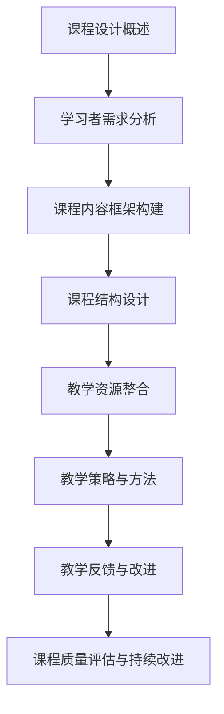

                 

## 文章标题：打造优质课程的核心要素

在教育领域，课程设计不仅仅是一项任务，它是一项艺术，是一项关于如何将知识、技能和理念有效传递给学生的工程。在这篇技术博客中，我们将探讨如何打造出优质的课程，从而帮助教育工作者和学生实现更高效的学习和教学体验。本文旨在提供一系列结构化和系统化的方法，帮助课程设计者在课程构建、教学策略和评估改进等方面做出明智决策。

**关键词：** 课程设计、教学策略、学习评估、教学资源、反馈机制、教学质量。

**摘要：** 本文将详细解析打造优质课程的核心要素，涵盖课程设计、教学策略、教学质量评估与持续改进等多个方面。通过一步步的逻辑分析，我们将揭示如何将理论知识转化为实际操作，提供实用的工具和方法，帮助教育者打造出具有高度吸引力、知识性和实用性的课程。

### 目录大纲

#### 第一部分：课程设计与构建

1. **课程设计概述**
   - 1.1 课程目标与定位
   - 1.2 学习者需求分析
   - 1.3 课程内容框架构建

2. **课程内容设计**
   - 2.1 核心知识与技能
   - 2.2 教学活动设计
   - 2.3 学习评估与反馈机制

3. **课程结构与流程**
   - 3.1 课程模块划分
   - 3.2 教学流程设计
   - 3.3 时间规划与管理

4. **教学资源整合**
   - 4.1 教材与辅助资料选择
   - 4.2 数字资源整合利用
   - 4.3 多媒体教学手段应用

#### 第二部分：教学策略与方法

5. **教学方法选择**
   - 5.1 传统教学方法
   - 5.2 现代教学方法
   - 5.3 教学方法的匹配原则

6. **教学互动与参与**
   - 6.1 促进学生互动
   - 6.2 提高学生参与度
   - 6.3 课堂管理技巧

7. **教学反馈与改进**
   - 7.1 学生反馈收集
   - 7.2 教学效果评估
   - 7.3 教学改进策略

#### 第三部分：课程质量评估与持续改进

8. **课程质量评估标准**
   - 8.1 教学目标达成度
   - 8.2 教学内容完整性
   - 8.3 教学方法有效性

9. **课程持续改进**
   - 9.1 课程反馈分析
   - 9.2 改进方案制定
   - 9.3 改进实施与评估

10. **课程案例研究**
    - 10.1 成功案例分享
    - 10.2 失败案例分析
    - 10.3 案例总结与启示

#### 附录：教学资源与工具

- 附录1：教学资源清单
- 附录2：教学工具推荐

### 核心概念与联系

首先，让我们通过一个简单的Mermaid流程图来展示课程设计的基本流程：



### 核心算法原理讲解

教学反馈分析是课程质量评估的重要组成部分。以下是一个简单的伪代码，用于分析学生反馈并计算正面与负面反馈的比例。

```python
def analyze_feedback(feedback_data):
    # 初始化反馈分析结果
    results = {}

    # 统计正面反馈
    positive_feedback = sum(1 for f in feedback_data if "positive" in f)

    # 统计负面反馈
    negative_feedback = sum(1 for f in feedback_data if "negative" in f)

    # 计算反馈比例
    feedback_ratio = positive_feedback / (positive_feedback + negative_feedback)

    # 更新分析结果
    results['positive_ratio'] = feedback_ratio
    results['negative_ratio'] = 1 - feedback_ratio

    return results
```

### 数学模型和数学公式

学习者的参与度是一个衡量课程有效性的关键指标。以下是一个用于计算学习者参与度的数学模型：

$$
R = \frac{I \cdot A}{S}
$$

其中：
- \( R \) 为学习者参与度
- \( I \) 为互动频率
- \( A \) 为参与活动次数
- \( S \) 为课程总时长

这个公式提供了一个量化的方法来评估学生在课程中的参与程度。

### 项目实战

**教学反馈分析项目实战**

#### 开发环境搭建

1. 配置 Python 开发环境，确保 Python 3.8 或更高版本。
2. 安装必要的库，如 Pandas 和 NumPy。

```bash
pip install pandas numpy
```

#### 源代码实现

```python
import pandas as pd

def analyze_feedback(feedback_data):
    # 初始化反馈分析结果
    results = {}

    # 统计正面反馈
    positive_feedback = sum(1 for f in feedback_data if "positive" in f)

    # 统计负面反馈
    negative_feedback = sum(1 for f in feedback_data if "negative" in f)

    # 计算反馈比例
    feedback_ratio = positive_feedback / (positive_feedback + negative_feedback)

    # 更新分析结果
    results['positive_ratio'] = feedback_ratio
    results['negative_ratio'] = 1 - feedback_ratio

    return results

# 读取反馈数据
feedback_data = pd.read_csv('feedback.csv')

# 分析反馈数据
feedback_results = analyze_feedback(feedback_data['comment'].tolist())

# 打印分析结果
print(feedback_results)
```

#### 代码解读与分析

1. **读取反馈数据**：使用 Pandas 读取 CSV 文件，获取学生的反馈数据。
2. **分析反馈数据**：定义 `analyze_feedback` 函数，统计正面和负面反馈，计算反馈比例。
3. **输出分析结果**：将分析结果打印出来，为后续的教学改进提供依据。

通过这个实战项目，我们可以直观地看到如何利用编程技术来分析教学反馈，从而为课程质量评估提供数据支持。

### 总结

本文通过逻辑清晰的分析，逐步揭示了打造优质课程的核心要素。从课程设计、教学策略到质量评估，我们提出了一系列实用方法和工具，帮助教育工作者有效地提升课程质量和学生的学习体验。通过本文的指导，您将能够更好地理解课程设计的关键环节，从而打造出具有高度吸引力和实用价值的优质课程。

**作者：** AI天才研究院 / AI Genius Institute & 禅与计算机程序设计艺术 / Zen And The Art of Computer Programming

---

**第1章：课程设计概述**

课程设计是教育工作的核心，它决定了学习者能否有效地吸收知识并转化为实际技能。在这一章节中，我们将详细探讨课程设计的整体概念，包括课程目标与定位、学习者需求分析以及课程内容框架构建。通过这些基本环节，我们可以确保课程设计既符合学习者的实际需求，又具备明确的目标导向。

**1.1 课程目标与定位**

课程目标是课程设计的起点，它明确了课程希望达到的效果和期望的学习成果。设定课程目标需要遵循以下几个原则：

1. **明确性**：目标应当具体、可测量，以便于后续评估。
2. **层次性**：目标可以分为短期目标、中期目标和长期目标，以适应不同阶段的学习需求。
3. **可行性**：目标应当是可实现的，同时具有一定的挑战性。

课程定位则是指课程在整体教学体系中的位置和价值。一个准确的课程定位可以帮助我们：

- **明确课程在学科体系中的位置**：比如是基础课程、进阶课程还是专业课程。
- **识别课程的目标群体**：比如是针对新手学习者还是有一定基础的专业人士。

通过设定明确的目标和定位，我们可以为后续的课程设计和实施奠定坚实的基础。

**1.2 学习者需求分析**

学习者需求分析是课程设计过程中不可或缺的一环。它包括对学习者背景、学习动机、学习习惯和学习需求的全面了解。以下是进行学习者需求分析时需要考虑的几个方面：

1. **学习者背景**：包括年龄、性别、教育背景、职业等。
2. **学习动机**：理解学习者为什么选择这门课程，他们的学习目标是什么。
3. **学习习惯**：包括学习时间、学习环境、偏好等。
4. **学习需求**：了解学习者希望在课程中获得哪些知识和技能。

进行学习者需求分析的方法包括：

- **问卷调查**：通过问卷收集学习者的基本信息和学习需求。
- **访谈**：与学习者进行面对面的交流，深入了解他们的观点和需求。
- **观察**：在课堂上观察学习者的行为，分析他们的学习习惯和需求。

通过学习者需求分析，我们可以发现课程设计中的潜在问题，并根据分析结果调整课程内容和教学方法，使其更贴近学习者的需求。

**1.3 课程内容框架构建**

课程内容框架是课程设计的核心部分，它决定了课程的逻辑结构和教学内容的安排。构建课程内容框架时，需要遵循以下几个步骤：

1. **确定核心知识**：根据课程目标和学习者需求，确定课程需要传授的核心知识。
2. **设计教学模块**：将核心知识分解为多个教学模块，每个模块涵盖一个具体的学习主题。
3. **编排教学顺序**：根据知识点的逻辑关系，编排教学模块的顺序，确保学习者能够循序渐进地学习。
4. **整合教学资源**：将教材、辅助资料、多媒体资源等整合到课程内容框架中，为教学提供全面的支持。

构建课程内容框架时，需要注意以下几点：

- **逻辑性**：课程内容应具备清晰的逻辑结构，使学习者能够逐步掌握知识点。
- **连贯性**：前后知识点应相互衔接，避免跳跃和不连贯的现象。
- **灵活性**：课程内容应具有一定的灵活性，以便根据实际情况进行调整和优化。

通过上述步骤，我们可以构建一个结构清晰、内容丰富的课程内容框架，为后续的教学实施提供明确的指导。

**本章总结**

课程设计概述环节是打造优质课程的基础，通过设定明确的目标和定位，分析学习者的需求，构建合理的课程内容框架，我们可以为课程的后续设计提供坚实的基础。在下一章中，我们将深入探讨课程内容设计，包括核心知识与技能的确定、教学活动的设计以及学习评估与反馈机制。请继续关注。

### 第2章：课程内容设计

课程内容设计是课程设计的核心环节，它直接影响学习者的学习效果和课程的质量。在这一章节中，我们将详细讨论课程内容设计的关键要素，包括如何确定核心知识与技能、设计教学活动以及建立学习评估与反馈机制。通过这些要素的有机整合，我们可以打造出一门具有高度吸引力和实用价值的课程。

**2.1 核心知识与技能**

核心知识与技能是课程内容的核心，它们是学习者需要掌握的基本概念、理论和实践技能。确定核心知识与技能需要遵循以下几个原则：

1. **相关性**：核心知识与技能应与课程目标密切相关，能够支持学习者实现学习目标。
2. **实用性**：核心知识与技能应具有实际应用价值，能够帮助学习者解决实际问题。
3. **层次性**：核心知识与技能应具有一定的层次性，从基础到高级，逐步引导学习者深入理解。

具体步骤如下：

1. **分析课程目标**：根据课程目标，确定需要传授的核心知识与技能。
2. **查阅文献资料**：查阅相关的学术文献、教材和参考资料，了解当前领域的最新研究成果和实践经验。
3. **与专家交流**：与领域内的专家进行交流，获取他们的意见和建议。
4. **筛选和确定**：根据相关性、实用性和层次性原则，筛选和确定最终的核心知识与技能。

**2.2 教学活动设计**

教学活动设计是课程内容设计的重要环节，它决定了如何有效地传递知识和技能。设计教学活动需要考虑以下几个方面：

1. **教学目标**：明确每个教学活动的目标，确保活动的设计和实施能够支持课程目标的实现。
2. **教学策略**：选择适合的教学策略，如讲授、讨论、实验、案例研究等，以激发学习者的兴趣和参与度。
3. **教学内容**：将核心知识与技能转化为具体的教学内容，确保内容丰富、有条理。
4. **教学过程**：设计教学过程，包括导入、讲解、练习、总结等环节，确保教学活动的流畅和高效。

具体步骤如下：

1. **明确教学目标**：根据课程目标和核心知识与技能，明确每个教学活动的具体目标。
2. **选择教学策略**：根据教学目标和学习者的特点，选择适合的教学策略。
3. **设计教学内容**：将核心知识与技能转化为具体的教学内容，确保内容丰富、有条理。
4. **编排教学过程**：根据教学策略和教学内容，编排教学过程，确保每个环节都具备明确的目标和实施步骤。

**2.3 学习评估与反馈机制**

学习评估与反馈机制是课程内容设计的重要组成部分，它能够帮助教师了解学习者的学习效果，及时调整教学策略和内容。建立有效的学习评估与反馈机制需要考虑以下几个方面：

1. **评估标准**：制定明确的评估标准，确保评估具有公正性和客观性。
2. **评估方法**：选择适合的评估方法，如考试、作业、实验报告、课堂表现等，以全面评估学习者的学习效果。
3. **反馈方式**：设计有效的反馈方式，如口头反馈、书面反馈、在线反馈等，及时向学习者传达评估结果和改进建议。
4. **反馈循环**：建立反馈循环机制，将评估结果和反馈信息纳入课程设计和教学实施中，持续优化教学效果。

具体步骤如下：

1. **制定评估标准**：根据课程目标和核心知识与技能，制定明确的评估标准。
2. **选择评估方法**：根据评估标准和教学特点，选择适合的评估方法。
3. **设计反馈方式**：根据学习者的需求和反馈习惯，设计有效的反馈方式。
4. **建立反馈循环**：将评估结果和反馈信息纳入课程设计和教学实施中，持续优化教学效果。

**本章总结**

课程内容设计是打造优质课程的关键环节，通过确定核心知识与技能、设计教学活动以及建立学习评估与反馈机制，我们可以确保课程内容具有高度的相关性、实用性和层次性，同时能够有效地激发学习者的兴趣和参与度。在下一章中，我们将继续探讨课程结构与流程的设计，包括课程模块划分、教学流程设计以及时间规划与管理。请继续关注。

### 第3章：课程结构与流程

课程结构与流程是课程设计中的关键要素，它决定了课程的整体框架和运行逻辑。合理的课程结构能够帮助学习者更好地理解知识体系，而流畅的教学流程则能够确保教学内容的有效传递。在本章节中，我们将详细探讨课程模块划分、教学流程设计以及时间规划与管理。

**3.1 课程模块划分**

课程模块划分是将课程内容按照一定的逻辑关系进行分段，每个模块都包含一个具体的学习主题。合理的模块划分能够帮助学习者逐步掌握知识，同时也有利于教学过程的组织和实施。以下是课程模块划分的几个原则：

1. **逻辑性**：模块划分应遵循知识的内在逻辑关系，确保每个模块的内容相互衔接。
2. **层次性**：模块划分应体现知识的层次性，从基础到高级，逐步引导学习者深入理解。
3. **独立性**：模块划分应保证每个模块具有独立性，使学习者可以在不同时间、不同地点进行学习。

具体步骤如下：

1. **分析课程内容**：对课程内容进行详细分析，识别核心知识点和关键技能。
2. **确定模块划分**：根据课程内容的逻辑关系和层次性，确定每个模块的学习主题。
3. **编排模块顺序**：根据模块的独立性，编排模块的顺序，确保学习过程连贯。

**3.2 教学流程设计**

教学流程设计是课程结构的具体实施环节，它决定了教学活动的顺序和时间安排。一个良好的教学流程应包括以下几个环节：

1. **导入**：引入新知识，激发学习者的兴趣和好奇心。
2. **讲解**：详细讲解知识点的概念、原理和应用。
3. **练习**：通过练习巩固学习成果，提高实际操作能力。
4. **总结**：对学习内容进行总结，帮助学习者巩固记忆。

具体步骤如下：

1. **确定教学目标**：根据课程目标和模块内容，明确每个教学环节的目标。
2. **设计教学活动**：根据教学目标，设计具体的讲解、练习和总结活动。
3. **编排教学顺序**：根据教学活动的性质和时间，编排教学流程的顺序。
4. **分配时间**：为每个教学活动分配合理的时间，确保教学流程的流畅和高效。

**3.3 时间规划与管理**

时间规划与管理是确保课程按时完成和高质量实施的关键。以下是几个时间规划与管理的原则：

1. **科学合理**：时间规划应科学合理，充分考虑教学内容的复杂度和学习者的接受能力。
2. **灵活调整**：时间规划应具有一定的灵活性，以便根据实际情况进行调整。
3. **合理分配**：时间分配应合理，确保每个模块和教学环节都有足够的时间进行深入学习和实践。

具体步骤如下：

1. **分析课程内容**：对课程内容进行详细分析，识别各模块和教学环节的时间需求。
2. **制定时间规划**：根据分析结果，制定详细的时间规划，明确每个模块和教学环节的时间分配。
3. **执行与监控**：按照时间规划实施教学，同时进行监控和调整，确保教学进度和质量。
4. **反馈与优化**：收集学习者的反馈，分析时间规划的执行情况，持续优化时间管理策略。

**本章总结**

课程结构与流程设计是课程设计的重要组成部分，通过合理的模块划分、教学流程设计和时间规划与管理，我们可以确保课程内容的有效传递和学习者的高效学习。在下一章中，我们将探讨教学资源的整合，包括教材与辅助资料选择、数字资源整合利用以及多媒体教学手段的应用。请继续关注。

### 第4章：教学资源整合

教学资源是课程设计的重要支撑，它直接影响教学效果和学习体验。有效的教学资源整合能够优化教学过程，提高学习者的参与度和学习效果。在本章节中，我们将详细探讨教学资源的类型、选择标准及其整合方法。

**4.1 教材与辅助资料选择**

教材和辅助资料是教学资源中的核心组成部分，它们为学习者提供了重要的知识支撑和指导。选择教材和辅助资料时，需要考虑以下几个因素：

1. **内容适用性**：教材和辅助资料的内容应与课程目标和教学内容相匹配，确保知识点的全面覆盖和准确传达。
2. **质量**：教材和辅助资料的质量是教学效果的重要保障，应选择权威、专业、内容丰富的资源。
3. **更新度**：教材和辅助资料应保持更新，以反映领域的最新发展和研究成果。
4. **多样性**：教材和辅助资料的形式应多样化，包括书籍、电子文档、视频、案例等，以满足不同学习者的需求。

具体选择步骤如下：

1. **需求分析**：根据课程目标和教学内容，分析学习者需求，确定所需的知识点和技能。
2. **市场调研**：通过查阅相关书籍、网上资源、教学论坛等途径，收集和评估各类教材和辅助资料。
3. **专家咨询**：与领域内的专家、教师进行交流，获取他们的推荐和意见。
4. **选择与评估**：根据上述分析、调研和咨询结果，选择最适合的教材和辅助资料，并对其进行试用和评估。

**4.2 数字资源整合利用**

随着互联网技术的发展，数字资源在教育中的应用越来越广泛。有效的数字资源整合能够丰富教学手段，提高学习者的学习兴趣和效果。以下是几个关键点：

1. **资源类型**：数字资源包括视频、音频、电子书籍、在线课程、虚拟实验室等多种形式，应根据教学需求进行选择。
2. **平台选择**：选择适合的数字资源平台，如MOOC平台、教学管理系统、在线学习平台等，以确保资源的便捷获取和高效使用。
3. **资源整合**：将数字资源与其他教学资源进行整合，如将视频与教材结合，提供更加全面的学习体验。
4. **互动性**：利用数字资源提供互动性学习体验，如在线讨论、实时答疑、互动练习等，提高学习者的参与度和积极性。

具体整合步骤如下：

1. **需求分析**：分析课程目标和教学需求，确定需要整合的数字资源类型。
2. **资源选择**：根据需求分析结果，选择合适的数字资源，确保其与课程内容相匹配。
3. **平台搭建**：搭建适合的数字资源平台，如利用教学管理系统或在线学习平台，提供资源的统一管理和分发。
4. **整合与测试**：将数字资源与课程内容进行整合，进行测试和优化，确保资源的有效性和便捷性。

**4.3 多媒体教学手段应用**

多媒体教学手段能够丰富教学形式，提高教学效果，增强学习者的学习体验。以下是几种常见的多媒体教学手段：

1. **视频教学**：通过视频讲解知识点，可以直观地展示操作过程和实例分析，帮助学习者更好地理解。
2. **音频教学**：通过音频讲解，可以提供便捷的学习途径，适合在移动场景中使用。
3. **动画演示**：通过动画演示复杂的概念和过程，可以增强学习者的理解，提高学习兴趣。
4. **互动教学**：利用互动教学工具，如虚拟实验室、在线讨论、互动练习等，提供丰富的互动性学习体验。

具体应用步骤如下：

1. **需求分析**：根据课程目标和教学需求，分析适合的多媒体教学手段。
2. **资源准备**：准备相应的多媒体教学资源，如视频脚本、音频素材、动画文件等。
3. **设计与应用**：将多媒体教学手段融入教学过程中，进行实际应用，并根据反馈进行优化。
4. **效果评估**：对多媒体教学手段的应用效果进行评估，根据评估结果调整和改进。

**本章总结**

教学资源的整合是课程设计的关键环节，通过合理的教材和辅助资料选择、数字资源整合利用以及多媒体教学手段的应用，我们可以优化教学过程，提高学习者的学习体验。在下一章中，我们将探讨教学策略与方法，包括传统教学方法、现代教学方法以及教学方法的匹配原则。请继续关注。

### 第5章：教学方法选择

教学方法的选择是课程设计中的重要环节，它直接关系到教学效果和学习者的学习体验。合适的教法能够激发学习者的学习兴趣，促进知识的吸收和技能的掌握。在这一章节中，我们将详细探讨传统教学方法、现代教学方法以及教学方法选择的匹配原则。

**5.1 传统教学方法**

传统教学方法主要基于教师的讲授和学生的被动接受，具有以下特点：

1. **讲授法**：教师通过口头讲解、演示等方式传授知识，是传统教学中最常用的方法。讲授法的优点在于信息传递速度快，可以系统化地传授大量知识，但缺点是互动性差，难以激发学生的主动性和创造性。

2. **演示法**：教师通过实际操作、实物展示等方式，直观地展示知识的应用过程。演示法能够帮助学生更好地理解抽象概念和复杂过程，但需要教师具备较高的演示技巧和资源准备。

3. **练习法**：通过反复练习，巩固所学知识，提高实际操作能力。练习法适用于技能培训，能够帮助学生将理论知识转化为实际技能，但容易产生疲劳和枯燥感。

**5.2 现代教学方法**

现代教学方法更加注重学生的主动参与和互动，强调个性化学习和协作学习，具有以下特点：

1. **问题导向学习（PBL）**：通过解决实际问题，激发学习者的兴趣和动力。问题导向学习鼓励学习者自主探究和解决问题，提高批判性思维和创新能力。

2. **项目式学习（PjBL）**：通过完成实际项目，将学习与实际应用相结合。项目式学习有助于学习者将所学知识应用于实际情境，提高实践能力和团队合作能力。

3. **合作学习**：通过小组合作，共同完成任务和项目。合作学习能够培养学生的沟通能力、协作能力和团队精神，同时促进知识的共享和深化。

4. **在线学习**：利用互联网和在线平台，提供灵活的学习时间和方式。在线学习适用于各种学习者和课程类型，能够提高学习者的自主性和灵活性，但也需要良好的技术支持和资源准备。

**5.3 教学方法的匹配原则**

选择教学方法时，需要遵循以下匹配原则，以确保教学效果的最大化：

1. **课程目标**：教学方法应与课程目标相匹配，确保教学策略能够支持学习目标的实现。

2. **学习者特点**：教学方法应考虑学习者的年龄、背景、兴趣和学习习惯，选择适合的教学方法。

3. **内容特点**：不同知识类型和学习内容适合不同的教学方法，需要根据课程内容的复杂度和抽象程度进行选择。

4. **环境条件**：教学方法的实施需要考虑教学环境、技术支持和资源条件，确保教学方法的可行性和有效性。

具体匹配步骤如下：

1. **分析课程目标**：根据课程目标，确定所需的教学方法和策略。

2. **分析学习者特点**：了解学习者的背景、兴趣和学习习惯，选择适合的教学方法。

3. **分析内容特点**：根据课程内容的类型和难度，选择合适的教学方法。

4. **评估环境条件**：考虑教学环境、技术支持和资源条件，确保教学方法的可行性和有效性。

5. **综合评估**：综合以上分析结果，选择最合适的教学方法，并进行实施和反馈。

**本章总结**

教学方法的选择是课程设计中的重要环节，通过分析课程目标、学习者特点、内容特点和环境条件，我们可以选择最合适的教学方法，从而提高教学效果和学生的学习体验。在下一章中，我们将探讨教学互动与参与，包括促进学生互动、提高学生参与度以及课堂管理技巧。请继续关注。

### 第6章：教学互动与参与

教学互动与参与是提升教学效果和学生学习体验的关键因素。有效的教学互动和参与能够激发学生的兴趣，促进知识的深入理解和技能的掌握。在本章节中，我们将详细探讨如何促进学生互动、提高学生参与度以及应用有效的课堂管理技巧。

**6.1 促进学生互动**

促进学生互动是教学过程中的重要环节，它能够增强学生的参与感和互动性。以下是几种促进学生互动的方法：

1. **小组讨论**：通过小组讨论，学生可以分享自己的想法和观点，互相学习和补充。教师可以设定讨论话题，引导学生深入探讨，从而激发学生的思维和创造力。

2. **角色扮演**：通过角色扮演，学生可以模拟实际情境，体验不同的角色和责任。这种方法能够帮助学生更好地理解和应用所学知识，提高实践能力。

3. **案例分析**：通过分析真实案例，学生可以探讨案例中的问题，提出解决方案，并讨论不同方案的优缺点。这种方法能够培养学生的批判性思维和分析能力。

4. **互动游戏**：通过设计互动游戏，如知识竞赛、问答游戏等，可以增加课堂的趣味性和互动性，提高学生的参与度。

**6.2 提高学生参与度**

提高学生参与度是确保教学效果的重要手段。以下是几种提高学生参与度的策略：

1. **明确学习目标**：在课程开始时，明确学习目标和预期成果，让学生知道为什么学习以及学习的重要性，从而提高他们的学习动机。

2. **多样化教学活动**：通过多样化的教学活动，如讨论、实验、案例分析、项目式学习等，可以吸引学生的注意力，激发他们的学习兴趣。

3. **鼓励提问和反馈**：鼓励学生在课堂上提问，并及时给予反馈，这不仅能提高学生的参与度，还能帮助教师了解学生的学习情况，及时调整教学策略。

4. **建立互动反馈机制**：通过定期的互动反馈，如课堂小测验、在线讨论、作业反馈等，可以及时了解学生的学习进度和困惑，从而提供针对性的帮助。

**6.3 课堂管理技巧**

有效的课堂管理是确保教学顺利进行的关键。以下是几种课堂管理技巧：

1. **建立课堂规则**：在课程开始时，明确课堂规则，如保持安静、尊重他人、按时完成作业等，让学生知道什么是可以接受的，什么是不可以接受的。

2. **使用激励手段**：通过表扬、奖励、积分制等激励手段，可以激发学生的学习积极性，增强他们的学习动力。

3. **营造积极氛围**：通过幽默、鼓励和肯定，营造积极的课堂氛围，使学生感到舒适和安全，从而提高他们的参与度和积极性。

4. **灵活调整教学**：根据学生的反馈和学习情况，灵活调整教学节奏和内容，确保教学能够满足不同层次学生的需求。

**本章总结**

教学互动与参与是提升教学效果和学生学习体验的重要环节。通过促进学生互动、提高学生参与度以及应用有效的课堂管理技巧，我们可以营造一个积极、互动的学习环境，从而提高教学效果。在下一章中，我们将探讨教学反馈与改进，包括学生反馈收集、教学效果评估以及教学改进策略。请继续关注。

### 第7章：教学反馈与改进

教学反馈与改进是课程质量持续提升的关键环节。有效的教学反馈能够帮助教师了解学生的学习状况，发现教学中的问题，及时进行调整和优化，从而提高教学效果。在本章节中，我们将详细探讨如何收集学生反馈、评估教学效果以及制定和实施教学改进策略。

**7.1 学生反馈收集**

学生反馈是了解教学效果的重要手段。以下几种方法可以帮助教师有效地收集学生反馈：

1. **问卷调查**：通过问卷调查，可以收集学生对课程内容、教学方法、教师表现等方面的意见和建议。问卷调查可以采用纸质或电子形式，便于大规模收集数据。

2. **面谈和访谈**：与部分学生进行面对面或电话访谈，可以深入了解他们对课程和学习过程的看法。这种方法能够获得更具体、更详细的信息。

3. **课堂互动**：在课堂上，通过提问、讨论和互动游戏等方式，实时收集学生的反馈。这种方法能够帮助教师及时了解学生的学习状态和需求。

4. **在线反馈**：利用在线平台或教学管理系统，提供反馈问卷或讨论区，让学生可以在课后随时提交反馈。这种方法方便快捷，适合大规模收集反馈。

**7.2 教学效果评估**

教学效果评估是衡量课程质量的重要标准。以下几种方法可以帮助教师进行教学效果评估：

1. **考试和测验**：通过考试和测验，评估学生对知识点的掌握程度和技能水平。这种方法可以量化评估学生的表现，为后续教学提供参考。

2. **作业和项目**：通过作业和项目，评估学生的实际操作能力和应用能力。这种方法能够更全面地了解学生的综合能力。

3. **课堂表现**：通过观察学生的课堂参与度、提问和回答问题的情况，评估学生的学习态度和积极性。这种方法可以提供更直观的教学效果反馈。

4. **学生反馈**：结合学生反馈，了解他们对教学内容的满意度、教学方法的适用性以及教师的表现。这种方法能够反映教学效果的整体情况。

**7.3 教学改进策略**

根据学生反馈和教学效果评估的结果，教师需要制定和实施相应的教学改进策略。以下是一些常见的改进策略：

1. **调整教学计划**：根据评估结果，调整教学计划，确保教学内容更加贴合学生的需求，增加或减少某些教学环节。

2. **改进教学方法**：根据学生反馈和评估结果，改进教学方法，采用更有效的教学策略，如增加互动环节、引入多媒体教学等。

3. **优化课堂管理**：通过优化课堂管理，提高学生的参与度和积极性，如建立课堂规则、使用激励手段等。

4. **提供额外资源**：根据学生的需求和评估结果，提供额外的学习资源，如辅导资料、在线课程、练习题等。

5. **持续跟进和反馈**：在改进过程中，持续跟进学生的学习情况，收集反馈信息，并根据反馈结果进行调整和优化。

**本章总结**

教学反馈与改进是提升课程质量的重要环节。通过有效收集学生反馈、进行教学效果评估以及制定和实施教学改进策略，教师可以不断优化教学过程，提高教学效果和学习体验。在下一章中，我们将探讨课程质量评估标准，包括教学目标达成度、教学内容完整性和教学方法有效性。请继续关注。

### 第8章：课程质量评估标准

课程质量评估是教育领域中不可或缺的一环，它不仅能够帮助教师了解教学效果，还能为课程改进提供有力的依据。在本章节中，我们将详细探讨课程质量评估的标准，包括教学目标达成度、教学内容完整性和教学方法有效性。通过这些评估标准，我们可以全面了解课程的质量，并为其持续改进提供方向。

**8.1 教学目标达成度**

教学目标是课程设计的核心，是衡量课程质量的首要标准。教学目标达成度评估的主要内容包括：

1. **知识掌握情况**：通过考试、测验、作业等评估学生对知识点的掌握程度，确保教学目标中的知识目标得到实现。

2. **技能应用能力**：通过项目、实验、实践等评估学生在实际情境中应用知识的能力，确保教学目标中的技能目标得到实现。

3. **态度和行为改变**：通过学生的行为观察、课堂表现、问卷调查等评估学生在学习过程中的态度变化和行为改变，确保教学目标中的情感目标得到实现。

具体评估步骤如下：

1. **制定评估指标**：根据教学目标，制定具体的评估指标，如知识掌握度、技能应用能力和态度行为改变等。

2. **设计评估工具**：选择合适的评估工具，如考试、项目、观察表、问卷调查等，确保评估结果的准确性和客观性。

3. **实施评估**：按照既定评估计划，实施评估活动，收集评估数据。

4. **分析评估结果**：对评估结果进行统计和分析，评估教学目标的达成情况。

5. **反馈与改进**：根据评估结果，提供反馈，并针对未达成的教学目标制定改进措施。

**8.2 教学内容完整性**

教学内容完整性是指课程内容是否全面、系统、有条理。它关系到学习者能否全面、系统地掌握知识。以下是从几个方面评估教学内容完整性的方法：

1. **知识点覆盖**：检查课程内容是否覆盖了所有核心知识点，确保教学目标中的知识点得到全面传授。

2. **逻辑性**：检查课程内容之间的逻辑关系，确保知识点之间的衔接和过渡自然、流畅。

3. **实用性**：评估课程内容是否具有实际应用价值，能否帮助学习者解决实际问题。

具体评估步骤如下：

1. **分析课程内容**：对课程内容进行详细分析，识别核心知识点和教学目标。

2. **比对教学大纲**：将课程内容与教学大纲进行比对，确保所有核心知识点得到覆盖。

3. **征求专家意见**：与领域内的专家、教师进行交流，获取他们对课程内容完整性的意见和建议。

4. **修订和完善**：根据分析结果和专家意见，对课程内容进行修订和完善，确保其完整性。

**8.3 教学方法有效性**

教学方法的有效性直接关系到教学效果的优劣。以下是从几个方面评估教学方法有效性的方法：

1. **教学方法适用性**：评估所选教学方法是否适合课程内容和学习者的特点，能否有效促进知识的掌握和技能的应用。

2. **教学效果**：通过学生的反馈、考试结果、作业质量等评估教学方法的有效性。

3. **学生参与度**：通过课堂互动、问卷调查等评估学生在教学过程中的参与度和积极性。

具体评估步骤如下：

1. **分析教学方法**：对各种教学方法进行分析，选择最适合课程内容和学习者的教学方法。

2. **实施教学**：按照既定教学方法，实施教学活动。

3. **收集反馈**：通过学生反馈、考试结果等收集教学效果的数据。

4. **分析数据**：对收集到的数据进行分析，评估教学方法的有效性。

5. **反馈与改进**：根据评估结果，提供反馈，并针对存在的问题进行改进。

**本章总结**

课程质量评估标准是确保课程质量和教学效果的重要手段。通过评估教学目标达成度、教学内容完整性和教学方法有效性，我们可以全面了解课程的质量，并为其持续改进提供依据。在下一章中，我们将探讨课程持续改进的方法，包括课程反馈分析、改进方案制定以及改进实施与评估。请继续关注。

### 第9章：课程持续改进

课程持续改进是保证课程质量和教学效果不断提高的关键。通过不断收集反馈、分析问题和制定有效的改进方案，教师可以不断优化课程设计，提升教学效果。在本章节中，我们将详细探讨课程持续改进的方法，包括课程反馈分析、改进方案制定和改进实施与评估。

**9.1 课程反馈分析**

课程反馈分析是持续改进的基础，它帮助教师了解课程中的优势和不足，为改进提供依据。以下是如何进行课程反馈分析的步骤：

1. **收集反馈**：通过问卷调查、面谈、课堂互动、在线反馈等多种渠道收集学生的反馈。

2. **分类整理**：将收集到的反馈按照内容分类整理，如课程内容、教学方法、教师表现等。

3. **定量分析**：使用统计方法，如频数分析、百分比计算等，对反馈进行定量分析，识别问题的主要方面。

4. **定性分析**：对反馈进行深入解读，分析问题的原因和背后的深层次问题。

5. **总结报告**：编写反馈分析报告，总结反馈的主要问题和改进建议。

**9.2 改进方案制定**

在分析课程反馈的基础上，教师需要制定具体的改进方案，以解决反馈中提到的问题。以下是如何制定改进方案的步骤：

1. **确定改进目标**：根据反馈分析报告，明确需要改进的具体方面，如教学内容、教学方法、教学资源等。

2. **制定改进计划**：为每个改进目标制定详细的改进计划，包括改进的具体措施、实施时间和负责人。

3. **方案评估**：对改进方案进行评估，确保方案的可行性和有效性。

4. **方案审批**：将改进方案提交给相关部门或领导审批，确保方案的正式实施。

**9.3 改进实施与评估**

改进方案制定后，需要按照计划进行实施，并对改进效果进行评估。以下是如何进行改进实施与评估的步骤：

1. **实施改进**：按照改进计划，逐步实施改进措施，确保每个改进环节的顺利进行。

2. **监督与调整**：在改进过程中，进行持续的监督和调整，确保改进措施能够按照计划执行。

3. **效果评估**：通过考试、测验、作业、课堂表现等评估改进措施的效果，确保改进目标得到实现。

4. **反馈与总结**：收集学生对改进措施的反应和意见，编写改进效果评估报告，总结改进过程中的经验和教训。

5. **总结与归档**：将改进过程和效果进行总结，归档保存，为后续课程改进提供参考。

**本章总结**

课程持续改进是提高课程质量和教学效果的重要手段。通过反馈分析、改进方案制定和实施评估，教师可以不断优化课程设计，提升教学效果。在下一章中，我们将通过案例研究，探讨成功案例和失败案例，从中总结经验和教训，为课程设计提供有益的启示。请继续关注。

### 第10章：课程案例研究

通过案例研究，我们可以从实际的教学实践中总结经验，发现问题和改进机会。在本章节中，我们将探讨两个课程案例：一个成功案例和一个失败案例，并从中总结出课程设计、教学实施和评估中的关键要素和教训。

**10.1 成功案例分享**

**案例背景**：
这个成功案例是一个关于数据分析课程的设计与实施，由一位有丰富教学经验的教授带领团队完成。课程的目标是帮助本科生和研究生掌握数据分析的基础知识和实践技能。

**实施步骤**：
1. **课程设计**：在课程设计阶段，教授团队通过文献调研、专家访谈和问卷调查，明确了课程目标和学习者的需求。他们确定了课程的核心知识点，包括数据收集、数据清洗、统计分析等，并设计了一系列教学模块，如理论讲解、实验操作、案例分析等。

2. **教学实施**：在课程实施过程中，教授团队采用了多元化的教学方法，如讲授、小组讨论、实验练习等。他们还引入了在线学习平台，提供了丰富的数字资源和互动性学习工具，如数据可视化工具、在线编程环境等。

3. **评估与反馈**：通过定期的小测验、实验报告和期末考试，教授团队评估了学生的学习效果。他们还通过在线问卷调查和个别访谈，收集了学生对课程内容和教学方法的反馈。

**成功因素**：
1. **明确的目标与需求分析**：通过详细的课程目标和需求分析，教授团队确保了课程设计紧密贴合学习者的实际需求。
2. **多元化的教学方法**：多样化的教学活动提高了学生的参与度和积极性，有助于知识的深入理解和技能的掌握。
3. **有效的评估与反馈机制**：通过定期的评估和反馈，教授团队能够及时了解学生的学习状况和教学效果，为改进提供依据。

**10.2 失败案例分析**

**案例背景**：
这个失败案例是一个关于编程基础课程的实施，由一位新入职的教师负责。课程的目标是帮助非计算机专业的学生掌握基本的编程技能。

**实施步骤**：
1. **课程设计**：在课程设计阶段，教师没有充分考虑学习者的背景和需求，课程内容过于复杂，缺乏基础性讲解。
2. **教学实施**：在课程实施过程中，教师主要采用了传统的讲授法，缺乏互动和实践活动。课堂氛围较为枯燥，学生的学习积极性不高。
3. **评估与反馈**：由于缺乏有效的评估和反馈机制，教师没有及时了解学生的学习状况和教学效果，导致课程质量持续下降。

**失败原因**：
1. **课程设计不合理**：课程内容过于复杂，缺乏层次性和针对性，不适合非计算机专业的学生。
2. **教学方法单一**：缺乏互动和实践活动，无法激发学生的学习兴趣和动力。
3. **缺乏评估与反馈**：没有建立有效的评估和反馈机制，无法及时发现问题并加以改进。

**教训与启示**：
1. **充分考虑学习者背景和需求**：在课程设计阶段，应充分考虑学习者的背景和需求，确保课程内容的层次性和适用性。
2. **采用多元化的教学方法**：结合讲授、讨论、实践等多种教学方法，提高课堂的互动性和趣味性。
3. **建立有效的评估与反馈机制**：通过定期的评估和反馈，及时了解教学效果，发现问题和改进机会。

**本章总结**

通过成功案例和失败案例的对比，我们可以看到课程设计、教学实施和评估中的关键要素和教训。成功的课程设计需要明确的目标和需求分析，多元化的教学方法，以及有效的评估与反馈机制。而失败的案例则提醒我们，不合理的设计、单一的教学方法以及缺乏评估与反馈都会导致课程质量的下降。通过总结这些经验和教训，我们可以为未来的课程设计提供有益的启示。

### 附录：教学资源与工具

在课程设计与实施过程中，教学资源与工具的合理使用能够显著提升教学效果。以下列举了一些常用的教学资源和工具，为课程设计和教学实施提供支持。

#### 附录1：教学资源清单

1. **教材**：
   - 基础教材：《计算机科学导论》、《数据分析基础》等
   - 进阶教材：《高级数据分析方法》、《编程实战》等

2. **辅助资料**：
   - 课件和讲义：课程幻灯片、演示文稿等
   - 实验指导书：实验步骤、数据集等
   - 案例分析资料：行业案例、历史案例等

3. **数字资源**：
   - 在线课程：MOOC平台上的开放课程资源
   - 电子书籍：在线图书馆的资源
   - 视频教程：教学视频、讲座视频等

4. **多媒体资源**：
   - 动画：讲解复杂概念的动画演示
   - 音频：相关学科的音频资料
   - 数据可视化工具：数据展示软件

#### 附录2：教学工具推荐

1. **在线学习平台**：
   - **Moodle**：开源的学习管理系统，支持在线课程、作业提交、讨论区等功能。
   - **Canvas**：商业化的学习管理系统，界面友好，功能强大，适用于多种教学场景。

2. **互动工具**：
   - **Zoom**：视频会议工具，适用于在线课堂和远程教学。
   - **Miro**：在线协作白板，支持多人实时协作，适用于头脑风暴、讨论等活动。

3. **编程环境**：
   - **Jupyter Notebook**：适用于数据科学和机器学习的交互式开发环境。
   - **Repl.it**：在线编程环境，支持多种编程语言，适用于编程实践和实验。

4. **评估工具**：
   - **Google Forms**：在线问卷调查工具，适用于收集学生反馈和评估。
   - **Quizlet**：在线学习工具，支持创建和分享闪卡、测验等。

通过上述教学资源和工具的合理应用，教师可以提升课程的互动性、实用性和学生的学习体验。同时，这些资源和工具的灵活运用，也为教学评估和持续改进提供了有力支持。

### 总结

课程设计是一项系统而复杂的工程，它需要教育工作者在课程目标设定、内容设计、教学实施、质量评估等多个环节进行深入思考和细致规划。从课程设计概述到教学资源整合，从教学策略选择到教学反馈与改进，每个环节都至关重要，它们共同构成了打造优质课程的核心要素。

本文通过逻辑清晰的分析，逐步揭示了课程设计的各个环节和方法。从明确课程目标和定位，到分析学习者需求，构建课程内容框架；从设计教学模块和流程，到整合教材、数字资源和多媒体教学手段；从选择传统与现代教学方法，到促进教学互动与参与，再到教学反馈与持续改进，每一步都是确保课程质量的关键。

在课程质量评估标准中，我们强调了教学目标达成度、教学内容完整性和教学方法有效性，这三大标准共同构成了评估课程质量的框架。而在课程持续改进中，通过反馈分析、方案制定和实施评估，我们可以不断优化课程设计，提升教学效果。

通过案例研究，我们看到了成功与失败的经验教训，这些案例不仅为我们提供了宝贵的实践参考，也提醒我们在课程设计与实施中应注意的问题。最后，附录中提供的教学资源和工具，为教师提供了实际操作中的支持。

教育是一项长远的投资，优质课程的设计与实施，是提高教育质量、促进学习者成长的重要途径。希望本文能够为教育工作者提供一些有益的启示和指导，帮助他们在课程设计与教学实践中不断进步，为培养更多优秀人才贡献力量。

**作者：** AI天才研究院 / AI Genius Institute & 禅与计算机程序设计艺术 / Zen And The Art of Computer Programming

---

通过本文的探讨，我们不仅了解到了课程设计的核心要素，还掌握了如何将这些理论应用到实际教学中。接下来，请继续关注后续章节，我们将通过深入讨论和具体案例，进一步深化对课程设计与实施的理解，为您提供更加全面和实用的指导。

