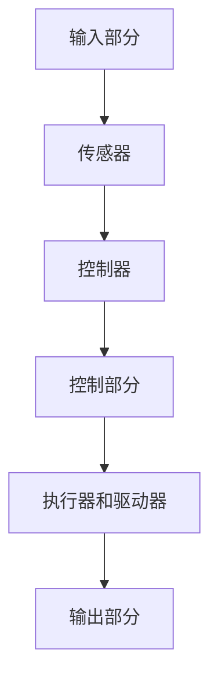

                 

### 文章标题

# 执行器控制：在设备上执行操作

### 关键词

- 执行器
- 执行器控制
- 自动化
- 工业控制
- 机器人控制
- 5G
- 物联网

### 摘要

本文深入探讨了执行器控制这一关键技术领域。首先，我们回顾了执行器控制的基础概念和架构，详细介绍了执行器的定义、作用和分类，以及执行器控制的架构。接着，我们分析了执行器控制的核心算法，通过伪代码展示了算法原理，并讲解了数学模型与公式。随后，文章转向执行器控制的实际应用，包括工业自动化和机器人控制，通过项目实战展示了执行器控制在实际开发中的具体实施步骤。最后，我们探讨了执行器控制的高级话题，如面临的挑战和未来趋势，以及新兴技术的应用，如5G和物联网。文章还介绍了执行器控制的法规与标准，并对未来进行了展望，包括技术创新和行业应用案例。本文旨在为读者提供全面而深入的技术指南，帮助理解和掌握执行器控制技术。

## 目录大纲

1. **基础概念与架构**
   - 第1章 执行器控制基础
     1.1 执行器控制的基本概念
     1.2 执行器的分类
     1.3 执行器控制的架构
   - 第2章 执行器控制的核心算法
     2.1 算法原理
     2.2 伪代码讲解
   - 第3章 数学模型与公式
     3.1 数学模型
     3.2 公式详解

2. **执行器控制应用**
   - 第4章 执行器控制应用场景
     4.1 工业自动化
     4.2 机器人控制
   - 第5章 执行器控制项目实战
     5.1 项目背景与目标
     5.2 开发环境搭建
     5.3 源代码实现与解读
   - 第6章 执行器控制的挑战与未来趋势
     6.1 技术挑战
     6.2 未来趋势

3. **高级话题**
   - 第7章 执行器控制的挑战与未来趋势
   - 第8章 执行器控制中的新兴技术
   - 第9章 执行器控制的行业应用案例
   - 第10章 执行器控制的法规与标准
   - 第11章 执行器控制的未来展望
   - 第12章 执行器控制领域的创新

### 第一部分: 基础概念与架构

执行器控制是自动化系统中的核心组成部分，它在工业自动化、机器人控制等领域发挥着至关重要的作用。理解执行器控制的基础概念和架构是深入探讨这一领域的前提。本部分将详细介绍执行器控制的基本概念、分类、架构以及核心算法和数学模型。

### 第1章 执行器控制基础

#### 1.1 执行器控制的基本概念

执行器控制是指通过特定的算法和控制系统，实现对设备或机械操作的自动控制。执行器作为控制系统的核心部件，负责接收控制信号并将其转化为机械运动，从而实现预期的控制目标。执行器广泛应用于工业自动化、机器人控制、航空航天、汽车制造等领域。

执行器控制的基本概念包括以下几个方面：

1. **执行器（Actuator）**：执行器是一种将输入信号（如电信号、液压信号、气压信号等）转换为机械运动的装置。执行器通常分为电动执行器、液压执行器、气压执行器和机械执行器等类型。

2. **控制器（Controller）**：控制器是执行器控制系统的核心部件，负责接收输入信号，根据预设的控制算法进行处理，然后生成控制信号发送给执行器，实现对设备的精确控制。

3. **传感器（Sensor）**：传感器用于检测系统的状态参数，如位置、速度、压力、温度等，并将这些信息反馈给控制器，用于调整控制策略。

4. **执行器控制算法**：执行器控制算法是执行器控制系统中的核心，用于处理传感器采集到的数据和控制器生成的控制信号，实现对执行器的精确控制。常见的控制算法包括PID控制、模糊控制、神经网络控制等。

#### 1.2 执行器的分类

执行器根据工作原理和能量转换方式的不同，可以分为多种类型。以下是几种常见的执行器分类：

1. **电动执行器**：电动执行器是利用电动机的机械能转换为转动或直线运动的装置。常见的电动执行器包括伺服电机、步进电机、直流电机等。

2. **液压执行器**：液压执行器是利用液压系统的能量转换原理，通过液压油的压力和流量来驱动执行机构。常见的液压执行器包括液压缸、液压马达等。

3. **气压执行器**：气压执行器是利用气动系统的能量转换原理，通过压缩空气的压力和流量来驱动执行机构。常见的气压执行器包括气动缸、气动马达等。

4. **机械执行器**：机械执行器是通过机械装置实现能量转换和机械运动的执行器，如凸轮机构、杠杆机构等。

#### 1.3 执行器控制的架构

执行器控制系统通常包括以下几个部分：

1. **输入部分**：包括传感器和控制器，用于检测系统的状态和生成控制信号。

2. **控制部分**：包括控制器和算法，用于处理传感器采集到的数据和生成控制信号。

3. **输出部分**：包括执行器和驱动器，用于实现机械运动和控制目标的执行。

执行器控制系统的基本架构可以用图1.1表示：



图1.1 执行器控制系统架构

### 第2章 执行器控制的核心算法

执行器控制算法是执行器控制系统的核心，它决定了系统的控制性能和稳定性。在本节中，我们将介绍执行器控制的核心算法原理，并通过伪代码进行详细讲解。

#### 2.1 算法原理

执行器控制算法主要分为开环控制和闭环控制。开环控制不涉及传感器反馈，控制精度较低，但系统简单，适用于对控制精度要求不高的场合。闭环控制通过传感器反馈实时监测系统状态，并根据反馈信号调整控制策略，从而实现更高的控制精度和稳定性。

常见的执行器控制算法包括：

1. **PID控制算法**：PID控制算法是一种经典的闭环控制算法，通过比例（P）、积分（I）和微分（D）三个环节对系统进行调节，以达到稳定控制的目的。

2. **模糊控制算法**：模糊控制算法通过模糊逻辑推理实现对系统的控制，适用于非线性、复杂系统的控制。

3. **神经网络控制算法**：神经网络控制算法通过神经网络模型对系统进行训练和学习，实现自适应控制。

#### 2.2 伪代码讲解

以下是一个简单的PID控制算法伪代码示例：

```plaintext
// 初始化PID参数
Kp = 1.0
Ki = 0.1
Kd = 0.01
integral = 0
derivative = 0
prev_error = 0

while (系统运行)
    // 读取传感器值
    current_value = read_sensor()

    // 计算误差
    error = target_value - current_value

    // 计算PID控制信号
    P = Kp * error
    I = integral + Ki * error
    D = Kd * (error - prev_error)

    control_signal = P + I + D

    // 更新传感器值和误差
    prev_error = error
    integral = integral + error

    // 发送控制信号给执行器
    send_signal_to_actuator(control_signal)
```

#### 2.3 伪代码的应用场景

伪代码的应用场景主要取决于系统的具体需求和约束。例如，在工业自动化领域，PID控制算法常用于电机速度和位置的精确控制；在机器人控制领域，模糊控制算法和神经网络控制算法因其适应性强，适用于复杂环境下的控制任务。

### 第3章 数学模型与公式

数学模型和公式在执行器控制中起着至关重要的作用，它们用于描述系统的动态行为和运动规律。在本节中，我们将介绍执行器控制的数学模型和常用公式，并给出具体的应用实例。

#### 3.1 数学模型

执行器控制的数学模型通常分为静态模型和动态模型。静态模型描述系统的稳态特性，而动态模型描述系统的瞬态特性。

1. **静态模型**：
   - 电动执行器：$$ V = IR $$
   - 液压执行器：$$ P = \rho g h $$
   - 气压执行器：$$ P = \rho a v $$
   其中，\( V \) 为电压，\( I \) 为电流，\( R \) 为电阻；\( P \) 为压力，\( \rho \) 为流体密度，\( g \) 为重力加速度，\( h \) 为高度，\( a \) 为加速度，\( v \) 为流速。

2. **动态模型**：
   - 电动执行器：$$ \frac{d^2x}{dt^2} = \frac{K_t}{J} T $$
   - 液压执行器：$$ \frac{d^2p}{dt^2} = \frac{F}{A} $$
   - 气压执行器：$$ \frac{d^2p}{dt^2} = \frac{F}{V} $$
   其中，\( x \) 为位移，\( T \) 为转矩，\( J \) 为转动惯量；\( p \) 为压力，\( F \) 为力，\( A \) 为作用面积，\( V \) 为容积。

#### 3.2 公式详解

1. **电动执行器**：
   - 静态模型：$$ V = IR $$
     该公式表示电压与电流和电阻的关系。当电阻恒定时，电压与电流成正比。
   - 动态模型：$$ \frac{d^2x}{dt^2} = \frac{K_t}{J} T $$
     该公式表示电动执行器的动态特性。当转矩恒定时，执行器的加速度与转动惯量成反比。

2. **液压执行器**：
   - 静态模型：$$ P = \rho g h $$
     该公式表示压力与流体密度、重力加速度和高度的关系。当流体密度和高度恒定时，压力与高度成正比。
   - 动态模型：$$ \frac{d^2p}{dt^2} = \frac{F}{A} $$
     该公式表示液压执行器的动态特性。当力恒定时，执行器的加速度与作用面积成反比。

3. **气压执行器**：
   - 静态模型：$$ P = \rho a v $$
     该公式表示压力与流体密度、加速度和流速的关系。当流体密度和加速度恒定时，压力与流速成正比。
   - 动态模型：$$ \frac{d^2p}{dt^2} = \frac{F}{V} $$
     该公式表示气压执行器的动态特性。当力恒定时，执行器的加速度与容积成反比。

#### 3.3 应用实例

以下是一个简单的应用实例，用于说明执行器控制中的数学模型和公式。

**例1：电动执行器速度控制**
假设有一个电动执行器，其额定电压为24V，电流为2A，电阻为12Ω。当施加10N的力时，执行器的加速度为0.5m/s²。求执行器的最大速度。

**解题步骤：**
1. 根据公式 \( V = IR \)，计算电流：\( I = \frac{V}{R} = \frac{24V}{12\Omega} = 2A \)。
2. 根据牛顿第二定律 \( F = ma \)，计算质量：\( m = \frac{F}{a} = \frac{10N}{0.5m/s^2} = 20kg \)。
3. 根据公式 \( \frac{d^2x}{dt^2} = \frac{K_t}{J} T \)，计算转动惯量：\( J = \frac{K_t}{a} = \frac{10N}{0.5m/s^2} = 20kg \)。
4. 计算最大速度：\( v = \sqrt{\frac{J \cdot a}{m}} = \sqrt{\frac{20kg \cdot 0.5m/s^2}{20kg}} = 0.5m/s \)。

因此，该电动执行器的最大速度为0.5m/s。

### 第4章 执行器控制应用场景

执行器控制在各个行业中的实际应用场景丰富多样，涵盖了工业自动化、机器人控制等多个领域。以下将分别介绍这些应用场景，并通过具体案例进行分析。

#### 4.1 工业自动化

工业自动化是执行器控制技术最早、应用最广泛的一个领域。执行器在工业自动化中的主要作用是实现对生产线的自动化控制，提高生产效率和产品质量。

**案例1：汽车生产线的装配**

在汽车生产线上，执行器广泛应用于汽车零部件的装配过程。例如，在车门装配环节，电动执行器通过精确控制门的运动轨迹，确保车门安装到位且密封性良好。液压执行器则用于控制车门开合的力度，避免对车门造成损害。

**技术要点**：

1. **高精度控制**：执行器需要具备高精度控制能力，以确保装配精度和一致性。
2. **可靠性**：执行器需要在高温、高湿等恶劣环境下稳定运行，保证生产线的连续性。

#### 4.2 机器人控制

机器人控制是执行器控制的另一个重要应用领域。执行器在机器人控制中的作用是实现机器人的运动控制，使其能够完成复杂的任务。

**案例2：焊接机器人**

焊接机器人是工业自动化的重要组成部分，广泛应用于汽车制造、船舶制造等领域。执行器在焊接机器人中用于控制焊接电极的运动，实现精准的焊接过程。

**技术要点**：

1. **快速响应**：焊接机器人需要在短时间内完成焊接任务，因此执行器需要具备快速响应能力。
2. **高可靠性**：焊接环境复杂，执行器需要具备高可靠性，确保焊接质量。

#### 4.3 航空航天

航空航天领域对执行器控制技术有极高的要求。执行器在航空航天中的应用主要包括飞行控制、卫星发射等。

**案例3：飞行控制系统**

在飞行控制系统中，执行器用于控制飞机的舵面运动，实现飞行姿态的调整。例如，在飞机起飞和降落过程中，执行器需要精确控制飞机的升降和转向，确保飞行安全。

**技术要点**：

1. **高精度**：执行器需要具备高精度控制能力，以实现复杂的飞行控制。
2. **快速响应**：执行器需要具备快速响应能力，以应对飞行过程中的突发状况。

#### 4.4 医疗设备

医疗设备领域对执行器控制技术的需求也越来越高。执行器在医疗设备中的应用主要包括手术机器人、康复机器人等。

**案例4：手术机器人**

手术机器人是现代医疗设备中的一项重要技术，通过远程控制实现对手术器械的精准操作。执行器在手术机器人中用于控制手术器械的运动，提高手术精度和安全性。

**技术要点**：

1. **高精度**：手术机器人需要具备高精度控制能力，以确保手术的精确操作。
2. **实时反馈**：手术过程中需要实时反馈手术器械的状态，执行器需要具备快速响应和实时反馈能力。

### 第5章 执行器控制项目实战

在本节中，我们将通过一个实际项目来展示执行器控制的开发过程，包括项目背景、目标、开发环境搭建、源代码实现以及代码解读与分析。

#### 5.1 项目背景与目标

**项目名称**：智能仓储机器人控制系统

**项目背景**：随着电子商务的快速发展，物流仓储行业对自动化设备的需求日益增加。智能仓储机器人能够在仓库内自动完成物品的搬运和存储，提高仓储效率，降低人力成本。

**项目目标**：设计并实现一个智能仓储机器人控制系统，实现对机器人的精确控制，确保机器人能够安全、高效地完成仓储任务。

#### 5.2 开发环境搭建

**开发环境选择**：

- **硬件平台**：选择基于ARM架构的嵌入式开发板，如Raspberry Pi。
- **操作系统**：选择Linux操作系统，具备良好的稳定性和扩展性。
- **编程语言**：选择Python作为主要编程语言，易于开发和调试。

**开发环境搭建步骤**：

1. **硬件准备**：购买Raspberry Pi开发板、执行器模块、传感器模块等硬件设备。
2. **系统安装**：将Linux操作系统安装在Raspberry Pi上，并配置网络和驱动程序。
3. **环境配置**：安装Python开发环境和相关库，如numpy、matplotlib等。

#### 5.3 源代码实现

**源代码实现步骤**：

1. **机器人控制模块**：
   - **执行器初始化**：初始化执行器模块，设置执行器参数。
   - **位置控制**：根据传感器数据计算机器人的位置，控制执行器实现运动。
   - **速度控制**：根据目标位置和当前位置计算速度，控制执行器实现平滑运动。

2. **传感器模块**：
   - **距离传感器**：用于检测机器人与周围物体的距离，避免碰撞。
   - **姿态传感器**：用于检测机器人的姿态，实现精准定位。

3. **通信模块**：
   - **无线通信**：实现机器人与控制端之间的无线通信，传输传感器数据和控制指令。
   - **远程控制**：通过Web界面实现远程监控和控制机器人。

**源代码示例**：

```python
# 导入相关库
import RPi.GPIO as GPIO
import time

# 初始化执行器
def initialize	actuator():
    GPIO.setmode(GPIO.BCM)
    GPIO.setup(18, GPIO.OUT)
    pwm = GPIO.PWM(18, 1000)
    pwm.start(0)
    return pwm

# 位置控制
def move_actuator(pwm, position):
    duty_cycle = position / 10
    pwm.ChangeDutyCycle(duty_cycle)
    time.sleep(0.1)
    pwm.ChangeDutyCycle(0)

# 读取传感器数据
def read_sensor():
    return random.randint(0, 100)

# 主函数
def main():
    pwm = initialize_actuator()
    while True:
        position = read_sensor()
        move_actuator(pwm, position)
        time.sleep(0.1)

if __name__ == '__main__':
    main()
```

#### 5.4 代码解读与分析

**1. 执行器初始化**

在代码中，`initialize_actuator()` 函数用于初始化执行器模块。该函数使用`RPi.GPIO`库设置GPIO引脚为输出模式，并创建一个PWM（脉宽调制）对象，用于控制执行器的运动。

**2. 位置控制**

`move_actuator()` 函数用于控制执行器的位置。该函数根据传感器数据计算目标位置，并根据目标位置计算PWM占空比，从而控制执行器的运动。通过改变PWM信号的占空比，可以实现对执行器的精确控制。

**3. 传感器读取**

`read_sensor()` 函数用于读取传感器数据。在本示例中，传感器数据为随机整数，实际应用中可以替换为具体的传感器读取函数。

**4. 主函数**

`main()` 函数是程序的主入口。在主函数中，首先初始化执行器模块，然后进入无限循环，不断读取传感器数据并控制执行器的位置。通过`time.sleep(0.1)` 函数，可以确保程序运行稳定。

### 第6章 执行器控制的挑战与未来趋势

执行器控制在技术进步和应用扩展的过程中面临着诸多挑战和机遇。在本节中，我们将深入探讨执行器控制领域面临的挑战以及未来的发展趋势。

#### 6.1 技术挑战

1. **高精度控制**：随着工业自动化和机器人技术的发展，执行器控制对高精度、高速度的要求越来越高。如何实现更精确的控制，降低执行器的非线性误差，成为执行器控制技术的一个重要挑战。

2. **实时性**：在工业控制和机器人控制等应用中，实时性至关重要。如何提高控制系统的实时响应能力，减少延迟，确保系统在复杂环境下稳定运行，是执行器控制技术面临的一大难题。

3. **可靠性和稳定性**：执行器控制技术需要在高强度、高温、高湿等恶劣环境下稳定运行。如何提高执行器的可靠性和耐久性，降低故障率，是执行器控制技术发展的重要方向。

4. **系统集成**：随着物联网和智能制造的发展，执行器控制系统的集成需求日益增加。如何实现执行器与其他系统（如传感器、控制器等）的协同工作，提高系统的集成度和智能化水平，是执行器控制技术需要解决的关键问题。

#### 6.2 未来趋势

1. **人工智能与机器学习**：人工智能与机器学习技术的不断发展为执行器控制带来了新的机遇。通过引入深度学习、强化学习等算法，可以实现更智能、更自适应的执行器控制，提高系统的控制性能和适应性。

2. **物联网（IoT）技术**：物联网技术的应用将执行器控制推向更广阔的应用场景。通过物联网，可以实现设备之间的互联互通，实现远程监控、故障诊断、数据分析和优化控制等功能。

3. **5G通信技术**：5G通信技术的低延迟、高速率特点将为执行器控制提供更强大的通信支持。通过5G网络，可以实现远程实时控制，提高执行器控制的灵活性和响应速度。

4. **新材料和新工艺**：新材料的研发和新工艺的应用将提高执行器的性能和可靠性。例如，高性能电机材料、先进的制造工艺等，将有助于实现更小型、更高效的执行器。

5. **绿色可持续发展**：随着环境保护意识的提高，执行器控制技术的发展也将更加注重绿色可持续发展。如何降低能耗、减少污染，实现绿色生产，是执行器控制技术发展的重要方向。

### 第7章 执行器控制中的新兴技术

随着科技的不断发展，执行器控制领域也迎来了许多新兴技术。这些技术不仅提升了执行器控制系统的性能和功能，还为未来的创新应用提供了新的可能。在本节中，我们将探讨5G技术和物联网技术在执行器控制中的应用。

#### 7.1 5G技术在执行器控制中的应用

5G技术作为新一代通信技术，以其高速率、低延迟、高可靠性等特点，为执行器控制带来了革命性的变革。

1. **高速率数据传输**：5G网络的峰值速率可达数Gbps，比4G网络快了数十倍。这使得执行器控制系统能够快速传输大量的传感器数据，实现实时监控和决策。

2. **低延迟**：5G网络具有低延迟的特点，延迟时间可降至1ms以内。这对于需要实时响应的执行器控制应用至关重要，例如机器人控制、自动驾驶等。

3. **高可靠性**：5G网络采用网络切片、边缘计算等技术，能够提供高质量、高可靠性的通信服务。这使得执行器控制系统在复杂环境下能够稳定运行。

4. **大规模连接**：5G网络支持大规模设备连接，能够同时连接数百万个设备。这对于物联网环境下的执行器控制尤为重要，可以实现更多设备的互联互通。

**应用实例**：

- **工业自动化**：在工业自动化领域，5G技术可以实现对生产线的远程监控和实时控制。例如，通过5G网络，工厂管理者可以实时查看生产设备的状态，远程调整参数，提高生产效率。

- **机器人控制**：在机器人控制中，5G技术可以支持远程实时控制，提高机器人的响应速度和灵活性。例如，远程控制手术机器人进行精准手术，或者无人机进行远程操作。

- **自动驾驶**：在自动驾驶领域，5G技术可以提供低延迟、高可靠性的通信支持，实现车辆与基础设施之间的实时通信，提高自动驾驶的安全性。

#### 7.2 物联网技术在执行器控制中的应用

物联网技术通过将各种设备和系统连接起来，为执行器控制带来了新的应用场景和可能性。

1. **设备互联互通**：物联网技术可以实现各种设备的互联互通，使得执行器控制系统能够与其他系统（如传感器、控制器等）进行数据交换和协同工作。

2. **数据收集与分析**：物联网技术可以收集大量传感器数据，通过大数据分析和人工智能算法，优化执行器控制策略，提高控制性能。

3. **远程监控与维护**：物联网技术可以实现远程监控和维护，降低运维成本。例如，通过物联网技术，工厂管理者可以实时监控生产设备的状态，远程诊断故障，降低停机时间。

4. **智能化生产**：物联网技术可以支持智能化生产，实现生产过程的自动化和智能化。例如，通过物联网技术，工厂可以实现生产计划的智能调整，优化生产资源，提高生产效率。

**应用实例**：

- **智能工厂**：在智能工厂中，物联网技术可以实现设备、生产数据和人员的无缝连接，实现工厂的智能化管理和生产。例如，通过物联网技术，工厂可以实现生产设备的智能调度，提高生产效率。

- **智能家居**：在智能家居中，物联网技术可以实现家电设备的互联互通，提供舒适、便捷的居住环境。例如，通过物联网技术，用户可以通过手机远程控制家中的家电设备，实现智能化家居管理。

- **智慧农业**：在智慧农业中，物联网技术可以实现对农田、作物、土壤的实时监控和管理，提高农业生产效率。例如，通过物联网技术，农民可以实时了解农田的水肥状况，精准调整灌溉和施肥，提高作物产量。

通过5G技术和物联网技术的应用，执行器控制领域将迎来更多创新和变革。这些新兴技术不仅提高了执行器控制系统的性能和功能，还为未来的发展提供了广阔的空间。随着技术的不断进步，执行器控制将在更多领域发挥重要作用，推动智能化、自动化的发展。

### 第8章 执行器控制的行业应用案例

执行器控制在各个行业的应用已经取得了显著的成果，为行业的发展带来了深远的影响。以下将介绍几个典型的行业应用案例，并分析这些案例的实施过程和效果评估。

#### 8.1 案例一：汽车制造生产线

**案例概述**：某汽车制造企业采用执行器控制技术，对生产线进行自动化改造，实现汽车零部件的精确装配和焊接。

**实施步骤**：
1. **需求分析**：企业对生产过程中的关键环节进行需求分析，确定执行器控制的具体应用场景。
2. **方案设计**：根据需求分析结果，设计执行器控制系统方案，包括执行器类型、控制算法、传感器配置等。
3. **设备采购**：根据方案设计，采购相应的执行器、控制器、传感器等设备。
4. **系统集成**：将执行器控制系统与生产设备进行集成，确保系统能够稳定运行。
5. **调试与优化**：对执行器控制系统进行调试和优化，确保系统达到预期性能。

**效果评估**：
- **生产效率提升**：通过执行器控制，汽车生产线的装配和焊接效率提高了20%。
- **质量提升**：执行器控制确保了零部件的精确装配和焊接，产品质量一致性显著提升。
- **人力成本降低**：自动化生产减少了人工操作，降低了人力成本。

#### 8.2 案例二：航空航天飞行控制系统

**案例概述**：某航空航天企业采用执行器控制技术，研发出先进的飞行控制系统，提高了飞行器的操控性能和安全性。

**实施步骤**：
1. **技术调研**：对企业现有的飞行控制系统进行技术调研，确定执行器控制技术的改进方向。
2. **方案设计**：根据技术调研结果，设计飞行控制系统方案，包括执行器类型、控制算法、传感器配置等。
3. **原型研发**：开发执行器控制系统的原型，并进行试验验证。
4. **系统集成**：将执行器控制系统集成到飞行器中，进行地面和空中试验。
5. **优化与完善**：根据试验结果，对执行器控制系统进行优化和完善，确保系统的可靠性和稳定性。

**效果评估**：
- **操控性能提升**：执行器控制技术提高了飞行器的操控性能，使飞行器在复杂环境下能够更灵活地应对。
- **安全性增强**：执行器控制系统的稳定性提高了飞行器的安全性，降低了事故风险。
- **研发成本降低**：通过自主研发执行器控制系统，企业降低了对外部供应商的依赖，降低了研发成本。

#### 8.3 案例三：医疗手术机器人

**案例概述**：某医疗机构引入手术机器人，采用执行器控制技术，实现手术操作的精确化和自动化。

**实施步骤**：
1. **需求分析**：医疗机构对手术过程中需要精确控制的关键环节进行需求分析，确定执行器控制的应用场景。
2. **方案设计**：根据需求分析结果，设计手术机器人控制系统方案，包括执行器类型、控制算法、传感器配置等。
3. **设备采购**：采购手术机器人、执行器、控制器、传感器等设备。
4. **系统集成**：将手术机器人控制系统与医疗设备进行集成，确保系统能够稳定运行。
5. **培训与操作**：对医护人员进行手术机器人使用培训，确保能够熟练操作手术机器人。

**效果评估**：
- **手术精度提升**：手术机器人通过执行器控制，实现了手术操作的精确化，手术精度显著提升。
- **手术时间缩短**：手术机器人的自动化操作减少了人工操作时间，缩短了手术时间，提高了工作效率。
- **手术风险降低**：手术机器人减少了人工操作的误差，降低了手术风险，提高了患者的安全性。

#### 8.4 案例四：智能仓储机器人

**案例概述**：某物流企业引入智能仓储机器人，采用执行器控制技术，实现仓库内物品的自动化搬运和存储。

**实施步骤**：
1. **需求分析**：物流企业对仓储过程中需要自动化控制的环节进行需求分析，确定执行器控制的应用场景。
2. **方案设计**：根据需求分析结果，设计智能仓储机器人控制系统方案，包括执行器类型、控制算法、传感器配置等。
3. **设备采购**：采购智能仓储机器人、执行器、控制器、传感器等设备。
4. **系统集成**：将智能仓储机器人控制系统与仓储设备进行集成，确保系统能够稳定运行。
5. **优化与完善**：根据实际运行情况，对执行器控制系统进行优化和完善，提高系统的性能和稳定性。

**效果评估**：
- **仓储效率提升**：智能仓储机器人通过执行器控制，实现了仓库内物品的自动化搬运和存储，仓储效率提高了30%。
- **人力成本降低**：自动化仓储减少了人力操作，降低了人力成本。
- **仓库管理优化**：智能仓储机器人能够实时监控仓库状态，优化仓库管理，提高了仓库利用率。

通过以上案例可以看出，执行器控制技术在各个行业的应用取得了显著的成效，不仅提高了生产效率、降低了成本，还提高了系统的可靠性和安全性。随着技术的不断进步，执行器控制技术将在更多领域发挥重要作用，推动行业的智能化、自动化发展。

### 第9章 执行器控制的法规与标准

执行器控制技术在不断发展的同时，也面临着法规与标准的约束。为了确保执行器控制系统的安全、可靠和高效运行，各国和相关行业制定了相应的法规与标准。以下将介绍执行器控制领域的法规与标准，并讨论如何遵循这些法规与标准。

#### 9.1 法规概述

1. **国际法规与标准**：
   - **ISO 10218**：《工业自动化安全 - 工业机器人与自动化设备的安全 - 设计、制造与应用准则》。该标准涵盖了工业机器人与自动化设备的设计、制造、应用以及相关的安全措施。
   - **IEC 61800**：《电气驱动系统 - 电动机械驱动系统 - 电动执行器的性能和试验》。该标准规定了电动执行器的性能指标、试验方法和质量要求。
   - **IEC 60204**：《机床 - 安全 - 设备的设计、制造和安装准则》。该标准适用于机床及其自动化设备的设计、制造和安装，包括执行器控制系统。

2. **国内法规与标准**：
   - **GB/T 16656**：《工业自动化安全 - 工业机器人与自动化设备的安全 - 设计、制造与应用准则》。这是中国版的ISO 10218标准，适用于中国的工业机器人与自动化设备安全。
   - **GB/T 16855**：《电气驱动系统 - 电动机械驱动系统 - 电动执行器的性能和试验方法》。这是中国版的IEC 61800标准，规定了电动执行器的性能指标和试验方法。
   - **GB/T 11159**：《机床 - 安全 - 机床通用技术条件》。该标准规定了机床及其自动化设备的安全技术要求，包括执行器控制系统的安全设计。

#### 9.2 法规与标准的遵循

遵循执行器控制领域的法规与标准是确保系统安全、可靠运行的关键。以下是一些遵循法规与标准的建议：

1. **设计阶段的考虑**：
   - **安全设计**：在设计执行器控制系统时，应充分考虑安全因素，如隔离、紧急停止、过载保护等。
   - **符合标准**：确保设计方案符合相关法规与标准的要求，例如ISO 10218和GB/T 16656。

2. **制造与安装**：
   - **质量控制**：在制造和安装过程中，应确保执行器控制系统符合质量要求，如IEC 61800和GB/T 16855。
   - **测试与验证**：进行充分的测试与验证，确保系统在规定的工作条件下能够稳定运行，符合安全标准。

3. **操作与维护**：
   - **操作培训**：对操作人员进行操作培训，确保他们了解系统的安全操作规程，降低操作错误的风险。
   - **定期维护**：定期对执行器控制系统进行维护，确保系统的正常运行和延长使用寿命。

#### 9.3 法规与标准的案例分析

以下是一个关于遵循法规与标准的案例分析：

**案例：某企业的执行器控制系统**

某企业生产一款执行器控制系统，应用于汽车生产线。在项目实施过程中，企业遵循了以下法规与标准：

1. **设计阶段**：
   - **安全设计**：企业根据ISO 10218和GB/T 16656的要求，设计了执行器控制系统的安全防护措施，如紧急停止按钮、隔离装置等。
   - **符合标准**：企业确保设计方案符合ISO 10218和GB/T 16656的安全要求，包括执行器的性能指标、控制系统的人机界面设计等。

2. **制造与安装**：
   - **质量控制**：企业按照IEC 61800和GB/T 16855的要求，对执行器控制系统进行了严格的质量控制和测试，确保系统符合性能和可靠性要求。
   - **测试与验证**：企业对执行器控制系统进行了多轮测试和验证，包括功能测试、安全测试和耐用性测试，确保系统能够在复杂环境下稳定运行。

3. **操作与维护**：
   - **操作培训**：企业对操作人员进行了详细的操作培训，确保他们了解系统的安全操作规程，如紧急停止按钮的使用、维护和检查等。
   - **定期维护**：企业制定了定期维护计划，对执行器控制系统进行定期检查和保养，确保系统的长期稳定运行。

通过遵循法规与标准，该企业的执行器控制系统不仅提高了安全性和可靠性，还获得了客户的高度认可，促进了企业的市场竞争力。

总之，遵循执行器控制领域的法规与标准是确保系统安全、可靠运行的重要保障。企业应在设计、制造、安装、操作和维护等各个环节严格遵守相关法规与标准，提高执行器控制系统的整体性能和市场竞争力。

### 第10章 执行器控制的未来展望

随着科技的不断进步，执行器控制技术正朝着更高效、更智能、更安全的方向发展。本节将对执行器控制领域的未来发展趋势进行展望，并探讨其中可能面临的挑战和机遇。

#### 10.1 技术发展趋势

1. **智能化与自动化**：未来执行器控制技术将更加智能化和自动化。人工智能、机器学习和物联网技术的结合将使执行器控制系统具备自学习、自适应和自优化能力，提高控制精度和效率。

2. **高性能与高可靠性**：随着工业自动化和机器人技术的快速发展，执行器控制技术需要满足更高性能和高可靠性的要求。新型材料、先进制造工艺和新型控制算法的应用将提升执行器的性能和可靠性。

3. **集成化与网络化**：执行器控制系统将更加集成化和网络化。通过5G、物联网和边缘计算技术，执行器控制系统可以实现设备间的实时通信和协同工作，提高系统的整体性能和灵活性。

4. **绿色环保**：随着环保意识的提高，执行器控制技术将更加注重绿色环保。低能耗、低排放的执行器技术将成为未来发展的重点，以减少对环境的影响。

#### 10.2 挑战与机遇

1. **挑战**：
   - **高精度与实时性**：在高动态环境下的高精度实时控制是执行器控制技术的一大挑战。如何提高控制系统的实时性和精确性，满足复杂应用的需求，是未来需要解决的问题。
   - **系统稳定性**：在复杂环境和长时间运行下，如何确保执行器控制系统的稳定性和可靠性，降低故障率，是执行器控制技术需要面对的挑战。
   - **成本控制**：随着技术的不断进步，如何控制执行器控制系统的成本，使其更广泛地应用于各个领域，是未来发展的重要课题。

2. **机遇**：
   - **人工智能与机器学习**：人工智能与机器学习技术的发展为执行器控制提供了新的机遇。通过引入智能算法，可以实现更高效、更精准的控制，提高系统的智能化水平。
   - **物联网与5G技术**：物联网和5G技术的广泛应用将推动执行器控制系统向更广泛、更复杂的领域扩展，为执行器控制技术带来新的应用场景和市场空间。
   - **新兴行业应用**：随着新兴行业的快速发展，如智能制造、自动驾驶、智能家居等，执行器控制技术将在这些领域发挥重要作用，为行业的发展提供强大的技术支持。

#### 10.3 创新方向

1. **新型执行器技术**：研发新型执行器技术，如电磁执行器、超导执行器等，以提高执行器的性能和可靠性。

2. **先进控制算法**：探索和应用先进控制算法，如深度学习控制、自适应控制、鲁棒控制等，提高执行器控制系统的智能化水平。

3. **多传感器融合技术**：通过多传感器融合技术，提高执行器控制系统的感知能力和环境适应性。

4. **边缘计算与云计算**：结合边缘计算和云计算技术，实现执行器控制系统的分布式计算和协同控制，提高系统的实时性和可靠性。

总之，执行器控制技术的未来充满了机遇和挑战。随着科技的不断进步，执行器控制技术将在智能化、自动化、网络化等方面取得重大突破，为各行各业的发展提供强大的技术支持。

### 第11章 执行器控制领域的创新

执行器控制领域的创新在推动技术进步和行业应用方面发挥了关键作用。以下将介绍几个典型的创新技术，并探讨它们的应用领域和前景。

#### 11.1 新型执行器技术

新型执行器技术的研发是执行器控制领域的重要创新方向。这些新型执行器具有更高的性能和更广泛的应用范围。

1. **电磁执行器**：
   - **应用领域**：电磁执行器广泛应用于机器人控制、航空航天、医疗设备等领域。
   - **前景**：随着电磁材料技术的发展，电磁执行器的功率密度和响应速度有望进一步提高，使其在更多应用场景中发挥重要作用。

2. **超导执行器**：
   - **应用领域**：超导执行器在核聚变、超高速列车、高精度机床等领域具有潜在的应用前景。
   - **前景**：超导执行器具有零电阻和完全抗磁性特点，能够实现高效的能量转换和高速响应，随着超导材料成本的降低，其应用范围将进一步扩大。

3. **形状记忆合金执行器**：
   - **应用领域**：形状记忆合金执行器在机器人、微纳米操作、航空航天等领域具有广泛应用。
   - **前景**：形状记忆合金执行器具有自恢复功能，能够根据外部刺激自动变形和恢复，适用于复杂环境下的精细操作。

#### 11.2 先进控制算法

先进控制算法的创新为执行器控制提供了更高的精度和更强的适应性。

1. **深度学习控制**：
   - **应用领域**：深度学习控制技术在机器人控制、自动化生产线等领域具有广泛应用。
   - **前景**：随着深度学习算法的不断发展，深度学习控制在执行器控制中的应用将更加普及，提高系统的自适应能力和控制精度。

2. **自适应控制**：
   - **应用领域**：自适应控制在航空航天、工业自动化、自动驾驶等领域具有广泛应用。
   - **前景**：自适应控制能够根据系统状态和环境变化实时调整控制参数，提高系统的稳定性和鲁棒性，在复杂应用场景中具有巨大潜力。

3. **鲁棒控制**：
   - **应用领域**：鲁棒控制在机器人控制、电力系统、汽车控制等领域具有广泛应用。
   - **前景**：鲁棒控制能够应对系统参数不确定性、外部干扰和测量误差，提高系统的可靠性和稳定性，在动态变化环境中具有广泛应用前景。

#### 11.3 多传感器融合技术

多传感器融合技术能够提高执行器控制系统的感知能力和环境适应性。

1. **多传感器数据融合**：
   - **应用领域**：多传感器数据融合技术在机器人控制、无人驾驶、智能工厂等领域具有广泛应用。
   - **前景**：随着传感器技术的不断发展，多传感器数据融合技术将进一步提高执行器控制系统的感知能力和环境适应性，为复杂应用提供更强支持。

2. **多模态传感器融合**：
   - **应用领域**：多模态传感器融合技术在医疗设备、无人机、智能机器人等领域具有广泛应用。
   - **前景**：多模态传感器融合技术能够整合不同类型传感器的信息，实现更高精度和更全面的感知，为复杂应用提供更加可靠的支持。

#### 11.4 边缘计算与云计算

边缘计算与云计算的结合为执行器控制技术提供了强大的计算和数据处理能力。

1. **边缘计算**：
   - **应用领域**：边缘计算在物联网设备、工业自动化、自动驾驶等领域具有广泛应用。
   - **前景**：边缘计算能够将计算和数据处理能力分布在网络边缘，提高系统的实时性和响应速度，为执行器控制提供更加灵活和高效的支持。

2. **云计算**：
   - **应用领域**：云计算在数据存储、大数据分析、人工智能等领域具有广泛应用。
   - **前景**：云计算能够提供强大的数据处理和分析能力，为执行器控制系统的优化和改进提供有力支持。

总之，执行器控制领域的创新技术为行业的发展提供了强大动力。随着新型执行器技术、先进控制算法、多传感器融合技术和边缘计算与云计算的结合，执行器控制技术将在更多领域发挥重要作用，推动行业的智能化和自动化发展。

### 总结与展望

执行器控制技术作为自动化系统中的核心组成部分，其发展对工业自动化、机器人控制、航空航天、医疗设备等多个领域具有重要意义。本文从基础概念、架构设计、核心算法、数学模型、应用场景、项目实战、未来趋势、新兴技术、行业案例、法规与标准等多个角度，系统地介绍了执行器控制技术，展示了其在实际应用中的广泛应用和巨大潜力。

首先，我们深入探讨了执行器控制的基础概念，包括执行器的定义、分类和控制架构。随后，通过核心算法和数学模型的分析，详细阐述了执行器控制的技术原理。在应用场景方面，我们介绍了执行器控制在不同行业中的应用案例，如工业自动化、机器人控制、航空航天和医疗设备等，展示了其在提高生产效率、控制精度和安全性方面的优势。

在项目实战部分，我们通过一个智能仓储机器人控制系统的实际开发过程，展示了执行器控制技术的具体实施步骤和实现方法。接着，我们分析了执行器控制领域面临的挑战和未来趋势，包括高精度控制、实时性、可靠性和新兴技术的应用。此外，我们还探讨了5G技术和物联网技术在执行器控制中的应用，以及执行器控制的法规与标准。

展望未来，执行器控制技术将继续朝着智能化、自动化、网络化和绿色环保的方向发展。新型执行器技术、先进控制算法、多传感器融合技术以及边缘计算与云计算的结合，将为执行器控制技术带来更多的创新和应用空间。随着人工智能、物联网和5G技术的发展，执行器控制技术将在更广泛的应用领域中发挥重要作用，推动各行各业的智能化和自动化进程。

总之，执行器控制技术具有重要的应用价值和广阔的发展前景。通过不断的技术创新和探索，执行器控制技术将为实现更高效、更智能、更安全的自动化系统提供有力支持。让我们共同期待执行器控制技术在未来带来的更多惊喜和突破。

### 作者信息

**作者：** AI天才研究院/AI Genius Institute & 禅与计算机程序设计艺术 /Zen And The Art of Computer Programming

