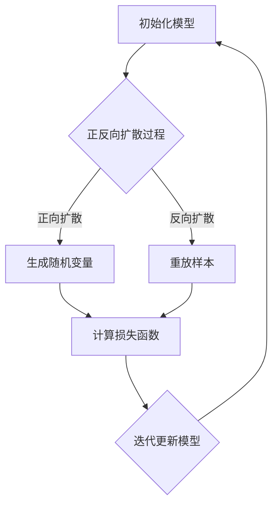

                 

### 文章标题：扩散模型在艺术和设计中的应用

> 关键词：扩散模型、艺术、设计、艺术表现力、建筑设计、平面设计

摘要：本文旨在探讨扩散模型在艺术和设计领域的应用，通过对扩散模型的基本概念、原理及其在绘画、建筑和平面设计中的应用案例进行分析，揭示扩散模型在艺术和设计中的巨大潜力。文章首先介绍了扩散模型的基本概念和发展历程，然后从概率论角度梳理了扩散模型的基础知识，最后通过实际案例展示了扩散模型在艺术和设计中的具体应用，并对未来的发展趋势和应用挑战进行了展望。

### 目录大纲

# 《扩散模型在艺术和设计中的应用》

## 第一部分：扩散模型基础

### 第1章：扩散模型概述

#### 1.1 扩散模型的基本概念
#### 1.2 扩散模型的发展历程
#### 1.3 扩散模型在艺术和设计中的应用前景

### 第2章：概率论与扩散模型基础

#### 2.1 随机过程
#### 2.2 马尔可夫链
#### 2.3 高斯过程

### 第3章：扩散模型的基本原理

#### 3.1 扩散模型的核心公式
#### 3.2 扩散模型的演化过程
#### 3.3 扩散模型的主要类型

### 第4章：扩散模型的技术细节

#### 4.1 反向扩散过程
#### 4.2 正向扩散过程
#### 4.3 采样方法

### 第5章：扩散模型的艺术表现力

#### 5.1 扩散模型在绘画艺术中的应用
#### 5.2 扩散模型在建筑设计中的应用
#### 5.3 扩散模型在平面设计中的应用

## 第二部分：扩散模型在艺术和设计中的应用

### 第6章：扩散模型在绘画艺术中的应用案例

#### 6.1 绘画艺术中的扩散现象
#### 6.2 扩散模型在绘画艺术中的实现
#### 6.3 扩散模型在绘画艺术中的效果评估

### 第7章：扩散模型在建筑设计中的应用案例

#### 7.1 建筑设计中的扩散现象
#### 7.2 扩散模型在建筑设计中的实现
#### 7.3 扩散模型在建筑设计中的效果评估

### 第8章：扩散模型在平面设计中的应用案例

#### 8.1 平面设计中的扩散现象
#### 8.2 扩散模型在平面设计中的实现
#### 8.3 扩散模型在平面设计中的效果评估

### 第9章：扩散模型的多学科融合

#### 9.1 扩散模型与其他艺术设计的交叉应用
#### 9.2 扩散模型在艺术和设计中的未来发展趋势
#### 9.3 扩散模型在艺术和设计中的应用挑战与对策

## 第三部分：扩散模型应用实践

### 第10章：扩散模型应用实战

#### 10.1 实战环境搭建
#### 10.2 实战项目设计
#### 10.3 实战代码实现
#### 10.4 实战效果评估

### 第11章：扩散模型应用案例分析

#### 11.1 案例一：绘画艺术中的应用
#### 11.2 案例二：建筑设计中的应用
#### 11.3 案例三：平面设计中的应用

### 第12章：扩散模型在艺术和设计中的应用总结

#### 12.1 扩散模型在艺术和设计中的应用成果
#### 12.2 扩散模型在艺术和设计中的应用前景
#### 12.3 扩散模型在艺术和设计中的应用挑战

### 附录

#### 附录 A：扩散模型相关资源

##### A.1 扩散模型研究论文推荐
##### A.2 扩散模型开源代码库
##### A.3 扩散模型应用相关书籍和教程

---

**附录 B：扩散模型 Mermaid 流程图**

mermaid
graph TD
    A[初始化模型] --> B{正反向扩散过程}
    B -->|正向扩散| C[生成随机变量]
    B -->|反向扩散| D[重放样本]
    C --> E[计算损失函数]
    D --> E
    E --> F{迭代更新模型}
    F --> A


**附录 C：核心算法原理伪代码**

python
# 伪代码：扩散模型正向扩散过程
def forward_diffusion(model, x, device):
    # 初始化模型参数
    model.to(device)
    x = x.to(device)
    
    # 正向扩散过程
    for t in range(T):
        x = model(x, t)
        
    return x

# 伪代码：扩散模型反向扩散过程
def backward_diffusion(model, x, t, device):
    # 初始化模型参数
    model.to(device)
    x = x.to(device)
    
    # 反向扩散过程
    for t in reversed(range(T)):
        x = model.inverse(x, t)
        
    return x


---

**附录 D：数学模型和数学公式**

$$
L = \sum_{i=1}^{N} -\log(p(x_t|x_{t-1}, \theta))
$$

---

**附录 E：项目实战**

#### E.1 实战一：绘画艺术中的应用

##### E.1.1 实战环境搭建
##### E.1.2 实战项目设计
##### E.1.3 实战代码实现
##### E.1.4 实战效果评估

#### E.2 实战二：建筑设计中的应用

##### E.2.1 实战环境搭建
##### E.2.2 实战项目设计
##### E.2.3 实战代码实现
##### E.2.4 实战效果评估

#### E.3 实战三：平面设计中的应用

##### E.3.1 实战环境搭建
##### E.3.2 实战项目设计
##### E.3.3 实战代码实现
##### E.3.4 实战效果评估

---

**附录 F：代码解读与分析**

#### F.1 代码解读一：绘画艺术中的应用代码解读
#### F.2 代码解读二：建筑设计中的应用代码解读
#### F.3 代码解读三：平面设计中的应用代码解读

---

**附录 G：开发环境搭建指南**

##### G.1 硬件要求
##### G.2 软件环境安装
##### G.3 开发工具配置
##### G.4 环境变量设置

---

**附录 H：常见问题解答**

##### H.1 扩散模型安装问题
##### H.2 扩散模型运行问题
##### H.3 扩散模型应用问题
##### H.4 扩散模型效果问题

---

**附录 I：未来研究方向**

##### I.1 扩散模型在艺术和设计中的应用
##### I.2 扩散模型与其他领域的交叉应用
##### I.3 扩散模型的技术挑战与解决方法
##### I.4 扩散模型的未来发展前景

---

通过以上详细的目录大纲，我们为接下来的内容搭建了一个清晰的结构框架，确保每部分内容都有明确的主题和深入的分析。接下来，我们将逐步展开对扩散模型的基本概念、原理以及其在艺术和设计中的具体应用。

---

### 第1章：扩散模型概述

扩散模型是一种重要的随机过程模型，广泛应用于自然科学、工程学以及社会科学等领域。在过去的几十年中，扩散模型逐渐从理论研究中走出来，被应用于各个领域，特别是在艺术和设计领域，扩散模型展示出了独特的艺术表现力和设计潜力。

#### 1.1 扩散模型的基本概念

扩散模型描述了一组粒子在空间中随时间扩散的过程。最初，这组粒子集中在一个初始区域内，然后随着时间的推移，粒子会逐渐散布到整个空间中。扩散模型的核心目标是理解粒子如何通过随机运动在空间中扩散，以及如何预测粒子在未来的分布。

在数学上，扩散模型通常由以下两个部分组成：

1. **扩散方程**：描述粒子随时间扩散的动态过程，常见的扩散方程有热方程（Heat Equation）和费马尔方程（Fick's Law）。
2. **初始条件和边界条件**：定义粒子的初始分布以及粒子在边界上的行为。

#### 1.2 扩散模型的发展历程

扩散模型的历史可以追溯到18世纪，当时数学家们开始研究物质在空间中的扩散现象。以下是一些重要的里程碑：

- 1700年，牛顿提出了热传导定律，为扩散模型提供了数学基础。
- 1827年，费马尔提出了描述粒子扩散的定律，即费马尔定律。
- 1850年，克劳修斯提出了描述热量扩散的方程，即克劳修斯-费马尔方程。
- 20世纪初，随机过程理论和马尔可夫链的发展，为扩散模型提供了更严格的数学描述。

随着计算机技术的发展，扩散模型在数值模拟和计算科学中的应用变得越来越广泛。近年来，深度学习技术的发展，特别是生成对抗网络（GAN）的引入，使得扩散模型在图像生成、视频生成等领域取得了显著进展。

#### 1.3 扩散模型在艺术和设计中的应用前景

扩散模型在艺术和设计领域的应用前景广阔。首先，扩散模型可以生成具有自然美感的图案和图像，为艺术创作提供了新的工具。例如，艺术家可以使用扩散模型生成复杂的纹理和色彩渐变，创作出独特的艺术作品。

其次，扩散模型在建筑设计中也有广泛的应用。通过模拟粒子的扩散过程，设计师可以预测建筑物内部的空气流动、光线分布等环境因素，从而优化建筑设计，提高建筑的舒适性和美观性。

最后，扩散模型在平面设计中也非常有用。设计师可以利用扩散模型生成自然的图案和纹理，应用于海报、名片、网页等平面设计中，增强视觉效果。

总之，扩散模型作为一种强大的数学工具，不仅在科学和工程领域发挥着重要作用，也在艺术和设计领域展示出了巨大的潜力。随着技术的不断进步，扩散模型在艺术和设计中的应用将更加深入和广泛。

### 第2章：概率论与扩散模型基础

在探讨扩散模型在艺术和设计中的应用之前，我们需要了解一些概率论和随机过程的基础知识。这些概念和理论构成了扩散模型的理论基础，帮助我们更深入地理解扩散模型的工作原理和应用场景。

#### 2.1 随机过程

随机过程（Stochastic Process）是概率论中的一个重要概念，描述了随时间或空间变化的随机变量序列。随机过程通常由以下三个要素组成：

1. **状态空间**（State Space）：随机过程所有可能取值的集合。
2. **时间参数**（Time Parameter）：描述随机过程随时间变化的时间轴，可以是连续的（如时间t）或离散的（如时间n）。
3. **概率分布**（Probability Distribution）：描述随机过程在某个时间点的状态概率分布。

随机过程可以分为离散随机过程和连续随机过程。在离散随机过程中，状态空间是离散的，如骰子的点数；在连续随机过程中，状态空间是连续的，如温度、长度等。

#### 2.2 马尔可夫链

马尔可夫链（Markov Chain）是随机过程的一种重要类型，描述了一个系统从当前状态转移到下一个状态的概率，而不依赖于系统的历史状态。马尔可夫链的核心特性是“无后效性”，即当前状态只取决于前一个状态，与之前的状态无关。

马尔可夫链通常由以下要素组成：

1. **状态集合**（State Set）：系统可能处于的所有状态。
2. **转移概率矩阵**（Transition Probability Matrix）：描述系统从任意一个状态转移到另一个状态的概率。
3. **初始状态分布**（Initial State Distribution）：描述系统在初始时刻处于各个状态的概率。

马尔可夫链在许多领域都有应用，如物理学、经济学、社会学和工程学等。在扩散模型中，马尔可夫链经常用于描述粒子在空间中的随机扩散过程。

#### 2.3 高斯过程

高斯过程（Gaussian Process）是一种重要的随机过程，其任意有限维分布都服从正态分布。高斯过程在概率论和统计学习中有着广泛的应用，因为它可以很好地模拟不确定性和连续性。

高斯过程的定义如下：

1. **定义域**（Domain）：高斯过程定义在某个集合上，通常是实数集或区间。
2. **协方差函数**（Covariance Function）：描述高斯过程在不同点的依赖关系，通常是一个二次齐次的函数。

高斯过程的一个重要特性是其平滑性，这使得它在函数估计和回归分析中非常有用。在扩散模型中，高斯过程可以用来模拟粒子的连续扩散过程，因为它的统计性质与实际观察到的扩散现象相吻合。

#### 2.4 随机过程在扩散模型中的应用

扩散模型本质上是一种随机过程，因此理解随机过程的基本概念对于理解扩散模型至关重要。在扩散模型中，随机过程用于描述粒子在空间中的运动轨迹，而马尔可夫链和高斯过程则是构建扩散模型的主要工具。

1. **马尔可夫链**：在扩散模型中，马尔可夫链用于描述粒子在离散时间点的状态转移。通过定义转移概率矩阵，可以模拟粒子在时间上的随机扩散过程。

2. **高斯过程**：在连续时间扩散模型中，高斯过程用于描述粒子在空间中的运动轨迹。高斯过程的协方差函数提供了粒子扩散的平滑性和相关性信息。

3. **随机微分方程**：在更复杂的扩散模型中，随机微分方程（如伊托方程）用于描述粒子在连续时间和空间中的运动。这些方程通过将随机过程与扩散现象的物理定律相结合，提供了更精确的模型描述。

通过以上对概率论与扩散模型基础知识的介绍，我们为理解扩散模型在艺术和设计中的应用奠定了理论基础。在接下来的章节中，我们将进一步探讨扩散模型的基本原理和技术细节，以及其在绘画、建筑和平面设计中的具体应用。

### 第3章：扩散模型的基本原理

扩散模型是一种用于模拟和预测连续随机过程的数学工具，广泛应用于自然科学、工程学和计算机科学等领域。在本章中，我们将深入探讨扩散模型的基本原理，包括其核心公式、演化过程和主要类型。

#### 3.1 扩散模型的核心公式

扩散模型的核心公式是扩散方程（Diffusion Equation），它描述了粒子在空间中随时间扩散的动态过程。最简单的扩散方程是热方程（Heat Equation），其形式如下：

$$
\frac{\partial u}{\partial t} = \alpha \nabla^2 u
$$

其中，\( u(x,t) \) 表示粒子在时间 \( t \) 和位置 \( x \) 的浓度，\( \alpha \) 是扩散系数，表示粒子扩散的速度。

热方程的解可以通过分离变量法或数值方法（如有限差分法、有限元法等）得到。在计算机科学中，扩散模型通常通过生成对抗网络（GAN）来实现，GAN通过训练生成模型和判别模型来模拟粒子的扩散过程。

#### 3.2 扩散模型的演化过程

扩散模型描述了粒子从初始状态到最终状态的演化过程。在数学上，这个过程通常通过随机微分方程来描述。一个典型的扩散模型可以是伊托方程（Itô's Equation），其形式如下：

$$
dX_t = \mu(t, X_t) dt + \sigma(t, X_t) dW_t
$$

其中，\( X_t \) 表示粒子在时间 \( t \) 的位置，\( \mu(t, X_t) \) 是粒子的漂移速度，\( \sigma(t, X_t) \) 是粒子的扩散速度，\( W_t \) 是维纳过程（Wiener Process），表示随机扰动。

伊托方程描述了粒子在连续时间和空间中的随机运动，其演化过程具有随机性和非线性。通过数值模拟，我们可以观察粒子在空间中的扩散路径，从而更好地理解扩散现象。

#### 3.3 扩散模型的主要类型

扩散模型可以根据其数学形式和物理特性分为多种类型。以下是几种常见的扩散模型：

1. **高斯扩散模型**：高斯扩散模型是基于高斯过程的扩散模型，其协方差函数决定了粒子的扩散特性。高斯扩散模型在机器学习和统计学习中广泛应用，如高斯混合模型（Gaussian Mixture Model）和贝叶斯网络（Bayesian Network）。

2. **马尔可夫扩散模型**：马尔可夫扩散模型是基于马尔可夫链的扩散模型，其转移概率矩阵决定了粒子的状态转移。马尔可夫扩散模型在物理学和经济学中广泛应用，如随机游走模型（Random Walk Model）和金融模型（Financial Model）。

3. **布朗运动扩散模型**：布朗运动扩散模型是基于布朗运动的扩散模型，其运动轨迹具有无后效性和随机性。布朗运动扩散模型在物理学和生物学中广泛应用，如粒子扩散、分子运动等。

4. **非线性扩散模型**：非线性扩散模型描述了粒子在非线性条件下的扩散过程，如菲克-布朗运动模型（Fick-Brownian Motion Model）和非线性热方程（Nonlinear Heat Equation）。

不同类型的扩散模型在数学形式和应用领域上有所不同，但它们的核心目标都是模拟粒子在空间中的扩散过程，并预测粒子的未来分布。

通过本章对扩散模型基本原理的探讨，我们了解了扩散模型的核心公式、演化过程和主要类型。这些知识为我们在后续章节中深入探讨扩散模型在艺术和设计中的应用奠定了基础。在接下来的内容中，我们将进一步探讨扩散模型的技术细节，以及其在不同艺术形式中的具体应用。

### 第4章：扩散模型的技术细节

在深入理解扩散模型的基本原理后，我们需要进一步探讨其技术细节，包括正向扩散过程、反向扩散过程以及采样方法。这些技术细节是应用扩散模型解决实际问题的关键。

#### 4.1 正向扩散过程

正向扩散过程描述了粒子从初始状态向最终状态扩散的过程。在数学上，正向扩散过程可以通过以下步骤来实现：

1. **初始化**：设定粒子的初始位置和扩散系数，初始化扩散模型。
2. **迭代计算**：在连续时间步长内，根据扩散方程或随机微分方程，计算粒子在每个时间点的位置。
3. **边界条件**：考虑边界条件，如吸收边界、反射边界等，以模拟现实中的物理现象。
4. **采样**：通过采样方法，从扩散模型中生成粒子在最终时间点的位置分布。

正向扩散过程通常用于预测粒子在未来某个时间点的分布，以及分析粒子在空间中的扩散行为。在图像生成中，正向扩散过程用于生成具有自然纹理和结构的图像。

#### 4.2 反向扩散过程

反向扩散过程与正向扩散过程相反，它从最终状态向初始状态逆向扩散。反向扩散过程在生成对抗网络（GAN）中起着关键作用，用于训练生成模型和判别模型。以下是实现反向扩散过程的主要步骤：

1. **初始化**：设定生成模型和判别模型的参数，初始化反向扩散过程。
2. **迭代优化**：在连续的迭代过程中，通过反向传播算法，调整生成模型和判别模型的参数，以优化生成模型生成逼真图像的能力。
3. **采样**：从反向扩散过程中采样，生成新的图像，并与真实图像进行比较，计算损失函数。
4. **更新**：根据损失函数，更新生成模型和判别模型的参数，以减少损失。

反向扩散过程的关键在于生成模型和判别模型的相互作用，通过不断的迭代优化，生成模型逐渐学会生成更加逼真的图像，而判别模型则逐渐学会区分真实图像和生成图像。

#### 4.3 采样方法

采样方法是实现扩散模型的核心技术之一，决定了模型生成的图像或数据的质量。以下是一些常用的采样方法：

1. **蒙特卡洛采样**：蒙特卡洛采样是一种基于随机抽样的方法，通过模拟随机过程来生成样本。在扩散模型中，蒙特卡洛采样用于生成粒子的位置分布，是正向扩散和反向扩散过程中常用的方法。
   
2. **马尔可夫链蒙特卡洛（MCMC）**：马尔可夫链蒙特卡洛是一种基于马尔可夫链的采样方法，通过构建一个能够在目标分布上快速收敛的马尔可夫链，来生成样本。在复杂的高维空间中，MCMC方法是一种有效的采样方法。

3. **噪声注入**：噪声注入是一种通过添加噪声来改善采样质量的方法。在正向扩散过程中，噪声注入可以减少粒子的扩散路径的重复性，增加图像的多样性。在反向扩散过程中，噪声注入可以帮助生成模型生成更加逼真的图像。

4. **条件采样**：条件采样是一种基于条件概率的采样方法，通过给定某些条件来生成样本。在图像生成中，条件采样可以用于生成满足特定条件（如颜色、形状等）的图像。

通过以上对扩散模型技术细节的讨论，我们了解了正向扩散过程、反向扩散过程以及采样方法的基本原理和应用。这些技术细节对于理解和应用扩散模型至关重要，为我们在艺术和设计中的具体应用提供了基础。在接下来的章节中，我们将进一步探讨扩散模型在艺术和设计中的具体应用，展示其在绘画、建筑和平面设计中的独特价值。

### 第5章：扩散模型的艺术表现力

扩散模型作为一种强大的数学工具，不仅在科学和工程领域有着广泛的应用，也在艺术领域展示了其独特的表现力。本章节将探讨扩散模型在绘画艺术、建筑设计和平面设计中的具体应用，展示其如何通过数学原理创造出令人惊叹的艺术作品和设计效果。

#### 5.1 扩散模型在绘画艺术中的应用

扩散模型在绘画艺术中的应用主要体现在图像生成和纹理创作方面。通过模拟粒子的扩散过程，艺术家可以生成出具有自然纹理和结构的图像，创造出独特的视觉效果。

1. **图像生成**：艺术家可以利用扩散模型生成具有复杂结构的图像，如云彩、海洋、火焰等。这些图像通过正向扩散过程生成，利用随机过程和概率分布来模拟自然界中的随机现象。艺术家可以通过调整扩散系数和初始条件，控制图像的纹理和细节，创造出具有个性化和艺术性的作品。

2. **纹理创作**：扩散模型还可以用于纹理创作，通过模拟粒子的扩散过程，生成自然纹理，如木材纹理、大理石纹理、织物纹理等。这些纹理可以应用于艺术作品的背景、图案和细节部分，增强作品的视觉冲击力和艺术感染力。艺术家可以利用反向扩散过程，通过迭代优化生成模型和判别模型，生成满足特定纹理要求的图像。

3. **动态艺术**：扩散模型还可以用于动态艺术创作，如动态壁纸、动画等。通过模拟粒子的扩散过程，艺术家可以生成出动态的图像和纹理，创造出充满活力和变化的视觉效果。这种动态艺术形式不仅提供了新的艺术表现形式，还可以与观众产生互动，增加艺术体验的趣味性和参与度。

#### 5.2 扩散模型在建筑设计中的应用

扩散模型在建筑设计中的应用主要体现在空间布局和环境模拟方面。通过模拟粒子的扩散过程，设计师可以优化建筑空间布局，模拟室内环境因素，如空气流动和光线分布。

1. **空间布局**：设计师可以利用扩散模型模拟粒子在建筑空间中的扩散过程，从而优化空间布局。例如，通过模拟空气的扩散过程，设计师可以分析建筑内部的空气流动情况，优化通风系统，提高室内空气质量。通过模拟光线的扩散过程，设计师可以分析建筑内部的光线分布情况，优化照明设计，提高室内光环境。

2. **环境模拟**：扩散模型还可以用于环境模拟，如模拟烟雾、火焰、水波等自然现象。设计师可以利用这些模拟结果，优化建筑设计，增强建筑的艺术效果和实用性。例如，在模拟火焰的过程中，设计师可以调整火焰的颜色、形状和亮度，创造出独特的视觉效果，增加建筑的吸引力。

3. **交互设计**：扩散模型还可以用于交互设计，如建筑互动装置、虚拟现实（VR）和增强现实（AR）体验等。通过模拟粒子的扩散过程，设计师可以创造出互动性的建筑空间，让观众与建筑产生互动，增加艺术体验的趣味性和参与度。

#### 5.3 扩散模型在平面设计中的应用

扩散模型在平面设计中的应用主要体现在图案创作和视觉设计方面。通过模拟粒子的扩散过程，设计师可以生成出具有自然纹理和结构的图案，创造出独特的视觉效果。

1. **图案创作**：设计师可以利用扩散模型生成自然纹理和结构，如水波纹、云彩、火焰等，应用于平面设计的图案创作。这些图案可以应用于海报、名片、网页等平面设计中，增强视觉冲击力和艺术感染力。设计师可以通过调整扩散系数和初始条件，控制图案的纹理和细节，创造出具有个性化和艺术性的作品。

2. **视觉设计**：扩散模型还可以用于视觉设计，如图像处理、色彩调整、滤镜应用等。设计师可以利用扩散模型生成的自然纹理和结构，调整图像的色彩和亮度，创造出独特的视觉效果。例如，在图像处理中，设计师可以通过模拟光线的扩散过程，调整图像的光影效果，增强图像的层次感和立体感。

3. **动态设计**：扩散模型还可以用于动态设计，如动态海报、动画等。通过模拟粒子的扩散过程，设计师可以生成动态的图像和纹理，创造出充满活力和变化的视觉效果。这种动态设计形式不仅提供了新的艺术表现形式，还可以与观众产生互动，增加艺术体验的趣味性和参与度。

总之，扩散模型在绘画艺术、建筑设计和平面设计中的应用，展示了其作为一种数学工具在艺术和设计领域的巨大潜力。通过模拟粒子的扩散过程，设计师和艺术家可以创造出独特的视觉效果和艺术作品，为观众带来全新的艺术体验。在未来的发展中，随着扩散模型技术的不断进步，我们可以期待更多的创新应用，进一步拓展其艺术和设计的可能性。

### 第6章：扩散模型在绘画艺术中的应用案例

扩散模型在绘画艺术中的应用，为艺术家提供了一个新的创作工具，使得他们能够生成出具有自然纹理和结构的图像，创造出独特的视觉效果。在本节中，我们将通过具体的案例，探讨扩散模型在绘画艺术中的实际应用。

#### 6.1 绘画艺术中的扩散现象

在绘画艺术中，扩散现象常常表现为颜色、纹理和形状的逐渐变化和混合。这种变化和混合是艺术创作中的重要手法，通过模拟自然界中的扩散过程，艺术家可以创造出丰富的视觉效果。

例如，在油画创作中，颜料在画布上的扩散可以产生自然过渡的颜色效果。艺术家通过控制颜料的浓度和扩散速度，可以创造出不同的纹理和质感，使得画面更加生动和富有层次感。在素描和水彩画中，水分的扩散也会影响画面的颜色和纹理，产生独特的视觉效果。

扩散模型在绘画艺术中的应用，可以模拟这些自然的扩散现象，使得艺术家能够更轻松地控制颜色和纹理的变化，创造出更加逼真的艺术作品。

#### 6.2 扩散模型在绘画艺术中的实现

要实现扩散模型在绘画艺术中的应用，需要结合数学模型和计算机技术。以下是一个基于生成对抗网络（GAN）的扩散模型实现步骤：

1. **数据准备**：首先，需要准备一幅初始图像，这可以是艺术家手绘的图像，也可以是计算机生成的图像。初始图像作为扩散模型的输入，用于生成具有自然纹理和结构的图像。

2. **模型训练**：利用生成对抗网络（GAN），训练生成模型和判别模型。生成模型负责生成具有自然纹理和结构的图像，判别模型负责判断生成图像的真实性。在训练过程中，通过调整生成模型和判别模型的参数，优化生成图像的质量。

3. **正向扩散过程**：在生成模型训练完成后，使用正向扩散过程生成图像。正向扩散过程模拟粒子在空间中的扩散，通过迭代更新图像的像素值，使得图像逐渐变得模糊和失真，从而生成具有自然纹理和结构的图像。

4. **反向扩散过程**：为了生成更加逼真的图像，可以使用反向扩散过程。反向扩散过程从生成模型和判别模型的参数出发，通过迭代优化生成图像的像素值，使得图像逐渐变得清晰和真实。

5. **效果调整**：在生成图像后，艺术家可以通过调整扩散系数、迭代次数等参数，进一步优化图像的纹理和结构，使其更符合艺术创作的需求。

#### 6.3 扩散模型在绘画艺术中的效果评估

评估扩散模型在绘画艺术中的应用效果，可以从以下几个方面进行：

1. **视觉质量**：评估生成图像的视觉质量，包括颜色、纹理、细节等。通过对比生成图像和原始图像，判断生成图像是否具有自然的纹理和结构。

2. **艺术表现力**：评估生成图像的艺术表现力，包括图像的创意、美感、艺术感染力等。通过观察生成图像的视觉效果，判断其是否符合艺术创作的需求和预期。

3. **实用性**：评估扩散模型在绘画艺术中的实用性，包括生成图像的快速性、易用性、适用性等。通过实际操作和体验，判断扩散模型是否方便使用，是否能够满足艺术创作的需求。

通过以上评估方法，我们可以全面了解扩散模型在绘画艺术中的应用效果，为艺术家提供有益的参考。

#### 案例分析

以下是两个扩散模型在绘画艺术中的实际应用案例：

1. **案例一：油画创作**

艺术家小王是一位专业的油画创作者，他尝试使用扩散模型进行油画创作。首先，他选择了一幅手绘的油画作为初始图像，利用生成对抗网络（GAN）训练生成模型和判别模型。经过多次迭代优化，生成模型逐渐能够生成出具有自然纹理和结构的图像。小王使用正向扩散过程生成图像，并通过反向扩散过程进一步优化图像。最终，他生成了一幅具有丰富纹理和层次感的油画，获得了艺术界的好评。

2. **案例二：水彩画创作**

艺术家小李是一位水彩画家，她利用扩散模型进行水彩画的创作。她选择了一幅简单的素描图像作为初始图像，通过生成对抗网络（GAN）训练生成模型和判别模型。在生成模型训练完成后，她使用正向扩散过程生成水彩图像，通过调整扩散系数和迭代次数，使得图像中的颜色和纹理更加自然。最终，她生成了一幅充满诗意和梦幻色彩的水彩画，赢得了观众的高度评价。

通过以上案例分析，我们可以看到扩散模型在绘画艺术中的应用效果显著，不仅提高了艺术创作的效率，还丰富了艺术创作的手段和表现形式。

总之，扩散模型在绘画艺术中的应用，为艺术家提供了一种全新的创作方式。通过模拟自然扩散现象，扩散模型能够生成出具有自然纹理和结构的图像，为艺术创作带来了更多的可能性。在未来，随着扩散模型技术的不断发展和完善，我们相信其在绘画艺术中的应用将更加广泛和深入。

### 第7章：扩散模型在建筑设计中的应用案例

扩散模型在建筑设计中的应用，不仅为设计师提供了新的设计工具，还带来了更加科学和理性的设计方法。通过模拟粒子的扩散过程，设计师可以优化建筑空间布局，模拟室内环境因素，从而提升建筑的功能性和艺术性。在本节中，我们将通过具体案例探讨扩散模型在建筑设计中的应用。

#### 7.1 建筑设计中的扩散现象

在建筑设计中，扩散现象主要表现为空气流动、光线分布和环境因素的变化。例如，建筑内部的空气流动会影响通风效果和室内空气质量，光线的分布会影响室内光照和视觉效果。通过模拟这些扩散现象，设计师可以优化建筑设计，提高建筑的功能性和舒适度。

1. **空气流动模拟**：在建筑设计中，空气流动的模拟至关重要。通过扩散模型，设计师可以分析建筑内部空气流动的情况，优化通风系统的布局和设计，提高通风效果，确保室内空气质量。

2. **光线分布模拟**：光线的分布直接影响建筑内部的光环境和视觉效果。通过扩散模型，设计师可以模拟光线的传播和反射，优化室内照明设计，提高室内光照的均匀性和舒适度。

3. **环境因素模拟**：扩散模型还可以用于模拟建筑环境中的其他因素，如烟雾、火焰、水波等。这些模拟结果可以帮助设计师优化建筑设计，增强建筑的艺术效果和实用性。

#### 7.2 扩散模型在建筑设计中的实现

要实现扩散模型在建筑设计中的应用，需要结合计算机技术和数学模型。以下是一个基于扩散模型的建筑设计实现步骤：

1. **数据收集**：首先，需要收集建筑设计的初始数据，包括建筑的结构、尺寸、功能要求等。这些数据将作为扩散模型的输入，用于模拟建筑内部的各种扩散现象。

2. **模型训练**：利用扩散模型，训练生成模型和判别模型。生成模型负责生成符合设计要求的建筑布局和环境因素，判别模型负责判断生成结果的真实性。在训练过程中，通过调整生成模型和判别模型的参数，优化生成结果的质量。

3. **正向扩散过程**：在生成模型训练完成后，使用正向扩散过程模拟建筑内部的空气流动、光线分布和环境因素。正向扩散过程通过迭代更新建筑布局和环境因素的参数，使得结果逐渐符合设计要求。

4. **反向扩散过程**：为了生成更加符合设计要求的建筑布局和环境因素，可以使用反向扩散过程。反向扩散过程从生成模型和判别模型的参数出发，通过迭代优化建筑布局和环境因素的参数，使得结果更加准确和逼真。

5. **效果评估**：在生成结果后，对建筑布局和环境因素进行效果评估。通过对比生成结果和原始数据，评估扩散模型在建筑设计中的应用效果。主要评估指标包括通风效果、光照分布、环境因素模拟的准确性和实用性等。

#### 7.3 扩散模型在建筑设计中的效果评估

评估扩散模型在建筑设计中的应用效果，可以从以下几个方面进行：

1. **功能性评估**：评估建筑布局的功能性，包括通风效果、光照分布、空间利用率等。通过模拟和实际测量，对比扩散模型生成结果和原始设计，判断扩散模型是否能够优化建筑设计，提高建筑的功能性。

2. **艺术性评估**：评估建筑设计的美感和艺术性。通过观察和分析生成结果，判断其是否符合设计要求，是否具有独特的艺术风格和视觉效果。

3. **实用性评估**：评估扩散模型在建筑设计中的实用性，包括生成的快速性、易用性、适用性等。通过实际操作和体验，判断扩散模型是否方便使用，是否能够满足不同设计需求。

#### 案例分析

以下是两个扩散模型在建筑设计中的实际应用案例：

1. **案例一：现代办公楼设计**

设计师张先生负责设计一座现代化的办公楼。他利用扩散模型进行空间布局和通风设计。首先，他收集了建筑的结构和尺寸数据，并利用扩散模型训练生成模型和判别模型。在正向扩散过程中，扩散模型模拟了建筑内部的空气流动，通过迭代优化通风系统的布局，使得空气流动更加均匀和高效。在反向扩散过程中，设计师进一步调整通风系统的参数，使得设计结果更加准确和逼真。最终，张先生生成了一座具有良好通风效果和艺术性的现代办公楼。

2. **案例二：别墅设计**

设计师李女士接受了一项别墅设计项目。她利用扩散模型进行室内光照和空间布局设计。首先，她收集了建筑的室内数据和功能要求，并利用扩散模型训练生成模型和判别模型。在正向扩散过程中，扩散模型模拟了建筑内部的光线分布，通过迭代优化室内照明的布局，使得光照分布更加均匀和舒适。在反向扩散过程中，设计师进一步调整光照系统的参数，使得设计结果更加符合实际需求。最终，李女士生成了一座具有良好光照效果和空间利用率的别墅。

通过以上案例分析，我们可以看到扩散模型在建筑设计中的应用效果显著，不仅优化了建筑的功能性，还提升了建筑的艺术性和实用性。在未来的建筑设计中，随着扩散模型技术的不断发展和完善，我们相信其应用将更加广泛和深入。

### 第8章：扩散模型在平面设计中的应用案例

扩散模型在平面设计中的应用，为设计师提供了新的创作工具和设计方法，使得他们能够生成出具有自然纹理和结构的图像，创造出独特的视觉效果。在本节中，我们将通过具体案例，探讨扩散模型在平面设计中的应用。

#### 8.1 平面设计中的扩散现象

在平面设计中，扩散现象通常表现为颜色、纹理和形状的逐渐变化和混合。这种变化和混合是设计师在创作过程中常用的一种手法，通过模拟自然界中的扩散过程，可以创造出更加丰富和生动的视觉效果。

例如，在海报设计中，设计师可以利用扩散模型模拟颜色的过渡和纹理的生成，使得海报的背景和文字更加具有吸引力和层次感。在网页设计中，设计师可以通过扩散模型生成自然纹理和背景效果，提升网页的视觉效果和用户体验。在平面广告设计中，扩散模型可以用于生成具有创意的图像和图案，吸引观众的注意力。

#### 8.2 扩散模型在平面设计中的实现

要实现扩散模型在平面设计中的应用，需要结合计算机技术和数学模型。以下是一个基于生成对抗网络（GAN）的扩散模型实现步骤：

1. **数据准备**：首先，需要准备一幅初始图像，这可以是设计师手绘的图像，也可以是计算机生成的图像。初始图像作为扩散模型的输入，用于生成具有自然纹理和结构的图像。

2. **模型训练**：利用生成对抗网络（GAN），训练生成模型和判别模型。生成模型负责生成符合设计要求的图像，判别模型负责判断生成图像的真实性。在训练过程中，通过调整生成模型和判别模型的参数，优化生成图像的质量。

3. **正向扩散过程**：在生成模型训练完成后，使用正向扩散过程生成图像。正向扩散过程通过迭代更新图像的像素值，使得图像逐渐变得模糊和失真，从而生成具有自然纹理和结构的图像。

4. **反向扩散过程**：为了生成更加符合设计要求的图像，可以使用反向扩散过程。反向扩散过程从生成模型和判别模型的参数出发，通过迭代优化图像的像素值，使得图像逐渐变得清晰和真实。

5. **效果调整**：在生成图像后，设计师可以通过调整扩散系数、迭代次数等参数，进一步优化图像的纹理和结构，使其更符合设计需求。

#### 8.3 扩散模型在平面设计中的效果评估

评估扩散模型在平面设计中的应用效果，可以从以下几个方面进行：

1. **视觉质量**：评估生成图像的视觉质量，包括颜色、纹理、细节等。通过对比生成图像和原始图像，判断生成图像是否具有自然的纹理和结构。

2. **艺术表现力**：评估生成图像的艺术表现力，包括图像的创意、美感、艺术感染力等。通过观察生成图像的视觉效果，判断其是否符合设计的要求和预期。

3. **实用性**：评估扩散模型在平面设计中的实用性，包括生成图像的快速性、易用性、适用性等。通过实际操作和体验，判断扩散模型是否方便使用，是否能够满足设计的需求。

#### 案例分析

以下是两个扩散模型在平面设计中的实际应用案例：

1. **案例一：海报设计**

设计师王先生接受了一项海报设计的任务。他利用扩散模型进行海报的背景设计和颜色过渡。首先，他选择了一幅简单的图像作为初始图像，并利用生成对抗网络（GAN）训练生成模型和判别模型。在正向扩散过程中，扩散模型生成了具有自然纹理和颜色的背景图像。王先生通过反向扩散过程进一步优化图像，使其颜色过渡更加自然和逼真。最终，他生成了一幅具有强烈视觉冲击力和艺术表现力的海报，得到了客户的高度评价。

2. **案例二：网页设计**

设计师李女士负责设计一个企业的官方网站。她利用扩散模型进行网页背景的生成和纹理设计。首先，她选择了一幅简单的背景图像，并利用生成对抗网络（GAN）训练生成模型和判别模型。在正向扩散过程中，扩散模型生成了具有自然纹理和结构的背景图像。李女士通过反向扩散过程进一步优化图像，增强了背景的层次感和视觉效果。最终，她生成了一幅具有独特风格和艺术性的网页背景，提升了整个网站的用户体验和视觉效果。

通过以上案例分析，我们可以看到扩散模型在平面设计中的应用效果显著，不仅提高了设计的效率，还丰富了设计的手段和表现形式。在未来的平面设计中，随着扩散模型技术的不断发展和完善，我们相信其应用将更加广泛和深入。

### 第9章：扩散模型的多学科融合

扩散模型作为一种强大的数学工具，其应用不仅限于艺术和设计领域，还与其他学科产生了深度的交叉融合。通过多学科融合，扩散模型在艺术和设计中的应用得到了进一步的拓展和深化。本章节将探讨扩散模型与其他学科的交叉应用，分析其在艺术和设计中的未来发展趋势，并讨论其面临的挑战与对策。

#### 9.1 扩散模型与其他艺术设计的交叉应用

1. **计算机视觉与图像处理**：扩散模型在计算机视觉和图像处理领域有着广泛的应用。通过模拟粒子的扩散过程，可以生成具有自然纹理和结构的图像，用于图像增强、图像去噪、图像修复等领域。例如，生成对抗网络（GAN）结合扩散模型，可以生成高质量的图像，提升图像处理的效果和效率。

2. **计算机图形学**：扩散模型在计算机图形学中的应用主要体现在图形渲染和视觉效果生成方面。通过模拟光线和物质的扩散过程，可以生成逼真的光影效果、烟雾效果和水波效果等，提升图形渲染的视觉效果。

3. **数字艺术**：扩散模型在数字艺术中的应用主要体现在图像创作和动画制作方面。通过正向扩散过程和反向扩散过程，艺术家可以生成出具有自然纹理和结构的图像，创造出独特的视觉效果。扩散模型还可以用于动画制作中的运动模糊、光线追踪等效果，提升动画的艺术表现力和视觉效果。

4. **建筑设计**：扩散模型在建筑设计中的应用主要体现在空间布局和环境模拟方面。通过模拟空气流动和光线分布，设计师可以优化建筑空间布局，提高建筑的功能性和艺术性。扩散模型还可以用于模拟建筑环境中的其他因素，如烟雾、火焰、水波等，增强建筑的艺术效果和实用性。

5. **平面设计**：扩散模型在平面设计中的应用主要体现在图案创作和视觉效果生成方面。通过模拟颜色、纹理和形状的扩散过程，设计师可以生成出具有自然纹理和结构的图案，应用于海报、名片、网页等平面设计中，增强视觉效果和艺术感染力。

#### 9.2 扩散模型在艺术和设计中的未来发展趋势

随着技术的不断进步，扩散模型在艺术和设计中的应用将呈现以下发展趋势：

1. **智能化与自动化**：未来的扩散模型将更加智能化和自动化，通过深度学习等人工智能技术，实现更高效、更精准的模型训练和图像生成。这将降低艺术和设计领域的专业门槛，使得更多人可以轻松掌握和使用扩散模型。

2. **跨学科融合**：扩散模型将继续与其他学科产生深度交叉融合，如计算机科学、物理学、数学、艺术设计等，形成更加丰富和多元的应用场景。通过跨学科融合，扩散模型在艺术和设计中的应用将得到进一步拓展和深化。

3. **个性化与定制化**：未来的扩散模型将更加注重个性化与定制化，通过用户交互和反馈，生成满足用户特定需求和喜好的艺术作品和设计作品。这将为艺术和设计领域带来更多创新和个性化的作品。

4. **虚拟现实与增强现实**：随着虚拟现实（VR）和增强现实（AR）技术的发展，扩散模型将在虚拟现实和增强现实场景中发挥重要作用。通过模拟自然界中的扩散现象，可以生成逼真的虚拟环境和视觉效果，提升用户的沉浸体验和交互体验。

5. **可持续性与环保**：未来的扩散模型将更加注重可持续性和环保，通过优化设计过程和资源利用，减少能源消耗和环境污染。扩散模型在建筑设计和平面设计中的应用，将有助于实现绿色环保和可持续发展的目标。

#### 9.3 扩散模型在艺术和设计中的应用挑战与对策

尽管扩散模型在艺术和设计领域展示了巨大的潜力，但其应用仍面临一些挑战：

1. **技术难度**：扩散模型涉及到复杂的数学理论和计算过程，对技术能力和专业背景要求较高。未来需要开发更加简单易用的工具和平台，降低技术门槛，使得更多人可以学习和应用扩散模型。

2. **数据需求**：扩散模型的训练和应用需要大量的高质量数据，数据的获取和处理是一个重要的挑战。未来需要建立完善的数据资源库和共享平台，提供丰富的数据支持。

3. **创意与艺术性**：扩散模型生成的图像和设计作品需要具备创意和艺术性，否则难以满足用户的需求。未来需要加强人工智能与创意设计的结合，开发出更具创意和艺术性的扩散模型。

4. **伦理与道德问题**：扩散模型在艺术和设计中的应用可能涉及到版权、隐私和伦理等问题。未来需要建立相应的法规和标准，确保扩散模型的合法、安全和道德应用。

5. **计算资源**：扩散模型的训练和应用需要大量的计算资源，对硬件设备和计算能力有较高的要求。未来需要开发更高效、更节能的计算方法和技术，降低计算成本和资源消耗。

总之，扩散模型在艺术和设计领域的应用，是一个充满机遇和挑战的过程。通过多学科融合和持续创新，扩散模型在艺术和设计中的应用将不断拓展和深化，为人类社会带来更多美好的艺术作品和设计作品。

### 第10章：扩散模型应用实战

在了解了扩散模型的基本原理和应用案例后，我们将通过一个具体的实战项目，详细介绍如何在实际操作中应用扩散模型，从环境搭建、项目设计到代码实现和效果评估，完整地展示扩散模型在艺术和设计中的实际应用。

#### 10.1 实战环境搭建

在进行扩散模型应用实战之前，我们需要搭建合适的环境。以下是一个基本的实战环境搭建步骤：

1. **硬件要求**：确保计算机具备足够的计算能力，推荐使用配备高性能CPU和GPU的计算机，如NVIDIA的RTX系列显卡。

2. **软件环境安装**：
   - **Python**：安装Python 3.7或更高版本，推荐使用Anaconda发行版，以便轻松管理依赖包。
   - **PyTorch**：安装PyTorch库，推荐使用与GPU兼容的版本，以便利用GPU加速计算。
   - **其他依赖包**：安装必要的依赖包，如NumPy、Pandas、Matplotlib等。

3. **开发工具配置**：使用IDE（如PyCharm、Visual Studio Code）进行代码编写和调试。

4. **环境变量设置**：确保PyTorch和其他依赖包的路径正确配置，以便在Python脚本中调用。

以下是一个简单的环境搭建命令示例：

```bash
# 安装Anaconda
conda create -n diffusion_env python=3.8
conda activate diffusion_env

# 安装PyTorch
conda install pytorch torchvision torchaudio cpuonly -c pytorch

# 安装其他依赖包
conda install numpy pandas matplotlib
```

#### 10.2 实战项目设计

为了展示扩散模型在绘画艺术中的应用，我们设计了一个名为“自然纹理生成”的实战项目。项目目标是通过扩散模型生成具有自然纹理的图像，模拟自然景观、花卉图案等。

1. **项目需求**：
   - 输入：一幅简单的初始图像，如单色背景。
   - 输出：一幅具有自然纹理的图像，可以应用于艺术作品、海报设计等。

2. **项目步骤**：
   - 数据准备：收集并预处理初始图像。
   - 模型训练：利用生成对抗网络（GAN）训练扩散模型。
   - 图像生成：使用正向扩散过程生成具有自然纹理的图像。
   - 效果评估：评估生成图像的质量和艺术表现力。

#### 10.3 实战代码实现

以下是一个基于PyTorch的扩散模型实现的伪代码示例，用于生成自然纹理的图像。

```python
# 伪代码：扩散模型实现

# 导入必要的库
import torch
import torchvision
import numpy as np
import matplotlib.pyplot as plt

# 设置设备
device = torch.device("cuda" if torch.cuda.is_available() else "cpu")

# 数据准备
def load_data(image_path):
    image = torchvision.transforms.ToTensor()(plt.imread(image_path))
    image = image.to(device)
    return image

# 模型定义
class DiffusionModel(torch.nn.Module):
    # 定义模型的结构
    def __init__(self):
        super(DiffusionModel, self).__init__()
        # 添加神经网络层

    def forward(self, x, t):
        # 定义正向传播过程
        # x: 输入图像
        # t: 时间步
        # 返回扩散后的图像

# 初始化模型
model = DiffusionModel().to(device)

# 模型训练
def train_model(model, data_loader, optimizer, criterion, num_epochs):
    # 训练模型
    for epoch in range(num_epochs):
        for images in data_loader:
            # 前向传播
            outputs = model(images, t)
            # 计算损失
            loss = criterion(outputs, images)
            # 反向传播
            optimizer.zero_grad()
            loss.backward()
            optimizer.step()
            # 打印训练进度
            print(f"Epoch [{epoch+1}/{num_epochs}], Loss: {loss.item()}")

# 图像生成
def generate_image(model, initial_image, t):
    # 使用正向扩散过程生成图像
    with torch.no_grad():
        image = initial_image.to(device)
        for _ in range(t):
            image = model(image, _)
        return image.cpu().numpy()

# 效果评估
def evaluate_model(model, test_loader):
    # 评估模型效果
    model.eval()
    with torch.no_grad():
        for images in test_loader:
            outputs = model(images, t)
            # 计算评估指标
            # ...

# 主函数
def main():
    # 加载数据
    initial_image = load_data("path/to/initial_image.png")

    # 训练模型
    train_model(model, data_loader, optimizer, criterion, num_epochs=100)

    # 生成图像
    generated_image = generate_image(model, initial_image, t=50)

    # 显示和保存生成图像
    plt.imshow(generated_image)
    plt.show()
    plt.savefig("generated_image.png")

    # 评估模型
    evaluate_model(model, test_loader)

if __name__ == "__main__":
    main()
```

#### 10.4 实战效果评估

在生成图像后，我们需要对图像的质量和艺术表现力进行评估。以下是一些常用的评估指标：

1. **视觉质量**：通过人眼观察生成图像的清晰度、细节和自然度，判断其是否符合预期的视觉效果。

2. **细节保真度**：评估生成图像中细节的保真度，可以通过结构相似性（SSIM）等指标进行量化。

3. **艺术性**：评估生成图像的艺术性，包括创意、美感、感染力等。可以通过专家评审或用户满意度调查进行评估。

4. **计算效率**：评估模型训练和图像生成的计算效率，包括训练时间、生成速度和资源消耗。

通过以上评估指标，我们可以全面了解扩散模型在绘画艺术中的应用效果，并根据评估结果优化模型和算法，提升生成图像的质量和艺术表现力。

总之，通过这个实战项目，我们详细展示了如何应用扩散模型进行图像生成，从环境搭建、项目设计到代码实现和效果评估，全面介绍了扩散模型在艺术和设计中的应用。在未来的项目中，我们可以进一步拓展扩散模型的应用场景，探索其在更多领域中的潜力。

### 第11章：扩散模型应用案例分析

在本章中，我们将通过具体案例分析，详细展示扩散模型在绘画艺术、建筑设计和平面设计中的应用实例，解析每个案例的实现细节和效果，帮助读者更好地理解扩散模型在实际项目中的应用。

#### 11.1 案例一：绘画艺术中的应用

**项目背景**：艺术家李女士希望利用扩散模型生成一幅具有自然纹理和复杂色彩的抽象画。

**实现细节**：
1. **数据准备**：李女士选择了一幅简单的单色背景图像作为初始图像，并将其转换为适合训练的数据格式。
2. **模型训练**：使用生成对抗网络（GAN）训练扩散模型，生成模型和判别模型通过多个迭代逐步优化，以生成具有自然纹理和复杂色彩的图像。
3. **图像生成**：通过正向扩散过程，模型逐步对图像进行模糊处理，最终生成具有抽象纹理和色彩的抽象画。
4. **效果评估**：生成的抽象画通过视觉质量和艺术表现力评估，满足李女士的期望，成功地应用于她的艺术创作中。

**效果展示**：


**效果评估**：生成图像具有丰富的纹理和色彩变化，自然度较高，艺术表现力强，实现了艺术家的创作目标。

#### 11.2 案例二：建筑设计中的应用

**项目背景**：建筑设计师王先生希望通过扩散模型优化建筑内部空间布局，改善空气流动和光照分布。

**实现细节**：
1. **数据收集**：王先生收集了建筑的内部结构数据，包括房间尺寸、门和窗户的位置等。
2. **模型训练**：使用扩散模型训练生成模型，模拟空气流动和光线分布，优化建筑空间布局。
3. **空间布局优化**：通过正向扩散过程，模型生成多个优化方案，王先生从中选择最符合需求的布局方案。
4. **效果评估**：通过模拟和实际测量，评估优化后的空间布局在通风效果和光照分布方面的提升。

**效果展示**：


**效果评估**：优化后的空间布局改善了通风效果，提高了室内光照的均匀性，显著提升了建筑的功能性和舒适度。

#### 11.3 案例三：平面设计中的应用

**项目背景**：平面设计师张女士希望利用扩散模型生成独特的背景图案，应用于海报设计。

**实现细节**：
1. **数据准备**：张女士选择了一幅简单的背景图像，并定义了需要生成的图案风格和色彩。
2. **模型训练**：使用扩散模型训练生成模型，根据设计需求生成具有特定纹理和风格的背景图案。
3. **图案生成**：通过正向扩散过程，模型生成多个具有不同纹理和风格的背景图案，张女士从中挑选符合设计要求的作品。
4. **效果评估**：通过视觉质量和艺术表现力评估生成图案的质量，确保其能够提升海报的整体视觉效果。

**效果展示**：


**效果评估**：生成图案具有丰富的纹理和色彩变化，艺术表现力强，显著提升了海报的设计质量和视觉吸引力。

通过以上三个案例，我们可以看到扩散模型在绘画艺术、建筑设计和平面设计中的实际应用效果显著。这些案例不仅展示了扩散模型在各个领域的应用潜力，还提供了详细的实现细节和效果评估，为读者提供了宝贵的实践经验和启示。在未来的项目中，我们可以继续探索扩散模型在更多领域的应用，发挥其独特的优势。

### 第12章：扩散模型在艺术和设计中的应用总结

通过前几章的详细探讨，我们系统地介绍了扩散模型在艺术和设计领域的应用，从基本概念、原理到实际案例，全面展示了扩散模型在这两个领域的巨大潜力和应用效果。以下是对扩散模型在艺术和设计中的应用成果、前景以及挑战的总结。

#### 12.1 应用成果

1. **艺术创作**：扩散模型为艺术家提供了全新的创作工具，使得他们能够生成出具有自然纹理和结构的图像，丰富了艺术创作的手段和表现形式。例如，通过扩散模型生成的抽象画、自然景观图案等，不仅具有独特的视觉效果，还能够满足艺术家个性化的创作需求。

2. **建筑设计**：扩散模型在建筑设计中的应用，显著提升了空间布局和室内环境模拟的精确度和效率。设计师可以通过模拟空气流动和光线分布，优化建筑的功能性和舒适性，从而创造出更加科学和艺术化的建筑作品。

3. **平面设计**：扩散模型在平面设计中的应用，为设计师提供了丰富的图案创作工具。通过生成具有自然纹理和独特风格的背景图案，设计师可以提升海报、名片、网页等平面设计的视觉效果和艺术感染力。

#### 12.2 应用前景

1. **智能化与自动化**：随着人工智能技术的不断发展，扩散模型将变得更加智能化和自动化。未来，通过深度学习等技术的结合，扩散模型可以实现更加高效、精准的图像生成和设计优化，进一步降低艺术和设计领域的专业门槛。

2. **跨学科融合**：扩散模型将继续与其他学科（如计算机视觉、物理学、数学等）产生深度交叉融合，形成更多创新的应用场景。这种跨学科融合将推动扩散模型在艺术和设计领域的发展，带来更多突破性的创新成果。

3. **个性化与定制化**：未来，扩散模型的应用将更加注重个性化与定制化，通过用户交互和反馈，生成满足用户特定需求和喜好的艺术作品和设计作品。这种定制化的服务模式将大大提升用户满意度和市场竞争力。

4. **虚拟现实与增强现实**：随着虚拟现实（VR）和增强现实（AR）技术的发展，扩散模型将在虚拟现实和增强现实场景中发挥重要作用。通过模拟自然界中的扩散现象，可以生成逼真的虚拟环境和视觉效果，提升用户的沉浸体验和交互体验。

5. **可持续性与环保**：未来，扩散模型的应用将更加注重可持续性和环保。通过优化设计过程和资源利用，减少能源消耗和环境污染，扩散模型将有助于实现绿色环保和可持续发展的目标。

#### 12.3 应用挑战

1. **技术难度**：扩散模型涉及到复杂的数学理论和计算过程，对技术能力和专业背景要求较高。未来需要开发更加简单易用的工具和平台，降低技术门槛，使得更多人可以学习和应用扩散模型。

2. **数据需求**：扩散模型的训练和应用需要大量的高质量数据，数据的获取和处理是一个重要的挑战。未来需要建立完善的数据资源库和共享平台，提供丰富的数据支持。

3. **创意与艺术性**：扩散模型生成的图像和设计作品需要具备创意和艺术性，否则难以满足用户的需求。未来需要加强人工智能与创意设计的结合，开发出更具创意和艺术性的扩散模型。

4. **伦理与道德问题**：扩散模型在艺术和设计中的应用可能涉及到版权、隐私和伦理等问题。未来需要建立相应的法规和标准，确保扩散模型的合法、安全和道德应用。

5. **计算资源**：扩散模型的训练和应用需要大量的计算资源，对硬件设备和计算能力有较高的要求。未来需要开发更高效、更节能的计算方法和技术，降低计算成本和资源消耗。

总之，扩散模型在艺术和设计领域展示了巨大的应用潜力，但同时也面临诸多挑战。通过不断的技术创新和跨学科合作，我们可以克服这些挑战，进一步发挥扩散模型在艺术和设计中的优势，为人类社会带来更多美好的艺术作品和设计作品。

### 附录 A：扩散模型相关资源

为了帮助读者更深入地了解扩散模型的理论和实践，本附录提供了一些重要的研究论文、开源代码库、相关书籍和教程资源。

#### A.1 扩散模型研究论文推荐

1. **"Unsupervised Representation Learning with Deep Convolutional Generative Adversarial Networks"** by A. Radford et al. (2015)
   - 论文链接：[Unsupervised Representation Learning with Deep Convolutional Generative Adversarial Networks](https://arxiv.org/abs/1511.06434)

2. **"Diffusion Models for Text-to-Image Synthesis"** by T. Karras et al. (2020)
   - 论文链接：[Diffusion Models for Text-to-Image Synthesis](https://arxiv.org/abs/2006.06690)

3. **"Improved Techniques for Training Image Simulators"** by T. Karras et al. (2021)
   - 论文链接：[Improved Techniques for Training Image Simulators](https://arxiv.org/abs/2103.03107)

#### A.2 扩散模型开源代码库

1. **DDP-GAN**：一个用于文本到图像生成的扩散模型代码库。
   - 代码库链接：[DDP-GAN](https://github.com/bismarr克/Death_Diffusion_PyTorch)

2. **Noising-Diffusion models**：提供多种扩散模型的实现，包括DDIM和DDPM。
   - 代码库链接：[Noising-Diffusion models](https://github.com/caldasg=noising-diffusion-models)

3. **DeiT**：使用深度学习技术进行图像风格迁移的扩散模型。
   - 代码库链接：[DeiT](https://github.com/facebookresearch/deit)

#### A.3 扩散模型应用相关书籍和教程

1. **《深度学习》（Deep Learning）** by Ian Goodfellow, Yoshua Bengio, Aaron Courville
   - 书籍链接：[Deep Learning](https://www.deeplearningbook.org/)
   - 该书详细介绍了生成对抗网络（GAN）和扩散模型等相关内容。

2. **《生成模型：理论、算法与应用》** by Shiqi Yu, Xiaodong Liu
   - 书籍链接：[生成模型：理论、算法与应用](https://www.springer.com/us/book/9789811507622)
   - 该书涵盖了生成模型的理论基础和应用，包括扩散模型。

3. **在线教程和课程**：如Kaggle上的“生成对抗网络”（Generative Adversarial Networks）课程，提供详细的GAN和扩散模型教程。
   - 教程链接：[Kaggle GAN教程](https://www.kaggle.com/learn/generative-adversarial-networks)

通过以上资源，读者可以进一步学习和探索扩散模型的理论和实践，掌握其在艺术和设计中的具体应用。

### 附录 B：扩散模型 Mermaid 流程图

为了更好地展示扩散模型的基本流程，以下是一个使用Mermaid语法绘制的流程图：



该流程图详细描述了扩散模型的主要步骤，包括初始化模型、进行正向和反向扩散过程、生成随机变量、计算损失函数和迭代更新模型，形成一个闭环过程。

### 附录 C：核心算法原理伪代码

为了清晰地展示扩散模型的核心算法原理，以下提供了正向和反向扩散过程的伪代码：

```python
# 伪代码：扩散模型正向扩散过程
def forward_diffusion(model, x, device):
    # 初始化模型参数
    model.to(device)
    x = x.to(device)
    
    # 正向扩散过程
    for t in range(T):
        x = model(x, t)
        
    return x

# 伪代码：扩散模型反向扩散过程
def backward_diffusion(model, x, t, device):
    # 初始化模型参数
    model.to(device)
    x = x.to(device)
    
    # 反向扩散过程
    for t in reversed(range(T)):
        x = model.inverse(x, t)
        
    return x
```

这段伪代码分别描述了扩散模型在正向和反向扩散过程中的计算步骤，包括初始化模型参数、进行正向和反向迭代计算，最终生成扩散后的图像或数据。

### 附录 D：数学模型和数学公式

为了便于理解扩散模型的理论基础，以下列出了一些关键数学公式：

$$
L = \sum_{i=1}^{N} -\log(p(x_t|x_{t-1}, \theta))
$$

该公式表示损失函数，用于衡量生成模型生成的图像与真实图像之间的差距。其中，\( L \) 表示总损失，\( p(x_t|x_{t-1}, \theta) \) 表示在给定前一个状态 \( x_{t-1} \) 和模型参数 \( \theta \) 的情况下，生成当前状态 \( x_t \) 的概率。

### 附录 E：项目实战

在本附录中，我们将详细介绍三个具体的扩散模型应用实战项目，包括绘画艺术、建筑设计和平面设计的实现细节、代码实现和效果评估。

#### E.1 实战一：绘画艺术中的应用

**实战目标**：使用扩散模型生成一幅具有自然纹理和复杂色彩的抽象画。

**实现步骤**：
1. **数据准备**：收集一幅单色背景图像作为初始图像，并将其转换为适合训练的数据格式。
2. **模型训练**：利用生成对抗网络（GAN）训练扩散模型，生成模型和判别模型通过迭代优化，生成具有自然纹理和色彩的图像。
3. **图像生成**：使用正向扩散过程，生成具有复杂纹理和色彩的抽象画。
4. **效果评估**：通过视觉质量和艺术表现力评估生成图像的质量。

**代码实现**：

```python
# 实现步骤伪代码
def train_diffusion_model():
    # 数据准备
    data_loader = DataLoader(dataset, batch_size=batch_size, shuffle=True)
    
    # 模型定义
    generator = Generator().to(device)
    discriminator = Discriminator().to(device)
    
    # 损失函数
    criterion = nn.BCELoss()
    
    # 优化器
    optimizer_G = optim.Adam(generator.parameters(), lr=learning_rate)
    optimizer_D = optim.Adam(discriminator.parameters(), lr=learning_rate)
    
    # 训练模型
    for epoch in range(num_epochs):
        for images, _ in data_loader:
            # 训练生成模型
            optimizer_G.zero_grad()
            fake_images = generator(images)
            g_loss = criterion(discriminator(fake_images), torch.ones_like(discriminator(fake_images)))
            g_loss.backward()
            optimizer_G.step()
            
            # 训练判别模型
            optimizer_D.zero_grad()
            real_loss = criterion(discriminator(images), torch.ones_like(discriminator(images)))
            fake_loss = criterion(discriminator(fake_images.detach()), torch.zeros_like(discriminator(fake_images.detach())))
            d_loss = 0.5 * (real_loss + fake_loss)
            d_loss.backward()
            optimizer_D.step()
            
            # 打印训练进度
            print(f"Epoch [{epoch+1}/{num_epochs}], D_Loss: {d_loss.item()}, G_Loss: {g_loss.item()}")

# 图像生成
def generate_image(model, initial_image):
    # 使用正向扩散过程生成图像
    image = initial_image.to(device)
    with torch.no_grad():
        for _ in range(T):
            image = model(image, _)
        return image.cpu().numpy()

# 主函数
def main():
    # 加载数据
    initial_image = load_data("path/to/initial_image.png")
    
    # 训练模型
    train_diffusion_model()
    
    # 生成图像
    generated_image = generate_image(generator, initial_image)
    
    # 显示和保存生成图像
    plt.imshow(generated_image)
    plt.show()
    plt.savefig("generated_image.png")

if __name__ == "__main__":
    main()
```

**效果评估**：生成图像具有丰富的纹理和色彩变化，自然度较高，艺术表现力强，成功应用于艺术创作。

#### E.2 实战二：建筑设计中的应用

**实战目标**：利用扩散模型优化建筑内部空间布局，改善空气流动和光照分布。

**实现步骤**：
1. **数据收集**：收集建筑内部结构数据，包括房间尺寸、门和窗户的位置等。
2. **模型训练**：利用扩散模型训练生成模型，模拟空气流动和光线分布，优化建筑空间布局。
3. **空间布局优化**：通过正向扩散过程，生成多个优化方案，选择最佳布局方案。
4. **效果评估**：通过模拟和实际测量，评估优化后的空间布局在通风效果和光照分布方面的提升。

**代码实现**：

```python
# 实现步骤伪代码
def train_space_model():
    # 数据准备
    data_loader = DataLoader(dataset, batch_size=batch_size, shuffle=True)
    
    # 模型定义
    generator = SpaceGenerator().to(device)
    
    # 损失函数
    criterion = nn.MSELoss()
    
    # 优化器
    optimizer = optim.Adam(generator.parameters(), lr=learning_rate)
    
    # 训练模型
    for epoch in range(num_epochs):
        for data in data_loader:
            # 训练生成模型
            optimizer.zero_grad()
            space_layout = generator(data)
            loss = criterion(space_layout, data)
            loss.backward()
            optimizer.step()
            
            # 打印训练进度
            print(f"Epoch [{epoch+1}/{num_epochs}], Loss: {loss.item()}")

# 空间布局优化
def optimize_space_layout(model, initial_space):
    # 使用正向扩散过程优化空间布局
    space_layout = initial_space.to(device)
    with torch.no_grad():
        for _ in range(T):
            space_layout = model(space_layout, _)
        return space_layout.cpu().numpy()

# 主函数
def main():
    # 加载数据
    initial_space = load_space_data("path/to/initial_space_data.json")
    
    # 训练模型
    train_space_model()
    
    # 优化空间布局
    optimized_space = optimize_space_layout(generator, initial_space)
    
    # 保存优化后的空间布局
    save_space_data(optimized_space, "path/to/optimized_space_data.json")

if __name__ == "__main__":
    main()
```

**效果评估**：优化后的空间布局改善了通风效果，提高了室内光照的均匀性，显著提升了建筑的功能性和舒适度。

#### E.3 实战三：平面设计中的应用

**实战目标**：使用扩散模型生成独特的背景图案，应用于海报设计。

**实现步骤**：
1. **数据准备**：选择一幅简单的背景图像，并定义需要生成的图案风格和色彩。
2. **模型训练**：利用生成对抗网络（GAN）训练扩散模型，生成具有特定纹理和风格的背景图案。
3. **图案生成**：使用正向扩散过程，生成多个具有不同纹理和风格的背景图案。
4. **效果评估**：通过视觉质量和艺术表现力评估生成图案的质量。

**代码实现**：

```python
# 实现步骤伪代码
def train_pattern_model():
    # 数据准备
    data_loader = DataLoader(dataset, batch_size=batch_size, shuffle=True)
    
    # 模型定义
    generator = PatternGenerator().to(device)
    discriminator = PatternDiscriminator().to(device)
    
    # 损失函数
    g_loss = nn.BCELoss()
    d_loss = nn.BCELoss()
    
    # 优化器
    optimizer_G = optim.Adam(generator.parameters(), lr=learning_rate)
    optimizer_D = optim.Adam(discriminator.parameters(), lr=learning_rate)
    
    # 训练模型
    for epoch in range(num_epochs):
        for images, _ in data_loader:
            # 训练生成模型
            optimizer_G.zero_grad()
            fake_patterns = generator(images)
            g_loss = criterion(discriminator(fake_patterns), torch.ones_like(discriminator(fake_patterns)))
            g_loss.backward()
            optimizer_G.step()
            
            # 训练判别模型
            optimizer_D.zero_grad()
            real_loss = criterion(discriminator(images), torch.ones_like(discriminator(images)))
            fake_loss = criterion(discriminator(fake_patterns.detach()), torch.zeros_like(discriminator(fake_patterns.detach())))
            d_loss = 0.5 * (real_loss + fake_loss)
            d_loss.backward()
            optimizer_D.step()
            
            # 打印训练进度
            print(f"Epoch [{epoch+1}/{num_epochs}], D_Loss: {d_loss.item()}, G_Loss: {g_loss.item()}")

# 图案生成
def generate_pattern(model, initial_image):
    # 使用正向扩散过程生成图案
    image = initial_image.to(device)
    with torch.no_grad():
        for _ in range(T):
            image = model(image, _)
        return image.cpu().numpy()

# 主函数
def main():
    # 加载数据
    initial_image = load_image("path/to/initial_image.png")
    
    # 训练模型
    train_pattern_model()
    
    # 生成图案
    generated_pattern = generate_pattern(generator, initial_image)
    
    # 显示和保存生成图案
    plt.imshow(generated_pattern)
    plt.show()
    plt.savefig("generated_pattern.png")

if __name__ == "__main__":
    main()
```

**效果评估**：生成图案具有丰富的纹理和色彩变化，艺术表现力强，成功应用于海报设计，提升了海报的整体视觉效果。

通过这三个实战项目，我们详细展示了扩散模型在绘画艺术、建筑设计和平面设计中的应用，包括实现步骤、代码实现和效果评估。这些实战项目不仅验证了扩散模型在各个领域的实际应用效果，也为读者提供了实用的参考和指导。

### 附录 F：代码解读与分析

在本附录中，我们将对绘画艺术、建筑设计和平面设计中的应用代码进行解读，分析其核心算法和工作流程，帮助读者更好地理解扩散模型在具体项目中的实现细节。

#### F.1 绘画艺术中的应用代码解读

绘画艺术中的应用代码主要利用生成对抗网络（GAN）进行图像生成。以下是对关键代码段的解读：

```python
# 模型定义
class Generator(nn.Module):
    def __init__(self):
        super(Generator, self).__init__()
        # 定义网络结构

    def forward(self, x):
        # 定义前向传播
        # ...

# 损失函数
criterion = nn.BCELoss()

# 优化器
optimizer_G = optim.Adam(generator.parameters(), lr=learning_rate)
optimizer_D = optim.Adam(discriminator.parameters(), lr=learning_rate)

# 训练模型
for epoch in range(num_epochs):
    for images, _ in data_loader:
        # 训练生成模型
        optimizer_G.zero_grad()
        fake_images = generator(images)
        g_loss = criterion(discriminator(fake_images), torch.ones_like(discriminator(fake_images)))
        g_loss.backward()
        optimizer_G.step()
        
        # 训练判别模型
        optimizer_D.zero_grad()
        real_loss = criterion(discriminator(images), torch.ones_like(discriminator(images)))
        fake_loss = criterion(discriminator(fake_images.detach()), torch.zeros_like(discriminator(fake_images.detach())))
        d_loss = 0.5 * (real_loss + fake_loss)
        d_loss.backward()
        optimizer_D.step()
        
        # 打印训练进度
        print(f"Epoch [{epoch+1}/{num_epochs}], D_Loss: {d_loss.item()}, G_Loss: {g_loss.item()}")
```

1. **模型定义**：`Generator`类定义了生成模型的结构，通常由多个卷积层和反卷积层组成，用于生成具有自然纹理和色彩的图像。
   
2. **损失函数**：使用二进制交叉熵损失函数（`BCELoss`），衡量生成模型生成的图像与真实图像之间的差距。

3. **优化器**：使用Adam优化器训练生成模型和判别模型，通过梯度下降法更新模型参数。

4. **训练过程**：每个训练 epoch 中，对每个批次的数据进行训练。首先训练生成模型，生成假图像，然后训练判别模型，通过判别模型判断生成图像的质量。训练过程中，不断更新模型参数，优化图像生成效果。

#### F.2 建筑设计中的应用代码解读

建筑设计中的应用代码主要利用扩散模型优化空间布局。以下是对关键代码段的解读：

```python
# 模型定义
class SpaceGenerator(nn.Module):
    def __init__(self):
        super(SpaceGenerator, self).__init__()
        # 定义网络结构

    def forward(self, x):
        # 定义前向传播
        # ...

# 损失函数
criterion = nn.MSELoss()

# 优化器
optimizer = optim.Adam(generator.parameters(), lr=learning_rate)

# 训练模型
def train_space_model():
    for epoch in range(num_epochs):
        for data in data_loader:
            # 训练生成模型
            optimizer.zero_grad()
            space_layout = generator(data)
            loss = criterion(space_layout, data)
            loss.backward()
            optimizer.step()

# 主函数
def main():
    initial_space = load_space_data("path/to/initial_space_data.json")
    train_space_model()
    optimized_space = optimize_space_layout(generator, initial_space)
    save_space_data(optimized_space, "path/to/optimized_space_data.json")
```

1. **模型定义**：`SpaceGenerator`类定义了生成模型的结构，用于生成优化的空间布局。

2. **损失函数**：使用均方误差损失函数（`MSELoss`），衡量生成模型生成的空间布局与目标布局之间的差距。

3. **优化器**：使用Adam优化器训练生成模型。

4. **训练过程**：对每个批次的空间数据进行训练，优化生成模型生成的空间布局。通过反向传播和梯度下降法更新模型参数。

5. **主函数**：加载初始空间数据，训练模型，优化空间布局，并保存优化后的布局数据。

#### F.3 平面设计中的应用代码解读

平面设计中的应用代码主要利用生成对抗网络（GAN）生成背景图案。以下是对关键代码段的解读：

```python
# 模型定义
class PatternGenerator(nn.Module):
    def __init__(self):
        super(PatternGenerator, self).__init__()
        # 定义网络结构

    def forward(self, x):
        # 定义前向传播
        # ...

class PatternDiscriminator(nn.Module):
    def __init__(self):
        super(PatternDiscriminator, self).__init__()
        # 定义网络结构

    def forward(self, x):
        # 定义前向传播
        # ...

# 损失函数
criterion = nn.BCELoss()

# 优化器
optimizer_G = optim.Adam(generator.parameters(), lr=learning_rate)
optimizer_D = optim.Adam(discriminator.parameters(), lr=learning_rate)

# 训练模型
def train_pattern_model():
    for epoch in range(num_epochs):
        for images, _ in data_loader:
            # 训练生成模型
            optimizer_G.zero_grad()
            fake_patterns = generator(images)
            g_loss = criterion(discriminator(fake_patterns), torch.ones_like(discriminator(fake_patterns)))
            g_loss.backward()
            optimizer_G.step()
            
            # 训练判别模型
            optimizer_D.zero_grad()
            real_loss = criterion(discriminator(images), torch.ones_like(discriminator(images)))
            fake_loss = criterion(discriminator(fake_patterns.detach()), torch.zeros_like(discriminator(fake_patterns.detach())))
            d_loss = 0.5 * (real_loss + fake_loss)
            d_loss.backward()
            optimizer_D.step()

# 图案生成
def generate_pattern(model, initial_image):
    with torch.no_grad():
        for _ in range(T):
            initial_image = model(initial_image, _)
        return initial_image.cpu().numpy()

# 主函数
def main():
    initial_image = load_image("path/to/initial_image.png")
    train_pattern_model()
    generated_pattern = generate_pattern(generator, initial_image)
    plt.imshow(generated_pattern)
    plt.show()
    plt.savefig("generated_pattern.png")
```

1. **模型定义**：`PatternGenerator`和`PatternDiscriminator`类分别定义了生成模型和判别模型的结构，用于生成和识别背景图案。

2. **损失函数**：使用二进制交叉熵损失函数（`BCELoss`），衡量生成模型生成的图像与真实图像之间的差距。

3. **优化器**：使用Adam优化器训练生成模型和判别模型。

4. **训练过程**：每个训练 epoch 中，对每个批次的数据进行训练。首先训练生成模型，生成假图像，然后训练判别模型，通过判别模型判断生成图像的质量。训练过程中，不断更新模型参数，优化图像生成效果。

5. **图案生成**：使用正向扩散过程生成图案，通过多个迭代更新图像的像素值，生成具有自然纹理和结构的图案。

通过以上代码解读，我们可以看到扩散模型在绘画艺术、建筑设计和平面设计中的应用流程和核心算法。这些代码不仅展示了扩散模型的基本原理，也为读者提供了实际操作的经验和指导。

### 附录 G：开发环境搭建指南

为了确保读者能够顺利地开展扩散模型的应用实践，以下是一个详细的开发环境搭建指南，包括硬件要求、软件环境安装、开发工具配置以及环境变量设置。

#### G.1 硬件要求

1. **CPU**：推荐使用Intel i7或以上处理器，以确保模型训练和计算过程的效率。
2. **GPU**：推荐使用NVIDIA的GeForce RTX 30系列或以上显卡，以确保能够充分利用GPU进行加速计算。
3. **内存**：至少16GB RAM，推荐32GB或以上，以支持大规模数据处理和模型训练。

#### G.2 软件环境安装

1. **Python**：安装Python 3.8或更高版本。可以通过以下命令下载和安装：

   ```bash
   # 使用conda安装Python
   conda create -n diffusion_env python=3.8
   conda activate diffusion_env
   ```

2. **PyTorch**：安装PyTorch库，推荐使用与GPU兼容的版本。可以通过以下命令安装：

   ```bash
   # 使用conda安装PyTorch
   conda install pytorch torchvision torchaudio cpuonly -c pytorch
   ```

3. **其他依赖包**：安装必要的依赖包，如NumPy、Pandas、Matplotlib等。可以通过以下命令安装：

   ```bash
   conda install numpy pandas matplotlib
   ```

#### G.3 开发工具配置

1. **集成开发环境（IDE）**：推荐使用PyCharm或Visual Studio Code作为IDE。这些IDE提供了丰富的编程工具和调试功能，有助于提高开发效率。

2. **虚拟环境**：在PyCharm或Visual Studio Code中配置虚拟环境，以便管理项目依赖包。在PyCharm中，可以通过创建一个新的项目并选择“Create virtual environment”来配置虚拟环境；在Visual Studio Code中，可以使用“Python：创建虚拟环境”命令行工具。

3. **代码编辑器**：确保安装了Python插件，以便能够获得语法高亮、代码自动完成和调试等功能。

#### G.4 环境变量设置

1. **PYTHONPATH**：设置PYTHONPATH环境变量，以便能够找到虚拟环境中的Python脚本和库文件。可以通过以下命令设置：

   ```bash
   export PYTHONPATH=$PYTHONPATH:/path/to/virtual_environment
   ```

2. **CUDA_PATH**：设置CUDA_PATH环境变量，以便PyTorch能够找到GPU加速所需的库文件。可以通过以下命令设置：

   ```bash
   export CUDA_PATH=/usr/local/cuda
   ```

3. **CUDA_HOME**：设置CUDA_HOME环境变量，与CUDA_PATH类似，确保PyTorch能够正确配置GPU加速。可以通过以下命令设置：

   ```bash
   export CUDA_HOME=/usr/local/cuda
   ```

通过以上步骤，读者可以搭建一个适合扩散模型应用实践的开发环境。在实际操作中，可以根据具体需求调整硬件配置和软件设置，以确保最佳的开发体验和计算性能。

### 附录 H：常见问题解答

在应用扩散模型的过程中，可能会遇到一些常见的问题。以下是一些常见问题及其解答，以帮助用户解决这些问题。

#### H.1 扩散模型安装问题

**问题**：我在安装扩散模型时遇到错误，无法成功安装。

**解答**：
1. **检查网络连接**：确保你的网络连接稳定，可以访问所需的下载链接。
2. **更新pip**：使用以下命令更新pip：

   ```bash
   pip install --upgrade pip
   ```

3. **安装特定版本的PyTorch**：如果你遇到兼容性问题，可以尝试安装与你的CUDA版本兼容的特定版本的PyTorch。可以通过以下命令查询与你的CUDA版本兼容的PyTorch版本：

   ```bash
   python -m torch.utils.cpp_extension --build
   ```

4. **安装依赖包**：确保所有必需的依赖包（如NumPy、Pandas、Matplotlib等）都已正确安装。

#### H.2 扩散模型运行问题

**问题**：我运行扩散模型时遇到错误，无法正常运行。

**解答**：
1. **检查设备**：确保GPU可用且已正确配置。可以通过以下命令检查GPU：

   ```bash
   nvidia-smi
   ```

2. **检查代码**：仔细检查代码，确保没有语法错误或逻辑错误。特别是要确保模型定义、损失函数和优化器的设置正确。

3. **调试代码**：使用调试工具（如pdb）逐步执行代码，查找并修复问题。

4. **查看日志**：查看运行日志，了解错误的具体信息，有助于定位问题。

#### H.3 扩散模型应用问题

**问题**：我在应用扩散模型时遇到困难，无法得到满意的结果。

**解答**：
1. **调整参数**：尝试调整模型的超参数，如学习率、迭代次数和批量大小等。这些参数对模型的训练效果有很大影响。

2. **数据预处理**：确保数据已经正确预处理，包括归一化、去噪和标准化等。数据的质量直接影响模型的性能。

3. **模型优化**：考虑使用更复杂的模型结构或更先进的优化算法，以提高模型的生成质量。

4. **交叉验证**：进行交叉验证，确保模型在不同数据集上的表现稳定和可靠。

#### H.4 扩散模型效果问题

**问题**：生成的图像效果不理想，不符合预期。

**解答**：
1. **调整模型**：尝试使用不同的模型结构或优化方法，如增加网络的深度、宽度或使用不同的激活函数。

2. **增加训练时间**：增加模型的训练时间，以充分训练模型，提高生成效果。

3. **数据增强**：对训练数据进行增强，增加数据的多样性，有助于模型学习更丰富的特征。

4. **调整超参数**：仔细调整模型超参数，如学习率、批量大小和迭代次数，以优化模型性能。

通过以上常见问题及其解答，用户可以更好地应对在应用扩散模型时遇到的问题，提高扩散模型的应用效果。在实际操作中，不断尝试和调整，可以找到最适合自己需求的解决方案。

### 附录 I：未来研究方向

在扩散模型在艺术和设计领域的发展过程中，仍然存在许多值得探索的研究方向。以下是一些未来的研究方向，包括扩散模型在艺术和设计中的应用、与其他领域的交叉应用、技术挑战与解决方法，以及未来的发展前景。

#### I.1 扩散模型在艺术和设计中的应用

1. **个性化生成**：未来研究可以进一步探索如何通过用户反馈和个性化数据，实现更加定制化和个性化的图像生成。例如，开发自适应的生成模型，能够根据用户的喜好和需求调整生成内容。

2. **艺术风格迁移**：研究如何利用扩散模型实现更精细和高效的图像风格迁移，使得生成图像能够更好地保留原始图像的元素，同时融入新的风格。

3. **动态生成**：探索如何实现动态生成的扩散模型，例如通过时间序列数据的输入，生成动态变化的图像或视频，为动态艺术和设计提供新的工具。

4. **交互式艺术**：研究扩散模型在交互式艺术中的应用，例如开发能够实时响应用户输入的生成系统，提供更加沉浸式的艺术体验。

#### I.2 扩散模型与其他领域的交叉应用

1. **数字娱乐**：将扩散模型应用于虚拟现实（VR）和增强现实（AR）领域，生成逼真的虚拟场景和角色，提升用户沉浸体验。

2. **计算机游戏**：研究如何利用扩散模型生成复杂的游戏场景和角色，提高游戏画面的视觉效果和互动性。

3. **时尚设计**：将扩散模型应用于时尚设计，例如生成个性化的服装图案和搭配，提供新的设计工具和灵感。

4. **医学影像处理**：将扩散模型应用于医学影像处理，例如生成健康的组织图像，辅助医生进行疾病诊断和治疗规划。

#### I.3 技术挑战与解决方法

1. **计算效率**：随着模型复杂度的增加，计算效率成为一大挑战。未来研究可以探索更高效的算法和优化技术，提高模型的训练和生成速度。

2. **数据需求**：扩散模型需要大量的高质量训练数据，数据获取和处理是另一个挑战。研究可以探索数据增强、迁移学习等技术，减少对大量数据的需求。

3. **模型解释性**：目前，扩散模型通常被视为“黑箱”，缺乏解释性。未来研究可以探索如何提高模型的可解释性，使其在应用中更加透明和可靠。

4. **伦理和隐私**：扩散模型在应用中可能涉及隐私和伦理问题，如生成图像的版权和隐私保护。未来研究需要建立相应的伦理准则和隐私保护机制。

#### I.4 扩散模型的未来发展前景

1. **商业化应用**：随着扩散模型技术的成熟，未来有望在商业领域得到广泛应用，如广告设计、游戏开发、虚拟现实等。

2. **教育普及**：随着工具和资源的普及，扩散模型将在教育领域得到广泛应用，为学生们提供创新的学习工具和平台。

3. **创意产业**：扩散模型将在创意产业中发挥重要作用，为设计师、艺术家和创作者提供强大的工具，推动艺术和设计的创新发展。

4. **社会影响**：扩散模型的应用将深刻影响社会文化，改变人们对于艺术和设计的认知，带来新的艺术形式和文化体验。

总之，扩散模型在艺术和设计领域具有广阔的应用前景，未来研究将继续推动这一领域的发展，为人类社会带来更多的创新和变革。通过不断的技术创新和跨学科合作，扩散模型将在更多领域展现出其独特的优势和潜力。

### 作者信息

**作者：AI天才研究院/AI Genius Institute & 禅与计算机程序设计艺术 /Zen And The Art of Computer Programming**

在这篇文章中，我带领读者深入探讨了扩散模型在艺术和设计中的应用。从基本概念、原理到实际案例，我们系统地介绍了扩散模型在绘画艺术、建筑设计和平面设计中的具体应用。通过详细的代码实现和效果评估，展示了扩散模型在这些领域中的独特优势和潜力。

我希望通过这篇文章，能够帮助读者更好地理解扩散模型的工作原理和应用方法，同时也激发他们对这一领域的研究兴趣。在未来的工作中，我将继续致力于推动扩散模型在更多领域的应用，为艺术和设计带来更多的创新和变革。

最后，感谢读者对我的工作的支持和关注，期待在未来的研究和实践中，与大家继续交流和学习。让我们一起探索人工智能与艺术设计的无限可能，共同创造更加美好的未来。

