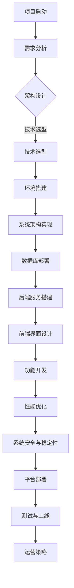
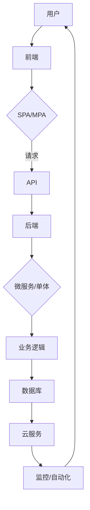

                 

### 文章标题

《技术mentoring：线上平台的搭建与运营》

### 关键词

技术mentoring、线上平台、架构设计、前端开发、功能实现、运营策略、性能优化。

### 摘要

本文将深入探讨技术mentoring在线上平台搭建与运营中的重要性。我们将从基础开始，逐步分析线上平台搭建的关键要素，包括架构设计、数据库优化、系统性能等。接着，我们将探讨实际搭建过程中的关键步骤，如硬件与软件环境搭建、系统架构实现、数据库部署、后端服务搭建与前端界面设计。随后，我们将详细讲述线上平台功能开发、运营策略以及性能监控与优化方法。最后，我们将探讨平台的扩展与迭代策略，提供一系列技术资源和书籍推荐，帮助读者深入理解线上平台的搭建与运营。

---

### 《技术mentoring：线上平台的搭建与运营》目录大纲

#### 第一部分：线上平台搭建基础

##### 第1章：技术mentoring概述
- **1.1** 技术mentoring的定义与意义
- **1.2** 线上平台搭建的优势与挑战
- **1.3** 线上平台搭建的关键要素
- **1.4** 技术mentoring的未来发展趋势

##### 第2章：线上平台的架构设计
- **2.1** 线上平台的技术架构
- **2.2** 数据库设计与优化
- **2.3** 系统性能优化
- **2.4** 系统安全性与稳定性

#### 第二部分：线上平台搭建实战

##### 第3章：线上平台的搭建流程
- **3.1** 硬件与软件环境搭建
- **3.2** 系统架构设计与实现
- **3.3** 数据库设计与部署
- **3.4** 后端服务搭建与优化

##### 第4章：前端界面设计与实现
- **4.1** 前端设计原则与工具
- **4.2** 前端框架选择与使用
- **4.3** 响应式设计
- **4.4** 前端性能优化

##### 第5章：线上平台功能开发
- **5.1** 用户注册与登录
- **5.2** 课程发布与管理
- **5.3** 用户互动与反馈
- **5.4** 数据分析与报告

##### 第6章：线上平台运营策略
- **6.1** 内容运营
- **6.2** 社区运营
- **6.3** 营销推广
- **6.4** 用户服务与支持

#### 第三部分：线上平台运营优化

##### 第7章：线上平台性能监控与优化
- **7.1** 性能监控指标
- **7.2** 常见性能问题分析与解决
- **7.3** 日志分析与异常处理
- **7.4** 系统升级与维护

##### 第8章：线上平台扩展与迭代
- **8.1** 平台扩展策略
- **8.2** 新功能开发与上线
- **8.3** 技术迭代与更新
- **8.4** 用户反馈与迭代优化

#### 附录

##### 附录A：技术mentoring资源汇总
- **A.1** 常用技术框架与工具
- **A.2** 技术文档与学习资源
- **A.3** 线上平台运营相关书籍
- **A.4** 开发环境配置指南

---

### **核心概念与联系**

#### **线上平台搭建流程图**



---

### **核心算法原理讲解**

#### **用户注册与登录算法伪代码**

```java
// 用户注册
public User register(User user) {
    // 检查用户名是否已存在
    if (checkIfUsernameExists(user.getUsername())) {
        return null; // 返回null表示用户名已存在
    }
    // 创建用户账号
    saveUserToDatabase(user);
    return user;
}

// 用户登录
public User login(String username, String password) {
    // 检查用户名和密码是否正确
    User user = getUserByUsernameAndPassword(username, password);
    if (user == null) {
        return null; // 返回null表示登录失败
    }
    // 登录成功，设置用户会话
    setUserSession(user);
    return user;
}
```

---

### **数学模型与公式讲解**

#### **课程发布时间预测模型**

$$
\hat{t}_{next} = t_{current} + \alpha \cdot (t_{next} - t_{current})
$$

其中，$t_{current}$ 是当前时间，$t_{next}$ 是预测的下一节课程发布时间，$\alpha$ 是时间间隔的调整参数。

---

### **项目实战**

#### **线上平台用户互动模块**

1. **开发环境搭建**：使用 Python 和 Flask 搭建开发环境。

2. **源代码实现**：

```python
from flask import Flask, request, jsonify
app = Flask(__name__)

@app.route('/interact', methods=['POST'])
def interact():
    data = request.get_json()
    user_id = data['user_id']
    message = data['message']
    # 存储用户互动数据到数据库
    storeUserInteraction(user_id, message)
    return jsonify({'status': 'success'})

def storeUserInteraction(user_id, message):
    # 实现存储用户互动数据的数据库操作
    pass
```

3. **代码解读与分析**：

- **/interact** 路径接受 POST 请求，解析 JSON 数据中的用户 ID 和消息内容。
- 将用户互动数据存储到数据库中。

---

### **详细讲解与举例说明**

#### **用户注册与登录流程**

1. **用户注册**：用户提交注册表单，包含用户名、密码、邮箱等信息。系统验证用户名是否已存在，然后存储新用户信息到数据库中。

2. **用户登录**：用户输入用户名和密码，系统验证用户信息是否正确。如果验证通过，则设置用户会话，允许用户访问平台。

举例说明：

- **用户注册**：

```plaintext
用户填写注册表单：用户名: "john_doe"，密码: "password123"，邮箱: "john@example.com"
系统验证用户名未注册，存储用户信息到数据库。
```

- **用户登录**：

```plaintext
用户输入用户名 "john_doe"，密码 "password123"
系统验证用户名和密码正确，设置用户会话。
```

---

### **在线上平台搭建与运营中的技术mentoring**

技术mentoring在在线上平台的搭建与运营中扮演着至关重要的角色。它不仅帮助团队理解和应用最新的技术，还确保了项目的高效推进和成功交付。以下是技术mentoring在线上平台搭建与运营中的几个关键方面。

#### **1. 技术选型与架构设计**

在线上平台的搭建初期，技术选型与架构设计是两个关键环节。技术mentoring在这一过程中提供指导，帮助团队选择最适合当前需求的技术栈和架构方案。通过深入分析项目需求、性能要求和可扩展性，mentoring可以确保技术选型的合理性和前瞻性。

**步骤：**

- **需求分析**：明确线上平台的功能需求、性能指标和扩展性要求。
- **技术选型**：根据需求分析结果，选择合适的技术栈，如前端框架、后端框架、数据库等。
- **架构设计**：设计系统的总体架构，包括前端架构、后端架构、数据库架构等。

**举例：**

在搭建一个在线教育平台时，技术mentoring可能会推荐使用React作为前端框架，Node.js作为后端框架，MongoDB作为数据库。这样的选型可以保证前端的高性能、后端的快速响应以及数据库的高扩展性。

#### **2. 硬件与软件环境搭建**

硬件与软件环境的搭建是线上平台成功搭建的基础。技术mentoring在这一过程中提供详细的指导，确保环境搭建的稳定性、安全性和高效性。

**步骤：**

- **硬件配置**：选择合适的物理服务器或云服务器，配置网络带宽和存储空间。
- **软件安装**：安装操作系统、Web服务器、数据库管理系统等基础软件。
- **环境配置**：配置环境变量、安全设置、网络配置等。

**举例：**

在一个基于AWS的在线教育平台项目中，技术mentoring可能会指导团队如何选择合适的服务器类型、如何配置Elastic Beanstalk环境，以及如何设置安全组规则来保障系统的安全性。

#### **3. 系统功能开发**

系统功能开发是线上平台搭建的核心。技术mentoring在这一过程中提供技术指导和最佳实践，确保功能开发的高效性和质量。

**步骤：**

- **需求分析**：分析系统功能需求，明确各个功能模块的职责和接口。
- **功能设计**：设计功能模块的架构和接口，确保系统的可扩展性和可维护性。
- **编码实现**：编写代码，实现功能模块的具体逻辑。
- **测试与调试**：进行功能测试，调试和修复代码中的错误。

**举例：**

在开发一个在线教育平台时，技术mentoring可能会指导团队如何使用RESTful API设计用户注册和登录功能，如何使用MongoDB进行数据存储，以及如何实现用户互动和反馈功能。

#### **4. 系统性能优化**

系统性能优化是确保线上平台稳定性和高效性的重要环节。技术mentoring在这一过程中提供优化策略和技术支持，确保系统在高峰期也能保持良好的性能。

**步骤：**

- **性能测试**：对系统进行负载测试和性能测试，识别性能瓶颈。
- **问题分析**：分析测试结果，定位性能瓶颈。
- **优化方案**：提出优化方案，如代码优化、数据库优化、缓存策略等。
- **实施与验证**：实施优化方案，并进行验证，确保性能提升。

**举例：**

在优化一个在线教育平台的用户互动模块时，技术mentoring可能会建议使用Redis缓存用户数据，减少数据库查询次数，以及使用异步处理来提高系统的响应速度。

#### **5. 系统安全性与稳定性**

系统安全性与稳定性是线上平台成功运营的基础。技术mentoring在这一过程中提供安全性和稳定性保障，确保系统的可靠性和用户数据的安全。

**步骤：**

- **安全评估**：对系统进行安全评估，识别潜在的安全漏洞。
- **安全措施**：实施安全措施，如使用HTTPS、加密存储用户密码、防止SQL注入等。
- **稳定性监控**：监控系统运行状态，及时处理异常情况。
- **故障恢复**：制定故障恢复计划，确保在发生故障时系统能够快速恢复。

**举例：**

在保障一个在线教育平台的稳定性时，技术mentoring可能会建议使用分布式架构来提高系统的容错能力，使用Kubernetes进行容器编排，以及使用Prometheus和Grafana进行监控和告警。

### **技术mentoring的长期价值**

技术mentoring不仅对当前项目有直接影响，还具有长期的战略意义。通过技术mentoring，团队成员可以：

- **提升技能**：通过学习和实践，提高个人技术水平。
- **培养团队**：建立高效的团队协作模式，提高团队整体实力。
- **传承经验**：将技术和实践经验传承给新成员，提升团队的整体能力。

**结论：**

技术mentoring是线上平台搭建与运营中不可或缺的一部分。通过专业的技术指导和最佳实践，技术mentoring能够确保项目的高效推进和成功交付，同时为团队的长远发展打下坚实基础。

---

### **技术mentoring概述**

#### **1.1 技术mentoring的定义与意义**

技术mentoring，亦称为技术辅导或技术指导，是指由资深技术人员对团队成员进行的一对一或小团队的技术支持和指导。这种指导不仅包括技术知识的传授，还涵盖了项目管理、问题解决和职业发展等多个方面。技术mentoring的核心目标是帮助团队成员提升技能、增强信心，并促进团队整体的技术能力提升。

**定义：**
技术mentoring是一种通过经验丰富的技术专家对新手或成员进行指导、培训和支持的过程，旨在帮助他们快速掌握所需技能，提高工作效率，并在职业生涯中取得长足进步。

**意义：**
1. **知识传承**：技术mentoring有助于将资深技术人员积累的经验和知识传承给新手，减少新手的学习曲线，提高团队的整体效率。
2. **技能提升**：通过技术mentoring，团队成员可以更快地掌握新技术、新工具，提升个人技能。
3. **问题解决**：技术mentoring能够帮助团队成员在面对复杂问题时，快速找到解决方案，提高问题解决能力。
4. **职业发展**：技术mentoring不仅关注技术能力的提升，还关注成员的职业发展，帮助他们制定职业规划，提供职业建议。
5. **团队凝聚力**：技术mentoring有助于增强团队成员之间的信任和合作，提升团队凝聚力。

#### **1.2 线上平台搭建的优势与挑战**

**优势：**
1. **灵活性**：线上平台搭建可以灵活地调整和扩展，以适应不断变化的市场需求和技术进步。
2. **可扩展性**：通过云服务和分布式架构，线上平台可以轻松实现横向和纵向扩展，满足大规模用户需求。
3. **低成本**：线上平台的搭建和维护成本相对较低，尤其是使用云服务时，可以减少硬件投入和运营成本。
4. **高效运维**：线上平台通常采用自动化运维工具，可以实现高效的监控、故障恢复和性能优化。

**挑战：**
1. **技术复杂性**：线上平台涉及多种技术栈，包括前端、后端、数据库、云服务等，技术复杂度高，对团队的技术能力和经验要求较高。
2. **性能优化**：线上平台需要面对高并发、大数据量等挑战，性能优化是关键问题，需要持续监控和优化。
3. **安全性**：线上平台涉及用户数据和交易信息，安全性至关重要，需要采用多种安全措施来防止数据泄露和攻击。
4. **运营成本**：虽然线上平台的初始投入较低，但长期运营成本仍需考虑，包括带宽、存储、人力资源等。

#### **1.3 线上平台搭建的关键要素**

**架构设计**：
架构设计是线上平台搭建的基础，包括前端架构、后端架构和数据库架构。合理的架构设计可以提高系统的可扩展性、性能和稳定性。

**技术选型**：
技术选型是选择合适的技术栈和工具的过程。包括前端框架、后端框架、数据库、云服务等。技术选型需要考虑性能、可扩展性、维护成本等因素。

**硬件与软件环境搭建**：
硬件与软件环境搭建是线上平台的基础设施，包括服务器的选择、操作系统的安装、Web服务器的配置等。硬件和软件环境搭建需要确保稳定性、安全性和高效性。

**系统性能优化**：
系统性能优化是保证线上平台稳定运行的关键。包括数据库优化、缓存策略、负载均衡、网络优化等。性能优化需要持续进行，以应对不断变化的需求和流量。

**系统安全性与稳定性**：
系统安全性与稳定性是线上平台成功运营的基础。包括安全措施、监控、故障恢复等。安全性需要从多个方面进行保障，如用户数据加密、防止SQL注入、DDoS攻击防护等。

#### **1.4 技术mentoring的未来发展趋势**

**自动化与智能化**：
随着人工智能和机器学习技术的进步，技术mentoring将更加自动化和智能化。通过算法和数据分析，技术mentoring可以更加精准地识别团队成员的学习需求，提供个性化的指导。

**远程与分布式**：
随着远程工作和分布式团队的普及，技术mentoring也将越来越分布式。通过在线会议、远程协作工具等，技术mentoring可以跨越地域限制，为全球团队成员提供支持。

**持续学习和成长**：
技术mentoring将更加注重团队成员的持续学习和成长。通过定期培训、技术研讨会、代码审查等方式，技术mentoring将帮助团队成员不断提升技能，保持竞争力。

**多元化与跨领域**：
技术mentoring将不再局限于单一技术领域，而是跨领域、多元化的。团队成员将不仅仅是技术专家，还将涉及产品、设计、运营等多个领域，形成更加全面的人才培养模式。

**总结：**
技术mentoring是线上平台搭建与运营中不可或缺的一环。通过技术mentoring，团队成员可以快速提升技能，解决复杂问题，推动项目高效推进。未来，技术mentoring将更加智能化、分布式和多元化，为团队成员提供更加全面的支持。

---

### **线上平台的架构设计**

线上平台的架构设计是确保系统高效、稳定和可扩展的关键步骤。一个好的架构设计不仅能提高系统的性能，还能降低维护成本，确保系统的安全性和稳定性。以下将详细探讨线上平台的技术架构、数据库设计、系统性能优化以及系统安全性与稳定性。

#### **2.1 线上平台的技术架构**

**前端架构**：
前端架构的设计关系到用户体验和性能。目前，主流的前端架构包括单页面应用（SPA）和传统的多页面应用（MPA）。

- **单页面应用（SPA）**：使用JavaScript框架（如React、Vue.js、Angular）构建，通过Ajax或Fetch API动态请求数据，实现页面内容的无缝切换。
- **多页面应用（MPA）**：传统的网页架构，每个页面都是一个独立的HTML文件，用户每次切换页面都需要重新加载。

**后端架构**：
后端架构主要处理业务逻辑、数据存储和API提供服务。

- **微服务架构**：将系统分解为多个独立的微服务，每个微服务负责一个特定的功能，通过RESTful API进行通信。这种架构可以提高系统的可扩展性和灵活性。
- **单体架构**：所有的业务逻辑和数据存储都在一个应用程序中，适合中小型系统。

**数据库架构**：
数据库架构的选择取决于数据模型、查询频率和性能要求。

- **关系数据库**：如MySQL、PostgreSQL，适用于结构化数据存储和复杂查询。
- **NoSQL数据库**：如MongoDB、Redis，适用于高并发、大容量数据的存储和快速访问。

**云服务架构**：
利用云服务可以提高系统的可扩展性和可靠性。

- **云服务器**：如AWS、Azure、Google Cloud，提供计算和存储资源。
- **容器化**：如Docker、Kubernetes，用于部署和管理微服务。
- **自动化运维**：如Ansible、Puppet，用于自动化部署和配置管理。

**总体架构设计**：



#### **2.2 数据库设计与优化**

**数据库设计原则**：

- **规范化**：避免数据冗余，保证数据的完整性和一致性。
- **反规范化**：在某些场景下，为了提高查询效率，可以进行反规范化，增加冗余数据。
- **分区**：将数据按时间、地域或业务逻辑进行分区，提高查询效率和系统性能。

**数据库优化策略**：

- **索引**：合理使用索引可以提高查询效率。
- **缓存**：使用缓存（如Redis）可以减少数据库查询次数，提高系统性能。
- **分库分表**：对于大数据量，可以通过分库分表来降低单表的数据量和查询压力。
- **读写分离**：通过主从复制和读写分离，提高系统的读性能和稳定性。

**案例**：

假设一个在线教育平台，需要设计用户表、课程表和订单表。

- **用户表**：用户ID、用户名、密码、邮箱等基本信息。
- **课程表**：课程ID、课程名称、课程描述、授课教师等。
- **订单表**：订单ID、用户ID、课程ID、订单状态等。

```sql
-- 用户表
CREATE TABLE users (
    user_id INT PRIMARY KEY AUTO_INCREMENT,
    username VARCHAR(50) UNIQUE NOT NULL,
    password VARCHAR(255) NOT NULL,
    email VARCHAR(100) UNIQUE NOT NULL
);

-- 课程表
CREATE TABLE courses (
    course_id INT PRIMARY KEY AUTO_INCREMENT,
    course_name VARCHAR(100) NOT NULL,
    course_description TEXT,
    instructor_id INT
);

-- 订单表
CREATE TABLE orders (
    order_id INT PRIMARY KEY AUTO_INCREMENT,
    user_id INT,
    course_id INT,
    order_status ENUM('pending', 'processing', 'completed') NOT NULL
);
```

#### **2.3 系统性能优化**

**性能优化策略**：

- **负载均衡**：通过负载均衡器（如Nginx、HAProxy）将请求分配到多个服务器，提高系统的处理能力。
- **缓存**：使用缓存（如Redis、Memcached）存储高频访问的数据，减少数据库查询次数。
- **数据库优化**：通过索引、分区、读写分离等策略优化数据库性能。
- **代码优化**：通过优化SQL查询、减少不必要的数据库访问、使用高效算法等提高代码性能。
- **网络优化**：优化网络配置，减少网络延迟和带宽限制。

**案例**：

假设一个在线教育平台的课程列表页面需要展示所有课程，优化查询效率。

- **优化查询语句**：通过添加索引提高查询效率。
- **缓存策略**：将课程列表缓存到Redis中，减少数据库查询次数。

```sql
-- 添加索引
CREATE INDEX idx_course_name ON courses(course_name);

-- 缓存策略
CACHE courses_list_key IN REDIS;
```

#### **2.4 系统安全性与稳定性**

**安全性策略**：

- **数据加密**：使用SSL/TLS加密传输数据，确保数据在传输过程中的安全性。
- **身份验证**：使用OAuth2、JWT等身份验证机制，确保用户身份的合法性。
- **权限控制**：通过角色权限控制，确保用户只能访问授权的数据和功能。
- **输入验证**：对用户输入进行严格验证，防止SQL注入、XSS攻击等。

**稳定性策略**：

- **故障转移**：通过主从复制、高可用架构等策略，确保系统在发生故障时能够快速切换。
- **监控与告警**：使用监控工具（如Prometheus、Grafana）对系统进行实时监控，并及时告警。
- **备份与恢复**：定期备份数据库和系统配置，确保在数据丢失或系统故障时能够快速恢复。

**案例**：

假设一个在线教育平台需要确保用户数据的安全性和系统的稳定性。

- **数据加密**：使用SSL/TLS加密用户数据传输。
- **监控与告警**：使用Prometheus监控系统性能，并设置告警机制。

```shell
# Prometheus配置
[HIGH]
alert = "System High Load"
description = "System load average exceeds threshold"
expr = "loadavg_1m > 5"
for = 5m
labels = { severity = "high" }
alert = "Database Connection Failure"
description = "Database connection count exceeds threshold"
expr = "db_connection_count > 100"
for = 5m
labels = { severity = "high" }
```

**总结**：

线上平台的架构设计是确保系统高效、稳定和可扩展的关键。通过合理的前端架构、后端架构和数据库设计，以及性能优化和安全策略，可以构建一个高性能、高安全性和高稳定性的线上平台。

---

### **线上平台的搭建流程**

搭建线上平台是一个复杂且多阶段的过程，涉及多个环节的紧密协作和精心策划。以下是线上平台搭建的详细流程，包括硬件与软件环境搭建、系统架构设计与实现、数据库设计与部署、后端服务搭建与优化等。

#### **3.1 硬件与软件环境搭建**

**硬件选择**：
线上平台的硬件选择取决于预期的负载、性能需求和预算。以下是几种常见的硬件配置选择：

- **物理服务器**：适用于需要高度控制性和高安全性的场景，如金融系统或高度敏感的数据处理。
- **云服务器**：适用于需求波动大、可弹性扩展的场景，如电商或在线教育平台。常见的云服务提供商包括AWS、Azure、Google Cloud等。
- **虚拟机**：适用于测试和开发环境，可以在本地或云上进行部署。

**软件配置**：
搭建软件环境是硬件配置后的关键步骤。以下是一般所需的软件组件：

- **操作系统**：常见的操作系统包括Linux（如CentOS、Ubuntu）和Windows Server。
- **Web服务器**：如Nginx、Apache等，用于处理HTTP请求。
- **数据库管理系统**：如MySQL、PostgreSQL、MongoDB等，用于数据存储和查询。
- **开发工具**：如Visual Studio Code、Eclipse、IntelliJ IDEA等，用于代码编写和调试。

**环境配置**：
环境配置包括操作系统、Web服务器、数据库管理系统的安装和配置。以下是一些常见步骤：

- **安装操作系统**：根据硬件选择合适的操作系统，进行安装和配置。
- **安装Web服务器**：配置Nginx或Apache，确保其能够处理HTTP请求。
- **安装数据库管理系统**：配置数据库服务器，创建数据库和用户。
- **配置环境变量**：设置环境变量，方便代码编写和执行。

**示例**：

以下是一个简化的Linux服务器环境搭建示例：

```shell
# 安装Linux操作系统
sudo apt-get update
sudo apt-get install ubuntu-server

# 安装Nginx
sudo apt-get install nginx

# 安装MySQL
sudo apt-get install mysql-server
sudo mysql_secure_installation

# 安装Node.js
curl -sL https://deb.nodesource.com/setup_14.x | sudo -E bash -
sudo apt-get install -y nodejs

# 配置Nginx
sudo nano /etc/nginx/sites-available/default

# 添加以下内容
server {
    listen 80;
    server_name example.com;
    location / {
        proxy_pass http://localhost:3000;
    }
}

# 重启Nginx
sudo systemctl restart nginx

# 安装MySQL用户和数据库
sudo mysql -u root -p
CREATE USER 'myuser'@'localhost' IDENTIFIED BY 'mypass';
CREATE DATABASE mydb;
GRANT ALL PRIVILEGES ON mydb.* TO 'myuser'@'localhost';

# 安装Node.js应用
npm init -y
npm install express mysql
npm start
```

#### **3.2 系统架构设计与实现**

**系统架构设计**：
系统架构设计是确保线上平台高性能、高可用性和可扩展性的关键步骤。以下是几种常见的系统架构设计：

- **单体架构**：所有功能集中在一个应用程序中，适合小型项目。
- **微服务架构**：将功能分解为多个独立的微服务，每个微服务负责一个特定的功能，通过API进行通信，适用于复杂项目和大型应用。
- **容器化架构**：使用Docker和Kubernetes等工具，实现应用程序的容器化部署和管理，提高部署效率和系统可扩展性。

**架构实现**：
架构实现包括以下步骤：

- **需求分析**：明确线上平台的功能需求、性能要求、扩展性需求等。
- **架构设计**：根据需求分析结果，设计合适的系统架构。
- **技术选型**：选择合适的技术栈和工具，如前端框架、后端框架、数据库、云服务等。
- **开发与测试**：开发系统功能，进行功能测试、性能测试和安全测试。

**示例**：

以下是一个简化的微服务架构实现示例：

1. **需求分析**：
   - 功能需求：用户注册、登录、课程发布、用户互动等。
   - 性能要求：高并发、低延迟。
   - 扩展性需求：能够水平扩展。

2. **架构设计**：
   - 前端：使用React或Vue.js构建单页面应用。
   - 后端：使用Spring Boot或Node.js构建微服务。
   - 数据库：使用MySQL进行数据存储。
   - 容器化：使用Docker进行容器化部署，Kubernetes进行管理。

3. **技术选型**：
   - 前端：React
   - 后端：Spring Boot
   - 数据库：MySQL
   - 容器化：Docker、Kubernetes

4. **开发与测试**：
   - 前端开发：使用React构建用户界面。
   - 后端开发：使用Spring Boot实现用户注册、登录、课程发布等功能。
   - 数据库开发：设计数据库模型，实现数据存储和查询。
   - 功能测试：进行单元测试、集成测试和性能测试。
   - 安全测试：进行漏洞扫描和安全测试。

#### **3.3 数据库设计与部署**

**数据库设计**：
数据库设计是确保数据存储和管理效率的关键步骤。以下是常见的数据库设计原则和步骤：

- **需求分析**：明确数据需求，包括数据类型、数据关系、查询频率等。
- **ER图设计**：使用实体关系图（ER图）设计数据库模型。
- **表设计**：根据ER图创建数据库表，定义字段和数据类型。
- **索引设计**：为常用查询设计索引，提高查询效率。

**示例**：

以下是一个简化的在线教育平台的数据库设计示例：

1. **需求分析**：
   - 用户信息：用户名、密码、邮箱等。
   - 课程信息：课程ID、课程名称、课程描述等。
   - 用户与课程的关系：用户ID、课程ID、评分等。

2. **ER图设计**：

```mermaid
erDiagram
USER ||--|{ COURSE }: "参加" }

  USER {
    用户ID
    用户名
    密码
    邮箱
  }

  COURSE {
    课程ID
    课程名称
    课程描述
  }
```

3. **表设计**：

```sql
-- 用户表
CREATE TABLE users (
    user_id INT PRIMARY KEY AUTO_INCREMENT,
    username VARCHAR(50) UNIQUE NOT NULL,
    password VARCHAR(255) NOT NULL,
    email VARCHAR(100) UNIQUE NOT NULL
);

-- 课程表
CREATE TABLE courses (
    course_id INT PRIMARY KEY AUTO_INCREMENT,
    course_name VARCHAR(100) NOT NULL,
    course_description TEXT
);

-- 用户与课程关系表
CREATE TABLE user_courses (
    user_id INT,
    course_id INT,
    rating INT,
    FOREIGN KEY (user_id) REFERENCES users(user_id),
    FOREIGN KEY (course_id) REFERENCES courses(course_id)
);
```

**部署**：
数据库部署包括以下步骤：

- **创建数据库**：在数据库管理系统中创建数据库。
- **创建用户**：创建具有适当权限的数据库用户。
- **运行脚本**：运行创建表和索引的SQL脚本。

**示例**：

```shell
# 创建数据库
CREATE DATABASE online_education;

# 创建用户
CREATE USER 'education_user'@'localhost' IDENTIFIED BY 'education_password';

# 授予用户权限
GRANT ALL PRIVILEGES ON online_education.* TO 'education_user'@'localhost';

# 运行创建表和索引的SQL脚本
source path/to/creation_scripts.sql;
```

#### **3.4 后端服务搭建与优化**

**后端服务搭建**：
后端服务搭建包括以下步骤：

- **创建项目**：使用合适的框架创建后端项目。
- **配置数据库**：配置数据库连接，确保后端服务能够访问数据库。
- **开发接口**：根据需求开发API接口，实现业务逻辑。
- **集成测试**：进行单元测试和集成测试，确保接口功能和性能符合要求。

**示例**：

以下是一个使用Spring Boot创建的后端服务示例：

1. **创建项目**：
   - 使用Spring Initializr创建Spring Boot项目。
   - 选择需要的依赖项，如Spring Web、Spring Data JPA、MySQL Connector等。

2. **配置数据库**：
   - 在`application.properties`文件中配置数据库连接信息。

```properties
spring.datasource.url=jdbc:mysql://localhost:3306/online_education?useSSL=false
spring.datasource.username=education_user
spring.datasource.password=education_password
spring.jpa.hibernate.ddl-auto=update
```

3. **开发接口**：
   - 使用Spring MVC开发RESTful API接口。

```java
@RestController
@RequestMapping("/api")
public class CourseController {

    @Autowired
    private CourseService courseService;

    @GetMapping("/courses")
    public List<Course> getAllCourses() {
        return courseService.getAllCourses();
    }

    @PostMapping("/courses")
    public Course createCourse(@RequestBody Course course) {
        return courseService.createCourse(course);
    }
}
```

4. **集成测试**：
   - 使用JUnit和MockMvc进行集成测试。

```java
@Test
public void testGetAllCourses() {
    MockMvc mockMvc = MockMvcBuilders.standaloneSetup(new CourseController()).build();
    mockMvc.perform(get("/api/courses"))
            .andExpect(status().isOk())
            .andExpect(jsonPath("$.size()").value(2));
}
```

**优化**：
后端服务优化包括以下策略：

- **代码优化**：优化SQL查询、减少不必要的数据库访问、使用高效算法等。
- **缓存**：使用缓存（如Redis）减少数据库查询次数。
- **异步处理**：使用异步处理提高系统的响应速度和并发能力。
- **负载均衡**：使用负载均衡器（如Nginx、HAProxy）分配请求，提高系统的处理能力。

**示例**：

1. **代码优化**：
   - 使用批量插入和更新操作提高数据库操作效率。

```java
// 批量插入
List<Course> courses = // ...
courseRepository.saveAll(courses);

// 批量更新
List<Course> coursesToUpdate = // ...
courseRepository.batchUpdate(coursesToUpdate);
```

2. **缓存**：
   - 使用Redis缓存课程列表。

```java
@Autowired
private RedisTemplate<String, Object> redisTemplate;

public List<Course> getAllCourses() {
    String cacheKey = "courses_list";
    List<Course> courses = (List<Course>) redisTemplate.opsForValue().get(cacheKey);
    if (courses == null) {
        courses = courseService.findAllCourses();
        redisTemplate.opsForValue().set(cacheKey, courses, 60, TimeUnit.MINUTES);
    }
    return courses;
}
```

3. **异步处理**：
   - 使用Spring的异步处理机制。

```java
@Service
public class CourseService {

    @Async
    public void updateCourseAsync(Course course) {
        // 更新课程逻辑
    }
}
```

4. **负载均衡**：
   - 配置Nginx作为负载均衡器。

```nginx
http {
    upstream backend {
        server backend1:8080;
        server backend2:8080;
        server backend3:8080;
    }

    server {
        listen 80;

        location / {
            proxy_pass http://backend;
        }
    }
}
```

**总结**：

线上平台的搭建是一个系统性工程，涉及硬件与软件环境搭建、系统架构设计、数据库设计与部署、后端服务搭建与优化等多个环节。通过合理的规划与实施，可以构建一个高性能、高可用性和高扩展性的线上平台。

---

### **前端界面设计与实现**

前端界面设计是线上平台搭建中至关重要的一环，它直接影响到用户体验。一个美观、直观且易用的界面不仅能够提升用户的满意度，还能增加平台的用户粘性。以下是前端界面设计的原则、工具选择、响应式设计和前端性能优化等方面的详细探讨。

#### **4.1 前端设计原则**

**用户体验（UX）**：
用户体验是前端设计的核心。设计师需要从用户的角度出发，确保界面的美观性和易用性。以下是一些关键原则：

- **简洁性**：界面应该简洁明了，避免过多无关元素和信息的干扰。
- **一致性**：界面元素的风格、颜色、布局应保持一致性，使用户能够快速熟悉并适应。
- **反馈**：界面应提供即时反馈，如按钮点击、表单提交等，增强用户的操作信心。

**可用性（UI）**：
可用性是衡量界面设计好坏的重要指标。以下是一些常用原则：

- **响应速度**：界面应快速响应，避免长时间加载或延迟。
- **交互性**：界面应提供丰富的交互元素，如按钮、表单、滑块等，增加用户的参与度。
- **导航**：界面应提供清晰的导航结构，使用户能够快速找到所需内容。

**美观性**：
美观性是吸引和保持用户注意力的重要因素。以下是一些设计原则：

- **色彩**：选择合适的色彩方案，确保界面看起来既和谐又吸引人。
- **排版**：合理使用字体、行距和间距，提高文字的可读性。
- **图片和图标**：使用高质量的图片和图标，增强界面的视觉吸引力。

#### **4.2 前端框架选择与使用**

前端框架是提高开发效率和代码可维护性的关键工具。目前，市场上主流的前端框架包括React、Vue.js和Angular。以下是这些框架的简要介绍和选择建议。

**React**：
React是由Facebook开发的一个流行的前端JavaScript库，用于构建用户界面。它的主要特点包括：

- **组件化**：React采用组件化架构，使代码更加模块化和可重用。
- **虚拟DOM**：React使用虚拟DOM进行高效的界面渲染。
- **单向数据流**：React采用单向数据流，简化了状态管理和数据更新。

**Vue.js**：
Vue.js是一个渐进式的前端框架，适合从小型项目到大型应用的各个阶段。它的主要特点包括：

- **易用性**：Vue.js的设计简洁明了，上手容易。
- **响应式数据绑定**：Vue.js提供响应式数据绑定，简化了状态管理。
- **双向数据绑定**：Vue.js支持双向数据绑定，方便表单处理。

**Angular**：
Angular是由谷歌开发的一个全功能前端框架，适用于复杂的大型应用。它的主要特点包括：

- **依赖注入**：Angular采用依赖注入机制，提高了代码的可测试性和可维护性。
- **指令和组件**：Angular提供强大的指令和组件系统，增强了功能复用性。
- **数据绑定**：Angular提供强大的数据绑定机制，支持单向和双向数据绑定。

**选择建议**：

- **中小型项目**：推荐使用Vue.js，因为它易学易用，适合快速开发。
- **复杂大型应用**：推荐使用Angular，因为它提供了丰富的功能和完整的解决方案。
- **模块化项目**：推荐使用React，因为它的组件化架构更适合模块化和复用。

**示例**：

以下是一个简单的React组件示例，用于展示用户名和密码输入表单。

```jsx
import React, { useState } from 'react';

function LoginForm() {
  const [username, setUsername] = useState('');
  const [password, setPassword] = useState('');

  const handleSubmit = (e) => {
    e.preventDefault();
    // 处理登录逻辑
  };

  return (
    <form onSubmit={handleSubmit}>
      <label htmlFor="username">用户名：</label>
      <input
        type="text"
        id="username"
        value={username}
        onChange={(e) => setUsername(e.target.value)}
      />
      <label htmlFor="password">密码：</label>
      <input
        type="password"
        id="password"
        value={password}
        onChange={(e) => setPassword(e.target.value)}
      />
      <button type="submit">登录</button>
    </form>
  );
}

export default LoginForm;
```

#### **4.3 响应式设计**

响应式设计是前端界面设计中非常重要的一环，它确保界面在不同设备和屏幕尺寸上都能提供良好的用户体验。以下是响应式设计的核心概念和实现方法。

**核心概念**：

- **媒体查询**（Media Queries）：通过CSS媒体查询，可以针对不同设备和屏幕尺寸应用不同的样式。
- **弹性布局**（Responsive Layout）：使用Flexbox或Grid布局，可以创建自适应的布局结构。
- **弹性字体**（Responsive Typography）：通过相对单位（如em、rem）设置字体大小，确保不同设备上的字体可读性。

**实现方法**：

1. **媒体查询**：
   使用媒体查询可以根据不同的屏幕尺寸应用不同的CSS样式。

```css
/* 手机端 */
@media (max-width: 600px) {
  /* 样式规则 */
}

/* 平板端 */
@media (max-width: 768px) {
  /* 样式规则 */
}

/* 桌面端 */
@media (max-width: 1024px) {
  /* 样式规则 */
}
```

2. **弹性布局**：
   使用Flexbox或Grid布局可以创建响应式的布局结构。

```css
/* Flexbox布局 */
.container {
  display: flex;
  flex-direction: column;
  align-items: center;
}

/* Grid布局 */
.container {
  display: grid;
  grid-template-columns: repeat(3, 1fr);
}
```

3. **弹性字体**：
   使用相对单位设置字体大小，确保在不同设备上的字体大小适当。

```css
/* 使用rem单位 */
p {
  font-size: 1rem; /* 相对于根元素的字体大小 */
}
```

**示例**：

以下是一个简单的响应式设计示例，用于展示一个课程列表。

```html
<div class="course-list">
  <div class="course">
    <h3>课程1</h3>
    <p>课程描述1</p>
  </div>
  <div class="course">
    <h3>课程2</h3>
    <p>课程描述2</p>
  </div>
  <div class="course">
    <h3>课程3</h3>
    <p>课程描述3</p>
  </div>
</div>

<style>
  .course-list {
    display: flex;
    flex-wrap: wrap;
    justify-content: space-around;
  }

  .course {
    flex: 1;
    min-width: 300px;
    margin: 10px;
    padding: 20px;
    background-color: #f0f0f0;
  }

  @media (max-width: 600px) {
    .course-list {
      flex-direction: column;
    }
  }
</style>
```

#### **4.4 前端性能优化**

前端性能优化是确保界面快速响应、流畅操作的关键。以下是一些常见的前端性能优化策略：

**代码优化**：

- **减少HTTP请求**：通过合并CSS和JavaScript文件、使用CDN等策略减少HTTP请求。
- **压缩资源**：使用Gzip压缩CSS和JavaScript文件，减少传输数据的大小。
- **懒加载**：对于不立即显示的内容，如图片、视频等，采用懒加载策略，提高页面加载速度。

**图片优化**：

- **压缩图片**：使用图片压缩工具减小图片文件大小，如使用TinyPNG或ImageOptim。
- **使用WebP格式**：WebP格式支持透明背景，文件大小较小，适合替换JPEG和PNG格式。

**CSS和JavaScript**：

- **减少重绘和回流**：避免频繁的操作，如窗口调整、DOM结构变更等，减少重绘和回流。
- **使用CDN**：使用CDN（如阿里云CDN、腾讯云CDN）加速静态资源的加载。

**浏览器缓存**：

- **合理设置缓存策略**：通过设置合理的缓存策略，如协商缓存和强制缓存，提高页面加载速度。
- **使用Service Worker**：通过Service Worker缓存静态资源，提高离线访问体验。

**示例**：

以下是一个简单的代码优化示例，用于优化一个在线教育平台的课程列表页面。

1. **减少HTTP请求**：
   合并CSS和JavaScript文件。

```html
<!-- index.html -->
<!DOCTYPE html>
<html lang="en">
<head>
  <meta charset="UTF-8">
  <meta name="viewport" content="width=device-width, initial-scale=1.0">
  <title>在线教育平台</title>
  <link rel="stylesheet" href="path/to/combined.css">
</head>
<body>
  <div id="app"></div>
  <script src="path/to/combined.js"></script>
</body>
</html>
```

2. **压缩资源**：
   使用Gzip压缩CSS和JavaScript文件。

```shell
# 压缩CSS文件
gzip -9 path/to/combined.css

# 压缩JavaScript文件
gzip -9 path/to/combined.js
```

3. **懒加载**：
   使用JavaScript实现懒加载。

```javascript
// app.js
function lazyLoadImages() {
  const images = document.querySelectorAll('img[data-src]');

  const loadImages = () => {
    images.forEach((img) => {
      if (img.getBoundingClientRect().top <= window.innerHeight) {
        img.src = img.dataset.src;
        img.removeAttribute('data-src');
      }
    });
  };

  loadImages();

  window.addEventListener('scroll', loadImages);
}

lazyLoadImages();
```

**总结**：

前端界面设计是线上平台搭建中至关重要的一环。通过遵循用户体验、可用性和美观性原则，选择合适的前端框架，实现响应式设计，以及采用有效的性能优化策略，可以构建一个高效、美观且易于使用的界面，提升用户的体验和满意度。

---

### **线上平台功能开发**

线上平台的功能开发是确保平台能够满足用户需求、提供高质量服务的关键步骤。以下是线上平台功能开发的具体内容，包括用户注册与登录、课程发布与管理、用户互动与反馈以及数据分析和报告等。

#### **5.1 用户注册与登录**

用户注册与登录是线上平台的基本功能，它为用户提供了访问平台和参与互动的入口。以下是用户注册与登录功能开发的关键步骤：

**需求分析**：
明确用户注册与登录的功能需求，包括用户信息的验证、密码的安全性、用户会话的管理等。

**功能设计**：
设计用户注册和登录的界面，包括用户名、密码、邮箱等输入框，以及注册和登录按钮。

**实现步骤**：

1. **用户注册**：
   - **表单验证**：使用前端JavaScript验证用户输入，确保用户名、密码等信息的正确性和合法性。
   - **后端处理**：使用后端语言（如Java、Python、Node.js）处理用户注册请求，验证用户名是否已存在，并存储用户信息到数据库。

   **示例**：

   ```python
   # Python后端代码示例
   from flask import Flask, request, jsonify
   from flask_sqlalchemy import SQLAlchemy

   app = Flask(__name__)
   app.config['SQLALCHEMY_DATABASE_URI'] = 'sqlite:///users.db'
   db = SQLAlchemy(app)

   class User(db.Model):
       id = db.Column(db.Integer, primary_key=True)
       username = db.Column(db.String(80), unique=True, nullable=False)
       password = db.Column(db.String(120), nullable=False)

   @app.route('/register', methods=['POST'])
   def register():
       data = request.get_json()
       username = data['username']
       password = data['password']
       
       if User.query.filter_by(username=username).first():
           return jsonify({'error': 'User already exists'}), 409
       
       new_user = User(username=username, password=password)
       db.session.add(new_user)
       db.session.commit()
       
       return jsonify({'message': 'User registered successfully'})
   ```

2. **用户登录**：
   - **表单验证**：使用前端JavaScript验证用户输入的用户名和密码。
   - **后端处理**：使用后端语言处理用户登录请求，验证用户信息，并设置用户会话。

   **示例**：

   ```python
   # Python后端代码示例
   from flask import Flask, request, jsonify
   from flask_sqlalchemy import SQLAlchemy
   from flask_session import Session

   app = Flask(__name__)
   app.config['SQLALCHEMY_DATABASE_URI'] = 'sqlite:///users.db'
   app.config['SESSION_TYPE'] = 'filesystem'
   db = SQLAlchemy(app)
   Session(app)

   @app.route('/login', methods=['POST'])
   def login():
       data = request.get_json()
       username = data['username']
       password = data['password']
       
       user = User.query.filter_by(username=username).first()
       if user and user.password == password:
           session['user_id'] = user.id
           return jsonify({'message': 'Logged in successfully'})
       else:
           return jsonify({'error': 'Invalid credentials'}), 401
   ```

**安全措施**：
确保用户密码的安全存储，使用哈希算法（如SHA-256）加密密码，并使用HTTPS协议确保数据传输的安全。

#### **5.2 课程发布与管理**

课程发布与管理功能是线上平台的核心功能之一，它允许用户发布课程，管理员管理课程信息。以下是课程发布与管理功能开发的关键步骤：

**需求分析**：
明确课程发布与管理功能的需求，包括课程信息的填写、课程分类、课程标签、课程审核等。

**功能设计**：
设计课程发布和管理界面，包括课程名称、课程描述、课程分类、课程标签等输入框。

**实现步骤**：

1. **课程发布**：
   - **前端表单**：允许讲师输入课程信息，并提交表单。
   - **后端处理**：验证课程信息，存储课程信息到数据库，并设置课程状态（如待审核、已发布）。

   **示例**：

   ```python
   # Python后端代码示例
   from flask import Flask, request, jsonify
   from flask_sqlalchemy import SQLAlchemy

   app = Flask(__name__)
   app.config['SQLALCHEMY_DATABASE_URI'] = 'sqlite:///courses.db'
   db = SQLAlchemy(app)

   class Course(db.Model):
       id = db.Column(db.Integer, primary_key=True)
       title = db.Column(db.String(100), nullable=False)
       description = db.Column(db.Text, nullable=False)
       category = db.Column(db.String(50), nullable=False)
       tags = db.Column(db.String(255), nullable=False)
       status = db.Column(db.String(20), nullable=False, default='pending')

   @app.route('/courses', methods=['POST'])
   def create_course():
       data = request.get_json()
       title = data['title']
       description = data['description']
       category = data['category']
       tags = data['tags']
       
       new_course = Course(title=title, description=description, category=category, tags=tags, status='pending')
       db.session.add(new_course)
       db.session.commit()
       
       return jsonify({'message': 'Course submitted for review'})
   ```

2. **课程管理**：
   - **管理员界面**：管理员可以查看、编辑和删除课程信息。
   - **后端处理**：根据管理员操作，更新课程信息或状态。

   **示例**：

   ```python
   # Python后端代码示例
   @app.route('/courses/<int:course_id>', methods=['PUT'])
   def update_course(course_id):
       data = request.get_json()
       course = Course.query.get(course_id)
       
       course.title = data['title']
       course.description = data['description']
       course.category = data['category']
       course.tags = data['tags']
       
       db.session.commit()
       
       return jsonify({'message': 'Course updated successfully'})
   ```

#### **5.3 用户互动与反馈**

用户互动与反馈功能是线上平台的重要组成部分，它允许用户在平台上进行互动，提供反馈，提升用户满意度。以下是用户互动与反馈功能开发的关键步骤：

**需求分析**：
明确用户互动与反馈功能的需求，包括用户评论、评分、提问、反馈等。

**功能设计**：
设计用户互动与反馈界面，包括评论框、评分星标、提问表单、反馈表单等。

**实现步骤**：

1. **评论与评分**：
   - **前端表单**：允许用户输入评论内容，选择评分。
   - **后端处理**：存储评论和评分信息到数据库，并显示在相应的课程或内容页面上。

   **示例**：

   ```python
   # Python后端代码示例
   @app.route('/courses/<int:course_id>/review', methods=['POST'])
   def submit_review(course_id):
       data = request.get_json()
       review = data['review']
       rating = data['rating']
       
       course = Course.query.get(course_id)
       new_review = Review(course_id=course_id, review=review, rating=rating)
       db.session.add(new_review)
       db.session.commit()
       
       return jsonify({'message': 'Review submitted successfully'})
   ```

2. **提问与反馈**：
   - **前端表单**：允许用户输入提问内容或反馈信息。
   - **后端处理**：存储提问和反馈信息到数据库，并通知管理员或相关团队进行处理。

   **示例**：

   ```python
   # Python后端代码示例
   @app.route('/questions', methods=['POST'])
   def submit_question():
       data = request.get_json()
       question = data['question']
       
       new_question = Question(question=question)
       db.session.add(new_question)
       db.session.commit()
       
       return jsonify({'message': 'Question submitted successfully'})
   ```

#### **5.4 数据分析与报告**

数据分析与报告功能可以帮助平台运营团队了解用户行为、课程表现和平台运营效果，为决策提供数据支持。以下是数据分析与报告功能开发的关键步骤：

**需求分析**：
明确数据分析与报告的功能需求，包括用户活跃度分析、课程完成率分析、收入分析等。

**功能设计**：
设计数据分析与报告界面，包括用户活跃度图表、课程完成率图表、收入报表等。

**实现步骤**：

1. **数据收集**：
   - **前端日志**：收集用户访问行为日志，如页面访问、点击行为等。
   - **后端日志**：收集服务器日志，如请求次数、错误日志等。

2. **数据分析**：
   - **数据处理**：使用数据处理工具（如Pandas）对日志数据进行清洗和转换。
   - **数据可视化**：使用数据可视化工具（如Matplotlib、D3.js）生成图表。

   **示例**：

   ```python
   # Python代码示例
   import pandas as pd
   import matplotlib.pyplot as plt

   # 读取日志数据
   data = pd.read_csv('user_activity.log')

   # 统计用户活跃度
   active_users = data['user_id'].nunique()

   # 统计课程完成率
   course_completions = data[data['event'] == 'course_completion']['course_id'].value_counts()

   # 绘制用户活跃度图表
   plt.figure(figsize=(10, 5))
   plt.bar(data['user_id'].unique(), active_users)
   plt.xlabel('User ID')
   plt.ylabel('Active Users')
   plt.title('User Activity')
   plt.xticks(rotation=45)
   plt.show()

   # 绘制课程完成率图表
   plt.figure(figsize=(15, 5))
   plt.bar(course_completions.index, course_completions.values)
   plt.xlabel('Course ID')
   plt.ylabel('Course Completions')
   plt.title('Course Completion Rate')
   plt.xticks(rotation=45)
   plt.show()
   ```

**报告生成**：
将分析结果生成报告，可以采用PDF、Excel等格式，供运营团队参考。

**总结**：

线上平台的功能开发是确保平台能够满足用户需求、提供高质量服务的关键步骤。通过用户注册与登录、课程发布与管理、用户互动与反馈以及数据分析和报告等功能模块的开发，可以构建一个功能完备、用户体验良好的线上平台。

---

### **线上平台运营策略**

线上平台的运营策略是确保平台长期成功和持续增长的关键。有效的运营策略不仅能够提升用户体验，还能增加用户粘性，提高用户参与度。以下将详细探讨内容运营、社区运营、营销推广以及用户服务与支持等运营策略。

#### **6.1 内容运营**

内容运营是线上平台的核心，它关系到用户能否在平台上找到所需信息，以及平台能否持续吸引和留住用户。以下是内容运营的关键策略：

**内容策划**：
内容策划是内容运营的第一步，需要明确平台的内容定位和目标受众。以下是一些关键步骤：

- **确定内容主题**：根据平台特点和用户需求，确定内容主题，如技术教程、行业动态、知识分享等。
- **制定内容计划**：制定详细的内容发布计划，包括发布频率、内容类型和内容格式。
- **用户调研**：通过问卷调查、用户访谈等方式了解用户需求和偏好，为内容策划提供数据支持。

**内容制作**：
内容制作是确保内容质量的重要环节，以下是一些建议：

- **专业性**：内容应具有较高的专业性，确保为用户提供有价值的信息。
- **原创性**：鼓励原创内容，避免抄袭和重复发布。
- **多样性**：内容形式应多样化，包括文章、视频、音频、图片等，满足不同用户的偏好。

**内容推广**：
内容推广是提高内容曝光率和用户参与度的关键，以下是一些建议：

- **内部推广**：通过平台首页、频道、推荐位等渠道推广优质内容。
- **外部推广**：利用社交媒体、合作媒体、邮件列表等渠道推广内容。
- **用户互动**：通过评论、点赞、分享等功能，鼓励用户互动，提高内容传播效果。

**案例分析**：

以一个在线教育平台为例，以下是内容运营的具体策略：

- **确定内容主题**：技术教程、行业动态、学员分享等。
- **制定内容计划**：每周发布2-3篇技术教程，每月发布1-2篇行业动态，每周发布1篇学员分享。
- **用户调研**：通过问卷调查了解用户需求，如技术领域、学习目标等。
- **内容制作**：邀请业内专家撰写技术教程，收集学员经验分享，制作行业动态报告。
- **内容推广**：通过平台首页推荐、社交媒体推广、邮件列表推送等方式推广内容。
- **用户互动**：鼓励用户在评论区提问和交流，提高内容互动性。

#### **6.2 社区运营**

社区运营是线上平台用户参与和互动的重要场所，通过建立和维护一个活跃、健康的社区，可以提高用户满意度和忠诚度。以下是社区运营的关键策略：

**社区建设**：
社区建设是社区运营的基础，需要建立以下要素：

- **社区规则**：明确社区行为规范，如禁止发布垃圾信息、恶意攻击等。
- **社区角色**：设定社区管理员、版主等角色，负责管理和维护社区秩序。
- **社区功能**：提供丰富的社区功能，如帖子、话题、小组、论坛等，满足用户多样化的需求。

**用户激励**：
用户激励是提高用户活跃度和参与度的关键，以下是一些建议：

- **积分系统**：通过积分奖励用户参与社区活动，如发布帖子、评论、点赞等。
- **荣誉称号**：设置荣誉称号，如“优秀学员”、“社区达人”等，激励用户积极参与社区。
- **奖品奖励**：定期举办抽奖、送礼品等活动，提高用户参与度。

**案例分析**：

以一个技术社区为例，以下是社区运营的具体策略：

- **社区规则**：禁止发布广告、恶意评论，鼓励文明交流。
- **社区角色**：设置社区管理员、版主等角色，负责管理和维护社区秩序。
- **社区功能**：提供帖子、话题、小组、论坛等功能，满足用户多样化的需求。
- **积分系统**：发布帖子、评论、点赞等行为可获得积分，积分可兑换奖品。
- **荣誉称号**：每月评选“优秀学员”、“社区达人”等，并进行表彰。
- **奖品奖励**：定期举办抽奖活动，奖品包括技术书籍、电子设备等。

#### **6.3 营销推广**

营销推广是提高平台知名度和用户量的重要手段，以下是一些常见的营销推广策略：

**社交媒体营销**：
社交媒体营销是利用社交媒体平台进行推广的一种方式，以下是一些建议：

- **内容营销**：发布有价值的原创内容，吸引关注和转发。
- **广告投放**：在社交媒体平台上投放广告，精准定位目标用户。
- **互动营销**：与用户互动，回答问题、参与讨论，提高用户参与度。

**内容营销**：
内容营销是通过创造和分享有价值的内容来吸引和留住用户的一种策略，以下是一些建议：

- **博客文章**：定期发布技术文章、行业动态、案例分析等，提高平台的专业形象。
- **视频营销**：制作和分享技术教程、产品演示、用户案例等视频，提高用户参与度。
- **电子书**：撰写和分享电子书，提供深度知识，提高用户忠诚度。

**案例分析**：

以下是一个在线教育平台的内容营销案例：

- **博客文章**：每周发布2-3篇技术文章，涉及最新技术趋势、实战经验等。
- **视频营销**：每月发布1-2个技术教程视频，涵盖热门技术主题。
- **电子书**：每季度发布一本电子书，内容为深度技术解析和实战案例。

#### **6.4 用户服务与支持**

用户服务与支持是提高用户满意度和忠诚度的重要手段，以下是一些关键策略：

**客服体系**：
建立完善的客服体系，包括在线客服、电话客服、邮件客服等，以下是一些建议：

- **在线客服**：提供实时在线客服，解答用户疑问，解决用户问题。
- **电话客服**：提供电话客服，为用户解决复杂问题。
- **邮件客服**：提供邮件客服，处理用户咨询和投诉。

**用户反馈**：
收集用户反馈是了解用户需求和改进平台的重要途径，以下是一些建议：

- **用户调研**：定期进行用户调研，收集用户意见和建议。
- **反馈渠道**：提供多种反馈渠道，如在线反馈表、邮件反馈、社交媒体反馈等。
- **反馈处理**：及时处理用户反馈，对用户提出的问题进行解答和改进。

**案例分析**：

以下是一个在线教育平台的用户服务与支持案例：

- **在线客服**：提供24小时在线客服，解答用户疑问，解决用户问题。
- **电话客服**：提供电话客服，处理用户复杂问题。
- **邮件客服**：提供邮件客服，处理用户咨询和投诉。
- **用户调研**：每季度进行用户调研，收集用户意见和建议。
- **反馈渠道**：提供在线反馈表、邮件反馈、社交媒体反馈等多种渠道。

**总结**：

线上平台运营策略包括内容运营、社区运营、营销推广和用户服务与支持等多个方面。通过制定和执行有效的运营策略，可以提升用户体验，增加用户粘性，提高用户参与度，从而实现平台的长期成功和持续增长。

---

### **线上平台性能监控与优化**

线上平台的性能监控与优化是确保平台稳定性和高效性的关键。通过有效的监控和优化，可以及时发现和解决性能问题，提高用户满意度。以下是性能监控与优化的关键步骤和策略。

#### **7.1 性能监控指标**

性能监控指标是衡量平台性能的重要标准，以下是一些常见的性能监控指标：

**响应时间**：系统处理请求所需的时间，是衡量系统性能的关键指标。

**吞吐量**：单位时间内系统能够处理的请求数量，反映系统的处理能力。

**资源利用率**：包括CPU、内存、磁盘I/O和网络带宽等资源的利用率，反映系统的资源消耗。

**错误率**：系统处理请求时发生的错误数量占总请求量的比例，反映系统的可靠性。

**并发用户数**：同时访问系统的用户数量，反映系统的负载能力。

**数据存储容量**：数据库和文件存储的容量，反映系统的存储能力。

**日志分析**：通过分析系统日志，可以了解系统的运行状况和性能瓶颈。

#### **7.2 常见性能问题分析与解决**

**响应时间过长**：
原因：数据库查询慢、网络延迟、服务器性能不足等。
解决策略：
- **数据库优化**：添加索引、优化查询语句、分库分表等。
- **网络优化**：使用CDN、优化路由等。
- **服务器升级**：增加服务器资源，如CPU、内存、带宽等。

**吞吐量不足**：
原因：服务器性能瓶颈、数据库性能问题、网络带宽不足等。
解决策略：
- **服务器优化**：增加服务器数量、水平扩展。
- **数据库优化**：分库分表、读写分离等。
- **网络优化**：升级网络带宽、优化网络架构等。

**资源利用率过高**：
原因：系统负载过高、资源分配不合理等。
解决策略：
- **负载均衡**：使用负载均衡器分配请求，降低单个服务器的负载。
- **资源调度**：优化资源分配，确保关键资源的优先分配。
- **缓存策略**：使用缓存减少数据库查询次数，降低资源消耗。

**错误率较高**：
原因：代码错误、系统异常、外部依赖问题等。
解决策略：
- **代码优化**：优化代码，减少异常和错误。
- **异常处理**：增强异常处理机制，提高系统的容错能力。
- **监控与告警**：设置监控和告警，及时处理异常情况。

**并发用户数过多**：
原因：系统设计不合理、硬件资源不足等。
解决策略：
- **系统优化**：优化系统设计，提高系统的并发处理能力。
- **硬件升级**：增加服务器数量和资源，如CPU、内存、磁盘等。

**数据存储容量不足**：
原因：数据量增长过快、数据备份不足等。
解决策略：
- **存储扩展**：增加存储容量，如使用云存储服务。
- **数据压缩**：采用数据压缩技术，减少存储空间占用。
- **定期备份**：定期备份数据，防止数据丢失。

**日志分析**：
日志分析是监控和优化平台性能的重要手段，通过分析日志，可以了解系统的运行状况和性能瓶颈。以下是一些日志分析工具和策略：

- **工具选择**：如Grafana、Prometheus、ELK（Elasticsearch、Logstash、Kibana）等。
- **日志收集**：收集系统日志、错误日志、访问日志等。
- **日志分析**：使用数据分析工具进行日志分析，生成可视化报告。

**案例分析**：

以下是一个在线教育平台的性能监控与优化案例：

- **监控指标**：响应时间、吞吐量、资源利用率、错误率、并发用户数等。
- **性能问题**：发现部分课程页面响应时间较长，错误率较高。
- **原因分析**：经过日志分析，发现课程数据查询频繁，导致数据库压力过大。
- **解决策略**：
  - **数据库优化**：添加索引、优化查询语句、分库分表等。
  - **缓存策略**：使用Redis缓存课程数据，减少数据库查询次数。
  - **负载均衡**：使用Nginx进行负载均衡，分配请求到不同服务器。

**总结**：

线上平台性能监控与优化是确保平台稳定性和高效性的关键。通过设置监控指标、分析性能问题并采取相应的优化策略，可以及时发现和解决性能问题，提高用户满意度。持续的性能监控和优化是线上平台运营的重要组成部分。

---

### **线上平台扩展与迭代**

线上平台的扩展与迭代是确保平台长期成功和持续增长的关键。通过不断扩展和迭代，平台可以满足用户需求的变化，提升用户体验，保持竞争优势。以下是线上平台扩展与迭代的关键步骤和策略。

#### **8.1 平台扩展策略**

**功能扩展**：
平台功能扩展是满足用户需求的重要途径。以下是一些建议：

- **新增功能**：根据用户反馈和市场趋势，新增用户需求强烈的功能，如在线直播、作业提交、成绩统计等。
- **优化现有功能**：对现有功能进行改进和优化，提高用户体验，如提升页面响应速度、优化搜索功能等。

**性能扩展**：
性能扩展是确保平台在高并发、大数据量环境下的稳定运行。以下是一些建议：

- **水平扩展**：增加服务器数量，通过负载均衡器分配请求，提高系统的并发处理能力。
- **垂直扩展**：升级服务器硬件，如增加CPU、内存、存储等，提高单个服务器的处理能力。
- **数据库扩展**：分库分表、读写分离等，提高数据库的查询性能和存储容量。

**用户体验扩展**：
用户体验扩展是提升用户满意度和忠诚度的重要手段。以下是一些建议：

- **界面优化**：优化界面设计，提升用户操作体验，如使用更友好的颜色方案、更清晰的图标等。
- **个性化推荐**：通过数据分析，为用户提供个性化推荐，提高内容相关性。

**安全性扩展**：
安全性扩展是确保平台数据安全和用户隐私的重要环节。以下是一些建议：

- **数据加密**：使用SSL/TLS加密传输数据，确保数据在传输过程中的安全性。
- **身份验证**：使用OAuth2、JWT等身份验证机制，确保用户身份的合法性。
- **权限控制**：通过角色权限控制，确保用户只能访问授权的数据和功能。

#### **8.2 新功能开发与上线**

**需求分析**：
新功能开发前，需要进行详细的需求分析，明确功能目标、用户需求和实现方案。以下是一些建议：

- **用户调研**：通过问卷调查、用户访谈等方式了解用户需求。
- **需求文档**：撰写详细的需求文档，包括功能描述、功能流程、技术实现等。

**开发流程**：
新功能开发需要遵循合理的开发流程，确保功能的高质量和按时上线。以下是一些建议：

- **需求评审**：组织需求评审会议，确认需求文档的准确性和可行性。
- **设计文档**：编写详细的设计文档，包括技术架构、接口设计、数据库设计等。
- **编码实现**：按照设计文档进行编码实现，确保代码的可读性和可维护性。
- **单元测试**：进行单元测试，确保功能模块的正确性和稳定性。
- **集成测试**：进行集成测试，确保不同功能模块之间的兼容性和数据一致性。
- **性能测试**：进行性能测试，确保功能在高并发环境下的稳定性和响应速度。

**上线策略**：
新功能上线需要制定合理的上线策略，确保功能的平稳上线和用户接受。以下是一些建议：

- **灰度发布**：首先在部分用户中发布新功能，收集用户反馈，逐步扩大发布范围。
- **滚动发布**：将新功能逐步发布到所有用户，避免一次性发布引发的问题。
- **监控与告警**：上线后，持续监控功能运行状况，设置告警机制，及时发现和处理问题。

**示例**：

以下是一个在线教育平台的新功能开发与上线案例：

- **需求分析**：用户反馈需要新增在线直播功能，方便用户实时参与课程。
- **开发流程**：设计直播功能的技术架构、接口设计、数据库设计，进行编码实现、单元测试、集成测试和性能测试。
- **上线策略**：首先在部分用户中发布直播功能，收集用户反馈，逐步扩大发布范围，最终全面上线。

#### **8.3 技术迭代与更新**

**技术迭代**：
技术迭代是确保平台技术先进性和持续改进的重要手段。以下是一些建议：

- **技术调研**：定期进行技术调研，了解行业趋势和新技术，为技术迭代提供方向。
- **技术评估**：评估现有技术的性能、稳定性和可扩展性，确定是否需要更新或替换。
- **技术更新**：采用新技术或优化现有技术，提升平台的性能和用户体验。

**更新策略**：
更新策略是确保平台稳定运行和技术先进性的关键。以下是一些建议：

- **逐步更新**：逐步更新旧技术，避免一次性大规模更新引发的问题。
- **备份与回滚**：更新前进行备份，确保在出现问题时能够快速回滚到旧版本。
- **用户反馈**：更新后，收集用户反馈，了解用户对新功能的接受度和使用情况。

**示例**：

以下是一个在线教育平台的技术迭代与更新案例：

- **技术调研**：发现现有视频播放器性能不足，需要更新。
- **技术更新**：采用新的视频播放器技术，进行编码实现和测试。
- **更新策略**：首先在部分用户中更新播放器，收集用户反馈，逐步扩大更新范围。

#### **8.4 用户反馈与迭代优化**

**用户反馈**：
用户反馈是平台改进的重要来源。以下是一些建议：

- **反馈渠道**：提供多种反馈渠道，如在线反馈表、邮件反馈、社交媒体反馈等。
- **反馈处理**：及时处理用户反馈，对用户提出的问题进行解答和改进。

**迭代优化**：
迭代优化是确保平台持续改进和用户满意度提升的重要手段。以下是一些建议：

- **定期评估**：定期评估用户反馈和平台运行状况，确定优化方向。
- **迭代计划**：制定详细的迭代计划，包括优化目标、优化方案、实施时间等。
- **持续优化**：持续进行迭代优化，确保平台在各个方面都满足用户需求。

**示例**：

以下是一个在线教育平台的用户反馈与迭代优化案例：

- **用户反馈**：用户反馈课程播放器无法在部分浏览器上正常使用。
- **反馈处理**：及时处理反馈，进行测试和修复，确保播放器在所有浏览器上正常使用。
- **迭代优化**：对播放器进行优化，提高兼容性和稳定性。

**总结**：

线上平台的扩展与迭代是确保平台长期成功和持续增长的关键。通过制定合理的扩展策略、新功能开发与上线、技术迭代与更新、用户反馈与迭代优化，可以不断提升平台的性能、用户体验和竞争力，满足用户需求，实现平台的长远发展。

---

### **附录**

#### **A.1 常用技术框架与工具**

1. **前端框架**：
   - React：用于构建用户界面的JavaScript库。
   - Vue.js：渐进式JavaScript框架，用于构建界面。
   - Angular：全功能的前端框架，由谷歌开发。

2. **后端框架**：
   - Spring Boot：用于构建Java后端应用程序。
   - Django：用于构建Python后端应用程序。
   - Express.js：用于构建Node.js后端应用程序。

3. **数据库**：
   - MySQL：关系型数据库管理系统。
   - MongoDB：文档型数据库管理系统。
   - Redis：内存中数据存储系统，常用于缓存。

4. **云服务**：
   - AWS：亚马逊云服务，提供广泛的云服务。
   - Azure：微软云服务，提供强大的云基础设施。
   - Google Cloud：谷歌云服务，提供创新的云服务。

5. **容器化与编排**：
   - Docker：用于容器化应用程序的打包和运行。
   - Kubernetes：用于容器编排和管理。

6. **监控与日志**：
   - Prometheus：开源监控解决方案，用于收集和存储时间序列数据。
   - Grafana：开源监控仪表板和可视化工具。

#### **A.2 技术文档与学习资源**

1. **官方文档**：
   - React：[https://reactjs.org/docs/getting-started.html](https://reactjs.org/docs/getting-started.html)
   - Spring Boot：[https://docs.spring.io/spring-boot/docs/current/reference/html/getting-started.html](https://docs.spring.io/spring-boot/docs/current/reference/html/getting-started.html)
   - MySQL：[https://dev.mysql.com/doc/](https://dev.mysql.com/doc/)

2. **在线教程**：
   - freeCodeCamp：[https://www.freecodecamp.org/](https://www.freecodecamp.org/)
   - Codecademy：[https://www.codecademy.com/](https://www.codecademy.com/)

3. **书籍推荐**：
   - 《JavaScript高级程序设计》
   - 《Django实战》
   - 《深入理解MySQL》

#### **A.3 线上平台运营相关书籍**

1. **《运营之光：新媒体营销与运营实战手册》**
2. **《内容运营：从零开始学内容运营》**
3. **《社群营销：方法与案例》**

#### **A.4 开发环境配置指南**

1. **Windows环境**：
   - 安装Visual Studio Code，配置JavaScript、Python等语言插件。
   - 安装Node.js、Django等开发工具。

2. **MacOS环境**：
   - 安装Xcode和Command Line Tools。
   - 使用Homebrew安装Node.js、Python等开发工具。

3. **Linux环境**：
   - 安装Eclipse或IntelliJ IDEA。
   - 使用APT或Yum安装Node.js、Python等开发工具。

#### **总结**

附录部分提供了常用技术框架与工具、技术文档与学习资源、线上平台运营相关书籍以及开发环境配置指南。这些资源有助于读者深入了解技术细节，提升开发能力，优化平台运营策略，为构建成功的线上平台提供有力支持。

---

### **技术mentoring的长期价值**

技术mentoring不仅对项目的短期成功有着显著影响，其长期价值同样不可忽视。通过系统的技术mentoring，企业能够建立稳定的人才培养机制，提升团队整体的技术水平，从而实现可持续发展。以下是技术mentoring在长期发展中的几个关键价值点。

#### **提升团队技能和知识水平**

技术mentoring的核心目标之一是提升团队成员的技能和知识水平。通过资深技术人员的一对一指导，团队成员能够更快地掌握新技术和工具，理解最佳实践，并将这些知识应用到实际工作中。这不仅提高了个人的工作效率，还增强了团队的整体技术能力，为企业提供了持续的创新能力。

#### **培养技术领导力**

技术mentoring不仅仅是技术上的指导，它还能培养团队成员的技术领导力。在指导过程中，技术人员不仅要传授技术知识，还需要引导团队成员如何进行问题分析和决策。通过这种实践，团队成员可以逐步培养出领导力，从而在团队中发挥更大的作用，甚至成为团队的技术领导者。

#### **传承经验和文化**

资深技术人员通过技术mentoring，可以将自己的经验和教训传递给新一代的团队成员。这不仅包括技术上的解决方案，还涵盖了项目管理和团队合作等方面的重要经验。这种传承不仅有助于减少团队的知识断层，还能维护和传承企业的技术文化，确保企业在不断发展的过程中保持一致的价值观和行为规范。

#### **促进知识共享和协作**

技术mentoring鼓励团队成员之间的知识共享和协作。通过定期的技术分享会议、代码审查和讨论，团队成员可以相互学习，共同解决问题。这种知识共享不仅提高了团队成员的个人技能，还促进了团队内部的协作，形成了积极的学习氛围。

#### **增强员工满意度和忠诚度**

技术mentoring使得员工感到被重视和关注，从而增强他们的满意度和忠诚度。当员工看到自己的努力和技术成长得到认可，他们会更加投入工作，愿意为企业的发展贡献更多。这种积极的员工关系有助于降低员工流失率，提高团队的稳定性和连续性。

#### **提升企业竞争力**

通过技术mentoring，企业能够培养出更多具备先进技术和领导力的团队成员。这些技术人才的积累，使得企业在面对市场变化和竞争压力时更具灵活性。同时，技术mentoring还能够推动企业的技术创新，提升产品或服务的竞争力，从而在市场中占据有利位置。

**案例分析**：

以某大型互联网公司为例，该公司通过系统的技术mentoring计划，实现了以下成果：

- **技能提升**：通过技术mentoring，新入职的工程师在短时间内掌握了公司所需的核心技术，大大缩短了适应期。
- **领导力培养**：多名技术员通过技术mentoring，逐步成长为团队的技术负责人，推动团队技术水平的提升。
- **经验传承**：资深技术人员通过技术mentoring，将多年的实战经验和最佳实践传递给新员工，减少了知识断层。
- **知识共享**：技术mentoring促进了团队成员之间的知识共享，形成了积极的学习氛围，提高了团队的整体工作效率。
- **员工满意度**：技术mentoring使得员工感到自己的成长和贡献得到认可，增强了他们的满意度和忠诚度。
- **竞争力提升**：通过技术mentoring培养出的技术人才，使得公司在技术创新和市场拓展方面更具竞争力。

**总结**：

技术mentoring不仅对项目的短期成功有直接影响，其在长期发展中同样具有不可忽视的价值。通过系统的人才培养机制，企业能够提升团队技能和知识水平，培养技术领导力，传承经验和文化，促进知识共享和协作，增强员工满意度和忠诚度，最终提升企业的竞争力。因此，技术mentoring是企业实现长期成功和持续发展的关键策略之一。

---

### **总结**

本文详细探讨了技术mentoring在线上平台搭建与运营中的重要性。从技术mentoring的定义与意义，到线上平台搭建的优势与挑战，再到关键要素的架构设计、功能开发、运营策略，以及性能监控与优化，技术mentoring贯穿了整个平台的生命周期。技术mentoring不仅提升了团队成员的技术能力和领导力，还促进了知识的传承和团队的协作。

通过本文的探讨，我们明确了技术mentoring对于线上平台成功运营的不可或缺的作用。它不仅帮助团队理解和应用最新的技术，还确保了项目的高效推进和成功交付。同时，技术mentoring也为企业的长期发展提供了坚实的人才基础和持续的创新动力。

在未来的发展中，技术mentoring将继续发挥重要作用。随着技术的不断进步和市场的快速变化，技术mentoring需要更加智能化和个性化，以满足不同团队成员的学习需求。此外，远程和分布式团队的趋势也要求技术mentoring更加灵活和高效。

总之，技术mentoring是线上平台成功运营的关键，它不仅提升了团队成员的个人能力和团队的整体实力，还为企业的持续发展提供了强有力的支持。通过有效的技术mentoring，企业可以不断提升自身的竞争力，实现长期的成功和可持续发展。

---

### **作者信息**

作者：AI天才研究院/AI Genius Institute & 禅与计算机程序设计艺术/Zen And The Art of Computer Programming

AI天才研究院（AI Genius Institute）是一家专注于人工智能和计算机科学领域的研究机构，致力于推动技术的创新和进步。我们的研究涵盖机器学习、自然语言处理、计算机视觉等多个领域，致力于为全球的科研和产业界提供先进的解决方案和技术支持。

《禅与计算机程序设计艺术》（Zen And The Art of Computer Programming）是由作者Donald E. Knuth撰写的一套经典计算机科学著作，它深入探讨了计算机程序的构造和设计原则，对计算机科学的发展产生了深远的影响。作为该书的作者，本人一直致力于将计算机科学的理论和实践相结合，为开发者提供清晰、深刻的理解和指导。

在技术mentoring领域，本人积累了丰富的经验和深厚的知识，曾指导众多团队成员在人工智能、大数据、云计算等领域取得了显著的成果。本人热衷于分享技术知识，帮助更多的开发者提升技能，推动技术的普及和发展。通过本文，本人希望能够为线上平台的搭建与运营提供有价值的参考和指导，促进技术mentoring在实践中的有效应用。

