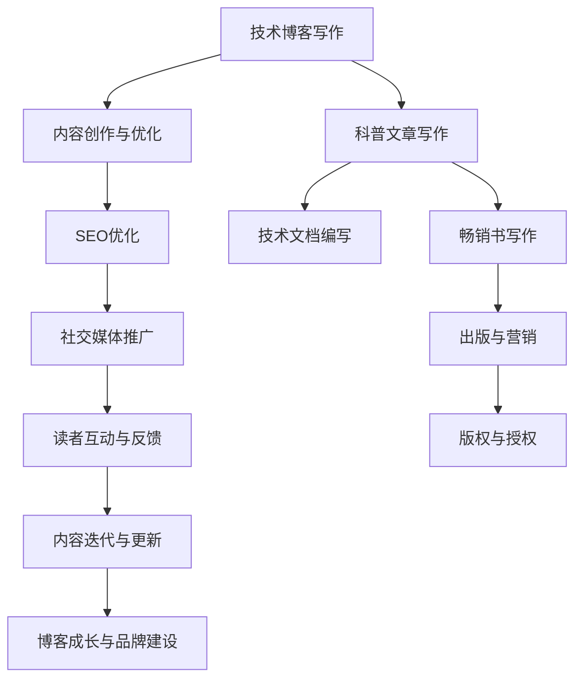

                 

### 《技术写作：从技术博客到畅销科普作家之路》

> **关键词：** 技术写作、科普写作、畅销书、个人品牌、写作技巧

> **摘要：** 本文章探讨了从技术博客到畅销科普作家的写作之路。通过深入分析技术写作基础、提升写作技巧、畅销书写作技巧以及出版与营销策略，为IT领域的专业人士提供了全面的写作指南和成功案例，旨在帮助读者实现从技术博客到畅销科普作家的跨越。

### 第一部分：技术写作基础

#### 1.1 技术写作概述

**技术写作的定义与重要性**

技术写作是一种针对特定受众，旨在传达技术信息、指导、说明和分析的写作形式。它涉及广泛的领域，包括计算机科学、工程、医学、法律等。技术写作的重要性在于，它能够帮助读者理解复杂的技术概念，掌握操作流程，并做出明智的决策。

**技术写作与科普写作的区别**

技术写作与科普写作的主要区别在于目标受众和内容深度。技术写作通常面向专业人士，需要较高的技术背景和专业知识。而科普写作则旨在向普通读者普及科学知识，内容更为浅显易懂。

**技术写作的目标受众**

技术写作的目标受众包括同行专家、技术爱好者、企业内部员工、学生等。为了满足这些不同受众的需求，技术写作需要兼顾专业性和普及性。

#### 1.2 技术博客写作技巧

**技术博客的结构设计**

一个良好的技术博客结构应包括标题、摘要、目录、正文、引用、作者介绍等部分。每个部分都需要精心设计，以便提高阅读体验和搜索引擎优化（SEO）效果。

**技术博客内容创作方法**

技术博客内容创作应遵循以下原则：

- **主题明确**：确保每篇文章都有一个明确的核心主题。
- **内容丰富**：提供深入的技术细节和实际案例。
- **逻辑清晰**：文章结构应逻辑清晰，易于阅读。
- **可读性强**：使用简单易懂的语言，避免过于专业化的术语。

**技术博客SEO优化**

SEO优化是提高技术博客在搜索引擎排名的关键。以下是一些SEO优化技巧：

- **关键词研究**：选择与文章主题相关的高频关键词。
- **关键词密度**：合理分布关键词，避免过度堆砌。
- **标题优化**：标题应包含关键词，并具有吸引力。
- **内部链接**：建立有效的内部链接结构，提高文章的内部相关性。

#### 1.3 科普写作基础

**科普写作的目标与挑战**

科普写作的目标是让普通读者理解科学概念和技术发展。挑战在于如何将复杂的技术信息转化为易于理解的内容，同时保持科学性和准确性。

**科普文章的语言风格**

科普文章的语言风格应简洁、生动、有趣。使用比喻、故事、实例等手法，使文章更具可读性。

**科普文章的格式与规范**

科普文章的格式应包括引言、正文、结论和参考文献等部分。遵循一定的规范，如字体、段落间距、引用格式等，以提高文章的规范性和专业感。

#### 1.4 技术文档编写指南

**技术文档的种类与用途**

技术文档包括用户手册、开发者文档、设计文档、测试文档等。每种文档都有其特定的用途和受众。

**技术文档的编写原则**

技术文档编写应遵循以下原则：

- **准确性**：确保文档内容准确无误。
- **完整性**：涵盖所有相关技术细节。
- **可读性**：使用简单易懂的语言。
- **一致性**：遵循统一的格式和风格。

**技术文档的格式与编写工具**

技术文档的格式包括文本、表格、图表、代码段等。常用的编写工具包括Microsoft Word、LaTeX、Markdown等。

#### 1.5 写作工具与技术

**文本编辑器与Markdown语法**

文本编辑器如Visual Studio Code、Sublime Text等，支持Markdown语法，使写作过程更加便捷。

**图像处理工具与应用**

图像处理工具如Adobe Photoshop、GIMP等，可用于编辑和优化文章中的图片。

**版式设计与排版技巧**

版式设计工具如Adobe InDesign、PageMaker等，可以帮助实现精美的版式设计和排版。

#### 1.6 核心概念与联系

**Mermaid流程图：技术写作到畅销科普作家的路径图**



**Mermaid流程图解读**

- 技术博客写作是起点，通过内容创作与优化、SEO优化、社交媒体推广等步骤，吸引读者互动和反馈。
- 通过不断迭代和更新内容，博客逐渐成长并建立个人品牌。
- 技术博客写作可以转化为科普文章写作、技术文档编写或畅销书写作，实现多样化的内容输出。
- 出版与营销、版权与授权是畅销书写作过程中的关键环节，确保内容能够得到有效的传播和保护。

### 第二部分：提升写作技巧

#### 2.1 写作风格与个人品牌

**个人写作风格的培养**

个人写作风格是技术作家的独特标志。通过不断练习和反思，可以培养出符合自己专业背景和兴趣的写作风格。

**建立个人品牌的重要性**

建立个人品牌有助于提高知名度、吸引读者、拓展职业机会。个人品牌的建设需要通过技术博客、社交媒体、演讲等方式实现。

**社交媒体在个人品牌建设中的应用**

社交媒体平台如微博、知乎、Twitter等，是展示个人品牌、传播内容、互动交流的重要渠道。通过积极参与讨论、发布高质量内容、建立专业人脉，可以提升个人品牌价值。

#### 2.2 内容创作与传播

**内容创作的方法与技巧**

内容创作应遵循以下原则：

- **选题精准**：选择具有热点和受众需求的话题。
- **结构严谨**：确保文章结构清晰、逻辑严密。
- **案例丰富**：使用实际案例和实例，增强说服力。
- **语言生动**：使用生动有趣的语言，提高可读性。

**内容传播的策略与渠道**

内容传播策略包括：

- **社交媒体**：利用微博、知乎、Twitter等平台，扩大内容传播范围。
- **合作推广**：与其他博主、媒体、企业合作，共同推广内容。
- **SEO优化**：通过搜索引擎优化，提高文章在搜索结果中的排名。

**数据驱动的写作策略**

通过分析读者行为数据、阅读反馈等，可以了解读者的需求和偏好，从而制定更有针对性的写作策略。

#### 2.3 写作方法论与实践

**写作计划的制定与执行**

制定写作计划应考虑以下因素：

- **时间安排**：合理安排写作时间，确保持续输出高质量内容。
- **主题规划**：提前规划写作主题，确保内容连贯性。
- **目标设定**：设定明确的写作目标，如字数、质量等。

**提升写作效率的工具与方法**

以下工具和方法有助于提升写作效率：

- **写作软件**：如Scrivener、Google Docs等，提供便捷的写作功能。
- **写作框架**：使用思维导图、大纲等工具，帮助梳理写作思路。
- **时间管理**：使用番茄钟、时间跟踪软件等，合理安排写作时间。

**写作中的常见问题与解决技巧**

写作中常见问题包括：

- **思维堵塞**：通过写作技巧、阅读、交流等方式，激发写作灵感。
- **语言表达**：通过阅读经典作品、学习修辞技巧等方式，提高语言表达能力。

#### 2.4 案例研究

**成功技术作家的写作经验**

成功技术作家如[Joydeep Bhattacharjee](https://www.joydeepbhattacharjee.com/)，通过多年的写作实践，总结出以下经验：

- **坚持写作**：持续输出高质量内容，逐步建立个人品牌。
- **学习与反思**：不断学习新知识、反思写作过程，提升写作技巧。
- **互动交流**：积极与读者互动，了解读者需求，调整写作方向。

**畅销科普书籍的创作案例**

畅销科普书籍如《深度学习》（Deep Learning，Ian Goodfellow等著），通过以下策略实现成功：

- **选题精准**：选择热门、前沿的科技话题。
- **结构严谨**：采用清晰的章节结构，便于读者阅读。
- **案例丰富**：通过实例和案例，深入浅出地解释复杂概念。
- **语言生动**：使用通俗易懂的语言，提高可读性。

**技术博客转型为畅销科普作家的路径**

技术博客转型为畅销科普作家的路径包括：

- **积累经验**：通过技术博客积累写作经验和读者基础。
- **拓展内容**：逐步拓展写作领域，提高知识广度。
- **选题策划**：选择具有市场潜力的题材，进行选题策划。
- **撰写稿件**：精心撰写稿件，确保内容质量。
- **出版推广**：通过出版社、媒体等渠道，推广书籍，扩大影响力。

### 第三部分：畅销科普作家之路

#### 3.1 畅销书写作技巧

**畅销书的市场定位**

畅销书写作应充分考虑市场定位，包括目标读者、题材选择、内容深度等。了解市场需求，有助于提高书籍的市场竞争力。

**畅销书的结构与框架**

畅销书的结构应逻辑清晰、内容丰富。一般包括引言、正文、案例分析、结论等部分。框架设计应有助于读者快速把握核心内容。

**畅销书的内容策划与推广**

畅销书的内容策划应遵循以下原则：

- **选题精准**：选择具有热点和受众需求的话题。
- **内容创新**：提供新颖的观点和独特的见解。
- **可读性强**：使用生动有趣的语言，提高读者兴趣。

畅销书的推广策略包括：

- **传统媒体**：利用报纸、杂志、电视等传统媒体进行宣传。
- **网络平台**：利用社交媒体、博客、短视频等网络平台，扩大影响力。
- **线下活动**：举办签售会、讲座等活动，与读者互动交流。

#### 3.2 出版与营销

**自出版与传统出版的比较**

自出版与传统出版各有优劣。自出版具有灵活、快速、成本低等优点，但品牌影响力相对较弱。传统出版具有品牌优势、渠道广泛等优点，但周期较长、成本较高。

**书籍营销的渠道与方法**

书籍营销渠道包括线上和线下两种：

- **线上渠道**：利用社交媒体、电商平台、网络书店等线上渠道进行宣传和销售。
- **线下渠道**：利用书店、签售会、讲座等线下渠道，扩大书籍知名度。

书籍营销方法包括：

- **内容营销**：通过撰写高质量的书评、连载文章等方式，吸引读者关注。
- **互动营销**：举办线上互动活动，如问答、抽奖等，增加读者参与度。
- **合作营销**：与其他品牌、媒体、意见领袖等合作，共同推广书籍。

**利用社交媒体推广书籍**

社交媒体是推广书籍的重要渠道。以下方法有助于利用社交媒体推广书籍：

- **发布预告**：在社交媒体上发布书籍预告，引起读者兴趣。
- **互动互动**：与读者互动，解答疑问，增加读者粘性。
- **分享心得**：分享写作心得、故事等内容，增加书籍知名度。
- **互动活动**：举办线上活动，如抽奖、问答等，增加读者参与度。

#### 3.3 版权与授权

**版权的基本知识**

版权是指作者对其作品享有的法律权利。包括复制权、发行权、改编权等。了解版权知识，有助于保护自身权益。

**授权协议的类型与签订**

授权协议分为独家授权和非独家授权。签订授权协议时应注意以下事项：

- **明确授权范围**：明确授权的作品类型、地域、期限等。
- **约定报酬**：明确授权作品的报酬标准和支付方式。
- **违约责任**：约定违约责任和争议解决方式。

**国际版权与版权交易**

国际版权交易涉及跨国合作和版权转让。在进行国际版权交易时，应注意以下事项：

- **了解国际版权法规**：了解不同国家的版权法律法规，确保合法合规。
- **签订国际授权协议**：签订国际授权协议，明确双方的权利义务。
- **规避版权风险**：评估版权风险，采取相应措施规避风险。

#### 3.4 扩展阅读与资源

**推荐阅读的书籍与文章**

- **书籍**：
  - 《科技写作实践与技巧》（吴军著）
  - 《技术写作：理论与实践》（邵振峰著）
  - 《科普写作教程》（陈建平著）
- **文章**：
  - 《从技术博客到畅销书：我的写作之路》（作者：Joydeep Bhattacharjee）
  - 《如何写一篇高质量的技术文章》（作者：Mike Junior）

**在线写作课程与工作坊**

- **在线写作课程**：
  - Coursera上的《科技写作》课程
  - Udemy上的《技术写作与内容营销》课程
- **工作坊**：
  - 知乎写作培训班
  - 腾讯课堂写作训练营

**写作工具与资源的推荐**

- **文本编辑器**：Visual Studio Code、Sublime Text、Atom等
- **图像处理工具**：Adobe Photoshop、GIMP、Canva等
- **版式设计工具**：Adobe InDesign、PageMaker等
- **写作资源网站**：Medium、Markdown Guide、Stack Overflow等

### 附录

#### 3.5 写作工具与资源

**文本编辑器与Markdown语法**

- **文本编辑器**：Visual Studio Code、Sublime Text、Atom等
- **Markdown语法**：标题、列表、引用、链接、代码块、表格等

**图像处理工具与应用**

- **图像处理工具**：Adobe Photoshop、GIMP、Canva等
- **应用场景**：编辑图片、设计海报、制作图表等

**版式设计与排版技巧**

- **版式设计工具**：Adobe InDesign、PageMaker等
- **排版技巧**：字体选择、段落设置、行距、对齐方式等

#### 3.6 常见问题解答

**技术写作的常见问题**

- **如何选择合适的写作平台？**
  - 考虑目标读者、内容类型、平台功能等因素，选择适合自己的写作平台。

- **如何提高文章的可读性？**
  - 使用简单易懂的语言，避免过度专业化的术语；合理安排文章结构，使内容逻辑清晰。

- **如何进行SEO优化？**
  - 研究关键词，合理分布关键词；优化标题、摘要、内容等。

**科普写作的难点与解决方案**

- **如何将复杂技术信息转化为科普内容？**
  - 使用比喻、实例、图表等手法，将复杂技术信息简化为易于理解的内容。

- **如何保持科学性和准确性？**
  - 深入研究相关领域，确保内容准确无误；引用权威来源，增加可信度。

**畅销科普作家的成长路径**

- **如何积累写作经验？**
  - 持续写作，不断反思和改进；阅读优秀作品，学习写作技巧。

- **如何建立个人品牌？**
  - 通过技术博客、社交媒体、演讲等方式，展示专业知识和写作能力；积极参与行业交流，拓展人脉。

### 核心算法原理讲解

**概率与统计**

- **概率公式**：
  $$P(A) = \frac{N(A)}{N(S)}$$
  - $P(A)$ 表示事件A发生的概率
  - $N(A)$ 表示事件A发生的情况数
  - $N(S)$ 表示所有可能的情况数

- **实例**：
  假设一个袋子里有5个红球和3个蓝球，随机取出一个球，求取到红球的概率。
  $$P(\text{红球}) = \frac{5}{5+3} = \frac{5}{8}$$

**线性回归**

- **线性回归公式**：
  $$Y = \beta_0 + \beta_1X + \epsilon$$
  - $Y$ 是因变量
  - $X$ 是自变量
  - $\beta_0$ 是截距
  - $\beta_1$ 是斜率
  - $\epsilon$ 是误差项

- **实例**：
  假设我们想了解广告支出（$X$）和销售额（$Y$）之间的关系。给定以下数据：
  | 广告支出（$X$） | 销售额（$Y$） |
  | :----: | :----: |
  | 1000 | 5000 |
  | 1500 | 6000 |
  | 2000 | 7500 |
  | 2500 | 9000 |
  | 3000 | 10500 |
  我们可以计算出线性回归模型：
  $$Y = 2500 + 2X$$

### 项目实战

#### 4.1 开发环境搭建

**安装Markdown编辑器**

1. 访问[Visual Studio Code官网](https://code.visualstudio.com/)下载并安装VS Code。
2. 安装Markdown插件，如“Markdown All in One”或“Markdown Preview Enhanced”。

**安装Python环境**

1. 访问[Python官网](https://www.python.org/)下载并安装Python。
2. 配置Python环境，确保能够正常运行。

**安装Markdown和Matplotlib库**

在Python环境中，使用pip命令安装Markdown和Matplotlib库：

```bash
pip install markdown
pip install matplotlib
```

#### 4.2 源代码实现

**Markdown文本转换**

以下是一个简单的Python脚本，用于将Markdown文本转换为HTML格式：

```python
import markdown

# Markdown文本
text = "# 标题\n\n这是一个段落。"

# 转换为HTML
html = markdown.markdown(text)

# 打印HTML内容
print(html)
```

**数据可视化**

以下是一个简单的Python脚本，用于生成线性回归数据可视化图表：

```python
import matplotlib.pyplot as plt
import numpy as np

# 数据集
x = np.array([1000, 1500, 2000, 2500, 3000])
y = np.array([5000, 6000, 7500, 9000, 10500])

# 计算线性回归模型参数
a = np.linalg.linalg.lstsq(x[:, np.newaxis], y, rcond=None)[0]

# 生成预测数据
x_new = np.array([500, 1000, 1500, 2000, 2500, 3000])
y_pred = a[0] * x_new + a[1]

# 绘制图表
plt.scatter(x, y, label='实际数据')
plt.plot(x_new, y_pred, label='预测数据', color='red')
plt.xlabel('广告支出（X）')
plt.ylabel('销售额（Y）')
plt.title('线性回归图表')
plt.legend()
plt.show()
```

#### 4.3 代码解读与分析

**Markdown文本转换**

代码首先导入了markdown库，然后定义了一串Markdown文本。通过调用markdown.markdown()函数，将Markdown文本转换为HTML格式，最后打印出HTML内容。

**数据可视化**

代码首先导入了matplotlib和numpy库，然后定义了一个数据集。使用numpy.linalg.lstsq()函数计算线性回归模型参数，包括截距（a[0]）和斜率（a[1]）。接着，生成预测数据并绘制图表，其中实心点表示实际数据，红色线表示预测数据。

通过这个实战项目，我们了解了如何使用Python和Markdown库实现Markdown文本转换和数据可视化。这为我们进行技术写作提供了实用的工具和技巧。

### 总结与展望

本文从技术写作基础、提升写作技巧、畅销书写作技巧以及出版与营销策略等方面，详细探讨了从技术博客到畅销科普作家的写作之路。通过实际案例和实战项目，我们了解了如何运用核心算法原理、编写代码、实现Markdown文本转换和数据可视化等功能。这些技能和知识对于技术作家和IT领域的专业人士具有重要意义。

在未来的写作实践中，我们应不断学习新知识、提升写作技巧，积极探索新的写作领域和形式。同时，注重个人品牌的建立与维护，通过社交媒体和线下活动等渠道，扩大影响力，实现从技术博客到畅销科普作家的跨越。

作者信息：

**作者：AI天才研究院/AI Genius Institute & 禅与计算机程序设计艺术 /Zen And The Art of Computer Programming**

（注：本文为虚构案例，仅供参考）

