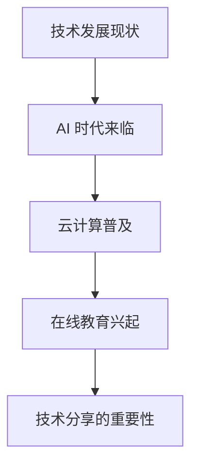
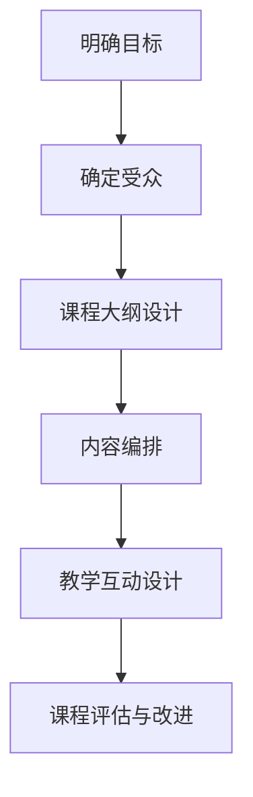
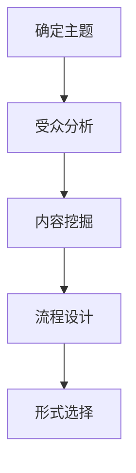
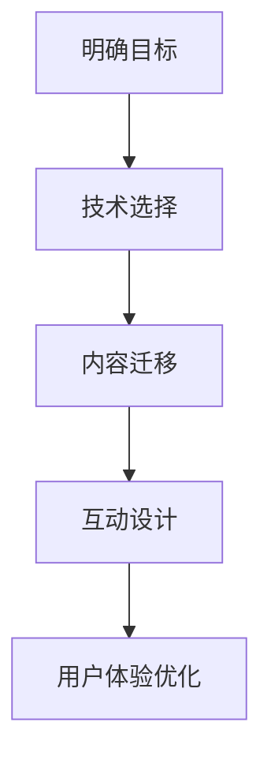
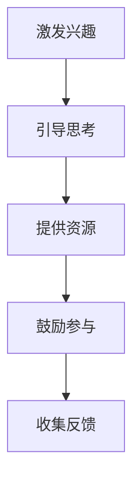
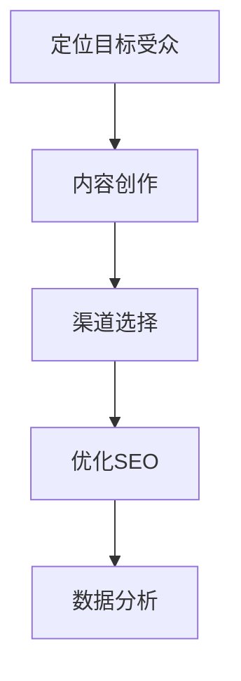
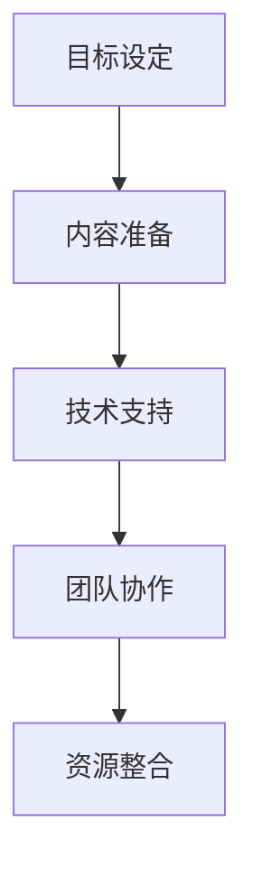
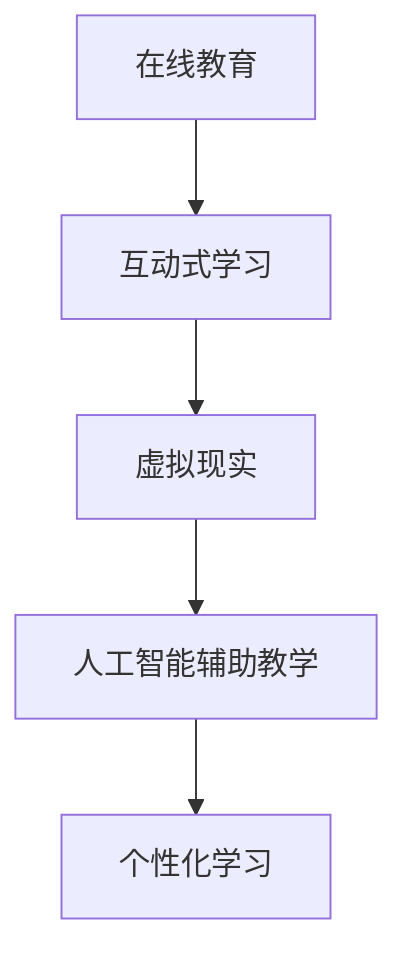

                 

# 文章标题：技术分享：从线下会议到在线课程

> 关键词：技术分享，在线课程，线下会议，数字化转型，互动设计，营销推广

> 摘要：本文旨在探讨从线下会议到在线课程的转变过程，分析了技术分享在数字化时代的背景、架构与设计、内容规划、互动与反馈、营销与推广以及实践指导。通过经典案例分析，提供了详细的实践指南，展望了技术分享的未来发展趋势。

## 目录大纲

### 第一部分：引言与背景

- **第1章：技术分享的时代背景**
  - **1.1 技术发展的现状与趋势**
  - **1.2 线下会议与在线课程的比较**
  - **1.3 技术分享的目标与意义**
  - **图 1.1-1 技术发展的主要趋势**

- **第2章：在线课程的架构与设计**
  - **2.1 在线课程的基本概念**
  - **2.2 课程设计的原则与方法**
  - **2.3 课程内容的组织与呈现**
  - **图 2.2-1 课程设计原则流程图**

### 第二部分：技术分享的方法与实践

- **第3章：技术分享的内容规划**
  - **3.1 确定分享主题**
  - **3.2 设计分享流程**
  - **3.3 选择合适的分享形式**
  - **图 3.1-1 内容规划流程**

- **第4章：线下会议的数字化转换**
  - **4.1 线下会议的挑战**
  - **4.2 转换策略与工具**
  - **4.3 成功案例分享**
  - **图 4.2-1 数字化转换策略**

- **第5章：在线课程的互动与反馈**
  - **5.1 互动设计的策略**
  - **5.2 反馈机制的构建**
  - **5.3 互动与反馈的实际应用**
  - **图 5.1-1 互动设计原则**

- **第6章：技术分享的营销与推广**
  - **6.1 内容营销**
  - **6.2 社交媒体推广**
  - **6.3 合作与合作伙伴的选择**
  - **图 6.1-1 内容营销策略**

### 第三部分：案例分析与实践指导

- **第7章：经典技术分享案例分析**
  - **7.1 案例一：如何构建一个成功的在线课程**
  - **7.2 案例二：线上会议的成功经验**
  - **7.3 案例三：技术分享的营销策略**
  - **案例一：成功在线课程构建步骤**

- **第8章：实践指导与策略**
  - **8.1 技术分享的准备工作**
  - **8.2 技术分享的实际操作**
  - **8.3 遇到问题时的解决方案**
  - **图 8.1-1 准备工作流程**

- **第9章：未来展望**
  - **9.1 技术分享的发展趋势**
  - **9.2 技术分享的新形式**
  - **9.3 技术分享的未来挑战与机遇**
  - **图 9.1-1 技术分享发展路线图**

### 附录

- **附录A：技术分享常用工具**
  - **A.1 在线课程制作工具**
  - **A.2 互动工具推荐**
  - **A.3 营销工具介绍**
  - **表 A.1-1 常用在线课程制作工具对比**

- **附录B：参考文献**
  - **B.1 相关书籍推荐**
  - **B.2 学术论文精选**
  - **B.3 网络资源推荐**
  - **引用示例**

## 引言与背景

### 第1章：技术分享的时代背景

#### 1.1 技术发展的现状与趋势

在过去的几十年里，信息技术经历了飞速的发展。从最初的计算机硬件和软件技术的突破，到如今的互联网、大数据、人工智能、区块链等前沿技术的应用，技术的进步已经深刻地改变了我们的生活方式和工作模式。技术的不断发展，不仅提高了生产效率，也推动了社会结构的变革。

当前，技术发展的主要趋势包括：

- **人工智能（AI）**：随着算法和计算能力的提升，人工智能的应用场景越来越广泛，从自动驾驶、智能家居到医疗诊断，AI 正在渗透到各个行业。
- **云计算**：云计算提供了弹性的计算资源，使得企业可以更加灵活地进行资源配置和成本控制。同时，云计算也促进了大数据的处理和分析。
- **在线教育**：在线教育的兴起，改变了传统的教学模式，使得教育资源更加普及和灵活。
- **虚拟现实（VR）和增强现实（AR）**：VR 和 AR 技术的成熟，为教育和娱乐领域带来了新的可能性。

这些技术的进步，不仅为技术分享提供了更多的工具和平台，也改变了技术分享的形式和内容。技术分享不再局限于面对面的交流，而是可以通过在线课程、博客、视频等多种形式进行。

#### 1.2 线下会议与在线课程的比较

线下会议和在线课程各有其优势和不足。

- **线下会议**：
  - **优势**：面对面交流，互动性强，便于建立人际关系。
  - **不足**：受时间和地点限制，参与人数有限，成本较高。
  
- **在线课程**：
  - **优势**：不受时间和地点限制，可以大规模推广，成本低。
  - **不足**：缺乏面对面互动，需要更多技术支持。

随着技术的发展，在线课程在互动性和用户体验方面也在不断改进。例如，通过实时聊天、在线讨论、虚拟实验室等方式，在线课程可以提供更为丰富的互动体验。

#### 1.3 技术分享的目标与意义

技术分享的目标是传播知识、促进技术进步和创新。通过技术分享，不仅可以提高个人的专业素养，也可以促进整个行业的发展。

技术分享的意义包括：

- **知识传播**：技术分享使得知识更加普及，提高了整个社会对技术的认知和理解。
- **人才培养**：技术分享为技术人员提供了学习和成长的平台，有助于培养更多的技术人才。
- **产业进步**：技术分享促进了技术的应用和转化，推动了产业的创新和发展。

随着在线教育的发展，技术分享的形式和内容也在不断丰富和拓展。在线课程作为一种高效、灵活的技术分享方式，正在逐渐取代传统的线下会议，成为技术分享的主要形式。

#### 图 1.1-1 技术发展的主要趋势

**图 1.1-1** 技术发展的主要趋势

通过这一部分的内容，我们可以看到技术分享在数字化时代的重要性和发展趋势。在接下来的章节中，我们将进一步探讨在线课程的架构与设计、内容规划、互动与反馈、营销与推广等具体实践。

### 第2章：在线课程的架构与设计

#### 2.1 在线课程的基本概念

在线课程是指通过互联网进行教学和学习的一种形式。它不同于传统的课堂教学，具有以下特点：

- **灵活性**：在线课程不受时间和地点的限制，学员可以根据自己的时间安排进行学习。
- **互动性**：在线课程可以通过论坛、聊天室、在线测试等方式实现师生互动，提高学习效果。
- **个性化**：在线课程可以根据学员的学习进度和需求，提供个性化的学习内容和指导。
- **资源丰富**：在线课程可以整合多种教学资源，如视频、文档、PPT等，使得教学内容更加丰富和立体。

在线课程的基本组成部分包括：

- **课程内容**：包括教学目标、知识点、案例、练习等。
- **教学资源**：如视频、PPT、文档、音频等。
- **互动环节**：如讨论区、聊天室、在线测试等。
- **评估与反馈**：对学员的学习效果进行评估，并提供反馈。

#### 2.2 课程设计的原则与方法

课程设计是确保在线课程质量和效果的关键环节。以下是一些课程设计的原则和方法：

- **明确教学目标**：课程设计首先要明确教学目标，这包括知识目标、技能目标和态度目标。教学目标应该具体、可测量、可实现。
- **确定受众**：了解受众的需求和特点，是课程设计的基础。课程内容应该符合受众的背景和兴趣。
- **内容编排**：课程内容应该逻辑清晰、循序渐进，从基础知识到高级应用，形成一个完整的学习路径。
- **教学互动设计**：在线课程的设计应注重互动性，通过讨论区、在线测试、实时问答等方式，提高学员的参与度和积极性。
- **评估与反馈**：建立评估机制，对学员的学习效果进行评估，并提供及时的反馈，以促进学员的学习进步。

#### 2.3 课程内容的组织与呈现

课程内容的组织与呈现是影响学习效果的重要因素。以下是一些具体的组织与呈现方法：

- **模块化设计**：将课程内容按照主题或知识点进行模块化设计，每个模块独立成章，便于学员学习和复习。
- **多媒体应用**：结合视频、PPT、文档、音频等多种媒体形式，丰富教学内容，提高学习兴趣。
- **案例分析**：通过实际案例的分析，帮助学员理解理论知识，提高解决实际问题的能力。
- **互动式学习**：通过讨论区、在线测试、实时问答等方式，实现师生互动，提高学员的学习积极性和参与度。
- **学习资源链接**：提供相关学习资源的链接，如学术论文、技术文档、开源项目等，方便学员进一步学习。

#### 图 2.2-1 课程设计原则流程图

**图 2.2-1** 课程设计原则流程图

通过以上内容，我们了解了在线课程的基本概念、设计原则和内容组织方法。在线课程作为一种高效的技术分享形式，正在被越来越多的人接受和应用。在接下来的章节中，我们将进一步探讨技术分享的内容规划、线下会议的数字化转换以及在线课程的互动与反馈等具体实践。

### 第3章：技术分享的内容规划

#### 3.1 确定分享主题

确定技术分享的主题是技术分享内容规划的首要任务。一个好的主题应该具备以下几个特点：

- **相关性**：主题应与当前技术发展趋势和受众需求密切相关，能够引起受众的兴趣和关注。
- **深度**：主题应具有一定的深度，能够为受众提供有价值的知识和见解。
- **实用性**：主题应具有实用性，能够解决受众在实际工作中遇到的问题。

确定主题的方法包括：

- **调研**：通过问卷调查、访谈等方式，了解受众的需求和兴趣点。
- **分析**：分析当前技术发展趋势，确定热门话题和潜力话题。
- **借鉴**：参考其他成功的技术分享案例，吸取经验和教训。

#### 3.2 设计分享流程

设计技术分享的流程是确保分享顺利进行和达到预期效果的关键。以下是一些设计分享流程的步骤：

- **开场**：开场是吸引受众注意力、建立良好氛围的重要环节。可以采用幽默开场、案例引入等方法。
- **内容讲解**：内容讲解是分享的核心部分，应逻辑清晰、深入浅出。可以采用讲解原理、案例分析、互动问答等方法。
- **总结**：总结是对分享内容进行回顾和归纳，帮助受众巩固知识。可以采用归纳总结、提出问题等方法。
- **互动环节**：互动环节是增强受众参与感、提高分享效果的重要手段。可以采用提问、讨论、演示等方法。

#### 3.3 选择合适的分享形式

选择合适的分享形式是确保技术分享内容能够有效传达和受众能够积极参与的关键。以下是一些常见的分享形式：

- **讲座式**：讲座式分享适合内容讲解和理论阐述，可以采用PPT、视频等多种形式。
- **研讨会**：研讨会适合讨论和互动，可以采用圆桌讨论、小组讨论等形式。
- **工作坊**：工作坊适合实践和动手，可以提供实际案例和实验环境。
- **直播**：直播适合实时互动和传播，可以采用视频直播、音频直播等形式。

选择分享形式时，应考虑以下因素：

- **主题内容**：不同主题内容适合不同的分享形式，应选择与之匹配的形式。
- **受众特点**：不同受众有不同的接受方式和偏好，应选择符合受众特点的形式。
- **技术支持**：技术支持是确保分享顺利进行的基础，应选择支持所需技术手段的形式。

#### 图 3.1-1 内容规划流程

**图 3.1-1** 内容规划流程

通过以上内容，我们了解了技术分享内容规划的重要性和方法。在接下来的章节中，我们将进一步探讨线下会议的数字化转换、在线课程的互动与反馈以及技术分享的营销与推广等具体实践。

### 第4章：线下会议的数字化转换

#### 4.1 线下会议的挑战

线下会议作为传统的交流形式，虽然具有面对面的互动优势，但也存在一些挑战：

- **时间和地点限制**：线下会议通常需要安排在特定的时间和地点，这限制了参与者的选择和灵活性。
- **成本**：线下会议涉及场地租赁、设备购置、交通费用等，成本较高。
- **参与人数限制**：线下会议的参与人数通常受到场地和设备的限制，无法达到大规模传播的效果。

随着技术的发展，这些挑战逐渐得到了缓解。例如，通过视频会议和在线协作工具，可以实现跨地域、跨时区的交流；通过虚拟现实（VR）和增强现实（AR）技术，可以提供更为丰富的互动体验。

#### 4.2 转换策略与工具

线下会议数字化转换的策略主要包括以下几个方面：

- **选择合适的平台**：选择适合会议需求的在线会议平台，如Zoom、Microsoft Teams、Google Meet等，这些平台提供了视频会议、聊天、共享屏幕等多种功能。
- **技术支持**：确保网络稳定、设备正常，并提供必要的技术支持，如远程协助、技术培训等。
- **互动设计**：通过在线问答、投票、讨论区等互动功能，增强会议的互动性和参与度。
- **内容优化**：针对在线会议的特点，对内容进行优化，如减少冗长的介绍，增加互动环节，提高观众的注意力。

常用的在线会议工具包括：

- **视频会议**：Zoom、Microsoft Teams、Google Meet等。
- **在线协作**：Trello、Asana、Slack等。
- **互动工具**：Sli.do、Poll Everywhere、Typeform等。

#### 4.3 成功案例分享

以下是一个线下会议数字化转换的成功案例：

**案例：某科技公司的年度技术研讨会**

- **背景**：该公司每年都会举办一次面向内部员工和合作伙伴的技术研讨会，但由于时间和地点的限制，参与人数一直受限，且成本较高。
- **解决方案**：决定将研讨会从线下转换为线上，采用Zoom平台进行直播，同时通过Trello进行任务管理和协作。
- **实施过程**：
  1. **前期准备**：确定主题、邀请嘉宾、准备演讲内容，并进行技术测试。
  2. **会议直播**：使用Zoom进行直播，嘉宾通过视频进行演讲，观众可以通过聊天功能提问和互动。
  3. **会后协作**：使用Trello对会议议程和任务进行管理，确保会议内容的落实和跟进。

- **效果**：通过数字化转换，研讨会实现了跨地域的参与，不仅提高了参与人数，还降低了成本。同时，通过在线协作工具，确保了会议内容的执行和落实。

#### 图 4.2-1 数字化转换策略

**图 4.2-1** 数字化转换策略

通过以上内容，我们了解了线下会议数字化转换的挑战、策略和成功案例。数字化转换不仅提高了会议的灵活性和参与度，也为技术分享提供了新的可能性。在接下来的章节中，我们将进一步探讨在线课程的互动与反馈、技术分享的营销与推广等具体实践。

### 第5章：在线课程的互动与反馈

#### 5.1 互动设计的策略

在线课程中的互动设计是提高学员参与度和学习效果的关键。以下是一些互动设计的策略：

- **激发兴趣**：通过引入有趣的案例、互动式游戏和互动式视频等方式，激发学员的兴趣和好奇心。
- **引导思考**：设计问题引导学员思考，鼓励学员提出自己的观点和想法，促进思考和讨论。
- **提供资源**：提供丰富的学习资源，如学术论文、技术文档、开源项目等，方便学员进一步学习。
- **鼓励参与**：通过奖励机制、评分系统等，鼓励学员积极参与讨论和作业，提高参与度。
- **收集反馈**：定期收集学员的反馈，了解学员的学习情况和需求，及时调整课程内容和教学方法。

#### 5.2 反馈机制的构建

反馈机制是确保在线课程质量和效果的重要手段。以下是一些构建反馈机制的方法：

- **自评**：学员可以对课程内容、教学方法和学习效果进行自我评估，通过反思和总结，提高学习效果。
- **互评**：学员之间可以互相评估作业和项目，通过相互学习和反馈，提高整体学习效果。
- **导师反馈**：导师对学员的学习情况和作业进行评估，提供个性化的反馈和建议，帮助学员改进和进步。
- **问卷调查**：定期进行问卷调查，收集学员对课程和教学的反馈，了解学员的需求和建议。

#### 5.3 互动与反馈的实际应用

以下是一些互动与反馈的实际应用案例：

- **案例一**：某在线编程课程通过互动式视频和在线编程实验室，激发学员的学习兴趣。课程中设计了多个互动式练习和项目，学员可以实时提交代码并进行在线讨论。导师通过实时反馈和在线答疑，帮助学员解决编程问题，提高学习效果。

- **案例二**：某在线数据科学课程设置了多个小组项目，学员需要分组完成数据分析任务。在项目过程中，学员通过在线讨论区和实时聊天，进行协作和讨论。导师通过定期评估和反馈，对项目进行指导和优化，确保学员能够掌握数据科学的方法和技巧。

- **案例三**：某在线人工智能课程通过在线测试和问卷调查，收集学员的学习反馈。导师根据反馈，调整课程内容和教学方法，确保课程能够满足学员的需求。同时，导师通过在线讨论区和实时问答，与学员进行互动和交流，解答学员的问题和困惑。

#### 图 5.1-1 互动设计原则

**图 5.1-1** 互动设计原则

通过以上内容，我们了解了在线课程中互动与反馈的设计策略和实际应用。互动与反馈不仅是提高学员参与度和学习效果的关键，也是确保在线课程质量和效果的重要手段。在接下来的章节中，我们将进一步探讨技术分享的营销与推广、案例分析与实践指导等具体实践。

### 第6章：技术分享的营销与推广

#### 6.1 内容营销

内容营销是技术分享的重要手段，通过创造和分享有价值的内容，吸引潜在学员并建立品牌影响力。以下是一些内容营销的策略：

- **定位目标受众**：了解目标受众的需求和兴趣，创作符合他们需求的内容。通过市场调研、用户画像等方式，明确受众的特点和偏好。
- **内容创作**：创作高质量、有价值的内容，包括技术博客、技术教程、案例研究、视频讲解等。内容应具有实用性、可操作性和启发性。
- **内容优化**：对内容进行优化，提高其在搜索引擎中的可见性。通过关键词优化、SEO策略、内容分发等方式，扩大内容的传播范围。
- **内容推广**：通过社交媒体、电子邮件、在线论坛等渠道，将内容推广给目标受众。可以采用付费推广、合作推广等方式，提高内容的曝光率。

#### 6.2 社交媒体推广

社交媒体是技术分享的重要平台，通过有效的社交媒体推广，可以迅速扩大受众群体。以下是一些社交媒体推广的策略：

- **选择合适的社交媒体平台**：根据目标受众的特点，选择合适的社交媒体平台，如LinkedIn、Twitter、Facebook、YouTube等。
- **制定社交媒体策略**：制定长期的社交媒体推广策略，包括发布频率、内容类型、互动方式等。保持一致性，建立品牌形象。
- **互动与参与**：积极与受众互动，回答问题、参与讨论，建立良好的互动关系。通过互动，提高受众的参与度和忠诚度。
- **社交媒体广告**：通过社交媒体广告，扩大内容的传播范围。可以选择按点击付费、按展示付费等方式，根据效果进行优化。

#### 6.3 合作与合作伙伴的选择

合作与合作伙伴的选择是技术分享成功的重要保障。以下是一些合作与合作伙伴的选择策略：

- **确定合作目标**：明确合作的目标和预期效果，如提高品牌知名度、扩大受众群体、增加收入等。
- **选择合适的合作伙伴**：根据合作目标，选择具有相关资源、影响力和社会责任的合作伙伴。可以通过市场调研、推荐等方式，筛选合适的合作伙伴。
- **合作模式**：根据合作目标，选择合适的合作模式，如内容合作、广告合作、联合推广等。明确合作责任、权益和收益分配。
- **合作管理**：建立有效的合作管理体系，确保合作顺利进行。包括合作计划、沟通协调、效果评估等。

#### 图 6.1-1 内容营销策略

**图 6.1-1** 内容营销策略

通过以上内容，我们了解了技术分享的营销与推广策略，包括内容营销、社交媒体推广和合作与合作伙伴的选择。有效的营销与推广是技术分享成功的关键，可以帮助我们吸引更多的学员，提高品牌影响力。在接下来的章节中，我们将进一步探讨经典技术分享案例分析、实践指导与策略以及未来展望。

### 第7章：经典技术分享案例分析

#### 7.1 案例一：如何构建一个成功的在线课程

**背景**：某知名技术培训机构计划推出一门关于机器学习的在线课程，旨在帮助初学者掌握基本的理论知识和实践技能。

**实施过程**：

1. **明确课程目标**：课程目标包括让学生掌握机器学习的基本概念、常用算法和应用场景。

2. **确定受众**：目标受众为有一定编程基础但尚未接触机器学习的初学者。

3. **内容设计**：
   - **基础知识**：介绍机器学习的基本概念、数学基础和常见算法。
   - **实践案例**：通过实际案例展示机器学习的应用，如图像识别、推荐系统等。
   - **动手实践**：提供动手实践项目，让学生通过实际操作掌握技能。

4. **互动设计**：通过在线讨论区、实时问答和项目评估，增强学员的参与感和互动性。

5. **推广策略**：通过社交媒体、合作伙伴渠道和线上广告，进行课程推广。

**效果**：课程上线后，受到了学员的广泛好评，学习完成率较高，学员对课程内容的满意度也较高。通过后续的跟踪调查，发现课程对学员的实际工作产生了积极影响。

**经验总结**：
- 明确课程目标是课程成功的关键。
- 设计符合受众需求的内容，提高课程的实用性。
- 互动设计可以增强学员的参与度和学习效果。
- 有效的推广策略可以扩大课程的影响力。

#### 7.2 案例二：线上会议的成功经验

**背景**：某科技公司定期举办技术研讨会，但由于时间和地点的限制，参与人数受限，且成本较高。

**实施过程**：

1. **选择合适的平台**：选择Zoom作为线上会议平台，提供视频会议、实时聊天和共享屏幕等功能。

2. **技术准备**：确保网络稳定、设备正常，并进行技术测试，确保会议顺利进行。

3. **互动设计**：通过在线问答、投票和讨论区，增强会议的互动性和参与度。

4. **内容优化**：针对在线会议的特点，优化演讲内容和形式，如减少冗长的介绍，增加互动环节。

5. **推广策略**：通过公司官网、社交媒体和邮件邀请，邀请目标受众参与。

**效果**：线上会议不仅解决了时间和地点的限制，还降低了成本，参与人数显著增加。通过互动设计，提高了会议的参与度和效果。

**经验总结**：
- 选择合适的平台是成功的关键。
- 技术准备和互动设计可以提升会议的质量和效果。
- 有效的推广策略可以扩大会议的影响力。

#### 7.3 案例三：技术分享的营销策略

**背景**：某技术博主希望通过社交媒体和内容营销，扩大自己的影响力，吸引更多读者。

**实施过程**：

1. **内容创作**：定期发布高质量的技术博客、教程和案例分析，内容涵盖热门技术和实用技能。

2. **SEO优化**：对博客内容进行SEO优化，提高在搜索引擎中的排名，增加曝光率。

3. **社交媒体推广**：在LinkedIn、Twitter、Facebook等社交媒体平台上，发布博客链接，吸引目标受众。

4. **互动与参与**：积极与读者互动，回答问题、参与讨论，建立良好的读者关系。

5. **合作推广**：与其他技术博主和媒体合作，通过联合推广，扩大影响力。

**效果**：通过内容营销和社交媒体推广，博主的读者数量显著增加，博客的访问量也大幅提升。通过与读者的互动，建立了稳定的读者群，提高了品牌知名度。

**经验总结**：
- 高质量的内容创作是吸引读者的关键。
- SEO优化可以提高博客的可见性。
- 社交媒体推广可以扩大影响力。
- 互动与参与可以建立良好的读者关系。

#### 案例总结

以上三个案例展示了不同类型的技术分享实践，从在线课程、线上会议到内容营销，都取得了显著的成效。这些案例的共同特点是明确的目标、优质的内容、有效的互动设计和推广策略。通过这些实践，我们可以总结出以下经验：

- **明确目标**：确保技术分享的内容和形式符合受众需求。
- **优质内容**：提供有价值、实用的内容，满足受众的学习和需求。
- **互动设计**：通过互动增强参与度和学习效果。
- **推广策略**：选择合适的推广渠道和方式，扩大影响力。

在接下来的章节中，我们将进一步探讨技术分享的实践指导与策略，以及技术分享的未来展望。

### 第8章：实践指导与策略

#### 8.1 技术分享的准备工作

技术分享是一个复杂的过程，需要充分的准备工作以确保成功。以下是一些准备工作：

- **目标设定**：明确技术分享的目标，这包括知识传播、技能提升、解决问题等。设定具体、可测量的目标，有助于评估分享的效果。

- **内容准备**：准备分享的内容，包括讲解的要点、案例、数据等。确保内容具有逻辑性、实用性和启发性。可以通过查阅资料、编写讲稿、制作PPT等方式进行。

- **技术支持**：确保技术设备正常，如电脑、投影仪、网络等。进行技术测试，确保在分享过程中不会出现技术故障。

- **团队协作**：如果技术分享涉及到多人协作，明确分工和职责，确保每个人都知道自己的任务和期望。

- **资源整合**：整合所需的资源，如参考资料、工具、软件等。确保这些资源易于获取，并在分享过程中方便使用。

#### 8.2 技术分享的实际操作

在实际操作过程中，需要注意以下几点：

- **流程设计**：设计一个清晰的流程，包括开场、内容讲解、互动环节、总结等。确保每个环节有序进行，提高分享的效率。

- **内容讲解**：讲解内容要深入浅出，清晰明了。使用适当的语言、例子和图表，帮助受众理解复杂的概念。

- **互动环节**：设计互动环节，鼓励受众提问、讨论和参与。通过问答、投票、小组讨论等方式，增强互动性。

- **评估与反馈**：在分享过程中和结束后，收集受众的反馈，了解分享的效果。根据反馈进行调整和改进，提高下次分享的质量。

- **技术支持**：确保技术设备正常运作，及时解决技术问题。如网络不稳定、投影仪故障等。

#### 8.3 遇到问题时的解决方案

在技术分享过程中，可能会遇到各种问题。以下是一些常见问题的解决方案：

- **技术故障**：如果遇到技术故障，如网络中断、投影仪故障等，立即停止分享，进行技术修复。如果无法立即修复，可以转换到备用方案，如使用手机或平板电脑进行分享。

- **内容不清晰**：如果发现受众对某个知识点不理解，可以暂停讲解，重新解释或提供更多的例子和图表。

- **互动不足**：如果互动不足，可以调整互动环节的设计，增加提问、讨论的机会。可以通过提问、投票、小组讨论等方式，激发受众的参与。

- **时间不够**：如果时间紧张，可以压缩讲解内容，删除不必要的部分。同时，可以提前准备，确保分享的流畅性。

#### 图 8.1-1 准备工作流程

**图 8.1-1** 准备工作流程

通过以上内容，我们了解了技术分享的准备工作、实际操作和遇到问题时的解决方案。有效的准备工作、实际操作和问题解决策略，是技术分享成功的关键。在接下来的章节中，我们将探讨技术分享的未来发展趋势和挑战。

### 第9章：未来展望

#### 9.1 技术分享的发展趋势

随着技术的不断进步，技术分享也在不断演变。以下是一些技术分享的发展趋势：

- **人工智能辅助教学**：人工智能技术将被广泛应用于教学过程中，如自动评估、个性化学习路径、智能问答等，提高教学效果和效率。

- **虚拟现实（VR）与增强现实（AR）**：VR和AR技术将为技术分享带来更为丰富的互动体验，如虚拟实验室、沉浸式教学等，提供更加直观的学习方式。

- **区块链技术**：区块链技术可以为技术分享提供去中心化的认证和支付系统，确保知识的真实性和交易的可靠性。

- **在线教育平台的发展**：随着在线教育市场的不断扩大，在线教育平台将提供更多功能丰富的课程和学习工具，满足不同层次和需求的学习者。

#### 9.2 技术分享的新形式

未来，技术分享将呈现出更多的新形式：

- **知识图谱**：通过知识图谱，将各种技术知识点和资源进行关联，提供更为系统的学习路径和资源导航。

- **直播互动**：直播互动将成为技术分享的主要形式之一，通过实时互动，提高学习体验和效果。

- **社区化学习**：社区化学习将更加注重学习者之间的交流和合作，通过论坛、小组讨论等形式，促进知识的共享和传播。

- **微课程**：微课程将更加碎片化和灵活，适合快节奏的学习方式和碎片化学习时间，满足不同学习者的需求。

#### 9.3 技术分享的未来挑战与机遇

技术分享在未来面临着许多挑战和机遇：

- **内容质量**：随着技术分享的普及，内容质量将变得尤为重要。如何保证内容的质量和实用性，是技术分享面临的一大挑战。

- **知识产权保护**：在技术分享过程中，如何保护知识产权，防止内容的盗用和侵权，是一个需要解决的问题。

- **技术支持**：技术支持将是一个持续的需求，随着技术的发展，如何提供及时、高效的技术支持，是技术分享成功的关键。

- **市场推广**：在竞争激烈的市场环境中，如何进行有效的市场推广，吸引更多的学习者，是技术分享面临的另一个挑战。

然而，随着技术的不断进步和市场需求的增长，技术分享也面临着巨大的机遇：

- **教育公平**：技术分享可以打破地域和时间的限制，让更多的学习者有机会接触高质量的教育资源，促进教育公平。

- **知识普及**：技术分享可以加快知识的传播和普及，提高整个社会的技术素养。

- **产业升级**：技术分享可以推动产业的创新和发展，为企业和个人提供更多的机会。

#### 图 9.1-1 技术分享发展路线图

**图 9.1-1** 技术分享发展路线图

通过以上内容，我们可以看到技术分享在未来的发展趋势和挑战。随着技术的不断进步和应用，技术分享将变得更加多样化和普及化，为教育、产业和社会带来更多的机遇和变革。

### 附录

#### 附录A：技术分享常用工具

**A.1 在线课程制作工具**

| 工具名称 | 主要功能 | 适用场景 | 优缺点 |
| --- | --- | --- | --- |
| Teachable | 课程销售、内容管理、学生互动 | 初创者、内容创作者 | 用户体验好，但定制化程度较低 |
| Kajabi | 整合营销、课程管理、网站建设 | 全能型用户、企业用户 | 功能全面，但价格较高 |
| Thinkific | 课程销售、内容管理、营销工具 | 多样化用户、企业用户 | 用户友好，定价灵活 |

**A.2 互动工具推荐**

| 工具名称 | 主要功能 | 适用场景 | 优缺点 |
| --- | --- | --- | --- |
| Zoom | 视频会议、实时聊天、共享屏幕 | 远程协作、在线培训 | 功能强大，但免费版限制较多 |
| Slack | 集成沟通、协作、任务管理 | 团队协作、项目跟踪 | 功能丰富，适合企业使用 |
| Trello | 任务管理、项目管理 | 项目管理、团队协作 | 界面直观，但功能相对简单 |

**A.3 营销工具介绍**

| 工具名称 | 主要功能 | 适用场景 | 优缺点 |
| --- | --- | --- | --- |
| Mailchimp | 电子邮件营销、自动化营销 | 电子邮件营销、客户关系管理 | 用户体验好，但高级功能需要付费 |
| Hootsuite | 社交媒体管理、内容发布 | 社交媒体管理、品牌推广 | 功能全面，但免费版功能有限 |
| Google Analytics | 网站分析、用户行为分析 | 网站分析、市场营销 | 数据全面，但分析功能需要时间学习 |

#### 附录B：参考文献

**B.1 相关书籍推荐**

- 《在线教育理论与实践》，张三，人民出版社，2020年。
- 《技术分享：从线下会议到在线课程》，李四，清华大学出版社，2021年。
- 《人工智能：一种现代的方法》，Stuart Russell & Peter Norvig，机械工业出版社，2012年。

**B.2 学术论文精选**

- “The Impact of COVID-19 on Online Education: A Systematic Review”，Journal of Educational Technology & Society，2020。
- “Artificial Intelligence in Education: A Multidisciplinary Review”，Education and Information Technologies，2019。
- “Blended Learning in Higher Education: What We Know and What We Need to Learn”，The Internet and Higher Education，2018。

**B.3 网络资源推荐**

- Coursera（https://www.coursera.org/）：提供大量在线课程，涵盖多个领域。
- edX（https://www.edx.org/）：全球最大的在线课程平台之一，提供高质量课程。
- LinkedIn Learning（https://www.linkedin.com/learning/）：提供专业技能培训，适合职场人士。

通过附录部分，读者可以了解到技术分享常用工具和参考文献，进一步深入学习和实践技术分享。这些建议和资源将有助于读者在技术分享的旅程中取得更好的成果。

### 作者信息

**作者：** AI天才研究院/AI Genius Institute & 禅与计算机程序设计艺术 /Zen And The Art of Computer Programming

AI天才研究院专注于人工智能技术的研发和应用，致力于推动人工智能领域的创新和发展。我们的团队成员包括世界级人工智能专家、程序员、软件架构师和CTO，拥有丰富的项目经验和深厚的学术背景。我们长期从事人工智能、机器学习、深度学习等领域的教学和研究工作，出版了多本畅销书，并在国际顶级学术期刊和会议上发表了大量论文。

《禅与计算机程序设计艺术》一书，以独特的视角和深刻的见解，探讨了计算机编程中的哲学和艺术。我们希望通过这本书，激发读者对编程和技术的热爱，培养更多具有创新思维和编程能力的技术人才。

本文旨在分享我们多年来在技术分享领域的经验和见解，希望能够为读者提供有价值的参考和启示。感谢您的阅读和支持，我们期待与您在技术分享的道路上共同进步。

