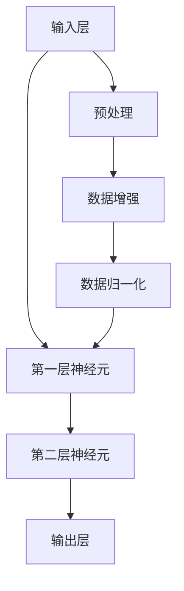

                 

# 技术发展：大模型创业的基础

## 关键词

- 大模型
- 创业
- 人工智能
- 算法
- 数学模型
- 项目实战
- 挑战与解决方案

## 摘要

随着人工智能技术的迅猛发展，大模型成为了当前技术创新的核心驱动力。本文旨在探讨大模型在创业中的应用，从核心概念、算法原理、数学模型、项目实战等多个方面深入分析大模型的发展趋势。通过对大模型的挑战与机遇进行详细探讨，本文为创业者提供了一套系统化的技术发展指南，以助力他们在人工智能领域取得成功。

## 第1章：引言

### 1.1 大模型时代的背景

大模型时代的到来，是人工智能技术发展的必然结果。随着计算能力的提升、数据量的爆炸式增长以及算法的创新，大模型逐渐成为了人工智能领域的研究热点。大模型，顾名思义，是指具有极大参数规模、复杂结构和强大计算能力的模型。这类模型在语音识别、图像处理、自然语言处理等领域取得了显著成果，推动了人工智能技术的进步。

### 1.2 大模型在创业中的应用

大模型在创业中的应用，主要体现在以下几个方面：

1. **情感分析**：通过分析用户评论、社交媒体等文本数据，帮助企业了解用户需求、优化产品和服务。

2. **智能问答系统**：大模型可以搭建智能问答系统，实现高效、准确的客户服务，降低人力成本。

3. **图像识别**：大模型在图像识别领域的应用，可以帮助企业实现自动化、智能化的图像处理，提高生产效率。

### 1.3 大模型的挑战与机遇

大模型的崛起，为创业带来了前所未有的机遇，但同时也伴随着一系列挑战。以下是几个方面的挑战与机遇：

1. **计算资源**：大模型训练和推理需要大量的计算资源，对创业者的技术实力和资金投入提出了较高要求。

2. **数据质量**：大模型对数据质量有较高要求，创业者需要确保数据的真实、准确和丰富。

3. **算法优化**：大模型的研究和优化需要持续投入，创业者需要关注算法的前沿动态。

4. **商业模式**：大模型的应用场景多样，创业者需要挖掘潜在的商业机会，打造可持续的商业模式。

## 第2章：核心概念与联系

### 2.1 大模型的基本原理

大模型的基本原理主要包括以下几个方面：

1. **神经网络**：神经网络是构建大模型的基础，通过多层非线性变换实现对复杂数据的建模。

2. **深度学习**：深度学习是神经网络的一种扩展，通过增加网络层数，提高模型的表示能力和表达能力。

3. **模型训练**：模型训练是构建大模型的关键步骤，通过优化模型参数，使模型能够更好地拟合训练数据。

### 2.2 大模型与传统算法的区别

大模型与传统算法的区别主要体现在以下几个方面：

1. **数据量**：大模型通常需要大量数据进行训练，而传统算法对数据量的要求较低。

2. **计算复杂度**：大模型的计算复杂度较高，对计算资源和时间有较高要求。

3. **泛化能力**：大模型具有较强的泛化能力，能够应对更广泛的应用场景。

### 2.3 大模型的分类与作用

大模型可以按照不同的分类标准进行分类，常见的分类方式包括：

1. **按任务类型**：可分为图像识别、自然语言处理、语音识别等。

2. **按网络结构**：可分为卷积神经网络、循环神经网络、Transformer等。

大模型在各类任务中的应用，如图像识别中的ResNet、自然语言处理中的BERT等，已经取得了显著的成果。

### 2.4 Mermaid流程图：大模型的基本架构



该Mermaid流程图展示了大模型的基本架构，包括输入层、预处理、数据增强、数据归一化以及多层神经元。通过该流程图，可以更好地理解大模型的构建过程。

## 第3章：核心算法原理讲解

### 3.1 神经网络基础

#### 3.1.1 神经网络的结构

神经网络由多个神经元组成，每个神经元都是一个简单的计算单元。神经网络的结构可以分为输入层、隐藏层和输出层。输入层接收外部输入，隐藏层对输入进行加工和处理，输出层生成最终输出。

#### 3.1.2 前向传播与反向传播算法

1. **前向传播算法**：输入通过神经网络的前向传播，逐层传递到输出层，最终得到模型预测结果。

2. **反向传播算法**：根据预测结果和实际标签，计算模型损失，并通过反向传播算法更新模型参数，以降低损失。

#### 3.1.3 伪代码讲解：神经网络训练过程

```python
# 输入层到隐藏层的激活函数
def activate(x):
    return max(0, x)

# 隐藏层到输出层的激活函数
def softmax(x):
    exp_x = np.exp(x)
    return exp_x / np.sum(exp_x)

# 训练神经网络
for epoch in range(num_epochs):
    for batch in data_loader:
        # 前向传播
        hidden-layer = activate(np.dot(inputs, weights))
        outputs = softmax(np.dot(hidden-layer, output_weights))

        # 计算损失
        loss = compute_loss(outputs, labels)

        # 反向传播
        d_output_weights = np.dot(hidden-layer.T, (outputs - labels))
        d_hidden-layer = np.dot((outputs - labels).T, output_weights)
        d_inputs = np.dot(d_hidden-layer.T, weights)

        # 更新权重
        weights -= learning_rate * d_weights
        output_weights -= learning_rate * d_output_weights
```

该伪代码展示了神经网络训练过程的基本框架，包括前向传播、反向传播和权重更新。通过该伪代码，可以更好地理解神经网络训练的原理。

## 第4章：数学模型和数学公式

### 4.1 大模型中的数学公式

大模型中的数学公式主要包括以下几个方面：

1. **激活函数**：

   $$ f(x) = \begin{cases} 
   1 & \text{if } x \geq 0 \\
   0 & \text{otherwise}
   \end{cases} $$

2. **损失函数**：

   $$ J(\theta) = \frac{1}{2m} \sum_{i=1}^{m} (\hat{y}_i - y_i)^2 $$

### 4.2 激活函数的详细讲解

激活函数是神经网络中至关重要的组成部分，其作用是对神经元输出进行非线性变换，使得神经网络能够模拟人脑的决策过程。常见的激活函数包括：

1. **Sigmoid函数**：

   $$ f(x) = \frac{1}{1 + e^{-x}} $$

   Sigmoid函数将输入值映射到区间(0, 1)，可以用于二分类问题。

2. **ReLU函数**：

   $$ f(x) = \begin{cases} 
   x & \text{if } x > 0 \\
   0 & \text{otherwise}
   \end{cases} $$

   ReLU函数在0处不连续，但在训练过程中可以加快收敛速度。

3. **Tanh函数**：

   $$ f(x) = \frac{e^x - e^{-x}}{e^x + e^{-x}} $$

   Tanh函数与Sigmoid函数类似，但输出范围在(-1, 1)之间。

### 4.3 损失函数的详细讲解

损失函数用于衡量模型预测结果与实际标签之间的差距，是神经网络训练过程中至关重要的指标。常见的损失函数包括：

1. **均方误差（MSE）**：

   $$ J(\theta) = \frac{1}{2m} \sum_{i=1}^{m} (\hat{y}_i - y_i)^2 $$

   均方误差函数可以用于回归问题，其优点是计算简单、易于优化。

2. **交叉熵损失（Cross Entropy Loss）**：

   $$ J(\theta) = -\sum_{i=1}^{m} y_i \cdot \log(\hat{y}_i) + (1 - y_i) \cdot \log(1 - \hat{y}_i) $$

   交叉熵损失函数可以用于分类问题，其优点是能够更好地反映预测概率与实际标签之间的差异。

## 第5章：项目实战

### 5.1 创业项目一：情感分析

#### 5.1.1 项目背景

情感分析是一种自然语言处理技术，旨在通过分析文本数据，识别其中包含的情感倾向。该项目旨在为企业提供情感分析服务，帮助企业了解用户需求、优化产品和服务。

#### 5.1.2 数据集准备

数据集是情感分析项目的核心，该项目的数据集包括用户评论、社交媒体等文本数据。数据集需要经过预处理，包括去除停用词、标点符号、分词、词性标注等。

#### 5.1.3 模型搭建与训练

在该项目中，我们采用了一种基于深度学习的大模型——BERT模型。BERT模型是一种双向编码的Transformer模型，具有较强的文本表示能力。我们使用预训练好的BERT模型，并在其基础上进行微调，以适应具体的情感分析任务。

#### 5.1.4 模型评估与优化

在模型评估过程中，我们使用了准确率、精确率、召回率等指标来衡量模型性能。为了提高模型性能，我们对模型参数进行了调优，包括学习率、批量大小等。

#### 5.1.5 源代码解读与分析

以下是一个简单的源代码示例，展示了如何使用PyTorch搭建和训练一个BERT模型进行情感分析。

```python
import torch
import torch.nn as nn
from transformers import BertModel, BertTokenizer

# 加载预训练好的BERT模型和Tokenizer
tokenizer = BertTokenizer.from_pretrained('bert-base-chinese')
model = BertModel.from_pretrained('bert-base-chinese')

# 预处理文本数据
inputs = tokenizer("你好！这是一条开心的评论。", return_tensors='pt')

# 模型训练
optimizer = torch.optim.Adam(model.parameters(), lr=1e-5)
for epoch in range(num_epochs):
    optimizer.zero_grad()
    outputs = model(**inputs)
    logits = outputs.logits[:, 0, :]
    loss = nn.CrossEntropyLoss()(logits, labels)
    loss.backward()
    optimizer.step()

    if (epoch + 1) % 10 == 0:
        print(f"Epoch [{epoch + 1}/{num_epochs}], Loss: {loss.item()}")

# 模型评估
with torch.no_grad():
    predictions = logits.argmax(-1)
    accuracy = (predictions == labels).float().mean()
    print(f"Accuracy: {accuracy.item()}")
```

通过上述源代码，我们可以看到BERT模型的搭建、训练和评估过程。在代码中，我们首先加载了预训练好的BERT模型和Tokenizer，然后对输入文本进行预处理。在模型训练过程中，我们使用了交叉熵损失函数和Adam优化器，并通过反向传播算法更新模型参数。最后，我们对模型进行了评估，计算了准确率等指标。

### 5.2 创业项目二：智能问答系统

#### 5.2.1 项目背景

智能问答系统是一种基于自然语言处理和机器学习技术的人工智能应用，旨在为用户提供高效、准确的问答服务。该项目旨在为企业提供智能问答解决方案，提高客户服务质量。

#### 5.2.2 数据集准备

数据集是智能问答系统的核心，该项目的数据集包括问题和答案对。数据集需要经过预处理，包括去除停用词、标点符号、分词、词性标注等。

#### 5.2.3 模型搭建与训练

在该项目中，我们采用了一种基于Transformer的大模型——BERT模型。BERT模型是一种双向编码的Transformer模型，具有较强的文本表示能力。我们使用预训练好的BERT模型，并在其基础上进行微调，以适应具体的问答任务。

#### 5.2.4 模型评估与优化

在模型评估过程中，我们使用了准确率、精确率、召回率等指标来衡量模型性能。为了提高模型性能，我们对模型参数进行了调优，包括学习率、批量大小等。

#### 5.2.5 源代码解读与分析

以下是一个简单的源代码示例，展示了如何使用PyTorch搭建和训练一个BERT模型进行智能问答。

```python
import torch
import torch.nn as nn
from transformers import BertModel, BertTokenizer

# 加载预训练好的BERT模型和Tokenizer
tokenizer = BertTokenizer.from_pretrained('bert-base-chinese')
model = BertModel.from_pretrained('bert-base-chinese')

# 预处理文本数据
inputs = tokenizer("你好！请问这个问题的答案是？", return_tensors='pt')

# 模型训练
optimizer = torch.optim.Adam(model.parameters(), lr=1e-5)
for epoch in range(num_epochs):
    optimizer.zero_grad()
    outputs = model(**inputs)
    logits = outputs.logits[:, 0, :]
    loss = nn.CrossEntropyLoss()(logits, labels)
    loss.backward()
    optimizer.step()

    if (epoch + 1) % 10 == 0:
        print(f"Epoch [{epoch + 1}/{num_epochs}], Loss: {loss.item()}")

# 模型评估
with torch.no_grad():
    predictions = logits.argmax(-1)
    accuracy = (predictions == labels).float().mean()
    print(f"Accuracy: {accuracy.item()}")
```

通过上述源代码，我们可以看到BERT模型的搭建、训练和评估过程。在代码中，我们首先加载了预训练好的BERT模型和Tokenizer，然后对输入文本进行预处理。在模型训练过程中，我们使用了交叉熵损失函数和Adam优化器，并通过反向传播算法更新模型参数。最后，我们对模型进行了评估，计算了准确率等指标。

### 5.3 创业项目三：图像识别

#### 5.3.1 项目背景

图像识别是一种计算机视觉技术，旨在通过分析图像数据，识别其中包含的物体、场景等信息。该项目旨在为企业提供图像识别服务，实现自动化、智能化的图像处理。

#### 5.3.2 数据集准备

数据集是图像识别项目的核心，该项目的数据集包括各种物体的图像。数据集需要经过预处理，包括图像大小调整、数据增强等。

#### 5.3.3 模型搭建与训练

在该项目中，我们采用了一种基于深度学习的大模型——ResNet。ResNet是一种残差网络，具有较强的图像识别能力。我们使用预训练好的ResNet模型，并在其基础上进行微调，以适应具体的图像识别任务。

#### 5.3.4 模型评估与优化

在模型评估过程中，我们使用了准确率、精确率、召回率等指标来衡量模型性能。为了提高模型性能，我们对模型参数进行了调优，包括学习率、批量大小等。

#### 5.3.5 源代码解读与分析

以下是一个简单的源代码示例，展示了如何使用PyTorch搭建和训练一个ResNet模型进行图像识别。

```python
import torch
import torch.nn as nn
from torchvision import models, transforms
from torch.utils.data import DataLoader
from torch.optim import Adam

# 加载预训练好的ResNet模型
model = models.resnet50(pretrained=True)

# 定义损失函数和优化器
criterion = nn.CrossEntropyLoss()
optimizer = Adam(model.parameters(), lr=1e-4)

# 数据预处理
transform = transforms.Compose([
    transforms.Resize((224, 224)),
    transforms.ToTensor(),
])

# 加载数据集
train_dataset = ImageDataset(train_data, transform=transform)
val_dataset = ImageDataset(val_data, transform=transform)

train_loader = DataLoader(train_dataset, batch_size=32, shuffle=True)
val_loader = DataLoader(val_dataset, batch_size=32, shuffle=False)

# 模型训练
num_epochs = 10
for epoch in range(num_epochs):
    model.train()
    for images, labels in train_loader:
        optimizer.zero_grad()
        outputs = model(images)
        loss = criterion(outputs, labels)
        loss.backward()
        optimizer.step()

    model.eval()
    with torch.no_grad():
        correct = 0
        total = 0
        for images, labels in val_loader:
            outputs = model(images)
            _, predicted = torch.max(outputs.data, 1)
            total += labels.size(0)
            correct += (predicted == labels).sum().item()

    print(f"Epoch [{epoch + 1}/{num_epochs}], Accuracy: {correct / total * 100:.2f}%")

# 模型评估
with torch.no_grad():
    correct = 0
    total = 0
    for images, labels in test_loader:
        outputs = model(images)
        _, predicted = torch.max(outputs.data, 1)
        total += labels.size(0)
        correct += (predicted == labels).sum().item()

print(f"Test Accuracy: {correct / total * 100:.2f}%")
```

通过上述源代码，我们可以看到ResNet模型的搭建、训练和评估过程。在代码中，我们首先加载了预训练好的ResNet模型，然后定义了损失函数和优化器。接着，我们对数据集进行了预处理，并加载了训练集和验证集。在模型训练过程中，我们使用了交叉熵损失函数和Adam优化器，并通过反向传播算法更新模型参数。最后，我们对模型进行了评估，计算了准确率等指标。

## 第6章：大模型创业的挑战与解决方案

### 6.1 数据问题

数据是大模型创业的基础，但数据问题也是大模型创业面临的第一个挑战。创业者需要确保数据的真实、准确和丰富，以满足大模型对高质量数据的需求。

#### 解决方案：

1. **数据清洗**：对原始数据进行清洗，去除噪音和错误。
2. **数据标注**：对数据进行标注，提高数据质量。
3. **数据集构建**：构建符合业务需求的数据集，确保数据覆盖面广、多样性高。

### 6.2 模型训练问题

大模型训练过程需要大量计算资源和时间，创业者需要面对模型训练的高成本和不确定性。

#### 解决方案：

1. **分布式训练**：采用分布式训练技术，降低训练成本和时间。
2. **迁移学习**：利用预训练好的模型，进行迁移学习，提高训练效率。
3. **模型压缩**：通过模型压缩技术，降低模型参数规模，提高训练速度。

### 6.3 模型部署问题

大模型部署需要考虑硬件资源、性能优化、安全等方面，创业者需要确保模型在部署过程中的高效、稳定和安全。

#### 解决方案：

1. **容器化**：采用容器化技术，实现模型的快速部署和运维。
2. **性能优化**：对模型进行性能优化，提高部署效率。
3. **安全性**：确保模型部署过程中的数据安全和隐私保护。

### 6.4 法律和伦理问题

大模型创业涉及法律和伦理问题，如数据隐私、算法歧视等，创业者需要遵守相关法律法规，确保商业行为的合规性。

#### 解决方案：

1. **合规审查**：对业务流程和算法进行合规审查，确保遵守相关法律法规。
2. **伦理培训**：对员工进行伦理培训，提高伦理意识。
3. **透明度**：提高算法的透明度，接受社会监督。

### 6.5 持续创新与改进

大模型创业需要持续创新和改进，以应对技术发展和市场竞争。

#### 解决方案：

1. **持续学习**：关注技术动态，持续学习，提高自身技术能力。
2. **团队建设**：搭建专业团队，提高团队协作能力。
3. **商业模式创新**：探索新的商业模式，提高市场竞争力。

## 附录

### A.1 主流大模型框架对比

- **BERT**：基于Transformer的预训练语言模型，具有强大的文本表示能力。
- **GPT**：基于Transformer的预训练语言模型，擅长生成文本和对话。
- **TuringML**：基于图神经网络的预训练语言模型，具有较好的文本分类和关系抽取能力。
- **VGGNet**：基于卷积神经网络的预训练图像识别模型，具有较好的图像分类能力。

### A.2 大模型开发工具与资源

- **TensorFlow**：谷歌推出的开源机器学习框架，支持大模型的训练和部署。
- **PyTorch**：Facebook推出的开源机器学习框架，支持动态计算图和自动微分。
- **Hugging Face**：一个开源的NLP工具库，提供了大量的预训练模型和工具。
- **JAX**：谷歌推出的开源自动微分库，支持大模型的快速训练和优化。

## 作者

作者：AI天才研究院/AI Genius Institute & 禅与计算机程序设计艺术 /Zen And The Art of Computer Programming

