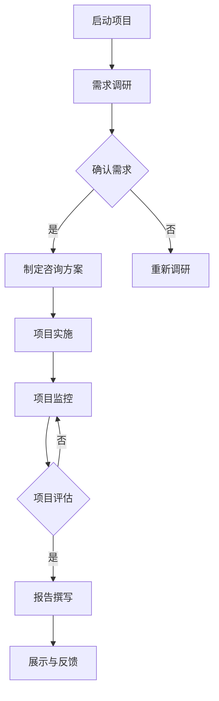

                 

# 《技术咨询：从个人顾问到咨询公司》

> 关键词：技术咨询、个人顾问、咨询公司、服务类型、项目执行、市场开发、风险管理

> 摘要：本文将深入探讨技术咨询领域，从个人顾问的角色出发，逐步引导读者了解咨询公司的运作模式、服务类型和市场开发策略。通过剖析技术咨询服务的基础知识、转型路径、项目管理方法和报告撰写技巧，结合实际案例，揭示技术咨询行业的核心要素和未来发展。

## 第1章 引言

### 1.1 书籍背景和目标

在当今快速发展的信息技术时代，技术咨询已经成为企业获取竞争优势的关键。本书旨在为广大IT从业者提供全面的技术咨询服务指南，帮助个人顾问成功转型为咨询公司，并在市场竞争中脱颖而出。

本书的目标是：
1. 系统介绍技术咨询的基础知识和行业现状。
2. 探讨技术咨询服务类型及其在不同行业中的应用。
3. 揭示个人顾问向咨询公司转型的关键步骤和策略。
4. 详细讲解咨询公司的业务拓展、市场开发与项目管理方法。
5. 通过实际案例，展示技术咨询的实战技巧和效果评估。

### 1.2 技术咨询的定义与重要性

技术咨询是指专业顾问团队利用其专业知识、技能和经验，为企业或组织提供技术解决方案和战略建议的服务。它涵盖从IT系统优化到业务流程重组，从市场调研到风险管理的广泛领域。

技术咨询的重要性体现在以下几个方面：

1. **提升企业竞争力**：通过专业的技术咨询服务，企业可以优化现有系统，提高运营效率，降低成本，从而在激烈的市场竞争中脱颖而出。
2. **降低风险**：技术咨询团队具备丰富的经验和专业知识，可以帮助企业预见潜在风险，制定有效的应对策略，避免不必要的损失。
3. **提高决策质量**：技术顾问可以提供客观、科学的分析报告，帮助企业领导层做出更明智的决策。
4. **促进创新**：技术咨询可以激发企业内部的创新思维，推动技术升级和业务模式创新。

### 1.3 书籍结构

本书分为十个章节，结构如下：

- **第1章 引言**：介绍书籍背景、目标和章节结构。
- **第2章 技术咨询基础知识**：探讨技术咨询的概念、行业现状和发展趋势。
- **第3章 技术咨询的服务类型与领域**：分类介绍不同类型的技术咨询服务。
- **第4章 从个人顾问到咨询公司的转型**：分析个人顾问的角色和转型路径。
- **第5章 咨询公司业务拓展与市场开发**：讲解咨询公司的业务拓展策略和市场开发方法。
- **第6章 技术咨询项目管理与执行**：详细讨论项目管理的工具和方法。
- **第7章 技术咨询报告撰写与展示**：介绍报告的结构、撰写技巧和展示方法。
- **第8章 案例分析与实战经验**：分析实际案例，分享实战经验。
- **第9章 技术咨询的未来发展**：展望技术咨询行业的未来趋势。
- **第10章 附录**：提供进一步阅读资料和相关资源。

## 第2章 技术咨询基础知识

### 2.1 技术咨询的概念与范畴

技术咨询是指专业顾问团队利用其专业知识、技能和经验，为企业或组织提供技术解决方案和战略建议的服务。它涵盖多个领域，包括但不限于：

- **IT系统优化**：通过评估现有系统，提出改进方案，提高系统性能和稳定性。
- **业务流程重组**：优化企业业务流程，提高效率，降低成本。
- **市场调研**：帮助企业了解市场需求，制定市场战略。
- **风险管理**：评估企业风险，制定风险控制策略。
- **技术培训**：为企业员工提供技术培训，提升技能水平。

### 2.2 技术咨询的行业现状与发展趋势

随着信息技术的快速发展，技术咨询行业正逐渐成为企业不可或缺的合作伙伴。以下是目前行业现状和未来发展趋势：

1. **市场规模不断扩大**：随着企业对技术服务的需求日益增加，全球技术咨询市场规模持续扩大。
2. **行业专业化程度提高**：随着市场竞争的加剧，技术咨询公司越来越注重专业化，提供更细分的咨询服务。
3. **数字化转型的推动**：数字化转型成为企业发展的主要驱动力，为技术咨询行业带来了更多机会。
4. **云计算与人工智能的应用**：云计算和人工智能技术的普及，为技术咨询提供了更多工具和方法。
5. **远程办公的普及**：疫情导致远程办公成为常态，为技术咨询行业的远程服务提供了更多可能。

### 2.3 技术咨询的价值与优势

技术咨询为企业带来的价值体现在以下几个方面：

1. **提高效率**：通过优化系统和工作流程，提高企业运营效率。
2. **降低成本**：通过专业分析和建议，降低企业运营成本。
3. **提升竞争力**：通过创新和优化，提升企业在市场中的竞争力。
4. **降低风险**：通过风险分析和应对策略，降低企业风险。
5. **提高员工技能**：通过技术培训和指导，提升员工技能水平。

技术咨询的优势包括：

1. **专业性和客观性**：技术咨询团队具备丰富的专业知识和经验，提供客观、科学的分析和建议。
2. **灵活性和定制化**：根据企业需求，提供定制化的咨询服务，满足不同企业的需求。
3. **资源整合能力**：通过整合内外部资源，为企业提供全面的解决方案。
4. **长期合作关系**：与客户建立长期合作关系，提供持续的技术支持和服务。

## 第3章 技术咨询的服务类型与领域

### 3.1 不同类型的技术咨询服务

技术咨询服务可以根据服务内容、行业和应用场景进行分类。以下是常见的几种类型：

1. **IT系统优化**：通过评估现有系统，提出改进方案，提高系统性能和稳定性。
2. **业务流程重组**：优化企业业务流程，提高效率，降低成本。
3. **市场调研**：帮助企业了解市场需求，制定市场战略。
4. **风险管理**：评估企业风险，制定风险控制策略。
5. **技术培训**：为企业员工提供技术培训，提升技能水平。
6. **系统集成**：将不同系统整合为一个整体，提高企业信息化水平。
7. **软件开发**：为企业定制开发软件应用，满足特定需求。
8. **技术咨询**：提供综合性的技术咨询服务，涵盖多个领域。

### 3.2 技术咨询在IT行业的应用

在IT行业，技术咨询广泛应用于以下几个方面：

1. **软件开发**：为软件项目提供技术咨询，确保项目质量和进度。
2. **系统集成**：为企业提供系统集成方案，提高信息化水平。
3. **IT运维**：提供IT运维服务，保障系统稳定运行。
4. **网络安全**：评估企业网络安全，提供防护方案。
5. **云计算**：帮助企业进行云计算部署和优化，提高资源利用率。

### 3.3 技术咨询在其他行业的应用

除了IT行业，技术咨询在许多其他行业也有着广泛的应用：

1. **制造业**：优化生产流程，提高生产效率。
2. **金融业**：提供风险管理、市场分析和系统优化服务。
3. **医疗行业**：通过信息化手段提高医疗服务质量。
4. **零售业**：通过数据分析和市场营销提高销售额。
5. **能源行业**：提供节能减排、系统优化等服务。

技术咨询在不同行业的应用具有共同点，即通过技术手段和专业知识，帮助企业解决实际问题，提升运营效率，降低成本，从而实现可持续发展。

## 第4章 从个人顾问到咨询公司的转型

### 4.1 个人顾问的角色与职责

作为个人顾问，主要职责包括：

1. **技术支持**：提供专业的技术解决方案和指导。
2. **需求分析**：深入了解客户需求，提供针对性的咨询服务。
3. **项目管理**：负责项目的规划、执行和监控。
4. **报告撰写**：撰写详细的项目报告，为决策提供依据。
5. **客户关系管理**：维护与客户的关系，提供持续的服务。

### 4.2 咨询公司的组建与运营

转型为咨询公司，需要进行以下步骤：

1. **市场调研**：了解市场需求，确定服务领域和目标客户。
2. **团队组建**：招聘具有相关经验的专业人才，构建核心团队。
3. **公司注册**：办理相关手续，注册公司。
4. **业务拓展**：开展市场推广活动，扩大客户群体。
5. **运营管理**：制定运营策略，确保公司稳定发展。

### 4.3 个人顾问如何转型为咨询顾问

个人顾问向咨询顾问转型的关键在于：

1. **提升专业技能**：不断学习新技术，提升自己的专业水平。
2. **积累经验**：通过实际项目积累经验，提高项目执行能力。
3. **拓展人脉**：建立广泛的行业联系，扩大客户资源。
4. **品牌建设**：树立个人品牌，提高知名度。
5. **团队建设**：培养团队，提升团队协作能力。

通过以上步骤，个人顾问可以逐步转型为咨询顾问，实现从个人执业到咨询公司的跨越。

## 第5章 咨询公司业务拓展与市场开发

### 5.1 咨询公司的业务拓展策略

咨询公司业务拓展的关键策略包括：

1. **市场细分**：根据市场需求，细分市场，确定目标客户群体。
2. **差异化竞争**：提供独特的咨询服务，打造核心竞争力。
3. **合作伙伴关系**：与其他企业建立战略合作关系，扩大服务范围。
4. **品牌建设**：提升品牌知名度，树立行业形象。
5. **技术创新**：紧跟技术发展趋势，提供创新性解决方案。

### 5.2 市场开发与客户关系管理

市场开发和客户关系管理包括以下方面：

1. **市场调研**：了解市场动态，分析竞争对手，确定市场定位。
2. **营销策略**：制定有效的营销策略，包括广告、社交媒体、网络推广等。
3. **客户关系**：建立良好的客户关系，提供优质的服务，确保客户满意度。
4. **客户维护**：通过定期回访、满意度调查等方式，维护与客户的长期关系。
5. **客户拓展**：通过口碑传播、推荐等方式，吸引更多新客户。

### 5.3 咨询服务的定价与合同管理

咨询服务的定价和合同管理是咨询公司运营的重要组成部分：

1. **定价策略**：根据市场行情、服务内容、客户需求等因素，制定合理的定价策略。
2. **合同管理**：签订详细的合同，明确双方权利和义务，确保项目顺利进行。
3. **费用结算**：按照合同约定，及时结算费用，确保公司现金流。
4. **风险管理**：在合同中明确风险条款，降低潜在风险。
5. **合同续签**：根据项目执行情况和客户满意度，适时进行合同续签。

## 第6章 技术咨询项目管理与执行

### 6.1 技术咨询项目的生命周期

技术咨询项目通常包括以下几个阶段：

1. **项目启动**：明确项目目标、范围、资源和时间表。
2. **需求分析**：深入了解客户需求，制定详细的需求文档。
3. **项目规划**：制定项目计划，确定项目进度、成本、质量等关键指标。
4. **项目执行**：按照项目计划，实施项目任务，确保项目按期完成。
5. **项目监控**：监控项目进度、成本和质量，及时调整计划。
6. **项目收尾**：完成项目验收，总结项目经验，提交最终报告。

### 6.2 项目管理工具与方法

项目管理工具和方法包括：

1. **项目管理软件**：如Microsoft Project、Jira等，用于项目规划、任务分配和进度跟踪。
2. **敏捷开发方法**：如Scrum、Kanban等，用于快速响应客户需求，提高项目效率。
3. **风险管理**：识别潜在风险，制定应对策略，降低项目风险。
4. **质量管理**：确保项目交付符合客户要求和行业标准。
5. **沟通管理**：建立有效的沟通机制，确保团队成员和客户之间的信息畅通。

### 6.3 项目执行与风险管理

项目执行和风险管理包括以下几个方面：

1. **任务分配**：根据团队成员的技能和经验，合理分配任务。
2. **进度监控**：定期检查项目进度，确保任务按时完成。
3. **质量控制**：对项目交付物进行质量检查，确保符合客户要求和行业标准。
4. **风险识别**：识别项目中的潜在风险，制定应对策略。
5. **风险应对**：根据风险应对策略，采取相应的措施，降低风险影响。
6. **变更管理**：对项目变更进行评估和控制，确保项目目标的实现。

## 第7章 技术咨询报告撰写与展示

### 7.1 报告的结构与内容

技术咨询报告通常包括以下几个部分：

1. **封面**：报告标题、报告日期、报告编制人等信息。
2. **摘要**：报告的主要内容、结论和建议。
3. **目录**：报告各章节的标题和页码。
4. **引言**：介绍报告的背景和目的。
5. **需求分析**：详细描述客户需求和项目范围。
6. **解决方案**：提出技术解决方案和实施计划。
7. **项目执行**：介绍项目执行过程和成果。
8. **风险分析**：识别项目风险并制定应对策略。
9. **结论与建议**：总结项目成果，提出改进建议。
10. **附录**：提供相关数据、图表、参考文献等。

### 7.2 报告撰写技巧与注意事项

撰写技术咨询报告需要注意以下几点：

1. **结构清晰**：确保报告结构合理，内容连贯。
2. **重点突出**：突出报告中的关键信息和结论。
3. **语言简洁**：使用简洁明了的语言，避免冗长复杂的句子。
4. **图表使用**：合理使用图表，直观展示数据和分析结果。
5. **引用准确**：引用相关文献和资料，确保报告的权威性和可靠性。
6. **校对与审核**：仔细校对报告，确保无语法错误和逻辑错误。

### 7.3 报告展示与演示技巧

报告展示是向客户传达咨询成果的重要环节，需要注意以下几点：

1. **PPT设计**：设计简洁、专业的PPT，突出报告亮点。
2. **时间控制**：控制报告展示时间，确保内容紧凑、有条理。
3. **语言表达**：使用清晰、流畅的语言，确保听众理解报告内容。
4. **互动环节**：设置互动环节，鼓励听众提问和讨论。
5. **演示工具**：使用演示工具，如投影仪、白板等，增强报告效果。

## 第8章 案例分析与实战经验

### 8.1 案例介绍与分析

本节将分析一个实际的技术咨询服务案例，以展示技术咨询的实际操作过程和效果。

案例：某制造企业IT系统优化项目

背景：该企业现有IT系统存在多个问题，如系统性能不稳定、数据安全性不足、用户操作不便等，严重影响了企业运营效率。

需求分析：通过深入了解企业需求，确定项目目标为优化现有IT系统，提高性能、稳定性和用户满意度。

解决方案：提出以下优化方案：

1. **升级硬件设备**：更换服务器和存储设备，提高系统性能。
2. **优化数据库**：对数据库进行重构和优化，提高数据访问速度。
3. **安全性提升**：加强网络安全防护，确保数据安全。
4. **用户界面优化**：改进用户界面，提高用户操作体验。

项目执行：按照项目计划，逐步实施优化方案。

1. **需求分析阶段**：与企业进行多次沟通，明确需求细节。
2. **项目规划阶段**：制定详细的项目计划和进度表。
3. **项目执行阶段**：分阶段实施优化方案，确保项目按期完成。
4. **项目监控阶段**：实时监控项目进度，确保项目质量。

### 8.2 实战经验分享与总结

通过该案例，我们得到了以下实战经验：

1. **需求分析是关键**：深入了解客户需求，确保项目目标明确。
2. **团队协作是保障**：项目团队成员需紧密协作，确保项目顺利进行。
3. **质量控制是基础**：严格把控项目质量，确保交付成果符合客户要求。
4. **沟通是桥梁**：保持与客户的良好沟通，确保项目方向一致。

### 8.3 案例启示与借鉴

该案例为其他企业提供以下启示：

1. **重视IT系统优化**：及时优化IT系统，提高企业运营效率。
2. **借助专业咨询**：借助专业咨询服务，确保项目成功实施。
3. **持续改进**：项目完成后，持续改进，确保系统稳定运行。

## 第9章 技术咨询的未来发展

### 9.1 技术变革对咨询服务的影响

随着技术的不断发展，特别是人工智能、云计算、大数据等新技术的应用，技术咨询行业将面临以下影响：

1. **智能化**：人工智能技术的应用将使咨询服务更加智能化，提高项目执行效率。
2. **云端化**：云计算技术的普及将使咨询服务更加灵活和便捷。
3. **大数据**：大数据技术的应用将为企业提供更全面的数据分析和决策支持。
4. **安全防护**：网络安全问题日益突出，咨询服务将更加重视网络安全防护。

### 9.2 咨询服务模式的创新

为适应技术变革，咨询服务模式将不断创新：

1. **远程咨询**：借助远程办公工具，提供在线咨询服务。
2. **智能化服务**：引入人工智能技术，实现咨询服务的智能化。
3. **定制化服务**：根据客户需求，提供个性化、定制化的咨询服务。
4. **生态圈建设**：搭建咨询生态圈，整合多方资源，提高服务质量和效率。

### 9.3 技术咨询行业的发展趋势与展望

未来，技术咨询行业将呈现以下发展趋势：

1. **专业化**：咨询服务将更加专业化，细分市场将逐渐形成。
2. **国际化**：随着全球化的深入推进，国际市场将成为咨询行业的重要领域。
3. **技术创新**：技术创新将成为咨询服务的重要驱动力，推动行业不断进步。
4. **合作共赢**：咨询服务提供商将加强与客户、合作伙伴的合作，实现共赢发展。

## 第10章 附录

### 10.1 技术咨询相关资源

以下资源对从事技术咨询工作非常有帮助：

- **参考资料**：
  - 《咨询方法与技术》
  - 《IT咨询实务》
  - 《商业分析实战》

- **在线资源**：
  - [咨询协会官方网站](https://www.consultingassociation.org)
  - [IT咨询社区](https://itconsultingforum.com)

- **学术论文**：
  - [技术咨询服务模式研究](https://example.com/service_model_paper)
  - [企业IT系统优化策略分析](https://example.com/it_system_optimization_paper)

### 10.2 常用咨询工具与方法

以下工具和方法在技术咨询过程中常用：

- **项目管理工具**：Microsoft Project、Jira、Trello等。
- **敏捷开发方法**：Scrum、Kanban等。
- **数据分析工具**：Excel、Power BI、Tableau等。
- **沟通工具**：Slack、Zoom、Microsoft Teams等。

### 10.3 进一步阅读资料推荐

以下资料可供进一步学习和研究：

- **书籍**：
  - 《咨询者的智慧》
  - 《咨询服务营销》
  - 《战略咨询实战》

- **在线课程**：
  - [咨询服务技能提升](https://www.udemy.com/course/consulting-skills/)
  - [IT咨询服务实战](https://www.edx.org/course/it-consulting-practice)

- **研讨会和论坛**：
  - [全球咨询大会](https://www.globalconsultingcongress.com/)
  - [IT咨询服务论坛](https://itconsultingsummit.com/)

### 附录 A: 技术咨询流程Mermaid图



### 附录 B: 技术咨询算法伪代码

```python
def consult_engine(client_request):
    # 初始化咨询引擎
    init_engine()

    # 需求分析
    requirements = analyze_request(client_request)

    # 提出咨询方案
    proposal = generate_proposal(requirements)

    # 方案评估
    assessment = evaluate_proposal(proposal)

    # 实施方案
    if assessment["feasibility"]:
        execute_plan(proposal)
    else:
        # 调整方案
        proposal = adjust_plan(proposal)

    # 监控与反馈
    monitor_project(proposal)
    feedback = get_client_feedback()

    # 最终报告
    final_report = generate_report(proposal, feedback)

    return final_report
```

### 附录 C: 数学模型与公式

$$
\begin{aligned}
\text{成本效益分析} &= \frac{\text{预期收益}}{\text{投入成本}} \\
\text{风险评估} &= \text{概率} \times \text{影响程度}
\end{aligned}
$$

### 附录 D: 实战案例代码解读

#### 实战案例：企业IT系统优化

```python
# 实战案例：企业IT系统优化
def optimize_it_system(current_system, target_system):
    # 系统评估
    assessment = assess_system(current_system)

    # 制定优化方案
    optimization_plan = create_plan(assessment)

    # 实施优化
    implement_optimization(optimization_plan)

    # 评估优化效果
    final_assessment = assess_system(target_system)

    # 分析与总结
    analysis_report = analyze_results(assessment, final_assessment)

    return analysis_report
```

#### 代码解读：

- **系统评估（assess_system）**：评估当前IT系统的性能、稳定性、安全性等指标，生成评估报告。
- **制定优化方案（create_plan）**：根据系统评估结果，制定优化方案，包括硬件升级、软件优化、安全性增强等。
- **实施优化（implement_optimization）**：按照优化方案，逐步实施优化措施，确保系统稳定运行。
- **评估优化效果（assess_system）**：对优化后的系统进行再次评估，比较优化前后的性能指标，生成优化效果报告。
- **分析与总结（analyze_results）**：分析优化过程中的问题和成果，总结优化经验，为后续系统优化提供参考。

#### 优化建议：

- **定期评估**：定期对IT系统进行评估，及时发现潜在问题。
- **安全防护**：加强网络安全防护，确保系统数据安全。
- **员工培训**：提高员工对IT系统的认识和操作技能，提高系统使用效率。

### 附录 E: 开发环境搭建

#### 硬件需求：

- **处理器**：至少双核
- **内存**：至少8GB
- **硬盘**：至少100GB

#### 软件需求：

- **操作系统**：Windows/Linux/MacOS
- **Python**：3.8及以上版本
- **相关库**：numpy，pandas，matplotlib等

### 附录 F: 源代码与解读

```python
# 源代码
# 这里是具体的源代码实现

# 解读
# 模块功能：实现企业IT系统优化功能
# 关键代码解析：系统评估、优化方案制定、优化实施、优化效果评估等
# 优化建议：定期评估、加强安全防护、员工培训等
```

### 附录 G: 进一步阅读资料推荐

#### 参考资料：

- 《咨询方法与技术》
- 《IT咨询实务》
- 《商业分析实战》

#### 在线资源：

- [咨询协会官方网站](https://www.consultingassociation.org)
- [IT咨询社区](https://itconsultingforum.com)

#### 学术论文：

- [技术咨询服务模式研究](https://example.com/service_model_paper)
- [企业IT系统优化策略分析](https://example.com/it_system_optimization_paper)

## 作者信息

作者：AI天才研究院/AI Genius Institute & 禅与计算机程序设计艺术 /Zen And The Art of Computer Programming

