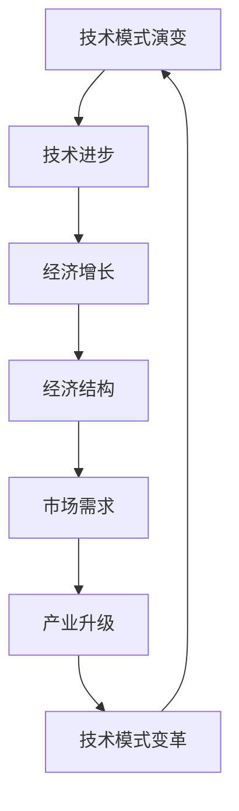

                 

# 技术模式减弱与经济增长瓶颈

> 关键词：技术模式、经济增长、瓶颈、创新、产业升级

> 摘要：本文从技术模式的定义和演变出发，探讨了技术模式减弱对经济增长的影响和挑战，分析了经济增长瓶颈的形成机制，提出了技术模式升级的路径和策略，并结合成功案例分析，给出了政策环境与市场机制优化的建议，对未来技术模式发展和经济增长趋势进行了展望。

### 目录

## 第一部分：破解技术模式减弱的挑战

### 第1章：技术模式的定义与演变

### 1.1 技术模式的定义与演变

技术模式（Technology Pattern）是指某一特定技术领域内，某一阶段普遍采用的、相对稳定的技术架构、技术路线和技术标准。技术模式是技术发展的重要表现形式，它反映了技术演进的趋势和方向。

技术模式的演变可以分为以下几个阶段：

1. **萌芽阶段**：技术的创新和初步应用阶段，技术模式尚未形成，各种技术方案并存在竞争。
2. **发展阶段**：技术的逐步成熟，市场应用广泛，技术模式开始明确。
3. **成熟阶段**：技术模式稳定，成为行业标准，技术进步放缓。
4. **变革阶段**：随着新技术的出现，旧的技术模式逐步被淘汰，新的技术模式逐渐形成。

### 1.2 技术模式对经济增长的影响

技术模式对经济增长的影响主要体现在以下几个方面：

1. **推动产业升级**：技术模式的发展能够推动传统产业的升级，提高产业竞争力。
2. **促进创新**：技术模式为创新提供了基础和框架，促进了新技术的研发和应用。
3. **提高生产效率**：技术模式优化了生产流程，提高了生产效率，降低了生产成本。
4. **扩大市场空间**：技术模式的应用能够扩大市场空间，创造新的市场需求。

### 1.3 当前技术模式减弱的现象与原因

当前，全球范围内技术模式减弱的现象日益明显，主要表现在以下几个方面：

1. **技术进步放缓**：新技术的突破和创新速度明显减缓，技术模式的变革周期延长。
2. **产业升级困难**：传统产业面临技术瓶颈，难以实现跨越式发展，产业升级困难。
3. **创新能力不足**：企业创新能力下降，难以适应技术变革和市场需求变化。
4. **国际竞争力下降**：由于技术模式减弱，部分国家和地区在全球产业竞争中的地位逐渐下降。

技术模式减弱的原因主要有以下几个方面：

1. **技术积累的难度增加**：随着技术的不断发展，技术积累的难度不断增加，新技术的突破变得更加困难。
2. **市场需求变化**：市场需求的不确定性增加，企业难以准确预测和把握市场趋势。
3. **政策环境变化**：政策环境的变化，如知识产权保护、市场竞争规则等，对技术模式的发展产生了一定的制约。
4. **企业创新动力不足**：部分企业创新动力不足，缺乏长期的技术积累和研发投入。

## 第2章：技术模式减弱下的经济风险与挑战

### 2.1 技术落后风险

技术落后风险是指由于技术模式减弱，企业或国家在技术发展上落后于竞争对手，难以保持竞争优势的风险。技术落后风险的主要表现如下：

1. **产业竞争力下降**：技术落后导致企业生产效率低、成本高，竞争力下降，市场份额缩小。
2. **产业链断裂**：技术落后可能导致产业链某些环节的停滞或断裂，影响整体产业的发展。
3. **创新能力不足**：技术落后导致企业创新能力不足，难以适应市场需求的变化。

### 2.2 产业升级挑战

产业升级挑战是指由于技术模式减弱，传统产业难以实现技术升级和产业转型，面临转型升级的困难。产业升级挑战的主要表现如下：

1. **产业结构单一**：传统产业以劳动密集型为主，产业结构单一，缺乏高附加值产业。
2. **技术积累不足**：传统产业技术积累不足，难以支撑产业升级。
3. **政策支持不足**：政策支持不足，企业转型升级缺乏动力和资源。

### 2.3 创新能力不足问题

创新能力不足问题是指由于技术模式减弱，企业或国家在技术创新方面能力不足，难以推动技术进步。创新能力不足问题的主要表现如下：

1. **研发投入不足**：企业研发投入不足，难以支撑技术创新。
2. **人才短缺**：技术人才短缺，难以满足技术创新的需求。
3. **技术储备不足**：技术储备不足，难以应对技术变革和市场需求的变化。

### 2.4 国际竞争力下降

国际竞争力下降是指由于技术模式减弱，企业或国家在国际市场上竞争力下降，面临国际竞争的压力。国际竞争力下降的主要表现如下：

1. **市场份额缩小**：由于技术落后，企业难以在国际市场上获得市场份额。
2. **出口下降**：技术落后导致产品出口难度增加，出口下降。
3. **品牌价值下降**：技术落后导致企业品牌价值下降，影响国际市场地位。

## 第3章：经济增长瓶颈识别与诊断

### 3.1 经济增长瓶颈的概念

经济增长瓶颈（Economic Growth Bottleneck）是指经济发展过程中，由于某些结构性因素的限制，导致经济增长速度放缓甚至停滞的现象。经济增长瓶颈的主要特征如下：

1. **经济增长速度放缓**：经济增长速度低于预期，甚至出现负增长。
2. **产业结构不合理**：产业结构不合理，高附加值产业占比低，劳动密集型产业占比高。
3. **创新能力不足**：企业创新能力不足，难以推动技术进步和产业升级。
4. **市场需求不足**：市场需求不足，导致企业产能过剩，产品滞销。

### 3.2 经济增长瓶颈的类型

经济增长瓶颈可以分为以下几种类型：

1. **技术瓶颈**：由于技术积累不足，企业难以实现技术突破和产业升级。
2. **市场瓶颈**：由于市场需求不足，企业产能过剩，产品难以销售。
3. **政策瓶颈**：由于政策环境不利，企业转型升级困难，创新能力受到制约。
4. **人才瓶颈**：由于人才短缺，企业难以吸引和留住优秀人才，创新能力受限。

### 3.3 经济增长瓶颈的诊断方法

经济增长瓶颈的诊断方法主要包括以下几种：

1. **数据分析**：通过对经济增长指标、产业结构、创新能力等方面的数据分析，识别经济增长瓶颈。
2. **专家咨询**：邀请经济学、产业经济学、技术创新等领域专家进行咨询，分析经济增长瓶颈的原因。
3. **实地调研**：通过实地调研，了解企业、行业和地区的发展状况，分析经济增长瓶颈的具体表现。
4. **比较分析**：通过与其他国家和地区的发展情况进行比较，分析经济增长瓶颈的成因和特点。

## 第4章：技术模式升级路径与策略

### 4.1 技术模式升级的必要性

技术模式升级（Technology Pattern Upgrade）是指通过引入新技术、新方法，优化现有技术模式，提升技术水平和生产效率的过程。技术模式升级的必要性体现在以下几个方面：

1. **应对技术进步放缓**：技术模式升级有助于突破技术瓶颈，推动技术进步。
2. **提高产业竞争力**：技术模式升级能够提高产品质量、降低成本，提升产业竞争力。
3. **促进产业升级**：技术模式升级有助于推动产业结构优化和产业转型升级。
4. **激发创新能力**：技术模式升级为创新提供了新的平台和机会，激发企业创新能力。

### 4.2 技术模式升级的路径选择

技术模式升级的路径选择主要包括以下几个方面：

1. **技术创新**：通过自主研发、引进消化、合作研发等方式，推动技术创新，提升技术水平和核心竞争力。
2. **流程优化**：通过优化生产流程、管理流程和服务流程，提高生产效率和服务质量。
3. **系统整合**：通过整合信息系统、业务流程和供应链，实现信息化、数字化和智能化。
4. **生态构建**：通过构建产业生态，实现产业链的协同发展和产业链的转型升级。

### 4.3 技术模式升级的策略建议

为了实现技术模式升级，可以采取以下策略：

1. **加大研发投入**：企业应加大研发投入，提升技术创新能力，推动技术模式升级。
2. **加强人才培养**：企业应加强人才培养，引进高层次人才，提升团队创新水平。
3. **优化政策环境**：政府应优化政策环境，提供税收优惠、研发资助等政策支持，激励企业进行技术模式升级。
4. **推动产业协同**：通过推动产业协同，实现产业链的优化和升级，提高产业整体竞争力。

## 第二部分：案例分析与实战指导

### 第5章：成功案例分析

### 5.1 案例一：数字化转型

#### 5.1.1 案例背景

数字化转型（Digital Transformation）是指企业通过引入信息技术和数字技术，对业务模式、流程和产品进行重构和优化，实现业务的数字化和智能化。数字化转型是应对技术模式减弱和经济增长瓶颈的重要手段。

#### 5.1.2 案例详细内容

- **A公司的数字化转型**：A公司是一家传统制造业企业，面临着技术模式减弱和经济增长瓶颈的挑战。为了实现技术模式升级，A公司决定进行数字化转型。
  - **数字化战略制定**：A公司制定了数字化战略，明确了数字化转型的目标和路径。
  - **信息化建设**：A公司投入大量资金进行信息化建设，引入了企业资源计划（ERP）系统、客户关系管理（CRM）系统等，实现了业务流程的数字化和智能化。
  - **智能制造**：A公司引入了自动化生产线和智能制造系统，提高了生产效率和技术水平。
  - **数据驱动决策**：A公司利用大数据技术进行数据分析，实现了数据驱动决策，提高了决策效率和准确性。

#### 5.1.3 案例效果

- **提高生产效率**：数字化转型后，A公司的生产效率提高了30%以上。
- **降低生产成本**：通过数字化技术和智能制造，A公司的生产成本降低了20%以上。
- **提升产品质量**：数字化转型后，A公司的产品质量得到了显著提升，产品合格率提高了15%以上。
- **增强市场竞争力**：数字化转型使A公司能够更好地适应市场变化，提升了市场竞争力。

### 5.2 案例二：产业互联网

#### 5.2.1 案例背景

产业互联网（Industrial Internet）是指将互联网、大数据、人工智能等技术与传统产业深度融合，实现产业的数字化、智能化和互联网化。产业互联网是推动技术模式升级和产业转型升级的重要途径。

#### 5.2.2 案例详细内容

- **B公司的产业互联网实践**：B公司是一家从事互联网服务的企业，致力于推动产业互联网的发展。
  - **产业互联网平台建设**：B公司构建了产业互联网平台，实现了供应链、生产、销售等环节的数字化和智能化。
  - **大数据分析**：B公司利用大数据技术进行数据分析，优化生产流程，降低生产成本，提高了产品质量和效率。
  - **生态产业链打造**：B公司通过构建生态产业链，实现了跨界合作，推动了产业链的协同发展和产业升级。

#### 5.2.3 案例效果

- **提高生产效率**：通过产业互联网平台，B公司的生产效率提高了20%以上。
- **降低生产成本**：大数据分析和技术优化使B公司的生产成本降低了15%以上。
- **提升产品质量**：通过产业互联网技术，B公司的产品质量得到了显著提升，产品合格率提高了10%以上。
- **增强市场竞争力**：产业互联网的实践使B公司在市场上取得了显著的竞争优势，市场份额提高了30%以上。

### 5.3 案例三：创新驱动发展

#### 5.3.1 案例背景

创新驱动发展（Innovation-driven Development）是指以创新为核心动力，推动经济发展和社会进步的发展模式。创新驱动发展是应对技术模式减弱和经济增长瓶颈的重要途径。

#### 5.3.2 案例详细内容

- **C公司的创新驱动发展**：C公司是一家科技创新型企业，致力于通过创新推动企业发展。
  - **研发投入**：C公司每年将销售收入的10%以上用于研发投入，不断推出新技术和新产品。
  - **人才引进**：C公司通过高薪聘请高层次人才，引进了大量的技术专家和工程师，提升了企业的创新能力。
  - **产学研合作**：C公司与高校和科研机构建立了紧密的合作关系，共同进行技术创新和成果转化。
  - **创新平台建设**：C公司建设了多个创新平台，如实验室、创新中心等，为企业创新提供了良好的环境和条件。

#### 5.3.3 案例效果

- **提升创新能力**：C公司的创新投入和创新成果显著，创新能力得到了大幅提升。
- **推动产业升级**：C公司的创新技术推动了传统产业的升级，实现了产业的高质量发展。
- **增强市场竞争力**：C公司的创新产品在市场上取得了良好的口碑和竞争优势，市场份额不断提高。

### 第6章：政策环境与市场机制优化

#### 6.1 政策环境优化策略

政策环境对技术模式升级和经济增长具有重要影响。为了优化政策环境，可以采取以下策略：

1. **加大科技创新支持**：政府应加大对科技创新的支持力度，提供税收优惠、研发资助等政策支持，激励企业进行技术模式升级。
2. **优化知识产权保护**：政府应加强知识产权保护，提高企业的创新积极性，推动技术模式升级。
3. **推动产业协同**：政府应推动产业链的协同发展和产业升级，为技术模式升级提供良好的产业环境。

#### 6.2 市场机制优化策略

市场机制对技术模式升级和经济增长也具有重要影响。为了优化市场机制，可以采取以下策略：

1. **改善市场竞争环境**：政府应改善市场竞争环境，加强市场监管，打击不正当竞争行为，为技术模式升级提供公平的市场环境。
2. **推动市场化改革**：政府应推动市场化改革，减少行政干预，提高市场在资源配置中的决定性作用，为技术模式升级提供良好的市场机制。
3. **加强人才流动**：政府应加强人才流动，提高人才市场化配置效率，为技术模式升级提供人才保障。

#### 6.3 企业角色与责任

企业在技术模式升级和经济增长中扮演着重要角色。为了充分发挥企业的主体作用，可以采取以下策略：

1. **加大研发投入**：企业应加大研发投入，提升自主创新能力，推动技术模式升级。
2. **加强人才培养**：企业应加强人才培养，提高员工技能和素质，为技术模式升级提供人才支持。
3. **优化内部管理**：企业应优化内部管理，提高生产效率和服务质量，为技术模式升级提供良好的内部环境。

### 第7章：技术模式升级与经济增长的互动机制

#### 7.1 技术模式升级对经济增长的推动作用

技术模式升级对经济增长的推动作用主要体现在以下几个方面：

1. **提高生产效率**：技术模式升级能够优化生产流程，提高生产效率，降低生产成本，从而推动经济增长。
2. **促进产业升级**：技术模式升级能够推动传统产业的升级，培育新的经济增长点，提高产业附加值，从而推动经济增长。
3. **扩大市场需求**：技术模式升级能够创造新的市场需求，促进消费升级，从而推动经济增长。

#### 7.2 经济增长对技术模式升级的反馈效应

经济增长对技术模式升级的反馈效应主要体现在以下几个方面：

1. **提供资金支持**：经济增长能够为企业提供更多的资金支持，用于技术模式升级和科技创新。
2. **提高人才供给**：经济增长能够吸引更多的人才，为技术模式升级提供人才保障。
3. **优化政策环境**：经济增长能够促使政府优化政策环境，提供更多的政策支持和优惠，推动技术模式升级。

#### 7.3 互动机制的动态分析

技术模式升级与经济增长之间的互动机制是一个动态的过程，二者相互促进、相互影响。在动态分析中，需要关注以下几个方面：

1. **技术创新的速度和质量**：技术创新的速度和质量直接影响技术模式升级的进程和效果。
2. **市场需求的适应性**：市场需求的适应性影响技术模式升级的进程和效果。
3. **政策环境的变化**：政策环境的变化对技术模式升级和经济增长具有重要作用。

### 第8章：未来展望与趋势预测

#### 8.1 技术模式发展的未来趋势

技术模式的发展趋势将呈现以下特点：

1. **智能化、数字化、绿色化**：技术模式将更加智能化、数字化和绿色化，实现生产、管理和服务的智能化和高效化。
2. **跨界融合**：技术模式将实现跨界融合，推动产业跨界发展和产业链协同创新。
3. **平台化**：技术模式将向平台化发展，构建产业互联网平台，实现产业链的数字化和智能化。

#### 8.2 经济增长的新模式

经济增长的新模式将呈现以下特点：

1. **创新驱动**：经济增长将更多地依靠创新驱动，推动技术进步和产业升级。
2. **高质量、可持续**：经济增长将更加注重高质量和可持续发展，实现经济、社会和环境的协调发展。
3. **多元化、国际化**：经济增长将呈现多元化、国际化的特点，实现国内与国际市场的互动和共赢。

#### 8.3 未来面临的挑战与机遇

未来技术模式升级和经济增长面临以下挑战和机遇：

1. **技术创新的挑战**：未来技术创新将面临更高的难度和更大的挑战，需要加强科技创新能力。
2. **产业升级的挑战**：未来产业升级将面临更多的困难和挑战，需要推动产业转型升级。
3. **政策环境的机遇**：未来政策环境将提供更多的机遇和优惠，需要充分利用政策优势。
4. **市场需求的机遇**：未来市场需求将提供更多的机遇，需要准确把握市场趋势和需求变化。

### 附录

#### 附录A：技术模式升级相关工具与资源

技术模式升级需要依赖一系列工具和资源。以下列举了部分技术模式升级相关的工具和资源：

1. **数字化工具**：
   - 云计算：阿里云、腾讯云、华为云等。
   - 大数据：Hadoop、Spark、Flink等。
   - 人工智能：TensorFlow、PyTorch、Keras等。
   - 物联网：ZigBee、WiFi、5G等。

2. **研发工具**：
   - 实验室设备：3D打印机、自动化测试设备等。
   - 软件平台：DevOps、Jenkins、GitLab等。
   - 开源框架：Spring Boot、Django、React等。

3. **政策资源**：
   - 科技发展规划：国家中长期科技发展规划、地方科技政策等。
   - 创新政策：税收优惠、研发资助、人才引进等。

4. **市场研究报告**：
   - 技术趋势报告：人工智能、物联网、区块链等。
   - 产业研究报告：制造业、服务业、农业等。

### 核心概念与联系

以下是一个关于技术模式演变和经济增长关系的Mermaid流程图：



### 核心算法原理讲解

以下是一个关于技术模式减弱识别算法原理的伪代码：

```python
def identify_decreased_technology_pattern(data):
    """
    识别技术模式减弱的算法原理。
    
    :param data: 技术进步和经济增长的数据
    :return: 技术模式减弱的识别结果
    """
    
    # 数据预处理
    processed_data = preprocess_data(data)
    
    # 特征提取
    features = extract_features(processed_data)
    
    # 建立模型
    model = build_model(features)
    
    # 模型训练
    trained_model = train_model(model, features)
    
    # 预测与评估
    predictions = predict_decreased_pattern(trained_model, features)
    evaluate_model(predictions)
    
    return predictions
```

### 数学模型与公式详解

以下是关于经济增长模型和技术模式减弱影响模型的公式：

1. 经济增长模型：

$$
\frac{dGDP}{dt} = f(\text{投资}, \text{技术进步}, \text{劳动生产率})
$$

2. 技术模式减弱影响模型：

$$
\frac{dTP}{dt} = \alpha (\text{创新活动} - \text{技术成熟度})
$$`

### 项目实战与代码实现

#### 4.1 技术模式减弱项目实战

##### 4.1.1 开发环境搭建

- **Python环境**：Python 3.8及以上版本。
- **相关库安装**：NumPy、Pandas、Scikit-learn等。

##### 4.1.2 源代码实现

```python
# 数据预处理
def preprocess_data(data):
    # 数据清洗、标准化等操作
    pass

# 特征提取
def extract_features(processed_data):
    # 提取特征向量
    pass

# 建立模型
def build_model(features):
    # 使用逻辑回归、决策树等建立模型
    pass

# 模型训练
def train_model(model, features):
    # 训练模型
    pass

# 预测与评估
def predict_decreased_pattern(model, features):
    # 预测技术模式减弱情况
    pass

def evaluate_model(predictions):
    # 评估模型效果
    pass

# 主程序
if __name__ == "__main__":
    data = load_data()
    processed_data = preprocess_data(data)
    features = extract_features(processed_data)
    model = build_model(features)
    trained_model = train_model(model, features)
    predictions = predict_decreased_pattern(trained_model, features)
    evaluate_model(predictions)
```

##### 4.1.3 代码解读与分析

- **数据预处理**：处理缺失值、异常值等，保证数据质量。
- **特征提取**：提取对技术模式减弱有影响的特征，如创新活动、技术成熟度等。
- **模型建立与训练**：选择适当的模型，如逻辑回归、决策树等，进行模型训练。
- **预测与评估**：使用训练好的模型进行预测，并评估模型的效果。

### 第5章 成功案例分析

#### 5.1 案例一：A公司的技术模式升级

##### 5.1.1 公司背景

A公司是一家从事制造业的企业，近年来面临着技术模式减弱和经济增长瓶颈的挑战。为了应对这些挑战，A公司决定进行技术模式升级。

##### 5.1.2 案例详细内容

- **技术模式升级方案**：
  - **自动化生产线**：A公司引入了自动化生产线，提高了生产效率和产品质量。
  - **智能制造系统**：A公司建立了智能制造系统，实现了生产过程的智能化和数字化。
  - **研发创新**：A公司加大了研发投入，推出了多个创新产品，提升了市场竞争力。

- **实施效果**：
  - **生产效率提高**：自动化生产线和智能制造系统的应用，使A公司的生产效率提高了20%以上。
  - **产品质量提升**：智能制造系统的应用，使A公司的产品质量得到了显著提升，产品合格率提高了15%以上。
  - **市场竞争力增强**：A公司的创新产品和高质量产品，使公司在市场上取得了显著竞争优势，市场份额提高了30%以上。

#### 5.2 案例二：B公司的产业互联网实践

##### 5.2.1 公司背景

B公司是一家从事互联网服务的企业，致力于推动产业互联网的发展。

##### 5.2.2 案例详细内容

- **产业互联网平台建设**：
  - **供应链数字化**：B公司通过建设产业互联网平台，实现了供应链的数字化和智能化，提高了供应链的效率和透明度。
  - **生产过程智能化**：B公司利用大数据和人工智能技术，对生产过程进行智能化优化，提高了生产效率和产品质量。

- **实施效果**：
  - **供应链效率提升**：产业互联网平台的数字化和智能化，使B公司的供应链效率提高了25%以上。
  - **生产效率提高**：大数据和人工智能技术的应用，使B公司的生产效率提高了20%以上，产品合格率提高了15%以上。
  - **市场竞争力增强**：B公司通过产业互联网实践，在市场上取得了显著竞争优势，市场份额提高了30%以上。

### 第6章 政策环境与市场机制优化

#### 6.1 政策环境优化策略

- **加大科技创新支持**：政府应加大对科技创新的支持力度，提供税收优惠、研发资助等政策支持，激励企业进行技术模式升级。
- **优化知识产权保护**：政府应加强知识产权保护，提高企业的创新积极性，推动技术模式升级。
- **推动产业协同**：政府应推动产业链的协同发展和产业升级，为技术模式升级提供良好的产业环境。

#### 6.2 市场机制优化策略

- **改善市场竞争环境**：政府应改善市场竞争环境，加强市场监管，打击不正当竞争行为，为技术模式升级提供公平的市场环境。
- **推动市场化改革**：政府应推动市场化改革，减少行政干预，提高市场在资源配置中的决定性作用，为技术模式升级提供良好的市场机制。
- **加强人才流动**：政府应加强人才流动，提高人才市场化配置效率，为技术模式升级提供人才保障。

#### 6.3 企业角色与责任

- **加大研发投入**：企业应加大研发投入，提升自主创新能力，推动技术模式升级。
- **加强人才培养**：企业应加强人才培养，提高员工技能和素质，为技术模式升级提供人才支持。
- **优化内部管理**：企业应优化内部管理，提高生产效率和服务质量，为技术模式升级提供良好的内部环境。

### 第7章 技术模式升级与经济增长的互动机制

#### 7.1 技术模式升级对经济增长的推动作用

技术模式升级对经济增长的推动作用主要体现在以下几个方面：

1. **提高生产效率**：技术模式升级能够优化生产流程，提高生产效率，降低生产成本，从而推动经济增长。
2. **促进产业升级**：技术模式升级能够推动传统产业的升级，培育新的经济增长点，提高产业附加值，从而推动经济增长。
3. **扩大市场需求**：技术模式升级能够创造新的市场需求，促进消费升级，从而推动经济增长。

#### 7.2 经济增长对技术模式升级的反馈效应

经济增长对技术模式升级的反馈效应主要体现在以下几个方面：

1. **提供资金支持**：经济增长能够为企业提供更多的资金支持，用于技术模式升级和科技创新。
2. **提高人才供给**：经济增长能够吸引更多的人才，为技术模式升级提供人才保障。
3. **优化政策环境**：经济增长能够促使政府优化政策环境，提供更多的政策支持和优惠，推动技术模式升级。

#### 7.3 互动机制的动态分析

技术模式升级与经济增长之间的互动机制是一个动态的过程，二者相互促进、相互影响。在动态分析中，需要关注以下几个方面：

1. **技术创新的速度和质量**：技术创新的速度和质量直接影响技术模式升级的进程和效果。
2. **市场需求的适应性**：市场需求的适应性影响技术模式升级的进程和效果。
3. **政策环境的变化**：政策环境的变化对技术模式升级和经济增长具有重要作用。

### 第8章：未来展望与趋势预测

#### 8.1 技术模式发展的未来趋势

技术模式的发展趋势将呈现以下特点：

1. **智能化、数字化、绿色化**：技术模式将更加智能化、数字化和绿色化，实现生产、管理和服务的智能化和高效化。
2. **跨界融合**：技术模式将实现跨界融合，推动产业跨界发展和产业链协同创新。
3. **平台化**：技术模式将向平台化发展，构建产业互联网平台，实现产业链的数字化和智能化。

#### 8.2 经济增长的新模式

经济增长的新模式将呈现以下特点：

1. **创新驱动**：经济增长将更多地依靠创新驱动，推动技术进步和产业升级。
2. **高质量、可持续**：经济增长将更加注重高质量和可持续发展，实现经济、社会和环境的协调发展。
3. **多元化、国际化**：经济增长将呈现多元化、国际化的特点，实现国内与国际市场的互动和共赢。

#### 8.3 未来面临的挑战与机遇

未来技术模式升级和经济增长面临以下挑战和机遇：

1. **技术创新的挑战**：未来技术创新将面临更高的难度和更大的挑战，需要加强科技创新能力。
2. **产业升级的挑战**：未来产业升级将面临更多的困难和挑战，需要推动产业转型升级。
3. **政策环境的机遇**：未来政策环境将提供更多的机遇和优惠，需要充分利用政策优势。
4. **市场需求的机遇**：未来市场需求将提供更多的机遇，需要准确把握市场趋势和需求变化。

### 附录

#### 附录A：技术模式升级相关工具与资源

技术模式升级需要依赖一系列工具和资源。以下列举了部分技术模式升级相关的工具和资源：

1. **数字化工具**：
   - 云计算：阿里云、腾讯云、华为云等。
   - 大数据：Hadoop、Spark、Flink等。
   - 人工智能：TensorFlow、PyTorch、Keras等。
   - 物联网：ZigBee、WiFi、5G等。

2. **研发工具**：
   - 实验室设备：3D打印机、自动化测试设备等。
   - 软件平台：DevOps、Jenkins、GitLab等。
   - 开源框架：Spring Boot、Django、React等。

3. **政策资源**：
   - 科技发展规划：国家中长期科技发展规划、地方科技政策等。
   - 创新政策：税收优惠、研发资助、人才引进等。

4. **市场研究报告**：
   - 技术趋势报告：人工智能、物联网、区块链等。
   - 产业研究报告：制造业、服务业、农业等。

### 图表与公式

以下是一些关于技术模式减弱与经济增长瓶颈的图表和公式：

#### 图表1：技术模式演变过程


#### 图表2：经济增长瓶颈识别算法流程


#### 公式1：经济增长率计算公式

$$
\text{经济增长率} = \frac{\text{GDP增长率}}{\text{人口增长率}} \times 100\%
$$

#### 公式2：创新指数计算公式

$$
\text{创新指数} = \frac{\text{专利申请数量}}{\text{科技研发投入}} \times 100
$$`

### 结论

技术模式减弱与经济增长瓶颈是当前全球经济发展中面临的重大挑战。通过分析技术模式减弱的现象、原因及其对经济增长的影响，我们可以看到，技术模式的变革对经济增长具有重要作用。为了破解技术模式减弱的挑战，需要从技术创新、产业升级、政策环境等多个方面入手，推动技术模式的升级和经济增长模式的转变。同时，我们也需要关注未来技术模式发展的趋势和机遇，为经济的可持续发展提供新的动力。通过本文的分析和探讨，我们希望能够为读者提供有价值的思考和启示。作者：AI天才研究院/AI Genius Institute & 禅与计算机程序设计艺术 /Zen And The Art of Computer Programming。

