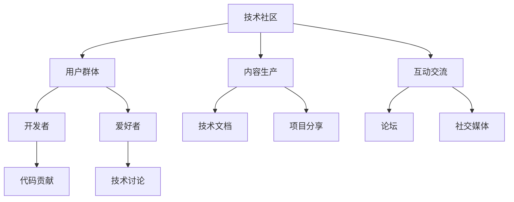

                 

### 文章标题

《技术社区建设：从本地群组到全球性组织》

### 关键词

技术社区，本地群组，全球性组织，内容生产，用户增长，跨地域协作

### 摘要

本文将深入探讨技术社区建设的全过程，从本地群组的形成、运营到最终发展成全球性组织的转变。文章首先定义了技术社区的核心概念，分析了其价值与重要性，并通过历史发展和核心要素的剖析，为技术社区的建设提供了理论基础。随后，文章详细阐述了技术社区建设的规划、平台搭建、运营管理以及用户增长和活跃度提升的策略。最后，本文通过实际案例展示了从本地群组到全球性组织的成功转型过程，为技术社区的发展提供了有益的借鉴。通过逻辑清晰、结构紧凑的阐述，本文旨在帮助读者全面理解技术社区建设的全貌，为技术社区的实践者提供指导。

### 目录大纲

---

# 《技术社区建设：从本地群组到全球性组织》

## 第一部分：技术社区概述与基础

### 第1章：技术社区的定义与价值
- 1.1 技术社区的定义
- 1.2 技术社区的重要性
- 1.3 技术社区的分类与特点

### 第2章：技术社区的发展历史
- 2.1 技术社区的发展阶段
- 2.2 技术社区的关键事件与里程碑
- 2.3 技术社区的未来趋势

### 第3章：技术社区的核心要素
- 3.1 用户群体分析
- 3.2 内容生产与维护
- 3.3 社区文化塑造与维系

## 第二部分：技术社区建设与管理

### 第4章：技术社区建设规划
- 4.1 社区目标设定
- 4.2 社区策略制定
- 4.3 社区资源规划

### 第5章：技术社区平台搭建
- 5.1 社区平台选择
- 5.2 平台功能设计与实现
- 5.3 社区安全性保障

### 第6章：技术社区运营管理
- 6.1 内容审核与发布
- 6.2 活动策划与执行
- 6.3 用户反馈与互动

### 第7章：社区用户增长与活跃度提升
- 7.1 用户增长策略
- 7.2 活跃度评估与优化
- 7.3 用户粘性建设

## 第三部分：从本地群组到全球性组织

### 第8章：本地群组运营实践
- 8.1 本地群组的特点与优势
- 8.2 本地群组的运营策略
- 8.3 本地群组的成长案例

### 第9章：跨地域社区协作
- 9.1 跨地域协作的挑战与解决方案
- 9.2 跨地域社区的组织结构
- 9.3 跨地域社区的成功案例

### 第10章：全球性组织的构建
- 10.1 全球性组织的定义与特征
- 10.2 全球性组织的建设路径
- 10.3 全球性组织的运营模式

### 第11章：案例分析
- 11.1 案例背景与目标
- 11.2 案例实施过程
- 11.3 案例成果与启示

## 附录

### 附录A：技术社区建设工具与资源
- A.1 常用社区平台介绍
- A.2 社区建设与运营工具
- A.3 相关书籍与论文推荐

---

## 第1章：技术社区的定义与价值

### 1.1 技术社区的定义

技术社区是指一群对特定技术领域有共同兴趣或目标的人组成的网络社群。这个社群的成员通过互联网平台进行交流，分享知识和经验，协同解决问题，共同推动技术进步。技术社区的定义可以从以下几个方面来理解：

1. **共同兴趣或目标**：技术社区成员对某一技术领域或问题有共同的关注和兴趣，这是社区形成的基础。
2. **网络平台**：技术社区通常建立在互联网平台上，如论坛、社交媒体、邮件列表等，这些平台为成员提供了交流的渠道。
3. **知识分享**：社区成员通过分享技术文档、项目代码、解决方案等，共同积累和传播知识。
4. **协同合作**：社区成员在解决技术问题时，可以相互协作，共同研究，提高问题解决的效率。
5. **技术进步**：技术社区通过成员之间的交流和合作，能够加速技术的创新和应用。

下面是技术社区的基本架构：

### 1.2 技术社区的重要性

技术社区的重要性体现在多个方面，以下是一些关键点：

1. **知识共享与传播**：技术社区为成员提供了一个平台，可以自由分享技术知识和经验，帮助新人快速学习，提高技术水平。
2. **问题解决**：在技术社区中，成员可以提出问题，并得到其他成员的解答，这大大提高了问题解决的效率和准确性。
3. **技能提升**：通过参与技术讨论和项目协作，成员可以不断学习和提升自己的技能，这对职业发展非常有利。
4. **技术创新**：技术社区促进了技术创新和协作，可以加速新技术的研发和应用。
5. **社交网络**：技术社区为成员提供了一个社交网络，有助于建立职业联系，拓宽人脉资源。

### 1.3 技术社区的分类与特点

技术社区可以根据不同的标准进行分类，以下是一些常见的分类方式：

1. **按技术领域分类**：
   - **通用技术社区**：如Stack Overflow，涉及多种编程语言和技术领域。
   - **特定技术领域社区**：如Linux内核社区，专注于Linux内核的开发和维护。

2. **按组织形式分类**：
   - **官方社区**：由技术公司或组织官方建立的社区，如Apple Developer。
   - **民间社区**：由爱好者或第三方组织建立的社区，如Python社区。

3. **按地域分类**：
   - **本地社区**：主要服务于某一地区的成员，如某个城市的程序员社区。
   - **全球社区**：服务于全球范围的成员，如GitHub，其用户遍布世界各地。

每种类型的社区都有其独特的特点和运营策略，但它们的核心目标都是为了促进技术的交流和创新。

## 第2章：技术社区的发展历史

### 2.1 技术社区的发展阶段

技术社区的发展可以划分为几个关键阶段：

1. **早期阶段**：
   - **线下交流**：早期技术社区的交流主要发生在线下的技术会议、研讨会和沙龙中。
   - **邮件列表**：随着电子邮件的普及，技术社区开始通过邮件列表进行交流，如Unix和Linux邮件列表。

2. **互联网阶段**：
   - **论坛和博客**：互联网的兴起带来了在线论坛和博客平台的兴起，如Slashdot和WordPress，使得技术社区可以更方便地进行交流和知识共享。
   - **社交媒体**：社交媒体平台如Twitter和LinkedIn的出现，进一步促进了技术社区的发展和成员之间的互动。

3. **平台化阶段**：
   - **专业社区平台**：如Stack Overflow和GitHub，这些平台专注于技术问题的解答和项目协作，成为技术社区的重要载体。
   - **混合平台**：随着技术的发展，许多社区开始采用混合平台，结合论坛、博客、社交媒体等多种形式，提供更丰富的交流和互动体验。

### 2.2 技术社区的关键事件与里程碑

技术社区的发展历程中，有许多关键事件和里程碑：

1. **1995年**：Slashdot的成立，标志着技术新闻社区的开始。
2. **2008年**：GitHub的推出，成为软件开发项目协作和社区交流的重要平台。
3. **2010年**：Stack Overflow的成立，为技术问题解答提供了高效的解决方案。
4. **2015年**：GitHub上的代码贡献数量首次超过其他平台，成为全球最大的开源代码托管平台。
5. **2020年**：社交媒体和在线会议平台如Zoom的普及，使得技术社区活动可以更加灵活和便捷地进行。

### 2.3 技术社区的未来趋势

展望未来，技术社区将继续发展并呈现出以下趋势：

1. **更深入的垂直化**：随着技术的不断细分，技术社区将更加专注于特定领域，提供更深入的专业知识和解决方案。
2. **平台集成与互操作**：不同社区平台之间的集成和互操作性将提高用户体验，实现资源的共享和整合。
3. **人工智能的融入**：人工智能技术将被广泛应用于技术社区，如内容推荐、智能问答和社区管理等，提高社区运营效率和用户满意度。
4. **全球化和多元化**：随着全球化和多元化的发展，技术社区将更加开放和包容，吸引来自不同文化和背景的成员参与。

通过以上分析，我们可以看到技术社区经历了从线下到线上，从单一平台到多样化平台的发展历程，未来将继续向专业化、集成化和智能化方向发展。

## 第3章：技术社区的核心要素

### 3.1 用户群体分析

技术社区的用户群体是社区的核心，他们的特征和需求决定了社区的发展方向和运营策略。以下是对技术社区用户群体分析的关键点：

1. **用户特征**：
   - **开发者**：技术社区中最活跃的用户群体，他们通常是计算机编程、软件开发或相关领域的专业人士。开发者对新技术有强烈的兴趣和需求，善于解决问题，愿意分享和贡献自己的知识。
   - **爱好者**：对某一技术领域有浓厚兴趣的非专业人士，他们可能是学生、科研人员或业余编程爱好者。爱好者倾向于通过社区学习新知识，参与项目，提升自己的技术水平。
   - **企业用户**：企业内部的开发团队或技术人员，他们利用社区资源进行技术学习和项目协作，提升企业技术实力。

2. **用户需求**：
   - **知识分享与学习**：用户希望社区能够提供丰富的技术文档、教程和案例分析，帮助他们学习和掌握新技术。
   - **问题解决**：用户在开发过程中遇到问题时，希望快速找到解决方案或得到专业人士的帮助。
   - **项目协作**：用户希望社区提供项目协作工具，便于团队内部或跨团队协作开发。
   - **社交互动**：用户希望与社区成员进行交流，建立人脉，分享经验，共同进步。

### 3.2 内容生产与维护

内容是技术社区的核心资产，其生产与维护的质量直接影响社区的吸引力和用户满意度。以下是对内容生产与维护的关键点：

1. **内容类型**：
   - **技术文档**：包括教程、指南、最佳实践、技术论文等，为用户提供系统化的知识体系。
   - **项目分享**：用户上传的项目代码、软件工具、原型设计等，展示技术成果和应用案例。
   - **技术讨论**：用户发布的问题、观点、讨论帖，围绕特定技术话题展开的深入讨论。
   - **博客和文章**：用户或专业作者撰写的专业文章，分享技术见解和经验。

2. **内容生产**：
   - **用户生成内容（UGC）**：鼓励用户积极参与内容生产，通过投稿、评论、问答等形式贡献内容。
   - **专业内容生产**：邀请行业专家、知名博主和作者进行专业内容的创作和分享，提升社区的质量和影响力。

3. **内容维护**：
   - **内容审核**：确保内容的准确性和可靠性，防止不实信息或垃圾内容的传播。
   - **内容更新**：定期对过时的内容进行更新，保持内容的时效性和实用性。
   - **内容推荐**：通过算法推荐系统，将优质内容推送给感兴趣的用户，提高内容的曝光度和阅读率。

### 3.3 社区文化塑造与维系

社区文化是技术社区的灵魂，它决定了社区的氛围和成员的行为准则。以下是对社区文化塑造与维系的关键点：

1. **文化特征**：
   - **开放性**：社区鼓励开放和自由的讨论，尊重不同的观点和意见，倡导平等交流。
   - **互助性**：社区成员之间相互帮助，共同解决技术问题，形成良好的互助氛围。
   - **专业性**：社区强调专业性和严谨性，推崇高质量的内容和深度讨论。
   - **多样性**：社区欢迎来自不同背景和领域的成员，促进多元文化的交流与融合。

2. **文化塑造**：
   - **社区规则**：制定明确的社区规则和行为准则，确保社区的有序运行和成员的合规行为。
   - **榜样作用**：通过树立榜样和表彰优秀成员，激励更多成员积极参与社区建设。
   - **文化活动**：举办线上和线下的活动，如技术沙龙、讲座、聚会等，增强成员的归属感和凝聚力。

3. **文化维系**：
   - **持续宣传**：通过宣传社区价值观和成功案例，强化社区文化的影响力。
   - **用户反馈**：倾听用户的声音，及时调整和优化社区管理策略，保持社区文化的活力。
   - **社区管理**：建立专业的社区管理团队，负责社区文化的塑造与维系，确保社区健康、稳定的发展。

通过以上对用户群体分析、内容生产与维护以及社区文化塑造与维系的详细探讨，我们可以看到技术社区的核心要素是如何共同作用，推动社区的发展和繁荣。这些要素的优化和平衡是技术社区成功的关键。

### 第4章：技术社区建设规划

技术社区的建设规划是确保社区成功的基础，它涵盖了社区目标的设定、策略的制定以及资源的规划。以下是对技术社区建设规划的详细阐述。

#### 4.1 社区目标设定

社区目标的设定是社区建设的起点，它决定了社区的方向和发展路径。设定社区目标时，应考虑以下几个方面：

1. **明确具体**：社区目标应具体而明确，如“提升用户体验”、“扩大用户规模”、“提高内容质量”等。
2. **符合实际**：目标应基于社区的资源和能力，避免设定过高的目标导致无法实现。
3. **具有挑战性**：目标应具有一定的挑战性，以激励成员不断进步和社区发展。
4. **可量化**：目标应可量化，便于评估和监控，如“增加注册用户数量达到10,000人”。

例如，一个技术社区的短期目标可以是：
- 在接下来的三个月内，每月增加500名新注册用户。
- 提升社区内容的平均质量评分到4.5分。

长期目标可以是：
- 建立一个覆盖全球的技术社区，吸引来自不同国家和地区的成员。
- 创建一个高质量的技术文档库，覆盖主要技术领域。

#### 4.2 社区策略制定

社区策略是指为实现社区目标而制定的具体行动计划和策略。以下是制定社区策略时应考虑的几个关键点：

1. **内容策略**：制定内容生产和管理策略，确保社区内容丰富、有价值。例如，制定内容审核标准、内容推荐算法、内容更新计划等。
2. **用户增长策略**：通过多种渠道和手段，吸引新用户加入社区，并提升用户的活跃度和留存率。例如，利用社交媒体推广、举办线上活动、提供优惠会员计划等。
3. **互动策略**：鼓励用户之间的互动和参与，提升社区活跃度。例如，设立用户积分系统、定期举办问答活动、组织线下聚会等。
4. **品牌建设策略**：通过品牌宣传、合作伙伴关系、活动推广等手段，提升社区的品牌知名度和影响力。

例如，一个技术社区的具体策略可能包括：
- 定期发布高质量的技术博客文章，每周至少发布5篇。
- 与知名技术博客和媒体合作，推广社区内容和活动。
- 每月举办一次线上技术研讨会，邀请行业专家进行分享。
- 通过社交媒体进行定期推广，提高社区在目标用户中的知名度。

#### 4.3 社区资源规划

社区资源的规划是确保社区建设顺利进行的保障，包括人力资源、技术资源、资金资源等。以下是社区资源规划的关键点：

1. **人力资源**：明确社区管理团队的组成，包括社区管理员、内容审核员、活动策划人员等。确保团队成员具备相应的技能和经验，能够高效地运营社区。
2. **技术资源**：选择合适的社区平台和工具，确保社区的技术架构能够满足社区的运营需求。例如，选择稳定、可扩展的社区平台，搭建支持多语言、多功能的社区网站。
3. **资金资源**：确保社区建设和发展所需的资金，包括平台搭建费用、服务器维护费用、活动推广费用等。可以通过会员收费、广告收入、合作伙伴赞助等多种方式筹集资金。

例如，一个技术社区的资源规划可能包括：
- 招聘3名全职社区管理员，负责日常运营和管理。
- 投入5万元用于购买社区平台服务和技术支持。
- 每月预算5000元用于线上广告推广和活动组织。

通过以上对社区目标设定、策略制定和资源规划的具体阐述，我们可以看到技术社区建设规划的全面性和重要性。这些步骤的精细规划和有效执行，将为技术社区的成功奠定坚实的基础。

### 第5章：技术社区平台搭建

技术社区的平台搭建是确保社区正常运作和提供高质量服务的关键步骤。本章将详细讨论平台选择、功能设计与实现以及社区安全性保障。

#### 5.1 平台选择

选择一个合适的社区平台是技术社区建设的重要一环。以下是在选择平台时需要考虑的关键因素：

1. **稳定性与可靠性**：平台应具备良好的稳定性，确保社区服务不间断，避免因服务器故障等原因导致用户流失。
2. **功能与扩展性**：平台应提供丰富的功能，如论坛、博客、问答系统、用户管理、内容推荐等，同时应具备良好的扩展性，以适应社区未来发展的需求。
3. **社区生态**：平台应拥有成熟的社区生态，包括活跃的用户群体、丰富的插件和主题等，以提升社区的用户体验和互动性。
4. **成本与预算**：平台的选择还应考虑成本问题，确保在预算范围内实现社区的功能需求。

常见的技术社区平台有：
- **Discourse**：一个现代、灵活的社区平台，支持多种主题和插件，易于定制。
- **Flarum**：一个轻量级、开源的社区平台，具有良好的性能和简洁的用户界面。
- **phpBB**：一个历史悠久、功能强大的开源论坛系统，适合大规模社区。
- **Vanilla Forums**：一个灵活、可定制的社区平台，支持多语言和多种插件。

#### 5.2 平台功能设计与实现

社区平台的功能设计是实现社区目标的关键，以下是一些核心功能及其设计要点：

1. **论坛**：论坛是技术社区的核心功能，用于用户提问、讨论和分享知识。功能设计要点包括：
   - **帖子管理**：支持创建、编辑、删除帖子，同时允许用户对帖子进行评论和回复。
   - **分类和标签**：对帖子进行分类和标签管理，便于用户查找和浏览。
   - **权限设置**：根据用户角色和权限，限制某些用户或组别的操作。

2. **博客**：博客功能用于发布技术文章和博客，设计要点包括：
   - **文章发布**：支持用户创建、编辑和发布文章，允许插入图片、视频和代码片段。
   - **内容审核**：设立内容审核机制，确保发布的内容符合社区标准。
   - **文章分类**：对文章进行分类管理，便于用户按主题查找。

3. **问答系统**：问答系统用于用户提问和解答问题，设计要点包括：
   - **提问与回答**：支持用户提出问题和回答问题，允许用户对答案进行投票和评价。
   - **最佳答案**：设定最佳答案机制，鼓励高质量回答的产生。
   - **积分系统**：通过积分系统激励用户参与问答，提升社区活跃度。

4. **用户管理**：用户管理功能涉及用户注册、登录、权限管理、个人资料编辑等，设计要点包括：
   - **注册与登录**：支持多种注册和登录方式，如邮箱注册、社交媒体登录等。
   - **权限管理**：根据用户角色和权限，设定不同的操作权限，如管理员、普通用户、会员等。
   - **个人资料**：用户可以编辑和管理个人资料，如头像、简介、兴趣等。

5. **内容推荐**：通过算法推荐系统，将用户可能感兴趣的内容推送给用户，提高用户留存率和互动性。设计要点包括：
   - **推荐算法**：采用基于内容、基于用户、基于社交的推荐算法，实现个性化推荐。
   - **推荐展示**：将推荐内容合理展示在社区首页或个人中心，提升内容曝光度。

6. **活动管理**：用于组织和管理社区活动，设计要点包括：
   - **活动创建**：支持用户创建和发布活动，包括活动名称、时间、地点、描述等。
   - **活动报名**：用户可以报名参加活动，系统自动统计报名人数和参与情况。
   - **活动通知**：通过邮件、短信等方式通知用户活动相关信息。

#### 5.3 社区安全性保障

社区的安全性是保障用户信息和数据安全的关键，以下是一些核心安全措施：

1. **用户认证**：采用强认证机制，如双因素认证，确保用户身份的真实性。
2. **数据加密**：对用户数据和应用数据进行加密存储和传输，防止数据泄露。
3. **权限控制**：通过严格的权限控制，限制用户对系统和数据的访问权限。
4. **安全审计**：定期进行安全审计，检测系统漏洞和安全隐患，及时修补。
5. **防攻击措施**：采用防火墙、反DDoS、入侵检测等防攻击措施，确保系统稳定运行。
6. **数据备份**：定期备份用户数据和系统配置，确保在灾难发生时可以快速恢复。

通过以上对平台选择、功能设计与实现以及社区安全性保障的详细讨论，我们可以看到技术社区平台搭建的重要性和复杂性。选择合适的平台、设计合理的功能以及保障社区的安全性，是确保技术社区成功运行的关键。

### 第6章：技术社区运营管理

技术社区的成功运营管理是确保社区长期活跃和用户满意度的重要保障。本章将详细讨论内容审核与发布、活动策划与执行以及用户反馈与互动。

#### 6.1 内容审核与发布

内容审核与发布是社区运营的核心环节，直接影响到社区的质量和用户体验。以下是一些关键步骤和策略：

1. **审核标准**：制定明确的内容审核标准，确保发布的内容符合社区规范和价值观。审核标准应包括语言规范、内容真实性和合规性等方面。

2. **审核流程**：建立科学的内容审核流程，包括初筛、人工审核和复审等环节。初筛可以采用自动化工具进行，人工审核则由审核员根据标准进行判断，复审则确保审核的准确性。

3. **内容发布**：发布流程应简洁明了，用户提交内容后，经过审核和编辑，即可发布。在发布过程中，应确保内容的可读性和格式规范。

4. **质量监控**：定期对社区内容进行质量监控，发现和纠正不符合标准的内容，确保社区内容的整体质量。

5. **反馈机制**：建立用户反馈机制，允许用户举报不良内容，审核员应及时处理用户反馈，提升内容审核的效率和准确性。

例如，一个技术社区的内容审核流程可能包括：
- 初筛：使用自动化工具检测内容中的不良词汇和格式问题。
- 人工审核：审核员根据审核标准对内容进行详细审核，确保内容真实、合规且具有价值。
- 复审：对于争议性内容，由多位审核员进行复审，确保审核结果的公正性。

#### 6.2 活动策划与执行

活动是增强社区活跃度和用户参与度的重要手段。以下是一些活动策划与执行的关键点：

1. **活动类型**：根据社区特点和用户需求，策划多种类型的活动，如技术讲座、线上研讨会、技术比赛、线下聚会等。

2. **活动策划**：制定详细的活动策划方案，包括活动主题、时间、地点、嘉宾、流程等。策划方案应充分考虑用户体验和互动性。

3. **活动推广**：通过多种渠道进行活动推广，如社区公告、邮件通知、社交媒体宣传等，吸引更多用户参与。

4. **活动执行**：在活动当天，确保活动顺利进行，包括技术支持、现场布置、嘉宾接待等。活动执行应注重细节，确保用户满意。

5. **活动反馈**：活动结束后，收集用户反馈，总结活动经验教训，不断优化活动策划和执行。

例如，一个技术社区可能策划以下活动：
- 每月一次线上技术讲座，邀请行业专家分享最新技术趋势。
- 每季度一次技术比赛，鼓励用户展示自己的技术成果。
- 每年一次线下聚会，促进成员之间的交流与合作。

#### 6.3 用户反馈与互动

用户反馈和互动是社区运营的重要组成部分，以下是一些关键策略：

1. **反馈渠道**：建立多种反馈渠道，如社区论坛、邮件、在线问卷等，方便用户提出意见和建议。

2. **反馈处理**：及时处理用户的反馈，确保每个反馈都能得到回应。对于重要问题，可以建立快速响应机制，提高处理效率。

3. **用户互动**：鼓励用户之间的互动，如评论、点赞、分享等，增强社区的活跃度和用户粘性。

4. **社区管理**：建立专业的社区管理团队，负责监控和引导用户互动，维护社区秩序，处理争议。

5. **用户参与**：鼓励用户参与社区管理和内容创作，如邀请用户担任社区志愿者、组织用户投稿等，提高用户归属感和参与感。

例如，一个技术社区可以采取以下措施：
- 定期举办用户座谈会，听取用户对社区的建议和需求。
- 鼓励用户参与社区内容的审核和评选，增加用户参与感。
- 设立用户积分系统，激励用户积极参与社区互动。

通过以上对内容审核与发布、活动策划与执行以及用户反馈与互动的详细讨论，我们可以看到技术社区运营管理的复杂性和重要性。这些策略的有效实施，将有助于提升社区的质量和用户的满意度，推动社区的长久发展。

### 第7章：社区用户增长与活跃度提升

技术社区的用户增长和活跃度提升是社区长期发展的关键。本章将探讨用户增长策略、活跃度评估与优化以及用户粘性建设。

#### 7.1 用户增长策略

用户增长策略是扩大社区用户规模和吸引新用户的重要手段。以下是一些核心策略：

1. **内容营销**：通过高质量的内容吸引新用户，如技术文章、案例研究、教程视频等。内容应具有实用性和吸引力，解决用户的实际问题。

2. **社交媒体推广**：利用社交媒体平台（如Twitter、LinkedIn、Facebook等）进行推广，发布社区活动、亮点和成功案例，吸引潜在用户关注。

3. **合作伙伴关系**：与相关技术公司、高校、培训机构等建立合作伙伴关系，共同举办活动，扩大社区影响力。

4. **会员制度**：推出会员制度，提供独家内容、优先参与活动等福利，鼓励用户付费加入。

5. **线下活动**：组织线下活动（如技术沙龙、讲座、聚会等），吸引新用户加入社区，增强用户之间的互动。

6. **用户推荐**：通过奖励机制鼓励现有用户推荐新用户，如提供积分、优惠券等。

7. **搜索引擎优化（SEO）**：优化社区内容，提高在搜索引擎中的排名，吸引更多自然流量。

8. **广告投放**：在相关网站、论坛和社交媒体上投放广告，直接吸引潜在用户。

#### 7.2 活跃度评估与优化

活跃度是衡量社区健康和用户满意度的关键指标。以下是一些活跃度评估与优化的策略：

1. **活跃度指标**：设立活跃度指标，如用户注册数、帖子数、评论数、活动参与率等，定期监控和评估。

2. **用户分类**：根据用户的活跃程度，将用户分类为活跃用户、沉默用户和潜在用户，有针对性地进行运营。

3. **用户互动**：鼓励用户之间的互动，如评论、点赞、分享等。通过建立话题、发起讨论，激发用户参与。

4. **内容推荐**：通过算法推荐系统，将用户可能感兴趣的内容推送给用户，提高内容的曝光率和用户参与度。

5. **活动激励**：举办有趣的活动和竞赛，提供奖品和荣誉，激励用户参与和贡献。

6. **社区管理**：建立专业的社区管理团队，负责监控和管理社区，确保社区氛围健康、有序。

7. **数据分析**：通过数据分析，了解用户行为和偏好，优化社区功能和内容，提升用户活跃度。

#### 7.3 用户粘性建设

用户粘性是指用户对社区的忠诚度和持续参与度。以下是一些建设用户粘性的策略：

1. **个性化体验**：根据用户的兴趣和行为数据，提供个性化的内容和推荐，提升用户的使用体验。

2. **社区文化**：塑造积极的社区文化，鼓励用户分享、互助和参与，增强社区归属感。

3. **积分系统**：建立积分系统，通过积分奖励用户参与和贡献，提高用户粘性。

4. **会员福利**：为会员提供独享内容、特权服务、优先参与活动等福利，增强会员的归属感和忠诚度。

5. **用户成长计划**：为用户提供成长路径，如认证、等级晋升等，激励用户不断学习和进步。

6. **用户互动**：鼓励用户之间的互动，建立社群和小组，增强用户之间的联系和互动。

7. **社区活动**：定期举办线上和线下活动，增加用户参与感和社区归属感。

通过以上对用户增长策略、活跃度评估与优化以及用户粘性建设的详细讨论，我们可以看到技术社区在用户增长和活跃度提升方面的多样性和复杂性。这些策略的有效实施，将有助于社区的长久发展和用户满意度的提升。

### 第8章：本地群组运营实践

本地群组是技术社区发展的基础，它们在地理上具有紧密的联系，有助于增强用户之间的互动和合作。本章将探讨本地群组的特性、优势以及具体的运营策略和成功案例。

#### 8.1 本地群组的特性与优势

1. **特性**：
   - **地理集中性**：本地群组的成员通常生活在同一个城市或地区，这使得他们能够更容易地参与面对面的交流。
   - **紧密联系**：由于地理上的接近，本地群组成员之间能够建立更紧密的关系，增强社区的凝聚力和归属感。
   - **文化背景相似**：本地群组的成员通常具有相似的文化背景和价值观，这有助于促进有效沟通和共同进步。

2. **优势**：
   - **高互动性**：本地群组成员可以更频繁地参与线下活动和聚会，促进深度交流和合作。
   - **资源共享**：本地群组可以更方便地共享资源和设备，如实验室、会议室等。
   - **合作机会**：本地群组为成员提供了更多的合作机会，如项目协作、创业合作等。
   - **社区氛围**：本地群组通常拥有独特的社区氛围，有助于建立积极的社区文化和价值观。

#### 8.2 本地群组的运营策略

1. **活动策划**：
   - **多样化活动**：策划多样化的活动，如技术沙龙、讲座、研讨会、技术比赛等，满足不同成员的需求。
   - **线上线下结合**：结合线上线下活动，提高成员的参与度和互动性。例如，线上举办技术研讨会，线下进行聚会和交流活动。
   - **长期活动**：建立一些长期活动，如每月一次的技术分享会，增强成员的持续参与感。

2. **会员管理**：
   - **会员分级**：根据成员的活跃度和贡献程度，设立不同级别的会员，如初级会员、中级会员、高级会员等，提供不同的福利和服务。
   - **会员活动**：为会员提供专属活动，如会员沙龙、会员培训等，提高会员的归属感和忠诚度。

3. **资源整合**：
   - **本地资源**：整合本地资源，如高校、企业、科研机构的资源和设施，为成员提供更好的学习和实践条件。
   - **合作伙伴**：与本地企业和机构建立合作伙伴关系，共同举办活动和项目，扩大社区的影响力。

4. **宣传推广**：
   - **社交媒体**：利用社交媒体平台宣传本地群组的活动和成果，吸引更多潜在成员。
   - **线下宣传**：在本地社区、高校、企业等地方进行线下宣传，提高本地群组的知名度。

#### 8.3 本地群组的成长案例

以下是一个本地技术群组的成长案例：

**案例背景**：
- **所在地**：某科技城市
- **成立时间**：2018年
- **初始成员**：10名技术爱好者

**发展过程**：

1. **初建期**（2018-2019年）：
   - 成员通过线上方式建立联系，定期举办线上技术讨论会。
   - 初始活动主要是线上讲座和讨论，吸引了一批对技术有热情的本地成员。

2. **扩展期**（2019-2021年）：
   - 成员自发组织了第一次线下聚会，约有30人参加。
   - 开始与本地高校合作，举办面向学生的技术沙龙和竞赛。
   - 成员数量增加到100人，并开始吸引一些企业合作伙伴。

3. **成熟期**（2021年至今）：
   - 定期举办线下技术研讨会和讲座，邀请业内专家分享最新技术趋势。
   - 成立了多个专项小组，如AI小组、云计算小组等，成员可以专注于自己感兴趣的技术领域。
   - 成员数量增加到300人，本地企业合作伙伴增加到10家，社区影响力显著提升。

**成果与启示**：

1. **成功因素**：
   - **多样化的活动**：多样化的活动形式吸引了不同背景和兴趣的成员。
   - **线上线下结合**：线上线下活动的结合提高了成员的参与度和互动性。
   - **高校和企业合作**：与高校和企业的合作扩大了社区的影响力和资源。

2. **启示**：
   - **活动多样性**：本地群组应注重活动形式的多样性，满足不同成员的需求。
   - **线上线下结合**：线上线下活动相结合，提高成员的参与度和归属感。
   - **合作与资源整合**：与高校和企业合作，利用外部资源推动社区的发展。

通过以上对本地群组特性与优势的讨论以及实际案例的解析，我们可以看到本地群组在技术社区发展中具有重要的地位和作用。有效的运营策略和成功的实践，将为本地群组的持续成长提供有力支持。

### 第9章：跨地域社区协作

随着技术的发展和全球化进程的加速，跨地域社区协作成为技术社区发展的重要趋势。本章将探讨跨地域协作的挑战、解决方案、组织结构和成功案例。

#### 9.1 跨地域协作的挑战与解决方案

1. **挑战**：
   - **时区差异**：跨地域的社区成员可能处于不同的时区，导致沟通和协作的困难。
   - **文化差异**：不同地区的文化背景和价值观可能存在差异，影响沟通效率和团队协作。
   - **技术基础设施差异**：不同地区的网络和技术基础设施可能存在差异，影响社区平台的稳定性和性能。
   - **语言障碍**：不同地区的语言差异可能增加沟通难度，影响信息的准确传达。

2. **解决方案**：
   - **时区管理**：通过设定固定的会议时间或使用协作工具的自动调度功能，尽量减少时区差异带来的影响。
   - **文化理解**：加强跨文化培训，提高团队成员对文化差异的理解和适应能力。
   - **技术优化**：选择适合跨地域协作的社区平台和工具，确保平台的稳定性和高性能。
   - **多语言支持**：提供多语言支持和翻译服务，减少语言障碍的影响。

#### 9.2 跨地域社区的组织结构

1. **分布式团队**：跨地域社区通常采用分布式团队的组织结构，团队成员分散在不同地区，通过协作工具保持紧密联系。

2. **虚拟办公室**：建立虚拟办公室，为团队成员提供远程办公的环境和工具，提高协作效率。

3. **角色分工**：
   - **项目经理**：负责协调项目进度，管理团队成员。
   - **技术专家**：负责技术指导和问题解决。
   - **内容编辑**：负责社区内容的审核、发布和更新。
   - **活动策划**：负责社区活动的策划和执行。

4. **层级管理**：建立清晰的层级管理结构，确保决策流程的清晰和高效。

#### 9.3 跨地域社区的成功案例

以下是一个跨地域社区协作的成功案例：

**案例背景**：
- **社区名称**：全球软件开发者社区（Global Developer Community）
- **成立时间**：2015年
- **成员数量**：超过100,000名开发者，分布在全球各地

**发展过程**：

1. **初期合作**（2015-2017年）：
   - 社区通过线上论坛和社交媒体建立联系，定期举办全球范围内的技术研讨会。
   - 成员主要分布在欧美、亚太地区，通过协作工具保持沟通和合作。

2. **扩展期**（2017-2019年）：
   - 社区与多个国际知名技术公司合作，举办线下技术沙龙和交流活动。
   - 成员数量显著增加，社区的影响力进一步扩大。

3. **成熟期**（2019年至今）：
   - 社区建立分布式团队，分工明确，高效协作。
   - 定期举办全球范围内的技术比赛和挑战，鼓励成员参与和贡献。
   - 成员数量超过100,000名，社区影响力遍布全球。

**成功因素**：

1. **协作工具**：使用高效的协作工具（如Slack、Trello等），确保团队成员之间的沟通和协作顺畅。
2. **多元文化**：鼓励多元文化的交流和学习，增强社区的凝聚力和创新力。
3. **活动丰富**：通过多样化的活动形式（如线上研讨会、线下沙龙、技术比赛等），提高成员的参与度和互动性。
4. **企业合作**：与全球知名企业的合作，为社区成员提供更多的资源和机会。

**启示**：

1. **协作工具**：选择适合跨地域协作的协作工具，提高团队协作效率。
2. **多元文化**：尊重和促进多元文化的交流，增强社区的创新力和凝聚力。
3. **活动多样化**：举办多样化的活动，满足不同成员的需求，提高社区的活跃度和参与度。
4. **企业合作**：与全球知名企业合作，扩大社区的影响力和资源。

通过以上对跨地域协作挑战、解决方案和组织结构的讨论，以及实际案例的解析，我们可以看到跨地域社区协作的必要性和可行性。有效的协作机制和成功的实践，将有助于推动跨地域技术社区的发展。

### 第10章：全球性组织的构建

全球性组织的技术社区是技术交流和合作的高级形式，它跨越地域、文化和语言的障碍，将全球各地的开发者、技术爱好者和专业人士凝聚在一起。本章将探讨全球性组织的定义与特征、建设路径以及运营模式。

#### 10.1 全球性组织的定义与特征

1. **定义**：
   - 全球性技术社区是指一个跨越国界、文化、语言和时区的技术交流平台，它为全球开发者提供知识共享、问题解决和项目协作的机会。

2. **特征**：
   - **国际化**：全球性组织的成员来自世界各地，具有多元化的背景和经验。
   - **开放性**：社区对所有开发者开放，无论其技术水平和专业领域。
   - **协作性强**：社区鼓励成员之间的协作，共同推动技术进步和创新。
   - **资源丰富**：社区积累了大量的技术资源，包括文档、代码、案例和工具。
   - **技术多样性**：社区涵盖了多种技术领域，从软件开发到数据科学，从人工智能到物联网。

#### 10.2 全球性组织的建设路径

1. **初期筹备**：
   - **确定愿景和目标**：明确社区的目标和愿景，如促进技术进步、推动创新和解决技术难题。
   - **组建核心团队**：建立一个核心团队，负责社区的建设和运营，团队成员应具备丰富的技术背景和管理经验。
   - **选择平台和工具**：选择合适的社区平台和工具，如论坛、社交媒体、代码托管平台等，确保社区的稳定性和功能多样性。

2. **初期发展**：
   - **内容建设**：创建高质量的技术文档和教程，提供丰富的学习资源，吸引新用户加入。
   - **活动策划**：举办线上和线下的技术活动，如研讨会、讲座、代码马拉松等，增强社区的活跃度。
   - **用户增长**：通过内容营销、合作伙伴关系和社交媒体推广，扩大社区的影响力，吸引更多用户。

3. **持续发展**：
   - **社区文化塑造**：建立积极的社区文化，鼓励互助、分享和开放，确保社区的长久发展。
   - **技术生态建设**：与全球企业和研究机构建立合作关系，共同推动技术的发展和创新。
   - **国际化运营**：提供多语言支持，吸引不同国家和地区的成员参与，促进全球化的社区交流。

#### 10.3 全球性组织的运营模式

1. **分布式管理**：
   - 全球性组织的运营通常采用分布式管理模式，团队成员分布在不同的地区，通过协作工具和远程工作平台保持联系。
   - **角色分工**：明确团队成员的角色和职责，如项目经理、技术专家、内容编辑、活动策划等，确保团队高效协作。

2. **内容管理**：
   - **内容审核**：建立严格的内容审核机制，确保发布的内容符合社区标准和价值观。
   - **内容更新**：定期更新和维护社区内容，确保其时效性和准确性。
   - **内容推荐**：使用算法推荐系统，将优质内容推送给感兴趣的用户，提高内容的曝光度和阅读率。

3. **用户互动**：
   - **互动渠道**：提供多样化的互动渠道，如论坛、社交媒体、邮件列表等，方便用户之间的交流。
   - **用户反馈**：建立用户反馈机制，及时收集和处理用户意见和建议，优化社区服务。

4. **活动策划与执行**：
   - **活动类型**：策划多种类型的活动，如线上研讨会、线下聚会、技术比赛等，满足不同用户的需求。
   - **活动推广**：通过社交媒体、邮件通知等渠道推广活动，提高活动参与率。
   - **活动反馈**：活动结束后，收集用户反馈，总结经验教训，不断优化活动策划和执行。

5. **国际合作**：
   - **合作伙伴**：与全球知名企业和研究机构建立合作关系，共同推动技术的发展和创新。
   - **国际活动**：举办国际性的技术活动，如国际技术峰会、国际代码马拉松等，促进全球技术交流和合作。

通过以上对全球性组织定义与特征、建设路径以及运营模式的详细探讨，我们可以看到构建一个成功的全球性技术社区所需的系统性和复杂性。有效的运营策略和持续的社区文化建设，将有助于全球性技术社区的长久发展和繁荣。

### 第11章：案例分析

#### 11.1 案例背景与目标

**案例背景**：
- **社区名称**：中国开源社区（Open Source Community of China，简称OSCC）
- **成立时间**：2008年
- **初始成员**：一批国内开源软件的开发者和技术爱好者

**目标**：
- **促进国内开源软件的发展**：通过社区交流和协作，推动国内开源项目的发展，提升国内技术水平和竞争力。
- **构建技术交流平台**：为开发者提供一个开放、自由的交流和学习平台，促进技术的普及和创新。
- **培养开源文化**：倡导开源精神，培养开源文化和社区氛围，吸引更多开发者参与开源项目。

#### 11.2 案例实施过程

1. **初期阶段（2008-2010年）**：
   - **平台搭建**：OSCC选择了一个开源的论坛系统，搭建了基本的社区平台，包括论坛、博客、问答系统等。
   - **内容建设**：社区成员开始上传开源项目的代码、文档和教程，分享技术心得和解决方案。
   - **用户增长**：通过线上和线下的活动推广，吸引了一批技术爱好者加入社区。

2. **扩展阶段（2010-2015年）**：
   - **活动策划**：社区定期举办技术沙龙、讲座和代码马拉松等活动，增强成员的互动和参与感。
   - **合作伙伴**：与国内多家企业和高校建立合作关系，共同推动开源项目的发展。
   - **国际化**：社区开始吸引国际成员，逐步实现了多语言支持和国际化运营。

3. **成熟阶段（2015年至今）**：
   - **平台升级**：OSCC升级了社区平台，增加了更多功能，如项目协作工具、在线课程、活动管理工具等。
   - **内容多样化**：除了技术文档和项目代码，社区还增加了技术博客、视频教程等多种内容形式。
   - **社区文化**：社区形成了独特的文化，鼓励成员分享、互助和合作，培养了一批忠诚的社区成员。

#### 11.3 案例成果与启示

**成果**：

1. **项目成果**：OSCC孵化了多个开源项目，如某开源数据库、某开源框架等，这些项目在国内外的开源社区中具有较高的知名度和影响力。

2. **用户规模**：社区成员从最初的几百人增长到数万人，吸引了来自不同领域和背景的开发者。

3. **影响力**：OSCC在国内开源社区中具有较高的声誉，成为开发者学习、交流和合作的重要平台。

**启示**：

1. **平台建设**：选择合适的平台和工具，为社区提供稳定、高效的服务。

2. **内容建设**：持续更新和维护高质量的内容，满足用户的需求。

3. **活动策划**：举办多样化的活动，提高用户的参与度和互动性。

4. **合作伙伴**：与相关机构和企业建立合作关系，共同推动社区的发展。

5. **社区文化**：建立积极的社区文化，鼓励成员分享、互助和合作，提升社区的凝聚力和归属感。

通过以上对OSCC案例分析，我们可以看到技术社区从本地群组到全球性组织的发展过程，以及其取得的显著成果。这些经验为其他技术社区的建设和发展提供了宝贵的参考和启示。

### 附录A：技术社区建设工具与资源

#### A.1 常用社区平台介绍

1. **Discourse**：
   - **特点**：一个现代、灵活的社区平台，支持多语言和多种插件，易于定制。
   - **适用场景**：适合企业内部社区、开源项目社区等。
   - **网址**：[https://www.discourse.org/](https://www.discourse.org/)

2. **Flarum**：
   - **特点**：一个轻量级、开源的社区平台，具有良好的性能和简洁的用户界面。
   - **适用场景**：适合小型社区、个人博客等。
   - **网址**：[https://flarum.org/](https://flarum.org/)

3. **phpBB**：
   - **特点**：一个历史悠久、功能强大的开源论坛系统，适合大规模社区。
   - **适用场景**：适合大型论坛、技术社区等。
   - **网址**：[https://www.phpbb.com/](https://www.phpbb.com/)

4. **Vanilla Forums**：
   - **特点**：一个灵活、可定制的社区平台，支持多语言和多种插件。
   - **适用场景**：适合企业社区、教育社区等。
   - **网址**：[https://www.vanillaforums.com/](https://www.vanillaforums.com/)

#### A.2 社区建设与运营工具

1. **Trello**：
   - **特点**：一个简单的任务管理工具，适合团队协作和项目规划。
   - **适用场景**：适合社区内容管理、活动策划等。
   - **网址**：[https://trello.com/](https://trello.com/)

2. **Slack**：
   - **特点**：一个即时通讯工具，支持多团队协作和文件共享。
   - **适用场景**：适合社区内部沟通、活动通知等。
   - **网址**：[https://slack.com/](https://slack.com/)

3. **Mattermost**：
   - **特点**：一个开源的即时通讯平台，适合企业内部通信。
   - **适用场景**：适合企业社区、内部协作等。
   - **网址**：[https://www.mattermost.org/](https://www.mattermost.org/)

4. **Google Workspace**：
   - **特点**：一套集成的办公工具，包括文档、邮件、日历等。
   - **适用场景**：适合社区管理、内容创作等。
   - **网址**：[https://www.google.com/workspace/](https://www.google.com/workspace/)

#### A.3 相关书籍与论文推荐

1. **《技术社区的运营与管理》**：
   - **作者**：王俊
   - **简介**：本书详细介绍了技术社区的建设、运营和管理策略，适合技术社区管理者阅读。

2. **《社区营销》**：
   - **作者**：蔡丽芬
   - **简介**：本书探讨如何通过社区营销实现品牌推广和用户增长，适合希望提升社区影响力的企业。

3. **《社交网络分析：方法与应用》**：
   - **作者**：赵军
   - **简介**：本书介绍了社交网络分析的基本概念和方法，适合对社交网络和社区数据分析感兴趣的读者。

4. **《开放协作：协作平台的构建与运营》**：
   - **作者**：陈晖
   - **简介**：本书详细阐述了开源协作平台的建设和运营，适合从事开源项目管理和社区运营的工作者。

这些工具和资源将有助于技术社区的建设和运营，为读者提供实用指导和支持。通过有效利用这些资源，技术社区可以实现更好的发展和用户满意度。

