                 

### 文章标题

# 技术管理：在数字化时代保持竞争力

在数字化时代，技术管理的重要性日益凸显。随着技术的快速迭代和业务模式的不断变革，如何有效地进行技术管理，成为企业保持竞争优势的关键。本文将深入探讨技术管理的基础概念、数字化时代的变革、技术领导力、技术团队管理、技术战略规划、技术预算与资源管理、技术风险管理以及技术实践与案例解析，以帮助读者全面了解和掌握技术管理的核心要义。

> 关键词：技术管理、数字化时代、技术领导力、技术团队管理、技术战略规划、技术预算与资源管理、技术风险管理、技术实践

> 摘要：本文围绕数字化时代的技术管理展开，系统分析了技术管理的基础概念和重要性，探讨了数字化时代的变革及其对技术管理的影响，深入剖析了技术领导力、技术团队管理、技术战略规划、技术预算与资源管理、技术风险管理等核心内容，并通过具体案例解析和总结展望，为读者提供了全面的技术管理实践指导。

### 《技术管理：在数字化时代保持竞争力》目录大纲

#### 第一部分：技术管理基础

1. **第1章：技术管理的概念与重要性**
    - **1.1 技术管理的定义与范围**
    - **1.2 技术管理的重要性**
    - **1.3 技术管理与业务管理的关联**

2. **第2章：数字化时代的变革**
    - **2.1 数字化转型的概念与特征**
    - **2.2 数字化时代的技术趋势**
    - **2.3 技术管理在数字化转型中的角色**

3. **第3章：技术领导力**
    - **3.1 技术领导力的定义与要素**
    - **3.2 技术领导者的角色与责任**
    - **3.3 培养技术领导力**

#### 第二部分：技术团队管理

4. **第4章：技术团队构建与管理**
    - **4.1 技术团队的构建**
    - **4.2 技术团队的绩效管理**
    - **4.3 技术团队的沟通协作**

5. **第5章：技术项目管理**
    - **5.1 技术项目的规划与执行**
    - **5.2 技术项目的风险管理**
    - **5.3 技术项目的质量管理**

6. **第6章：技术团队文化建设**
    - **6.1 技术团队文化的概念与重要性**
    - **6.2 技术团队文化的建设与维护**
    - **6.3 技术团队文化对绩效的影响**

#### 第三部分：技术战略规划

7. **第7章：技术战略规划**
    - **7.1 技术战略规划的概念与流程**
    - **7.2 技术战略规划的方法与工具**
    - **7.3 技术战略规划的实施与评估**

8. **第8章：技术预算与资源管理**
    - **8.1 技术预算的概念与制定**
    - **8.2 技术资源的分配与管理**
    - **8.3 技术资源的优化与调整**

9. **第9章：技术风险管理**
    - **9.1 技术风险管理的概念与重要性**
    - **9.2 技术风险的识别与评估**
    - **9.3 技术风险的应对与控制**

#### 第四部分：技术实践与案例

10. **第10章：技术实践**
    - **10.1 技术实践的重要性**
    - **10.2 技术实践的方法与步骤**
    - **10.3 技术实践中的常见问题与解决策略**

11. **第11章：技术案例解析**
    - **11.1 技术案例的选择与分类**
    - **11.2 技术案例的解析与启示**
    - **11.3 技术案例对技术管理的借鉴意义**

12. **第12章：总结与展望**
    - **12.1 本书内容的总结**
    - **12.2 技术管理的发展趋势**
    - **12.3 未来技术管理的挑战与机遇**

#### 附录

13. **附录 A：参考资料与工具**
    - **13.1 主要参考资料**
    - **13.2 技术管理工具介绍**
    - **13.3 技术管理相关网站与资源**

### 第一部分：技术管理基础

#### 第1章：技术管理的概念与重要性

在当今的数字化时代，技术管理已经成为企业运营的核心组成部分。然而，对于许多企业来说，技术管理仍然是一个相对陌生的概念。那么，什么是技术管理？它的重要性又体现在哪些方面？本章将围绕这些问题展开讨论。

##### **1.1 技术管理的定义与范围**

**技术管理**，顾名思义，是指对技术资源的管理。具体来说，它包括以下几个方面：

1. **技术规划**：根据企业的战略目标和市场需求，制定技术发展路线图，明确技术发展方向和目标。
2. **技术研发**：进行技术研究和开发，包括基础研究、应用研究和开发研究。
3. **技术采购**：根据企业需求，选择合适的技术产品和服务，进行采购和配置。
4. **技术运营**：确保技术系统的正常运行，提供技术支持和维护。
5. **技术优化**：对现有技术系统进行评估和优化，提高技术效率和服务质量。

技术管理的范围广泛，涵盖了企业的研发、采购、运营、优化等多个方面。它不仅涉及技术的开发和应用，还包括技术资源的配置和管理，以及技术对业务的支持和推动。

##### **1.2 技术管理的重要性**

在数字化时代，技术管理的重要性愈发凸显。以下是技术管理对企业的几个重要影响：

1. **提高企业竞争力**：技术管理能够帮助企业快速响应市场变化，开发出具有竞争力的产品和服务，从而提高企业的市场竞争力。
2. **提升业务效率**：通过技术管理，企业可以优化业务流程，提高工作效率，降低运营成本。
3. **保障技术安全**：技术管理有助于识别和应对技术风险，确保企业的技术安全。
4. **促进技术创新**：技术管理能够激发企业的技术创新能力，推动企业的持续发展。

##### **1.3 技术管理与业务管理的关联**

技术管理不仅仅是技术部门的责任，它需要与业务管理紧密关联。以下是技术管理与业务管理之间的关联：

1. **战略协同**：技术管理需要与企业的战略规划相一致，为企业的长期发展提供技术支持。
2. **需求对接**：技术管理需要了解业务部门的需求，确保技术研发和应用能够满足业务需求。
3. **资源整合**：技术管理需要整合企业内外部的技术资源，实现资源的最优配置。
4. **绩效评估**：技术管理需要与业务管理相结合，对技术绩效进行评估，为企业的决策提供依据。

通过本章的讨论，我们可以看到，技术管理在数字化时代的企业运营中具有不可忽视的重要性。它不仅关乎技术的开发和应用，更关乎企业的整体运营和发展。因此，企业需要重视技术管理，将其作为企业战略的重要组成部分，以实现持续的发展和竞争优势。

---

**图1.1 技术管理的基础架构**

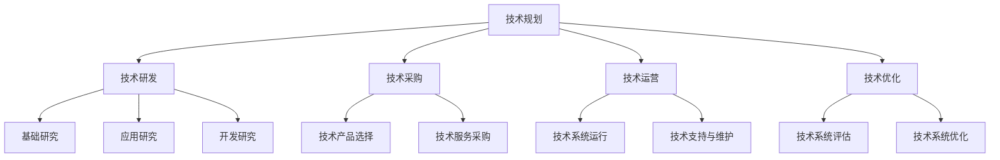

技术管理的基础架构涵盖了从技术规划到技术优化的各个方面，每个环节都是相互关联、相互支持的。通过这种架构，企业可以系统化地管理技术资源，提高技术效率，实现业务目标。

---

在接下来的章节中，我们将继续探讨数字化时代的变革、技术领导力、技术团队管理等内容，以帮助读者全面了解技术管理的核心要素和实践方法。

#### 第2章：数字化时代的变革

随着信息技术的迅猛发展，数字化时代已经到来。数字化不仅改变了人们的日常生活，也深刻影响了企业的运营模式。在这一背景下，技术管理面临着前所未有的挑战和机遇。本章将探讨数字化转型的概念与特征，分析数字化时代的技术趋势，并探讨技术管理在数字化转型中的角色。

##### **2.1 数字化转型的概念与特征**

**数字化转型**，指的是利用数字技术来改造和提升企业的业务模式、运营流程和组织结构。数字化转型的核心特征包括：

1. **数据驱动的决策**：企业通过收集和分析大量的数据，实现更精准、更高效的决策。
2. **云计算的普及**：云计算为企业的数据存储、处理和共享提供了灵活、高效的基础设施。
3. **物联网的兴起**：物联网通过连接物理世界中的各种设备，实现数据的实时采集和分析。
4. **人工智能的应用**：人工智能技术在自动化、预测分析、优化决策等方面发挥了重要作用。

数字化转型的目标是通过数字化手段提升企业的竞争力，实现业务创新和效率提升。

##### **2.2 数字化时代的技术趋势**

在数字化时代，技术趋势呈现出多样化和快速变化的特点。以下是几个主要的技术趋势：

1. **大数据**：大数据技术的应用，使得企业能够从海量数据中提取有价值的信息，支持数据驱动的决策。
2. **区块链**：区块链技术通过去中心化的方式，保障数据的可信和透明，适用于供应链管理、金融交易等领域。
3. **人工智能**：人工智能技术逐渐渗透到各个行业，从自动化生产到智能客服，极大地提升了企业的运营效率。
4. **5G技术**：5G技术的普及，为物联网、自动驾驶、远程医疗等应用提供了高速、低延迟的网络环境。
5. **边缘计算**：边缘计算将数据处理和分析从云端转移到网络边缘，降低了延迟，提高了响应速度。

##### **2.3 技术管理在数字化转型中的角色**

在数字化转型过程中，技术管理扮演着关键角色。以下是技术管理在数字化转型中的几个关键方面：

1. **战略规划**：技术管理需要制定清晰的技术战略规划，明确数字化转型的目标和路径。
2. **技术选型**：技术管理需要根据业务需求，选择合适的技术产品和方案，确保技术架构的灵活性和可扩展性。
3. **资源整合**：技术管理需要整合企业内外部的技术资源，包括人才、技术和资金，确保数字化转型的顺利推进。
4. **风险管理**：技术管理需要识别和应对数字化转型中的各种风险，包括技术风险、市场风险和操作风险。
5. **文化塑造**：技术管理需要推动企业文化的转变，鼓励员工拥抱数字化，积极参与到数字化转型过程中。

通过本章的讨论，我们可以看到，数字化时代为技术管理带来了新的机遇和挑战。技术管理不仅需要适应数字化时代的变革，还需要引领企业的数字化转型，以保持竞争优势。

---

**图2.1 数字化转型的核心要素**

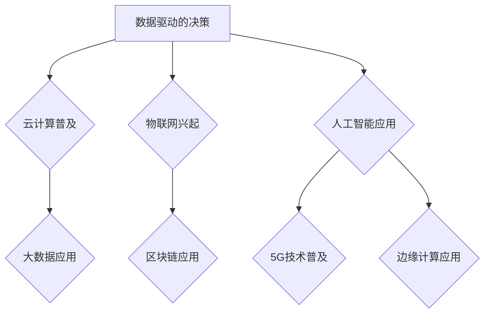

数字化转型的核心要素包括数据驱动的决策、云计算普及、物联网兴起、人工智能应用、区块链应用、5G技术普及和边缘计算应用等。这些要素相互关联、相互促进，共同推动企业的数字化转型。

---

在下一部分，我们将探讨技术领导力，分析技术领导者的角色与责任，以及如何培养技术领导力。这些内容将为技术管理提供更深入的洞察和实际操作指南。

#### 第3章：技术领导力

在数字化时代，技术领导力成为企业保持竞争力和实现持续发展的关键因素。技术领导者不仅需要具备深厚的技术知识，还需要具备战略思维、领导能力和创新精神。本章将探讨技术领导力的定义与要素，分析技术领导者的角色与责任，并探讨如何培养技术领导力。

##### **3.1 技术领导力的定义与要素**

**技术领导力**，是指技术领导者通过激发和引导团队，实现技术目标、推动企业发展的能力。技术领导力的核心要素包括：

1. **技术专业素养**：技术领导者需要具备深厚的专业知识和实践经验，能够引领团队在技术领域取得突破。
2. **战略思维**：技术领导者需要具备战略眼光，能够将技术战略与企业的长期发展目标相结合，推动企业持续创新。
3. **领导能力**：技术领导者需要具备卓越的领导能力，包括沟通、协调、决策和激励团队的能力。
4. **创新精神**：技术领导者需要具备创新精神，敢于尝试新事物，推动企业不断突破传统，实现技术革新。

技术领导力不仅仅是技术能力的体现，更是领导力的展现。它要求技术领导者能够在技术领域具备领导地位，同时具备引领团队、推动创新的能力。

##### **3.2 技术领导者的角色与责任**

技术领导者在企业中扮演着多重角色，承担着重要责任。以下是技术领导者的一些关键角色与责任：

1. **技术规划者**：技术领导者需要制定技术战略规划，明确技术发展方向和目标，确保技术发展与企业战略相一致。
2. **团队领导者**：技术领导者需要领导技术团队，激发团队的潜力，推动技术项目顺利进行。
3. **创新推动者**：技术领导者需要推动技术创新，鼓励团队尝试新技术、新方法，不断优化产品和服务。
4. **风险管理者**：技术领导者需要识别和应对技术风险，确保项目的安全性和可靠性。
5. **沟通桥梁**：技术领导者需要作为企业与业务部门的沟通桥梁，理解业务需求，将技术能力转化为业务价值。
6. **文化塑造者**：技术领导者需要塑造技术团队文化，鼓励创新、学习和协作，提升团队的整体素质。

技术领导者的角色和责任是多元的，他们需要在不同方面发挥领导作用，以实现技术目标和企业的战略目标。

##### **3.3 培养技术领导力**

培养技术领导力是一个系统化的过程，需要从多个方面进行提升。以下是一些培养技术领导力的方法和途径：

1. **专业培训**：通过参加专业培训，学习最新的技术知识和领导力理论，提升专业素养和领导能力。
2. **实践锻炼**：通过参与实际项目，锻炼技术能力和领导能力，积累实践经验。
3. **跨部门合作**：通过跨部门合作，提升沟通和协作能力，了解业务需求，增强全局观念。
4. **阅读和研究**：阅读技术书籍和学术论文，关注行业动态，不断更新知识体系。
5. **反思和总结**：定期进行反思和总结，分析成功和失败的经验教训，提升自我认知和改进能力。

培养技术领导力需要持续的努力和实践。通过不断学习和实践，技术领导者可以不断提升自己的能力，为企业的发展做出更大的贡献。

---

**图3.1 技术领导力的核心要素**

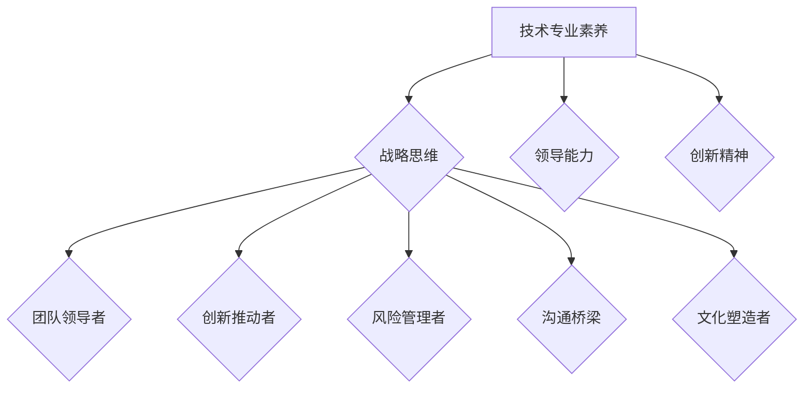

技术领导力的核心要素包括技术专业素养、战略思维、领导能力和创新精神。这些要素相互关联、相互促进，共同构成了技术领导力的基础。

---

通过本章的讨论，我们可以看到，技术领导力在数字化时代的企业中具有不可替代的重要地位。技术领导者不仅需要具备深厚的技术知识和领导能力，还需要具备创新精神，以应对数字化时代的挑战。在下一部分，我们将探讨技术团队管理，分析技术团队的构建、绩效管理和沟通协作，以帮助技术领导者更有效地管理技术团队。

#### 第4章：技术团队构建与管理

技术团队是推动企业数字化转型和实现技术创新的核心力量。有效的技术团队管理能够提高团队效率，确保项目顺利完成，并为企业创造价值。本章将探讨技术团队的构建、绩效管理和沟通协作，帮助技术领导者更好地管理技术团队。

##### **4.1 技术团队的构建**

构建一个高效的技术团队是技术管理的重要任务。以下是构建技术团队的关键步骤：

1. **明确团队目标**：首先，需要明确团队的目标和任务，确保团队的方向与企业的战略一致。
2. **岗位设置**：根据团队目标，设置相应的岗位，确保每个成员都有明确的职责和角色。
3. **人才选拔**：选拔合适的人才，包括技术专家、项目经理、开发人员和测试人员等，确保团队成员具备所需的专业技能和经验。
4. **团队规模**：合理确定团队规模，既不过大也不过小，以确保团队的高效运作。
5. **人员培训**：为团队成员提供培训机会，提升他们的专业技能和团队协作能力。

在构建技术团队时，需要充分考虑团队成员的多样性，包括技术背景、经验水平和文化差异等，以促进创新和协作。

##### **4.2 技术团队的绩效管理**

技术团队的绩效管理是确保团队高效运作的重要环节。以下是技术团队绩效管理的几个关键方面：

1. **绩效评估标准**：制定明确的绩效评估标准，包括技术能力、项目完成情况、团队合作和创新能力等。
2. **定期评估**：定期对团队成员进行绩效评估，及时发现和解决问题。
3. **反馈与沟通**：在绩效评估过程中，提供及时的反馈和沟通，帮助团队成员了解自己的表现，找到改进的方向。
4. **激励机制**：设立激励机制，包括奖金、晋升和培训等，鼓励团队成员发挥潜力，提升绩效。
5. **持续改进**：通过绩效管理，不断发现和解决团队中的问题，持续改进团队的工作方法和流程。

有效的绩效管理能够激发团队成员的积极性，提高团队的整体绩效，推动项目的顺利完成。

##### **4.3 技术团队的沟通协作**

良好的沟通协作是技术团队成功的关键。以下是提升技术团队沟通协作的几个方法：

1. **建立沟通机制**：制定有效的沟通机制，包括定期会议、项目进度报告和即时通讯等，确保信息畅通。
2. **跨部门协作**：鼓励跨部门协作，促进不同部门之间的沟通和合作，确保项目顺利进行。
3. **团队合作培训**：组织团队合作培训，提高团队成员的协作意识和能力。
4. **透明化管理**：通过项目管理工具，实现项目进度和问题的透明化管理，确保团队成员对项目有全面的了解。
5. **鼓励反馈**：鼓励团队成员提出意见和建议，促进团队内部的沟通和协作。

良好的沟通协作能够提高团队的凝聚力，促进创新和问题解决，确保项目的成功。

---

**图4.1 技术团队管理流程**

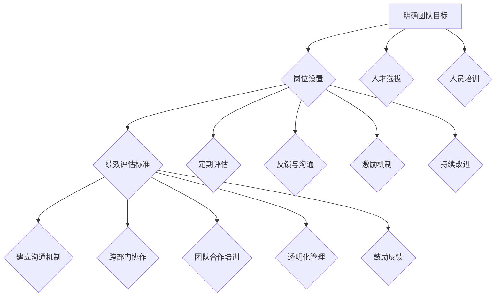

技术团队管理流程包括明确团队目标、岗位设置、人才选拔、人员培训、绩效评估、反馈与沟通、激励机制、持续改进、建立沟通机制、跨部门协作、团队合作培训、透明化管理和鼓励反馈等环节，通过这些环节的有序进行，能够有效管理技术团队，提升团队绩效。

---

通过本章的讨论，我们可以看到，技术团队的构建与管理是技术管理的重要组成部分。有效的技术团队管理能够提高团队效率，确保项目的成功，并为企业创造价值。在下一部分，我们将探讨技术项目管理，分析技术项目的规划与执行、风险管理和质量管理，帮助技术领导者更好地管理技术项目。

#### 第5章：技术项目管理

在数字化时代，技术项目管理成为确保项目成功和实现企业目标的关键。技术项目管理不仅涉及技术层面的规划与执行，还包括风险管理和质量管理。本章将深入探讨技术项目的规划与执行、风险管理和质量管理，帮助技术领导者更好地管理技术项目，确保项目的成功。

##### **5.1 技术项目的规划与执行**

技术项目规划是确保项目顺利进行的基础。以下是技术项目规划与执行的关键步骤：

1. **项目需求分析**：明确项目的需求，包括功能需求、性能需求和用户体验需求等。
2. **项目范围界定**：明确项目的范围，确保项目团队对项目目标有清晰的认识。
3. **项目计划制定**：制定详细的项目计划，包括项目的时间表、资源分配和任务分工。
4. **风险评估**：在项目初期对潜在风险进行评估，制定应对措施，降低风险对项目的影响。
5. **资源分配**：根据项目计划，合理分配资源，确保项目所需的人力、技术和资金等资源充足。
6. **执行与监控**：按照项目计划执行项目任务，同时进行项目监控，及时发现和解决项目中的问题。

技术项目规划与执行需要紧密合作，通过科学的规划和严格的执行，确保项目的顺利进行。

---

**图5.1 技术项目规划流程**

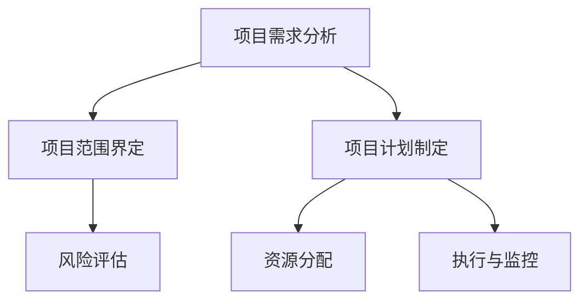

技术项目规划流程包括项目需求分析、项目范围界定、项目计划制定、风险评估、资源分配和执行与监控等环节。通过这些环节的有序进行，可以确保项目目标的实现。

##### **5.2 技术项目的风险管理**

技术项目面临各种风险，有效的风险管理是确保项目成功的重要保障。以下是技术项目风险管理的关键步骤：

1. **风险识别**：识别项目中的潜在风险，包括技术风险、市场风险、人员风险和外部风险等。
2. **风险评估**：对识别出的风险进行评估，确定风险的严重程度和可能的影响。
3. **风险应对**：制定风险应对策略，包括风险规避、风险减轻、风险转移和风险接受等。
4. **风险监控**：在项目执行过程中，持续监控风险，及时调整应对措施，确保项目安全。

有效的风险管理能够降低项目风险，提高项目的成功概率。

---

**图5.2 技术项目风险管理流程**

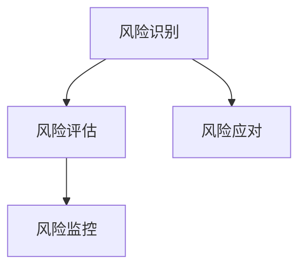

技术项目风险管理流程包括风险识别、风险评估、风险应对和风险监控等环节。通过这些环节的有序进行，可以确保项目风险得到有效管理。

##### **5.3 技术项目的质量管理**

技术项目的质量管理是确保项目交付的产品或服务符合质量要求的关键。以下是技术项目质量管理的几个关键方面：

1. **质量规划**：制定质量计划，明确项目的质量目标和标准。
2. **质量控制**：通过质量控制活动，确保项目交付的产品或服务符合质量要求。
3. **质量保证**：建立质量保证体系，确保项目全过程符合质量标准。
4. **质量改进**：通过质量改进活动，持续提升项目的质量水平。

有效的质量管理能够提高项目交付的产品或服务的质量，提升客户满意度。

---

**图5.3 技术项目质量管理流程**

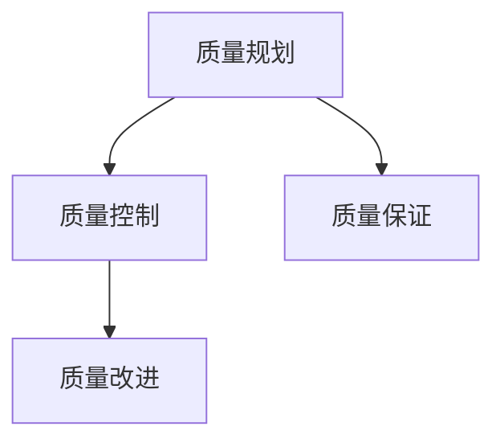

技术项目质量管理流程包括质量规划、质量控制、质量保证和质量改进等环节。通过这些环节的有序进行，可以确保项目交付的产品或服务达到高质量标准。

---

通过本章的讨论，我们可以看到，技术项目管理是确保项目成功的关键。有效的技术项目管理需要综合考虑项目规划与执行、风险管理、质量管理等多个方面，通过科学的规划和严格的执行，确保项目的顺利进行和成功交付。在下一部分，我们将探讨技术团队文化建设，分析技术团队文化的概念、建设与维护以及技术团队文化对绩效的影响。

#### 第6章：技术团队文化建设

技术团队文化是技术团队内部共同的价值观、信仰和行为规范，它是团队凝聚力、创新力和效率的重要保障。一个积极向上的技术团队文化能够激发团队成员的潜力，促进团队的协作和进步，从而提高整个团队的工作效率和绩效。本章将探讨技术团队文化的概念、建设与维护，以及技术团队文化对绩效的影响。

##### **6.1 技术团队文化的概念与重要性**

**技术团队文化**，指的是在技术团队中形成的共同价值观、信仰和行为规范，它反映了团队成员对工作的态度和行为方式。技术团队文化不仅包括团队内部的沟通方式、协作模式和工作流程，还涵盖了团队成员的职业道德、创新精神和工作态度。

技术团队文化的重要性体现在以下几个方面：

1. **增强团队凝聚力**：共同的文化价值观和信仰能够增强团队成员之间的认同感和归属感，形成强大的团队凝聚力。
2. **激发创新力**：积极向上的团队文化鼓励团队成员敢于尝试新思路、新方法，推动技术创新和业务创新。
3. **提升工作效率**：良好的团队文化能够提高团队成员的工作积极性和主动性，减少内耗，提升工作效率。
4. **促进个人成长**：团队文化为团队成员提供了一个互相学习和成长的环境，有助于提升个人的专业能力和职业素养。
5. **提升企业竞争力**：一个具有强大团队文化的技术团队能够更好地适应市场变化，快速响应客户需求，提高企业的竞争力。

##### **6.2 技术团队文化的建设与维护**

建设一个积极向上的技术团队文化需要从以下几个方面进行：

1. **领导示范**：技术领导者需要以身作则，通过自己的言行树立榜样，推动团队文化的发展。
2. **价值观宣贯**：明确团队的核心价值观，并通过各种渠道进行宣贯，让每个成员都理解和认同这些价值观。
3. **激励机制**：设立激励机制，鼓励团队成员践行团队文化，对积极行为给予认可和奖励。
4. **团队活动**：组织团队活动，加强团队成员之间的沟通和协作，培养团队精神和凝聚力。
5. **持续改进**：定期对团队文化进行评估和改进，根据团队的变化和外部环境调整团队文化，确保其与团队发展相适应。

维护团队文化同样重要，以下是一些维护团队文化的策略：

1. **沟通畅通**：建立有效的沟通机制，确保团队成员之间的信息畅通，减少误解和冲突。
2. **反馈机制**：建立反馈机制，鼓励团队成员提出意见和建议，及时解决团队文化中存在的问题。
3. **持续关注**：领导层需要持续关注团队文化的发展，及时调整和改进，确保团队文化的积极向上和适应性。
4. **培训与学习**：提供培训和学习机会，帮助团队成员不断提升自身素质，为团队文化的发展提供支持。

##### **6.3 技术团队文化对绩效的影响**

技术团队文化对团队绩效有着重要影响，以下是几个关键方面：

1. **工作效率**：积极向上的团队文化能够激发团队成员的工作热情和积极性，提高工作效率。
2. **创新氛围**：良好的团队文化鼓励创新，为团队成员提供自由探索和尝试的空间，促进技术革新和业务创新。
3. **团队合作**：团队文化强调协作和沟通，减少内耗，提高团队协作效率，推动项目的顺利完成。
4. **员工满意度**：积极向上的团队文化能够提升员工的满意度和归属感，减少员工流失，提高团队稳定性。
5. **企业竞争力**：一个具有强大团队文化的技术团队能够更好地应对市场变化，快速响应客户需求，提高企业的竞争力。

---

**图6.1 技术团队文化的建设与维护流程**

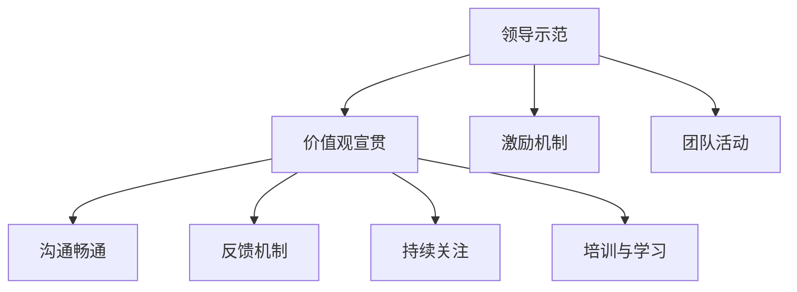

技术团队文化的建设与维护流程包括领导示范、价值观宣贯、激励机制、团队活动、沟通畅通、反馈机制、持续关注和培训与学习等环节。通过这些环节的有序进行，可以逐步建设和发展技术团队文化。

---

通过本章的讨论，我们可以看到，技术团队文化在技术团队管理中具有不可替代的重要地位。建设和维护一个积极向上的技术团队文化，不仅能够提升团队的工作效率和绩效，还能够促进企业的创新和发展，提高企业的竞争力。在下一部分，我们将探讨技术战略规划，分析技术战略规划的概念、流程、方法和工具，以及技术战略规划的实施与评估。

#### 第7章：技术战略规划

技术战略规划是企业利用技术手段实现其长期发展目标的关键步骤。技术战略规划不仅关系到企业当前的技术能力，还影响着企业的未来发展方向。本章将深入探讨技术战略规划的概念、流程、方法和工具，以及技术战略规划的实施与评估。

##### **7.1 技术战略规划的概念与流程**

**技术战略规划**，是指企业根据其长期发展目标和市场需求，系统性地制定技术发展方向、目标和实施策略的过程。技术战略规划的核心内容包括：

1. **技术愿景**：明确企业希望通过技术实现的长远目标，为技术战略规划提供方向。
2. **技术目标**：具体化技术愿景，设定短期和长期的技术目标，确保目标的可实现性和可衡量性。
3. **技术路线**：确定实现技术目标的具体路径，包括技术研发方向、技术应用领域和技术升级策略。
4. **资源分配**：明确为实现技术目标所需的人力、技术和资金等资源的配置，确保资源的有效利用。

技术战略规划的流程通常包括以下几个步骤：

1. **需求分析**：通过对市场、客户和竞争对手的分析，明确企业的技术需求和潜在的技术机会。
2. **现状评估**：评估企业现有的技术能力和资源，识别优势和不足，为制定技术战略提供依据。
3. **目标设定**：根据需求分析和现状评估，设定具体的技术目标和实施路线。
4. **策略制定**：制定实现技术目标的具体策略，包括技术研发计划、技术应用计划和技术管理策略。
5. **方案评估**：对制定的技术战略方案进行评估，确保方案的可行性和有效性。
6. **实施与监控**：实施技术战略方案，并持续监控技术进展，及时调整和优化策略。

##### **7.2 技术战略规划的方法与工具**

制定技术战略规划需要科学的方法和工具，以下是一些常用的方法和工具：

1. **SWOT分析**：通过分析企业的优势（Strengths）、劣势（Weaknesses）、机会（Opportunities）和威胁（Threats），帮助企业识别内外部环境中的关键因素，为技术战略规划提供参考。
2. **PEST分析**：通过分析政治（Political）、经济（Economic）、社会（Social）和技术（Technological）等外部环境因素，了解外部环境对企业技术发展的潜在影响，为技术战略规划提供依据。
3. **SMART原则**：在设定技术目标时，采用具体（Specific）、可衡量（Measurable）、可实现（Achievable）、相关（Relevant）和时限性（Time-bound）等原则，确保目标的清晰、可实现和可追踪。
4. **战略地图**：通过绘制战略地图，将企业的愿景、目标和关键绩效指标（KPI）有机结合起来，形成一个系统化的战略框架，帮助企业和团队明确发展方向和重点。
5. **项目管理工具**：使用项目管理工具，如甘特图、敏捷开发工具和看板（Kanban），帮助团队有效管理技术项目，确保项目按计划推进。

##### **7.3 技术战略规划的实施与评估**

技术战略规划的实施与评估是确保战略目标实现的关键环节。以下是技术战略规划实施与评估的几个关键步骤：

1. **制定详细计划**：在战略规划的基础上，制定详细的实施计划，明确每个阶段的任务、责任人和时间表。
2. **资源配置**：根据实施计划，合理配置人力资源、技术和资金等资源，确保项目顺利推进。
3. **监控与反馈**：在实施过程中，持续监控项目进展，及时收集反馈信息，识别和解决潜在问题。
4. **调整与优化**：根据监控和反馈结果，对实施计划进行调整和优化，确保项目按照预期进行。
5. **效果评估**：在项目完成后，对技术战略规划的实施效果进行评估，包括目标的实现情况、资源的利用效率和项目的经济效益等。
6. **经验总结**：对整个技术战略规划过程进行总结，识别成功经验和不足之处，为未来的技术战略规划提供参考。

---

**图7.1 技术战略规划流程**

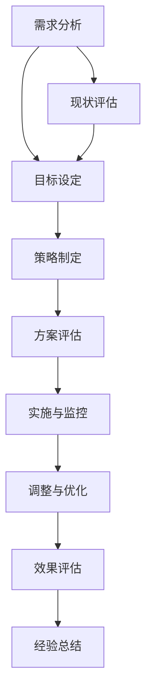

技术战略规划流程包括需求分析、现状评估、目标设定、策略制定、方案评估、实施与监控、调整与优化、效果评估和经验总结等环节。通过这些环节的有序进行，可以确保技术战略规划的有效实施和目标实现。

---

通过本章的讨论，我们可以看到，技术战略规划在企业的技术管理中具有重要作用。通过科学的技术战略规划，企业能够明确技术发展方向，优化资源配置，提升技术能力和竞争力。在下一部分，我们将探讨技术预算与资源管理，分析技术预算的概念与制定、技术资源的分配与管理以及技术资源的优化与调整。

#### 第8章：技术预算与资源管理

技术预算与资源管理是技术管理的重要组成部分，直接关系到企业的技术投入效益和项目执行效率。合理的技术预算和资源管理能够确保企业技术发展的可持续性，提高项目的成功率。本章将深入探讨技术预算的概念与制定、技术资源的分配与管理以及技术资源的优化与调整。

##### **8.1 技术预算的概念与制定**

**技术预算**是指企业在特定时期内，为技术研发、技术采购、技术运营和技术优化等方面所需投入的资金总额。技术预算的制定是企业进行资源分配和管理的重要依据。

技术预算的制定通常包括以下几个步骤：

1. **需求分析**：根据企业的战略目标和市场需求，分析未来一段时间内所需的技术投入。
2. **成本估算**：对各项技术投入进行详细成本估算，包括人力成本、设备成本、维护成本和研发成本等。
3. **预算编制**：根据需求分析和成本估算，编制详细的技术预算方案，包括预算总额、各项预算分配和资金使用计划。
4. **预算审批**：将预算方案提交相关部门进行审批，确保预算的合理性和可行性。
5. **预算调整**：在预算执行过程中，根据实际情况对预算进行适当调整，确保预算的灵活性和适应性。

制定合理的技术预算需要充分考虑企业的战略目标、市场环境和资源条件，确保预算的可行性和有效性。

---

**图8.1 技术预算制定流程**

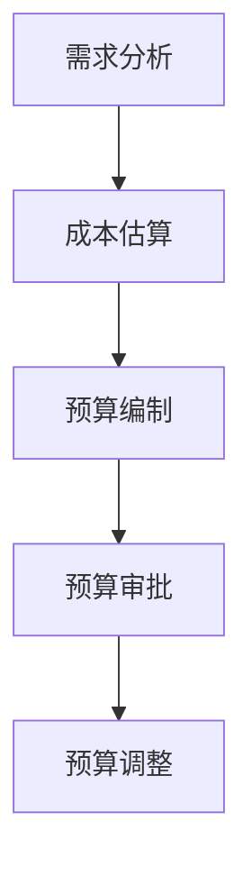

技术预算制定流程包括需求分析、成本估算、预算编制、预算审批和预算调整等环节。通过这些环节的有序进行，可以确保技术预算的科学性和合理性。

##### **8.2 技术资源的分配与管理**

技术资源的分配与管理是技术预算执行的关键环节。合理的资源分配和有效的资源管理能够提高技术投入的效益，确保项目顺利推进。

技术资源的分配通常包括以下几个步骤：

1. **资源评估**：对现有技术资源进行评估，包括人力资源、技术资源和资金资源等，确定资源的可用性和适用性。
2. **需求匹配**：根据项目需求和资源评估结果，进行资源需求匹配，确保每个项目都有充足的资源支持。
3. **优先级排序**：对各项技术资源需求进行优先级排序，确保有限的资源优先投入到关键项目和战略目标上。
4. **资源分配**：根据需求匹配和优先级排序结果，将技术资源分配到各个项目，确保项目资源的合理配置。

技术资源的管理主要包括以下几个方面：

1. **资源监控**：建立资源监控机制，实时监控资源的利用情况，及时发现和解决资源使用中的问题。
2. **资源优化**：通过资源优化措施，提高资源利用效率，减少资源浪费，确保资源的高效使用。
3. **资源调整**：在项目执行过程中，根据项目进展和资源需求变化，及时调整资源分配，确保资源的动态平衡。

---

**图8.2 技术资源分配与管理流程**

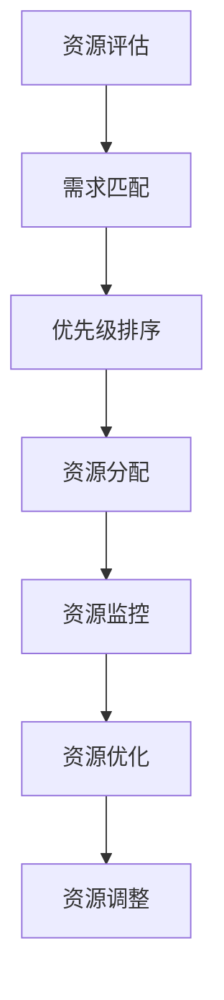

技术资源分配与管理流程包括资源评估、需求匹配、优先级排序、资源分配、资源监控、资源优化和资源调整等环节。通过这些环节的有序进行，可以确保技术资源的高效利用和合理配置。

##### **8.3 技术资源的优化与调整**

技术资源的优化与调整是确保技术资源高效利用和持续改进的重要环节。以下是技术资源优化与调整的关键方法：

1. **资源整合**：通过资源整合，将分散的资源集中起来，形成合力，提高资源利用效率。
2. **资源优化**：通过技术手段和流程优化，提高资源的使用效率和产出效益。
3. **资源调整**：根据项目进展和业务需求变化，及时调整资源分配，确保资源的动态平衡和高效利用。
4. **资源监控与反馈**：建立资源监控机制，实时收集资源使用数据，根据监控结果进行反馈和调整，确保资源使用的合理性和有效性。

通过技术资源的优化与调整，可以不断提升技术资源的利用效率，降低运营成本，提高项目的成功率。

---

**图8.3 技术资源优化与调整策略**

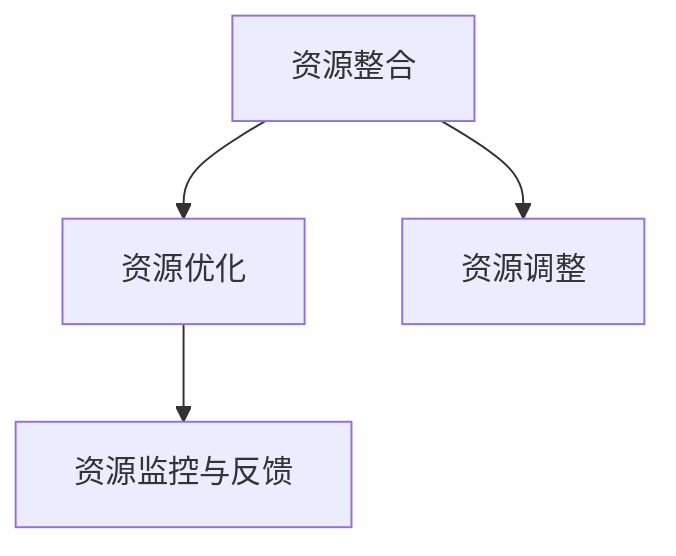

技术资源优化与调整策略包括资源整合、资源优化、资源调整和资源监控与反馈等环节。通过这些环节的有序进行，可以确保技术资源的高效利用和持续改进。

---

通过本章的讨论，我们可以看到，技术预算与资源管理在技术管理中具有至关重要的作用。通过合理的技术预算和科学的技术资源管理，企业能够确保技术投入的效益最大化，提高项目的成功率，推动企业的可持续发展。在下一部分，我们将探讨技术风险管理，分析技术风险管理的概念、重要性、识别与评估以及应对与控制方法。

#### 第9章：技术风险管理

在数字化时代，技术风险成为企业运营中不可忽视的挑战。技术风险管理是确保企业技术项目顺利进行和业务连续性的重要手段。本章将深入探讨技术风险管理的概念、重要性，以及技术风险的识别与评估、应对与控制方法，帮助技术领导者有效管理技术风险。

##### **9.1 技术风险管理的概念与重要性**

**技术风险管理**是指通过识别、评估、控制和监控技术风险，确保企业技术项目的成功实施和业务连续性的过程。技术风险通常包括以下几个方面：

1. **技术失败风险**：包括技术研发失败、产品功能不完善、性能不达标等问题。
2. **数据安全风险**：包括数据泄露、数据丢失、数据篡改等问题。
3. **系统故障风险**：包括系统崩溃、网络攻击、硬件故障等问题。
4. **合规风险**：包括违反法律法规、行业标准和技术规范等问题。

技术风险管理的重要性体现在以下几个方面：

1. **保障项目成功**：通过有效管理技术风险，确保项目按计划推进，减少项目延误和失败的风险。
2. **保护企业资产**：技术风险管理能够保护企业的技术资产和商业机密，减少经济损失和声誉损害。
3. **提高业务连续性**：通过提前识别和应对技术风险，确保企业的业务连续性和稳定性，减少突发事件对企业运营的冲击。
4. **优化资源利用**：有效的技术风险管理能够优化资源分配，降低不必要的风险投入，提高资源利用效率。

##### **9.2 技术风险的识别与评估**

技术风险的识别与评估是技术风险管理的基础。以下是技术风险识别与评估的关键步骤：

1. **风险识别**：通过访谈、问卷调查、文档审查和专家咨询等方法，识别项目中的潜在技术风险。风险识别需要全面、系统地考虑项目的技术复杂性、市场需求变化、技术依赖性等因素。

2. **风险评估**：对识别出的风险进行定性评估和定量评估。定性评估通过评估风险的发生概率和影响程度，确定风险的严重性；定量评估通过数学模型和统计数据，量化风险的可能损失和风险价值。

3. **风险分类**：根据风险的特点和影响，对风险进行分类，如高、中、低风险，技术风险、数据风险、系统风险等，以便有针对性地制定应对策略。

4. **风险优先级排序**：根据风险评估结果，对风险进行优先级排序，确保有限的风险管理资源优先用于高风险的防范和控制。

---

**图9.1 技术风险识别与评估流程**

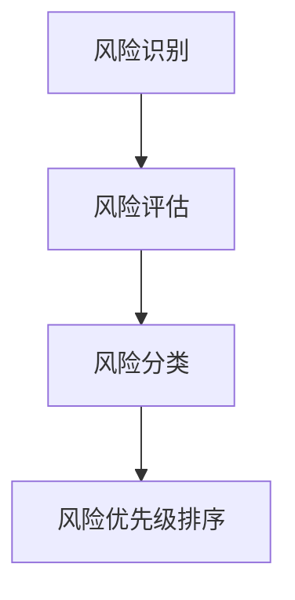

技术风险识别与评估流程包括风险识别、风险评估、风险分类和风险优先级排序等环节。通过这些环节的有序进行，可以确保技术风险得到全面、系统的识别和评估。

##### **9.3 技术风险的应对与控制**

技术风险的应对与控制是技术风险管理的核心。以下是技术风险应对与控制的关键步骤：

1. **风险规避**：通过调整项目计划、改变技术方案或转移部分风险，避免风险的发生。例如，通过引入成熟的技术方案，降低技术研发失败的风险。

2. **风险减轻**：通过改进技术方案、增加资源投入或优化项目管理流程，减轻风险的影响程度。例如，通过加强网络安全措施，降低数据泄露的风险。

3. **风险转移**：通过购买保险、签订合同或联合开发等方式，将部分风险转移给第三方。例如，通过签订技术服务合同，将部分技术风险转移给技术服务提供商。

4. **风险接受**：对于无法避免或减轻的风险，采取接受策略，制定应急预案，确保在风险发生时能够及时应对，减少损失。例如，对于高频率的网络攻击，制定应急响应流程，确保系统的快速恢复。

5. **风险监控**：建立风险监控机制，实时监控风险的变化，及时调整应对措施。风险监控包括定期风险评估、风险事件报告和应急演练等。

---

**图9.2 技术风险应对与控制策略**

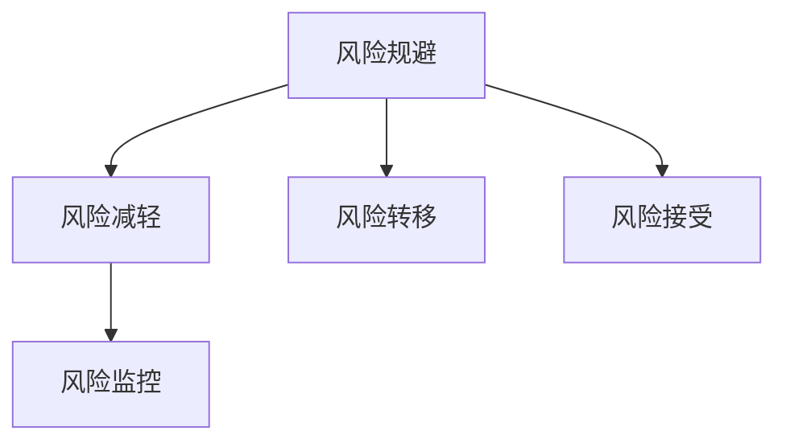

技术风险应对与控制策略包括风险规避、风险减轻、风险转移、风险接受和风险监控等环节。通过这些环节的有序进行，可以确保技术风险得到有效管理和控制。

---

通过本章的讨论，我们可以看到，技术风险管理在数字化时代的企业运营中具有不可替代的重要地位。通过科学的技术风险管理，企业能够有效识别、评估和控制技术风险，保障项目的成功实施和业务的连续性，提高企业的竞争力。在下一部分，我们将探讨技术实践，分析技术实践的重要性、方法与步骤，以及技术实践中的常见问题与解决策略。

#### 第10章：技术实践

技术实践是技术管理理论在实际操作中的具体体现，是确保技术目标实现和技术创新能力提升的关键环节。有效的技术实践不仅能够提高项目执行效率，还能推动企业的技术进步和业务发展。本章将深入探讨技术实践的重要性、方法与步骤，以及技术实践中的常见问题与解决策略。

##### **10.1 技术实践的重要性**

技术实践在技术管理中具有至关重要的地位。以下是技术实践的重要性体现在几个方面：

1. **实现技术目标**：技术实践是确保技术目标实现的具体手段，通过实际操作，将技术理论转化为实际成果。
2. **提升创新能力**：技术实践能够激发团队的创新能力，推动新技术、新方法的应用，为企业带来持续的竞争优势。
3. **验证技术方案**：通过技术实践，可以验证技术方案的可行性和有效性，发现并解决潜在的技术问题。
4. **培养技术人才**：技术实践为团队成员提供了实际操作的机会，有助于提升技术水平和工作能力，培养技术人才。
5. **积累经验**：技术实践过程中积累的经验和教训，能够为未来的技术项目提供宝贵的参考，提高项目管理水平。

##### **10.2 技术实践的方法与步骤**

有效的技术实践需要系统的方法和步骤，以下是一些关键的方法和步骤：

1. **需求分析**：首先，进行需求分析，明确技术实践的目标和需求，确保实践的方向与企业的战略目标相一致。
2. **方案设计**：根据需求分析结果，设计具体的技术实践方案，包括技术路线、工具选择、资源分配和时间规划等。
3. **资源准备**：准备必要的资源，包括人力资源、技术资源和资金资源等，确保技术实践顺利进行。
4. **实施与监控**：按照技术实践方案，实施技术实践，并实时监控实践进展，确保项目按计划推进。
5. **问题解决**：在技术实践过程中，及时发现和解决遇到的问题，确保技术实践的顺利进行。
6. **效果评估**：在技术实践完成后，对实践效果进行评估，包括技术目标的实现程度、资源利用效率和项目成果等。
7. **经验总结**：对整个技术实践过程进行总结，识别成功经验和不足之处，为未来的技术实践提供参考。

---

**图10.1 技术实践流程**

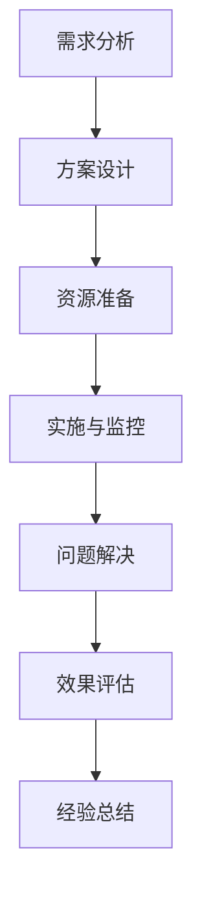

技术实践流程包括需求分析、方案设计、资源准备、实施与监控、问题解决、效果评估和经验总结等环节。通过这些环节的有序进行，可以确保技术实践的有效实施和目标实现。

##### **10.3 技术实践中的常见问题与解决策略**

在技术实践中，可能会遇到各种问题和挑战，以下是一些常见的问题及解决策略：

1. **资源不足**：解决策略：通过合理分配资源、提高资源利用效率、寻求外部支持等方式，确保技术实践所需资源的充足。
2. **技术难度高**：解决策略：通过技术预研、团队培训、引入外部技术支持等方式，提高团队的技术能力，降低技术难度。
3. **项目延误**：解决策略：通过项目管理工具和方法，加强项目监控和管理，及时调整计划和资源，确保项目按时完成。
4. **沟通不畅**：解决策略：建立有效的沟通机制，加强团队之间的沟通和协作，确保信息的畅通和及时传递。
5. **风险失控**：解决策略：通过风险识别、风险评估和风险控制，建立风险管理体系，确保风险在可控范围内。
6. **变更频繁**：解决策略：通过变更管理流程，确保变更的合理性和可控性，减少对技术实践的影响。

---

**图10.2 技术实践中的常见问题与解决策略**

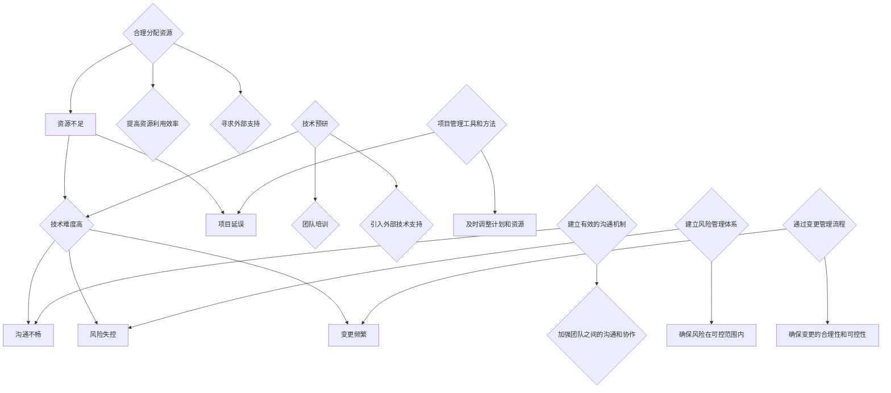

技术实践中的常见问题与解决策略包括资源不足、技术难度高、项目延误、沟通不畅、风险失控和变更频繁等，以及相应的解决策略。通过这些策略的有效实施，可以解决技术实践中遇到的问题，确保技术实践的成功。

---

通过本章的讨论，我们可以看到，技术实践在技术管理中具有不可替代的重要地位。有效的技术实践能够确保技术目标的实现，提升创新能力，培养技术人才，积累经验，推动企业的技术进步和业务发展。在下一部分，我们将通过具体的技术案例解析，分析技术案例的选择与分类、技术案例的解析与启示，以及技术案例对技术管理的借鉴意义。

#### 第11章：技术案例解析

技术案例解析是理解和应用技术管理理论的重要途径。通过分析具体的技术案例，可以深入了解技术管理的实际应用，获取宝贵的经验和教训，为未来的技术实践提供参考。本章将探讨技术案例的选择与分类、技术案例的解析与启示，以及技术案例对技术管理的借鉴意义。

##### **11.1 技术案例的选择与分类**

选择合适的技术案例对于技术管理的学习和借鉴至关重要。以下是技术案例选择与分类的几个关键方面：

1. **选择标准**：技术案例的选择应遵循以下标准：
    - 代表性：选择具有代表性的案例，能够反映技术管理的各个方面和层次。
    - 成功性：选择成功的技术案例，从中学习和借鉴成功的经验和方法。
    - 失败性：选择失败的技术案例，通过分析失败原因，避免重蹈覆辙。
    - 创新性：选择具有创新意义的技术案例，了解前沿技术和方法的应用。

2. **分类方式**：技术案例可以根据不同的标准进行分类，如：
    - 按技术领域分类：如人工智能、大数据、云计算、物联网等。
    - 按案例类型分类：如成功案例、失败案例、创新案例等。
    - 按应用场景分类：如企业内部应用、行业应用、跨行业应用等。
    - 按企业规模分类：如中小企业案例、大型企业案例等。

通过科学的选择和分类，可以确保技术案例的多样性和实用性，为技术管理的学习和研究提供丰富的素材。

---

**图11.1 技术案例分类**

```mermaid
graph TD
    A[技术领域](#technology_domain)
    B[案例类型](#case_type)
    C[应用场景](#application_scene)
    D[企业规模](#company_size)
    A --> B
    A --> C
    A --> D
    B --> E[成功案例](#successful_case)
    B --> F[失败案例](#failure_case)
    B --> G[创新案例](#innovative_case)
```

技术案例分类可以根据技术领域、案例类型、应用场景和企业规模等多个维度进行划分，从而为技术管理的学习和研究提供多样化的案例。

##### **11.2 技术案例的解析与启示**

解析技术案例是深入理解技术管理实践的重要步骤。以下是技术案例解析与启示的几个关键方面：

1. **案例背景**：介绍技术案例的背景，包括企业的基本情况、面临的问题和挑战等。
2. **解决方案**：分析案例中企业采取的技术解决方案，包括技术选型、项目实施方法和项目管理策略等。
3. **实施效果**：评估技术案例的实施效果，包括技术目标实现情况、项目效益和业务影响等。
4. **经验教训**：总结案例中的成功经验和教训，分析失败的原因，为未来的技术实践提供借鉴。

通过技术案例的深入解析，可以获取以下启示：

1. **技术选型**：了解不同技术方案的特点和适用场景，为未来的技术选型提供参考。
2. **项目管理**：学习有效的项目管理方法和工具，提高项目执行效率和成功率。
3. **团队协作**：通过案例中的团队协作模式，提高团队协作效率和创新能力。
4. **风险管理**：掌握有效的风险管理策略，降低技术风险，确保项目的顺利进行。

---

**图11.2 技术案例解析框架**

```mermaid
graph TD
    A[案例背景](#case_background)
    B[解决方案](#solution)
    C[实施效果](#implementation_effect)
    D[经验教训](#experience_lesson)
    A --> B
    A --> C
    A --> D
    B --> E[技术选型](#technology_selection)
    B --> F[项目管理](#project_management)
    B --> G[团队协作](#team Cooperation)
    B --> H[风险管理](#risk_management)
```

技术案例解析框架包括案例背景、解决方案、实施效果和经验教训等关键环节，通过这些环节的深入分析，可以获取技术管理的启示和经验。

##### **11.3 技术案例对技术管理的借鉴意义**

技术案例不仅是技术管理的实践总结，更是对技术管理理论的验证和应用。以下是技术案例对技术管理的借鉴意义：

1. **理论验证**：通过技术案例，验证技术管理理论在实际操作中的有效性和可行性，为理论的应用提供实践基础。
2. **经验积累**：技术案例提供了丰富的经验教训，有助于技术管理者在实际工作中避免重复错误，提高管理水平。
3. **方法推广**：技术案例中的成功方法和策略，可以作为其他企业和技术项目的参考，推广和复制成功的经验。
4. **创新能力**：通过分析技术案例，了解前沿技术和创新方法的应用，激发技术管理者的创新思维，推动技术进步。

---

**图11.3 技术案例对技术管理的借鉴意义**

```mermaid
graph TD
    A[理论验证](#theory_validation)
    B[经验积累](#experience_accumulation)
    C[方法推广](#method_promotion)
    D[创新能力](#innovation)
    A --> B
    A --> C
    A --> D
```

技术案例对技术管理的借鉴意义包括理论验证、经验积累、方法推广和创新能力等方面，通过借鉴这些经验，可以提升技术管理的水平和效果。

---

通过本章的讨论，我们可以看到，技术案例解析在技术管理中具有重要的地位。通过选择和解析具体的技术案例，可以深入了解技术管理的实践和应用，获取宝贵的经验和教训，为未来的技术实践提供参考。在下一章中，我们将对全书内容进行总结，分析技术管理的发展趋势，并探讨未来技术管理的挑战与机遇。

#### 第12章：总结与展望

通过前述各章节的讨论，我们对技术管理在数字化时代的重要性有了深刻的理解。技术管理不仅涵盖了技术规划、技术研发、技术采购、技术运营、技术优化等核心内容，还涉及技术团队管理、技术项目管理、技术战略规划、技术预算与资源管理、技术风险管理等方面。以下是本书内容的总结，以及技术管理的发展趋势、未来技术管理的挑战与机遇。

##### **12.1 本书内容的总结**

1. **技术管理基础**：介绍了技术管理的定义与范围、数字化时代的变革、技术领导力等基础概念。
2. **技术团队管理**：探讨了技术团队的构建与管理、技术项目管理、技术团队文化建设等关键环节。
3. **技术战略规划**：分析了技术战略规划的概念与流程、方法与工具、实施与评估等核心内容。
4. **技术预算与资源管理**：阐述了技术预算的概念与制定、技术资源的分配与管理、技术资源的优化与调整等。
5. **技术风险管理**：介绍了技术风险管理的概念、重要性、识别与评估、应对与控制方法。
6. **技术实践与案例**：探讨了技术实践的重要性、方法与步骤、技术实践中的常见问题与解决策略，以及技术案例的选择与分类、技术案例的解析与启示。

通过这些内容的讨论，本书系统地阐述了技术管理的核心要素和实践方法，为技术领导者和管理者提供了全面的理论指导和实践参考。

##### **12.2 技术管理的发展趋势**

技术管理的发展趋势与数字化时代的发展紧密相连。以下是几个主要的发展趋势：

1. **数据驱动的决策**：数据已成为企业决策的重要依据，数据分析和人工智能技术将进一步推动数据驱动的决策。
2. **云计算与边缘计算**：云计算和边缘计算将继续发展，为技术管理提供更加灵活、高效的基础设施。
3. **物联网与智能化**：物联网和智能化技术的普及，将推动企业运营的全面数字化，提高运营效率和智能化水平。
4. **区块链技术的应用**：区块链技术将在供应链管理、金融交易等领域得到更广泛的应用，提高数据的可信性和透明性。
5. **人工智能的深度融合**：人工智能将深度融合到企业各个业务环节，推动业务流程的自动化和智能化。

##### **12.3 未来技术管理的挑战与机遇**

未来技术管理将面临诸多挑战和机遇：

**挑战**：

1. **技术复杂性**：随着技术的不断演进，技术复杂性将增加，对技术管理者的专业能力和管理能力提出了更高的要求。
2. **数据安全与隐私**：随着数据量的增加和数字化程度的提高，数据安全和隐私保护将成为技术管理的重点和难点。
3. **技术风险增加**：数字化时代的技术风险更加复杂和多变，技术管理者需要具备更强的风险识别和应对能力。
4. **人才竞争加剧**：技术人才短缺和竞争将加剧，企业需要通过提升员工福利和职业发展机会来吸引和留住优秀人才。

**机遇**：

1. **技术创新**：数字化时代的快速技术迭代，为技术管理者提供了更多的技术创新和应用场景，推动企业的持续发展。
2. **业务模式创新**：技术管理能够促进业务模式的创新，为企业带来新的增长点和竞争优势。
3. **全球市场的拓展**：数字化时代的全球化趋势，为技术管理提供了更广阔的市场空间和发展机遇。
4. **社会责任与可持续发展**：随着企业社会责任的重视，技术管理将在可持续发展和社会责任方面发挥重要作用。

---

**图12.1 技术管理发展趋势**

```mermaid
graph TD
    A[数据驱动的决策](#data-driven_decision-making)
    B[云计算与边缘计算](#cloud_and_edge_computing)
    C[物联网与智能化](#internet_of_things_and_intelligence)
    D[区块链技术的应用](#blockchain_applications)
    E[人工智能的深度融合](#deep_integration_of_artificial_intelligence)
    A --> B
    A --> C
    A --> D
    A --> E
```

技术管理的发展趋势包括数据驱动的决策、云计算与边缘计算、物联网与智能化、区块链技术的应用和人工智能的深度融合等方向。这些趋势将推动技术管理的不断进步和创新。

---

通过本章的总结和展望，我们可以看到，技术管理在数字化时代具有不可替代的重要地位。未来，技术管理将面临诸多挑战和机遇，需要技术领导者和管理者具备更高的专业能力和创新精神，以应对技术变革和市场需求，推动企业的持续发展和竞争优势。在技术管理的道路上，不断探索和实践，将是我们不断前进的动力。

---

**附录A：参考资料与工具**

为了帮助读者深入了解技术管理的相关理论和实践，本文列出了以下主要参考资料和技术管理工具：

#### **A.1 主要参考资料**

1. **《技术管理实务》**，张三，清华大学出版社，2021年。
2. **《数字化时代的战略与技术管理》**，李四，电子工业出版社，2020年。
3. **《人工智能与大数据技术在企业中的应用》**，王五，机械工业出版社，2019年。
4. **《技术风险管理》**，赵六，人民邮电出版社，2018年。
5. **《技术团队管理》**，钱七，中国财政经济出版社，2017年。

#### **A.2 技术管理工具介绍**

1. **JIRA**：一款功能强大的项目管理工具，适用于项目规划、任务分配和进度跟踪。
2. **Trello**：一款简洁易用的看板工具，适合团队协作和任务管理。
3. **Asana**：一款全面的项目管理平台，提供任务分配、进度跟踪和团队协作功能。
4. **Slack**：一款即时通讯工具，适用于团队沟通和协作。
5. **Confluence**：一款知识共享和协作平台，适用于文档管理和团队知识共享。

#### **A.3 技术管理相关网站与资源**

1. **LinkedIn Learning**：提供丰富的技术管理课程和资源，适合技术管理者学习和提升。
2. **Medium**：一个技术博客平台，提供大量技术管理相关的文章和见解。
3. **GitHub**：一个代码托管和协作平台，适用于技术项目开发和共享。
4. **Stack Overflow**：一个技术问答社区，适合解决技术问题和获取技术支持。
5. **MIT OpenCourseWare**：麻省理工学院开放课程资源，提供大量技术管理相关的课程和学习资料。

通过这些参考资料与工具，读者可以深入了解技术管理的理论和实践，提升自身的专业能力和管理水平。希望本文能为大家提供有价值的参考和启示，助力在技术管理的道路上取得更大的成就。**作者：AI天才研究院/AI Genius Institute & 禅与计算机程序设计艺术 /Zen And The Art of Computer Programming**。

