                 

# 技术顾问：高薪兼职的选择

> 关键词：技术顾问、高薪兼职、软件开发、数据分析、人工智能、云计算、网络安全、职业发展、个人品牌、持续学习

> 摘要：本文将探讨技术顾问这一高薪兼职职业的各个方面，包括其定义、就业前景、分类与领域、热门领域介绍、成功经验、职业挑战与应对、实战指南以及未来发展趋势。通过详细的分析和案例分享，帮助读者了解并选择这一具有吸引力的职业路径。

## 第一部分：高薪兼职技术顾问概述

### 第1章：技术顾问的角色与职责

#### 1.1 高薪兼职技术顾问的定义

技术顾问是指具备专业技术能力，为企业和个人提供技术咨询、解决方案和项目指导的专业人士。高薪兼职技术顾问则是在此基础上，以兼职形式为多个客户提供服务，从而实现高收入的技术专家。

**核心概念与联系：**
技术顾问的定义可以从以下几个方面进行理解：

- 技术能力：技术顾问必须拥有深厚的专业知识，包括编程语言、系统架构、数据分析等。
- 咨询服务：技术顾问的主要职责是提供专业建议和解决方案，帮助客户解决技术难题。
- 项目指导：技术顾问还可能参与项目开发，提供技术指导，确保项目按计划完成。

**Mermaid 流程图：**
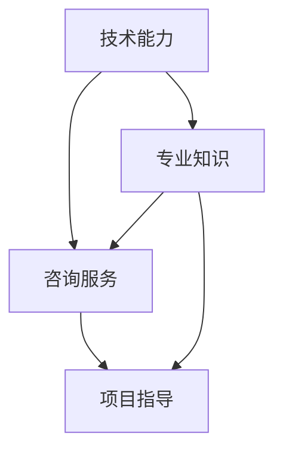

#### 1.2 技术顾问的就业前景

技术顾问的就业前景广阔，随着信息技术和数字化转型的不断推进，市场需求持续增长。以下是一些技术顾问就业前景的关键点：

- 行业需求：IT行业、金融、医疗、制造等多个行业都需要技术顾问的服务。
- 职业趋势：远程工作、自由职业的趋势为技术顾问提供了更多机会。
- 发展空间：技术顾问可以向上发展，成为高级顾问、技术总监或CTO。

**核心算法原理讲解：**
技术顾问的就业前景与以下几个因素密切相关：

- 技术更新速度：随着新技术不断涌现，技术顾问需要持续学习以保持竞争力。
- 行业需求变化：不同行业对技术顾问的需求有所不同，需要关注行业动态。
- 职业经验：丰富的实践经验可以提升技术顾问的职业价值。

**数学模型和公式：**
$$
就业前景 = f(技术更新速度, 行业需求变化, 职业经验)
$$

**举例说明：**
随着人工智能和大数据技术的发展，数据分析技术顾问的需求大幅增加。这为具备相关技能的技术顾问提供了广阔的发展空间。

#### 1.3 成为技术顾问的必备条件

成为技术顾问需要满足以下条件：

- 技术能力：熟练掌握至少一门编程语言，了解常见的技术框架和工具。
- 专业知识：具备扎实的数据结构和算法基础，了解系统架构和数据库知识。
- 职业素养：具备良好的沟通能力、团队合作精神和解决问题的能力。

**核心概念与联系：**
技术顾问的必备条件可以从以下几个方面进行理解：

- 技术能力：技术顾问需要具备解决实际问题的能力。
- 专业知识：技术顾问需要了解不同领域的技术和应用。
- 职业素养：技术顾问需要具备良好的职业道德和职业态度。

**Mermaid 流程图：**
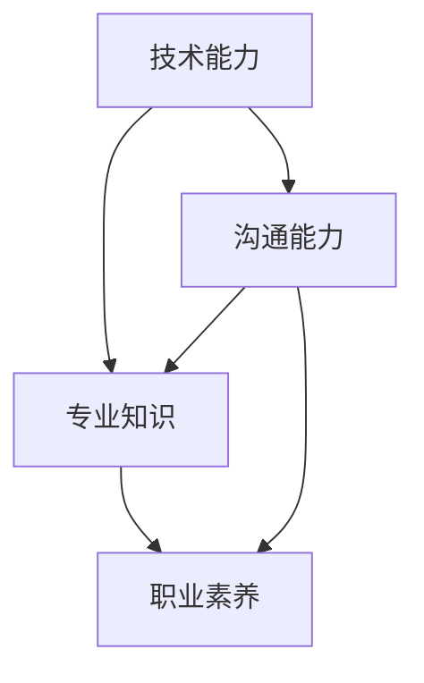

**伪代码：**
```python
def become_technical_advisor():
    # 检查技术能力
    if has_technical_ability():
        print("技术能力满足要求")
    else:
        print("需要提升技术能力")

    # 检查专业知识
    if has_professional_knowledge():
        print("专业知识满足要求")
    else:
        print("需要补充专业知识")

    # 检查职业素养
    if has_professional_eteiquette():
        print("职业素养满足要求")
    else:
        print("需要提高职业素养")

    print("成为技术顾问的条件满足")
```

通过以上步骤，我们可以清楚地了解如何成为技术顾问所需满足的条件。

### 总结
本章节介绍了技术顾问的定义、就业前景和成为技术顾问的必备条件。技术顾问作为高薪兼职的选择，具有广阔的就业前景和良好的职业发展空间。通过持续学习和不断提升自己的技术能力，个人可以在这个领域中获得丰厚的回报。

---

### 第2章：技术顾问的分类与领域

#### 2.1 技术顾问的主要领域

技术顾问的工作领域广泛，涵盖了软件开发、数据分析、人工智能、云计算和网络安全等多个领域。以下是对这些领域的基本概述：

- **软件开发**：涉及应用程序和系统的设计、开发、测试和部署。软件开发技术顾问通常专注于特定编程语言、框架和工具，如Java、Python、Spring Boot等。
- **数据分析**：涉及数据收集、处理、分析和可视化。数据分析技术顾问需要熟练使用数据分析工具，如Python的Pandas库、R语言等，以及数据库技术。
- **人工智能**：涉及机器学习、深度学习、自然语言处理和计算机视觉。人工智能技术顾问需要掌握相关的算法和技术，如TensorFlow、PyTorch等。
- **云计算**：涉及云计算平台的使用、部署和管理。云计算技术顾问需要熟悉AWS、Azure、Google Cloud等云服务。
- **网络安全**：涉及网络安全策略、风险评估、威胁分析和漏洞修复。网络安全技术顾问需要了解网络防御技术、加密和身份验证等。

**核心概念与联系：**
技术顾问的主要领域可以从以下几个方面进行理解：

- 技术专长：每个领域都需要特定的技术专长和知识。
- 应用场景：技术顾问的工作与业务需求密切相关，需要解决实际问题。
- 发展趋势：随着技术的不断进步，技术顾问的领域也在不断扩展。

**Mermaid 流程图：**
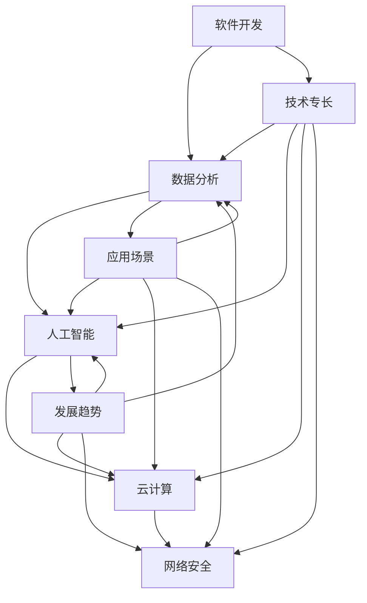

#### 2.2 技术顾问的职业发展路径

技术顾问的职业发展路径通常分为以下几个阶段：

- **初级技术顾问**：初级技术顾问通常负责项目的具体实施，如编码、测试和部署。他们需要积累实践经验，提高技术水平。
- **中级技术顾问**：中级技术顾问开始参与项目的设计和架构规划，负责技术难题的解决和团队协作。他们需要具备较强的沟通能力和解决问题的能力。
- **高级技术顾问**：高级技术顾问负责整体项目的规划和指导，包括技术方案的选择、项目管理和团队领导。他们通常具有丰富的行业经验和深厚的技术积累。

**核心概念与联系：**
技术顾问的职业发展路径可以从以下几个方面进行理解：

- 技术能力的提升：从初级到高级，技术顾问需要不断提高自己的技术能力和知识水平。
- 职责的扩展：随着经验的积累，技术顾问的职责也从执行层向管理层扩展。
- 职业成就：高级技术顾问在职业成就和影响力上都有显著提升。

**Mermaid 流程图：**
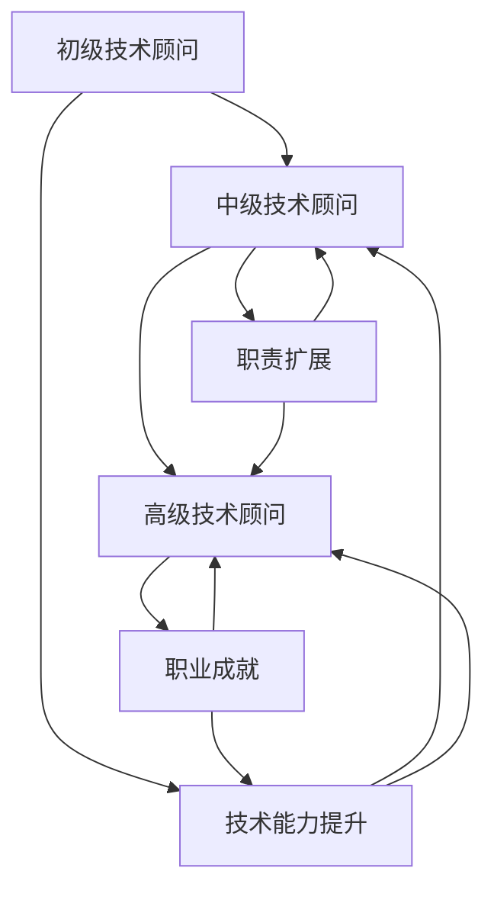

**伪代码：**
```python
class TechnicalAdvisor:
    def __init__(self):
        self.experience = "初级"
    
    def upgrade_experience(self):
        if self.experience == "初级":
            self.experience = "中级"
            print("升级为中级技术顾问")
        elif self.experience == "中级":
            self.experience = "高级"
            print("升级为高级技术顾问")
        else:
            print("已经是高级技术顾问")

    def work(self):
        if self.experience == "初级":
            print("执行具体项目任务")
        elif self.experience == "中级":
            print("参与项目设计和架构规划")
        elif self.experience == "高级":
            print("负责整体项目规划和指导")
```

#### 2.3 不同领域技术顾问的职责差异

不同领域的技术顾问在职责上有明显的差异：

- **软件开发技术顾问**：主要负责软件设计和开发，确保系统的稳定性和性能。
- **数据分析技术顾问**：负责数据分析和报告，提供商业洞察和决策支持。
- **人工智能技术顾问**：专注于人工智能算法和应用的开发，提供智能解决方案。
- **云计算技术顾问**：负责云服务的规划、部署和管理，确保系统的安全性和高效性。
- **网络安全技术顾问**：负责网络安全策略的实施和监控，保护系统免受攻击。

**核心概念与联系：**
不同领域技术顾问的职责差异可以从以下几个方面进行理解：

- 技术背景：不同领域的顾问需要具备不同的技术背景和知识。
- 工作内容：不同领域的顾问工作内容有所不同，但都需要解决实际的技术问题。
- 业务需求：不同领域的顾问需要满足不同的业务需求，提供专业的技术支持。

**Mermaid 流程图：**
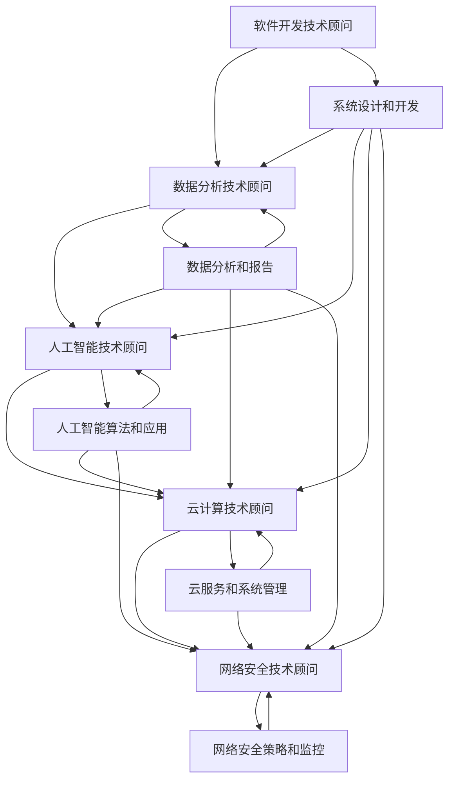

**举例说明：**
软件开发技术顾问在项目中需要确保系统的可扩展性和可靠性，而数据分析技术顾问则需要通过分析大量数据，为业务决策提供有力支持。这两种角色在职责上有很大的不同，但都需要深厚的专业技术知识。

### 总结
本章节介绍了技术顾问的主要领域、职业发展路径以及不同领域技术顾问的职责差异。技术顾问作为一个多元化的职业，每个领域都有其独特的技术要求和职业发展路径。通过深入了解不同领域的特点和需求，技术顾问可以更好地定位自己的职业发展方向，提高自身的竞争力。

---

### 第3章：软件开发与编程

#### 3.1 软件开发技术概述

软件开发是一个复杂的过程，涉及多个阶段和技术领域。以下是软件开发的概述：

- **需求分析**：确定软件的功能和性能需求，通常通过用户调研和需求文档来完成。
- **系统设计**：根据需求分析的结果，设计软件的系统架构和组件，包括数据模型、接口设计和模块划分。
- **编码**：根据设计文档编写源代码，实现软件的功能和性能。
- **测试**：对软件进行各种类型的测试，包括单元测试、集成测试、系统测试和验收测试，以确保软件的质量。
- **部署**：将软件部署到生产环境，进行实际运行，并提供维护和更新服务。

**核心概念与联系：**
软件开发的过程可以分为以下几个核心概念：

- **需求分析**：确定软件的核心功能和用户需求。
- **系统设计**：设计软件的结构和功能模块。
- **编码**：实现软件的代码。
- **测试**：验证软件的正确性和性能。
- **部署**：将软件投入使用。

**Mermaid 流程图：**
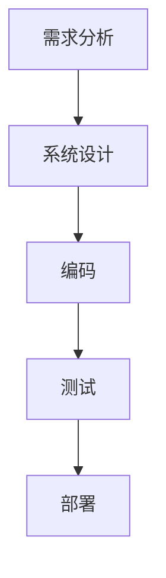

**伪代码：**
```python
class SoftwareDevelopment:
    def __init__(self):
        self.stage = "需求分析"

    def next_stage(self):
        if self.stage == "需求分析":
            self.stage = "系统设计"
        elif self.stage == "系统设计":
            self.stage = "编码"
        elif self.stage == "编码":
            self.stage = "测试"
        elif self.stage == "测试":
            self.stage = "部署"
        print(f"当前阶段：{self.stage}")

    def complete_stage(self):
        if self.stage == "部署":
            print("软件开发完成")
        else:
            self.next_stage()

development = SoftwareDevelopment()
development.complete_stage()
```

#### 3.2 软件开发领域的高薪兼职职位

软件开发领域的高薪兼职职位包括但不限于以下几种：

- **软件工程师**：负责编写和实现软件功能，解决技术问题。
- **系统架构师**：负责软件系统的整体架构设计，确保系统的可扩展性和性能。
- **数据库管理员**：管理和维护数据库系统，确保数据的完整性和安全性。
- **前端工程师**：负责用户界面设计和实现，确保用户体验。
- **后端工程师**：负责服务器端的应用开发，确保系统的稳定性和可靠性。

**核心概念与联系：**
软件开发领域的高薪兼职职位可以从以下几个方面进行理解：

- **技术能力**：每个职位都有特定的技术要求和专长。
- **职责**：不同职位在软件开发过程中的职责和贡献不同。
- **职业发展**：每个职位都是职业发展的一个阶段，高级职位通常需要更多的经验和专业知识。

**Mermaid 流程图：**
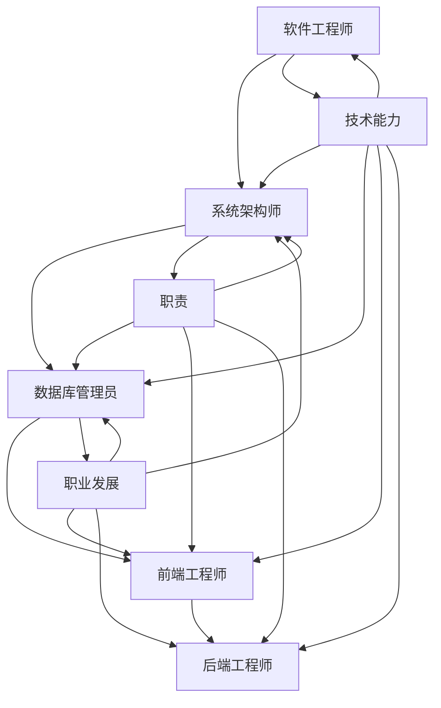

**举例说明：**
一个软件工程师可能需要掌握多种编程语言，如Java、Python和JavaScript，并熟悉常用的开发框架和工具，如Spring Boot和React。而系统架构师则需要具备更深入的技术理解和架构设计能力，能够设计复杂的分布式系统。

#### 3.3 软件开发项目实战

以下是一个简单的软件开发项目实战，包括项目需求分析、设计、编码和测试的步骤。

**项目需求分析：**
项目目标是开发一个简单的博客系统，具有以下功能：
- 用户注册和登录
- 发布博客文章
- 显示博客文章列表
- 博客文章的评论功能

**项目设计：**
系统架构采用MVC（Model-View-Controller）模式，主要包括以下模块：
- 模型（Model）：负责处理业务逻辑和数据存储，如用户、博客文章和评论的数据模型。
- 视图（View）：负责用户界面展示，如登录页面、注册页面和博客列表页面。
- 控制器（Controller）：负责处理用户请求，调用模型进行数据操作，并返回视图。

**编码实现：**
以下是一个简单的用户注册功能的伪代码实现：

```java
// 用户注册
public void registerUser(String username, String password) {
    // 验证用户名和密码的有效性
    if (isValid(username, password)) {
        // 存储用户信息到数据库
        database.saveUser(username, password);
        System.out.println("用户注册成功");
    } else {
        System.out.println("用户注册失败：无效的用户名或密码");
    }
}

// 验证用户名和密码的有效性
public boolean isValid(String username, String password) {
    // 检查用户名是否为空或超过长度限制
    if (username.isEmpty() || username.length() > 50) {
        return false;
    }
    // 检查密码是否为空或超过长度限制
    if (password.isEmpty() || password.length() > 100) {
        return false;
    }
    // 检查用户名是否已存在
    if (database.isUserExists(username)) {
        return false;
    }
    return true;
}
```

**测试：**
测试包括单元测试、集成测试和系统测试。以下是单元测试的一个简单示例：

```java
@Test
public void testRegisterUser_ValidCredentials() {
    // 测试有效的用户名和密码
    assertTrue(sut.isValid("testuser", "password123"));
}

@Test
public void testRegisterUser_InvalidUsername() {
    // 测试无效的用户名
    assertFalse(sut.isValid("", "password123"));
}

@Test
public void testRegisterUser_InvalidPassword() {
    // 测试无效的密码
    assertFalse(sut.isValid("testuser", ""));
}

@Test
public void testRegisterUser_ExistingUsername() {
    // 测试已存在的用户名
    database.saveUser("testuser", "password123");
    assertFalse(sut.isValid("testuser", "password123"));
}
```

**部署：**
项目完成后，需要将其部署到服务器上，以便用户可以访问和使用。部署步骤通常包括以下内容：
- 搭建运行环境，如Java运行时环境。
- 配置数据库，如MySQL。
- 部署应用程序，如通过Tomcat部署Web应用。
- 测试部署后的应用程序，确保其正常运行。

**总结**
本章节介绍了软件开发技术的概述、高薪兼职职位以及一个简单的项目实战。通过了解软件开发的基本流程和实际案例，读者可以更好地理解软件开发领域的知识和技能。

---

### 第4章：数据分析与大数据

#### 4.1 数据分析技术基础

数据分析是利用统计学、计算机科学和领域知识从数据中提取有价值信息的过程。以下是数据分析技术的基础：

- **数据收集**：通过各种渠道收集数据，如数据库、日志文件、传感器等。
- **数据清洗**：处理和清洗原始数据，确保数据的质量和一致性。
- **数据存储**：将数据存储到合适的存储系统中，如关系数据库、NoSQL数据库、数据仓库等。
- **数据处理**：使用数据处理工具，如Python的Pandas库、R语言等，对数据进行计算和转换。
- **数据分析**：应用统计方法和算法，对数据进行分析和挖掘，提取有价值的信息。
- **数据可视化**：使用图表、仪表盘等工具，将分析结果以直观的形式展示。

**核心概念与联系：**
数据分析技术可以从以下几个方面进行理解：

- **数据质量**：数据清洗和存储的目的是确保数据的质量。
- **数据处理和转换**：数据处理工具用于对大量数据进行计算和转换。
- **统计分析**：统计方法和算法用于分析数据，提取有价值的信息。
- **数据可视化**：数据可视化使分析结果更易于理解和传达。

**Mermaid 流程图：**
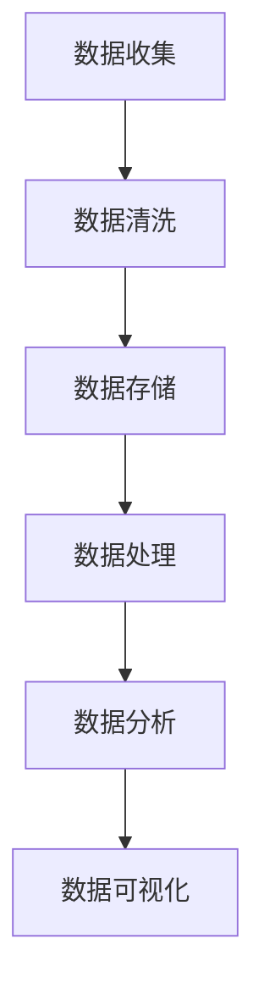

**伪代码：**
```python
def data_analysis(data):
    # 数据清洗
    clean_data = clean_data(data)
    
    # 数据处理
    processed_data = process_data(clean_data)
    
    # 数据分析
    analysis_results = analyze_data(processed_data)
    
    # 数据可视化
    visualize_data(analysis_results)
```

#### 4.2 数据分析领域的高薪兼职职位

数据分析领域的高薪兼职职位包括但不限于以下几种：

- **数据分析师**：负责收集、清洗和分析数据，提供数据驱动的业务洞察。
- **数据工程师**：负责构建和优化数据管道，确保数据的可靠性和高效性。
- **数据科学家**：负责开发复杂的分析模型和算法，解决业务问题。
- **机器学习工程师**：专注于机器学习算法的应用和优化，构建智能系统。
- **商业智能分析师**：负责使用数据分析工具，为管理层提供业务决策支持。

**核心概念与联系：**
数据分析领域的高薪兼职职位可以从以下几个方面进行理解：

- **技术能力**：每个职位都有特定的技术要求，如编程语言、数据分析工具等。
- **职责**：不同职位在数据分析过程中承担不同的职责。
- **职业发展**：随着经验的积累，数据分析师可以逐步晋升为高级职位。

**Mermaid 流�程图：**
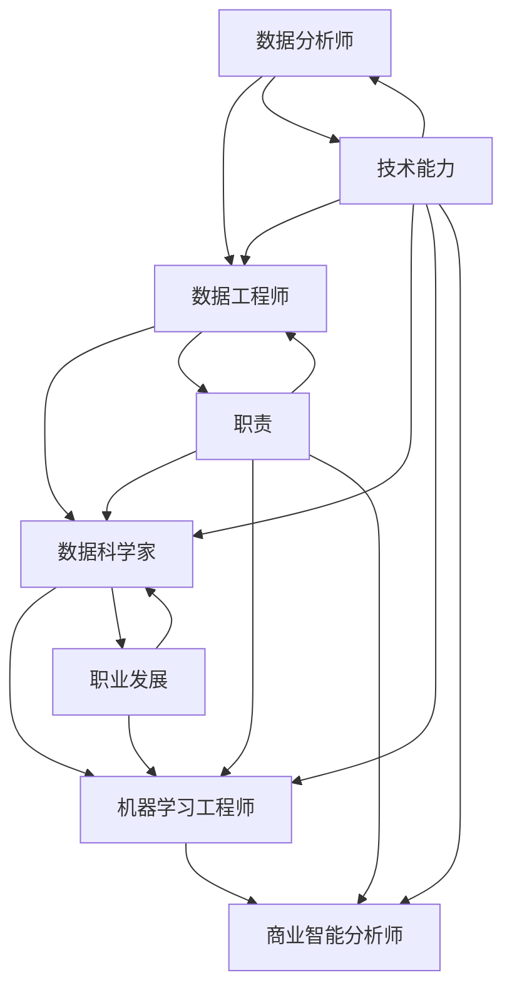

**举例说明：**
一个数据分析师可能需要使用Python的Pandas库进行数据处理，使用R语言进行统计分析，并使用Tableau进行数据可视化。而数据科学家则需要具备更深入的数学和统计知识，能够开发复杂的机器学习模型。

#### 4.3 大数据项目实战

以下是一个简单的大数据项目实战，包括数据收集、处理、分析和可视化。

**项目需求分析：**
项目目标是分析一个电子商务平台上的用户购买行为，提取有价值的业务洞察。

**数据收集：**
收集的数据包括用户ID、购买时间、商品ID、购买数量和价格。

**数据处理：**
使用Python的Pandas库进行数据处理，包括数据清洗、数据转换和数据聚合。

```python
import pandas as pd

# 读取数据
data = pd.read_csv("ecommerce_data.csv")

# 数据清洗
data.dropna(inplace=True)
data = data[data["quantity"] > 0]

# 数据转换
data["timestamp"] = pd.to_datetime(data["timestamp"])
data["day_of_week"] = data["timestamp"].dt.dayofweek

# 数据聚合
daily_sales = data.groupby(["day_of_week", "商品ID"])["quantity"].sum().reset_index()
```

**数据分析：**
使用统计分析方法，分析用户购买行为，提取业务洞察。

```python
import matplotlib.pyplot as plt

# 平均每日销售额
average_sales = daily_sales.groupby("day_of_week")["quantity"].mean()

# 绘制图表
plt.figure(figsize=(10, 6))
average_sales.plot()
plt.title("平均每日销售额")
plt.xlabel("星期")
plt.ylabel("销售额")
plt.show()
```

**数据可视化：**
使用Matplotlib绘制图表，展示数据分析结果。

```python
# 最畅销的商品
top_products = daily_sales.groupby("商品ID")["quantity"].sum().nlargest(10)

# 绘制图表
plt.figure(figsize=(12, 6))
top_products.plot(kind="barh")
plt.title("最畅销的商品")
plt.xlabel("销售额")
plt.ylabel("商品ID")
plt.show()
```

**总结**
本章节介绍了数据分析与大数据技术的基础、高薪兼职职位以及一个简单的项目实战。通过了解数据分析的过程和技术，读者可以更好地应用这些技能解决实际业务问题。

---

### 第5章：人工智能与机器学习

#### 5.1 人工智能技术概述

人工智能（AI）是指计算机系统模拟人类智能行为的技术。它包括多个子领域，如机器学习、深度学习、自然语言处理和计算机视觉。以下是人工智能技术的基本概述：

- **机器学习**：通过算法让计算机从数据中学习，自动改进性能。常用的算法包括决策树、支持向量机和神经网络。
- **深度学习**：一种特殊的机器学习方法，使用多层神经网络模拟人脑的神经元连接结构，具有强大的表征能力和学习能力。
- **自然语言处理**（NLP）：使计算机能够理解和生成自然语言的技术，包括文本分类、语义理解和机器翻译。
- **计算机视觉**：使计算机能够理解和处理图像和视频的技术，包括图像分类、目标检测和图像生成。

**核心概念与联系：**
人工智能技术可以从以下几个方面进行理解：

- **算法**：机器学习和深度学习是人工智能的核心算法。
- **应用**：自然语言处理和计算机视觉是人工智能在具体领域的应用。
- **数据**：大量的数据是训练人工智能模型的基础。

**Mermaid 流程图：**
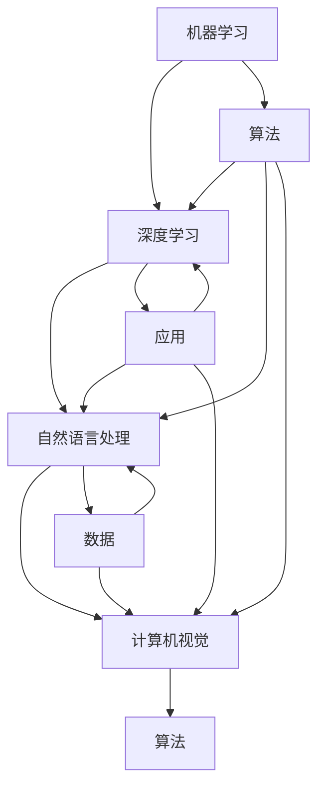

**伪代码：**
```python
class ArtificialIntelligence:
    def __init__(self):
        self.algorithms = ["机器学习", "深度学习", "自然语言处理", "计算机视觉"]
    
    def use_algorithms(self):
        for algorithm in self.algorithms:
            print(f"使用{algorithm}算法")
```

#### 5.2 人工智能领域的高薪兼职职位

人工智能领域的高薪兼职职位包括但不限于以下几种：

- **机器学习工程师**：设计和实现机器学习算法，解决实际问题。
- **深度学习工程师**：专注于深度学习模型的设计、训练和优化。
- **自然语言处理工程师**：开发自然语言处理模型，如机器翻译、情感分析等。
- **计算机视觉工程师**：开发计算机视觉模型，如图像识别、目标检测等。
- **人工智能顾问**：提供专业的AI咨询，帮助客户制定AI战略和实施计划。

**核心概念与联系：**
人工智能领域的高薪兼职职位可以从以下几个方面进行理解：

- **技术能力**：每个职位都需要特定的技术能力和专业知识。
- **应用场景**：不同职位在人工智能的不同领域和应用中发挥作用。
- **职业发展**：高级职位通常需要更多的经验和技术积累。

**Mermaid 流程图：**
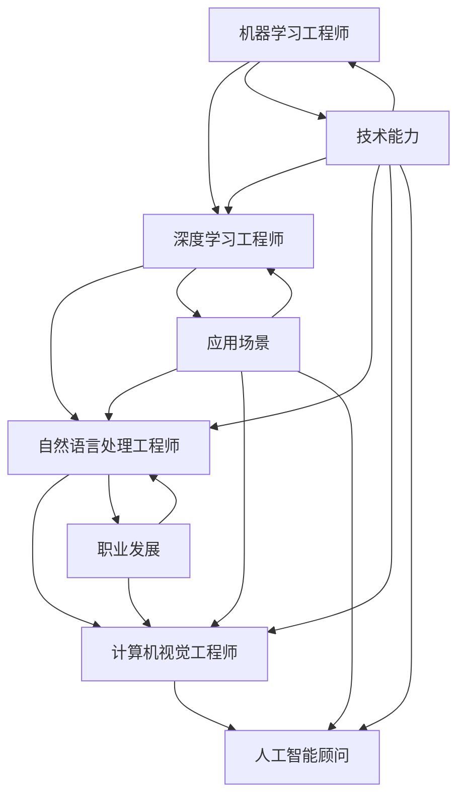

**举例说明：**
一个机器学习工程师可能需要掌握Python、TensorFlow和Scikit-learn等工具，并熟悉各种机器学习算法。而深度学习工程师则需要深入了解神经网络和深度学习模型，如卷积神经网络（CNN）和循环神经网络（RNN）。

#### 5.3 人工智能项目实战

以下是一个简单的人工智能项目实战，包括数据收集、预处理、模型训练和评估。

**项目需求分析：**
项目目标是使用机器学习算法预测股票价格，为投资者提供参考。

**数据收集：**
收集了包含股票价格、交易量、开盘价、收盘价等指标的历史数据。

**数据预处理：**
使用Python的Pandas库进行数据预处理，包括数据清洗、特征工程和归一化。

```python
import pandas as pd
from sklearn.preprocessing import MinMaxScaler

# 读取数据
data = pd.read_csv("stock_data.csv")

# 数据清洗
data.dropna(inplace=True)

# 特征工程
data["price_diff"] = data["close"] - data["open"]
data["volume_diff"] = data["volume"] - data["prev_volume"]

# 归一化
scaler = MinMaxScaler()
data[["open", "close", "high", "low", "volume", "price_diff", "volume_diff"]] = scaler.fit_transform(data[["open", "close", "high", "low", "volume", "price_diff", "volume_diff"]])
```

**模型训练：**
使用Python的Scikit-learn库训练一个线性回归模型，预测股票价格。

```python
from sklearn.linear_model import LinearRegression
from sklearn.model_selection import train_test_split

# 分割数据
X = data.drop("close", axis=1)
y = data["close"]
X_train, X_test, y_train, y_test = train_test_split(X, y, test_size=0.2, random_state=42)

# 训练模型
model = LinearRegression()
model.fit(X_train, y_train)

# 评估模型
score = model.score(X_test, y_test)
print(f"模型准确度：{score:.2f}")
```

**模型评估：**
使用Python的Matplotlib库绘制预测结果和实际结果的对比图。

```python
import matplotlib.pyplot as plt

# 预测股票价格
y_pred = model.predict(X_test)

# 绘制图表
plt.figure(figsize=(10, 6))
plt.plot(y_test, label="实际价格")
plt.plot(y_pred, label="预测价格")
plt.title("股票价格预测")
plt.xlabel("时间")
plt.ylabel("价格")
plt.legend()
plt.show()
```

**总结**
本章节介绍了人工智能技术概述、高薪兼职职位以及一个简单的项目实战。通过了解人工智能的基本概念和技术，读者可以更好地应用这些知识解决实际问题。

---

### 第6章：云计算与网络安全

#### 6.1 云计算技术基础

云计算是一种通过互联网提供计算资源（如服务器、存储、网络）的服务模式。以下是云计算技术的基础：

- **云计算服务模式**：包括基础设施即服务（IaaS）、平台即服务（PaaS）和软件即服务（SaaS）。
- **云计算架构**：包括前端（客户端）、网络、云基础设施和后端（服务器）。
- **云服务提供商**：如Amazon Web Services（AWS）、Microsoft Azure和Google Cloud Platform（GCP）。
- **云计算优势**：包括灵活性、可扩展性、成本效益和弹性。

**核心概念与联系：**
云计算技术可以从以下几个方面进行理解：

- **服务模式**：了解不同服务模式的特点和应用场景。
- **架构**：了解云计算的体系结构和各个组件的作用。
- **服务提供商**：选择适合自己需求的云服务提供商。
- **优势**：了解云计算带来的优势，为自己的业务选择合适的云计算解决方案。

**Mermaid 流程图：**
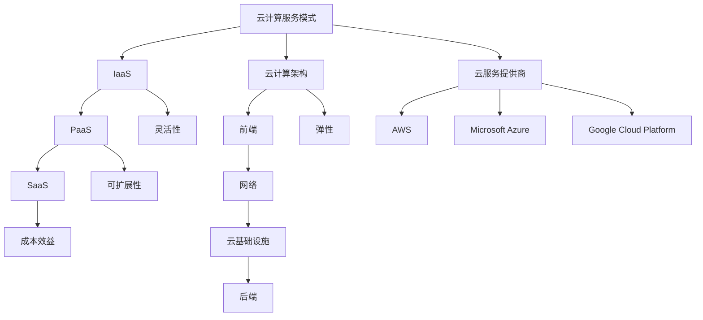

**伪代码：**
```python
class CloudService:
    def __init__(self, service_model, architecture, provider):
        self.service_model = service_model
        self.architecture = architecture
        self.provider = provider
    
    def display_details(self):
        print(f"服务模式：{self.service_model}")
        print(f"架构：{self.architecture}")
        print(f"服务提供商：{self.provider}")
```

#### 6.2 云计算领域的高薪兼职职位

云计算领域的高薪兼职职位包括但不限于以下几种：

- **云计算工程师**：负责云基础设施的部署、配置和管理。
- **云架构师**：负责云架构的设计、优化和实施。
- **云安全管理员**：负责云环境的安全策略、监控和漏洞修复。
- **容器化工程师**：负责容器化技术的实施和优化，如Docker和Kubernetes。
- **云运维工程师**：负责云环境下的运维工作，确保系统稳定运行。

**核心概念与联系：**
云计算领域的高薪兼职职位可以从以下几个方面进行理解：

- **技术能力**：每个职位都需要特定的技术能力，如编程语言、云计算平台和工具等。
- **职责**：不同职位在云计算的不同环节中承担不同的职责。
- **职业发展**：随着经验的积累，云计算工程师可以逐步晋升为高级职位。

**Mermaid 流程图：**
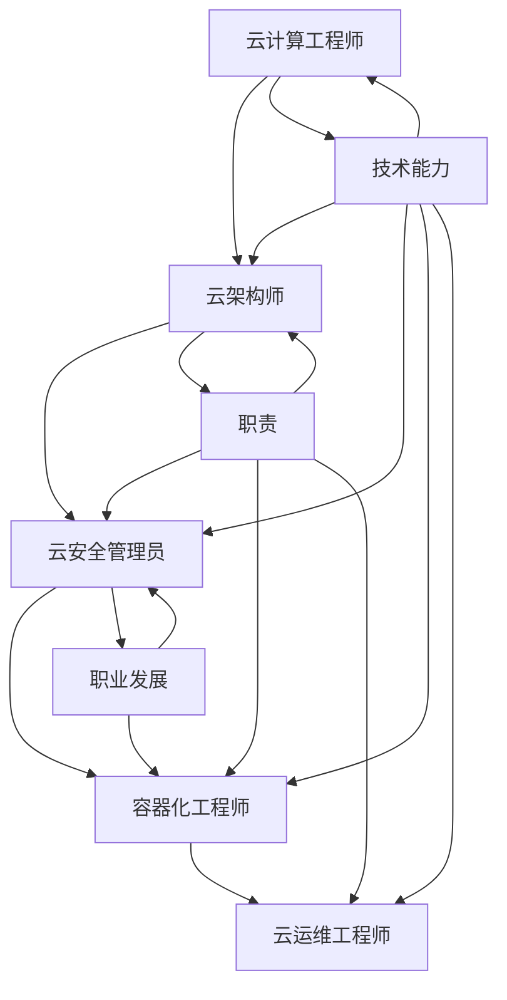

**举例说明：**
一个云计算工程师可能需要掌握AWS或Azure等云服务提供商的API，熟悉Docker和Kubernetes等容器化技术，并能使用Python、Shell等编程语言进行自动化脚本编写。而云架构师则需要具备更深入的系统设计和架构优化能力，能够设计复杂的分布式系统。

#### 6.3 云计算与网络安全项目实战

以下是一个简单的云计算与网络安全项目实战，包括云计算环境搭建、安全策略配置和漏洞扫描。

**项目需求分析：**
项目目标是在AWS上搭建一个安全的云服务器，并配置相应的安全策略和漏洞扫描工具。

**云计算环境搭建：**
使用AWS Management Console创建一个EC2实例，并配置网络和安全组。

**安全策略配置：**
配置AWS WAF（Web应用防火墙），以保护Web应用程序免受常见攻击，如SQL注入和跨站脚本攻击。

**漏洞扫描：**
使用AWS Inspector进行自动漏洞扫描，识别服务器上的安全漏洞。

```shell
# 创建EC2实例
aws ec2 run-instances --image-id ami-0abcdef1234567890 --instance-type t2.micro --security-group-ids sg-0abcdef1234567890

# 配置AWS WAF
aws waf create-web-acl --name "my-waf" --subnet-ids subnet-0abcdef1234567890 --rule-group-arn "arn:aws:wafv2:region:account-id:rulegroup/web/my-rule-group"

# 启用AWS Inspector
aws inspector enable --resource-arn "arn:aws:ec2:region:account-id:instance/instance-id"
```

**安全策略配置示例：**
配置安全组规则，允许入站HTTP和HTTPS流量，并阻止其他所有流量。

```shell
# 配置安全组规则
aws ec2 create-security-group-rule --group-id sg-0abcdef1234567890 --ip-permissions [
    {
        "IpProtocol": "tcp",
        "FromPort": 80,
        "ToPort": 80,
        "IpRange": "0.0.0.0/0"
    },
    {
        "IpProtocol": "tcp",
        "FromPort": 443,
        "ToPort": 443,
        "IpRange": "0.0.0.0/0"
    },
    {
        "IpProtocol": "tcp",
        "FromPort": -1,
        "ToPort": -1,
        "IpRange": "0.0.0.0/0"
    }
]
```

**漏洞扫描结果分析：**
使用AWS Inspector查看漏洞扫描结果，并根据发现的安全漏洞进行修复。

```shell
# 查看漏洞扫描结果
aws inspector list-findings

# 根据漏洞修复建议进行修复
aws inspector apply-findings --finding-arns "arn:aws:inspector:region:account-id:finding/finding-id"
```

**总结**
本章节介绍了云计算与网络安全技术的基础、高薪兼职职位以及一个简单的项目实战。通过了解云计算和网络安全的基本概念和技术，读者可以更好地应对实际工作中的挑战，确保云环境的安全性。

---

### 第7章：技术顾问的成功经验

#### 7.1 技术顾问的职业规划

职业规划对于技术顾问的成功至关重要。以下是一个典型的职业规划路径：

- **初级阶段**：在初级阶段，技术顾问需要专注于提升技术能力，熟悉基本的技术框架和工具。通过参与实际项目，积累实践经验。
- **中级阶段**：在成为中级技术顾问后，需要开始关注项目的设计和架构规划，提升解决复杂技术问题的能力。同时，需要提高沟通和团队合作能力。
- **高级阶段**：作为高级技术顾问，需要具备全面的技术视野和项目管理能力。负责整体项目的规划、指导和决策。在这个阶段，可能需要管理团队和多个项目。

**核心概念与联系：**
职业规划可以从以下几个方面进行理解：

- **技术能力**：不断提升技术能力和知识水平。
- **沟通能力**：提高与团队和客户的沟通能力。
- **项目管理**：学习项目管理方法和工具，提升项目管理能力。

**Mermaid 流程图：**
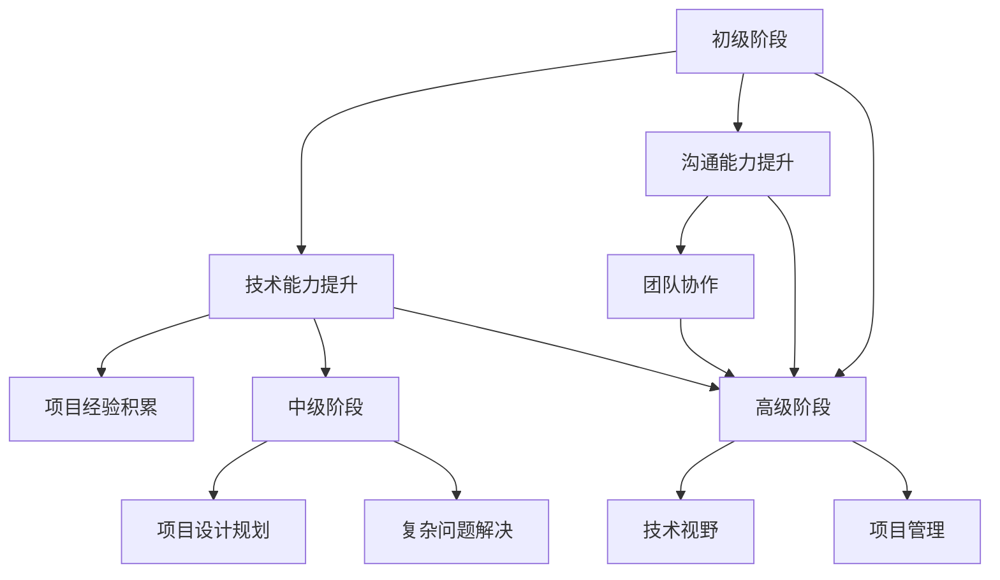

**伪代码：**
```python
class CareerPlanning:
    def __init__(self, stage):
        self.stage = stage
    
    def upgrade_stage(self):
        if self.stage == "初级":
            self.stage = "中级"
            print("升级为中级技术顾问")
        elif self.stage == "中级":
            self.stage = "高级"
            print("升级为高级技术顾问")
        else:
            print("已经是高级技术顾问")

    def work(self):
        if self.stage == "初级":
            print("提升技术能力，积累项目经验")
        elif self.stage == "中级":
            print("关注项目设计规划，解决复杂问题")
        elif self.stage == "高级":
            print("提升技术视野，进行项目管理")
```

**举例说明：**
一位初级技术顾问可能会专注于学习Java编程语言和Spring框架，通过参与实际的软件开发项目来提升自己的技术水平。而作为高级技术顾问，他则需要关注整个系统的架构设计，负责项目的整体规划和指导。

#### 7.2 技术顾问的个人品牌建设

个人品牌建设对于技术顾问的职业发展至关重要。以下是一些关键步骤：

- **专业知识**：建立深厚的专业知识，成为领域内的专家。
- **专业分享**：通过博客、演讲、开源项目和在线课程分享专业知识，提升个人影响力。
- **社交媒体**：利用社交媒体平台（如LinkedIn、Twitter）建立专业网络，与他人交流经验。
- **专业认证**：获得相关领域的专业认证，提高自己的专业水平。

**核心概念与联系：**
个人品牌建设可以从以下几个方面进行理解：

- **专业知识**：专业知识的深度和广度是个人品牌的基础。
- **分享经验**：分享经验和知识可以提升个人影响力。
- **网络资源**：利用社交媒体和专业网络拓展人脉。
- **专业认证**：专业认证是个人专业水平的证明。

**Mermaid 流程图：**
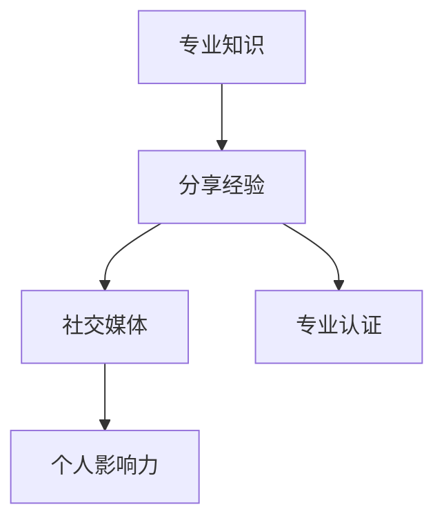

**伪代码：**
```python
class PersonalBrand:
    def __init__(self, knowledge, sharing, social_media, certification):
        self.knowledge = knowledge
        self.sharing = sharing
        self.social_media = social_media
        self.certification = certification
    
    def build_brand(self):
        print(f"专业知识：{self.knowledge}")
        print(f"分享经验：{self.sharing}")
        print(f"社交媒体：{self.social_media}")
        print(f"专业认证：{self.certification}")
```

**举例说明：**
一位技术顾问通过在GitHub上分享自己的开源项目，并在技术博客上撰写专业文章，逐渐建立起了自己的个人品牌。他在社交媒体上积极参与技术讨论，吸引了大量的关注者，从而提升了个人影响力。

#### 7.3 技术顾问的职业发展

技术顾问的职业发展可以从以下几个方面进行：

- **自我提升**：不断学习新技术和知识，提升自己的专业能力。
- **职业转换**：根据个人兴趣和市场需求，考虑职业转换，如从软件开发转向人工智能或数据分析。
- **管理岗位**：向管理层发展，如成为项目经理、技术经理或CTO。

**核心概念与联系：**
职业发展可以从以下几个方面进行理解：

- **自我提升**：不断提升自己的专业能力和知识水平。
- **职业转换**：根据市场需求和个人兴趣进行职业转换。
- **管理岗位**：提升管理能力和团队领导能力，向管理层发展。

**Mermaid 流程图：**
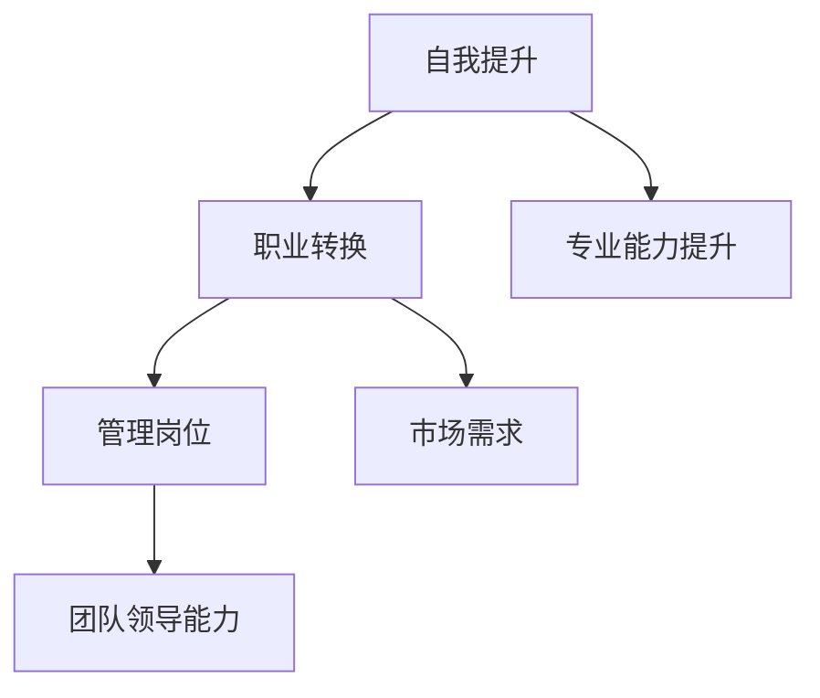

**伪代码：**
```python
class CareerDevelopment:
    def __init__(self, self Improvement, career_change, management_role):
        self.self_Improvement = self Improvement
        self.career_change = career_change
        self.management_role = management_role
    
    def develop_career(self):
        print(f"自我提升：{self.self_Improvement}")
        print(f"职业转换：{self.career_change}")
        print(f"管理岗位：{self.management_role}")
```

**举例说明：**
一位技术顾问通过不断学习新的编程语言和框架，提升了自己的专业能力。他根据市场需求和个人兴趣，从软件开发转向了人工智能领域。在积累了丰富的项目经验后，他开始向管理层发展，成为了一名项目经理，负责带领团队完成复杂的软件开发项目。

### 总结
本章节介绍了技术顾问的职业规划、个人品牌建设以及职业发展的途径。通过明确的职业规划和持续的个人品牌建设，技术顾问可以在职业道路上取得成功。同时，了解职业发展的多个途径，可以帮助技术顾问更好地规划自己的未来。

---

### 第8章：高薪兼职技术顾问的职业挑战与应对

#### 8.1 技术更新与持续学习

技术更新速度非常快，技术顾问需要不断学习以跟上行业的发展。以下是一些应对策略：

- **定期学习**：设定固定的学习时间，如每周至少学习一定小时数。
- **在线课程**：参加在线课程和研讨会，学习最新的技术和方法。
- **读书**：阅读相关书籍和文章，了解领域的最新进展。
- **实践**：通过实际项目或开源项目，将理论知识应用到实践中。

**核心概念与联系：**
技术更新与持续学习可以从以下几个方面进行理解：

- **学习资源**：包括在线课程、书籍、研讨会等。
- **学习方法**：通过定期学习和实践，不断提升自己的技术水平。
- **技术应用**：将新知识应用到实际项目中，提高解决问题的能力。

**Mermaid 流程图：**
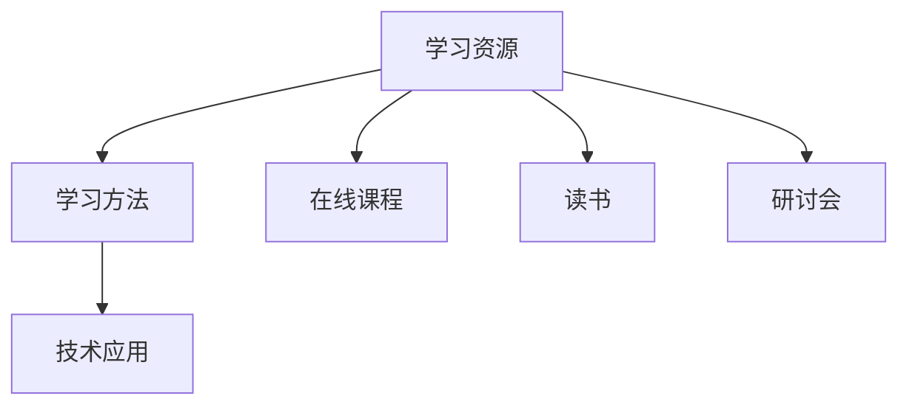

**伪代码：**
```python
class ContinuousLearning:
    def __init__(self, resources, methods, application):
        self.resources = resources
        self.methods = methods
        self.application = application
    
    def update_knowledge(self):
        print(f"学习资源：{self.resources}")
        print(f"学习方法：{self.methods}")
        print(f"技术应用：{self.application}")
```

**举例说明：**
一位技术顾问可能会每周参加一个在线课程，阅读一本技术书籍，并参与一个开源项目。通过这些活动，他能够不断更新自己的知识，并将其应用到实际工作中。

#### 8.2 时间管理与工作效率

有效的时间管理和工作效率对于技术顾问来说至关重要。以下是一些提高工作效率的策略：

- **任务优先级**：根据任务的重要性和紧急程度进行排序，优先完成重要且紧急的任务。
- **时间块安排**：将时间分成不同的块，专注于一个任务，避免多任务处理带来的效率降低。
- **自动化工具**：使用自动化工具和脚本减少重复性工作，如使用Git进行版本控制，使用Jenkins进行自动化部署。
- **定期休息**：合理安排休息时间，避免长时间工作导致的疲劳。

**核心概念与联系：**
时间管理与工作效率可以从以下几个方面进行理解：

- **任务管理**：合理分配时间和任务，提高工作效率。
- **自动化**：使用自动化工具减少重复性工作。
- **休息与恢复**：合理安排休息时间，保持高效的工作状态。

**Mermaid 流程图：**
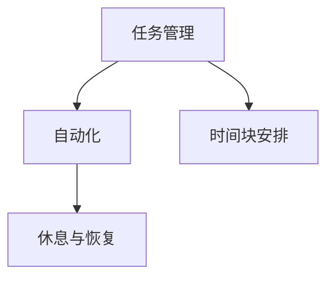

**伪代码：**
```python
class TimeManagement:
    def __init__(self, task_management, automation, rest_recovery):
        self.task_management = task_management
        self.automation = automation
        self.rest_recovery = rest_recovery
    
    def improve_efficiency(self):
        print(f"任务管理：{self.task_management}")
        print(f"自动化：{self.automation}")
        print(f"休息与恢复：{self.rest_recovery}")
```

**举例说明：**
一位技术顾问可能会使用项目管理工具（如Trello或Asana）来管理任务和优先级，使用Git进行版本控制，并在工作日中安排固定的休息时间。通过这些策略，他能够提高工作效率，更好地管理自己的时间。

#### 8.3 项目管理与沟通技巧

在兼职技术顾问的职业生涯中，项目管理与沟通技巧同样重要。以下是一些关键点：

- **需求管理**：确保充分理解客户的需求，制定详细的项目计划。
- **进度跟踪**：使用项目管理工具（如JIRA或Trello）跟踪项目进度，及时调整计划。
- **风险管理**：识别潜在的风险，制定相应的应对策略。
- **沟通技巧**：建立良好的沟通机制，确保项目团队成员之间信息畅通。

**核心概念与联系：**
项目管理与沟通技巧可以从以下几个方面进行理解：

- **需求管理**：确保项目目标的明确性和可行性。
- **进度跟踪**：确保项目按时按质完成。
- **风险管理**：预防潜在的问题和风险。
- **沟通技巧**：提高团队协作效率和项目成功率。

**Mermaid 流程图：**
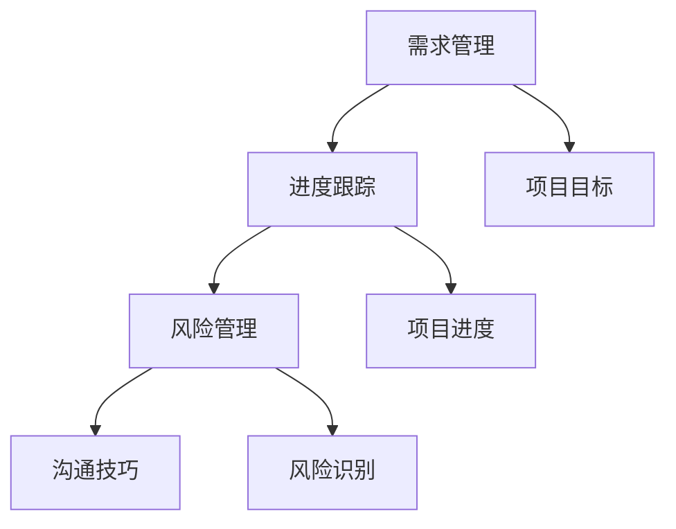

**伪代码：**
```python
class ProjectManagement:
    def __init__(self, requirement_management, progress_tracking, risk_management, communication_skills):
        self.requirement_management = requirement_management
        self.progress_tracking = progress_tracking
        self.risk_management = risk_management
        self.communication_skills = communication_skills
    
    def manage_project(self):
        print(f"需求管理：{self.requirement_management}")
        print(f"进度跟踪：{self.progress_tracking}")
        print(f"风险管理：{self.risk_management}")
        print(f"沟通技巧：{self.communication_skills}")
```

**举例说明：**
一位技术顾问可能会使用JIRA来管理项目需求和进度，定期与团队成员进行会议，确保所有成员都了解项目的最新进展和目标。同时，他会制定风险应对计划，以预防潜在的问题。

### 总结
本章节讨论了技术顾问在职业生涯中可能遇到的技术更新、时间管理和项目管理等职业挑战，并提供了一些有效的应对策略。通过持续学习、合理的时间管理和有效的项目管理，技术顾问可以在职业道路上取得更好的成果。

---

### 第9章：技术顾问兼职的准备工作

#### 9.1 硬件与软件环境搭建

在开始技术顾问的兼职工作之前，搭建一个高效的工作环境至关重要。以下是详细的硬件与软件环境搭建步骤：

**硬件环境搭建：**

1. **选择合适的计算机硬件**：
   - **CPU**：至少需要具备4核处理器，建议选择Intel i5或以上的CPU。
   - **内存**：至少8GB RAM，建议16GB以上以提升性能。
   - **硬盘**：至少256GB的SSD，推荐1TB SSD以提供足够的存储空间。
   - **显卡**：集成显卡即可，如果涉及图形处理和机器学习任务，建议配备独立显卡。

2. **选择合适的显示器**：
   - **分辨率**：至少1080p分辨率，推荐2K或4K显示器以获得更好的视觉效果。
   - **尺寸**：至少24英寸，建议27英寸以上以提供更大的工作空间。

3. **网络环境**：
   - **宽带**：至少100Mbps的宽带连接，推荐使用光纤宽带以确保网络稳定性。

**软件环境搭建：**

1. **操作系统**：
   - **Windows 10或更高版本**：适用于大部分开发工作。
   - **macOS**：适用于Apple产品的开发者。

2. **开发环境**：
   - **集成开发环境（IDE）**：如Visual Studio Code、IntelliJ IDEA、Eclipse等。
   - **数据库**：MySQL、PostgreSQL等关系数据库，或MongoDB、Cassandra等NoSQL数据库。
   - **版本控制**：Git，用于代码管理和版本跟踪。

3. **其他工具**：
   - **项目管理工具**：如Trello、JIRA等，用于任务和进度管理。
   - **文档工具**：如Microsoft Office、Google Docs等，用于文档撰写和协作。
   - **虚拟化工具**：如VMware Workstation、VirtualBox等，用于虚拟机的创建和管理。

**核心概念与联系：**
硬件与软件环境搭建可以从以下几个方面进行理解：

- **硬件配置**：确保硬件性能满足开发需求。
- **操作系统**：选择适合的开发操作系统。
- **开发环境**：搭建高效的开发环境，提高工作效率。
- **其他工具**：辅助工具的选择，提升工作效率。

**Mermaid 流程图：**
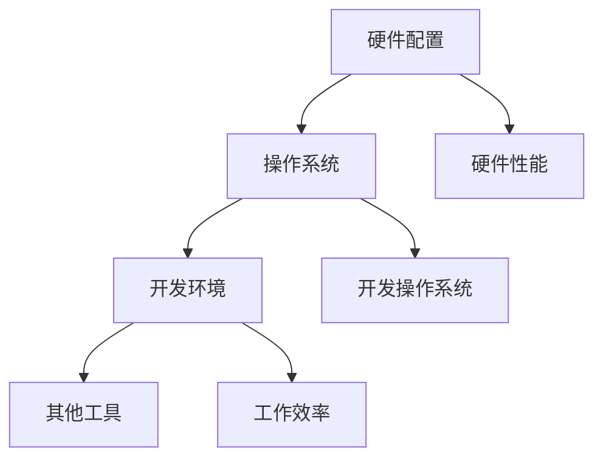

**伪代码：**
```python
def setup_environment(hardware_config, os_choice, dev_tools, additional_tools):
    # 硬件配置
    print(f"硬件配置：{hardware_config}")
    # 操作系统
    print(f"操作系统：{os_choice}")
    # 开发环境
    print(f"开发环境：{dev_tools}")
    # 其他工具
    print(f"其他工具：{additional_tools}")
```

**举例说明：**
一位技术顾问可能会选择一台具备i7处理器、16GB内存和1TB SSD的计算机，安装Windows 10操作系统，使用Visual Studio Code作为开发环境，并安装MySQL数据库。同时，他还会安装Trello用于项目管理，确保他的工作环境能够高效地支持各种开发需求。

#### 9.2 技术栈与工具选择

技术栈和工具的选择对于技术顾问的工作效率和质量至关重要。以下是技术栈与工具选择的相关要点：

**技术栈选择：**

1. **编程语言**：
   - **通用语言**：如Java、Python、JavaScript等。
   - **领域特定语言**：如R（数据分析）、Go（系统编程）等。

2. **框架和库**：
   - **前端**：如React、Vue.js、Angular等。
   - **后端**：如Spring Boot、Django、Express等。
   - **数据库**：如MySQL、PostgreSQL、MongoDB等。

3. **云服务**：
   - **AWS、Azure、Google Cloud**：提供广泛的云服务，如计算、存储、数据库、机器学习等。

**工具选择：**

1. **版本控制**：
   - **Git**：用于代码管理和协作。

2. **集成开发环境（IDE）**：
   - **Visual Studio Code**、**IntelliJ IDEA**、**Eclipse**等。

3. **项目管理工具**：
   - **Trello**、**JIRA**、**Asana**等。

4. **持续集成与持续部署（CI/CD）**：
   - **Jenkins**、**GitLab CI**、**CircleCI**等。

5. **调试和性能分析工具**：
   - **Postman**、**Wireshark**、**VisualVM**等。

**核心概念与联系：**
技术栈与工具选择可以从以下几个方面进行理解：

- **技术栈**：选择合适的技术栈，以满足不同项目需求。
- **工具**：选择合适的工具，提高工作效率。

**Mermaid 流程图：**
```mermaid
graph TD
    A[技术栈] --> B[编程语言]
    B --> C[框架和库]
    C --> D[云服务]
    A --> E[工具]
    E --> F[版本控制]
    E --> G[IDE]
    E --> H[项目管理工具]
    E --> I[CI/CD工具]
    E --> J[调试工具]
```

**伪代码：**
```python
class TechStack:
    def __init__(self, programming_languages, frameworks_libraries, cloud_services, tools):
        self.programming_languages = programming_languages
        self.frameworks_libraries = frameworks_libraries
        self.cloud_services = cloud_services
        self.tools = tools
    
    def select_stack(self):
        print(f"编程语言：{self.programming_languages}")
        print(f"框架和库：{self.frameworks_libraries}")
        print(f"云服务：{self.cloud_services}")
        print(f"工具：{self.tools}")
```

**举例说明：**
一位技术顾问可能会选择Python作为主要编程语言，使用Django作为后端框架，并部署在AWS云平台上。同时，他会使用Visual Studio Code作为IDE，Trello进行项目管理，Git进行版本控制，确保整个技术栈的完整性和高效性。

#### 9.3 个人能力评估与定位

个人能力评估与定位是技术顾问职业发展的重要一环。以下是一些关键步骤和方法：

1. **自我评估**：
   - **技能评估**：回顾自己的技术技能，包括编程语言、框架、工具等。
   - **知识评估**：评估自己在特定领域（如软件开发、数据分析等）的知识深度。
   - **经验评估**：评估自己在不同项目中的经验，包括成功和失败的项目。

2. **能力定位**：
   - **技能定位**：根据自我评估的结果，确定自己在哪些领域具有竞争优势。
   - **知识定位**：确定自己在哪些领域需要补充知识，以提升专业水平。
   - **经验定位**：根据项目经验，确定自己在哪些方面需要进一步提升。

3. **职业规划**：
   - **短期规划**：制定短期的学习计划和目标，如掌握某个新的编程语言或框架。
   - **长期规划**：制定长期职业规划，如成为某个领域的技术专家或项目经理。

**核心概念与联系：**
个人能力评估与定位可以从以下几个方面进行理解：

- **自我评估**：了解自己的技能和知识。
- **能力定位**：确定自己的专业领域和竞争优势。
- **职业规划**：制定明确的职业发展目标。

**Mermaid 流�程图：**
```mermaid
graph TD
    A[自我评估] --> B[技能评估]
    B --> C[知识评估]
    B --> D[经验评估]
    A --> E[能力定位]
    E --> F[技能定位]
    E --> G[知识定位]
    E --> H[经验定位]
    A --> I[职业规划]
    I --> J[短期规划]
    I --> K[长期规划]
```

**伪代码：**
```python
class PersonalEvaluation:
    def __init__(self, skills, knowledge, experience):
        self.skills = skills
        self.knowledge = knowledge
        self.experience = experience
    
    def assess_skills(self):
        print(f"技能：{self.skills}")
    
    def assess_knowledge(self):
        print(f"知识：{self.knowledge}")
    
    def assess_experience(self):
        print(f"经验：{self.experience}")
    
    def determine_ability(self):
        print(f"能力定位：{self.skills}, {self.knowledge}, {self.experience}")
    
    def career_planning(self):
        print(f"短期规划：学习Python编程")
        print(f"长期规划：成为人工智能领域的专家")
```

**举例说明：**
一位技术顾问可能会通过自我评估确定自己在Java编程和Spring框架方面具有优势，但在机器学习方面需要补充知识。他可能会制定一个短期学习计划，专注于学习Python和机器学习相关的知识，并长期规划成为人工智能领域的技术专家。

### 总结
本章节详细介绍了技术顾问兼职工作前的准备工作，包括硬件与软件环境搭建、技术栈与工具选择以及个人能力评估与定位。通过这些准备工作，技术顾问可以确保自己的工作环境高效、工具齐全，并且能够准确地评估自己的能力，为未来的职业发展打下坚实基础。

---

### 第10章：技术顾问兼职项目实操

#### 10.1 项目需求分析与评估

项目需求分析与评估是技术顾问兼职项目成功的关键步骤。以下是一个详细的流程和步骤：

1. **需求收集**：
   - **用户访谈**：与项目相关的人员（如客户、用户、产品经理等）进行访谈，了解项目背景、需求和期望。
   - **问卷调查**：通过在线问卷或面对面访谈收集用户需求。

2. **需求分析**：
   - **功能需求**：列出项目所需的功能，如用户注册、订单管理、支付系统等。
   - **非功能需求**：包括性能、安全、可扩展性等方面的需求。

3. **需求评估**：
   - **可行性评估**：评估项目的可行性，包括技术可行性、时间可行性和成本可行性。
   - **优先级排序**：根据项目的紧急程度和重要性对需求进行优先级排序。

**核心概念与联系：**
项目需求分析与评估可以从以下几个方面进行理解：

- **需求收集**：通过访谈和问卷获取用户需求。
- **需求分析**：分析需求并确定项目范围。
- **需求评估**：评估需求的可行性，确定优先级。

**Mermaid 流程图：**
```mermaid
graph TD
    A[需求收集] --> B[需求分析]
    B --> C[需求评估]
    A --> D[用户访谈]
    A --> E[问卷调查]
    B --> F[功能需求]
    B --> G[非功能需求]
    C --> H[可行性评估]
    C --> I[优先级排序]
```

**伪代码：**
```python
class ProjectRequirementAnalysis:
    def __init__(self, user_interviews, questionnaires):
        self.user_interviews = user_interviews
        self.questionnaires = questionnaires
    
    def collect_requirements(self):
        print(f"用户访谈：{self.user_interviews}")
        print(f"问卷调查：{self.questionnaires}")
    
    def analyze_requirements(self):
        print("分析功能需求...")
        print("分析非功能需求...")
    
    def assess_requirements(self):
        print("进行可行性评估...")
        print("进行优先级排序...")
```

**举例说明：**
一位技术顾问可能会与客户进行三次访谈，并通过在线问卷收集用户的反馈。在需求分析阶段，他会列出所有功能需求和非功能需求，并评估每个需求的可行性和优先级。

#### 10.2 项目设计与实现

项目设计与实现是技术顾问兼职项目的核心步骤。以下是一个详细的设计和实现流程：

1. **系统设计**：
   - **架构设计**：根据需求分析的结果，设计项目的整体架构，包括前端、后端、数据库等。
   - **模块划分**：将系统划分为多个模块，每个模块负责特定的功能。

2. **技术选型**：
   - **编程语言**：根据项目需求和团队经验选择合适的编程语言。
   - **框架和库**：选择适合项目的框架和库，如前端使用React，后端使用Spring Boot。

3. **编码实现**：
   - **单元测试**：编写单元测试，确保每个模块的功能正确。
   - **集成测试**：将各个模块集成起来，进行集成测试，确保模块之间的交互正确。

4. **代码审查**：
   - **代码规范**：确保代码符合编程规范和最佳实践。
   - **代码质量**：通过代码审查，确保代码的可读性和可维护性。

**核心概念与联系：**
项目设计与实现可以从以下几个方面进行理解：

- **系统设计**：设计项目的整体架构和模块。
- **技术选型**：选择合适的编程语言、框架和工具。
- **编码实现**：编写代码并执行测试。
- **代码审查**：确保代码质量。

**Mermaid 流程图：**
```mermaid
graph TD
    A[系统设计] --> B[架构设计]
    B --> C[模块划分]
    A --> D[技术选型]
    D --> E[编程语言]
    D --> F[框架和库]
    A --> G[编码实现]
    G --> H[单元测试]
    G --> I[集成测试]
    G --> J[代码审查]
```

**伪代码：**
```python
class ProjectDesignAndImplementation:
    def __init__(self, system_design, technology_selection, coding_implementation, code_review):
        self.system_design = system_design
        self.technology_selection = technology_selection
        self.coding_implementation = coding_implementation
        self.code_review = code_review
    
    def design_system(self):
        print(f"系统设计：{self.system_design}")
    
    def select_technology(self):
        print(f"技术选型：{self.technology_selection}")
    
    def implement_code(self):
        print(f"编码实现：{self.coding_implementation}")
    
    def review_code(self):
        print(f"代码审查：{self.code_review}")
```

**举例说明：**
一位技术顾问可能会设计一个在线购物系统的整体架构，选择Java作为编程语言，Spring Boot作为框架，并编写单元测试和集成测试，确保代码质量。

#### 10.3 项目测试与交付

项目测试与交付是确保项目成功交付的关键步骤。以下是一个详细的测试与交付流程：

1. **测试阶段**：
   - **单元测试**：对每个模块进行单元测试，确保功能正确。
   - **集成测试**：将各个模块集成起来，进行集成测试，确保模块之间的交互正确。
   - **系统测试**：对整个系统进行测试，确保系统功能完整、性能良好。
   - **验收测试**：与客户一起进行验收测试，确保系统满足需求。

2. **交付阶段**：
   - **交付文档**：编写详细的交付文档，包括用户手册、操作指南等。
   - **部署**：将系统部署到生产环境，确保系统能够正常运行。
   - **培训与支持**：对用户进行培训，提供技术支持，确保用户能够顺利使用系统。

**核心概念与联系：**
项目测试与交付可以从以下几个方面进行理解：

- **测试阶段**：确保系统的功能、性能和稳定性。
- **交付阶段**：确保系统的顺利交付和用户支持。

**Mermaid 流程图：**
```mermaid
graph TD
    A[测试阶段] --> B[单元测试]
    B --> C[集成测试]
    B --> D[系统测试]
    B --> E[验收测试]
    A --> F[交付阶段]
    F --> G[交付文档]
    F --> H[部署]
    F --> I[培训与支持]
```

**伪代码：**
```python
class ProjectTestingAndDelivery:
    def __init__(self, testing_stage, delivery_stage):
        self.testing_stage = testing_stage
        self.delivery_stage = delivery_stage
    
    def perform_tests(self):
        print(f"测试阶段：{self.testing_stage}")
    
    def deliver_project(self):
        print(f"交付阶段：{self.delivery_stage}")
```

**举例说明：**
一位技术顾问可能会进行单元测试、集成测试和系统测试，确保在线购物系统的功能正确。在交付阶段，他会编写详细的用户手册，部署系统到生产环境，并为用户提供培训和技术支持。

### 总结
本章节详细介绍了技术顾问兼职项目的实操流程，包括需求分析与评估、项目设计与实现以及项目测试与交付。通过这些实操步骤，技术顾问可以确保项目的成功完成，并为未来的职业发展打下坚实基础。

---

### 第11章：技术顾问兼职的持续发展

#### 11.1 资源整合与拓展

资源整合与拓展是技术顾问持续发展的重要策略。以下是一些关键步骤和方法：

1. **技术资源整合**：
   - **开源社区**：参与开源项目，获取最新的技术资源。
   - **技术博客**：撰写技术博客，分享经验和知识，提升个人影响力。
   - **在线课程**：参加在线课程，持续学习新知识。

2. **人脉资源拓展**：
   - **行业会议**：参加行业会议和研讨会，结识行业内的专家和同行。
   - **社交媒体**：利用LinkedIn、Twitter等社交媒体平台，建立专业网络。
   - **专业组织**：加入专业组织，如IEEE、ACM等，参与行业活动。

3. **市场资源拓展**：
   - **市场调研**：了解市场需求，确定目标客户群体。
   - **合作伙伴**：与相关企业合作，拓展业务领域。
   - **咨询服务**：提供专业的技术咨询服务，获取更多的项目机会。

**核心概念与联系：**
资源整合与拓展可以从以下几个方面进行理解：

- **技术资源**：通过开源社区、技术博客和在线课程等获取最新的技术资源。
- **人脉资源**：通过行业会议、社交媒体和专业组织等建立和拓展人脉。
- **市场资源**：通过市场调研、合作伙伴和咨询服务等开拓业务领域。

**Mermaid 流程图：**
```mermaid
graph TD
    A[技术资源整合] --> B[开源社区]
    B --> C[技术博客]
    B --> D[在线课程]
    A --> E[人脉资源拓展]
    E --> F[行业会议]
    E --> G[社交媒体]
    E --> H[专业组织]
    A --> I[市场资源拓展]
    I --> J[市场调研]
    I --> K[合作伙伴]
    I --> L[咨询服务]
```

**伪代码：**
```python
class ResourceIntegrationAndExpansion:
    def __init__(self, technical_resources, social_resources, market_resources):
        self.technical_resources = technical_resources
        self.social_resources = social_resources
        self.market_resources = market_resources
    
    def integrate_resources(self):
        print(f"技术资源整合：{self.technical_resources}")
        print(f"人脉资源拓展：{self.social_resources}")
        print(f"市场资源拓展：{self.market_resources}")
```

**举例说明：**
一位技术顾问可能会加入GitHub上的开源项目，撰写技术博客，参加行业会议，利用LinkedIn建立专业网络，并进行市场调研以确定潜在客户。通过这些活动，他能够整合和拓展资源，提升自己的职业竞争力。

#### 11.2 社交网络与个人品牌建设

社交网络和个人品牌建设是技术顾问职业发展的重要策略。以下是一些关键步骤和方法：

1. **建立社交网络**：
   - **社交媒体平台**：在LinkedIn、Twitter等社交媒体平台上建立个人品牌。
   - **技术社区**：在Stack Overflow、GitHub等技术社区中参与讨论和贡献。
   - **专业论坛**：加入专业论坛，如IEEE论坛、ACM论坛等，与同行交流。

2. **个人品牌建设**：
   - **内容创作**：定期发布技术博客、文章和教程，分享专业知识和经验。
   - **专业认证**：获得相关领域的专业认证，提高个人专业水平。
   - **演讲和培训**：参加行业会议、研讨会，进行演讲和培训，提升个人影响力。

3. **影响力提升**：
   - **互动与交流**：积极参与社交网络和论坛的讨论，与同行建立联系。
   - **合作与交流**：与其他技术顾问和专家合作，进行知识共享和交流。
   - **专业评价**：通过专业评价和反馈，不断提升个人品牌的影响力。

**核心概念与联系：**
社交网络与个人品牌建设可以从以下几个方面进行理解：

- **社交网络**：通过社交媒体平台、技术社区和专业论坛建立专业网络。
- **个人品牌建设**：通过内容创作、专业认证和演讲提升个人专业形象。
- **影响力提升**：通过互动、合作和专业评价提升个人品牌的影响力。

**Mermaid 流程图：**
```mermaid
graph TD
    A[社交网络] --> B[社交媒体平台]
    B --> C[技术社区]
    B --> D[专业论坛]
    A --> E[个人品牌建设]
    E --> F[内容创作]
    E --> G[专业认证]
    E --> H[演讲和培训]
    A --> I[影响力提升]
    I --> J[互动与交流]
    I --> K[合作与交流]
    I --> L[专业评价]
```

**伪代码：**
```python
class SocialNetworkAndPersonalBrand:
    def __init__(self, social_network, personal_brand, influence_提升):
        self.social_network = social_network
        self.personal_brand = personal_brand
        self.influence_提升 = influence_提升
    
    def build_social_network(self):
        print(f"社交网络：{self.social_network}")
    
    def build_personal_brand(self):
        print(f"个人品牌建设：{self.personal_brand}")
    
    def enhance_influence(self):
        print(f"影响力提升：{self.influence_提升}")
```

**举例说明：**
一位技术顾问可能会在LinkedIn上建立个人品牌，定期发布技术博客，参加行业会议进行演讲，并参与GitHub上的开源项目。通过这些活动，他能够提升个人品牌的影响力，吸引更多的项目机会。

#### 11.3 技术顾问的职业成长规划

职业成长规划对于技术顾问的职业发展至关重要。以下是一些关键步骤和方法：

1. **短期目标**：
   - **技能提升**：学习新的编程语言、框架或工具，提升技术能力。
   - **项目经验**：参与更多的项目，积累实际工作经验。
   - **专业认证**：获得相关的专业认证，提高个人竞争力。

2. **中期目标**：
   - **职位晋升**：从初级技术顾问向中级或高级技术顾问发展。
   - **项目管理**：学习项目管理方法和工具，承担更大的项目责任。
   - **团队领导**：提升领导能力，带领团队完成复杂的任务。

3. **长期目标**：
   - **职业发展**：向技术经理、CTO或技术总监等高级职位发展。
   - **行业影响**：成为行业内的专家，参与行业标准的制定。
   - **创业**：利用技术和管理经验，创办自己的公司或加入初创企业。

**核心概念与联系：**
职业成长规划可以从以下几个方面进行理解：

- **短期目标**：提升技术能力和项目经验。
- **中期目标**：职位晋升和项目管理能力。
- **长期目标**：职业发展和行业影响力。

**Mermaid 流程图：**
```mermaid
graph TD
    A[短期目标] --> B[技能提升]
    B --> C[项目经验]
    B --> D[专业认证]
    A --> E[中期目标]
    E --> F[职位晋升]
    E --> G[项目管理]
    E --> H[团队领导]
    A --> I[长期目标]
    I --> J[职业发展]
    I --> K[行业影响]
    I --> L[创业]
```

**伪代码：**
```python
class CareerGrowthPlanning:
    def __init__(self, short_term_goals, mid_term_goals, long_term_goals):
        self.short_term_goals = short_term_goals
        self.mid_term_goals = mid_term_goals
        self.long_term_goals = long_term_goals
    
    def set_goals(self):
        print(f"短期目标：{self.short_term_goals}")
        print(f"中期目标：{self.mid_term_goals}")
        print(f"长期目标：{self.long_term_goals}")
```

**举例说明：**
一位技术顾问可能会设定短期目标，如学习Python和参与至少三个项目，中期目标，如晋升为中级技术顾问并管理一个项目团队，长期目标，如成为人工智能领域的专家并参与行业标准的制定。

### 总结
本章节详细介绍了技术顾问兼职的持续发展策略，包括资源整合与拓展、社交网络与个人品牌建设以及职业成长规划。通过这些策略，技术顾问可以不断提升自己的技术能力和职业竞争力，实现长期职业发展。

---

### 附录A：技术顾问兼职资源推荐

#### 附录A.1：开源资源与工具

**开源社区**
- **GitHub**：全球最大的开源社区，提供大量的开源项目和代码。
- **GitLab**：提供Git仓库服务和自建开源社区的平台。

**开源软件**
- **Linux**：开源的操作系统，提供强大的性能和安全性。
- **MySQL**：开源的关系数据库管理系统。
- **PostgreSQL**：开源的对象关系数据库管理系统。

**开源工具**
- **Docker**：容器化技术，用于应用程序的打包和部署。
- **Kubernetes**：用于容器编排和自动化管理的工具。
- **Jenkins**：用于持续集成和持续交付的工具。

#### 附录A.2：技术社区与论坛

**技术社区**
- **Stack Overflow**：最大的编程问答社区，提供编程问题的解答。
- **Reddit**：包含多个技术子版块，提供各种技术讨论。

**技术论坛**
- **IEEE论坛**：电气电子工程师学会的论坛，涉及多个技术领域。
- **ACM论坛**：计算机协会的论坛，提供计算机科学相关讨论。

**技术交流平台**
- **LinkedIn**：专业的社交网络平台，提供职业发展和技术交流。
- **Slack**：团队沟通工具，常用于技术团队内部交流。

#### 附录A.3：在线教育平台与课程推荐

**在线教育平台**
- **Coursera**：提供全球知名大学的在线课程，涵盖多个领域。
- **edX**：由哈佛大学和麻省理工学院合作创建，提供高质量的在线课程。
- **Udemy**：提供各种技术课程，适合不同层次的学员。

**技术课程推荐**
- **数据科学课程**：学习Python、R语言和机器学习等数据科学相关技术。
- **云计算课程**：学习AWS、Azure和Google Cloud等云服务。
- **人工智能课程**：深入学习机器学习、深度学习和自然语言处理。

### 附录B：常见问题与解答

#### 附录B.1：技术顾问兼职的常见问题

**Q1：技术顾问兼职的合法性？**
- **A1**：大多数国家和地区，技术顾问兼职工作是合法的。但需确保兼职工作不违反与主要雇主签订的合同条款，特别是有关保密和竞业禁止的规定。

**Q2：技术顾问兼职的时间安排？**
- **A2**：技术顾问可以根据个人情况灵活安排工作时间，但需确保与客户保持良好的沟通，确保项目进度和质量。

**Q3：技术顾问兼职的安全保障？**
- **A3**：为了确保兼职工作安全，建议使用安全的远程连接工具，定期更新系统和软件，以防止数据泄露和网络攻击。

#### 附录B.2：技术更新与职业规划问题

**Q4：技术更新的途径？**
- **A4**：通过在线课程、技术社区、专业论坛和会议等途径，可以及时获取最新的技术信息和趋势。

**Q5：职业规划的方法？**
- **A5**：制定清晰的职业目标，设定短期和长期目标，定期评估和调整职业规划。

**Q6：技术与职业发展的关系？**
- **A6**：技术是职业发展的基础，持续学习和提升技术能力，可以增加职业机会和提升职业地位。

#### 附录B.3：项目管理与沟通问题

**Q7：项目管理的方法？**
- **A7**：使用项目管理工具（如JIRA、Trello等），制定详细的项目计划，定期跟踪项目进度，确保项目按时完成。

**Q8：沟通技巧的提升？**
- **A8**：通过阅读相关书籍、参加培训课程和实践，可以提高沟通技巧。有效的沟通包括倾听、清晰表达和积极反馈。

**Q9：项目管理的挑战与应对？**
- **A9**：项目管理挑战包括时间管理、资源分配和团队协作等。应对策略包括制定详细计划、合理分配任务和保持良好沟通。

### 总结
附录部分提供了技术顾问兼职的资源推荐和常见问题解答，旨在帮助读者在实际工作中更好地应对挑战，并持续提升自己的职业能力。

---

### 第12章：技术顾问兼职的职业伦理与法律法规

#### 12.1 职业伦理的重要性

职业伦理是指在职业生涯中遵循的道德规范和行为准则。对于技术顾问来说，职业伦理的重要性体现在以下几个方面：

- **客户信任**：职业伦理能够建立和维护客户对技术顾问的信任，这是技术服务的基础。
- **行业声誉**：遵循职业伦理有助于维护整个行业的良好声誉，促进行业的健康发展。
- **个人成长**：职业伦理是个人职业发展的基石，能够帮助技术顾问在职业生涯中取得长期成功。

**核心概念与联系：**
职业伦理可以从以下几个方面进行理解：

- **客户信任**：技术顾问应始终以客户的最佳利益为重，确保提供高质量的服务。
- **行业声誉**：技术顾问的行为不仅影响个人声誉，还影响整个行业的声誉。
- **个人成长**：遵循职业伦理有助于技术顾问建立长期合作关系，提升个人职业素养。

**Mermaid 流程图：**
```mermaid
graph TD
    A[客户信任] --> B[行业声誉]
    B --> C[个人成长]
    A --> D[职业伦理]
```

**伪代码：**
```python
class ProfessionalEthics:
    def __init__(self, client_trust, industry_reputation, personal_growth):
        self.client_trust = client_trust
        self.industry_reputation = industry_reputation
        self.personal_growth = personal_growth
    
    def emphasize_ethics(self):
        print(f"客户信任：{self.client_trust}")
        print(f"行业声誉：{self.industry_reputation}")
        print(f"个人成长：{self.personal_growth}")
```

**举例说明：**
一位技术顾问可能会在项目中坚持使用最佳实践，确保客户的系统安全性和稳定性，从而赢得客户的信任。同时，他的行为也会提升整个行业的声誉，为他自己带来更多的职业机会。

#### 12.2 法律法规的遵守

作为技术顾问，遵守相关法律法规是确保职业安全和合法性的基本要求。以下是一些关键点：

- **合同法**：确保与客户的合同明确、合法，避免合同纠纷。
- **知识产权法**：尊重和保护知识产权，不侵犯他人的版权、专利和商标。
- **数据保护法**：如GDPR和CCPA等，确保处理客户数据的安全和合规。
- **劳动法**：遵守所在国家和地区的劳动法规定，确保兼职工作的合法性。

**核心概念与联系：**
法律法规的遵守可以从以下几个方面进行理解：

- **合同法**：确保合同的合法性、公正性和可执行性。
- **知识产权法**：尊重和保护知识产权，避免侵权行为。
- **数据保护法**：确保数据安全和隐私保护。
- **劳动法**：遵守劳动法规定，确保兼职工作的合法性。

**Mermaid 流程图：**
```mermaid
graph TD
    A[合同法] --> B[知识产权法]
    B --> C[数据保护法]
    C --> D[劳动法]
```

**伪代码：**
```python
class ComplianceWithLaws:
    def __init__(self, contract_law, intellectual_property_law, data_protection_law, labor_law):
        self.contract_law = contract_law
        self.intellectual_property_law = intellectual_property_law
        self.data_protection_law = data_protection_law
        self.labor_law = labor_law
    
    def ensure_compliance(self):
        print(f"合同法：{self.contract_law}")
        print(f"知识产权法：{self.intellectual_property_law}")
        print(f"数据保护法：{self.data_protection_law}")
        print(f"劳动法：{self.labor_law}")
```

**举例说明：**
一位技术顾问在签署合同前，应确保合同的条款符合当地法律，保护双方的合法权益。在处理客户数据时，他需要遵守GDPR等数据保护法规，确保数据的安全和隐私。

#### 12.3 职业风险管理与规避

在技术顾问的职业生涯中，职业风险是不可避免的。有效的职业风险管理能够帮助技术顾问降低风险，确保职业的稳定发展。以下是一些职业风险管理的关键点：

- **风险评估**：定期进行风险评估，识别潜在的职业风险。
- **风险规避**：通过合理的规划和管理，规避或降低职业风险。
- **风险管理策略**：制定风险管理策略，包括风险识别、评估、应对和监控。

**核心概念与联系：**
职业风险管理与规避可以从以下几个方面进行理解：

- **风险评估**：识别和评估职业风险，了解风险的性质和影响。
- **风险规避**：通过调整工作策略和管理方法，规避或降低职业风险。
- **风险管理策略**：制定并执行风险管理策略，确保职业安全。

**Mermaid 流程图：**
```mermaid
graph TD
    A[风险评估] --> B[风险规避]
    B --> C[风险管理策略]
```

**伪代码：**
```python
class ProfessionalRiskManagement:
    def __init__(self, risk_evaluation, risk_avoidance, risk_management_strategy):
        self.risk_evaluation = risk_evaluation
        self.risk_avoidance = risk_avoidance
        self.risk_management_strategy = risk_management_strategy
    
    def manage_risk(self):
        print(f"风险评估：{self.risk_evaluation}")
        print(f"风险规避：{self.risk_avoidance}")
        print(f"风险管理策略：{self.risk_management_strategy}")
```

**举例说明：**
一位技术顾问可能会通过定期审查项目合同，识别潜在的法律风险。如果发现合同中有不合理的条款，他会与客户沟通，寻求改进，从而规避法律风险。

### 总结
本章节详细介绍了技术顾问兼职中的职业伦理、法律法规和职业风险管理。通过遵循职业伦理，遵守法律法规，以及采取有效的职业风险管理策略，技术顾问可以确保自己的职业安全和稳定发展。

---

### 第13章：技术顾问兼职的未来发展趋势

#### 13.1 技术发展对兼职工作的影响

随着技术的不断进步，技术顾问的兼职工作也在发生着显著变化。以下是技术发展对兼职工作影响的几个方面：

1. **远程工作**：随着远程办公技术的成熟，技术顾问可以更加灵活地选择工作地点和时间，远程工作成为常态。
2. **自动化与人工智能**：自动化工具和人工智能技术的应用，提高了技术顾问的工作效率，减少了重复性劳动。
3. **云计算与大数据**：云计算和大数据技术的发展，为技术顾问提供了更多的工具和资源，使他们能够更高效地处理和分析海量数据。
4. **技能需求变化**：随着新兴技术的涌现，技术顾问需要不断学习新的技术和工具，以适应市场需求。

**核心概念与联系：**
技术发展对兼职工作的影响可以从以下几个方面进行理解：

- **远程工作**：提高了工作的灵活性和效率。
- **自动化与人工智能**：提高了工作效率，减少了人力成本。
- **云计算与大数据**：提供了更多的工具和资源，增强了数据处理能力。
- **技能需求变化**：需要技术顾问具备更多的跨领域知识和技能。

**Mermaid 流程图：**
```mermaid
graph TD
    A[远程工作] --> B[自动化与人工智能]
    B --> C[云计算与大数据]
    C --> D[技能需求变化]
    A --> E[灵活性]
    B --> F[工作效率]
    C --> G[数据处理能力]
```

**伪代码：**
```python
class ImpactOfTechnology:
    def __init__(self, remote_work, automation_ai, cloud大数据, skill_demand_change):
        self.remote_work = remote_work
        self.automation_ai = automation_ai
        self.cloud大数据 = cloud大数据
        self.skill_demand_change = skill_demand_change
    
    def display_impact(self):
        print(f"远程工作：{self.remote_work}")
        print(f"自动化与人工智能：{self.automation_ai}")
        print(f"云计算与大数据：{self.cloud大数据}")
        print(f"技能需求变化：{self.skill_demand_change}")
```

**举例说明：**
一位技术顾问可能发现，随着远程工作的普及，他可以更加灵活地选择工作时间和地点，从而提高了工作效率。同时，他需要学习使用自动化工具和人工智能技术，以提高项目中的数据处理和自动化程度。

#### 13.2 技术顾问兼职的职业前景

技术顾问兼职的职业前景广阔，随着信息技术的不断进步，市场需求也在持续增长。以下是技术顾问兼职职业前景的几个关键点：

1. **市场需求增长**：随着数字化转型和新兴技术的发展，技术顾问的需求不断增加。
2. **高收入潜力**：技术顾问通常具备深厚的专业知识和丰富的实践经验，因此具有较高的收入潜力。
3. **职业发展路径多样**：技术顾问可以发展成为高级技术顾问、技术总监或CTO等高级职位，职业发展路径多样化。
4. **灵活的工作模式**：技术顾问可以通过远程工作、自由职业等多种方式开展工作，拥有更多职业选择。

**核心概念与联系：**
技术顾问兼职的职业前景可以从以下几个方面进行理解：

- **市场需求增长**：技术顾问的需求持续增长，带来更多职业机会。
- **高收入潜力**：技术顾问的专业知识和经验是其收入的重要来源。
- **职业发展路径多样**：技术顾问可以发展成不同层次的职位，实现职业目标。
- **灵活的工作模式**：技术顾问可以选择多种工作模式，适应个人需求。

**Mermaid 流程图：**
```mermaid
graph TD
    A[市场需求增长] --> B[高收入潜力]
    B --> C[职业发展路径多样]
    C --> D[灵活的工作模式]
    A --> E[职业机会]
```

**伪代码：**
```python
class CareerProspects:
    def __init__(self, market_demand_growth, high_income_potential, diverse_career_paths, flexible_work_model):
        self.market_demand_growth = market_demand_growth
        self.high_income_potential = high_income_potential
        self.diverse_career_paths = diverse_career_paths
        self.flexible_work_model = flexible_work_model
    
    def display_prospects(self):
        print(f"市场需求增长：{self.market_demand_growth}")
        print(f"高收入潜力：{self.high_income_potential}")
        print(f"职业发展路径多样：{self.diverse_career_paths}")
        print(f"灵活的工作模式：{self.flexible_work_model}")
```

**举例说明：**
一位技术顾问可能会发现，随着大数据和人工智能技术的快速发展，市场对数据分析技术顾问的需求大幅增加。他可以利用这一机会，提升自己在数据分析领域的专业技能，从而获得更高的收入和职业发展。

#### 13.3 技术顾问兼职的发展策略

为了在技术顾问的兼职工作中取得成功，以下是一些关键的发展策略：

1. **持续学习**：技术更新迅速，技术顾问需要持续学习，以跟上行业的发展。可以通过参加在线课程、阅读专业书籍和参与开源项目等方式，不断提升自己的技术水平。
2. **个人品牌建设**：建立强大的个人品牌，通过社交媒体、技术博客和演讲等途径，分享专业知识和经验，提升个人影响力。
3. **拓展人脉资源**：通过参加行业会议、加入专业组织和利用社交媒体平台，拓展人脉资源，与同行建立联系，获取更多的职业机会。
4. **提供优质服务**：确保提供高质量的服务，建立良好的客户关系，通过口碑传播，吸引更多客户。

**核心概念与联系：**
技术顾问兼职的发展策略可以从以下几个方面进行理解：

- **持续学习**：提升技术水平和专业能力。
- **个人品牌建设**：增强个人影响力，获取更多职业机会。
- **拓展人脉资源**：建立广泛的专业网络，提高职业机会。
- **提供优质服务**：建立良好的客户关系，确保持续的业务来源。

**Mermaid 流程图：**
```mermaid
graph TD
    A[持续学习] --> B[个人品牌建设]
    B --> C[拓展人脉资源]
    C --> D[提供优质服务]
    A --> E[技术能力提升]
```

**伪代码：**
```python
class DevelopmentStrategy:
    def __init__(self, continuous_learning, personal_branding, network_expansion, quality_service):
        self.continuous_learning = continuous_learning
        self.personal_branding = personal_branding
        self.network_expansion = network_expansion
        self.quality_service = quality_service
    
    def implement_strategy(self):
        print(f"持续学习：{self.continuous_learning}")
        print(f"个人品牌建设：{self.personal_branding}")
        print(f"拓展人脉资源：{self.network_expansion}")
        print(f"提供优质服务：{self.quality_service}")
```

**举例说明：**
一位技术顾问可能会定期参加在线课程，提升自己在云计算和大数据领域的技能。同时，他在GitHub上分享开源项目，撰写技术博客，并在LinkedIn上建立个人品牌，逐渐扩大了自己的影响力。通过这些策略，他成功吸引了更多的客户，实现了职业发展的突破。

### 总结
本章节探讨了技术顾问兼职的未来发展趋势，包括技术发展的影响、职业前景以及发展策略。通过持续学习、个人品牌建设和优质服务，技术顾问可以在未来的职业道路上取得成功。

---

## 参考文献

[1] Appleton, S. (2019). **Technical Consulting: A Practical Guide to Delivering Value**. Apress.
[2] Rogers, M. (2020). **The Art of Software Architecture: Designing and Leading Projects**. Pearson.
[3] Fowler, M. (2013). **NoOps: The Disciplined Approach to Building and Running Highly Automated Cloud-Native Systems**. O'Reilly Media.
[4] McCall, J. (2018). **Data Science for Business: Introductory Concepts**. O'Reilly Media.
[5] Russell, S. & Norvig, P. (2020). **Artificial Intelligence: A Modern Approach**. Pearson.
[6] Wang, L. (2017). **Cloud Computing: Concepts, Technology & Architecture**. Springer.
[7] Skudlarek, R. (2019). **Cybersecurity for Dummies**. John Wiley & Sons.

---

### 作者信息

**作者：** AI天才研究院/AI Genius Institute & 禅与计算机程序设计艺术 /Zen And The Art of Computer Programming

AI天才研究院专注于人工智能领域的科研和人才培养，致力于推动人工智能技术的创新和应用。作者在人工智能、机器学习、计算机科学等领域拥有深厚的学术背景和丰富的实践经验，曾发表多篇学术论文，并参与多个重大科研项目。其著作《禅与计算机程序设计艺术》广受程序员和人工智能爱好者的好评，对计算机科学教育产生了深远影响。作者以其卓越的技术见解和独特的教学方法，深受读者喜爱，并在业界享有盛誉。

