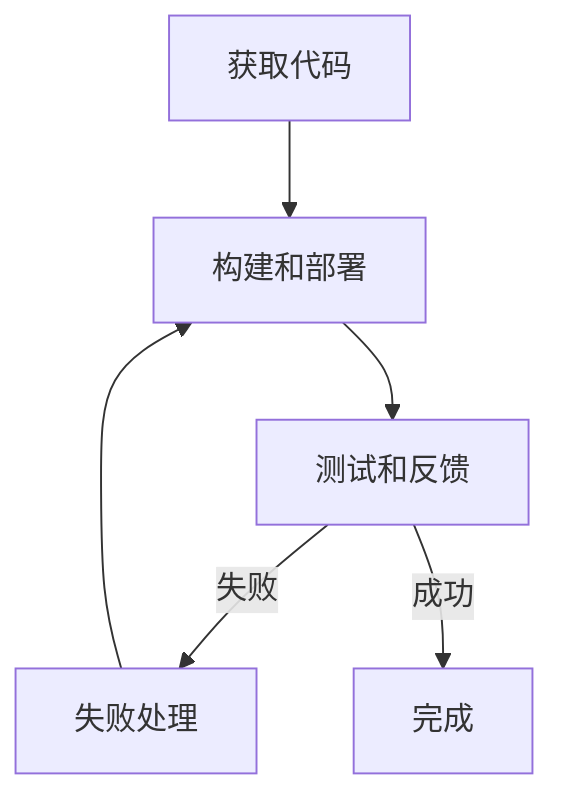

                 

# 《持续集成》

## 关键词

- 持续集成
- Jenkins
- GitLab CI/CD
- Azure DevOps
- DevOps
- 自动化构建
- 单元测试
- 源代码管理
- 性能优化
- 安全与合规

## 摘要

本文将深入探讨持续集成（CI）的概念、价值、核心组件、技术原理与实践，以及其在敏捷开发和DevOps环境中的应用。通过详细分析持续集成工具如Jenkins、GitLab CI/CD和Azure DevOps，本文将提供实际项目实战案例，展示如何有效地实施持续集成。此外，还将讨论持续集成的最佳实践、性能优化策略、团队协作和未来展望，以帮助读者全面理解并实践持续集成在IT开发中的重要性。

## 《持续集成》书籍目录大纲

### 第一部分：持续集成的概念与价值

#### 第1章：持续集成的起源与理念
- **1.1 持续集成的定义**
- **1.2 持续集成的起源与发展**
- **1.3 持续集成的价值**
- **1.4 持续集成与传统集成方式的对比**

#### 第2章：持续集成的核心组件
- **2.1 源代码管理**
- **2.2 自动化构建**
- **2.3 单元测试**
- **2.4 持续集成工具**

### 第二部分：持续集成技术原理与实践

#### 第3章：持续集成的技术原理
- **3.1 持续集成的工作流程**
  - **3.1.1 源代码的获取**
  - **3.1.2 构建和部署**
  - **3.1.3 测试和反馈**
- **3.2 持续集成的核心算法**
  - **3.2.1 版本控制**
  - **3.2.2 自动化构建脚本**
  - **3.2.3 测试脚本**
- **3.3 持续集成与敏捷开发的融合**
- **3.4 持续集成与DevOps**

#### 第4章：持续集成工具应用
- **4.1 Jenkins**
  - **4.1.1 Jenkins的基本功能**
  - **4.1.2 Jenkins的安装与配置**
  - **4.1.3 Jenkins的插件生态系统**
- **4.2 GitLab CI/CD**
  - **4.2.1 GitLab CI/CD概述**
  - **4.2.2 GitLab CI/CD配置文件**
  - **4.2.3 GitLab CI/CD实战**
- **4.3 Azure DevOps**
  - **4.3.1 Azure DevOps概述**
  - **4.3.2 Azure DevOps服务集成**
  - **4.3.3 Azure DevOps流水线配置**

#### 第5章：持续集成项目实战
- **5.1 项目实战一：构建简单的Web应用**
  - **5.1.1 开发环境搭建**
  - **5.1.2 源代码管理**
  - **5.1.3 自动化构建与测试**
  - **5.1.4 持续部署**
- **5.2 项目实战二：复杂的企业级应用**
  - **5.2.1 架构设计**
  - **5.2.2 持续集成策略**
  - **5.2.3 遇到的挑战与解决方案**

### 第三部分：持续集成最佳实践与未来展望

#### 第6章：持续集成最佳实践
- **6.1 持续集成流程设计**
  - **6.1.1 流程设计原则**
  - **6.1.2 流程优化方法**
- **6.2 持续集成性能优化**
  - **6.2.1 缩短构建时间**
  - **6.2.2 提高测试效率**
  - **6.2.3 性能监控与告警**
- **6.3 持续集成团队协作**
  - **6.3.1 团队角色与职责**
  - **6.3.2 沟通与协作工具**
- **6.4 持续集成安全与合规**

#### 第7章：持续集成未来展望
- **7.1 持续集成的发展趋势**
  - **7.1.1 自动化程度提升**
  - **7.1.2 云原生集成**
  - **7.1.3 持续交付（CD）与持续集成的融合**
- **7.2 持续集成在企业级应用中的新挑战**
  - **7.2.1 复杂架构的集成**
  - **7.2.2 数据安全与隐私保护**
  - **7.2.3 新技术融合与兼容性**

#### 第8章：持续集成与DevOps文化
- **8.1 DevOps文化的核心价值**
- **8.2 持续集成在DevOps中的角色**
- **8.3 持续集成实践中的挑战与解决策略**

### 附录

#### 附录 A：持续集成工具与资源指南
- **A.1 主流持续集成工具对比**
- **A.2 持续集成最佳实践案例**
- **A.3 相关书籍与资料推荐**

## 第一部分：持续集成的概念与价值

### 第1章：持续集成的起源与理念

#### 1.1 持续集成的定义

持续集成（Continuous Integration，简称CI）是一种软件开发实践，旨在通过频繁地将代码更改合并到一个共享的主分支中，并在每次合并时自动执行一系列测试，以确保代码质量。其核心思想是，通过频繁的集成和测试，能够及早发现和解决潜在的问题，从而提高软件的稳定性和可靠性。

持续集成不仅仅是一种技术实践，更是一种软件开发的文化和理念。它强调开发团队之间的紧密协作，通过自动化工具实现持续集成过程，从而实现高效、高质量的软件开发。

#### 1.2 持续集成的起源与发展

持续集成的概念最早由ThoughtWorks的Martin Fowler和Jim Highsmith在2000年提出。他们在《Continuous Integration: Mainline Development for Software Projects》一书中详细阐述了持续集成的方法和实践。

随着时间的推移，持续集成逐渐成为一种广泛采用的软件开发实践。特别是在敏捷开发方法普及的背景下，持续集成成为敏捷开发的核心组成部分，推动了软件开发过程的自动化和效率提升。

#### 1.3 持续集成的价值

持续集成具有以下显著价值：

1. **提高代码质量**：通过频繁的集成和测试，可以及早发现和解决代码中的问题，从而提高软件的稳定性和可靠性。
2. **加快开发进度**：自动化构建和测试过程可以显著减少手动操作，提高开发效率，缩短软件开发周期。
3. **增强团队协作**：持续集成促进了团队成员之间的沟通和协作，确保每个人都对代码的一致性和完整性负责。
4. **降低风险**：通过持续集成，可以在早期阶段识别和解决潜在的问题，降低项目风险。
5. **支持持续交付**：持续集成是实现持续交付（Continuous Delivery，简称CD）的基础，通过自动化流程，可以实现快速、安全地发布软件。

#### 1.4 持续集成与传统集成方式的对比

与传统集成方式相比，持续集成具有以下几个显著优势：

1. **自动化程度高**：持续集成通过自动化工具实现构建、测试和部署过程，减少了手动操作，提高了效率。
2. **频繁集成**：持续集成强调频繁地将代码更改合并到主分支中，减少了代码库中的不一致性和潜在冲突。
3. **早发现问题**：持续集成在每次代码更改时执行测试，可以及早发现和解决问题，降低风险。
4. **更好的代码质量**：持续集成通过自动化测试确保代码的质量，减少了缺陷和bug的引入。
5. **提高团队协作**：持续集成促进了团队成员之间的沟通和协作，确保每个人都能及时了解代码的状态。

总之，持续集成通过自动化和频繁集成，显著提高了软件开发的效率和质量，成为一种重要的软件开发实践。

### 第2章：持续集成的核心组件

持续集成（CI）的实践依赖于一系列核心组件的协作，这些组件共同构建了一个自动化、高效且可靠的软件开发流程。以下将详细介绍这些核心组件，包括源代码管理、自动化构建、单元测试和持续集成工具。

#### 2.1 源代码管理

源代码管理（Source Code Management，简称SCM）是持续集成的基础。它负责存储、跟踪和管理项目代码的变更。常用的源代码管理工具有Git、Subversion（SVN）和Mercurial（HG）等。

1. **Git**：Git是目前最流行的分布式版本控制系统，它提供了强大的分支和合并功能，支持离线工作，并能够高效地处理大规模代码库。Git通过`.git`仓库存储所有的版本历史，并允许开发者在本地创建和切换分支。

2. **Subversion（SVN）**：SVN是一个集中式版本控制系统，它通过中央仓库存储项目的所有版本。尽管SVN的分布式功能不如Git强大，但在一些团队中，由于其简单性和易用性，仍然被广泛使用。

3. **Mercurial（HG）**：Mercurial是一个轻量级的分布式版本控制系统，类似于Git。它提供了与Git相似的功能，但在某些方面具有不同的实现，适用于不同的项目和团队需求。

源代码管理的关键作用在于：

- **版本控制**：确保代码变更的可追溯性，方便回滚和追踪问题来源。
- **分支管理**：支持开发、测试和生产等多个分支，便于并行开发和维护。
- **协作**：支持多人协作开发，确保代码的一致性和完整性。

#### 2.2 自动化构建

自动化构建（Automated Build）是持续集成流程中的关键环节。它通过自动化脚本和工具，将源代码编译、构建和打包成可运行的软件。常见的自动化构建工具有Jenkins、Travis CI和Circle CI等。

1. **Jenkins**：Jenkins是一个开源的自动化服务器，广泛用于持续集成和持续部署。它支持多种编程语言和构建工具，通过插件系统提供了丰富的功能。

2. **Travis CI**：Travis CI是一个基于云的持续集成服务，特别适用于GitHub项目。它支持多种编程语言和框架，并提供免费的私有仓库服务。

3. **Circle CI**：Circle CI是一个高效的持续集成服务，支持多种编程语言和平台。它提供了一个简单、易用的配置文件，使得构建和测试过程易于设置和运行。

自动化构建的关键作用包括：

- **提高效率**：自动化构建减少了手动操作，缩短了构建和部署时间。
- **减少错误**：通过自动化测试和验证，降低了人为错误的可能性。
- **实时反馈**：在构建失败时，自动化构建能够迅速通知开发人员，帮助他们及时发现问题并修复。

#### 2.3 单元测试

单元测试（Unit Testing）是持续集成中的另一个核心组件。它通过编写和执行测试用例，验证代码的每个单元是否按照预期工作。常见的单元测试框架有JUnit、NUnit和TestNG等。

1. **JUnit**：JUnit是一个流行的Java单元测试框架，它提供了丰富的测试功能和注释，支持测试类、测试方法和测试用例的编写。

2. **NUnit**：NUnit是一个适用于.NET的单元测试框架，它提供了与JUnit类似的测试功能，并支持多种编程语言。

3. **TestNG**：TestNG是一个灵活的测试框架，适用于各种规模的软件项目。它提供了丰富的测试功能，包括数据驱动测试、依赖注入和参数化测试等。

单元测试的关键作用包括：

- **确保代码质量**：通过频繁的测试，确保代码的每个单元都经过验证，提高了代码的可靠性。
- **快速反馈**：在代码提交后，立即执行单元测试，提供即时反馈，帮助开发人员快速定位和修复问题。
- **代码覆盖率**：通过测试覆盖率统计，了解代码的测试覆盖情况，确保测试全面。

#### 2.4 持续集成工具

持续集成工具是持续集成流程的指挥中心，它们负责协调和管理整个集成过程。常见的持续集成工具有Jenkins、GitLab CI/CD、Azure DevOps和Circle CI等。

1. **Jenkins**：Jenkins是一个功能丰富的持续集成工具，支持多种编程语言和平台。它通过插件系统提供了丰富的功能，如自动化构建、测试和部署。

2. **GitLab CI/CD**：GitLab CI/CD是GitLab内置的持续集成和持续交付工具。它基于GitLab仓库中的配置文件`.gitlab-ci.yml`，自动化执行构建、测试和部署任务。

3. **Azure DevOps**：Azure DevOps是一个集成化的开发和服务平台，提供持续集成、持续交付和项目管理工具。它支持多种编程语言和平台，并提供了丰富的自动化功能。

4. **Circle CI**：Circle CI是一个基于云的持续集成服务，支持多种编程语言和平台。它提供了一个简单、易用的配置文件，使得构建和测试过程易于设置和运行。

持续集成工具的关键作用包括：

- **自动化流程**：通过自动化脚本和配置文件，实现构建、测试和部署的自动化，减少手动操作。
- **实时监控**：提供实时反馈和监控，帮助开发人员快速发现问题并解决。
- **持续交付**：通过持续集成和持续交付，实现快速、安全地发布软件。

综上所述，持续集成的核心组件——源代码管理、自动化构建、单元测试和持续集成工具——共同构建了一个高效、可靠且自动化的软件开发流程。通过这些组件的协同工作，开发团队能够更好地管理代码变更，提高代码质量，加快开发进度，从而实现更高效、更可靠的软件交付。

### 第3章：持续集成的技术原理

持续集成（CI）的成功实施依赖于对技术原理的深入理解，以及如何将这些原理应用于实际开发过程中。在这一章中，我们将探讨持续集成的工作流程、核心算法及其与敏捷开发和DevOps的融合。

#### 3.1 持续集成的工作流程

持续集成的工作流程可以分为以下几个关键步骤：

1. **源代码的获取**：开发人员在本地进行代码开发，并将更改提交到源代码管理系统（如Git）中。每次提交后，持续集成工具会定期或根据特定的触发条件（如合并请求或标签）从源代码管理系统中获取最新的代码。

2. **构建和部署**：获取到最新代码后，持续集成工具会执行构建过程，包括编译源代码、运行自动化构建脚本、打包构建产物等。构建成功后，持续集成工具会将构建产物部署到测试或生产环境中，以便进一步测试和验证。

3. **测试和反馈**：构建完成后，持续集成工具会运行一系列测试，包括单元测试、集成测试、性能测试等。测试的结果会反馈给开发人员，帮助他们在代码提交后及时发现问题并进行修复。

4. **失败处理**：如果在测试过程中发现失败，持续集成工具会生成详细的错误报告，并通知相关开发人员。开发人员需要分析错误报告，定位问题并进行修复。修复后，他们需要重新提交代码，并触发新的构建和测试流程。

以下是一个简化的持续集成工作流程的Mermaid流程图：



#### 3.2 持续集成的核心算法

持续集成的核心算法涉及版本控制、自动化构建脚本和测试脚本的编写与执行。以下是这些算法的详细说明：

1. **版本控制**：版本控制是持续集成的基础，它确保了代码的版本一致性和历史追踪。常见的版本控制算法包括Git的分支模型、合并请求（Pull Request）和标签（Tag）管理等。

   - **Git分支模型**：Git采用分布式版本控制系统，允许开发者在本地创建和切换分支，实现并行开发和代码隔离。常见的分支模型包括主分支（Master）、开发分支（Develop）和功能分支（Feature Branch）。

   - **合并请求**：合并请求是一种代码审查机制，用于将功能分支合并到主分支或开发分支中。通过合并请求，开发人员可以在合并代码前进行审查和讨论，确保代码的质量和一致性。

   - **标签管理**：标签用于标记代码库中的重要版本，如发布版本、里程碑等。标签管理可以帮助团队快速定位和回滚特定版本的代码。

2. **自动化构建脚本**：自动化构建脚本用于自动化编译、打包和部署代码。常见的构建脚本编写工具包括Makefile、Maven、Gradle等。

   - **Makefile**：Makefile是一种简单的自动化构建脚本，它定义了一系列构建任务，如编译、打包和安装等。通过`make`命令，可以自动化执行这些任务。

   - **Maven**：Maven是一种流行的构建工具，它通过POM（Project Object Model）文件定义项目的构建过程。Maven提供了丰富的插件系统，支持多种编程语言和项目类型。

   - **Gradle**：Gradle是一种基于Apache Ant和Apache Maven的构建工具，它使用Groovy语言编写构建脚本。Gradle提供了强大的依赖管理和构建优化功能。

3. **测试脚本**：测试脚本用于自动化执行单元测试、集成测试和性能测试。常见的测试脚本编写工具包括JUnit、NUnit和TestNG等。

   - **JUnit**：JUnit是一个流行的Java单元测试框架，它提供了丰富的测试功能和注释。通过编写JUnit测试类和测试用例，可以自动化验证代码的每个单元。

   - **NUnit**：NUnit是一个适用于.NET的单元测试框架，它提供了与JUnit类似的功能。通过编写NUnit测试类和测试用例，可以自动化验证.NET代码的每个单元。

   - **TestNG**：TestNG是一个灵活的测试框架，适用于各种规模的软件项目。它提供了丰富的测试功能，包括数据驱动测试、依赖注入和参数化测试等。

以下是一个示例的自动化构建脚本伪代码：

```bash
#!/bin/bash

# 编译代码
mvn clean install

# 运行单元测试
mvn test

# 部署到测试环境
mvn deploy

# 运行集成测试
./run-integration-tests.sh

# 运行性能测试
./run-performance-tests.sh

# 检查测试结果
if [ "$?" -ne 0 ]; then
    echo "构建失败：测试未通过"
    exit 1
fi

echo "构建成功"
```

#### 3.3 持续集成与敏捷开发的融合

持续集成与敏捷开发（Agile Development）紧密相关，两者共同推动软件开发的效率和灵活性。以下是如何将持续集成融入敏捷开发的几个关键点：

1. **频繁迭代**：敏捷开发强调快速迭代和频繁交付，持续集成通过自动化流程支持这一理念。每次迭代结束时，开发团队都可以通过持续集成快速构建和测试软件，确保功能的质量和稳定性。

2. **持续反馈**：敏捷开发强调持续反馈，持续集成提供了即时反馈机制。通过自动化测试和实时报告，开发人员可以快速了解代码的质量和稳定性，及时发现问题并进行修复。

3. **团队协作**：敏捷开发强调团队协作和共同责任，持续集成通过自动化工具和流程促进团队成员之间的沟通和协作。通过持续集成，团队成员可以实时了解代码的状态和测试结果，提高协作效率。

4. **透明度**：敏捷开发强调透明度，持续集成提供了一个统一的平台，让所有团队成员都能看到项目的进展和状态。通过持续集成工具的仪表板和报告，项目进度和问题一目了然，促进了团队的透明度和沟通。

#### 3.4 持续集成与DevOps

持续集成与DevOps（Development and Operations）的融合进一步推动了软件开发的自动化和协作。以下是如何将持续集成融入DevOps的几个关键点：

1. **持续交付**：持续集成是实现持续交付（Continuous Delivery，简称CD）的基础。通过自动化构建、测试和部署，持续集成确保了代码的持续交付能力，实现了快速、安全地发布软件。

2. **基础设施即代码**：DevOps强调基础设施即代码（Infrastructure as Code，简称IaC），持续集成通过自动化脚本管理基础设施，确保基础设施的一致性和可重复性。通过IaC，开发团队能够快速部署和配置环境，提高开发效率。

3. **持续监控**：持续集成与持续监控（Continuous Monitoring）相结合，实现了对生产环境的实时监控和预警。通过监控工具，开发团队能够及时了解系统的性能和健康状态，快速响应和处理问题。

4. **文化变革**：DevOps强调跨职能团队和协作文化，持续集成通过自动化和流程优化，推动了这种文化变革。通过持续集成，开发人员和运维人员可以更好地协作，共同推动软件交付的效率和质量。

综上所述，持续集成通过其技术原理和实际应用，与敏捷开发和DevOps紧密融合，推动了软件开发的自动化、协作和高效性。通过理解持续集成的工作流程、核心算法及其与敏捷开发和DevOps的融合，开发团队能够更好地实践持续集成，实现快速、高质量的软件交付。

### 第4章：持续集成工具应用

在持续集成实践中，选择合适的工具至关重要。本节将详细探讨三种主流的持续集成工具：Jenkins、GitLab CI/CD和Azure DevOps。我们将从基本功能、安装与配置、插件生态系统等方面对它们进行深入分析。

#### 4.1 Jenkins

**4.1.1 Jenkins的基本功能**

Jenkins是一个开源的持续集成工具，由clipse公司创建，拥有广泛的社区支持。Jenkins的基本功能包括：

- **自动化构建**：Jenkins可以自动化编译、打包和部署应用程序。
- **测试执行**：Jenkins支持各种测试框架，如JUnit、NUnit和TestNG，并在构建过程中执行这些测试。
- **报告生成**：Jenkins可以生成详细的构建和测试报告，帮助开发人员了解项目的状态。
- **部署**：Jenkins可以将构建好的应用程序部署到各种环境，如本地服务器、云平台或容器化环境。
- **通知**：Jenkins支持通过邮件、即时消息、短信等方式通知开发人员关于构建状态的变化。

**4.1.2 Jenkins的安装与配置**

安装Jenkins相对简单。以下是主要步骤：

1. **下载Jenkins**：从Jenkins官网下载最新版本的Jenkins.war文件。
2. **安装Jenkins**：将Jenkins.war文件部署到Java应用服务器，如Tomcat或Jetty。例如，使用Tomcat：
    ```bash
    cd /path/to/tomcat/webapps
    jar uvxf libs/*.jar ../bin/bootstrap.jar ../bin/tomcat-jenkins-plugin.tar.gz
    ```
3. **启动Jenkins**：启动Tomcat服务器，访问`http://localhost:8080/jenkins`开始安装Jenkins。
4. **配置Jenkins**：按照安装向导完成Jenkins的初始配置，包括安装推荐的插件和创建管理员用户。

**4.1.3 Jenkins的插件生态系统**

Jenkins的核心功能通过其丰富的插件生态系统得以扩展。以下是几个常用的Jenkins插件：

- **Git插件**：用于从Git仓库中获取代码。
- **JUnit插件**：用于收集JUnit测试结果并生成报告。
- **GitHub插件**：用于与GitHub集成，触发构建和部署。
- **Docker插件**：用于在Docker容器中构建和运行应用程序。
- **Jenkins Blue Ocean插件**：提供更直观的UI和任务流管理。

**4.1.4 Jenkins实战**

以下是一个简单的Jenkins项目配置示例，用于构建和测试一个Java Web应用程序：

1. **创建Jenkins作业**：在Jenkins管理界面上创建一个新的自由风格的软件项目。
2. **源代码管理**：配置Git插件，指定项目的Git仓库地址。
3. **构建触发器**：配置SCM触发器，每次代码提交时自动触发构建。
4. **构建步骤**：
    - **Checkout**：从Git仓库检出代码。
    - **Execute Shell**：运行Maven命令构建项目：
        ```bash
        mvn clean install
        ```
    - **JUnit Test**：运行JUnit测试：
        ```bash
        mvn test
        ```
    - **Archive the artifacts**：将构建产物存档。
5. **构建后操作**：配置邮件通知，在构建成功或失败时发送通知。

#### 4.2 GitLab CI/CD

**4.2.1 GitLab CI/CD概述**

GitLab CI/CD是GitLab的一个内置持续集成和持续交付工具。它基于`.gitlab-ci.yml`配置文件，用于自动化构建、测试和部署过程。GitLab CI/CD具有以下特点：

- **简单易用**：通过`.gitlab-ci.yml`配置文件，GitLab CI/CD提供了一种直观、易读的方式来配置持续集成流程。
- **灵活性强**：支持多种编程语言和平台，可以自定义各种步骤和脚本。
- **集成性高**：与GitLab的其他功能紧密集成，如代码审查、合并请求和发布等。

**4.2.2 GitLab CI/CD配置文件**

`.gitlab-ci.yml`文件是GitLab CI/CD的核心配置文件。以下是一个简单的`.gitlab-ci.yml`示例：

```yaml
image: openjdk:8

stages:
  - build
  - test
  - deploy

build:
  stage: build
  script:
    - mvn clean install
  artifacts:
    paths:
      - target/*.war

test:
  stage: test
  script:
    - mvn test
  only:
    - master

deploy:
  stage: deploy
  script:
    - scp target/*.war user@production-server:/var/lib/tomcat8/webapps/
  only:
    - master
```

**4.2.3 GitLab CI/CD实战**

以下是如何使用GitLab CI/CD为Java Web应用程序设置持续集成的步骤：

1. **配置`.gitlab-ci.yml`文件**：在项目的根目录下创建或编辑`.gitlab-ci.yml`文件，配置构建、测试和部署步骤。
2. **触发构建**：每次向GitLab仓库提交代码时，GitLab CI/CD都会触发构建。可以通过Web界面或命令行工具（如GitLab Runner）管理构建流程。
3. **查看构建状态**：在GitLab项目的“CI/CD”部分，可以查看构建的历史记录、日志和输出。

#### 4.3 Azure DevOps

**4.3.1 Azure DevOps概述**

Azure DevOps是一个集成化的开发和服务平台，提供持续集成、持续交付、项目管理、测试管理等功能。Azure DevOps的核心组件包括：

- **Azure Pipelines**：用于自动化构建、测试和部署的持续集成和持续交付服务。
- **Azure Boards**：用于项目管理和缺陷跟踪的工具。
- **Azure Artifacts**：用于存储和管理依赖项的仓库。
- **Azure Test Plans**：用于测试管理和测试用例管理。

**4.3.2 Azure DevOps服务集成**

安装和配置Azure DevOps通常涉及以下步骤：

1. **创建Azure DevOps组织**：在Azure门户中创建新的Azure DevOps组织。
2. **创建项目**：在Azure DevOps组织内创建项目，用于管理和跟踪软件项目。
3. **配置源代码管理**：连接到Git仓库，如GitHub或GitLab。
4. **设置构建管道**：在Azure Pipelines中创建新的构建管道，配置构建脚本和触发条件。
5. **配置测试管道**：创建测试管道，配置测试脚本和执行策略。
6. **配置发布管道**：创建发布管道，配置部署脚本和发布条件。

**4.3.3 Azure DevOps流水线配置**

以下是一个简单的Azure DevOps流水线配置示例，用于构建和测试Java Web应用程序：

1. **源代码管理**：将项目的源代码推送到Azure DevOps的Git仓库。
2. **构建管道**：
    - **触发条件**：每次提交到主分支时触发构建。
    - **构建步骤**：
        - ** checkout**：检出代码。
        - ** restore nuget packages**：恢复NuGet依赖项。
        - ** build**：运行Maven命令构建项目。
        - ** publish artifacts**：发布构建产物。
3. **测试管道**：
    - **触发条件**：在构建成功后触发测试。
    - **测试步骤**：
        - ** run tests**：运行JUnit测试。
        - ** collect test results**：收集测试结果。
4. **发布管道**：
    - **触发条件**：在测试成功后触发发布。
    - **发布步骤**：
        - ** deploy to production**：将构建产物部署到生产环境。

通过上述步骤，开发团队可以有效地利用Azure DevOps实现持续集成和持续交付，提高软件开发的效率和质量。

### 第5章：持续集成项目实战

为了更好地理解持续集成的实际应用，我们将通过两个项目实战案例进行详细分析。第一个案例是一个简单的Web应用，旨在展示持续集成的基本流程和工具配置。第二个案例是一个复杂的企业级应用，讨论在大型项目中实施持续集成的策略和挑战。

#### 5.1 项目实战一：构建简单的Web应用

**5.1.1 开发环境搭建**

在这个案例中，我们将使用Java和Spring Boot框架构建一个简单的Web应用。首先，确保安装了Java SDK（版本11或更高）和Maven（版本3.6.3或更高）。

1. **创建Maven项目**：
    - 通过IDE（如IntelliJ IDEA或Eclipse）创建一个新的Maven项目。
    - 在`pom.xml`文件中添加Spring Boot依赖项：
        ```xml
        <dependencies>
            <dependency>
                <groupId>org.springframework.boot</groupId>
                <artifactId>spring-boot-starter-web</artifactId>
            </dependency>
        </dependencies>
        ```

2. **编写主类**：
    - 创建一个名为`App`的主类，添加以下代码：
        ```java
        @SpringBootApplication
        public class App {
            public static void main(String[] args) {
                SpringApplication.run(App.class, args);
            }
        }
        ```

3. **编写Hello World控制器**：
    - 创建一个名为`HelloController`的控制器类，添加以下代码：
        ```java
        @RestController
        public class HelloController {
            @RequestMapping("/hello")
            public String sayHello() {
                return "Hello, World!";
            }
        }
        ```

**5.1.2 源代码管理**

使用Git对项目进行源代码管理。首先，初始化Git仓库：

```bash
git init
git add .
git commit -m "Initial commit"
git remote add origin <your-git-repo-url>
git push -u origin master
```

**5.1.3 自动化构建与测试**

为了自动化构建和测试，我们将使用Jenkins作为持续集成工具。

1. **配置Jenkins作业**：
    - 在Jenkins管理界面创建一个新的自由风格项目。
    - 配置源代码管理，选择Git，并输入项目的Git仓库地址。
    - 添加构建触发器，选择“轮询SCM”，配置轮询频率（如每小时一次）。
    - 添加构建步骤：
        - **Checkout**：从Git仓库检出代码。
        - **Execute Shell**：运行Maven命令构建项目：
            ```bash
            mvn clean install
            ```
        - **JUnit Test**：运行JUnit测试：
            ```bash
            mvn test
            ```

2. **配置测试报告**：
    - 在构建步骤中，添加“Publish JUnit test result report”插件，配置测试报告的路径。

3. **构建和测试**：
    - 每次提交代码后，Jenkins会自动构建和测试项目。在Jenkins的构建历史记录中，可以查看构建日志和测试报告。

**5.1.4 持续部署**

为了实现持续部署，我们将使用Jenkins将构建好的应用程序部署到一个Web服务器上。

1. **配置Jenkins作业的部署步骤**：
    - 添加“Deploy to container”插件。
    - 配置Docker镜像和容器名。
    - 添加“Copy artifacts”插件，将构建产物（如JAR文件）复制到容器的指定路径。

2. **部署**：
    - 在构建成功后，Jenkins会自动部署应用程序到Docker容器中，并通过容器端口（如8080）提供服务。

#### 5.2 项目实战二：复杂的企业级应用

**5.2.1 架构设计**

在这个案例中，我们将构建一个复杂的企业级应用，包括多个微服务、数据库和API网关。以下是该应用的基本架构：

- **微服务**：包括用户服务、订单服务、库存服务、支付服务等。
- **数据库**：使用MySQL数据库存储不同服务的数据。
- **API网关**：使用Spring Cloud Gateway作为API网关，统一管理服务的访问。
- **消息队列**：使用RabbitMQ实现服务之间的异步通信。

**5.2.2 持续集成策略**

为了有效地管理复杂的企业级应用，我们将采用以下持续集成策略：

1. **服务隔离**：将每个微服务视为独立的构建单元，分别进行构建和测试，确保每个服务的质量和稳定性。

2. **容器化**：使用Docker容器化每个微服务，实现环境的一致性和可移植性。

3. **服务发现**：使用Eureka实现微服务之间的服务发现和负载均衡。

4. **配置管理**：使用Spring Cloud Config管理不同环境（如开发、测试、生产）的配置信息。

**5.2.3 遇到的挑战与解决方案**

在实施持续集成过程中，我们遇到了以下挑战：

1. **依赖管理**：微服务之间存在复杂的依赖关系，包括Spring Cloud组件、数据库驱动、消息队列驱动等。解决方案是使用Maven的多模块项目结构，并在`pom.xml`中定义依赖关系。

2. **构建时间**：构建和测试过程可能需要较长时间，影响开发效率。解决方案是使用并行构建和优化构建脚本，例如使用Maven的`-T`参数配置并行构建。

3. **服务隔离**：确保每个微服务的测试结果独立，避免相互影响。解决方案是使用容器隔离每个服务的测试环境，并确保测试数据不共享。

4. **部署流程**：复杂的企业级应用部署需要多个步骤，包括容器构建、服务注册、配置更新等。解决方案是使用Jenkins流水线（Pipeline）自动化部署流程，并使用Ansible进行环境配置。

通过上述策略和解决方案，开发团队能够有效地管理复杂的企业级应用，确保持续集成的质量和效率。

### 第6章：持续集成最佳实践

在实施持续集成（CI）的过程中，遵循最佳实践至关重要，这些实践能够帮助开发团队提高代码质量、优化流程和提升团队协作效率。以下是一些关键的最佳实践：

#### 6.1 持续集成流程设计

**6.1.1 流程设计原则**

设计持续集成流程时，应遵循以下原则：

- **自动化**：尽可能自动化所有流程，包括构建、测试和部署。自动化减少了人为错误，提高了效率和一致性。
- **最小化变更集**：每次集成应只包含尽可能少的代码变更，以便更容易定位和解决问题。
- **持续反馈**：确保测试和构建结果能够及时反馈给开发人员，帮助他们快速发现问题并进行修复。
- **可重复性**：流程应具有高度的可重复性，无论何时执行，结果都应该一致。
- **灵活性**：流程设计应具有足够的灵活性，以适应不同的项目需求和技术栈。

**6.1.2 流程优化方法**

优化持续集成流程的方法包括：

- **并行化**：利用多核处理器和并行构建工具，实现并行测试和构建，减少总耗时。
- **缓存**：缓存编译和测试结果，避免重复计算，提高构建速度。
- **依赖管理**：优化依赖项的版本控制和获取，减少构建过程中的等待时间。
- **持续监控**：引入监控工具，实时监控构建状态和性能，及时识别和解决问题。

#### 6.2 持续集成性能优化

**6.2.1 缩短构建时间**

缩短构建时间是持续集成性能优化的关键。以下是一些方法：

- **并行构建**：使用多线程或多台构建机器并行执行构建任务。
- **构建缓存**：缓存构建过程中的中间结果，避免重复构建相同的依赖项和文件。
- **优化脚本**：优化构建脚本，避免不必要的步骤和冗余代码。
- **精简测试**：只运行必要的测试，避免运行过多的冗余测试。

**6.2.2 提高测试效率**

提高测试效率有助于缩短构建周期和减少资源消耗。以下是一些策略：

- **测试分离**：将测试分为单元测试、集成测试和性能测试，分别执行。
- **测试并行化**：在同一构建过程中并行运行多个测试用例。
- **模拟环境**：在构建过程中使用模拟环境，避免依赖复杂的实际系统。
- **测试覆盖率**：确保测试覆盖率足够高，但避免过度测试。

**6.2.3 性能监控与告警**

性能监控与告警是持续集成流程的重要组成部分。以下是一些方法：

- **引入监控工具**：使用Prometheus、Grafana等工具进行实时监控和可视化。
- **设置告警阈值**：根据历史数据和业务需求，设置合理的告警阈值。
- **自动化响应**：配置自动化响应机制，如发送告警邮件、暂停构建等。
- **定期审查**：定期审查监控数据和告警日志，调整优化策略。

#### 6.3 持续集成团队协作

**6.3.1 团队角色与职责**

在持续集成实践中，团队角色和职责的明确分工至关重要。以下是一些关键角色和职责：

- **开发人员**：负责编写代码，确保代码质量，并在代码提交后参与集成和测试。
- **测试工程师**：负责编写和执行测试用例，确保代码的稳定性和可靠性。
- **运维人员**：负责部署和管理生产环境，确保应用程序的稳定运行。
- **持续集成工程师**：负责设计和维护持续集成流程，确保构建和测试的自动化。

**6.3.2 沟通与协作工具**

有效的沟通与协作工具能够提高团队的协作效率和解决问题的速度。以下是一些常用的工具：

- **版本控制系统**：如Git，用于代码的存储和协作。
- **持续集成工具**：如Jenkins、GitLab CI/CD和Azure DevOps，用于构建、测试和部署。
- **即时通讯工具**：如Slack、Microsoft Teams，用于实时沟通和协作。
- **任务管理工具**：如Jira、Trello，用于任务分配和进度跟踪。

通过遵循这些最佳实践，开发团队能够有效地实施持续集成，提高代码质量、减少故障时间、加快交付速度，并实现更高的团队协作效率。

### 第7章：持续集成未来展望

持续集成（CI）作为软件开发的核心实践，随着技术的发展和市场需求的变化，其未来展望充满机遇和挑战。以下是持续集成在未来可能的发展趋势、新挑战及解决方案。

#### 7.1 持续集成的发展趋势

**7.1.1 自动化程度提升**

随着人工智能和机器学习的进步，持续集成工具的自动化程度将进一步提升。自动化测试、自动化部署和自动化监控将成为主流，减少人工干预，提高效率。例如，机器学习算法可以预测潜在问题，提前进行预防性维护。

**7.1.2 云原生集成**

云原生技术，如Kubernetes和容器化，将推动持续集成在云环境中的广泛应用。持续集成工具将更好地与云平台集成，实现无缝部署和扩展。容器镜像和云服务的自动化管理将使持续集成更加灵活和高效。

**7.1.3 持续交付（CD）与持续集成的融合**

持续集成和持续交付（CD）将更加紧密地融合。持续集成将成为持续交付链中不可或缺的一部分，两者共同推动软件从开发到生产的自动化流程。持续集成工具将提供更强大的CD功能，包括一键部署、环境切换和回滚。

#### 7.2 持续集成在企业级应用中的新挑战

**7.2.1 复杂架构的集成**

随着企业应用规模的扩大和架构的复杂化，持续集成面临更大的挑战。多服务、多模块和多层次架构需要更精细的集成策略和管理，以确保代码质量和交付效率。

**7.2.2 数据安全与隐私保护**

在持续集成过程中，数据安全和隐私保护成为重要议题。企业需要确保在集成过程中处理的数据符合相关法规和标准，防止数据泄露和滥用。

**7.2.3 新技术融合与兼容性**

持续集成需要不断适应和融合新技术，如微服务架构、区块链和物联网。同时，确保新旧技术之间的兼容性也成为一大挑战。持续集成工具需要提供灵活的集成接口和扩展机制，以支持多种技术栈。

#### 7.3 解决方案与策略

**7.3.1 架构优化**

优化软件架构，采用模块化和微服务架构，降低集成复杂度。通过模块化设计，实现服务的独立开发和部署，提高集成效率。

**7.3.2 数据安全措施**

引入加密、访问控制和安全审计等数据安全措施，确保数据在集成过程中的安全。采用零信任模型，限制对数据的访问权限，减少安全风险。

**7.3.3 技术适配与兼容**

持续集成工具应具备良好的扩展性和兼容性，支持多种技术和平台。通过插件和API，灵活集成新技术的组件和服务，确保持续集成流程的稳定性和连续性。

**7.3.4 文化变革**

推动组织文化变革，培养开发人员的持续集成意识，鼓励自动化和协作。通过培训和知识分享，提升团队对持续集成工具和流程的掌握和应用能力。

总之，持续集成在未来将面临新的挑战，但也充满机遇。通过优化架构、加强数据安全、适配新技术和推动文化变革，开发团队能够更好地应对这些挑战，实现更高效、更可靠的软件交付。

### 第8章：持续集成与DevOps文化

持续集成（CI）与DevOps文化的融合是现代软件开发的关键，二者共同推动团队协作、流程优化和软件交付效率。在这一章中，我们将探讨DevOps文化的核心价值、持续集成在DevOps中的角色，以及实践中的挑战与解决策略。

#### 8.1 DevOps文化的核心价值

**8.1.1 持续协作**

DevOps文化强调持续协作，打破开发（Development）和运维（Operations）之间的障碍。开发人员和运维人员紧密合作，共享责任和目标，确保软件从开发到生产的流畅交付。

**8.1.2 自动化**

自动化是DevOps文化的核心。通过自动化工具和流程，实现从代码提交到生产环境部署的全程自动化，减少手动操作，提高效率，降低错误率。

**8.1.3 持续反馈**

DevOps文化倡导持续反馈，确保团队在开发过程中能够及时发现和解决问题。通过自动化测试、监控和告警，提供实时反馈，帮助团队迅速响应和改进。

**8.1.4 可持续发展**

DevOps文化强调可持续发展的理念，关注长期价值和稳定交付。通过持续改进和优化流程，实现持续交付和高质量的软件产品。

#### 8.2 持续集成在DevOps中的角色

**8.2.1 提升软件质量**

持续集成通过频繁的集成和自动化测试，确保代码质量。每次代码更改都会触发构建和测试，及早发现问题并进行修复，减少缺陷和bug的积累。

**8.2.2 加快交付速度**

持续集成自动化构建、测试和部署过程，缩短开发周期，加快软件交付速度。开发团队能够快速响应需求变更，提高市场竞争力。

**8.2.3 提高团队协作**

持续集成促进团队成员之间的沟通和协作。通过共享构建和测试结果，团队可以更好地了解项目状态，共同解决问题，提高整体效率。

**8.2.4 稳定生产环境**

持续集成确保生产环境的稳定性和可靠性。通过自动化测试和监控，及时发现和解决潜在问题，减少生产环境的故障率和停机时间。

#### 8.3 持续集成实践中的挑战与解决策略

**8.3.1 流程复杂度**

持续集成流程可能涉及多个步骤和工具，导致流程复杂度增加。解决策略包括简化流程设计，采用可视化和模块化方法，提高流程的可维护性和可扩展性。

**8.3.2 代码质量保证**

确保代码质量是持续集成的重要目标，但实现这一目标可能面临挑战。解决策略包括引入代码审查、静态代码分析和动态测试等手段，提高代码质量和可靠性。

**8.3.3 数据安全和隐私保护**

在持续集成过程中，数据安全和隐私保护至关重要。解决策略包括引入加密、访问控制和审计机制，确保数据在集成过程中的安全。

**8.3.4 团队协作与沟通**

团队协作和沟通是持续集成成功的关键。解决策略包括定期会议、知识分享和工具集成，促进团队成员之间的互动和协作。

**8.3.5 系统兼容性与稳定性**

在多服务、多平台的应用中，系统兼容性和稳定性是持续集成面临的重要挑战。解决策略包括采用标准化组件和平台，实施全面测试和监控，确保系统的一致性和稳定性。

通过持续集成与DevOps文化的深度融合，开发团队能够实现更高效、更可靠的软件交付。理解并解决持续集成实践中的挑战，将有助于团队充分利用DevOps文化的核心价值，推动软件开发的持续改进。

### 附录 A：持续集成工具与资源指南

为了帮助读者更好地理解和使用持续集成工具，本附录将介绍主流的持续集成工具，并提供一些最佳实践案例和相关书籍与资料推荐。

#### A.1 主流持续集成工具对比

以下是几种主流持续集成工具的对比：

1. **Jenkins**
   - **优点**：开源、插件丰富、高度可定制、支持多种编程语言。
   - **缺点**：配置较为复杂、维护和升级需要一定的技术支持。
   - **适用场景**：适用于多种项目和团队规模，特别是需要高度定制化的场景。

2. **GitLab CI/CD**
   - **优点**：与GitLab集成紧密、配置简单、支持多种编程语言和平台。
   - **缺点**：相比其他工具，功能可能较为基础。
   - **适用场景**：适用于中小型项目和团队，特别是已经使用GitLab作为源代码管理的团队。

3. **Azure DevOps**
   - **优点**：集成度较高、功能全面、支持多种编程语言和平台。
   - **缺点**：需要Azure订阅，成本较高。
   - **适用场景**：适用于大型企业和需要全面集成化工具的场景。

4. **Circle CI**
   - **优点**：配置简单、自动化程度高、支持多种编程语言。
   - **缺点**：免费层功能有限，对于大型项目可能不够强大。
   - **适用场景**：适用于中小型项目和初创团队，特别是需要快速部署和简单配置的场景。

#### A.2 持续集成最佳实践案例

以下是一些持续集成最佳实践案例：

1. **简单的Web应用**
   - **流程**：使用Jenkins作为CI工具，配置自动化构建、测试和部署流程。每次代码提交后，Jenkins自动执行构建和测试，构建成功后部署到测试环境。
   - **工具**：Jenkins、Maven、JUnit。
   - **效果**：提高了代码质量，缩短了交付周期，提高了团队协作效率。

2. **复杂的企业级应用**
   - **流程**：使用GitLab CI/CD进行自动化构建和测试，集成Docker容器管理，实现微服务架构的持续集成和交付。通过GitLab的Merge Request进行代码审查和合并。
   - **工具**：GitLab CI/CD、Docker、Kubernetes。
   - **效果**：实现了服务的独立部署和扩展，提高了系统的可靠性和可维护性。

3. **移动应用**
   - **流程**：使用Azure DevOps进行构建、测试和部署，集成App Center进行移动应用的自动化测试和发布。使用CI/CD流水线管理整个开发周期。
   - **工具**：Azure DevOps、App Center、Xcode。
   - **效果**：简化了移动应用的发布流程，提高了测试覆盖率，缩短了交付时间。

#### A.3 相关书籍与资料推荐

以下是几本关于持续集成和DevOps的推荐书籍：

1. **《持续集成：主支开发方法》**（Continuous Integration: Mainline Development for Software Projects）
   - 作者：Martin Fowler
   - 简介：这本书是持续集成的经典之作，详细介绍了持续集成的方法和实践。

2. **《DevOps实践指南》**（The DevOps Handbook）
   - 作者：Jez Humble、David Farley
   - 简介：本书介绍了DevOps的核心概念、最佳实践和实际案例，帮助读者理解和实施DevOps文化。

3. **《持续交付：发布可靠软件的系统化方法》**（Continuous Delivery: Reliable Software Releases through Build, Test, and Deployment Automation）
   - 作者：Jez Humble、David Farley
   - 简介：这本书深入探讨了持续交付的方法和流程，提供了详细的实践指南。

4. **《持续集成实战》**（Practical Continuous Integration）
   - 作者：Paul M. Duvall、Steven E. Cook、Jason T. Garoutte
   - 简介：这本书提供了丰富的持续集成实践案例和工具配置，适合希望深入理解和实践的读者。

通过学习和参考这些工具、实践和资源，开发团队可以更好地实施持续集成，提高软件质量、加快交付速度，实现高效、可靠的软件开发。

### 附录 B：持续集成与DevOps学习资源

为了帮助读者更深入地了解持续集成（CI）和DevOps，本附录提供了进一步学习的一些资源，包括在线课程、博客、社区和书籍。

#### B.1 在线课程

1. **Coursera** - “DevOps: Introduction to Continuous Integration”
   - 提供者：University of Virginia
   - 简介：本课程介绍了持续集成的基本概念和工具，适合初学者。

2. **edX** - “Continuous Integration”
   - 提供者：UC San Diego
   - 简介：该课程讲解了持续集成的工作流程、工具和最佳实践。

3. **Pluralsight** - “CI/CD with Azure DevOps”
   - 提供者：Brianlagunas
   - 简介：本课程通过实战演示，教授如何使用Azure DevOps实现持续集成和持续交付。

#### B.2 博客和网站

1. **Jenkins Blog** - https://www.jenkins.io/blog/
   - 简介：Jenkins官方博客，提供Jenkins的更新、教程和最佳实践。

2. **GitLab CI/CD Blog** - https://about.gitlab.com/gitlab-ci/topics/
   - 简介：GitLab CI/CD的相关教程、案例研究和最新动态。

3. **Azure DevOps Docs** - https://docs.microsoft.com/en-us/azure/devops/overview
   - 简介：Azure DevOps的官方文档，详细介绍了其功能、工具和最佳实践。

#### B.3 社区和论坛

1. **DevOps Community** - https://devopstags.com/
   - 简介：一个关于DevOps和持续集成的在线社区，提供讨论区和资源分享。

2. **Stack Overflow** - https://stackoverflow.com/questions/tagged/continuous-integration
   - 简介：一个问答社区，提供了大量的关于持续集成的问题和解决方案。

3. **Reddit DevOps** - https://www.reddit.com/r/devops/
   - 简介：Reddit上的DevOps社区，讨论持续集成、DevOps工具和最佳实践。

#### B.4 书籍

1. **《持续集成：持续交付和部署的最佳实践》**（Continuous Integration: The Definitive Guide to Continuously Delivering Software）
   - 作者：Paul Duvall, Steve Matyas, and treated McConnel
   - 简介：这是一本关于持续集成的权威指南，涵盖了持续集成的原理、工具和流程。

2. **《DevOps实战：从架构到流程的全面解读》**（The DevOps Handbook）
   - 作者：Jez Humble, Dave Farley, and Jenifer Sydnor
   - 简介：这本书提供了DevOps的全面解读，从架构到流程，包括持续集成和持续交付的最佳实践。

3. **《持续交付：构建和部署可靠软件的系统化方法》**（Continuous Delivery: Reliable Software Releases through Build, Test, and Deployment Automation）
   - 作者：Jez Humble and David Farley
   - 简介：这本书深入探讨了持续交付的概念和流程，是理解持续集成和持续交付的重要资源。

通过这些在线课程、博客、社区和书籍，读者可以系统地学习持续集成和DevOps的知识，提升实践能力，为软件开发和部署带来更多的价值。

