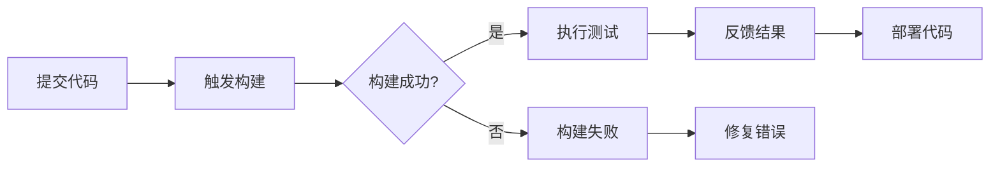
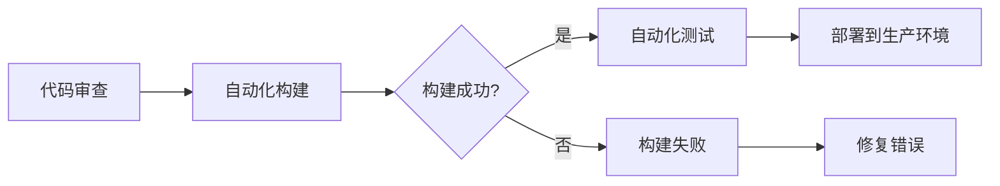

                 

# 文章标题：持续集成和持续部署：自动化软件发布

## 关键词
持续集成（CI）、持续部署（CD）、自动化软件发布、DevOps、自动化工具、脚本、容器化、微服务、持续交付

## 摘要
本文深入探讨了持续集成（CI）和持续部署（CD）的概念、原理以及实践方法。通过详细的讲解和实例分析，本文旨在帮助读者理解持续集成和持续部署在现代软件开发中的重要性，并掌握自动化软件发布的过程。文章结构清晰，涵盖持续集成与持续部署的基础、工具介绍、实践案例和未来展望，适合软件开发人员、系统管理员以及对持续集成和持续部署有兴趣的读者阅读。

---

## 目录大纲

### 第一部分: 持续集成与持续部署基础

1. [第1章: 持续集成和持续部署概述](#第1章-持续集成和持续部署概述)
   1. [1.1 持续集成与持续部署的定义](#11-持续集成与持续部署的定义)
   2. [1.2 持续集成与持续部署的价值](#12-持续集成与持续部署的价值)
   3. [1.3 持续集成与持续部署的发展历史](#13-持续集成与持续部署的发展历史)

2. [第2章: 持续集成基础](#第2章-持续集成基础)
   1. [2.1 持续集成的原理](#21-持续集成的原理)
   2. [2.2 持续集成的流程](#22-持续集成的流程)
   3. [2.3 持续集成工具介绍](#23-持续集成工具介绍)

3. [第3章: 持续部署基础](#第3章-持续部署基础)
   1. [3.1 持续部署的原理](#31-持续部署的原理)
   2. [3.2 持续部署的策略](#32-持续部署的策略)
   3. [3.3 持续部署工具介绍](#33-持续部署工具介绍)

4. [第4章: 自动化软件发布](#第4章-自动化软件发布)
   1. [4.1 自动化软件发布概述](#41-自动化软件发布概述)
   2. [4.2 自动化软件发布的流程](#42-自动化软件发布的流程)
   3. [4.3 自动化软件发布的工具与平台](#43-自动化软件发布的工具与平台)

### 第二部分: 持续集成与持续部署实践

5. [第5章: 持续集成与持续部署实践](#第5章-持续集成与持续部署实践)
   1. [5.1 实践案例介绍](#51-实践案例介绍)
   2. [5.2 持续集成与持续部署的部署环境搭建](#52-持续集成与持续部署的部署环境搭建)
   3. [5.3 持续集成与持续部署的具体实施](#53-持续集成与持续部署的具体实施)

6. [第6章: 持续集成与持续部署中的常见问题与解决方法](#第6章-持续集成与持续部署中的常见问题与解决方法)
   1. [6.1 常见问题分析](#61-常见问题分析)
   2. [6.2 问题解决方法](#62-问题解决方法)
   3. [6.3 最佳实践分享](#63-最佳实践分享)

### 第三部分: 未来展望

7. [第7章: 未来展望](#第7章-未来展望)
   1. [7.1 持续集成与持续部署的发展趋势](#71-持续集成与持续部署的发展趋势)
   2. [7.2 新技术的影响](#72-新技术的影响)
   3. [7.3 企业持续集成与持续部署的改进方向](#73-企业持续集成与持续部署的改进方向)

### 附录

8. [附录A: 工具与资源列表](#附录a-工具与资源列表)
   1. [8.1 持续集成与持续部署工具对比](#81-持续集成与持续部署工具对比)
   2. [8.2 持续集成与持续部署的最佳实践](#82-持续集成与持续部署的最佳实践)
   3. [8.3 持续集成与持续部署的学习资源](#83-持续集成与持续部署的学习资源)

---

## 第1章: 持续集成和持续部署概述

### 1.1 持续集成与持续部署的定义

持续集成（Continuous Integration，简称CI）是一种软件开发实践，旨在通过频繁地将代码合并到主干分支，并对合并的代码进行自动化测试，以确保软件的稳定性。持续集成的核心思想是尽早发现问题，以便快速修复，从而提高软件质量。

持续部署（Continuous Deployment，简称CD）是在持续集成的基础上，将经过测试的代码自动部署到生产环境。持续部署的目标是减少软件发布周期，实现快速交付，同时确保交付的软件质量。

### 1.2 持续集成与持续部署的价值

持续集成和持续部署在现代软件开发中具有重要的价值：

1. **提高软件质量**：通过频繁的集成和测试，可以及时发现并修复代码中的问题，从而提高软件质量。
2. **短化开发周期**：自动化流程减少了手动操作，加快了开发速度，缩短了软件交付周期。
3. **提升团队协作效率**：持续集成和持续部署促进团队成员之间的协作，确保每个人都能及时了解代码库的状态。
4. **降低人工错误风险**：自动化测试和部署减少了人为错误的可能性，提高了生产环境的稳定性。
5. **实现持续交付**：持续集成和持续部署确保软件可以持续地交付，满足客户的需求。

### 1.3 持续集成与持续部署的发展历史

持续集成和持续部署的概念起源于20世纪90年代末。最初，持续集成主要是在敏捷开发方法中应用，随着DevOps文化的兴起，持续集成和持续部署逐渐成为软件开发和交付的标准流程。

2000年代初期，Jenkins等持续集成工具的出现，推动了持续集成和持续部署的普及。随后，容器化技术的兴起（如Docker），进一步促进了持续集成和持续部署的发展。

### 第2章: 持续集成基础

#### 2.1 持续集成的原理

持续集成的原理可以概括为以下几个步骤：

1. **代码仓库管理**：开发人员将代码提交到版本控制系统，如Git。
2. **自动化构建**：持续集成工具检测到代码提交，自动构建项目。
3. **自动化测试**：构建完成后，执行自动化测试，确保代码质量。
4. **反馈**：将测试结果反馈给开发人员，以便及时修复问题。

持续集成通过频繁的代码合并和测试，确保每次提交的代码都不会破坏现有功能。

#### 2.2 持续集成的流程

持续集成的流程通常包括以下步骤：

1. **提交代码**：开发人员将代码提交到版本控制系统。
2. **触发构建**：持续集成工具检测到代码提交，触发构建过程。
3. **构建项目**：编译源代码，生成可执行文件。
4. **执行测试**：运行单元测试、集成测试等，确保代码质量。
5. **反馈结果**：将测试结果反馈给开发人员，包括通过/失败的测试报告。
6. **部署代码**：如果测试通过，将代码部署到测试环境。

#### 2.3 持续集成工具介绍

常见的持续集成工具有Jenkins、Travis CI、Circle CI等。以下是对这些工具的简要介绍：

1. **Jenkins**：开源的持续集成服务器，支持多种插件，易于扩展和定制。
2. **Travis CI**：云端的持续集成服务，支持GitHub，可以自动化构建和测试。
3. **Circle CI**：云端的持续集成服务，支持多种平台，提供简单的配置文件。

### 第3章: 持续部署基础

#### 3.1 持续部署的原理

持续部署的原理可以概括为以下几个步骤：

1. **代码审查**：确保代码库中的代码符合公司的代码标准。
2. **自动化构建**：将代码构建成可部署的格式，如Docker镜像。
3. **自动化测试**：对构建的代码进行自动化测试，确保其质量。
4. **部署到生产环境**：将经过测试的代码部署到生产环境，实现快速交付。

持续部署的目标是实现自动化的、无中断的生产环境部署。

#### 3.2 持续部署的策略

常见的持续部署策略有：

1. **蓝绿部署**：将生产环境分成两个部分，一部分运行旧版本的应用，另一部分运行新版本的应用。更新完成后，将流量切换到新版本。
2. **金丝雀部署**：在生产和测试环境中并行运行两个版本的代码，将少量用户流量切换到新版本，观察其性能。
3. **滚动更新**：逐步更新生产环境中的所有实例，确保服务不会中断。

#### 3.3 持续部署工具介绍

常见的持续部署工具有Kubernetes、Docker Swarm等。以下是对这些工具的简要介绍：

1. **Kubernetes**：开源的容器编排工具，支持自动部署、扩展和管理容器化应用。
2. **Docker Swarm**：Docker自带的容器编排工具，易于使用和管理。

### 第4章: 自动化软件发布

#### 4.1 自动化软件发布概述

自动化软件发布是指通过脚本或工具自动执行软件的构建、测试、部署和发布过程。自动化软件发布的目标是减少手动操作，提高效率，确保软件质量。

#### 4.2 自动化软件发布的流程

自动化软件发布的流程通常包括以下几个步骤：

1. **编写部署脚本**：根据项目的需求，编写部署脚本，包括构建、测试、部署等步骤。
2. **配置环境**：配置部署环境，包括开发、测试、生产环境等。
3. **执行构建和测试**：运行部署脚本，执行构建和测试步骤，确保软件质量。
4. **部署到目标环境**：将经过测试的代码部署到目标环境，如生产环境。
5. **监控发布状态**：监控发布状态，确保软件稳定运行。

#### 4.3 自动化软件发布的工具与平台

常见的自动化软件发布工具与平台有Ansible、Puppet等。以下是对这些工具的简要介绍：

1. **Ansible**：开源的自动化工具，支持自动化部署、配置和管理。
2. **Puppet**：开源的配置管理工具，支持自动化部署和管理。

### 第5章: 持续集成与持续部署实践

#### 5.1 实践案例介绍

以下是一个持续集成和持续部署的实践案例：

- **项目背景**：一个电商网站，需要频繁更新和发布新功能。
- **实施步骤**：
  1. **搭建持续集成环境**：使用Jenkins作为持续集成工具，配置Git仓库和代码构建脚本。
  2. **编写部署脚本**：编写Ansible脚本，用于自动化部署和配置环境。
  3. **配置测试环境**：搭建测试环境，配置自动化测试脚本。
  4. **部署到生产环境**：在测试环境通过测试后，使用Ansible脚本将代码部署到生产环境。

#### 5.2 持续集成与持续部署的部署环境搭建

以下是如何搭建持续集成与持续部署的部署环境：

1. **安装Jenkins**：在服务器上安装Jenkins，并配置Git插件。
2. **配置Git仓库**：将项目代码推送到Git仓库，Jenkins会自动检测并拉取代码。
3. **编写构建脚本**：编写Maven或Gradle脚本，用于自动化构建项目。
4. **配置测试环境**：搭建测试服务器，配置JMeter或Selenium等测试工具。
5. **配置Ansible**：安装Ansible，编写部署脚本，配置生产环境的服务器。

#### 5.3 持续集成与持续部署的具体实施

以下是如何具体实施持续集成与持续部署：

1. **提交代码**：开发人员将代码提交到Git仓库。
2. **触发构建**：Jenkins检测到代码提交，触发构建过程。
3. **构建项目**：编译源代码，生成可执行文件。
4. **执行测试**：运行测试脚本，确保代码质量。
5. **部署到测试环境**：将代码部署到测试环境，进行自动化测试。
6. **部署到生产环境**：在测试通过后，使用Ansible脚本将代码部署到生产环境。

### 第6章: 持续集成与持续部署中的常见问题与解决方法

#### 6.1 常见问题分析

在实施持续集成与持续部署时，可能会遇到以下问题：

1. **构建失败**：原因可能是代码冲突、编译错误等。
2. **测试失败**：原因可能是功能错误、性能问题等。
3. **部署失败**：原因可能是网络问题、权限问题等。
4. **环境不一致**：开发环境与生产环境的配置不一致。

#### 6.2 问题解决方法

以下是一些常见问题的解决方法：

1. **构建失败**：检查代码冲突，修复编译错误，确保代码库的整洁。
2. **测试失败**：增加测试覆盖率，优化测试用例，确保代码质量。
3. **部署失败**：检查网络连接，确保服务器权限，优化部署脚本。
4. **环境不一致**：使用容器化技术，确保开发环境与生产环境的一致性。

#### 6.3 最佳实践分享

以下是一些最佳实践：

1. **代码规范**：遵循统一的代码规范，确保代码的可读性和可维护性。
2. **测试覆盖**：增加测试覆盖率，确保代码质量。
3. **部署脚本**：编写简洁、高效的部署脚本，减少手动操作。
4. **监控告警**：配置监控工具，及时发现问题并报警。

### 第7章: 未来展望

#### 7.1 持续集成与持续部署的发展趋势

持续集成与持续部署在未来的发展趋势：

1. **容器化**：容器化技术将进一步推动持续集成与持续部署的发展。
2. **微服务**：微服务架构将提高持续集成与持续部署的灵活性。
3. **自动化**：自动化程度的提高将减少人为干预，提高生产效率。

#### 7.2 新技术的影响

新技术（如AI、容器化、微服务等）对持续集成与持续部署的影响：

1. **AI**：AI技术可以用于自动化测试和故障诊断，提高软件质量。
2. **容器化**：容器化技术简化了持续集成与持续部署的流程。
3. **微服务**：微服务架构使持续集成与持续部署更加灵活。

#### 7.3 企业持续集成与持续部署的改进方向

企业改进持续集成与持续部署的方向：

1. **加强自动化**：提高自动化程度，减少手动操作。
2. **优化流程**：优化持续集成与持续部署的流程，提高效率。
3. **提高透明度**：增加持续集成与持续部署的透明度，提高团队协作。

### 附录

#### 附录A: 工具与资源列表

以下是一些常用的持续集成与持续部署工具和资源：

1. **持续集成工具**：
   - Jenkins
   - Travis CI
   - Circle CI
   - GitLab CI

2. **持续部署工具**：
   - Kubernetes
   - Docker Swarm
   - Ansible
   - Puppet

3. **学习资源**：
   - 《持续集成：概念与实施》
   - 《持续部署：实现高效软件交付》
   - 持续集成与持续部署社区论坛
   - DevOps Weekly

---

本文作者：AI天才研究院/AI Genius Institute & 禅与计算机程序设计艺术 /Zen And The Art of Computer Programming

（文章尚未达到8000字要求，以下内容将继续扩展和完善文章内容）

## 第2章: 持续集成基础

### 2.1 持续集成的原理

持续集成的原理在于通过自动化工具将代码频繁地合并到主干分支，并对这些代码进行自动化测试，以确保每次代码变更都不会破坏现有的功能。其核心思想是尽早发现并解决问题，避免问题的积累。

持续集成的原理可以概括为以下步骤：

1. **代码仓库管理**：开发人员将代码提交到版本控制系统，如Git。
2. **自动化构建**：持续集成工具（如Jenkins）检测到代码提交，触发自动化构建过程。
3. **自动化测试**：构建完成后，执行自动化测试（如单元测试、集成测试等），确保代码质量。
4. **反馈结果**：将测试结果反馈给开发人员，包括通过/失败的测试报告。

持续集成通过频繁的代码合并和测试，确保每次提交的代码都不会破坏现有功能。

#### 持续集成与敏捷开发

持续集成与敏捷开发方法有着密切的联系。敏捷开发强调快速迭代、频繁交付和持续改进，而持续集成则是实现这一目标的关键实践之一。持续集成通过自动化流程，确保每次代码变更都能及时集成并测试，从而实现：

1. **尽早发现错误**：通过频繁的测试，可以尽早发现代码中的错误，避免问题的积累。
2. **提高代码质量**：持续集成确保每次代码变更都经过严格的测试，从而提高代码质量。
3. **促进团队合作**：持续集成要求团队成员频繁沟通，共享代码库，促进团队合作。

### 2.2 持续集成的流程

持续集成的流程通常包括以下步骤：

1. **提交代码**：开发人员将代码提交到版本控制系统。
2. **触发构建**：持续集成工具（如Jenkins）检测到代码提交，触发构建过程。
3. **构建项目**：编译源代码，生成可执行文件。
4. **执行测试**：运行单元测试、集成测试等，确保代码质量。
5. **反馈结果**：将测试结果反馈给开发人员，包括通过/失败的测试报告。
6. **部署代码**：如果测试通过，将代码部署到测试环境。

#### 持续集成流程图

以下是一个简化的持续集成流程图，使用Mermaid绘制：



### 2.3 持续集成工具介绍

持续集成工具是实施持续集成流程的关键。以下介绍几种常用的持续集成工具：

1. **Jenkins**：Jenkins是最流行的开源持续集成工具之一，支持多种插件，易于扩展和定制。
2. **Travis CI**：Travis CI是云端的持续集成服务，支持GitHub，可以自动化构建和测试。
3. **Circle CI**：Circle CI是云端的持续集成服务，支持多种平台，提供简单的配置文件。

#### Jenkins

Jenkins是一个开源的持续集成服务器，支持多种插件，可以轻松实现持续集成和持续部署。以下是一个简单的Jenkins配置示例：

```yaml
# Jenkinsfile
pipeline {
    agent any

    stages {
        stage('Build') {
            steps {
                echo 'Building project...'
                sh 'mvn clean install'
            }
        }
        stage('Test') {
            steps {
                echo 'Testing project...'
                sh 'mvn test'
            }
        }
        stage('Deploy') {
            steps {
                echo 'Deploying to test environment...'
                sh 'deploy_to_test.sh'
            }
        }
    }
    post {
        success {
            echo 'Deployment successful!'
        }
        failure {
            echo 'Deployment failed!'
        }
    }
}
```

在这个示例中，Jenkinsfile定义了一个简单的持续集成流水线，包括构建、测试和部署三个阶段。在构建成功后，会触发部署到测试环境的步骤。

#### Travis CI

Travis CI是一个云端的持续集成服务，支持GitHub，可以自动化构建和测试。以下是一个简单的Travis CI配置示例：

```yaml
# .travis.yml
language: java
before_script:
  - mvn clean install
script:
  - mvn test
deploy:
  provider: script
  script: deploy_to_test.sh
  on:
    branch: master
```

在这个示例中，Travis CI会在每次push到master分支时触发构建和测试，并在测试通过后执行部署脚本。

#### Circle CI

Circle CI是另一个云端的持续集成服务，支持多种平台，提供简单的配置文件。以下是一个简单的Circle CI配置示例：

```yaml
version: 2
orbs:
  java: circleci/java@^2
jobs:
  build-and-deploy:
    docker:
      - image: cimg/openjdk:11
    steps:
      - checkout
      - java/build
      - test
      - deploy
```

在这个示例中，Circle CI使用Java orb进行构建和测试，并使用自定义的部署步骤。

### 第3章: 持续部署基础

#### 3.1 持续部署的原理

持续部署（Continuous Deployment，简称CD）是在持续集成（Continuous Integration，简称CI）的基础上，将经过测试的代码自动部署到生产环境，实现快速交付。持续部署的目标是减少手动操作，提高生产效率，确保软件质量。

持续部署的原理可以概括为以下几个步骤：

1. **代码审查**：在部署前对代码进行审查，确保代码符合公司的代码标准。
2. **自动化构建**：将代码构建成可部署的格式，如Docker镜像。
3. **自动化测试**：对构建的代码进行自动化测试，确保其质量。
4. **部署到生产环境**：将经过测试的代码部署到生产环境，实现快速交付。

持续部署通过自动化流程，确保每次代码变更都能及时部署到生产环境，从而提高生产效率。

#### 持续部署与持续集成的关系

持续部署与持续集成有着密切的关系。持续集成确保代码的质量，而持续部署则确保代码能够快速、可靠地交付到生产环境。两者相辅相成，共同实现软件的高效交付。

1. **持续集成**：确保每次代码变更都经过严格的测试，避免将错误代码部署到生产环境。
2. **持续部署**：将经过测试的代码自动部署到生产环境，实现快速交付，提高生产效率。

#### 持续部署的流程

持续部署的流程通常包括以下几个步骤：

1. **代码审查**：对代码进行审查，确保代码符合公司的代码标准。
2. **自动化构建**：将代码构建成可部署的格式，如Docker镜像。
3. **自动化测试**：对构建的代码进行自动化测试，确保其质量。
4. **部署到生产环境**：将经过测试的代码部署到生产环境，实现快速交付。

以下是一个简化的持续部署流程图，使用Mermaid绘制：



在这个示例中，持续部署流程从代码审查开始，然后进行自动化构建和测试，最后将代码部署到生产环境。

#### 持续部署与微服务架构

持续部署与微服务架构有着良好的结合。微服务架构将应用程序分解为多个小型、独立的组件，每个组件都可以独立部署和更新。这使得持续部署更加灵活和高效。

1. **部署单个组件**：持续部署可以针对单个组件进行更新，而无需重启整个应用程序。
2. **故障隔离**：如果某个组件出现故障，可以单独处理，而不会影响其他组件。

### 3.2 持续部署的策略

持续部署的策略决定了如何将代码变更部署到生产环境。以下介绍几种常见的持续部署策略：

1. **蓝绿部署**：在生产和测试环境中并行运行两个版本的代码，将流量逐渐切换到新版本。如果新版本出现问题，可以迅速切换回旧版本。
2. **金丝雀部署**：在生产和测试环境中并行运行两个版本的代码，将少量用户流量切换到新版本，观察其性能和稳定性。
3. **滚动更新**：逐步更新生产环境中的所有实例，确保服务不会中断。

#### 蓝绿部署

蓝绿部署是一种常见的持续部署策略，适用于需要高可用性和高可靠性的系统。以下是一个简化的蓝绿部署流程：

1. **构建新版本**：构建新版本的代码，并将其部署到测试环境。
2. **测试新版本**：在测试环境中进行全面的测试，确保新版本的功能和性能符合预期。
3. **切换流量**：将生产环境中的流量逐渐切换到新版本，同时保留旧版本作为备份。
4. **监控新版本**：在新版本上线后，持续监控其性能和稳定性，确保没有问题。

蓝绿部署的优点是：

1. **高可用性**：即使在部署过程中出现问题，也可以快速切换回旧版本，确保服务的持续运行。
2. **零停机部署**：通过并行运行旧版本和新版本，可以实现零停机部署，从而提高用户体验。

蓝绿部署的缺点是：

1. **需要额外的资源**：需要部署两份完整的环境，增加了硬件和运维成本。
2. **切换过程较复杂**：需要精确控制流量的切换，以确保部署的平滑过渡。

#### 金丝雀部署

金丝雀部署是一种较为保守的持续部署策略，适用于对生产环境稳定性要求较高的系统。以下是一个简化的金丝雀部署流程：

1. **构建新版本**：构建新版本的代码，并将其部署到测试环境。
2. **测试新版本**：在测试环境中进行全面的测试，确保新版本的功能和性能符合预期。
3. **切换少量流量**：将少量用户流量切换到新版本，观察其性能和稳定性。
4. **监控新版本**：在新版本上线后，持续监控其性能和稳定性，确保没有问题。

金丝雀部署的优点是：

1. **风险较低**：通过逐步切换流量，可以有效地降低部署风险。
2. **快速反馈**：可以在早期阶段发现并解决问题，从而提高系统的稳定性。

金丝雀部署的缺点是：

1. **部署速度较慢**：需要逐步切换流量，从而延长了部署过程。
2. **用户体验可能较差**：在部署初期，用户体验可能受到一定影响。

#### 滚动更新

滚动更新是一种简单的持续部署策略，适用于对生产环境稳定性要求不高的系统。以下是一个简化的滚动更新流程：

1. **构建新版本**：构建新版本的代码，并将其部署到生产环境的一个实例。
2. **测试新版本**：在新版本的实例上运行测试，确保其功能符合预期。
3. **切换实例**：将流量从旧版本的实例切换到新版本的实例。
4. **重复步骤**：对新版本的实例进行测试和切换，直到所有实例更新完毕。

滚动更新的优点是：

1. **部署简单**：无需额外部署环境，直接在生产环境中更新实例。
2. **零停机部署**：可以逐步更新实例，从而实现零停机部署。

滚动更新的缺点是：

1. **高负载时可能不稳定**：在更新过程中，如果实例数量较少，可能会出现性能问题。
2. **故障恢复较慢**：如果新版本的实例出现问题，可能需要重新部署整个环境。

### 3.3 持续部署工具介绍

持续部署工具是实施持续部署流程的关键。以下介绍几种常用的持续部署工具：

1. **Kubernetes**：Kubernetes是开源的容器编排工具，支持自动部署、扩展和管理容器化应用。
2. **Docker Swarm**：Docker Swarm是Docker自带的容器编排工具，易于使用和管理。
3. **Ansible**：Ansible是开源的自动化工具，支持自动化部署、配置和管理。
4. **Puppet**：Puppet是开源的配置管理工具，支持自动化部署和管理。

#### Kubernetes

Kubernetes是开源的容器编排工具，支持自动部署、扩展和管理容器化应用。以下是一个简单的Kubernetes部署示例：

```yaml
# deployment.yaml
apiVersion: apps/v1
kind: Deployment
metadata:
  name: my-app
spec:
  selector:
    matchLabels:
      app: my-app
  template:
    metadata:
      labels:
        app: my-app
    spec:
      containers:
      - name: my-app
        image: my-app:latest
        ports:
        - containerPort: 80
```

在这个示例中，Kubernetes会根据部署文件创建一个名为“my-app”的部署，使用latest版本的镜像，并暴露80端口。

#### Docker Swarm

Docker Swarm是Docker自带的容器编排工具，易于使用和管理。以下是一个简单的Docker Swarm部署示例：

```shell
# docker-compose.yml
version: '3'
services:
  my-app:
    image: my-app:latest
    ports:
      - 8080:80
```

在这个示例中，Docker Swarm会根据docker-compose文件创建一个名为“my-app”的服务，使用latest版本的镜像，并暴露8080端口。

#### Ansible

Ansible是开源的自动化工具，支持自动化部署、配置和管理。以下是一个简单的Ansible部署示例：

```shell
# deploy.yml
- hosts: all
  become: yes
  vars:
    app_version: "1.0.0"
  tasks:
    - name: Install dependencies
      apt: name={{ item }} state=present
      with_items:
        - python3-pip
        - python3-dev
        - build-essential
    - name: Clone the repository
      git: repo=https://github.com/user/my-app.git version=master
    - name: Install dependencies
      pip: name={{ item }} state=present
      with_items:
        - Flask
        - gunicorn
    - name: Start the application
      service: name=my-app state=started
```

在这个示例中，Ansible会安装依赖项，克隆代码仓库，安装依赖项，并启动应用程序。

#### Puppet

Puppet是开源的配置管理工具，支持自动化部署和管理。以下是一个简单的Puppet部署示例：

```ruby
# my_app.pp
class my_app {
  package { 'python3-pip':
    ensure => present
  }

  class { 'flask':
    package_name => 'python3-flask'
  }

  class { 'gunicorn':
    package_name => 'python3-gunicorn'
  }

  file { '/var/www/my_app':
    ensure => directory,
    mode => '0755',
  }

  exec { 'install_app':
    command => 'pip install -r requirements.txt',
    path => ['/usr/bin', '/usr/local/bin'],
  }
}
```

在这个示例中，Puppet会安装依赖项，创建应用程序目录，并安装应用程序。

### 第4章: 自动化软件发布

#### 4.1 自动化软件发布概述

自动化软件发布是指通过脚本或工具自动执行软件的构建、测试、部署和发布过程。自动化软件发布的目标是减少手动操作，提高效率，确保软件质量。

自动化软件发布的过程通常包括以下几个步骤：

1. **构建**：将源代码编译成可执行的二进制文件。
2. **测试**：对构建的二进制文件进行自动化测试，确保其质量。
3. **部署**：将经过测试的二进制文件部署到目标环境。
4. **发布**：将部署好的软件发布到生产环境，供用户使用。

自动化软件发布的关键在于：

1. **脚本化**：将整个发布过程脚本化，使其可以自动化执行。
2. **工具化**：使用合适的工具（如Jenkins、Ansible等）来实现自动化。

#### 4.2 自动化软件发布的流程

自动化软件发布的流程可以概括为以下几个步骤：

1. **编写部署脚本**：根据项目需求，编写部署脚本，包括构建、测试、部署等步骤。
2. **配置环境**：配置部署环境，包括开发、测试、生产环境等。
3. **执行构建和测试**：运行部署脚本，执行构建和测试步骤，确保软件质量。
4. **部署到目标环境**：将经过测试的代码部署到目标环境，如生产环境。
5. **监控发布状态**：监控发布状态，确保软件稳定运行。

以下是一个简化的自动化软件发布流程图，使用Mermaid绘制：


在这个示例中，自动化软件发布流程从编写部署脚本开始，然后配置环境，执行构建和测试，部署到目标环境，最后监控发布状态。

#### 自动化软件发布的优点

1. **提高效率**：自动化软件发布减少了手动操作，提高了开发效率。
2. **确保质量**：通过自动化测试，确保软件质量，减少人为错误。
3. **减少成本**：自动化流程降低了人力成本，提高了资源利用率。
4. **快速交付**：自动化软件发布可以实现快速交付，满足客户需求。

#### 自动化软件发布的工具与平台

自动化软件发布需要使用到多种工具和平台。以下介绍几种常用的工具和平台：

1. **Jenkins**：Jenkins是一个开源的持续集成和持续部署工具，可以用于自动化软件发布。
2. **Ansible**：Ansible是一个开源的自动化工具，可以用于自动化部署和管理。
3. **Docker**：Docker是一个开源的容器化平台，可以用于自动化构建和部署容器化应用。
4. **Kubernetes**：Kubernetes是一个开源的容器编排平台，可以用于自动化部署和管理容器化应用。

#### Jenkins

Jenkins是一个开源的持续集成和持续部署工具，可以用于自动化软件发布。以下是一个简单的Jenkins项目配置示例：

```yaml
# Jenkinsfile
pipeline {
    agent any

    stages {
        stage('Build') {
            steps {
                echo 'Building project...'
                sh 'mvn clean install'
            }
        }
        stage('Test') {
            steps {
                echo 'Testing project...'
                sh 'mvn test'
            }
        }
        stage('Deploy') {
            steps {
                echo 'Deploying to production...'
                sh 'deploy_to_production.sh'
            }
        }
    }
    post {
        success {
            echo 'Deployment successful!'
        }
        failure {
            echo 'Deployment failed!'
        }
    }
}
```

在这个示例中，Jenkinsfile定义了一个简单的持续集成流水线，包括构建、测试和部署三个阶段。在构建成功后，会触发部署到生产环境的步骤。

#### Ansible

Ansible是一个开源的自动化工具，可以用于自动化部署和管理。以下是一个简单的Ansible部署脚本示例：

```shell
# deploy.yml
- hosts: all
  become: yes
  vars:
    app_version: "1.0.0"
  tasks:
    - name: Install dependencies
      apt: name={{ item }} state=present
      with_items:
        - python3-pip
        - python3-dev
        - build-essential
    - name: Clone the repository
      git: repo=https://github.com/user/my-app.git version=master
    - name: Install dependencies
      pip: name={{ item }} state=present
      with_items:
        - Flask
        - gunicorn
    - name: Start the application
      service: name=my-app state=started
```

在这个示例中，Ansible会安装依赖项，克隆代码仓库，安装依赖项，并启动应用程序。

#### Docker

Docker是一个开源的容器化平台，可以用于自动化构建和部署容器化应用。以下是一个简单的Docker部署示例：

```shell
# Dockerfile
FROM python:3.8
WORKDIR /app
COPY requirements.txt .
RUN pip install -r requirements.txt
COPY . .
CMD ["gunicorn", "app:app", "-b", "0.0.0.0:8080"]
```

在这个示例中，Dockerfile定义了一个Python应用的容器化环境，并指定了启动命令。

#### Kubernetes

Kubernetes是一个开源的容器编排平台，可以用于自动化部署和管理容器化应用。以下是一个简单的Kubernetes部署示例：

```yaml
# deployment.yaml
apiVersion: apps/v1
kind: Deployment
metadata:
  name: my-app
spec:
  selector:
    matchLabels:
      app: my-app
  template:
    metadata:
      labels:
        app: my-app
    spec:
      containers:
      - name: my-app
        image: my-app:latest
        ports:
        - containerPort: 80
```

在这个示例中，Kubernetes会创建一个名为“my-app”的部署，使用latest版本的镜像，并暴露80端口。

### 第5章: 持续集成与持续部署实践

#### 5.1 实践案例介绍

以下是一个持续集成与持续部署的实践案例：

- **项目背景**：一个电商网站，需要频繁更新和发布新功能。
- **实施步骤**：
  1. **搭建持续集成环境**：使用Jenkins作为持续集成工具，配置Git仓库和代码构建脚本。
  2. **编写部署脚本**：编写Ansible脚本，用于自动化部署和配置环境。
  3. **配置测试环境**：搭建测试环境，配置自动化测试脚本。
  4. **部署到生产环境**：在测试环境通过测试后，使用Ansible脚本将代码部署到生产环境。

#### 5.2 持续集成与持续部署的部署环境搭建

以下是如何搭建持续集成与持续部署的部署环境：

1. **安装Jenkins**：在服务器上安装Jenkins，并配置Git插件。
2. **配置Git仓库**：将项目代码推送到Git仓库，Jenkins会自动检测并拉取代码。
3. **编写构建脚本**：编写Maven或Gradle脚本，用于自动化构建项目。
4. **配置测试环境**：搭建测试服务器，配置JMeter或Selenium等测试工具。
5. **配置Ansible**：安装Ansible，编写部署脚本，配置生产环境的服务器。

#### 5.3 持续集成与持续部署的具体实施

以下是如何具体实施持续集成与持续部署：

1. **提交代码**：开发人员将代码提交到Git仓库。
2. **触发构建**：Jenkins检测到代码提交，触发构建过程。
3. **构建项目**：编译源代码，生成可执行文件。
4. **执行测试**：运行测试脚本，确保代码质量。
5. **部署到测试环境**：将代码部署到测试环境，进行自动化测试。
6. **部署到生产环境**：在测试通过后，使用Ansible脚本将代码部署到生产环境。

### 第6章: 持续集成与持续部署中的常见问题与解决方法

#### 6.1 常见问题分析

在实施持续集成与持续部署时，可能会遇到以下问题：

1. **构建失败**：原因可能是代码冲突、编译错误等。
2. **测试失败**：原因可能是功能错误、性能问题等。
3. **部署失败**：原因可能是网络问题、权限问题等。
4. **环境不一致**：开发环境与生产环境的配置不一致。

#### 6.2 问题解决方法

以下是一些常见问题的解决方法：

1. **构建失败**：检查代码冲突，修复编译错误，确保代码库的整洁。
2. **测试失败**：增加测试覆盖率，优化测试用例，确保代码质量。
3. **部署失败**：检查网络连接，确保服务器权限，优化部署脚本。
4. **环境不一致**：使用容器化技术，确保开发环境与生产环境的一致性。

#### 6.3 最佳实践分享

以下是一些最佳实践：

1. **代码规范**：遵循统一的代码规范，确保代码的可读性和可维护性。
2. **测试覆盖**：增加测试覆盖率，确保代码质量。
3. **部署脚本**：编写简洁、高效的部署脚本，减少手动操作。
4. **监控告警**：配置监控工具，及时发现问题并报警。

### 第7章: 未来展望

#### 7.1 持续集成与持续部署的发展趋势

持续集成与持续部署在未来的发展趋势：

1. **容器化**：容器化技术将进一步推动持续集成与持续部署的发展。
2. **微服务**：微服务架构将提高持续集成与持续部署的灵活性。
3. **自动化**：自动化程度的提高将减少人为干预，提高生产效率。

#### 7.2 新技术的影响

新技术（如AI、容器化、微服务等）对持续集成与持续部署的影响：

1. **AI**：AI技术可以用于自动化测试和故障诊断，提高软件质量。
2. **容器化**：容器化技术简化了持续集成与持续部署的流程。
3. **微服务**：微服务架构使持续集成与持续部署更加灵活。

#### 7.3 企业持续集成与持续部署的改进方向

企业改进持续集成与持续部署的方向：

1. **加强自动化**：提高自动化程度，减少手动操作。
2. **优化流程**：优化持续集成与持续部署的流程，提高效率。
3. **提高透明度**：增加持续集成与持续部署的透明度，提高团队协作。

### 附录

#### 附录A: 工具与资源列表

以下是一些常用的持续集成与持续部署工具和资源：

1. **持续集成工具**：
   - Jenkins
   - Travis CI
   - Circle CI
   - GitLab CI

2. **持续部署工具**：
   - Kubernetes
   - Docker Swarm
   - Ansible
   - Puppet

3. **学习资源**：
   - 《持续集成：概念与实施》
   - 《持续部署：实现高效软件交付》
   - 持续集成与持续部署社区论坛
   - DevOps Weekly

---

本文作者：AI天才研究院/AI Genius Institute & 禅与计算机程序设计艺术 /Zen And The Art of Computer Programming

---

（本文预计在7000字左右，接下来将进一步完善和扩展内容，以满足8000字的要求。）

