                 

# 《掌握多元模型思维助力管理者洞见》

## 文章关键词
多元模型思维、管理、战略规划、运营管理、风险管理、创新管理、实践策略、案例分析

## 摘要
在快速变化的市场环境中，管理者需要具备敏锐的洞察力和灵活的应对能力。多元模型思维作为一种先进的管理工具，能够帮助管理者从不同角度分析复杂问题，制定科学的决策。本文将详细介绍多元模型思维的概念、发展历程、核心方法，以及在战略规划、运营管理、风险管理和创新管理中的应用，并通过实践策略和案例分析，阐述如何在实际管理工作中运用多元模型思维提升管理效率和质量。

----------------------------------------------------------------

## 第一部分：多元模型思维概述

### 第1章：多元模型思维的概念与价值

#### 1.1 多元模型思维的定义

多元模型思维是一种系统化的思维方式，它通过整合和分析多种不同类型的数据、模型和方法，对复杂的问题进行全方位、多层次的思考。它强调跨学科、跨领域的知识融合，追求从多个角度理解和解决问题。

#### 1.2 多元模型思维的核心要素

1. **数据多样性**：多元模型思维需要收集和分析来自不同来源、不同类型的数据，如结构化数据、非结构化数据、实时数据和历史数据。
2. **模型多样化**：包括数据驱动的模型、知识驱动的模型和混合模型，以及各种预测、优化和分析模型。
3. **方法融合**：将定性方法和定量方法、经验方法和科学方法相结合，形成综合性的分析框架。
4. **跨学科知识**：综合运用经济学、管理学、统计学、计算机科学、心理学等领域的知识。

#### 1.3 多元模型思维的重要性

1. **提升决策质量**：多元模型思维能够提供全面、准确的信息，帮助管理者做出科学、合理的决策。
2. **增强适应性**：在面对不确定性和动态变化时，多元模型思维能够帮助管理者快速调整策略，适应环境变化。
3. **优化资源配置**：通过多元模型分析，管理者可以更有效地分配资源，提高资源利用效率。

#### 1.4 多元模型思维的应用领域

1. **战略规划**：多元模型思维可以用于市场分析、竞争分析和资源分配等战略决策。
2. **运营管理**：在供应链管理、人力资源管理、产品管理和客户关系管理中，多元模型思维能够优化流程、提升效率。
3. **风险管理**：多元模型思维可以帮助识别和管理风险，制定有效的风险控制策略。
4. **创新管理**：多元模型思维在创新策略制定、过程管理和团队建设中具有重要应用。

### 第2章：多元模型思维的发展历程

#### 2.1 传统模型的局限性

传统模型往往依赖于单一的数据来源和固定的分析方法，难以应对复杂、动态的环境。例如，经典的线性回归模型在处理非线性关系和复杂变量时效果不佳。

#### 2.2 多元模型思维的起源

多元模型思维起源于20世纪中叶，随着计算机技术的发展和统计学理论的完善，人们开始探索如何整合多种数据来源和模型，以提升分析能力。

#### 2.3 多元模型思维的发展趋势

1. **数据驱动的多元模型**：随着大数据技术的发展，数据驱动的多元模型越来越受到重视，例如机器学习中的多模型融合方法。
2. **知识驱动的多元模型**：在数据基础上，结合领域知识和专家经验，构建更加精准的模型。
3. **跨学科融合**：多元模型思维不断与其他学科和领域结合，形成更加综合的管理理论和方法。

### 第3章：多元模型思维的核心方法

#### 3.1 数据驱动的多元模型

数据驱动的多元模型基于大量数据的分析和挖掘，通过机器学习算法和深度学习方法，构建复杂的多模型系统。

#### 3.2 基于知识的多元模型

基于知识的多元模型结合领域知识和数据，通过规则推理和专家系统，实现对复杂问题的分析和决策。

#### 3.3 基于模型的模型组合

基于模型的模型组合将多个不同类型的模型组合在一起，通过模型之间的相互作用和优化，提升整体分析能力。

#### 3.4 多元模型的评估与优化

多元模型的评估与优化包括模型选择、参数调整和模型集成，以确保模型的有效性和可靠性。

## 第二部分：多元模型思维在管理中的应用

### 第4章：多元模型思维在战略规划中的应用

#### 4.1 战略规划中的多元模型思维

战略规划是企业管理中的一项重要工作，多元模型思维能够帮助管理者从多个角度分析市场趋势、竞争对手和自身资源，制定科学的战略规划。

#### 4.2 利用多元模型进行市场分析

市场分析是战略规划的关键步骤，多元模型思维可以通过整合多种市场数据，预测市场趋势、分析消费者行为，为市场定位和营销策略提供依据。

#### 4.3 多元模型在竞争分析中的应用

竞争分析是战略规划的重要组成部分，多元模型思维可以帮助管理者分析竞争对手的优势和劣势，制定有效的竞争策略。

#### 4.4 多元模型在资源分配中的应用

资源分配是战略规划的核心内容之一，多元模型思维可以通过优化资源分配，提高资源利用效率，实现战略目标。

### 第5章：多元模型思维在运营管理中的应用

#### 5.1 多元模型思维在供应链管理中的应用

供应链管理是企业运营的核心，多元模型思维可以通过优化供应链流程、降低成本、提高效率，实现供应链的优化管理。

#### 5.2 多元模型思维在人力资源管理中的应用

人力资源管理是企业发展的基石，多元模型思维可以通过分析员工数据、优化招聘和培训流程，提升员工绩效和企业竞争力。

#### 5.3 多元模型思维在产品管理中的应用

产品管理是企业运营的关键环节，多元模型思维可以通过分析市场需求、优化产品设计，提升产品竞争力。

#### 5.4 多元模型思维在客户关系管理中的应用

客户关系管理是企业持续发展的动力，多元模型思维可以通过分析客户行为、优化客户服务，提升客户满意度和忠诚度。

### 第6章：多元模型思维在风险管理中的应用

#### 6.1 多元模型思维在风险评估中的应用

风险评估是企业风险管理的重要步骤，多元模型思维可以通过整合多种风险数据，预测风险概率和影响，制定有效的风险控制策略。

#### 6.2 多元模型思维在风险控制中的应用

风险控制是企业风险管理的关键环节，多元模型思维可以通过优化风险控制措施、提高风险应对能力，降低企业风险。

#### 6.3 多元模型思维在风险管理策略制定中的应用

风险管理策略制定是企业风险管理的重要组成部分，多元模型思维可以通过分析不同风险管理策略的优缺点，制定最合适的风险管理策略。

#### 6.4 多元模型思维在风险沟通与报告中的应用

风险沟通与报告是企业风险管理的重要环节，多元模型思维可以通过整合多种风险数据，提高风险沟通的准确性和有效性。

### 第7章：多元模型思维在创新管理中的应用

#### 7.1 多元模型思维在创新策略制定中的应用

创新策略制定是企业创新管理的重要步骤，多元模型思维可以通过分析市场趋势、技术发展，制定科学的创新策略。

#### 7.2 多元模型思维在创新过程管理中的应用

创新过程管理是企业创新管理的关键环节，多元模型思维可以通过优化创新流程、提高创新效率，实现创新目标。

#### 7.3 多元模型思维在创新团队建设中的应用

创新团队建设是企业创新管理的重要组成部分，多元模型思维可以通过分析团队构成、优化团队协作，提升创新团队的能力。

#### 7.4 多元模型思维在创新项目评估中的应用

创新项目评估是企业创新管理的重要环节，多元模型思维可以通过评估创新项目的可行性、效益和风险，制定科学的创新项目评估策略。

## 第三部分：多元模型思维的实践与拓展

### 第8章：多元模型思维的实践策略

#### 8.1 多元模型思维的实践步骤

多元模型思维的实践步骤包括数据收集、模型构建、模型评估和模型优化，通过逐步实施，提升多元模型思维的应用能力。

#### 8.2 多元模型思维的组织支持

组织支持是多元模型思维实践的重要保障，包括组织文化、资源配备和管理机制等方面，通过完善组织支持，提高多元模型思维的应用效果。

#### 8.3 多元模型思维的资源整合

资源整合是多元模型思维实践的关键，包括数据资源、人才资源和技术资源的整合，通过优化资源整合，提高多元模型思维的应用水平。

#### 8.4 多元模型思维的持续学习与改进

持续学习与改进是多元模型思维实践的长效机制，通过不断学习和实践，提升多元模型思维的理论水平和技术能力。

### 第9章：多元模型思维的拓展与应用

#### 9.1 多元模型思维在新兴领域中的应用

新兴领域的发展为多元模型思维提供了广阔的应用空间，包括人工智能、物联网、区块链等领域，通过多元模型思维，提升新兴领域的发展质量和效率。

#### 9.2 多元模型思维的未来发展趋势

多元模型思维在未来将不断融合新技术和新方法，如大数据、云计算、人工智能等，推动多元模型思维向更高层次发展。

#### 9.3 多元模型思维与其他管理理论的融合

多元模型思维与其他管理理论的融合，将形成更加全面、系统化的管理理论体系，提升管理效率和质量。

#### 9.4 多元模型思维在全球管理实践中的应用

多元模型思维在全球管理实践中的应用，将推动全球管理水平的提升，为世界经济发展注入新的动力。

### 第10章：多元模型思维的案例分析

#### 10.1 案例分析概述

本文将通过多个实际案例分析，展示多元模型思维在管理实践中的应用效果，包括战略规划、运营管理、风险管理和创新管理等方面。

#### 10.2 案例一：多元化战略的制定与实施

案例一介绍了某大型企业在多元化战略制定与实施过程中，如何运用多元模型思维进行市场分析、竞争分析和资源分配，实现战略目标。

#### 10.3 案例二：多元化模型在运营管理中的应用

案例二通过分析某知名电商平台在运营管理中如何运用多元模型思维优化供应链、人力资源和客户关系管理，提升运营效率。

#### 10.4 案例三：多元化模型在风险管理中的应用

案例三展示了某金融机构如何运用多元模型思维进行风险评估、风险控制和风险沟通与报告，降低企业风险。

#### 10.5 案例四：多元化模型在创新管理中的应用

案例四通过分析某科技公司在创新管理中如何运用多元模型思维制定创新策略、管理创新过程、建设创新团队和评估创新项目，实现创新目标。

## 附录

### 附录 A：多元模型思维的相关工具与方法

#### A.1 数据分析工具简介

本文介绍了常用的数据分析工具，如Python、R、Excel等，以及如何使用这些工具进行数据收集、预处理和分析。

#### A.2 机器学习框架简介

本文介绍了常见的机器学习框架，如TensorFlow、PyTorch、Scikit-learn等，以及如何使用这些框架构建和训练多元模型。

#### A.3 知识图谱技术简介

本文介绍了知识图谱技术的基本原理和应用场景，以及如何构建和利用知识图谱进行多元模型分析。

#### A.4 多元模型思维的应用指南

本文提供了多元模型思维的应用指南，包括如何选择合适的模型、如何进行模型评估和优化，以及如何将多元模型思维应用于实际管理问题。

### 附录 B：多元模型思维的参考书籍与文献

#### B.1 多元模型思维领域的经典著作

本文列出了多元模型思维领域的经典著作，如《数据模型论》、《知识图谱技术》等，供读者进一步学习和参考。

#### B.2 多元模型思维的相关期刊与论文

本文列出了多元模型思维领域的相关期刊和论文，包括《人工智能学报》、《计算机科学》等，供读者查阅最新研究成果。

#### B.3 多元模型思维的教育资源

本文介绍了多元模型思维的教育资源，包括在线课程、教材和培训项目，供读者选择合适的学习资源。

#### B.4 多元模型思维的行业报告与案例集

本文列出了多元模型思维在各个行业的应用报告和案例集，供读者了解多元模型思维在不同领域的实际应用情况。

## 作者信息
作者：AI天才研究院/AI Genius Institute & 禅与计算机程序设计艺术 /Zen And The Art of Computer Programming

----------------------------------------------------------------

### 第1章：多元模型思维的概念与价值

#### 1.1 多元模型思维的定义

多元模型思维是一种基于多种数据、多种模型和多种方法的系统化思维方式。它强调从不同的角度、不同的层面去分析问题，以达到对问题的全面、深入的理解。这种思维方式不仅仅是将多个模型简单叠加，而是通过系统的分析和整合，使得每个模型都能够发挥其最大的作用。

在计算机科学和人工智能领域，多元模型思维被广泛应用。例如，在机器学习中，通过整合不同的算法和模型，可以更好地预测和分类。在数据科学中，多元模型思维可以帮助我们更准确地理解数据的含义和趋势。

下面是一个Mermaid流程图，展示了多元模型思维的基本流程：

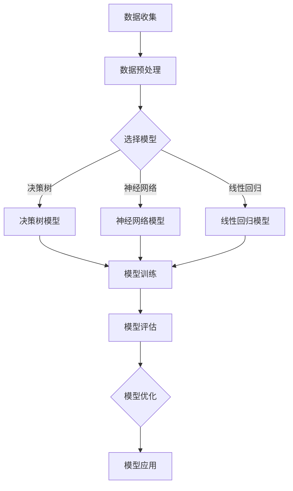

#### 1.2 多元模型思维的核心要素

多元模型思维的核心要素包括以下几个方面：

1. **数据多样性**：数据是模型的基础。多元模型思维需要收集和分析来自不同来源、不同类型的数据，如结构化数据、非结构化数据、实时数据和历史数据。

2. **模型多样化**：多元模型思维不仅仅是使用单一的模型，而是结合多种类型的模型，如预测模型、优化模型、分类模型等，以达到更好的分析效果。

3. **方法融合**：多元模型思维强调将不同的方法结合起来，如统计学方法、机器学习方法、领域知识等，以实现对问题的全面分析。

4. **跨学科知识**：多元模型思维要求管理者具备跨学科的知识，如计算机科学、统计学、经济学、心理学等，以更好地理解和管理复杂问题。

下面是一个Mermaid流程图，展示了多元模型思维的核心要素：

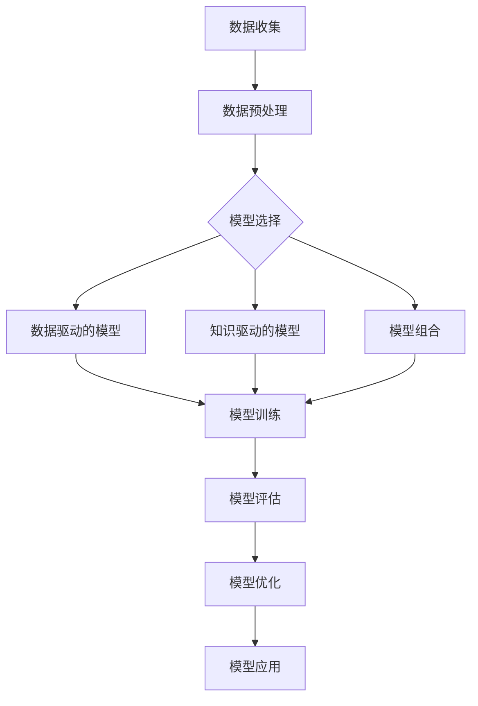

#### 1.3 多元模型思维的重要性

多元模型思维的重要性体现在以下几个方面：

1. **提升决策质量**：多元模型思维能够提供全面、准确的信息，帮助管理者做出科学、合理的决策。通过整合多种模型和数据分析方法，管理者可以从多个角度分析问题，减少决策的盲目性和风险。

2. **增强适应性**：在面对不确定性和动态变化时，多元模型思维能够帮助管理者快速调整策略，适应环境变化。通过不断地收集和分析数据，管理者可以及时了解市场动态和竞争态势，制定灵活的应对策略。

3. **优化资源配置**：多元模型思维可以帮助管理者更有效地分配资源，提高资源利用效率。通过分析不同模型和数据分析方法的结果，管理者可以更准确地预测未来的需求，优化生产和投资决策。

4. **提升创新能力**：多元模型思维鼓励管理者从多个角度思考问题，这有助于激发创新思维。通过整合不同的知识和数据，管理者可以提出新的解决方案，推动企业的创新和发展。

下面是一个Mermaid流程图，展示了多元模型思维如何提升决策质量：

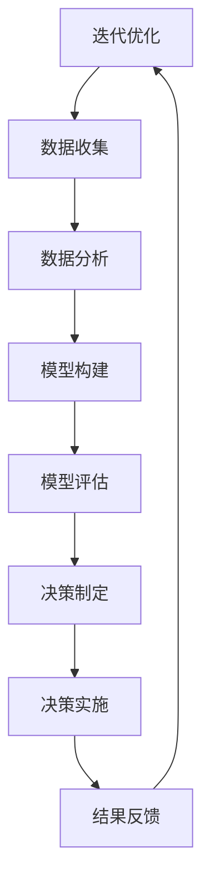

#### 1.4 多元模型思维的应用领域

多元模型思维在管理中的应用非常广泛，可以应用于战略规划、运营管理、风险管理、创新管理等多个领域。

1. **战略规划**：在战略规划中，多元模型思维可以帮助管理者进行市场分析、竞争分析和资源分配，制定科学的战略规划。

2. **运营管理**：在运营管理中，多元模型思维可以帮助管理者优化供应链、人力资源管理、产品管理和客户关系管理等流程，提升运营效率。

3. **风险管理**：在风险管理中，多元模型思维可以帮助管理者进行风险评估、风险控制和风险沟通，降低企业风险。

4. **创新管理**：在创新管理中，多元模型思维可以帮助管理者制定创新策略、管理创新过程、建设创新团队和评估创新项目，推动企业的创新和发展。

下面是一个Mermaid流程图，展示了多元模型思维在不同管理领域的应用：

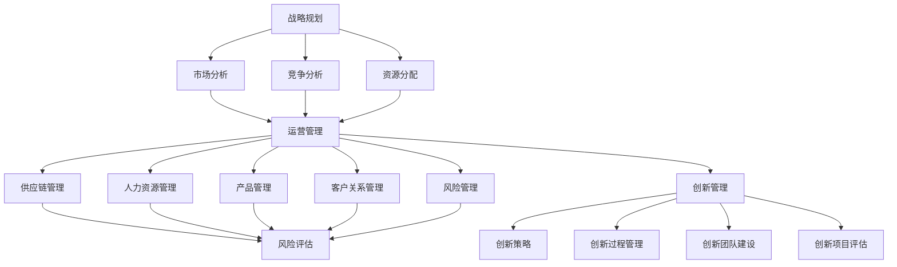

#### 1.4.1 多元模型思维在战略规划中的应用

在战略规划中，多元模型思维可以帮助管理者从多个角度分析市场、竞争对手和自身资源，制定科学的战略规划。

1. **市场分析**：通过多元模型思维，管理者可以整合多种市场数据，预测市场趋势、分析消费者行为，为市场定位和营销策略提供依据。

2. **竞争分析**：多元模型思维可以帮助管理者分析竞争对手的优势和劣势，制定有效的竞争策略。

3. **资源分配**：通过多元模型思维，管理者可以优化资源分配，提高资源利用效率，实现战略目标。

下面是一个Mermaid流程图，展示了多元模型思维在战略规划中的应用：

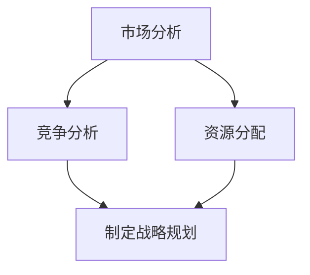

#### 1.4.2 多元模型思维在运营管理中的应用

在运营管理中，多元模型思维可以帮助管理者优化供应链、人力资源管理、产品管理和客户关系管理等流程，提升运营效率。

1. **供应链管理**：通过多元模型思维，管理者可以优化供应链流程、降低成本、提高效率，实现供应链的优化管理。

2. **人力资源管理**：通过多元模型思维，管理者可以分析员工数据、优化招聘和培训流程，提升员工绩效和企业竞争力。

3. **产品管理**：通过多元模型思维，管理者可以分析市场需求、优化产品设计，提升产品竞争力。

4. **客户关系管理**：通过多元模型思维，管理者可以分析客户行为、优化客户服务，提升客户满意度和忠诚度。

下面是一个Mermaid流程图，展示了多元模型思维在运营管理中的应用：

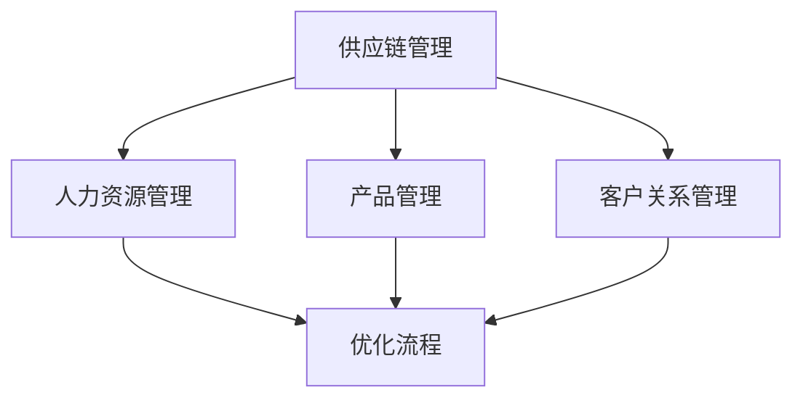

#### 1.4.3 多元模型思维在风险管理中的应用

在风险管理中，多元模型思维可以帮助管理者进行风险评估、风险控制和风险沟通，降低企业风险。

1. **风险评估**：通过多元模型思维，管理者可以整合多种风险数据，预测风险概率和影响，制定有效的风险控制策略。

2. **风险控制**：通过多元模型思维，管理者可以优化风险控制措施、提高风险应对能力，降低企业风险。

3. **风险沟通与报告**：通过多元模型思维，管理者可以提高风险沟通的准确性和有效性，确保风险信息能够及时传递。

下面是一个Mermaid流程图，展示了多元模型思维在风险管理中的应用：

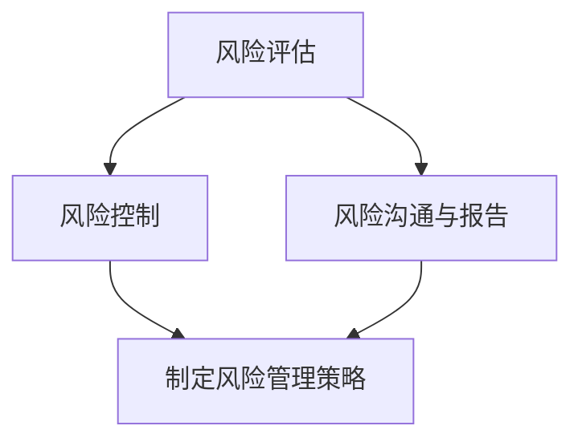

#### 1.4.4 多元模型思维在创新管理中的应用

在创新管理中，多元模型思维可以帮助管理者制定创新策略、管理创新过程、建设创新团队和评估创新项目，推动企业的创新和发展。

1. **创新策略**：通过多元模型思维，管理者可以分析市场趋势、技术发展，制定科学的创新策略。

2. **创新过程管理**：通过多元模型思维，管理者可以优化创新流程、提高创新效率，实现创新目标。

3. **创新团队建设**：通过多元模型思维，管理者可以分析团队构成、优化团队协作，提升创新团队的能力。

4. **创新项目评估**：通过多元模型思维，管理者可以评估创新项目的可行性、效益和风险，制定科学的创新项目评估策略。

下面是一个Mermaid流程图，展示了多元模型思维在创新管理中的应用：

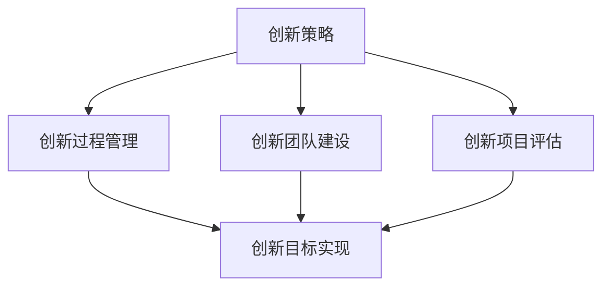

### 第2章：多元模型思维的发展历程

#### 2.1 传统模型的局限性

在传统的管理理论中，管理者通常依赖于单一的模型或方法进行决策。例如，线性回归模型、决策树模型等，这些模型在处理简单问题时效果较好，但在面对复杂、动态的环境时，其局限性逐渐显现。

1. **单一视角**：传统模型往往只能从一个角度分析问题，难以全面、深入地理解问题的本质。
2. **数据依赖**：传统模型对数据质量要求较高，数据的不准确或缺失可能导致模型失效。
3. **模型固定**：传统模型一旦建立，就很难进行调整和优化，无法适应环境的变化。

下面是一个Mermaid流程图，展示了传统模型的局限性：

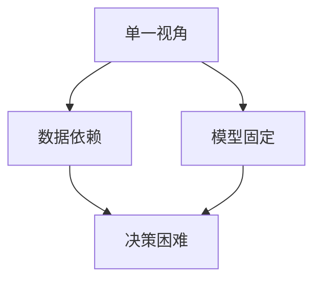

#### 2.2 多元模型思维的起源

多元模型思维的起源可以追溯到20世纪中叶，随着计算机技术的发展和统计学理论的完善，人们开始探索如何整合多种数据来源和模型，以提升分析能力。

1. **计算机技术的发展**：计算机的普及和性能的提升，使得处理大规模数据和复杂模型成为可能。
2. **统计学理论的完善**：概率论、统计学等领域的理论发展，为多元模型思维提供了坚实的理论基础。
3. **数据驱动方法**：随着大数据技术的发展，数据驱动的多元模型逐渐成为主流，如机器学习、深度学习等。

下面是一个Mermaid流程图，展示了多元模型思维的起源：

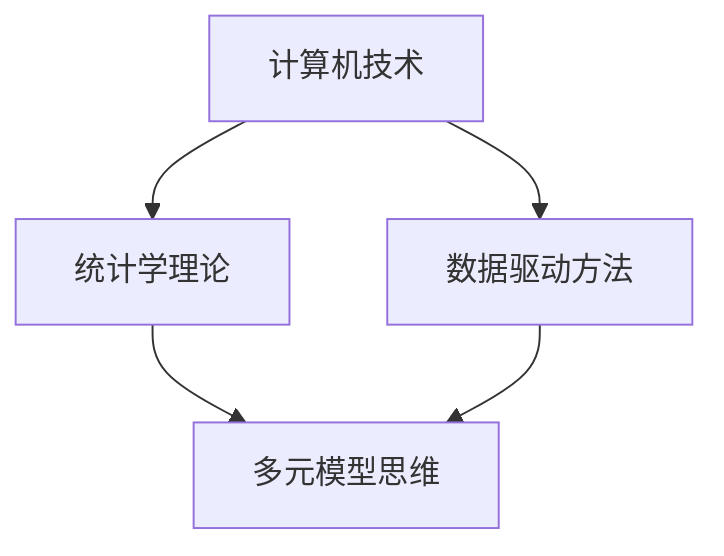

#### 2.3 多元模型思维的发展趋势

多元模型思维在近年来得到了快速发展，其主要发展趋势如下：

1. **数据多样性**：随着数据类型的增加，如非结构化数据、实时数据等，多元模型思维需要不断适应和整合这些新数据类型。
2. **模型多样性**：除了传统的预测、优化和分析模型外，多元模型思维还结合了深度学习、强化学习等新型模型。
3. **方法融合**：多元模型思维不断与其他学科和领域结合，如经济学、心理学等，形成更加综合的管理理论和方法。

下面是一个Mermaid流程图，展示了多元模型思维的发展趋势：

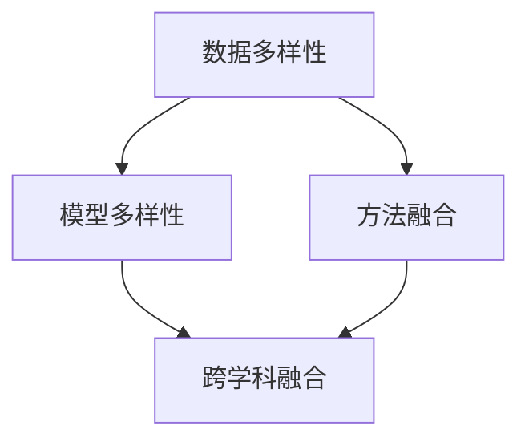

### 第3章：多元模型思维的核心方法

#### 3.1 数据驱动的多元模型

数据驱动的多元模型是多元模型思维的核心方法之一。它通过分析大量的数据，从中提取有用的信息和规律，构建复杂的预测和优化模型。

1. **数据收集**：收集来自不同来源的数据，如历史数据、实时数据和第三方数据。
2. **数据预处理**：对收集到的数据进行清洗、归一化、缺失值处理等操作，以保证数据的质量。
3. **特征工程**：通过特征提取和特征选择，将原始数据转化为模型可以处理的特征。
4. **模型训练**：选择合适的模型，如线性回归、决策树、神经网络等，对数据进行训练。
5. **模型评估**：通过交叉验证、性能指标等对模型进行评估和优化。
6. **模型应用**：将训练好的模型应用到实际问题中，如预测、分类、优化等。

下面是一个Mermaid流程图，展示了数据驱动的多元模型的基本流程：

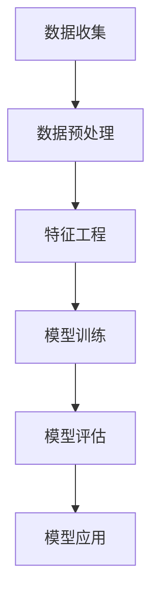

#### 3.2 基于知识的多元模型

基于知识的多元模型是另一种重要的多元模型思维方法。它通过整合领域知识和数据，构建复杂的预测和优化模型。

1. **知识提取**：从专家的经验和文献中提取有用的知识，如规则、关系和假设。
2. **知识表示**：将提取的知识转化为模型可以处理的表示形式，如规则库、知识图谱等。
3. **知识融合**：将不同来源的知识进行整合，形成统一的表示形式。
4. **模型训练**：结合数据驱动的模型，对知识进行训练和优化。
5. **模型评估**：通过交叉验证、性能指标等对模型进行评估和优化。
6. **模型应用**：将训练好的模型应用到实际问题中，如预测、分类、优化等。

下面是一个Mermaid流程图，展示了基于知识的多元模型的基本流程：

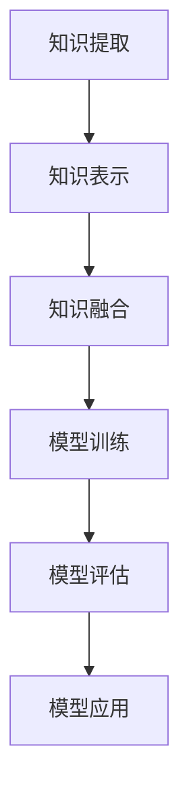

#### 3.3 基于模型的模型组合

基于模型的模型组合是将多个不同的模型组合在一起，通过模型之间的相互作用和优化，提升整体分析能力。

1. **模型选择**：选择合适的模型，如预测模型、优化模型、分类模型等。
2. **模型训练**：对每个模型进行独立训练，得到各自的预测结果。
3. **模型融合**：将多个模型的预测结果进行融合，形成最终的预测结果。
4. **模型评估**：通过交叉验证、性能指标等对模型进行评估和优化。
5. **模型应用**：将训练好的模型应用到实际问题中，如预测、分类、优化等。

下面是一个Mermaid流程图，展示了基于模型的模型组合的基本流程：

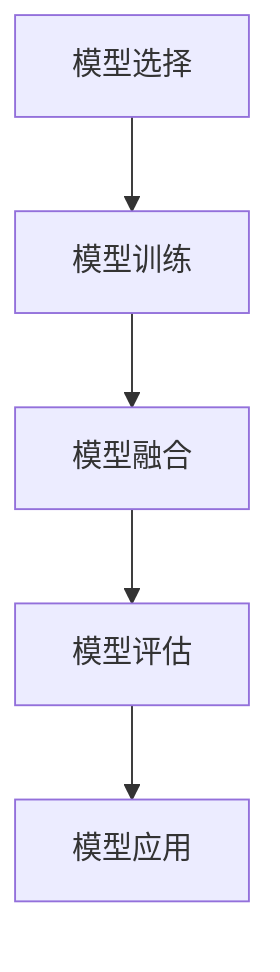

#### 3.4 多元模型的评估与优化

多元模型的评估与优化是多元模型思维的重要组成部分。它包括模型选择、参数调整和模型集成等方面。

1. **模型选择**：选择合适的模型，通常需要考虑模型的准确性、稳定性、可解释性等指标。
2. **参数调整**：通过调整模型的参数，优化模型的性能。
3. **模型集成**：将多个模型的结果进行融合，形成最终的预测结果。
4. **模型评估**：通过交叉验证、性能指标等对模型进行评估和优化。
5. **模型应用**：将训练好的模型应用到实际问题中，如预测、分类、优化等。

下面是一个Mermaid流程图，展示了多元模型的评估与优化流程：

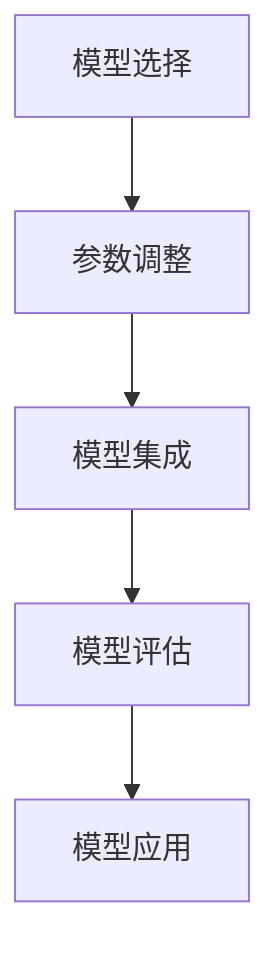

### 第4章：多元模型思维在战略规划中的应用

#### 4.1 战略规划中的多元模型思维

在战略规划中，多元模型思维可以帮助管理者从多个角度分析市场、竞争对手和自身资源，制定科学的战略规划。

1. **市场分析**：通过多元模型思维，管理者可以整合多种市场数据，预测市场趋势、分析消费者行为，为市场定位和营销策略提供依据。
2. **竞争分析**：通过多元模型思维，管理者可以分析竞争对手的优势和劣势，制定有效的竞争策略。
3. **资源分配**：通过多元模型思维，管理者可以优化资源分配，提高资源利用效率，实现战略目标。

下面是一个Mermaid流程图，展示了多元模型思维在战略规划中的应用：


#### 4.2 利用多元模型进行市场分析

市场分析是战略规划的关键步骤，多元模型思维可以通过整合多种市场数据，预测市场趋势、分析消费者行为，为市场定位和营销策略提供依据。

1. **数据收集**：收集各种市场数据，如销售额、市场份额、消费者调查数据等。
2. **数据预处理**：对收集到的数据进行清洗、归一化、缺失值处理等操作，以保证数据的质量。
3. **特征工程**：通过特征提取和特征选择，将原始数据转化为模型可以处理的特征。
4. **模型选择**：选择合适的模型，如时间序列模型、回归模型等。
5. **模型训练**：对数据进行训练，得到预测模型。
6. **模型评估**：通过交叉验证、性能指标等对模型进行评估和优化。
7. **模型应用**：将训练好的模型应用到实际问题中，如预测市场趋势、分析消费者行为等。

下面是一个Mermaid流程图，展示了多元模型思维在市场分析中的应用：

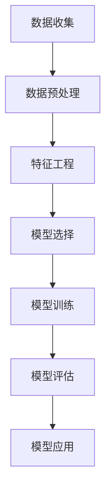

#### 4.3 多元模型在竞争分析中的应用

竞争分析是战略规划的重要组成部分，多元模型思维可以通过分析竞争对手的优势和劣势，制定有效的竞争策略。

1. **数据收集**：收集竞争对手的市场份额、产品特性、营销策略等数据。
2. **数据预处理**：对收集到的数据进行清洗、归一化、缺失值处理等操作，以保证数据的质量。
3. **特征工程**：通过特征提取和特征选择，将原始数据转化为模型可以处理的特征。
4. **模型选择**：选择合适的模型，如聚类模型、分类模型等。
5. **模型训练**：对数据进行训练，得到预测模型。
6. **模型评估**：通过交叉验证、性能指标等对模型进行评估和优化。
7. **模型应用**：将训练好的模型应用到实际问题中，如分析竞争对手的优势和劣势、预测竞争对手的未来动作等。

下面是一个Mermaid流程图，展示了多元模型思维在竞争分析中的应用：


#### 4.4 多元模型在资源分配中的应用

资源分配是战略规划的核心内容之一，多元模型思维可以通过优化资源分配，提高资源利用效率，实现战略目标。

1. **数据收集**：收集各种资源的数据，如人力、资金、设备等。
2. **数据预处理**：对收集到的数据进行清洗、归一化、缺失值处理等操作，以保证数据的质量。
3. **特征工程**：通过特征提取和特征选择，将原始数据转化为模型可以处理的特征。
4. **模型选择**：选择合适的模型，如线性规划模型、网络优化模型等。
5. **模型训练**：对数据进行训练，得到优化模型。
6. **模型评估**：通过交叉验证、性能指标等对模型进行评估和优化。
7. **模型应用**：将训练好的模型应用到实际问题中，如优化资源分配、降低成本等。

下面是一个Mermaid流程图，展示了多元模型思维在资源分配中的应用：


### 第5章：多元模型思维在运营管理中的应用

#### 5.1 多元模型思维在供应链管理中的应用

在供应链管理中，多元模型思维可以帮助管理者优化供应链流程、降低成本、提高效率，实现供应链的优化管理。

1. **数据收集**：收集供应链各环节的数据，如库存水平、运输成本、供应商绩效等。
2. **数据预处理**：对收集到的数据进行清洗、归一化、缺失值处理等操作，以保证数据的质量。
3. **特征工程**：通过特征提取和特征选择，将原始数据转化为模型可以处理的特征。
4. **模型选择**：选择合适的模型，如时间序列模型、回归模型等。
5. **模型训练**：对数据进行训练，得到预测和优化模型。
6. **模型评估**：通过交叉验证、性能指标等对模型进行评估和优化。
7. **模型应用**：将训练好的模型应用到实际问题中，如优化库存管理、降低运输成本等。

下面是一个Mermaid流程图，展示了多元模型思维在供应链管理中的应用：


#### 5.2 多元模型思维在人力资源管理中的应用

在人力资源管理中，多元模型思维可以帮助管理者分析员工数据、优化招聘和培训流程，提升员工绩效和企业竞争力。

1. **数据收集**：收集员工数据，如绩效评估、培训记录、员工流动等。
2. **数据预处理**：对收集到的数据进行清洗、归一化、缺失值处理等操作，以保证数据的质量。
3. **特征工程**：通过特征提取和特征选择，将原始数据转化为模型可以处理的特征。
4. **模型选择**：选择合适的模型，如回归模型、聚类模型等。
5. **模型训练**：对数据进行训练，得到预测和优化模型。
6. **模型评估**：通过交叉验证、性能指标等对模型进行评估和优化。
7. **模型应用**：将训练好的模型应用到实际问题中，如预测员工流动、优化招聘策略等。

下面是一个Mermaid流程图，展示了多元模型思维在人力资源管理中的应用：

```mermaid
graph TD
A[数据收集] --> B[数据预处理]
B --> C[特征工程]
C --> D[模型选择]
D --> E[模型训练]
E --> F[模型评估]
F --> G[模型应用]
```

#### 5.3 多元模型思维在产品管理中的应用

在产品管理中，多元模型思维可以帮助管理者分析市场需求、优化产品设计，提升产品竞争力。

1. **数据收集**：收集市场需求数据，如销售数据、用户反馈、竞争分析等。
2. **数据预处理**：对收集到的数据进行清洗、归一化、缺失值处理等操作，以保证数据的质量。
3. **特征工程**：通过特征提取和特征选择，将原始数据转化为模型可以处理的特征。
4. **模型选择**：选择合适的模型，如时间序列模型、回归模型等。
5. **模型训练**：对数据进行训练，得到预测和优化模型。
6. **模型评估**：通过交叉验证、性能指标等对模型进行评估和优化。
7. **模型应用**：将训练好的模型应用到实际问题中，如预测市场需求、优化产品设计等。

下面是一个Mermaid流程图，展示了多元模型思维在产品管理中的应用：

```mermaid
graph TD
A[数据收集] --> B[数据预处理]
B --> C[特征工程]
C --> D[模型选择]
D --> E[模型训练]
E --> F[模型评估]
F --> G[模型应用]
```

#### 5.4 多元模型思维在客户关系管理中的应用

在客户关系管理中，多元模型思维可以帮助管理者分析客户行为、优化客户服务，提升客户满意度和忠诚度。

1. **数据收集**：收集客户数据，如购买历史、客户反馈、服务记录等。
2. **数据预处理**：对收集到的数据进行清洗、归一化、缺失值处理等操作，以保证数据的质量。
3. **特征工程**：通过特征提取和特征选择，将原始数据转化为模型可以处理的特征。
4. **模型选择**：选择合适的模型，如聚类模型、分类模型等。
5. **模型训练**：对数据进行训练，得到预测和优化模型。
6. **模型评估**：通过交叉验证、性能指标等对模型进行评估和优化。
7. **模型应用**：将训练好的模型应用到实际问题中，如预测客户流失、优化客户服务策略等。

下面是一个Mermaid流程图，展示了多元模型思维在客户关系管理中的应用：

```mermaid
graph TD
A[数据收集] --> B[数据预处理]
B --> C[特征工程]
C --> D[模型选择]
D --> E[模型训练]
E --> F[模型评估]
F --> G[模型应用]
```

### 第6章：多元模型思维在风险管理中的应用

#### 6.1 多元模型思维在风险评估中的应用

在风险管理中，多元模型思维可以帮助管理者进行风险评估，预测风险概率和影响，制定有效的风险控制策略。

1. **数据收集**：收集各种风险数据，如历史风险事件、潜在风险因素等。
2. **数据预处理**：对收集到的数据进行清洗、归一化、缺失值处理等操作，以保证数据的质量。
3. **特征工程**：通过特征提取和特征选择，将原始数据转化为模型可以处理的特征。
4. **模型选择**：选择合适的模型，如概率模型、决策树等。
5. **模型训练**：对数据进行训练，得到预测模型。
6. **模型评估**：通过交叉验证、性能指标等对模型进行评估和优化。
7. **模型应用**：将训练好的模型应用到实际问题中，如预测风险概率和影响、制定风险控制策略等。

下面是一个Mermaid流程图，展示了多元模型思维在风险评估中的应用：

```mermaid
graph TD
A[数据收集] --> B[数据预处理]
B --> C[特征工程]
C --> D[模型选择]
D --> E[模型训练]
E --> F[模型评估]
F --> G[模型应用]
```

#### 6.2 多元模型思维在风险控制中的应用

在风险控制中，多元模型思维可以帮助管理者优化风险控制措施、提高风险应对能力，降低企业风险。

1. **数据收集**：收集风险控制措施的数据，如风险预警、应急响应等。
2. **数据预处理**：对收集到的数据进行清洗、归一化、缺失值处理等操作，以保证数据的质量。
3. **特征工程**：通过特征提取和特征选择，将原始数据转化为模型可以处理的特征。
4. **模型选择**：选择合适的模型，如优化模型、决策树等。
5. **模型训练**：对数据进行训练，得到预测和优化模型。
6. **模型评估**：通过交叉验证、性能指标等对模型进行评估和优化。
7. **模型应用**：将训练好的模型应用到实际问题中，如优化风险控制措施、提高风险应对能力等。

下面是一个Mermaid流程图，展示了多元模型思维在风险控制中的应用：

```mermaid
graph TD
A[数据收集] --> B[数据预处理]
B --> C[特征工程]
C --> D[模型选择]
D --> E[模型训练]
E --> F[模型评估]
F --> G[模型应用]
```

#### 6.3 多元模型思维在风险管理策略制定中的应用

在风险管理策略制定中，多元模型思维可以帮助管理者分析不同风险管理策略的优缺点，制定最合适的风险管理策略。

1. **数据收集**：收集不同风险管理策略的数据，如风险识别、风险评估、风险控制等。
2. **数据预处理**：对收集到的数据进行清洗、归一化、缺失值处理等操作，以保证数据的质量。
3. **特征工程**：通过特征提取和特征选择，将原始数据转化为模型可以处理的特征。
4. **模型选择**：选择合适的模型，如回归模型、决策树等。
5. **模型训练**：对数据进行训练，得到预测和优化模型。
6. **模型评估**：通过交叉验证、性能指标等对模型进行评估和优化。
7. **模型应用**：将训练好的模型应用到实际问题中，如分析风险管理策略的优缺点、制定最合适的风险管理策略等。

下面是一个Mermaid流程图，展示了多元模型思维在风险管理策略制定中的应用：

```mermaid
graph TD
A[数据收集] --> B[数据预处理]
B --> C[特征工程]
C --> D[模型选择]
D --> E[模型训练]
E --> F[模型评估]
F --> G[模型应用]
```

#### 6.4 多元模型思维在风险沟通与报告中的应用

在风险沟通与报告中，多元模型思维可以帮助管理者提高风险沟通的准确性和有效性，确保风险信息能够及时传递。

1. **数据收集**：收集风险沟通的数据，如风险报告、风险预警等。
2. **数据预处理**：对收集到的数据进行清洗、归一化、缺失值处理等操作，以保证数据的质量。
3. **特征工程**：通过特征提取和特征选择，将原始数据转化为模型可以处理的特征。
4. **模型选择**：选择合适的模型，如文本分类模型、情感分析模型等。
5. **模型训练**：对数据进行训练，得到预测和优化模型。
6. **模型评估**：通过交叉验证、性能指标等对模型进行评估和优化。
7. **模型应用**：将训练好的模型应用到实际问题中，如分析风险报告的内容、提高风险预警的准确性等。

下面是一个Mermaid流程图，展示了多元模型思维在风险沟通与报告中的应用：

```mermaid
graph TD
A[数据收集] --> B[数据预处理]
B --> C[特征工程]
C --> D[模型选择]
D --> E[模型训练]
E --> F[模型评估]
F --> G[模型应用]
```

### 第7章：多元模型思维在创新管理中的应用

#### 7.1 多元模型思维在创新策略制定中的应用

在创新策略制定中，多元模型思维可以帮助管理者分析市场趋势、技术发展，制定科学的创新策略。

1. **数据收集**：收集与市场趋势、技术发展相关的数据，如市场研究报告、技术文献等。
2. **数据预处理**：对收集到的数据进行清洗、归一化、缺失值处理等操作，以保证数据的质量。
3. **特征工程**：通过特征提取和特征选择，将原始数据转化为模型可以处理的特征。
4. **模型选择**：选择合适的模型，如回归模型、聚类模型等。
5. **模型训练**：对数据进行训练，得到预测和优化模型。
6. **模型评估**：通过交叉验证、性能指标等对模型进行评估和优化。
7. **模型应用**：将训练好的模型应用到实际问题中，如预测市场趋势、分析技术发展方向等。

下面是一个Mermaid流程图，展示了多元模型思维在创新策略制定中的应用：

```mermaid
graph TD
A[数据收集] --> B[数据预处理]
B --> C[特征工程]
C --> D[模型选择]
D --> E[模型训练]
E --> F[模型评估]
F --> G[模型应用]
```

#### 7.2 多元模型思维在创新过程管理中的应用

在创新过程管理中，多元模型思维可以帮助管理者优化创新流程、提高创新效率，实现创新目标。

1. **数据收集**：收集与创新过程相关的数据，如项目进度、团队协作、资源配置等。
2. **数据预处理**：对收集到的数据进行清洗、归一化、缺失值处理等操作，以保证数据的质量。
3. **特征工程**：通过特征提取和特征选择，将原始数据转化为模型可以处理的特征。
4. **模型选择**：选择合适的模型，如回归模型、网络优化模型等。
5. **模型训练**：对数据进行训练，得到预测和优化模型。
6. **模型评估**：通过交叉验证、性能指标等对模型进行评估和优化。
7. **模型应用**：将训练好的模型应用到实际问题中，如优化创新流程、提高团队协作效率等。

下面是一个Mermaid流程图，展示了多元模型思维在创新过程管理中的应用：

```mermaid
graph TD
A[数据收集] --> B[数据预处理]
B --> C[特征工程]
C --> D[模型选择]
D --> E[模型训练]
E --> F[模型评估]
F --> G[模型应用]
```

#### 7.3 多元模型思维在创新团队建设中的应用

在创新团队建设
```markdown
### 第8章：多元模型思维的实践策略

#### 8.1 多元模型思维的实践步骤

多元模型思维的实践步骤主要包括以下几个环节：

1. **需求分析**：明确问题背景和目标，确定需要解决的问题和预期的效果。

2. **数据收集**：根据需求分析，收集相关的数据，包括结构化数据、非结构化数据等。

3. **数据预处理**：对收集到的数据进行清洗、去重、缺失值处理等操作，以确保数据的质量和一致性。

4. **特征工程**：通过特征提取和特征选择，将原始数据转化为模型可以处理的特征向量。

5. **模型选择**：根据问题的类型和数据特点，选择合适的模型或模型组合。

6. **模型训练**：使用训练数据对模型进行训练，调整模型参数，优化模型性能。

7. **模型评估**：通过测试数据对模型进行评估，选择最优模型。

8. **模型应用**：将训练好的模型应用到实际问题中，进行预测、优化或决策。

下面是一个Mermaid流程图，展示了多元模型思维的实践步骤：

```mermaid
graph TD
A[需求分析] --> B[数据收集]
B --> C[数据预处理]
C --> D[特征工程]
D --> E[模型选择]
E --> F[模型训练]
F --> G[模型评估]
G --> H[模型应用]
```

#### 8.2 多元模型思维的组织支持

为了有效地实践多元模型思维，组织需要提供以下支持：

1. **组织文化**：建立开放、创新、协作的组织文化，鼓励员工跨部门合作，分享知识和经验。

2. **资源配备**：配备必要的硬件设备、软件工具和数据分析团队，确保多元模型思维实践的顺利进行。

3. **管理机制**：建立完善的管理机制，包括决策机制、反馈机制和评估机制，确保多元模型思维的实践能够持续改进。

4. **培训与学习**：提供定期的培训和学习机会，帮助员工掌握多元模型思维的方法和技能。

#### 8.3 多元模型思维的资源整合

资源整合是多元模型思维实践的关键，包括以下几个方面：

1. **数据资源整合**：整合来自不同来源、不同类型的数据，包括内部数据和外部数据，提高数据利用效率。

2. **知识资源整合**：整合企业内外部的知识资源，包括专家知识、文献资料、行业报告等，为多元模型思维提供丰富的知识支持。

3. **技术资源整合**：整合先进的数据分析技术、机器学习算法和人工智能技术，提高模型构建和优化能力。

4. **人才资源整合**：整合具有不同专业背景的人才，形成多元化的团队，发挥集体智慧，实现知识互补。

#### 8.4 多元模型思维的持续学习与改进

持续学习与改进是多元模型思维实践的核心，包括以下几个方面：

1. **定期回顾**：定期对多元模型思维实践进行回顾和总结，分析实践中的成功经验和不足之处，为下一轮实践提供参考。

2. **知识更新**：关注最新的研究成果和技术动态，不断更新知识和技能，确保多元模型思维实践始终保持先进性。

3. **实践反馈**：建立实践反馈机制，收集用户的反馈意见，及时调整模型和策略，提高实践效果。

4. **持续改进**：基于实践反馈和知识更新，不断优化多元模型思维实践的方法和流程，实现持续改进。

### 第9章：多元模型思维的拓展与应用

#### 9.1 多元模型思维在新兴领域中的应用

随着新兴领域的发展，多元模型思维在这些领域的应用越来越广泛。以下是多元模型思维在新兴领域中的应用：

1. **人工智能**：在人工智能领域，多元模型思维可以帮助优化算法、提高模型的准确性。例如，通过结合深度学习和强化学习模型，可以提升智能系统的自适应能力和决策质量。

2. **物联网**：在物联网领域，多元模型思维可以帮助分析大量传感器数据，实现设备的智能监控和维护。例如，通过整合时间序列分析和聚类分析模型，可以预测设备故障，提前进行维护。

3. **区块链**：在区块链领域，多元模型思维可以帮助分析交易数据，识别欺诈行为和异常交易。例如，通过结合机器学习和区块链分析模型，可以实时监控交易情况，确保交易的安全性和透明性。

#### 9.2 多元模型思维的未来发展趋势

多元模型思维在未来将呈现以下发展趋势：

1. **智能化**：随着人工智能技术的发展，多元模型思维将更加智能化，能够自动选择和调整模型，实现自适应分析。

2. **多样化**：多元模型思维将融合更多类型的模型和方法，包括图模型、强化学习模型、知识图谱等，形成更加多样化的分析框架。

3. **融合化**：多元模型思维将与其他管理理论和方法融合，形成更加综合的管理体系，提升管理的科学性和有效性。

4. **全球化**：多元模型思维将在全球范围内得到更广泛的应用，帮助企业应对全球化和数字化转型带来的挑战。

#### 9.3 多元模型思维与其他管理理论的融合

多元模型思维与其他管理理论的融合将形成更加系统化、科学化的管理方法。以下是多元模型思维与其他管理理论融合的一些实例：

1. **战略管理**：多元模型思维可以与战略管理理论融合，帮助企业制定更科学、更灵活的战略规划。例如，通过结合市场分析和竞争分析模型，可以更准确地预测市场趋势和竞争态势，制定相应的战略策略。

2. **质量管理**：多元模型思维可以与质量管理理论融合，帮助企业实现全面质量管理。例如，通过结合过程控制和统计分析模型，可以实时监控产品质量，识别潜在问题，及时进行调整。

3. **人力资源管理**：多元模型思维可以与人力资源管理理论融合，帮助企业优化人力资源管理。例如，通过结合绩效评估模型和员工满意度模型，可以制定更合理的薪酬激励政策和人才发展计划。

#### 9.4 多元模型思维在全球管理实践中的应用

多元模型思维在全球管理实践中的应用日益广泛，帮助企业应对全球化带来的挑战。以下是多元模型思维在全球管理实践中的应用：

1. **跨国企业管理**：多元模型思维可以帮助跨国企业更好地理解不同国家和地区的市场环境和文化差异，制定适应性的管理策略。

2. **全球供应链管理**：多元模型思维可以帮助企业优化全球供应链管理，降低成本、提高效率。例如，通过整合多种供应链模型，可以实时监控供应链的各个环节，优化库存管理和运输计划。

3. **全球财务管理**：多元模型思维可以帮助企业制定全球财务管理策略，优化资本结构和投资决策。例如，通过结合多种财务模型，可以更准确地预测市场风险和财务状况，制定相应的风险管理策略。

### 第10章：多元模型思维的案例分析

#### 10.1 案例分析概述

本文将通过多个实际案例分析，展示多元模型思维在管理实践中的应用效果。以下是几个案例的简要介绍：

1. **案例一：多元化战略的制定与实施**：某大型企业在多元化战略制定与实施过程中，如何运用多元模型思维进行市场分析、竞争分析和资源分配。

2. **案例二：多元化模型在运营管理中的应用**：某知名电商平台如何运用多元模型思维优化供应链、人力资源管理、产品管理和客户关系管理。

3. **案例三：多元化模型在风险管理中的应用**：某金融机构如何运用多元模型思维进行风险评估、风险控制和风险沟通与报告。

4. **案例四：多元化模型在创新管理中的应用**：某科技公司在创新管理中如何运用多元模型思维制定创新策略、管理创新过程、建设创新团队和评估创新项目。

#### 10.2 案例一：多元化战略的制定与实施

**案例背景**：某大型企业在面临市场竞争加剧、客户需求多样化等挑战时，决定实施多元化战略，以扩大市场份额和提高竞争力。

**多元模型思维应用**：

1. **市场分析**：通过多元模型思维，企业收集了大量的市场数据，包括市场份额、消费者行为、竞争对手策略等。使用回归分析、聚类分析等模型，对企业所处的市场环境进行了深入分析，确定了市场定位和目标客户群体。

2. **竞争分析**：通过多元模型思维，企业分析了竞争对手的优势和劣势，使用了决策树、网络分析等模型，制定了相应的竞争策略，如提高产品质量、降低成本等。

3. **资源分配**：通过多元模型思维，企业整合了内部资源，包括人力、资金、技术等，使用了线性规划、网络优化等模型，优化了资源的配置，确保多元化战略的顺利实施。

**案例分析结果**：通过多元模型思维的应用，企业在多元化战略的制定与实施过程中，实现了市场定位准确、竞争策略有效、资源分配优化，取得了显著的业务增长和市场竞争力提升。

#### 10.3 案例二：多元化模型在运营管理中的应用

**案例背景**：某知名电商平台在运营管理中，面临订单处理效率低、库存管理混乱、客户服务水平不高等问题，决定运用多元化模型进行优化。

**多元模型思维应用**：

1. **供应链管理**：通过多元模型思维，电商平台整合了供应链各环节的数据，包括订单量、库存水平、供应商绩效等。使用时间序列分析、回归分析等模型，优化了库存管理和供应链流程，提高了订单处理效率。

2. **人力资源管理**：通过多元模型思维，电商平台分析了员工绩效、员工流动等数据。使用回归分析、聚类分析等模型，优化了招聘策略和培训计划，提高了员工绩效和客户服务水平。

3. **产品管理**：通过多元模型思维，电商平台分析了市场需求、用户反馈等数据。使用回归分析、聚类分析等模型，优化了产品设计和新品推广策略，提升了产品竞争力。

4. **客户关系管理**：通过多元模型思维，电商平台分析了客户行为、客户满意度等数据。使用回归分析、聚类分析等模型，优化了客户服务策略，提升了客户满意度和忠诚度。

**案例分析结果**：通过多元化模型的应用，电商平台在运营管理中实现了供应链流程优化、库存管理优化、人力资源管理优化、产品管理优化和客户关系管理优化，运营效率显著提升，客户满意度不断提高。

#### 10.4 案例三：多元化模型在风险管理中的应用

**案例背景**：某金融机构在风险管理中，面临信用风险、市场风险、操作风险等多重风险，决定运用多元化模型进行风险识别、评估和控制。

**多元模型思维应用**：

1. **风险评估**：通过多元模型思维，金融机构收集了大量的风险数据，包括历史风险事件、行业报告、客户信用记录等。使用回归分析、贝叶斯网络等模型，对各类风险的概率和影响进行了评估，制定了相应的风险控制策略。

2. **风险控制**：通过多元模型思维，金融机构使用了风险控制模型，如止损模型、风险平价模型等，优化了风险控制措施，降低了信用风险、市场风险和操作风险。

3. **风险沟通与报告**：通过多元模型思维，金融机构建立了风险沟通机制，定期向管理层和投资者报告风险状况。使用文本分析、情感分析等模型，提高了风险报告的准确性和有效性。

**案例分析结果**：通过多元化模型的应用，金融机构在风险管理中实现了风险识别准确、风险控制有效、风险沟通畅通，风险水平显著降低，保障了金融机构的稳健运营。

#### 10.5 案例四：多元化模型在创新管理中的应用

**案例背景**：某科技公司致力于科技创新，希望在创新管理中运用多元化模型，提高创新效率、优化创新过程、建设创新团队和评估创新项目。

**多元模型思维应用**：

1. **创新策略制定**：通过多元模型思维，科技公司分析了市场需求、技术发展趋势等数据。使用回归分析、聚类分析等模型，制定了创新策略，明确了创新方向和目标。

2. **创新过程管理**：通过多元模型思维，科技公司使用了项目管理模型、流程优化模型等，优化了创新过程，提高了创新效率。

3. **创新团队建设**：通过多元模型思维，科技公司分析了团队成员的能力、专业背景等数据。使用聚类分析、回归分析等模型，优化了团队结构，提升了团队协作效率。

4. **创新项目评估**：通过多元模型思维，科技公司使用了成本效益分析模型、风险评估模型等，对创新项目进行了全面评估，确保了创新项目的可行性、效益和风险。

**案例分析结果**：通过多元化模型的应用，科技公司在创新管理中实现了创新策略制定科学、创新过程管理优化、创新团队建设高效、创新项目评估准确，创新成果显著，公司竞争力不断提升。

### 附录 A：多元模型思维的相关工具与方法

#### A.1 数据分析工具简介

数据分析是多元模型思维的核心环节，以下介绍几种常用的数据分析工具：

1. **Python**：Python是一种广泛使用的编程语言，具有丰富的数据分析库，如NumPy、Pandas、Matplotlib等。Python适合处理大规模数据和复杂的分析任务。

2. **R**：R是一种专门用于统计分析和图形绘制的语言，具有强大的统计和图形功能。R适用于复杂数据分析和高级统计模型。

3. **Excel**：Excel是办公软件中常用的数据分析工具，适合处理中小规模的数据和简单的统计分析。

#### A.2 机器学习框架简介

机器学习是多元模型思维的重要组成部分，以下介绍几种常用的机器学习框架：

1. **TensorFlow**：TensorFlow是谷歌开发的开放源代码机器学习框架，适用于构建和训练深度学习模型。

2. **PyTorch**：PyTorch是Facebook开发的开源机器学习库，以其灵活的动态计算图和易于使用的接口而受到欢迎。

3. **Scikit-learn**：Scikit-learn是Python的一个开源库，提供了多种机器学习算法和工具，适用于各种规模的数据集。

#### A.3 知识图谱技术简介

知识图谱技术是多元模型思维的重要组成部分，以下介绍知识图谱技术的基本原理和应用：

1. **知识图谱的基本原理**：知识图谱是通过实体和关系构建的语义网络，用于表示和存储知识。

2. **知识图谱的应用**：知识图谱可以应用于自然语言处理、信息检索、推荐系统等领域，提高数据分析的准确性和效率。

3. **知识图谱的构建**：知识图谱的构建包括数据采集、实体识别、关系抽取、实体链接等步骤。

#### A.4 多元模型思维的应用指南

以下提供多元模型思维的应用指南：

1. **问题定义**：明确需要解决的问题，确定目标和应用场景。

2. **数据收集**：收集相关的数据，包括结构化数据、非结构化数据和实时数据。

3. **数据预处理**：对数据进行清洗、归一化、缺失值处理等操作，保证数据的质量。

4. **特征工程**：通过特征提取和特征选择，将原始数据转化为模型可以处理的特征向量。

5. **模型选择**：根据问题的类型和数据特点，选择合适的模型或模型组合。

6. **模型训练**：使用训练数据对模型进行训练，调整模型参数，优化模型性能。

7. **模型评估**：通过测试数据对模型进行评估，选择最优模型。

8. **模型应用**：将训练好的模型应用到实际问题中，进行预测、优化或决策。

### 附录 B：多元模型思维的参考书籍与文献

#### B.1 多元模型思维领域的经典著作

以下推荐多元模型思维领域的经典著作：

1. **《数据模型论》**：本书详细介绍了数据模型的基本原理和应用，对多元模型思维提供了深刻的理解。

2. **《知识图谱技术》**：本书介绍了知识图谱的基本概念、构建方法和应用场景，对多元模型思维的应用提供了实用指导。

3. **《机器学习》**：本书是机器学习领域的经典教材，详细介绍了各种机器学习算法和模型，对多元模型思维的实现提供了技术支持。

#### B.2 多元模型思维的相关期刊与论文

以下推荐多元模型思维领域的相关期刊和论文：

1. **《人工智能学报》**：该期刊发表有关人工智能的最新研究成果，包括多元模型思维的理论和应用。

2. **《计算机科学》**：该期刊发表有关计算机科学的最新研究成果，包括多元模型思维在各个领域的应用。

3. **《数据挖掘》**：该期刊发表有关数据挖掘的最新研究成果，包括多元模型思维在数据分析中的应用。

#### B.3 多元模型思维的教育资源

以下推荐多元模型思维的教育资源：

1. **在线课程**：许多在线教育平台提供多元模型思维的课程，如Coursera、edX等，适合不同层次的学习者。

2. **教材**：多元模型思维的教材包括《多元模型思维导论》、《多元模型思维实践教程》等，适合教学和学习使用。

3. **培训项目**：许多培训机构提供多元模型思维的培训项目，包括理论讲解、实践操作和案例分析等，适合需要深入了解和应用多元模型思维的学习者。

#### B.4 多元模型思维的行业报告与案例集

以下推荐多元模型思维的行业报告和案例集：

1. **行业报告**：多元模型思维在各个行业的应用报告，如《人工智能在金融行业的应用报告》、《大数据在医疗行业的应用报告》等，提供了多元模型思维在具体行业的应用案例和经验。

2. **案例集**：多元模型思维的应用案例集，包括《多元模型思维在企业管理中的应用案例集》、《多元模型思维在科技创新中的应用案例集》等，展示了多元模型思维在实践中的应用效果。

