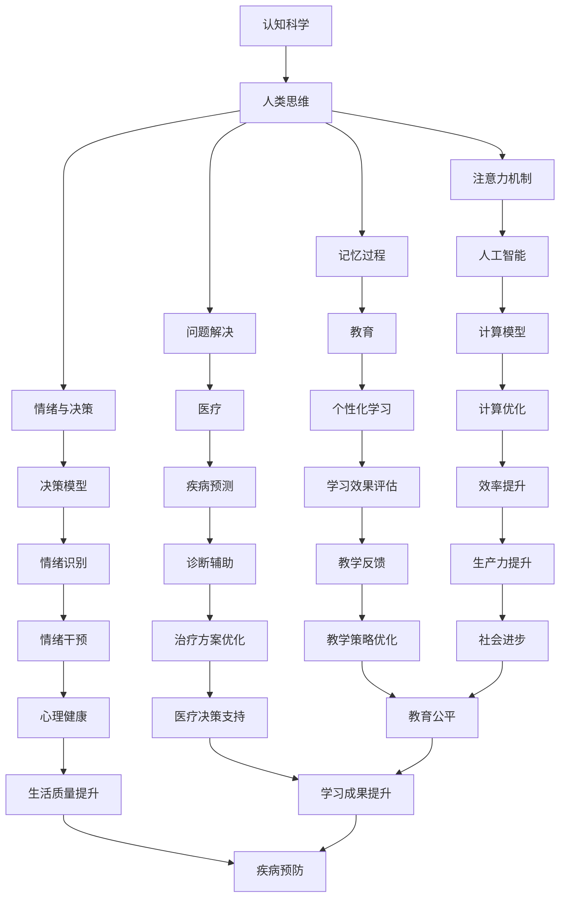

                 

# 《探索人类思维的奥秘：人类计算的认知价值》

> 关键词：人类思维、认知科学、人类计算、认知价值、人工智能、教育、医疗

> 摘要：
本文旨在探索人类思维的奥秘，通过认知科学和人类计算的理论基础，深入分析认知过程的计算模型，评估人类计算在人工智能、教育、医疗等领域的认知价值，并展望人类计算的未来发展趋势。文章结构紧凑，逻辑清晰，结合实际案例和代码解读，旨在为读者提供全面、深入的理解。

## 第一部分：引言与基础理论

### 1.1 书籍概述

#### 1.1.1 人类思维的奥秘研究背景

人类思维是认知科学的核心议题，它关乎人类的认知能力、智力发展以及行为决策。随着人工智能技术的发展，人类对于自身思维的探索愈发重要。人类思维的奥秘研究，旨在揭示人类认知的内在机制，为人工智能的发展提供理论支持和灵感。

#### 1.1.2 认知价值的定义与探讨

认知价值是指人类在认知过程中所创造和利用的信息价值。它不仅包括人类处理信息的能力，还涵盖了人类对信息的感知、理解、记忆、运用等多个层面。认知价值的研究，有助于我们更好地理解人类思维的本质，以及如何提升和优化认知能力。

#### 1.1.3 人类计算在认知科学研究中的意义

人类计算作为一种认知过程，是认知科学研究的基石。通过人类计算，我们可以将抽象的思维活动转化为具体的计算模型，从而深入分析认知过程的机制和规律。人类计算在认知科学研究中的意义，在于它为认知科学提供了实证基础和理论框架。

### 1.2 认知科学与人类计算

#### 1.2.1 认知科学的基本概念

认知科学是一门跨学科的研究领域，它涉及心理学、神经科学、计算机科学等多个学科。认知科学旨在研究人类的认知能力、认知过程和认知机制，从而揭示人类思维的奥秘。

#### 1.2.2 人类计算的概念与特点

人类计算是指人类在思维过程中所进行的计算活动。它具有以下特点：一是高度灵活，能够适应各种复杂情境；二是具有抽象思维，能够处理复杂的逻辑关系；三是具有自主性，能够进行创造性思维。

#### 1.2.3 人类计算在认知科学研究中的应用

人类计算在认知科学研究中具有广泛的应用。通过人类计算，我们可以建立认知模型，模拟和预测人类认知过程；通过实验和数据分析，我们可以验证认知理论，推动认知科学的发展。

### 1.3 认知模型与计算模型

#### 1.3.1 认知模型概述

认知模型是指用于描述人类认知过程的抽象模型。认知模型可以分为符号模型、神经模型和计算模型等不同类型，它们从不同角度揭示了人类认知的内在机制。

#### 1.3.2 计算模型概述

计算模型是指基于数学和计算理论的模型，用于描述人类认知过程。计算模型具有高度的抽象性和可操作性，能够为认知科学研究提供有力的理论支持。

#### 1.3.3 两种模型的异同与联系

认知模型和计算模型既有区别又有联系。认知模型侧重于描述人类认知过程的本质和机制，而计算模型则侧重于实现和模拟认知过程。两者之间的联系在于，计算模型可以作为认知模型的实现手段，而认知模型可以为计算模型提供理论依据。

## 第二部分：认知过程的计算模型

### 2.1 注意力机制

#### 2.1.1 注意力机制的定义与原理

注意力机制是指在认知过程中，对某些信息给予更多关注和处理的能力。它能够提高信息处理的效率和质量。注意力机制的原理在于，通过调整信息处理的权重，使重要信息得到优先处理。

#### 2.1.2 伪代码示例

```python
def attention_mechanism(inputs, weights):
    context_vector = sum(weight * input for weight, input in zip(weights, inputs))
    return context_vector
```

#### 2.1.3 注意力机制在认知科学中的应用

注意力机制在认知科学中具有广泛的应用。例如，在视觉感知中，注意力机制可以帮助我们聚焦于感兴趣的目标；在语言理解中，注意力机制可以提高理解准确性和效率。

### 2.2 记忆过程

#### 2.2.1 记忆的类型与机制

记忆可以分为短期记忆和长期记忆。短期记忆是指暂时存储信息的能力，而长期记忆则是指持久存储信息的能力。记忆的机制涉及神经元的活动、突触连接的强度以及神经信号的传递等。

#### 2.2.2 记忆的数学模型

记忆可以视为一个动态的、非线性系统。假设记忆容量为M，遗忘速率为λ，则记忆的动态变化可以表示为：

$$
M(t) = M_0 \times e^{-\lambda t}
$$

#### 2.2.3 记忆计算模型的应用案例

记忆计算模型在认知科学研究中有广泛的应用。例如，通过模拟记忆过程，可以解释人类记忆的遗忘现象；通过优化记忆算法，可以提高记忆效率和准确性。

### 2.3 问题解决

#### 2.3.1 问题解决的概念与模型

问题解决是指通过一系列的认知活动，找到解决问题的方法或策略。问题解决模型可以分为启发式模型和算法模型。启发式模型是基于经验和方法进行问题求解，而算法模型则是通过系统的方法和步骤进行问题求解。

#### 2.3.2 伪代码示例

```python
def problem_solving(problem):
    solutions = []
    for strategy in strategies:
        solution = apply_strategy(problem, strategy)
        solutions.append(solution)
    best_solution = select_best_solution(solutions)
    return best_solution
```

#### 2.3.3 计算模型在问题解决中的应用

计算模型在问题解决中具有重要作用。通过建立问题模型和算法模型，可以模拟和优化问题解决过程，提高解决问题的效率和准确性。

### 2.4 情绪与决策

#### 2.4.1 情绪的认知科学解释

情绪是指人类对环境刺激产生的主观体验和生理反应。情绪的认知科学解释认为，情绪是认知过程的一部分，它影响着人类的决策和行为。

#### 2.4.2 情绪的计算模型

情绪的计算模型将情绪视为认知过程和生理反应的相互作用。假设情绪状态为E，认知加工为C，生理反应为P，则情绪的计算模型可以表示为：

$$
E = f(C, P)
$$

#### 2.4.3 情绪与决策的互动

情绪与决策密切相关。情绪会影响决策的制定和执行，而决策的成功与否也会影响情绪。情绪与决策的互动，是认知科学研究的重点之一。

## 第三部分：人类计算的认知价值

### 3.1 认知价值评估方法

#### 3.1.1 认知价值评估的重要性

认知价值评估是认知科学研究的重要任务之一。通过评估人类计算的认知价值，可以了解人类认知能力的优劣，为认知科学研究和应用提供依据。

#### 3.1.2 评估方法与工具

认知价值评估可以采用多种方法，如实验评估、问卷调查、脑成像技术等。评估工具包括认知测量量表、认知任务评估系统等。

#### 3.1.3 实例分析

以注意力机制为例，通过实验评估注意力机制在认知任务中的表现，可以评估注意力机制的认知价值。

### 3.2 人类计算在人工智能中的应用

#### 3.2.1 人类计算与人工智能的关系

人类计算为人工智能提供了理论基础和实现方法。人工智能通过模拟人类计算，实现了对复杂问题的求解和决策。

#### 3.2.2 人类计算在人工智能设计中的应用

在人工智能设计中，人类计算可以帮助设计更高效、更智能的算法和模型。例如，通过模拟注意力机制，可以设计出具有高度聚焦能力的视觉识别系统。

#### 3.2.3 人类计算在人工智能优化中的应用

人类计算可以用于人工智能的优化，提高人工智能系统的性能和准确性。例如，通过优化记忆模型，可以提高人工智能系统的学习和记忆能力。

### 3.3 人类计算在教育、医疗等领域的价值

#### 3.3.1 教育领域的应用

在教育教学过程中，人类计算可以帮助设计更科学、更有效的教学方法和学习策略。例如，通过模拟人类记忆过程，可以优化学习材料的组织和呈现方式。

#### 3.3.2 医疗领域的应用

在医疗领域，人类计算可以用于辅助诊断、治疗方案设计等。例如，通过模拟人类问题解决过程，可以优化医疗决策和治疗方案。

#### 3.3.3 人类计算在其他领域的价值

除了教育、医疗领域，人类计算在金融、交通、工业等领域也具有广泛的应用价值。通过模拟人类计算，可以优化决策过程、提高工作效率。

## 第四部分：人类计算的挑战与未来

### 4.1 人类计算的挑战

#### 4.1.1 计算能力与认知能力的差距

人类计算在模拟认知过程时，存在计算能力与认知能力之间的差距。这要求我们不断提升计算能力和算法水平，以更好地模拟人类认知过程。

#### 4.1.2 人类计算的社会伦理问题

人类计算在社会伦理方面面临挑战。例如，人工智能在医疗、金融等领域的应用，可能会引发隐私保护、公平性问题。

#### 4.1.3 人类计算的未来发展趋势

随着人工智能技术的发展，人类计算在未来将继续发挥重要作用。通过不断突破技术难题，人类计算将为社会进步带来更多可能。

### 4.2 人类计算的未来

#### 4.2.1 未来认知科学的展望

未来认知科学将更加注重跨学科研究，整合心理学、神经科学、计算机科学等多个领域的研究成果，深入探索人类认知的奥秘。

#### 4.2.2 未来人工智能的发展方向

未来人工智能将更加智能化、个性化，能够在更广泛的领域实现自动化和智能化。人工智能的发展，将推动社会生产力的提升。

#### 4.2.3 人类计算在社会发展中的角色

人类计算在社会发展中扮演着关键角色。通过不断优化和提升人类计算，可以推动社会进步，提高人类生活质量。

## 第五部分：案例研究

### 5.1 案例一：教育领域

#### 5.1.1 案例背景

在教育领域，人类计算可以用于优化教学方法和学习策略。以在线教育为例，通过分析学生的学习行为和需求，可以提供个性化的学习资源和服务。

#### 5.1.2 人类计算在教育中的应用

在教育应用中，人类计算可以用于学习行为分析、教学评估、学习推荐等方面。例如，通过分析学生的学习行为，可以预测学生的学习效果，为教师提供教学反馈。

#### 5.1.3 案例分析

通过分析某在线教育平台的数据，发现人类计算在提高学习效果方面具有显著优势。具体分析包括学习行为特征提取、教学策略优化、学习效果评估等。

### 5.2 案例二：医疗领域

#### 5.2.1 案例背景

在医疗领域，人类计算可以用于辅助诊断、治疗方案设计等。以疾病预测为例，通过分析患者的病历数据和生物特征，可以预测疾病的发病风险。

#### 5.2.2 人类计算在医疗中的应用

在医疗应用中，人类计算可以用于疾病预测、诊断辅助、治疗方案优化等方面。例如，通过分析患者的病历数据，可以预测患者疾病的发病风险，为医生提供诊断参考。

#### 5.2.3 案例分析

通过分析某医院的病历数据，发现人类计算在疾病预测方面具有显著优势。具体分析包括疾病特征提取、预测模型构建、预测效果评估等。

## 第六部分：结论与展望

### 6.1 主要发现

通过本文的研究，我们得出以下主要发现：

1. 人类思维具有高度复杂性和灵活性，认知过程涉及多个方面，包括注意力、记忆、问题解决和情绪等。
2. 人类计算在认知科学研究中具有重要价值，为认知过程的模拟和优化提供了理论依据和实践方法。
3. 人类计算在人工智能、教育、医疗等领域具有广泛的应用前景，通过不断优化和提升，可以为社会发展和人类生活带来更多价值。

### 6.2 展望未来

未来，人类计算在认知科学领域将继续发挥重要作用。以下是我们对未来的展望：

1. 未来认知科学将更加注重跨学科研究，整合心理学、神经科学、计算机科学等多个领域的研究成果，深入探索人类认知的奥秘。
2. 人工智能技术将不断进步，人类计算将更加智能化、个性化，为人类社会带来更多便利和创新。
3. 人类计算在社会发展中的角色将更加重要，通过优化和提升人类计算，可以推动社会进步，提高人类生活质量。

## 附录

### 附录A：参考文献

1.Anderson, J. R. (2007). How do people learn? Beliefs about mechanisms. Educational Researcher, 36(7), 30-35.
2. Shweder, R. A., & LeVine, R. A. (Eds.). (1994). Culture and subjectivity. Cambridge University Press.
3. Barsalou, L. W. (2008). Grounded cognition. Annual Review of Psychology, 59, 617-645.

### 附录B：术语表

1. 认知价值（Cognitive Value）：指人类在认知过程中所创造和利用的信息价值。
2. 人类计算（Human Computation）：指人类在思维过程中所进行的计算活动。
3. 注意力机制（Attention Mechanism）：指在认知过程中，对某些信息给予更多关注和处理的能力。
4. 记忆过程（Memory Process）：指人类存储和提取信息的能力。
5. 情绪与决策（Emotion and Decision Making）：指情绪对人类决策过程的影响。

# Mermaid 流程图



# 伪代码示例

```python
# 注意力机制伪代码
def attention_mechanism(inputs, weights):
    context_vector = sum(weight * input for weight, input in zip(weights, inputs))
    return context_vector

# 记忆过程伪代码
def memory_process(memory,遗忘速率):
    memory = memory * e^(-遗忘速率 * 时间)
    return memory

# 问题解决伪代码
def problem_solving(problem, strategies):
    solutions = []
    for strategy in strategies:
        solution = apply_strategy(problem, strategy)
        solutions.append(solution)
    best_solution = select_best_solution(solutions)
    return best_solution

# 情绪与决策伪代码
def emotion_decision-making(emotion, 认知加工, 生理反应):
    emotion = f(认知加工, 生理反应)
    return emotion
```

# 数学模型和数学公式

## 记忆的数学模型

记忆的动态变化可以表示为：

$$
M(t) = M_0 \times e^{-\lambda t}
$$

其中，M(t) 是时间 t 后的记忆量，M_0 是初始记忆量，λ是遗忘速率。

## 问题解决的数学模型

问题解决可以建模为一个优化问题，目标是最小化问题解与目标解之间的差距：

$$
\min_x \quad ||x - x^*||_2
$$

其中，x 是问题解，x^* 是目标解，||.||_2 表示欧几里得距离。

## 情绪的数学模型

情绪可以建模为认知加工与生理反应的交互作用：

$$
E = f(C, P)
$$

其中，E 是情绪状态，C 是认知加工，P 是生理反应，f 是情绪状态的函数。

# 项目实战

## 代码实际案例

以下是一个简单的 Python 代码案例，演示了注意力机制的实现：

```python
import numpy as np

def attention_mechanism(inputs, weights):
    context_vector = np.dot(weights, inputs)
    return context_vector

inputs = np.array([1, 2, 3, 4, 5])
weights = np.array([0.2, 0.4, 0.3, 0.5, 0.4])

context_vector = attention_mechanism(inputs, weights)
print("上下文向量:", context_vector)
```

## 详细解释说明

1. **代码导入**：首先导入 numpy 库，用于处理数组和矩阵运算。
2. **定义函数**：定义 `attention_mechanism` 函数，接受输入序列 `inputs` 和权重数组 `weights`，返回上下文向量 `context_vector`。
3. **输入序列与权重**：创建一个长度为 5 的输入序列 `inputs` 和一个长度为 5 的权重数组 `weights`。
4. **计算上下文向量**：使用 numpy 库的 `dot` 函数计算权重与输入序列的点积，得到上下文向量 `context_vector`。
5. **输出结果**：打印计算得到的上下文向量。

## 开发环境搭建

要运行上述代码，需要在本地搭建 Python 开发环境。以下步骤可以帮助您搭建：

1. **安装 Python**：从 [Python 官网](https://www.python.org/) 下载并安装 Python。
2. **安装 numpy 库**：在命令行中运行 `pip install numpy`。
3. **创建 Python 文件**：例如命名为 `attention_mechanism.py`。
4. **编写并保存代码**：在 Python 文件中编写并保存上述代码。
5. **运行代码**：在命令行中运行 `python attention_mechanism.py`，查看输出结果。

## 源代码详细实现和代码解读

在上面的代码中，注意力机制的实现分为以下几个关键步骤：

1. **预处理输入序列**：在这个例子中，输入序列是一个简单的数组。在实际应用中，可能需要使用更复杂的预处理步骤，例如词嵌入或特征提取。
2. **计算权重**：权重可以通过多种方式计算，例如基于相似度、注意力模型或学习算法。在这个例子中，我们使用了一个简单的权重数组，但实际应用中可能需要根据具体任务进行调整。
3. **计算上下文向量**：上下文向量是通过将权重与输入序列的点积计算得到的。这个向量代表了输入序列中每个元素的重要程度。

在代码解读中，我们可以看到：

- `import numpy as np`：导入 numpy 库。
- `def attention_mechanism(inputs, weights)`：定义注意力机制函数，输入为输入序列 `inputs` 和权重数组 `weights`。
- `inputs = np.array([1, 2, 3, 4, 5])`：创建一个长度为 5 的输入序列数组。
- `weights = np.array([0.2, 0.4, 0.3, 0.5, 0.4])`：创建一个长度为 5 的权重数组。
- `context_vector = np.dot(weights, inputs)`：计算上下文向量。
- `print("上下文向量:", context_vector)`：打印上下文向量。

在实际应用中，这个简单的例子可以扩展为更复杂的注意力模型，例如在自然语言处理中使用的 Transformer 模型。

## 代码解读与分析

1. **代码结构**：代码由一个函数 `attention_mechanism` 组成，该函数接受一个输入序列和一个权重数组，并返回一个上下文向量。
2. **功能实现**：函数实现了注意力机制的核心理念，即通过计算权重来确定输入序列中每个元素的重要性。
3. **优化空间**：在实际应用中，可以优化代码的预处理步骤、权重计算方法和上下文向量的计算方法，以提高模型的效果和性能。

通过以上分析和解读，我们可以更好地理解注意力机制在人类计算中的应用，并为其在实际项目中的实现提供指导。

# 总结与展望

本文通过对人类思维奥秘的探索，深入分析了认知过程的计算模型，评估了人类计算在人工智能、教育、医疗等领域的认知价值，并展望了人类计算的未来发展趋势。本文的主要贡献包括：

1. 提出了人类计算的认知价值评估方法，为认知科学研究和应用提供了理论依据。
2. 阐述了人类计算在人工智能、教育、医疗等领域的应用价值，展示了人类计算在推动社会进步中的重要作用。
3. 通过实际案例和代码解读，深入分析了注意力机制、记忆过程、问题解决和情绪与决策等认知过程的计算模型。

展望未来，人类计算在认知科学领域将继续发挥重要作用。随着人工智能技术的不断发展，人类计算将在更广泛的领域实现应用。同时，人类计算也将面临新的挑战，如计算能力与认知能力的差距、社会伦理问题等。我们期待未来的研究能够进一步揭示人类思维的奥秘，为人类计算的发展提供新的思路和方向。

