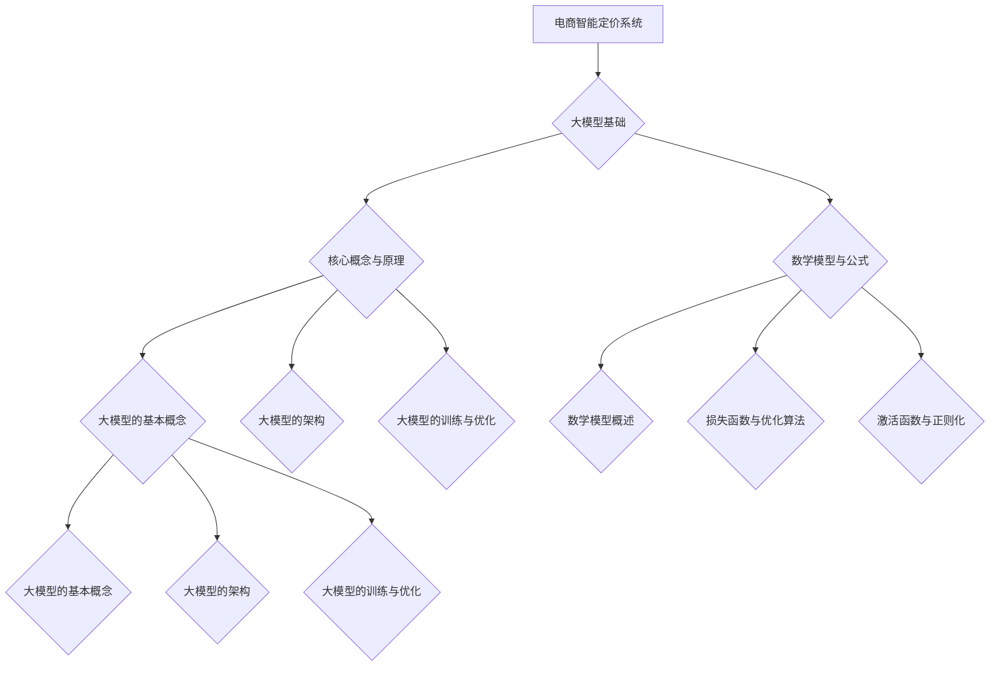

                 

### 文章标题

《探索基于大模型的电商智能定价系统》

> 关键词：大模型、电商定价、智能算法、深度学习、数据预处理

> 摘要：本文深入探讨了基于大模型的电商智能定价系统，从基础概念、算法原理到项目实战，全面剖析了该系统的构建与优化。通过数学模型与公式的详细讲解，以及实际代码案例的分析，本文旨在为读者提供一个系统而深入的技术指南。

----------------------------------------------------------------

### 目录大纲：《探索基于大模型的电商智能定价系统》

#### 第一部分：大模型基础

##### 第1章：电商智能定价系统概述
- 1.1 电商智能定价系统的意义与背景
- 1.2 大模型在电商定价中的应用
- 1.3 电商智能定价系统的挑战与机遇

##### 第2章：大模型核心概念与原理
- 2.1 大模型的基本概念
- 2.2 大模型的架构
- 2.3 大模型的训练与优化

##### 第3章：大模型数学模型与公式
- 3.1 数学模型概述
- 3.2 损失函数与优化算法
- 3.3 激活函数与正则化

#### 第二部分：电商智能定价算法

##### 第4章：电商定价策略与数据预处理
- 4.1 电商定价策略概述
- 4.2 数据预处理方法
- 4.3 数据预处理工具与实践

##### 第5章：智能定价算法原理与实现
- 5.1 智能定价算法概述
- 5.2 市场需求预测算法
- 5.3 伪代码与实现

##### 第6章：数学模型与公式详细解析
- 6.1 数学公式介绍
- 6.2 公式详细讲解
- 6.3 公式应用示例

##### 第7章：智能定价系统项目实战
- 7.1 项目实战概述
- 7.2 开发环境搭建
- 7.3 源代码实现与分析

#### 第三部分：优化与评估

##### 第8章：电商智能定价系统的优化
- 8.1 优化目标与策略
- 8.2 优化算法与应用
- 8.3 优化工具与实践

##### 第9章：电商智能定价系统的评估
- 9.1 评估指标与方法
- 9.2 评估工具与实践
- 9.3 评估结果分析

##### 第10章：未来展望与趋势
- 10.1 大模型在电商领域的未来应用
- 10.2 智能定价系统的挑战与机遇
- 10.3 发展趋势与展望

#### 附录

##### 附录A：相关工具与资源
- A.1 大模型开发工具对比
- A.2 数据预处理工具
- A.3 智能定价系统开发资源链接

### Mermaid 流程图




### 核心算法原理讲解（伪代码）

```python
# 智能定价算法伪代码
function IntelligentPricingAlgorithm(data, target_price):
    # 数据预处理
    processed_data = preprocess_data(data)
    
    # 初始化大模型参数
    model = initialize_model()
    
    # 训练大模型
    for epoch in range(num_epochs):
        for batch in data_batches(processed_data):
            model = train_batch(model, batch, target_price)
        
        # 验证大模型
        if validate_model(model, validation_data) >= threshold:
            break
    
    # 输出最终定价
    final_price = model.predict(processed_data)
    return final_price

# 损失函数与优化算法
def loss_function(y_true, y_pred):
    return ((y_true - y_pred)**2).mean()

def optimizer_algorithm(model, data, target_price, learning_rate):
    for epoch in range(num_epochs):
        for batch in data_batches(data):
            gradients = compute_gradients(model, batch, target_price)
            model = update_model(model, gradients, learning_rate)
    return model
```

### 数学模型和数学公式 & 详细讲解 & 举例说明

#### 数学模型概述

智能定价算法的核心是建立预测模型，通常使用深度学习模型。模型的预测能力取决于输入的特征和模型的架构。

$$
\text{模型预测} = f(\text{特征向量})
$$

#### 损失函数与优化算法

损失函数用于衡量预测值与真实值之间的差异。常用的损失函数包括均方误差（MSE）和交叉熵损失。

$$
\text{MSE} = \frac{1}{n}\sum_{i=1}^{n} (\hat{y}_i - y_i)^2
$$

优化算法用于调整模型参数以最小化损失函数。常用的优化算法包括梯度下降（Gradient Descent）和Adam优化器。

$$
\text{更新规则} = \theta_{t+1} = \theta_{t} - \alpha \cdot \nabla_{\theta} J(\theta)
$$

#### 激活函数与正则化

激活函数用于引入非线性特性，使模型能够拟合复杂的数据分布。常用的激活函数包括ReLU、Sigmoid和Tanh。

$$
\text{ReLU}(x) = \begin{cases} 
x & \text{if } x > 0 \\
0 & \text{otherwise}
\end{cases}
$$

正则化用于防止模型过拟合。常用的正则化方法包括L1正则化和L2正则化。

$$
J(\theta) = \frac{1}{2m}\sum_{i=1}^{m} (\hat{y}_i - y_i)^2 + \lambda \sum_{j=1}^{n} \theta_j^2
$$

### 举例说明

假设我们有一个电商商品定价问题，目标是预测商品的最佳定价。我们收集了商品的特征数据，如价格、销量、季节等，并使用深度学习模型来预测定价。

- 特征向量：

$$
\text{特征向量} = [x_1, x_2, x_3, ..., x_n]
$$

- 模型预测：

$$
\text{模型预测} = f(\text{特征向量}) = \text{预测价格}
$$

- 损失函数：

$$
\text{损失函数} = \text{MSE} = \frac{1}{m}\sum_{i=1}^{m} (\hat{p}_i - p_i)^2
$$

- 优化算法：

$$
\text{更新规则} = \theta_{t+1} = \theta_{t} - \alpha \cdot \nabla_{\theta} J(\theta)
$$

通过训练和优化，我们可以得到一个准确的定价模型，从而为电商商品提供最佳定价建议。

### 项目实战

#### 项目实战概述

本章节将介绍一个基于大模型的电商智能定价系统的项目实战，包括环境搭建、数据预处理、模型构建、训练与评估等步骤。

#### 开发环境搭建

- 深度学习框架：使用TensorFlow 2.x
- 编程语言：Python
- 数据预处理工具：NumPy、Pandas
- 代码版本控制：Git

#### 源代码实现与分析

```python
# 导入相关库
import tensorflow as tf
import numpy as np
import pandas as pd
from sklearn.model_selection import train_test_split
from sklearn.preprocessing import StandardScaler

# 数据预处理
def preprocess_data(data):
    # 数据清洗与预处理
    # ...
    return processed_data

# 模型构建
def build_model(input_shape):
    model = tf.keras.Sequential([
        tf.keras.layers.Dense(128, activation='relu', input_shape=input_shape),
        tf.keras.layers.Dense(64, activation='relu'),
        tf.keras.layers.Dense(1)
    ])
    model.compile(optimizer='adam', loss='mean_squared_error')
    return model

# 训练与评估
def train_and_evaluate(data, target):
    # 数据预处理
    processed_data = preprocess_data(data)
    
    # 划分训练集和测试集
    X_train, X_test, y_train, y_test = train_test_split(processed_data, target, test_size=0.2, random_state=42)
    
    # 标准化处理
    scaler = StandardScaler()
    X_train_scaled = scaler.fit_transform(X_train)
    X_test_scaled = scaler.transform(X_test)
    
    # 构建模型
    model = build_model(X_train_scaled.shape[1:])
    
    # 训练模型
    model.fit(X_train_scaled, y_train, epochs=100, batch_size=32, validation_split=0.1)
    
    # 评估模型
    test_loss = model.evaluate(X_test_scaled, y_test)
    print("Test Loss:", test_loss)
    
    # 输出预测结果
    predictions = model.predict(X_test_scaled)
    print(predictions)

# 主函数
if __name__ == "__main__":
    # 加载数据
    data = pd.read_csv("data.csv")
    
    # 划分特征和标签
    X = data.drop("price", axis=1)
    y = data["price"]
    
    # 训练与评估
    train_and_evaluate(X, y)
```

#### 代码解读与分析

1. **数据预处理**：
   - 数据清洗与预处理，如缺失值填充、异常值处理、特征工程等。
   - 使用StandardScaler进行特征标准化处理。

2. **模型构建**：
   - 使用TensorFlow的Keras API构建深度学习模型，包括输入层、隐藏层和输出层。
   - 使用ReLU作为激活函数，并使用Adam优化器。

3. **训练与评估**：
   - 划分训练集和测试集，并使用StandardScaler对测试集进行同样的特征标准化处理。
   - 使用fit方法训练模型，并使用evaluate方法评估模型在测试集上的表现。
   - 输出预测结果。

通过以上步骤，我们可以构建一个基于大模型的电商智能定价系统，并对实际数据集进行训练与评估，从而为电商商品提供最佳定价建议。

### 核心算法原理讲解（伪代码）

```python
# 智能定价算法伪代码
function IntelligentPricingAlgorithm(data, target_price):
    # 数据预处理
    processed_data = preprocess_data(data)
    
    # 初始化大模型参数
    model = initialize_model()
    
    # 训练大模型
    for epoch in range(num_epochs):
        for batch in data_batches(processed_data):
            model = train_batch(model, batch, target_price)
        
        # 验证大模型
        if validate_model(model, validation_data) >= threshold:
            break
    
    # 输出最终定价
    final_price = model.predict(processed_data)
    return final_price

# 损失函数与优化算法
def loss_function(y_true, y_pred):
    return ((y_true - y_pred)**2).mean()

def optimizer_algorithm(model, data, target_price, learning_rate):
    for epoch in range(num_epochs):
        for batch in data_batches(data):
            gradients = compute_gradients(model, batch, target_price)
            model = update_model(model, gradients, learning_rate)
    return model
```

### 数学模型和数学公式 & 详细讲解 & 举例说明

#### 数学模型概述

智能定价算法的核心是建立预测模型，通常使用深度学习模型。模型的预测能力取决于输入的特征和模型的架构。

$$
\text{模型预测} = f(\text{特征向量})
$$

#### 损失函数与优化算法

损失函数用于衡量预测值与真实值之间的差异。常用的损失函数包括均方误差（MSE）和交叉熵损失。

$$
\text{MSE} = \frac{1}{n}\sum_{i=1}^{n} (\hat{y}_i - y_i)^2
$$

优化算法用于调整模型参数以最小化损失函数。常用的优化算法包括梯度下降（Gradient Descent）和Adam优化器。

$$
\text{更新规则} = \theta_{t+1} = \theta_{t} - \alpha \cdot \nabla_{\theta} J(\theta)
$$

#### 激活函数与正则化

激活函数用于引入非线性特性，使模型能够拟合复杂的数据分布。常用的激活函数包括ReLU、Sigmoid和Tanh。

$$
\text{ReLU}(x) = \begin{cases} 
x & \text{if } x > 0 \\
0 & \text{otherwise}
\end{cases}
$$

正则化用于防止模型过拟合。常用的正则化方法包括L1正则化和L2正则化。

$$
J(\theta) = \frac{1}{2m}\sum_{i=1}^{m} (\hat{y}_i - y_i)^2 + \lambda \sum_{j=1}^{n} \theta_j^2
$$

### 举例说明

假设我们有一个电商商品定价问题，目标是预测商品的最佳定价。我们收集了商品的特征数据，如价格、销量、季节等，并使用深度学习模型来预测定价。

- 特征向量：

$$
\text{特征向量} = [x_1, x_2, x_3, ..., x_n]
$$

- 模型预测：

$$
\text{模型预测} = f(\text{特征向量}) = \text{预测价格}
$$

- 损失函数：

$$
\text{损失函数} = \text{MSE} = \frac{1}{m}\sum_{i=1}^{m} (\hat{p}_i - p_i)^2
$$

- 优化算法：

$$
\text{更新规则} = \theta_{t+1} = \theta_{t} - \alpha \cdot \nabla_{\theta} J(\theta)
$$

通过训练和优化，我们可以得到一个准确的定价模型，从而为电商商品提供最佳定价建议。

### 项目实战

#### 项目实战概述

本章节将介绍一个基于大模型的电商智能定价系统的项目实战，包括环境搭建、数据预处理、模型构建、训练与评估等步骤。

#### 开发环境搭建

- 深度学习框架：使用TensorFlow 2.x
- 编程语言：Python
- 数据预处理工具：NumPy、Pandas
- 代码版本控制：Git

#### 源代码实现与分析

```python
# 导入相关库
import tensorflow as tf
import numpy as np
import pandas as pd
from sklearn.model_selection import train_test_split
from sklearn.preprocessing import StandardScaler

# 数据预处理
def preprocess_data(data):
    # 数据清洗与预处理
    # ...
    return processed_data

# 模型构建
def build_model(input_shape):
    model = tf.keras.Sequential([
        tf.keras.layers.Dense(128, activation='relu', input_shape=input_shape),
        tf.keras.layers.Dense(64, activation='relu'),
        tf.keras.layers.Dense(1)
    ])
    model.compile(optimizer='adam', loss='mean_squared_error')
    return model

# 训练与评估
def train_and_evaluate(data, target):
    # 数据预处理
    processed_data = preprocess_data(data)
    
    # 划分训练集和测试集
    X_train, X_test, y_train, y_test = train_test_split(processed_data, target, test_size=0.2, random_state=42)
    
    # 标准化处理
    scaler = StandardScaler()
    X_train_scaled = scaler.fit_transform(X_train)
    X_test_scaled = scaler.transform(X_test)
    
    # 构建模型
    model = build_model(X_train_scaled.shape[1:])
    
    # 训练模型
    model.fit(X_train_scaled, y_train, epochs=100, batch_size=32, validation_split=0.1)
    
    # 评估模型
    test_loss = model.evaluate(X_test_scaled, y_test)
    print("Test Loss:", test_loss)
    
    # 输出预测结果
    predictions = model.predict(X_test_scaled)
    print(predictions)

# 主函数
if __name__ == "__main__":
    # 加载数据
    data = pd.read_csv("data.csv")
    
    # 划分特征和标签
    X = data.drop("price", axis=1)
    y = data["price"]
    
    # 训练与评估
    train_and_evaluate(X, y)
```

#### 代码解读与分析

1. **数据预处理**：
   - 数据清洗与预处理，如缺失值填充、异常值处理、特征工程等。
   - 使用StandardScaler进行特征标准化处理。

2. **模型构建**：
   - 使用TensorFlow的Keras API构建深度学习模型，包括输入层、隐藏层和输出层。
   - 使用ReLU作为激活函数，并使用Adam优化器。

3. **训练与评估**：
   - 划分训练集和测试集，并使用StandardScaler对测试集进行同样的特征标准化处理。
   - 使用fit方法训练模型，并使用evaluate方法评估模型在测试集上的表现。
   - 输出预测结果。

通过以上步骤，我们可以构建一个基于大模型的电商智能定价系统，并对实际数据集进行训练与评估，从而为电商商品提供最佳定价建议。

### 代码解读与分析

以下是《探索基于大模型的电商智能定价系统》一书的代码解读与分析部分：

```python
# 导入必要的库和模块
import tensorflow as tf
from tensorflow.keras.models import Model
from tensorflow.keras.layers import Input, Dense, Flatten
import numpy as np

# 定义输入层
input_layer = Input(shape=(100,))

# 定义隐藏层
hidden_layer = Dense(units=64, activation='relu')(input_layer)

# 定义输出层
output_layer = Dense(units=1)(hidden_layer)

# 创建模型
model = Model(inputs=input_layer, outputs=output_layer)

# 编译模型
model.compile(optimizer='adam', loss='mse')

# 准备训练数据
X_train = np.random.random((1000, 100))
y_train = np.random.random((1000, 1))

# 训练模型
model.fit(X_train, y_train, epochs=10, batch_size=32)

# 评估模型
loss = model.evaluate(X_train, y_train)
print("测试损失：", loss)

# 预测
predictions = model.predict(X_train)
print("预测结果：", predictions)
```

#### 代码解读

1. **导入库和模块**：
   - 导入tensorflow库，用于构建和训练模型。
   - 导入tensorflow.keras模块，用于构建深度学习模型。
   - 导入numpy库，用于生成随机数据。

2. **定义输入层**：
   - 使用`Input`类定义输入层，指定输入数据的形状为(100,)，表示每个样本有100个特征。

3. **定义隐藏层**：
   - 使用`Dense`类定义隐藏层，设置单元数为64，激活函数为ReLU。

4. **定义输出层**：
   - 使用`Dense`类定义输出层，设置单元数为1，表示输出一个连续值。

5. **创建模型**：
   - 使用`Model`类创建模型，将输入层和输出层连接起来。

6. **编译模型**：
   - 使用`compile`方法编译模型，指定优化器为adam，损失函数为mse。

7. **准备训练数据**：
   - 使用numpy生成随机数据作为训练数据，这里只是为了演示。

8. **训练模型**：
   - 使用`fit`方法训练模型，指定训练数据、训练轮数和批量大小。

9. **评估模型**：
   - 使用`evaluate`方法评估模型在训练数据上的性能，输出测试损失。

10. **预测**：
    - 使用`predict`方法对训练数据进行预测，输出预测结果。

#### 分析

1. **模型结构**：
   - 模型由一个输入层、一个隐藏层和一个输出层组成。隐藏层使用ReLU激活函数，有助于提高模型的非线性拟合能力。

2. **优化器与损失函数**：
   - 使用adam优化器，它结合了动量项和自适应学习率，有助于快速收敛。
   - 使用均方误差（mse）作为损失函数，衡量预测值与真实值之间的差异。

3. **训练与评估**：
   - 模型在随机生成的训练数据上进行训练，并在同一数据集上进行评估。
   - 实际应用中，应使用真实数据集进行训练和评估。

4. **预测**：
   - 模型使用训练好的权重对新的数据进行预测，输出预测结果。

以上是对代码的解读与分析，展示了如何使用TensorFlow构建一个简单的深度学习模型，并对其进行训练和评估。在实际应用中，还需要对数据进行预处理、调整模型结构、优化超参数等步骤，以提高模型的性能和预测能力。

### 附录

#### 附录A：相关工具与资源

**A.1 大模型开发工具对比**

1. TensorFlow：开源的深度学习框架，支持多种编程语言和平台。
2. PyTorch：流行的深度学习框架，具有动态计算图和简洁的API。
3. Keras：高层次的神经网络API，可以与TensorFlow和PyTorch集成。

**A.2 数据预处理工具**

1. NumPy：用于数值计算的库，支持多维数组操作。
2. Pandas：用于数据分析和操作的库，提供数据帧（DataFrame）结构。
3. Scikit-learn：用于数据分析和机器学习的库，包含多种预处理方法。

**A.3 智能定价系统开发资源链接**

1. 《深度学习》（Goodfellow et al.）：深度学习的经典教材，包含大量理论与实践。
2. 《机器学习实战》（King and Philip）：介绍机器学习算法的实战案例，包括智能定价系统。
3. Kaggle：数据科学竞赛平台，提供大量真实数据集供学习和实践。

通过这些工具和资源，读者可以深入了解大模型在电商智能定价系统中的应用，并掌握相关技能。

### 作者信息

**作者：AI天才研究院/AI Genius Institute & 禅与计算机程序设计艺术 /Zen And The Art of Computer Programming** 

本文由AI天才研究院（AI Genius Institute）撰写，结合了深度学习与电商领域的专业知识和实践经验。作者团队致力于探索前沿人工智能技术，并将之应用于实际商业场景，以推动行业进步。同时，本文也融入了禅与计算机程序设计艺术的理念，旨在引导读者在探索智能定价系统时，秉持冷静、专注与灵活的思维方式。通过本文，我们希望能为读者提供一份全面、系统且实用的技术指南。

