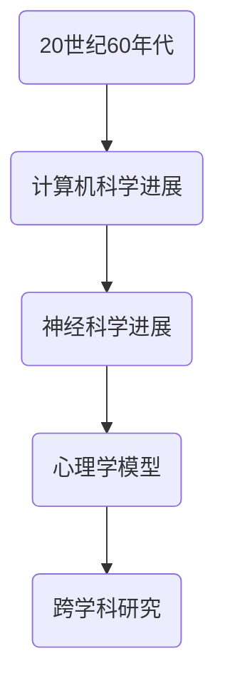
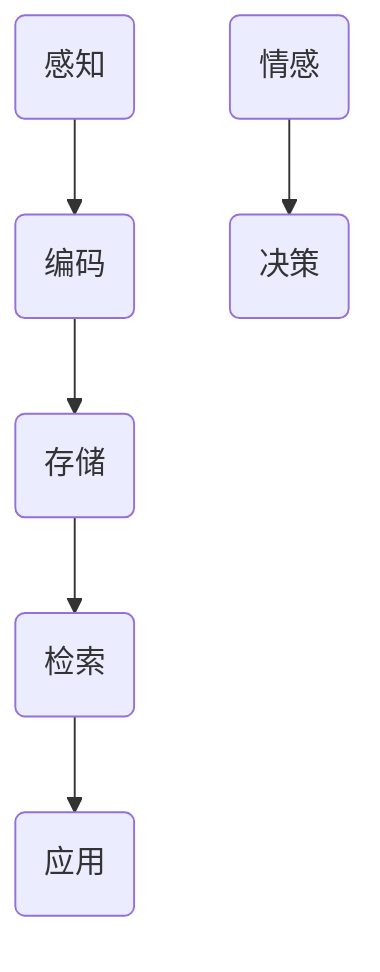
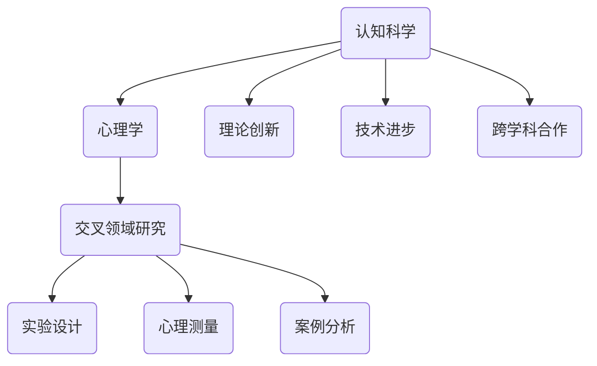
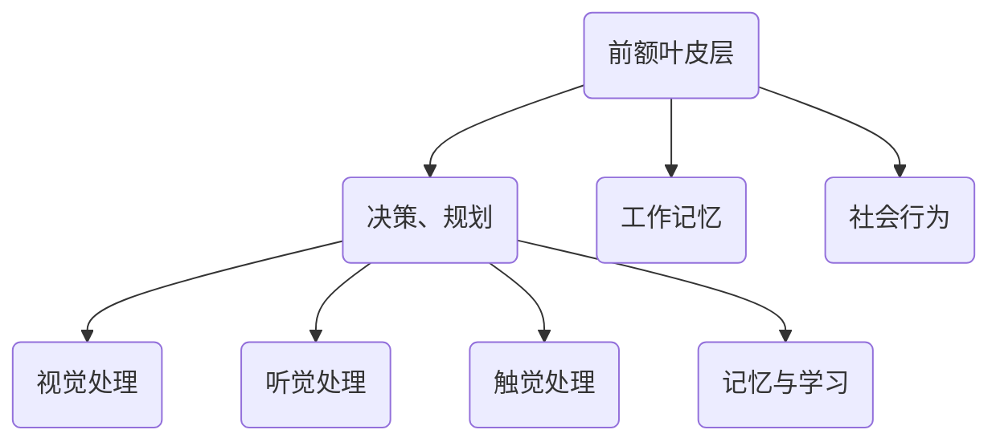
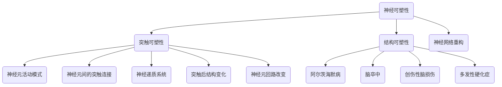

                 

# 探索未知：扩展人类认知

## 关键词
认知科学、人工智能、神经科学、虚拟现实、脑机接口、教育技术

## 摘要
本文探讨了认知扩展技术的概念、原理和应用。从认知科学和神经科学的角度出发，介绍了人类思维的构成和认知功能，探讨了神经系统与认知扩展技术的关系。文章进一步分析了认知增强技术、人工智能、虚拟现实等技术在教育、医疗和企业等领域的应用，以及认知扩展技术带来的社会和伦理问题。最后，展望了认知扩展技术的未来发展趋势，提出了应对潜在挑战的策略。

---

### 第1章 认知科学与人类思维

#### 1.1 认知科学的定义与范围

认知科学是一门跨学科的研究领域，旨在理解人类思维和智能的机制。它涵盖了心理学、神经科学、计算机科学、哲学等多个学科，以多角度、多层次的方式来研究人类认知过程。

**核心概念与联系**

认知科学的核心概念包括感知、记忆、学习、思维、语言和决策等。以下是一个简单的 Mermaid 流程图，展示了这些核心概念之间的联系：

#### 1.1.1 认知科学的核心概念

- **感知**：感知是人类接收和解释外部信息的过程。它涉及视觉、听觉、触觉、嗅觉和味觉等多个感官系统。
- **记忆**：记忆是大脑存储、保留和检索信息的能力。根据持续时间，记忆可以分为短期记忆和长期记忆。
- **学习**：学习是通过经验改变大脑结构和功能的过程。学习可以分为被动学习和主动学习。
- **思维**：思维是指大脑进行推理、判断、解决问题等高级认知活动的能力。
- **语言**：语言是人类交流思想、表达情感的工具。语言包括口头语言、书面语言和手势语言等。
- **决策**：决策是大脑在多个选项中做出选择的过程。决策涉及到信息收集、评估和选择等步骤。

#### 1.1.2 认知科学的研究范畴

认知科学的研究范畴非常广泛，主要包括以下几个方面：

- **心理学**：研究个体的思维、行为和情感，探讨认知过程的规律和机制。
- **神经科学**：研究大脑的结构和功能，探讨神经回路和神经元活动的机制。
- **计算机科学**：通过模拟和优化认知过程，开发人工智能和机器学习算法。
- **哲学**：探讨认知的本质和基础，研究思维和意识的哲学问题。
- **人类学**：研究人类认知与文化的关系，探讨认知能力在不同文化背景下的差异。

#### 1.1.3 认知科学的历史背景

认知科学作为一门独立的学科，起源于20世纪60年代。当时，计算机科学和神经科学的迅速发展，为认知科学提供了新的理论和方法。在认知科学发展的早期，主要关注的是人类认知的心理学模型和算法。随着神经科学的进步，认知科学逐渐将神经科学的研究成果纳入到自己的框架中，形成了跨学科的综合性研究。

**核心概念与联系**

以下是一个简化的 Mermaid 流程图，展示了认知科学的历史背景和主要发展历程：

#### 1.2 人类思维的构成

人类思维是一个复杂的过程，涉及到多个认知系统和神经回路。以下是对人类思维构成的主要部分的介绍：

**1.2.1 感知与认知过程**

感知是人类接收外部信息的过程。通过视觉、听觉、触觉、嗅觉和味觉等感官系统，人类可以感知到外界的信息。这些感知信息通过神经系统传递到大脑，进行进一步的处理和理解。

认知过程是对感知信息进行加工和理解的过程。认知过程包括以下几个阶段：

1. **注意力**：注意力是指大脑选择和聚焦信息的能力。注意力决定了大脑处理哪些信息，以及如何处理这些信息。
2. **编码**：编码是指将感知信息转换为大脑可以处理的形式。编码过程涉及到感知信息的特征提取和模式识别。
3. **存储**：存储是指大脑将信息存储在记忆中。存储可以分为短期记忆和长期记忆两种类型。
4. **检索**：检索是指大脑从记忆中检索信息。检索过程涉及到记忆的提取和重建。
5. **应用**：应用是指将记忆中的信息应用于实际情境中。应用过程涉及到问题的解决、决策的制定和行为的执行。

**1.2.2 记忆与注意力机制**

记忆是大脑存储和检索信息的能力。根据持续时间，记忆可以分为短期记忆和长期记忆。

1. **短期记忆**：短期记忆是指大脑在短时间内存储的信息。短期记忆通常只能存储有限的信息量，并且容易受到干扰和遗忘。
2. **长期记忆**：长期记忆是指大脑长期存储的信息。长期记忆可以持续数天、数月甚至数十年，并且不容易受到干扰和遗忘。

注意力机制是指大脑在选择和聚焦信息时的能力。注意力决定了大脑处理哪些信息，以及如何处理这些信息。注意力机制与大脑的多个区域有关，如前额叶皮层和顶叶皮层。

**1.2.3 情感与决策**

情感是大脑对信息进行加工时产生的体验和感受。情感与大脑的多个区域有关，如杏仁核和前额叶皮层。情感对人类的行为和决策有重要影响。

决策是在多个选项中做出选择的过程。决策过程中，大脑会权衡不同选项的利弊，并选择最合适的方案。决策涉及到认知加工、情感和动机等因素。

**核心概念与联系**

以下是一个简化的 Mermaid 流程图，展示了人类思维的构成和认知过程：

#### 1.3 认知科学与心理学的关系

认知科学和心理学是密切相关的学科，它们在很多方面交叉研究，共同推动了人类认知的理解。

**1.3.1 交叉领域的研究**

认知科学和心理学在交叉领域的研究取得了许多重要成果。例如，认知心理学研究了认知过程和认知机制的规律，为认知科学提供了重要的理论依据。同时，认知科学的发展也为心理学研究提供了新的方法和技术，如神经网络模型和计算模型。

**1.3.2 心理学在认知科学中的应用**

心理学在认知科学中的应用主要体现在以下几个方面：

1. **实验设计**：心理学实验设计为认知科学提供了可靠的研究方法。通过实验，心理学家可以控制和操纵变量，观察和测量认知过程的变化。
2. **心理测量**：心理测量工具和量表为认知科学提供了量化认知过程的方法。通过心理测量，心理学家可以评估个体的认知能力和水平。
3. **案例分析**：通过具体案例研究，心理学家可以深入了解认知现象和机制。案例分析为认知科学提供了丰富的实证数据，推动了认知理论的完善。

**1.3.3 认知科学对心理学的贡献**

认知科学的发展对心理学产生了深远的影响，主要表现在以下几个方面：

1. **理论创新**：认知科学的理论和方法为心理学提供了新的解释框架，帮助心理学家更好地理解认知过程和认知障碍。
2. **技术进步**：认知科学的研究推动了心理学技术的发展，如脑成像技术、虚拟现实技术和认知增强技术。
3. **跨学科合作**：认知科学的发展促进了心理学与其他学科的交叉研究，推动了心理学研究的深度和广度。

**核心概念与联系**

以下是一个简化的 Mermaid 流程图，展示了认知科学和心理学的关系：

---

### 第2章 神经系统与认知功能

#### 2.1 神经系统概述

神经系统是人类认知功能的基础，它由神经元、神经纤维和神经胶质细胞等组成。神经元是神经系统的基本功能单元，它具有传递信息的能力。神经纤维是神经元的一部分，它负责传递电信号。神经胶质细胞则负责支持神经元，维护神经系统的健康。

**2.1.1 神经元的结构与功能**

神经元主要由细胞体、树突和轴突组成。细胞体是神经元的代谢中心，包含细胞核和细胞器。树突是神经元的接收部分，负责接收其他神经元传递的信号。轴突是神经元的传递部分，负责将信号传递到其他神经元或肌肉细胞。

神经元通过电信号（动作电位）和化学信号（神经递质）传递信息。动作电位是神经元响应刺激时的电信号变化。当神经元受到足够强度的刺激时，会产生动作电位，并将信号传递到下一个神经元。

**2.1.2 神经传递物质与信号传递**

神经传递物质是神经元之间传递信息的化学物质。主要有以下几种类型：

- **兴奋性神经递质**：如谷氨酸和乙酰胆碱，能够增加神经元的兴奋性，使神经元产生动作电位。
- **抑制性神经递质**：如γ-氨基丁酸（GABA），能够降低神经元的兴奋性，抑制动作电位的产生。

神经元间的信号传递主要通过突触结构实现。突触包括突触前膜、突触后膜和突触间隙。当神经递质从突触前膜释放到突触间隙后，会与突触后膜上的受体结合，产生兴奋性或抑制性的效应，从而传递信号。

**2.1.3 神经系统的层级结构**

神经系统可以分为三个主要层级：

- **中枢神经系统（CNS）**：包括大脑和脊髓，是神经系统的核心部分，负责处理和整合信息。
- **周围神经系统（PNS）**：包括脑神经和脊神经，负责将中枢神经系统与身体各部位相连，传递感觉和运动信号。
- **自主神经系统**：分为交感神经和副交感神经，负责调节内脏器官的活动，维持身体内部环境的稳定。

#### 2.2 大脑皮层与认知功能

大脑皮层是大脑最外层的结构，它覆盖了大脑的表面，由灰质组成。大脑皮层是认知功能的重要区域，负责处理各种认知任务，如感知、记忆、学习、思考和决策等。

**2.2.1 大脑皮层的分区与功能**

大脑皮层可以分为四个主要区域：

- **前额叶皮层**：负责高级认知功能，如决策、规划、工作记忆和社会行为。
- **顶叶皮层**：负责空间定位、触觉和本体感觉的处理。
- **颞叶皮层**：负责听觉处理、语言理解和记忆。
- **枕叶皮层**：负责视觉处理。

**2.2.2 视觉、听觉、触觉的处理**

大脑皮层中的不同区域负责处理不同类型的感觉信息：

- **视觉处理**：枕叶皮层负责处理视觉信息，通过解析图像的形状、颜色和亮度等特征，使我们能够看到周围的世界。
- **听觉处理**：颞叶皮层负责处理听觉信息，通过解析声音的频率、振幅和节奏等特征，使我们能够听到声音。
- **触觉处理**：顶叶皮层负责处理触觉信息，通过解析触觉刺激的强度、质地和温度等特征，使我们能够感受到触觉。

**2.2.3 记忆与学习的神经机制**

记忆和学习是大脑的重要功能，涉及到大脑中的多个区域和复杂的神经机制：

- **短期记忆**：主要由前额叶皮层负责，涉及神经元间的突触强化和突触可塑性。
- **长期记忆**：涉及海马体、前额叶皮层和颞叶皮层等区域，通过反复强化和突触重组形成。
- **学习**：通过神经元间的突触连接和突触可塑性改变大脑的结构和功能，使我们能够适应环境变化。

**核心概念与联系**

以下是一个简化的 Mermaid 流程图，展示了大脑皮层与认知功能的关系：

#### 2.3 人类认知的神经基础

人类认知的神经基础是指大脑的特定结构和区域如何支持人类进行感知、记忆、学习和思考等认知活动。以下将详细探讨神经可塑性、学习和记忆的神经机制以及认知障碍与神经损伤。

**2.3.1 神经可塑性**

神经可塑性是指大脑在一生中能够通过经验和学习改变其结构、功能和连接性的能力。这种可塑性是学习和记忆的基础，也是大脑适应环境变化和恢复功能的重要机制。神经可塑性包括以下几个方面：

1. **突触可塑性**：突触是神经元之间传递信息的结构，突触可塑性是指突触连接的强度和密度的变化。突触可塑性可以通过突触前和突触后的变化实现，如突触前增强（长时程增强，LTP）和突触后增强（长时程抑郁，LTD）。

2. **结构可塑性**：结构可塑性是指大脑神经元的结构和连接模式的变化。这包括新突触的生成、突触结构的改变以及神经元的重新排列。

3. **神经网络重构**：神经网络重构是指大脑神经网络在不同任务和学习过程中重新组织和调整。这种重构是大脑适应新环境和学习新任务的重要方式。

**2.3.2 学习与记忆的神经机制**

学习和记忆是大脑的核心功能，它们依赖于复杂的神经机制。以下是一些关键的学习与记忆的神经机制：

1. **神经元活动模式**：学习和记忆与神经元活动的特定模式相关。例如，长时程增强（LTP）是一种神经元活动模式，它通过增加突触效能来增强记忆。

2. **神经元间的突触连接**：学习过程中，神经元之间的突触连接会发生变化。这些变化包括突触前和突触后的适应性改变，如突触前释放增加和突触后受体密度增加。

3. **神经递质系统**：神经递质是神经元之间传递信息的化学物质。学习和记忆过程中，神经递质系统的活动发生变化，例如谷氨酸、乙酰胆碱和多巴胺等神经递质在学习和记忆中发挥重要作用。

4. **突触后结构变化**：突触后结构变化，如树突棘的形成和增长，是学习和记忆的关键因素。这些变化增加了突触的接收面积，提高了突触的敏感性。

5. **神经元回路的改变**：学习和记忆涉及大脑中多个神经回路的协同作用。这些神经回路的重组和重构是实现复杂学习和记忆的基础。

**2.3.3 认知障碍与神经损伤**

认知障碍是指由于神经损伤或疾病导致的认知功能受损。以下是一些常见的认知障碍和神经损伤：

1. **阿尔茨海默病（AD）**：阿尔茨海默病是一种常见的神经退行性疾病，主要影响大脑的记忆和认知功能。AD的特征是大脑中淀粉样蛋白沉积和神经元变性。

2. **脑卒中**：脑卒中是指大脑血流中断导致的脑组织损伤。脑卒中可以导致认知功能受损，包括记忆、注意力和执行功能的障碍。

3. **创伤性脑损伤（TBI）**：创伤性脑损伤是指由于头部受到外部冲击导致的脑损伤。TBI可以导致短期的认知障碍，有时也会导致长期的认知功能受损。

4. **多发性硬化症（MS）**：多发性硬化症是一种自身免疫性疾病，影响大脑和脊髓中的神经纤维。MS可以导致认知障碍，如注意力、记忆和执行功能的减退。

**核心概念与联系**

以下是一个简化的 Mermaid 流程图，展示了人类认知的神经基础：

通过理解神经可塑性、学习和记忆的神经机制以及认知障碍与神经损伤，我们可以更好地理解人类认知的功能和局限，并为认知障碍的治疗和康复提供理论基础。

---

### 第3章 认知增强技术

#### 3.1 认知增强技术的概述

认知增强技术是指通过各种手段提升人类认知能力的科技和方法。这些技术旨在优化人类的感知、记忆、学习、思考和决策过程，从而提高个人的工作效率和生活质量。认知增强技术可以分为多个类型，包括神经增强技术、信息技术、虚拟现实和增强现实技术等。

**3.1.1 神经增强技术**

神经增强技术包括脑机接口（BMI）、神经刺激和神经药物等，旨在直接增强大脑功能。脑机接口通过直接连接大脑和外部设备，实现思维与机器的交互。神经刺激利用电刺激、磁刺激等技术激活或抑制大脑特定区域，改善认知功能。神经药物通过调节神经递质水平，提高注意力、增强记忆等。

**3.1.2 信息技术**

信息技术在认知增强中扮演着重要角色，包括人工智能、大数据、云计算等。人工智能通过机器学习和深度学习算法，模拟和优化认知过程。大数据分析帮助揭示认知过程的规律和模式。云计算提供了强大的计算能力和数据存储，使得大规模数据处理和实时分析成为可能。

**3.1.3 虚拟现实和增强现实技术**

虚拟现实（VR）和增强现实（AR）技术通过模拟和增强现实环境，提高用户的感知和认知体验。VR技术创建完全沉浸式的虚拟环境，用户可以在其中进行各种认知活动。AR技术将虚拟信息叠加到现实世界中，使用户能够与现实环境进行互动。

**3.1.4 认知增强技术的应用场景**

认知增强技术在多个领域都有广泛的应用场景，包括教育、医疗、军事和企业等。在教育领域，认知增强技术提供个性化学习资源和沉浸式学习体验。在医疗领域，认知增强技术用于康复训练、手术模拟和个性化治疗。在军事领域，认知增强技术提高士兵的作战能力和决策速度。在企业领域，认知增强技术优化决策支持、团队协作和创新管理。

#### 3.2 神经技术

神经技术是认知增强技术中的一个重要分支，主要包括脑机接口（BMI）、神经刺激和神经药物等。以下将对这些技术进行详细探讨。

**3.2.1 脑机接口（BMI）**

脑机接口（BMI）是一种直接连接大脑和外部设备的技术，通过解码大脑信号，实现思维与机器的交互。BMI技术的基本原理包括信号采集、信号解码和设备控制。

1. **信号采集**：利用脑电图（EEG）、功能性磁共振成像（fMRI）和脑磁图（MEG）等技术，采集大脑的电信号和磁信号。这些技术能够实时监测大脑活动，为BMI系统提供原始数据。

2. **信号解码**：通过机器学习和深度学习算法，对采集到的脑信号进行解码，提取出大脑意图或活动信息。信号解码的精度和速度是BMI系统的关键因素。

3. **设备控制**：解码后的脑信号用于控制外部设备，如机器人手臂、轮椅、计算机等。通过脑信号控制，用户可以实现对设备的精细操作，提高工作效率和生活质量。

**3.2.2 神经刺激技术**

神经刺激技术通过电刺激、磁刺激和光刺激等手段，激活或抑制大脑特定区域，改善认知功能。以下是一些常见的神经刺激技术：

1. **电刺激疗法（TMS）**：经颅磁刺激（TMS）利用磁场刺激大脑，通过改变神经元的兴奋性，改善认知功能。TMS在治疗抑郁症、焦虑症和精神疾病方面表现出良好的效果。

2. **深部脑刺激（DBS）**：深部脑刺激（DBS）通过植入电极刺激大脑深部结构，如基底神经节和丘脑。DBS在治疗帕金森病、癫痫等神经系统疾病方面具有显著疗效。

3. **光刺激技术**：光刺激技术通过激光或光脉冲激活特定神经元，改善认知功能。光刺激技术在治疗自闭症、抑郁和精神分裂症等方面显示出潜力。

**3.2.3 神经药物**

神经药物通过调节神经递质水平，增强大脑功能，改善认知能力。以下是一些常见的神经药物：

1. **抗抑郁药**：抗抑郁药通过调节神经递质如去甲肾上腺素和5-羟色胺的平衡，改善抑郁症状，提高认知能力。

2. **认知增强药物**：认知增强药物如安非他明和利他林，通过增加大脑中的多巴胺水平，提高注意力和记忆能力。

3. **抗焦虑药**：抗焦虑药如苯二氮䓬类药物，通过调节神经递质如GABA的活性，减轻焦虑症状，提高认知功能。

**3.2.4 神经技术的应用**

神经技术在认知增强中具有广泛的应用，包括医疗、康复、教育和企业等领域：

1. **医疗领域**：神经技术用于治疗神经疾病，如抑郁症、焦虑症、帕金森病和癫痫等。通过脑机接口和神经刺激技术，患者可以获得更好的治疗效果和生活质量。

2. **康复领域**：神经技术用于康复训练，如脑机接口和虚拟现实技术，帮助患者恢复肢体功能和认知能力。

3. **教育领域**：神经技术用于个性化教育和学习支持，如智能学习助手和脑机接口设备，帮助学生提高学习效果和动力。

4. **企业领域**：神经技术用于提高员工的工作效率和创新力，如认知增强药物和神经刺激技术，帮助员工保持专注和高效工作。

通过神经技术的应用，我们可以更好地理解大脑功能，提高人类认知能力，为个人和社会带来更多的益处。

---

### 3.3 脑成像技术

脑成像技术是认知科学和神经科学研究的重要工具，通过无创或微创的方式，捕捉大脑的结构和功能变化。以下将介绍三种主要的脑成像技术：功能性磁共振成像（fMRI）、正电子发射断层扫描（PET）和计算机断层扫描（CT）。

**3.3.1 功能性磁共振成像（fMRI）**

功能性磁共振成像（fMRI）是一种非侵入性的成像技术，通过测量大脑活动引起的血液流动变化来研究大脑的功能。fMRI的基本原理基于血氧水平依赖（BOLD）效应：当神经元活动增加时，局部脑区的血流和氧气消耗也会增加，导致BOLD信号的变化。

1. **成像过程**：受试者躺在磁共振扫描仪中，通过发射射频脉冲和接收回波信号，生成大脑的三维图像。在这些图像上，活动区域会呈现出高信号强度。

2. **应用领域**：fMRI广泛应用于脑功能定位、神经疾病诊断、认知研究等领域。它可以帮助研究人员识别大脑特定区域在特定认知任务中的活动模式，诊断精神疾病如抑郁症、癫痫等，以及研究大脑网络的结构和功能。

3. **优势**：fMRI具有高空间分辨率、无辐射和无需注射对比剂等优点，适合长期重复测量。

**3.3.2 正电子发射断层扫描（PET）**

正电子发射断层扫描（PET）是一种利用放射性示踪剂的成像技术，通过检测示踪剂发射的正电子与电子对撞产生的伽马射线，重建大脑的三维图像。PET技术可以反映大脑的代谢活动、神经递质水平和受体分布。

1. **成像过程**：受试者接受放射性示踪剂注射后，进入PET扫描仪。示踪剂会在大脑中聚集，并在扫描过程中发射伽马射线。扫描仪通过多个角度的投影数据，重建大脑的三维图像。

2. **应用领域**：PET广泛应用于神经疾病诊断、药物研发和认知研究。它可以帮助医生诊断肿瘤、癫痫、阿尔茨海默病等神经疾病，评估药物治疗的效果，以及研究大脑的代谢和功能。

3. **优势**：PET提供的信息比fMRI更丰富，能够反映大脑的代谢活动和神经递质变化，是研究大脑功能的重要工具。

**3.3.3 计算机断层扫描（CT）**

计算机断层扫描（CT）是一种利用X射线和计算机技术生成大脑图像的成像技术。CT扫描通过旋转X射线源和探测器，从多个角度获取大脑的投影数据，然后通过计算机处理，重建大脑的三维图像。

1. **成像过程**：受试者躺在CT扫描床上，X射线从多个角度穿过大脑，探测器接收X射线信号。计算机处理这些信号，生成大脑的横断面图像。

2. **应用领域**：CT主要用于脑结构成像，如诊断脑出血、脑梗死、脑肿瘤和脑萎缩等。它是一种快速、方便的成像技术，适用于急性脑损伤的评估和手术规划。

3. **优势**：CT具有快速、方便和高空间分辨率等优点，是临床诊断中常用的成像技术。

**3.3.4 脑成像技术在认知扩展中的应用**

脑成像技术在认知扩展中的应用越来越广泛，包括认知研究、神经疾病诊断和治疗、教育评估等领域。

1. **认知研究**：脑成像技术帮助研究人员理解认知过程的神经基础，如记忆、注意力、学习和决策等。通过观察大脑活动，研究人员可以揭示这些认知过程的神经机制和大脑网络结构。

2. **神经疾病诊断**：脑成像技术用于诊断神经疾病，如抑郁症、焦虑症、癫痫和阿尔茨海默病等。通过识别大脑结构和功能的异常，医生可以更准确地诊断疾病，制定个性化的治疗方案。

3. **教育评估**：脑成像技术可以评估学生的学习效果和认知能力。通过观察大脑活动，研究人员可以了解学生在学习过程中的认知负荷和注意力分布，为教育者提供反馈，优化教学方法和策略。

4. **神经康复**：脑成像技术用于评估神经康复的效果，如中风后的康复训练和脑机接口的应用。通过观察大脑结构和功能的改变，研究人员可以评估康复训练的效果，调整康复方案。

通过脑成像技术的应用，我们可以更好地理解大脑功能和疾病机制，推动认知扩展技术的发展和应用。

---

### 第4章 人工智能与认知扩展

#### 4.1 人工智能的基本概念

人工智能（AI）是指使计算机系统模拟人类智能行为和决策的技术。人工智能的目标是实现智能代理，这些代理能够感知环境、理解语言、学习新任务、解决问题并做出决策。人工智能的核心技术包括机器学习（ML）、深度学习（DL）、自然语言处理（NLP）和计算机视觉（CV）。

**4.1.1 机器学习（ML）**

机器学习是人工智能的一个分支，它使计算机系统能够从数据中学习和改进性能。机器学习算法可以分为监督学习、无监督学习和强化学习。

- **监督学习

