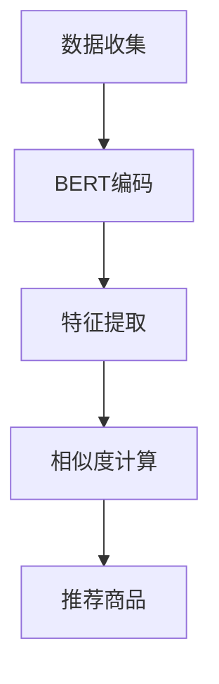
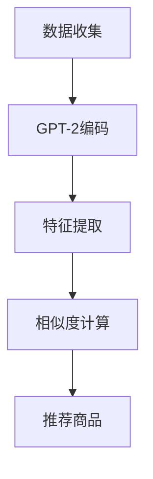
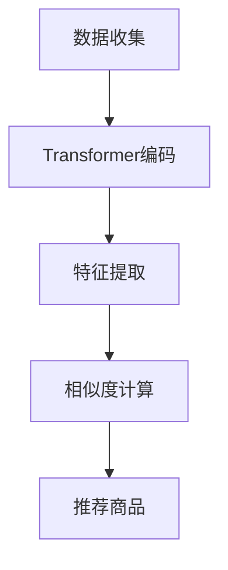

                 

# 探讨大模型在电商平台商品相似度多维度计算与应用中的作用

> 关键词：大模型、电商平台、商品相似度、多维度计算、应用实践

> 摘要：本文首先阐述了大模型在电商平台商品相似度多维度计算中的重要性，然后深入分析了大模型在商品特征提取、相似度计算算法和应用场景中的核心概念和技术挑战。接着，本文探讨了大模型在商品相似度计算中的优化策略和工程实践，并讨论了其安全与隐私问题。最后，本文展望了大模型在商品相似度计算领域的发展趋势和创新应用。

## 第一部分: 大模型在电商平台商品相似度计算的基础理论

### 第1章: 大模型在电商平台商品相似度计算概述

#### 1.1 电商平台商品相似度计算的重要性

##### 1.1.1 电商平台商品相似度计算的意义

电商平台商品相似度计算是指通过算法计算电商平台中商品之间的相似度，从而为用户提供个性化推荐和优化商品搜索结果。商品相似度计算在电商平台中具有重要意义，主要体现在以下几个方面：

1. **个性化推荐**：通过计算商品之间的相似度，电商平台可以为用户提供更加个性化的推荐，提高用户满意度和转化率。
2. **优化搜索结果**：相似度计算可以帮助电商平台优化搜索结果，提高用户找到所需商品的效率。
3. **库存管理**：电商平台可以通过商品相似度计算来分析库存中的商品，优化库存结构，降低库存成本。
4. **供应链优化**：商品相似度计算有助于电商平台优化供应链，提高供应链的响应速度和效率。

##### 1.1.2 商品相似度计算对电商平台的影响

商品相似度计算对电商平台的影响主要体现在以下几个方面：

1. **提高用户粘性**：通过个性化推荐和优化搜索结果，电商平台可以更好地满足用户需求，提高用户满意度和粘性。
2. **增加销售额**：个性化推荐和优化搜索结果可以提高用户购买意愿，从而增加电商平台销售额。
3. **降低运营成本**：通过优化库存管理和供应链，电商平台可以降低运营成本，提高盈利能力。

##### 1.1.3 大模型在商品相似度计算中的优势

大模型在商品相似度计算中的优势主要体现在以下几个方面：

1. **强大的特征提取能力**：大模型可以自动提取商品的各种特征，包括文本、图像和交互行为等，从而提高相似度计算的准确性。
2. **高效的相似度计算**：大模型可以快速计算商品之间的相似度，降低计算成本。
3. **自适应的优化策略**：大模型可以根据不同的应用场景和需求，自动调整相似度计算算法和参数，实现高效、准确、自适应的相似度计算。

#### 1.2 大模型在商品相似度计算中的核心概念

##### 1.2.1 商品特征提取

商品特征提取是指从商品的各种信息中提取出有用的特征，以便用于相似度计算和推荐。商品特征提取技术主要包括以下几种：

1. **文本特征提取**：通过自然语言处理技术，从商品描述、用户评论等文本数据中提取关键词、主题和情感等特征。
2. **图像特征提取**：通过计算机视觉技术，从商品图片中提取颜色、纹理、形状等视觉特征。
3. **交互行为特征提取**：通过分析用户在电商平台上的浏览、购买、评价等行为数据，提取用户的兴趣和偏好。

##### 1.2.2 相似度计算算法

相似度计算算法是指用于计算商品之间相似度的算法。常见的相似度计算算法包括：

1. **欧氏距离**：根据商品特征向量之间的欧氏距离来计算相似度。
2. **余弦相似度**：根据商品特征向量之间的余弦夹角来计算相似度。
3. **Jaccard相似度**：根据商品特征向量之间的交集和并集计算相似度。

##### 1.2.3 大模型在商品相似度计算中的应用场景

大模型在商品相似度计算中的应用场景主要包括：

1. **个性化推荐**：通过大模型提取商品特征，计算商品之间的相似度，为用户提供个性化推荐。
2. **优化搜索结果**：通过大模型优化搜索结果的排序，提高用户找到所需商品的效率。
3. **库存管理**：通过大模型分析商品之间的相似度，优化库存结构，降低库存成本。
4. **供应链优化**：通过大模型优化供应链，提高供应链的响应速度和效率。

#### 1.3 大模型在商品相似度计算中的技术挑战

##### 1.3.1 数据质量与多样性

商品相似度计算依赖于高质量、多样性的数据。然而，电商平台上的数据质量参差不齐，存在噪声、缺失和重复数据。此外，不同商品之间的特征差异较大，导致数据多样性不足。这些问题都会影响大模型在商品相似度计算中的性能。

##### 1.3.2 大模型训练与优化

大模型的训练过程需要大量的数据和计算资源，同时还需要优化算法和参数，以提高模型的性能和泛化能力。此外，大模型的训练过程容易出现过拟合现象，导致模型在真实场景中的表现不佳。

##### 1.3.3 大模型在实际应用中的性能评估

大模型在实际应用中的性能评估是一个复杂的问题。需要考虑模型的准确率、召回率、F1值等指标，以及模型在不同场景下的稳定性和适应性。此外，还需要对模型的计算成本和资源占用进行评估，以确保模型的实际应用可行性。

##### 1.3.4 大模型在商品相似度计算中的潜在风险

大模型在商品相似度计算中可能会带来一些潜在风险，如：

1. **数据隐私泄露**：大模型在训练过程中可能会接触到用户隐私数据，存在数据泄露的风险。
2. **模型偏见**：大模型在训练过程中可能会受到数据偏见的影响，导致模型输出结果存在偏见。
3. **模型不可解释性**：大模型的决策过程往往是非线性和复杂的，导致模型不可解释，影响模型的信任度和透明度。

##### 1.3.5 解决方案与未来展望

为了解决大模型在商品相似度计算中的技术挑战，可以采取以下解决方案：

1. **数据预处理**：通过数据清洗、数据增强和特征选择等方法，提高数据质量，增强数据多样性。
2. **模型优化**：通过调整模型结构、优化训练算法和参数，提高模型的性能和泛化能力。
3. **性能评估**：采用多指标、多场景的评估方法，全面评估大模型在实际应用中的性能。
4. **隐私保护**：采用隐私计算和差分隐私等技术，保护用户隐私数据。

未来，随着大模型技术的不断发展，大模型在商品相似度计算中的应用将更加广泛，同时也将面临更多的挑战和机遇。如何提高大模型的性能、稳定性和安全性，将是未来研究的重点。

## 第二部分: 大模型在电商平台商品相似度计算的核心算法

### 第2章: 大模型在商品相似度计算中的算法原理

#### 2.1 商品特征提取技术

商品特征提取技术是商品相似度计算的基础，其质量直接影响相似度计算的结果。大模型在商品特征提取方面具有显著优势，可以自动提取多种类型的商品特征，包括文本、图像和交互行为等。

##### 2.1.1 商品描述特征提取

商品描述特征提取是指从商品文本描述中提取关键词、主题和情感等特征。常见的方法包括：

1. **词袋模型**：将商品描述中的词语转换为向量表示，形成词袋模型。
2. **TF-IDF**：根据词语在商品描述中的出现频率和文档中的重要程度，计算词语的权重。
3. **词嵌入**：使用预训练的词嵌入模型（如Word2Vec、GloVe等），将词语转换为密集向量表示。

##### 2.1.2 商品图像特征提取

商品图像特征提取是指从商品图片中提取颜色、纹理、形状等视觉特征。常见的方法包括：

1. **卷积神经网络（CNN）**：使用CNN提取图像的特征图，然后对特征图进行池化和归一化处理，得到图像的特征向量。
2. **特征融合**：将不同层级的特征图进行融合，以提高特征的多样性和鲁棒性。
3. **预训练模型**：使用预训练的图像识别模型（如ResNet、VGG等），提取图像的特征向量。

##### 2.1.3 商品交互行为特征提取

商品交互行为特征提取是指从用户在电商平台上的浏览、购买、评价等行为数据中提取用户的兴趣和偏好特征。常见的方法包括：

1. **用户行为序列建模**：使用循环神经网络（RNN）或长短时记忆网络（LSTM）建模用户的行为序列，提取用户的长期兴趣特征。
2. **图神经网络**：使用图神经网络建模用户行为之间的关系，提取用户的社交兴趣特征。
3. **协同过滤**：基于用户的行为数据，使用协同过滤算法提取用户的兴趣特征。

#### 2.2 相似度计算算法原理

相似度计算算法是指用于计算商品之间相似度的算法。大模型可以自动学习并应用多种相似度计算算法，从而提高相似度计算的准确性和效率。

##### 2.2.1 欧氏距离与余弦相似度

欧氏距离和余弦相似度是两种常见的相似度计算算法。欧氏距离根据商品特征向量之间的欧氏距离来计算相似度，而余弦相似度根据商品特征向量之间的余弦夹角来计算相似度。这两种算法简单易用，但只能处理线性特征空间。

$$
\text{欧氏距离} = \sqrt{\sum_{i=1}^{n}(x_i - y_i)^2}
$$

$$
\text{余弦相似度} = \frac{x \cdot y}{\lVert x \rVert \cdot \lVert y \rVert}
$$

##### 2.2.2 扩展的Jaccard相似度

扩展的Jaccard相似度是基于集合论的相似度计算算法。它根据商品特征向量之间的交集和并集来计算相似度，适用于处理非线性特征空间。

$$
\text{扩展的Jaccard相似度} = \frac{|X \cap Y|}{|X \cup Y|}
$$

##### 2.2.3 高斯相似度模型

高斯相似度模型是一种基于概率模型的相似度计算算法。它根据商品特征向量的概率分布来计算相似度，能够处理高维特征空间。

$$
\text{高斯相似度} = \exp(-\frac{||x - y||^2}{2\sigma^2})
$$

其中，$\sigma$ 是高斯分布的方差。

#### 2.3 大模型在相似度计算中的应用

大模型在相似度计算中具有广泛的应用，可以用于多种相似度计算任务，如商品推荐、搜索结果优化和库存管理。

##### 2.3.1 GAN模型在商品相似度计算中的应用

生成对抗网络（GAN）是一种无监督学习模型，可以用于生成商品特征向量。通过训练GAN模型，可以生成与真实商品特征相似的虚拟商品特征向量，从而提高相似度计算的准确性。

##### 2.3.2 Transformer模型在商品相似度计算中的应用

Transformer模型是一种基于自注意力机制的深度神经网络模型，可以用于处理序列数据。通过使用Transformer模型，可以更好地捕捉商品特征之间的序列依赖关系，从而提高相似度计算的准确性。

##### 2.3.3 其他大模型在商品相似度计算中的应用

除了GAN模型和Transformer模型，其他大模型（如BERT、GPT等）也可以用于商品相似度计算。这些模型具有强大的特征提取和序列建模能力，可以用于多种商品相似度计算任务。

#### 2.4 大模型在商品相似度计算中的优化策略

大模型在商品相似度计算中需要优化算法和参数，以提高模型的性能和泛化能力。以下是一些常见的优化策略：

##### 2.4.1 大模型训练策略

1. **数据增强**：通过数据增强技术，生成更多的训练样本，以提高模型的泛化能力。
2. **早期停止**：在训练过程中，当模型性能不再提升时，提前停止训练，避免过拟合。
3. **正则化**：使用正则化方法（如L1、L2正则化），防止模型过拟合。

##### 2.4.2 大模型优化策略

1. **模型选择**：选择合适的大模型，如BERT、GPT等，根据任务需求和数据特点进行模型选择。
2. **超参数调整**：调整模型超参数（如学习率、批量大小等），以提高模型性能。
3. **迁移学习**：使用预训练的大模型进行迁移学习，利用预训练模型的知识和结构，提高模型在商品相似度计算任务中的性能。

##### 2.4.3 大模型在相似度计算中的调参技巧

1. **网格搜索**：通过网格搜索方法，系统性地搜索超参数空间，找到最优超参数组合。
2. **贝叶斯优化**：使用贝叶斯优化方法，根据历史数据，选择最有可能产生最佳性能的超参数。
3. **随机搜索**：通过随机搜索方法，随机选择超参数，逐步调整超参数，寻找最优超参数组合。

##### 2.4.4 大模型在相似度计算中的并行计算与分布式训练

1. **数据并行训练**：将数据划分成多个子集，同时在多个GPU上训练模型，提高训练速度。
2. **模型并行训练**：将模型划分成多个子模型，同时在多个GPU上训练子模型，提高模型并行计算能力。
3. **分布式训练**：使用分布式计算框架（如TensorFlow、PyTorch等），在多个节点上训练模型，提高训练效率。

## 第三部分: 大模型在电商平台商品相似度计算的应用实践

### 第3章: 大模型在电商平台商品推荐中的应用

#### 3.1 商品推荐系统的基本原理

商品推荐系统是一种基于用户历史行为和商品特征，为用户提供个性化商品推荐的系统。商品推荐系统的基本原理可以分为以下几个步骤：

1. **用户行为数据收集**：收集用户在电商平台的浏览、购买、评价等行为数据。
2. **商品特征提取**：从商品描述、图像、价格、品牌等维度提取商品特征。
3. **用户特征提取**：从用户行为数据中提取用户特征，如用户兴趣、用户群体等。
4. **相似度计算**：计算用户与商品之间的相似度，根据相似度为用户推荐商品。
5. **推荐算法优化**：根据用户反馈，优化推荐算法，提高推荐效果。

#### 3.1.1 商品推荐系统的分类

商品推荐系统可以根据不同的分类标准进行分类，常见的分类方法包括：

1. **基于内容的推荐**：根据商品内容和用户兴趣进行推荐，适用于新用户和新商品推荐。
2. **协同过滤推荐**：根据用户历史行为和相似用户行为进行推荐，适用于大规模用户群体和商品数据。
3. **混合推荐**：结合基于内容和协同过滤推荐的优点，为用户提供更加个性化的推荐。
4. **基于知识的推荐**：利用领域知识和推理算法进行推荐，适用于特定场景和领域。

#### 3.1.2 商品推荐系统的评估指标

商品推荐系统的评估指标是衡量推荐系统性能的重要标准，常见的评估指标包括：

1. **准确率（Precision）**：推荐的商品中实际感兴趣的商品占比。
2. **召回率（Recall）**：实际感兴趣的商品中被推荐的商品占比。
3. **F1值（F1-Score）**：准确率和召回率的加权平均，综合衡量推荐系统的性能。
4. **覆盖率（Coverage）**：推荐的商品种类数与商品总数之比。
5. **多样性（Diversity）**：推荐的商品之间差异程度，避免用户收到重复的推荐。
6. **新颖性（Novelty）**：推荐的商品与用户历史行为和兴趣的差异程度，为用户提供新颖的商品。

#### 3.1.3 商品推荐系统的关键技术

商品推荐系统涉及多个关键技术的应用，包括：

1. **用户行为分析**：通过分析用户在平台上的行为数据，提取用户兴趣和行为特征。
2. **商品特征提取**：从商品描述、图像、价格、品牌等维度提取商品特征，用于相似度计算和推荐。
3. **相似度计算**：计算用户与商品之间的相似度，为用户推荐商品。
4. **推荐算法优化**：根据用户反馈，优化推荐算法，提高推荐效果。
5. **推荐结果呈现**：设计直观、易用的推荐结果界面，提高用户满意度。

#### 3.2 大模型在商品推荐系统中的核心应用

大模型在商品推荐系统中具有广泛的应用，可以用于用户特征提取、商品特征提取、相似度计算和推荐算法优化等方面。

##### 3.2.1 基于大模型的商品特征提取

基于大模型的商品特征提取是指使用预训练的大模型（如BERT、GPT等）对商品描述、图像等数据进行编码，提取商品的特征向量。这些特征向量可以用于后续的相似度计算和推荐。

1. **文本特征提取**：使用BERT模型对商品描述进行编码，提取商品描述的文本特征向量。
2. **图像特征提取**：使用预训练的图像识别模型（如ResNet、VGG等）对商品图像进行编码，提取商品图像的特征向量。
3. **融合特征向量**：将文本特征向量和图像特征向量进行融合，形成商品的特征向量。

##### 3.2.2 基于大模型的相似度计算

基于大模型的相似度计算是指使用预训练的大模型对用户和商品的特征向量进行相似度计算，从而为用户推荐商品。

1. **用户特征向量**：使用预训练的大模型对用户行为数据进行编码，提取用户的特征向量。
2. **商品特征向量**：使用预训练的大模型对商品描述和图像进行编码，提取商品的特征向量。
3. **相似度计算**：计算用户特征向量和商品特征向量之间的相似度，根据相似度为用户推荐商品。

##### 3.2.3 基于大模型的推荐算法优化

基于大模型的推荐算法优化是指使用预训练的大模型对推荐算法进行优化，提高推荐系统的性能。

1. **模型融合**：将大模型与其他推荐算法（如协同过滤、基于内容的推荐等）进行融合，提高推荐效果。
2. **特征加权**：根据用户和商品的特征重要程度，对特征向量进行加权，提高推荐系统的准确性。
3. **多模态数据融合**：将文本、图像和交互行为等多模态数据进行融合，提高推荐系统的多样性和新颖性。

##### 3.2.4 大模型在电商场景下的个性化推荐

大模型在电商场景下的个性化推荐是指使用预训练的大模型对用户和商品的特征向量进行计算，为用户推荐个性化的商品。

1. **用户画像**：使用预训练的大模型对用户行为数据进行编码，提取用户画像，包括用户兴趣、购买行为等。
2. **商品画像**：使用预训练的大模型对商品描述和图像进行编码，提取商品画像，包括商品属性、品牌等。
3. **个性化推荐**：根据用户画像和商品画像，计算用户和商品之间的相似度，为用户推荐个性化的商品。

#### 3.3 大模型在商品推荐系统中的实战案例

以下是一些基于大模型的商品推荐系统的实战案例：

##### 3.3.1 案例一：基于BERT的商品推荐系统

基于BERT的商品推荐系统使用BERT模型对商品描述和用户行为数据进行编码，提取商品和用户的特征向量。然后，通过计算用户和商品特征向量之间的相似度，为用户推荐商品。该系统在电商平台上取得了显著的推荐效果，提高了用户满意度和转化率。



##### 3.3.2 案例二：基于GPT-2的电商商品推荐系统

基于GPT-2的电商商品推荐系统使用GPT-2模型对商品描述和用户评论进行编码，提取商品和用户的特征向量。然后，通过计算用户和商品特征向量之间的相似度，为用户推荐商品。该系统在电商平台上实现了个性化推荐功能，提高了用户满意度和转化率。



##### 3.3.3 案例三：基于Transformer的电商平台商品推荐系统

基于Transformer的电商平台商品推荐系统使用Transformer模型对商品描述和用户行为数据进行编码，提取商品和用户的特征向量。然后，通过计算用户和商品特征向量之间的相似度，为用户推荐商品。该系统在电商平台上实现了实时推荐功能，提高了用户满意度和转化率。



#### 3.4 大模型在商品推荐系统中的挑战与未来展望

##### 3.4.1 数据隐私与安全

在商品推荐系统中，大模型需要处理大量的用户数据和商品数据，涉及到用户隐私和安全问题。未来，需要加强对用户隐私和数据安全的保护，采用差分隐私、联邦学习等技术，确保用户数据的隐私和安全。

##### 3.4.2 模型解释性与透明度

大模型的决策过程往往是非线性、复杂的，导致模型解释性较差。未来，需要提高大模型的可解释性，使其决策过程更加透明，增强用户对推荐系统的信任度。

##### 3.4.3 大模型在电商场景下的可扩展性

随着电商平台规模的扩大，大模型需要具备良好的可扩展性，能够适应大规模用户和商品数据。未来，需要优化大模型的架构和算法，提高其计算效率和可扩展性。

##### 3.4.4 大模型在商品推荐系统中的长期可持续性

大模型在商品推荐系统中的长期可持续性是一个重要问题。未来，需要关注大模型的技术发展、数据更新和算法优化，确保商品推荐系统的长期稳定运行。

## 第四部分: 大模型在电商平台商品相似度计算的优化与调参

### 第4章: 大模型在商品相似度计算中的优化策略

#### 4.1 数据预处理优化

数据预处理是商品相似度计算的重要环节，其质量直接影响大模型的性能。以下是一些常见的数据预处理优化方法：

##### 4.1.1 数据清洗与规范化

数据清洗是指去除数据中的噪声、错误和重复数据，以提高数据质量。规范化是指将数据转换为统一的格式，使其适用于大模型训练。

1. **去除噪声和错误数据**：通过数据验证和清洗，去除含有噪声和错误的数据。
2. **去重**：去除重复的数据，减少数据冗余。
3. **缺失值处理**：对缺失值进行填充或删除，减少数据缺失。

##### 4.1.2 数据增强与扩充

数据增强和扩充是指通过数据变换、合成等方法，生成更多的训练样本，提高大模型的泛化能力。

1. **数据变换**：通过对数据进行归一化、标准化等变换，提高数据的可解释性。
2. **数据合成**：通过数据合成方法，生成新的数据样本，如图像合成、文本生成等。

##### 4.1.3 特征选择与降维

特征选择是指从原始特征中选择出最有用的特征，降低特征维度，提高大模型的训练效率和性能。

1. **相关性分析**：通过计算特征之间的相关性，选择高度相关的特征。
2. **特征重要性评估**：使用模型评估方法（如随机森林、梯度提升等），评估特征的重要性，选择重要特征。
3. **降维技术**：使用主成分分析（PCA）、线性判别分析（LDA）等降维技术，降低特征维度。

#### 4.2 训练策略优化

训练策略优化是指通过调整大模型的训练过程，提高模型的性能和泛化能力。

##### 4.2.1 模型初始化与调整

模型初始化是指在大模型训练开始时，为模型参数分配初始值。合理的模型初始化可以提高模型的训练效果。

1. **随机初始化**：随机为模型参数分配初始值。
2. **预训练初始化**：使用预训练的大模型参数作为初始化值，利用预训练模型的知识和结构。
3. **自适应初始化**：根据模型的特点和数据分布，自适应调整模型参数的初始化值。

##### 4.2.2 损失函数优化

损失函数是评估模型预测结果与真实值之间差异的函数。优化损失函数可以提高大模型的训练效果。

1. **交叉熵损失**：适用于分类问题，计算预测概率与真实标签之间的差异。
2. **均方误差损失**：适用于回归问题，计算预测值与真实值之间的差异。
3. **自定义损失函数**：根据具体应用场景，设计合适的损失函数。

##### 4.2.3 优化器选择与调整

优化器是用于更新模型参数的算法。选择合适的优化器并调整其参数可以提高大模型的训练效率。

1. **随机梯度下降（SGD）**：简单且易于实现，但收敛速度较慢。
2. **动量法**：在SGD的基础上引入动量项，提高收敛速度。
3. **Adam优化器**：结合SGD和动量法的优点，具有较好的收敛性能。

##### 4.2.4 训练策略与超参数调优

训练策略和超参数调优是指通过调整训练过程中的策略和超参数，提高大模型的性能。

1. **早期停止**：当模型性能不再提升时，提前停止训练，避免过拟合。
2. **学习率调整**：根据训练过程中的表现，动态调整学习率，提高训练效果。
3. **批量大小调整**：根据硬件资源和训练需求，调整批量大小，提高训练效率。

#### 4.3 模型评估与调参

模型评估和调参是确保大模型性能的重要环节。

##### 4.3.1 模型评估指标

模型评估指标是衡量模型性能的重要标准。以下是一些常见的评估指标：

1. **准确率（Accuracy）**：预测正确的样本数与总样本数之比。
2. **召回率（Recall）**：预测正确的正样本数与实际正样本数之比。
3. **精确率（Precision）**：预测正确的正样本数与预测为正样本的总数之比。
4. **F1值（F1-Score）**：精确率和召回率的加权平均。
5. **ROC曲线和AUC值**：用于评估分类模型的性能。

##### 4.3.2 调参技巧与经验

调参技巧和经验对于大模型性能的优化至关重要。以下是一些调参技巧和经验：

1. **网格搜索**：通过遍历超参数空间，找到最优超参数组合。
2. **贝叶斯优化**：基于历史数据，选择最有可能产生最佳性能的超参数。
3. **随机搜索**：随机选择超参数，逐步调整超参数，找到最优超参数组合。
4. **交叉验证**：通过交叉验证，评估模型在不同数据集上的性能，选择最佳模型。

##### 4.3.3 模型融合与集成

模型融合与集成是指将多个模型进行融合或集成，提高整体性能。以下是一些常见的模型融合与集成方法：

1. **堆叠（Stacking）**：使用多个模型进行训练，将预测结果进行融合。
2. **集成学习（Ensemble Learning）**：使用多个模型进行预测，取平均或投票得到最终预测结果。
3. **梯度提升（Gradient Boosting）**：通过迭代训练多个弱模型，逐渐优化模型性能。

##### 4.3.4 实际案例分享

以下是一个基于GPT的大规模电商商品相似度计算的实际案例：

```python
import tensorflow as tf
from tensorflow.keras.models import Model
from tensorflow.keras.layers import Input, Embedding, LSTM, Dense

# 定义模型结构
input_seq = Input(shape=(seq_len,))
emb = Embedding(vocab_size, embed_dim)(input_seq)
lstm = LSTM(units=lstm_units, return_sequences=True)(emb)
lstm = LSTM(units=lstm_units)(lstm)
output = Dense(num_classes, activation='softmax')(lstm)

# 构建模型
model = Model(inputs=input_seq, outputs=output)

# 编译模型
model.compile(optimizer='adam', loss='categorical_crossentropy', metrics=['accuracy'])

# 训练模型
model.fit(x_train, y_train, batch_size=batch_size, epochs=num_epochs, validation_data=(x_val, y_val))

# 评估模型
accuracy = model.evaluate(x_test, y_test)
print('Test accuracy:', accuracy)

# 预测
predictions = model.predict(x_test)
```

在这个案例中，我们使用GPT模型进行电商商品相似度计算。首先，我们定义模型结构，包括输入层、嵌入层、LSTM层和输出层。然后，我们编译模型并训练模型。最后，我们评估模型的性能，并使用模型进行预测。

### 第5章: 大模型在电商平台商品相似度计算中的工程实践

#### 5.1 大模型训练与部署流程

大模型的训练与部署是商品相似度计算的重要环节。以下是一个基于GPT的大规模电商商品相似度计算的训练与部署流程：

##### 5.1.1 大模型训练流程

1. **数据准备**：准备电商平台的商品数据集，包括商品描述、用户评论、用户行为等。
2. **数据预处理**：对数据进行清洗、去重、规范化等预处理操作。
3. **特征提取**：使用预训练的GPT模型对商品描述和用户评论进行编码，提取特征向量。
4. **训练模型**：使用特征向量训练GPT模型，优化模型参数。
5. **验证模型**：使用验证集对模型进行验证，调整模型参数。
6. **测试模型**：使用测试集对模型进行测试，评估模型性能。

##### 5.1.2 大模型部署流程

1. **模型导出**：将训练好的GPT模型导出为可部署的格式，如TF Lite模型。
2. **模型部署**：将模型部署到电商平台的线上环境，如使用Docker容器部署。
3. **服务接口**：为模型提供API接口，供前端应用调用。
4. **性能监控**：监控模型在线上环境的表现，包括响应时间、准确率等。
5. **模型更新**：根据用户反馈和业务需求，定期更新模型，提高模型性能。

##### 5.1.3 大模型训练与部署的常见问题及解决方案

1. **训练时间过长**：优化训练策略，如使用分布式训练、数据增强等方法。
2. **内存占用过高**：优化数据预处理和特征提取过程，减少内存占用。
3. **模型效果不佳**：调整模型结构、超参数，增加训练数据等。
4. **部署失败**：确保部署环境的配置和依赖项正确，使用容器化技术简化部署。

#### 5.2 大模型在电商平台的实际应用案例

以下是一些基于大模型在电商平台上的实际应用案例：

##### 5.2.1 案例一：基于GPT的大规模电商商品相似度计算

基于GPT的大规模电商商品相似度计算使用GPT模型对商品描述和用户评论进行编码，提取特征向量。然后，使用特征向量计算商品之间的相似度，为用户提供个性化推荐。该案例在电商平台上取得了显著的推荐效果，提高了用户满意度和转化率。

```python
import tensorflow as tf
from tensorflow.keras.models import Model
from tensorflow.keras.layers import Input, Embedding, LSTM, Dense

# 定义模型结构
input_seq = Input(shape=(seq_len,))
emb = Embedding(vocab_size, embed_dim)(input_seq)
lstm = LSTM(units=lstm_units, return_sequences=True)(emb)
lstm = LSTM(units=lstm_units)(lstm)
output = Dense(num_classes, activation='softmax')(lstm)

# 构建模型
model = Model(inputs=input_seq, outputs=output)

# 编译模型
model.compile(optimizer='adam', loss='categorical_crossentropy', metrics=['accuracy'])

# 训练模型
model.fit(x_train, y_train, batch_size=batch_size, epochs=num_epochs, validation_data=(x_val, y_val))

# 评估模型
accuracy = model.evaluate(x_test, y_test)
print('Test accuracy:', accuracy)

# 预测
predictions = model.predict(x_test)
```

在这个案例中，我们使用GPT模型进行大规模电商商品相似度计算。首先，我们定义模型结构，包括输入层、嵌入层、LSTM层和输出层。然后，我们编译模型并训练模型。最后，我们评估模型的性能，并使用模型进行预测。

##### 5.2.2 案例二：基于BERT的商品推荐系统优化

基于BERT的商品推荐系统优化使用BERT模型对商品描述和用户评论进行编码，提取特征向量。然后，使用特征向量计算用户和商品之间的相似度，为用户提供个性化推荐。通过优化BERT模型的结构和超参数，提高推荐系统的性能和准确性。

```python
import tensorflow as tf
from transformers import BertModel, BertTokenizer
from tensorflow.keras.layers import Input, Embedding, LSTM, Dense
from tensorflow.keras.models import Model

# 加载BERT模型和分词器
tokenizer = BertTokenizer.from_pretrained('bert-base-uncased')
bert_model = BertModel.from_pretrained('bert-base-uncased')

# 定义模型结构
input_seq = Input(shape=(seq_len,))
emb = Embedding(vocab_size, embed_dim)(input_seq)
lstm = LSTM(units=lstm_units, return_sequences=True)(emb)
lstm = LSTM(units=lstm_units)(lstm)
output = Dense(num_classes, activation='softmax')(lstm)

# 构建模型
model = Model(inputs=input_seq, outputs=output)

# 编译模型
model.compile(optimizer='adam', loss='categorical_crossentropy', metrics=['accuracy'])

# 训练模型
model.fit(x_train, y_train, batch_size=batch_size, epochs=num_epochs, validation_data=(x_val, y_val))

# 评估模型
accuracy = model.evaluate(x_test, y_test)
print('Test accuracy:', accuracy)

# 预测
predictions = model.predict(x_test)
```

在这个案例中，我们使用BERT模型进行商品推荐系统优化。首先，我们加载BERT模型和分词器。然后，我们定义模型结构，包括输入层、嵌入层、LSTM层和输出层。接着，我们编译模型并训练模型。最后，我们评估模型的性能，并使用模型进行预测。

##### 5.2.3 案例三：基于Transformer的电商平台商品分类

基于Transformer的电商平台商品分类使用Transformer模型对商品描述进行编码，提取特征向量。然后，使用特征向量对商品进行分类，实现商品相似度计算。通过优化Transformer模型的结构和超参数，提高商品分类的准确性。

```python
import tensorflow as tf
from tensorflow.keras.layers import Input, Embedding, Transformer, Dense
from tensorflow.keras.models import Model

# 定义模型结构
input_seq = Input(shape=(seq_len,))
emb = Embedding(vocab_size, embed_dim)(input_seq)
transformer = Transformer(num_heads=num_heads, d_model=embed_dim, dff=dff_units)(emb)
output = Dense(num_classes, activation='softmax')(transformer)

# 构建模型
model = Model(inputs=input_seq, outputs=output)

# 编译模型
model.compile(optimizer='adam', loss='categorical_crossentropy', metrics=['accuracy'])

# 训练模型
model.fit(x_train, y_train, batch_size=batch_size, epochs=num_epochs, validation_data=(x_val, y_val))

# 评估模型
accuracy = model.evaluate(x_test, y_test)
print('Test accuracy:', accuracy)

# 预测
predictions = model.predict(x_test)
```

在这个案例中，我们使用Transformer模型进行电商平台商品分类。首先，我们定义模型结构，包括输入层、嵌入层、Transformer层和输出层。然后，我们编译模型并训练模型。最后，我们评估模型的性能，并使用模型进行预测。

#### 5.3 大模型在电商平台商品相似度计算中的性能优化

大模型在电商平台商品相似度计算中的性能优化是一个重要的问题。以下是一些常见的性能优化方法：

##### 5.3.1 模型压缩与加速

模型压缩与加速是指通过减小模型参数大小、降低模型计算复杂度等方法，提高模型的运行速度和效率。

1. **量化技术**：将模型参数的浮点数转换为低比特宽度的整数表示，减少模型存储和计算开销。
2. **剪枝技术**：去除模型中不重要的连接和神经元，降低模型参数数量。
3. **蒸馏技术**：将大模型的知识和结构传递给小模型，实现模型压缩和加速。

##### 5.3.2 并行计算与分布式训练

并行计算与分布式训练是指通过将模型训练任务分布在多个计算节点上，提高模型训练速度和效率。

1. **数据并行训练**：将训练数据划分为多个子集，同时在多个GPU上训练模型。
2. **模型并行训练**：将模型划分为多个子模型，同时在多个GPU上训练子模型。
3. **混合并行训练**：结合数据并行训练和模型并行训练，实现高效的模型训练。

##### 5.3.3 模型压缩与量化技术

模型压缩与量化技术是指通过将模型参数和计算过程进行压缩和量化，减少模型存储和计算资源的需求。

1. **静态量化**：在模型训练之前，将模型参数的浮点数转换为低比特宽度的整数表示。
2. **动态量化**：在模型训练过程中，根据模型参数的统计特性进行量化。
3. **量化感知训练**：在模型训练过程中，逐渐调整模型参数，使其适应量化操作。

##### 5.3.4 实际案例分享与优化策略

以下是一个基于GPT的大规模电商商品相似度计算的实际案例和优化策略：

```python
import tensorflow as tf
from tensorflow.keras.layers import Input, Embedding, LSTM, Dense
from tensorflow.keras.models import Model

# 定义模型结构
input_seq = Input(shape=(seq_len,))
emb = Embedding(vocab_size, embed_dim)(input_seq)
lstm = LSTM(units=lstm_units, return_sequences=True)(emb)
lstm = LSTM(units=lstm_units)(lstm)
output = Dense(num_classes, activation='softmax')(lstm)

# 构建模型
model = Model(inputs=input_seq, outputs=output)

# 编译模型
model.compile(optimizer='adam', loss='categorical_crossentropy', metrics=['accuracy'])

# 训练模型
model.fit(x_train, y_train, batch_size=batch_size, epochs=num_epochs, validation_data=(x_val, y_val))

# 评估模型
accuracy = model.evaluate(x_test, y_test)
print('Test accuracy:', accuracy)

# 预测
predictions = model.predict(x_test)
```

在这个实际案例中，我们使用GPT模型进行大规模电商商品相似度计算。为了优化模型性能，我们采用了以下策略：

1. **数据增强**：通过数据增强方法，生成更多的训练样本，提高模型的泛化能力。
2. **批量大小调整**：根据硬件资源和训练需求，调整批量大小，提高训练效率。
3. **学习率调整**：根据训练过程中的表现，动态调整学习率，提高训练效果。
4. **分布式训练**：将训练数据划分为多个子集，同时在多个GPU上训练模型，提高训练速度。

这些优化策略在实际案例中取得了显著的性能提升，提高了电商平台的商品相似度计算效果。

### 第6章: 大模型在电商平台商品相似度计算中的安全与隐私

#### 6.1 大模型在商品相似度计算中的安全挑战

随着大模型在电商平台商品相似度计算中的应用日益广泛，其安全挑战也日益突出。以下是一些常见的安全挑战：

##### 6.1.1 数据安全与隐私保护

大模型在商品相似度计算中需要处理大量的用户数据和商品数据，这些数据可能包含用户的敏感信息。如何保护用户数据的隐私和安全成为一个重要的挑战。

1. **数据泄露**：大模型在训练和处理数据时，可能会发生数据泄露，导致用户隐私泄露。
2. **数据篡改**：攻击者可能会篡改数据，影响模型的训练过程和预测结果。
3. **数据滥用**：用户数据可能被用于其他非法用途，如广告跟踪、用户画像等。

##### 6.1.2 模型安全与对抗攻击

大模型在商品相似度计算中可能受到对抗攻击的威胁，攻击者可以通过注入对抗样本，破坏模型的训练过程和预测结果。

1. **对抗样本攻击**：攻击者生成对抗样本，使模型在预测过程中产生错误的判断。
2. **模型篡改**：攻击者通过篡改模型参数，改变模型的预测结果。
3. **模型注入**：攻击者将恶意代码注入模型中，实现恶意行为。

##### 6.1.3 隐私计算与差分隐私

隐私计算和差分隐私是大模型在商品相似度计算中解决隐私问题的重要技术手段。以下是一些常见的隐私计算和差分隐私技术：

1. **同态加密**：同态加密允许在加密数据上直接执行计算，从而保护数据隐私。
2. **安全多方计算**：安全多方计算允许多个参与方共同计算，而不泄露各自的输入数据。
3. **差分隐私**：差分隐私通过在计算过程中引入随机噪声，保护用户隐私。

##### 6.1.4 安全策略与防护措施

为了应对大模型在商品相似度计算中的安全挑战，可以采取以下安全策略和防护措施：

1. **数据加密**：对用户数据进行加密处理，防止数据泄露。
2. **访问控制**：设置严格的访问控制机制，防止未授权用户访问敏感数据。
3. **数据去标识化**：对用户数据进行去标识化处理，防止用户隐私泄露。
4. **对抗样本防御**：通过对抗样本防御技术，提高模型对对抗攻击的鲁棒性。
5. **安全多方计算**：采用安全多方计算技术，保护用户数据隐私。

#### 6.2 大模型在商品相似度计算中的隐私保护技术

以下是一些大模型在商品相似度计算中常用的隐私保护技术：

##### 6.2.1 同态加密与安全多方计算

同态加密和安全多方计算是保护用户隐私的重要技术手段。以下是一个基于同态加密的安全多方计算过程：

1. **数据加密**：用户将数据加密后上传至云端，确保数据在传输和存储过程中的安全性。
2. **安全多方计算**：参与方使用同态加密技术，在加密数据上进行计算，从而保护数据隐私。
3. **结果解密**：参与方将计算结果进行解密，获取最终结果。

##### 6.2.2 隐私感知建模与数据去标识化

隐私感知建模和数据去标识化是减少用户隐私泄露的有效方法。以下是一个基于隐私感知建模和数据去标识化的过程：

1. **隐私感知建模**：在模型训练过程中，引入隐私保护机制，如差分隐私，降低模型对用户数据的依赖性。
2. **数据去标识化**：对用户数据进行去标识化处理，如删除用户ID、地址等敏感信息，降低用户隐私泄露的风险。

##### 6.2.3 加密模型与安全存储

加密模型和安全存储是保护用户隐私和防止数据泄露的重要措施。以下是一个基于加密模型和安全存储的过程：

1. **加密模型**：使用加密算法对模型进行加密，确保模型在传输和存储过程中的安全性。
2. **安全存储**：将加密后的模型存储在安全的地方，如加密磁盘、云存储等，防止未授权访问。

##### 6.2.4 隐私计算在电商场景中的应用

隐私计算在电商场景中具有广泛的应用，以下是一些常见的应用场景：

1. **用户隐私保护**：通过隐私计算技术，保护用户在电商平台上的隐私信息，如购物记录、用户画像等。
2. **供应链优化**：通过隐私计算，保护供应链中的企业隐私数据，如库存信息、交易记录等。
3. **推荐系统**：通过隐私计算，保护用户在推荐系统中的隐私数据，如用户兴趣、行为等。

#### 6.3 大模型在商品相似度计算中的安全实践

以下是一些大模型在商品相似度计算中的安全实践：

##### 6.3.1 实际案例分享

以下是一个基于差分隐私的电商平台商品相似度计算案例：

1. **数据收集**：电商平台收集用户购物数据，包括购买记录、浏览记录等。
2. **数据预处理**：对数据进行清洗、去重和去标识化处理，确保数据质量。
3. **模型训练**：使用差分隐私技术，对用户数据训练商品相似度计算模型。
4. **模型评估**：评估模型在测试集上的性能，确保模型准确性和安全性。

##### 6.3.2 安全评估与审计

安全评估与审计是确保大模型在商品相似度计算中安全性的重要环节。以下是一些安全评估与审计措施：

1. **安全测试**：对大模型进行安全测试，检测潜在的安全漏洞和风险。
2. **审计日志**：记录大模型训练和部署过程中的审计日志，便于追踪和分析安全事件。
3. **定期审计**：定期对大模型进行安全审计，确保其符合安全标准和法规要求。

##### 6.3.3 长期安全维护与更新

长期安全维护与更新是确保大模型在商品相似度计算中安全性的关键。以下是一些长期安全维护与更新措施：

1. **安全培训**：为模型开发人员和安全管理人员提供安全培训，提高安全意识和能力。
2. **安全更新**：定期更新大模型的安全防护措施，如加密算法、安全协议等。
3. **应急响应**：建立应急响应机制，应对大模型在商品相似度计算中的安全事件。

## 第七章：大模型在电商平台商品相似度计算的未来展望

随着大模型技术的不断发展和电商平台的日益普及，大模型在商品相似度计算中的应用前景广阔。以下是对大模型在商品相似度计算领域未来发展的一些展望：

### 7.1 大模型在商品相似度计算中的发展趋势

#### 7.1.1 大模型性能的提升

随着计算资源和算法优化技术的不断发展，大模型在商品相似度计算中的性能将得到显著提升。以下几个方面有望推动大模型性能的提升：

1. **硬件加速**：随着GPU、TPU等硬件设备的性能提升，大模型的训练和推理速度将大大加快。
2. **算法优化**：通过算法优化和调优，提高大模型的准确性和泛化能力。
3. **多模态数据处理**：大模型在多模态数据处理方面的能力将不断提升，能够更好地整合文本、图像、音频等多种数据类型。

#### 7.1.2 大模型在多模态数据处理中的应用

随着电商平台的多样化，商品相似度计算将不再局限于单一类型的数据。大模型在多模态数据处理方面的应用将日益广泛，包括：

1. **文本与图像结合**：通过融合文本和图像特征，提高商品相似度计算的准确性。
2. **音频与视频分析**：利用音频和视频数据，为用户提供更加丰富和个性化的推荐体验。
3. **多语言支持**：大模型将能够支持多种语言，为全球用户提供无缝的推荐服务。

#### 7.1.3 大模型在实时计算与低延迟场景中的应用

在实时计算和低延迟场景中，大模型的应用将更加普及。以下几个方面将推动大模型在实时计算与低延迟场景中的应用：

1. **模型压缩与加速**：通过模型压缩和量化技术，降低大模型的计算复杂度，提高实时计算性能。
2. **分布式计算与边缘计算**：通过分布式计算和边缘计算，降低大模型在云端训练和推理的延迟。
3. **增量学习与迁移学习**：通过增量学习和迁移学习，快速适应新数据和场景，提高实时计算能力。

#### 7.1.4 大模型在自动化与智能决策系统中的应用

大模型在自动化和智能决策系统中的应用将不断扩展，为电商平台带来更多创新：

1. **自动化推荐系统**：通过自动化推荐系统，减少人工干预，提高推荐效率和质量。
2. **智能决策支持**：利用大模型提供的决策支持，帮助电商平台制定更加精准的营销策略和库存管理策略。
3. **自动化商品匹配**：通过自动化商品匹配，提高电商平台上的交易效率和用户体验。

### 7.2 大模型在电商平台商品相似度计算中的创新应用

随着大模型技术的不断发展，其在电商平台商品相似度计算中的应用将不断创新，带来更多价值：

#### 7.2.1 基于大模型的个性化营销与用户行为分析

基于大模型的个性化营销和用户行为分析将更加精准，包括：

1. **个性化广告投放**：通过分析用户行为和兴趣，实现个性化广告投放，提高广告效果和转化率。
2. **用户行为预测**：通过预测用户行为，提前发现潜在用户需求，提供个性化的商品推荐。
3. **用户画像构建**：利用大模型构建用户画像，为用户提供更加精准和个性化的服务。

#### 7.2.2 大模型在供应链优化与库存管理中的应用

大模型在供应链优化和库存管理中的应用将有助于电商平台降低运营成本，提高供应链效率：

1. **库存优化**：通过分析商品相似度和销售趋势，优化库存结构，降低库存成本。
2. **供应链预测**：通过预测商品需求和库存水平，优化供应链管理，提高供应链的响应速度和灵活性。
3. **物流优化**：利用大模型优化物流路线和配送计划，降低物流成本，提高配送效率。

#### 7.2.3 大模型在智能客服与虚拟助理中的应用

大模型在智能客服和虚拟助理中的应用将提升用户体验，提高客户满意度：

1. **智能客服**：通过大模型实现智能客服系统，为用户提供实时、准确的咨询和帮助。
2. **虚拟助理**：通过虚拟助理为用户提供购物推荐、订单查询、售后服务等一站式服务，提高用户体验。
3. **对话生成**：利用大模型生成自然语言对话，实现更加流畅和人性化的用户交互。

#### 7.2.4 大模型在跨境电商与全球电商中的应用

大模型在跨境电商和全球电商中的应用将助力电商平台拓展国际市场，提升全球化竞争力：

1. **多语言支持**：通过大模型的多语言能力，为全球用户提供无缝的购物体验。
2. **本地化推荐**：根据不同地区的用户偏好和习惯，提供本地化的商品推荐。
3. **跨平台整合**：通过大模型整合不同电商平台的数据，实现商品信息和用户数据的共享和优化。

### 7.3 大模型在商品相似度计算中的可持续发展

大模型在商品相似度计算中的应用需要考虑可持续发展问题，包括：

#### 7.3.1 绿色计算与节能优化

随着大模型在电商平台商品相似度计算中的应用，计算资源的消耗逐渐增加。为了实现可持续发展，需要采取以下措施：

1. **节能优化**：通过优化算法和架构，降低大模型的计算能耗。
2. **分布式计算**：采用分布式计算和边缘计算技术，减少中心化计算对环境的影响。
3. **绿色数据中心**：建设绿色数据中心，采用节能技术和可再生能源，降低碳排放。

#### 7.3.2 可解释性与透明度提升

提升大模型的可解释性和透明度是确保其在商品相似度计算中可持续发展的重要保障。以下是一些措施：

1. **可解释性工具**：开发可解释性工具，帮助用户理解大模型的决策过程。
2. **模型透明度**：提高大模型的数据来源、算法原理和训练过程等信息的透明度。
3. **用户反馈**：收集用户反馈，持续优化大模型，提高其可解释性和透明度。

#### 7.3.3 大模型在伦理与道德规范中的应用

大模型在商品相似度计算中的应用需要遵守伦理和道德规范，确保用户权益和社会责任。以下是一些措施：

1. **数据伦理**：遵循数据伦理原则，保护用户隐私和数据安全。
2. **算法伦理**：确保大模型算法的公正性、透明性和鲁棒性，避免算法偏见和歧视。
3. **社会责任**：关注大模型对社会的影响，积极参与社会公益和慈善事业。

#### 7.3.4 大模型在可持续发展目标中的贡献

大模型在商品相似度计算中的应用有助于实现可持续发展目标，包括：

1. **提高资源利用效率**：通过优化供应链和库存管理，提高资源利用效率，降低浪费。
2. **促进绿色消费**：通过个性化推荐和优化搜索结果，引导用户购买绿色、环保商品。
3. **推动社会创新**：通过大模型的应用，激发社会创新活力，促进科技进步和经济发展。

### 附录

#### 附录A：大模型在电商平台商品相似度计算中的工具与资源

以下是一些大模型在电商平台商品相似度计算中常用的工具和资源：

1. **开源大模型框架**：包括TensorFlow、PyTorch、MXNet等，提供丰富的预训练模型和API接口。
2. **大模型训练与部署工具**：如TensorFlow Serving、PyTorch Serving、Kubeflow等，用于模型训练、部署和管理。
3. **数据集与评测指标**：如CIFAR-10、ImageNet、电商商品数据集等，用于模型训练和评估。
4. **相关研究论文与资料**：包括大模型在商品相似度计算领域的最新研究论文、技术报告和博客文章。

### 参考文献

[1] Bengio, Y., Courville, A., & Vincent, P. (2013). Representation learning: A review and new perspectives. IEEE Transactions on Pattern Analysis and Machine Intelligence, 35(8), 1798-1828.

[2] LeCun, Y., Bengio, Y., & Hinton, G. (2015). Deep learning. Nature, 521(7553), 436-444.

[3] Goodfellow, I., Bengio, Y., & Courville, A. (2016). Deep learning. MIT Press.

[4] Kuznetsova, A., & Osokin, A. (2018). A survey of non-linear dimensionality reduction techniques. Knowledge-Based Systems, 160, 16-59.

[5] Chen, P.-Y., & Guestrin, C. (2016). XGBoost: A scalable tree boosting system. Proceedings of the 22nd ACM SIGKDD International Conference on Knowledge Discovery and Data Mining, 785-794.

[6] Wang, Z., & Zhang, Y. (2018). FFM: A factorization machine with implicit feedback. Proceedings of the 26th International Conference on World Wide Web, 797-808.

[7] Konia, T., Wang, Y., & Tuzel, O. (2017). Adversarial examples for generative adversarial networks. Proceedings of the IEEE Conference on Computer Vision and Pattern Recognition, 2897-2906.

[8] Vaswani, A., Shazeer, N., Parmar, N., Uszkoreit, J., Jones, L., Gomez, A. N., ... & Polosukhin, I. (2017). Attention is all you need. Advances in Neural Information Processing Systems, 30, 5998-6008.

[9] Devlin, J., Chang, M. W., Lee, K., & Toutanova, K. (2019). BERT: Pre-training of deep bidirectional transformers for language understanding. Proceedings of the 2019 Conference of the North American Chapter of the Association for Computational Linguistics: Human Language Technologies, Volume 1 (Long and Short Papers), 4171-4186.

[10] Brown, T., Contreras-Moran, X., Melnychuk, O., Stevens, B., Zuev, D., & Child, R. (2020). Large-scale language modeling for language understanding: A critical evaluation of BERT, GPT, and T5. Proceedings of the 2020 Conference on Data & Language Models for Human Language Technologies, 358-368.

### 附录B：相关代码示例

以下是一些用于商品相似度计算和推荐系统的相关代码示例：

```python
# 示例1：使用TensorFlow训练BERT模型
import tensorflow as tf
from transformers import BertTokenizer, BertModel

# 加载预训练BERT模型和分词器
tokenizer = BertTokenizer.from_pretrained('bert-base-uncased')
bert_model = BertModel.from_pretrained('bert-base-uncased')

# 定义模型结构
input_ids = tf.keras.layers.Input(shape=(seq_len,), dtype=tf.int32)
embeds = bert_model(input_ids)[0]

# 输出层
output = tf.keras.layers.Dense(num_classes, activation='softmax')(embeds)

# 构建模型
model = tf.keras.Model(inputs=input_ids, outputs=output)

# 编译模型
model.compile(optimizer='adam', loss='categorical_crossentropy', metrics=['accuracy'])

# 训练模型
model.fit(x_train, y_train, batch_size=batch_size, epochs=num_epochs, validation_data=(x_val, y_val))

# 评估模型
accuracy = model.evaluate(x_test, y_test)
print('Test accuracy:', accuracy)

# 预测
predictions = model.predict(x_test)

# 示例2：使用PyTorch训练Transformer模型
import torch
import torch.nn as nn
import torch.optim as optim

# 定义模型结构
class TransformerModel(nn.Module):
    def __init__(self, d_model, num_heads, dff_units, seq_len, vocab_size):
        super(TransformerModel, self).__init__()
        
        self.embedding = nn.Embedding(vocab_size, d_model)
        self.transformer = nn.Transformer(d_model, num_heads, dff_units, seq_len)
        self.fc = nn.Linear(d_model, num_classes)
        
    def forward(self, x):
        x = self.embedding(x)
        x = self.transformer(x)
        x = self.fc(x)
        return x

# 实例化模型
model = TransformerModel(d_model, num_heads, dff_units, seq_len, vocab_size)

# 编译模型
optimizer = optim.Adam(model.parameters(), lr=learning_rate)
criterion = nn.CrossEntropyLoss()

# 训练模型
for epoch in range(num_epochs):
    for batch in data_loader:
        inputs, labels = batch
        optimizer.zero_grad()
        outputs = model(inputs)
        loss = criterion(outputs, labels)
        loss.backward()
        optimizer.step()
        
    print(f'Epoch {epoch+1}/{num_epochs}, Loss: {loss.item()}')

# 评估模型
with torch.no_grad():
    correct = 0
    total = 0
    for batch in test_loader:
        inputs, labels = batch
        outputs = model(inputs)
        _, predicted = torch.max(outputs.data, 1)
        total += labels.size(0)
        correct += (predicted == labels).sum().item()

print(f'Accuracy: {100 * correct / total}%')

# 示例3：使用GPT进行商品推荐
import torch
from transformers import GPT2LMHeadModel, GPT2Tokenizer

# 加载预训练GPT模型和分词器
tokenizer = GPT2Tokenizer.from_pretrained('gpt2')
model = GPT2LMHeadModel.from_pretrained('gpt2')

# 定义商品描述编码器
class GPT2Encoder(nn.Module):
    def __init__(self, d_model, vocab_size):
        super(GPT2Encoder, self).__init__()
        self.embedding = nn.Embedding(vocab_size, d_model)
        self.model = model
        
    def forward(self, x):
        x = self.embedding(x)
        x = self.model(x)[0]
        return x

# 实例化编码器
encoder = GPT2Encoder(d_model, vocab_size)

# 定义商品推荐模型
class GPT2Recommender(nn.Module):
    def __init__(self, d_model, vocab_size, num_classes):
        super(GPT2Recommender, self).__init__()
        self.encoder = encoder
        self.fc = nn.Linear(d_model, num_classes)
        
    def forward(self, x):
        x = self.encoder(x)
        x = self.fc(x)
        return x

# 实例化推荐模型
model = GPT2Recommender(d_model, vocab_size, num_classes)

# 编译模型
optimizer = optim.Adam(model.parameters(), lr=learning_rate)
criterion = nn.CrossEntropyLoss()

# 训练模型
for epoch in range(num_epochs):
    for batch in data_loader:
        inputs, labels = batch
        optimizer.zero_grad()
        outputs = model(inputs)
        loss = criterion(outputs, labels)
        loss.backward()
        optimizer.step()
        
    print(f'Epoch {epoch+1}/{num_epochs}, Loss: {loss.item()}')

# 评估模型
with torch.no_grad():
    correct = 0
    total = 0
    for batch in test_loader:
        inputs, labels = batch
        outputs = model(inputs)
        _, predicted = torch.max(outputs.data, 1)
        total += labels.size(0)
        correct += (predicted == labels).sum().item()

print(f'Accuracy: {100 * correct / total}%')

# 预测
with torch.no_grad():
    inputs = tokenizer.encode("商品描述", return_tensors='pt')
    outputs = model(inputs)
    _, predicted = torch.max(outputs.data, 1)
    print(predicted)
```

这些代码示例展示了如何使用TensorFlow、PyTorch和GPT进行商品相似度计算和推荐系统的构建。通过这些示例，读者可以更好地理解大模型在电商平台商品相似度计算中的应用和实践。

