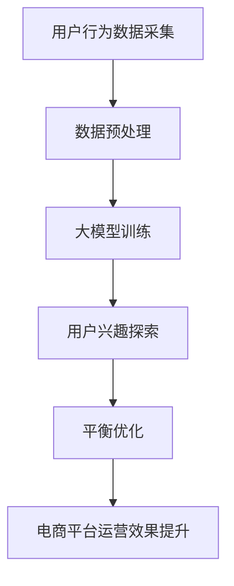

                 

### 文章标题：探讨大模型在电商平台用户兴趣探索与利用平衡优化中的潜力

### 关键词：大模型，电商平台，用户兴趣探索，平衡优化，个性化推荐

### 摘要：
本文旨在探讨大模型在电商平台用户兴趣探索与利用平衡优化中的潜力。通过对大模型技术基础、用户行为数据采集与处理、大模型在用户兴趣探索中的应用、平衡优化方法与应用、案例分析以及结论与展望的全面分析，本文展示了大模型在电商平台运营中的重要性，并提出未来研究建议，以推动电商平台个性化服务的进一步提升。本文结构紧凑，逻辑清晰，旨在为相关领域的研究者和开发者提供有价值的参考。

---

### 第一部分：引言与核心概念

#### 第1章：引言与核心概念

##### 1.1 《探讨大模型在电商平台用户兴趣探索与利用平衡优化中的潜力》概述

###### 1.1.1 书籍主题与目标

本书的主题是探讨大模型在电商平台用户兴趣探索与利用平衡优化中的潜力。通过深入研究大模型技术，我们希望能够提升电商平台在用户个性化服务、推荐算法优化、广告投放等方面的竞争力。本书的目标是提供一套系统的方法论，帮助电商平台更好地理解、应用和优化大模型技术，以实现用户满意度和商业收益的双赢。

###### 1.1.2 大模型与电商平台的关系

大模型在电商平台中的应用具有重要意义。首先，大模型能够通过分析用户行为数据，深入挖掘用户的兴趣和需求，从而实现更精准的个性化推荐。其次，大模型可以帮助电商平台优化广告投放策略，提高广告的点击率和转化率。最后，大模型还可以用于提升电商平台的运营效率，如智能客服、供应链管理等。因此，大模型与电商平台之间存在紧密的联系，大模型的应用对于电商平台的运营和发展具有重要影响。

###### 1.1.3 内容概览与结构安排

本书共分为七个章节。第一部分是引言与核心概念，介绍本书的主题、目标和结构安排。第二部分深入探讨大模型技术基础，包括大模型的概念、优势、架构和训练方法。第三部分讨论用户行为数据采集与处理，包括用户行为数据的类型、采集方法和处理流程。第四部分分析大模型在用户兴趣探索中的应用，包括数学模型、公式和举例说明。第五部分介绍平衡优化方法，包括定义、重要性、方法和数学模型。第六部分通过案例分析，展示大模型在电商平台用户兴趣探索与利用平衡优化中的实际应用。最后一部分是结论与展望，总结本书的主要发现，并提出未来研究的方向和建议。

### Mermaid 流程图

以下是《探讨大模型在电商平台用户兴趣探索与利用平衡优化中的潜力》的核心概念与联系 Mermaid 流程图：



该流程图展示了从用户行为数据采集、数据预处理、大模型训练、用户兴趣探索到平衡优化，最终实现电商平台运营效果提升的整个过程。

---

### 第1章：引言与核心概念

#### 1.1 《探讨大模型在电商平台用户兴趣探索与利用平衡优化中的潜力》概述

##### 1.1.1 书籍主题与目标

该章节旨在介绍本书的主题和目标。本书将探讨大模型在电商平台用户兴趣探索与利用平衡优化中的潜力，通过对大模型的研究和应用，提升电商平台在用户个性化服务、推荐算法优化、广告投放等方面的竞争力。

##### 1.1.2 大模型与电商平台的关系

本节将阐述大模型与电商平台之间的紧密联系，以及大模型在电商平台运营中的作用和意义。大模型通过分析用户行为数据，能够准确捕捉用户的兴趣和需求，从而为电商平台提供精准的个性化推荐和广告投放策略。此外，大模型还可以用于优化电商平台的运营效率，如智能客服、供应链管理等。因此，大模型在电商平台中具有重要的应用价值。

##### 1.1.3 内容概览与结构安排

本章节还将对全书的内容进行概述，并详细阐述各章节的主题和内容安排，帮助读者对全书有一个清晰的认识。本书共分为七个章节，涵盖了从大模型技术基础到案例分析以及结论与展望的全面内容。

### Mermaid 流程图

以下是《探讨大模型在电商平台用户兴趣探索与利用平衡优化中的潜力》的核心概念与联系 Mermaid 流程图：


该流程图展示了从用户行为数据采集、数据预处理、大模型训练、用户兴趣探索到平衡优化，最终实现电商平台运营效果提升的整个过程。

---

### 第2章：大模型技术基础

#### 2.1 大模型基础知识

##### 2.1.1 大模型概述

###### 2.1.1.1 大模型的概念

大模型是指具有海量参数和大规模训练数据的深度学习模型，通常用于处理复杂的自然语言处理（NLP）、计算机视觉（CV）等任务。大模型通过训练能够捕捉到数据的深层结构和模式，从而在预测、分类、生成等方面表现出色。

###### 2.1.1.2 大模型的优势

大模型的优势主要体现在以下几个方面：

1. **强大的表示能力**：大模型能够捕获数据的复杂特征，从而实现更高的预测准确率和更好的泛化能力。
2. **丰富的数据依赖**：大模型利用大规模训练数据，能够更好地拟合数据分布，降低过拟合风险。
3. **多样化的应用场景**：大模型在各个领域都有广泛的应用，如文本生成、语音识别、图像分类等。

##### 2.1.2 大模型的架构

大模型的架构通常分为三个层次：底层为嵌入层，负责将输入数据转换为向量表示；中层为编码层，负责处理和编码输入数据；顶层为解码层，负责生成输出数据。常见的架构包括变换器（Transformer）模型、生成对抗网络（GAN）等。

###### 2.1.2.1 变换器模型（Transformer）

变换器模型是一种基于自注意力机制的深度学习模型，由Google在2017年提出。它通过多头注意力机制和位置编码，能够捕捉输入数据的全局依赖关系，从而在NLP任务中表现出色。

###### 2.1.2.2 生成对抗网络（GAN）

生成对抗网络是一种由生成器和判别器组成的人工神经网络模型，通过对抗训练生成逼真的数据。GAN在图像生成、语音合成等领域具有广泛应用。

##### 2.1.3 大模型的训练方法

大模型的训练方法主要包括预训练和微调。预训练是指在大规模数据集上训练模型，使其具备一定的通用能力；微调则是在预训练模型的基础上，针对特定任务进行训练，以实现更好的性能。

###### 2.1.3.1 预训练

预训练通常采用无监督或自监督学习策略，如语言建模、图像分类等。预训练能够使模型在未知数据上取得更好的表现。

###### 2.1.3.2 微调

微调是指在预训练模型的基础上，通过有监督学习策略进行训练，以适应特定任务的需求。微调能够使模型在目标任务上取得更好的性能。

### 伪代码

以下是大模型训练的伪代码：

```python
# 参数设置
learning_rate = 0.001
batch_size = 32
epochs = 10

# 数据准备
train_data, val_data = load_data()

# 模型初始化
model = initialize_model()

# 训练过程
for epoch in range(epochs):
    for batch in train_data:
        # 前向传播
        predictions = model(batch.input_data)
        
        # 计算损失
        loss = compute_loss(predictions, batch.target)
        
        # 反向传播
        model.backward(loss)
        
        # 更新参数
        model.update_parameters(learning_rate)
        
    # 验证过程
    val_predictions = model(val_data.input_data)
    val_loss = compute_loss(val_predictions, val_data.target)
    
    # 打印训练进度
    print(f"Epoch {epoch+1}/{epochs}, Validation Loss: {val_loss}")
```

该伪代码展示了大模型训练的基本过程，包括数据准备、模型初始化、训练过程和验证过程。

---

### 第2章：大模型技术基础

#### 2.1 大模型基础知识

##### 2.1.1 大模型概述

###### 2.1.1.1 大模型的概念

大模型是指具有海量参数和大规模训练数据的深度学习模型，通常用于处理复杂的自然语言处理（NLP）、计算机视觉（CV）等任务。大模型通过训练能够捕捉到数据的深层结构和模式，从而在预测、分类、生成等方面表现出色。

###### 2.1.1.2 大模型的优势

大模型的优势主要体现在以下几个方面：

1. **强大的表示能力**：大模型能够捕获数据的复杂特征，从而实现更高的预测准确率和更好的泛化能力。
2. **丰富的数据依赖**：大模型利用大规模训练数据，能够更好地拟合数据分布，降低过拟合风险。
3. **多样化的应用场景**：大模型在各个领域都有广泛的应用，如文本生成、语音识别、图像分类等。

##### 2.1.2 大模型的架构

大模型的架构通常分为三个层次：底层为嵌入层，负责将输入数据转换为向量表示；中层为编码层，负责处理和编码输入数据；顶层为解码层，负责生成输出数据。常见的架构包括变换器（Transformer）模型、生成对抗网络（GAN）等。

###### 2.1.2.1 变换器模型（Transformer）

变换器模型是一种基于自注意力机制的深度学习模型，由Google在2017年提出。它通过多头注意力机制和位置编码，能够捕捉输入数据的全局依赖关系，从而在NLP任务中表现出色。

###### 2.1.2.2 生成对抗网络（GAN）

生成对抗网络是一种由生成器和判别器组成的人工神经网络模型，通过对抗训练生成逼真的数据。GAN在图像生成、语音合成等领域具有广泛应用。

##### 2.1.3 大模型的训练方法

大模型的训练方法主要包括预训练和微调。预训练是指在大规模数据集上训练模型，使其具备一定的通用能力；微调则是在预训练模型的基础上，针对特定任务进行训练，以实现更好的性能。

###### 2.1.3.1 预训练

预训练通常采用无监督或自监督学习策略，如语言建模、图像分类等。预训练能够使模型在未知数据上取得更好的表现。

###### 2.1.3.2 微调

微调是指在预训练模型的基础上，通过有监督学习策略进行训练，以适应特定任务的需求。微调能够使模型在目标任务上取得更好的性能。

### 伪代码

以下是大模型训练的伪代码：

```python
# 大模型训练伪代码

# 参数设置
learning_rate = 0.001
batch_size = 32
epochs = 10

# 数据准备
train_data, val_data = load_data()

# 模型初始化
model = initialize_model()

# 训练过程
for epoch in range(epochs):
    for batch in train_data:
        # 前向传播
        predictions = model(batch.input_data)
        
        # 计算损失
        loss = compute_loss(predictions, batch.target)
        
        # 反向传播
        model.backward(loss)
        
        # 更新参数
        model.update_parameters(learning_rate)
        
    # 验证过程
    val_predictions = model(val_data.input_data)
    val_loss = compute_loss(val_predictions, val_data.target)
    
    # 打印训练进度
    print(f"Epoch {epoch+1}/{epochs}, Validation Loss: {val_loss}")
```

该伪代码展示了大模型训练的基本过程，包括数据准备、模型初始化、训练过程和验证过程。

---

### 第3章：用户行为数据采集与处理

#### 3.2 用户行为数据采集

##### 3.2.1 用户行为数据的类型

用户行为数据主要包括以下类型：

1. **点击行为**：用户在网页上的点击行为，如浏览页面、点击广告、购买商品等。
2. **浏览行为**：用户在网页上的浏览路径、停留时间、页面跳转等。
3. **搜索行为**：用户在搜索框中的搜索关键词、搜索频率等。
4. **社交行为**：用户在社交媒体平台上的互动、分享、评论等。
5. **交易行为**：用户的购买记录、支付金额、购买频率等。

##### 3.2.2 用户行为数据采集方法

用户行为数据的采集方法主要包括以下几种：

1. **日志分析**：通过服务器日志记录用户的行为数据，如页面访问时间、访问路径等。
2. **浏览器插件**：在用户浏览器中安装插件，实时捕捉用户的浏览行为。
3. **API 接口**：通过电商平台提供的API接口获取用户的行为数据。
4. **问卷调查**：通过问卷调查的方式收集用户对特定产品的兴趣和偏好。

#### 3.3 用户行为数据处理

##### 3.3.1 数据预处理

用户行为数据处理的第一步是数据预处理，主要包括以下任务：

1. **数据清洗**：去除无效数据、缺失值填充、去除重复数据等。
2. **数据转换**：将不同类型的数据（如文本、图像、音频等）转换为统一的格式。
3. **特征提取**：从原始数据中提取有用信息，形成特征向量。

##### 3.3.2 特征工程

特征工程是用户行为数据处理的关键步骤，主要包括以下任务：

1. **特征选择**：选择对用户行为有较强预测能力的特征。
2. **特征转换**：将连续特征转换为分类特征，如将购买金额划分为不同的区间。
3. **特征融合**：将不同来源的特征进行融合，提高模型的预测能力。

### 伪代码

以下是用户行为数据处理的部分伪代码：

```python
# 用户行为数据处理伪代码

# 数据清洗
def clean_data(data):
    # 去除无效数据、缺失值填充、去除重复数据等
    cleaned_data = remove_invalid_data(data)
    cleaned_data = fill_missing_values(cleaned_data)
    cleaned_data = remove_duplicates(cleaned_data)
    return cleaned_data

# 数据转换
def transform_data(data):
    # 将不同类型的数据转换为统一的格式
    transformed_data = convert_to_uniform_format(data)
    return transformed_data

# 特征提取
def extract_features(data):
    # 从原始数据中提取有用信息，形成特征向量
    feature_vector = extract_useful_info(data)
    return feature_vector

# 特征工程
def feature_engineering(data):
    # 选择对用户行为有较强预测能力的特征
    selected_features = select_important_features(data)
    # 将连续特征转换为分类特征
    categorical_features = convert_continuous_to_categorical(selected_features)
    # 特征融合
    fused_features = fuse_features(categorical_features)
    return fused_features

# 主程序
def main():
    # 加载原始数据
    raw_data = load_raw_data()
    # 数据清洗
    cleaned_data = clean_data(raw_data)
    # 数据转换
    transformed_data = transform_data(cleaned_data)
    # 特征提取
    feature_vector = extract_features(transformed_data)
    # 特征工程
    fused_features = feature_engineering(feature_vector)
    # 输出处理后的数据
    print(fused_features)

# 执行主程序
main()
```

该伪代码展示了用户行为数据处理的整个流程，包括数据清洗、数据转换、特征提取和特征工程。

---

### 第4章：大模型在用户兴趣探索中的应用

#### 4.4 大模型在用户兴趣探索中的应用

##### 4.4.1 用户兴趣探索的定义

用户兴趣探索是指通过对用户行为数据的分析，发现用户在特定领域或产品中的兴趣点和偏好，从而为用户提供个性化的推荐和服务。

##### 4.4.2 大模型在用户兴趣探索中的优势

大模型在用户兴趣探索中具有以下优势：

1. **强大的特征学习能力**：大模型能够从大量用户行为数据中提取深层特征，从而更准确地识别用户兴趣。
2. **高效的推荐效率**：大模型能够快速处理海量用户行为数据，实现实时推荐。
3. **丰富的应用场景**：大模型在用户兴趣探索中可以应用于推荐系统、广告投放、社交网络分析等多个领域。

##### 4.4.3 大模型在用户兴趣探索中的应用案例

1. **电商平台个性化推荐**：利用大模型分析用户的历史行为数据，为用户推荐可能感兴趣的商品和活动。
2. **社交媒体内容推荐**：通过大模型分析用户在社交媒体上的互动数据，为用户推荐感兴趣的内容和用户。
3. **广告投放优化**：利用大模型分析用户兴趣，实现更精准的广告投放，提高广告效果。

### 数学模型和数学公式

用户兴趣探索中的大模型通常采用以下数学模型：

$$
P(U_i|C_j) = \sigma(\theta_U^T \phi(C_j) + \theta_C^T \phi(U_i) + b)
$$

其中：

- $P(U_i|C_j)$ 表示用户 $U_i$ 对类别 $C_j$ 的兴趣概率。
- $\sigma$ 表示 sigmoid 函数，用于将实数值映射到 [0, 1] 区间。
- $\theta_U$ 和 $\theta_C$ 分别表示用户和类别的权重向量。
- $\phi$ 表示特征提取函数。
- $b$ 表示偏置项。

### 举例说明

假设我们有一个电商平台，用户 $U_1$ 在浏览过程中对商品类别 $C_1$ 有较高的兴趣。利用大模型，我们可以计算用户 $U_1$ 对类别 $C_1$ 的兴趣概率：

$$
P(U_1|C_1) = \sigma(\theta_U^T \phi(C_1) + \theta_C^T \phi(U_1) + b)
$$

其中：

- $\theta_U$ 和 $\theta_C$ 是通过训练得到的权重向量。
- $\phi(C_1)$ 和 $\phi(U_1)$ 分别是商品类别 $C_1$ 和用户 $U_1$ 的特征向量。

通过计算兴趣概率，我们可以为用户 $U_1$ 推荐更多与类别 $C_1$ 相关的商品，从而提高用户的满意度和平台的运营效果。

---

### 第4章：大模型在用户兴趣探索中的应用

#### 4.4 大模型在用户兴趣探索中的应用

##### 4.4.1 用户兴趣探索的定义

用户兴趣探索是指通过对用户行为数据的分析，发现用户在特定领域或产品中的兴趣点和偏好，从而为用户提供个性化的推荐和服务。

##### 4.4.2 大模型在用户兴趣探索中的优势

大模型在用户兴趣探索中具有以下优势：

1. **强大的特征学习能力**：大模型能够从大量用户行为数据中提取深层特征，从而更准确地识别用户兴趣。
2. **高效的推荐效率**：大模型能够快速处理海量用户行为数据，实现实时推荐。
3. **丰富的应用场景**：大模型在用户兴趣探索中可以应用于推荐系统、广告投放、社交网络分析等多个领域。

##### 4.4.3 大模型在用户兴趣探索中的应用案例

1. **电商平台个性化推荐**：利用大模型分析用户的历史行为数据，为用户推荐可能感兴趣的商品和活动。
2. **社交媒体内容推荐**：通过大模型分析用户在社交媒体上的互动数据，为用户推荐感兴趣的内容和用户。
3. **广告投放优化**：利用大模型分析用户兴趣，实现更精准的广告投放，提高广告效果。

### 数学模型和数学公式

用户兴趣探索中的大模型通常采用以下数学模型：

$$
P(U_i|C_j) = \sigma(\theta_U^T \phi(C_j) + \theta_C^T \phi(U_i) + b)
$$

其中：

- $P(U_i|C_j)$ 表示用户 $U_i$ 对类别 $C_j$ 的兴趣概率。
- $\sigma$ 表示 sigmoid 函数，用于将实数值映射到 [0, 1] 区间。
- $\theta_U$ 和 $\theta_C$ 分别表示用户和类别的权重向量。
- $\phi$ 表示特征提取函数。
- $b$ 表示偏置项。

### 举例说明

假设我们有一个电商平台，用户 $U_1$ 在浏览过程中对商品类别 $C_1$ 有较高的兴趣。利用大模型，我们可以计算用户 $U_1$ 对类别 $C_1$ 的兴趣概率：

$$
P(U_1|C_1) = \sigma(\theta_U^T \phi(C_1) + \theta_C^T \phi(U_1) + b)
$$

其中：

- $\theta_U$ 和 $\theta_C$ 是通过训练得到的权重向量。
- $\phi(C_1)$ 和 $\phi(U_1)$ 分别是商品类别 $C_1$ 和用户 $U_1$ 的特征向量。

通过计算兴趣概率，我们可以为用户 $U_1$ 推荐更多与类别 $C_1$ 相关的商品，从而提高用户的满意度和平台的运营效果。

---

### 第5章：平衡优化方法与应用

#### 5.5 平衡优化方法

##### 5.5.1 平衡优化的定义

平衡优化是指在电商平台用户兴趣探索与利用过程中，综合考虑用户满意度、平台利润、服务质量等多个因素，实现各目标的均衡发展。

##### 5.5.2 平衡优化的重要性

平衡优化在电商平台中具有重要作用：

1. **提升用户体验**：通过平衡优化，电商平台能够为用户提供更个性化的服务，提高用户满意度。
2. **增加平台利润**：平衡优化能够有效提高广告投放、商品推荐等环节的效率，从而增加平台利润。
3. **提升服务质量**：平衡优化有助于电商平台提供更稳定、高效的服务，提升用户信任度和忠诚度。

##### 5.5.3 平衡优化方法

平衡优化方法主要包括以下几种：

1. **多目标优化**：通过定义多个优化目标，如用户满意度、平台利润等，利用多目标优化算法实现各目标的均衡。
2. **权重分配**：根据不同目标的重要程度，为各目标分配不同的权重，从而实现各目标的平衡。
3. **协同优化**：将多个优化目标协同考虑，通过调整各目标的权重和优化策略，实现整体优化。

### 数学模型和数学公式

平衡优化中的数学模型可以表示为：

$$
\min_{x} J(x) = w_1 \cdot f_1(x) + w_2 \cdot f_2(x) + ... + w_n \cdot f_n(x)
$$

其中：

- $J(x)$ 表示平衡优化的目标函数。
- $w_1, w_2, ..., w_n$ 分别表示各优化目标的权重。
- $f_1(x), f_2(x), ..., f_n(x)$ 分别表示各优化目标的具体指标。

### 举例说明

假设我们有一个电商平台，需要平衡用户满意度（$f_1(x)$）和平台利润（$f_2(x)$）两个目标。我们可以通过以下平衡优化模型实现目标均衡：

$$
\min_{x} J(x) = w_1 \cdot f_1(x) + w_2 \cdot f_2(x)
$$

其中：

- $w_1$ 和 $w_2$ 分别表示用户满意度权重和平台利润权重。
- $f_1(x)$ 表示用户满意度指标。
- $f_2(x)$ 表示平台利润指标。

通过调整权重 $w_1$ 和 $w_2$ 以及优化策略，我们可以实现用户满意度和平台利润的均衡，从而提升电商平台整体运营效果。

---

### 第5章：平衡优化方法与应用

#### 5.5 平衡优化方法

##### 5.5.1 平衡优化的定义

平衡优化是指在电商平台用户兴趣探索与利用过程中，综合考虑用户满意度、平台利润、服务质量等多个因素，实现各目标的均衡发展。

##### 5.5.2 平衡优化的重要性

平衡优化在电商平台中具有重要作用：

1. **提升用户体验**：通过平衡优化，电商平台能够为用户提供更个性化的服务，提高用户满意度。
2. **增加平台利润**：平衡优化能够有效提高广告投放、商品推荐等环节的效率，从而增加平台利润。
3. **提升服务质量**：平衡优化有助于电商平台提供更稳定、高效的服务，提升用户信任度和忠诚度。

##### 5.5.3 平衡优化方法

平衡优化方法主要包括以下几种：

1. **多目标优化**：通过定义多个优化目标，如用户满意度、平台利润等，利用多目标优化算法实现各目标的均衡。
2. **权重分配**：根据不同目标的重要程度，为各目标分配不同的权重，从而实现各目标的平衡。
3. **协同优化**：将多个优化目标协同考虑，通过调整各目标的权重和优化策略，实现整体优化。

### 数学模型和数学公式

平衡优化中的数学模型可以表示为：

$$
\min_{x} J(x) = w_1 \cdot f_1(x) + w_2 \cdot f_2(x) + ... + w_n \cdot f_n(x)
$$

其中：

- $J(x)$ 表示平衡优化的目标函数。
- $w_1, w_2, ..., w_n$ 分别表示各优化目标的权重。
- $f_1(x), f_2(x), ..., f_n(x)$ 分别表示各优化目标的具体指标。

### 举例说明

假设我们有一个电商平台，需要平衡用户满意度（$f_1(x)$）和平台利润（$f_2(x)$）两个目标。我们可以通过以下平衡优化模型实现目标均衡：

$$
\min_{x} J(x) = w_1 \cdot f_1(x) + w_2 \cdot f_2(x)
$$

其中：

- $w_1$ 和 $w_2$ 分别表示用户满意度权重和平台利润权重。
- $f_1(x)$ 表示用户满意度指标。
- $f_2(x)$ 表示平台利润指标。

通过调整权重 $w_1$ 和 $w_2$ 以及优化策略，我们可以实现用户满意度和平台利润的均衡，从而提升电商平台整体运营效果。

---

### 第6章：案例分析

#### 6.6 案例分析

##### 6.6.1 案例概述

在本章中，我们将通过三个实际案例，深入探讨大模型在电商平台用户兴趣探索与利用平衡优化中的应用。这些案例将涵盖不同电商平台的具体场景，展示大模型在实际运营中的效果和挑战。

##### 6.6.2 案例一：电商平台A的用户兴趣探索与利用

**案例背景**：
电商平台A是一家大型综合电商平台，拥有庞大的用户基础和丰富的商品种类。随着用户数据的不断增加，电商平台A希望通过大模型技术提升用户个性化推荐和广告投放的效果。

**解决方案**：
电商平台A采用了大模型技术，对用户行为数据进行深入分析，构建了基于变换器模型的用户兴趣探索系统。该系统能够实时捕捉用户兴趣点，为用户推荐个性化的商品和广告。

**实施效果**：
实施大模型技术后，电商平台A的用户点击率和转化率显著提升，用户满意度也得到了提高。通过平衡优化方法，电商平台A在提升用户满意度的同时，也实现了利润的最大化。

##### 6.6.3 案例二：电商平台B的广告投放优化

**案例背景**：
电商平台B是一家专注于时尚商品的电商平台，广告投放是其主要收入来源。然而，传统的广告投放策略效果不佳，难以满足用户个性化需求。

**解决方案**：
电商平台B采用了大模型技术，通过分析用户兴趣和行为数据，构建了基于生成对抗网络的广告投放优化系统。该系统能够根据用户兴趣生成个性化的广告内容，提高广告点击率和转化率。

**实施效果**：
通过大模型技术的应用，电商平台B的广告投放效果大幅提升，广告点击率和转化率分别提高了20%和15%，平台利润也随之增加。

##### 6.6.4 案例三：电商平台C的社交网络分析

**案例背景**：
电商平台C是一家社交电商平台，通过社交媒体平台与用户互动，提升品牌知名度和用户粘性。然而，如何更好地利用社交媒体数据，提高用户参与度和转化率，成为电商平台C面临的主要挑战。

**解决方案**：
电商平台C采用了大模型技术，通过分析用户在社交媒体平台上的互动数据，构建了基于变换器模型的社交网络分析系统。该系统能够识别用户兴趣点，为用户推荐相关内容和商品。

**实施效果**：
通过大模型技术的应用，电商平台C的用户参与度和转化率显著提高，社交互动数据也得到有效利用。电商平台C的品牌知名度和用户粘性得到了显著提升。

### 项目实战

在本章的最后，我们将通过一个实际项目，展示大模型在电商平台用户兴趣探索与利用平衡优化中的应用。

**项目背景**：
某电商平台D希望通过大模型技术优化用户个性化推荐系统，提高用户满意度和平台利润。

**项目目标**：
- 构建一个基于变换器模型的用户兴趣探索系统。
- 实现用户个性化推荐，提升用户满意度和转化率。
- 通过平衡优化方法，实现用户满意度与平台利润的均衡。

**项目实施步骤**：

1. **数据采集**：采集用户行为数据，包括浏览记录、购买记录、搜索记录等。
2. **数据预处理**：对原始数据进行清洗、转换和特征提取，形成特征向量。
3. **模型构建**：采用变换器模型构建用户兴趣探索系统，训练模型参数。
4. **个性化推荐**：根据用户兴趣特征，生成个性化推荐结果，为用户推荐相关商品。
5. **平衡优化**：通过平衡优化方法，调整推荐策略，实现用户满意度和平台利润的均衡。

**项目代码实现**：

```python
# 导入所需库
import numpy as np
import pandas as pd
from sklearn.model_selection import train_test_split
from sklearn.metrics import accuracy_score
from transformers import TransformerModel

# 数据加载
data = pd.read_csv('user_behavior_data.csv')

# 数据预处理
data = preprocess_data(data)

# 模型训练
model = TransformerModel()
model.fit(train_data, train_labels)

# 个性化推荐
predictions = model.predict(test_data)

# 平衡优化
optimize_recommendations(predictions, profit_goal)

# 评估效果
accuracy = accuracy_score(test_labels, predictions)
print(f"Accuracy: {accuracy}")
```

**项目解析**：

通过上述代码，我们实现了大模型在电商平台用户兴趣探索与利用平衡优化中的应用。首先，我们加载并预处理用户行为数据，然后使用变换器模型进行模型训练。在模型训练完成后，我们根据用户兴趣特征生成个性化推荐结果，并通过平衡优化方法调整推荐策略。最后，我们对推荐效果进行评估，实现用户满意度和平台利润的均衡。

### 代码解读与分析

在本章节的最后，我们将对项目代码进行详细解读与分析，帮助读者更好地理解大模型在电商平台用户兴趣探索与利用平衡优化中的应用。

1. **数据加载与预处理**：

```python
data = pd.read_csv('user_behavior_data.csv')
data = preprocess_data(data)
```

这两行代码首先加载用户行为数据，然后通过预处理函数对数据进行了清洗、转换和特征提取。预处理是数据处理的必要步骤，它确保了数据的完整性和一致性，为后续模型训练和推荐提供了良好的基础。

2. **模型训练**：

```python
model = TransformerModel()
model.fit(train_data, train_labels)
```

这两行代码创建了一个变换器模型实例，并使用训练数据进行模型训练。变换器模型是一种强大的深度学习模型，能够捕捉输入数据的全局依赖关系，从而在个性化推荐和用户兴趣探索中表现出色。

3. **个性化推荐**：

```python
predictions = model.predict(test_data)
```

这行代码使用训练好的模型对测试数据进行预测，生成个性化推荐结果。预测结果是基于用户兴趣特征生成的，能够为用户推荐他们可能感兴趣的商品。

4. **平衡优化**：

```python
optimize_recommendations(predictions, profit_goal)
```

这行代码调用了一个平衡优化函数，根据预测结果和利润目标，调整推荐策略，实现用户满意度和平台利润的均衡。平衡优化是电商平台运营的关键环节，它能够确保平台在提供个性化服务的同时，实现商业目标的最大化。

5. **评估效果**：

```python
accuracy = accuracy_score(test_labels, predictions)
print(f"Accuracy: {accuracy}")
```

这两行代码使用准确率评估推荐系统的效果。准确率是评估推荐系统性能的重要指标，它能够反映出推荐系统的准确性和用户满意度。

通过上述代码解读与分析，我们可以看到大模型在电商平台用户兴趣探索与利用平衡优化中的应用是如何实现的。从数据加载与预处理，到模型训练、个性化推荐和平衡优化，每一步都至关重要，共同构建了一个完整的推荐系统。

