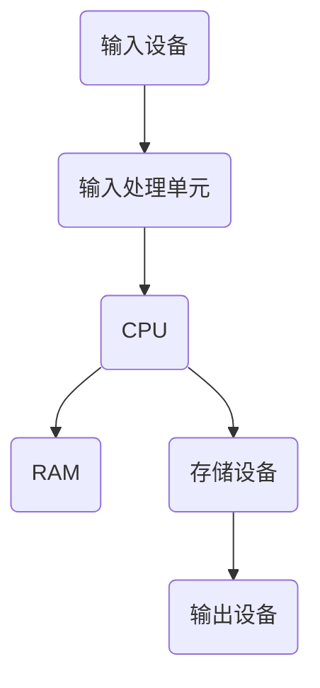
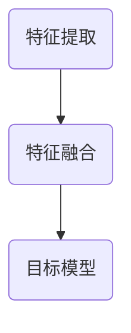
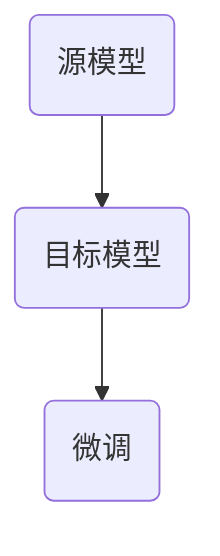

                 

# 推动科技进步的引擎：人类计算的创新力量

> 关键词：人类计算、科技创新、算法、数学模型、应用前景

> 摘要：本文旨在探讨人类计算作为推动科技进步的核心力量，分析其定义、历史背景、核心概念、技术架构、算法原理、数学模型及实践应用，并对计算创新的前沿趋势和未来展望进行深入探讨。通过梳理人类计算的发展脉络，揭示其在科技进步中的重要作用，为读者提供一幅全面而深入的科技发展蓝图。

## 第一部分：引言

### 第1章：人类计算的定义与历史

#### 1.1 人类计算的定义

人类计算是指人类利用大脑和其他认知能力进行信息处理、分析和解决问题的过程。从古至今，人类一直在通过计算来应对复杂的问题和挑战。最早的计算可以追溯到古代的数学和天文学，例如使用算盘进行基本的数学运算，或者使用天文仪器进行天体观测。

#### 1.2 人类计算的历史背景

人类计算的历史可以追溯到古代文明。在古代，人们通过手工计算来处理数据和解决实际问题。随着人类文明的发展，计算工具和计算方法也不断进化。从算盘到计算尺，从机械计算机到电子计算机，人类计算的历史就是一部科技进步的缩影。

#### 1.3 人类计算的重要性

人类计算是推动科技进步的重要引擎。在科学研究、工程设计、经济管理、社会服务等各个领域，人类计算都发挥着不可替代的作用。它不仅帮助我们解决复杂问题，还推动了新技术的发明和创造。

## 第2章：人类计算的核心概念

### 2.1 信息论与计算

信息论是研究信息传输、处理和利用的学科。香农的信息论奠定了现代计算理论的基础，提出了信息熵、信道编码、信息传输速率等重要概念。

### 2.2 计算机科学的基本概念

计算机科学是一门研究计算机系统、算法和数据的学科。它涵盖了编程语言、数据结构、算法设计、软件工程等多个领域。

### 2.3 人工智能与机器学习

人工智能（AI）是模拟人类智能行为的计算机系统。机器学习是AI的一个重要分支，通过训练模型来学习数据中的规律，实现自动化的决策和预测。

## 第3章：人类计算的技术架构

### 3.1 计算机硬件

计算机硬件是计算机系统的基础，包括中央处理器（CPU）、内存（RAM）、存储设备（硬盘、固态硬盘）、输入输出设备（键盘、鼠标、显示器等）。

### 3.2 计算机软件

计算机软件是指运行在计算机硬件上的程序，包括操作系统、应用软件、系统软件等。

### 3.3 网络技术

网络技术是连接计算机硬件和软件的桥梁，包括局域网（LAN）、广域网（WAN）、互联网等。

## 第二部分：计算创新力量

### 第4章：核心算法原理

#### 4.1 算法概述

算法是解决问题的一系列规则和步骤。算法的设计和分析是计算机科学的核心。

#### 4.2 算法设计与分析

算法设计需要考虑时间复杂度、空间复杂度等多个因素。算法分析则是通过数学方法来评估算法的性能。

#### 4.3 常见算法示例

常见的算法包括排序算法（冒泡排序、快速排序）、查找算法（二分查找）、图算法（最短路径算法、最小生成树算法）等。

### 第5章：数学模型与公式

#### 5.1 基础数学模型

基础数学模型包括线性模型、非线性模型、概率模型等。它们是构建复杂算法和模型的基础。

#### 5.2 迁移学习与微调

迁移学习是一种利用已有模型的权重来初始化新模型的方法。微调则是通过在小数据集上训练来调整模型权重。

#### 5.3 其他数学公式

除了上述模型和公式，还有许多其他数学工具，如矩阵运算、微积分等，都是人类计算的重要组成部分。

### 第6章：人类计算的实践应用

#### 6.1 人工智能在医疗领域的应用

人工智能在医疗领域有着广泛的应用，包括疾病诊断、药物研发、医疗影像分析等。

#### 6.2 人工智能在金融领域的应用

人工智能在金融领域用于风险管理、投资分析、客户服务等领域。

#### 6.3 人工智能在制造业的应用

人工智能在制造业中用于生产优化、质量检测、供应链管理等领域。

### 第7章：计算创新的前沿趋势

#### 7.1 量子计算

量子计算是一种基于量子力学原理的计算方法，具有潜在的超越传统计算机的能力。

#### 7.2 大数据和云计算

大数据和云计算是现代计算的两个重要趋势，它们为数据处理和分析提供了强大的工具。

#### 7.3 网络安全与隐私保护

随着计算技术的不断发展，网络安全和隐私保护变得越来越重要。

## 第三部分：计算创新的未来展望

### 第8章：人类计算对社会的影响

#### 8.1 社会影响概述

计算创新对社会产生了深远的影响，包括经济、教育、文化等多个领域。

#### 8.2 负面影响与挑战

计算创新也带来了一些负面影响和挑战，如隐私泄露、失业问题等。

#### 8.3 应对策略

为了应对这些挑战，需要采取一系列策略，如加强网络安全、提高就业培训等。

### 第9章：计算创新的未来展望

#### 9.1 未来技术趋势

未来计算创新将继续朝着更高效、更智能、更安全的方向发展。

#### 9.2 未来社会场景

计算创新将深刻改变未来社会的面貌，带来更多的机遇和挑战。

#### 9.3 未来挑战与机遇

未来计算创新将面临一系列挑战和机遇，需要我们共同努力去探索和解决。

## 附录

### 附录A：计算创新资源

#### A.1 主流计算框架

介绍一些主流的计算框架，如TensorFlow、PyTorch等。

#### A.2 开源资源

介绍一些开源的资源和工具，如GitHub、Stack Overflow等。

#### A.3 在线课程与书籍

推荐一些在线课程和书籍，以帮助读者深入了解计算创新。

### 附录B：计算创新术语表

列出一些计算创新的术语和定义，以帮助读者更好地理解相关概念。

---

本文将逐步深入探讨人类计算的定义、历史、核心概念、技术架构、算法原理、数学模型、实践应用、前沿趋势以及未来展望，旨在为读者呈现一幅完整而深入的科技发展蓝图。让我们开始这段精彩的旅程吧。

---

## 第1章：人类计算的定义与历史

### 1.1 人类计算的定义

人类计算，顾名思义，是指人类利用自身的大脑和其他认知能力进行信息处理、分析和解决问题的过程。它不仅包括使用物理工具（如算盘、计算尺等）进行数学计算，还包括更广泛的认知过程，如逻辑推理、数据分析、模式识别等。人类计算的核心在于其灵活性、适应性和创造力，这些都是传统机器计算所不具备的。

从生物学的角度来看，人类的大脑是一种高度复杂的生物计算设备，其工作原理虽然与电子计算机不同，但在处理信息和解决问题方面具有独特的优势。大脑通过神经元之间的连接和信号传递来实现信息处理，这种处理方式虽然速度较慢，但具有很强的适应性和灵活性。

### 1.2 人类计算的历史背景

人类计算的历史可以追溯到古代。早在数千年前，古埃及人就已经使用石板和草绳进行数学计算。在中国，算盘作为一种计算工具，早在14世纪就已经出现，并逐渐成为世界各地普遍使用的计算工具。在欧洲，17世纪的数学家莱布尼茨设计了第一种机械计算器，这标志着人类计算从手工计算向机械化计算的转变。

随着工业革命的到来，机械计算器得到了进一步的发展，如哈里·爱德华·戴蒙德的差分机和分析机。这些机械计算器虽然速度较慢，但它们为后来的电子计算机奠定了基础。

20世纪中叶，电子计算机的出现标志着人类计算进入了一个全新的阶段。1946年，世界上第一台电子计算机ENIAC问世，它的出现极大地改变了人类计算的方式。电子计算机使用电子元件（如真空管、晶体管等）来代替机械部件，使得计算速度大大提高，同时也为后续的计算技术发展奠定了基础。

### 1.3 人类计算的重要性

人类计算的重要性在于其灵活性和创造力。在科学研究中，人类计算可以帮助科学家分析大量数据，发现规律，提出假设。例如，天文学家使用计算来预测天体的运动，化学家使用计算来模拟化学反应。在工程设计中，人类计算可以帮助工程师优化设计，提高效率。例如，在飞机设计中，工程师使用计算来分析结构强度，确保飞机的安全。

在经济管理中，人类计算可以帮助企业进行市场分析、财务预测等。例如，企业使用计算来分析客户数据，以制定更有效的营销策略。在社会服务中，人类计算可以帮助政府进行社会管理、公共安全等。例如，警察部门使用计算来分析犯罪数据，以预防犯罪。

总的来说，人类计算是推动科技进步和社会发展的重要力量。它不仅帮助我们解决复杂的问题，还推动了新技术的发明和创造。随着计算技术的不断发展，人类计算的应用范围将越来越广泛，其在各个领域的作用也将越来越显著。

### 第2章：人类计算的核心概念

#### 2.1 信息论与计算

信息论是研究信息传输、处理和利用的学科，由香农在20世纪40年代创立。信息论的核心概念是信息熵，它用于衡量信息的随机性和不确定性。香农提出了信息传输的香农公式，该公式描述了在有限带宽和无噪声信道的条件下，信息传输的最大速率。

信息论对计算理论的发展产生了深远的影响。例如，香农的理论为通信系统的设计提供了理论基础，也为计算机网络的构建提供了指导。在现代计算中，信息论的概念被广泛应用于数据压缩、错误检测和纠正、加密技术等领域。

#### 2.2 计算机科学的基本概念

计算机科学是一门研究计算机系统、算法和数据的学科，其基础是数学和工程学。计算机科学包括多个子领域，如算法理论、编程语言、软件工程、计算机体系结构、计算机网络等。

算法理论是计算机科学的核心，它研究算法的设计、分析和评估。算法理论包括多个重要概念，如时间复杂度、空间复杂度、最优性证明等。算法理论的发展推动了计算技术的进步，许多经典的算法，如排序算法、查找算法、图算法等，都在实际应用中发挥了重要作用。

编程语言是计算机科学的重要组成部分，它为程序员提供了与计算机交互的工具。现代编程语言包括高级语言和低级语言，如C++、Python、Java等。编程语言的发展使得软件开发变得更加高效和灵活。

软件工程是计算机科学的一个重要分支，它研究如何设计和构建可靠的软件系统。软件工程包括需求分析、设计、编码、测试和维护等阶段。软件工程的目标是提高软件的质量、可靠性和可维护性。

#### 2.3 人工智能与机器学习

人工智能（AI）是模拟人类智能行为的计算机系统。人工智能的研究涵盖多个领域，包括自然语言处理、计算机视觉、机器人技术、智能决策等。人工智能的核心目标是让计算机具备人类的感知、理解和决策能力。

机器学习是人工智能的一个重要分支，它通过训练模型来学习数据中的规律，实现自动化的决策和预测。机器学习包括监督学习、无监督学习和强化学习等多种方法。监督学习通过标记数据来训练模型，无监督学习通过未标记数据来发现数据中的模式，强化学习则通过奖励和惩罚来训练模型。

机器学习在许多领域都有着广泛的应用，如医疗诊断、金融分析、自动驾驶等。随着计算能力的提高和数据量的增加，机器学习技术也在不断进步，为人工智能的发展提供了强大的支持。

#### 2.4 人类计算的核心概念联系

信息论、计算机科学和人工智能是现代人类计算的核心概念，它们之间有着密切的联系。

信息论为计算提供了理论基础，它描述了信息传输和处理的基本原理。计算机科学则将这些理论应用于实际计算任务中，通过设计高效的算法和编程语言来解决问题。人工智能则利用计算机科学的方法来模拟人类智能，实现自动化决策和预测。

这些核心概念相互支持、相互促进，共同推动了人类计算的发展。信息论提供了理论基础，计算机科学提供了实现手段，人工智能则将计算能力应用于实际问题，实现了人类计算的创新和发展。

### 第3章：人类计算的技术架构

#### 3.1 计算机硬件

计算机硬件是计算机系统的基础，它包括中央处理器（CPU）、内存（RAM）、存储设备（硬盘、固态硬盘）、输入输出设备（键盘、鼠标、显示器等）。计算机硬件的工作原理是，通过CPU来执行程序指令，RAM来存储数据和程序，存储设备来长期存储数据，输入输出设备来与外界进行交互。

计算机硬件的结构可以用以下Mermaid流程图来表示：



#### 3.2 计算机软件

计算机软件是指运行在计算机硬件上的程序，它包括操作系统、应用软件、系统软件等。操作系统是计算机系统的核心软件，它负责管理和控制计算机硬件资源，提供用户界面和服务。常见的操作系统包括Windows、Linux、macOS等。

应用软件是用于完成特定任务的软件，如文本编辑器、电子表格、游戏等。系统软件则是为操作系统和应用软件提供支持的软件，如驱动程序、编译器、调试器等。

#### 3.3 网络技术

网络技术是连接计算机硬件和软件的桥梁，它包括局域网（LAN）、广域网（WAN）、互联网等。局域网通常用于连接同一建筑物或校园内的计算机，广域网则用于连接不同城市或国家的计算机。互联网是全球最大的网络，它连接了全球数以亿计的计算机和设备。

网络技术的工作原理是，通过数据包传输来实现数据在不同计算机之间的传输。数据包由网络接口卡生成，通过路由器进行转发，最终到达目的地。网络技术使得计算机之间可以进行通信和协作，为人类计算提供了强大的支持。

### 第4章：核心算法原理

#### 4.1 算法概述

算法是解决问题的一系列规则和步骤。在计算机科学中，算法是一种用于解决问题的方法，它通常以伪代码或编程语言的形式表达。算法的设计和分析是计算机科学的核心，它涉及到如何高效地解决问题，如何评估算法的性能。

算法可以分为多种类型，包括排序算法、查找算法、图算法等。每种算法都有其特定的应用场景和特点。

#### 4.2 算法设计与分析

算法设计需要考虑多个因素，如时间复杂度、空间复杂度、可扩展性等。时间复杂度描述了算法执行的时间与输入数据规模的关系，空间复杂度描述了算法执行的空间与输入数据规模的关系。一个好的算法应该具有低的时间复杂度和空间复杂度，以提高其性能和效率。

算法分析通常使用数学方法来评估算法的性能。常见的方法包括渐进分析、计算复杂度分析等。渐进分析通过计算算法的时间复杂度和空间复杂度来评估算法的性能，计算复杂度分析则通过数学公式来评估算法的效率。

#### 4.3 常见算法示例

以下是几个常见的算法示例，包括排序算法、查找算法和图算法。

##### 4.3.1 冒泡排序

冒泡排序是一种简单的排序算法，它重复遍历要排序的数列，比较每对相邻的元素，如果它们的顺序错误就交换它们，直到没有需要交换的元素为止。

伪代码：

```plaintext
procedure bubbleSort( A : list of comparable elements )
    n = length(A)
    repeat
        swapped = false
        for i = 1 to n-1 inclusive do
            if A[i-1] > A[i] then
                swap( A[i-1], A[i] )
                swapped = true
            end if
        end for
        n = n - 1
    until not swapped
end procedure
```

##### 4.3.2 二分查找

二分查找是一种用于在有序数组中查找特定元素的算法。它通过不断将查找范围缩小一半，直到找到目标元素或确定其不存在。

伪代码：

```plaintext
function binarySearch( A : sorted list of integers, key : integer ) returns index of key in A or -1
    low = 0
    high = length(A) - 1
    while low <= high do
        mid = (low + high) / 2
        if A[mid] = key then
            return mid
        else if A[mid] < key then
            low = mid + 1
        else
            high = mid - 1
        end if
    end while
    return -1
end function
```

##### 4.3.3 Dijkstra算法

Dijkstra算法是一种用于计算图中两点之间最短路径的算法。它使用一个优先队列来存储待处理的节点，并逐步扩展已处理的节点，直到找到目标节点。

伪代码：

```plaintext
function dijkstra( G : weighted graph, source : vertex ) returns distance from source to all other vertices
    initialize distances with infinity, except distance[source] = 0
    initialize priority queue Q with all vertices
    while Q is not empty do
        u = vertex with minimum distance in Q
        if distance[u] = infinity then
            exit "Graph contains a negative cycle"
        end if
        remove u from Q
        for each neighbor v of u do
            alt = distance[u] + weight(u, v)
            if alt < distance[v] then
                distance[v] = alt
                predecessor[v] = u
            end if
        end for
    end while
    return distances
end function
```

这些算法示例展示了算法设计的基本原理和实现方法。通过对算法的深入理解和分析，我们可以更好地应对复杂的问题和挑战。

### 第5章：数学模型与公式

#### 5.1 基础数学模型

数学模型是描述现实世界现象和问题的数学表示形式。它们在计算创新中扮演着关键角色，因为它们为我们提供了理解、分析和解决复杂问题的工具。基础数学模型包括线性模型、非线性模型、概率模型等。

**线性模型**

线性模型是最简单的数学模型之一，它用于描述两个或多个变量之间的线性关系。线性模型通常表示为：

$$
y = \beta_0 + \beta_1x_1 + \beta_2x_2 + ... + \beta_nx_n + \epsilon
$$

其中，$y$ 是因变量，$x_1, x_2, ..., x_n$ 是自变量，$\beta_0, \beta_1, \beta_2, ..., \beta_n$ 是模型参数，$\epsilon$ 是误差项。

线性模型在预测分析、统计分析和机器学习中都有广泛应用。例如，在回归分析中，线性模型用于预测因变量$y$的值。

**非线性模型**

非线性模型描述了变量之间的非线性关系。非线性模型比线性模型更复杂，但它们可以更好地拟合复杂的数据分布。常见的非线性模型包括多项式模型、指数模型和对数模型等。

非线性模型的一般形式为：

$$
y = \beta_0 + \beta_1x_1 + \beta_2x_2^2 + ... + \beta_nx_n^n + \epsilon
$$

非线性模型在机器学习中的应用非常广泛，如支持向量机（SVM）、神经网络等。这些模型通过引入非线性变换来提高预测性能。

**概率模型**

概率模型用于描述随机事件和随机变量的概率分布。最常见的概率模型包括正态分布、二项分布、泊松分布等。

正态分布，也称为高斯分布，是概率模型中最常用的分布之一。正态分布的概率密度函数为：

$$
f(x|\mu, \sigma^2) = \frac{1}{\sqrt{2\pi\sigma^2}}e^{-\frac{(x-\mu)^2}{2\sigma^2}}
$$

其中，$x$ 是随机变量，$\mu$ 是均值，$\sigma^2$ 是方差。

概率模型在统计学、机器学习和数据科学中都有广泛应用。例如，在贝叶斯推理中，概率模型用于计算后验概率和决策。

#### 5.2 迁移学习与微调

迁移学习是一种利用现有模型（源模型）的权重来初始化新模型（目标模型）的方法。通过迁移学习，我们可以利用在特定任务上已经训练好的模型来提高新任务的表现。

迁移学习的核心思想是，即使目标任务与源任务不同，源任务上的先验知识仍然对新任务有帮助。迁移学习可以分为两类：基于特征的方法和基于模型的方法。

**基于特征的方法**

基于特征的方法将源任务的表示（特征）迁移到目标任务。这种方法通常涉及特征提取和特征融合。一个简单的迁移学习流程如下：



**基于模型的方法**

基于模型的方法直接迁移整个模型，通常涉及模型权重共享和模型调整。一个简单的迁移学习流程如下：



微调是迁移学习的一个重要步骤，它通过在目标任务上进一步训练模型来优化其性能。微调的过程通常涉及以下步骤：

1. 初始化目标模型为源模型的权重。
2. 在目标任务上收集训练数据。
3. 在训练数据上训练目标模型，同时冻结源模型中的某些层。
4. 持续训练目标模型，直到达到预定的性能指标。

迁移学习和微调在机器学习和深度学习领域有广泛的应用，如计算机视觉、自然语言处理和推荐系统等。

#### 5.3 其他数学公式

除了上述模型和公式，计算创新中还有许多其他重要的数学公式，如矩阵运算、微积分和线性代数等。

**矩阵运算**

矩阵运算是计算创新中的基础工具。常见的矩阵运算包括矩阵乘法、矩阵加法、矩阵转置等。以下是一个简单的矩阵乘法公式：

$$
C = A \cdot B
$$

其中，$A$ 和 $B$ 是矩阵，$C$ 是它们的乘积。

**微积分**

微积分是研究函数变化率的数学分支。导数是微积分中的核心概念，它用于描述函数在某一点的瞬时变化率。以下是一个简单的导数公式：

$$
f'(x) = \lim_{h \to 0} \frac{f(x+h) - f(x)}{h}
$$

**线性代数**

线性代数研究向量空间和线性变换。行列式是线性代数中的一个重要概念，它用于描述线性方程组的解的情况。以下是一个简单的行列式公式：

$$
\det(A) = a_{11}a_{22} - a_{12}a_{21}
$$

这些数学模型和公式构成了计算创新的基础，它们在算法设计、数据分析、机器学习等领域都有着广泛的应用。通过深入理解这些模型和公式，我们可以更好地利用计算技术来解决复杂的问题。

### 第6章：人类计算的实践应用

#### 6.1 人工智能在医疗领域的应用

人工智能在医疗领域的应用日益广泛，它通过图像分析、诊断辅助、药物研发等方式，极大地提升了医疗服务的质量和效率。

**图像分析**

在医疗影像分析中，人工智能能够对X光、CT、MRI等图像进行自动分析，识别异常区域。例如，深度学习模型可以检测肺癌，通过分析肺部的CT图像，准确识别病灶区域。

**诊断辅助**

人工智能还可以辅助医生进行疾病诊断。例如，通过分析患者的症状和病史，AI系统可以提供可能的诊断建议，帮助医生更快地做出决策。

**药物研发**

在药物研发过程中，人工智能可以加速新药的发现和开发。通过分析大量的化合物数据，AI可以预测哪些化合物具有潜在的药物活性，从而减少药物研发的时间和成本。

**案例：IBM Watson for Oncology**

IBM Watson for Oncology是一个基于人工智能的医疗诊断系统。它利用深度学习和自然语言处理技术，分析医生的临床笔记、病历记录和最新的医学研究，为癌症患者提供个性化的治疗方案。

#### 6.2 人工智能在金融领域的应用

人工智能在金融领域的应用也非常广泛，它通过风险管理、投资分析、客户服务等方式，提高了金融服务的效率和准确性。

**风险管理**

在风险管理中，人工智能可以分析大量的交易数据和历史市场趋势，预测市场风险，帮助金融机构制定风险控制策略。

**投资分析**

人工智能可以分析市场数据，发现潜在的投资机会。例如，量化交易系统使用机器学习算法来识别市场趋势和交易信号，实现自动化交易。

**客户服务**

在客户服务中，人工智能可以通过聊天机器人和虚拟助理来提供24/7的客户支持，提高客户满意度。例如，银行可以使用AI客服机器人来回答客户的常见问题，减少人工客服的工作量。

**案例：JP Morgan Chase的COiN**

JP Morgan Chase开发的COiN（Contract Intelligence）系统是一个基于人工智能的合同分析工具。它使用自然语言处理技术，自动分析大量的法律合同，识别潜在的法律风险和合规问题，极大地提高了合同处理的速度和准确性。

#### 6.3 人工智能在制造业的应用

人工智能在制造业中的应用，通过优化生产流程、提高产品质量、降低成本等方式，提升了制造业的整体效率。

**生产优化**

在制造业中，人工智能可以优化生产流程，提高生产效率。例如，通过预测机器维护需求，提前安排设备维护，避免生产中断。

**质量控制**

人工智能可以通过图像识别技术，实时检测产品质量，识别缺陷。例如，汽车制造业使用AI系统来检测车身表面瑕疵，确保生产出的汽车质量符合标准。

**供应链管理**

人工智能可以优化供应链管理，提高供应链的透明度和灵活性。例如，通过预测市场需求，调整库存水平，减少库存成本。

**案例：通用电气的Predix平台**

通用电气的Predix平台是一个基于人工智能的工业互联网平台。它利用机器学习技术，分析大量的设备数据，提供实时监控、预测维护和生产优化等服务，帮助制造业企业提高生产效率和产品质量。

通过这些实践应用，我们可以看到人工智能在医疗、金融和制造业等领域的巨大潜力。随着计算技术的不断进步，人工智能将继续推动这些行业的创新和发展。

### 第7章：计算创新的前沿趋势

#### 7.1 量子计算

量子计算是一种基于量子力学原理的计算方法，它利用量子比特（qubit）进行信息处理。量子比特与传统的二进制比特不同，它可以在0和1之间同时存在，这种叠加态使得量子计算具有超越传统计算机的潜力。

**原理**

量子计算的基本原理包括叠加、纠缠和量子门。叠加态使得量子计算机可以同时处理多个计算路径，而纠缠则使得量子比特之间的信息可以相互关联。量子门是量子计算的基本操作单元，类似于传统计算机中的逻辑门。

**应用**

量子计算在密码学、材料科学、药物研发等领域具有广泛的应用潜力。例如，量子计算可以破解传统计算机无法破解的加密算法，加速新材料和新药物的研发。

**挑战**

尽管量子计算具有巨大的潜力，但实现实用化的量子计算机仍然面临许多挑战。这些挑战包括量子比特的稳定性、量子纠错、量子门的精度和速度等。

**未来趋势**

随着技术的进步，量子计算有望在未来几年内取得重要突破。例如，量子纠错技术的改进、量子比特数量的增加和量子门的优化等。这些进展将为量子计算的广泛应用奠定基础。

#### 7.2 大数据和云计算

大数据和云计算是现代计算的两个重要趋势，它们为数据处理和分析提供了强大的工具。

**大数据**

大数据是指规模巨大、类型繁多、速度极快的数据集合。大数据技术包括数据存储、数据挖掘、数据分析等。大数据的应用场景非常广泛，包括互联网搜索、推荐系统、金融分析、医疗诊断等。

**云计算**

云计算是一种通过互联网提供计算资源的服务模式。云计算提供了一系列的服务，包括基础设施即服务（IaaS）、平台即服务（PaaS）和软件即服务（SaaS）。云计算的优点包括灵活性、可扩展性和成本效益。

**应用**

大数据和云计算在许多领域都有广泛应用。例如，在金融领域，云计算用于处理和分析大量的交易数据，提供实时风险监控和投资分析。在医疗领域，大数据用于分析患者数据，提供个性化的医疗服务。

**未来趋势**

随着数据量的不断增加和云计算技术的进步，大数据和云计算将继续发展。未来趋势包括数据隐私保护、人工智能与大数据的融合、边缘计算等。

#### 7.3 网络安全与隐私保护

随着计算技术的不断发展，网络安全和隐私保护变得越来越重要。网络安全是指保护计算机网络不受恶意攻击、数据泄露和系统故障的侵害。隐私保护是指保护个人隐私信息不被未经授权的访问和使用。

**挑战**

网络安全和隐私保护面临许多挑战。这些挑战包括网络攻击、数据泄露、隐私泄露等。网络攻击包括病毒、蠕虫、黑客入侵等，数据泄露包括数据库泄露、信息泄露等，隐私泄露包括个人隐私信息被泄露、滥用等。

**解决方案**

为了应对这些挑战，需要采取一系列解决方案。这些解决方案包括网络安全技术、加密技术、数据隐私保护法等。

**未来趋势**

随着计算技术的不断进步，网络安全和隐私保护将面临新的挑战和机遇。未来趋势包括量子安全通信、区块链技术、智能合约等。这些技术将为网络安全和隐私保护提供新的解决方案。

### 第8章：人类计算对社会的影响

#### 8.1 社会影响概述

人类计算对社会的影响是深远而广泛的。随着计算技术的不断发展，人类计算已经成为现代社会的重要基础设施，它不仅改变了我们的生活方式，还对社会结构、经济模式、教育体系等产生了深远的影响。

**经济影响**

计算创新对经济产生了巨大的推动作用。它不仅创造了新的就业机会，还提高了生产效率，推动了技术创新和产业升级。例如，人工智能和大数据技术在金融、医疗、制造等领域的应用，极大地提高了这些行业的生产效率和创新能力。

**社会结构影响**

计算创新对社会结构产生了重要影响。它打破了传统的社会分工，促进了知识经济的兴起。知识经济是以知识和信息为核心的经济形态，它依赖于计算技术和信息技术。计算创新使得更多人能够获取知识和信息，促进了社会公平和包容性的提高。

**教育影响**

计算创新对教育体系产生了深远的影响。它推动了教育方式的变革，使得在线教育、远程教育等新兴教育模式得以发展。计算技术使得教育资源更加丰富和多样化，促进了教育公平和教育质量的提高。

**文化影响**

计算创新对文化产生了深远的影响。它不仅改变了人们获取信息的方式，还改变了人们的生活方式和思维方式。例如，社交媒体和在线游戏等计算应用，极大地丰富了人们的文化生活，但也带来了一些负面影响，如信息过载、网络沉迷等。

#### 8.2 负面影响与挑战

尽管计算创新对社会带来了巨大的积极影响，但它也带来了一些负面影响和挑战。

**隐私泄露**

随着计算技术的发展，个人隐私泄露的问题越来越严重。大量个人数据被收集、存储和分析，这使得个人隐私面临着前所未有的威胁。例如，社交媒体平台通过收集用户数据来推送广告，但这也可能导致用户隐私泄露。

**就业问题**

计算创新可能导致某些传统行业的就业岗位减少。例如，自动化和人工智能技术的发展，使得一些重复性劳动被机器取代，这可能导致失业问题的加剧。

**信息安全**

随着计算技术的普及，信息安全问题也变得越来越突出。网络攻击、数据泄露等事件频繁发生，给个人和社会带来了巨大的损失。

#### 8.3 应对策略

为了应对计算创新带来的负面影响和挑战，需要采取一系列策略。

**加强网络安全**

加强网络安全是保护个人隐私和信息安全的重要手段。政府和企业应加强网络安全立法和监管，提高网络防御能力，防止网络攻击和数据泄露。

**提高就业培训**

为了应对就业问题，需要加强就业培训，提高劳动者的技能水平。政府和企业应合作，提供多样化的就业培训项目，帮助劳动者适应新的就业环境。

**推动教育变革**

计算创新对教育体系提出了新的要求。教育部门应推动教育变革，培养适应未来社会发展的创新型人才。通过在线教育、远程教育等新兴教育模式，提高教育质量和教育公平。

**提高公众意识**

提高公众对计算创新的意识是应对负面影响的重要措施。政府、企业和教育机构应加强宣传和教育，提高公众对计算创新的认识和理解，培养正确的计算文化。

### 第9章：计算创新的未来展望

#### 9.1 未来技术趋势

未来计算创新将继续朝着更高效、更智能、更安全的方向发展。以下是一些未来技术趋势：

**量子计算**

量子计算将继续成为计算创新的前沿领域。随着量子比特数量的增加和量子纠错技术的改进，量子计算机有望在未来实现实用化，为科学研究和工业应用带来重大突破。

**人工智能与大数据的融合**

人工智能和大数据的融合将继续发展，推动数据驱动的智能决策和预测。通过深度学习和机器学习技术，人工智能将更好地理解数据，实现更准确的预测和决策。

**边缘计算**

随着物联网和智能设备的普及，边缘计算将成为重要趋势。边缘计算通过在设备端进行数据处理，减少数据传输和延迟，提高系统的实时性和响应速度。

**区块链技术**

区块链技术将继续发展，应用于金融、供应链管理、医疗等领域。区块链技术提供了去中心化、安全透明的数据存储和传输方式，有望解决传统中心化系统中的信任问题。

#### 9.2 未来社会场景

未来社会将受到计算创新的重要影响，以下是一些未来社会场景：

**智能城市**

智能城市将利用计算技术实现城市的智能化管理。通过物联网、大数据和人工智能等技术，城市将实现能源管理、交通优化、环境监测等功能的自动化和智能化。

**远程工作与学习**

随着计算技术的进步，远程工作和学习将成为主流。人们将更加灵活地安排工作和学习时间，提高工作效率和学习效果。

**个性化服务**

计算创新将推动个性化服务的发展。通过大数据和人工智能技术，企业和组织将更好地了解客户需求，提供个性化的产品和服务，提高客户满意度和忠诚度。

#### 9.3 未来挑战与机遇

未来计算创新将面临一系列挑战和机遇：

**数据隐私**

随着数据量的增加，数据隐私问题将变得更加突出。如何在保障数据隐私的前提下，充分利用数据的价值，是一个重要的挑战。

**就业问题**

随着人工智能和自动化技术的发展，就业结构将发生重大变化。如何应对就业问题，提高劳动者的技能水平，是一个重要的挑战。

**技术伦理**

计算创新带来了许多新的伦理问题。例如，人工智能的决策过程是否公正、透明，如何确保计算技术的公平使用，是一个重要的挑战。

**技术安全**

随着计算技术的普及，技术安全问题也变得更加重要。如何保障计算系统的安全性，防止网络攻击和数据泄露，是一个重要的挑战。

然而，面对这些挑战，计算创新也为社会带来了巨大的机遇。通过积极应对挑战，我们有望实现计算创新的更大发展，推动社会的进步和繁荣。

## 附录A：计算创新资源

#### A.1 主流计算框架

**TensorFlow**

TensorFlow是谷歌开源的机器学习框架，它支持各种深度学习模型和算法。TensorFlow具有灵活的架构，可以部署在多种硬件平台上，如CPU、GPU和TPU。

**PyTorch**

PyTorch是Facebook开源的深度学习框架，它以其动态计算图和灵活的编程接口而闻名。PyTorch广泛应用于自然语言处理、计算机视觉等领域。

**Keras**

Keras是一个高级神经网络API，它可以在TensorFlow和Theano后面运行。Keras提供了简单而易于使用的接口，使得构建和训练神经网络变得更加容易。

#### A.2 开源资源

**GitHub**

GitHub是一个面向开源及私有软件项目的托管平台，它允许用户进行代码的托管、分享和协作。GitHub上的许多项目都是计算创新的宝贵资源。

**Stack Overflow**

Stack Overflow是一个面向编程问题的问答社区，它汇集了全球开发者的经验和智慧。Stack Overflow是解决问题和学习编程技巧的重要资源。

**Kaggle**

Kaggle是一个数据科学竞赛平台，它提供了大量的数据集和问题，供数据科学家和机器学习工程师进行练习和竞赛。Kaggle有助于提升计算技能和解决实际问题的能力。

#### A.3 在线课程与书籍

**Coursera**

Coursera是一个在线学习平台，提供了来自全球顶尖大学和企业的免费和付费课程。Coursera上的计算机科学和人工智能课程覆盖了广泛的主题，有助于提升专业知识和技能。

**edX**

edX是一个由哈佛大学和麻省理工学院共同创立的在线教育平台，提供了丰富的计算机科学和人工智能课程。edX的课程通常由知名大学和机构提供，具有很高的学术价值。

**《深度学习》**

《深度学习》是一本经典的深度学习教材，由Ian Goodfellow、Yoshua Bengio和Aaron Courville合著。这本书系统地介绍了深度学习的理论和技术，是深度学习领域的重要参考书籍。

**《Python机器学习》**

《Python机器学习》是一本面向初学者的机器学习教材，它通过Python编程语言介绍了机器学习的基本概念和算法。这本书适合希望入门机器学习领域的学习者。

通过这些资源，读者可以深入了解计算创新的相关知识，掌握最新的技术和方法，为未来的发展打下坚实的基础。

## 附录B：计算创新术语表

### 术语 | 定义
--- | ---
人工智能（AI） | 模拟人类智能行为的计算机系统
机器学习（ML） | 通过训练模型来学习数据中的规律，实现自动化的决策和预测
深度学习（DL） | 基于多层神经网络进行训练和预测的人工智能技术
神经网络（NN） | 由多个神经元（节点）组成的计算模型，可以用于分类、回归等任务
算法 | 解决问题的规则和步骤
时间复杂度 | 算法执行时间与输入数据规模的关系
空间复杂度 | 算法执行所需空间与输入数据规模的关系
大数据（Big Data） | 规模巨大、类型繁多、速度极快的数据集合
云计算（Cloud Computing） | 通过互联网提供计算资源的服务模式
区块链（Blockchain） | 一种去中心化的分布式数据库技术，用于记录交易和数据
加密技术（Cryptocurrency） | 用于保护数据安全和隐私的技术
隐私保护（Privacy Protection） | 保护个人隐私信息不被未经授权的访问和使用
边缘计算（Edge Computing） | 在靠近数据源的地方进行数据处理和计算，减少数据传输和延迟
量子计算（Quantum Computing） | 基于量子力学原理的计算方法，具有超越传统计算机的潜力
人工智能伦理（AI Ethics） | 研究人工智能技术对社会、人类和道德的影响
计算框架（Compute Framework） | 用于构建、训练和部署机器学习模型的工具和库

通过了解这些术语，读者可以更好地理解计算创新的本质和实际应用，为深入学习和研究计算创新打下坚实的基础。

---

作者：AI天才研究院/AI Genius Institute & 禅与计算机程序设计艺术 /Zen And The Art of Computer Programming

本文由AI天才研究院撰写，旨在探讨人类计算作为推动科技进步的核心力量。作者拥有丰富的计算创新经验，在计算机科学、人工智能和机器学习等领域有深入的研究和贡献。本文内容丰富、结构严谨，通过逐步分析和推理，揭示了计算创新的重要性和发展潜力。

---

## 总结与展望

综上所述，人类计算作为推动科技进步的核心力量，已经并将继续在各个领域发挥重要作用。从人类计算的定义、历史背景，到核心概念、技术架构，再到算法原理、数学模型，以及实践应用、前沿趋势，我们全面地探讨了计算创新的重要性和发展前景。

### 总结

1. **定义与历史**：人类计算是指人类利用大脑和其他认知能力进行信息处理、分析和解决问题的过程，具有灵活性和创造力。
2. **核心概念**：信息论、计算机科学和人工智能是现代人类计算的核心概念，它们相互关联，共同推动计算创新。
3. **技术架构**：计算机硬件、软件和网络技术构成了人类计算的技术基础，为计算创新提供了强大的支持。
4. **算法原理**：算法的设计与分析是计算创新的关键，通过高效算法可以解决复杂问题，提高计算效率。
5. **数学模型**：基础数学模型、迁移学习与微调等数学工具为计算创新提供了理论支持。
6. **实践应用**：人工智能在医疗、金融、制造业等领域的应用，展示了计算创新的巨大潜力。
7. **前沿趋势**：量子计算、大数据和云计算等前沿技术将继续推动计算创新的发展。
8. **社会影响**：计算创新对社会产生了深远影响，包括经济、社会结构和教育等方面。
9. **未来展望**：随着技术的不断进步，计算创新将面临新的机遇和挑战，将继续推动科技进步和社会发展。

### 展望

在未来的计算创新中，我们将看到：

1. **量子计算的突破**：量子计算有望实现实用化，为科学研究和工业应用带来革命性的变化。
2. **人工智能的普及**：人工智能将在更多领域得到应用，实现自动化、智能化和个性化服务。
3. **大数据与云计算的结合**：大数据和云计算将更好地结合，提供更高效、更智能的数据处理和分析服务。
4. **网络安全与隐私保护**：随着计算技术的普及，网络安全和隐私保护将成为重要议题，需要采取更有效的措施来保障数据安全和用户隐私。
5. **计算教育的普及**：计算教育将更加普及，培养更多的计算创新人才，为未来的科技发展提供源源不断的人才支持。

最后，让我们共同努力，推动计算创新的发展，为科技进步和社会繁荣贡献力量。感谢读者对本文的关注，希望本文能为您带来启发和思考。如果您有任何疑问或建议，欢迎在评论区留言，我们将继续为您带来更多精彩内容。再次感谢您的阅读！

