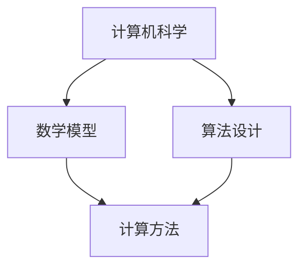
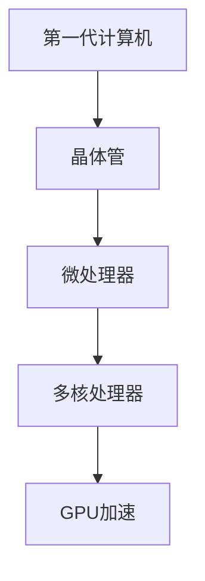
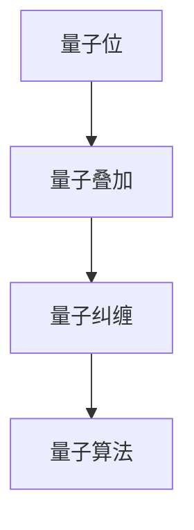
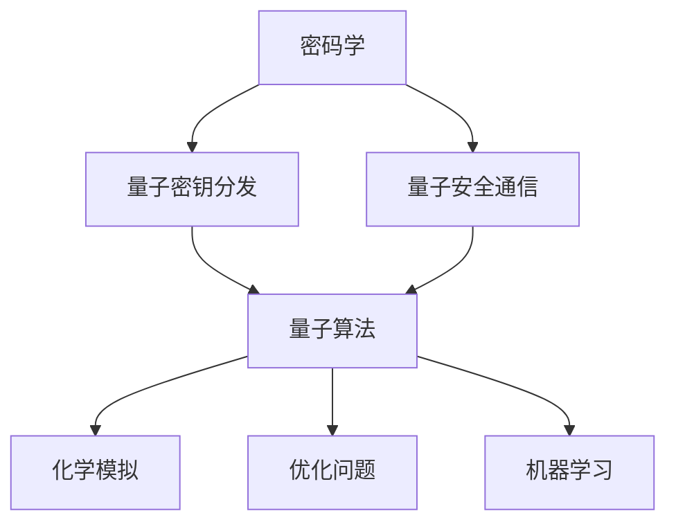

                 


# 《推动科技进步的引擎：人类计算的创新力量》

## 关键词

计算科学、量子计算、生物计算、计算机视觉、人工智能、大数据分析、云计算、边缘计算、网络安全、未来计算

## 摘要

本文旨在探讨人类计算在推动科技进步中的核心作用。从计算科学的基石到前沿的量子计算、生物计算，再到计算机视觉与人工智能、大数据分析、云计算与边缘计算，本文详细阐述了各个领域的关键概念、算法原理、数学模型及其实际应用案例。此外，文章还展望了未来计算的发展趋势，并分析了计算技术对人类社会的影响。通过深入剖析，本文展示了人类计算作为科技进步引擎的巨大潜力。

## 目录大纲

### 第一部分：计算科学与科技发展

### 第1章：计算科学的基石

### 第2章：量子计算与科技前沿

### 第3章：生物计算与医疗科技

### 第4章：计算机视觉与人工智能

### 第5章：大数据与数据分析

### 第6章：云计算与边缘计算

### 第7章：未来计算与科技展望

### 第二部分：计算技术的应用与影响

### 第8章：计算技术在社会中的影响

### 第9章：计算技术在经济中的作用

### 第10章：环境计算与可持续发展

### 第11章：信息安全与计算技术

### 第12章：教育计算与未来教育

### 附录

### 附录A：计算技术相关的工具与资源

## 第一部分：计算科学与科技发展

### 第1章：计算科学的基石

#### 1.1 计算科学的历史与定义

计算科学是研究计算方法、算法及计算模型的学科，它涵盖了数学、计算机科学和物理等多个领域。其历史可以追溯到20世纪中期，当时计算机科学刚刚起步。从那时起，计算科学经历了迅速的发展，成为推动科技进步的重要力量。

**核心概念与联系**

为了更好地理解计算科学的发展历程，我们可以使用Mermaid流程图来展示其核心概念和联系。以下是一个简化的示例：



**核心算法原理讲解**

计算科学中的核心算法原理通常包括以下几个步骤：

1. 问题定义：明确需要解决的问题。
2. 数学模型建立：根据问题定义，建立相应的数学模型。
3. 算法设计：设计解决数学模型的算法。
4. 实施与优化：将算法转换为计算机程序，并进行优化。

以下是一个简单的伪代码，用于描述上述步骤：

```python
# 伪代码：计算科学的基本算法原理

# 步骤1：问题定义
problem_definition()

# 步骤2：数学模型建立
mathematical_model()

# 步骤3：算法设计
algorithm_design()

# 步骤4：实施与优化
implementation_and_optimization()
```

**数学模型和数学公式讲解**

在计算科学中，数学模型和公式是描述问题解决方案的重要工具。以下是一些常见的数学模型和公式：

1. **线性回归模型**：用于预测一个变量基于其他变量的值。
   $$ y = \beta_0 + \beta_1x + \epsilon $$
2. **牛顿迭代法**：用于求解非线性方程的根。
   $$ x_{n+1} = x_n - \frac{f(x_n)}{f'(x_n)} $$
3. **动态规划**：用于解决最优化问题。
   $$ V(n) = \min \{c(n, x) + V(n-1) : x \in S(n)\} $$

**举例说明**

以线性回归模型为例，我们来看一个实际应用案例。假设我们要预测某城市的月平均温度，基于前一个月的平均温度和月降雨量。以下是一个简化的实现过程：

1. **数据收集**：收集过去几个月的平均温度和月降雨量数据。
2. **数学模型建立**：建立线性回归模型，表示温度与降雨量的关系。
3. **算法设计**：使用最小二乘法求解线性回归模型的参数。
4. **实施与优化**：将算法实现为计算机程序，并进行优化。

```python
# Python代码：线性回归模型实现
import numpy as np

# 数据收集
X = np.array([[1, 20], [1, 30], [1, 25]])  # 降雨量数据
y = np.array([22, 35, 27])  # 平均温度数据

# 数学模型建立
# y = β0 + β1x + ε
# β0 和 β1 为参数，ε 为误差项

# 算法设计：最小二乘法
theta = np.linalg.inv(X.T @ X) @ X.T @ y

# 实施与优化
print("线性回归参数：", theta)
```

#### 1.2 计算硬件的发展

计算硬件是计算科学的重要基础，它决定了计算能力的上限。计算硬件的发展经历了从大型主机到小型化、高性能处理器的过程。以下将介绍计算硬件的关键发展里程碑和核心技术。

**核心概念与联系**

使用Mermaid流程图，我们可以展示计算硬件的发展历程和关键里程碑：



**核心算法原理讲解**

计算硬件的核心算法原理主要涉及以下几个方面：

1. **指令集架构**：定义计算机如何理解和执行指令。
2. **缓存技术**：提高数据访问速度，减少处理器等待时间。
3. **并行计算**：通过多核处理器和GPU加速，实现高效的计算。

以下是一个简单的伪代码，用于描述计算硬件的基本算法原理：

```python
# 伪代码：计算硬件的基本算法原理

# 步骤1：指令集解码
decode_instruction()

# 步骤2：数据处理
process_data()

# 步骤3：缓存管理
cache_management()

# 步骤4：并行计算
parallel_computation()
```

**数学模型和数学公式讲解**

在计算硬件中，数学模型和公式主要用于优化计算性能和能源效率。以下是一些常见的数学模型和公式：

1. **能耗模型**：描述处理器能耗与性能的关系。
   $$ E = C \cdot f^2 $$
   其中，E 为能耗，C 为常数，f 为时钟频率。
2. **缓存命中率**：描述缓存对数据访问的命中率。
   $$ H = \frac{HIT}{TOTAL} $$
   其中，HIT 为缓存命中的次数，TOTAL 为总访问次数。

**举例说明**

以GPU加速为例，我们来看一个实际应用案例。假设我们使用GPU加速一个矩阵乘法运算。以下是一个简化的实现过程：

1. **硬件选择**：选择适合的GPU硬件，如NVIDIA的CUDA平台。
2. **算法设计**：设计并行化的矩阵乘法算法。
3. **代码实现**：使用CUDA库实现并行化的矩阵乘法。
4. **性能优化**：通过调整并行化策略和优化缓存使用，提高计算性能。

```cuda
// CUDA代码：并行化的矩阵乘法
__global__ void matrix_multiplication(float* A, float* B, float* C, int N) {
    int row = blockIdx.y * blockDim.y + threadIdx.y;
    int col = blockIdx.x * blockDim.x + threadIdx.x;

    float sum = 0.0f;
    for (int k = 0; k < N; ++k) {
        sum += A[row * N + k] * B[k * N + col];
    }

    C[row * N + col] = sum;
}
```

### 第2章：量子计算与科技前沿

#### 2.1 量子计算的基本原理

量子计算是一种利用量子力学原理进行信息处理的新型计算方式。与经典计算相比，量子计算具有并行性和叠加性等独特特性，使其在处理复杂问题方面具有巨大潜力。

**核心概念与联系**

使用Mermaid流程图，我们可以展示量子计算的基本原理和架构：



**核心算法原理讲解**

量子计算的核心算法原理包括以下几个关键概念：

1. **量子位（Qubit）**：量子计算的基本单元，具有叠加和纠缠特性。
2. **量子叠加**：量子位可以同时处于多个状态的叠加。
3. **量子纠缠**：量子位之间可以产生量子纠缠，使它们的状态相互依赖。

以下是一个简单的伪代码，用于描述量子计算的基本算法原理：

```python
# 伪代码：量子计算的基本算法原理

# 步骤1：初始化量子位
initialize_quantum_bits()

# 步骤2：量子叠加
apply量子叠加()

# 步骤3：量子纠缠
apply量子纠缠()

# 步骤4：量子计算
perform_quantum_computation()

# 步骤5：测量结果
measure_results()
```

**数学模型和数学公式讲解**

量子计算中的数学模型和公式主要涉及量子态的表示和量子门的操作。以下是一些常见的数学模型和公式：

1. **量子态表示**：使用复数向量表示量子态。
   $$ |\psi\rangle = \sum_{i} a_i |i\rangle $$
   其中，$|i\rangle$ 表示量子位的状态，$a_i$ 表示状态的概率幅。
2. **量子门操作**：使用矩阵表示量子门，对量子态进行操作。
   $$ |\psi'\rangle = U|\psi\rangle $$
   其中，$U$ 表示量子门，$|\psi\rangle$ 表示输入量子态，$|\psi'\rangle$ 表示输出量子态。

**举例说明**

以量子计算中的Shor算法为例，我们来看一个实际应用案例。Shor算法是一种用于因数分解的量子算法，它利用量子计算的优势，可以在多项式时间内解决传统计算机需要指数时间解决的问题。

1. **问题描述**：给定一个整数N，求其所有正因数。
2. **数学模型建立**：使用量子计算模型，将因数分解问题转换为量子算法。
3. **算法设计**：设计Shor算法，实现量子态的初始化、量子门操作和测量。
4. **代码实现**：使用量子计算框架（如Q#）实现Shor算法。

```qsharp
// Q#代码：Shor算法实现
operation Shor(N: Int) : List<Int> {
    // 初始化量子位和量子态
    let (qubits, state) = Quantumregister.create(N);

    // 施加减法运算的量子门
    AddGate(qubits[0], qubits[1]);

    // 施加逆量子傅里叶变换
    ApplyFourierTransformation(qubits);

    // 测量量子位
    let results = Measure(qubits);

    // 返回所有正因数
    return Factorize(N, results);
}
```

#### 2.2 量子计算的应用领域

量子计算在多个领域具有广泛的应用前景，包括密码学、化学模拟、优化问题和机器学习等。以下将介绍量子计算在不同领域的应用案例。

**核心概念与联系**

使用Mermaid流程图，我们可以展示量子计算在不同领域的应用及其核心概念：



**核心算法原理讲解**

量子计算在各个领域的应用算法原理如下：

1. **密码学**：利用量子计算的优势，开发更安全的加密算法，如量子密钥分发和量子安全通信。
2. **化学模拟**：利用量子计算模拟分子的行为，解决传统计算方法难以处理的问题。
3. **优化问题**：利用量子计算求解复杂优化问题，如旅行商问题、资源分配问题等。
4. **机器学习**：利用量子计算加速机器学习算法，提高模型的训练和推理速度。

以下是一个简单的伪代码，用于描述量子计算在不同领域的应用算法原理：

```python
# 伪代码：量子计算在不同领域的应用算法原理

# 密码学
operation QuantumCryptography() {
    // 初始化量子位和量子态
    initialize_quantum_bits()

    // 施加量子密钥分发算法
    apply_QuantumKeyDistribution()

    // 测量量子位，生成密钥
    measure_quantum_bits()
}

# 化学模拟
operation ChemicalSimulation() {
    // 初始化量子位和量子态
    initialize_quantum_bits()

    // 施加量子模拟算法
    apply_QuantumSimulation()

    // 测量量子位，获取分子行为结果
    measure_quantum_bits()
}

# 优化问题
operation OptimizationProblem() {
    // 初始化量子位和量子态
    initialize_quantum_bits()

    // 施加量子优化算法
    apply_QuantumOptimization()

    // 测量量子位，获取最优解
    measure_quantum_bits()
}

# 机器学习
operation MachineLearning() {
    // 初始化量子位和量子态
    initialize_quantum_bits()

    // 施加量子机器学习算法
    apply_QuantumMachineLearning()

    // 测量量子位，获取模型参数
    measure_quantum_bits()
}
```

**数学模型和数学公式讲解**

在量子计算的应用中，数学模型和公式用于描述量子算法的运算过程和结果。以下是一些常见的数学模型和公式：

1. **量子密钥分发**：使用量子纠缠和测量操作生成共享密钥。
   $$ |key\rangle = \frac{1}{\sqrt{2}} (|0\rangle |0\rangle + |1\rangle |1\rangle) $$
   $$ key = measure(|key\rangle) $$
2. **量子模拟**：使用量子态的叠加和纠缠模拟分子的行为。
   $$ |\psi\rangle = \sum_{i} c_i |i\rangle $$
   $$ E = \langle \psi | H | \psi \rangle $$
3. **量子优化**：使用量子算法求解优化问题，如量子随机游走算法。
   $$ p(i) \propto e^{-E(i)/T} $$
   $$ i^* = argmin_i E(i) $$
4. **量子机器学习**：使用量子计算加速机器学习算法，如量子支持向量机。
   $$ w = \frac{1}{\sqrt{2}} (|+\rangle + |-

