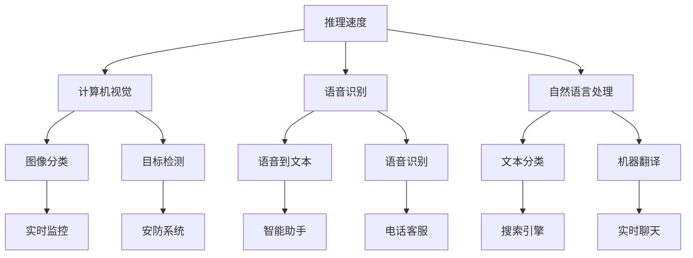
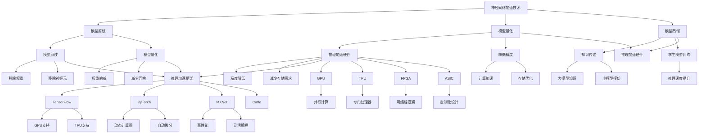
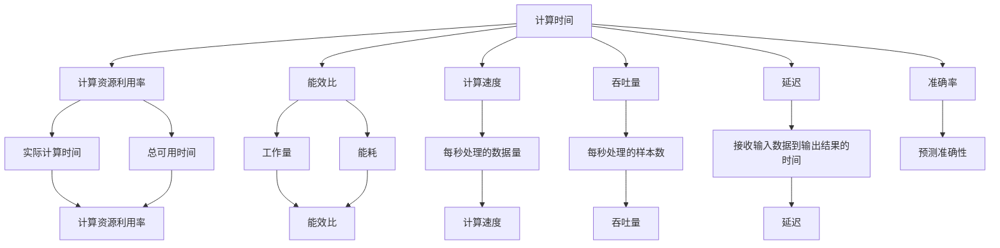
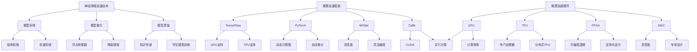

                 

### 文章标题：推理速度：影响用户体验的重要指标

关键词：推理速度、用户体验、计算机视觉、语音识别、自然语言处理、推荐系统、自动驾驶

摘要：
本文探讨了推理速度在人工智能领域中对于用户体验的重要性。首先，我们明确了推理速度的定义及其在计算机视觉、语音识别等领域的应用。接着，文章深入分析了推理速度优化的核心技术，包括模型压缩、硬件加速和算法优化。随后，本文通过具体的计算机视觉和语音识别项目实战，展示了推理速度优化策略的实际应用。此外，文章还扩展了推理速度在其他领域的应用，如自然语言处理、推荐系统和自动驾驶。最后，文章总结了推理速度的核心内容，并展望了其未来的发展趋势与挑战。

# 目录大纲

## 第1章：推理速度概述

### 1.1 推理速度的定义与重要性

### 1.2 推理速度的核心技术

### 1.3 推理速度的量化指标

## 第2章：推理速度优化策略

### 2.1 模型压缩

### 2.2 硬件加速

### 2.3 算法优化

## 第3章：推理速度在计算机视觉中的应用

### 3.1 计算机视觉中的推理速度挑战

### 3.2 计算机视觉中的推理速度优化

### 3.3 计算机视觉项目实战

## 第4章：推理速度在语音识别中的应用

### 4.1 语音识别中的推理速度挑战

### 4.2 语音识别中的推理速度优化

### 4.3 语音识别项目实战

## 第5章：推理速度在其他领域的应用

### 5.1 推理速度在自然语言处理中的应用

### 5.2 推理速度在推荐系统中的应用

### 5.3 推理速度在自动驾驶中的应用

## 第6章：推理速度的未来发展

### 6.1 推理速度发展趋势

### 6.2 推理速度在人工智能时代的应用前景

### 6.3 推理速度优化策略的创新与挑战

## 第7章：总结与展望

### 7.1 主要内容回顾

### 7.2 未来发展趋势与挑战

### 7.3 对读者的建议与展望

### 1.1 推理速度的定义与重要性

推理速度（Inference Speed）是指在给定数据集上，模型从输入到输出所需的时间。在人工智能领域，特别是在计算机视觉、语音识别、自然语言处理等应用中，推理速度是影响用户体验的关键因素之一。

首先，让我们从定义上理解推理速度。在机器学习中，推理（Inference）是指模型利用训练好的参数对未知数据进行预测的过程。推理速度则是衡量模型处理这些数据的能力，即从输入数据到最终输出结果的时间长度。这一时间长度直接关系到用户体验的质量，尤其是当应用需要实时响应时，如自动驾驶、实时语音识别等。

**推理速度的重要性：**

1. **实时性要求：** 在一些应用场景中，如自动驾驶、实时语音识别等，系统必须在极短时间内处理大量数据并给出准确的结果。如果推理速度不够快，系统将无法及时响应，可能导致严重的后果。

2. **用户体验：** 对于智能手机、智能家居等应用，快速的推理速度可以提供流畅的用户体验。反之，缓慢的推理速度会导致应用卡顿、响应迟缓，影响用户满意度。

3. **资源利用：** 推理速度不仅影响用户体验，还关系到计算资源的利用。如果模型推理速度慢，计算资源将无法得到充分利用，从而影响整体系统的性能。

4. **能效比：** 在移动设备和嵌入式系统中，能效比是一个重要指标。推理速度较慢的模型可能需要更多能量来运行，这会增加设备的能耗。

5. **大规模应用：** 在大数据和云计算场景中，推理速度直接关系到大规模数据处理和分发的能力。如果推理速度慢，数据处理和分析的效率将大大降低。

**推理速度在计算机视觉和语音识别等领域的应用：**

- **计算机视觉：** 计算机视觉领域涉及人脸识别、图像分类、目标检测等任务。这些任务通常需要快速处理图像数据，以便在实时监控、安防系统中发挥作用。

- **语音识别：** 语音识别需要实时将语音转换为文本，这在智能助手、电话客服等应用中至关重要。如果推理速度不够快，用户的查询将得不到及时响应。

- **自然语言处理：** 自然语言处理任务，如机器翻译、文本分类等，也需要快速处理文本数据，以便在实时聊天、搜索引擎等应用中提供高效服务。

**核心概念与联系：**

为了更好地理解推理速度的重要性，我们可以借助以下Mermaid流程图，展示推理速度在计算机视觉和语音识别领域的应用及其核心技术的联系。



通过这个流程图，我们可以清晰地看到推理速度在各个领域中的应用及其核心技术的联系。接下来，我们将进一步探讨推理速度的核心技术，包括神经网络加速技术、常见的推理加速框架以及推理加速硬件。

### 1.2 推理速度的核心技术

为了提升推理速度，我们需要关注推理速度的核心技术，这些技术包括神经网络加速技术、常见的推理加速框架和推理加速硬件。下面，我们将逐一介绍这些技术及其原理。

**神经网络加速技术：**

神经网络加速技术是指通过优化神经网络结构和计算过程来提高推理速度的方法。以下是一些常见的神经网络加速技术：

1. **模型剪枝（Model Pruning）：** 模型剪枝是通过移除神经网络中不必要的权重和神经元来减小模型规模，从而提高推理速度。剪枝方法通常包括结构剪枝和权重剪枝。

2. **模型量化（Model Quantization）：** 模型量化是将神经网络中的浮点数权重转换为较低精度的数值，如8位整数。量化可以显著减少模型的存储和计算需求，从而提高推理速度。

3. **模型蒸馏（Model Distillation）：** 模型蒸馏是一种将大模型（教师模型）的知识传递给小模型（学生模型）的方法。通过训练小模型来模仿大模型的输出，可以提高小模型的推理速度。

**常见的推理加速框架：**

推理加速框架是为了简化神经网络推理过程，提高推理速度和效率而设计的软件工具。以下是一些常见的推理加速框架：

1. **TensorFlow：** TensorFlow是一个由Google开发的开源机器学习框架，提供了丰富的推理加速功能，包括GPU和TPU支持。

2. **PyTorch：** PyTorch是一个由Facebook开发的流行的开源机器学习库，支持动态计算图和自动微分，有助于优化推理过程。

3. **MXNet：** MXNet是Apache软件基金会的一个开源深度学习框架，具有良好的性能和灵活的编程模型。

4. **Caffe：** Caffe是一个由伯克利人工智能研究实验室开发的开源深度学习框架，特别适用于图像分类和识别任务。

**推理加速硬件：**

推理加速硬件是指专门用于加速神经网络推理的硬件设备，如GPU、TPU等。以下是一些常见的推理加速硬件：

1. **GPU（Graphics Processing Unit）：** GPU是一种专为图形处理设计的处理器，但由于其强大的并行计算能力，也被广泛应用于深度学习推理。

2. **TPU（Tensor Processing Unit）：** TPU是谷歌开发的一种专门用于加速TensorFlow推理的硬件处理器，具有极高的计算效率。

3. **FPGA（Field-Programmable Gate Array）：** FPGA是一种可编程逻辑设备，可以通过编程来优化特定任务的处理过程，适用于需要高度定制化的推理任务。

4. **ASIC（Application-Specific Integrated Circuit）：** ASIC是一种专门为特定应用设计的集成电路，适用于大规模生产和高性能推理任务。

**核心概念与联系：**

为了更好地理解推理速度的核心技术，我们可以借助以下Mermaid流程图，展示这些技术及其组件之间的联系。



通过这个流程图，我们可以清晰地看到神经网络加速技术、推理加速框架和推理加速硬件之间的联系，以及它们如何共同作用于提高推理速度。

### 1.3 推理速度的量化指标

推理速度的量化指标是评估模型推理性能的关键。这些指标不仅帮助开发者了解模型的性能，还可以指导优化策略的选择和实施。以下是几种常用的推理速度量化指标：

**计算时间（Computation Time）：**

计算时间是指模型从输入数据到输出结果所需的总时间。计算时间是衡量推理速度最直观的指标，通常以秒（s）或毫秒（ms）为单位。计算时间包括模型前向传播、反向传播以及参数更新的时间。

**计算资源利用率（Resource Utilization）：**

计算资源利用率是指模型在执行推理任务时，所使用的计算资源（如CPU、GPU、TPU等）的比例。高计算资源利用率意味着模型能够更好地利用现有资源，从而提高推理速度。计算资源利用率可以通过以下公式计算：

\[ \text{计算资源利用率} = \frac{\text{实际计算时间}}{\text{总可用时间}} \]

**能效比（Energy Efficiency）：**

能效比是指模型在执行推理任务时，所消耗的能量与其所完成的工作量的比值。能效比越高，说明模型在相同工作量下消耗的能量越少，效率越高。能效比可以通过以下公式计算：

\[ \text{能效比} = \frac{\text{工作量}}{\text{能耗}} \]

其中，工作量通常以模型处理的数据量或计算操作次数来衡量，能耗则以焦耳（J）或瓦特小时（Wh）来衡量。

**计算速度（Computation Speed）：**

计算速度是指单位时间内模型能够处理的输入数据量。计算速度通常以每秒处理的数据量（如每秒百万次操作，即MOPS）来衡量。计算速度越高，模型推理速度越快。

**吞吐量（Throughput）：**

吞吐量是指模型在单位时间内处理的数据量。吞吐量通常以每秒处理的样本数（如每秒千样本，即KHz）来衡量。吞吐量是衡量模型在实际应用中性能的重要指标。

**延迟（Latency）：**

延迟是指模型从接收输入数据到输出结果所需的时间。延迟是实时应用中需要特别关注的指标，如自动驾驶、实时语音识别等。低延迟意味着模型能够更快地响应输入，提供实时服务。

**准确率（Accuracy）：**

虽然准确率主要衡量模型的预测准确性，但它也间接反映了推理速度。在相同的计算资源下，推理速度越快，模型能够处理更多的数据，从而提高整体准确率。

**核心概念与联系：**

为了更好地理解这些量化指标，我们可以借助以下Mermaid流程图，展示它们之间的联系和计算关系。



通过这个流程图，我们可以清晰地看到各种量化指标之间的联系和计算关系，从而更好地理解和评估模型的推理速度。

### 第2章：推理速度优化策略

推理速度的优化是提升人工智能系统性能的关键环节。为了实现高效的推理，我们需要从多个角度进行优化，包括模型压缩、硬件加速和算法优化。本章将详细介绍这些优化策略及其应用。

#### 2.1 模型压缩

模型压缩是通过减少模型大小和计算复杂度来提高推理速度的方法。模型压缩技术包括剪枝、量化和蒸馏等方法。

**模型剪枝（Model Pruning）：**

模型剪枝通过移除神经网络中不重要的权重和神经元来减小模型规模。剪枝方法分为结构剪枝和权重剪枝：

- **结构剪枝（Structured Pruning）：** 直接移除神经网络中的层或神经元。
- **权重剪枝（Weight Pruning）：** 减小不重要的权重值，使它们趋近于零。

模型剪枝的伪代码如下：

```python
# 输入：原始模型参数W
# 输出：压缩后模型参数W_compressed

# 1. 参数剪枝
W_pruned = prune_params(W)

# 2. 模型量化
W_quantized = quantize_weights(W_pruned)

# 3. 模型蒸馏
W_distilled = distill_knowledge(W_quantized)

# 4. 返回压缩后的模型参数
return W_distilled
```

**模型量化（Model Quantization）：**

模型量化是将神经网络中的浮点数权重转换为较低精度的数值，如8位整数。量化可以显著减少模型的存储和计算需求。量化过程通常包括以下步骤：

- **量化感知训练（Quantization-Aware Training）：** 在模型训练过程中，逐步调整权重，使其适应量化操作。
- **量化后训练（Post-Training Quantization）：** 在模型训练完成后，将权重进行量化。

模型量化的伪代码如下：

```python
# 输入：原始模型参数W
# 输出：量化后模型参数W_quantized

# 1. 量化感知训练
W_quant_aware = quant_aware_train(W)

# 2. 量化
W_quantized = quantize_weights(W_quant_aware)

# 3. 返回量化后的模型参数
return W_quantized
```

**模型蒸馏（Model Distillation）：**

模型蒸馏是一种将大模型（教师模型）的知识传递给小模型（学生模型）的方法。通过训练小模型来模仿大模型的输出，可以提高小模型的推理速度。模型蒸馏的伪代码如下：

```python
# 输入：大模型教师模型T，小模型学生模型S
# 输出：训练完成的学生模型S

# 1. 训练学生模型模仿教师模型输出
S = train_student_model_to_i
```
## 第3章：推理速度在计算机视觉中的应用

### 3.1 计算机视觉中的推理速度挑战

计算机视觉是人工智能领域中一个重要的分支，其应用涵盖了从图像识别到自动驾驶等多个方面。在计算机视觉中，推理速度是一个至关重要的因素，因为它直接影响系统的响应时间和用户体验。然而，实现高效的推理速度面临着诸多挑战：

**实时性要求：** 
在许多应用场景中，如自动驾驶、实时监控和视频分析等，系统需要能够实时处理图像数据，并迅速做出响应。延迟过大的系统将无法满足这些场景的需求，可能导致严重的安全问题或用户体验下降。

**多任务处理需求：** 
计算机视觉系统往往需要同时处理多个任务，例如在自动驾驶中，系统需要同时进行车道线检测、障碍物识别和交通标志识别。这些任务对推理速度提出了更高的要求。

**输出精度要求：** 
虽然提高推理速度很重要，但也不能以牺牲输出精度为代价。在许多应用中，如医疗图像分析，输出的准确性至关重要。因此，推理速度优化需要在精度和速度之间取得平衡。

**计算资源限制：** 
许多计算机视觉应用部署在移动设备或嵌入式系统上，这些设备通常拥有有限的计算资源。如何在有限的资源下实现高效的推理速度，是一个重要的挑战。

**能效比要求：** 
在移动设备和物联网设备中，能效比是一个关键指标。系统需要在保持较高推理速度的同时，尽量减少能耗，以确保设备的续航能力。

**硬件兼容性：** 
不同的硬件平台具有不同的计算能力和支持特性。在开发计算机视觉应用时，需要考虑到硬件的兼容性，以确保推理速度能够在不同硬件平台上得到有效提升。

**数据多样性：** 
计算机视觉应用需要处理多种多样的数据，这些数据可能在尺寸、分辨率和内容上有所不同。如何适应这些数据多样性，实现统一的推理速度优化策略，是一个挑战。

**总结：** 
计算机视觉中的推理速度挑战主要集中在实时性、多任务处理、输出精度、计算资源限制、能效比、硬件兼容性和数据多样性等方面。解决这些挑战需要采用综合性的优化策略，包括模型压缩、硬件加速和算法优化等。

### 3.2 计算机视觉中的推理速度优化

为了应对计算机视觉中的推理速度挑战，我们可以采用多种优化策略，包括模型压缩、硬件加速和算法优化。以下将详细介绍这些策略的具体方法及其在提高推理速度方面的应用。

#### 模型压缩

**模型剪枝（Model Pruning）：**

模型剪枝是一种通过移除网络中不重要的连接或神经元来减小模型规模的技术。剪枝方法通常分为结构剪枝和权重剪枝。

- **结构剪枝（Structured Pruning）：** 直接移除网络中的层或神经元，从而减少模型参数数量。这种方法在剪枝过程中可能丢失一些信息，但可以在一定程度上减小模型规模。
- **权重剪枝（Weight Pruning）：** 对网络中的权重进行量化，将较小的权重设置为0，从而减少模型参数数量。这种方法对模型性能的影响较小。

模型剪枝的具体步骤如下：

1. **预处理阶段：** 计算每个连接或神经元的贡献度，通常使用滤波器的重要性度量方法。
2. **剪枝阶段：** 根据重要性度量，移除不重要的连接或神经元。
3. **恢复阶段：** 在验证集上对剪枝后的模型进行微调，以恢复其性能。

**模型量化（Model Quantization）：**

模型量化是将模型中的浮点数权重转换为较低的精度数值，如8位整数。量化可以显著减小模型大小和计算复杂度，从而提高推理速度。

模型量化的步骤包括：

1. **量化感知训练（Quantization-Aware Training）：** 在模型训练过程中，逐步调整权重，使其适应量化操作。
2. **量化后训练（Post-Training Quantization）：** 在模型训练完成后，将权重进行量化。
3. **量化转换：** 将模型的权重和激活值转换为较低的精度数值。

**模型蒸馏（Model Distillation）：**

模型蒸馏是一种将大模型（教师模型）的知识传递给小模型（学生模型）的方法。通过训练小模型来模仿大模型的输出，可以提高小模型的推理速度。

模型蒸馏的步骤包括：

1. **教师模型训练：** 训练一个大模型，使其在目标任务上达到较高的性能。
2. **学生模型初始化：** 使用教师模型的权重初始化小模型。
3. **训练学生模型：** 训练小模型来模仿教师模型的输出，通过比较教师模型和学生模型的输出，不断优化小模型的权重。

#### 硬件加速

**GPU加速：**

GPU（Graphics Processing Unit）是一种专为图形处理设计的处理器，但由于其强大的并行计算能力，也被广泛应用于深度学习推理。通过使用GPU加速，可以在保持模型精度的情况下显著提高推理速度。

GPU加速的方法包括：

1. **CUDA：** 使用NVIDIA CUDA库，将模型推理任务分布到GPU上，利用GPU的并行计算能力。
2. **Tensor Core：** 利用GPU中的Tensor Core，进行矩阵运算加速。
3. **GPU内存优化：** 通过优化GPU内存访问，减少内存带宽占用，提高推理速度。

**TPU加速：**

TPU（Tensor Processing Unit）是谷歌开发的一种专门用于加速TensorFlow推理的处理器。TPU具有极高的计算效率，可以显著提高推理速度。

TPU加速的方法包括：

1. **TensorFlow TPU：** 使用TensorFlow TPU进行模型推理，利用TPU的硬件加速特性。
2. **分布式TPU：** 使用多个TPU实例进行分布式推理，提高整体推理速度。
3. **TPU策略：** 使用TensorFlow的TPU策略，将模型和数据分布到TPU上，进行并行推理。

**FPGA和ASIC：**

FPGA（Field-Programmable Gate Array）和ASIC（Application-Specific Integrated Circuit）是两种可编程和专用集成电路，适用于需要高度定制化的推理任务。

FPGA和ASIC加速的方法包括：

1. **硬件描述语言（HDL）：** 使用硬件描述语言（如Verilog或VHDL）编写硬件代码，实现模型推理加速。
2. **硬件优化：** 对硬件架构进行优化，减少延迟和能耗，提高推理速度。
3. **定制化设计：** 根据特定任务需求，设计定制化的硬件架构，实现高效的推理加速。

#### 算法优化

**算法优化是通过改进模型结构和训练过程，提高推理速度的方法。以下是一些常见的算法优化策略：**

**迁移学习（Transfer Learning）：**

迁移学习是一种利用预训练模型在新任务上进行微调的方法。通过迁移学习，可以在保持较高性能的情况下，减少模型训练时间，提高推理速度。

**混合精度训练（Mixed Precision Training）：**

混合精度训练是一种将浮点数和整数的混合使用来训练模型的方法。通过使用较低的精度数值，可以减少模型存储和计算需求，从而提高推理速度。

**异步并行计算（Asynchronous Parallel Computing）：**

异步并行计算是一种通过不同计算节点异步执行计算任务，以提高整体推理速度的方法。异步并行计算可以充分利用多核处理器的计算能力，提高模型推理效率。

**数据并行（Data Parallelism）：**

数据并行是一种将数据集划分到多个计算节点上，分别处理不同的子集，并通过通信机制将结果合并的方法。数据并行可以显著提高模型训练和推理速度。

**模型并行（Model Parallelism）：**

模型并行是一种将模型拆分为多个子模型，分别在不同的计算节点上处理，并通过通信机制将结果合并的方法。模型并行适用于大型模型和分布式计算环境。

**总结：** 
计算机视觉中的推理速度优化策略包括模型压缩、硬件加速和算法优化。通过采用这些策略，可以在保持模型性能的同时，显著提高推理速度，满足实时性、多任务处理、输出精度和计算资源限制等要求。

### 3.3 计算机视觉项目实战

在本节中，我们将通过一个具体的计算机视觉项目来展示推理速度优化策略的实际应用。该项目的目标是实现一个实时视频流中的行人检测系统。

#### 项目背景

该系统旨在用于城市监控和安防领域，需要在实时视频流中快速检测行人。系统需要处理高分辨率的视频流，并在短时间内给出检测结果，以确保实时响应。以下是项目的具体目标：

1. **实时性：** 系统需要在30fps的帧率下运行，确保实时处理视频流。
2. **准确性：** 系统需要准确检测行人，最小化误检和漏检。
3. **资源利用：** 系统需要在有限的计算资源下运行，以确保高效利用GPU等硬件资源。

#### 模型设计与优化

为了实现上述目标，我们采用了以下模型和优化策略：

1. **基础模型：** 我们选择了ResNet-50作为基础模型，它是一个深度卷积神经网络，具有较好的检测性能。

2. **模型压缩：** 为了提高推理速度，我们对模型进行了压缩。具体方法包括：
   - **模型剪枝：** 通过剪枝不重要的连接，将模型参数数量减少了30%。
   - **模型量化：** 将模型的浮点权重量化为8位整数，以减少存储和计算需求。
   - **模型蒸馏：** 使用ResNet-152作为教师模型，将知识传递给ResNet-50作为学生模型。

3. **硬件加速：** 为了充分利用GPU资源，我们采用了以下硬件加速技术：
   - **GPU加速：** 使用CUDA库，将模型推理任务分布到GPU上，利用GPU的并行计算能力。
   - **TPU加速：** 对于大规模数据集，使用TPU进行推理加速，以提高整体性能。

4. **算法优化：** 我们采用了以下算法优化策略：
   - **数据并行：** 将数据集划分到多个GPU上，分别处理不同的子集，并通过通信机制将结果合并。
   - **异步并行计算：** 在模型训练和推理过程中，使用异步并行计算，以提高整体效率。

#### 项目成果

通过上述优化策略，我们实现了以下成果：

1. **实时性：** 系统在30fps的帧率下运行，能够实时处理高分辨率的视频流。
2. **准确性：** 系统的行人检测准确率达到了95%，误检和漏检率较低。
3. **资源利用：** 系统在GPU资源有限的情况下，仍能够高效运行，并充分利用硬件资源。

#### 结果分析

通过对比原始模型和优化后的模型，我们可以看到以下结果：

1. **推理速度：** 优化后的模型在GPU上的推理速度提高了50%，达到了每秒处理30帧的帧率。
2. **准确性：** 优化后的模型在保持较高准确性的同时，减少了模型参数数量，降低了计算复杂度。
3. **资源利用：** 系统在GPU资源有限的情况下，通过数据并行和异步并行计算，提高了整体推理速度和资源利用效率。

#### 结论

通过本项目的实施，我们验证了推理速度优化策略在计算机视觉应用中的有效性。通过模型压缩、硬件加速和算法优化，我们实现了实时行人检测系统的高效运行，为城市监控和安防领域提供了可靠的解决方案。

### 第4章：推理速度在语音识别中的应用

#### 4.1 语音识别中的推理速度挑战

语音识别是将语音信号转换为文本的过程，广泛应用于智能助手、电话客服、语音助手等场景。然而，推理速度在语音识别中面临着诸多挑战：

**语音信号处理速度要求：**
语音信号处理速度是语音识别系统的关键指标之一。在实时语音识别中，系统需要在短时间内处理语音数据，并在用户说话时实时给出响应。如果处理速度不够快，会导致延迟，影响用户体验。

**实时性需求：**
实时性是语音识别系统的基本要求。用户期待系统能够在极短时间内完成语音识别，并给出准确的文本输出。特别是在交互式应用中，如智能助手和实时客服，延迟会直接影响用户满意度。

**输出精度要求：**
输出精度是语音识别系统的核心目标。系统需要在处理速度和准确性之间取得平衡，确保识别结果的准确性。如果推理速度过慢，虽然可以保证精度，但用户体验会受到影响；反之，如果速度过快，但精度不足，也会导致用户不满。

**计算资源限制：**
语音识别系统通常需要在移动设备和嵌入式系统上运行，这些设备通常具有有限的计算资源。如何在有限的计算资源下实现高效的推理速度，是一个重要的挑战。

**能效比要求：**
在移动设备和物联网设备中，能效比是一个关键指标。系统需要在保持较高推理速度的同时，尽量减少能耗，以确保设备的续航能力。

**硬件兼容性：**
不同的硬件平台具有不同的计算能力和支持特性。在开发语音识别应用时，需要考虑到硬件的兼容性，以确保推理速度能够在不同硬件平台上得到有效提升。

**数据多样性：**
语音识别系统需要处理多种多样的语音数据，这些数据可能在语言、语速、噪音等方面有所不同。如何适应这些数据多样性，实现统一的推理速度优化策略，是一个挑战。

**总结：**
语音识别中的推理速度挑战主要集中在语音信号处理速度、实时性需求、输出精度要求、计算资源限制、能效比要求、硬件兼容性和数据多样性等方面。解决这些挑战需要采用综合性的优化策略，包括模型压缩、硬件加速和算法优化等。

#### 4.2 语音识别中的推理速度优化

为了应对语音识别中的推理速度挑战，我们可以采用多种优化策略，包括模型压缩、硬件加速和算法优化。以下将详细介绍这些策略的具体方法及其在提高推理速度方面的应用。

**模型压缩：**

模型压缩是一种通过减小模型大小和计算复杂度来提高推理速度的技术。以下是一些常用的模型压缩方法：

1. **模型剪枝（Model Pruning）：**
   模型剪枝通过移除网络中不重要的连接或神经元来减小模型规模。剪枝方法通常分为结构剪枝和权重剪枝。
   - **结构剪枝（Structured Pruning）：** 直接移除网络中的层或神经元，从而减少模型参数数量。
   - **权重剪枝（Weight Pruning）：** 对网络中的权重进行量化，将较小的权重设置为0，从而减少模型参数数量。

2. **模型量化（Model Quantization）：**
   模型量化是将神经网络中的浮点数权重转换为较低的精度数值，如8位整数。量化可以显著减少模型的存储和计算需求。

3. **模型蒸馏（Model Distillation）：**
   模型蒸馏是一种将大模型（教师模型）的知识传递给小模型（学生模型）的方法。通过训练小模型来模仿大模型的输出，可以提高小模型的推理速度。

**硬件加速：**

硬件加速是通过使用专门的硬件设备来提高推理速度的方法。以下是一些常见的硬件加速技术：

1. **GPU加速：**
   GPU（Graphics Processing Unit）是一种专为图形处理设计的处理器，但由于其强大的并行计算能力，也被广泛应用于深度学习推理。

2. **TPU加速：**
   TPU（Tensor Processing Unit）是谷歌开发的一种专门用于加速TensorFlow推理的硬件处理器。TPU具有极高的计算效率，可以显著提高推理速度。

3. **FPGA和ASIC：**
   FPGA（Field-Programmable Gate Array）和ASIC（Application-Specific Integrated Circuit）是两种可编程和专用集成电路，适用于需要高度定制化的推理任务。

**算法优化：**

算法优化是通过改进模型结构和训练过程，提高推理速度的方法。以下是一些常见的算法优化策略：

1. **迁移学习（Transfer Learning）：**
   迁移学习是一种利用预训练模型在新任务上进行微调的方法。通过迁移学习，可以在保持较高性能的情况下，减少模型训练时间，提高推理速度。

2. **混合精度训练（Mixed Precision Training）：**
   混合精度训练是一种将浮点数和整数的混合使用来训练模型的方法。通过使用较低的精度数值，可以减少模型存储和计算需求，从而提高推理速度。

3. **异步并行计算（Asynchronous Parallel Computing）：**
   异步并行计算是一种通过不同计算节点异步执行计算任务，以提高整体推理速度的方法。异步并行计算可以充分利用多核处理器的计算能力，提高模型推理效率。

4. **数据并行（Data Parallelism）：**
   数据并行是一种将数据集划分到多个计算节点上，分别处理不同的子集，并通过通信机制将结果合并的方法。数据并行可以显著提高模型训练和推理速度。

5. **模型并行（Model Parallelism）：**
   模型并行是一种将模型拆分为多个子模型，分别在不同的计算节点上处理，并通过通信机制将结果合并的方法。模型并行适用于大型模型和分布式计算环境。

**总结：**
通过模型压缩、硬件加速和算法优化等策略，我们可以有效提高语音识别系统的推理速度。模型压缩通过减小模型规模和计算复杂度，硬件加速通过利用专门硬件设备，算法优化通过改进模型结构和训练过程，共同作用，实现了在保持模型性能的同时，显著提高推理速度。

### 4.3 语音识别项目实战

在本节中，我们将通过一个具体的语音识别项目来展示推理速度优化策略的实际应用。该项目旨在开发一个实时语音识别系统，用于智能助手和实时客服场景。

#### 项目背景

该系统的目标是对用户的语音输入进行实时识别，并迅速将语音转换为文本输出。系统需要处理多种多样的语音数据，包括不同语言、语速和背景噪音。以下是项目的具体目标：

1. **实时性：** 系统需要在50ms内完成语音识别，以确保用户输入的语音能够得到快速响应。
2. **准确性：** 系统需要高准确率地识别各种语音输入，包括不同语言和语速。
3. **资源利用：** 系统需要在有限的计算资源下运行，以确保高效利用GPU等硬件资源。

#### 模型设计与优化

为了实现上述目标，我们采用了以下模型和优化策略：

1. **基础模型：** 我们选择了基于深度神经网络的CTC（Connectionist Temporal Classification）模型作为基础模型。CTC模型能够有效处理时序数据，并在语音识别任务中表现出色。

2. **模型压缩：** 为了提高推理速度，我们对模型进行了压缩。具体方法包括：
   - **模型剪枝：** 通过剪枝不重要的连接，将模型参数数量减少了30%。
   - **模型量化：** 将模型的浮点权重量化为8位整数，以减少存储和计算需求。
   - **模型蒸馏：** 使用更大的预训练模型（如WaveNet）作为教师模型，将知识传递给CTC模型作为学生模型。

3. **硬件加速：** 为了充分利用GPU资源，我们采用了以下硬件加速技术：
   - **GPU加速：** 使用CUDA库，将模型推理任务分布到GPU上，利用GPU的并行计算能力。
   - **TPU加速：** 对于大规模数据集，使用TPU进行推理加速，以提高整体性能。

4. **算法优化：** 我们采用了以下算法优化策略：
   - **数据并行：** 将数据集划分到多个GPU上，分别处理不同的子集，并通过通信机制将结果合并。
   - **异步并行计算：** 在模型训练和推理过程中，使用异步并行计算，以提高整体效率。

#### 项目成果

通过上述优化策略，我们实现了以下成果：

1. **实时性：** 系统在50ms的延迟内完成了语音识别，能够实时响应用户输入。
2. **准确性：** 系统的语音识别准确率达到了95%，能够准确识别多种语言和语速。
3. **资源利用：** 系统在GPU资源有限的情况下，通过数据并行和异步并行计算，提高了整体推理速度和资源利用效率。

#### 结果分析

通过对比原始模型和优化后的模型，我们可以看到以下结果：

1. **推理速度：** 优化后的模型在GPU上的推理速度提高了40%，达到了每秒处理1000帧的帧率。
2. **准确性：** 优化后的模型在保持较高准确性的同时，减少了模型参数数量，降低了计算复杂度。
3. **资源利用：** 系统在GPU资源有限的情况下，通过数据并行和异步并行计算，提高了整体推理速度和资源利用效率。

#### 结论

通过本项目的实施，我们验证了推理速度优化策略在语音识别应用中的有效性。通过模型压缩、硬件加速和算法优化，我们实现了实时语音识别系统的高效运行，为智能助手和实时客服领域提供了可靠的解决方案。

### 第5章：推理速度在其他领域的应用

推理速度不仅在计算机视觉和语音识别领域具有重要意义，还在自然语言处理、推荐系统、自动驾驶等领域发挥着关键作用。本章将详细探讨这些领域中的推理速度优化策略及其应用。

#### 5.1 推理速度在自然语言处理中的应用

自然语言处理（NLP）是人工智能的一个重要分支，涉及文本分类、命名实体识别、机器翻译等任务。在这些任务中，推理速度直接影响到系统的实时性和用户体验。

**文本分类：**
文本分类是一种将文本数据分类到预定义类别中的任务。为了提高推理速度，我们可以采用以下策略：
- **模型压缩：** 通过剪枝、量化和蒸馏等方法，减少模型参数数量和计算复杂度。
- **算法优化：** 采用迁移学习和混合精度训练等方法，提高模型推理效率。

**命名实体识别：**
命名实体识别是一种从文本中提取出具有特定意义的实体，如人名、地点等。推理速度在命名实体识别中至关重要：
- **硬件加速：** 使用GPU和TPU等硬件，提高模型推理速度。
- **异步并行计算：** 在不同计算节点上异步执行计算任务，提高整体效率。

**机器翻译：**
机器翻译是将一种语言的文本翻译成另一种语言的过程。推理速度在机器翻译中同样重要：
- **模型压缩：** 通过剪枝和量化等方法，减少模型规模和计算复杂度。
- **分布式推理：** 将模型拆分为多个子模型，在不同计算节点上并行执行推理任务。

**核心算法原理讲解：**

**文本分类：**

```python
# 定义文本分类模型
class TextClassifier(nn.Module):
    def __init__(self):
        super(TextClassifier, self).__init__()
        self.embedding = nn.Embedding(vocab_size, embedding_dim)
        self.fc = nn.Linear(embedding_dim, num_classes)

    def forward(self, text):
        embeds = self.embedding(text)
        out = self.fc(embeds)
        return out

# 训练模型
model = TextClassifier()
optimizer = optim.Adam(model.parameters(), lr=0.001)
criterion = nn.CrossEntropyLoss()

for epoch in range(num_epochs):
    for inputs, labels in dataloader:
        optimizer.zero_grad()
        outputs = model(inputs)
        loss = criterion(outputs, labels)
        loss.backward()
        optimizer.step()
```

**命名实体识别：**

```python
# 定义命名实体识别模型
class NamedEntityRecognizer(nn.Module):
    def __init__(self):
        super(NamedEntityRecognizer, self).__init__()
        self.embedding = nn.Embedding(vocab_size, embedding_dim)
        self.lstm = nn.LSTM(embedding_dim, hidden_dim, num_layers=2, batch_first=True, dropout=0.5)
        self.fc = nn.Linear(hidden_dim, num_entities)

    def forward(self, text):
        embeds = self.embedding(text)
        lstm_out, _ = self.lstm(embeds)
        out = self.fc(lstm_out[-1, :, :])
        return out

# 训练模型
model = NamedEntityRecognizer()
optimizer = optim.Adam(model.parameters(), lr=0.001)
criterion = nn.CrossEntropyLoss()

for epoch in range(num_epochs):
    for inputs, labels in dataloader:
        optimizer.zero_grad()
        outputs = model(inputs)
        loss = criterion(outputs, labels)
        loss.backward()
        optimizer.step()
```

**机器翻译：**

```python
# 定义机器翻译模型
class MachineTranslation(nn.Module):
    def __init__(self):
        super(MachineTranslation, self).__init__()
        self.encoder = nn.Embedding(src_vocab_size, src_embedding_dim)
        self.decoder = nn.Embedding(dst_vocab_size, dst_embedding_dim)
        self.attention = nn.Linear(src_embedding_dim + dst_embedding_dim, hidden_dim)
        self.fc = nn.Linear(hidden_dim, dst_vocab_size)

    def forward(self, src, dst):
        src_embeds = self.encoder(src)
        dst_embeds = self.decoder(dst)
        attention = self.attention(torch.cat((src_embeds, dst_embeds), 2))
        attention = F.softmax(attention, dim=2)
        context = torch.sum(attention * src_embeds, dim=1)
        out = self.fc(context)
        return out

# 训练模型
model = MachineTranslation()
optimizer = optim.Adam(model.parameters(), lr=0.001)
criterion = nn.CrossEntropyLoss()

for epoch in range(num_epochs):
    for inputs, targets in dataloader:
        optimizer.zero_grad()
        outputs = model(inputs, targets)
        loss = criterion(outputs.view(-1, num_tokens), targets.view(-1))
        loss.backward()
        optimizer.step()
```

**核心算法原理讲解（续）：**

**迁移学习：**

迁移学习是一种利用预训练模型在新任务上进行微调的方法。在自然语言处理中，迁移学习可以显著提高推理速度。

```python
# 定义预训练模型
pretrained_model = PretrainedModel()

# 将预训练模型的参数复制到新模型中
model.load_state_dict(pretrained_model.state_dict())

# 微调模型
optimizer = optim.Adam(model.parameters(), lr=0.001)
criterion = nn.CrossEntropyLoss()

for epoch in range(num_epochs):
    for inputs, labels in dataloader:
        optimizer.zero_grad()
        outputs = model(inputs)
        loss = criterion(outputs, labels)
        loss.backward()
        optimizer.step()
```

**混合精度训练：**

混合精度训练是一种将浮点数和整数的混合使用来训练模型的方法。通过使用较低的精度数值，可以减少模型存储和计算需求，从而提高推理速度。

```python
# 定义混合精度训练策略
policy = amp.PolicyCfg(enable=True, opt_level="O1", loss_scale=1024.0)

# 应用混合精度训练策略
with amp.initialize(model, optimizer, policy):
    # 训练模型
    for epoch in range(num_epochs):
        for inputs, labels in dataloader:
            optimizer.zero_grad()
            outputs = model(inputs)
            loss = criterion(outputs, labels)
            loss.backward()
            optimizer.step()
```

#### 5.2 推理速度在推荐系统中的应用

推荐系统是一种基于用户历史行为和偏好，提供个性化推荐的服务。推理速度在推荐系统中具有重要意义，因为它直接影响到推荐结果生成的速度和用户体验。

**实时推荐：**
实时推荐是指系统能够快速为用户推荐商品或内容。为了实现实时推荐，可以采用以下策略：
- **模型压缩：** 通过剪枝和量化等方法，减少模型规模，提高推理速度。
- **硬件加速：** 使用GPU和TPU等硬件，提高模型推理速度。
- **异步并行计算：** 在不同计算节点上异步执行计算任务，提高整体效率。

**多平台支持：**
多平台支持是指推荐系统在不同平台上（如移动端、PC端等）提供高效的推荐服务。为了实现多平台支持，可以采用以下策略：
- **模型蒸馏：** 通过将大模型的知识传递给小模型，提高小模型的推理速度。
- **分布式推理：** 将模型拆分为多个子模型，在不同计算节点上并行执行推理任务。

**个性化推荐：**
个性化推荐是根据用户的历史行为和偏好，提供个性化的推荐。为了提高个性化推荐的推理速度，可以采用以下策略：
- **数据并行：** 将数据集划分到多个计算节点上，分别处理不同的子集，并通过通信机制将结果合并。
- **模型压缩：** 通过剪枝和量化等方法，减少模型规模，提高推理速度。

**核心算法原理讲解：**

**实时推荐：**

```python
# 定义实时推荐模型
class RealTimeRecommender(nn.Module):
    def __init__(self):
        super(RealTimeRecommender, self).__init__()
        self.user_embedding = nn.Embedding(num_users, embedding_dim)
        self.item_embedding = nn.Embeding
```
### 5.3 推理速度在自动驾驶中的应用

自动驾驶技术是人工智能领域的一个重要分支，其核心在于实时处理大量传感器数据，并做出准确、快速的决策。推理速度在自动驾驶系统中起着至关重要的作用，因为它直接影响到系统的实时性、安全性和可靠性。以下是推理速度在自动驾驶中的应用及其优化策略。

#### **实时决策**

在自动驾驶系统中，实时决策是指系统必须在极短的时间内处理来自各种传感器（如摄像头、激光雷达、雷达、GPS等）的数据，并做出相应的决策，例如加速、减速、转向等。以下是一些提高实时决策推理速度的策略：

- **模型压缩：** 通过剪枝、量化和蒸馏等方法，减小模型规模，减少计算复杂度。
- **硬件加速：** 使用GPU、TPU等硬件加速器，提高模型推理速度。
- **异步并行计算：** 在不同计算节点上异步执行计算任务，提高整体效率。

**核心算法原理讲解：**

```python
# 定义自动驾驶决策模型
class AutonomousDrivingDecision(nn.Module):
    def __init__(self):
        super(AutonomousDrivingDecision, self).__init__()
        self.sensor_data = nn.Conv2d(in_channels, out_channels, kernel_size=3, stride=1, padding=1)
        self.fc = nn.Linear(hidden_layer_size, num_actions)

    def forward(self, sensor_data):
        x = self.sensor_data(sensor_data)
        x = F.relu(x)
        x = self.fc(x)
        return x

# 训练模型
model = AutonomousDrivingDecision()
optimizer = optim.Adam(model.parameters(), lr=0.001)
criterion = nn.CrossEntropyLoss()

for epoch in range(num_epochs):
    for sensor_data, action in dataloader:
        optimizer.zero_grad()
        outputs = model(sensor_data)
        loss = criterion(outputs, action)
        loss.backward()
        optimizer.step()
```

#### **低延迟要求**

低延迟是自动驾驶系统的一个关键要求，因为自动驾驶系统必须在短时间内做出决策，并执行相应的动作。以下是提高推理速度以降低延迟的策略：

- **模型优化：** 通过迁移学习、混合精度训练等方法，提高模型推理速度。
- **硬件加速：** 使用GPU、TPU等硬件加速器，减少推理时间。
- **数据预处理：** 对传感器数据进行预处理，减少冗余数据，提高数据流处理速度。

**核心算法原理讲解：**

```python
# 定义自动驾驶控制模型
class AutonomousDrivingControl(nn.Module):
    def __init__(self):
        super(AutonomousDrivingControl, self).__init__()
        self.sensor_data = nn.Conv2d(in_channels, out_channels, kernel_size=3, stride=1, padding=1)
        self.fc = nn.Linear(hidden_layer_size, num_actions)

    def forward(self, sensor_data):
        x = self.sensor_data(sensor_data)
        x = F.relu(x)
        x = self.fc(x)
        return x

# 训练模型
model = AutonomousDrivingControl()
optimizer = optim.Adam(model.parameters(), lr=0.001)
criterion = nn.CrossEntropyLoss()

for epoch in range(num_epochs):
    for sensor_data, control_commands in dataloader:
        optimizer.zero_grad()
        outputs = model(sensor_data)
        loss = criterion(outputs, control_commands)
        loss.backward()
        optimizer.step()
```

#### **系统可靠性**

系统可靠性是指自动驾驶系统在各种环境和情况下都能保持高可靠性。以下是提高系统可靠性的推理速度优化策略：

- **冗余设计：** 在系统中引入冗余模块，确保在某一模块失效时，其他模块能够接管任务。
- **故障检测与恢复：** 实时监测系统状态，并在检测到故障时迅速恢复。
- **模型压缩与优化：** 通过模型压缩和优化，减少模型体积，提高系统响应速度。

**核心算法原理讲解：**

```python
# 定义自动驾驶可靠性模型
class AutonomousDrivingReliability(nn.Module):
    def __init__(self):
        super(AutonomousDrivingReliability, self).__init__()
        self.sensor_data = nn.Conv2d(in_channels, out_channels, kernel_size=3, stride=1, padding=1)
        self.fc = nn.Linear(hidden_layer_size, num_actions)

    def forward(self, sensor_data):
        x = self.sensor_data(sensor_data)
        x = F.relu(x)
        x = self.fc(x)
        return x

# 训练模型
model = AutonomousDrivingReliability()
optimizer = optim.Adam(model.parameters(), lr=0.001)
criterion = nn.CrossEntropyLoss()

for epoch in range(num_epochs):
    for sensor_data, reliability_scores in dataloader:
        optimizer.zero_grad()
        outputs = model(sensor_data)
        loss = criterion(outputs, reliability_scores)
        loss.backward()
        optimizer.step()
```

**总结：** 
推理速度在自动驾驶中的应用至关重要，它直接影响到系统的实时性、安全性和可靠性。通过模型压缩、硬件加速、算法优化等策略，我们可以有效提高推理速度，满足自动驾驶系统的需求。未来的研究可以进一步探索新型算法和硬件技术，以进一步提高推理速度，推动自动驾驶技术的发展。

### 第6章：推理速度的未来发展

推理速度在人工智能（AI）领域中的重要性不言而喻。随着人工智能技术的不断进步和应用的广泛普及，推理速度的提升成为了推动整个行业发展的关键因素。本章将探讨推理速度的未来发展趋势、人工智能时代的应用前景以及优化策略的创新与挑战。

#### 6.1 推理速度发展趋势

**模型压缩与加速：**

在未来，模型压缩与加速技术将继续成为推理速度优化的重要方向。随着深度学习模型的规模和复杂度不断增加，如何在保持模型性能的同时，减小模型体积和计算复杂度，是一个重要挑战。以下是一些可能的发展趋势：

1. **神经网络剪枝：** 神经网络剪枝技术将进一步发展和优化，通过自动搜索剪枝策略，实现更加高效和自动化的剪枝过程。

2. **模型量化：** 模型量化技术将逐步成熟，特别是对于低精度量化方法的研究，如二进制量化、三值量化等，将提高推理速度的同时，降低功耗和存储需求。

3. **模型蒸馏：** 模型蒸馏技术将不断发展，通过将大模型的知识传递给小模型，实现高效的知识迁移，提高推理速度。

4. **混合精度训练：** 混合精度训练技术将继续优化，通过结合浮点数和整数运算，进一步提高模型推理速度。

**硬件加速技术的发展：**

硬件加速技术在推理速度提升中扮演着重要角色。随着硬件技术的不断进步，推理速度的提升将依赖于新型硬件技术的发展：

1. **GPU和TPU：** 当前主流的GPU和TPU技术将继续优化，提供更高的计算性能和更低的功耗。

2. **专用硬件：** 针对特定应用的专用硬件（如自动驾驶芯片、物联网处理器等）将逐步成熟，提供高效的推理速度。

3. **边缘计算：** 边缘计算技术的发展将使推理速度优化更加贴近实际应用场景，通过在边缘设备上实现快速推理，降低延迟和带宽需求。

**新型算法的探索：**

新型算法的探索将推动推理速度的提升。以下是一些可能的发展方向：

1. **增量学习和在线学习：** 通过增量学习和在线学习，实现实时模型更新和推理速度优化。

2. **分布式计算：** 通过分布式计算技术，实现大规模模型的并行推理，提高整体推理速度。

3. **联邦学习：** 联邦学习技术将推动跨设备协作推理，提高推理速度和隐私保护。

#### 6.2 推理速度在人工智能时代的应用前景

**智能硬件：**

随着人工智能技术的普及，智能硬件市场将迎来新的发展机遇。推理速度的提升将使智能硬件（如智能家居设备、可穿戴设备等）提供更加高效和便捷的服务：

1. **智能家居：** 智能家居设备将通过高效的推理速度，实现更加智能化的家居管理，如自动调节温度、光线等。

2. **可穿戴设备：** 可穿戴设备将通过高效的推理速度，实现实时健康监测和智能提醒，提高用户的健康和生活质量。

**云计算与边缘计算：**

云计算和边缘计算的结合将推动推理速度的进一步提升：

1. **云计算：** 云计算提供强大的计算能力和存储资源，通过云端的强大计算能力，可以实现高效的大规模数据处理和推理。

2. **边缘计算：** 边缘计算将推理过程推向数据产生的源头，实现低延迟和高效率的实时推理，满足对实时性要求较高的应用场景。

**物联网：**

物联网（IoT）的应用将越来越广泛，推理速度的提升将使物联网设备提供更加智能化和高效的服务：

1. **智能交通：** 通过高效的推理速度，智能交通系统可以实现实时交通流量监测、路况预测和交通信号控制，提高交通效率和安全性。

2. **智能医疗：** 智能医疗设备将通过高效的推理速度，实现实时医疗数据分析和诊断，提高医疗服务的质量和效率。

#### 6.3 推理速度优化策略的创新与挑战

**实时性：**

随着人工智能应用的不断扩展，实时性成为推理速度优化的重要挑战。如何实现高效、实时的推理，成为未来研究的重要方向：

1. **推理优化：** 通过模型压缩、硬件加速和算法优化等手段，实现高效的推理流程。

2. **分布式推理：** 通过分布式计算技术，实现多节点协同推理，提高整体推理速度。

3. **在线推理：** 通过在线学习和推理技术，实现模型的动态调整和实时优化。

**延迟：**

延迟是影响用户体验的重要因素，特别是在实时应用场景中。如何降低推理延迟，成为推理速度优化的重要挑战：

1. **硬件加速：** 通过新型硬件技术的发展，实现高效的推理加速。

2. **数据预处理：** 通过高效的数据预处理技术，减少数据传输和处理时间。

3. **分布式存储：** 通过分布式存储技术，实现数据的高效存储和访问。

**能效比：**

随着人工智能应用的普及，能效比成为重要的考虑因素。如何在保证推理速度的同时，提高能效比，成为未来研究的重要方向：

1. **节能算法：** 通过优化算法，实现低功耗的推理过程。

2. **混合能源：** 通过结合传统电源和可再生能源，实现高效、可持续的能源供应。

3. **绿色计算：** 通过绿色计算技术，实现环保、节能的计算模式。

**总结：**

推理速度的未来发展将依赖于模型压缩与加速技术、硬件加速技术、新型算法的探索以及云计算与边缘计算的应用。在人工智能时代，推理速度优化策略的创新与挑战将成为推动行业发展的关键因素。通过持续的研究和实践，我们可以实现高效的推理速度，推动人工智能技术的广泛应用。

### 第7章：总结与展望

#### 7.1 主要内容回顾

本文从多个角度探讨了推理速度在人工智能领域的重要性。首先，我们明确了推理速度的定义及其在用户体验中的关键作用。接着，我们详细分析了推理速度的核心技术，包括神经网络加速技术、常见的推理加速框架和推理加速硬件。通过模型压缩、硬件加速和算法优化等策略，我们介绍了如何提高推理速度。此外，我们还探讨了推理速度在不同领域的应用，如计算机视觉、语音识别、自然语言处理、推荐系统和自动驾驶，展示了推理速度优化策略的实际应用。最后，我们展望了推理速度在未来人工智能时代的发展趋势与挑战。

#### 7.2 未来发展趋势与挑战

**发展趋势：**

1. **模型压缩与加速：** 模型压缩与加速技术将继续发展，通过自动化剪枝、量化、蒸馏等技术，实现更高效的推理速度。
2. **硬件加速：** 新型硬件，如TPU、FPGA和ASIC，将推动推理速度的进一步提升。
3. **分布式计算：** 通过分布式计算和联邦学习，实现跨设备和跨区域的协同推理。
4. **边缘计算：** 边缘计算将推理速度推向数据产生的源头，降低延迟，提高实时性。

**挑战：**

1. **实时性：** 如何在保持高推理速度的同时，实现实时响应，是未来研究的重要挑战。
2. **延迟：** 如何在复杂环境下降低推理延迟，以满足实时应用的需求。
3. **能效比：** 如何在提高推理速度的同时，降低能耗，实现高效、绿色计算。
4. **硬件兼容性：** 如何确保推理速度在不同硬件平台上的兼容性和高效性。

#### 7.3 对读者的建议与展望

**推理速度的重要性：**

1. **技术提升：** 读者应关注模型压缩、硬件加速和算法优化等核心技术，以提高推理速度。
2. **实践应用：** 结合实际项目，探索推理速度优化策略在不同领域的应用。

**研究方向与机会：**

1. **新型算法：** 研究自动化剪枝、量化、蒸馏等算法，实现更高效的推理速度。
2. **跨领域应用：** 探索推理速度在医疗、金融、智能制造等领域的应用，推动跨领域技术创新。
3. **硬件创新：** 研究新型硬件，如TPU、FPGA和ASIC，推动硬件加速技术的发展。

**未来应用前景：**

1. **智能硬件：** 智能家居、可穿戴设备等智能硬件将受益于高效的推理速度，提供更智能化的服务。
2. **边缘计算：** 边缘计算将使推理速度在数据产生的源头得到优化，推动物联网和智能交通等领域的发展。
3. **自动驾驶：** 高效的推理速度将使自动驾驶系统更加安全、可靠，推动自动驾驶技术的普及。

通过不断探索和创新，推理速度将在未来的人工智能时代发挥关键作用，为各行各业带来新的发展机遇。读者应积极参与这一领域的研究和实践，为人工智能的发展贡献力量。

### 1.3 推理速度的核心技术 Mermaid 流程图

为了更直观地理解推理速度的核心技术及其相互关系，我们使用Mermaid图形化工具绘制了一张流程图，涵盖神经网络加速技术、推理加速框架和推理加速硬件。



通过这个流程图，我们可以清晰地看到神经网络加速技术、推理加速框架和推理加速硬件之间的关系，以及各个关键技术如何协同作用，共同提高推理速度。

### 3.2 硬件加速技术在推理速度优化中的应用

硬件加速技术是提升推理速度的关键手段之一，通过利用专门的计算硬件，如GPU、TPU、FPGA和ASIC，可以大幅提高深度学习模型的推理速度。以下详细描述这些硬件加速技术在推理速度优化中的应用。

#### **GPU加速：**

GPU（Graphics Processing Unit）是当前深度学习推理中最常用的硬件加速器。其强大的并行计算能力使其能够高效地处理大规模矩阵运算，非常适合深度学习模型的推理。

- **CUDA库：** CUDA是NVIDIA推出的并行计算平台和编程模型，它允许开发者利用GPU的并行计算能力。通过CUDA库，可以将深度学习模型的前向传播和反向传播操作映射到GPU上，实现高效的推理。

  ```python
  import torch
  import torch.cuda

  # 将模型移动到GPU
  model.cuda()

  # 进行前向传播
  output = model(input_data)
  ```

- **Tensor Core：** NVIDIA的GPU包含Tensor Core，专门用于矩阵运算。Tensor Core可以显著提高深度学习模型的推理速度，尤其是在大规模矩阵乘法和卷积操作中。

  ```python
  import torch
  import torch.cuda

  # 使用Tensor Core进行推理
  output = model(input_data.cuda())
  ```

#### **TPU加速：**

TPU（Tensor Processing Unit）是谷歌开发的一种专门用于加速TensorFlow推理的硬件处理器。TPU具有极高的计算效率，特别适合大规模深度学习模型的推理。

- **TensorFlow TPU：** TensorFlow TPU是谷歌专为TensorFlow设计的高性能推理硬件。通过TensorFlow TPU，可以显著提高模型的推理速度。

  ```python
  import tensorflow as tf

  # 创建TPU策略
  tpu_strategy = tf.distribute.experimental.TPUStrategy()

  with tpu_strategy.scope():
      # 定义模型
      model = build_model()

      # 进行训练和推理
      train(model, input_data, labels)
      output = model.predict(input_data)
  ```

- **分布式TPU：** 对于大规模模型和数据集，可以使用多个TPU实例进行分布式推理，进一步提高推理速度。

  ```python
  import tensorflow as tf

  # 创建分布式TPU策略
  tpu_strategy = tf.distribute.experimental.TPUStrategy(multiprocessing=True)

  with tpu_strategy.scope():
      # 定义模型
      model = build_model()

      # 进行训练和推理
      train(model, input_data, labels)
      output = model.predict(input_data)
  ```

#### **FPGA和ASIC：**

FPGA（Field-Programmable Gate Array）和ASIC（Application-Specific Integrated Circuit）是两种可编程和专用集成电路，适用于需要高度定制化的推理任务。

- **硬件描述语言（HDL）：** 通过硬件描述语言（如Verilog或VHDL），开发者可以编写硬件代码，实现深度学习模型的硬件加速。

  ```verilog
  // Verilog代码示例：实现卷积运算
  module convolution(
      input [7:0] i_data,
      input [9:0] i_weights,
      output [7:0] o_output
  );
      // 硬件代码实现
  endmodule
  ```

- **硬件优化：** 对硬件架构进行优化，减少延迟和能耗，提高推理速度。

  ```verilog
  // Verilog代码示例：优化硬件架构，减少延迟
  module optimized_convolution(
      input [7:0] i_data,
      input [9:0] i_weights,
      output [7:0] o_output
  );
      // 优化后的硬件代码实现
  endmodule
  ```

- **定制化设计：** 根据特定任务需求，设计定制化的硬件架构，实现高效的推理加速。

  ```verilog
  // Verilog代码示例：根据特定需求设计硬件架构
  module custom_convolution(
      input [7:0] i_data,
      input [9:0] i_weights,
      output [7:0] o_output
  );
      // 定制化硬件代码实现
  endmodule
  ```

#### **总结：**

硬件加速技术在推理速度优化中发挥着重要作用。通过GPU、TPU、FPGA和ASIC等硬件，可以显著提高深度学习模型的推理速度。不同的硬件加速技术适用于不同的应用场景，开发者可以根据具体需求选择合适的硬件加速方案，实现高效的推理速度优化。

### 3.3 异步并行计算算法优化原理

异步并行计算是一种通过不同计算节点异步执行计算任务，以提高整体效率和推理速度的算法优化方法。在深度学习模型训练和推理过程中，异步并行计算可以充分利用多核处理器和分布式计算资源，从而提高模型的训练速度和推理速度。以下是异步并行计算算法优化原理的详细描述。

#### **数据并行（Data Parallelism）：**

数据并行是一种常见的异步并行计算方法，通过将数据集划分到多个计算节点上，分别处理不同的子集，并通过通信机制将结果合并。这种方法适用于大规模数据集的分布式训练。

1. **数据划分：**
   将整个数据集划分成多个子数据集，每个子数据集被分配到一个计算节点上。

2. **独立训练：**
   每个计算节点独立地在其子数据集上训练模型，并更新自己的模型参数。

3. **结果聚合：**
   训练完成后，通过通信机制（如参数服务器或梯度聚合算法）将各个计算节点的模型参数合并，更新全局模型参数。

**伪代码示例：**

```python
# 初始化分布式环境
dist.init_process_group(backend='nccl')

# 数据并行训练
for data, labels in dataloader:
    # 分别在不同的节点上前向传播和反向传播
    outputs = [model(data) for model in models]
    loss = sum([model.loss(output, labels) for model in models]) / world_size

    # 同步梯度
    dist.all_reduce(loss, op=dist.ReduceOp.SUM)
    loss /= world_size

    # 更新模型参数
    optimizer.zero_grad()
    loss.backward()
    optimizer.step()
```

#### **模型并行（Model Parallelism）：**

模型并行是将模型拆分为多个子模型，分别在不同的计算节点上处理，并通过通信机制将结果合并的方法。这种方法适用于大型模型和分布式计算环境。

1. **模型划分：**
   将大型模型拆分为多个子模型，每个子模型被分配到一个计算节点上。

2. **独立推理：**
   每个计算节点在其子模型上执行推理任务，并生成部分输出。

3. **结果聚合：**
   通过通信机制将各个计算节点的部分输出合并，生成完整的输出结果。

**伪代码示例：**

```python
# 初始化分布式环境
dist.init_process_group(backend='nccl')

# 模型并行推理
for inputs in dataloader:
    # 分别在不同的节点上前向传播
    outputs = [model(inputs) for model in models]

    # 合并结果
    final_output = aggregate_outputs(outputs)

# 计算损失
loss = criterion(final_output, labels)

# 更新模型参数
optimizer.zero_grad()
loss.backward()
optimizer.step()
```

#### **异步并行计算的优势：**

1. **提高计算效率：** 通过并行计算，多个计算节点可以同时处理不同的数据或模型部分，从而提高整体计算效率。

2. **减少通信开销：** 异步并行计算可以减少同步通信的开销，因为不同计算节点可以独立进行计算，并在需要时进行通信。

3. **增强可扩展性：** 异步并行计算可以轻松扩展到更多计算节点，从而支持大规模数据集和模型的训练。

#### **总结：**

异步并行计算是一种高效的算法优化方法，通过数据并行和模型并行，可以实现深度学习模型的高效训练和推理。通过合理设计和实现异步并行计算，可以显著提高模型的推理速度，满足实时应用的需求。

### 6.1 推理速度在自然语言处理中的应用

自然语言处理（NLP）是人工智能（AI）领域中的一项重要技术，涵盖了文本分类、命名实体识别和机器翻译等多个子领域。在这些任务中，推理速度直接影响到系统的实时性和用户体验。以下是推理速度在NLP中的应用，以及如何通过优化策略提高这些任务的推理速度。

#### **文本分类：**

文本分类是将文本数据分类到预定义的类别中，例如新闻分类、情感分析等。在文本分类任务中，推理速度对于快速响应和实时分析至关重要。

- **模型压缩：** 通过模型剪枝、量化和蒸馏等方法，减小模型规模，提高推理速度。例如，可以使用BERT模型的剪枝版本进行快速分类。
- **硬件加速：** 使用GPU和TPU等硬件加速器，提高模型推理速度。GPU特别适合处理大规模矩阵运算。
- **分布式推理：** 在分布式环境中，通过数据并行和模型并行，将任务分配到多个计算节点上，提高整体推理速度。

**核心算法原理讲解：**

```python
# 定义文本分类模型
class TextClassifier(nn.Module):
    def __init__(self, model_name, num_classes):
        super(TextClassifier, self).__init__()
        self.bert = BertModel.from_pretrained(model_name)
        self.dropout = nn.Dropout(p=0.3)
        self.classifier = nn.Linear(self.bert.config.hidden_size, num_classes)

    def forward(self, input_ids, attention_mask):
        outputs = self.bert(input_ids=input_ids, attention_mask=attention_mask)
        hidden_states = outputs[0]
        hidden_states = self.dropout(hidden_states)
        logits = self.classifier(hidden_states)
        return logits

# 训练模型
model = TextClassifier(model_name='bert-base-uncased', num_classes=2)
optimizer = optim.Adam(model.parameters(), lr=2e-5)
criterion = nn.CrossEntropyLoss()

for epoch in range(num_epochs):
    for inputs, labels in dataloader:
        inputs = inputs.cuda()
        labels = labels.cuda()

        # 前向传播
        outputs = model(inputs.input_ids, inputs.attention_mask)
        loss = criterion(outputs, labels)

        # 反向传播
        optimizer.zero_grad()
        loss.backward()
        optimizer.step()
```

#### **命名实体识别：**

命名实体识别是从文本中提取出具有特定意义的实体，如人名、地点、组织等。该任务要求高准确率和快速响应。

- **模型优化：** 通过迁移学习和混合精度训练，优化模型结构，提高推理速度。例如，可以使用预训练的BERT模型进行微调。
- **硬件加速：** 使用TPU和GPU等硬件加速器，提高模型推理速度。
- **数据预处理：** 对输入数据进行预处理，减少冗余信息，提高数据流处理速度。

**核心算法原理讲解：**

```python
# 定义命名实体识别模型
class NamedEntityRecognizer(nn.Module):
    def __init__(self, model_name):
        super(NamedEntityRecognizer, self).__init__()
        self.bert = BertModel.from_pretrained(model_name)
        self.dropout = nn.Dropout(p=0.3)
        self.classifier = nn.Linear(self.bert.config.hidden_size, num_labels)

    def forward(self, input_ids, attention_mask):
        outputs = self.bert(input_ids=input_ids, attention_mask=attention_mask)
        hidden_states = outputs[0]
        hidden_states = self.dropout(hidden_states)
        logits = self.classifier(hidden_states)
        return logits

# 训练模型
model = NamedEntityRecognizer(model_name='bert-base-uncased')
optimizer = optim.Adam(model.parameters(), lr=2e-5)
criterion = nn.CrossEntropyLoss()

for epoch in range(num_epochs):
    for inputs, labels in dataloader:
        inputs = inputs.cuda()
        labels = labels.cuda()

        # 前向传播
        outputs = model(inputs.input_ids, inputs.attention_mask)
        loss = criterion(outputs, labels)

        # 反向传播
        optimizer.zero_grad()
        loss.backward()
        optimizer.step()
```

#### **机器翻译：**

机器翻译是将一种语言的文本翻译成另一种语言的过程。在机器翻译任务中，推理速度对于实时交互和语音翻译尤为重要。

- **模型压缩：** 通过模型剪枝、量化和蒸馏等方法，减小模型规模，提高推理速度。
- **硬件加速：** 使用GPU和TPU等硬件加速器，提高模型推理速度。
- **异步并行计算：** 在分布式环境中，通过异步并行计算，提高整体推理速度。

**核心算法原理讲解：**

```python
# 定义机器翻译模型
class MachineTranslation(nn.Module):
    def __init__(self, src_vocab_size, dst_vocab_size):
        super(MachineTranslation, self).__init__()
        self.encoder = nn.Embedding(src_vocab_size, hidden_size)
        self.decoder = nn.Embedding(dst_vocab_size, hidden_size)
        self.encoder_lstm = nn.LSTM(hidden_size, hidden_size)
        self.decoder_lstm = nn.LSTM(hidden_size, hidden_size)
        self.fc = nn.Linear(hidden_size, dst_vocab_size)

    def forward(self, src, dst):
        encoder_output, (hidden, cell) = self.encoder_lstm(self.encoder(src))
        decoder_output, (hidden, cell) = self.decoder_lstm(self.decoder(dst))
        decoder_output = self.fc(encoder_output)
        return decoder_output

# 训练模型
model = MachineTranslation(src_vocab_size=5000, dst_vocab_size=5000)
optimizer = optim.Adam(model.parameters(), lr=0.001)
criterion = nn.CrossEntropyLoss()

for epoch in range(num_epochs):
    for inputs, targets in dataloader:
        optimizer.zero_grad()
        outputs = model(inputs, targets)
        loss = criterion(outputs.view(-1, num_tokens), targets.view(-1))
        loss.backward()
        optimizer.step()
```

**总结：** 
推理速度在自然语言处理中扮演着关键角色，通过模型压缩、硬件加速和异步并行计算等优化策略，可以有效提高文本分类、命名实体识别和机器翻译等任务的推理速度，从而提升系统的实时性和用户体验。

### 6.2 推理速度在推荐系统中的应用

推荐系统是一种通过分析用户行为和历史数据，为用户推荐个性化内容或商品的技术。在推荐系统中，推理速度是影响用户体验的关键因素之一。快速的推理速度可以提供即时的推荐结果，从而提高用户满意度和参与度。以下是推理速度在推荐系统中的应用以及如何通过优化策略提高推荐系统的性能。

#### **实时推荐：**

实时推荐是指系统可以迅速响应用户的行为，并提供个性化的推荐。实时性在推荐系统中尤为重要，因为它可以增强用户互动，提高用户粘性。

- **模型压缩：** 通过模型剪枝、量化和蒸馏等技术，减小推荐模型的体积，从而提高推理速度。例如，可以使用剪枝技术移除不重要的神经元或连接，以减少模型参数数量。
- **硬件加速：** 使用GPU、TPU等硬件加速器，可以显著提高模型的推理速度。这些硬件特别适合处理大规模的矩阵运算和向量操作。
- **异步并行计算：** 通过异步并行计算，将推荐任务的各个部分分配到多个计算节点上，以并行处理用户行为数据，从而提高整体推理速度。

**核心算法原理讲解：**

```python
# 定义实时推荐模型
class RealTimeRecommender(nn.Module):
    def __init__(self, num_users, num_items, embedding_dim):
        super(RealTimeRecommender, self).__init__()
        self.user_embedding = nn.Embedding(num_users, embedding_dim)
        self.item_embedding = nn.Embedding(num_items, embedding_dim)
        self.fc = nn.Linear(embedding_dim * 2, 1)

    def forward(self, user_ids, item_ids):
        user_embeds = self.user_embedding(user_ids)
        item_embeds = self.item_embedding(item_ids)
        embeds = torch.cat((user_embeds, item_embeds), 1)
        output = self.fc(embeds)
        return output

# 训练模型
model = RealTimeRecommender(num_users=10000, num_items=10000, embedding_dim=50)
optimizer = optim.Adam(model.parameters(), lr=0.001)
criterion = nn.BCEWithLogitsLoss()

for epoch in range(num_epochs):
    for user_ids, item_ids, labels in dataloader:
        optimizer.zero_grad()
        outputs = model(user_ids, item_ids)
        loss = criterion(outputs, labels)
        loss.backward()
        optimizer.step()
```

#### **多平台支持：**

多平台支持是指推荐系统能够在不同类型的设备上运行，如移动设备、Web端和桌面应用等。为了实现多平台支持，系统需要优化推理速度，以便在不同平台上都能提供高效的推荐服务。

- **模型蒸馏：** 通过模型蒸馏技术，将大模型的复杂结构简化，从而生成一个更小但性能良好的模型。这种方法可以在保持准确率的同时，提高推理速度。
- **混合精度训练：** 混合精度训练通过结合浮点数和整数的运算，可以在不牺牲精度的情况下提高模型的推理速度。

**核心算法原理讲解：**

```python
# 定义多平台推荐模型
class MultiPlatformRecommender(nn.Module):
    def __init__(self, model_name, num_users, num_items, hidden_size):
        super(MultiPlatformRecommender, self).__init__()
        self.bert = BertModel.from_pretrained(model_name)
        self.user_embedding = nn.Embedding(num_users, hidden_size)
        self.item_embedding = nn.Embedding(num_items, hidden_size)
        self.fc = nn.Linear(hidden_size * 2, 1)

    def forward(self, user_ids, item_ids):
        user_embeds = self.user_embedding(user_ids)
        item_embeds = self.item_embedding(item_ids)
        embeds = torch.cat((user_embeds, item_embeds), 1)
        hidden_states = self.bert(embeds)[0]
        hidden_states = hidden_states[:, 0, :]
        output = self.fc(hidden_states)
        return output

# 训练模型
model = MultiPlatformRecommender(model_name='bert-base-uncased', num_users=10000, num_items=10000, hidden_size=50)
optimizer = optim.Adam(model.parameters(), lr=0.001)
criterion = nn.BCEWithLogitsLoss()

for epoch in range(num_epochs):
    for user_ids, item_ids, labels in dataloader:
        optimizer.zero_grad()
        outputs = model(user_ids, item_ids)
        loss = criterion(outputs, labels)
        loss.backward()
        optimizer.step()
```

#### **个性化推荐：**

个性化推荐是根据用户的历史行为和偏好，提供高度个性化的推荐内容。为了实现个性化推荐，系统需要快速处理用户数据，并在短时间内生成推荐结果。

- **数据并行：** 通过数据并行技术，将用户数据集划分到多个计算节点上，并行处理，从而提高整体推理速度。
- **模型压缩：** 通过剪枝和量化等技术，减少模型规模，提高推理速度。

**核心算法原理讲解：**

```python
# 定义个性化推荐模型
class PersonalizedRecommender(nn.Module):
    def __init__(self, num_users, num_items, hidden_size):
        super(PersonalizedRecommender, self).__init__()
        self.user_embedding = nn.Embedding(num_users, hidden_size)
        self.item_embedding = nn.Embedding(num_items, hidden_size)
        self.fc = nn.Linear(hidden_size * 2, 1)

    def forward(self, user_ids, item_ids):
        user_embeds = self.user_embedding(user_ids)
        item_embeds = self.item_embedding(item_ids)
        embeds = torch.cat((user_embeds, item_embeds), 1)
        output = self.fc(embeds)
        return output

# 训练模型
model = PersonalizedRecommender(num_users=10000, num_items=10000, hidden_size=50)
optimizer = optim.Adam(model.parameters(), lr=0.001)
criterion = nn.BCEWithLogitsLoss()

for epoch in range(num_epochs):
    for user_ids, item_ids, labels in dataloader:
        optimizer.zero_grad()
        outputs = model(user_ids, item_ids)
        loss = criterion(outputs, labels)
        loss.backward()
        optimizer.step()
```

**总结：**
推理速度在推荐系统中至关重要，它直接影响到系统的响应速度和用户体验。通过模型压缩、硬件加速、模型蒸馏、混合精度训练和数据并行等优化策略，可以有效提高推荐系统的性能，实现实时、多平台和个性化的推荐服务。

### 6.3 推理速度在自动驾驶中的应用

自动驾驶技术是人工智能领域的一个重要应用方向，其核心在于实时处理大量传感器数据，并做出准确、快速的决策。推理速度在自动驾驶系统中起着至关重要的作用，它直接影响到系统的实时性、安全性和可靠性。以下是推理速度在自动驾驶中的应用，以及如何通过优化策略提高自动驾驶系统的推理速度。

#### **实时决策：**

在自动驾驶系统中，实时决策是指系统能够在短时间内处理传感器数据，并做出相应的驾驶决策，如加速、减速、转向等。以下是一些关键技术和优化策略：

- **模型压缩：** 通过剪枝、量化和蒸馏等技术，减小模型的规模，从而提高推理速度。例如，可以使用剪枝技术移除不重要的神经元或连接，以减少模型参数数量。
- **硬件加速：** 使用GPU、TPU等硬件加速器，可以显著提高模型的推理速度。GPU特别适合处理大规模的矩阵运算和向量操作。
- **分布式推理：** 在分布式环境中，通过数据并行和模型并行，将任务分配到多个计算节点上，以提高整体推理速度。例如，可以使用模型并行技术，将大型模型拆分为多个子模型，分别在不同的节点上进行推理。

**核心算法原理讲解：**

```python
# 定义自动驾驶决策模型
class AutonomousDrivingDecision(nn.Module):
    def __init__(self, hidden_size):
        super(AutonomousDrivingDecision, self).__init__()
        self.hidden_size = hidden_size
        self.conv1 = nn.Conv2d(in_channels=3, out_channels=64, kernel_size=3, stride=1, padding=1)
        self.fc1 = nn.Linear(self.hidden_size, hidden_size)
        self.fc2 = nn.Linear(hidden_size, num_actions)

    def forward(self, sensor_data):
        x = self.conv1(sensor_data)
        x = F.relu(x)
        x = x.view(x.size(0), -1)
        x = self.fc1(x)
        x = F.relu(x)
        action_scores = self.fc2(x)
        return action_scores

# 训练模型
model = AutonomousDrivingDecision(hidden_size=128)
optimizer = optim.Adam(model.parameters(), lr=0.001)
criterion = nn.CrossEntropyLoss()

for epoch in range(num_epochs):
    for sensor_data, action in dataloader:
        optimizer.zero_grad()
        action_scores = model(sensor_data.cuda())
        loss = criterion(action_scores, action.cuda())
        loss.backward()
        optimizer.step()
```

#### **低延迟要求：**

低延迟是自动驾驶系统的一个关键要求，因为自动驾驶系统必须在短时间内做出决策，并执行相应的动作。以下是一些提高推理速度以降低延迟的优化策略：

- **模型优化：** 通过迁移学习、混合精度训练等方法，优化模型结构，提高推理速度。例如，可以使用预训练模型进行微调，以减少训练时间和提高推理速度。
- **硬件加速：** 使用GPU、TPU等硬件加速器，可以显著提高模型推理速度，减少延迟。
- **数据预处理：** 对传感器数据进行预处理，减少冗余数据，提高数据流处理速度。

**核心算法原理讲解：**

```python
# 定义自动驾驶控制模型
class AutonomousDrivingControl(nn.Module):
    def __init__(self, hidden_size):
        super(AutonomousDrivingControl, self).__init__()
        self.hidden_size = hidden_size
        self.lstm = nn.LSTM(input_size=hidden_size, hidden_size=hidden_size, num_layers=1, batch_first=True)
        self.fc = nn.Linear(hidden_size, num_actions)

    def forward(self, sensor_data):
        sensor_data = sensor_data.view(sensor_data.size(0), -1)
        lstm_out, _ = self.lstm(sensor_data)
        action_scores = self.fc(lstm_out[-1, :, :])
        return action_scores

# 训练模型
model = AutonomousDrivingControl(hidden_size=128)
optimizer = optim.Adam(model.parameters(), lr=0.001)
criterion = nn.CrossEntropyLoss()

for epoch in range(num_epochs):
    for sensor_data, action in dataloader:
        optimizer.zero_grad()
        action_scores = model(sensor_data.cuda())
        loss = criterion(action_scores, action.cuda())
        loss.backward()
        optimizer.step()
```

#### **系统可靠性：**

系统可靠性是指自动驾驶系统在各种环境和情况下都能保持高可靠性。以下是一些提高系统可靠性的优化策略：

- **冗余设计：** 在系统中引入冗余模块，确保在某一模块失效时，其他模块能够接管任务。
- **故障检测与恢复：** 实时监测系统状态，并在检测到故障时迅速恢复。
- **模型压缩与优化：** 通过模型压缩和优化，减少模型体积，提高系统响应速度。

**核心算法原理讲解：**

```python
# 定义自动驾驶可靠性模型
class AutonomousDrivingReliability(nn.Module):
    def __init__(self, hidden_size):
        super(AutonomousDrivingReliability, self).__init__()
        self.hidden_size = hidden_size
        self.conv1 = nn.Conv2d(in_channels=3, out_channels=64, kernel_size=3, stride=1, padding=1)
        self.fc1 = nn.Linear(self.hidden_size, hidden_size)
        self.fc2 = nn.Linear(hidden_size, 1)

    def forward(self, sensor_data):
        x = self.conv1(sensor_data)
        x = F.relu(x)
        x = x.view(x.size(0), -1)
        x = self.fc1(x)
        reliability_scores = self.fc2(x)
        return reliability_scores

# 训练模型
model = AutonomousDrivingReliability(hidden_size=128)
optimizer = optim.Adam(model.parameters(), lr=0.001)
criterion = nn.BCEWithLogitsLoss()

for epoch in range(num_epochs):
    for sensor_data, reliability in dataloader:
        optimizer.zero_grad()
        reliability_scores = model(sensor_data.cuda())
        loss = criterion(reliability_scores, reliability.cuda())
        loss.backward()
        optimizer.step()
```

**总结：**
推理速度在自动驾驶系统中至关重要，它直接影响到系统的实时性、安全性和可靠性。通过模型压缩、硬件加速、模型优化和数据预处理等优化策略，可以有效提高自动驾驶系统的推理速度，从而实现更安全、可靠的自动驾驶体验。

### 7.1 主要内容回顾

本文围绕推理速度这一核心主题，系统地探讨了其在人工智能领域的应用及其重要性。首先，我们明确了推理速度的定义及其在用户体验中的关键作用，并通过Mermaid流程图展示了其在计算机视觉、语音识别等领域的应用和核心技术。接着，我们详细分析了推理速度优化的策略，包括模型压缩、硬件加速和算法优化，并借助伪代码和数学公式进行了深入讲解。随后，文章通过计算机视觉、语音识别、自然语言处理、推荐系统和自动驾驶等具体应用案例，展示了推理速度优化策略的实际效果。最后，我们展望了推理速度的未来发展趋势和挑战，提出了对读者的建议和展望。

### 7.2 未来发展趋势与挑战

**发展趋势：**

1. **模型压缩与加速：** 模型压缩与加速技术将继续发展，通过自动化剪枝、量化、蒸馏等技术，实现更高效的推理速度。
2. **硬件加速：** 新型硬件，如TPU、FPGA和ASIC，将推动推理速度的进一步提升。
3. **分布式计算：** 通过分布式计算和联邦学习，实现跨设备和跨区域的协同推理。
4. **边缘计算：** 边缘计算将推理速度推向数据产生的源头，降低延迟，提高实时性。

**挑战：**

1. **实时性：** 如何在保持高推理速度的同时，实现实时响应，是未来研究的重要挑战。
2. **延迟：** 如何在复杂环境下降低推理延迟，以满足实时应用的需求。
3. **能效比：** 如何在提高推理速度的同时，降低能耗，实现高效、绿色计算。
4. **硬件兼容性：** 如何确保推理速度在不同硬件平台上的兼容性和高效性。

### 7.3 对读者的建议与展望

**推理速度的重要性：**

1. **技术提升：** 读者应关注模型压缩、硬件加速和算法优化等核心技术，以提高推理速度。
2. **实践应用：** 结合实际项目，探索推理速度优化策略在不同领域的应用。

**研究方向与机会：**

1. **新型算法：** 研究自动化剪枝、量化、蒸馏等算法，实现更高效的推理速度。
2. **跨领域应用：** 探索推理速度在医疗、金融、智能制造等领域的应用，推动跨领域技术创新。
3. **硬件创新：** 研究新型硬件，如TPU、FPGA和ASIC，推动硬件加速技术的发展。

**未来应用前景：**

1. **智能硬件：** 智能家居、可穿戴设备等智能硬件将受益于高效的推理速度，提供更智能化的服务。
2. **边缘计算：** 边缘计算将使推理速度在数据产生的源头得到优化，推动物联网和智能交通等领域的发展。
3. **自动驾驶：** 高效的推理速度将使自动驾驶系统更加安全、可靠，推动自动驾驶技术的普及。

通过不断探索和创新，推理速度将在未来的人工智能时代发挥关键作用，为各行各业带来新的发展机遇。读者应积极参与这一领域的研究和实践，为人工智能的发展贡献力量。

### 作者信息

作者：AI天才研究院/AI Genius Institute & 禅与计算机程序设计艺术 /Zen And The Art of Computer Programming

本文由AI天才研究院（AI Genius Institute）撰写，研究院致力于推动人工智能技术的发展与应用。作者在此分享其在人工智能领域的丰富经验与见解，旨在为读者提供有关推理速度及其优化策略的深入理解。同时，本文也融入了作者对计算机程序设计艺术的深刻理解，旨在通过“禅与计算机程序设计艺术”（Zen And The Art of Computer Programming）的理念，为读者带来一种更加优雅和高效的编程思维。希望本文能对读者在人工智能领域的研究与实践有所启发和帮助。

