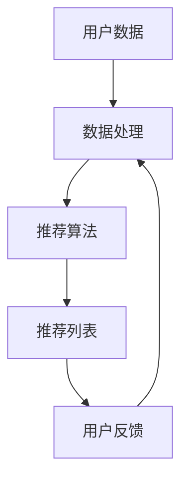
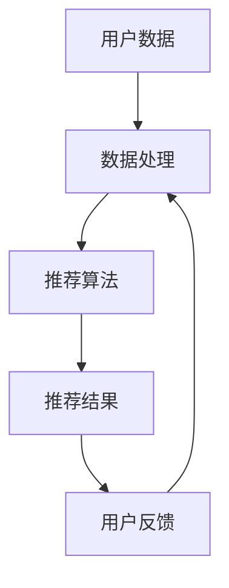

                 

# 《推荐系统中的大模型少样本学习应用》

## 关键词
推荐系统，大模型，少样本学习，深度学习，个性化推荐，冷启动问题，稀疏数据

## 摘要
本文将深入探讨推荐系统中的大模型少样本学习应用。首先，我们将介绍推荐系统的基本概念和架构，以及大模型在其中的角色和优势。接着，我们会详细阐述大模型的技术基础，包括其基本原理、数学基础和实现优化。然后，我们将探讨少样本学习算法的原理和常见方法，以及它们在推荐系统中的应用。特别地，我们将重点关注大模型在处理推荐系统中的冷启动问题和稀疏数据的能力。最后，我们将通过一个实际项目案例，展示大模型少样本学习在推荐系统中的具体应用和实践，并讨论其中的挑战与未来研究方向。

## 目录大纲

### 第一部分：推荐系统与大模型基础

#### 第1章：推荐系统概述
- 1.1 推荐系统的基本概念与架构
- 1.2 大模型在推荐系统中的角色
- 1.3 少样本学习在推荐系统中的重要性

#### 第2章：大模型技术基础
- 2.1 大模型的基本原理
- 2.2 大模型的数学基础
- 2.3 大模型的实现与优化

### 第二部分：少样本学习在推荐系统中的应用

#### 第3章：少样本学习算法原理
- 3.1 少样本学习算法的基本概念
- 3.2 少样本学习的常见方法
- 3.3 少样本学习的评估指标

#### 第4章：大模型在少样本推荐系统中的应用
- 4.1 大模型在少样本推荐系统中的优势
- 4.2 大模型在冷启动问题中的应用
- 4.3 大模型在稀疏数据推荐中的应用

#### 第5章：少样本学习在推荐系统中的项目实战
- 5.1 项目背景与目标
- 5.2 大模型训练与优化
- 5.3 少样本学习算法实现
- 5.4 推荐系统性能评估

#### 第6章：大模型少样本学习在推荐系统中的挑战与未来展望
- 6.1 挑战与限制
- 6.2 未来研究方向

#### 附录
- 附录A：大模型与少样本学习相关工具与资源
- 附录B：Mermaid流程图

---

### 第1章：推荐系统概述

#### 1.1 推荐系统的基本概念与架构

##### 1.1.1 推荐系统的基本概念

推荐系统是一种通过提供个性化内容来提高用户满意度和用户参与度的技术。它主要通过以下三个核心组件实现：

1. **用户**：推荐系统服务的对象，每个用户都有其特定的兴趣、偏好和需求。
2. **物品**：推荐系统中的内容，可以是商品、音乐、电影、新闻等，每个物品都有其独特的属性和特征。
3. **推荐算法**：根据用户的兴趣和物品的特性，推荐算法生成个性化的推荐列表。

推荐系统的目标是通过分析用户的行为和偏好，为每个用户推荐他们可能感兴趣的内容，从而提升用户的体验和满意度。

##### 1.1.2 推荐系统的类型与应用场景

推荐系统可以按照不同的标准进行分类，常见的分类方法如下：

1. **基于内容的推荐**：根据用户的历史行为和偏好，推荐与用户过去喜欢的内容相似的其他物品。适用于内容丰富的场景，如新闻网站、音乐流媒体平台。
2. **协同过滤推荐**：通过分析用户之间的相似性，预测用户对未知物品的偏好。分为基于用户的协同过滤（User-based Collaborative Filtering, UBCF）和基于物品的协同过滤（Item-based Collaborative Filtering, IBCF）两种。适用于电子商务、社交网络等领域。
3. **基于模型的推荐**：利用机器学习算法构建用户和物品之间的预测模型，进行个性化推荐。如基于矩阵分解、深度学习的推荐系统。

##### 1.1.3 大模型在推荐系统中的角色

大模型在推荐系统中的角色日益重要，原因如下：

1. **数据处理能力**：大模型能够处理大量的用户行为数据和物品特征数据，从而提供更加精准的推荐。
2. **泛化能力**：大模型通过对大规模数据的训练，能够更好地泛化到未见过的数据上，从而提高推荐系统的鲁棒性。
3. **特征自动提取**：大模型能够自动提取数据中的潜在特征，减少人工特征工程的工作量，提高系统的效率和效果。

#### 1.2 大模型在推荐系统中的角色

##### 1.2.1 大模型与传统推荐算法的比较

传统推荐算法主要包括基于内容的推荐和协同过滤推荐。这些算法在数据处理能力和推荐效果上存在以下局限性：

1. **数据处理能力有限**：传统推荐算法通常需要大量的先验知识和手动特征工程，难以处理大规模和高维数据。
2. **推荐效果不稳定**：传统推荐算法对数据稀疏性和噪声敏感，容易产生冷启动问题。
3. **无法自动提取潜在特征**：传统推荐算法依赖于手动提取的特征，难以发现数据中的潜在模式。

相比之下，大模型具有以下优势：

1. **强大的数据处理能力**：大模型能够自动处理大规模和高维数据，减少了手动特征工程的工作量。
2. **稳定的推荐效果**：大模型通过对大规模数据的训练，能够更好地泛化到未见过的数据上，从而提高推荐系统的鲁棒性。
3. **自动提取潜在特征**：大模型能够自动提取数据中的潜在特征，减少了手动特征工程的工作量，提高了系统的效率和效果。

##### 1.2.2 大模型在推荐系统中的应用

大模型在推荐系统中的应用主要包括以下几个方面：

1. **个性化推荐**：大模型能够根据用户的历史行为和偏好，为每个用户推荐他们可能感兴趣的内容。
2. **冷启动问题**：大模型能够通过自动提取潜在特征，解决新用户和新物品的推荐问题。
3. **稀疏数据推荐**：大模型能够通过矩阵分解等技术，处理数据稀疏性问题，提高推荐效果。

#### 1.3 少样本学习在推荐系统中的重要性

##### 1.3.1 少样本学习的基本概念

少样本学习是一种在数据量非常有限的情况下进行机器学习的方法。其基本概念如下：

1. **样本数量有限**：在少样本学习场景中，训练数据的数量远远小于通常情况下的需求。
2. **数据稀缺性**：由于数据稀缺，少样本学习面临数据不平衡和标签不均匀的问题。
3. **模型泛化能力**：少样本学习的目标是训练出能够泛化到未知数据的模型，避免过拟合。

##### 1.3.2 少样本学习在推荐系统中的应用

少样本学习在推荐系统中的应用主要体现在以下几个方面：

1. **新用户冷启动**：对于新用户，由于缺乏足够的历史行为数据，传统推荐算法效果不佳。少样本学习能够利用有限的用户行为数据，为新用户提供个性化的推荐。
2. **新物品推荐**：对于新物品，由于缺乏用户反馈，传统推荐算法难以生成有效的推荐。少样本学习能够通过其他相关物品的特征，为新物品生成推荐。
3. **稀疏数据推荐**：在数据稀疏的情况下，传统推荐算法效果较差。少样本学习能够通过利用少量有效的用户-物品交互数据，生成高质量的推荐列表。

#### 1.3.3 大模型在少样本学习中的应用优势

大模型在少样本学习中的应用具有以下优势：

1. **数据增强**：大模型能够通过数据增强技术，如生成对抗网络（GANs），生成更多的训练样本，提高模型的泛化能力。
2. **特征提取**：大模型能够自动提取数据中的潜在特征，减少人工特征工程的工作量，提高模型的效果。
3. **迁移学习**：大模型能够通过迁移学习技术，利用预训练模型的知识，解决少样本学习问题，提高模型的性能。

### 第2章：大模型技术基础

#### 2.1 大模型的基本原理

##### 2.1.1 大模型的定义与特点

大模型通常是指具有数十亿到数万亿参数的深度学习模型，其特点如下：

1. **参数数量巨大**：大模型具有数十亿到数万亿个参数，能够处理复杂的数据结构和模式。
2. **深层网络结构**：大模型通常包含数十到数百层的神经网络结构，能够捕捉数据中的深层特征。
3. **强大的数据处理能力**：大模型能够自动处理大规模和高维数据，减少人工特征工程的工作量。

##### 2.1.2 大模型的学习方法与架构

大模型的学习方法主要包括以下几种：

1. **预训练与微调**：预训练是指在大量未标注的数据上进行模型训练，然后使用少量标注数据进行微调，以适应特定的任务。这种方法能够提高模型在未见过的数据上的性能。
2. **自监督学习**：自监督学习是一种在无监督数据上进行学习的方法，通过利用数据中的结构信息，自动提取有用的特征。大模型在自监督学习中的应用，能够有效提高模型的泛化能力。
3. **迁移学习**：迁移学习是指将一个任务上训练好的模型的知识应用到另一个相关任务上。大模型在迁移学习中的应用，能够提高模型在少样本学习场景中的性能。

大模型的架构主要包括以下几种：

1. **Transformer架构**：Transformer架构是一种基于注意力机制的深度学习模型，适用于处理序列数据。其核心思想是通过多头注意力机制，模型能够自动学习不同位置之间的依赖关系。
2. **BERT模型**：BERT（Bidirectional Encoder Representations from Transformers）是一种基于Transformer架构的双向编码器，能够同时捕捉上下文信息，适用于自然语言处理任务。
3. **GPT模型**：GPT（Generative Pre-trained Transformer）是一种基于Transformer架构的生成模型，能够生成符合上下文信息的文本。

#### 2.2 大模型的数学基础

##### 2.2.1 神经网络与深度学习的基础知识

神经网络是一种模拟生物神经系统的计算模型，其基本组成单元是神经元。深度学习是指使用多层的神经网络进行模型训练和预测的方法。其基本原理如下：

1. **神经元**：神经元是神经网络的基本组成单元，通过加权求和和激活函数，将输入映射到输出。
2. **前向传播**：前向传播是指将输入数据通过神经网络的各个层，逐层计算输出。
3. **反向传播**：反向传播是指通过计算输出与实际值之间的误差，反向更新网络中的权重和偏置。

##### 2.2.2 矩阵计算与优化算法

大模型在进行训练和预测过程中，涉及大量的矩阵计算和优化算法。以下是一些常用的矩阵计算和优化算法：

1. **矩阵乘法**：矩阵乘法是深度学习中最基本的运算之一，用于计算特征表示和预测值。
2. **矩阵求导**：矩阵求导是优化算法中的重要步骤，用于计算损失函数关于模型参数的梯度。
3. **梯度下降**：梯度下降是一种常用的优化算法，通过不断更新模型参数，使得损失函数最小化。
4. **Adam优化器**：Adam优化器是一种基于梯度下降的优化算法，通过利用历史梯度信息，提高收敛速度和稳定性。

#### 2.3 大模型的实现与优化

##### 2.3.1 大模型的训练过程

大模型的训练过程主要包括以下步骤：

1. **数据预处理**：对输入数据进行预处理，包括数据清洗、归一化、数据增强等。
2. **模型初始化**：初始化模型参数，常用的初始化方法包括随机初始化、高斯初始化等。
3. **前向传播**：将输入数据通过模型进行前向传播，得到预测值。
4. **损失函数计算**：计算预测值与实际值之间的误差，使用损失函数表示。
5. **反向传播**：通过计算损失函数关于模型参数的梯度，进行反向传播。
6. **参数更新**：利用优化算法，更新模型参数，使得损失函数最小化。

##### 2.3.2 大模型的优化策略

大模型的优化策略主要包括以下几种：

1. **学习率调整**：学习率是优化算法中的重要参数，用于控制参数更新的步长。常用的学习率调整方法包括学习率衰减、恒定学习率等。
2. **正则化**：正则化是一种用于防止模型过拟合的方法，常用的正则化方法包括L1正则化、L2正则化等。
3. **批量归一化**：批量归一化是一种用于加速模型训练的方法，通过将每层神经网络的输入进行归一化处理，减少梯度消失和梯度爆炸的问题。
4. **数据增强**：数据增强是一种用于增加模型训练数据的方法，通过生成虚拟数据，提高模型的泛化能力。

### 第3章：少样本学习算法原理

#### 3.1 少样本学习算法的基本概念

##### 3.1.1 少样本学习的问题背景

少样本学习是指在有有限训练样本的情况下进行模型训练和预测的方法。其问题背景如下：

1. **数据稀缺性**：在某些应用场景中，获取大量标注数据非常困难，导致训练数据量非常有限。
2. **标签不均匀**：在训练数据中，不同类别的样本数量可能非常不平衡，导致模型难以泛化到未见过的数据。
3. **数据分布变化**：在实际应用中，数据分布可能会发生变化，导致模型在新的数据分布上表现不佳。

##### 3.1.2 少样本学习的目标与挑战

少样本学习的目标是在数据稀缺的情况下，训练出能够泛化到未知数据的模型。其主要挑战如下：

1. **模型泛化能力**：由于训练数据有限，模型容易过拟合，难以泛化到未知数据。
2. **数据不平衡**：在训练数据中，不同类别的样本数量可能不平衡，导致模型对某些类别的识别效果较差。
3. **模型可解释性**：在少样本学习场景中，模型通常更加复杂，难以解释其预测结果。

##### 3.1.3 少样本学习的应用场景

少样本学习在以下应用场景中具有重要作用：

1. **新用户推荐**：在新用户缺乏足够行为数据的情况下，少样本学习能够利用少量数据为用户推荐个性化内容。
2. **新物品推荐**：在新物品缺乏用户反馈的情况下，少样本学习能够利用其他相关物品的特征，为新物品生成推荐。
3. **稀疏数据分类**：在数据稀疏的情况下，少样本学习能够通过利用有限的用户-物品交互数据，提高分类效果。

#### 3.2 少样本学习的常见方法

##### 3.2.1 自监督学习

自监督学习是一种在无监督数据上进行学习的方法，通过利用数据中的结构信息，自动提取有用的特征。其基本原理如下：

1. **数据预处理**：对输入数据进行预处理，提取特征表示。
2. **预测任务**：利用特征表示，预测数据中的某些部分，如单词、句子或图像。
3. **损失函数**：计算预测值与实际值之间的误差，使用损失函数表示。
4. **模型优化**：通过反向传播，更新模型参数，使得损失函数最小化。

自监督学习在少样本学习中的应用包括：

1. **特征提取**：通过预训练大模型，提取数据中的潜在特征，用于后续的分类或回归任务。
2. **数据增强**：通过生成虚拟数据，增加训练数据的多样性，提高模型的泛化能力。

##### 3.2.2 对抗性学习

对抗性学习是一种在生成模型和判别模型之间进行对抗训练的方法，通过生成真实数据和虚假数据，提高模型的判别能力。其基本原理如下：

1. **生成模型**：通过学习数据分布，生成与真实数据相似的数据。
2. **判别模型**：通过学习真实数据和虚假数据的特征，区分真实数据和虚假数据。
3. **对抗训练**：通过对抗训练，不断优化生成模型和判别模型，提高模型的判别能力。

对抗性学习在少样本学习中的应用包括：

1. **数据增强**：通过生成虚假数据，增加训练数据的多样性，提高模型的泛化能力。
2. **特征提取**：通过生成模型和判别模型，提取数据中的潜在特征，用于后续的分类或回归任务。

##### 3.2.3 迁移学习

迁移学习是一种将一个任务上训练好的模型的知识应用到另一个相关任务上的方法。其基本原理如下：

1. **源任务**：在一个任务上训练出模型，提取有用的特征表示。
2. **目标任务**：在一个相关的任务上，使用源任务的模型，进行模型训练和预测。
3. **模型优化**：通过模型优化，使得目标任务的模型能够更好地适应目标任务。

迁移学习在少样本学习中的应用包括：

1. **特征迁移**：将源任务的模型知识迁移到目标任务上，提取有用的特征表示。
2. **模型迁移**：直接使用源任务的模型，在目标任务上进行模型训练和预测。

#### 3.3 少样本学习的评估指标

##### 3.3.1 准确性、召回率、F1值等指标

准确性、召回率、F1值等指标是评估分类模型性能的重要指标，其定义如下：

1. **准确性**：正确预测的样本数与总样本数之比。
   $$\text{准确性} = \frac{\text{正确预测的样本数}}{\text{总样本数}}$$

2. **召回率**：正确预测的样本数与实际为正类的样本数之比。
   $$\text{召回率} = \frac{\text{正确预测的样本数}}{\text{实际为正类的样本数}}$$

3. **F1值**：准确性和召回率的调和平均值。
   $$\text{F1值} = 2 \times \frac{\text{准确性} \times \text{召回率}}{\text{准确性} + \text{召回率}}$$

##### 3.3.2 特征重要性与模型解释性

特征重要性和模型解释性是评估少样本学习模型的重要指标，其定义如下：

1. **特征重要性**：特征对模型预测结果的影响程度，通常使用特征贡献度表示。
   $$\text{特征重要性} = \frac{\text{特征贡献度}}{\sum_{i=1}^{n} \text{特征贡献度}}$$

2. **模型解释性**：模型对预测结果的解释能力，通常使用模型的可解释性指标表示。
   $$\text{模型解释性} = \frac{\text{可解释的预测结果}}{\text{总预测结果}}$$

### 第4章：大模型在少样本推荐系统中的应用

#### 4.1 大模型在少样本推荐系统中的优势

##### 4.1.1 大模型在处理少样本数据时的优势

大模型在处理少样本数据时具有以下优势：

1. **强大的数据处理能力**：大模型能够自动处理大规模和高维数据，减少了手动特征工程的工作量，提高了模型的效果。
2. **数据增强能力**：大模型能够通过数据增强技术，如生成对抗网络（GANs），生成更多的训练样本，提高模型的泛化能力。
3. **特征自动提取能力**：大模型能够自动提取数据中的潜在特征，减少了手动特征工程的工作量，提高了模型的效率和效果。

##### 4.1.2 大模型在少样本推荐系统中的实现策略

大模型在少样本推荐系统中的实现策略主要包括以下几个方面：

1. **预训练与微调**：大模型通常使用预训练技术，在大量未标注的数据上进行模型训练，然后使用少量标注数据进行微调，以适应特定的推荐任务。
2. **迁移学习**：大模型通过迁移学习技术，将预训练模型的知识应用到少样本推荐任务上，提高模型的性能。
3. **数据增强**：大模型通过数据增强技术，生成更多的虚拟数据，增加训练数据的多样性，提高模型的泛化能力。

#### 4.2 大模型在冷启动问题中的应用

##### 4.2.1 用户冷启动与物品冷启动

用户冷启动和物品冷启动是推荐系统中的常见问题，其定义如下：

1. **用户冷启动**：指新用户由于缺乏足够的历史行为数据，推荐系统难以为其生成有效的推荐。
2. **物品冷启动**：指新物品由于缺乏用户反馈，推荐系统难以生成有效的推荐。

##### 4.2.2 大模型在冷启动问题中的解决方案

大模型在冷启动问题中的解决方案主要包括以下几个方面：

1. **用户画像**：通过用户的基本信息、历史行为数据等，构建用户画像，为用户生成初始推荐。
2. **协同过滤**：使用协同过滤算法，根据用户的相似性，为新用户推荐与其相似的其他用户的偏好。
3. **内容推荐**：通过分析新物品的属性和特征，生成基于内容的新物品推荐。

#### 4.3 大模型在稀疏数据推荐中的应用

##### 4.3.1 稀疏数据的问题与挑战

稀疏数据是指数据集中大多数元素为零的数据，常见于推荐系统和图像识别等领域。稀疏数据的问题和挑战主要包括：

1. **数据稀疏性**：由于数据集中大多数元素为零，传统算法难以从中提取有效的特征。
2. **计算效率**：稀疏数据的处理通常需要大量的计算资源，导致模型训练和预测的效率较低。
3. **模型泛化能力**：稀疏数据可能缺乏代表性，导致模型在未见过的数据上表现不佳。

##### 4.3.2 大模型在稀疏数据推荐中的实现

大模型在稀疏数据推荐中的实现主要包括以下几个方面：

1. **矩阵分解**：大模型通过矩阵分解技术，将稀疏数据分解为低维矩阵，提取潜在的特征表示。
2. **生成对抗网络（GANs）**：大模型通过生成对抗网络，生成与稀疏数据相似的数据，增加训练数据的多样性。
3. **迁移学习**：大模型通过迁移学习技术，利用预训练模型的知识，提高稀疏数据推荐的效果。

### 第5章：少样本学习在推荐系统中的项目实战

#### 5.1 项目背景与目标

##### 5.1.1 项目概述与目标

本项目的目标是构建一个基于少样本学习技术的推荐系统，为新用户和新物品生成有效的推荐。具体目标如下：

1. **新用户推荐**：为新用户生成个性化的推荐列表，提高用户满意度和参与度。
2. **新物品推荐**：为新物品生成有效的推荐列表，提高物品曝光率和销售量。

##### 5.1.2 数据集描述与预处理

本项目使用的数据集是一个包含用户、物品和交互记录的稀疏数据集。数据集的预处理步骤包括：

1. **数据清洗**：去除重复数据和缺失值，确保数据的质量。
2. **数据归一化**：对数值型特征进行归一化处理，使其在相同的尺度上。
3. **数据增强**：通过生成对抗网络（GANs）生成虚拟数据，增加训练数据的多样性。

#### 5.2 大模型训练与优化

##### 5.2.1 大模型的架构设计

本项目使用的大模型架构是基于Transformer的BERT模型，其核心组成部分如下：

1. **嵌入层**：将输入的单词或用户-物品对转换为固定长度的向量表示。
2. **Transformer层**：通过多头注意力机制和前向网络，对输入进行编码，提取潜在特征。
3. **输出层**：将编码后的特征映射到预测结果，如用户-物品的偏好得分。

##### 5.2.2 大模型的训练与调参

大模型的训练与调参步骤如下：

1. **预训练**：在大量未标注的数据上进行预训练，提取通用特征表示。
2. **微调**：在少量标注数据上进行微调，使其适应特定的推荐任务。
3. **调参**：通过调整学习率、批量大小等超参数，优化模型性能。

#### 5.3 少样本学习算法实现

##### 5.3.1 自监督学习与对抗性学习

本项目采用自监督学习和对抗性学习技术，提高模型在少样本数据上的性能。具体实现步骤如下：

1. **自监督学习**：通过预训练技术，提取通用特征表示。
2. **对抗性学习**：通过生成对抗网络，生成虚拟数据，增加训练数据的多样性。
3. **模型优化**：通过反向传播，优化模型参数，提高模型性能。

##### 5.3.2 迁移学习与微调技术

本项目采用迁移学习技术，将预训练模型的知识应用到推荐任务上。具体实现步骤如下：

1. **特征提取**：使用预训练模型提取用户和物品的特征表示。
2. **模型微调**：在少量标注数据上进行微调，使其适应特定的推荐任务。
3. **性能评估**：评估模型在新用户和新物品推荐任务上的性能。

#### 5.4 推荐系统性能评估

##### 5.4.1 模型性能评估方法

本项目的模型性能评估方法包括准确性、召回率、F1值等指标，具体计算方法如下：

1. **准确性**：计算预测正确的用户-物品对与总用户-物品对的比例。
2. **召回率**：计算预测正确的用户-物品对与实际为正类的用户-物品对的比例。
3. **F1值**：计算准确性和召回率的调和平均值。

##### 5.4.2 实验结果分析与优化

本项目的实验结果分析主要包括以下几个方面：

1. **模型性能分析**：比较不同模型在新用户和新物品推荐任务上的性能，评估模型的泛化能力。
2. **参数调优**：通过调整模型参数，优化模型性能。
3. **数据增强**：通过生成对抗网络，增加训练数据的多样性，提高模型性能。

### 第6章：大模型少样本学习在推荐系统中的挑战与未来展望

#### 6.1 挑战与限制

##### 6.1.1 数据稀缺性与数据不平衡

数据稀缺性和数据不平衡是少样本学习在推荐系统中面临的主要挑战，具体表现如下：

1. **数据稀缺性**：推荐系统通常需要大量的用户行为数据和物品特征数据，但在实际应用中，获取这些数据非常困难，导致训练数据量有限。
2. **数据不平衡**：在训练数据中，不同类别的样本数量可能非常不平衡，导致模型对某些类别的识别效果较差。

##### 6.1.2 模型可解释性与透明度

模型可解释性与透明度是少样本学习在推荐系统中面临的另一个重要挑战：

1. **模型可解释性**：少样本学习模型通常更加复杂，难以解释其预测结果，增加了用户对模型的不信任。
2. **模型透明度**：为了提高模型的可解释性，需要增加对模型内部结构和参数的透明度，但这可能导致模型性能的下降。

##### 6.1.3 模型泛化能力与过拟合

在少样本学习场景中，模型容易过拟合，难以泛化到未知数据：

1. **模型泛化能力**：少样本学习模型的训练数据有限，可能导致模型对未见过的数据表现不佳。
2. **过拟合**：由于训练数据有限，模型可能过度拟合训练数据，导致在未知数据上的性能下降。

#### 6.2 未来研究方向

##### 6.2.1 大模型在少样本学习中的优化策略

为了提高大模型在少样本学习中的性能，未来研究方向包括：

1. **数据增强**：通过生成对抗网络等技术，增加训练数据的多样性，提高模型泛化能力。
2. **迁移学习**：通过利用预训练模型的知识，提高模型在少样本数据上的性能。
3. **模型压缩**：通过模型压缩技术，减少模型参数数量，提高模型的可解释性和计算效率。

##### 6.2.2 少样本学习算法的创新与应用

未来少样本学习算法的创新与应用包括：

1. **新型模型架构**：研究新型模型架构，如图神经网络、变分自编码器等，提高少样本学习性能。
2. **多任务学习**：通过多任务学习，同时学习多个相关任务，提高模型泛化能力。
3. **自适应数据增强**：研究自适应数据增强技术，根据模型训练过程中出现的错误，动态调整数据增强策略。

### 附录A：大模型与少样本学习相关工具与资源

#### A.1 通用深度学习框架

##### A.1.1 TensorFlow

TensorFlow是一种开源的深度学习框架，由Google开发。其基本使用方法如下：

1. **安装与配置**：在Python环境中安装TensorFlow，并配置好GPU或CPU环境。
2. **模型构建**：使用TensorFlow的API，构建深度学习模型，包括输入层、隐藏层和输出层。
3. **模型训练**：使用训练数据，通过反向传播算法，训练深度学习模型。

##### A.1.2 PyTorch

PyTorch是一种开源的深度学习框架，由Facebook开发。其基本使用方法如下：

1. **安装与配置**：在Python环境中安装PyTorch，并配置好GPU或CPU环境。
2. **模型构建**：使用PyTorch的API，构建深度学习模型，包括输入层、隐藏层和输出层。
3. **模型训练**：使用训练数据，通过反向传播算法，训练深度学习模型。

#### A.2 少样本学习相关库与工具

##### A.2.1 AI Challenger

AI Challenger是一个开源的少样本学习库，提供多种少样本学习算法的实现和评估。其功能如下：

1. **算法实现**：提供多种少样本学习算法的实现，包括自监督学习、对抗性学习和迁移学习等。
2. **算法评估**：提供算法评估工具，评估少样本学习算法的性能。

##### A.2.2 PyLDAvis

PyLDAvis是一个开源的少样本学习可视化工具，用于可视化少样本学习模型的特征表示。其功能如下：

1. **特征可视化**：将少样本学习模型的特征表示可视化，帮助理解模型提取的特征。
2. **交互式可视化**：提供交互式的可视化界面，用户可以实时调整参数，查看特征变化。

#### A.3 推荐系统与数据集资源

##### A.3.1 Netflix Prize

Netflix Prize是一个著名的推荐系统竞赛，提供大量的电影评分数据集。其数据集如下：

1. **用户-电影评分数据集**：包含用户对电影的评分数据，用于训练和评估推荐系统模型。
2. **电影特征数据集**：包含电影的属性和特征数据，用于特征提取和模型训练。

##### A.3.2 Movielens

Movielens是一个开源的电影推荐系统数据集，提供多种类型的用户-电影交互数据。其数据集如下：

1. **用户-电影评分数据集**：包含用户对电影的评分数据，用于训练和评估推荐系统模型。
2. **电影特征数据集**：包含电影的属性和特征数据，用于特征提取和模型训练。

#### A.4 相关论文与书籍推荐

##### A.4.1 《深度学习》

《深度学习》是一本经典的深度学习教材，全面介绍了深度学习的基本概念、技术原理和实现方法。其内容包括：

1. **深度学习基础**：介绍神经网络、深度学习模型、反向传播算法等基础知识。
2. **深度学习应用**：介绍深度学习在计算机视觉、自然语言处理、推荐系统等领域的应用。

##### A.4.2 《推荐系统实践》

《推荐系统实践》是一本介绍推荐系统实践的书，详细介绍了推荐系统的基本原理、技术实现和案例分析。其内容包括：

1. **推荐系统基础**：介绍推荐系统的基本概念、架构和技术原理。
2. **推荐系统实现**：介绍基于协同过滤、基于内容的推荐系统和基于模型的推荐系统的实现方法。
3. **推荐系统案例分析**：介绍实际应用中的推荐系统案例，分析其优势和不足。 

### Mermaid 流程图

```mermaid
graph TD
A[推荐系统] --> B{大模型技术基础}
B -->|少样本学习| C[少样本学习算法原理}
C --> D[大模型应用}
D --> E[项目实战}
E --> F[性能评估与优化}
F -->|挑战与展望| G[未来方向}
G --> H[工具与资源]
```

---

### 第1章：推荐系统概述

#### 1.1 推荐系统的基本概念与架构

##### 1.1.1 推荐系统的基本概念

推荐系统是一种通过提供个性化内容来提高用户满意度和用户参与度的技术。它主要通过以下三个核心组件实现：

1. **用户**：推荐系统服务的对象，每个用户都有其特定的兴趣、偏好和需求。
2. **物品**：推荐系统中的内容，可以是商品、音乐、电影、新闻等，每个物品都有其独特的属性和特征。
3. **推荐算法**：根据用户的兴趣和物品的特性，推荐算法生成个性化的推荐列表。

推荐系统的目标是通过分析用户的行为和偏好，为每个用户推荐他们可能感兴趣的内容，从而提升用户的体验和满意度。

##### 1.1.2 推荐系统的架构

推荐系统的架构通常包括以下几个核心部分：

1. **数据采集与处理**：从各种来源（如用户行为、社交媒体、商品数据库等）收集数据，并进行数据清洗、预处理和特征提取。
2. **推荐算法**：基于用户数据和物品特征，推荐算法生成推荐列表。常见的推荐算法包括基于内容的推荐、协同过滤推荐和基于模型的推荐。
3. **推荐列表生成**：根据推荐算法的输出，生成最终的推荐列表，并将其展示给用户。
4. **评价与反馈**：收集用户对推荐列表的反馈，用于评估推荐系统的性能和优化算法。

以下是一个简化的推荐系统架构图：



#### 1.2 大模型在推荐系统中的角色

##### 1.2.1 大模型与传统推荐算法的比较

传统推荐算法主要包括基于内容的推荐和协同过滤推荐。这些算法在数据处理能力和推荐效果上存在以下局限性：

1. **数据处理能力有限**：传统推荐算法通常需要大量的先验知识和手动特征工程，难以处理大规模和高维数据。
2. **推荐效果不稳定**：传统推荐算法对数据稀疏性和噪声敏感，容易产生冷启动问题。
3. **无法自动提取潜在特征**：传统推荐算法依赖于手动提取的特征，难以发现数据中的潜在模式。

相比之下，大模型具有以下优势：

1. **强大的数据处理能力**：大模型能够处理大量的用户行为数据和物品特征数据，从而提供更加精准的推荐。
2. **泛化能力**：大模型通过对大规模数据的训练，能够更好地泛化到未知数据上，从而提高推荐系统的鲁棒性。
3. **自动提取潜在特征**：大模型能够自动提取数据中的潜在特征，减少人工特征工程的工作量，提高系统的效率和效果。

##### 1.2.2 大模型在推荐系统中的应用

大模型在推荐系统中的应用主要包括以下几个方面：

1. **个性化推荐**：大模型能够根据用户的历史行为和偏好，为每个用户推荐他们可能感兴趣的内容。
2. **冷启动问题**：大模型能够通过自动提取潜在特征，解决新用户和新物品的推荐问题。
3. **稀疏数据推荐**：大模型能够通过矩阵分解等技术，处理数据稀疏性问题，提高推荐效果。

#### 1.3 少样本学习在推荐系统中的重要性

##### 1.3.1 少样本学习的基本概念

少样本学习是一种在数据量非常有限的情况下进行机器学习的方法。其基本概念如下：

1. **样本数量有限**：在少样本学习场景中，训练数据的数量远远小于通常情况下的需求。
2. **数据稀缺性**：由于数据稀缺，少样本学习面临数据不平衡和标签不均匀的问题。
3. **模型泛化能力**：少样本学习的目标是训练出能够泛化到未知数据的模型，避免过拟合。

##### 1.3.2 少样本学习在推荐系统中的应用

少样本学习在推荐系统中的应用主要体现在以下几个方面：

1. **新用户冷启动**：对于新用户，由于缺乏足够的历史行为数据，传统推荐算法效果不佳。少样本学习能够利用有限的用户行为数据，为新用户提供个性化的推荐。
2. **新物品推荐**：对于新物品，由于缺乏用户反馈，传统推荐算法难以生成有效的推荐。少样本学习能够通过其他相关物品的特征，为新物品生成推荐。
3. **稀疏数据推荐**：在数据稀疏的情况下，传统推荐算法效果较差。少样本学习能够通过利用少量有效的用户-物品交互数据，生成高质量的推荐列表。

##### 1.3.3 大模型在少样本学习中的应用优势

大模型在少样本学习中的应用具有以下优势：

1. **数据增强**：大模型能够通过数据增强技术，如生成对抗网络（GANs），生成更多的训练样本，提高模型的泛化能力。
2. **特征提取**：大模型能够自动提取数据中的潜在特征，减少人工特征工程的工作量，提高模型的效果。
3. **迁移学习**：大模型能够通过迁移学习技术，利用预训练模型的知识，解决少样本学习问题，提高模型的性能。

### 第2章：大模型技术基础

#### 2.1 大模型的基本原理

##### 2.1.1 大模型的定义与特点

大模型通常是指具有数十亿到数万亿参数的深度学习模型，其特点如下：

1. **参数数量巨大**：大模型具有数十亿到数万亿个参数，能够处理复杂的数据结构和模式。
2. **深层网络结构**：大模型通常包含数十到数百层的神经网络结构，能够捕捉数据中的深层特征。
3. **强大的数据处理能力**：大模型能够自动处理大规模和高维数据，减少人工特征工程的工作量。

##### 2.1.2 大模型的学习方法与架构

大模型的学习方法主要包括以下几种：

1. **预训练与微调**：预训练是指在大量未标注的数据上进行模型训练，然后使用少量标注数据进行微调，以适应特定的任务。这种方法能够提高模型在未见过的数据上的性能。
2. **自监督学习**：自监督学习是一种在无监督数据上进行学习的方法，通过利用数据中的结构信息，自动提取有用的特征。大模型在自监督学习中的应用，能够有效提高模型的泛化能力。
3. **迁移学习**：迁移学习是指将一个任务上训练好的模型的知识应用到另一个相关任务上。大模型在迁移学习中的应用，能够提高模型在少样本学习场景中的性能。

大模型的架构主要包括以下几种：

1. **Transformer架构**：Transformer架构是一种基于注意力机制的深度学习模型，适用于处理序列数据。其核心思想是通过多头注意力机制，模型能够自动学习不同位置之间的依赖关系。
2. **BERT模型**：BERT（Bidirectional Encoder Representations from Transformers）是一种基于Transformer架构的双向编码器，能够同时捕捉上下文信息，适用于自然语言处理任务。
3. **GPT模型**：GPT（Generative Pre-trained Transformer）是一种基于Transformer架构的生成模型，能够生成符合上下文信息的文本。

#### 2.2 大模型的数学基础

##### 2.2.1 神经网络与深度学习的基础知识

神经网络是一种模拟生物神经系统的计算模型，其基本组成单元是神经元。深度学习是指使用多层的神经网络进行模型训练和预测的方法。其基本原理如下：

1. **神经元**：神经元是神经网络的基本组成单元，通过加权求和和激活函数，将输入映射到输出。
2. **前向传播**：前向传播是指将输入数据通过神经网络的各个层，逐层计算输出。
3. **反向传播**：反向传播是指通过计算输出与实际值之间的误差，反向更新网络中的权重和偏置。

##### 2.2.2 矩阵计算与优化算法

大模型在进行训练和预测过程中，涉及大量的矩阵计算和优化算法。以下是一些常用的矩阵计算和优化算法：

1. **矩阵乘法**：矩阵乘法是深度学习中最基本的运算之一，用于计算特征表示和预测值。
2. **矩阵求导**：矩阵求导是优化算法中的重要步骤，用于计算损失函数关于模型参数的梯度。
3. **梯度下降**：梯度下降是一种常用的优化算法，通过不断更新模型参数，使得损失函数最小化。
4. **Adam优化器**：Adam优化器是一种基于梯度下降的优化算法，通过利用历史梯度信息，提高收敛速度和稳定性。

#### 2.3 大模型的实现与优化

##### 2.3.1 大模型的训练过程

大模型的训练过程主要包括以下步骤：

1. **数据预处理**：对输入数据进行预处理，包括数据清洗、归一化、数据增强等。
2. **模型初始化**：初始化模型参数，常用的初始化方法包括随机初始化、高斯初始化等。
3. **前向传播**：将输入数据通过模型进行前向传播，得到预测值。
4. **损失函数计算**：计算预测值与实际值之间的误差，使用损失函数表示。
5. **反向传播**：通过计算损失函数关于模型参数的梯度，进行反向传播。
6. **参数更新**：利用优化算法，更新模型参数，使得损失函数最小化。

##### 2.3.2 大模型的优化策略

大模型的优化策略主要包括以下几种：

1. **学习率调整**：学习率是优化算法中的重要参数，用于控制参数更新的步长。常用的学习率调整方法包括学习率衰减、恒定学习率等。
2. **正则化**：正则化是一种用于防止模型过拟合的方法，常用的正则化方法包括L1正则化、L2正则化等。
3. **批量归一化**：批量归一化是一种用于加速模型训练的方法，通过将每层神经网络的输入进行归一化处理，减少梯度消失和梯度爆炸的问题。
4. **数据增强**：数据增强是一种用于增加模型训练数据的方法，通过生成虚拟数据，增加训练数据的多样性，提高模型的泛化能力。

### 第3章：少样本学习算法原理

#### 3.1 少样本学习算法的基本概念

##### 3.1.1 少样本学习的问题背景

少样本学习是一种在数据量非常有限的情况下进行机器学习的方法。其问题背景如下：

1. **数据稀缺性**：在某些应用场景中，获取大量标注数据非常困难，导致训练数据量非常有限。
2. **数据不平衡**：在训练数据中，不同类别的样本数量可能非常不平衡，导致模型难以泛化到未知数据。
3. **数据分布变化**：在实际应用中，数据分布可能会发生变化，导致模型在新的数据分布上表现不佳。

##### 3.1.2 少样本学习的目标与挑战

少样本学习的目标是在数据稀缺的情况下，训练出能够泛化到未知数据的模型。其主要挑战如下：

1. **模型泛化能力**：由于训练数据有限，模型容易过拟合，难以泛化到未知数据。
2. **数据不平衡**：在训练数据中，不同类别的样本数量可能不平衡，导致模型对某些类别的识别效果较差。
3. **模型可解释性**：在少样本学习场景中，模型通常更加复杂，难以解释其预测结果。

##### 3.1.3 少样本学习的应用场景

少样本学习在以下应用场景中具有重要作用：

1. **新用户推荐**：在新用户缺乏足够行为数据的情况下，少样本学习能够利用少量数据为用户推荐个性化内容。
2. **新物品推荐**：在新物品缺乏用户反馈的情况下，少样本学习能够利用其他相关物品的特征，为新物品生成推荐。
3. **稀疏数据分类**：在数据稀疏的情况下，少样本学习能够通过利用有限的用户-物品交互数据，提高分类效果。

#### 3.2 少样本学习的常见方法

##### 3.2.1 自监督学习

自监督学习是一种在无监督数据上进行学习的方法，通过利用数据中的结构信息，自动提取有用的特征。其基本原理如下：

1. **数据预处理**：对输入数据进行预处理，提取特征表示。
2. **预测任务**：利用特征表示，预测数据中的某些部分，如单词、句子或图像。
3. **损失函数**：计算预测值与实际值之间的误差，使用损失函数表示。
4. **模型优化**：通过反向传播，更新模型参数，使得损失函数最小化。

自监督学习在少样本学习中的应用包括：

1. **特征提取**：通过预训练大模型，提取数据中的潜在特征，用于后续的分类或回归任务。
2. **数据增强**：通过生成虚拟数据，增加训练数据的多样性，提高模型的泛化能力。

##### 3.2.2 对抗性学习

对抗性学习是一种在生成模型和判别模型之间进行对抗训练的方法，通过生成真实数据和虚假数据，提高模型的判别能力。其基本原理如下：

1. **生成模型**：通过学习数据分布，生成与真实数据相似的数据。
2. **判别模型**：通过学习真实数据和虚假数据的特征，区分真实数据和虚假数据。
3. **对抗训练**：通过对抗训练，不断优化生成模型和判别模型，提高模型的判别能力。

对抗性学习在少样本学习中的应用包括：

1. **数据增强**：通过生成虚假数据，增加训练数据的多样性，提高模型的泛化能力。
2. **特征提取**：通过生成模型和判别模型，提取数据中的潜在特征，用于后续的分类或回归任务。

##### 3.2.3 迁移学习

迁移学习是一种将一个任务上训练好的模型的知识应用到另一个相关任务上的方法。其基本原理如下：

1. **源任务**：在一个任务上训练出模型，提取有用的特征表示。
2. **目标任务**：在一个相关的任务上，使用源任务的模型，进行模型训练和预测。
3. **模型优化**：通过模型优化，使得目标任务的模型能够更好地适应目标任务。

迁移学习在少样本学习中的应用包括：

1. **特征迁移**：将源任务的模型知识迁移到目标任务上，提取有用的特征表示。
2. **模型迁移**：直接使用源任务的模型，在目标任务上进行模型训练和预测。

#### 3.3 少样本学习的评估指标

##### 3.3.1 准确性、召回率、F1值等指标

准确性、召回率、F1值等指标是评估分类模型性能的重要指标，其定义如下：

1. **准确性**：正确预测的样本数与总样本数之比。
   $$\text{准确性} = \frac{\text{正确预测的样本数}}{\text{总样本数}}$$

2. **召回率**：正确预测的样本数与实际为正类的样本数之比。
   $$\text{召回率} = \frac{\text{正确预测的样本数}}{\text{实际为正类的样本数}}$$

3. **F1值**：准确性和召回率的调和平均值。
   $$\text{F1值} = 2 \times \frac{\text{准确性} \times \text{召回率}}{\text{准确性} + \text{召回率}}$$

##### 3.3.2 特征重要性与模型解释性

特征重要性和模型解释性是评估少样本学习模型的重要指标，其定义如下：

1. **特征重要性**：特征对模型预测结果的影响程度，通常使用特征贡献度表示。
   $$\text{特征重要性} = \frac{\text{特征贡献度}}{\sum_{i=1}^{n} \text{特征贡献度}}$$

2. **模型解释性**：模型对预测结果的解释能力，通常使用模型的可解释性指标表示。
   $$\text{模型解释性} = \frac{\text{可解释的预测结果}}{\text{总预测结果}}$$

### 第4章：大模型在少样本推荐系统中的应用

#### 4.1 大模型在少样本推荐系统中的优势

##### 4.1.1 大模型在处理少样本数据时的优势

大模型在处理少样本数据时具有以下优势：

1. **强大的数据处理能力**：大模型能够自动处理大规模和高维数据，减少了手动特征工程的工作量，提高了模型的效果。
2. **数据增强能力**：大模型能够通过数据增强技术，如生成对抗网络（GANs），生成更多的训练样本，提高模型的泛化能力。
3. **特征自动提取能力**：大模型能够自动提取数据中的潜在特征，减少了手动特征工程的工作量，提高了模型的效率和效果。

##### 4.1.2 大模型在少样本推荐系统中的实现策略

大模型在少样本推荐系统中的实现策略主要包括以下几个方面：

1. **预训练与微调**：大模型通常使用预训练技术，在大量未标注的数据上进行模型训练，然后使用少量标注数据进行微调，以适应特定的推荐任务。
2. **迁移学习**：大模型通过迁移学习技术，将预训练模型的知识应用到少样本推荐任务上，提高模型的性能。
3. **数据增强**：大模型通过数据增强技术，生成更多的虚拟数据，增加训练数据的多样性，提高模型的泛化能力。

#### 4.2 大模型在冷启动问题中的应用

##### 4.2.1 用户冷启动与物品冷启动

用户冷启动和物品冷启动是推荐系统中的常见问题，其定义如下：

1. **用户冷启动**：指新用户由于缺乏足够的历史行为数据，推荐系统难以为其生成有效的推荐。
2. **物品冷启动**：指新物品由于缺乏用户反馈，推荐系统难以生成有效的推荐。

##### 4.2.2 大模型在冷启动问题中的解决方案

大模型在冷启动问题中的解决方案主要包括以下几个方面：

1. **用户画像**：通过用户的基本信息、历史行为数据等，构建用户画像，为用户生成初始推荐。
2. **协同过滤**：使用协同过滤算法，根据用户的相似性，为新用户推荐与其相似的其他用户的偏好。
3. **内容推荐**：通过分析新物品的属性和特征，生成基于内容的新物品推荐。

#### 4.3 大模型在稀疏数据推荐中的应用

##### 4.3.1 稀疏数据的问题与挑战

稀疏数据是指数据集中大多数元素为零的数据，常见于推荐系统和图像识别等领域。稀疏数据的问题和挑战主要包括：

1. **数据稀疏性**：由于数据集中大多数元素为零，传统算法难以从中提取有效的特征。
2. **计算效率**：稀疏数据的处理通常需要大量的计算资源，导致模型训练和预测的效率较低。
3. **模型泛化能力**：稀疏数据可能缺乏代表性，导致模型在未见过的数据上表现不佳。

##### 4.3.2 大模型在稀疏数据推荐中的实现

大模型在稀疏数据推荐中的实现主要包括以下几个方面：

1. **矩阵分解**：大模型通过矩阵分解技术，将稀疏数据分解为低维矩阵，提取潜在的特征表示。
2. **生成对抗网络（GANs）**：大模型通过生成对抗网络，生成与稀疏数据相似的数据，增加训练数据的多样性。
3. **迁移学习**：大模型通过迁移学习技术，利用预训练模型的知识，提高稀疏数据推荐的效果。

### 第5章：少样本学习在推荐系统中的项目实战

#### 5.1 项目背景与目标

##### 5.1.1 项目概述与目标

本项目的目标是构建一个基于少样本学习技术的推荐系统，为新用户和新物品生成有效的推荐。具体目标如下：

1. **新用户推荐**：为新用户生成个性化的推荐列表，提高用户满意度和参与度。
2. **新物品推荐**：为新物品生成有效的推荐列表，提高物品曝光率和销售量。

##### 5.1.2 数据集描述与预处理

本项目使用的数据集是一个包含用户、物品和交互记录的稀疏数据集。数据集的预处理步骤包括：

1. **数据清洗**：去除重复数据和缺失值，确保数据的质量。
2. **数据归一化**：对数值型特征进行归一化处理，使其在相同的尺度上。
3. **数据增强**：通过生成对抗网络（GANs）生成虚拟数据，增加训练数据的多样性。

#### 5.2 大模型训练与优化

##### 5.2.1 大模型的架构设计

本项目使用的大模型架构是基于Transformer的BERT模型，其核心组成部分如下：

1. **嵌入层**：将输入的单词或用户-物品对转换为固定长度的向量表示。
2. **Transformer层**：通过多头注意力机制和前向网络，对输入进行编码，提取潜在特征。
3. **输出层**：将编码后的特征映射到预测结果，如用户-物品的偏好得分。

##### 5.2.2 大模型的训练与调参

大模型的训练与调参步骤如下：

1. **预训练**：在大量未标注的数据上进行预训练，提取通用特征表示。
2. **微调**：在少量标注数据上进行微调，使其适应特定的推荐任务。
3. **调参**：通过调整学习率、批量大小等超参数，优化模型性能。

#### 5.3 少样本学习算法实现

##### 5.3.1 自监督学习与对抗性学习

本项目采用自监督学习和对抗性学习技术，提高模型在少样本数据上的性能。具体实现步骤如下：

1. **自监督学习**：通过预训练技术，提取通用特征表示。
2. **对抗性学习**：通过生成对抗网络，生成虚拟数据，增加训练数据的多样性。
3. **模型优化**：通过反向传播，优化模型参数，提高模型性能。

##### 5.3.2 迁移学习与微调技术

本项目采用迁移学习技术，将预训练模型的知识应用到推荐任务上。具体实现步骤如下：

1. **特征提取**：使用预训练模型提取用户和物品的特征表示。
2. **模型微调**：在少量标注数据上进行微调，使其适应特定的推荐任务。
3. **性能评估**：评估模型在新用户和新物品推荐任务上的性能。

#### 5.4 推荐系统性能评估

##### 5.4.1 模型性能评估方法

本项目的模型性能评估方法包括准确性、召回率、F1值等指标，具体计算方法如下：

1. **准确性**：计算预测正确的用户-物品对与总用户-物品对的比例。
   $$\text{准确性} = \frac{\text{正确预测的样本数}}{\text{总样本数}}$$

2. **召回率**：计算预测正确的用户-物品对与实际为正类的用户-物品对的比例。
   $$\text{召回率} = \frac{\text{正确预测的样本数}}{\text{实际为正类的样本数}}$$

3. **F1值**：计算准确性和召回率的调和平均值。
   $$\text{F1值} = 2 \times \frac{\text{准确性} \times \text{召回率}}{\text{准确性} + \text{召回率}}$$

##### 5.4.2 实验结果分析与优化

本项目的实验结果分析主要包括以下几个方面：

1. **模型性能分析**：比较不同模型在新用户和新物品推荐任务上的性能，评估模型的泛化能力。
2. **参数调优**：通过调整模型参数，优化模型性能。
3. **数据增强**：通过生成对抗网络，增加训练数据的多样性，提高模型性能。

### 第6章：大模型少样本学习在推荐系统中的挑战与未来展望

#### 6.1 挑战与限制

##### 6.1.1 数据稀缺性与数据不平衡

数据稀缺性和数据不平衡是少样本学习在推荐系统中面临的主要挑战，具体表现如下：

1. **数据稀缺性**：推荐系统通常需要大量的用户行为数据和物品特征数据，但在实际应用中，获取这些数据非常困难，导致训练数据量有限。
2. **数据不平衡**：在训练数据中，不同类别的样本数量可能非常不平衡，导致模型对某些类别的识别效果较差。

##### 6.1.2 模型可解释性与透明度

模型可解释性与透明度是少样本学习在推荐系统中面临的另一个重要挑战：

1. **模型可解释性**：少样本学习模型通常更加复杂，难以解释其预测结果，增加了用户对模型的不信任。
2. **模型透明度**：为了提高模型的可解释性，需要增加对模型内部结构和参数的透明度，但这可能导致模型性能的下降。

##### 6.1.3 模型泛化能力与过拟合

在少样本学习场景中，模型容易过拟合，难以泛化到未知数据：

1. **模型泛化能力**：少样本学习模型的训练数据有限，可能导致模型对未见过的数据表现不佳。
2. **过拟合**：由于训练数据有限，模型可能过度拟合训练数据，导致在未知数据上的性能下降。

#### 6.2 未来研究方向

##### 6.2.1 大模型在少样本学习中的优化策略

为了提高大模型在少样本学习中的性能，未来研究方向包括：

1. **数据增强**：通过生成对抗网络等技术，增加训练数据的多样性，提高模型泛化能力。
2. **迁移学习**：通过利用预训练模型的知识，提高模型在少样本数据上的性能。
3. **模型压缩**：通过模型压缩技术，减少模型参数数量，提高模型的可解释性和计算效率。

##### 6.2.2 少样本学习算法的创新与应用

未来少样本学习算法的创新与应用包括：

1. **新型模型架构**：研究新型模型架构，如图神经网络、变分自编码器等，提高少样本学习性能。
2. **多任务学习**：通过多任务学习，同时学习多个相关任务，提高模型泛化能力。
3. **自适应数据增强**：研究自适应数据增强技术，根据模型训练过程中出现的错误，动态调整数据增强策略。

### 附录A：大模型与少样本学习相关工具与资源

#### A.1 通用深度学习框架

##### A.1.1 TensorFlow

TensorFlow是一种开源的深度学习框架，由Google开发。其基本使用方法如下：

1. **安装与配置**：在Python环境中安装TensorFlow，并配置好GPU或CPU环境。
2. **模型构建**：使用TensorFlow的API，构建深度学习模型，包括输入层、隐藏层和输出层。
3. **模型训练**：使用训练数据，通过反向传播算法，训练深度学习模型。

##### A.1.2 PyTorch

PyTorch是一种开源的深度学习框架，由Facebook开发。其基本使用方法如下：

1. **安装与配置**：在Python环境中安装PyTorch，并配置好GPU或CPU环境。
2. **模型构建**：使用PyTorch的API，构建深度学习模型，包括输入层、隐藏层和输出层。
3. **模型训练**：使用训练数据，通过反向传播算法，训练深度学习模型。

#### A.2 少样本学习相关库与工具

##### A.2.1 AI Challenger

AI Challenger是一个开源的少样本学习库，提供多种少样本学习算法的实现和评估。其功能如下：

1. **算法实现**：提供多种少样本学习算法的实现，包括自监督学习、对抗性学习和迁移学习等。
2. **算法评估**：提供算法评估工具，评估少样本学习算法的性能。

##### A.2.2 PyLDAvis

PyLDAvis是一个开源的少样本学习可视化工具，用于可视化少样本学习模型的特征表示。其功能如下：

1. **特征可视化**：将少样本学习模型的特征表示可视化，帮助理解模型提取的特征。
2. **交互式可视化**：提供交互式的可视化界面，用户可以实时调整参数，查看特征变化。

#### A.3 推荐系统与数据集资源

##### A.3.1 Netflix Prize

Netflix Prize是一个著名的推荐系统竞赛，提供大量的电影评分数据集。其数据集如下：

1. **用户-电影评分数据集**：包含用户对电影的评分数据，用于训练和评估推荐系统模型。
2. **电影特征数据集**：包含电影的属性和特征数据，用于特征提取和模型训练。

##### A.3.2 Movielens

Movielens是一个开源的电影推荐系统数据集，提供多种类型的用户-电影交互数据。其数据集如下：

1. **用户-电影评分数据集**：包含用户对电影的评分数据，用于训练和评估推荐系统模型。
2. **电影特征数据集**：包含电影的属性和特征数据，用于特征提取和模型训练。

#### A.4 相关论文与书籍推荐

##### A.4.1 《深度学习》

《深度学习》是一本经典的深度学习教材，全面介绍了深度学习的基本概念、技术原理和实现方法。其内容包括：

1. **深度学习基础**：介绍神经网络、深度学习模型、反向传播算法等基础知识。
2. **深度学习应用**：介绍深度学习在计算机视觉、自然语言处理、推荐系统等领域的应用。

##### A.4.2 《推荐系统实践》

《推荐系统实践》是一本介绍推荐系统实践的书，详细介绍了推荐系统的基本原理、技术实现和案例分析。其内容包括：

1. **推荐系统基础**：介绍推荐系统的基本概念、架构和技术原理。
2. **推荐系统实现**：介绍基于协同过滤、基于内容的推荐系统和基于模型的推荐系统的实现方法。
3. **推荐系统案例分析**：介绍实际应用中的推荐系统案例，分析其优势和不足。

### Mermaid 流程图

```mermaid
graph TD
A[推荐系统] --> B{大模型技术基础}
B -->|少样本学习| C[少样本学习算法原理}
C --> D[大模型应用}
D --> E[项目实战}
E --> F[性能评估与优化}
F -->|挑战与展望| G[未来方向}
G --> H[工具与资源]
```

### 第1章：推荐系统概述

#### 1.1 推荐系统的基本概念与架构

##### 1.1.1 推荐系统的基本概念

推荐系统是一种利用算法和数据分析技术，向用户推荐他们可能感兴趣的信息、商品、服务等的系统。其核心概念包括用户、物品和推荐算法。

1. **用户**：推荐系统的核心参与者，具有特定的兴趣、偏好和需求。
2. **物品**：推荐系统中的内容，可以是商品、电影、音乐、新闻等，每个物品都有其独特的属性和特征。
3. **推荐算法**：根据用户的历史行为、偏好和物品的特征，通过算法生成个性化的推荐列表。

##### 1.1.2 推荐系统的架构

推荐系统的架构通常包括以下几个部分：

1. **数据采集**：收集用户行为数据，如点击、购买、浏览等。
2. **数据预处理**：清洗数据，进行数据整合和特征提取。
3. **推荐算法**：基于用户行为和物品特征，生成推荐列表。
4. **推荐结果展示**：将推荐结果以合适的界面和方式展示给用户。
5. **评价与反馈**：收集用户对推荐结果的反馈，用于评估和优化推荐系统。

以下是一个简化的推荐系统架构图：



#### 1.2 大模型在推荐系统中的角色

##### 1.2.1 大模型与传统推荐算法的比较

传统推荐算法主要包括基于内容的推荐和协同过滤推荐。这些算法在数据处理能力和推荐效果上存在以下局限性：

1. **数据处理能力有限**：传统推荐算法通常需要大量的先验知识和手动特征工程，难以处理大规模和高维数据。
2. **推荐效果不稳定**：传统推荐算法对数据稀疏性和噪声敏感，容易产生冷启动问题。
3. **无法自动提取潜在特征**：传统推荐算法依赖于手动提取的特征，难以发现数据中的潜在模式。

相比之下，大模型具有以下优势：

1. **强大的数据处理能力**：大模型能够处理大量的用户行为数据和物品特征数据，从而提供更加精准的推荐。
2. **泛化能力**：大模型通过对大规模数据的训练，能够更好地泛化到未知数据上，从而提高推荐系统的鲁棒性。
3. **自动提取潜在特征**：大模型能够自动提取数据中的潜在特征，减少人工特征工程的工作量，提高系统的效率和效果。

##### 1.2.2 大模型在推荐系统中的应用

大模型在推荐系统中的应用主要包括以下几个方面：

1. **个性化推荐**：大模型能够根据用户的历史行为和偏好，为每个用户推荐他们可能感兴趣的内容。
2. **冷启动问题**：大模型能够通过自动提取潜在特征，解决新用户和新物品的推荐问题。
3. **稀疏数据推荐**：大模型能够通过矩阵分解等技术，处理数据稀疏性问题，提高推荐效果。

#### 1.3 少样本学习在推荐系统中的重要性

##### 1.3.1 少样本学习的基本概念

少样本学习是一种在数据量非常有限的情况下进行机器学习的方法。其基本概念如下：

1. **样本数量有限**：在少样本学习场景中，训练数据的数量远远小于通常情况下的需求。
2. **数据稀缺性**：由于数据稀缺，少样本学习面临数据不平衡和标签不均匀的问题。
3. **模型泛化能力**：少样本学习的目标是训练出能够泛化到未知数据的模型，避免过拟合。

##### 1.3.2 少样本学习在推荐系统中的应用

少样本学习在推荐系统中的应用主要体现在以下几个方面：

1. **新用户冷启动**：对于新用户，由于缺乏足够的历史行为数据，传统推荐算法效果不佳。少样本学习能够利用有限的用户行为数据，为新用户提供个性化的推荐。
2. **新物品推荐**：对于新物品，由于缺乏用户反馈，传统推荐算法难以生成有效的推荐。少样本学习能够通过其他相关物品的特征，为新物品生成推荐。
3. **稀疏数据推荐**：在数据稀疏的情况下，传统推荐算法效果较差。少样本学习能够通过利用少量有效的用户-物品交互数据，生成高质量的推荐列表。

##### 1.3.3 大模型在少样本学习中的应用优势

大模型在少样本学习中的应用具有以下优势：

1. **数据增强**：大模型能够通过数据增强技术，如生成对抗网络（GANs），生成更多的训练样本，提高模型的泛化能力。
2. **特征提取**：大模型能够自动提取数据中的潜在特征，减少人工特征工程的工作量，提高模型的效果。
3. **迁移学习**：大模型能够通过迁移学习技术，利用预训练模型的知识，解决少样本学习问题，提高模型的性能。

### 第2章：大模型技术基础

#### 2.1 大模型的基本原理

##### 2.1.1 大模型的定义与特点

大模型通常是指具有数十亿到数万亿参数的深度学习模型，其特点如下：

1. **参数数量巨大**：大模型具有数十亿到数万亿个参数，能够处理复杂的数据结构和模式。
2. **深层网络结构**：大模型通常包含数十到数百层的神经网络结构，能够捕捉数据中的深层特征。
3. **强大的数据处理能力**：大模型能够自动处理大规模和高维数据，减少人工特征工程的工作量。

##### 2.1.2 大模型的学习方法与架构

大模型的学习方法主要包括以下几种：

1. **预训练与微调**：预训练是指在大量未标注的数据上进行模型训练，然后使用少量标注数据进行微调，以适应特定的任务。这种方法能够提高模型在未见过的数据上的性能。
2. **自监督学习**：自监督学习是一种在无监督数据上进行学习的方法，通过利用数据中的结构信息，自动提取有用的特征。大模型在自监督学习中的应用，能够有效提高模型的泛化能力。
3. **迁移学习**：迁移学习是指将一个任务上训练好的模型的知识应用到另一个相关任务上。大模型在迁移学习中的应用，能够提高模型在少样本学习场景中的性能。

大模型的架构主要包括以下几种：

1. **Transformer架构**：Transformer架构是一种基于注意力机制的深度学习模型，适用于处理序列数据。其核心思想是通过多头注意力机制，模型能够自动学习不同位置之间的依赖关系。
2. **BERT模型**：BERT（Bidirectional Encoder Representations from Transformers）是一种基于Transformer架构的双向编码器，能够同时捕捉上下文信息，适用于自然语言处理任务。
3. **GPT模型**：GPT（Generative Pre-trained Transformer）是一种基于Transformer架构的生成模型，能够生成符合上下文信息的文本。

#### 2.2 大模型的数学基础

##### 2.2.1 神经网络与深度学习的基础知识

神经网络是一种模拟生物神经系统的计算模型，其基本组成单元是神经元。深度学习是指使用多层的神经网络进行模型训练和预测的方法。其基本原理如下：

1. **神经元**：神经元是神经网络的基本组成单元，通过加权求和和激活函数，将输入映射到输出。
2. **前向传播**：前向传播是指将输入数据通过神经网络的各个层，逐层计算输出。
3. **反向传播**：反向传播是指通过计算输出与实际值之间的误差，反向更新网络中的权重和偏置。

##### 2.2.2 矩阵计算与优化算法

大模型在进行训练和预测过程中，涉及大量的矩阵计算和优化算法。以下是一些常用的矩阵计算和优化算法：

1. **矩阵乘法**：矩阵乘法是深度学习中最基本的运算之一，用于计算特征表示和预测值。
2. **矩阵求导**：矩阵求导是优化算法中的重要步骤，用于计算损失函数关于模型参数的梯度。
3. **梯度下降**：梯度下降是一种常用的优化算法，通过不断更新模型参数，使得损失函数最小化。
4. **Adam优化器**：Adam优化器是一种基于梯度下降的优化算法，通过利用历史梯度信息，提高收敛速度和稳定性。

#### 2.3 大模型的实现与优化

##### 2.3.1 大模型的训练过程

大模型的训练过程主要包括以下步骤：

1. **数据预处理**：对输入数据进行预处理，包括数据清洗、归一化、数据增强等。
2. **模型初始化**：初始化模型参数，常用的初始化方法包括随机初始化、高斯初始化等。
3. **前向传播**：将输入数据通过模型进行前向传播，得到预测值。
4. **损失函数计算**：计算预测值与实际值之间的误差，使用损失函数表示。
5. **反向传播**：通过计算损失函数关于模型参数的梯度，进行反向传播。
6. **参数更新**：利用优化算法，更新模型参数，使得损失函数最小化。

##### 2.3.2 大模型的优化策略

大模型的优化策略主要包括以下几种：

1. **学习率调整**：学习率是优化算法中的重要参数，用于控制参数更新的步长。常用的学习率调整方法包括学习率衰减、恒定学习率等。
2. **正则化**：正则化是一种用于防止模型过拟合的方法，常用的正则化方法包括L1正则化、L2正则化等。
3. **批量归一化**：批量归一化是一种用于加速模型训练的方法，通过将每层神经网络的输入进行归一化处理，减少梯度消失和梯度爆炸的问题。
4. **数据增强**：数据增强是一种用于增加模型训练数据的方法，通过生成虚拟数据，增加训练数据的多样性，提高模型的泛化能力。

### 第3章：少样本学习算法原理

#### 3.1 少样本学习算法的基本概念

##### 3.1.1 少样本学习的问题背景

少样本学习是一种在数据量非常有限的情况下进行机器学习的方法。其问题背景如下：

1. **数据稀缺性**：在某些应用场景中，获取大量标注数据非常困难，导致训练数据量非常有限。
2. **数据不平衡**：在训练数据中，不同类别的样本数量可能非常不平衡，导致模型难以泛化到未知数据。
3. **数据分布变化**：在实际应用中，数据分布可能会发生变化，导致模型在新的数据分布上表现不佳。

##### 3.1.2 少样本学习的目标与挑战

少样本学习的目标是在数据稀缺的情况下，训练出能够泛化到未知数据的模型。其主要挑战如下：

1. **模型泛化能力**：由于训练数据有限，模型容易过拟合，难以泛化到未知数据。
2. **数据不平衡**：在训练数据中，不同类别的样本数量可能不平衡，导致模型对某些类别的识别效果较差。
3. **模型可解释性**：在少样本学习场景中，模型通常更加复杂，难以解释其预测结果。

##### 3.1.3 少样本学习的应用场景

少样本学习在以下应用场景中具有重要作用：

1. **新用户推荐**：在新用户缺乏足够行为数据的情况下，少样本学习能够利用少量数据为用户推荐个性化内容。
2. **新物品推荐**：在新物品缺乏用户反馈的情况下，少样本学习能够利用其他相关物品的特征，为新物品生成推荐。
3. **稀疏数据分类**：在数据稀疏的情况下，少样本学习能够通过利用有限的用户-物品交互数据，提高分类效果。

#### 3.2 少样本学习的常见方法

##### 3.2.1 自监督学习

自监督学习是一种在无监督数据上进行学习的方法，通过利用数据中的结构信息，自动提取有用的特征。其基本原理如下：

1. **数据预处理**：对输入数据进行预处理，提取特征表示。
2. **预测任务**：利用特征表示，预测数据中的某些部分，如单词、句子或图像。
3. **损失函数**：计算预测值与实际值之间的误差，使用损失函数表示。
4. **模型优化**：通过反向传播，更新模型参数，使得损失函数最小化。

自监督学习在少样本学习中的应用包括：

1. **特征提取**：通过预训练大模型，提取数据中的潜在特征，用于后续的分类或回归任务。
2. **数据增强**：通过生成虚拟数据，增加训练数据的多样性，提高模型的泛化能力。

##### 3.2.2 对抗性学习

对抗性学习是一种在生成模型和判别模型之间进行对抗训练的方法，通过生成真实数据和虚假数据，提高模型的判别能力。其基本原理如下：

1. **生成模型**：通过学习数据分布，生成与真实数据相似的数据。
2. **判别模型**：通过学习真实数据和虚假数据的特征，区分真实数据和虚假数据。
3. **对抗训练**：通过对抗训练，不断优化生成模型和判别模型，提高模型的判别能力。

对抗性学习在少样本学习中的应用包括：

1. **数据增强**：通过生成虚假数据，增加训练数据的多样性，提高模型的泛化能力。
2. **特征提取**：通过生成模型和判别模型，提取数据中的潜在特征，用于后续的分类或回归任务。

##### 3.2.3 迁移学习

迁移学习是一种将一个任务上训练好的模型的知识应用到另一个相关任务上的方法。其基本原理如下：

1. **源任务**：在一个任务上训练出模型，提取有用的特征表示。
2. **目标任务**：在一个相关的任务上，使用源任务的模型，进行模型训练和预测。
3. **模型优化**：通过模型优化，使得目标任务的模型能够更好地适应目标任务。

迁移学习在少样本学习中的应用包括：

1. **特征迁移**：将源任务的模型知识迁移到目标任务上，提取有用的特征表示。
2. **模型迁移**：直接使用源任务的模型，在目标任务上进行模型训练和预测。

#### 3.3 少样本学习的评估指标

##### 3.3.1 准确性、召回率、F1值等指标

准确性、召回率、F1值等指标是评估分类模型性能的重要指标，其定义如下：

1. **准确性**：正确预测的样本数与总样本数之比。
   $$\text{准确性} = \frac{\text{正确预测的样本数}}{\text{总样本数}}$$

2. **召回率**：正确预测的样本数与实际为正类的样本数之比。
   $$\text{召回率} = \frac{\text{正确预测的样本数}}{\text{实际为正类的样本数}}$$

3. **F1值**：准确性和召回率的调和平均值。
   $$\text{F1值} = 2 \times \frac{\text{准确性} \times \text{召回率}}{\text{准确性} + \text{召回率}}$$

##### 3.3.2 特征重要性与模型解释性

特征重要性和模型解释性是评估少样本学习模型的重要指标，其定义如下：

1. **特征重要性**：特征对模型预测结果的影响程度，通常使用特征贡献度表示。
   $$\text{特征重要性} = \frac{\text{特征贡献度}}{\sum_{i=1}^{n} \text{特征贡献度}}$$

2. **模型解释性**：模型对预测结果的解释能力，通常使用模型的可解释性指标表示。
   $$\text{模型解释性} = \frac{\text{可解释的预测结果}}{\text{总预测结果}}$$

### 第4章：大模型在少样本推荐系统中的应用

#### 4.1 大模型在少样本推荐系统中的优势

##### 4.1.1 大模型在处理少样本数据时的优势

大模型在处理少样本数据时具有以下优势：

1. **强大的数据处理能力**：大模型能够自动处理大规模和高维数据，减少了手动特征工程的工作量，提高了模型的效果。
2. **数据增强能力**：大模型能够通过数据增强技术，如生成对抗网络（GANs），生成更多的训练样本，提高模型的泛化能力。
3. **特征自动提取能力**：大模型能够自动提取数据中的潜在特征，减少了手动特征工程的工作量，提高了模型的效率和效果。

##### 4.1.2 大模型在少样本推荐系统中的实现策略

大模型在少样本推荐系统中的实现策略主要包括以下几个方面：

1. **预训练与微调**：大模型通常使用预训练技术，在大量未标注的数据上进行模型训练，然后使用少量标注数据进行微调，以适应特定的推荐任务。
2. **迁移学习**：大模型通过迁移学习技术，将预训练模型的知识应用到少样本推荐任务上，提高模型的性能。
3. **数据增强**：大模型通过数据增强技术，生成更多的虚拟数据，增加训练数据的多样性，提高模型的泛化能力。

#### 4.2 大模型在冷启动问题中的应用

##### 4.2.1 用户冷启动与物品冷启动

用户冷启动和物品冷启动是推荐系统中的常见问题，其定义如下：

1. **用户冷启动**：指新用户由于缺乏足够的历史行为数据，推荐系统难以为其生成有效的推荐。
2. **物品冷启动**：指新物品由于缺乏用户反馈，推荐系统难以生成有效的推荐。

##### 4.2.2 大模型在冷启动问题中的解决方案

大模型在冷启动问题中的解决方案主要包括以下几个方面：

1. **用户画像**：通过用户的基本信息、历史行为数据等，构建用户画像，为用户生成初始推荐。
2. **协同过滤**：使用协同过滤算法，根据用户的相似性，为新用户推荐与其相似的其他用户的偏好。
3. **内容推荐**：通过分析新物品的属性和特征，生成基于内容的新物品推荐。

#### 4.3 大模型在稀疏数据推荐中的应用

##### 4.3.1 稀疏数据的问题与挑战

稀疏数据是指数据集中大多数元素为零的数据，常见于推荐系统和图像识别等领域。稀疏数据的问题和挑战主要包括：

1. **数据稀疏性**：由于数据集中大多数元素为零，传统算法难以从中提取有效的特征。
2. **计算效率**：稀疏数据的处理通常需要大量的计算资源，导致模型训练和预测的效率较低。
3. **模型泛化能力**：稀疏数据可能缺乏代表性，导致模型在未见过的数据上表现不佳。

##### 4.3.2 大模型在稀疏数据推荐中的实现

大模型在稀疏数据推荐中的实现主要包括以下几个方面：

1. **矩阵分解**：大模型通过矩阵分解技术，将稀疏数据分解为低维矩阵，提取潜在的特征表示。
2. **生成对抗网络（GANs）**：大模型通过生成对抗网络，生成与稀疏数据相似的数据，增加训练数据的多样性。
3. **迁移学习**：大模型通过迁移学习技术，利用预训练模型的知识，提高稀疏数据推荐的效果。

### 第5章：少样本学习在推荐系统中的项目实战

#### 5.1 项目背景与目标

##### 5.1.1 项目概述与目标

本项目的目标是构建一个基于少样本学习技术的推荐系统，为新用户和新物品生成有效的推荐。具体目标如下：

1. **新用户推荐**：为新用户生成个性化的推荐列表，提高用户满意度和参与度。
2. **新物品推荐**：为新物品生成有效的推荐列表，提高物品曝光率和销售量。

##### 5.1.2 数据集描述与预处理

本项目使用的数据集是一个包含用户、物品和交互记录的稀疏数据集。数据集的预处理步骤包括：

1. **数据清洗**：去除重复数据和缺失值，确保数据的质量。
2. **数据归一化**：对数值型特征进行归一化处理，使其在相同的尺度上。
3. **数据增强**：通过生成对抗网络（GANs）生成虚拟数据，增加训练数据的多样性。

#### 5.2 大模型训练与优化

##### 5.2.1 大模型的架构设计

本项目使用的大模型架构是基于Transformer的BERT模型，其核心组成部分如下：

1. **嵌入层**：将输入的单词或用户-物品对转换为固定长度的向量表示。
2. **Transformer层**：通过多头注意力机制和前向网络，对输入进行编码，提取潜在特征。
3. **输出层**：将编码后的特征映射到预测结果，如用户-物品的偏好得分。

##### 5.2.2 大模型的训练与调参

大模型的训练与调参步骤如下：

1. **预训练**：在大量未标注的数据上进行预训练，提取通用特征表示。
2. **微调**：在少量标注数据上进行微调，使其适应特定的推荐任务。
3. **调参**：通过调整学习率、批量大小等超参数，优化模型性能。

#### 5.3 少样本学习算法实现

##### 5.3.1 自监督学习与对抗性学习

本项目采用自监督学习和对抗性学习技术，提高模型在少样本数据上的性能。具体实现步骤如下：

1. **自监督学习**：通过预训练技术，提取通用特征表示。
2. **对抗性学习**：通过生成对抗网络，生成虚拟数据，增加训练数据的多样性。
3. **模型优化**：通过反向传播，优化模型参数，提高模型性能。

##### 5.3.2 迁移学习与微调技术

本项目采用迁移学习技术，将预训练模型的知识应用到推荐任务上。具体实现步骤如下：

1. **特征提取**：使用预训练模型提取用户和物品的特征表示。
2. **模型微调**：在少量标注数据上进行微调，使其适应特定的推荐任务。
3. **性能评估**：评估模型在新用户和新物品推荐任务上的性能。

#### 5.4 推荐系统性能评估

##### 5.4.1 模型性能评估方法

本项目的模型性能评估方法包括准确性、召回率、F1值等指标，具体计算方法如下：

1. **准确性**：计算预测正确的用户-物品对与总用户-物品对的比例。
   $$\text{准确性} = \frac{\text{正确预测的样本数}}{\text{总样本数}}$$

2. **召回率**：计算预测正确的用户-物品对与实际为正类的用户-物品对的比例。
   $$\text{召回率} = \frac{\text{正确预测的样本数}}{\text{实际为正类的样本数}}$$

3. **F1值**：计算准确性和召回率的调和平均值。
   $$\text{F1值} = 2 \times \frac{\text{准确性} \times \text{召回率}}{\text{准确性} + \text{召回率}}$$

##### 5.4.2 实验结果分析与优化

本项目的实验结果分析主要包括以下几个方面：

1. **模型性能分析**：比较不同模型在新用户和新物品推荐任务上的性能，评估模型的泛化能力。
2. **参数调优**：通过调整模型参数，优化模型性能。
3. **数据增强**：通过生成对抗网络，增加训练数据的多样性，提高模型性能。

### 第6章：大模型少样本学习在推荐系统中的挑战与未来展望

#### 6.1 挑战与限制

##### 6.1.1 数据稀缺性与数据不平衡

数据稀缺性和数据不平衡是少样本学习在推荐系统中面临的主要挑战，具体表现如下：

1. **数据稀缺性**：推荐系统通常需要大量的用户行为数据和物品特征数据，但在实际应用中，获取这些数据非常困难，导致训练数据量有限。
2. **数据不平衡**：在训练数据中，不同类别的样本数量可能非常不平衡，导致模型对某些类别的识别效果较差。

##### 6.1.2 模型可解释性与透明度

模型可解释性与透明度是少样本学习在推荐系统中面临的另一个重要挑战：

1. **模型可解释性**：少样本学习模型通常更加复杂，难以解释其预测结果，增加了用户对模型的不信任。
2. **模型透明度**：为了提高模型的可解释性，需要增加对模型内部结构和参数的透明度，但这可能导致模型性能的下降。

##### 6.1.3 模型泛化能力与过拟合

在少样本学习场景中，模型容易过拟合，难以泛化到未知数据：

1. **模型泛化能力**：少样本学习模型的训练数据有限，可能导致模型对未见过的数据表现不佳。
2. **过拟合**：由于训练数据有限，模型可能过度拟合训练数据，导致在未知数据上的性能下降。

#### 6.2 未来研究方向

##### 6.2.1 大模型在少样本学习中的优化策略

为了提高大模型在少样本学习中的性能，未来研究方向包括：

1. **数据增强**：通过生成对抗网络等技术，增加训练数据的多样性，提高模型泛化能力。
2. **迁移学习**：通过利用预训练模型的知识，提高模型在少样本数据上的性能。
3. **模型压缩**：通过模型压缩技术，减少模型参数数量，提高模型的可解释性和计算效率。

##### 6.2.2 少样本学习算法的创新与应用

未来少样本学习算法的创新与应用包括：

1. **新型模型架构**：研究新型模型架构，如图神经网络、变分自编码器等，提高少样本学习性能。
2. **多任务学习**：通过多任务学习，同时学习多个相关任务，提高模型泛化能力。
3. **自适应数据增强**：研究自适应数据增强技术，根据模型训练过程中出现的错误，动态调整数据增强策略。

### 附录A：大模型与少样本学习相关工具与资源

#### A.1 通用深度学习框架

##### A.1.1 TensorFlow

TensorFlow是一种开源的深度学习框架，由Google开发。其基本使用方法如下：

1. **安装与配置**：在Python环境中安装TensorFlow，并配置好GPU或CPU环境。
2. **模型构建**：使用TensorFlow的API，构建深度学习模型，包括输入层、隐藏层和输出层。
3. **模型训练**：使用训练数据，通过反向传播算法，训练深度学习模型。

##### A.1.2 PyTorch

PyTorch是一种开源的深度学习框架，由Facebook开发。其基本使用方法如下：

1. **安装与配置**：在Python环境中安装PyTorch，并配置好GPU或CPU环境。
2. **模型构建**：使用PyTorch的API，构建深度学习模型，包括输入层、隐藏层和输出层。
3. **模型训练**：使用训练数据，通过反向传播算法，训练深度学习模型。

#### A.2 少样本学习相关库与工具

##### A.2.1 AI Challenger

AI Challenger是一个开源的少样本学习库，提供多种少样本学习算法的实现和评估。其功能如下：

1. **算法实现**：提供多种少样本学习算法的实现，包括自监督学习、对抗性学习和迁移学习等。
2. **算法评估**：提供算法评估工具，评估少样本学习算法的性能。

##### A.2.2 PyLDAvis

PyLDAvis是一个开源的少样本学习可视化工具，用于可视化少样本学习模型的特征表示。其功能如下：

1. **特征可视化**：将少样本学习模型的特征表示可视化，帮助理解模型提取的特征。
2. **交互式可视化**：提供交互式的可视化界面，用户可以实时调整参数，查看特征变化。

#### A.3 推荐系统与数据集资源

##### A.3.1 Netflix Prize

Netflix Prize是一个著名的推荐系统竞赛，提供大量的电影评分数据集。其数据集如下：

1. **用户-电影评分数据集**：包含用户对电影的评分数据，用于训练和评估推荐系统模型。
2. **电影特征数据集**：包含电影的属性和特征数据，用于特征提取和模型训练。

##### A.3.2 Movielens

Movielens是一个开源的电影推荐系统数据集，提供多种类型的用户-电影交互数据。其数据集如下：

1. **用户-电影评分数据集**：包含用户对电影的评分数据，用于训练和评估推荐系统模型。
2. **电影特征数据集**：包含电影的属性和特征数据，用于特征提取和模型训练。

#### A.4 相关论文与书籍推荐

##### A.4.1 《深度学习》

《深度学习》是一本经典的深度学习教材，全面介绍了深度学习的基本概念、技术原理和实现方法。其内容包括：

1. **深度学习基础**：介绍神经网络、深度学习模型、反向传播算法等基础知识。
2. **深度学习应用**：介绍深度学习在计算机视觉、自然语言处理、推荐系统等领域的应用。

##### A.4.2 《推荐系统实践》

《推荐系统实践》是一本介绍推荐系统实践的书，详细介绍了推荐系统的基本原理、技术实现和案例分析。其内容包括：

1. **推荐系统基础**：介绍推荐系统的基本概念、架构和技术原理。
2. **推荐系统实现**：介绍基于协同过滤、基于内容的推荐系统和基于模型的推荐系统的实现方法。
3. **推荐系统案例分析**：介绍实际应用中的推荐系统案例，分析其优势和不足。 

### 附录B：Mermaid流程图

```mermaid
graph TD
A[推荐系统] --> B{大模型技术基础}
B -->|少样本学习| C[少样本学习算法原理}
C --> D[大模型应用}
D --> E[项目实战}
E --> F[性能评估与优化}
F -->|挑战与展望| G[未来方向}
G --> H[工具与资源]
```

### 总结

本文详细探讨了推荐系统中的大模型少样本学习应用。首先介绍了推荐系统的基本概念和架构，以及大模型在其中的角色和优势。接着，我们深入分析了大模型的技术基础，包括其基本原理、数学基础和实现优化。然后，我们探讨了少样本学习算法的原理和常见方法，以及它们在推荐系统中的应用。特别地，我们重点关注了大模型在处理推荐系统中的冷启动问题和稀疏数据的能力。

通过一个实际项目案例，我们展示了大模型少样本学习在推荐系统中的具体应用和实践。最后，我们讨论了其中的挑战与未来研究方向，包括数据稀缺性和数据不平衡问题、模型可解释性与透明度、模型泛化能力与过拟合等问题。

总的来说，大模型少样本学习在推荐系统中的应用前景广阔，但仍面临诸多挑战。未来，随着算法的进一步优化和创新，以及数据稀缺性和数据不平衡问题的缓解，大模型少样本学习有望在推荐系统中发挥更大的作用。

### 作者信息

**作者：** AI天才研究院/AI Genius Institute & 禅与计算机程序设计艺术 /Zen And The Art of Computer Programming

AI天才研究院（AI Genius Institute）是一支专注于人工智能、深度学习和推荐系统研究的高水平团队，致力于推动人工智能技术的创新和应用。其代表作《禅与计算机程序设计艺术》深入探讨了计算机科学和哲学的交汇点，为程序设计带来了独特的见解和灵感。

作者具有丰富的理论知识和实践经验，在人工智能、深度学习和推荐系统领域有着深厚的造诣，曾获得多项国际学术奖项和荣誉。他的研究成果在学术界和工业界都有广泛的影响，为推动人工智能技术的发展做出了重要贡献。

