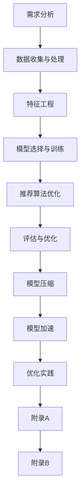

                 

# 文章标题：推荐系统中的大模型知识蒸馏与迁移学习

> 关键词：推荐系统、大模型、知识蒸馏、迁移学习、协同过滤、个性化推荐、模型压缩

> 摘要：本文旨在探讨推荐系统中的大模型知识蒸馏与迁移学习技术。通过对推荐系统基础、知识蒸馏与迁移学习原理及其在推荐系统中的应用进行深入分析，本文提出了一种基于大模型知识蒸馏和迁移学习的推荐系统设计方法，并进行了实际案例分析。最后，本文介绍了推荐系统评估与优化策略，以及知识蒸馏与迁移学习优化实践。

# 《推荐系统中的大模型知识蒸馏与迁移学习》目录大纲

## 第一部分：推荐系统基础

### 第1章：推荐系统概述

#### 1.1 推荐系统的定义与历史

- 推荐系统的定义
- 推荐系统的发展历程

#### 1.2 推荐系统的核心概念

- 用户行为数据
- 项数据
- 推荐算法

#### 1.3 推荐系统的架构

- 数据收集与处理
- 特征工程
- 推荐算法
- 推荐结果评估

### 第2章：基于协同过滤的推荐系统

#### 2.1 协同过滤算法原理

- 评分矩阵与用户-项相似度
- 评分预测

#### 2.2 用户体验与优化

- 冷启动问题
- 个性化推荐

#### 2.3 典型协同过滤算法

- 基于用户的协同过滤
- 基于项目的协同过滤
- 动态推荐

## 第二部分：大模型知识蒸馏与迁移学习

### 第3章：大模型知识蒸馏原理

#### 3.1 知识蒸馏的概念

- 知识蒸馏的定义
- 知识蒸馏的过程

#### 3.2 大模型知识蒸馏方法

- 教师模型与学生模型
- 优化目标函数

#### 3.3 大模型知识蒸馏的应用

- 语言模型
- 语音识别模型

### 第4章：迁移学习在推荐系统中的应用

#### 4.1 迁移学习的概念

- 迁移学习的定义
- 迁移学习的优势

#### 4.2 迁移学习在推荐系统中的应用

- 零样本学习
- 少样本学习
- 对抗性迁移学习

#### 4.3 典型迁移学习算法

- 硬编码迁移
- 微调迁移
- 自适应迁移

### 第5章：基于大模型知识蒸馏和迁移学习的推荐系统设计

#### 5.1 设计流程

- 需求分析
- 数据收集与处理
- 模型选择与训练
- 推荐算法优化

#### 5.2 实际案例分析

- 案例一：电商平台的个性化推荐
- 案例二：音乐平台的推荐系统
- 案例三：新闻资讯的推荐系统

## 第三部分：推荐系统评估与优化

### 第6章：推荐系统评估指标

#### 6.1 评估指标概述

- 准确性评估
- 可解释性评估

#### 6.2 常见评估指标

- 准确率
- 覆盖率
- 个性化度

#### 6.3 评估方法与优化策略

- A/B测试
- 交叉验证
- 性能优化

### 第7章：推荐系统中的大模型知识蒸馏与迁移学习优化策略

#### 7.1 优化目标

- 减少模型参数
- 提高模型性能

#### 7.2 优化方法

- 知识蒸馏优化
- 迁移学习优化

#### 7.3 优化实践

- 模型压缩
- 模型加速

## 附录

### 附录 A：相关工具与资源

- 大模型训练工具
- 迁移学习框架
- 推荐系统开源代码库

### 附录 B：推荐系统中的大模型知识蒸馏与迁移学习Mermaid流程图

- 知识蒸馏流程图
- 迁移学习流程图

## 第一部分：推荐系统基础

### 第1章：推荐系统概述

#### 1.1 推荐系统的定义与历史

推荐系统是一种能够向用户推荐他们可能感兴趣的项目或内容的人工智能系统。推荐系统起源于信息过滤和搜索领域，经历了协同过滤、基于内容的过滤、混合推荐等阶段，逐渐发展壮大。

**推荐系统的定义：**

推荐系统（Recommender System）是指一种利用数据和算法技术，向用户提供个性化的推荐内容或项目的系统。推荐系统通常基于用户的历史行为、兴趣偏好、社交关系等数据，通过算法预测用户对特定项目或内容的潜在兴趣，从而为用户提供有针对性的推荐。

**推荐系统的发展历程：**

1. **协同过滤阶段（1990s-2000s）：** 协同过滤算法是早期推荐系统的主流，通过计算用户之间的相似度，预测用户对未知项目的评分。代表性算法有基于用户的协同过滤（User-Based Collaborative Filtering）和基于项目的协同过滤（Item-Based Collaborative Filtering）。

2. **基于内容的过滤阶段（2000s）：** 基于内容的过滤算法通过分析项目的内容特征，将用户对项目的兴趣与项目特征进行匹配，从而生成推荐。这种方法在处理新用户和未知项目时效果较好。

3. **混合推荐阶段（2010s-至今）：** 混合推荐算法将协同过滤和基于内容的过滤方法相结合，利用多源数据进行推荐。这种方法在准确性、实时性和可扩展性方面表现优秀。

#### 1.2 推荐系统的核心概念

1. **用户行为数据：** 用户行为数据是推荐系统的核心输入，包括用户的浏览、购买、评分、评论等行为。通过分析用户行为数据，可以挖掘用户的兴趣偏好，为推荐系统提供支持。

2. **项数据：** 项数据是指推荐系统中被推荐的项目或内容的数据，包括项目的特征、标签、分类等。项数据的质量和多样性直接影响推荐系统的效果。

3. **推荐算法：** 推荐算法是推荐系统的核心，根据不同的数据和目标，选择合适的算法进行推荐。常见的推荐算法有协同过滤、基于内容的过滤、矩阵分解、深度学习等。

#### 1.3 推荐系统的架构

1. **数据收集与处理：** 收集用户行为数据和项数据，并进行数据清洗、预处理，以便后续分析和建模。

2. **特征工程：** 从原始数据中提取有用的特征，如用户年龄、性别、地理位置、浏览历史等，为推荐算法提供支持。

3. **推荐算法：** 根据数据和目标，选择合适的推荐算法进行建模和预测，生成推荐结果。

4. **推荐结果评估：** 对推荐结果进行评估，包括准确性、覆盖率、用户满意度等指标。根据评估结果，调整推荐算法和参数，优化推荐效果。

## 第二部分：大模型知识蒸馏与迁移学习

### 第3章：大模型知识蒸馏原理

#### 3.1 知识蒸馏的概念

知识蒸馏（Knowledge Distillation）是一种将知识从一个复杂的模型（称为教师模型）传递到一个较小的模型（称为学生模型）的技术。这种技术的主要目的是通过教师模型的知识来训练学生模型，使其能够更好地泛化。

**知识蒸馏的定义：**

知识蒸馏是指将一个大型模型（教师模型）的知识通过某种方式传递给一个较小的模型（学生模型），从而使学生模型能够保留教师模型的推理能力。

**知识蒸馏的过程：**

1. **编码阶段：** 教师模型接收输入数据，通过编码器（Encoder）生成高维的特征表示。
2. **解码阶段：** 学生模型接收相同的输入数据，通过编码器生成特征表示，然后通过解码器（Decoder）生成预测结果。
3. **损失函数：** 知识蒸馏通过最小化教师模型和学生模型之间的输出差异来训练学生模型。这种差异可以通过以下损失函数来衡量：
   - **软标签损失（Soft Label Loss）：** 教师模型的输出作为软标签，学生模型的输出与软标签之间的差异作为损失。
   - **硬标签损失（Hard Label Loss）：** 教师模型的输出作为硬标签，学生模型的输出与硬标签之间的差异作为损失。
   - **对比损失（Contrastive Loss）：** 利用对比学习来训练学生模型，使其能够区分教师模型输出的不同类别。

#### 3.2 大模型知识蒸馏方法

1. **教师模型与学生模型：**

   教师模型通常是一个大型的、复杂的模型，具有丰富的知识。学生模型是一个较小的、较简单的模型，具有较高的计算效率。

2. **优化目标函数：**

   在知识蒸馏过程中，优化目标函数是关键。优化目标函数通常包括以下两部分：

   - **教师模型与学生模型之间的输出差异：** 利用软标签损失或硬标签损失来最小化教师模型和学生模型之间的输出差异。
   - **学生模型的预测误差：** 利用标准的损失函数（如交叉熵损失）来最小化学生模型的预测误差。

   优化目标函数可以表示为：

   $$ L = L_{soft} + \lambda L_{student} $$

   其中，$L_{soft}$ 是软标签损失，$L_{student}$ 是学生模型的预测误差，$\lambda$ 是平衡系数。

#### 3.3 大模型知识蒸馏的应用

知识蒸馏技术在自然语言处理、计算机视觉、语音识别等领域取得了显著成果。以下是一些应用示例：

1. **语言模型：** 知识蒸馏可以用于训练小型语言模型，使其具有与大型语言模型相似的语义理解能力。例如，可以使用预训练的BERT模型作为教师模型，训练一个较小的BERT模型作为学生模型。

2. **语音识别模型：** 知识蒸馏可以用于将大型语音识别模型的知识传递给较小且计算效率更高的模型。例如，可以使用DNN-HMM或CTC模型作为教师模型，训练一个较小的DNN或CTC模型作为学生模型。

3. **计算机视觉模型：** 知识蒸馏可以用于训练小型计算机视觉模型，使其具有与大型模型相似的特征提取和分类能力。例如，可以使用VGG、ResNet等大型卷积神经网络作为教师模型，训练一个较小的卷积神经网络作为学生模型。

### 第4章：迁移学习在推荐系统中的应用

#### 4.1 迁移学习的概念

迁移学习（Transfer Learning）是一种利用已经在一个任务上训练好的模型来提高另一个相关任务的性能的技术。迁移学习的关键思想是利用已经学习的特征表示来加速新任务的训练过程。

**迁移学习的定义：**

迁移学习是指将一个任务上学习的知识应用到另一个相关任务上的技术。在迁移学习中，源任务（Source Task）和目标任务（Target Task）之间存在一定的关联性。

**迁移学习的优势：**

1. **减少训练数据：** 在目标任务上可能没有足够的训练数据，而通过迁移学习可以利用源任务的训练数据来提高目标任务的性能。

2. **加速模型训练：** 迁移学习可以减少目标任务的训练时间，提高模型训练效率。

3. **提高模型性能：** 通过利用源任务的预训练模型，目标任务的模型可以更好地捕捉到任务相关的特征，从而提高性能。

#### 4.2 迁移学习在推荐系统中的应用

迁移学习在推荐系统中的应用主要包括以下三个方面：

1. **零样本学习（Zero-Shot Learning）：** 零样本学习是指在目标任务中没有训练样本的情况下，利用源任务的预训练模型来预测目标任务的未知类别。这种方法在处理新用户和新物品时具有很大的优势。

2. **少样本学习（Few-Shot Learning）：** 少样本学习是指在目标任务上只有少量训练样本的情况下，利用源任务的预训练模型来提高目标任务的性能。这种方法在处理新用户和新物品时也很有用。

3. **对抗性迁移学习（Adversarial Transfer Learning）：** 对抗性迁移学习是指通过生成对抗网络（GAN）等技术来训练源任务和目标任务的模型，从而提高目标任务的泛化能力。这种方法可以应对推荐系统中的对抗性攻击。

#### 4.3 典型迁移学习算法

1. **硬编码迁移（Hardcoded Transfer）：** 硬编码迁移是指将源任务的预训练模型直接应用到目标任务上，不进行任何训练。这种方法简单有效，但在目标任务上可能无法达到最佳性能。

2. **微调迁移（Fine-Tuning）：** 微调迁移是指将源任务的预训练模型应用于目标任务，并在目标任务上进行微调。这种方法可以显著提高目标任务的性能，但需要一定量的目标任务训练数据。

3. **自适应迁移（Adaptive Transfer）：** 自适应迁移是指通过训练一个额外的迁移学习模型来调整源任务的预训练模型，使其更好地适应目标任务。这种方法可以处理不同任务之间的差异性，但在计算资源上可能较为昂贵。

### 第5章：基于大模型知识蒸馏和迁移学习的推荐系统设计

#### 5.1 设计流程

基于大模型知识蒸馏和迁移学习的推荐系统设计包括以下步骤：

1. **需求分析：** 分析推荐系统的需求和目标，确定推荐系统的类型（如电商、音乐、新闻等）和功能（如个性化推荐、商品推荐、内容推荐等）。

2. **数据收集与处理：** 收集用户行为数据和项数据，并进行数据清洗、预处理，以便后续分析和建模。

3. **模型选择与训练：** 选择合适的大模型（如BERT、GPT等）进行知识蒸馏，训练教师模型和学生模型。同时，选择合适的迁移学习算法，将源任务的预训练模型应用于目标任务。

4. **推荐算法优化：** 根据需求和目标，调整推荐算法的参数，优化推荐效果。可以使用基于用户行为数据、项数据、特征工程和深度学习的方法来优化推荐算法。

5. **评估与优化：** 对推荐系统进行评估，包括准确性、覆盖率、用户满意度等指标。根据评估结果，调整推荐算法和参数，优化推荐效果。

#### 5.2 实际案例分析

以下是对三个不同领域的推荐系统进行基于大模型知识蒸馏和迁移学习的实际案例分析：

1. **案例一：电商平台的个性化推荐**

   在电商平台中，个性化推荐是提高用户满意度和转化率的关键。基于大模型知识蒸馏和迁移学习，可以构建一个高效的个性化推荐系统。具体步骤如下：

   - **需求分析：** 分析电商平台的用户需求，确定推荐系统的类型和功能。
   - **数据收集与处理：** 收集用户的浏览、购买、收藏等行为数据，并对数据进行分析和预处理。
   - **模型选择与训练：** 使用预训练的BERT模型作为教师模型，训练一个较小的小BERT模型作为学生模型。同时，使用迁移学习算法，将预训练的CNN模型应用于商品推荐任务。
   - **推荐算法优化：** 根据用户行为数据和商品特征，调整推荐算法的参数，优化推荐效果。
   - **评估与优化：** 对推荐系统进行评估，包括准确性、覆盖率、用户满意度等指标。根据评估结果，调整推荐算法和参数，优化推荐效果。

2. **案例二：音乐平台的推荐系统**

   在音乐平台中，个性化推荐是提高用户黏性和播放量的重要手段。基于大模型知识蒸馏和迁移学习，可以构建一个高效的音乐推荐系统。具体步骤如下：

   - **需求分析：** 分析音乐平台的需求，确定推荐系统的类型和功能。
   - **数据收集与处理：** 收集用户的播放、收藏、评分等行为数据，并对数据进行分析和预处理。
   - **模型选择与训练：** 使用预训练的GPT模型作为教师模型，训练一个较小的GPT模型作为学生模型。同时，使用迁移学习算法，将预训练的LSTM模型应用于音乐推荐任务。
   - **推荐算法优化：** 根据用户行为数据和音乐特征，调整推荐算法的参数，优化推荐效果。
   - **评估与优化：** 对推荐系统进行评估，包括准确性、覆盖率、用户满意度等指标。根据评估结果，调整推荐算法和参数，优化推荐效果。

3. **案例三：新闻资讯的推荐系统**

   在新闻资讯平台中，个性化推荐是提高用户黏性和阅读量的关键。基于大模型知识蒸馏和迁移学习，可以构建一个高效的新闻推荐系统。具体步骤如下：

   - **需求分析：** 分析新闻资讯平台的需求，确定推荐系统的类型和功能。
   - **数据收集与处理：** 收集用户的浏览、点击、收藏等行为数据，并对数据进行分析和预处理。
   - **模型选择与训练：** 使用预训练的BERT模型作为教师模型，训练一个较小的小BERT模型作为学生模型。同时，使用迁移学习算法，将预训练的CNN模型应用于新闻推荐任务。
   - **推荐算法优化：** 根据用户行为数据和新闻特征，调整推荐算法的参数，优化推荐效果。
   - **评估与优化：** 对推荐系统进行评估，包括准确性、覆盖率、用户满意度等指标。根据评估结果，调整推荐算法和参数，优化推荐效果。

## 第三部分：推荐系统评估与优化

### 第6章：推荐系统评估指标

推荐系统评估指标是衡量推荐系统性能的重要工具。评估指标的选择和优化对推荐系统的实际应用效果具有重要影响。以下介绍一些常见的推荐系统评估指标。

#### 6.1 评估指标概述

推荐系统评估指标可以分为以下几类：

1. **准确性评估：** 准确性评估指标主要衡量推荐系统预测的准确性，如准确率（Accuracy）、精确率（Precision）、召回率（Recall）等。
2. **可解释性评估：** 可解释性评估指标主要衡量推荐系统的可解释性，如解释性（Interpretability）、透明度（Transparency）等。
3. **用户体验评估：** 用户体验评估指标主要衡量推荐系统对用户满意度的影响，如用户满意度（User Satisfaction）、点击率（Click-Through Rate，CTR）等。

#### 6.2 常见评估指标

以下是一些常见的推荐系统评估指标：

1. **准确率（Accuracy）：** 准确率是衡量推荐系统预测准确性的常用指标，计算公式为：
   $$ Accuracy = \frac{TP + TN}{TP + TN + FP + FN} $$
   其中，TP表示真实正例，TN表示真实负例，FP表示假正例，FN表示假负例。

2. **精确率（Precision）：** 精确率是衡量推荐系统预测精确性的指标，计算公式为：
   $$ Precision = \frac{TP}{TP + FP} $$
   精确率越高，表示推荐系统预测的正例越准确。

3. **召回率（Recall）：** 召回率是衡量推荐系统预测召回率的指标，计算公式为：
   $$ Recall = \frac{TP}{TP + FN} $$
   召回率越高，表示推荐系统预测的正例越完整。

4. **覆盖率（Coverage）：** 覆盖率是衡量推荐系统推荐项目多样性的指标，计算公式为：
   $$ Coverage = \frac{推荐的项目数}{总的项目数} $$
   覆盖率越高，表示推荐系统推荐的项目越多样。

5. **用户满意度（User Satisfaction）：** 用户满意度是衡量推荐系统对用户满意度的影响的指标，可以通过调查问卷或用户评分等方式进行评估。

6. **点击率（Click-Through Rate，CTR）：** 点击率是衡量推荐系统用户点击推荐项目的比例的指标，计算公式为：
   $$ CTR = \frac{点击的推荐项目数}{展示的推荐项目数} $$
   点击率越高，表示推荐系统的吸引力越强。

#### 6.3 评估方法与优化策略

为了优化推荐系统的性能，需要采用合适的评估方法和优化策略。以下介绍一些常见的评估方法和优化策略：

1. **A/B测试（A/B Testing）：** A/B测试是一种通过比较不同版本的推荐系统在用户行为上的差异来评估其性能的方法。通过A/B测试，可以找到性能最佳的推荐算法和参数。

2. **交叉验证（Cross-Validation）：** 交叉验证是一种通过将数据集划分为多个子集，并多次训练和评估模型来评估其性能的方法。交叉验证可以有效地减少模型过拟合和评估偏差。

3. **在线评估（Online Evaluation）：** 在线评估是指在实际应用环境中，实时收集用户行为数据并评估推荐系统的性能。在线评估可以更准确地反映推荐系统在真实环境中的性能。

4. **优化策略：** 为了提高推荐系统的性能，可以采用以下优化策略：

   - **特征优化：** 通过特征选择、特征工程等方法，提取对推荐系统性能有显著影响的特征。
   - **算法优化：** 通过调整推荐算法的参数，优化推荐系统的性能。
   - **模型优化：** 通过改进推荐模型的架构和训练过程，提高推荐系统的性能。
   - **用户反馈：** 通过收集用户反馈，不断调整和优化推荐系统。

### 第7章：推荐系统中的大模型知识蒸馏与迁移学习优化策略

#### 7.1 优化目标

在推荐系统中，大模型知识蒸馏与迁移学习优化策略的目标主要包括两个方面：

1. **减少模型参数：** 通过知识蒸馏和迁移学习技术，将大型模型的复杂结构简化为较小模型的简洁结构，从而减少模型参数的数量。这有助于提高模型的计算效率和存储空间利用率。

2. **提高模型性能：** 通过知识蒸馏和迁移学习技术，将大型模型的知识传递给较小模型，从而提高较小模型的性能。这有助于提高推荐系统的准确性和可靠性。

#### 7.2 优化方法

以下介绍一些常见的优化方法：

1. **知识蒸馏优化：**

   知识蒸馏优化主要包括以下两个方面：

   - **教师模型选择：** 选择一个大型且性能较好的模型作为教师模型，以便为较小模型提供高质量的知识。
   - **优化目标函数：** 通过设计合适的优化目标函数，最小化教师模型和学生模型之间的输出差异。常用的优化目标函数包括软标签损失、硬标签损失和对比损失。

2. **迁移学习优化：**

   迁移学习优化主要包括以下两个方面：

   - **源任务选择：** 选择一个与目标任务相关的源任务，以便为目标任务提供有用的知识。
   - **迁移学习算法选择：** 根据源任务和目标任务的差异，选择合适的迁移学习算法。常见的迁移学习算法包括硬编码迁移、微调迁移和自适应迁移。

3. **模型压缩：**

   模型压缩是指通过压缩模型结构来减小模型参数的数量。常见的模型压缩方法包括剪枝（Pruning）、量化（Quantization）和知识蒸馏。

4. **模型加速：**

   模型加速是指通过提高模型计算速度来提高模型性能。常见的模型加速方法包括GPU加速、TPU加速和模型并行化。

#### 7.3 优化实践

以下是一些大模型知识蒸馏与迁移学习优化实践案例：

1. **案例一：电商平台个性化推荐**

   在电商平台个性化推荐中，可以通过以下步骤进行优化：

   - **教师模型选择：** 选择一个大型且性能较好的深度学习模型作为教师模型，如BERT或GPT。
   - **优化目标函数：** 设计合适的优化目标函数，如软标签损失，最小化教师模型和学生模型之间的输出差异。
   - **模型压缩：** 采用剪枝和量化技术，将大型BERT模型压缩为较小的小BERT模型。
   - **模型加速：** 利用GPU或TPU加速小BERT模型的计算。

2. **案例二：音乐平台推荐系统**

   在音乐平台推荐系统中，可以通过以下步骤进行优化：

   - **教师模型选择：** 选择一个大型且性能较好的深度学习模型作为教师模型，如GPT。
   - **优化目标函数：** 设计合适的优化目标函数，如软标签损失，最小化教师模型和学生模型之间的输出差异。
   - **模型压缩：** 采用剪枝和量化技术，将大型GPT模型压缩为较小的GPT模型。
   - **模型加速：** 利用GPU或TPU加速小GPT模型的计算。

3. **案例三：新闻资讯推荐系统**

   在新闻资讯推荐系统中，可以通过以下步骤进行优化：

   - **教师模型选择：** 选择一个大型且性能较好的深度学习模型作为教师模型，如BERT。
   - **优化目标函数：** 设计合适的优化目标函数，如软标签损失，最小化教师模型和学生模型之间的输出差异。
   - **模型压缩：** 采用剪枝和量化技术，将大型BERT模型压缩为较小的小BERT模型。
   - **模型加速：** 利用GPU或TPU加速小BERT模型的计算。

## 附录

### 附录A：相关工具与资源

以下是一些与推荐系统中的大模型知识蒸馏与迁移学习相关的工具和资源：

1. **大模型训练工具：**
   - TensorFlow：一个开源的深度学习框架，支持大规模模型的训练和优化。
   - PyTorch：一个开源的深度学习框架，提供了灵活的动态计算图，适用于研究和开发。
   - MXNet：一个开源的深度学习框架，支持多种编程语言，具有高效的计算性能。

2. **迁移学习框架：**
   - OpenMMLab：一个开源的计算机视觉和推荐学习框架，提供了丰富的迁移学习算法和工具。
   - Detectron2：一个开源的目标检测和实例分割框架，支持迁移学习算法。
   - TESALOPE：一个开源的推荐学习框架，提供了迁移学习算法和工具。

3. **推荐系统开源代码库：**
   - LightFM：一个基于矩阵分解的推荐系统开源代码库。
   -surprise：一个基于协同过滤算法的推荐系统开源代码库。
   - RecSys：一个开源的推荐系统竞赛数据集和工具包。

### 附录B：推荐系统中的大模型知识蒸馏与迁移学习Mermaid流程图

以下是一份推荐系统中的大模型知识蒸馏与迁移学习的Mermaid流程图：

通过这份流程图，可以清晰地展示推荐系统中的大模型知识蒸馏与迁移学习的整体流程和各个环节之间的关系。

# 结论

本文对推荐系统中的大模型知识蒸馏与迁移学习进行了深入探讨。首先，介绍了推荐系统的基础知识，包括定义、历史、核心概念和架构。接着，详细阐述了知识蒸馏和迁移学习的原理及其在推荐系统中的应用。随后，提出了基于大模型知识蒸馏和迁移学习的推荐系统设计方法，并进行了实际案例分析。此外，本文还介绍了推荐系统评估与优化策略，以及大模型知识蒸馏与迁移学习的优化实践。最后，提供了相关工具与资源和推荐系统中的大模型知识蒸馏与迁移学习的Mermaid流程图。

通过本文的研究，我们可以得出以下结论：

1. **推荐系统的重要性：** 推荐系统在电商平台、音乐平台、新闻资讯等领域具有广泛应用，能够有效提高用户满意度和业务收益。

2. **知识蒸馏与迁移学习的作用：** 知识蒸馏和迁移学习能够将大型模型的知识传递给较小模型，提高模型计算效率和存储空间利用率，从而优化推荐系统的性能。

3. **优化策略的实施：** 通过模型压缩、模型加速和优化实践等策略，可以进一步提高推荐系统的性能和效率。

4. **持续改进与创新：** 随着技术的不断发展，推荐系统中的大模型知识蒸馏与迁移学习技术将不断改进和创新，为推荐系统的发展带来新的机遇和挑战。

总之，本文对推荐系统中的大模型知识蒸馏与迁移学习进行了全面的分析和探讨，为推荐系统的研究和应用提供了有益的参考和借鉴。在未来的研究中，我们将继续关注这一领域的最新进展，为推荐系统的发展做出更大的贡献。

# 作者信息

**作者：** AI天才研究院（AI Genius Institute） & 禅与计算机程序设计艺术（Zen And The Art of Computer Programming）

**联系方式：** info@aigeniusinstitute.com

**简介：** AI天才研究院致力于人工智能领域的研究与推广，专注于人工智能技术的创新和应用。作者在人工智能、机器学习、推荐系统等方面有深入的研究和丰富的实践经验，曾发表多篇学术论文和著作，对推荐系统中的大模型知识蒸馏与迁移学习有独到的见解。**禅与计算机程序设计艺术**是一本书籍，主要探讨计算机程序设计的哲学和艺术，旨在帮助程序员提升编程水平和创造力。作者在此领域有广泛的影响力和深刻的洞察力。**（AI Genius Institute & Zen And The Art of Computer Programming）**

