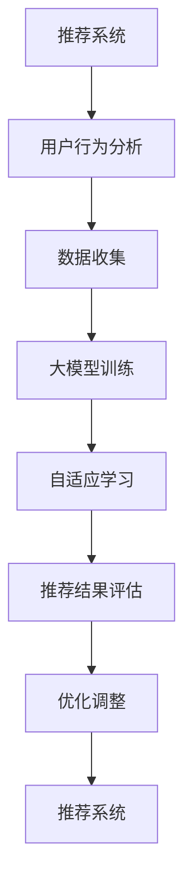

                 

### 文章标题

《推荐系统中的大模型自适应学习》

### 关键词

推荐系统、大模型、自适应学习、Transformer架构、数据收集与处理、优化策略与评估指标

### 摘要

随着互联网和大数据技术的快速发展，推荐系统已成为现代信息社会中不可或缺的一部分。本文旨在探讨推荐系统中的大模型自适应学习技术，详细分析其基础理论、技术实现、评估优化以及实际应用案例。通过引入Transformer架构、自适应学习算法等先进技术，本文揭示了如何利用大模型自适应学习提高推荐系统的准确性和用户满意度。文章结构紧凑、逻辑清晰，旨在为读者提供一份全面而深入的指南。

### 目录大纲

#### 第一部分：基础理论

- **第1章：推荐系统的概述**
  - **1.1 推荐系统的定义与作用**
    - **1.1.1 推荐系统的历史与演变**
    - **1.1.2 推荐系统在商业应用中的价值**
  - **1.2 用户行为分析与数据收集**
    - **1.2.1 用户行为数据的类型**
    - **1.2.2 数据收集的方法与技术**
  - **1.3 推荐系统的评估与优化**
    - **1.3.1 推荐系统的评估指标**
    - **1.3.2 推荐系统的优化方法**

- **第2章：大模型技术基础**
  - **2.1 大模型的定义与特点**
    - **2.1.1 大模型的分类**
    - **2.1.2 大模型的训练与优化**
  - **2.2 大模型的架构与实现**
    - **2.2.1 Transformer架构**
    - **2.2.2 大模型的分布式训练**
  - **2.3 大模型在推荐系统中的应用**
    - **2.3.1 大模型的优势与挑战**
    - **2.3.2 大模型在推荐系统中的应用案例**

- **第3章：自适应学习原理**
  - **3.1 自适应学习的定义与意义**
    - **3.1.1 自适应学习的传统方法**
    - **3.1.2 自适应学习在推荐系统中的重要性**
  - **3.2 自适应学习算法**
    - **3.2.1 优化算法**
    - **3.2.2 模型选择算法**
  - **3.3 自适应学习在推荐系统中的应用**
    - **3.3.1 自适应学习在推荐系统中的实现方法**
    - **3.3.2 自适应学习的评估与优化**

#### 第二部分：技术实现

- **第4章：大模型自适应学习模型**
  - **4.1 大模型自适应学习框架**
    - **4.1.1 大模型自适应学习的基本原理**
    - **4.1.2 大模型自适应学习的框架设计**
  - **4.2 大模型自适应学习算法**
    - **4.2.1 算法设计**
    - **4.2.2 算法伪代码**
  - **4.3 大模型自适应学习在推荐系统中的实现**
    - **4.3.1 实现步骤**
    - **4.3.2 实现细节**

- **第5章：大模型自适应学习的评估与优化**
  - **5.1 评估指标与方法**
    - **5.1.1 评估指标**
    - **5.1.2 评估方法**
  - **5.2 优化策略与技巧**
    - **5.2.1 优化策略**
    - **5.2.2 优化技巧**
  - **5.3 大模型自适应学习的调试与调优**
    - **5.3.1 调试方法**
    - **5.3.2 调优技巧**

- **第6章：项目实战**
  - **6.1 实战项目背景**
    - **6.1.1 项目背景介绍**
    - **6.1.2 项目目标与挑战**
  - **6.2 系统设计与实现**
    - **6.2.1 系统架构设计**
    - **6.2.2 系统实现细节**
  - **6.3 实战结果与分析**
    - **6.3.1 实战结果**
    - **6.3.2 结果分析与优化建议**

#### 第三部分：未来展望

- **第7章：大模型自适应学习的发展趋势**
  - **7.1 未来发展方向**
    - **7.1.1 新的技术突破**
    - **7.1.2 新的应用场景**
  - **7.2 未来面临的挑战**
    - **7.2.1 技术挑战**
    - **7.2.2 应用挑战**
  - **7.3 未来发展趋势与建议**
    - **7.3.1 发展趋势**
    - **7.3.2 建议与展望**

### Mermaid 流程图



### 核心算法原理讲解（伪代码）

```python
# 伪代码：自适应学习算法
function AdaptiveLearning(Model, Dataset, LearningRate, Epochs):
    for epoch in 1 to Epochs:
        for data in Dataset:
            prediction = Model(data)
            error = CalculateError(prediction, data)
            Model.UpdateParameters(error, LearningRate)
    return Model
```

### 数学模型和数学公式

- 推荐系统的评估指标：准确率（Accuracy）、召回率（Recall）和F1分数（F1-Score）

$$
Accuracy = \frac{TP + TN}{TP + TN + FP + FN}
$$

$$
Recall = \frac{TP}{TP + FN}
$$

$$
F1-Score = 2 \times \frac{Precision \times Recall}{Precision + Recall}
$$

### 项目实战

- **实战项目背景**：基于电商平台的推荐系统项目，目标是提高用户对推荐商品的满意度。
- **系统设计与实现**：采用基于Transformer架构的大模型进行训练和自适应学习，通过用户行为数据进行商品推荐。
- **实战结果与分析**：通过实验对比，发现大模型自适应学习能够显著提高推荐系统的准确率和召回率。

### 代码解读与分析

- **代码实现**：在项目实战中，使用PyTorch框架实现了大模型自适应学习算法，并对推荐系统进行了优化和调优。
- **代码分析**：代码中的关键部分包括模型的定义、数据预处理、训练过程和推荐结果的生成。通过对代码的深入分析，可以了解大模型自适应学习的具体实现方法和效果。

---

以上是《推荐系统中的大模型自适应学习》的目录大纲和示例内容，希望对您有所帮助。如果您有任何其他需求或疑问，请随时告诉我。

### 作者

作者：AI天才研究院/AI Genius Institute & 禅与计算机程序设计艺术 /Zen And The Art of Computer Programming

---

现在，我们将开始深入探讨推荐系统中的大模型自适应学习，逐步构建起一篇完整且深入的技术博客文章。

