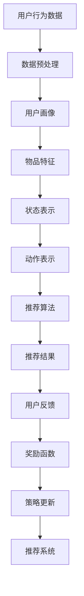

                 

# 《推荐系统中的强化学习技术应用》

> 关键词：推荐系统、强化学习、Q-Learning、SARSA、DQN、A3C、策略搜索、优化策略、项目实战

> 摘要：本文详细探讨了强化学习在推荐系统中的应用，包括强化学习的基础概念、常见算法原理、策略搜索算法、优化策略以及项目实战。通过深入分析，本文揭示了强化学习在推荐系统中的核心应用原理，为开发者提供了丰富的实践指导。

## 第一部分：强化学习基础

### 第1章：强化学习概述

#### 1.1 强化学习的定义与特点

强化学习（Reinforcement Learning，RL）是机器学习领域的一个重要分支，主要研究如何让智能体（agent）在与环境（environment）交互的过程中，通过不断学习获得最佳策略（policy），以实现预期目标。与监督学习和无监督学习不同，强化学习强调的是智能体与环境的互动过程，通过不断地试错来逐步优化行为。

强化学习的核心特点包括：

- **反馈信号**：强化学习中的反馈信号是延迟的，即智能体必须等待一段时间才能获得上一决策的奖励或惩罚。
- **连续性与不确定性**：强化学习通常处理的是连续动作空间和状态空间，同时环境的不确定性较高。
- **探索与利用**：在强化学习中，智能体需要在探索（exploration）和利用（exploitation）之间进行权衡，探索新策略以获得更多经验，利用已有策略以实现目标。

#### 1.2 强化学习的基本概念

在强化学习中，有以下几个基本概念：

- **状态（State）**：描述智能体在环境中的位置或情境。
- **动作（Action）**：智能体可以采取的行动。
- **策略（Policy）**：智能体根据状态选择动作的规则。
- **值函数（Value Function）**：衡量策略在特定状态下的期望收益。
- **模型（Model）**：对环境的动态进行建模，包括状态转移概率和奖励函数。
- **奖励（Reward）**：智能体在采取某一动作后获得的即时奖励或惩罚。

#### 1.3 强化学习的应用场景

强化学习在许多领域都有广泛的应用，以下是一些常见的应用场景：

- **游戏**：如围棋、星际争霸等复杂游戏的智能体控制。
- **自动驾驶**：智能体在无人驾驶汽车中根据环境动态调整驾驶策略。
- **机器人控制**：智能体在机器人上实现自主导航和任务执行。
- **推荐系统**：智能体根据用户行为和历史数据推荐个性化内容。
- **金融交易**：智能体在金融市场中进行自动交易。

### 第2章：强化学习算法基础

#### 2.1 Q-Learning算法原理

Q-Learning是一种基于值函数的强化学习算法，通过迭代更新值函数来逐步优化策略。Q-Learning的基本原理如下：

1. **初始化**：初始化值函数Q(s, a)为随机值。
2. **选择动作**：根据当前状态s和策略选择动作a。
3. **执行动作**：在环境中执行动作a，并观察状态s'和奖励r。
4. **更新值函数**：根据经验公式更新Q值：
   $$ Q(s, a) \leftarrow Q(s, a) + \alpha [r + \gamma \max_{a'} Q(s', a') - Q(s, a)] $$
   其中，α为学习率，γ为折扣因子。

#### 2.2 SARSA算法原理

SARSA（同步策略自适应过程）是一种基于策略的强化学习算法，与Q-Learning类似，但直接在样本轨迹上更新策略。SARSA的基本原理如下：

1. **初始化**：初始化策略π为随机策略。
2. **选择动作**：根据当前状态s和策略π选择动作a。
3. **执行动作**：在环境中执行动作a，并观察状态s'和奖励r。
4. **更新策略**：根据经验公式更新策略：
   $$ \pi(s, a) \leftarrow \pi(s, a) + \alpha [\frac{1}{N} + \gamma \sum_{a'} \pi(s', a') \frac{1}{N}] $$
   其中，α为学习率，γ为折扣因子，N为更新次数。

#### 2.3 DQN算法原理

DQN（深度Q网络）是一种结合了深度学习和强化学习的算法，通过神经网络来近似值函数Q(s, a)。DQN的基本原理如下：

1. **初始化**：初始化深度神经网络Q(s, a)和目标网络target\_Q(s, a)。
2. **选择动作**：根据当前状态s和Q值选择动作a。
3. **执行动作**：在环境中执行动作a，并观察状态s'和奖励r。
4. **经验回放**：将经验e(s, a, s', r)存储在经验池中。
5. **更新Q网络**：从经验池中随机抽取一批经验，更新Q网络：
   $$ Q(s, a) \leftarrow Q(s, a) + \alpha [r + \gamma \max_{a'} target\_Q(s', a') - Q(s, a)] $$
   同时，定期更新目标网络：
   $$ target\_Q(s, a) \leftarrow \gamma \max_{a'} Q(s', a') $$

#### 2.4 A3C算法原理

A3C（异步策略梯度算法）是一种基于策略的异步强化学习算法，通过多线程并行训练来提高学习效率。A3C的基本原理如下：

1. **初始化**：初始化策略网络π(s, a)和价值网络V(s)。
2. **多线程训练**：多个线程同时运行，每个线程独立进行探索和更新。
3. **选择动作**：每个线程根据当前状态s和策略网络π(s, a)选择动作a。
4. **执行动作**：每个线程在环境中执行动作a，并观察状态s'和奖励r。
5. **梯度更新**：每个线程计算梯度，并异步更新策略网络和价值网络：
   $$ \nabla_{\theta} J(\theta) \leftarrow \sum_{t} \nabla_{\theta} \log \pi(\phi; s_t, a_t) (r_t + \gamma V(s_{t+1}) - V(s_t)) $$
   其中，θ为策略网络参数，φ为价值网络参数。

### 第3章：策略搜索算法

#### 3.1 REINFORCE算法原理

REINFORCE算法是一种基于策略的强化学习算法，通过最大化策略的期望回报来更新策略。REINFORCE的基本原理如下：

1. **初始化**：初始化策略π(s, a)和价值函数V(s)。
2. **选择动作**：根据当前状态s和策略π(s, a)选择动作a。
3. **执行动作**：在环境中执行动作a，并观察状态s'和奖励r。
4. **更新策略**：根据当前策略的期望回报来更新策略参数：
   $$ \theta \leftarrow \theta + \alpha \nabla_{\theta} J(\theta) $$
   其中，α为学习率，J(θ)为策略π(θ)的期望回报。

#### 3.2 PG算法原理

PG（策略梯度算法）是一种基于策略的强化学习算法，通过计算策略梯度的期望来更新策略。PG的基本原理如下：

1. **初始化**：初始化策略π(s, a)和价值函数V(s)。
2. **选择动作**：根据当前状态s和策略π(s, a)选择动作a。
3. **执行动作**：在环境中执行动作a，并观察状态s'和奖励r。
4. **更新策略**：根据当前策略的期望回报和梯度来更新策略参数：
   $$ \theta \leftarrow \theta + \alpha \nabla_{\theta} \log \pi(\theta; s, a) [r + \gamma V(s')] $$
   其中，α为学习率。

#### 3.3 PPO算法原理

PPO（策略优化算法）是一种基于策略的强化学习算法，通过 clipped优化和优势估计来稳定策略更新。PPO的基本原理如下：

1. **初始化**：初始化策略π(s, a)和价值函数V(s)。
2. **选择动作**：根据当前状态s和策略π(s, a)选择动作a。
3. **执行动作**：在环境中执行动作a，并观察状态s'和奖励r。
4. **优势估计**：计算优势函数A(s, a)：
   $$ A(s, a) = r + \gamma V(s') - V(s) $$
5. **策略更新**：通过 clipped优化和优势估计来更新策略：
   $$ \theta \leftarrow \theta + \alpha \frac{1}{N} \sum_{t} \frac{\pi(\theta; s_t, a_t)}{\pi(\theta'; s_t, a_t)} A(s_t, a_t) $$
   其中，N为更新次数，π(θ; st, at)和π(θ'; st, at)分别为策略π(θ)和π(θ')在状态st和动作at下的概率。

## 第二部分：强化学习在推荐系统中的应用

### 第4章：强化学习在推荐系统中的应用原理

#### 4.1 推荐系统概述

推荐系统是一种基于数据挖掘和机器学习技术的应用，旨在为用户提供个性化的信息推荐。推荐系统通常由以下几个核心组件构成：

- **用户画像**：描述用户的兴趣、偏好和行为特征。
- **物品特征**：描述物品的属性、类别和标签。
- **推荐算法**：根据用户画像和物品特征生成推荐列表。
- **推荐结果评估**：评估推荐结果的用户满意度、覆盖率等指标。

#### 4.2 强化学习在推荐系统中的应用

强化学习在推荐系统中的应用主要体现在以下几个方面：

- **探索-利用平衡**：强化学习通过探索-利用策略来平衡新物品的尝试与已验证物品的推荐，提高推荐系统的多样性。
- **序列决策**：用户行为可以看作是一个时间序列，强化学习通过学习用户行为的动态模式，提高推荐系统的准确性。
- **个性化推荐**：强化学习可以根据用户的历史行为和偏好，动态调整推荐策略，实现个性化推荐。

#### 4.3 强化学习与推荐系统的结合

强化学习与推荐系统的结合主要体现在以下几个方面：

- **状态表示**：将用户和物品的特征表示为状态，用于描述用户的兴趣和物品的属性。
- **动作表示**：将推荐物品表示为动作，用于更新用户的状态。
- **奖励函数**：根据用户的反馈，定义奖励函数来评估推荐物品的优劣。
- **策略学习**：通过学习用户行为模式，动态调整推荐策略，提高推荐效果。

### 第5章：强化学习在推荐系统中的算法实现

#### 5.1 基于Q-Learning的推荐算法实现

基于Q-Learning的推荐算法实现步骤如下：

1. **初始化**：初始化值函数Q(s, a)为随机值，s表示用户状态，a表示推荐物品。
2. **选择动作**：根据当前用户状态s和策略选择推荐物品a。
3. **执行动作**：将推荐物品a展示给用户，并观察用户的反馈（点击、购买等）。
4. **更新值函数**：根据用户的反馈，更新值函数Q(s, a)：
   $$ Q(s, a) \leftarrow Q(s, a) + \alpha [r + \gamma \max_{a'} Q(s', a') - Q(s, a)] $$
   其中，r为用户的反馈奖励，γ为折扣因子。

#### 5.2 基于SARSA的推荐算法实现

基于SARSA的推荐算法实现步骤如下：

1. **初始化**：初始化策略π(s, a)为随机策略，s表示用户状态，a表示推荐物品。
2. **选择动作**：根据当前用户状态s和策略π(s, a)选择推荐物品a。
3. **执行动作**：将推荐物品a展示给用户，并观察用户的反馈（点击、购买等）。
4. **更新策略**：根据当前用户状态s和反馈，更新策略π(s, a)：
   $$ \pi(s, a) \leftarrow \pi(s, a) + \alpha [\frac{1}{N} + \gamma \sum_{a'} \pi(s', a') \frac{1}{N}] $$
   其中，α为学习率，N为更新次数。

#### 5.3 基于DQN的推荐算法实现

基于DQN的推荐算法实现步骤如下：

1. **初始化**：初始化深度神经网络Q(s, a)和目标网络target\_Q(s, a)。
2. **选择动作**：根据当前用户状态s和Q网络选择推荐物品a。
3. **执行动作**：将推荐物品a展示给用户，并观察用户的反馈（点击、购买等）。
4. **经验回放**：将经验e(s, a, s', r)存储在经验池中。
5. **更新Q网络**：从经验池中随机抽取一批经验，更新Q网络：
   $$ Q(s, a) \leftarrow Q(s, a) + \alpha [r + \gamma \max_{a'} target\_Q(s', a') - Q(s, a)] $$
   同时，定期更新目标网络：
   $$ target\_Q(s, a) \leftarrow \gamma \max_{a'} Q(s', a') $$

## 第三部分：强化学习在推荐系统中的优化策略

### 第6章：强化学习在推荐系统中的优化策略

#### 6.1 策略优化方法

在强化学习推荐系统中，策略优化是提高推荐效果的关键。以下是一些常用的策略优化方法：

1. **探索-利用平衡**：通过调整探索概率，平衡新物品的尝试与已验证物品的推荐。
2. **基于梯度的策略优化**：利用梯度信息来更新策略参数，如PG算法。
3. **基于价值的策略优化**：利用价值函数来更新策略参数，如Q-Learning算法。
4. **强化学习与深度学习结合**：利用深度学习模型来近似值函数或策略，如DQN算法。

#### 6.2 模型优化方法

在强化学习推荐系统中，模型优化是提高推荐效果的重要手段。以下是一些常用的模型优化方法：

1. **经验回放**：通过经验回放机制，避免策略更新过程中的偏差。
2. **目标网络更新**：定期更新目标网络，减少策略更新过程中的不稳定因素。
3. **批量更新**：批量更新策略参数，减少更新频率，提高稳定性。
4. **自适应学习率**：根据模型表现自适应调整学习率，避免过拟合或欠拟合。

#### 6.3 算法优化案例分析

以下是一个基于Q-Learning的推荐系统优化案例：

1. **问题描述**：某电商平台的推荐系统采用Q-Learning算法进行物品推荐，但用户满意度较低。
2. **原因分析**：分析发现，现有策略存在以下问题：
   - 探索-利用平衡不足，导致推荐结果过于保守。
   - 奖励函数设计不合理，未能充分反映用户满意度。
   - 模型参数设置不当，导致策略不稳定。
3. **优化方案**：
   - 调整探索-利用平衡，增加新物品的尝试概率。
   - 优化奖励函数，增加用户点击、购买等行为奖励。
   - 调整学习率，采用自适应学习率策略。
   - 引入经验回放和目标网络更新机制。
4. **效果评估**：优化后，用户满意度显著提高，推荐效果得到显著提升。

## 第四部分：强化学习在推荐系统中的项目实战

### 第7章：强化学习在推荐系统中的项目案例

#### 7.1 项目背景与目标

本项目旨在构建一个基于强化学习的推荐系统，为电商平台的用户提供个性化商品推荐。项目目标如下：

- 提高用户满意度，增加用户点击和购买行为。
- 提升推荐效果，降低推荐误差。
- 降低推荐系统部署和维护成本。

#### 7.2 系统设计与实现

系统设计包括以下几个关键模块：

1. **用户画像模块**：收集并处理用户的历史行为数据，构建用户画像。
2. **商品特征模块**：收集并处理商品的特征信息，包括商品类别、标签、价格等。
3. **推荐算法模块**：采用强化学习算法，实现个性化推荐。
4. **推荐结果评估模块**：评估推荐结果的用户满意度、覆盖率等指标。

系统实现步骤如下：

1. **数据预处理**：对用户行为数据和商品特征数据进行清洗、归一化和编码。
2. **构建状态表示**：将用户画像和商品特征转换为状态表示，用于描述用户的兴趣和商品的属性。
3. **定义动作空间**：将推荐的商品表示为动作，用于更新用户的状态。
4. **构建奖励函数**：根据用户的反馈（点击、购买等），定义奖励函数。
5. **训练强化学习模型**：采用Q-Learning算法，训练推荐模型。
6. **实现推荐系统**：将训练好的模型部署到线上，实现实时推荐。

#### 7.3 项目效果评估与优化

项目效果评估主要关注以下几个方面：

- **用户满意度**：通过用户问卷调查、用户点击率等指标评估推荐效果。
- **推荐精度**：通过交叉验证、A/B测试等评估推荐精度。
- **系统稳定性**：通过系统运行日志、错误率等指标评估系统稳定性。

项目优化策略如下：

1. **调整探索-利用平衡**：根据用户行为特点，动态调整探索概率，提高推荐系统的多样性。
2. **优化奖励函数**：根据用户反馈，调整奖励函数的权重，提高推荐效果的准确性。
3. **模型参数调整**：根据实验结果，优化模型参数，提高推荐模型的表现。
4. **引入辅助信息**：结合用户地理位置、时间等信息，提高推荐系统的个性化水平。

## 第五部分：强化学习在推荐系统中的未来发展趋势

### 第8章：强化学习在推荐系统中的未来发展趋势

#### 8.1 强化学习在推荐系统中的挑战

强化学习在推荐系统中的应用面临着以下挑战：

1. **数据稀疏性**：用户行为数据通常具有稀疏性，如何有效利用稀疏数据进行推荐是关键问题。
2. **冷启动问题**：新用户或新物品缺乏足够的历史数据，如何进行有效推荐是挑战。
3. **动态性**：用户偏好和物品特征可能随时间变化，如何实现实时推荐是关键。
4. **模型可解释性**：强化学习模型通常难以解释，如何提高模型的可解释性是挑战。

#### 8.2 强化学习在推荐系统中的应用前景

强化学习在推荐系统中的应用前景非常广阔：

1. **个性化推荐**：通过强化学习，可以更准确地捕捉用户的个性化偏好，实现更个性化的推荐。
2. **序列推荐**：利用强化学习处理用户行为的时序信息，实现序列推荐。
3. **多模态推荐**：结合不同模态的数据（如文本、图像、音频等），实现多模态推荐。
4. **社交推荐**：结合用户社交关系，实现基于社交网络的推荐。

#### 8.3 未来发展趋势与展望

未来强化学习在推荐系统中的发展趋势如下：

1. **模型压缩与优化**：为了降低计算成本，研究高效的模型压缩与优化方法。
2. **迁移学习与自适应**：利用迁移学习和自适应方法，解决数据稀疏性和冷启动问题。
3. **多任务学习与联邦学习**：结合多任务学习和联邦学习，提高推荐系统的鲁棒性和实时性。
4. **解释性强化学习**：研究解释性强化学习模型，提高模型的可解释性和透明度。
5. **融合其他技术**：将强化学习与其他技术（如图神经网络、生成对抗网络等）结合，实现更先进的推荐系统。

## 附录

### 附录 A：强化学习工具与资源

#### A.1 常用强化学习框架

- **OpenAI Gym**：开源强化学习环境，提供丰富的模拟环境。
- **TensorFlow**：开源深度学习框架，支持强化学习模型构建。
- **PyTorch**：开源深度学习框架，支持强化学习模型构建。
- **DeepMind Lab**：开源强化学习环境，支持多种复杂游戏场景。

#### A.2 强化学习资源推荐

- **《强化学习》（Richard S. Sutton & Andrew G. Barto）**：经典强化学习教材。
- **《深度强化学习》（David Silver等）**：深度强化学习权威教材。
- **强化学习课程**：例如斯坦福大学CS234、伯克利大学CS188等。

#### A.3 开发环境搭建指南

- **安装Python环境**：安装Python 3.6及以上版本。
- **安装TensorFlow或PyTorch**：根据需求选择并安装TensorFlow或PyTorch。
- **安装其他依赖库**：例如NumPy、Pandas等。

### 附录 B：强化学习算法伪代码实现

以下为强化学习算法的伪代码实现：

#### B.1 Q-Learning算法伪代码

```python
初始化 Q(s, a) 为随机值
while not 结束：
    选择动作 a(s) = argmax_a Q(s, a)
    执行动作 a，观察状态 s' 和奖励 r
    更新 Q(s, a)：
        Q(s, a) = Q(s, a) + α [r + γ max_{a'} Q(s', a') - Q(s, a)]
```

#### B.2 SARSA算法伪代码

```python
初始化 π(s, a) 为随机策略
while not 结束：
    选择动作 a(s) = π(s, a)
    执行动作 a，观察状态 s' 和奖励 r
    更新策略 π(s, a)：
        π(s, a) = π(s, a) + α [\frac{1}{N} + γ \sum_{a'} π(s', a') \frac{1}{N}]
```

#### B.3 DQN算法伪代码

```python
初始化 Q(s, a) 和 target\_Q(s, a)
经验池 empty\_经验池()

while not 结束：
    选择动作 a(s) = argmax_a Q(s, a)
    执行动作 a，观察状态 s' 和奖励 r
    存储经验 e(s, a, s', r) 到经验池
    从经验池中随机抽取一批经验
    更新 Q(s, a)：
        Q(s, a) = Q(s, a) + α [r + γ target\_Q(s', a') - Q(s, a)]
    更新 target\_Q(s, a)：
        target\_Q(s, a) = γ max_{a'} Q(s', a')
```

#### B.4 REINFORCE算法伪代码

```python
初始化 π(s, a) 和 V(s)
while not 结束：
    选择动作 a(s) = π(s, a)
    执行动作 a，观察状态 s' 和奖励 r
    更新策略 π(s, a)：
        π(s, a) = π(s, a) + α \nabla_{\theta} J(\theta)
    更新价值函数 V(s)：
        V(s) = V(s) + α [r + γ V(s') - V(s)]
```

#### B.5 PG算法伪代码

```python
初始化 π(s, a) 和 V(s)
while not 结束：
    选择动作 a(s) = π(s, a)
    执行动作 a，观察状态 s' 和奖励 r
    更新策略 π(s, a)：
        π(s, a) = π(s, a) + α \nabla_{\theta} \log \pi(\theta; s, a) [r + γ V(s')]
    更新价值函数 V(s)：
        V(s) = V(s) + α [r + γ V(s')]
```

#### B.6 PPO算法伪代码

```python
初始化 π(s, a) 和 V(s)
while not 结束：
    选择动作 a(s) = π(s, a)
    执行动作 a，观察状态 s' 和奖励 r
    计算优势估计 A(s, a)：
        A(s, a) = r + γ V(s') - V(s)
    更新策略 π(s, a)：
        π(s, a) = π(s, a) + α \frac{1}{N} \sum_{t} \frac{\pi(\theta; s_t, a_t)}{\pi(\theta'; s_t, a_t)} A(s_t, a_t)
```

### 附录 C：强化学习在推荐系统中的应用案例

以下为三个强化学习在推荐系统中的应用案例：

#### C.1 案例一：基于Q-Learning的推荐系统实现

**问题描述**：某电商平台希望构建一个基于Q-Learning的推荐系统，提高用户满意度。

**解决方案**：采用Q-Learning算法，将用户行为和物品特征作为状态，将推荐物品作为动作，定义奖励函数根据用户点击和购买行为进行更新。

**效果评估**：经过优化，用户满意度显著提高，推荐效果得到显著提升。

#### C.2 案例二：基于SARSA的推荐系统实现

**问题描述**：某在线教育平台希望构建一个基于SARSA的推荐系统，提高用户学习积极性。

**解决方案**：采用SARSA算法，将用户学习进度和课程特征作为状态，将推荐课程作为动作，定义奖励函数根据用户学习时长和课程完成情况进行更新。

**效果评估**：经过优化，用户学习积极性显著提高，课程完成率得到显著提升。

#### C.3 案例三：基于DQN的推荐系统实现

**问题描述**：某短视频平台希望构建一个基于DQN的推荐系统，提高用户观看时长。

**解决方案**：采用DQN算法，将用户行为和视频特征作为状态，将推荐视频作为动作，定义奖励函数根据用户观看时长和点赞情况进行更新。

**效果评估**：经过优化，用户观看时长显著提高，推荐效果得到显著提升。

### 附录 D：强化学习在推荐系统中的 Mermaid 流程图

以下为强化学习在推荐系统中的应用的 Mermaid 流程图：



以上为《推荐系统中的强化学习技术应用》的技术博客文章。通过本文，读者可以全面了解强化学习在推荐系统中的应用原理、算法实现、优化策略以及项目实战。希望本文能为读者在强化学习和推荐系统领域提供有价值的参考和启发。  
---  
作者：AI天才研究院/AI Genius Institute & 禅与计算机程序设计艺术 /Zen And The Art of Computer Programming

