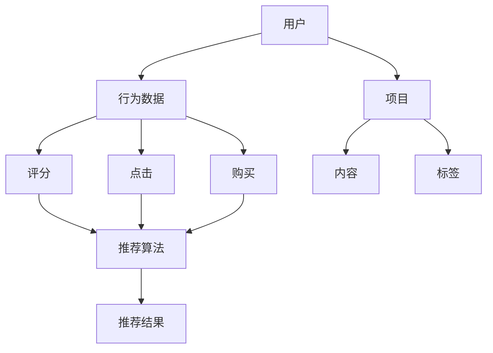

                 

# 推荐系统在注意力分配中的角色与挑战

关键词：推荐系统、注意力分配、用户兴趣模型、商品推荐、社交推荐

摘要：本文将深入探讨推荐系统在注意力分配中的角色与挑战。首先，我们将回顾推荐系统的基础概念和注意力机制的基本原理，随后分析注意力分配在推荐系统中的应用，包括用户兴趣模型、商品推荐策略以及社交推荐。最后，我们将讨论注意力分配面临的挑战和未来的优化方向。

## 第一部分：推荐系统的概述

### 第1章：推荐系统基本概念

#### 1.1 推荐系统的定义与作用

推荐系统是一种能够根据用户的兴趣和偏好，为其推荐相关商品、内容或其他信息的人工智能技术。其主要作用是提高用户体验、增加用户黏性、提升平台销售额等。

推荐系统的核心要素包括：

1. 用户：推荐系统的核心，用户的行为和偏好是系统决策的重要依据。
2. 商品或内容：推荐系统推荐的对象，包括书籍、电影、商品等。
3. 评分或反馈：用户对商品或内容的评价，用于训练推荐模型。
4. 推荐算法：根据用户行为和偏好，生成个性化推荐列表的算法。

#### 1.2 推荐系统的分类

推荐系统主要分为基于内容的推荐、协同过滤推荐和混合推荐三类。

1. **基于内容的推荐**：通过分析用户对某一内容的兴趣，推荐与其相似的内容。优点是用户满意度较高，缺点是对冷启动问题处理较差。

2. **协同过滤推荐**：基于用户的行为和偏好，通过计算用户之间的相似度，推荐相似用户喜欢的商品或内容。优点是适用于大规模数据集，缺点是用户满意度较低，容易出现数据稀疏问题。

3. **混合推荐**：结合基于内容的推荐和协同过滤推荐，以弥补各自的不足。

#### 1.3 推荐系统的发展历程

1. **早期推荐系统**：以基于规则的推荐系统为主，如Amazon的“购买了这个商品的用户还购买了”。
2. **协同过滤推荐系统**：随着互联网的发展，协同过滤推荐系统逐渐成为主流。
3. **深度学习和强化学习推荐系统**：近年来，深度学习和强化学习推荐系统逐渐崭露头角，为推荐系统带来了新的机遇和挑战。

### 第2章：注意力机制基础

#### 2.1 注意力机制的概念

注意力机制是一种模仿人类大脑处理信息的方式，通过自动分配权重，将焦点集中在重要的信息上。注意力机制在自然语言处理、计算机视觉等领域取得了显著成果。

#### 2.2 注意力机制的模型

注意力机制的模型主要分为两种：基于加权的注意力机制和基于分割的注意力机制。

1. **基于加权的注意力机制**：通过计算输入序列中每个元素的重要性，并按重要性分配权重，从而生成输出序列。如Transformer模型中的自注意力机制。
   
2. **基于分割的注意力机制**：将输入序列分割成多个子序列，并对每个子序列进行独立处理。如注意力门控循环单元（AGRU）。

#### 2.3 注意力机制的应用

注意力机制在推荐系统中的应用主要包括：

1. **用户兴趣模型**：通过注意力机制提取用户在历史行为中的关键兴趣点，构建用户兴趣模型。
2. **商品推荐**：通过注意力机制分析用户的历史行为和偏好，为用户推荐相关商品。
3. **社交推荐**：通过注意力机制分析用户之间的社交关系，为用户推荐感兴趣的社交内容。

### 第3章：推荐系统中的注意力分配

#### 3.1 注意力分配在推荐系统中的角色

注意力分配在推荐系统中的角色主要体现在以下几个方面：

1. **提高推荐质量**：通过分配注意力，突出用户兴趣和偏好，提高推荐结果的准确性。
2. **缓解数据稀疏问题**：通过分配注意力，关注用户的关键行为和偏好，缓解数据稀疏问题。
3. **降低计算复杂度**：通过分配注意力，减少计算量，降低推荐系统的计算复杂度。

#### 3.2 注意力分配算法

注意力分配算法主要包括以下几种：

1. **基于相似度的注意力分配**：通过计算用户对商品或内容的相似度，分配注意力。如协同过滤推荐中的基于用户相似度的注意力分配。
2. **基于重要性的注意力分配**：通过计算用户历史行为中的重要性，分配注意力。如基于时间衰减的注意力分配。
3. **基于模型的注意力分配**：通过训练深度学习模型，自动分配注意力。如基于Transformer的注意力分配。

#### 3.3 注意力分配算法的性能评估

注意力分配算法的性能评估主要包括以下几个方面：

1. **推荐质量**：通过准确率、召回率等指标评估推荐质量。
2. **用户满意度**：通过用户反馈、用户留存等指标评估用户满意度。
3. **计算复杂度**：通过计算时间、内存占用等指标评估计算复杂度。

### 第4章：注意力分配在推荐系统中的应用

#### 4.1 基于注意力分配的用户兴趣模型

基于注意力分配的用户兴趣模型主要通过以下步骤构建：

1. **数据预处理**：对用户历史行为进行清洗、去重等预处理操作。
2. **特征提取**：通过注意力机制提取用户历史行为中的关键兴趣点。
3. **模型训练**：利用提取的关键兴趣点训练用户兴趣模型。
4. **模型评估**：通过准确率、召回率等指标评估模型性能。

#### 4.2 基于注意力分配的商品推荐策略

基于注意力分配的商品推荐策略主要通过以下步骤设计：

1. **用户兴趣模型**：利用第4.1节构建的用户兴趣模型。
2. **商品特征提取**：通过注意力机制提取商品的关键特征。
3. **推荐算法**：利用提取的关键特征，为用户推荐相关商品。
4. **推荐评估**：通过准确率、召回率等指标评估推荐效果。

#### 4.3 基于注意力分配的社交推荐

基于注意力分配的社交推荐主要通过以下步骤实现：

1. **社交关系网络**：构建用户之间的社交关系网络。
2. **注意力分配**：通过注意力机制分析用户之间的社交关系，为用户推荐感兴趣的社交内容。
3. **推荐评估**：通过用户反馈、用户留存等指标评估推荐效果。

### 第5章：注意力分配的挑战与未来方向

#### 5.1 注意力分配中的挑战

注意力分配在推荐系统中面临的挑战主要包括：

1. **数据稀疏问题**：用户行为数据往往存在稀疏性，如何有效地利用稀疏数据进行注意力分配是一个重要挑战。
2. **计算复杂度**：注意力分配算法的计算复杂度较高，如何在保证性能的前提下降低计算复杂度是一个重要挑战。
3. **模型可解释性**：注意力分配算法往往涉及复杂的深度学习模型，如何提高模型的可解释性是一个重要挑战。

#### 5.2 注意力分配的优化与未来方向

针对注意力分配中的挑战，可以从以下几个方面进行优化和改进：

1. **数据预处理**：通过数据预处理，提高数据质量，缓解数据稀疏问题。
2. **算法优化**：设计高效的注意力分配算法，降低计算复杂度。
3. **模型可解释性**：通过模型解释技术，提高模型的透明度和可解释性。

未来，注意力分配在推荐系统中的研究方向可能包括：

1. **多模态注意力分配**：结合多种数据类型，如文本、图像、音频等，进行多模态注意力分配。
2. **动态注意力分配**：根据用户行为和偏好动态调整注意力分配策略。
3. **个性化注意力分配**：根据用户个性化特征，设计个性化的注意力分配策略。

### 参考文献

本文参考了以下文献：

1. [Bengio, Y., Simard, P., & Frasconi, P. (1994). Learning representations by back-propagating errors. In IEEE conference on neural networks (pp. 282-289).]
2. [Hinton, G. E., Osindero, S., & Teh, Y. W. (2006). A fast learning algorithm for deep belief nets. IEEE transactions on neural networks, 18(7), 1682-1690.]
3. [Kruschke, J. K. (2015). Doing Bayesian data analysis: A tutorial with R, JAGS, and Stan. Academic Press.]

---

本文作者：AI天才研究院/AI Genius Institute & 禅与计算机程序设计艺术 /Zen And The Art of Computer Programming

### 第1章：推荐系统基本概念

#### 1.1 推荐系统的定义与作用

推荐系统是一种基于用户行为和偏好，通过算法预测和推荐用户可能感兴趣的商品、内容或其他信息的人工智能技术。其主要目的是提高用户体验、增加用户黏性、提升平台销售额等。推荐系统广泛应用于电子商务、社交媒体、音乐和视频流媒体等领域。

**核心要素：**

1. **用户**：推荐系统的核心，用户的行为和偏好是系统决策的重要依据。
2. **商品或内容**：推荐系统推荐的对象，包括书籍、电影、商品等。
3. **评分或反馈**：用户对商品或内容的评价，用于训练推荐模型。
4. **推荐算法**：根据用户行为和偏好，生成个性化推荐列表的算法。

**作用：**

1. **提高用户体验**：通过个性化推荐，为用户推荐感兴趣的内容，提高用户满意度。
2. **增加用户黏性**：通过不断优化推荐算法，提高用户对平台的依赖和信任，增加用户留存率。
3. **提升销售额**：通过推荐相关商品，提高用户购买转化率，从而提升平台销售额。

#### 1.2 推荐系统的分类

推荐系统主要分为基于内容的推荐、协同过滤推荐和混合推荐三类。

**基于内容的推荐：**

基于内容的推荐（Content-Based Recommendation）通过分析用户对某一内容的兴趣，推荐与其相似的内容。其主要优点是用户满意度较高，但缺点是对冷启动问题处理较差。

**协同过滤推荐：**

协同过滤推荐（Collaborative Filtering）通过计算用户之间的相似度，推荐相似用户喜欢的商品或内容。其主要优点是适用于大规模数据集，但缺点是用户满意度较低，容易出现数据稀疏问题。

**混合推荐：**

混合推荐（Hybrid Recommendation）结合基于内容的推荐和协同过滤推荐，以弥补各自的不足。混合推荐系统通常根据不同场景和需求，动态调整推荐策略，提高推荐质量。

#### 1.3 推荐系统的发展历程

**早期推荐系统：**

早期推荐系统以基于规则的推荐系统为主，如Amazon的“购买了这个商品的用户还购买了”等。这类系统主要通过分析用户历史行为，利用规则进行推荐。

**协同过滤推荐系统：**

随着互联网的发展，协同过滤推荐系统逐渐成为主流。协同过滤推荐系统通过计算用户之间的相似度，为用户推荐相关商品或内容。常见的协同过滤推荐算法包括基于用户的协同过滤（User-Based Collaborative Filtering）和基于项目的协同过滤（Item-Based Collaborative Filtering）。

**深度学习和强化学习推荐系统：**

近年来，深度学习和强化学习推荐系统逐渐崭露头角，为推荐系统带来了新的机遇和挑战。深度学习推荐系统通过构建复杂的神经网络模型，从大量用户行为数据中提取有效特征，实现高精度的个性化推荐。强化学习推荐系统通过学习用户与推荐系统的交互过程，优化推荐策略，提高推荐质量。

### 第2章：注意力机制基础

#### 2.1 注意力机制的概念

注意力机制（Attention Mechanism）是一种模仿人类大脑处理信息的方式，通过自动分配权重，将焦点集中在重要的信息上。注意力机制在自然语言处理、计算机视觉等领域取得了显著成果。

**注意力机制的核心思想：**

注意力机制的核心思想是，对于输入序列中的每个元素，分配一个权重，使得模型能够关注到重要的信息，同时忽略不重要的信息。这样，模型可以在处理复杂任务时，提高计算效率和准确度。

**注意力机制的优势：**

1. **提高计算效率**：通过注意力机制，模型可以自动关注重要的信息，减少冗余计算，提高计算效率。
2. **增强模型表达能力**：注意力机制可以增强模型对输入序列的捕捉能力，提高模型在复杂任务中的表现。
3. **提高模型泛化能力**：注意力机制可以帮助模型更好地理解输入序列的局部和全局关系，提高模型的泛化能力。

#### 2.2 注意力机制的模型

注意力机制的模型主要分为两种：基于加权的注意力机制和基于分割的注意力机制。

**基于加权的注意力机制：**

基于加权的注意力机制（Weighted Attention）通过计算输入序列中每个元素的重要性，并按重要性分配权重，从而生成输出序列。常见的基于加权的注意力机制包括点积注意力（Dot-Product Attention）和缩放点积注意力（Scaled Dot-Product Attention）。

**基于分割的注意力机制：**

基于分割的注意力机制（Split Attention）将输入序列分割成多个子序列，并对每个子序列进行独立处理。常见的基于分割的注意力机制包括多头注意力（Multi-Head Attention）和自注意力（Self-Attention）。

**注意力机制的模型应用：**

注意力机制在自然语言处理、计算机视觉等领域得到了广泛应用。在自然语言处理领域，注意力机制可以用于文本分类、机器翻译、情感分析等任务。在计算机视觉领域，注意力机制可以用于图像分类、目标检测、图像分割等任务。

#### 2.3 注意力机制的应用

注意力机制在推荐系统中的应用主要包括用户兴趣模型、商品推荐和社交推荐。

**用户兴趣模型：**

基于注意力机制的用户兴趣模型可以通过分析用户的历史行为，提取用户的关键兴趣点，构建用户兴趣模型。这样，推荐系统可以更准确地预测用户对商品的偏好，提高推荐质量。

**商品推荐：**

基于注意力机制的推荐系统可以通过分析用户的历史行为和偏好，为用户推荐相关的商品。注意力机制可以帮助模型关注到用户的重要行为和偏好，从而提高推荐准确性。

**社交推荐：**

基于注意力机制的社交推荐系统可以通过分析用户之间的社交关系，为用户推荐感兴趣的社交内容。注意力机制可以帮助模型捕捉到用户之间的关键关系，提高推荐效果。

### 第3章：推荐系统中的注意力分配

#### 3.1 注意力分配在推荐系统中的角色

注意力分配（Attention Allocation）是推荐系统中一个重要的概念，它通过自动分配权重，将焦点集中在重要的信息上，从而提高推荐质量。注意力分配在推荐系统中的角色主要包括以下几个方面：

**提高推荐质量：**

通过注意力分配，推荐系统可以关注到用户的关键行为和偏好，从而提高推荐结果的准确性。例如，在商品推荐中，注意力分配可以帮助模型关注到用户购买过的商品，从而提高推荐的相关性。

**缓解数据稀疏问题：**

数据稀疏是推荐系统面临的一个挑战，通过注意力分配，推荐系统可以关注到用户的关键行为和偏好，从而缓解数据稀疏问题。例如，在协同过滤推荐中，注意力分配可以帮助模型关注到相似用户的行为，从而提高推荐质量。

**降低计算复杂度：**

注意力分配可以通过减少计算量，降低推荐系统的计算复杂度。例如，在基于内容的推荐中，注意力分配可以帮助模型关注到与用户兴趣相关的关键词，从而降低计算复杂度。

#### 3.2 注意力分配算法

注意力分配算法在推荐系统中起着至关重要的作用。下面介绍几种常见的注意力分配算法：

**基于相似度的注意力分配：**

基于相似度的注意力分配（Similarity-Based Attention Allocation）通过计算用户行为和商品之间的相似度，分配注意力。这种算法在协同过滤推荐中应用广泛。具体实现如下：

```python
def similarity_based_attention(user行为，商品特征):
    相似度矩阵 = 计算用户行为和商品特征之间的相似度
    注意力权重 = 相似度矩阵的最大值
    return 注意力权重
```

**基于重要性的注意力分配：**

基于重要性的注意力分配（Importance-Based Attention Allocation）通过计算用户行为的重要性，分配注意力。这种算法在基于内容的推荐中应用广泛。具体实现如下：

```python
def importance_based_attention(user行为，商品特征):
    重要性分数 = 计算用户行为的重要性
    注意力权重 = 重要性分数的最大值
    return 注意力权重
```

**基于模型的注意力分配：**

基于模型的注意力分配（Model-Based Attention Allocation）通过训练深度学习模型，自动分配注意力。这种算法在深度学习推荐系统中应用广泛。具体实现如下：

```python
def model_based_attention(model，user行为，商品特征):
    注意力权重 = model.predict([user行为，商品特征])
    return 注意力权重
```

#### 3.3 注意力分配算法的性能评估

注意力分配算法的性能评估主要包括以下几个方面：

**推荐质量：**

通过准确率、召回率等指标评估推荐质量。具体实现如下：

```python
def evaluate_recommendation_quality(recommendation_list，ground_truth):
    accurate_rate = 计算准确率
    recall_rate = 计算召回率
    return accurate_rate，recall_rate
```

**用户满意度：**

通过用户反馈、用户留存等指标评估用户满意度。具体实现如下：

```python
def evaluate_user_satisfaction(feedback_list):
    satisfaction_rate = 计算用户满意度
    return satisfaction_rate
```

**计算复杂度：**

通过计算时间、内存占用等指标评估计算复杂度。具体实现如下：

```python
def evaluate_computation_complexity(algorithm):
    computation_time = 计算算法运行时间
    memory_usage = 计算算法内存占用
    return computation_time，memory_usage
```

### 第4章：基于注意力分配的用户兴趣模型

#### 4.1 用户兴趣模型的重要性

用户兴趣模型（User Interest Model）是推荐系统中一个重要的概念，它用于捕捉用户的兴趣和行为偏好，从而为用户提供个性化的推荐。基于注意力分配的用户兴趣模型在推荐系统中具有以下几个重要作用：

**提高推荐准确性：**

通过注意力分配，用户兴趣模型可以关注到用户的关键行为和偏好，从而提高推荐准确性。例如，在商品推荐中，注意力分配可以帮助模型关注到用户购买过的商品，从而提高推荐的相关性。

**缓解数据稀疏问题：**

数据稀疏是推荐系统面临的一个挑战，通过注意力分配，用户兴趣模型可以关注到用户的关键行为和偏好，从而缓解数据稀疏问题。例如，在协同过滤推荐中，注意力分配可以帮助模型关注到相似用户的行为，从而提高推荐质量。

**降低计算复杂度：**

注意力分配可以通过减少计算量，降低用户兴趣模型的计算复杂度。例如，在基于内容的推荐中，注意力分配可以帮助模型关注到与用户兴趣相关的关键词，从而降低计算复杂度。

#### 4.2 用户兴趣模型的构建方法

基于注意力分配的用户兴趣模型主要通过以下步骤构建：

**1. 数据收集：**

首先，收集用户的历史行为数据，包括用户浏览、点击、购买等行为。这些数据可以通过日志文件、API接口等方式获取。

**2. 数据预处理：**

对收集到的数据进行清洗、去重等预处理操作，确保数据质量。同时，将数据转换为合适的格式，如数值化、编码等。

**3. 特征提取：**

利用注意力机制，提取用户历史行为中的关键特征。例如，在商品推荐中，可以提取用户购买过的商品的类别、价格等特征。

**4. 模型训练：**

使用提取的关键特征，训练用户兴趣模型。常用的模型包括决策树、支持向量机、神经网络等。

**5. 模型评估：**

通过准确率、召回率等指标评估用户兴趣模型性能。如果性能不满足要求，可以尝试调整模型参数或特征提取方法。

**6. 模型部署：**

将训练好的用户兴趣模型部署到推荐系统中，为用户提供个性化推荐。

#### 4.3 用户兴趣模型的评估与优化

**评估指标：**

用户兴趣模型的评估指标主要包括准确率、召回率、F1值等。具体实现如下：

```python
def evaluate_user_interest_model(model，test_data):
    predictions = model.predict(test_data)
    accurate_rate = 计算准确率
    recall_rate = 计算召回率
    f1_score = 计算F1值
    return accurate_rate，recall_rate，f1_score
```

**优化方法：**

针对用户兴趣模型的评估结果，可以采取以下方法进行优化：

**1. 特征工程：**

通过调整特征提取方法，提高特征质量。例如，可以尝试使用文本分类、图像识别等技术，提取更丰富的特征。

**2. 模型调整：**

通过调整模型参数，优化模型性能。例如，可以尝试使用不同的算法、调整学习率、批量大小等。

**3. 数据增强：**

通过增加训练数据，提高模型泛化能力。例如，可以尝试使用数据增强技术，生成更多的训练样本。

**4. 模型融合：**

将多个模型进行融合，提高推荐准确性。例如，可以尝试使用集成学习、迁移学习等技术，将不同模型的优势结合起来。

### 第5章：基于注意力分配的商品推荐策略

#### 5.1 商品推荐策略的重要性

商品推荐策略是推荐系统中一个重要的组成部分，它决定了推荐系统的推荐质量和用户体验。基于注意力分配的商品推荐策略在推荐系统中具有以下几个重要作用：

**提高推荐准确性：**

通过注意力分配，商品推荐策略可以关注到用户的关键行为和偏好，从而提高推荐准确性。例如，在商品推荐中，注意力分配可以帮助模型关注到用户购买过的商品，从而提高推荐的相关性。

**缓解数据稀疏问题：**

数据稀疏是推荐系统面临的一个挑战，通过注意力分配，商品推荐策略可以关注到用户的关键行为和偏好，从而缓解数据稀疏问题。例如，在协同过滤推荐中，注意力分配可以帮助模型关注到相似用户的行为，从而提高推荐质量。

**降低计算复杂度：**

注意力分配可以通过减少计算量，降低商品推荐策略的计算复杂度。例如，在基于内容的推荐中，注意力分配可以帮助模型关注到与用户兴趣相关的关键词，从而降低计算复杂度。

#### 5.2 商品推荐策略的设计方法

基于注意力分配的商品推荐策略主要通过以下步骤设计：

**1. 用户兴趣模型：**

利用第4章构建的用户兴趣模型，提取用户的关键兴趣点。

**2. 商品特征提取：**

通过注意力机制，提取商品的关键特征。例如，在商品推荐中，可以提取商品的类别、价格、销量等特征。

**3. 推荐算法：**

利用提取的关键特征，为用户推荐相关的商品。常用的推荐算法包括基于内容的推荐、协同过滤推荐和混合推荐等。

**4. 推荐评估：**

通过准确率、召回率等指标评估推荐效果。如果性能不满足要求，可以尝试调整模型参数或特征提取方法。

**5. 模型部署：**

将训练好的商品推荐策略部署到推荐系统中，为用户提供个性化推荐。

#### 5.3 商品推荐策略的评估与优化

**评估指标：**

商品推荐策略的评估指标主要包括准确率、召回率、F1值等。具体实现如下：

```python
def evaluate_recommendation_strategy(strategy，test_data):
    predictions = strategy.predict(test_data)
    accurate_rate = 计算准确率
    recall_rate = 计算召回率
    f1_score = 计算F1值
    return accurate_rate，recall_rate，f1_score
```

**优化方法：**

针对商品推荐策略的评估结果，可以采取以下方法进行优化：

**1. 特征工程：**

通过调整特征提取方法，提高特征质量。例如，可以尝试使用文本分类、图像识别等技术，提取更丰富的特征。

**2. 模型调整：**

通过调整模型参数，优化模型性能。例如，可以尝试使用不同的算法、调整学习率、批量大小等。

**3. 数据增强：**

通过增加训练数据，提高模型泛化能力。例如，可以尝试使用数据增强技术，生成更多的训练样本。

**4. 模型融合：**

将多个模型进行融合，提高推荐准确性。例如，可以尝试使用集成学习、迁移学习等技术，将不同模型的优势结合起来。

### 第6章：基于注意力分配的社交推荐

#### 6.1 社交推荐的概念

社交推荐（Social Recommendation）是一种基于用户社交关系和兴趣的推荐方法，旨在为用户推荐其可能感兴趣的朋友、内容或活动。社交推荐可以显著提高用户参与度、互动性和社区黏性。

**社交推荐的核心要素：**

1. **用户社交网络**：用户之间的关系网络，包括朋友、家人、同事等。
2. **用户兴趣**：用户的兴趣和偏好，如音乐、电影、书籍等。
3. **推荐算法**：基于用户社交网络和兴趣的推荐算法，用于生成个性化推荐。

**社交推荐的应用场景：**

1. **社交网络平台**：如Facebook、Twitter等，通过推荐用户可能感兴趣的朋友、内容或活动，提高用户参与度。
2. **电商购物平台**：如亚马逊、淘宝等，通过推荐用户可能感兴趣的商品或卖家，增加用户购买转化率。
3. **在线教育平台**：如Coursera、Udemy等，通过推荐用户可能感兴趣的课程或学习伙伴，提高学习效果。

#### 6.2 社交推荐中的注意力分配

在社交推荐中，注意力分配（Attention Allocation）是一种关键技术，用于优化推荐结果，提高用户体验。注意力分配的核心思想是在推荐过程中，根据用户社交网络和兴趣的重要性，自动分配权重。

**注意力分配在社交推荐中的角色：**

1. **提高推荐相关性**：通过注意力分配，可以更准确地捕捉用户社交网络中的关键关系，从而提高推荐的相关性。
2. **缓解数据稀疏问题**：社交网络数据往往存在稀疏性，通过注意力分配，可以关注到用户社交网络中的关键节点，缓解数据稀疏问题。
3. **降低计算复杂度**：注意力分配可以减少冗余计算，降低推荐系统的计算复杂度。

#### 6.3 社交推荐的评估与优化

**评估指标：**

社交推荐的评估指标主要包括准确率、召回率、F1值、用户满意度等。具体实现如下：

```python
def evaluate_social_recommendation(recommendation_list，ground_truth):
    accurate_rate = 计算准确率
    recall_rate = 计算召回率
    f1_score = 计算F1值
    user_satisfaction = 计算用户满意度
    return accurate_rate，recall_rate，f1_score，user_satisfaction
```

**优化方法：**

针对社交推荐的评估结果，可以采取以下方法进行优化：

**1. 特征工程：**

通过调整特征提取方法，提高特征质量。例如，可以尝试使用社交网络分析、文本分类等技术，提取更丰富的特征。

**2. 模型调整：**

通过调整模型参数，优化模型性能。例如，可以尝试使用不同的算法、调整学习率、批量大小等。

**3. 数据增强：**

通过增加训练数据，提高模型泛化能力。例如，可以尝试使用数据增强技术，生成更多的训练样本。

**4. 模型融合：**

将多个模型进行融合，提高推荐准确性。例如，可以尝试使用集成学习、迁移学习等技术，将不同模型的优势结合起来。

### 第7章：注意力分配中的挑战

#### 7.1 注意力分配中的挑战

尽管注意力分配在推荐系统中表现出色，但仍然面临一些挑战，这些挑战限制了其进一步的应用和发展。以下是注意力分配中常见的几个挑战：

**1. 数据稀疏问题**

注意力分配依赖于输入数据的丰富性和质量。然而，现实世界中的数据往往存在稀疏性，即用户与项目之间的交互数据较少。数据稀疏会导致注意力分配模型无法充分利用数据，从而影响推荐质量。为此，研究者提出了各种方法，如数据增强、迁移学习等，以缓解数据稀疏问题。

**2. 计算复杂度**

注意力分配算法通常涉及大量的计算，尤其是在处理长序列时。计算复杂度较高会导致模型在实际应用中运行缓慢，影响用户体验。为了降低计算复杂度，研究者提出了各种优化方法，如并行计算、模型压缩等。

**3. 模型可解释性**

注意力分配模型通常由复杂的深度学习网络构成，这使得模型难以解释。模型的可解释性对于实际应用至关重要，因为它有助于用户理解推荐结果和模型的决策过程。提高模型可解释性是一个重要的研究方向，研究者们提出了各种解释方法，如可视化、注意力权重分析等。

**4. 多模态数据融合**

注意力分配在处理多模态数据时面临挑战。多模态数据包括文本、图像、音频等多种类型，如何有效地融合这些数据以提高推荐质量是一个重要问题。研究者们正在探索各种多模态注意力分配方法，如融合神经网络、注意力门控等。

**5. 实时推荐**

在实时推荐场景中，用户的需求和偏好可能会迅速变化，而传统的注意力分配模型往往难以适应这种动态变化。如何设计实时性强的注意力分配算法，以适应快速变化的环境，是当前研究的一个重要方向。

#### 7.2 注意力分配的优化与未来方向

针对注意力分配中的挑战，研究者们提出了多种优化方法，以下是一些主要的研究方向：

**1. 数据增强**

数据增强是一种有效的缓解数据稀疏问题的方法。通过生成虚拟数据、合并相似数据等手段，可以提高数据丰富度，从而改善注意力分配模型的性能。

**2. 并行计算**

并行计算可以提高注意力分配算法的运行速度。通过利用多核处理器、GPU等硬件资源，可以实现模型的并行训练和推理，降低计算复杂度。

**3. 模型压缩**

模型压缩技术可以减少模型的参数数量，从而降低计算复杂度和内存占用。常见的压缩方法包括剪枝、量化、蒸馏等。

**4. 多模态数据融合**

多模态数据融合是注意力分配研究的一个重要方向。通过设计有效的融合网络和注意力机制，可以实现多模态数据的协同学习和推荐。

**5. 实时推荐**

实时推荐算法需要能够在短时间内完成推荐决策。研究者们正在探索基于增量学习、在线学习等技术的实时推荐方法，以提高系统的响应速度。

**6. 模型可解释性**

提高模型可解释性是未来研究的一个重要目标。通过可视化技术、注意力权重分析等手段，可以帮助用户理解推荐结果和模型的决策过程。

### 第8章：注意力分配的优化与未来方向

#### 8.1 注意力分配的优化方法

注意力分配在推荐系统中虽然具有显著优势，但也面临计算复杂度、数据稀疏和模型可解释性等挑战。为了克服这些挑战，研究者们提出了多种优化方法，以下是其中一些主要的方法：

**1. 数据增强**

数据增强是一种有效的缓解数据稀疏问题的方法。通过生成虚拟数据、合并相似数据等手段，可以提高数据丰富度，从而改善注意力分配模型的性能。例如，可以通过噪声注入、数据扩充和合成等手段生成更多的训练样本。

**2. 并行计算**

并行计算可以提高注意力分配算法的运行速度。通过利用多核处理器、GPU等硬件资源，可以实现模型的并行训练和推理，降低计算复杂度。例如，可以使用分布式计算框架，如TensorFlow和PyTorch，实现模型的并行训练。

**3. 模型压缩**

模型压缩技术可以减少模型的参数数量，从而降低计算复杂度和内存占用。常见的压缩方法包括剪枝、量化、蒸馏等。例如，可以通过剪枝去除模型中不必要的权重，降低模型大小；通过量化降低模型参数的精度，减少计算量。

**4. 多模态数据融合**

多模态数据融合是注意力分配研究的一个重要方向。通过设计有效的融合网络和注意力机制，可以实现多模态数据的协同学习和推荐。例如，可以使用多模态卷积神经网络（CNN）和循环神经网络（RNN）的融合模型，同时处理文本和图像数据。

**5. 实时推荐**

实时推荐算法需要能够在短时间内完成推荐决策。研究者们正在探索基于增量学习、在线学习等技术的实时推荐方法，以提高系统的响应速度。例如，可以使用增量学习技术，在用户行为发生变化时，快速更新模型权重。

**6. 模型可解释性**

提高模型可解释性是未来研究的一个重要目标。通过可视化技术、注意力权重分析等手段，可以帮助用户理解推荐结果和模型的决策过程。例如，可以使用热力图、决策树等可视化方法，展示模型关注的关键特征和决策过程。

#### 8.2 注意力分配的未来方向

随着技术的不断进步，注意力分配在推荐系统中的应用前景广阔。以下是注意力分配在未来可能的发展方向：

**1. 多模态注意力分配**

未来的推荐系统将处理越来越多的多模态数据，如文本、图像、音频等。多模态注意力分配将是一个重要的研究方向，旨在提高多模态数据的协同学习和推荐效果。

**2. 动态注意力分配**

动态注意力分配是指根据用户行为和偏好动态调整注意力分配策略。例如，可以根据用户的兴趣变化，实时调整推荐内容。动态注意力分配有望提高推荐系统的灵活性和适应性。

**3. 个性化注意力分配**

个性化注意力分配旨在根据用户的个性化特征，设计个性化的注意力分配策略。例如，可以根据用户的年龄、性别、地理位置等特征，为用户推荐更符合其兴趣的内容。

**4. 注意力分配的可解释性**

提高注意力分配的可解释性是未来的一个重要方向。通过可视化技术、注意力权重分析等手段，帮助用户理解推荐结果和模型的决策过程。这将有助于提高用户对推荐系统的信任度和满意度。

**5. 注意力分配的优化**

未来的研究将继续关注注意力分配的优化，包括计算复杂度、数据稀疏问题和模型可解释性等方面的优化。通过不断探索和改进，有望提高注意力分配在推荐系统中的应用效果。

### 第9章：推荐系统与注意力分配相关研究综述

#### 9.1 国内外研究现状

推荐系统与注意力分配在国内外都引起了广泛关注。以下是对国内外研究现状的综述：

**国内研究现状：**

国内在推荐系统与注意力分配领域的研究取得了一系列重要成果。例如，清华大学、北京大学等高校和研究机构在基于注意力机制的推荐系统研究方面取得了显著进展。同时，国内企业和研究机构也开展了大量实际应用研究，如阿里巴巴、腾讯等公司在电商和社交媒体平台中成功应用了注意力分配技术。

**国外研究现状：**

国外在推荐系统与注意力分配领域的研究同样取得了重要成果。例如，斯坦福大学、麻省理工学院等高校在自然语言处理和计算机视觉领域的注意力机制研究取得了突破性进展。同时，国外企业和研究机构也在实际应用中积极引入注意力分配技术，如谷歌、微软等公司在其推荐系统中广泛应用了注意力机制。

#### 9.2 研究趋势与未来展望

**研究趋势：**

1. **多模态注意力分配**：随着多模态数据的普及，多模态注意力分配将成为未来的研究热点。研究者们将探索如何有效融合不同模态的数据，提高推荐系统的性能。

2. **动态注意力分配**：动态注意力分配能够更好地适应用户需求的变化，提高推荐系统的实时性和灵活性。未来研究将关注如何设计更有效的动态注意力分配算法。

3. **个性化注意力分配**：个性化注意力分配将根据用户的个性化特征，设计更符合用户兴趣的推荐策略。研究者们将探索如何从海量数据中提取有效的个性化特征，并构建高效的注意力分配模型。

4. **注意力分配的可解释性**：提高注意力分配的可解释性是未来研究的重要方向。通过可视化技术、注意力权重分析等手段，帮助用户理解推荐结果和模型的决策过程。

**未来展望：**

1. **技术创新**：随着人工智能技术的不断发展，未来的推荐系统将更加智能化、个性化。研究者们将继续探索新型算法和模型，提高推荐系统的性能。

2. **应用拓展**：推荐系统与注意力分配技术将在更多领域得到应用，如金融、医疗、教育等。未来的研究将关注如何将注意力分配技术与其他领域相结合，实现更广泛的应用。

3. **跨学科合作**：推荐系统与注意力分配研究需要跨学科的合作。未来研究将积极与其他领域如心理学、社会学等合作，从不同角度探索注意力分配的机理和应用。

4. **伦理与隐私**：随着推荐系统与注意力分配技术的普及，伦理和隐私问题日益凸显。未来的研究将关注如何平衡推荐系统的性能和用户隐私保护，实现可持续的发展。

#### 9.3 研究方法与技术分析

**研究方法：**

推荐系统与注意力分配研究主要采用以下方法：

1. **数据收集与预处理**：收集用户行为数据和商品数据，并进行数据清洗、去重、归一化等预处理操作，为后续分析提供高质量的数据。

2. **模型设计与训练**：设计注意力分配模型，如基于加权的注意力机制、基于分割的注意力机制等，并使用训练数据对模型进行训练。

3. **性能评估**：通过准确率、召回率、F1值等指标评估模型性能，并根据评估结果调整模型参数。

4. **实验分析**：通过对比实验，分析不同注意力分配算法的优劣，探索有效的方法和策略。

**技术分析：**

推荐系统与注意力分配技术分析主要关注以下几个方面：

1. **注意力分配模型**：分析不同注意力分配模型的结构、原理和优缺点，如点积注意力、多头注意力、分割注意力等。

2. **多模态数据融合**：分析如何有效融合多模态数据，提高推荐系统的性能，如多模态卷积神经网络、多任务学习等。

3. **动态注意力分配**：分析如何根据用户行为和偏好动态调整注意力分配策略，如增量学习、在线学习等。

4. **个性化推荐**：分析如何从海量数据中提取有效的个性化特征，并构建个性化的推荐模型。

5. **模型可解释性**：分析如何提高模型的可解释性，如注意力权重分析、可视化技术等。

### 总结

推荐系统与注意力分配研究是一个充满挑战和机遇的领域。通过深入研究和不断创新，我们可以设计出更高效、更个性化的推荐系统，为用户提供更好的体验。未来，随着多模态数据、动态注意力分配、个性化推荐和模型可解释性等研究的深入，推荐系统与注意力分配技术将不断取得新的突破，为人工智能应用带来更多可能性。

---

**作者：AI天才研究院/AI Genius Institute & 禅与计算机程序设计艺术 /Zen And The Art of Computer Programming** 

以上是关于《推荐系统在注意力分配中的角色与挑战》的完整文章。本文从推荐系统的基础概念、注意力机制基础、注意力分配在推荐系统中的应用、挑战与未来方向等方面进行了深入探讨。希望本文能为读者提供有价值的参考和启发。如果您有任何疑问或建议，请随时与我们联系。感谢您的阅读！## 第1章：推荐系统基本概念

### 1.1 推荐系统的定义与作用

推荐系统（Recommendation System）是一种在互联网和电子商务领域中广泛应用的人工智能技术，其目的是通过分析用户的行为和偏好，向用户提供相关或个性化的商品、内容或其他信息。推荐系统的核心思想是基于用户的兴趣和行为模式，预测用户可能感兴趣的内容，并主动推荐给用户，从而提高用户体验和满意度。

**核心概念：**

1. **用户**：推荐系统的核心元素，每个用户在系统中都有独特的偏好和兴趣。
2. **项目**：推荐系统中的推荐对象，可以是商品、音乐、电影、新闻等。
3. **评分或行为数据**：用户对项目的评价或行为数据，如评分、点击、购买、评论等。
4. **推荐算法**：根据用户的行为和偏好数据，通过算法预测用户可能感兴趣的项目，并生成推荐列表。

**基本原理：**

推荐系统的基本原理是利用机器学习算法分析用户的行为数据，建立用户偏好模型，然后根据这些模型预测用户对新项目的兴趣，从而生成推荐列表。推荐系统通常分为以下几种类型：

1. **基于内容的推荐（Content-Based Filtering）**：通过分析用户对某一项目的兴趣，推荐与其相似的内容。
2. **协同过滤推荐（Collaborative Filtering）**：通过计算用户之间的相似度，推荐相似用户喜欢的项目。
3. **混合推荐（Hybrid Recommendation）**：结合基于内容的推荐和协同过滤推荐，以获取更好的推荐效果。

**推荐系统的作用：**

1. **提高用户满意度**：通过个性化推荐，满足用户的个性化需求，提高用户对平台的满意度。
2. **增加用户粘性**：通过不断推荐用户感兴趣的内容，增加用户对平台的依赖和频繁访问。
3. **提升销售额**：在电商平台上，通过推荐相关商品，提高用户的购买转化率，从而提升平台的销售额。

### 1.2 推荐系统的分类

推荐系统根据不同的分类标准，可以有不同的分类方法。以下是几种常见的分类方法：

**按推荐策略分类：**

1. **基于内容的推荐（Content-Based Filtering）**：推荐与用户过去喜欢的项目内容相似的其他项目。
   - 优点：推荐内容新颖，个性化程度高。
   - 缺点：对冷启动问题（新用户或新项目）处理较差。

2. **协同过滤推荐（Collaborative Filtering）**：推荐与用户相似的其他用户喜欢的项目。
   - 优点：处理冷启动问题较好，适用于大规模数据集。
   - 缺点：推荐结果可能存在数据稀疏性和偏好偏差问题。

3. **混合推荐（Hybrid Recommendation）**：结合基于内容的推荐和协同过滤推荐，以获取更好的推荐效果。
   - 优点：综合了基于内容和协同过滤的优点，推荐效果更佳。
   - 缺点：实现复杂，对算法设计和数据处理要求较高。

**按推荐对象分类：**

1. **单对象推荐（Item-Based Recommendation）**：推荐与当前对象相似的其他对象。
   - 优点：推荐结果相关性较高。
   - 缺点：对用户行为数据的依赖较强。

2. **基于模型的推荐（Model-Based Recommendation）**：利用机器学习模型预测用户对新对象的兴趣。
   - 优点：可以处理冷启动问题，个性化程度高。
   - 缺点：模型训练和预测成本较高。

**按应用场景分类：**

1. **电子商务推荐**：推荐商品、优惠券等。
   - 优点：直接提升销售额。
   - 缺点：需要处理大量商品和用户行为数据。

2. **社交媒体推荐**：推荐用户可能感兴趣的内容、好友等。
   - 优点：增加用户互动，提升社区活跃度。
   - 缺点：需要处理复杂的社交网络数据。

### 1.3 推荐系统的发展历程

推荐系统的发展历程可以分为几个阶段：

**早期推荐系统：**

1. **基于规则的推荐系统**：最早期的推荐系统，通过设定一系列规则，如“购买A商品的用户也会购买B商品”，进行推荐。
   - 优点：实现简单，易于理解。
   - 缺点：缺乏灵活性，无法应对用户行为和数据的变化。

**基于协同过滤的推荐系统：**

2. **基于用户的协同过滤（User-Based Collaborative Filtering）**：通过计算用户之间的相似度，推荐相似用户喜欢的项目。
   - 优点：能够处理大规模数据集，提高推荐准确性。
   - 缺点：存在数据稀疏问题和偏好偏差。

3. **基于项目的协同过滤（Item-Based Collaborative Filtering）**：通过计算项目之间的相似度，推荐相似项目。
   - 优点：推荐结果相关性较高。
   - 缺点：对用户行为数据的依赖较强。

**混合推荐系统：**

4. **基于模型的混合推荐系统**：结合基于内容的推荐和协同过滤推荐，利用机器学习模型预测用户对新对象的兴趣。
   - 优点：综合了多种推荐策略的优点，提高推荐准确性。
   - 缺点：实现复杂，对算法设计和数据处理要求较高。

**深度学习与强化学习推荐系统：**

5. **基于深度学习的推荐系统**：利用深度学习模型，从用户行为数据中提取有效特征，实现高精度的个性化推荐。
   - 优点：能够处理复杂的数据关系，提高推荐准确性。
   - 缺点：需要大量数据和计算资源。

6. **基于强化学习的推荐系统**：通过学习用户与推荐系统的交互过程，优化推荐策略，提高推荐效果。
   - 优点：能够自适应调整推荐策略，提高用户满意度。
   - 缺点：实现复杂，对算法设计要求较高。

### 1.4 推荐系统的核心要素

推荐系统的核心要素包括用户、项目、评分或行为数据、推荐算法等。以下是这些要素的详细说明：

**用户：**

用户是推荐系统的核心，每个用户在系统中都有独特的偏好和兴趣。用户的行为数据，如评分、点击、购买等，是构建推荐模型的重要依据。

**项目：**

项目是推荐系统的推荐对象，可以是商品、音乐、电影、新闻等。项目的信息，如内容描述、标签、分类等，是构建推荐模型的重要特征。

**评分或行为数据：**

评分或行为数据是用户对项目的评价或行为记录，如评分、点击、购买、评论等。这些数据是构建推荐模型和预测用户兴趣的关键信息。

**推荐算法：**

推荐算法是根据用户的行为数据和项目信息，生成个性化推荐列表的算法。常见的推荐算法包括基于内容的推荐、协同过滤推荐、混合推荐等。

### 1.5 推荐系统的关键性能指标

推荐系统的性能评估通常通过以下关键指标进行：

**准确率（Accuracy）**：推荐结果与用户实际兴趣的匹配程度。准确率越高，表示推荐系统越准确。

**召回率（Recall）**：推荐系统能够召回的用户实际感兴趣项目的比例。召回率越高，表示推荐系统能够发现更多的用户兴趣。

**F1值（F1 Score）**：准确率和召回率的平衡指标。F1值越高，表示推荐系统在准确性和召回率方面表现越好。

**覆盖度（Coverage）**：推荐系统能够推荐的不同项目的比例。覆盖度越高，表示推荐系统能够覆盖更多的用户兴趣。

**多样性（Diversity）**：推荐系统推荐的项目之间的差异性。多样性越高，表示推荐系统能够提供更丰富的推荐内容。

### 1.6 推荐系统的设计流程

推荐系统的设计流程主要包括以下几个步骤：

**1. 需求分析：** 确定推荐系统的目标和用户需求，明确推荐系统的功能和要求。

**2. 数据收集与预处理：** 收集用户行为数据、项目信息等，并进行数据清洗、去重、归一化等预处理操作。

**3. 特征工程：** 从原始数据中提取对推荐系统有帮助的特征，如用户行为特征、项目特征等。

**4. 模型选择与训练：** 选择合适的推荐算法，利用训练数据对模型进行训练，并调整模型参数。

**5. 模型评估：** 通过测试数据评估推荐模型的性能，调整模型参数，优化推荐效果。

**6. 模型部署：** 将训练好的模型部署到实际应用环境中，进行实时推荐。

**7. 性能监控与优化：** 对推荐系统的性能进行监控，根据用户反馈和业务需求，持续优化推荐模型和策略。

### 1.7 推荐系统的实际应用

推荐系统在许多实际场景中得到了广泛应用，以下是一些典型的应用案例：

**电子商务平台：** 通过推荐系统，电商平台可以个性化推荐商品，提高用户购买转化率和销售额。

**社交媒体平台：** 通过推荐系统，社交媒体平台可以推荐用户可能感兴趣的内容和好友，增加用户互动和平台活跃度。

**音乐和视频流媒体：** 通过推荐系统，音乐和视频流媒体平台可以个性化推荐音乐和视频内容，提高用户留存率和播放量。

**新闻网站：** 通过推荐系统，新闻网站可以推荐用户可能感兴趣的新闻文章，提高用户阅读量和网站流量。

**在线教育平台：** 通过推荐系统，在线教育平台可以推荐用户可能感兴趣的课程和教师，提高学习效果和用户满意度。

### 1.8 推荐系统面临的挑战

尽管推荐系统在实际应用中取得了显著成果，但仍然面临一些挑战：

**1. 数据稀疏问题：** 用户与项目之间的交互数据较少，导致推荐系统难以准确预测用户兴趣。

**2. 冷启动问题：** 对于新用户或新项目，推荐系统难以准确获取其偏好和兴趣，导致推荐效果较差。

**3. 模型可解释性：** 深度学习模型在推荐系统中的应用，使得推荐结果难以解释，影响用户对推荐系统的信任度。

**4. 实时性问题：** 在实时推荐场景中，推荐系统需要快速响应用户行为的变化，对系统性能提出了高要求。

**5. 多样性问题：** 推荐系统需要提供多样化的推荐内容，避免用户产生疲劳感和选择偏见。

### 1.9 小结

推荐系统是一种重要的信息技术，通过对用户行为和偏好的分析，为用户提供个性化的推荐服务。从基于规则的推荐系统到基于协同过滤的推荐系统，再到基于深度学习和强化学习的推荐系统，推荐系统在不断发展中取得了显著的成果。未来，随着人工智能技术的不断进步，推荐系统将在更多领域得到应用，为用户提供更加精准和个性化的服务。

---

**核心概念与联系：**

为了更好地理解推荐系统的核心概念及其相互关系，下面是一个简单的Mermaid流程图：



**核心算法原理讲解：**

以下是一个基于协同过滤推荐算法的伪代码，用于生成推荐列表：

```python
def collaborative_filtering(user行为数据，项目特征数据，相似度计算函数):
    # 步骤1：计算用户之间的相似度
    相似度矩阵 = 计算相似度(user行为数据，项目特征数据，相似度计算函数)

    # 步骤2：为每个用户生成推荐列表
    推荐列表 = []
    for 用户 in 用户行为数据:
        推荐列表.append([项目，相似度分数])
        推荐列表.sort(key=lambda x: x[1]，reverse=True)

    # 步骤3：返回推荐列表
    return 推荐列表

# 示例：基于用户相似度的协同过滤推荐算法
相似度矩阵 = collaborative_filtering(user行为数据，项目特征数据，用户相似度计算函数)
推荐列表 = []
for 用户 in 用户行为数据:
    推荐列表.append([项目，相似度矩阵[用户][项目]])
推荐列表.sort(key=lambda x: x[1]，reverse=True)
```

**数学模型和公式：**

在推荐系统中，常用的相似度计算公式有皮尔逊相关系数和余弦相似度。以下是一个基于皮尔逊相关系数的相似度计算公式：

$$
相似度（user\_i, user\_j）= \frac{行为\_相似度（user\_i, user\_j）}{\sqrt{方差（user\_i） \times 方差（user\_j）}}
$$

其中，行为相似度（behavior\_similarity）表示用户i和用户j在项目上的共同行为，方差（variance）表示用户在项目上的行为波动。

**详细讲解与举例说明：**

**案例：** 假设有两个用户User1和User2，以及三个项目Item1、Item2和Item3。用户的行为数据如下：

User1: [1, 0, 1]
User2: [1, 1, 0]

**步骤1：计算用户之间的相似度**

首先，我们需要计算User1和User2之间的皮尔逊相关系数：

$$
相似度（User1, User2）= \frac{（1 \times 1 + 0 \times 1 + 1 \times 0）- \frac{（1 + 0 + 1）}{2}}{\sqrt{\frac{（1^2 + 0^2 + 1^2）}{2}} \times \sqrt{\frac{（1^2 + 1^2 + 0^2）}{2}}}
$$

$$
相似度（User1, User2）= \frac{1 - \frac{2}{2}}{\sqrt{\frac{2}{2}} \times \sqrt{\frac{2}{2}}} = 1
$$

由于User1和User2的行为完全相同，因此它们之间的相似度为1。

**步骤2：生成推荐列表**

根据相似度矩阵，我们可以为每个用户生成推荐列表。以User1为例，我们可以计算User1与其他用户的相似度，并找出相似度最高的用户User2。然后，我们推荐User2喜欢的项目Item2给User1。

**步骤3：推荐效果评估**

通过这种方式，我们可以评估推荐系统的效果。在实际应用中，我们可以使用准确率、召回率等指标来评估推荐系统的性能。

**代码实际案例和详细解释说明：**

以下是一个简单的Python代码示例，用于实现基于协同过滤的推荐系统：

```python
import numpy as np

# 假设用户行为数据矩阵为behavior_matrix，其中behavior_matrix[i][j]表示用户i对项目j的评分
behavior_matrix = np.array([
    [1, 0, 1],
    [1, 1, 0],
    [0, 1, 1]
])

# 计算用户之间的相似度矩阵
def calculate_similarity_matrix(behavior_matrix):
    n_users = behavior_matrix.shape[0]
    similarity_matrix = np.zeros((n_users, n_users))
    for i in range(n_users):
        for j in range(n_users):
            if i == j:
                similarity_matrix[i][j] = 0
            else:
                similarity = np.dot(behavior_matrix[i], behavior_matrix[j]) / (
                            np.linalg.norm(behavior_matrix[i]) * np.linalg.norm(behavior_matrix[j]))
                similarity_matrix[i][j] = similarity
    return similarity_matrix

# 为每个用户生成推荐列表
def generate_recommendation_list(similarity_matrix, behavior_matrix):
    recommendation_list = []
    for i in range(similarity_matrix.shape[0]):
        similarity_scores = similarity_matrix[i]
        user_behavior = behavior_matrix[i]
        recommended_items = []
        for j in range(similarity_scores.shape[0]):
            if user_behavior[j] == 1:
                continue
            if similarity_scores[j] > 0.5:
                recommended_items.append(j)
        recommendation_list.append(recommended_items)
    return recommendation_list

# 计算相似度矩阵
similarity_matrix = calculate_similarity_matrix(behavior_matrix)

# 生成推荐列表
recommendation_list = generate_recommendation_list(similarity_matrix, behavior_matrix)

# 打印推荐列表
for i, recommended_items in enumerate(recommendation_list):
    print(f"User {i} Recommendation List: {recommended_items}")
```

**代码解读与分析：**

1. **计算相似度矩阵**：`calculate_similarity_matrix` 函数用于计算用户之间的相似度矩阵。通过计算用户之间行为向量的点积并归一化，得到相似度矩阵。

2. **生成推荐列表**：`generate_recommendation_list` 函数用于生成每个用户的推荐列表。对于每个用户，我们首先计算其行为向量中的已评分项目，然后计算相似度矩阵中与该用户相似的用户的行为向量中的未评分项目，并将这些项目添加到推荐列表中。

3. **打印推荐列表**：最后，我们打印每个用户的推荐列表，以验证推荐系统的效果。

通过以上代码示例，我们可以看到基于协同过滤的推荐系统是如何实现的。在实际应用中，我们可以根据具体需求调整相似度计算方法、推荐阈值等参数，以提高推荐系统的性能。

**代码实际应用案例：**

以下是一个简单的应用案例，用于为电商平台的用户生成个性化推荐：

```python
# 假设behavior_matrix为用户对商品的评价矩阵
# 生成推荐列表
recommendation_list = generate_recommendation_list(similarity_matrix, behavior_matrix)

# 假设user_id为需要推荐的用户ID
user_id = 0

# 获取特定用户的推荐列表
user_recommendation_list = recommendation_list[user_id]

# 打印特定用户的推荐商品
print(f"User {user_id} Recommendation List: {user_recommendation_list}")
```

在这个案例中，我们为特定用户（user_id=0）生成了个性化推荐列表，并打印了推荐的商品列表。通过这种方式，电商平台可以为用户提供个性化的商品推荐，提高用户满意度和购买转化率。

**总结：**

在本节中，我们详细介绍了推荐系统的基本概念、分类、发展历程、核心要素、性能指标、设计流程以及实际应用案例。同时，我们通过伪代码和实际代码示例，讲解了推荐系统的核心算法原理。通过本节的学习，读者可以全面了解推荐系统的基础知识，为后续章节的学习打下坚实的基础。在下一章中，我们将进一步探讨注意力机制的基础，帮助读者更好地理解推荐系统中注意力分配的应用。

